# MISA HRM – Business Process Map

> **Mục đích:** Tài liệu tham khảo nghiệp vụ HRM theo mô hình MISA AMIS HRM, dùng làm baseline để phân tích và xây dựng hệ thống HRM.
>
> **Lưu ý:** Đây là tài liệu benchmark nghiệp vụ, không phải tài liệu đặc tả chính thức của MISA. Các quy trình cần được đối chiếu thêm với phiên bản sản phẩm và quy định doanh nghiệp thực tế.

---

## 1. Business Process Map tổng thể

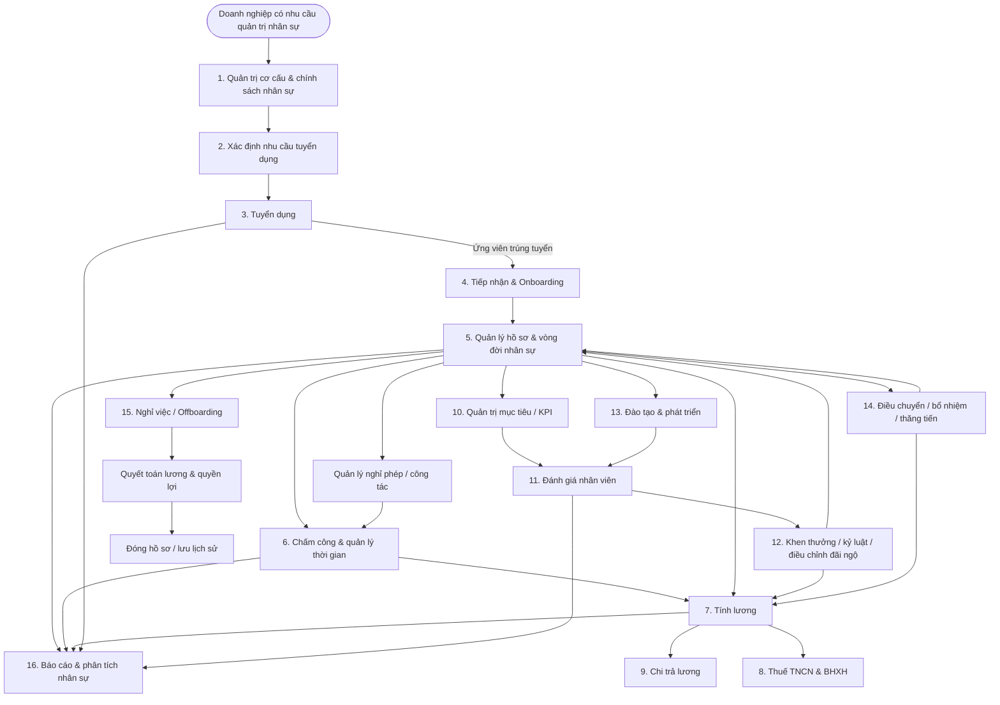

---

# 2. Danh mục Business Process

| ID | Domain | Business Process | Mục tiêu |
|---|---|---|---|
| BP-01 | Organization | Quản trị cơ cấu & chính sách | Thiết lập nền tảng tổ chức và chính sách HR |
| BP-02 | Recruitment | Xác định nhu cầu tuyển dụng | Xác định nhu cầu và kế hoạch tuyển |
| BP-03 | Recruitment | Tuyển dụng | Quản lý toàn bộ vòng đời ứng viên |
| BP-04 | Employee Lifecycle | Tiếp nhận & Onboarding | Chuyển ứng viên thành nhân viên |
| BP-05 | Employee Lifecycle | Quản lý hồ sơ nhân sự | Quản lý thông tin và lịch sử nhân viên |
| BP-06 | Time Management | Chấm công | Ghi nhận và tổng hợp thời gian làm việc |
| BP-07 | Time Management | Nghỉ phép / công tác / OT | Quản lý các đề nghị liên quan thời gian |
| BP-08 | Payroll | Tính lương | Tính và chốt bảng lương |
| BP-09 | Compliance | BHXH & Thuế TNCN | Quản lý nghĩa vụ bảo hiểm và thuế |
| BP-10 | Performance | Quản trị mục tiêu / KPI | Thiết lập và theo dõi mục tiêu |
| BP-11 | Performance | Đánh giá nhân viên | Đánh giá kết quả nhân viên |
| BP-12 | L&D | Đào tạo & phát triển | Quản lý nhu cầu và kết quả đào tạo |
| BP-13 | Reward | Khen thưởng / kỷ luật | Ghi nhận thành tích và vi phạm |
| BP-14 | Career | Điều chuyển / bổ nhiệm / thăng chức | Quản lý thay đổi vị trí nhân sự |
| BP-15 | Offboarding | Nghỉ việc | Hoàn tất thủ tục khi nhân viên nghỉ |
| BP-16 | Analytics | Báo cáo & phân tích | Cung cấp dữ liệu quản trị |

---

# 3. BP-01 – Quản trị cơ cấu & chính sách

## 3.1 Process Flow

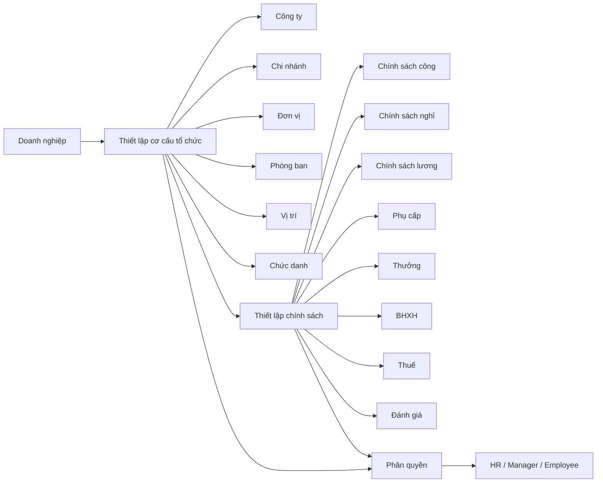

## 3.2 Input

- Cơ cấu tổ chức
- Danh sách phòng ban
- Chức danh
- Vị trí
- Chính sách nhân sự

## 3.3 Output

- Organization
- Department
- Position
- Job Title
- HR Policy
- Permission

---

# 4. BP-02 – Xác định nhu cầu tuyển dụng

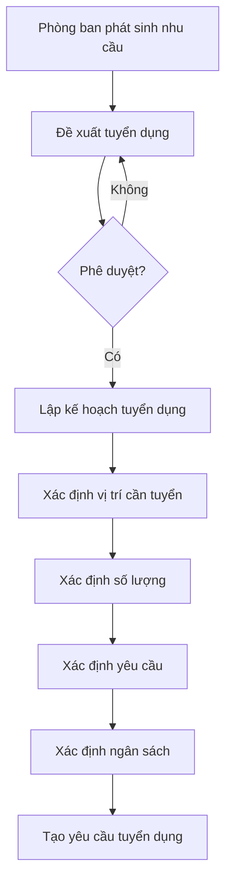

### Actor

- Hiring Manager
- HR
- Approver

### Input

- Vị trí cần tuyển
- Số lượng
- Yêu cầu tuyển dụng
- Thời gian
- Ngân sách

### Output

- Recruitment Request
- Recruitment Plan

---

# 5. BP-03 – Tuyển dụng

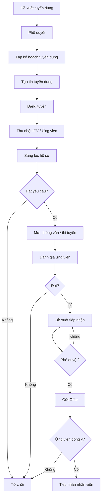

### Actor

| Actor | Vai trò |
|---|---|
| HR | Quản lý tuyển dụng |
| Hiring Manager | Đề xuất nhu cầu |
| Interviewer | Đánh giá ứng viên |
| Candidate | Ứng tuyển |
| Approver | Phê duyệt |

### Output

- Candidate
- Interview Result
- Evaluation Result
- Offer
- Recruitment Result

---

# 6. BP-04 – Tiếp nhận & Onboarding

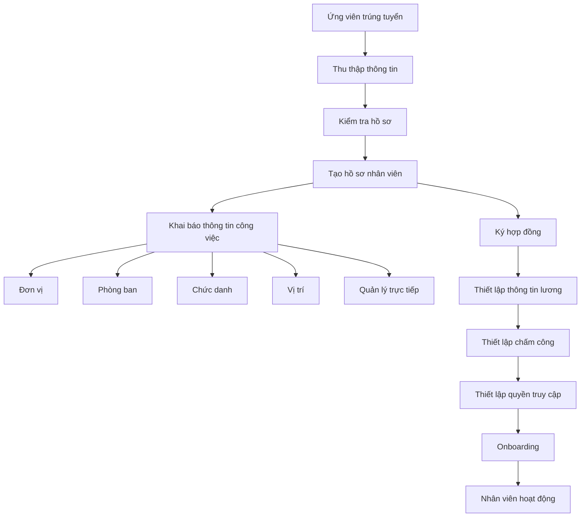

### Key Data

- Employee Profile
- Employment Information
- Contract
- Salary
- Department
- Position
- Manager
- Attendance Configuration
- User Account

---

# 7. BP-05 – Quản lý hồ sơ & vòng đời nhân sự

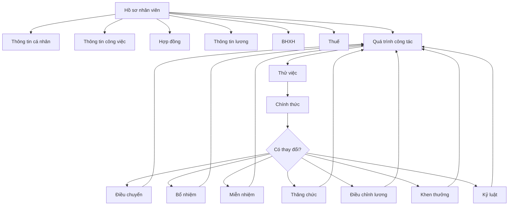

### Nguyên tắc

Mọi thay đổi quan trọng của nhân viên nên tạo **lịch sử biến động**, thay vì ghi đè dữ liệu cũ.

---

# 8. BP-06 – Chấm công

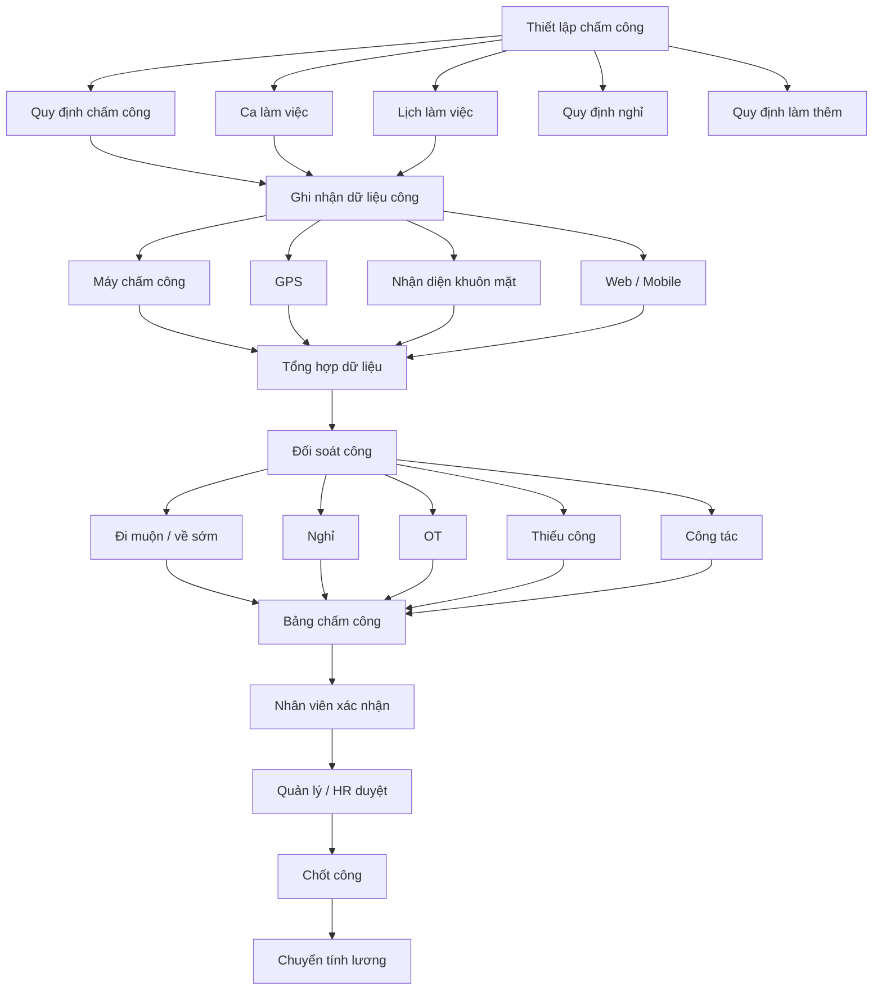

### Input

- Dữ liệu chấm công
- Ca làm
- Lịch làm
- Đơn nghỉ
- Đơn OT
- Công tác

### Output

- Attendance Record
- Timesheet
- Overtime
- Leave Data
- Payroll Input

---

# 9. BP-07 – Nghỉ phép / Công tác / OT

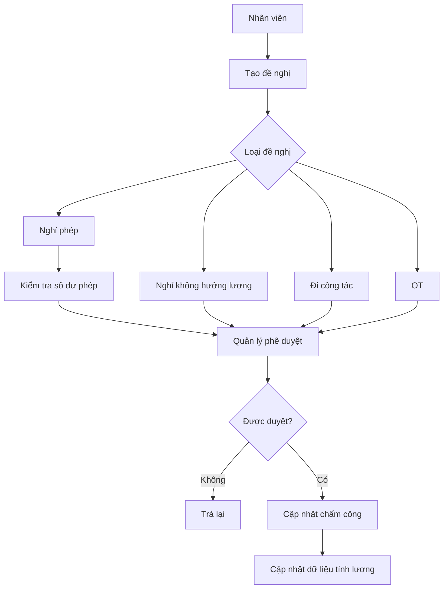

### Business Rules cần xác định

- Ai được tạo đề nghị?
- Ai phê duyệt?
- Có cần phê duyệt nhiều cấp không?
- Kiểm tra số dư phép ở thời điểm nào?
- Có cho phép âm phép không?
- OT cần điều kiện gì?
- OT có giới hạn theo ngày/tháng không?
- Đơn đã duyệt có được sửa/hủy không?

---

# 10. BP-08 – Tính lương

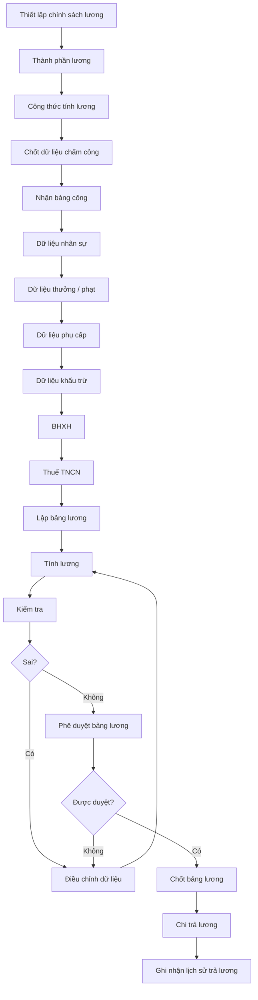

### Payroll Input

- Employee
- Salary
- Attendance
- Leave
- OT
- Allowance
- Bonus
- Penalty
- Insurance
- PIT
- Deduction

### Payroll Output

- Payroll Sheet
- Payslip
- Net Salary
- Payment Data
- Payroll History

---

# 11. BP-09 – BHXH & Thuế TNCN

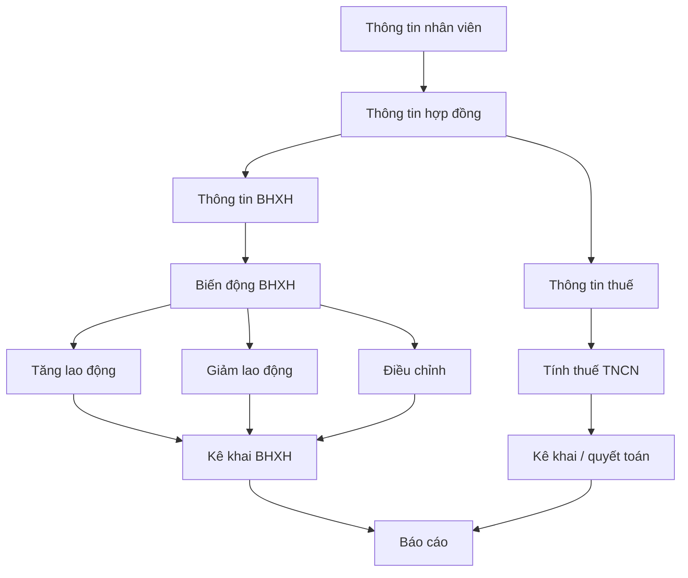

---

# 12. BP-10 – Quản trị mục tiêu / KPI

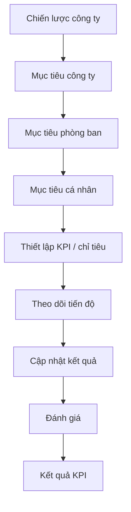

---

# 13. BP-11 – Đánh giá nhân viên

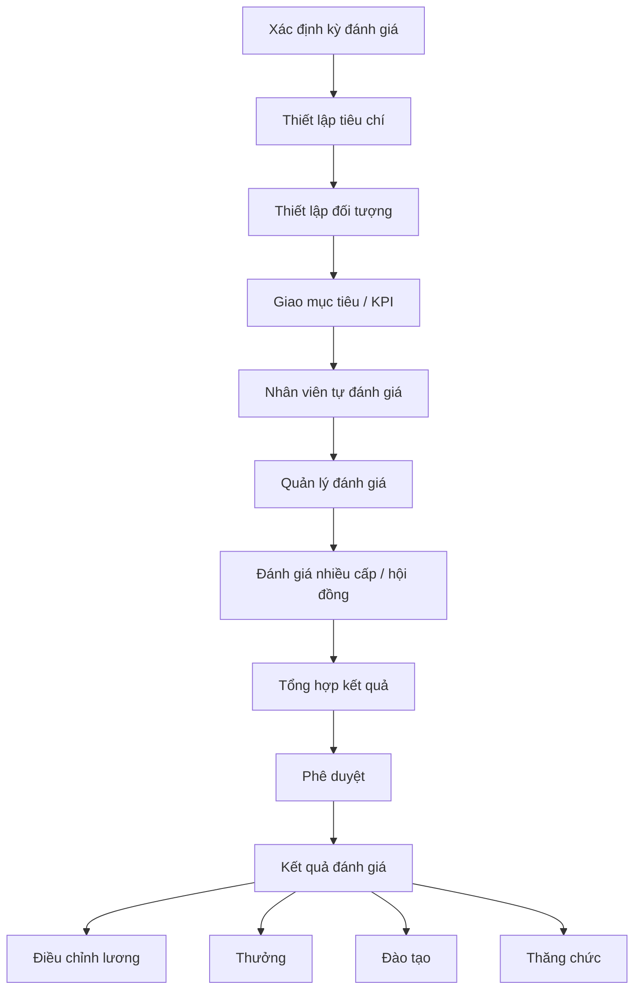

---

# 14. BP-12 – Đào tạo & phát triển

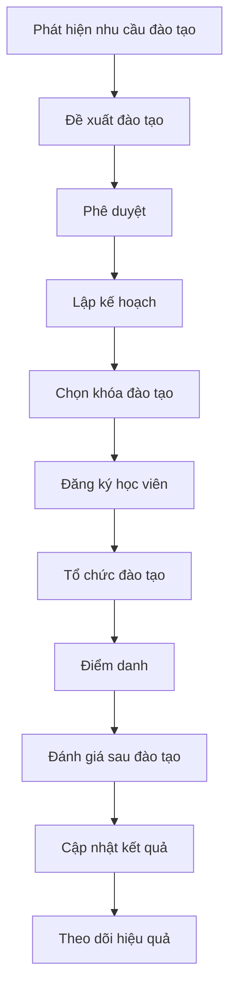

---

# 15. BP-13 – Khen thưởng / Kỷ luật

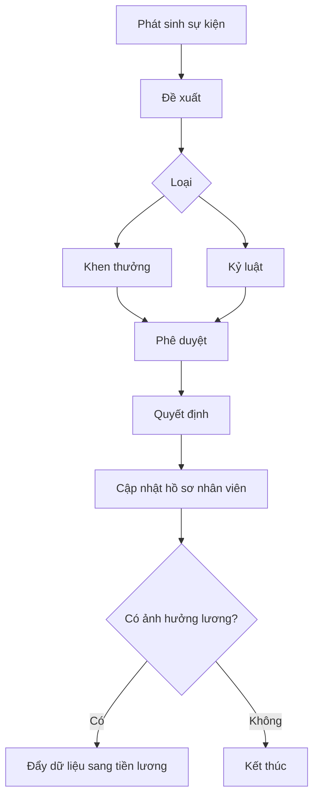

---

# 16. BP-14 – Điều chuyển / Bổ nhiệm / Thăng chức

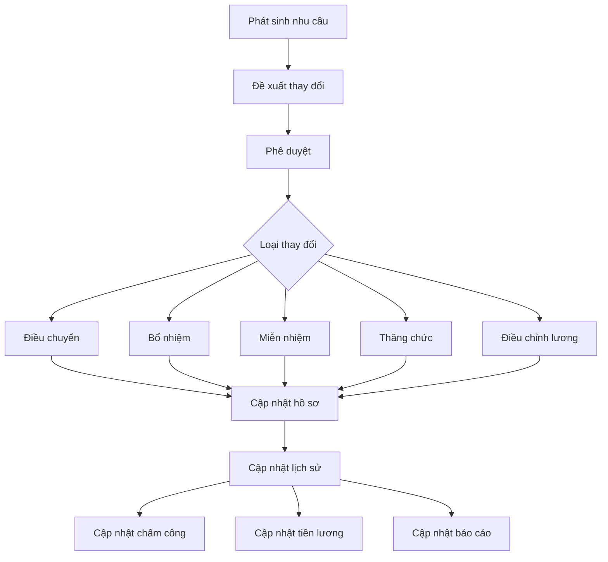

---

# 17. BP-15 – Nghỉ việc / Offboarding

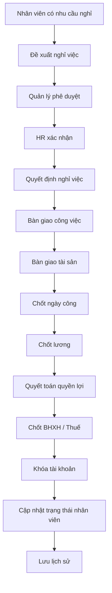

### Các vấn đề cần xử lý

- Ngày nghỉ chính thức
- Thời gian báo trước
- Bàn giao công việc
- Bàn giao tài sản
- Công còn thiếu
- Phép còn dư
- Lương chưa thanh toán
- Thưởng/phạt
- BHXH
- Thuế
- Khóa tài khoản
- Thu hồi quyền truy cập

---

# 18. BP-16 – Báo cáo & HR Analytics

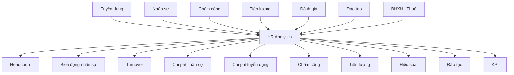

---

# 19. End-to-End Integration Map

Đây là phần quan trọng nhất khi benchmark MISA HRM.

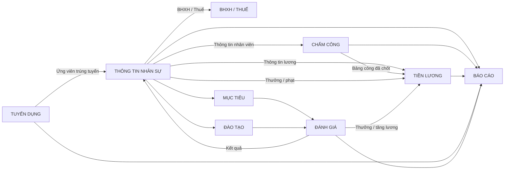

---

# 20. Các domain chính

| Domain | Module | Core Process |
|---|---|---|
| A | Workforce Planning | Organization, Position, Job |
| B | Talent Acquisition | Requisition → Candidate → Interview → Offer |
| C | Employee Lifecycle | Onboarding → Employee → Contract → Transfer → Promotion → Offboarding |
| D | Time Management | Shift → Attendance → Leave → OT → Timesheet |
| E | Payroll | Payroll Input → Calculation → Approval → Payment |
| F | Performance | Goal → KPI → Evaluation → Result |
| G | Learning & Development | Training Need → Course → Attendance → Result |
| H | Reward & Compliance | Reward → Insurance → PIT → Benefits |

---

# 21. Core Master Data

HRM cần xác định rõ các nhóm master data sau:

| Nhóm | Dữ liệu |
|---|---|
| Organization | Company, Branch, Department, Unit |
| Job | Job, Position, Job Title |
| Employee | Employee Profile |
| Contract | Contract Type, Contract |
| Salary | Salary Grade, Salary Component |
| Attendance | Shift, Work Schedule |
| Leave | Leave Type, Leave Policy |
| Payroll | Payroll Component, Formula |
| Performance | Goal, KPI, Evaluation Criteria |
| Training | Course, Training Type |
| Reward | Reward Type, Discipline Type |
| Compliance | Insurance, Tax |
| Security | Role, Permission, Approval Matrix |

---

# 22. Các luồng dữ liệu quan trọng

## 22.1 Recruitment → Employee

```text
Recruitment
    ↓
Candidate
    ↓
Interview
    ↓
Evaluation
    ↓
Offer
    ↓
Accepted
    ↓
Employee
```

## 22.2 Employee → Attendance → Payroll

```text
Employee
    ↓
Work Schedule
    ↓
Attendance
    ↓
Timesheet
    ↓
Approved Timesheet
    ↓
Payroll
```

## 22.3 Performance → Reward → Payroll

```text
Goal
    ↓
KPI
    ↓
Evaluation
    ↓
Evaluation Result
    ↓
Bonus / Salary Adjustment
    ↓
Payroll
```

## 22.4 Employee → Offboarding

```text
Employee
    ↓
Resignation Request
    ↓
Approval
    ↓
Handover
    ↓
Attendance Closing
    ↓
Payroll Closing
    ↓
Benefits Settlement
    ↓
Account Deactivation
    ↓
Employee Inactive
```

---

# 23. Approval Matrix – cần nghiên cứu sâu

Khi phân tích MISA HRM, cần xác định approval cho từng nghiệp vụ:

| Process | Người tạo | Người duyệt | Có thể nhiều cấp? |
|---|---|---|---|
| Recruitment Request | Manager | HR / Director | Có |
| Leave Request | Employee | Manager | Có |
| OT Request | Employee | Manager | Có |
| Business Trip | Employee | Manager | Có |
| Payroll | HR | Manager / Director | Có |
| Salary Adjustment | HR / Manager | Director | Có |
| Promotion | Manager / HR | Director | Có |
| Transfer | Manager / HR | Director | Có |
| Training | HR | Manager | Có |
| Evaluation | Employee / Manager | Manager / HR | Có |
| Resignation | Employee | Manager / HR | Có |
| Reward | Manager / HR | Director | Có |
| Discipline | Manager / HR | Director | Có |

---

# 24. Business Rule cần bóc khi làm BA

Business Process Map chỉ mô tả **WHAT/HOW** ở mức tổng quan. Khi chuyển thành BRD/SRS cần bóc tiếp:

### Recruitment

- Điều kiện tạo yêu cầu tuyển dụng
- Hạn mức tuyển dụng
- Quy trình phê duyệt
- Điều kiện ứng viên đạt
- Điều kiện gửi Offer
- Điều kiện chuyển Candidate → Employee

### Employee

- Mã nhân viên
- Trạng thái nhân viên
- Ngày hiệu lực
- Lịch sử thay đổi
- Điều kiện sửa/xóa hồ sơ

### Attendance

- Quy định đi muộn
- Về sớm
- Thiếu công
- OT
- Ca qua ngày
- Ca đêm
- Ngày lễ
- Ngày nghỉ
- Cách làm tròn thời gian

### Leave

- Số ngày phép
- Loại phép
- Số dư phép
- Điều kiện đăng ký
- Phê duyệt
- Hủy đơn
- Chuyển phép

### Payroll

- Công thức lương
- Gross / Net
- Allowance
- Bonus
- Deduction
- OT
- Insurance
- PIT
- Làm tròn
- Kỳ lương
- Chốt lương
- Recalculate

### Performance

- Kỳ đánh giá
- Tiêu chí
- KPI
- Trọng số
- Người đánh giá
- Điểm đánh giá
- Xếp loại
- Điều chỉnh lương/thưởng

### Offboarding

- Ngày nghỉ
- Notice period
- Bàn giao
- Chốt công
- Chốt lương
- Phép còn dư
- BHXH
- Khóa tài khoản

---

# 25. BA Breakdown – từ Process Map → Jira

Có thể chuyển Business Process thành cấu trúc Jira:

```text
EPIC: HRM – Recruitment

    STORY: Recruitment Request
        TASK: Define recruitment request fields
        TASK: Define approval flow
        TASK: Define recruitment business rules

    STORY: Candidate Management
        TASK: Candidate profile
        TASK: Candidate pipeline
        TASK: Candidate status

    STORY: Interview
        TASK: Interview scheduling
        TASK: Interview evaluation

    STORY: Offer
        TASK: Offer creation
        TASK: Offer approval
        TASK: Candidate acceptance

    STORY: Candidate → Employee
        TASK: Employee conversion
        TASK: Data mapping
        TASK: Validation
```

Tương tự:

```text
EPIC: HRM – Employee
EPIC: HRM – Attendance
EPIC: HRM – Leave
EPIC: HRM – Payroll
EPIC: HRM – Performance
EPIC: HRM – Training
EPIC: HRM – Reward & Discipline
EPIC: HRM – Insurance & Tax
EPIC: HRM – Offboarding
EPIC: HRM – Reporting
```

---

# 26. Cấu trúc tài liệu BA nên làm tiếp

Sau Business Process Map này, nên phát triển thành:

```text
01. Business Process Map
        ↓
02. Business Process Catalog
        ↓
03. Actor & Role Matrix
        ↓
04. Approval Matrix
        ↓
05. Business Rules
        ↓
06. Use Case
        ↓
07. Data Model / ERD
        ↓
08. API / Integration Requirement
        ↓
09. User Story
        ↓
10. Acceptance Criteria
        ↓
11. Test Scenario
        ↓
12. UAT Test Case
```

## 26.1 Công thức BA

```text
Business Process
        ↓
Sub-process
        ↓
Use Case
        ↓
Business Rule
        ↓
User Story
        ↓
Acceptance Criteria
        ↓
Test Scenario
```

---

# 27. Kết luận

Mô hình HRM nên được nhìn theo **Employee Lifecycle**, thay vì chia module một cách độc lập:

```text
WORKFORCE PLANNING
        ↓
RECRUITMENT
        ↓
ONBOARDING
        ↓
EMPLOYEE MANAGEMENT
        ↓
ATTENDANCE / LEAVE
        ↓
PAYROLL
        ↓
PERFORMANCE
        ↓
TRAINING / DEVELOPMENT
        ↓
REWARD / CAREER
        ↓
OFFBOARDING
```

Trong đó **Employee Master Data** là trung tâm, còn:

```text
Recruitment
     ↓
Employee
 ↙   ↓   ↘
Attendance  Performance  Training
     ↓        ↓
   Payroll ← Reward
     ↓
  Reports
```

là các luồng liên thông cốt lõi cần đặc biệt quan tâm khi thiết kế HRM.
