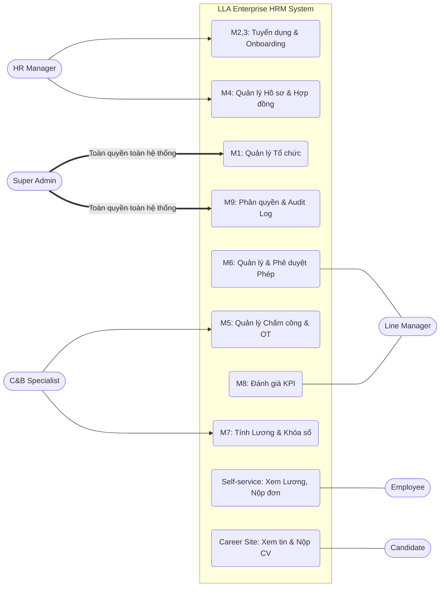

# BÁO CÁO ĐỒ ÁN
## HỆ THỐNG QUẢN TRỊ NGUỒN NHÂN LỰC CHUYÊN SÂU DÀNH CHO CÔNG TY TNHH LLA (ENTERPRISE HRM PORTAL)

---

## Chương 1. GIỚI THIỆU ĐỀ TÀI

### 1.1. Lý do chọn đề tài
Trong bối cảnh chuyển đổi số, nhân sự là tài sản quý giá nhất của mỗi tổ chức. Tuy nhiên, việc quản lý nhân sự tại Công ty TNHH LLA hiện nay vẫn đang gặp phải các nút thắt lớn:
- **Dữ liệu phân mảnh:** Hồ sơ nhân viên, hợp đồng, bảng công được lưu trữ rời rạc trên nhiều file Excel, Google Sheets hoặc tin nhắn Zalo, dẫn đến việc khó tra cứu và không đồng bộ.
- **Quy trình thủ công dễ sai sót:** Việc tính toán công, phép, lương thưởng và đối soát dữ liệu từ máy chấm công mất rất nhiều thời gian của bộ phận C&B, tiềm ẩn rủi ro sai lệch tài chính.
- **Thiếu tính minh bạch và bảo mật:** Không có cơ chế lưu vết (Audit Log) các thay đổi nhạy cảm (như sửa mức lương), đồng thời nhân viên cũng không có một kênh chính thức để tự theo dõi quỹ phép hay phiếu lương của mình.

Do đó, việc xây dựng một hệ thống **Enterprise HRM Portal** là yêu cầu cấp thiết để tập trung hóa dữ liệu, chuẩn hóa quy trình tự động và quản trị rủi ro pháp lý/tài chính cho Công ty TNHH LLA.

### 1.2. Mục tiêu của đề tài
- **Tập trung hóa:** Số hóa 100% dữ liệu nhân sự cốt lõi lên một nền tảng duy nhất (Single Source of Truth).
- **Tự động hóa:** Giảm thiểu thao tác thủ công trong quy trình chấm công, tính lương và xử lý đơn từ.
- **Quản trị rủi ro:** Cảnh báo tự động các hợp đồng sắp hết hạn và cung cấp cơ chế khóa (Lock) dữ liệu kỳ lương để bảo vệ tính toàn vẹn.
- **Trải nghiệm người dùng:** Xây dựng cổng tự phục vụ (Self-service portal) giúp nhân viên chủ động tra cứu thông tin cá nhân và nộp đơn từ trực tuyến.

### 1.3. Phạm vi dự án (In/Out Scope)
**Trong phạm vi (In Scope):**
- Quản lý Cơ cấu tổ chức (Phòng ban, Chức danh).
- Quản lý Tuyển dụng (Phễu ứng viên) và Hội nhập (Onboarding).
- Quản lý Hồ sơ, Hợp đồng lao động của nhân sự.
- Quản lý Chấm công, Nghỉ phép và Điều chỉnh công.
- Quản lý Tiền lương (Chốt kỳ lương, phiếu lương).
- Phân quyền người dùng (RBAC) và Nhật ký hệ thống (Audit Log).

**Ngoài phạm vi (Out Scope):**
- Phân hệ Kế toán tài chính, ERP tổng thể.
- Phân hệ Đào tạo và Phát triển (L&D).
- Ứng dụng điện thoại gốc (Native Mobile App).

### 1.4. Phương pháp thực hiện
- **Nghiên cứu tài liệu:** Thu thập yêu cầu từ thực tế nghiệp vụ HR và C&B của Công ty TNHH LLA. Xây dựng tài liệu Yêu cầu nghiệp vụ (BRD) chuẩn Enterprise.
- **Phân tích và thiết kế:** Mô hình hóa các quy trình nghiệp vụ (Business Process), phân tích Use Case và thiết kế giao diện (UI/UX) bám sát trải nghiệm người dùng.
- **Phương pháp phát triển:** Áp dụng mô hình Agile/Scrum, chia nhỏ các phân hệ (Module) để lập trình và kiểm thử lặp đi lặp lại.

---

## Chương 2. PHÂN TÍCH HỆ THỐNG

### 2.1. Yêu cầu chức năng chi tiết

Hệ thống được thiết kế với quy mô Enterprise, bao gồm **6 nhóm người dùng (Actors)**, phân bổ trên **3 Cổng (Portals)**, quản lý **9 Module chức năng** và xử lý **9 Quy trình nghiệp vụ cốt lõi**.

**A. 6 Nhóm Người dùng (Actors):**
1. **Super Admin (Quản trị cấp cao):** Tài khoản có quyền lực cao nhất, toàn quyền thao tác trên mọi phân hệ (Nhân sự, Lương, Phân quyền) và là người duy nhất giám sát Audit Log, xử lý các ngoại lệ (VD: Mở khóa bảng lương).
2. **HR Manager (Quản lý Nhân sự):** Vận hành vòng đời nhân sự, tuyển dụng, hợp đồng.
3. **C&B Specialist (Chuyên viên Lương thưởng):** Xử lý bảng công, chốt kỳ tính lương.
4. **Line Manager (Trưởng phòng):** Đánh giá nhân viên, duyệt đơn từ của phòng ban.
5. **Employee (Nhân viên nội bộ):** Người dùng cuối, tự xem phiếu lương, nộp đơn từ.
6. **Candidate (Ứng viên):** Người bên ngoài ứng tuyển vào các vị trí của công ty.

**B. 3 Cổng giao tiếp dự kiến (Portals):**
1. **Enterprise Portal:** Dành riêng cho Ban Giám đốc Công ty TNHH LLA, Admin, HR, C&B và Trưởng phòng để quản trị tổng thể.
2. **Employee Portal:** Cổng tự phục vụ (Self-service) dành cho nhân viên nội bộ tra cứu thông tin cá nhân.
3. **Candidate Portal:** Trang tuyển dụng ngoài (Careers site) để ứng viên xem tin tuyển dụng và nộp CV vào LLA.

**C. Phân rã chi tiết chức năng con của 9 Module nghiệp vụ:**

Để hệ thống hoạt động trơn tru theo chuẩn Enterprise, mỗi module được chia nhỏ thành các chức năng (Sub-features) cụ thể như sau:

**1. Module Organization (Quản lý cơ cấu tổ chức)**
- *Quản lý sơ đồ phòng ban (Department Tree):* Thêm/sửa/xóa phòng ban theo cấu trúc hình cây cấp bậc.
- *Quản lý chức danh (Job Titles):* Tạo danh mục chức danh, cấp bậc (Level) và mô tả công việc.
- *Quản lý định biên nhân sự (Headcount):* Theo dõi số lượng nhân sự thực tế so với kế hoạch (Quota).

**2. Module Recruitment (Tuyển dụng - ATS)**
- *Quản lý tin tuyển dụng (Job Postings):* Đăng tải và quản lý các vị trí đang mở.
- *Quản lý phễu ứng viên (Hybrid Pipeline):* Kết hợp 2 chế độ hiển thị: Dạng Bảng (List View) để chọn và loại hàng loạt CV ở vòng gửi hồ sơ; và Dạng Kanban (Kéo thả) để quản lý trực quan ở các vòng phỏng vấn sâu. Hỗ trợ tự động chuyển trạng thái khi gửi email.
- *Cổng ứng tuyển (Candidate Portal):* Trang dành riêng cho ứng viên nộp CV và tra cứu trạng thái.

**3. Module Onboarding (Hội nhập nhân sự)**
- *Chuyển đổi hồ sơ tự động (Convert to Employee):* Khi ứng viên nhận Offer, hệ thống tự động đẩy dữ liệu (Tên, CV) từ ATS sang tạo thành Profile Nhân sự (tránh nhập liệu 2 lần). Lưu ý: Đây chỉ là bước tạo "vỏ" hồ sơ, chưa phải là nhân viên chính thức.
- *Xử lý ngoại lệ ứng viên bùng việc (No Show):* Tự động thu hồi tài khoản, hủy hồ sơ nháp và hủy Onboarding nếu ứng viên đã nhận Offer nhưng không đến làm việc.
- *Quản lý Checklist hội nhập:* Tạo danh sách công việc cần làm khi nhân viên mới vào (VD: cấp máy tính, tạo email, bàn giao thẻ).

**4. Module Employee Management (Quản lý hồ sơ nhân sự)**
- *Hồ sơ nhân viên (Employee Profile):* Quản lý thông tin cá nhân, CCCD, bằng cấp, thông tin tài khoản ngân hàng. Mỗi nhân viên được gắn cố định với 1 chức danh và 1 phòng ban duy nhất để tối ưu hóa việc quản lý.
- *Quản lý luồng hợp đồng (Contract Lifecycle):* Phân loại trạng thái nhân sự bằng hợp đồng (Hợp đồng Thử việc ➜ Đánh giá Đạt ➜ Hợp đồng Chính thức). Hệ thống dựa vào loại hợp đồng này để quyết định có khấu trừ BHXH khi tính lương hay không.
- *Cảnh báo hợp đồng tự động:* Hệ thống tự động highlight cảnh báo đối với các hợp đồng sắp hết hạn ($\le$ 30 ngày) để HR kịp thời tái ký hoặc chấm dứt.

**5. Module Time & Attendance (Quản lý chấm công)**
- *Ghi nhận giờ công:* Nhận dữ liệu chấm công IN/OUT thực tế hàng ngày. Xử lý logic phạt đi muộn/về sớm bằng cách cộng dồn quy đổi thành "Nghỉ không hưởng lương" (Unpaid Leave) để tuân thủ pháp luật lao động.
- *Bảng công chi tiết:* Hiển thị trực quan dữ liệu đi muộn, về sớm theo từng ngày.
- *Quản lý đơn điều chỉnh công & OT:* Nhân viên nộp đơn làm thêm giờ hoặc điều chỉnh công qua Portal. Hệ thống tự động đối soát giờ OT thực tế so với giờ xin phép (Min Reconcile).

**6. Module Leave Management (Quản lý nghỉ phép)**
- *Quản lý quỹ phép (Leave Balance):* Cấp phát quỹ phép đầu năm, tự động cộng phép thâm niên. Áp dụng cơ chế FIFO (First-In, First-Out) để ưu tiên tiêu thụ phép tồn của năm cũ trước.
- *Truy thu phép âm (Clawback):* Tự động khấu trừ vào lương tháng cuối nếu nhân viên nghỉ việc khi đã dùng quá số phép được hưởng theo tỷ lệ tháng làm việc.
- *Nộp đơn nghỉ phép:* Nhân viên chọn ngày, lý do trên form trực tuyến.
- *Ủy quyền duyệt đơn (Delegation):* Line Manager có thể ủy quyền duyệt đơn cho người khác khi đi công tác, hệ thống tự động chuyển hướng đơn từ.
- *Duyệt đơn và cấn trừ:* Line Manager duyệt đơn, hệ thống tự động tính toán trừ vào quỹ phép cá nhân.

**7. Module Payroll (Quản lý tiền lương)**
- *Tổng hợp công & phép:* Tự động đổ số liệu chốt từ module Attendance & Leave sang.
- *Tính toán lương (Gross to Net):* Áp dụng công thức tính lương cơ bản, tính thuế TNCN lũy tiến, khấu trừ BHXH.
- *Chốt kỳ lương (Lock Payroll):* Chức năng tối quan trọng dành cho C&B để "Khóa sổ", tự động chặn mọi thao tác sửa đổi công/phép của tháng đó nhằm bảo vệ số liệu tài chính.
- *Mở khóa khẩn cấp (Emergency Unlock):* Cung cấp cơ chế mở khóa bảng lương dành riêng cho Super Admin khi gặp sự cố tính toán diện rộng, đi kèm ghi nhận bắt buộc vào Audit Log.
- *Phiếu lương cá nhân (Payslip):* Nhân viên tự xem phiếu lương chi tiết của mình trên Employee Portal một cách bảo mật.

**8. Module Performance (Đánh giá hiệu suất)**
- *Quản lý biểu mẫu KPI:* Tạo form đánh giá định kỳ theo Tháng/Quý/Năm.
- *Thực hiện đánh giá:* Trưởng phòng chấm điểm nhân viên cấp dưới dựa trên các tiêu chí năng lực.

**9. Module System Admin (Quản trị hệ thống)**
- *Quản lý Tài khoản & Phân quyền (RBAC):* Cấp tài khoản, gán Role (VD: HR, C&B, Manager) với các quyền hạn cụ thể (Xem/Thêm/Sửa/Xóa).
- *Nhật ký hệ thống (Audit Log):* Tự động ghi vết mọi hành động nhạy cảm (VD: Sửa lương, sửa quyền) gồm IP, thời gian, giá trị cũ/mới. Đặc biệt, bản ghi log này không được phép xóa (No Delete).

### 2.2. Usecase Tổng quát

Dưới đây là sơ đồ Usecase thể hiện các luồng tương tác chính của các Actor với hệ thống:

---

## Chương 3. THIẾT KẾ HỆ THỐNG

### 3.1. Ngôn ngữ và Công nghệ sử dụng
Hệ thống được thiết kế theo kiến trúc hiện đại, phân tách rõ ràng giữa Frontend và Backend, đáp ứng khả năng mở rộng của một nền tảng Enterprise.

**A. Frontend (Giao diện người dùng):**
- **Framework:** **ReactJS (khởi tạo bằng Vite)** để tối ưu tốc độ build và hiệu suất.
- **Styling:** **TailwindCSS**. Đảm bảo tính tùy biến cao, tạo ra các thiết kế hiện đại, mượt mà (Glassmorphism, animations) mà không cần code CSS thuần quá nhiều.
- **State Management:** **Zustand** hoặc **Context API** (Quản lý trạng thái nhẹ, linh hoạt hơn Redux).

**B. Backend (Xử lý logic & CSDL):**
- **Ngôn ngữ & Framework:** **Node.js (với Express framework)**. Sự đồng nhất ngôn ngữ (JavaScript) giữa Frontend và Backend giúp đẩy nhanh tốc độ phát triển.
- **ORM (Giao tiếp CSDL):** **Prisma ORM** để tối ưu hóa các câu truy vấn và tự động tạo Schema.
- **Cơ sở dữ liệu:** **PostgreSQL (Relational DB)**. Đây là lựa chọn bắt buộc để đảm bảo tính toàn vẹn dữ liệu (ACID) cho các phân hệ nhạy cảm có quan hệ chằng chịt như Lương, Phép, Hợp đồng và Audit Log.

### 3.2. Lộ trình Triển khai Dự án (SDLC Roadmap)
Để đảm bảo dự án đi đúng hướng theo chuẩn công nghiệp (Software Development Life Cycle), hệ thống sẽ được thực hiện theo 4 giai đoạn chính: từ Phân tích nghiệp vụ đến khi Đóng gói code.

- **Giai đoạn 1: Phân tích Nghiệp vụ & Thiết kế Hệ thống (Analysis & Design)**
  - Thu thập yêu cầu thực tế và viết tài liệu Yêu cầu nghiệp vụ (BRD).
  - Vẽ sơ đồ Usecase và chuẩn hóa các luồng quy trình (Flowchart).
  - Phân tích và thiết kế Schema Cơ sở dữ liệu (PostgreSQL) cho 9 module lõi.
  - Thiết kế kiến trúc phần mềm (Frontend, Backend, Phân quyền).

- **Giai đoạn 2: Khởi tạo Nền móng & Core HR (Foundation & Core HR)**
  - Dựng Base Backend (Node.js + Prisma) và kết nối Database PostgreSQL.
  - Dựng Base Frontend (ReactJS + Tailwind) và layout Dashboard chính.
  - Xây dựng hệ thống Đăng nhập/Đăng xuất (Authentication JWT) và RBAC.
  - Code chức năng Quản lý Tổ chức (Sơ đồ công ty) và Hồ sơ nhân sự (Nhân viên, Hợp đồng).

- **Giai đoạn 3: Phát triển "Trái tim" hệ thống (Time, Leave, Payroll)**
  - Code Module Chấm công (Xử lý logic 0.5 công, phạt đi muộn).
  - Code Module Nghỉ phép (Cơ chế FIFO, Ủy quyền duyệt đơn).
  - Code Module Tiền lương (Hút dữ liệu công & phép, tính toán Gross to Net, Truy thu phép âm).

- **Giai đoạn 4: Mở rộng nghiệp vụ & Đóng gói (Recruitment, Audit Log)**
  - Code luồng Tuyển dụng (Kanban pipeline) và Cổng ứng viên (Career Site).
  - Bổ sung Audit Log ngầm cho các thao tác nhạy cảm.
  - Chỉnh trang UI/UX và Kiểm thử (Testing) toàn bộ luồng nghiệp vụ.
  - Báo cáo nghiệm thu và đóng gói sản phẩm.
