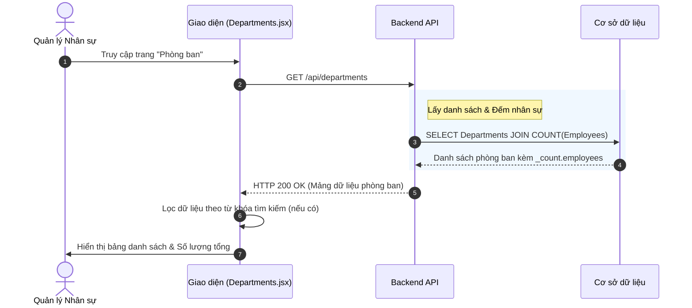
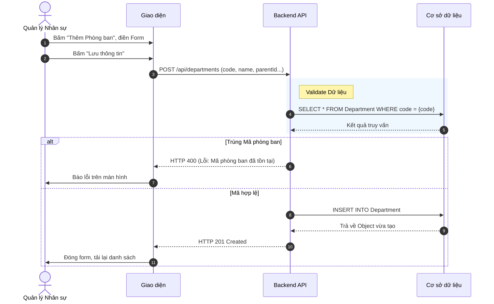
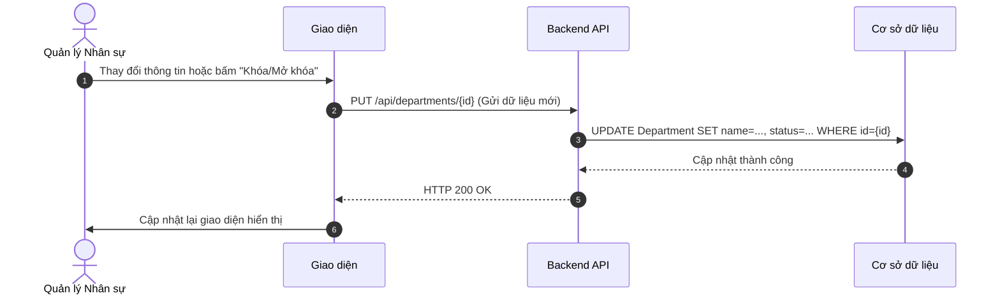
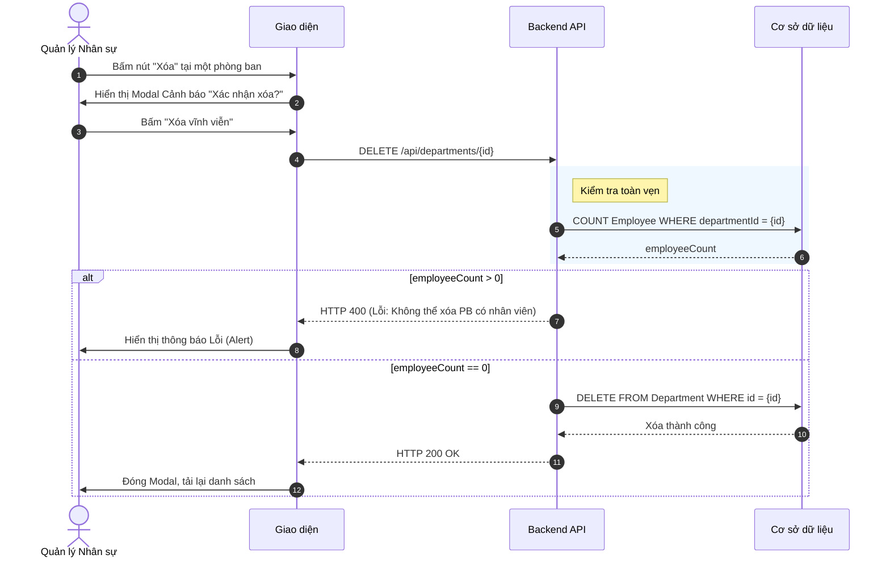

# Đặc tả chức năng: Quản lý Phòng ban (Department Management)

## 1. Giới thiệu chức năng
Chức năng cho phép người dùng (thường là Quản lý nhân sự - HR Manager) thiết lập, cập nhật và xóa bỏ các phòng ban trong cơ cấu tổ chức của doanh nghiệp. Hệ thống hỗ trợ mô hình phòng ban đa cấp (Cây cha - con).

## 2. Các quy tắc nghiệp vụ cốt lõi
- **Toàn vẹn dữ liệu (Logic Xóa):** Không được phép xóa một phòng ban nếu phòng ban đó đang có nhân sự trực thuộc hoặc có phòng ban con bên trong nó.
- **Mã phòng ban (Code):** Phải là duy nhất trên toàn hệ thống.
- **Tính toán Headcount:** Hệ thống sẽ tự động tổng hợp số lượng nhân sự trực thuộc (dựa vào việc đếm số nhân viên thuộc phòng ban đó).

## 3. Sơ đồ luồng chi tiết (Sequence Diagrams)

### 3.1. Luồng Xem danh sách Phòng ban
Hiển thị toàn bộ phòng ban kèm theo số lượng nhân viên hiện tại của mỗi phòng.

### 3.2. Luồng Thêm mới Phòng ban
Cho phép khai báo phòng ban độc lập hoặc phòng ban con (chọn Parent ID).

### 3.3. Luồng Cập nhật / Đổi trạng thái Phòng ban
Dùng cho cả thao tác sửa thông tin (Tên, Mã, Người đại diện) và Khóa/Mở khóa hoạt động.

### 3.4. Luồng Xóa Phòng ban
Ràng buộc tính toàn vẹn dữ liệu trước khi xóa vĩnh viễn.

