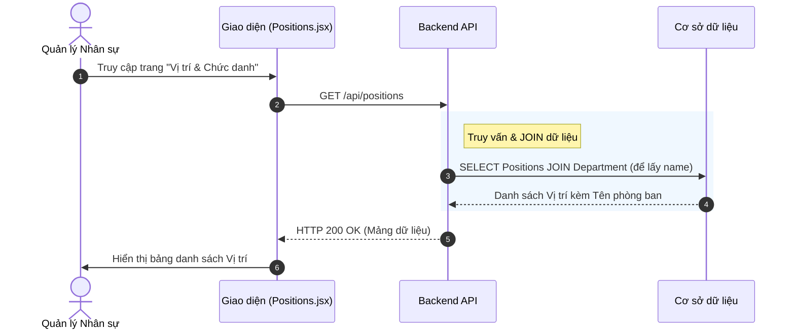
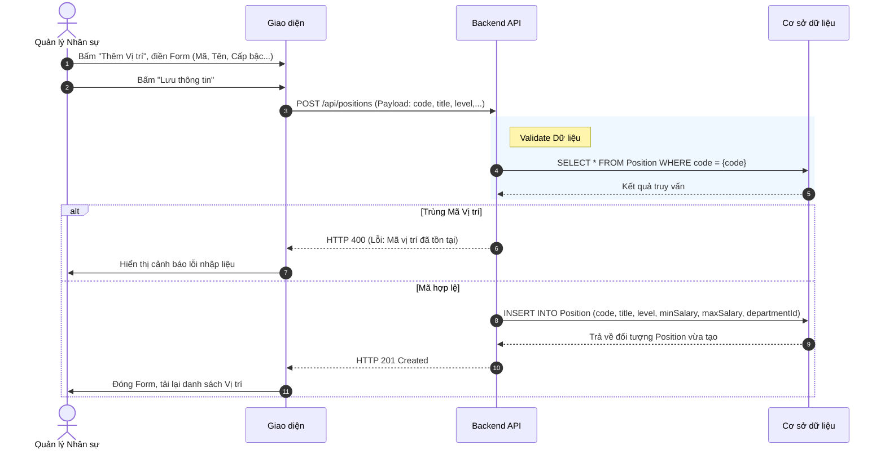
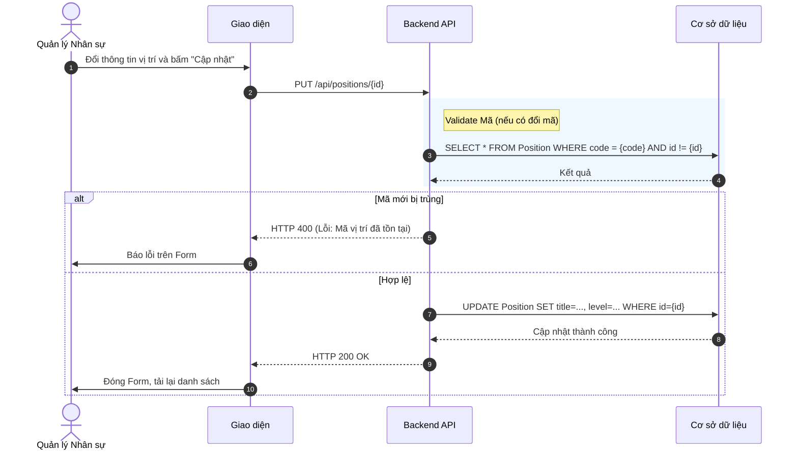
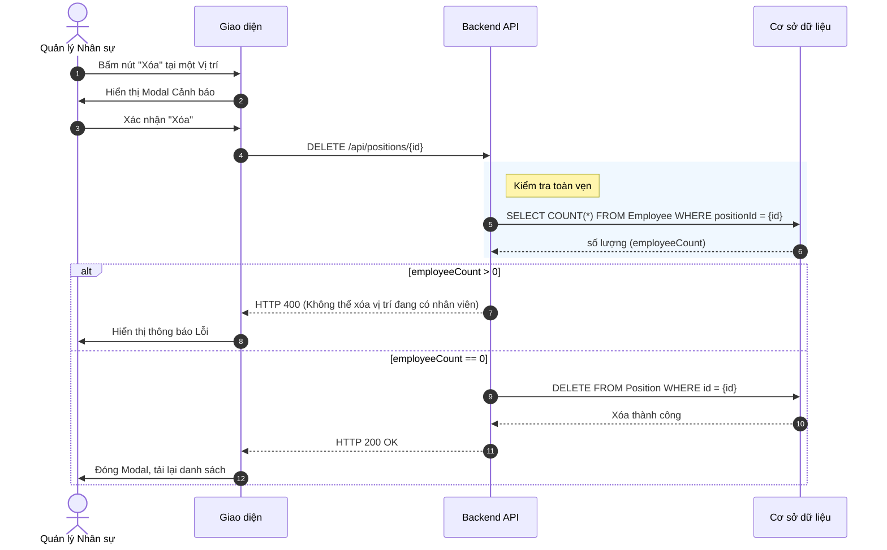

# Đặc tả chức năng: Quản lý Vị trí / Chức danh (Position Management)

## 1. Giới thiệu chức năng
Chức năng cho phép doanh nghiệp định nghĩa Khung chức danh và vị trí công việc. Một phòng ban có thể có nhiều vị trí khác nhau, và mỗi vị trí có thể có một cấp bậc (Level) và Khung lương chuẩn (Min/Max Salary).

## 2. Các quy tắc nghiệp vụ cốt lõi
- **Mã vị trí (Code):** Phải là duy nhất để tránh nhầm lẫn khi tạo hợp đồng hoặc tuyển dụng.
- **Phòng ban trực thuộc:** Một vị trí có thể gán cứng vào một phòng ban (Ví dụ: Trưởng phòng Marketing thì bắt buộc thuộc phòng Marketing), hoặc để trống (dùng chung cho toàn công ty).
- **Ràng buộc Xóa:** Không thể xóa một vị trí nếu đang có bất kỳ nhân viên nào giữ chức vụ này.

## 3. Sơ đồ luồng chi tiết (Sequence Diagrams)

### 3.1. Luồng Xem danh sách Vị trí
Hệ thống lấy toàn bộ Vị trí và kết nối (JOIN) với bảng Phòng ban để lấy Tên phòng ban hiển thị ra giao diện.

### 3.2. Luồng Thêm mới Vị trí
Đảm bảo mã vị trí không bị trùng lặp.

### 3.3. Luồng Cập nhật Vị trí
Khi cập nhật, nếu người dùng đổi Mã vị trí, hệ thống phải kiểm tra xem mã mới có bị trùng với vị trí khác hay không.

### 3.4. Luồng Xóa Vị trí
Bảo vệ dữ liệu không bị xóa nhầm nếu đang có nhân sự sử dụng.

