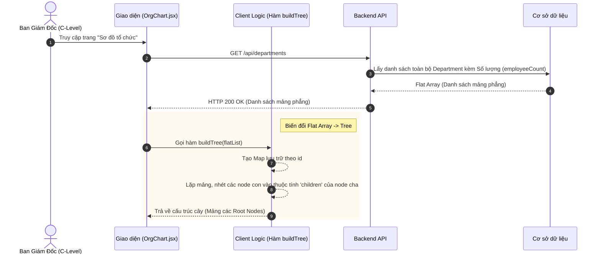
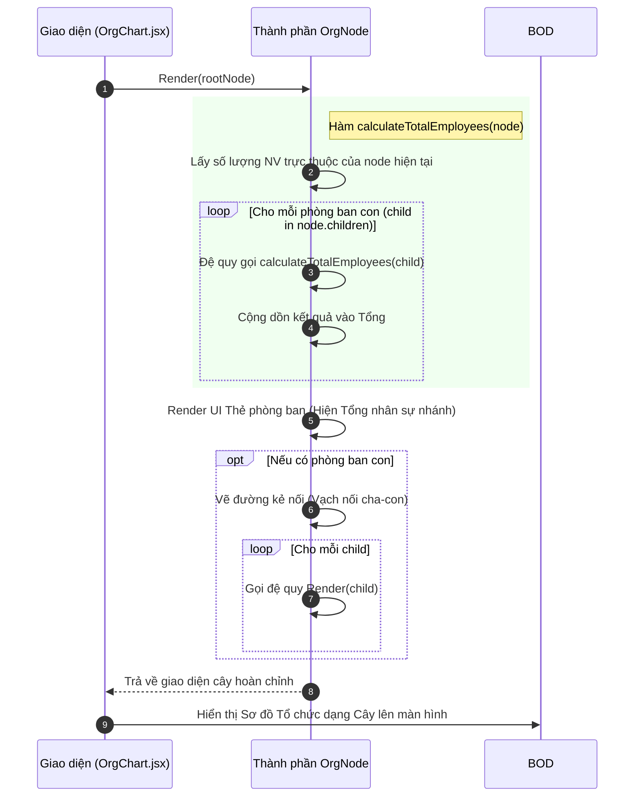

# Đặc tả chức năng: Sơ đồ Tổ chức (Org Chart)

## 1. Giới thiệu chức năng
Cung cấp một góc nhìn trực quan hóa toàn bộ cơ cấu bộ máy của công ty dưới dạng Sơ đồ cây (Tree Diagram). Chức năng này đặc biệt hữu ích cho C-Level (Ban giám đốc) để theo dõi nhanh tình hình nhân sự của các khối.

## 2. Các quy tắc nghiệp vụ cốt lõi
- **Thuật toán Đệ quy (Recursive Calculation):** Hệ thống không chỉ đếm số nhân viên gán trực tiếp vào phòng ban đó, mà tự động chạy đệ quy cộng dồn số lượng nhân sự của TẤT CẢ các phòng ban con, cháu trực thuộc nhánh đó.
- **Tự động cấu trúc cây:** Dữ liệu trả về từ DB là mảng phẳng (Flat Array). Hệ thống (tại Backend hoặc Frontend) sẽ dựa vào thuộc tính `parentId` để lồng ghép chúng thành cấu trúc Tree.

## 3. Sơ đồ luồng chi tiết (Sequence Diagrams)

### 3.1. Luồng Lấy dữ liệu và Chuyển đổi Cấu trúc (Build Tree)
Mô tả quá trình Frontend yêu cầu dữ liệu và sử dụng thuật toán để cấu trúc lại mảng phẳng thành cây.

### 3.2. Luồng Đệ quy Hiển thị & Tính toán Headcount
Mô tả cách một `OrgNode` tự động render và cộng dồn số lượng nhân sự từ các nhánh con.

