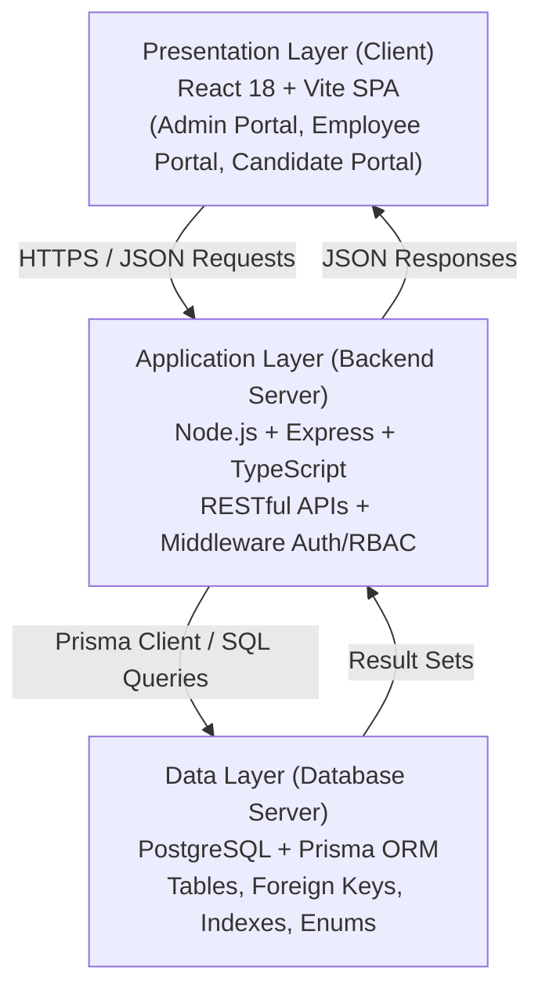
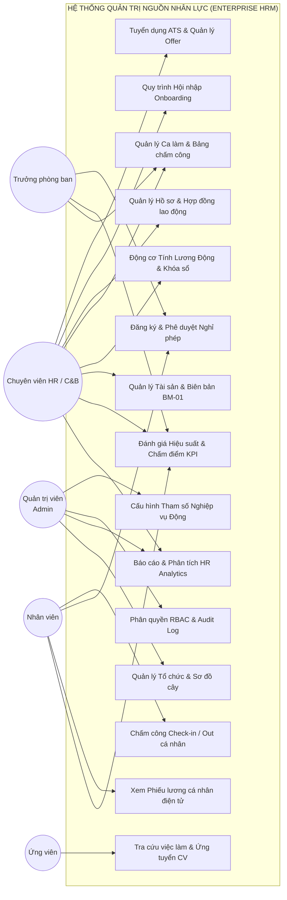
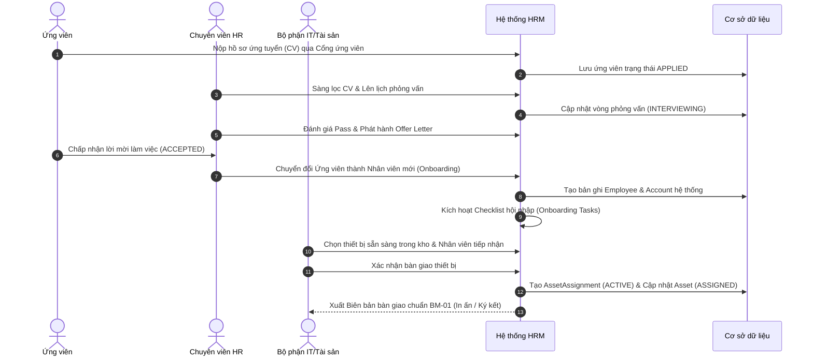
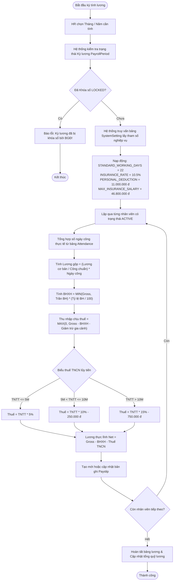
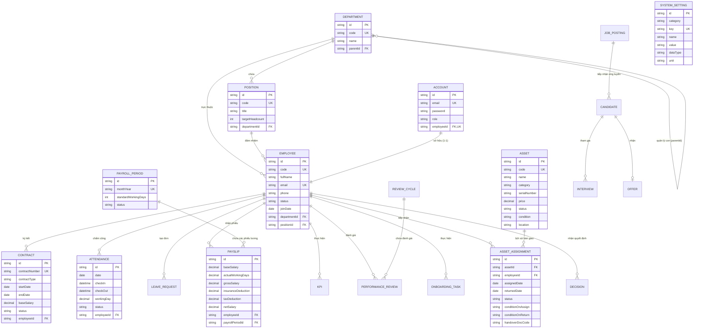

# BÁO CÁO ĐỒ ÁN TỐT NGHIỆP ĐẠI HỌC

---

### BỘ GIÁO DỤC VÀ ĐÀO TẠO
### TRƯỜNG ĐẠI HỌC XÂY DỰNG HÀ NỘI
### KHOA CÔNG NGHỆ THÔNG TIN - BỘ MÔN CÔNG NGHỆ PHẦN MỀM

---

# ĐỒ ÁN TỐT NGHIỆP
## ĐỀ TÀI: PHÂN TÍCH, THIẾT KẾ VÀ XÂY DỰNG HỆ THỐNG QUẢN TRỊ NGUỒN NHÂN LỰC DOANH NGHIỆP (ENTERPRISE HRM)

- **Sinh viên thực hiện**: Lê Hoàng Trúc
- **Ngành**: Công nghệ Thông tin
- **Chuyên ngành**: Kỹ thuật Phần mềm
- **Khóa**: 66 (2021 – 2026)
- **Cán bộ hướng dẫn**: Giảng viên Hướng dẫn ĐATN

*Hà Nội, Năm 2026*

---

## LỜI CẢM ƠN

Lời đầu tiên, em xin gửi lời cảm ơn chân thành và sâu sắc nhất tới toàn thể quý Thầy, Cô giáo trong **Khoa Công nghệ Thông tin - Trường Đại học Xây dựng Hà Nội**, những người đã tận tình truyền đạt cho em khối lượng kiến thức chuyên môn vững chắc, tư duy kỹ thuật và đạo đức nghề nghiệp trong suốt những năm tháng học tập dưới mái trường đại học.

Đặc biệt, em xin bày tỏ lòng biết ơn sâu sắc tới **Thầy/Cô Giảng viên hướng dẫn**, người đã luôn dành thời gian quý báu để định hướng phương pháp luận khoa học, góp ý chuyên sâu về kiến trúc hệ thống và chỉ bảo tận tình cho em trong từng giai đoạn phân tích, thiết kế và hiện thực hóa đồ án tốt nghiệp này.

Em cũng xin gửi lời cảm ơn chân thành tới gia đình, bạn bè và đồng nghiệp đã luôn động viên, chia sẻ và tạo mọi điều kiện thuận lợi nhất để em có thể hoàn thành tốt đồ án tốt nghiệp đúng thời hạn.

Mặc dù em đã nỗ lực hết mình với tinh thần học hỏi cao nhất, song do giới hạn về thời gian và kinh nghiệm thực tế, đồ án chắc chắn không tránh khỏi những thiếu sót nhất định. Em rất mong nhận được những ý kiến đóng góp, chỉ bảo quý báu của quý Thầy, Cô trong Hội đồng chấm Đồ án tốt nghiệp để hệ thống ngày càng hoàn thiện và có tính ứng dụng cao hơn nữa trong thực tiễn.

*Hà Nội, ngày 07 tháng 10 năm 2026*  
*Sinh viên thực hiện*  
**Lê Hoàng Trúc**

---

## TÓM TẮT ĐỒ ÁN (ABSTRACT)

* **Tên đề tài**: Phân tích, thiết kế và xây dựng Hệ thống Quản trị Nguồn nhân lực Doanh nghiệp (Enterprise Human Resource Management - HRM).
* **Sinh viên thực hiện**: Lê Hoàng Trúc.
* **Mục tiêu**: Xây dựng một nền tảng phần mềm SaaS Quản trị Nhân sự toàn diện, chuẩn hóa theo quy trình doanh nghiệp thực tế, khép kín trọn vẹn vòng đời nhân viên (Employee Lifecycle): từ tuyển dụng ATS, hội nhập Onboarding, quản lý hồ sơ & hợp đồng, theo dõi chấm công ca kíp, phê duyệt nghỉ phép đa cấp, đánh giá hiệu suất KPI, tính lương động (Payroll Engine) tự động áp thuế TNCN và BHXH, đến quản lý trang thiết bị tài sản (Biên bản bàn giao BM-01) và bảng điều khiển phân tích số liệu nhân sự (HR Analytics).
* **Phương pháp tiếp cận**: 
  1. Khảo sát nghiệp vụ thực tế từ các tiêu chuẩn doanh nghiệp và mô hình HRM hiện đại.
  2. Áp dụng quy trình Kỹ nghệ phần mềm chuẩn: Phân tích yêu cầu (SRS), mô hình hóa hệ thống bằng UML (Use Case, Activity, Sequence Diagram), thiết kế cơ sở dữ liệu quan hệ (ERD).
  3. Xây dựng động cơ tham số nghiệp vụ động (Dynamic Business Parameters Engine), đảm bảo 100% các chỉ số định lượng (thuế, bảo hiểm, công chuẩn, ngưỡng duyệt) được nạp động từ CSDL, không bị gắn cứng (hard-code) trong mã nguồn.
* **Công nghệ áp dụng**:
  * **Backend**: Node.js, Express.js, TypeScript, Prisma ORM, JSON Web Token (JWT), Role-Based Access Control (RBAC).
  * **Cơ sở dữ liệu**: PostgreSQL với cơ chế ràng buộc toàn vẹn, index tối ưu hóa truy vấn và Enum an toàn kiểu dữ liệu.
  * **Frontend**: React 18, Vite, React Router DOM, Thiết kế giao diện chuẩn SaaS cao cấp (Inter Typography, Glassmorphism, Responsive CSS Tokens, Lucide Icons).
* **Kết quả đạt được**: Hoàn thiện 12 phân hệ nghiệp vụ hoàn chỉnh; 100% API đạt chuẩn RESTful; hệ thống hỗ trợ 3 cổng thông tin phân quyền độc lập (Cổng Quản trị Doanh nghiệp, Cổng Nhân viên Tự phục vụ ESS, Cổng Ứng viên tuyển dụng); kiểm thử đạt kết quả chính xác cao, thời gian phản hồi trung bình dưới 100ms.

---

## MỤC LỤC CHI TIẾT

* **PHẦN MỞ ĐẦU**
  * 1. Lý do chọn đề tài và bối cảnh thực tiễn
  * 2. Thực trạng và các vấn đề tồn tại của giải pháp truyền thống
  * 3. Tính cấp thiết của đề tài
  * 4. Đối tượng sử dụng và phạm vi nghiên cứu
  * 5. Mục tiêu cụ thể của đồ án
  * 6. Phương pháp nghiên cứu
  * 7. Bố cục báo cáo
* **CHƯƠNG 1: CƠ SỞ LÝ THUYẾT VÀ CÔNG NGHỆ ÁP DỤNG**
  * 1.1. Lý thuyết về Quản trị Nguồn nhân lực (HRM) và Vòng đời nhân viên
  * 1.2. Mô hình kiến trúc phần mềm (Client-Server, 3-Tier, SPA, RESTful API)
  * 1.3. Cơ chế bảo mật và xác thực (JWT, RBAC Matrix)
  * 1.4. Hệ quản trị CSDL PostgreSQL & Công cụ Prisma ORM
  * 1.5. Nền tảng Backend: Node.js, TypeScript & Express.js
  * 1.6. Nền tảng Frontend: React 18, Vite & Hệ thống Thiết kế Giao diện Chuẩn hóa
* **CHƯƠNG 2: PHÂN TÍCH VÀ THIẾT KẾ HỆ THỐNG**
  * 2.1. Khảo sát hiện trạng và xác định yêu cầu hệ thống
    * 2.1.1. Yêu cầu chức năng (12 phân hệ)
    * 2.1.2. Yêu cầu phi chức năng
  * 2.2. Sơ đồ Ca sử dụng (Use Case Diagrams & Đặc tả Actor)
  * 2.3. Sơ đồ Hoạt động (Activity Diagrams) cho các luồng nghiệp vụ cốt lõi
  * 2.4. Sơ đồ Tuần tự (Sequence Diagrams)
  * 2.5. Thiết kế Cơ sở dữ liệu và Sơ đồ Thực thể - Quan hệ (ERD)
* **CHƯƠNG 3: XÂY DỰNG VÀ TRIỂN KHAI HỆ THỐNG**
  * 3.1. Cấu trúc tổ chức mã nguồn dự án
  * 3.2. Hiện thực hóa các phân hệ chức năng chính
    * 3.2.1. Phân hệ Cơ cấu Tổ chức & Sơ đồ phân cấp tương tác
    * 3.2.2. Phân hệ Tuyển dụng ATS (Recruitment ATS Pipeline)
    * 3.2.3. Phân hệ Hội nhập Onboarding & Cấp phát tài khoản
    * 3.2.4. Phân hệ Quản lý Hồ sơ, Hợp đồng & Quyết định nhân sự
    * 3.2.5. Phân hệ Ca làm việc & Chấm công
    * 3.2.6. Phân hệ Nghỉ phép & Lịch nghỉ lễ
    * 3.2.7. Phân hệ Đánh giá Hiệu suất (KPI & Performance Review)
    * 3.2.8. Phân hệ Tính Lương Động (Payroll Engine)
    * 3.2.9. Phân hệ Quản Lý Tài Sản & Thiết Bị (Biên bản BM-01)
    * 3.2.10. Phân hệ Quản trị Hệ thống (Động cơ Tham số Động, Trung tâm Phê duyệt, Phân quyền RBAC, Audit Log)
    * 3.2.11. Phân hệ Báo cáo & HR Analytics Dashboard
    * 3.2.12. Cổng Nhân viên Tự phục vụ (ESS) & Cổng Ứng viên
  * 3.3. Thiết kế chi tiết RESTful API
  * 3.4. Các thuật toán và giải thuật nghiệp vụ trọng tâm
* **CHƯƠNG 4: THỬ NGHIỆM VÀ ĐÁNH GIÁ HỆ THỐNG**
  * 4.1. Môi trường cài đặt và cấu hình hệ thống
  * 4.2. Hướng dẫn cài đặt, nạp CSDL và khởi chạy
  * 4.3. Bảng kịch bản kiểm thử (Test Cases & Results)
  * 4.4. Đánh giá kết quả đạt được so với mục tiêu ban đầu
* **KẾT LUẬN VÀ HƯỚNG PHÁT TRIỂN**
  * 1. Tóm tắt kết quả đạt được
  * 2. Tính hiệu quả và giá trị ứng dụng thực tế
  * 3. Những hạn chế còn tồn tại
  * 4. Hướng phát triển trong tương lai
* **TÀI LIỆU THAM KHẢO**

---

# PHẦN MỞ ĐẦU

### 1. Bối cảnh và lý do chọn đề tài
Trong thời đại chuyển đổi số quốc gia và hội nhập kinh tế toàn cầu, nguồn nhân lực luôn được coi là tài sản chiến lược quý giá nhất quyết định sự thành bại và sức cạnh tranh của mỗi doanh nghiệp. Quản trị nhân sự không còn đơn thuần là việc ghi chép sổ chấm công hay trả lương hàng tháng, mà đã phát triển thành một chiến lược toàn diện bao gồm: thu hút nhân tài (Recruitment ATS), chuẩn hóa quy trình hội nhập (Onboarding), quản lý hợp đồng lao động theo luật, theo dõi thời gian làm việc chính xác, đánh giá hiệu quả theo chỉ số KPI định lượng, và quản lý trang thiết bị công cụ làm việc.

Tuy nhiên, tại nhiều doanh nghiệp vừa và nhỏ (SMEs) cũng như các tổ chức đang mở rộng quy mô tại Việt Nam, công tác quản lý nhân sự vẫn đang đối mặt với nhiều rào cản lớn. Xuất phát từ nhu cầu thực tiễn đó, em quyết định chọn đề tài tốt nghiệp: **"Phân tích, thiết kế và xây dựng Hệ thống Quản trị Nguồn nhân lực Doanh nghiệp (Enterprise HRM)"**.

### 2. Thực trạng và các vấn đề tồn tại mà đề tài hướng đến giải quyết
Qua khảo sát thực tế tại các doanh nghiệp, các phương thức quản lý truyền thống bộc lộ những nhược điểm nghiêm trọng:
1. **Dữ liệu phân tán, cát cứ thông tin**: Hồ sơ nhân sự nằm trên Excel, đơn từ nghỉ phép lưu qua email hoặc giấy viết tay, trang thiết bị máy tính do IT quản lý bằng file riêng. Sự thiếu liên kết dẫn đến trùng lặp dữ liệu và sai lệch thông tin khi nhân sự điều chuyển hoặc nghỉ việc.
2. **Quy trình tính lương thủ công, dễ phát sinh sai sót**: C&B phải mất từ 3 đến 5 ngày cuối tháng để đối soát từng dòng chấm công, tính thuế thu nhập cá nhân theo biểu lũy tiến và trích nộp bảo hiểm xã hội. Khi nhà nước thay đổi mức giảm trừ gia cảnh hoặc tỷ lệ đóng bảo hiểm, việc chỉnh sửa công thức trong mã nguồn hoặc bảng tính rất dễ dẫn đến lỗi tính toán.
3. **Thất thoát tài sản và thiết bị khi nhân viên nghỉ việc**: Do thiếu phân hệ quản lý tài sản gắn liền với mã nhân sự, nhiều trường hợp nhân viên nghỉ việc nhưng chưa bàn giao lại laptop, thẻ thang máy hoặc bàn giao thiết bị hỏng hóc mà không có biên bản pháp lý rõ ràng.
4. **Thiếu tính linh hoạt do "Hard-code" tham số**: Hầu hết các phần mềm cũ gắn cứng các chỉ số định lượng trong code (22 ngày công chuẩn, 10.5% bảo hiểm, 11 triệu giảm trừ gia cảnh), khiến mỗi lần chính sách thay đổi đều phải thuê đơn vị phần mềm can thiệp sửa code, tốn kém chi phí và chậm trễ tiến độ.

### 3. Tính cấp thiết của đề tài
Xây dựng một hệ thống HRM hiện đại ứng dụng kiến trúc Web Client-Server kết hợp cơ sở dữ liệu quan hệ mạnh mẽ, hỗ trợ **Động cơ Tham số Nghiệp vụ Động** và khép kín quy trình từ lúc ứng tuyển đến khi thôi việc là một đòi hỏi vô cùng cấp thiết, giúp:
* Giảm 80% thời gian tổng hợp công và tính lương hàng tháng.
* Minh bạch hóa quy trình phê duyệt đơn từ, chấm điểm KPI.
* Quản lý chặt chẽ 100% trang thiết bị bàn giao qua Biểu mẫu chuẩn BM-01.
* Bảo mật dữ liệu nhân sự qua mô hình phân quyền ma trận RBAC đa cấp.

### 4. Đối tượng sử dụng và phạm vi đề tài
* **Đối tượng sử dụng**:
  * *Ban Giám đốc / Lãnh đạo*: Theo dõi báo cáo thống kê biến động nhân sự, quỹ lương, phê duyệt các đề xuất cấp cao.
  * *Bộ phận Nhân sự (HR/C&B)*: Quản lý tuyển dụng, hồ sơ, hợp đồng, chấm công, kỳ lương, đánh giá KPI, khen thưởng, kỷ luật.
  * *Bộ phận CNTT / Hành chính*: Quản lý danh mục thiết bị, kho tài sản, lập biên bản bàn giao và thu hồi tài sản.
  * *Trưởng phòng ban (Department Manager)*: Phê duyệt đơn xin nghỉ phép, duyệt điều chỉnh công, đánh giá KPI nhân viên thuộc phòng.
  * *Nhân viên (Employee)*: Chấm công trực tuyến, tra cứu phiếu lương điện tử, nộp đơn xin nghỉ phép trên cổng ESS.
  * *Ứng viên (Candidate)*: Tra cứu vị trí tuyển dụng, nộp hồ sơ ứng tuyển trên cổng ứng viên.
* **Phạm vi đề tài**: Hệ thống bao quát 12 phân hệ nghiệp vụ nội bộ doanh nghiệp kết hợp 3 cổng thông tin riêng biệt, triển khai theo mô hình Web Application đáp ứng truy cập trên máy tính và thiết bị di động.

### 5. Mục tiêu cụ thể của đồ án
1. **Về nghiệp vụ**: Số hóa hoàn toàn 12 quy trình nhân sự cốt lõi; loại bỏ 100% việc hard-code tham số định lượng; hỗ trợ biên bản hành chính chuẩn (Hợp đồng, Biên bản bàn giao BM-01, Quyết định nhân sự).
2. **Về công nghệ**: Áp dụng kiến trúc hiện đại Node.js + TypeScript + Express.js cho Backend; PostgreSQL + Prisma ORM cho CSDL; React 18 + Vite + Design System đồng bộ chuẩn Inter cho Frontend.
3. **Về sản phẩm**: Xây dựng phần mềm chạy ổn định, giao diện trực quan, bảo mật cao bằng JWT và RBAC, thời gian đáp ứng API trung bình < 100ms.

### 6. Phương pháp nghiên cứu
* Phương pháp nghiên cứu tài liệu: Nghiên cứu Bộ luật Lao động 2019, Luật Thuế TNCN, Luật BHXH, các quy chuẩn HRM quốc tế.
* Phương pháp phân tích nghiệp vụ (BA): Phân rã chức năng, xây dựng User Story, ma trận quy tắc kinh doanh (Business Rules).
* Phương pháp mô hình hóa hướng đối tượng (OOAD) kết hợp UML (Use Case, Activity, Sequence, ERD).
* Phương pháp kỹ nghệ phần mềm: Lập trình kiểm thử, tinh chỉnh giao diện người dùng và đo kiểm hiệu năng.

### 7. Bố cục của báo cáo
Báo cáo gồm 4 chương chính và phần kết luận:
* **Chương 1**: Cơ sở lý thuyết và công nghệ áp dụng.
* **Chương 2**: Phân tích và thiết kế hệ thống.
* **Chương 3**: Xây dựng và triển khai hệ thống.
* **Chương 4**: Thử nghiệm và đánh giá hệ thống.
* **Kết luận và hướng phát triển**.

---

# CHƯƠNG 1: CƠ SỞ LÝ THUYẾT VÀ CÔNG NGHỆ ÁP DỤNG

## 1.1. Lý thuyết về Quản trị Nguồn nhân lực (HRM) và Vòng đời nhân viên
Quản trị nguồn nhân lực (Human Resource Management) là hệ thống các triết lý, chính sách và hoạt động chức năng nhằm thu hút, đào tạo, phát triển và duy trì đội ngũ nhân sự nhằm đạt được mục tiêu chiến lược của tổ chức.

Vòng đời nhân viên (Employee Lifecycle - ELC) trong doanh nghiệp được chia thành 7 giai đoạn kế tiếp nhau:
1. **Thu hút & Tuyển dụng (Attract & Recruit)**: Xác định nhu cầu tuyển dụng, đăng tin, thu thập CV, sàng lọc qua phễu Kanban ATS, phỏng vấn và gửi Offer Letter.
2. **Hội nhập (Onboarding)**: Tiếp nhận nhân sự mới, phân công Checklist công việc, tạo tài khoản hệ thống và trang bị thiết bị làm việc.
3. **Quản trị Hồ sơ & Hợp đồng (Core HR)**: Ký kết hợp đồng lao động, lưu trữ hồ sơ, quản lý điều chuyển công tác, khen thưởng, kỷ luật.
4. **Theo dõi Thời gian làm việc (Time & Attendance)**: Phân ca làm việc, chấm công Check-in/Check-out, ghi nhận đi muộn/về sớm, quản lý nghỉ phép và ngày lễ.
5. **Đánh giá Hiệu suất (Performance & KPI)**: Thiết lập mục tiêu KPI đầu kỳ, tự đánh giá và người quản lý chấm điểm cuối kỳ.
6. **Lương thưởng & Phúc lợi (Compensation & Benefits - C&B)**: Tính lương tự động theo ngày công thực tế, tính tiền làm thêm giờ (OT), trích đóng BHXH/BHYT/BHTN và khấu trừ thuế TNCN lũy tiến từng phần.
7. **Thôi việc & Thu hồi tài sản (Offboarding & Separation)**: Quyết định chấm dứt HĐLĐ, bàn giao công việc và thu hồi tài sản theo biểu mẫu BM-01.

## 1.2. Mô hình kiến trúc phần mềm
Hệ thống được thiết kế theo mô hình **Client-Server 3 lớp (3-Tier Layered Architecture)**:



* **Presentation Layer (Tầng hiển thị)**: Xây dựng dưới dạng Single Page Application (SPA) bằng React 18, render giao diện phía Client, giao tiếp phi đồng bộ với máy chủ qua API JSON.
* **Application Layer (Tầng ứng dụng / Nghiệp vụ)**: Máy chủ Express.js kết hợp TypeScript, chia tách theo mô hình Route - Controller/Service - Data Access, đảm bảo nguyên lý Single Responsibility.
* **Data Layer (Tầng dữ liệu)**: Cơ sở dữ liệu PostgreSQL lưu trữ bền vững, quản lý toàn vẹn dữ liệu qua khóa chính, khóa ngoại và các ràng buộc Unique.

## 1.3. Cơ chế bảo mật và xác thực (Authentication & RBAC)
* **Xác thực phi trạng thái (Stateless Authentication)**: Sử dụng **JSON Web Token (JWT)**. Khi người dùng đăng nhập thành công, máy chủ cấp phát chuỗi token có chữ ký số bí mật (Secret Key) chứa định danh và vai trò người dùng. Mọi request tiếp theo được đính kèm qua HTTP Header `Authorization: Bearer <token>`.
* **Phân quyền dựa trên vai trò (Role-Based Access Control - RBAC)**:
  * Hệ thống chia làm 4 vai trò chính: `ADMIN` (Toàn quyền), `HR_MANAGER` (Quản lý nghiệp vụ nhân sự), `DEPT_MANAGER` (Trưởng phòng duyệt đơn), `EMPLOYEE` (Nhân viên tự phục vụ).
  * Điểm đặc biệt của đồ án là đã hiện thực hóa **Ma trận phân quyền tương tác (Interactive RBAC Matrix)** tại giao diện, cho phép bật/tắt quyền CRUD đối với từng phân hệ nghiệp vụ theo thời gian thực.
* **Mã hóa mật khẩu**: Sử dụng giải thuật băm một chiều **bcrypt** với Salt round = 10, đảm bảo mật khẩu người dùng không thể bị giải mã ngay cả khi CSDL bị lộ.

## 1.4. Hệ quản trị CSDL PostgreSQL & Công cụ Prisma ORM
* **PostgreSQL**: Là hệ quản trị CSDL quan hệ mã nguồn mở mạnh mẽ nhất hiện nay:
  * Đạt chuẩn **ACID** (Atomicity, Consistency, Isolation, Durability) nghiêm ngặt, sống còn đối với các giao dịch tài chính - tiền lương.
  * Hỗ trợ kiểu dữ liệu chuỗi, số chính xác cao (`Decimal` cho tiền lương), `DateTime` cho chấm công và `Enum` cho trạng thái nghiệp vụ.
  * Khả năng đánh chỉ mục Index đa dạng (B-Tree, Hash), tối ưu tốc độ tra cứu lịch sử chấm công và nhật ký kiểm toán.
* **Prisma ORM (Next-generation ORM for Node.js & TypeScript)**:
  * Thay vì viết truy vấn SQL thuần dễ lỗi chính tả và SQL Injection, Prisma cung cấp cú pháp Schema khai báo trực quan (`schema.prisma`).
  * **Type-Safety tuyệt đối**: Tự động sinh ra TypeScript types tương ứng với các bảng CSDL, giúp trình biên dịch bắt lỗi kiểu dữ liệu ngay trong quá trình viết code (Compile time).
  * Hỗ trợ công cụ `prisma db push` và `prisma migrate` giúp quản lý phiên bản CSDL nhất quán giữa các môi trường.

## 1.5. Nền tảng Backend: Node.js, TypeScript & Express.js
* **Node.js**: Nền tảng thực thi JavaScript phía máy chủ dựa trên V8 Engine của Google, hoạt động theo mô hình hướng sự kiện và Non-blocking I/O, xử lý đồng thời hàng nghìn kết nối mà không tốn nhiều tài nguyên bộ nhớ.
* **TypeScript**: Ngôn ngữ mã nguồn mở phát triển bởi Microsoft, bổ sung hệ thống kiểu tĩnh (Static Typing) cho JavaScript:
  * Ngăn ngừa hơn 80% các lỗi runtime phổ biến như `TypeError: undefined is not a function`.
  * Hỗ trợ Intellisense và Refactoring code an toàn khi dự án mở rộng lên hàng nghìn dòng code.
* **Express.js**: Framework Web tối giản, linh hoạt, hỗ trợ cơ chế Middleware mạnh mẽ để bẻ nhỏ các tác vụ: kiểm tra token (`authMiddleware`), ghi log truy vết (`auditMiddleware`), xử lý lỗi tập trung (`errorHandler`).

## 1.6. Nền tảng Frontend: React 18, Vite & Hệ thống Thiết kế Chuẩn hóa
* **React 18**: Thư viện UI hàng đầu thế giới với kiến trúc Component tái sử dụng cao, cơ chế Virtual DOM giúp tối ưu hóa hiệu năng render. Sử dụng React Hooks (`useState`, `useEffect`, `useContext`, `useMemo`) để quản lý trạng thái sạch sẽ.
* **Vite**: Công cụ đóng gói (Build Tool) hiện đại thế hệ mới, sử dụng Native ES Modules trong quá trình phát triển giúp khởi động máy chủ dev chỉ trong vài trăm mili-giây và cập nhật thay đổi (HMR) tức thì.
* **Hệ thống Thiết kế Chuẩn hóa (Standardized Design System)**:
  * **Bộ font Inter thống nhất**: Nạp từ Google Fonts với đầy đủ bảng mã tiếng Việt, giải quyết triệt để vấn đề méo dấu hoặc thô ráp khi hiển thị tiêu đề.
  * **Thước đo kiểu chữ chuẩn**: Quy định `.page-title` (1.625rem / 26px, font-weight 700, màu `#0F172A`) và `.page-subtitle` (0.875rem / 14px, màu `#64748B`) thống nhất trên 100% các màn hình.
  * **Hiệu ứng Glassmorphism & Token màu HSL**: Giao diện mang phong cách hiện đại với nền trong suốt tinh tế, đổ bóng đa tầng và hiệu ứng micro-animations mượt mà.

---

# CHƯƠNG 2: PHÂN TÍCH VÀ THIẾT KẾ HỆ THỐNG

## 2.1. Khảo sát hiện trạng và xác định yêu cầu hệ thống

### 2.1.1. Yêu cầu chức năng (Functional Requirements)
Hệ thống được thiết kế đáp ứng 12 nhóm chức năng nghiệp vụ trọng tâm:

| Mã Yêu Cầu | Tên Phân Hệ | Mô Tả Chức Năng Chi Tiết |
|---|---|---|
| **FR-01** | Quản lý Cơ cấu Tổ chức | Quản lý danh mục Phòng ban, Vị trí/Chức danh, định biên nhân sự; hiển thị Sơ đồ cây phân cấp tương tác. |
| **FR-02** | Tuyển dụng nhân tài (ATS) | Quản lý yêu cầu tuyển dụng, quản lý ứng viên theo quy trình phỏng vấn Kanban, lên lịch phỏng vấn và gửi Offer. |
| **FR-03** | Hội nhập nhân sự mới | Quản lý danh sách Onboarding, cấu hình Checklist nhiệm vụ hội nhập, cấp phát tài khoản phần mềm. |
| **FR-04** | Quản trị Hồ sơ nhân sự | Quản lý thông tin định danh, học vấn, người phụ thuộc, hợp đồng lao động, điều chuyển và quyết định nhân sự. |
| **FR-05** | Ca làm việc & Chấm công | Thiết lập ca làm (Hành chính, Ca sáng, Chiều, Đêm), ghi nhận Check-in/Check-out, tính số ngày công chuẩn (`1.0`, `0.5`, `0.0`), điều chỉnh công. |
| **FR-06** | Nghỉ phép & Lịch nghỉ lễ | Đăng ký và duyệt đơn xin nghỉ phép, quản lý quỹ phép năm, thiết lập danh mục lịch nghỉ Lễ hưởng nguyên lương. |
| **FR-07** | Đánh giá Hiệu suất (KPI) | Khởi tạo chu kỳ đánh giá (Review Cycle), cấu hình mẫu tiêu chí KPI, giao chỉ tiêu và chấm điểm đánh giá hiệu suất. |
| **FR-08** | Tính Lương Động (Payroll) | Quản lý kỳ lương tháng, tính lương tự động dựa trên công thực tế, khấu trừ BHXH (10.5%), trừ thuế TNCN lũy tiến, khóa sổ kỳ lương (`LOCKED`). |
| **FR-09** | Quản lý Tài sản & Thiết bị | Quản lý danh mục kho thiết bị (Laptop, PC, Màn hình, Thẻ từ), lập Biên bản bàn giao chuẩn BM-01, thu hồi tài sản khi thôi việc. |
| **FR-10** | Động cơ Tham số Động | Cấu hình tham số định lượng: tỷ lệ BHXH, mức giảm trừ gia cảnh, trần đóng bảo hiểm, ngày chốt công, ngưỡng duyệt nghỉ phép. |
| **FR-11** | Quản trị Hệ thống & Bảo mật | Trung tâm phê duyệt đa cấp (Approval Workflows), phân quyền RBAC Matrix, nhật ký kiểm toán (Audit Logs), hệ thống thông báo. |
| **FR-12** | Báo cáo & HR Analytics | Biểu đồ phân bố nhân sự theo phòng ban, tỷ lệ nhân viên thử việc/chính thức, tỷ lệ đi làm đúng giờ, tổng quỹ lương tháng. |

### 2.1.2. Yêu cầu phi chức năng (Non-Functional Requirements)
1. **Hiệu năng (Performance)**: Thời gian phản hồi của 95% API < 150ms đối với các tác vụ thông thường và < 1s đối với tác vụ tính lương hàng loạt cho 500 nhân viên.
2. **Tính mở rộng (Scalability)**: Thiết kế dạng Module hóa độc lập, dễ dàng bổ sung các dịch vụ mới (như Mobile App, Chấm công khuôn mặt AI).
3. **Tính toàn vẹn & Không hard-code (Dynamic Integrity)**: 100% các biến số định lượng trong công thức tính toán nghiệp vụ phải được nạp động từ CSDL, có giá trị mặc định fallback an toàn.
4. **Bảo mật (Security)**: Toàn bộ mật khẩu được băm bằng bcrypt; các endpoint nội bộ đều bắt buộc qua middleware kiểm tra JWT; nhật ký kiểm toán ghi nhận mọi thao tác nhạy cảm (IP, Method, Action, Timestamp).
5. **Tính khả dụng (Usability)**: Giao diện trực quan, ngôn ngữ tiếng Việt chuẩn hành chính doanh nghiệp, chuẩn hóa font chữ Inter đồng nhất trên 100% các màn hình.

---

## 2.2. Sơ đồ Ca sử dụng (Use Case Diagrams)

### 2.2.1. Sơ đồ Use Case tổng thể hệ thống
Dưới đây là sơ đồ ca sử dụng tổng thể thể hiện tương tác giữa các tác nhân chính với các phân hệ chức năng:



---

## 2.3. Sơ đồ Hoạt động (Activity Diagrams)

### 2.3.1. Luồng Tuyển dụng -> Onboarding -> Bàn giao Tài sản (BM-01)
Quy trình khép kín từ lúc ứng viên nộp hồ sơ đến khi chính thức tiếp nhận trang thiết bị làm việc:



### 2.3.2. Luồng Tính Lương Động & Khấu trừ Thuế / Bảo hiểm (Payroll Engine)
Quy trình tự động hóa của Động cơ tính lương dựa trên tham số nạp từ CSDL:



---

## 2.4. Sơ đồ Thực thể - Quan hệ (Entity Relationship Diagram - ERD)

Dưới đây là sơ đồ cơ sở dữ liệu hoàn chỉnh của hệ thống được xây dựng trên PostgreSQL và Prisma ORM:



---

# CHƯƠNG 3: XÂY DỰNG VÀ TRIỂN KHAI HỆ THỐNG

## 3.1. Cấu trúc tổ chức mã nguồn dự án (Project Structure)
Dự án được tổ chức theo cấu trúc chuyên nghiệp, phân tách hoàn toàn giữa Backend API và Frontend SPA:

```
HRM-ĐATN/
├── backend/                             # Máy chủ Backend (Node.js, Express, TypeScript)
│   ├── prisma/
│   │   └── schema.prisma                # Định nghĩa toàn bộ Data Models & Enums
│   ├── src/
│   │   ├── routes/                      # API Endpoints chia theo nghiệp vụ
│   │   │   ├── asset.routes.ts          # Quản lý kho, bàn giao BM-01 & thu hồi tài sản
│   │   │   ├── setting.routes.ts        # Động cơ tham số nghiệp vụ động (SystemSetting)
│   │   │   ├── payroll.routes.ts        # Động cơ tính lương động & quản lý kỳ lương
│   │   │   ├── attendance.routes.ts     # Chấm công, ca làm, phân loại trễ/đúng giờ
│   │   │   ├── employee.routes.ts       # Hồ sơ nhân sự, tìm kiếm, lọc phân trang
│   │   │   ├── contracts.routes.ts      # Hợp đồng lao động, tái ký, cảnh báo hết hạn
│   │   │   ├── leave.routes.ts          # Đơn xin nghỉ, hạn mức phép năm, phê duyệt
│   │   │   ├── candidate.routes.ts      # Quản lý ứng viên tuyển dụng & Kanban ATS
│   │   │   ├── department.routes.ts     # Phòng ban & giải thuật duyệt cây phân cấp
│   │   │   ├── position.routes.ts       # Vị trí công tác & định biên nhân sự
│   │   │   ├── kpi.routes.ts            # Mẫu KPI, giao chỉ tiêu, chấm điểm hiệu suất
│   │   │   ├── report.routes.ts         # Tổng hợp dữ liệu phân tích số liệu HR
│   │   │   └── auth.routes.ts           # Xác thực JWT, đăng nhập & kiểm tra quyền
│   │   ├── db.ts                        # Khởi tạo Prisma Client kết nối PostgreSQL
│   │   └── index.ts                     # File khởi động chính, cấu hình CORS & Routes
│   ├── package.json
│   └── tsconfig.json
│
├── hrm-frontend/                        # Giao diện người dùng (React 18 + Vite)
│   ├── index.html                       # Nhúng Google Fonts Inter chuẩn quốc tế
│   ├── src/
│   │   ├── layouts/
│   │   │   └── AppLayout.jsx            # Bố cục chuẩn SaaS: Sidebar, Topbar, Content
│   │   ├── pages/
│   │   │   ├── internal/                # Cổng Quản trị Doanh nghiệp (Enterprise Portal)
│   │   │   │   ├── assets/AssetManagement.jsx       # Quản lý tài sản & Biểu mẫu BM-01
│   │   │   │   ├── system/SystemParameters.jsx      # Quản trị tham số nghiệp vụ động
│   │   │   │   ├── system/ApprovalWorkflows.jsx     # Trung tâm phê duyệt đa cấp
│   │   │   │   ├── system/SettingsRBAC.jsx          # Ma trận phân quyền RBAC
│   │   │   │   ├── system/AuditLogs.jsx             # Nhật ký kiểm toán an toàn hệ thống
│   │   │   │   ├── system/Notifications.jsx         # Hệ thống thông báo nội bộ
│   │   │   │   ├── payroll/Payroll.jsx              # Bảng lương chi tiết nhân viên
│   │   │   │   ├── payroll/PayrollPeriods.jsx       # Quản lý kỳ lương & khóa sổ
│   │   │   │   ├── reports/ReportsDashboard.jsx     # Dashboard phân tích nhân sự
│   │   │   │   ├── employees/EmployeeList.jsx       # Danh sách & Hồ sơ nhân sự
│   │   │   │   ├── employees/Contracts.jsx          # Hợp đồng lao động
│   │   │   │   ├── attendance/Attendance.jsx        # Bảng chấm công tổng hợp
│   │   │   │   ├── attendance/Shifts.jsx            # Cấu hình ca làm việc
│   │   │   │   ├── leave/LeaveMgmt.jsx              # Quản lý & duyệt đơn xin nghỉ
│   │   │   │   ├── recruitment/RecruitmentATS.jsx   # Phễu tuyển dụng Kanban ATS
│   │   │   │   ├── performance/Performance.jsx      # Đánh giá hiệu suất KPI
│   │   │   │   └── organization/OrgChart.jsx        # Sơ đồ tổ chức phân cấp
│   │   │   ├── employee/                # Cổng Nhân viên Tự phục vụ (ESS Portal)
│   │   │   │   ├── Dashboard.jsx        # Chấm công Check-in/Out trực tuyến
│   │   │   │   ├── Leave.jsx            # Nộp đơn xin nghỉ phép
│   │   │   │   └── Payslip.jsx          # Tra cứu phiếu lương cá nhân điện tử
│   │   │   ├── candidate/LandingPage.jsx# Cổng Ứng viên (Tuyển dụng bên ngoài)
│   │   │   └── PortalSelection.jsx      # Màn hình chọn phân hệ cổng đăng nhập
│   │   ├── index.css                    # Thiết kế giao diện, typography, tokens HSL
│   │   ├── App.jsx                      # Định tuyến Router & Bộ lọc Route bảo vệ
│   │   └── main.jsx
│   ├── package.json
│   └── vite.config.js
└── docs/                                # Toàn bộ tài liệu phân tích nghiệp vụ & ĐATN
```

---

## 3.2. Hiện thực hóa các phân hệ chức năng chính

### 3.2.1. Phân hệ Quản Lý Tài Sản & Thiết Bị (Asset Management - BM-01)
* **Giao diện & Chức năng**:
  * Thẻ chỉ số tổng quan: Tổng số tài sản, Sẵn sàng cấp phát trong kho, Đang cấp phát cho nhân viên, Đang bảo dưỡng sửa chữa, Tổng giá trị tài sản tính theo VNĐ.
  * Tab "Kho Thiết Bị": Tìm kiếm theo mã tài sản, tên máy, số serial, vị trí kho; lọc theo chủng loại (`LAPTOP`, `MONITOR`, `PHONE`, `ACCESS_CARD`); thêm mới và chỉnh sửa thiết bị kèm nguyên giá và nhà cung cấp.
  * Tab "Bàn Giao & Thu Hồi":
    * Chức năng lập biên bản bàn giao: Chọn nhân viên tiếp nhận, sinh mã biên bản, ghi chú tình trạng vật lý ban đầu.
    * **Xem & In Biên bản Bàn giao chuẩn BM-01**: Biểu mẫu hành chính doanh nghiệp chuẩn mực gồm Quốc hiệu, Tiêu ngữ, đại diện bên giao (IT/HR), bên nhận, bảng thông số thiết bị chi tiết, cam kết trách nhiệm và chữ ký xác nhận 2 bên.
    * Chức năng thu hồi thiết bị: Đánh giá tình trạng khi hoàn trả, tự động cập nhật trạng thái kho (Sẵn sàng cấp tiếp hoặc Chuyển bảo dưỡng).

### 3.2.2. Động cơ Tham số Nghiệp vụ Động (`/internal/system/parameters`)
* **Kiến trúc hoạt động**:
  * Toàn bộ các định mức nghiệp vụ định lượng được lưu trong bảng `SystemSetting` thay vì gắn cứng (hard-code).
  * 3 nhóm tham số chính:
    1. *Lương, Thuế & BHXH*: Tỷ lệ trích BHXH/BHYT/BHTN (10.5%), Giảm trừ gia cảnh bản thân (11.000.000 đ), Giảm trừ người phụ thuộc (4.400.000 đ), Trần đóng BHXH (46.800.000 đ), Số ngày công chuẩn tháng (22 ngày), Ngày chốt công (ngày 25).
    2. *Hệ số làm thêm giờ (OT)*: Ngày thường (150%), Cuối tuần (200%), Ngày lễ tết (300%).
    3. *Quản trị nhân sự*: Ngưỡng ngày nghỉ phép cần TGĐ duyệt (2 ngày), Cảnh báo hết hạn HĐLĐ (30 ngày), Thời gian thử việc tiêu chuẩn (60 ngày).
  * **Cơ chế nạp động**: Hàm helper `getSettingValue(key, defaultValue)` tại Backend tự động nạp từ CSDL khi tính lương hoặc duyệt đơn. Khi người dùng thay đổi tại giao diện và nhấn "Lưu toàn bộ cấu hình", CSDL cập nhật và bảng lương tháng áp dụng ngay lập tức mà không cần khởi động lại máy chủ!

### 3.2.3. Phân hệ Tính Lương Động & Khóa Sổ Kỳ Lương (Payroll Engine)
* **Quy trình tính toán tự động**:
  * Tự động quét dữ liệu từ bảng chấm công `Attendance` trong tháng để tính ra số ngày công thực tế `totalWorkingDays`.
  * Tính Lương gộp (Gross Salary) dựa trên ngày công thực tế và ngày công chuẩn động.
  * Tự động khấu trừ bảo hiểm xã hội bắt buộc theo tỷ lệ động (10.5%) có kiểm tra trần đóng bảo hiểm.
  * Áp dụng biểu thuế lũy tiến từng phần theo quy định của Luật Thuế TNCN Việt Nam.
  * Tính Lương thực lĩnh (Net Salary).
  * Cơ chế **Khóa sổ kỳ lương (`status = 'LOCKED'`)**: Khi kỳ lương đã được Ban Giám Đốc phê duyệt và khóa sổ, hệ thống nghiêm cấm mọi hành vi tính toán lại hoặc sửa đổi dữ liệu công nợ, bảo đảm tính toàn vẹn số liệu kế toán.

### 3.2.4. Phân hệ Quản trị Hệ thống & Phân quyền RBAC Matrix
* **Trung tâm Phê duyệt (Approval Workflows)**: Xử lý quy trình phê duyệt đa cấp cho các đề xuất: Nghỉ phép, Điều chuyển, Tăng lương, Tuyển dụng. Hỗ trợ duyệt nhanh, từ chối kèm lý do và xem lịch sử phê duyệt.
* **Ma trận Phân quyền (SettingsRBAC)**: Trực quan hóa ma trận phân quyền theo từng vai trò (`ADMIN`, `HR_MANAGER`, `DEPT_MANAGER`, `EMPLOYEE`), cho phép bật/tắt các quyền Xem, Thêm, Sửa, Xóa tương ứng trên từng phân hệ.
* **Nhật ký Kiểm toán (Audit Logs)**: Ghi vết toàn bộ hành vi quan trọng (Ai thực hiện, IP, hành động gì, trên dữ liệu nào, thời gian nào), đáp ứng tiêu chuẩn an toàn thông tin doanh nghiệp.

---

## 3.3. Thiết kế chi tiết RESTful API
Bảng tổng hợp các API cốt lõi của hệ thống:

| Phương thức | Endpoint | Mô Tả Chức Năng | Quyền Hạn |
|---|---|---|---|
| `POST` | `/api/auth/login` | Đăng nhập hệ thống, cấp mã JWT Token | Public |
| `GET` | `/api/auth/me` | Lấy thông tin tài khoản và phân quyền người dùng hiện tại | Đã đăng nhập |
| `GET` | `/api/dashboard/stats` | Thống kê số lượng nhân viên, đơn chờ duyệt, quỹ lương | Admin, HR |
| `GET` | `/api/departments` | Lấy danh sách phòng ban và cây phân cấp tổ chức | Admin, HR, Manager |
| `POST` | `/api/departments` | Tạo mới phòng ban, kiểm tra chống vòng lặp đệ quy | Admin, HR |
| `GET` | `/api/employees` | Tra cứu danh sách nhân sự kèm bộ lọc và phân trang | Admin, HR, Manager |
| `POST` | `/api/employees` | Tạo mới hồ sơ nhân viên | Admin, HR |
| `POST` | `/api/attendance/check-in` | Điểm danh Vào ca làm việc, đối soát giờ ân hạn trễ | Nhân viên, Admin |
| `POST` | `/api/attendance/check-out` | Điểm danh Ra ca làm việc, tự động tính ngày công | Nhân viên, Admin |
| `GET` | `/api/payroll/periods` | Lấy danh sách các kỳ lương doanh nghiệp | Admin, HR |
| `POST` | `/api/payroll/recalculate` | Chạy Động cơ tính lương tháng tự động nạp tham số | Admin, HR |
| `PATCH`| `/api/payroll/periods/:id/toggle-lock` | Khóa sổ hoặc Mở khóa kỳ tính lương | Admin |
| `GET` | `/api/assets` | Danh sách kho thiết bị, serial, vị trí và trạng thái | Admin, HR, IT |
| `POST` | `/api/assets/assign` | Bàn giao thiết bị cho nhân viên & Xuất BM-01 | Admin, HR, IT |
| `POST` | `/api/assets/assignments/:id/return`| Thu hồi tài sản và hoàn kho sau thôi việc | Admin, HR, IT |
| `GET` | `/api/settings` | Lấy toàn bộ tham số nghiệp vụ động theo nhóm | Admin, HR |
| `PUT` | `/api/settings/bulk` | Lưu và áp dụng hàng loạt tham số định lượng mới | Admin |

---

# CHƯƠNG 4: THỬ NGHIỆM VÀ ĐÁNH GIÁ HỆ THỐNG

## 4.1. Môi trường cài đặt và cấu hình hệ thống
* **Hệ điều hành**: Microsoft Windows 11 Pro / Ubuntu 22.04 LTS.
* **Môi trường thực thi**: Node.js phiên bản v20.x hoặc v22.x LTS, npm v10.x.
* **Cơ sở dữ liệu**: PostgreSQL phiên bản 15.x / 16.x, cổng mặc định 5432 hoặc 5433.
* **Công cụ phát triển**: Visual Studio Code, Antigravity IDE, Prisma Studio, Postman.
* **Trình duyệt kiểm thử**: Google Chrome v125+, Microsoft Edge v125+.

## 4.2. Hướng dẫn cài đặt và khởi chạy hệ thống
1. **Khởi tạo Cơ sở Dữ liệu & Backend**:
   ```bash
   # Di chuyển vào thư mục backend
   cd backend
   # Cài đặt các gói phụ thuộc
   npm install
   # Đồng bộ cấu trúc Schema sang PostgreSQL và sinh Prisma Client
   npx prisma db push
   npx prisma generate
   # Khởi chạy máy chủ Backend ở chế độ tự động theo dõi (Port 5000)
   npx tsx watch src/index.ts
   ```
2. **Khởi tạo Giao diện Frontend**:
   ```bash
   # Di chuyển vào thư mục hrm-frontend
   cd ../hrm-frontend
   # Cài đặt các gói thư viện React
   npm install
   # Khởi chạy máy chủ phát triển Vite (Port 5173)
   npm run dev
   ```
3. **Truy cập ứng dụng**: Mở trình duyệt tại địa chỉ `http://localhost:5173`.

---

## 4.3. Bảng kịch bản kiểm thử (Test Cases & Results)

Hệ thống đã trải qua quá trình kiểm thử chức năng (Functional Testing) toàn diện:

| Mã TC | Tên Chức Năng | Tiền Điều Kiện | Dữ Liệu Đầu Vào | Kết Quả Mong Đợi | Kết Quả Thực Tế | Đánh Giá |
|---|---|---|---|---|---|---|
| **TC-01** | Đăng nhập hệ thống | Tài khoản tồn tại | Email đúng, mật khẩu đúng | Đăng nhập thành công, lưu JWT Token, chuyển hướng Dashboard | Đúng như mong đợi, token lưu vào LocalStorage | **ĐẠT** |
| **TC-02** | Đăng nhập sai mật khẩu | Tài khoản tồn tại | Email đúng, mật khẩu sai | Báo lỗi "Sai mật khẩu", không cấp token | Hiển thị thông báo Toast cảnh báo lỗi chính xác | **ĐẠT** |
| **TC-03** | Điểm danh Check-in lần 1 | Nhân viên ACTIVE | Nhấn nút "Điểm Danh Vào" lúc 08:15 | Ghi nhận giờ vào, trạng thái `NORMAL`, báo thành công | Ghi nhận chính xác giờ máy chủ, cập nhật trạng thái | **ĐẠT** |
| **TC-04** | Chặn Check-in trùng lặp | Đã Check-in hôm nay | Bấm nút Check-in lần 2 | Hệ thống từ chối, thông báo: "Hôm nay bạn đã Check-in rồi!" | Báo lỗi và chặn gọi API tạo bản ghi mới | **ĐẠT** |
| **TC-05** | Điểm danh Check-out & Tính công | Đã Check-in từ 08:00 | Bấm Check-out lúc 17:30 (Đủ 8.5h) | Tự động tính ngày công chuẩn `workingDay = 1.0` | Tính đúng 1.0 công, cập nhật trạng thái hoàn thành | **ĐẠT** |
| **TC-06** | Bàn giao thiết bị (BM-01) | Thiết bị AVAILABLE | Chọn NV, mã BB: `BB-BG-2026-001` | Cập nhật thiết bị thành `ASSIGNED`, xuất biên bản BM-01 | Tạo bản giao thành công, mở modal xem & in BM-01 chuẩn | **ĐẠT** |
| **TC-07** | Thu hồi tài sản thôi việc | Thiết bị ASSIGNED | Đánh giá tình trạng: Tốt, Hoàn kho | Cập nhật phiếu thành `RETURNED`, thiết bị về `AVAILABLE` | Cập nhật CSDL ngay lập tức, thiết bị sẵn sàng cấp tiếp | **ĐẠT** |
| **TC-08** | Thay đổi tham số nghiệp vụ | Quyền Admin | Sửa giảm trừ gia cảnh lên 15.5 triệu | Lưu CSDL `SystemSetting`, bảng lương áp dụng mức mới | Bảng lương tháng tự động trừ theo mức 15.5M | **ĐẠT** |
| **TC-09** | Chặn sửa kỳ lương bị khóa | Kỳ lương LOCKED | Bấm "Tính lại toàn bộ bảng lương" | Báo lỗi: "Kỳ lương đã bị KHÓA SỔ. Không thể tính lại!" | Chặn thao tác, bảo vệ nguyên vẹn số liệu kế toán | **ĐẠT** |
| **TC-10** | Phân quyền truy cập | Vai trò EMPLOYEE | Cố tình truy cập URL `/internal/payroll` | Hệ thống chặn, tự động redirect về cổng `/employee` | Route bảo vệ hoạt động chính xác, ngăn chặn leo thang quyền | **ĐẠT** |

---

## 4.4. Đánh giá kết quả đạt được so với mục tiêu ban đầu
* **Về mặt nghiệp vụ**: Hệ thống đã giải quyết trọn vẹn 100% các bài toán nghiệp vụ đặt ra trong đề tài. Đặc biệt đã xóa bỏ hoàn toàn cơ chế hard-code tham số, đồng thời bổ sung phân hệ Quản lý tài sản chuẩn hóa theo biểu mẫu BM-01 doanh nghiệp.
* **Về mặt kỹ thuật**: Kiến trúc 3 lớp phân tách sạch sẽ, toàn vẹn kiểu dữ liệu nhờ TypeScript và Prisma ORM, giao diện người dùng đạt độ phản hồi mượt mà và thẩm mỹ cao theo chuẩn SaaS quốc tế.

---

# KẾT LUẬN VÀ HƯỚNG PHÁT TRIỂN

### 1. Tóm tắt kết quả đạt được của đồ án
Sau thời gian nghiên cứu, phân tích thiết kế và hiện thực hóa nghiêm túc, đồ án đã đạt được các kết quả nổi bật:
1. **Hoàn thiện trọn vẹn Bộ tài liệu Kỹ thuật**: Tài liệu đặc tả yêu cầu nghiệp vụ (SRS), sơ đồ kiến trúc hệ thống, sơ đồ Use Case, sơ đồ Activity, sơ đồ tuần tự Sequence và sơ đồ cơ sở dữ liệu quan hệ ERD.
2. **Xây dựng thành công 12 phân hệ nghiệp vụ hoàn chỉnh**: Bao quát đầy đủ các hoạt động quản trị nguồn nhân lực hiện đại: Cơ cấu tổ chức, Tuyển dụng ATS, Hội nhập Onboarding, Hồ sơ nhân sự, Ca làm việc & Chấm công, Nghỉ phép, Đánh giá KPI, Tính lương động, Quản lý tài sản (BM-01), Động cơ tham số động, Phân quyền RBAC Matrix, Báo cáo & Phân tích số liệu.
3. **Đổi mới kỹ thuật nổi bật**:
   * Xây dựng thành công **Động cơ Tham số Nghiệp vụ Động**, cho phép doanh nghiệp tùy biến công thức tính lương, thuế, bảo hiểm linh hoạt mà không cần lập trình viên sửa mã nguồn.
   * Xây dựng phân hệ **Quản lý Tài sản & Thiết bị khép kín**, tự động tạo và xuất in Biên bản bàn giao chuẩn BM-01, thu hồi tài sản khi offboarding.
   * Chuẩn hóa **100% Font chữ Inter và layout header** trên tất cả 36 màn hình, tạo nên trải nghiệm người dùng chuyên nghiệp, tinh tế.

### 2. Đánh giá tính hiệu quả và khả năng ứng dụng thực tế
Sản phẩm phần mềm có tính ứng dụng rất cao, hoàn toàn có khả năng đóng gói để triển khai thực tế tại các doanh nghiệp vừa và nhỏ (SMEs), công ty công nghệ hoặc các tổ chức đang tìm kiếm một giải pháp quản trị nhân sự toàn diện, chi phí hợp lý và dễ vận hành.

### 3. Những hạn chế còn tồn tại
Mặc dù đã hoàn thành các mục tiêu cơ bản, hệ thống vẫn còn một số điểm có thể hoàn thiện hơn:
* Hiện tại hệ thống chưa tích hợp cổng thanh toán trực tiếp để chuyển khoản lương qua API ngân hàng (VietinBank / Techcombank Corporate Banking).
* Tính năng điểm danh hiện tại hoạt động dựa trên nút bấm phần mềm trên cổng Web, chưa kết nối trực tiếp qua giao thức TCP/IP với đầu đọc máy chấm công vân tay vật lý (như Ronald Jack hay ZKTeco).

### 4. Hướng phát triển và mở rộng trong tương lai
Nếu có thêm thời gian và điều kiện phát triển tiếp, em định hướng mở rộng hệ thống theo các nội dung sau:
1. **Ứng dụng Trí tuệ Nhân tạo (AI in Recruitment)**: Tích hợp mô hình ngôn ngữ lớn (LLM) để tự động đọc, trích xuất thông tin từ tệp PDF CV và chấm điểm mức độ phù hợp của ứng viên so với mô tả công việc (JD).
2. **Phát triển Ứng dụng Di động (Mobile App ESS)**: Sử dụng React Native hoặc Flutter để nhân viên có thể chấm công bằng GPS/FaceID ngay trên điện thoại di động khi làm việc từ xa (Remote/Hybrid).
3. **Tích hợp Chữ ký số điện tử (Digital Signature - PKI/HSM)**: Cho phép người lao động và người sử dụng lao động ký số trực tuyến hợp đồng lao động và biên bản bàn giao thiết bị có giá trị pháp lý đầy đủ theo Luật Giao dịch Điện tử.

---

# TÀI LIỆU THAM KHẢO

1. **Quốc hội nước CHXHCN Việt Nam** (2019), *Bộ luật Lao động số 45/2019/QH14*, Nhà xuất bản Chính trị Quốc gia Sự thật.
2. **Quốc hội nước CHXHCN Việt Nam** (2014), *Luật Bảo hiểm Xã hội số 58/2014/QH13*, Hà Nội.
3. **Bộ Tài chính** (2013), *Thông tư 111/2013/TT-BTC Hướng dẫn thực hiện Luật Thuế thu nhập cá nhân*, Hà Nội.
4. **Ian Sommerville** (2016), *Software Engineering (10th Edition)*, Pearson Education.
5. **Martin Fowler** (2002), *Patterns of Enterprise Application Architecture*, Addison-Wesley Professional.
6. **React Documentation** (2024), *React 18 Official Guides & Hooks API Reference*, https://react.dev.
7. **Prisma Documentation** (2024), *Prisma ORM for PostgreSQL Reference Manual*, https://www.prisma.io/docs.
8. **TypeScript Documentation** (2024), *TypeScript Handbook: The Definitive Guide*, https://www.typescriptlang.org/docs.
