# BÁO CÁO ĐỒ ÁN TỐT NGHIỆP ĐẠI HỌC

---

### BỘ GIÁO DỤC VÀ ĐÀO TẠO
### TRƯỜNG ĐẠI HỌC XÂY DỰNG HÀ NỘI
### KHOA CÔNG NGHỆ THÔNG TIN - BỘ MÔN CÔNG NGHỆ PHẦN MỀM

---

# ĐỒ ÁN TỐT NGHIỆP
## ĐỀ TÀI: PHÂN TÍCH, THIẾT KẾ VÀ XÂY DỰNG HỆ THỐNG QUẢN TRỊ NGUỒN NHÂN LỰC DOANH NGHIỆP (ENTERPRISE HRM)

- **Sinh viên thực hiện**: Lê Hoàng Trúc
- **Ngành**: Công nghệ Thông tin
- **Chuyên ngành**: Kỹ thuật Phần mềm
- **Khóa**: 66 (2021 – 2026)
- **Cán bộ hướng dẫn**: Giảng viên Hướng dẫn ĐATN

*Hà Nội, Năm 2026*

---

## LỜI CẢM ƠN

Lời đầu tiên, em xin gửi lời cảm ơn chân thành và sâu sắc nhất tới toàn thể quý Thầy, Cô giáo trong **Khoa Công nghệ Thông tin - Trường Đại học Xây dựng Hà Nội**, những người đã tận tình truyền đạt cho em khối lượng kiến thức chuyên môn vững chắc, tư duy kỹ thuật và đạo đức nghề nghiệp trong suốt những năm tháng học tập dưới mái trường đại học.

Đặc biệt, em xin bày tỏ lòng biết ơn sâu sắc tới **Thầy/Cô Giảng viên hướng dẫn**, người đã luôn dành thời gian quý báu để định hướng phương pháp luận khoa học, góp ý chuyên sâu về kiến trúc hệ thống và chỉ bảo tận tình cho em trong từng giai đoạn phân tích, thiết kế và hiện thực hóa đồ án tốt nghiệp này.

Em cũng xin gửi lời cảm ơn chân thành tới gia đình, bạn bè và đồng nghiệp đã luôn động viên, chia sẻ và tạo mọi điều kiện thuận lợi nhất để em có thể hoàn thành tốt đồ án tốt nghiệp đúng thời hạn.

Mặc dù em đã nỗ lực hết mình với tinh thần học hỏi cao nhất, song do giới hạn về thời gian và kinh nghiệm thực tế, đồ án chắc chắn không tránh khỏi những thiếu sót nhất định. Em rất mong nhận được những ý kiến đóng góp, chỉ bảo quý báu của quý Thầy, Cô trong Hội đồng chấm Đồ án tốt nghiệp để hệ thống ngày càng hoàn thiện và có tính ứng dụng cao hơn nữa trong thực tiễn.

*Hà Nội, ngày 07 tháng 10 năm 2026*  
*Sinh viên thực hiện*  
**Lê Hoàng Trúc**

---

## TÓM TẮT ĐỒ ÁN (ABSTRACT)

* **Tên đề tài**: Phân tích, thiết kế và xây dựng Hệ thống Quản trị Nguồn nhân lực Doanh nghiệp (Enterprise Human Resource Management - HRM).
* **Sinh viên thực hiện**: Lê Hoàng Trúc.
* **Mục tiêu**: Xây dựng một nền tảng phần mềm SaaS Quản trị Nhân sự toàn diện, chuẩn hóa theo quy trình doanh nghiệp thực tế, khép kín trọn vẹn vòng đời nhân viên (Employee Lifecycle): từ tuyển dụng ATS, hội nhập Onboarding, quản lý hồ sơ & hợp đồng, theo dõi chấm công ca kíp, phê duyệt nghỉ phép đa cấp, đánh giá hiệu suất KPI, tính lương động (Payroll Engine) tự động áp thuế TNCN và BHXH, đến quản lý trang thiết bị tài sản (Biên bản bàn giao BM-01) và bảng điều khiển phân tích số liệu nhân sự (HR Analytics).
* **Phương pháp tiếp cận**: 
  1. Khảo sát nghiệp vụ thực tế từ các tiêu chuẩn doanh nghiệp và mô hình HRM hiện đại.
  2. Áp dụng quy trình Kỹ nghệ phần mềm chuẩn: Phân tích yêu cầu (SRS), mô hình hóa hệ thống bằng UML (Use Case, Activity, Sequence Diagram), thiết kế cơ sở dữ liệu quan hệ (ERD).
  3. Xây dựng động cơ tham số nghiệp vụ động (Dynamic Business Parameters Engine), đảm bảo 100% các chỉ số định lượng (thuế, bảo hiểm, công chuẩn, ngưỡng duyệt) được nạp động từ CSDL, không bị gắn cứng (hard-code) trong mã nguồn.
* **Công nghệ áp dụng**:
  * **Backend**: Node.js, Express.js, TypeScript, Prisma ORM, JSON Web Token (JWT), Role-Based Access Control (RBAC).
  * **Cơ sở dữ liệu**: PostgreSQL với cơ chế ràng buộc toàn vẹn, index tối ưu hóa truy vấn và Enum an toàn kiểu dữ liệu.
  * **Frontend**: React 18, Vite, React Router DOM, Thiết kế giao diện chuẩn SaaS cao cấp (Inter Typography, Glassmorphism, Responsive CSS Tokens, Lucide Icons).
* **Kết quả đạt được**: Hoàn thiện 12 phân hệ nghiệp vụ hoàn chỉnh; 100% API đạt chuẩn RESTful; hệ thống hỗ trợ 3 cổng thông tin phân quyền độc lập (Cổng Quản trị Doanh nghiệp, Cổng Nhân viên Tự phục vụ ESS, Cổng Ứng viên tuyển dụng); kiểm thử đạt kết quả chính xác cao, thời gian phản hồi trung bình dưới 100ms.

---

## MỤC LỤC CHI TIẾT

* **PHẦN MỞ ĐẦU**
  * 1. Lý do chọn đề tài và bối cảnh thực tiễn
  * 2. Thực trạng và các vấn đề tồn tại của giải pháp truyền thống
  * 3. Tính cấp thiết của đề tài
  * 4. Đối tượng sử dụng và phạm vi nghiên cứu
  * 5. Mục tiêu cụ thể của đồ án
  * 6. Phương pháp nghiên cứu
  * 7. Bố cục báo cáo
* **CHƯƠNG 1: CƠ SỞ LÝ THUYẾT VÀ CÔNG NGHỆ ÁP DỤNG**
  * 1.1. Lý thuyết về Quản trị Nguồn nhân lực (HRM) và Vòng đời nhân viên
  * 1.2. Mô hình kiến trúc phần mềm (Client-Server, 3-Tier, SPA, RESTful API)
  * 1.3. Cơ chế bảo mật và xác thực (JWT, RBAC Matrix)
  * 1.4. Hệ quản trị CSDL PostgreSQL & Công cụ Prisma ORM
  * 1.5. Nền tảng Backend: Node.js, TypeScript & Express.js
  * 1.6. Nền tảng Frontend: React 18, Vite & Hệ thống Thiết kế Giao diện Chuẩn hóa
* **CHƯƠNG 2: PHÂN TÍCH VÀ THIẾT KẾ HỆ THỐNG**
  * 2.1. Khảo sát hiện trạng và xác định yêu cầu hệ thống
    * 2.1.1. Yêu cầu chức năng (12 phân hệ)
    * 2.1.2. Yêu cầu phi chức năng
  * 2.2. Sơ đồ Ca sử dụng (Use Case Diagrams) & Đặc tả Chi tiết từng Module
    * 2.2.0. Sơ đồ Ca sử dụng Tổng quát Toàn Hệ thống (Overall System Use Case)
    * 2.2.1. Phân hệ Cơ cấu Tổ chức (Organization)
    * 2.2.2. Phân hệ Tuyển dụng & Quản lý Ứng viên ATS (Recruitment ATS)
    * 2.2.3. Phân hệ Quản trị Nhân sự & Hợp đồng lao động (Core HR)
    * 2.2.4. Phân hệ Ca làm việc & Chấm công (Time & Attendance)
    * 2.2.5. Phân hệ Quản lý Nghỉ phép & Tăng ca (Leave & Overtime)
    * 2.2.6. Phân hệ Tiền lương & Phúc lợi (Compensation & Payroll Engine)
    * 2.2.7. Phân hệ Đánh giá Hiệu suất (Performance & KPI Review)
    * 2.2.8. Phân hệ Hệ thống & Phân quyền Truy cập (System & Dynamic RBAC)
    * 2.2.9. Cổng Nhân viên Tự phục vụ (Employee Self-Service - ESS)
    * 2.2.10. Cổng Tuyển dụng Công khai (Candidate Career Portal)
    * 2.2.11. Phân hệ Quản lý Tài sản & Thiết bị Làm việc (Asset Management & BM-01)
    * 2.2.12. Phân hệ Động cơ Tham số Nghiệp vụ Động (Dynamic Parameters Engine)
  * 2.3. Sơ đồ Hoạt động (Activity Diagrams) cho các luồng nghiệp vụ cốt lõi
    * 2.3.1. Quy trình Tuyển dụng -> Onboarding -> Bàn giao Tài sản (BM-01)
    * 2.3.2. Quy trình Tính Lương Động & Khấu trừ Thuế / Bảo hiểm (Payroll Engine)
    * 2.3.3. Quy trình Điểm danh Chấm công & Phê duyệt Đơn từ Ngoại lệ
  * 2.4. Sơ đồ Tuần tự (Sequence Diagrams)
    * 2.4.0. Sơ đồ Tuần tự Tổng quát Toàn Hệ thống (End-to-End HRM Lifecycle)
    * 2.4.1. Xác thực Đăng nhập & Phân quyền qua JWT + RBAC Matrix
    * 2.4.2. Điểm danh Chấm công & Tự động Tính Ngày công
    * 2.4.3. Đăng ký & Phê duyệt Đơn Nghỉ phép Đa cấp theo Ngưỡng
    * 2.4.4. Động cơ Tính Lương Động (Payroll Engine) & Khóa Sổ Kỳ Lương
    * 2.4.5. Quy trình Bàn giao & Thu hồi Tài sản theo Biểu mẫu BM-01
    * 2.4.6. Chuyển đổi Ứng viên Trúng tuyển sang Hồ sơ Nhân sự Onboarding
    * 2.4.7. Cấu hình & Đồng bộ Tham số Nghiệp vụ Động (SystemSetting)
  * 2.5. Sơ đồ Thực thể - Quan hệ (Entity Relationship Diagram - ERD)
* **CHƯƠNG 3: XÂY DỰNG VÀ TRIỂN KHAI HỆ THỐNG**
  * 3.1. Cấu trúc tổ chức mã nguồn dự án (Project Structure)
  * 3.2. Hiện thực hóa 12 phân hệ chức năng chính
    * 3.2.1. Phân hệ Cơ cấu Tổ chức & Sơ đồ Cây Phân cấp Tương tác
    * 3.2.2. Phân hệ Tuyển dụng & Phễu Kanban ATS Tương tác
    * 3.2.3. Phân hệ Hội nhập Onboarding & Tự động Tạo Tài khoản
    * 3.2.4. Phân hệ Quản lý Hồ sơ Nhân sự & Hợp đồng Lao động Điện tử
    * 3.2.5. Phân hệ Ca làm việc & Chấm công Check-in/Check-out
    * 3.2.6. Phân hệ Nghỉ phép & Lịch Nghỉ lễ Doanh nghiệp
    * 3.2.7. Phân hệ Đánh giá Hiệu suất (KPI & Performance Review)
    * 3.2.8. Phân hệ Tính Lương Động (Payroll Engine) & Khóa Sổ Kỳ Lương
    * 3.2.9. Phân hệ Quản Lý Tài Sản & Thiết Bị (Biên bản BM-01)
    * 3.2.10. Phân hệ Quản trị Hệ thống (Tham số Động, Phê duyệt, RBAC, Audit Log)
    * 3.2.11. Phân hệ Báo cáo & Bảng điều khiển HR Analytics Dashboard
    * 3.2.12. Cổng Nhân viên Tự phục vụ (ESS) & Cổng Tuyển dụng Ứng viên
  * 3.3. Thiết kế chi tiết RESTful API
  * 3.4. Các thuật toán và giải thuật nghiệp vụ trọng tâm
    * 3.4.1. Giải thuật Kiểm tra và Khử Vòng lặp Đệ quy trong Cây Tổ chức
    * 3.4.2. Giải thuật Tính Thuế Thu nhập Cá nhân Lũy tiến Từng phần Động
    * 3.4.3. Giải thuật Tính Ngày công Chuẩn từ Khoảng Thời gian Chấm công
    * 3.4.4. Giải thuật Định tuyến Phân luồng Phê duyệt Đơn từ theo Ngưỡng Tham số
* **CHƯƠNG 4: THỬ NGHIỆM VÀ ĐÁNH GIÁ HỆ THỐNG**
  * 4.1. Môi trường cài đặt và cấu hình hệ thống
  * 4.2. Hướng dẫn cài đặt và khởi chạy hệ thống
  * 4.3. Bảng kịch bản kiểm thử chức năng (Test Cases & Results)
  * 4.4. Đánh giá kết quả đạt được so với mục tiêu ban đầu
* **KẾT LUẬN VÀ HƯỚNG PHÁT TRIỂN**
  * 1. Tóm tắt kết quả đạt được
  * 2. Tính hiệu quả và giá trị ứng dụng thực tế
  * 3. Những hạn chế còn tồn tại
  * 4. Hướng phát triển trong tương lai
* **TÀI LIỆU THAM KHẢO**

---

# PHẦN MỞ ĐẦU

### 1. Bối cảnh và lý do chọn đề tài
Trong thời đại chuyển đổi số quốc gia và hội nhập kinh tế toàn cầu, nguồn nhân lực luôn được coi là tài sản chiến lược quý giá nhất quyết định sự thành bại và sức cạnh tranh của mỗi doanh nghiệp. Quản trị nhân sự không còn đơn thuần là việc ghi chép sổ chấm công hay trả lương hàng tháng, mà đã phát triển thành một chiến lược toàn diện bao gồm: thu hút nhân tài (Recruitment ATS), chuẩn hóa quy trình hội nhập (Onboarding), quản lý hợp đồng lao động theo luật, theo dõi thời gian làm việc chính xác, đánh giá hiệu quả theo chỉ số KPI định lượng, và quản lý trang thiết bị công cụ làm việc.

Tuy nhiên, tại nhiều doanh nghiệp vừa và nhỏ (SMEs) cũng như các tổ chức đang mở rộng quy mô tại Việt Nam, công tác quản lý nhân sự vẫn đang đối mặt với nhiều rào cản lớn. Xuất phát từ nhu cầu thực tiễn đó, em quyết định chọn đề tài tốt nghiệp: **"Phân tích, thiết kế và xây dựng Hệ thống Quản trị Nguồn nhân lực Doanh nghiệp (Enterprise HRM)"**.

### 2. Thực trạng và các vấn đề tồn tại mà đề tài hướng đến giải quyết
Qua khảo sát thực tế tại các doanh nghiệp, các phương thức quản lý truyền thống bộc lộ những nhược điểm nghiêm trọng:
1. **Dữ liệu phân tán, cát cứ thông tin**: Hồ sơ nhân sự nằm trên Excel, đơn từ nghỉ phép lưu qua email hoặc giấy viết tay, trang thiết bị máy tính do IT quản lý bằng file riêng. Sự thiếu liên kết dẫn đến trùng lặp dữ liệu và sai lệch thông tin khi nhân sự điều chuyển hoặc nghỉ việc.
2. **Quy trình tính lương thủ công, dễ phát sinh sai sót**: C&B phải mất từ 3 đến 5 ngày cuối tháng để đối soát từng dòng chấm công, tính thuế thu nhập cá nhân theo biểu lũy tiến và trích nộp bảo hiểm xã hội. Khi nhà nước thay đổi mức giảm trừ gia cảnh hoặc tỷ lệ đóng bảo hiểm, việc chỉnh sửa công thức trong mã nguồn hoặc bảng tính rất dễ dẫn đến lỗi tính toán.
3. **Thất thoát tài sản và thiết bị khi nhân viên nghỉ việc**: Do thiếu phân hệ quản lý tài sản gắn liền với mã nhân sự, nhiều trường hợp nhân viên nghỉ việc nhưng chưa bàn giao lại laptop, thẻ thang máy hoặc bàn giao thiết bị hỏng hóc mà không có biên bản pháp lý rõ ràng.
4. **Thiếu tính linh hoạt do "Hard-code" tham số**: Hầu hết các phần mềm cũ gắn cứng các chỉ số định lượng trong code (22 ngày công chuẩn, 10.5% bảo hiểm, 11 triệu giảm trừ gia cảnh), khiến mỗi lần chính sách thay đổi đều phải thuê đơn vị phần mềm can thiệp sửa code, tốn kém chi phí và chậm trễ tiến độ.

### 3. Tính cấp thiết của đề tài
Xây dựng một hệ thống HRM hiện đại ứng dụng kiến trúc Web Client-Server kết hợp cơ sở dữ liệu quan hệ mạnh mẽ, hỗ trợ **Động cơ Tham số Nghiệp vụ Động** và khép kín quy trình từ lúc ứng tuyển đến khi thôi việc là một đòi hỏi vô cùng cấp thiết, giúp:
* Giảm 80% thời gian tổng hợp công và tính lương hàng tháng.
* Minh bạch hóa quy trình phê duyệt đơn từ, chấm điểm KPI.
* Quản lý chặt chẽ 100% trang thiết bị bàn giao qua Biểu mẫu chuẩn BM-01.
* Bảo mật dữ liệu nhân sự qua mô hình phân quyền ma trận RBAC đa cấp.

### 4. Đối tượng sử dụng và phạm vi đề tài
* **Đối tượng sử dụng**:
  * *Ban Giám đốc / Lãnh đạo*: Theo dõi báo cáo thống kê biến động nhân sự, quỹ lương, phê duyệt các đề xuất cấp cao.
  * *Bộ phận Nhân sự (HR/C&B)*: Quản lý tuyển dụng, hồ sơ, hợp đồng, chấm công, kỳ lương, đánh giá KPI, khen thưởng, kỷ luật.
  * *Bộ phận CNTT / Hành chính*: Quản lý danh mục thiết bị, kho tài sản, lập biên bản bàn giao và thu hồi tài sản.
  * *Trưởng phòng ban (Department Manager)*: Phê duyệt đơn xin nghỉ phép, duyệt điều chỉnh công, đánh giá KPI nhân viên thuộc phòng.
  * *Nhân viên (Employee)*: Chấm công trực tuyến, tra cứu phiếu lương điện tử, nộp đơn xin nghỉ phép trên cổng ESS.
  * *Ứng viên (Candidate)*: Tra cứu vị trí tuyển dụng, nộp hồ sơ ứng tuyển trên cổng ứng viên.
* **Phạm vi đề tài**: Hệ thống bao quát 12 phân hệ nghiệp vụ nội bộ doanh nghiệp kết hợp 3 cổng thông tin riêng biệt, triển khai theo mô hình Web Application đáp ứng truy cập trên máy tính và thiết bị di động.

### 5. Mục tiêu cụ thể của đồ án
1. **Về nghiệp vụ**: Số hóa hoàn toàn 12 quy trình nhân sự cốt lõi; loại bỏ 100% việc hard-code tham số định lượng; hỗ trợ biên bản hành chính chuẩn (Hợp đồng, Biên bản bàn giao BM-01, Quyết định nhân sự).
2. **Về công nghệ**: Áp dụng kiến trúc hiện đại Node.js + TypeScript + Express.js cho Backend; PostgreSQL + Prisma ORM cho CSDL; React 18 + Vite + Design System đồng bộ chuẩn Inter cho Frontend.
3. **Về sản phẩm**: Xây dựng phần mềm chạy ổn định, giao diện trực quan, bảo mật cao bằng JWT và RBAC, thời gian đáp ứng API trung bình < 100ms.

### 6. Phương pháp nghiên cứu
* Phương pháp nghiên cứu tài liệu: Nghiên cứu Bộ luật Lao động 2019, Luật Thuế TNCN, Luật BHXH, các quy chuẩn HRM quốc tế.
* Phương pháp phân tích nghiệp vụ (BA): Phân rã chức năng, xây dựng User Story, ma trận quy tắc kinh doanh (Business Rules).
* Phương pháp mô hình hóa hướng đối tượng (OOAD) kết hợp UML (Use Case, Activity, Sequence, ERD).
* Phương pháp kỹ nghệ phần mềm: Lập trình kiểm thử, tinh chỉnh giao diện người dùng và đo kiểm hiệu năng.

### 7. Bố cục của báo cáo
Báo cáo gồm 4 chương chính và phần kết luận:
* **Chương 1**: Cơ sở lý thuyết và công nghệ áp dụng.
* **Chương 2**: Phân tích và thiết kế hệ thống.
* **Chương 3**: Xây dựng và triển khai hệ thống.
* **Chương 4**: Thử nghiệm và đánh giá hệ thống.
* **Kết luận và hướng phát triển**.

---

# CHƯƠNG 1: CƠ SỞ LÝ THUYẾT VÀ CÔNG NGHỆ ÁP DỤNG

## 1.1. Lý thuyết về Quản trị Nguồn nhân lực (HRM) và Vòng đời nhân viên
Quản trị nguồn nhân lực (Human Resource Management) là hệ thống các triết lý, chính sách và hoạt động chức năng nhằm thu hút, đào tạo, phát triển và duy trì đội ngũ nhân sự nhằm đạt được mục tiêu chiến lược của tổ chức.

Vòng đời nhân viên (Employee Lifecycle - ELC) trong doanh nghiệp được chia thành 7 giai đoạn kế tiếp nhau:
1. **Thu hút & Tuyển dụng (Attract & Recruit)**: Xác định nhu cầu tuyển dụng, đăng tin, thu thập CV, sàng lọc qua phễu Kanban ATS, phỏng vấn và gửi Offer Letter.
2. **Hội nhập (Onboarding)**: Tiếp nhận nhân sự mới, phân công Checklist công việc, tạo tài khoản hệ thống và trang bị thiết bị làm việc.
3. **Quản trị Hồ sơ & Hợp đồng (Core HR)**: Ký kết hợp đồng lao động, lưu trữ hồ sơ, quản lý điều chuyển công tác, khen thưởng, kỷ luật.
4. **Theo dõi Thời gian làm việc (Time & Attendance)**: Phân ca làm việc, chấm công Check-in/Check-out, ghi nhận đi muộn/về sớm, quản lý nghỉ phép và ngày lễ.
5. **Đánh giá Hiệu suất (Performance & KPI)**: Thiết lập mục tiêu KPI đầu kỳ, tự đánh giá và người quản lý chấm điểm cuối kỳ.
6. **Lương thưởng & Phúc lợi (Compensation & Benefits - C&B)**: Tính lương tự động theo ngày công thực tế, tính tiền làm thêm giờ (OT), trích đóng BHXH/BHYT/BHTN và khấu trừ thuế TNCN lũy tiến từng phần.
7. **Thôi việc & Thu hồi tài sản (Offboarding & Separation)**: Quyết định chấm dứt HĐLĐ, bàn giao công việc và thu hồi tài sản theo biểu mẫu BM-01.

## 1.2. Mô hình kiến trúc phần mềm
Hệ thống được thiết kế theo mô hình **Client-Server 3 lớp (3-Tier Layered Architecture)**:

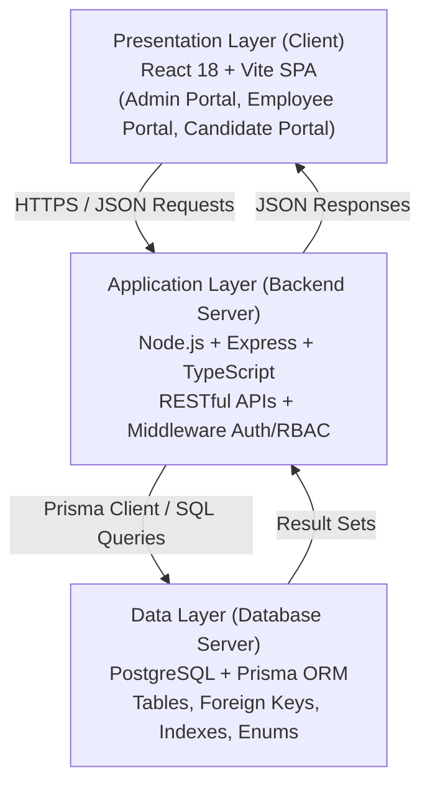
```mermaid
graph TD
    Client["Presentation Layer (Client)<br/>React 18 + Vite SPA<br/>(Admin Portal, Employee Portal, Candidate Portal)"]
    API["Application Layer (Backend Server)<br/>Node.js + Express + TypeScript<br/>RESTful APIs + Middleware Auth/RBAC"]
    DB["Data Layer (Database Server)<br/>PostgreSQL + Prisma ORM<br/>Tables, Foreign Keys, Indexes, Enums"]

    Client -->|HTTPS / JSON Requests| API
    API -->|Prisma Client / SQL Queries| DB
    DB -->|Result Sets| API
    API -->|JSON Responses| Client
```

* **Presentation Layer (Tầng hiển thị)**: Xây dựng dưới dạng Single Page Application (SPA) bằng React 18, render giao diện phía Client, giao tiếp phi đồng bộ với máy chủ qua API JSON.
* **Application Layer (Tầng ứng dụng / Nghiệp vụ)**: Máy chủ Express.js kết hợp TypeScript, chia tách theo mô hình Route - Controller/Service - Data Access, đảm bảo nguyên lý Single Responsibility.
* **Data Layer (Tầng dữ liệu)**: Cơ sở dữ liệu PostgreSQL lưu trữ bền vững, quản lý toàn vẹn dữ liệu qua khóa chính, khóa ngoại và các ràng buộc Unique.

## 1.3. Cơ chế bảo mật và xác thực (Authentication & RBAC)
* **Xác thực phi trạng thái (Stateless Authentication)**: Sử dụng **JSON Web Token (JWT)**. Khi người dùng đăng nhập thành công, máy chủ cấp phát chuỗi token có chữ ký số bí mật (Secret Key) chứa định danh và vai trò người dùng. Mọi request tiếp theo được đính kèm qua HTTP Header `Authorization: Bearer <token>`.
* **Phân quyền dựa trên vai trò (Role-Based Access Control - RBAC)**:
  * Hệ thống chia làm 4 vai trò chính: `ADMIN` (Toàn quyền), `HR_MANAGER` (Quản lý nghiệp vụ nhân sự), `DEPT_MANAGER` (Trưởng phòng duyệt đơn), `EMPLOYEE` (Nhân viên tự phục vụ).
  * Điểm đặc biệt của đồ án là đã hiện thực hóa **Ma trận phân quyền tương tác (Interactive RBAC Matrix)** tại giao diện, cho phép bật/tắt quyền CRUD đối với từng phân hệ nghiệp vụ theo thời gian thực.
* **Mã hóa mật khẩu**: Sử dụng giải thuật băm một chiều **bcrypt** với Salt round = 10, đảm bảo mật khẩu người dùng không thể bị giải mã ngay cả khi CSDL bị lộ.

## 1.4. Hệ quản trị CSDL PostgreSQL & Công cụ Prisma ORM
* **PostgreSQL**: Là hệ quản trị CSDL quan hệ mã nguồn mở mạnh mẽ nhất hiện nay:
  * Đạt chuẩn **ACID** (Atomicity, Consistency, Isolation, Durability) nghiêm ngặt, sống còn đối với các giao dịch tài chính - tiền lương.
  * Hỗ trợ kiểu dữ liệu chuỗi, số chính xác cao (`Decimal` cho tiền lương), `DateTime` cho chấm công và `Enum` cho trạng thái nghiệp vụ.
  * Khả năng đánh chỉ mục Index đa dạng (B-Tree, Hash), tối ưu tốc độ tra cứu lịch sử chấm công và nhật ký kiểm toán.
* **Prisma ORM (Next-generation ORM for Node.js & TypeScript)**:
  * Thay vì viết truy vấn SQL thuần dễ lỗi chính tả và SQL Injection, Prisma cung cấp cú pháp Schema khai báo trực quan (`schema.prisma`).
  * **Type-Safety tuyệt đối**: Tự động sinh ra TypeScript types tương ứng với các bảng CSDL, giúp trình biên dịch bắt lỗi kiểu dữ liệu ngay trong quá trình viết code (Compile time).
  * Hỗ trợ công cụ `prisma db push` và `prisma migrate` giúp quản lý phiên bản CSDL nhất quán giữa các môi trường.

## 1.5. Nền tảng Backend: Node.js, TypeScript & Express.js
* **Node.js**: Nền tảng thực thi JavaScript phía máy chủ dựa trên V8 Engine của Google, hoạt động theo mô hình hướng sự kiện và Non-blocking I/O, xử lý đồng thời hàng nghìn kết nối mà không tốn nhiều tài nguyên bộ nhớ.
* **TypeScript**: Ngôn ngữ mã nguồn mở phát triển bởi Microsoft, bổ sung hệ thống kiểu tĩnh (Static Typing) cho JavaScript:
  * Ngăn ngừa hơn 80% các lỗi runtime phổ biến như `TypeError: undefined is not a function`.
  * Hỗ trợ Intellisense và Refactoring code an toàn khi dự án mở rộng lên hàng nghìn dòng code.
* **Express.js**: Framework Web tối giản, linh hoạt, hỗ trợ cơ chế Middleware mạnh mẽ để bẻ nhỏ các tác vụ: kiểm tra token (`authMiddleware`), ghi log truy vết (`auditMiddleware`), xử lý lỗi tập trung (`errorHandler`).

## 1.6. Nền tảng Frontend: React 18, Vite & Hệ thống Thiết kế Chuẩn hóa
* **React 18**: Thư viện UI hàng đầu thế giới với kiến trúc Component tái sử dụng cao, cơ chế Virtual DOM giúp tối ưu hóa hiệu năng render. Sử dụng React Hooks (`useState`, `useEffect`, `useContext`, `useMemo`) để quản lý trạng thái sạch sẽ.
* **Vite**: Công cụ đóng gói (Build Tool) hiện đại thế hệ mới, sử dụng Native ES Modules trong quá trình phát triển giúp khởi động máy chủ dev chỉ trong vài trăm mili-giây và cập nhật thay đổi (HMR) tức thì.
* **Hệ thống Thiết kế Chuẩn hóa (Standardized Design System)**:
  * **Bộ font Inter thống nhất**: Nạp từ Google Fonts với đầy đủ bảng mã tiếng Việt, giải quyết triệt để vấn đề méo dấu hoặc thô ráp khi hiển thị tiêu đề.
  * **Thước đo kiểu chữ chuẩn**: Quy định `.page-title` (1.625rem / 26px, font-weight 700, màu `#0F172A`) và `.page-subtitle` (0.875rem / 14px, màu `#64748B`) thống nhất trên 100% các màn hình.
  * **Hiệu ứng Glassmorphism & Token màu HSL**: Giao diện mang phong cách hiện đại với nền trong suốt tinh tế, đổ bóng đa tầng và hiệu ứng micro-animations mượt mà.

---

# CHƯƠNG 2: PHÂN TÍCH VÀ THIẾT KẾ HỆ THỐNG

## 2.1. Khảo sát hiện trạng và xác định yêu cầu hệ thống

### 2.1.1. Yêu cầu chức năng (Functional Requirements)
Hệ thống được thiết kế đáp ứng 12 nhóm chức năng nghiệp vụ trọng tâm:

| Mã Yêu Cầu | Tên Phân Hệ | Mô Tả Chức Năng Chi Tiết |
|---|---|---|
| **FR-01** | Quản lý Cơ cấu Tổ chức | Quản lý danh mục Phòng ban, Vị trí/Chức danh, định biên nhân sự; hiển thị Sơ đồ cây phân cấp tương tác. |
| **FR-02** | Tuyển dụng nhân tài (ATS) | Quản lý yêu cầu tuyển dụng, quản lý ứng viên theo quy trình phỏng vấn Kanban, lên lịch phỏng vấn và gửi Offer. |
| **FR-03** | Hội nhập nhân sự mới | Quản lý danh sách Onboarding, cấu hình Checklist nhiệm vụ hội nhập, cấp phát tài khoản phần mềm. |
| **FR-04** | Quản trị Hồ sơ nhân sự | Quản lý thông tin định danh, học vấn, người phụ thuộc, hợp đồng lao động, điều chuyển và quyết định nhân sự. |
| **FR-05** | Ca làm việc & Chấm công | Thiết lập ca làm (Hành chính, Ca sáng, Chiều, Đêm), ghi nhận Check-in/Check-out, tính số ngày công chuẩn (`1.0`, `0.5`, `0.0`), điều chỉnh công. |
| **FR-06** | Nghỉ phép & Lịch nghỉ lễ | Đăng ký và duyệt đơn xin nghỉ phép, quản lý quỹ phép năm, thiết lập danh mục lịch nghỉ Lễ hưởng nguyên lương. |
| **FR-07** | Đánh giá Hiệu suất (KPI) | Khởi tạo chu kỳ đánh giá (Review Cycle), cấu hình mẫu tiêu chí KPI, giao chỉ tiêu và chấm điểm đánh giá hiệu suất. |
| **FR-08** | Tính Lương Động (Payroll) | Quản lý kỳ lương tháng, tính lương tự động dựa trên công thực tế, khấu trừ BHXH (10.5%), trừ thuế TNCN lũy tiến, khóa sổ kỳ lương (`LOCKED`). |
| **FR-09** | Quản lý Tài sản & Thiết bị | Quản lý danh mục kho thiết bị (Laptop, PC, Màn hình, Thẻ từ), lập Biên bản bàn giao chuẩn BM-01, thu hồi tài sản khi thôi việc. |
| **FR-10** | Động cơ Tham số Động | Cấu hình tham số định lượng: tỷ lệ BHXH, mức giảm trừ gia cảnh, trần đóng bảo hiểm, ngày chốt công, ngưỡng duyệt nghỉ phép. |
| **FR-11** | Quản trị Hệ thống & Bảo mật | Trung tâm phê duyệt đa cấp (Approval Workflows), phân quyền RBAC Matrix, nhật ký kiểm toán (Audit Logs), hệ thống thông báo. |
| **FR-12** | Báo cáo & HR Analytics | Biểu đồ phân bố nhân sự theo phòng ban, tỷ lệ nhân viên thử việc/chính thức, tỷ lệ đi làm đúng giờ, tổng quỹ lương tháng. |

### 2.1.2. Yêu cầu phi chức năng (Non-Functional Requirements)
1. **Hiệu năng (Performance)**: Thời gian phản hồi của 95% API < 150ms đối với các tác vụ thông thường và < 1s đối với tác vụ tính lương hàng loạt cho 500 nhân viên.
2. **Tính mở rộng (Scalability)**: Thiết kế dạng Module hóa độc lập, dễ dàng bổ sung các dịch vụ mới (như Mobile App, Chấm công khuôn mặt AI).
3. **Tính toàn vẹn & Không hard-code (Dynamic Integrity)**: 100% các biến số định lượng trong công thức tính toán nghiệp vụ phải được nạp động từ CSDL, có giá trị mặc định fallback an toàn.
4. **Bảo mật (Security)**: Toàn bộ mật khẩu được băm bằng bcrypt; các endpoint nội bộ đều bắt buộc qua middleware kiểm tra JWT; nhật ký kiểm toán ghi nhận mọi thao tác nhạy cảm (IP, Method, Action, Timestamp).
5. **Tính khả dụng (Usability)**: Giao diện trực quan, ngôn ngữ tiếng Việt chuẩn hành chính doanh nghiệp, chuẩn hóa font chữ Inter đồng nhất trên 100% các màn hình.

---

## 2.2. Sơ đồ Ca sử dụng (Use Case Diagrams) & Đặc tả Chi tiết từng Module
Hệ thống Quản trị Nguồn nhân lực Doanh nghiệp được phân rã thành các phân hệ nghiệp vụ độc lập, bao quát toàn diện vòng đời nhân sự. Dưới đây là đặc tả chi tiết của từng phân hệ, bao gồm Sơ đồ ca sử dụng (Use Case Diagram), ma trận phân rã chức năng, quy tắc nghiệp vụ (Business Rules), bảng đặc tả ca sử dụng chi tiết (Detailed Use Case Specifications) và các Sơ đồ tuần tự (Sequence Diagrams) cho từng luồng xử lý.

---


### 2.2.0. Sơ đồ Ca sử dụng Tổng quát Toàn Hệ thống (Overall System Use Case Diagram)

Hệ thống Quản trị Nguồn nhân lực Doanh nghiệp (Enterprise HRM) phục vụ 5 nhóm Tác nhân (Actors) chính tham gia vào toàn bộ vòng đời nhân sự. Dưới đây là Sơ đồ Ca sử dụng Tổng thể (System-Level Use Case Diagram) mô tả bức tranh toàn cảnh về sự tương tác giữa các Tác nhân với 12 Phân hệ chức năng cốt lõi của hệ thống:


```mermaid
flowchart TB
    %% Styling Classes
    classDef actorAdmin fill:#1e293b,stroke:#0f172a,stroke-width:2px,color:#ffffff,font-weight:bold;
    classDef actorHR fill:#0284c7,stroke:#0369a1,stroke-width:2px,color:#ffffff,font-weight:bold;
    classDef actorMgr fill:#7c3aed,stroke:#6d28d9,stroke-width:2px,color:#ffffff,font-weight:bold;
    classDef actorEmp fill:#059669,stroke:#047857,stroke-width:2px,color:#ffffff,font-weight:bold;
    classDef actorCan fill:#ea580c,stroke:#c2410c,stroke-width:2px,color:#ffffff,font-weight:bold;

    classDef pkgOrg fill:#f0f9ff,stroke:#0284c7,stroke-width:2px,color:#0369a1,font-weight:bold;
    classDef pkgRec fill:#fdf4ff,stroke:#c026d3,stroke-width:2px,color:#86198f,font-weight:bold;
    classDef pkgCore fill:#ecfdf5,stroke:#059669,stroke-width:2px,color:#065f46,font-weight:bold;
    classDef pkgTime fill:#fffbeb,stroke:#d97706,stroke-width:2px,color:#92400e,font-weight:bold;
    classDef pkgLeave fill:#fef2f2,stroke:#dc2626,stroke-width:2px,color:#991b1b,font-weight:bold;
    classDef pkgPay fill:#f0fdf4,stroke:#16a34a,stroke-width:2px,color:#166534,font-weight:bold;
    classDef pkgKPI fill:#faf5ff,stroke:#9333ea,stroke-width:2px,color:#6b21a8,font-weight:bold;
    classDef pkgAsset fill:#f8fafc,stroke:#475569,stroke-width:2px,color:#1e293b,font-weight:bold;
    classDef pkgSys fill:#f1f5f9,stroke:#334155,stroke-width:2px,color:#0f172a,font-weight:bold;
    classDef pkgESS fill:#e0f2fe,stroke:#0284c7,stroke-width:2px,color:#075985,font-weight:bold;
    classDef pkgPortal fill:#ffedd5,stroke:#ea580c,stroke-width:2px,color:#9a3412,font-weight:bold;

    %% Actors
    ActorAdmin(["👑 Quản trị viên Hệ thống\n(System Admin)"]):::actorAdmin
    ActorHR(["👔 Quản lý Nhân sự & C&B\n(HR Manager / Staff)"]):::actorHR
    ActorMgr(["🧑‍💼 Trưởng bộ phận\n(Line Manager)"]):::actorMgr
    ActorEmp(["👤 Nhân viên Doanh nghiệp\n(Employee)"]):::actorEmp
    ActorCan(["🧑‍🎓 Ứng viên Tuyển dụng\n(Job Candidate)"]):::actorCan

    %% Subsystem Packages
    subgraph Subsystems ["CÁC PHÂN HỆ NGHIỆP VỤ DOANH NGHIỆP (ENTERPRISE HRM MODULES)"]
        PKG_ORG["🏢 Phân hệ Cơ cấu Tổ chức\n- Quản lý Phòng ban & Vị trí\n- Sơ đồ Cây Phân cấp & Định biên Quota"]:::pkgOrg
        PKG_REC["🎯 Phân hệ Tuyển dụng & ATS\n- Yêu cầu Tuyển dụng & Job Postings\n- Kanban ATS 5 giai đoạn\n- Lịch Phỏng vấn & Offer Letter"]:::pkgRec
        PKG_CORE["📋 Phân hệ Core HR & Hợp đồng\n- Hồ sơ Nhân viên & Học vấn\n- Hợp đồng Thử việc / Chính thức\n- Hội nhập Onboarding & Bàn giao"]:::pkgCore
        PKG_TIME["⏰ Phân hệ Ca làm & Chấm công\n- Check-in/Check-out GPS + Geofence\n- Xếp ca Hành chính / Ca kíp\n- Giải trình & Điều chỉnh công"]:::pkgTime
        PKG_LEAVE["🌴 Phân hệ Nghỉ phép & Tăng ca\n- Đăng ký nghỉ phép đa cấp\n- Quản lý Quỹ phép năm & Lễ Tết\n- Đăng ký & Duyệt làm thêm giờ (OT)"]:::pkgLeave
        PKG_PAY["💰 Phân hệ Tiền lương (Payroll Engine)\n- Nạp bảng công tự động\n- Trích đóng BHXH (10.5%) & Thuế TNCN\n- Khóa sổ kế toán & Phiếu lương"]:::pkgPay
        PKG_KPI["🏆 Phân hệ Đánh giá Hiệu suất (KPI)\n- Chu kỳ Đánh giá & Tiêu chí\n- Nhân viên tự chấm điểm\n- Quản lý đánh giá & Xếp loại"]:::pkgKPI
        PKG_ASSET["💻 Phân hệ Quản lý Tài sản (BM-01)\n- Danh mục kho thiết bị công nghệ\n- Biên bản Bàn giao chuẩn BM-01\n- Thu hồi tài sản khi nghỉ việc"]:::pkgAsset
        PKG_SYS["⚙️ Phân hệ Hệ thống & Phân quyền\n- Động cơ Tham số Động (SystemSetting)\n- Ma trận Phân quyền RBAC Matrix\n- Nhật ký Kiểm toán (Audit Logs)"]:::pkgSys
        PKG_ESS["📱 Cổng Nhân viên Tự phục vụ (ESS)\n- Bảng điều khiển cá nhân\n- Điểm danh Mobile / Web\n- Tra cứu Bảng lương & Nộp đơn phép"]:::pkgESS
        PKG_PORTAL["🌐 Cổng Tuyển dụng Công khai\n- Xem việc làm & Thương hiệu\n- Nộp hồ sơ CV trực tuyến\n- Tra cứu tiến độ ứng tuyển"]:::pkgPortal
    end

    %% Interactions
    ActorAdmin --> PKG_SYS
    ActorAdmin --> PKG_ORG
    ActorAdmin --> PKG_ASSET

    ActorHR --> PKG_ORG
    ActorHR --> PKG_REC
    ActorHR --> PKG_CORE
    ActorHR --> PKG_TIME
    ActorHR --> PKG_LEAVE
    ActorHR --> PKG_PAY
    ActorHR --> PKG_KPI
    ActorHR --> PKG_ASSET

    ActorMgr --> PKG_REC
    ActorMgr --> PKG_TIME
    ActorMgr --> PKG_LEAVE
    ActorMgr --> PKG_KPI

    ActorEmp --> PKG_ESS
    ActorCan --> PKG_PORTAL
```

#### Bảng ma trận Trách nhiệm và Phân quyền Tác nhân (Actor Responsibility Matrix)

| Tác nhân (Actor) | Vai trò hệ thống | Trách nhiệm và Phạm vi tương tác chính | Phân hệ tham gia |
|---|---|---|---|
| **System Admin** | Quản trị viên tối cao | Cấu hình tham số nghiệp vụ toàn hệ thống (tỷ lệ BHXH, mức thuế, ngày công chuẩn); Phân quyền qua Interactive RBAC Matrix; Giám sát toàn vẹn CSDL và Audit Logs. | Hệ thống, Phân quyền, Tham số động, Tài sản |
| **HR Manager / C&B** | Quản lý Nhân sự & Tiền lương | Quản lý danh mục tổ chức; Điều hành chiến dịch tuyển dụng & Offer; Tiếp nhận Onboarding; Quản lý hồ sơ & Hợp đồng; Vận hành động cơ tính lương (Payroll Engine) và duyệt lương. | Tổ chức, Tuyển dụng ATS, Core HR, Chấm công, Nghỉ phép, Tiền lương, KPI, Tài sản |
| **Line Manager** | Trưởng bộ phận | Phê duyệt yêu cầu tuyển dụng cho phòng ban; Tham gia phỏng vấn chuyên môn và chấm điểm ứng viên; Phê duyệt đơn xin nghỉ phép/OT của nhân viên cấp dưới; Đánh giá KPI cuối kỳ. | Tuyển dụng ATS, Chấm công, Nghỉ phép & OT, Đánh giá KPI |
| **Employee** | Nhân viên doanh nghiệp | Sử dụng Cổng Tự phục vụ (ESS): Điểm danh Check-in/Check-out GPS; Nộp đơn xin nghỉ phép và tăng ca; Xem lịch làm việc cá nhân; Tra cứu và tải phiếu lương hàng tháng; Tự đánh giá KPI. | Cổng Nhân viên Tự phục vụ (ESS) |
| **Job Candidate** | Ứng viên tự do | Truy cập Cổng tuyển dụng công khai (Public Career Portal): Tìm kiếm tin tuyển dụng; Nộp hồ sơ và tải lên file CV; Theo dõi trạng thái hồ sơ tuyển dụng thời gian thực. | Cổng Tuyển dụng Công khai (Career Portal) |

---


### 2.2.1. Module Cơ cấu Tổ chức (Organization)
### Phân tích nghiệp vụ: Module Tổ chức (Organization)

#### 1. Giới thiệu chung
- **Mục đích nghiệp vụ**: Đây là module nền móng của phần mềm HRM. Mục tiêu của nó là số hóa mô hình tổ chức thực tế của doanh nghiệp (Từ Ban Lãnh đạo xuống các Khối / Ban / Phòng / Đội / Nhóm) và thiết lập danh mục các chức danh công việc hợp lệ.
- **Đối tượng sử dụng (Vai trò)**: Ban Lãnh đạo (Xem tổng quan cơ cấu và định biên), Trưởng phòng Nhân sự & Chuyên viên C&B (Thiết lập, tìm kiếm, lọc và phân bổ vị trí), Tất cả nhân viên (Tra cứu sơ đồ công ty và thông tin phòng ban).
- **Phạm vi (In scope)**: Quản lý sơ đồ phòng ban đa cấp, Quản lý danh mục chức danh/ngạch lương, Tìm kiếm & Lọc đa chiều, Cơ chế Khóa/Mở khóa (Soft Lock) đóng băng danh mục, và Trực quan hóa sơ đồ tổ chức dạng cây.
- **Ngoài phạm vi (Out of scope)**: Việc quyết định "Ai sẽ làm chức vụ gì, ở phòng nào" thuộc về phân hệ Hồ sơ Nhân sự (Core HR). Phân hệ Tổ chức cung cấp danh mục dùng chung (Master Data) để các module khác kế thừa.

---

#### 2. Các đối tượng nghiệp vụ cốt lõi (Core Entities)

| Đối tượng (Thực thể) | Ý nghĩa nghiệp vụ trong thực tế | Các thông tin quan trọng cần quản lý | Các ràng buộc quản trị cốt lõi |
|---|---|---|---|
| **Phòng ban** (Department) | Một đơn vị tập thể trong công ty (Ví dụ: Khối Kinh Doanh, Phòng IT, Ban Kiểm soát). | - `Mã phòng`: (Bắt buộc, Duy nhất toàn hệ thống)<br>- `Tên phòng`: (Bắt buộc)<br>- `Phòng ban cha`: Xác định cấp trên quản lý trực tiếp.<br>- `Định mức nhân sự`: Số người tối đa được duyệt.<br>- `Trạng thái`: Hoạt động (`ACTIVE`) / Tạm khóa (`INACTIVE`). | - Tạo thành sơ đồ hình cây (Phòng con báo cáo cho Phòng cha).<br>- Chặn tạo vòng lặp đệ quy (không chọn con làm cha).<br>- Cấm xóa cứng nếu phòng đang có nhân sự làm việc. |
| **Vị trí công tác** (Position) | Một ngạch hoặc chức danh công việc cụ thể (Ví dụ: Chuyên viên Tuyển dụng, Trưởng nhóm IT). | - `Mã vị trí`: (Bắt buộc, Duy nhất)<br>- `Tên chức danh`: (Bắt buộc)<br>- `Cấp bậc`: Thực tập sinh, Nhân viên, Quản lý...<br>- `Dải lương`: Mức lương trần (`maxSalary`) và sàn (`minSalary`).<br>- `Trạng thái`: Đang áp dụng / Ngừng áp dụng. | - Một chức danh phải gắn liền với một Phòng ban cụ thể.<br>- Ràng buộc `minSalary <= maxSalary`.<br>- Không được xóa nếu đang có nhân sự đảm nhiệm. |

---

#### 3. Ma trận phân rã chức năng chi tiết (Functional Breakdown Matrix)

| Nhóm chức năng | Mã Use Case | Tên nghiệp vụ con | Mục đích & Mô tả chi tiết | Tác nhân chính |
|---|---|---|---|---|
| **1. Quản lý Phòng ban** | UC-ORG-01-01 | Thêm mới phòng ban | Khởi tạo đơn vị mới, thiết lập vị trí trong cây phân cấp và chỉ tiêu định mức tuyển dụng. | HR Manager, Admin |
| | UC-ORG-01-02 | Chỉnh sửa phòng ban | Đổi tên, thay đổi trưởng phòng, điều chỉnh định biên quota, chuyển đổi phòng ban cha. | HR Manager, Admin |
| | **UC-ORG-01-03** | **Khóa / Mở khóa phòng ban** | **Đóng băng hoạt động (Soft Lock) phòng ban tạm ngưng hoặc giải thể mềm mà không làm mất lịch sử nhân sự.** | HR Manager, Admin |
| | **UC-ORG-01-04** | **Tìm kiếm & Lọc phòng ban** | **Tìm kiếm real-time theo Mã/Tên phòng ban, Lọc theo trạng thái Hoạt động / Tạm khóa, Phân trang 10 dòng/trang.** | HR Staff, HR Manager |
| | UC-ORG-01-05 | Xóa phòng ban (Hard Delete) | Xóa triệt để phòng ban rỗng (kiểm tra an toàn: số nhân viên = 0 và không có phòng con). | HR Manager, Admin |
| | UC-ORG-01-06 | Giám sát định biên nhân sự | Thống kê số lượng nhân viên thực tế đang ngồi ở từng phòng so với Quota được duyệt, tính tỷ lệ lấp đầy. | Ban Lãnh đạo, HR |
| **2. Quản lý Vị trí công tác** | UC-ORG-02-01 | Thêm mới vị trí | Thiết lập chức danh mới, quy định cấp bậc nghề nghiệp và phân bổ về phòng ban trực thuộc. | HR Manager, Admin |
| | UC-ORG-02-02 | Chỉnh sửa vị trí | Cập nhật tên chức danh, điều chỉnh cấp bậc thâm niên, sửa đổi bản mô tả công việc (JD). | HR Manager, Admin |
| | **UC-ORG-02-03** | **Khóa / Mở khóa vị trí** | **Tạm dừng tuyển dụng chức danh (chuyển sang `INACTIVE`), ẩn khỏi form Onboarding nhân viên mới.** | HR Manager, Admin |
| | **UC-ORG-02-04** | **Tìm kiếm & Lọc vị trí đa chiều** | **Tìm theo tên/mã chức danh, Lọc kết hợp theo Phòng ban và theo Cấp bậc (Staff, Lead, Manager, Director).** | HR Staff, C&B |
| | UC-ORG-02-05 | Kiểm soát dải lương (Salary Band) | Ràng buộc mức lương sàn không vượt quá mức lương trần (`minSalary <= maxSalary`) để kiểm soát ngân sách. | C&B, HR Manager |
| | UC-ORG-02-06 | Xóa vị trí an toàn | Xóa chức danh khi chưa từng có nhân viên nào được bổ nhiệm (`employeeCount = 0`). | HR Manager, Admin |
| **3. Trực quan hóa Sơ đồ** | UC-ORG-03-01 | Xem cây phân cấp tổ chức | Hiển thị toàn cảnh cơ cấu công ty dạng đồ thị cây (Tree Chart) tương tác trực quan. | Toàn bộ nhân viên |
| | UC-ORG-03-02 | Thu gọn / Mở rộng nhánh cây | Cho phép bấm vào các nút phòng ban để phóng to, thu nhỏ các nhánh phòng ban con trực thuộc. | Toàn bộ nhân viên |
| | UC-ORG-03-03 | Xem thẻ chi tiết nhân sự trên Node | Click vào từng Node phòng ban để xem danh sách nhân sự hiện tại, chức vụ và trưởng bộ phận. | Ban Lãnh đạo, HR |

---

#### 4. Quy tắc nghiệp vụ cốt lõi toàn module

1. **Nguyên tắc "Cấu trúc cây linh hoạt & Chống vòng lặp"**:
   - Doanh nghiệp có thể liên tục tái cấu trúc (sáp nhập, chia tách). Hệ thống cho phép cập nhật `parentId` bất cứ lúc nào.
   - Bắt buộc kiểm tra chuỗi phả hệ: Cấm tuyệt đối chọn phòng ban con hoặc chính nó làm phòng ban cha để tránh tạo vòng lặp vô tận (Infinite Loop).
2. **Nguyên tắc "Khóa nghiệp vụ thay vì xóa cứng"**:
   - Trong môi trường doanh nghiệp thực tế, các danh mục phòng ban và chức danh mang tính lịch sử pháp lý (gắn liền với bảng lương, hợp đồng lao động cũ, hồ sơ bảo hiểm).
   - Khi phòng ban hoặc chức danh không còn sử dụng, nghiệp vụ chuẩn là **Khóa (Chuyển trạng thái `INACTIVE`)** thay vì Xóa cứng.
3. **Nguyên tắc "Bảo vệ an toàn dữ liệu nhân sự"**:
   - Nếu thực hiện xóa cứng (Hard Delete), hệ thống kích hoạt cơ chế phòng vệ nghiêm ngặt: Kiểm tra số lượng nhân sự liên kết (`employee.count`). Nếu lớn hơn 0, hệ thống từ chối xóa và yêu cầu HR phải điều chuyển nhân sự trước.

---

#### 5. Tương tác với các phân hệ (Module) khác

- **Với Module Tuyển dụng (Recruitment & ATS)**:
  - Vị trí và Phòng ban bị **Khóa (`INACTIVE`)** sẽ tự động bị loại khỏi danh mục đăng tin tuyển dụng (Job Posting).
  - Định mức nhân sự (`quota`) được dùng để kiểm tra tự động xem phòng ban có được phép đề xuất tuyển thêm người hay không.
- **Với Module Hồ sơ Nhân viên (Core HR)**:
  - Cung cấp danh mục các phòng ban và vị trí đang **Hoạt động (`ACTIVE`)** để chọn khi tiếp nhận nhân viên mới (Onboarding) hoặc điều chuyển công tác.
- **Với Module Tiền lương (Payroll)**:
  - Dải lương (Min - Max) của Vị trí công tác được sử dụng để kiểm soát khung lương thỏa thuận khi tạo Hợp đồng lao động, cảnh báo vượt trần quỹ lương.


### Usecase: UC-ORG-01 - Quản lý Danh mục Phòng ban (Department Management)

#### 1. Giới thiệu chức năng
- **Mục đích**: Cung cấp bộ công cụ toàn diện cho Bộ phận Nhân sự (HR) để quản lý cơ cấu các đơn vị, phòng ban trong toàn doanh nghiệp. Hệ thống không chỉ hỗ trợ CRUD cơ bản mà còn phục vụ các nghiệp vụ quản trị chuyên sâu như: tìm kiếm/lọc đa chiều, đóng băng/khóa phòng ban ngưng hoạt động, kiểm soát định mức nhân sự (Quota) và ngăn chặn thất thoát dữ liệu.
- **Actor (Tác nhân)**: Giám đốc Nhân sự (HR Manager), Chuyên viên Tổ chức & Định biên, Quản trị viên hệ thống (Admin).
- **Điều kiện tiên quyết**: Người dùng đã đăng nhập và được gán quyền `MANAGE_ORGANIZATION` hoặc vai trò `ADMIN`/`HR_MANAGER`.

##### Danh mục các chức năng con (Sub-features):
1. **UC-ORG-01-01: Thêm mới phòng ban**: Thiết lập đơn vị mới vào cơ cấu tổ chức (có chỉ định phòng ban cha).
2. **UC-ORG-01-02: Chỉnh sửa thông tin phòng ban**: Đổi tên, thay đổi người quản lý, điều chỉnh định biên quota, luân chuyển phòng ban cha.
3. **UC-ORG-01-03: Khóa / Mở khóa phòng ban (Đổi trạng thái Active / Inactive)**: Đóng băng phòng ban tạm ngưng hoạt động hoặc giải thể mềm mà không làm mất lịch sử nhân sự.
4. **UC-ORG-01-04: Tìm kiếm & Lọc danh sách phòng ban**: Tìm nhanh theo từ khóa (Mã, Tên phòng), lọc theo trạng thái hoạt động và phân trang.
5. **UC-ORG-01-05: Xóa phòng ban (Hard Delete)**: Xóa triệt để các phòng ban nhập sai hoặc không còn sử dụng (chỉ xóa khi phòng ban rỗng).
6. **UC-ORG-01-06: Giám sát định biên & Tỷ lệ lấp đầy**: Theo dõi số lượng nhân sự thực tế đang làm việc so với chỉ tiêu định biên tối đa được duyệt.

---

#### 2. Dữ liệu nghiệp vụ đầu vào (Input Data & Parameters)

##### 2.1. Dữ liệu biểu mẫu Phòng ban (Department Form Data)
| Tên trường | Kiểu dữ liệu | Tính chất | Ý nghĩa nghiệp vụ & Ràng buộc |
|---|---|---|---|
| `Mã phòng ban` (code) | Chuỗi (String) | Bắt buộc | Mã định danh viết tắt (VD: `IT`, `SALE`, `HR`). **Ràng buộc:** Duy nhất trên toàn hệ thống, không phân biệt hoa thường. |
| `Tên phòng ban` (name) | Chuỗi (String) | Bắt buộc | Tên gọi chính thức đầy đủ (VD: `Phòng Kỹ thuật & Công nghệ`). Tối đa 255 ký tự. |
| `Người quản lý` (managerName) | Chuỗi (String) | Tùy chọn | Họ tên hoặc mã của Trưởng bộ phận phụ trách. |
| `Định mức nhân sự` (quota) | Số nguyên (Integer) | Bắt buộc | Số lượng nhân sự tối đa được phép bố trí vào phòng. Giá trị mặc định là `15` người (ngưỡng tối thiểu ≥ 1). |
| `Phòng ban cha` (parentId) | UUID / Chuỗi | Tùy chọn | Đơn vị cấp trên trực tiếp. Nếu để trống -> Phòng ban cấp cao nhất (Root Department). |
| `Trạng thái` (status) | Enum/String | Mặc định | `ACTIVE` (Đang hoạt động) hoặc `INACTIVE` (Ngừng hoạt động / Tạm khóa). |

##### 2.2. Dữ liệu Tìm kiếm & Bộ lọc (Search & Filter Criteria)
| Tiêu chí | Loại điều khiển | Giá trị lựa chọn | Hành vi hệ thống |
|---|---|---|---|
| `Từ khóa tìm kiếm` (searchTerm) | Input Text | Ký tự bất kỳ | Lọc real-time theo Mã phòng ban hoặc Tên phòng ban (chứa chuỗi tìm kiếm). |
| `Lọc theo trạng thái` (statusFilter) | Dropdown Select | `Tất cả` / `ACTIVE` / `INACTIVE` | Chỉ hiển thị các phòng ban có trạng thái tương ứng. |
| `Phân trang` (Pagination) | Nút chuyển trang | Trang hiện tại (`currentPage`), 10 dòng/trang | Tính toán cắt mảng dữ liệu hiển thị đúng 10 bản ghi trên mỗi trang. |

---

#### 3. Quy tắc nghiệp vụ (Business Rules)

| Mã Quy tắc | Tình huống nghiệp vụ | Cách hệ thống xử lý | Thông báo hiển thị cho người dùng |
|---|---|---|---|
| **BR-ORG-01-01** | **Kiểm soát trùng lặp mã khi tạo**: HR nhập mã phòng ban đã tồn tại trong CSDL. | Backend kiểm tra `findUnique({ where: { code } })`. Nếu tồn tại -> Từ chối, trả HTTP 400 hoặc 409. | "Mã phòng ban đã tồn tại" |
| **BR-ORG-01-02** | **Kiểm tra phòng ban cha hợp lệ**: HR chọn phòng ban cha không tồn tại hoặc đã bị xóa. | Backend kiểm tra sự tồn tại của `parentId`. Nếu không thấy -> Trả HTTP 400. | "Phòng ban cha không hợp lệ" |
| **BR-ORG-01-03** | **Chống vòng lặp cây đệ quy khi Sửa**: HR sửa phòng ban cha thành chính nó hoặc chọn phòng con trực thuộc làm cha. | Backend kiểm tra chuỗi phả hệ cây (Hierarchy Path). Nếu phát hiện vòng lặp vô tận -> Từ chối, trả HTTP 400. | "Không thể chọn phòng ban con hoặc chính nó làm phòng ban cha" |
| **BR-ORG-01-04** | **Lỗi trùng mã khi Sửa**: HR sửa mã phòng ban trùng với mã của một phòng ban khác. | Prisma ném ngoại lệ `P2002 Unique Constraint`. Backend bắt lỗi trả về HTTP 409/500. | "Mã phòng ban đã tồn tại trên hệ thống" |
| **BR-ORG-01-05** | **Khóa phòng ban (Soft Lock / Inactive)**: HR bấm chuyển trạng thái phòng ban sang `INACTIVE`. | Cập nhật `status = 'INACTIVE'`. Hệ thống chuyển biểu tượng sang Ổ khóa (Lock). Cấm tạo thêm vị trí hoặc tuyển dụng mới vào phòng này. | "Đã chuyển trạng thái phòng ban sang Ngừng hoạt động" |
| **BR-ORG-01-06** | **Mở khóa phòng ban (Unlock / Activate)**: HR kích hoạt lại phòng ban đang bị khóa. | Cập nhật `status = 'ACTIVE'`. Mở lại toàn bộ quyền tuyển dụng, luân chuyển và bổ nhiệm. | "Đã kích hoạt lại phòng ban thành công" |
| **BR-ORG-01-07** | **Ràng buộc an toàn khi Xóa (Hard Delete)**: HR bấm xóa một phòng ban đang có nhân viên làm việc (`employees > 0`). | Backend đếm số lượng nhân sự `employee.count({ where: { departmentId } })`. Nếu > 0 -> Hủy bỏ lệnh xóa, trả HTTP 400. | "Không thể xóa phòng ban đang có nhân viên" |
| **BR-ORG-01-08** | **Ràng buộc phòng ban con khi Xóa**: HR xóa một phòng ban cha đang chứa các phòng ban con trực thuộc. | Kiểm tra `children.count > 0`. Nếu còn phòng con -> Từ chối xóa để tránh gãy cây cấu trúc. | "Vui lòng chuyển hoặc xóa các phòng ban con trước khi xóa phòng ban cha" |
| **BR-ORG-01-09** | **Quy tắc tìm kiếm không phân biệt hoa thường (Case-insensitive)**: HR gõ từ khóa `it`, `It` hay `IT`. | Hệ thống chuẩn hóa chuỗi về chữ thường trước khi so khớp `toLowerCase().includes()`. | Hiển thị kết quả khớp chính xác |
| **BR-ORG-01-10** | **Tự động reset trang khi lọc**: Người dùng đang ở trang 3 nhưng đổi từ khóa tìm kiếm hoặc đổi bộ lọc trạng thái. | Hệ thống tự động đặt lại `currentPage = 1` để tránh tình trạng trang trống rỗng. | Hiển thị trang 1 của kết quả lọc mới |

---

#### 4. Đặc tả chi tiết các Use Case chức năng con (Sub-Use Cases Specification)

Mỗi chức năng con trong module Quản lý Danh mục Phòng ban gồm Sơ đồ Use Case phân rã trực quan và Bảng đặc tả 8 mục nghiệp vụ chuẩn hóa:

---

##### 4.1. UC-ORG-01-01: Thêm mới phòng ban (Create Department)

###### Sơ đồ Use Case:
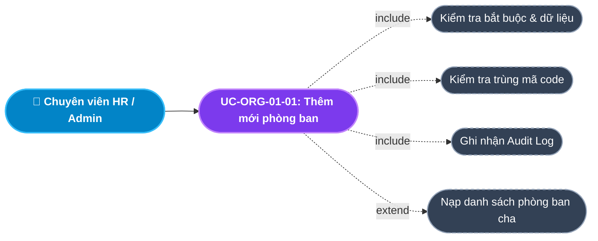
```mermaid
flowchart LR
    classDef actor fill:#0284c7,stroke:#38bdf8,stroke-width:2px,color:#ffffff,font-weight:bold;
    classDef main fill:#7c3aed,stroke:#c084fc,stroke-width:2px,color:#ffffff,font-weight:bold;
    classDef sub fill:#334155,stroke:#94a3b8,stroke-width:1.5px,color:#ffffff,stroke-dasharray: 4 4;

    Actor(["👤 Chuyên viên HR / Admin"]):::actor
    UC(["UC-ORG-01-01: Thêm mới phòng ban"]):::main
    UC_Val(["Kiểm tra bắt buộc & dữ liệu"]):::sub
    UC_Code(["Kiểm tra trùng mã code"]):::sub
    UC_Parent(["Nạp danh sách phòng ban cha"]):::sub
    UC_Audit(["Ghi nhận Audit Log"]):::sub

    Actor --> UC
    UC -.->|include| UC_Val
    UC -.->|include| UC_Code
    UC -.->|include| UC_Audit
    UC -.->|extend| UC_Parent
```

###### Bảng đặc tả nghiệp vụ:

| STT | Hạng mục | Nội dung chi tiết |
|:---:|---|---|
| **1** | **Thông tin chung** | - **UC ID**: `UC-ORG-01-01`<br/>- **UC Name**: Thêm mới phòng ban (Create Department)<br/>- **Actor**: Chuyên viên HR, Trưởng phòng Nhân sự (HR Manager), Quản trị viên (Admin)<br/>- **Mục tiêu**: Thiết lập phòng ban/đơn vị mới vào cơ cấu tổ chức để quản lý nhân sự và phân bổ định biên.<br/>- **Mô tả**: Người dùng nhập thông tin định danh (Mã, Tên), định mức nhân sự (Quota), quản lý và chọn phòng ban cấp trên.<br/>- **Priority**: High (Bắt buộc) |
| **2** | **Trigger** | Người dùng nhấn nút **"+ Thêm phòng ban"** trên thanh công cụ của màn hình Danh mục phòng ban. |
| **3** | **Pre-condition** | 1. Đã đăng nhập thành công vào hệ thống HRM.<br/>2. Có quyền `MANAGE_ORGANIZATION` hoặc vai trò `ADMIN` / `HR_MANAGER`.<br/>3. Màn hình Danh mục phòng ban đã tải xong dữ liệu. |
| **4** | **Post-condition** | 1. Bản ghi phòng ban mới được lưu vào CSDL với trạng thái mặc định `ACTIVE`.<br/>2. Bảng danh sách hiển thị ngay phòng ban mới.<br/>3. Phòng ban xuất hiện trong dropdown chọn phòng ban ở module Nhân viên, Vị trí.<br/>4. Ghi nhận Audit Log: Thời gian, Actor, hành động tạo. |
| **5** | **Main Flow** | 1. Bấm nút **"+ Thêm phòng ban"**.<br/>2. Hệ thống mở Modal Form, nạp danh sách phòng ban cha và điền sẵn Định mức Quota = `15`.<br/>3. Nhập đầy đủ: Mã phòng ban, Tên phòng ban, Định mức Quota, Quản lý, chọn Phòng ban cha.<br/>4. Bấm nút **"Lưu"**.<br/>5. Client kiểm tra hợp lệ dữ liệu (Mã, Tên không rỗng, Quota ≥ 1).<br/>6. Gửi request `POST /api/departments` kèm payload dữ liệu.<br/>7. Backend kiểm tra quyền và kiểm tra duy nhất mã code (`BR-ORG-01-01`).<br/>8. Backend lưu bản ghi với `status = 'ACTIVE'`, trả về `HTTP 201 Created`.<br/>9. Giao diện đóng Modal, nạp lại danh sách và hiển thị Toast thông báo thành công. |
| **6** | **Alternative / Exception Flow** | - **AF-01 (Hủy bỏ)**: Bấm "Hủy" hoặc icon `X` → Đóng modal ngay lập tức, không lưu dữ liệu.<br/>- **AF-02 (Tạo phòng Root)**: Không chọn phòng ban cha → Lưu `parentId = null`, làm phòng ban cấp cao nhất.<br/>- **EF-01 (Thiếu trường bắt buộc)**: Để trống Mã hoặc Tên → Highlight viền đỏ, báo lỗi *"Vui lòng nhập đủ Mã và Tên phòng ban!"*.<br/>- **EF-02 (Trùng mã code)**: Mã đã tồn tại → Backend trả lỗi 400/409, giao diện báo *"Mã phòng ban đã tồn tại!"*, giữ nguyên dữ liệu form.<br/>- **EF-03 (Quota sai)**: Nhập Quota ≤ 0 → Báo lỗi *"Định mức nhân sự phải là số nguyên dương ≥ 1"*.<br/>- **EF-04 (Mất kết nối)**: Lỗi mạng hoặc server 500 → Toast báo lỗi *"Không thể kết nối đến máy chủ"*. |
| **7** | **Business Rules & Validation** | - `BR-ORG-01-01`: Mã phòng ban (`code`) duy nhất toàn hệ thống (case-insensitive), tối đa 50 ký tự.<br/>- `BR-ORG-01-02`: Phòng ban cha phải đang ở trạng thái `ACTIVE`.<br/>- `name`: Bắt buộc, chuỗi 1-255 ký tự, không chứa toàn dấu cách.<br/>- `quota`: Bắt buộc, số nguyên dương ≥ 1, mặc định = 15.<br/>- Trạng thái khởi tạo luôn là `ACTIVE`. |
| **8** | **Acceptance Criteria** | - **AC-01**: Bấm "+ Thêm phòng ban" mở modal < 200ms với quota mặc định là 15.<br/>- **AC-02**: Nhập trùng mã → Hệ thống chặn lại, báo lỗi rõ ràng và không làm mất dữ liệu đã gõ.<br/>- **AC-03**: Nhập hợp lệ và bấm Lưu → Lưu CSDL thành công, đóng form và dữ liệu mới hiển thị ngay trên bảng. |

---

##### 4.2. UC-ORG-01-02: Chỉnh sửa thông tin phòng ban (Update Department)

###### Sơ đồ Use Case:
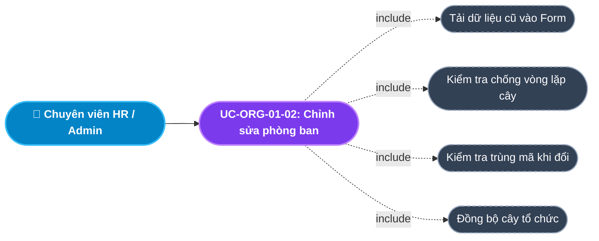
```mermaid
flowchart LR
    classDef actor fill:#0284c7,stroke:#38bdf8,stroke-width:2px,color:#ffffff,font-weight:bold;
    classDef main fill:#7c3aed,stroke:#c084fc,stroke-width:2px,color:#ffffff,font-weight:bold;
    classDef sub fill:#334155,stroke:#94a3b8,stroke-width:1.5px,color:#ffffff,stroke-dasharray: 4 4;

    Actor(["👤 Chuyên viên HR / Admin"]):::actor
    UC(["UC-ORG-01-02: Chỉnh sửa phòng ban"]):::main
    UC_Load(["Tải dữ liệu cũ vào Form"]):::sub
    UC_Cycle(["Kiểm tra chống vòng lặp cây"]):::sub
    UC_CodeDup(["Kiểm tra trùng mã khi đổi"]):::sub
    UC_Sync(["Đồng bộ cây tổ chức"]):::sub

    Actor --> UC
    UC -.->|include| UC_Load
    UC -.->|include| UC_Cycle
    UC -.->|include| UC_CodeDup
    UC -.->|include| UC_Sync
```

###### Bảng đặc tả nghiệp vụ:

| STT | Hạng mục | Nội dung chi tiết |
|:---:|---|---|
| **1** | **Thông tin chung** | - **UC ID**: `UC-ORG-01-02`<br/>- **UC Name**: Chỉnh sửa thông tin phòng ban (Update Department)<br/>- **Actor**: Chuyên viên HR, HR Manager, Quản trị viên (Admin)<br/>- **Mục tiêu**: Cập nhật thông tin phòng ban (Tên, Quản lý, Định biên, Luân chuyển cha) khi có biến động tổ chức.<br/>- **Mô tả**: Người dùng chỉnh sửa các trường dữ liệu, hệ thống kiểm tra tính toàn vẹn cây và lưu vào CSDL.<br/>- **Priority**: High |
| **2** | **Trigger** | Người dùng nhấn biểu tượng cây bút **"Sửa" (Edit)** tại cột Thao tác của dòng phòng ban tương ứng trong bảng. |
| **3** | **Pre-condition** | 1. Có quyền `MANAGE_ORGANIZATION` hoặc vai trò `ADMIN` / `HR_MANAGER`.<br/>2. Phòng ban cần sửa đang tồn tại trên hệ thống. |
| **4** | **Post-condition** | 1. Dữ liệu phòng ban được cập nhật chính xác trong CSDL.<br/>2. Bảng danh sách và sơ đồ cây tổ chức lập tức cập nhật cấu trúc mới.<br/>3. Ghi nhận Audit Log: Thời gian, Actor, dữ liệu thay đổi (Old Value → New Value). |
| **5** | **Main Flow** | 1. Tìm đến dòng phòng ban cần sửa và bấm nút **"Sửa"**.<br/>2. Hệ thống mở Modal Form, tự động nạp toàn bộ giá trị hiện tại của phòng ban đó.<br/>3. Sửa đổi thông tin (Tên phòng, người quản lý, định mức quota, chọn phòng ban cha mới).<br/>4. Bấm nút **"Lưu thay đổi"**.<br/>5. Client kiểm tra tính hợp lệ dữ liệu.<br/>6. Gửi request `PUT /api/departments/:id` kèm dữ liệu cập nhật.<br/>7. Backend kiểm tra cấu trúc cây: Xác minh phòng ban cha mới không phải chính nó và không phải con trực thuộc (`BR-ORG-01-03`).<br/>8. Backend kiểm tra không trùng mã với đơn vị khác (`BR-ORG-01-04`).<br/>9. Backend cập nhật CSDL, trả về `HTTP 200 OK`.<br/>10. Giao diện đóng Modal, nạp lại danh sách và hiển thị Toast thông báo thành công. |
| **6** | **Alternative / Exception Flow** | - **AF-01 (Hủy chỉnh sửa)**: Bấm "Hủy" hoặc click ngoài Modal → Hủy bỏ thay đổi, giữ nguyên dữ liệu cũ.<br/>- **AF-02 (Không đổi phòng ban cha)**: Chỉ cập nhật quản lý hoặc quota → Bỏ qua bước kiểm tra cây, cập nhật trực tiếp.<br/>- **EF-01 (Vòng lặp cây đệ quy)**: Chọn phòng ban cha là chính nó hoặc phòng con trực thuộc → Báo lỗi *"Không thể chọn phòng ban con hoặc chính nó làm phòng ban cha!"*.<br/>- **EF-02 (Trùng mã khi đổi)**: Đổi mã trùng với một phòng ban khác → Trả lỗi 409 Conflict, báo *"Mã phòng ban đã tồn tại trên hệ thống!"*.<br/>- **EF-03 (Bản ghi đã bị xóa)**: Phòng ban bị người khác xóa trước đó → Báo lỗi *"Phòng ban không tồn tại hoặc đã bị xóa"*. |
| **7** | **Business Rules & Validation** | - `BR-ORG-01-03`: Tuyệt đối không cho phép tạo vòng lặp cấu trúc phả hệ (A cha của B → B không thể là cha của A).<br/>- `BR-ORG-01-04`: Mã phòng ban duy nhất trên toàn hệ thống.<br/>- `parentId`: Phải khác `id` của chính phòng ban đang sửa.<br/>- `quota`: Số nguyên dương ≥ 1; cảnh báo mềm nếu giảm quota nhỏ hơn số nhân viên thực tế đang làm việc. |
| **8** | **Acceptance Criteria** | - **AC-01**: Bấm Sửa mở form hiển thị chính xác 100% dữ liệu hiện tại của phòng ban đó.<br/>- **AC-02**: Chọn phòng ban cha là chính nó → Bị chặn lại và hiển thị cảnh báo lỗi rõ ràng.<br/>- **AC-03**: Cập nhật thành công → Giá trị mới lập tức hiển thị trên bảng dữ liệu và sơ đồ cây. |

---

##### 4.3. UC-ORG-01-03: Khóa / Mở khóa phòng ban (Đổi trạng thái Active / Inactive)

###### Sơ đồ Use Case:
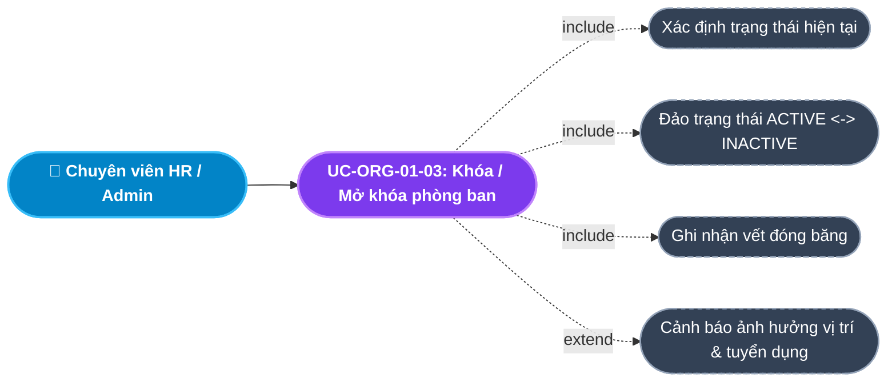
```mermaid
flowchart LR
    classDef actor fill:#0284c7,stroke:#38bdf8,stroke-width:2px,color:#ffffff,font-weight:bold;
    classDef main fill:#7c3aed,stroke:#c084fc,stroke-width:2px,color:#ffffff,font-weight:bold;
    classDef sub fill:#334155,stroke:#94a3b8,stroke-width:1.5px,color:#ffffff,stroke-dasharray: 4 4;

    Actor(["👤 Chuyên viên HR / Admin"]):::actor
    UC(["UC-ORG-01-03: Khóa / Mở khóa phòng ban"]):::main
    UC_Check(["Xác định trạng thái hiện tại"]):::sub
    UC_Toggle(["Đảo trạng thái ACTIVE <-> INACTIVE"]):::sub
    UC_Audit(["Ghi nhận vết đóng băng"]):::sub
    UC_Cascade(["Cảnh báo ảnh hưởng vị trí & tuyển dụng"]):::sub

    Actor --> UC
    UC -.->|include| UC_Check
    UC -.->|include| UC_Toggle
    UC -.->|include| UC_Audit
    UC -.->|extend| UC_Cascade
```

###### Bảng đặc tả nghiệp vụ:

| STT | Hạng mục | Nội dung chi tiết |
|:---:|---|---|
| **1** | **Thông tin chung** | - **UC ID**: `UC-ORG-01-03`<br/>- **UC Name**: Khóa / Mở khóa phòng ban (Toggle Status Active / Inactive)<br/>- **Actor**: Chuyên viên HR, HR Manager, Quản trị viên hệ thống (Admin)<br/>- **Mục tiêu**: Đóng băng mềm (Soft Lock) đơn vị tạm ngừng hoạt động hoặc giải thể nhằm chặn phát sinh nhân sự mới nhưng bảo toàn 100% lịch sử nhân sự, hợp đồng và bảng lương.<br/>- **Mô tả**: Chuyển đổi trạng thái phòng ban giữa `ACTIVE` và `INACTIVE` chỉ với một thao tác bấm.<br/>- **Priority**: High (Quản trị vận hành) |
| **2** | **Trigger** | Người dùng nhấn vào biểu tượng **Ổ khóa (Lock / Unlock)** tại cột Thao tác của dòng phòng ban tương ứng trong bảng. |
| **3** | **Pre-condition** | 1. Người dùng có quyền `MANAGE_ORGANIZATION`.<br/>2. Phòng ban tồn tại trên danh sách. |
| **4** | **Post-condition** | 1. Trạng thái phòng ban trong CSDL đổi thành `INACTIVE` (khi Khóa) hoặc `ACTIVE` (khi Mở khóa).<br/>2. Badge trạng thái đổi màu tương ứng (Xanh lá = Hoạt động; Xám/Đỏ = Ngừng hoạt động).<br/>3. Phòng ban bị khóa tự động ẩn khỏi dropdown chọn phòng ban của Tuyển dụng, Tạo Vị trí, Tiếp nhận nhân sự.<br/>4. Ghi nhận Audit Log: Thời gian, Actor, hành động Khóa/Mở khóa. |
| **5** | **Main Flow** | 1. Xác định phòng ban cần đổi trạng thái trong bảng danh sách.<br/>2. Nhấn nút biểu tượng **Ổ khóa**.<br/>3. Hệ thống xác định trạng thái: Nếu đang là `ACTIVE` → Đổi thành `INACTIVE`; Nếu `INACTIVE` → Đổi thành `ACTIVE`.<br/>4. Giao diện gửi request `PUT /api/departments/:id` với `{ status: newStatus }`.<br/>5. Backend kiểm tra quyền hạn của người dùng.<br/>6. Backend cập nhật trường `status` trong CSDL và ghi nhận Audit Trail.<br/>7. Backend trả về `HTTP 200 OK`.<br/>8. Giao diện cập nhật ngay Badge trạng thái trên dòng đó và hiển thị Toast thông báo thành công. |
| **6** | **Alternative / Exception Flow** | - **AF-01 (Mở khóa lại)**: Nhấn mở khóa phòng ban `INACTIVE` → Kích hoạt lại thành `ACTIVE`, mở lại quyền tuyển dụng/bổ nhiệm.<br/>- **EF-01 (Không có quyền)**: Người dùng không có quyền quản lý → Trả `403 Forbidden`, cảnh báo: *"Bạn không có quyền thay đổi trạng thái phòng ban"*.<br/>- **EF-02 (Lỗi kết nối)**: Mất kết nối server → Toast báo lỗi, giữ nguyên trạng thái cũ. |
| **7** | **Business Rules & Validation** | - `BR-ORG-01-05`: Khi phòng ban bị khóa (`INACTIVE`), tất cả các chức năng thêm nhân viên, tạo vị trí việc làm mới thuộc phòng ban này đều bị chặn.<br/>- `BR-ORG-01-06`: Khóa phòng ban không làm xóa dữ liệu nhân viên, không ảnh hưởng đến việc tính lương lịch sử.<br/>- `status`: Chỉ nhận 1 trong 2 giá trị Enum: `'ACTIVE'` hoặc `'INACTIVE'`. |
| **8** | **Acceptance Criteria** | - **AC-01**: Nhấn Ổ khóa tại phòng ban `ACTIVE` → Chuyển sang `INACTIVE`, Badge đổi màu xám/đỏ, Toast xuất hiện.<br/>- **AC-02**: Nhấn Ổ khóa tại phòng ban `INACTIVE` → Chuyển sang `ACTIVE`, Badge đổi màu xanh lá.<br/>- **AC-03**: Phòng ban `INACTIVE` không xuất hiện trong dropdown chọn phòng ban khi Thêm vị trí mới. |

---

##### 4.4. UC-ORG-01-04: Tìm kiếm, Lọc & Phân trang phòng ban (Search, Filter & Pagination)

###### Sơ đồ Use Case:
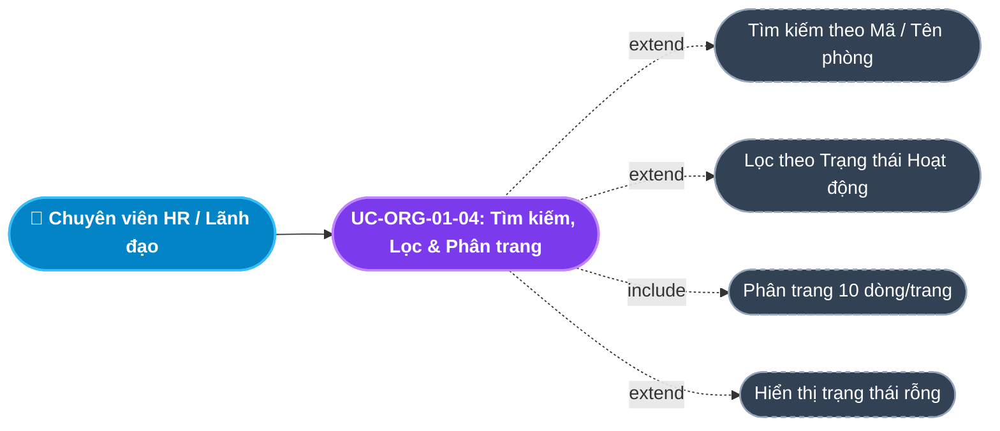
```mermaid
flowchart LR
    classDef actor fill:#0284c7,stroke:#38bdf8,stroke-width:2px,color:#ffffff,font-weight:bold;
    classDef main fill:#7c3aed,stroke:#c084fc,stroke-width:2px,color:#ffffff,font-weight:bold;
    classDef sub fill:#334155,stroke:#94a3b8,stroke-width:1.5px,color:#ffffff,stroke-dasharray: 4 4;

    Actor(["👤 Chuyên viên HR / Lãnh đạo"]):::actor
    UC(["UC-ORG-01-04: Tìm kiếm, Lọc & Phân trang"]):::main
    UC_Search(["Tìm kiếm theo Mã / Tên phòng"]):::sub
    UC_Filter(["Lọc theo Trạng thái Hoạt động"]):::sub
    UC_Page(["Phân trang 10 dòng/trang"]):::sub
    UC_Empty(["Hiển thị trạng thái rỗng"]):::sub

    Actor --> UC
    UC -.->|extend| UC_Search
    UC -.->|extend| UC_Filter
    UC -.->|include| UC_Page
    UC -.->|extend| UC_Empty
```

###### Bảng đặc tả nghiệp vụ:

| STT | Hạng mục | Nội dung chi tiết |
|:---:|---|---|
| **1** | **Thông tin chung** | - **UC ID**: `UC-ORG-01-04`<br/>- **UC Name**: Tìm kiếm, Lọc & Phân trang phòng ban (Search, Filter & Pagination)<br/>- **Actor**: Toàn bộ người dùng có quyền xem tổ chức (HR, Quản lý, Giám đốc, Admin)<br/>- **Mục tiêu**: Tra cứu nhanh chóng và chính xác các phòng ban theo từ khóa và trạng thái; hiển thị gọn gàng 10 bản ghi/trang.<br/>- **Mô tả**: Tìm kiếm không phân biệt hoa thường theo Mã hoặc Tên, kết hợp bộ lọc trạng thái và phân trang client-side tức thì (< 16ms).<br/>- **Priority**: High |
| **2** | **Trigger** | Người dùng gõ ký tự vào ô tìm kiếm, chọn Dropdown trạng thái hoặc bấm nút chuyển trang. |
| **3** | **Pre-condition** | 1. Đang ở màn hình Danh mục phòng ban.<br/>2. Dữ liệu danh sách phòng ban đã được tải về Client. |
| **4** | **Post-condition** | 1. Bảng hiển thị danh sách phòng ban thỏa mãn đồng thời tiêu chí tìm kiếm và bộ lọc.<br/>2. Cập nhật dòng: *"Hiển thị X - Y trên tổng số Z phòng ban"*.<br/>3. Trang hiện tại được reset về Trang 1 mỗi khi thay đổi từ khóa hoặc bộ lọc. |
| **5** | **Main Flow** | 1. Nhập từ khóa vào ô `Tìm theo mã, tên phòng ban...` (ví dụ: gõ `"Kỹ thuật"`).<br/>2. Chọn bộ lọc trạng thái (ví dụ: `"Đang hoạt động"`).<br/>3. Hệ thống áp dụng thuật toán lọc kết hợp đa tiêu chí (AND Logic):<br/>`matchSearch = code.toLowerCase().includes(term) || name.toLowerCase().includes(term)`<br/>`matchStatus = (statusFilter === '' || status === statusFilter)`<br/>`filteredList = departments.filter(matchSearch && matchStatus)`.<br/>4. Tự động đặt lại `currentPage = 1`.<br/>5. Tính tổng số trang: `totalPages = Math.ceil(filteredList.length / 10)`.<br/>6. Cắt mảng hiển thị trang 1: `filteredList.slice(0, 10)` và kết xuất lên bảng dữ liệu trong < 16ms. |
| **6** | **Alternative / Exception Flow** | - **AF-01 (Chuyển trang)**: Bấm số trang 2, 3... → Render đúng 10 bản ghi của trang đó mà không reload trang.<br/>- **AF-02 (Xóa từ khóa)**: Xóa trắng ô tìm kiếm → Hiển thị lại toàn bộ danh sách phòng ban theo bộ lọc trạng thái hiện hành.<br/>- **EF-01 (Không tìm thấy kết quả)**: Không có bản ghi nào khớp (`filteredList.length === 0`) → Hiển thị Empty State: *"Không tìm thấy phòng ban nào phù hợp với điều kiện tìm kiếm"* và ẩn thanh phân trang. |
| **7** | **Business Rules & Validation** | - `BR-ORG-01-09`: Thuật toán tìm kiếm không phân biệt chữ hoa, chữ thường (Case-insensitive) và hỗ trợ tiếng Việt có dấu/không dấu cơ bản.<br/>- `BR-ORG-01-10`: Bất kỳ thay đổi nào tại ô tìm kiếm hoặc bộ lọc trạng thái đều phải tự động đưa `currentPage` về 1.<br/>- Bộ lọc trạng thái nhận: `""` (Tất cả), `"ACTIVE"`, `"INACTIVE"`. |
| **8** | **Acceptance Criteria** | - **AC-01**: Nhập `"it"`, bảng hiển thị ngay các phòng ban có mã hoặc tên chứa `"IT"`, `"it"`, `"It"` mà không cần bấm nút Tìm kiếm.<br/>- **AC-02**: Đang ở trang 3, khi gõ từ khóa mới, trang hiện tại tự động nhảy về Trang 1.<br/>- **AC-03**: Khi lọc không có kết quả, bảng hiển thị thông báo rỗng thân thiện, không vỡ giao diện. |

---

##### 4.5. UC-ORG-01-05: Xóa phòng ban (Hard Delete Department)

###### Sơ đồ Use Case:
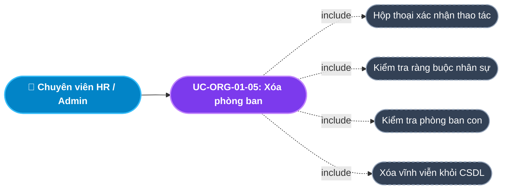
```mermaid
flowchart LR
    classDef actor fill:#0284c7,stroke:#38bdf8,stroke-width:2px,color:#ffffff,font-weight:bold;
    classDef main fill:#7c3aed,stroke:#c084fc,stroke-width:2px,color:#ffffff,font-weight:bold;
    classDef sub fill:#334155,stroke:#94a3b8,stroke-width:1.5px,color:#ffffff,stroke-dasharray: 4 4;

    Actor(["👤 Chuyên viên HR / Admin"]):::actor
    UC(["UC-ORG-01-05: Xóa phòng ban"]):::main
    UC_Confirm(["Hộp thoại xác nhận thao tác"]):::sub
    UC_EmpCheck(["Kiểm tra ràng buộc nhân sự"]):::sub
    UC_SubCheck(["Kiểm tra phòng ban con"]):::sub
    UC_Delete(["Xóa vĩnh viễn khỏi CSDL"]):::sub

    Actor --> UC
    UC -.->|include| UC_Confirm
    UC -.->|include| UC_EmpCheck
    UC -.->|include| UC_SubCheck
    UC -.->|include| UC_Delete
```

###### Bảng đặc tả nghiệp vụ:

| STT | Hạng mục | Nội dung chi tiết |
|:---:|---|---|
| **1** | **Thông tin chung** | - **UC ID**: `UC-ORG-01-05`<br/>- **UC Name**: Xóa phòng ban (Hard Delete Department)<br/>- **Actor**: Quản trị viên hệ thống (Admin), HR Manager có thẩm quyền cao nhất<br/>- **Mục tiêu**: Xóa bỏ hoàn toàn khỏi CSDL các phòng ban nhập sai, phòng ban nháp không có ràng buộc dữ liệu.<br/>- **Mô tả**: Kiểm tra nghiêm ngặt các ràng buộc toàn vẹn dữ liệu (không có nhân viên, không có phòng con) trước khi cho phép xóa vĩnh viễn.<br/>- **Priority**: Medium (Thao tác có rủi ro cao, kiểm soát chặt) |
| **2** | **Trigger** | Người dùng nhấn biểu tượng **Thùng rác (Delete)** tại cột Thao tác của dòng phòng ban cần xóa. |
| **3** | **Pre-condition** | 1. Có quyền `MANAGE_ORGANIZATION` và vai trò `ADMIN` hoặc `HR_MANAGER`.<br/>2. Phòng ban muốn xóa đang hiển thị trong danh sách. |
| **4** | **Post-condition** | 1. Bản ghi phòng ban bị xóa hoàn toàn khỏi cơ sở dữ liệu (`DELETE FROM departments`).<br/>2. Dòng dữ liệu biến mất khỏi giao diện.<br/>3. Ghi nhận Audit Log: Thời gian, Actor, bản ghi đã xóa để phục vụ thanh tra. |
| **5** | **Main Flow** | 1. Nhấn nút biểu tượng **Thùng rác** tại dòng phòng ban cần xóa.<br/>2. Hệ thống hiển thị Modal xác nhận: *"Bạn có chắc chắn muốn xóa phòng ban [TÊN PHÒNG]? Thao tác này không thể hoàn tác!"*.<br/>3. Người dùng nhấn nút **"Xác nhận xóa"**.<br/>4. Giao diện gửi request `DELETE /api/departments/:id`.<br/>5. Backend kiểm tra số lượng nhân viên đang thuộc phòng ban (`BR-ORG-01-07`). Số lượng = 0.<br/>6. Backend kiểm tra số lượng phòng ban con trực thuộc (`BR-ORG-01-08`). Số lượng = 0.<br/>7. Backend thực hiện lệnh xóa bản ghi khỏi CSDL và trả về `HTTP 200 OK`.<br/>8. Giao diện đóng modal, tự động nạp lại danh sách và hiển thị Toast thông báo: *"Đã xóa phòng ban thành công"*. |
| **6** | **Alternative / Exception Flow** | - **AF-01 (Hủy lệnh xóa)**: Tại bước 2, nhấn "Hủy" hoặc click ngoài hộp thoại → Đóng hộp thoại, không xóa, phòng ban giữ nguyên.<br/>- **EF-01 (Chặn xóa do có nhân viên)**: Tại bước 5, nếu `employeeCount > 0` → Backend từ chối lỗi `HTTP 400`, cảnh báo: *"Không thể xóa phòng ban đang có nhân viên làm việc! Vui lòng luân chuyển nhân viên hoặc dùng chức năng Khóa phòng ban."*.<br/>- **EF-02 (Chặn xóa do có phòng con)**: Tại bước 6, nếu phòng ban có đơn vị con → Backend từ chối với `HTTP 400`, cảnh báo: *"Không thể xóa phòng ban đang chứa các đơn vị trực thuộc!"*.<br/>- **EF-03 (Không đủ quyền)**: Người dùng thông thường → Trả về `HTTP 403 Forbidden`, cảnh báo: *"Bạn không có quyền thực hiện thao tác xóa phòng ban"*. |
| **7** | **Business Rules & Validation** | - `BR-ORG-01-07`: Tuyệt đối không cho phép xóa vật lý (Hard Delete) phòng ban đang có ít nhất 01 nhân viên liên kết trong CSDL để bảo vệ toàn vẹn lịch sử nhân sự và hợp đồng.<br/>- `BR-ORG-01-08`: Không cho phép xóa phòng ban cha khi còn phòng ban con trực thuộc để tránh gãy cấu trúc cây. Khuyến nghị sử dụng `UC-ORG-01-03` (Khóa phòng ban) thay cho Xóa vật lý. |
| **8** | **Acceptance Criteria** | - **AC-01**: Khi bấm nút Xóa, bắt buộc phải xuất hiện Modal xác nhận để phòng ngừa click nhầm.<br/>- **AC-02**: Thử xóa phòng ban đang có nhân viên → Bắt buộc hệ thống phải chặn lại, hiện thông báo từ chối rõ ràng và dữ liệu không bị xóa.<br/>- **AC-03**: Xóa phòng ban rỗng hợp lệ → Dòng dữ liệu biến mất ngay lập tức và CSDL cập nhật thành công. |

---

#### 5. Sơ đồ tuần tự nghiệp vụ (Sequence Diagrams)

##### 5.1. Sơ đồ: Thêm mới phòng ban
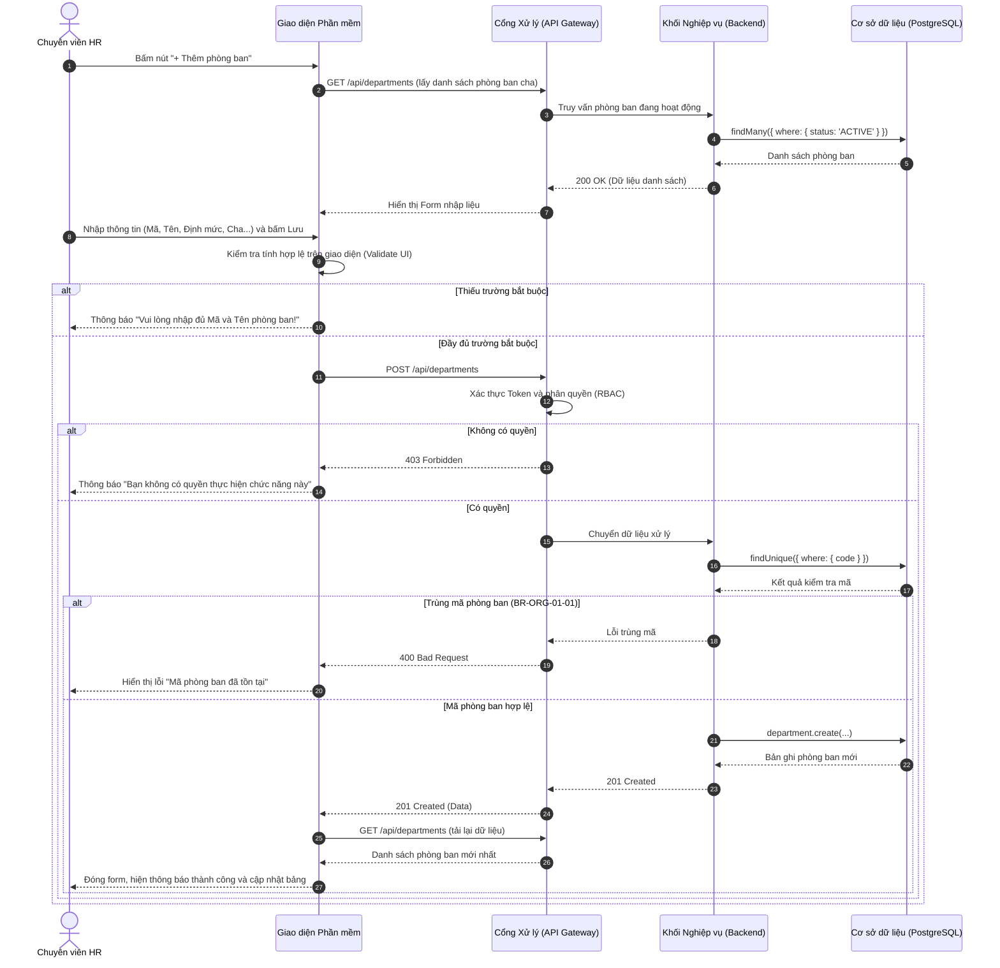
```mermaid
sequenceDiagram
    autonumber
    actor HR as Chuyên viên HR
    participant FE as Giao diện Phần mềm
    participant API as Cổng Xử lý (API Gateway)
    participant BE as Khối Nghiệp vụ (Backend)
    participant DB as Cơ sở dữ liệu (PostgreSQL)

    HR->>FE: Bấm nút "+ Thêm phòng ban"
    FE->>API: GET /api/departments (lấy danh sách phòng ban cha)
    API->>BE: Truy vấn phòng ban đang hoạt động
    BE->>DB: findMany({ where: { status: 'ACTIVE' } })
    DB-->>BE: Danh sách phòng ban
    BE-->>API: 200 OK (Dữ liệu danh sách)
    API-->>FE: Hiển thị Form nhập liệu

    HR->>FE: Nhập thông tin (Mã, Tên, Định mức, Cha...) và bấm Lưu
    FE->>FE: Kiểm tra tính hợp lệ trên giao diện (Validate UI)
    alt Thiếu trường bắt buộc
        FE-->>HR: Thông báo "Vui lòng nhập đủ Mã và Tên phòng ban!"
    else Đầy đủ trường bắt buộc
        FE->>API: POST /api/departments
        API->>API: Xác thực Token và phân quyền (RBAC)
        alt Không có quyền
            API-->>FE: 403 Forbidden
            FE-->>HR: Thông báo "Bạn không có quyền thực hiện chức năng này"
        else Có quyền
            API->>BE: Chuyển dữ liệu xử lý
            BE->>DB: findUnique({ where: { code } })
            DB-->>BE: Kết quả kiểm tra mã
            alt Trùng mã phòng ban (BR-ORG-01-01)
                BE-->>API: Lỗi trùng mã
                API-->>FE: 400 Bad Request
                FE-->>HR: Hiển thị lỗi "Mã phòng ban đã tồn tại"
            else Mã phòng ban hợp lệ
                BE->>DB: department.create(...)
                DB-->>BE: Bản ghi phòng ban mới
                BE-->>API: 201 Created
                API-->>FE: 201 Created (Data)
                FE->>API: GET /api/departments (tải lại dữ liệu)
                API-->>FE: Danh sách phòng ban mới nhất
                FE-->>HR: Đóng form, hiện thông báo thành công và cập nhật bảng
            end
        end
    end
```

##### 5.2. Sơ đồ: Chỉnh sửa thông tin phòng ban
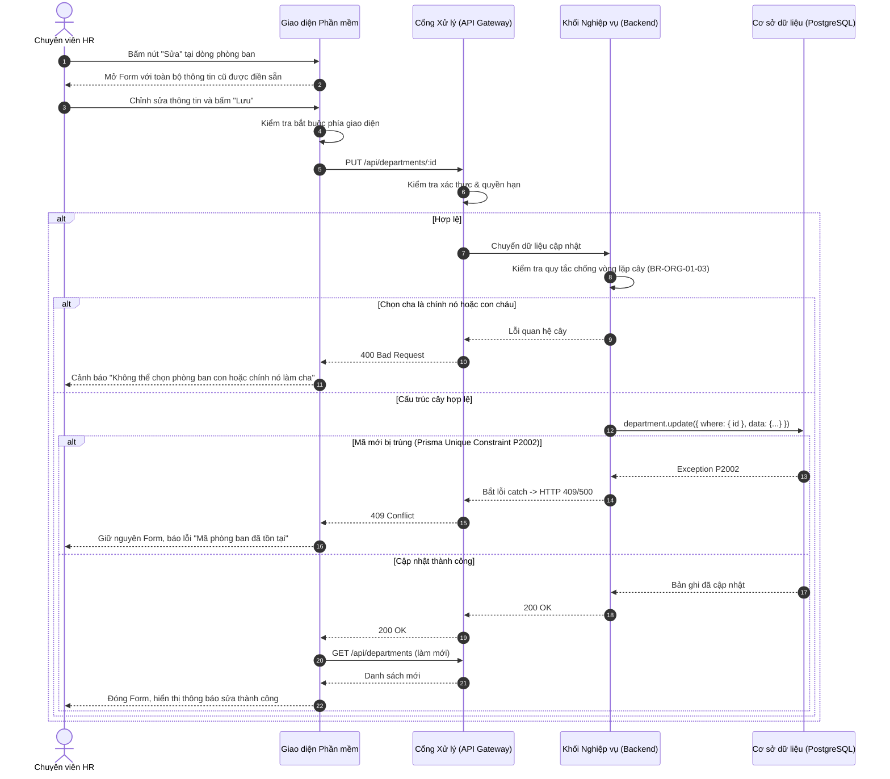
```mermaid
sequenceDiagram
    autonumber
    actor HR as Chuyên viên HR
    participant FE as Giao diện Phần mềm
    participant API as Cổng Xử lý (API Gateway)
    participant BE as Khối Nghiệp vụ (Backend)
    participant DB as Cơ sở dữ liệu (PostgreSQL)

    HR->>FE: Bấm nút "Sửa" tại dòng phòng ban
    FE-->>HR: Mở Form với toàn bộ thông tin cũ được điền sẵn
    
    HR->>FE: Chỉnh sửa thông tin và bấm "Lưu"
    FE->>FE: Kiểm tra bắt buộc phía giao diện
    FE->>API: PUT /api/departments/:id
    
    API->>API: Kiểm tra xác thực & quyền hạn
    alt Hợp lệ
        API->>BE: Chuyển dữ liệu cập nhật
        BE->>BE: Kiểm tra quy tắc chống vòng lặp cây (BR-ORG-01-03)
        alt Chọn cha là chính nó hoặc con cháu
            BE-->>API: Lỗi quan hệ cây
            API-->>FE: 400 Bad Request
            FE-->>HR: Cảnh báo "Không thể chọn phòng ban con hoặc chính nó làm cha"
        else Cấu trúc cây hợp lệ
            BE->>DB: department.update({ where: { id }, data: {...} })
            alt Mã mới bị trùng (Prisma Unique Constraint P2002)
                DB-->>BE: Exception P2002
                BE-->>API: Bắt lỗi catch -> HTTP 409/500
                API-->>FE: 409 Conflict
                FE-->>HR: Giữ nguyên Form, báo lỗi "Mã phòng ban đã tồn tại"
            else Cập nhật thành công
                DB-->>BE: Bản ghi đã cập nhật
                BE-->>API: 200 OK
                API-->>FE: 200 OK
                FE->>API: GET /api/departments (làm mới)
                API-->>FE: Danh sách mới
                FE-->>HR: Đóng Form, hiển thị thông báo sửa thành công
            end
        end
    end
```

##### 5.3. Sơ đồ: Khóa / Mở khóa phòng ban (Đổi trạng thái Active / Inactive)
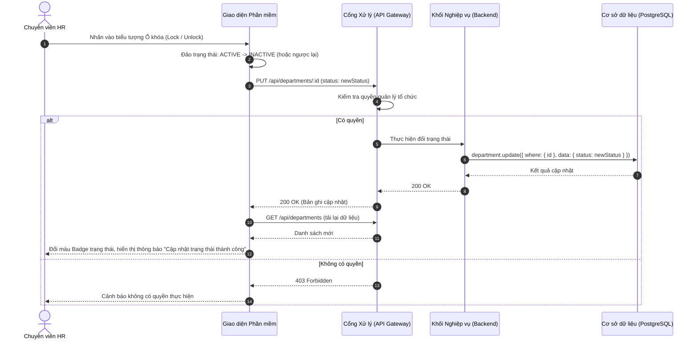
```mermaid
sequenceDiagram
    autonumber
    actor HR as Chuyên viên HR
    participant FE as Giao diện Phần mềm
    participant API as Cổng Xử lý (API Gateway)
    participant BE as Khối Nghiệp vụ (Backend)
    participant DB as Cơ sở dữ liệu (PostgreSQL)

    HR->>FE: Nhấn vào biểu tượng Ổ khóa (Lock / Unlock)
    FE->>FE: Đảo trạng thái: ACTIVE -> INACTIVE (hoặc ngược lại)
    FE->>API: PUT /api/departments/:id (status: newStatus)

    API->>API: Kiểm tra quyền quản lý tổ chức
    alt Có quyền
        API->>BE: Thực hiện đổi trạng thái
        BE->>DB: department.update({ where: { id }, data: { status: newStatus } })
        DB-->>BE: Kết quả cập nhật
        BE-->>API: 200 OK
        API-->>FE: 200 OK (Bản ghi cập nhật)
        FE->>API: GET /api/departments (tải lại dữ liệu)
        API-->>FE: Danh sách mới
        FE-->>HR: Đổi màu Badge trạng thái, hiển thị thông báo "Cập nhật trạng thái thành công"
    else Không có quyền
        API-->>FE: 403 Forbidden
        FE-->>HR: Cảnh báo không có quyền thực hiện
    end
```

##### 5.4. Sơ đồ: Tìm kiếm, Lọc & Phân trang phòng ban
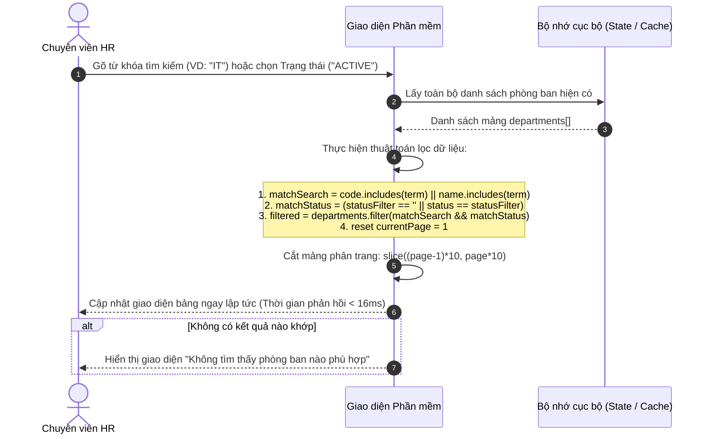
```mermaid
sequenceDiagram
    autonumber
    actor HR as Chuyên viên HR
    participant FE as Giao diện Phần mềm
    participant State as Bộ nhớ cục bộ (State / Cache)

    HR->>FE: Gõ từ khóa tìm kiếm (VD: "IT") hoặc chọn Trạng thái ("ACTIVE")
    FE->>State: Lấy toàn bộ danh sách phòng ban hiện có
    State-->>FE: Danh sách mảng departments[]
    FE->>FE: Thực hiện thuật toán lọc dữ liệu:
    Note over FE: 1. matchSearch = code.includes(term) || name.includes(term)<br/>2. matchStatus = (statusFilter == '' || status == statusFilter)<br/>3. filtered = departments.filter(matchSearch && matchStatus)<br/>4. reset currentPage = 1
    FE->>FE: Cắt mảng phân trang: slice((page-1)*10, page*10)
    FE-->>HR: Cập nhật giao diện bảng ngay lập tức (Thời gian phản hồi < 16ms)
    alt Không có kết quả nào khớp
        FE-->>HR: Hiển thị giao diện "Không tìm thấy phòng ban nào phù hợp"
    end
```

##### 5.5. Sơ đồ: Xóa phòng ban (Hard Delete)
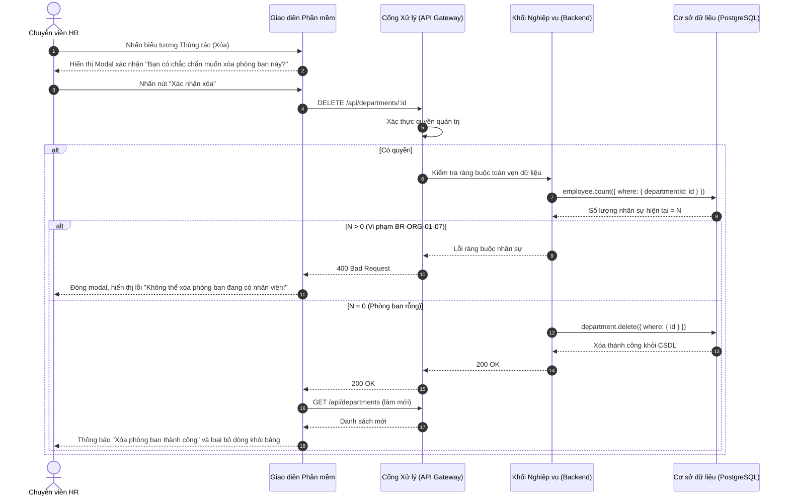
```mermaid
sequenceDiagram
    autonumber
    actor HR as Chuyên viên HR
    participant FE as Giao diện Phần mềm
    participant API as Cổng Xử lý (API Gateway)
    participant BE as Khối Nghiệp vụ (Backend)
    participant DB as Cơ sở dữ liệu (PostgreSQL)

    HR->>FE: Nhấn biểu tượng Thùng rác (Xóa)
    FE-->>HR: Hiển thị Modal xác nhận "Bạn có chắc chắn muốn xóa phòng ban này?"
    
    HR->>FE: Nhấn nút "Xác nhận xóa"
    FE->>API: DELETE /api/departments/:id
    
    API->>API: Xác thực quyền quản trị
    alt Có quyền
        API->>BE: Kiểm tra ràng buộc toàn vẹn dữ liệu
        BE->>DB: employee.count({ where: { departmentId: id } })
        DB-->>BE: Số lượng nhân sự hiện tại = N
        alt N > 0 (Vi phạm BR-ORG-01-07)
            BE-->>API: Lỗi ràng buộc nhân sự
            API-->>FE: 400 Bad Request
            FE-->>HR: Đóng modal, hiển thị lỗi "Không thể xóa phòng ban đang có nhân viên!"
        else N = 0 (Phòng ban rỗng)
            BE->>DB: department.delete({ where: { id } })
            DB-->>BE: Xóa thành công khỏi CSDL
            BE-->>API: 200 OK
            API-->>FE: 200 OK
            FE->>API: GET /api/departments (làm mới)
            API-->>FE: Danh sách mới
            FE-->>HR: Thông báo "Xóa phòng ban thành công" và loại bỏ dòng khỏi bảng
        end
    end
```

---

#### 6. Kịch bản kiểm thử & Nghiệm thu (Given / When / Then)

##### Kịch bản 1: Tìm kiếm phòng ban theo mã hoặc tên
- **Given**: Danh sách có các phòng ban: `IT - Phòng Công nghệ`, `HR - Phòng Nhân sự`, `MKT - Phòng Marketing`.
- **When**: HR nhập từ khóa `công nghệ` vào ô tìm kiếm.
- **Then**: Bảng chỉ hiển thị đúng 01 dòng phòng ban `IT - Phòng Công nghệ`. Số lượng trang hiển thị là 1/1.

##### Kịch bản 2: Lọc phòng ban theo trạng thái Ngừng hoạt động
- **Given**: Hệ thống có 8 phòng ban `ACTIVE` và 2 phòng ban `INACTIVE`.
- **When**: HR mở Dropdown Trạng thái và chọn "Ngừng hoạt động".
- **Then**: Bảng lọc và chỉ hiển thị đúng 2 phòng ban có trạng thái `INACTIVE`, ẩn toàn bộ các phòng ban đang hoạt động.

##### Kịch bản 3: Khóa phòng ban đang hoạt động
- **Given**: Phòng ban `MKT` đang có trạng thái là `ACTIVE` (Badge xanh lá).
- **When**: HR click vào biểu tượng Ổ khóa tại dòng phòng ban `MKT`.
- **Then**: Hệ thống gửi lệnh cập nhật, trạng thái phòng ban chuyển thành `INACTIVE`, Badge đổi sang màu xám/đỏ. Khi tạo Vị trí mới, phòng ban `MKT` không xuất hiện trong danh sách lựa chọn.

##### Kịch bản 4: Xóa phòng ban an toàn (Chặn xóa khi có nhân viên)
- **Given**: Phòng ban `IT` đang có 5 nhân viên làm việc.
- **When**: HR bấm nút Xóa và bấm Xác nhận.
- **Then**: Hệ thống từ chối xóa và hiển thị cảnh báo: *"Không thể xóa phòng ban đang có nhân viên"*. Dữ liệu phòng ban vẫn được giữ nguyên vẹn.

##### Kịch bản 5: Xóa thành công phòng ban rỗng
- **Given**: Phòng ban `Dự án Thử nghiệm` mới tạo, chưa có nhân viên nào trực thuộc (`employees = 0`).
- **When**: HR bấm nút Xóa và bấm Xác nhận.
- **Then**: Hệ thống xóa thành công bản ghi khỏi CSDL và tự động loại bỏ dòng này trên giao diện.


### Usecase: UC-ORG-02 - Quản lý Danh mục Vị trí công tác (Position Management)

#### 1. Giới thiệu chức năng
- **Mục đích**: Cho phép Bộ phận Nhân sự (HR) chuẩn hóa danh mục các chức danh, vị trí công tác và ngạch bậc nghề nghiệp trong toàn công ty. Chức năng giúp quy hoạch khung năng lực, dải lương trần/sàn, kiểm soát liên kết giữa vị trí với từng phòng ban, và quản lý vòng đời chức danh (tìm kiếm, lọc theo khối, đóng băng/khóa chức danh không còn tuyển dụng).
- **Actor (Tác nhân)**: Trưởng phòng Nhân sự (HR Manager), Chuyên viên C&B (Tiền lương & Đãi ngộ), Admin hệ thống.
- **Điều kiện tiên quyết**: Khung danh mục Phòng ban đã được thiết lập; Người dùng có quyền `MANAGE_ORGANIZATION`.

##### Danh mục các chức năng con (Sub-features):
1. **UC-ORG-02-01: Thêm mới vị trí công tác**: Thiết lập chức danh mới, gán vào phòng ban quản lý, khai báo cấp bậc và dải lương dự kiến.
2. **UC-ORG-02-02: Chỉnh sửa thông tin vị trí**: Cập nhật mô tả công việc, điều chỉnh khung lương, thăng cấp/hạ cấp bậc chức danh.
3. **UC-ORG-02-03: Khóa / Mở khóa vị trí (Đổi trạng thái Active / Inactive)**: Tạm ngưng áp dụng chức danh (đóng băng tuyển dụng và bổ nhiệm) mà vẫn bảo toàn hợp đồng của các nhân sự cũ.
4. **UC-ORG-02-04: Tìm kiếm & Lọc vị trí công tác đa chiều**: Tìm nhanh theo chức danh/mã vị trí; lọc theo phòng ban trực thuộc, lọc theo cấp bậc (Staff, Lead, Manager, Director).
5. **UC-ORG-02-05: Quản lý Dải lương & Kiểm soát ngân sách**: Đảm bảo mức lương tối thiểu (`minSalary`) không vượt quá mức lương tối đa (`maxSalary`).
6. **UC-ORG-02-06: Xóa vị trí an toàn (Hard Delete)**: Xóa triệt để chức danh nhập sai khi chưa từng có nhân sự nào được bổ nhiệm.

---

#### 2. Dữ liệu nghiệp vụ đầu vào (Input Data & Parameters)

##### 2.1. Dữ liệu biểu mẫu Vị trí (Position Form Data)
| Tên trường | Kiểu dữ liệu | Tính chất | Ý nghĩa nghiệp vụ & Ràng buộc |
|---|---|---|---|
| `Mã vị trí` (code) | Chuỗi (String) | Bắt buộc | Ký hiệu chuẩn hóa chức danh (VD: `DEV_01`, `BA_LEAD`, `ACC_CHIEF`). Duy nhất toàn công ty. |
| `Tên chức danh` (title) | Chuỗi (String) | Bắt buộc | Tên hiển thị trên Hợp đồng Lao động (VD: `Kỹ sư Lập trình Backend`). |
| `Phòng ban trực thuộc` (departmentId) | UUID / Chuỗi | Bắt buộc | Vị trí này thuộc biên chế phòng ban nào (Map tới bảng `Department`). |
| `Cấp bậc` (level) | Enum / String | Bắt buộc | Phân loại thâm niên: `Intern` (Thực tập), `Staff` (Nhân viên), `Team Lead` (Trưởng nhóm), `Manager` (Quản lý), `Director` (Giám đốc). Mặc định là `Staff`. |
| `Mức lương tối thiểu` (minSalary) | Số nguyên (Int) | Tùy chọn | Ngưỡng sàn trong khung đãi ngộ (VNĐ). Mặc định `0`. |
| `Mức lương tối đa` (maxSalary) | Số nguyên (Int) | Tùy chọn | Ngưỡng trần ngân sách cho vị trí (VNĐ). Mặc định `0`. |
| `Mô tả công việc` (description) | Văn bản (Text) | Tùy chọn | Tóm tắt trách nhiệm và yêu cầu công việc chính (JD). |
| `Trạng thái` (status) | Enum / String | Mặc định | `ACTIVE` (Đang sử dụng) hoặc `INACTIVE` (Ngừng tuyển dụng / Tạm khóa). |

##### 2.2. Dữ liệu Tìm kiếm & Bộ lọc Vị trí (Search & Filter Criteria)
| Tiêu chí | Loại điều khiển | Giá trị lựa chọn | Hành vi hệ thống |
|---|---|---|---|
| `Từ khóa tìm kiếm` (searchTerm) | Input Text | Ký tự bất kỳ | Lọc theo Mã vị trí hoặc Tên chức danh (`title`). |
| `Lọc theo Phòng ban` (filterDepartment) | Dropdown Select | Danh sách phòng ban (`departments`) | Chỉ hiển thị các vị trí thuộc phòng ban được chọn. |
| `Lọc theo Cấp bậc` (filterLevel) | Dropdown Select | `Tất cả` / `Intern` / `Staff` / `Team Lead` / `Manager` / `Director` | Chỉ hiển thị vị trí thuộc cấp bậc tương ứng. |
| `Phân trang` (Pagination) | Nút chuyển trang | Trang hiện tại (`currentPage`), 10 dòng/trang | Cắt mảng hiển thị đúng 10 bản ghi trên mỗi trang. |

---

#### 3. Quy tắc nghiệp vụ (Business Rules)

| Mã Quy tắc | Tình huống nghiệp vụ | Cách hệ thống xử lý | Thông báo hiển thị cho người dùng |
|---|---|---|---|
| **BR-ORG-02-01** | **Kiểm soát trùng mã khi Tạo mới**: HR tạo vị trí nhập mã đã tồn tại trên hệ thống. | Backend kiểm tra `findUnique({ where: { code } })`. Nếu trùng -> Chặn lưu, trả HTTP 400. | "Mã vị trí đã tồn tại" |
| **BR-ORG-02-02** | **Kiểm soát trùng mã khi Cập nhật**: HR sửa chức danh và đổi mã sang mã của một vị trí khác. | Backend kiểm tra `findFirst({ where: { code, NOT: { id } } })`. Nếu trùng -> Trả HTTP 400. | "Mã vị trí đã tồn tại" |
| **BR-ORG-02-03** | **Ràng buộc Dải lương (Min ≤ Max)**: HR nhập mức lương tối thiểu lớn hơn mức lương tối đa (`minSalary > maxSalary`). | Validate logic nghiệp vụ trên cả giao diện và Backend. Nếu vi phạm -> Báo lỗi ngay lập tức. | "Mức lương tối thiểu không được lớn hơn mức lương tối đa!" |
| **BR-ORG-02-04** | **Ràng buộc an toàn khi Xóa (Hard Delete)**: HR yêu cầu xóa vị trí đang có nhân sự đảm nhiệm (`employees > 0`). | Backend đếm `employee.count({ where: { positionId } })`. Nếu > 0 -> Cấm xóa để bảo vệ hồ sơ nhân sự, trả HTTP 400. | "Không thể xóa vị trí đang có nhân viên" |
| **BR-ORG-02-05** | **Khóa vị trí công tác (Soft Lock)**: Doanh nghiệp không còn tuyển dụng chức danh này nhưng cần giữ dữ liệu quá khứ. | HR bấm biểu tượng Ổ khóa -> Đổi `status = 'INACTIVE'`. Chức danh này bị ẩn khỏi Form tuyển dụng và tiếp nhận nhân viên mới. | "Đã tạm dừng áp dụng vị trí công tác" |
| **BR-ORG-02-06** | **Mở khóa vị trí (Unlock)**: Doanh nghiệp có nhu cầu tuyển dụng lại chức danh đã đóng băng. | HR bấm Mở khóa -> Đổi `status = 'ACTIVE'`. Kích hoạt lại quyền tuyển dụng và đề bạt. | "Đã kích hoạt lại vị trí công tác" |
| **BR-ORG-02-07** | **Lọc kết hợp đa chiều (Multi-factor Filter)**: HR vừa gõ từ khóa, vừa chọn Phòng ban và Cấp bậc. | Hệ thống áp dụng toán tử AND trên cả 3 điều kiện: `matchSearch && matchDept && matchLevel`. | Trả về danh sách chính xác tuyệt đối |

---

#### 4. Đặc tả chi tiết các luồng nghiệp vụ (Use Case Steps)

##### 4.1. Luồng UC-ORG-02-01: Thêm mới Vị trí công tác
1. HR truy cập menu **"Danh mục Vị trí"** trong phân hệ Tổ chức.
2. HR nhấn nút **"+ Thêm Vị trí"**.
3. Giao diện tự động gửi request `GET /api/departments` để tải danh mục phòng ban và mở Modal Form.
4. HR nhập thông tin: Mã, Tên chức danh, Cấp bậc, Phòng ban trực thuộc, Mô tả, Khung lương (Min - Max) và nhấn **"Lưu"**.
5. Giao diện kiểm tra:
   - Các trường bắt buộc: Mã và Tên chức danh không được rỗng.
   - Kiểm tra dải lương: `minSalary <= maxSalary` (BR-ORG-02-03).
6. Gửi request `POST /api/positions` xuống API.
7. Backend kiểm tra trùng mã (BR-ORG-02-01). Nếu hợp lệ -> Ghi vào CSDL, trả về HTTP 201 Created.
8. Giao diện đóng Form, tự động tải lại bảng danh sách và thông báo thành công.

##### 4.2. Luồng UC-ORG-02-02: Cập nhật thông tin Vị trí
1. Tại bảng danh sách, HR bấm biểu tượng **"Sửa" (Edit)** tại vị trí cần chỉnh sửa.
2. Giao diện mở Modal Form với dữ liệu hiện tại được điền sẵn.
3. HR điều chỉnh thông tin (nâng cấp bậc từ Staff lên Team Lead, điều chỉnh khung lương...) và nhấn **"Lưu"**.
4. Giao diện gửi request `PUT /api/positions/:id`.
5. Backend kiểm tra tính duy nhất của mã mới (BR-ORG-02-02) và cập nhật CSDL.
6. CSDL cập nhật thành công, trả về HTTP 200 OK.
7. Giao diện làm mới danh sách hiển thị.

##### 4.3. Luồng UC-ORG-02-03: Khóa / Mở khóa Vị trí (Đổi trạng thái)
1. HR nhấn biểu tượng **Ổ khóa (Lock / Unlock)** tại dòng vị trí tương ứng.
2. Hệ thống đảo ngược trạng thái: `ACTIVE` <-> `INACTIVE`.
3. Giao diện gửi request `PUT /api/positions/:id` với `{ status: newStatus }`.
4. Backend cập nhật CSDL và trả về HTTP 200 OK.
5. Giao diện cập nhật Badge màu trạng thái ngay lập tức (Xanh: Hoạt động, Đỏ: Tạm khóa).

##### 4.4. Luồng UC-ORG-02-04: Tìm kiếm & Lọc vị trí đa chiều
1. Tại thanh công cụ phía trên bảng, HR có thể kết hợp các tiêu chí:
   - Nhập từ khóa: Tìm kiếm theo mã hoặc tên vị trí.
   - Chọn Dropdown Phòng ban: Lọc các vị trí thuộc phòng ban đó.
   - Chọn Dropdown Cấp bậc: Lọc theo cấp bậc (VD: Chỉ xem các vị trí cấp `Manager`).
2. Giao diện áp dụng bộ lọc client-side tức thì, tự động đặt lại `currentPage = 1`.
3. Hiển thị bảng kết quả kèm phân trang tương ứng.

##### 4.5. Luồng UC-ORG-02-06: Xóa Vị trí công tác
1. HR nhấn biểu tượng **"Thùng rác" (Delete)** tại vị trí muốn xóa.
2. Hệ thống hiển thị hộp thoại xác nhận: *"Bạn có chắc chắn muốn xóa vị trí này?"*.
3. HR bấm **"Đồng ý xóa"**.
4. Giao diện gửi request `DELETE /api/positions/:id`.
5. Backend đếm số lượng nhân sự thuộc vị trí này (BR-ORG-02-04).
   - Nếu `count > 0` -> Từ chối, trả HTTP 400 *"Không thể xóa vị trí đang có nhân viên"*.
   - Nếu `count == 0` -> Thực hiện xóa trong CSDL, trả HTTP 200 OK.
6. Giao diện cập nhật lại bảng danh sách và thông báo thành công.

---

#### 5. Sơ đồ tuần tự nghiệp vụ (Sequence Diagrams)

##### 5.1. Sơ đồ: Thêm mới Vị trí công tác
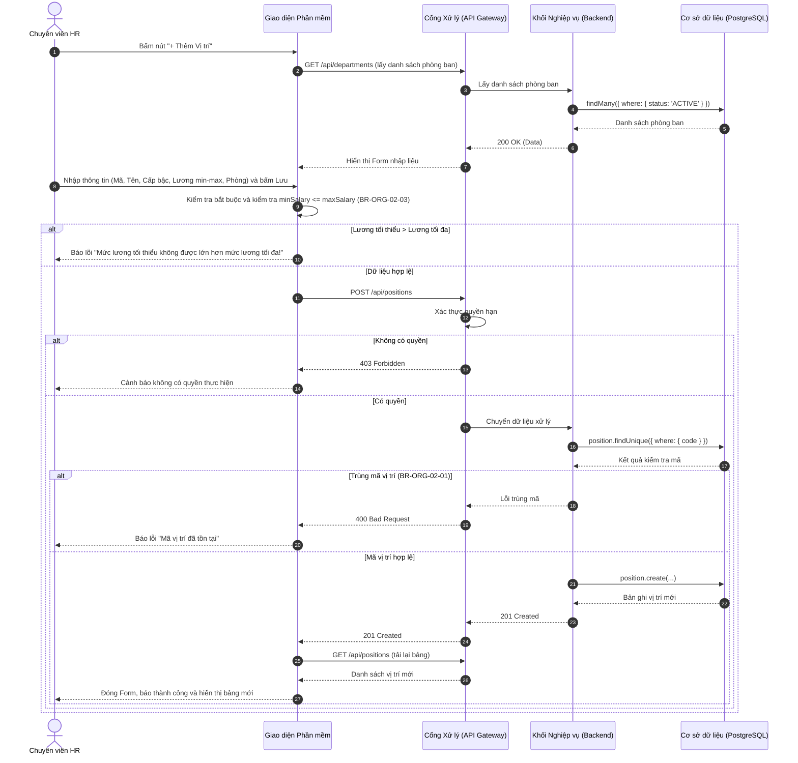
```mermaid
sequenceDiagram
    autonumber
    actor HR as Chuyên viên HR
    participant FE as Giao diện Phần mềm
    participant API as Cổng Xử lý (API Gateway)
    participant BE as Khối Nghiệp vụ (Backend)
    participant DB as Cơ sở dữ liệu (PostgreSQL)

    HR->>FE: Bấm nút "+ Thêm Vị trí"
    FE->>API: GET /api/departments (lấy danh sách phòng ban)
    API->>BE: Lấy danh sách phòng ban
    BE->>DB: findMany({ where: { status: 'ACTIVE' } })
    DB-->>BE: Danh sách phòng ban
    BE-->>API: 200 OK (Data)
    API-->>FE: Hiển thị Form nhập liệu

    HR->>FE: Nhập thông tin (Mã, Tên, Cấp bậc, Lương min-max, Phòng) và bấm Lưu
    FE->>FE: Kiểm tra bắt buộc và kiểm tra minSalary <= maxSalary (BR-ORG-02-03)
    alt Lương tối thiểu > Lương tối đa
        FE-->>HR: Báo lỗi "Mức lương tối thiểu không được lớn hơn mức lương tối đa!"
    else Dữ liệu hợp lệ
        FE->>API: POST /api/positions
        API->>API: Xác thực quyền hạn
        alt Không có quyền
            API-->>FE: 403 Forbidden
            FE-->>HR: Cảnh báo không có quyền thực hiện
        else Có quyền
            API->>BE: Chuyển dữ liệu xử lý
            BE->>DB: position.findUnique({ where: { code } })
            DB-->>BE: Kết quả kiểm tra mã
            alt Trùng mã vị trí (BR-ORG-02-01)
                BE-->>API: Lỗi trùng mã
                API-->>FE: 400 Bad Request
                FE-->>HR: Báo lỗi "Mã vị trí đã tồn tại"
            else Mã vị trí hợp lệ
                BE->>DB: position.create(...)
                DB-->>BE: Bản ghi vị trí mới
                BE-->>API: 201 Created
                API-->>FE: 201 Created
                FE->>API: GET /api/positions (tải lại bảng)
                API-->>FE: Danh sách vị trí mới
                FE-->>HR: Đóng Form, báo thành công và hiển thị bảng mới
            end
        end
    end
```

##### 5.2. Sơ đồ: Khóa / Mở khóa Vị trí (Đổi trạng thái Active / Inactive)
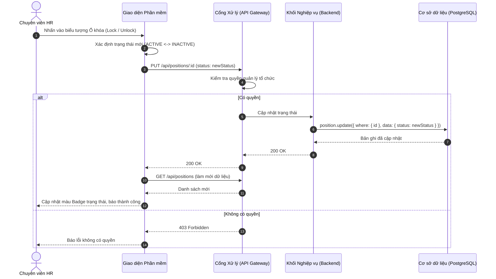
```mermaid
sequenceDiagram
    autonumber
    actor HR as Chuyên viên HR
    participant FE as Giao diện Phần mềm
    participant API as Cổng Xử lý (API Gateway)
    participant BE as Khối Nghiệp vụ (Backend)
    participant DB as Cơ sở dữ liệu (PostgreSQL)

    HR->>FE: Nhấn vào biểu tượng Ổ khóa (Lock / Unlock)
    FE->>FE: Xác định trạng thái mới (ACTIVE <-> INACTIVE)
    FE->>API: PUT /api/positions/:id (status: newStatus)

    API->>API: Kiểm tra quyền quản lý tổ chức
    alt Có quyền
        API->>BE: Cập nhật trạng thái
        BE->>DB: position.update({ where: { id }, data: { status: newStatus } })
        DB-->>BE: Bản ghi đã cập nhật
        BE-->>API: 200 OK
        API-->>FE: 200 OK
        FE->>API: GET /api/positions (làm mới dữ liệu)
        API-->>FE: Danh sách mới
        FE-->>HR: Cập nhật màu Badge trạng thái, báo thành công
    else Không có quyền
        API-->>FE: 403 Forbidden
        FE-->>HR: Báo lỗi không có quyền
    end
```

##### 5.3. Sơ đồ: Tìm kiếm & Lọc vị trí đa chiều
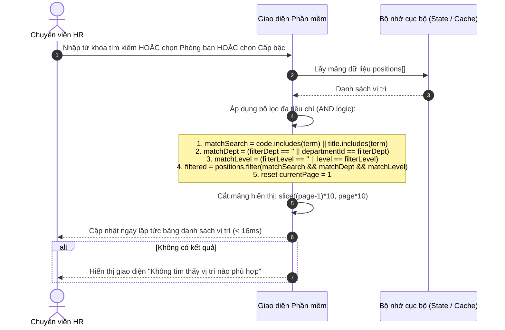
```mermaid
sequenceDiagram
    autonumber
    actor HR as Chuyên viên HR
    participant FE as Giao diện Phần mềm
    participant State as Bộ nhớ cục bộ (State / Cache)

    HR->>FE: Nhập từ khóa tìm kiếm HOẶC chọn Phòng ban HOẶC chọn Cấp bậc
    FE->>State: Lấy mảng dữ liệu positions[]
    State-->>FE: Danh sách vị trí
    FE->>FE: Áp dụng bộ lọc đa tiêu chí (AND logic):
    Note over FE: 1. matchSearch = code.includes(term) || title.includes(term)<br/>2. matchDept = (filterDept == '' || departmentId == filterDept)<br/>3. matchLevel = (filterLevel == '' || level == filterLevel)<br/>4. filtered = positions.filter(matchSearch && matchDept && matchLevel)<br/>5. reset currentPage = 1
    FE->>FE: Cắt mảng hiển thị: slice((page-1)*10, page*10)
    FE-->>HR: Cập nhật ngay lập tức bảng danh sách vị trí (< 16ms)
    alt Không có kết quả
        FE-->>HR: Hiển thị giao diện "Không tìm thấy vị trí nào phù hợp"
    end
```

##### 5.4. Sơ đồ: Xóa Vị trí an toàn
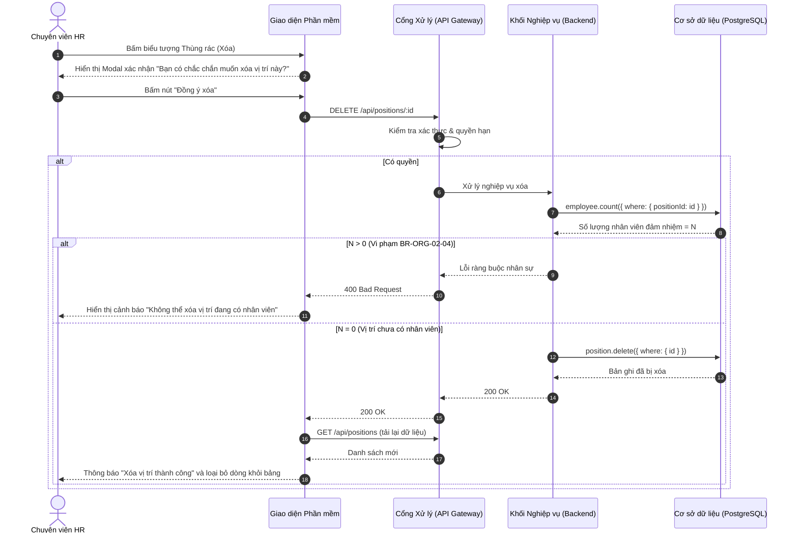
```mermaid
sequenceDiagram
    autonumber
    actor HR as Chuyên viên HR
    participant FE as Giao diện Phần mềm
    participant API as Cổng Xử lý (API Gateway)
    participant BE as Khối Nghiệp vụ (Backend)
    participant DB as Cơ sở dữ liệu (PostgreSQL)

    HR->>FE: Bấm biểu tượng Thùng rác (Xóa)
    FE-->>HR: Hiển thị Modal xác nhận "Bạn có chắc chắn muốn xóa vị trí này?"
    
    HR->>FE: Bấm nút "Đồng ý xóa"
    FE->>API: DELETE /api/positions/:id
    
    API->>API: Kiểm tra xác thực & quyền hạn
    alt Có quyền
        API->>BE: Xử lý nghiệp vụ xóa
        BE->>DB: employee.count({ where: { positionId: id } })
        DB-->>BE: Số lượng nhân viên đảm nhiệm = N
        alt N > 0 (Vi phạm BR-ORG-02-04)
            BE-->>API: Lỗi ràng buộc nhân sự
            API-->>FE: 400 Bad Request
            FE-->>HR: Hiển thị cảnh báo "Không thể xóa vị trí đang có nhân viên"
        else N = 0 (Vị trí chưa có nhân viên)
            BE->>DB: position.delete({ where: { id } })
            DB-->>BE: Bản ghi đã bị xóa
            BE-->>API: 200 OK
            API-->>FE: 200 OK
            FE->>API: GET /api/positions (tải lại dữ liệu)
            API-->>FE: Danh sách mới
            FE-->>HR: Thông báo "Xóa vị trí thành công" và loại bỏ dòng khỏi bảng
        end
    end
```

---

#### 6. Kịch bản kiểm thử & Nghiệm thu (Given / When / Then)

##### Kịch bản 1: Lọc vị trí theo phòng ban và cấp bậc
- **Given**: Công ty có các vị trí: `DEV_01 - Lập trình viên (Staff - Phòng CNTT)`, `DEV_LEAD - Trưởng nhóm lập trình (Team Lead - Phòng CNTT)`, `ACC_01 - Kế toán viên (Staff - Phòng Kế toán)`.
- **When**: HR chọn Phòng ban là "Phòng CNTT" và Cấp bậc là "Staff".
- **Then**: Hệ thống chỉ hiển thị đúng 01 vị trí `DEV_01 - Lập trình viên`. Ẩn toàn bộ các vị trí khác.

##### Kịch bản 2: Khóa vị trí tạm ngừng tuyển dụng
- **Given**: Vị trí `MARKETING_INTERN` đang ở trạng thái `ACTIVE`.
- **When**: HR click biểu tượng Ổ khóa tại dòng `MARKETING_INTERN`.
- **Then**: Trạng thái đổi thành `INACTIVE`. Khi tạo tin tuyển dụng mới hoặc tiếp nhận hồ sơ, chức danh này không hiển thị trong danh mục lựa chọn.

##### Kịch bản 3: Chặn nhập dải lương không hợp lệ
- **Given**: HR đang mở Form thêm vị trí mới.
- **When**: HR nhập Mức lương tối thiểu là `25,000,000` và Mức lương tối đa là `15,000,000`, sau đó bấm Lưu.
- **Then**: Hệ thống hiển thị thông báo lỗi ngay lập tức: *"Mức lương tối thiểu không được lớn hơn mức lương tối đa!"* và không cho phép gửi request.

##### Kịch bản 4: Chặn xóa vị trí đang có nhân viên
- **Given**: Vị trí `Kế toán trưởng` đang có 1 nhân viên đảm nhiệm.
- **When**: HR ấn nút Xóa và bấm Xác nhận.
- **Then**: Hệ thống từ chối xóa và hiển thị thông báo: *"Không thể xóa vị trí đang có nhân viên"*. Dữ liệu vị trí được bảo toàn nguyên vẹn.


### Usecase: UC-ORG-03 - Xem Sơ đồ Tổ chức (Organization Chart)

#### 1. Giới thiệu chức năng
- **Mục đích**: Mang đến bức tranh toàn cảnh, trực quan nhất về cấu trúc phân quyền và bộ máy vận hành của công ty. Thay vì đọc những bảng biểu khô khan, người dùng có thể nhìn thấy sự liên kết giữa các phòng ban thông qua sơ đồ dạng cây.
- **Actor (Tác nhân)**: Ban Lãnh đạo (Để hoạch định chiến lược), HR (Để kiểm tra định biên), Tất cả nhân viên (Để nắm rõ cấu trúc công ty).
- **Điều kiện tiên quyết**: Công ty đã thiết lập danh sách phòng ban và mối quan hệ quản lý cấp trên - cấp dưới.

#### 2. Dữ liệu nghiệp vụ đầu vào (Input Data)
- Chức năng này mang tính chất "Báo cáo / Trực quan hóa" (Read-Only). Người dùng không cần nhập liệu.
- Dữ liệu hoàn toàn được hệ thống tự động tổng hợp từ **Danh mục Phòng ban** (Sử dụng thông tin Phòng ban cha và số lượng nhân sự).

#### 3. Quy tắc nghiệp vụ (Business Rules)
| Mã Quy tắc | Tình huống nghiệp vụ | Cách hệ thống xử lý | Thông báo cho người dùng |
|---|---|---|---|
| BR-ORG-03-01 | **Xác định Đỉnh chóp sơ đồ (Đơn vị cấp 1)** | Các đơn vị độc lập, không chịu sự quản lý của đơn vị nào khác (Tức là không chọn Phòng ban cha) sẽ được hệ thống đặt làm điểm xuất phát ở đỉnh sơ đồ (Ví dụ: Hội đồng Quản trị, Ban Giám đốc). | |
| BR-ORG-03-02 | **Xác định Cấp dưới (Đơn vị nhánh)** | Bất kỳ phòng ban nào có thiết lập "Phòng ban cha" sẽ tự động được vẽ thành một nhánh cấp dưới, treo trực tiếp bằng một đường thẳng từ đơn vị cha tương ứng. | |
| BR-ORG-03-03 | **Minh bạch thông tin vận hành** | Trên khung thông tin (Card) của mỗi phòng ban, hệ thống bắt buộc phải hiển thị **Chỉ số lấp đầy nhân sự**. (Công thức: Tổng số nhân viên đang làm / Tổng định biên tối đa được duyệt). | |

#### 4. Luồng xử lý nghiệp vụ
1. Người dùng truy cập module Tổ chức và chọn menu "Sơ đồ Tổ chức".
2. Hệ thống (Frontend) nhận lệnh và gọi API để lấy toàn bộ danh mục phòng ban hiện có.
3. Backend tiến hành truy xuất CSDL, lấy ra toàn bộ phòng ban (kèm thống kê số nhân sự) và trả dữ liệu thô về cho Frontend.
4. Giao diện (Frontend) phân tích dữ liệu:
   - Các phòng ban cấp 1 (Không có phòng cha) được đặt làm Root (Đỉnh sơ đồ).
   - Các phòng ban có khai báo phòng cha sẽ được ghép nối thành nhánh con bên dưới phòng cha đó.
5. Giao diện vẽ ra sơ đồ tư duy dạng nhánh rễ cây và hiển thị lên màn hình cho người dùng.
6. Người dùng có thể tương tác trực tiếp với giao diện: Kéo thả khung hình, phóng to/thu nhỏ (Zoom), hoặc bấm vào các nút [+] [-] để ẩn/hiện các phòng ban con ở cấp sâu hơn.

#### 5. Kết quả đầu ra
- Giao diện đồ họa sinh động. Sơ đồ này phản ánh "thực tế thời gian thực (Real-time)". Nếu HR vừa thêm một phòng mới, sơ đồ sẽ tự động dài thêm một nhánh mà không cần vẽ tay.

#### 6. Sơ đồ tuần tự (Sequence Diagram) - Kịch bản Vẽ sơ đồ
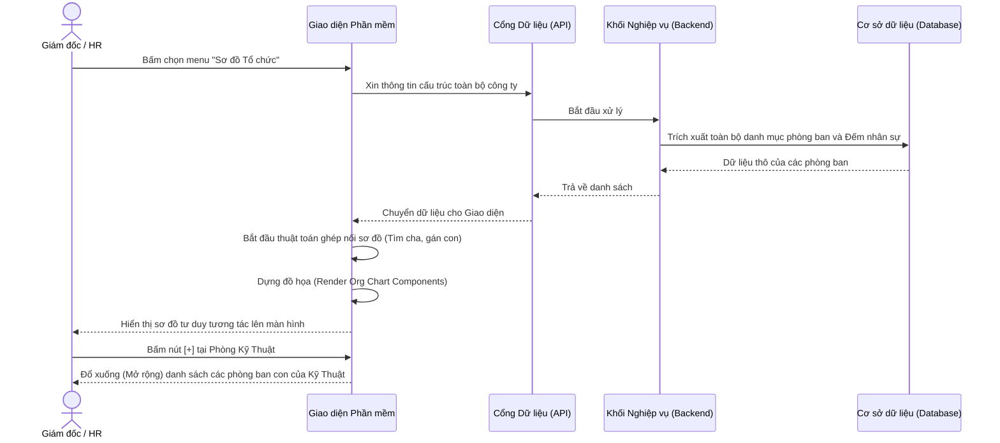
```mermaid
sequenceDiagram
    actor User as Giám đốc / HR
    participant FE as Giao diện Phần mềm
    participant API as Cổng Dữ liệu (API)
    participant BE as Khối Nghiệp vụ (Backend)
    participant DB as Cơ sở dữ liệu (Database)

    User->>FE: Bấm chọn menu "Sơ đồ Tổ chức"
    FE->>API: Xin thông tin cấu trúc toàn bộ công ty
    API->>BE: Bắt đầu xử lý
    BE->>DB: Trích xuất toàn bộ danh mục phòng ban và Đếm nhân sự
    DB-->>BE: Dữ liệu thô của các phòng ban
    BE-->>API: Trả về danh sách
    API-->>FE: Chuyển dữ liệu cho Giao diện
    FE->>FE: Bắt đầu thuật toán ghép nối sơ đồ (Tìm cha, gán con)
    FE->>FE: Dựng đồ họa (Render Org Chart Components)
    FE-->>User: Hiển thị sơ đồ tư duy tương tác lên màn hình
    
    User->>FE: Bấm nút [+] tại Phòng Kỹ Thuật
    FE-->>User: Đổ xuống (Mở rộng) danh sách các phòng ban con của Kỹ Thuật
```

#### 7. Kịch bản nghiệm thu (Given / When / Then)
- **Kịch bản 1: Cấu trúc đa cấp tự động**
  - *Given*: Công ty có "Ban Giám Đốc". Dưới BGD có "Phòng Kỹ Thuật". Dưới Kỹ Thuật có "Nhóm Tester".
  - *When*: Người dùng mở chức năng Sơ đồ.
  - *Then*: Giao diện hiển thị đúng 3 tầng, đường nối từ BGD thả xuống Kỹ Thuật, và từ Kỹ Thuật thả xuống Tester.
- **Kịch bản 2: Hiển thị thông số định biên (Quota)**
  - *Given*: Phòng Hành chính được duyệt tối đa 5 người, hiện tại đang có 3 người đi làm.
  - *When*: Giám đốc xem thông tin trên thẻ của phòng Hành chính.
  - *Then*: Thẻ hiển thị dòng chỉ số "3/5" báo hiệu phòng vẫn còn được phép tuyển thêm 2 người nữa.

---

### 2.2.2. Module Tuyển dụng nhân tài & Quản lý Offer (Recruitment & ATS)
### TÀI LIỆU PHÂN TÍCH NGHIỆP VỤ - MODULE TUYỂN DỤNG (RECRUITMENT & ATS)

#### 1. Giới thiệu tổng quan Module
**Module Tuyển dụng (Recruitment & ATS)** là cổng tiếp nhận và sàng lọc nhân sự đầu vào của toàn bộ doanh nghiệp. Được thiết kế theo chuẩn Enterprise HRM, module đóng vai trò cầu nối xuyên suốt giữa hai trụ cột:
- **Module Tổ chức (Organization)**: Cung cấp thông tin định biên nhân sự, sơ đồ tổ chức, cơ cấu phòng ban và vị trí chức danh để xác lập đúng nhu cầu tuyển dụng.
- **Module Hồ sơ Nhân sự (Core HR)**: Tiếp nhận dữ liệu ứng viên trúng tuyển qua cơ chế **Auto-provisioning (Tự động khởi tạo Hồ sơ Nhân viên & Hợp đồng)**, loại bỏ 100% việc nhập liệu thủ công dư thừa.

##### Đối tượng sử dụng (Actors):
1. **Chuyên viên Tuyển dụng (Recruiter / HR)**: Quản lý chiến dịch, săn tìm và sàng lọc hồ sơ CV, điều phối lịch hẹn phỏng vấn, đàm phán mức lương đãi ngộ.
2. **Người phỏng vấn / Trưởng bộ phận chuyên môn (Interviewer / Line Manager)**: Tham gia đánh giá năng lực, chấm điểm định lượng (1-10) và viết nhận xét chuyên môn.
3. **Trưởng phòng Nhân sự / Ban Giám đốc (HR Manager / Director)**: Phê duyệt yêu cầu tuyển dụng, ký duyệt Job Offer và tiếp nhận nhân sự chính thức.
4. **Quản trị viên hệ thống (Admin)**: Cấu hình quy trình, phân quyền và kiểm soát toàn vẹn dữ liệu.

---

#### 2. Kiến trúc Luồng Dữ liệu Phễu Tuyển dụng (Recruitment Pipeline Architecture)

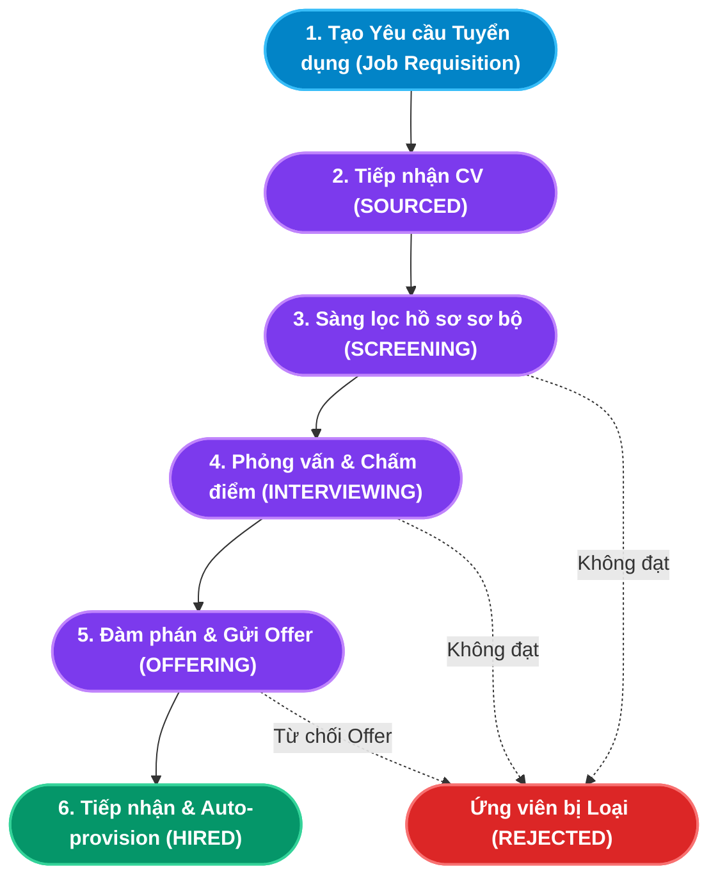
```mermaid
flowchart TD
    classDef startEnd fill:#0284c7,stroke:#38bdf8,stroke-width:2px,color:#ffffff,font-weight:bold;
    classDef process fill:#7c3aed,stroke:#c084fc,stroke-width:2px,color:#ffffff,font-weight:bold;
    classDef success fill:#059669,stroke:#34d399,stroke-width:2px,color:#ffffff,font-weight:bold;
    classDef reject fill:#dc2626,stroke:#f87171,stroke-width:2px,color:#ffffff,font-weight:bold;

    A(["1. Tạo Yêu cầu Tuyển dụng (Job Requisition)"]):::startEnd
    B(["2. Tiếp nhận CV (SOURCED)"]):::process
    C(["3. Sàng lọc hồ sơ sơ bộ (SCREENING)"]):::process
    D(["4. Phỏng vấn & Chấm điểm (INTERVIEWING)"]):::process
    E(["5. Đàm phán & Gửi Offer (OFFERING)"]):::process
    F(["6. Tiếp nhận & Auto-provision (HIRED)"]):::success
    R(["Ứng viên bị Loại (REJECTED)"]):::reject

    A --> B
    B --> C
    C --> D
    D --> E
    E --> F
    
    C -.->|Không đạt| R
    D -.->|Không đạt| R
    E -.->|Từ chối Offer| R
```

---

#### 3. Ma trận Phân rã Chức năng Chi tiết (Functional Breakdown Matrix)

Hệ thống Tuyển dụng bao gồm **4 nhóm chức năng lớn** với tổng cộng **20 Use Case con (Sub-Use Cases)** được chuẩn hóa toàn diện:

| Nhóm chức năng (Epic) | Mã Use Case | Tên Chức năng Con (Sub-Use Case) | Actor chính | Endpoint Backend |
|---|---|---|---|---|
| **1. Yêu cầu Tuyển dụng**<br/>*(Job Requisition)* | `UC-REC-01-01` | Tạo mới Yêu cầu tuyển dụng (Create Requisition) | HR / Manager | `POST /api/job-postings` |
| | `UC-REC-01-02` | Chỉnh sửa thông tin Yêu cầu tuyển dụng (Edit Requisition) | HR / Manager | `PUT /api/job-postings/:id` |
| | `UC-REC-01-03` | Đóng / Mở lại chiến dịch tuyển dụng (Toggle Status) | HR / Manager | `PATCH /api/job-postings/:id/status` |
| | `UC-REC-01-04` | Tra cứu & Thống kê Tỷ lệ lấp đầy (Fill Rate Metric) | Ban Giám đốc / HR | `GET /api/job-postings` |
| | `UC-REC-01-05` | Xóa chiến dịch tuyển dụng (Delete Requisition) | HR / Admin | `DELETE /api/job-postings/:id` |
| **2. Theo dõi Ứng viên ATS**<br/>*(ATS Kanban Board)* | `UC-REC-02-01` | Tiếp nhận & Thêm mới hồ sơ Ứng viên (Source Candidate) | HR / Recruiter | `POST /api/candidates` |
| | `UC-REC-02-02` | Kéo thả chuyển trạng thái ứng viên (Kanban Stage Transition) | HR / Recruiter | `PUT /api/candidates/:id` |
| | `UC-REC-02-03` | Đánh dấu Loại hồ sơ ứng viên kèm lý do (Reject Candidate) | HR / Recruiter | `PUT /api/candidates/:id` |
| | `UC-REC-02-04` | Tìm kiếm & Lọc hồ sơ ứng viên trên Kanban | HR / Recruiter | `GET /api/candidates` |
| | `UC-REC-02-05` | Chuyển đổi Ứng viên thành Nhân viên (Auto-provision Employee) | HR / Admin | `PUT /api/candidates/:id` (Transaction) |
| **3. Lịch Phỏng vấn**<br/>*(Interview & Feedback)* | `UC-REC-03-01` | Lên lịch phỏng vấn mới (Schedule Interview) | HR / Recruiter | `POST /api/interviews` |
| | `UC-REC-03-02` | Cập nhật & Dời lịch phỏng vấn (Reschedule Interview) | HR / Recruiter | `PUT /api/interviews/:id` |
| | `UC-REC-03-03` | Đánh giá & Chấm điểm ứng viên (Submit Feedback & Score) | Interviewer / Manager | `POST /api/interviews/:id/feedback` |
| | `UC-REC-03-04` | Phê duyệt kết quả sau phỏng vấn - Chốt Offer / Loại | HR / Recruiter | `PUT /api/candidates/:id` |
| | `UC-REC-03-05` | Hủy lịch phỏng vấn (Cancel Interview Round) | HR / Admin | `DELETE /api/interviews/:id` |
| **4. Quản lý Offer**<br/>*(Offer & Onboarding)* | `UC-REC-04-01` | Tra cứu danh sách ứng viên chờ Offer (View Offering Candidates) | HR / Recruiter | `GET /api/offers` |
| | `UC-REC-04-02` | Thiết lập thông tin Tiếp nhận & Hợp đồng (Prepare Onboarding) | HR / Recruiter | Form Modal Onboarding |
| | `UC-REC-04-03` | Tiếp nhận & Khởi tạo Nhân viên Core HR (Accept Offer) | HR / Admin | `POST /api/offers/accept` (Transaction) |
| | `UC-REC-04-04` | Ghi nhận Ứng viên Từ chối Offer (Reject Offer) | HR / Recruiter | `POST /api/offers/:id/reject` |
| | `UC-REC-04-05` | Toàn vẹn định danh & Tự động đóng Job khi đủ chỉ tiêu | Backend System | Prisma Transaction & Event Trigger |

---

#### 4. Danh mục Hồ sơ Phân tích Chi tiết (Detailed Specifications)

Vui lòng tham khảo tài liệu đặc tả chi tiết của từng chức năng con tại các liên kết dưới đây:

1. [Đặc tả Chức năng Quản lý Yêu cầu Tuyển dụng](file:///c:/Users/truclh/Desktop/HRM-ĐATN/docs/Tài%20liệu%20phân%20tích%20nghiệp%20vụ%20từng%20module/Module%20Tuyển%20dụng/Chuc-nang-Yeu-cau-Tuyen-dung.md)
   - Đặc tả 5 Use Case con: Tạo yêu cầu, Sửa yêu cầu, Đóng/Mở chiến dịch, Thống kê Fill Rate, Xóa chiến dịch.
   - Sơ đồ tuần tự và 5 kịch bản kiểm thử mẫu.

2. [Đặc tả Chức năng Hệ thống Theo dõi Ứng viên ATS Kanban](file:///c:/Users/truclh/Desktop/HRM-ĐATN/docs/Tài%20liệu%20phân%20tích%20nghiệp%20vụ%20từng%20module/Module%20Tuyển%20dụng/Chuc-nang-Quan-ly-ATS.md)
   - Đặc tả 5 Use Case con: Thêm ứng viên Sourced, Kéo thả Kanban, Loại ứng viên, Tìm kiếm lọc CV, Kích hoạt Auto-provisioning khi kéo vào cột HIRED.
   - Sơ đồ tuần tự Transaction liên bảng và 5 kịch bản kiểm thử mẫu.

3. [Đặc tả Chức năng Quản lý Lịch Phỏng vấn và Đánh giá](file:///c:/Users/truclh/Desktop/HRM-ĐATN/docs/Tài%20liệu%20phân%20tích%20nghiệp%20vụ%20từng%20module/Module%20Tuyển%20dụng/Chuc-nang-Phong-van.md)
   - Đặc tả 5 Use Case con: Lên lịch hẹn, Dời lịch, Chấm điểm Feedback định lượng (1-10) sau giờ hẹn, Phê duyệt nhanh kết quả (Chốt Offer / Từ chối), Hủy lịch.
   - Sơ đồ tuần tự Feedback và 6 kịch bản kiểm thử mẫu.

4. [Đặc tả Chức năng Quản lý Đề nghị nhận việc và Tiếp nhận Nhân sự](file:///c:/Users/truclh/Desktop/HRM-ĐATN/docs/Tài%20liệu%20phân%20tích%20nghiệp%20vụ%20từng%20module/Module%20Tuyển%20dụng/Chuc-nang-Quan-ly-Offer.md)
   - Đặc tả 5 Use Case con: Tra cứu danh sách Offer, Thiết lập điều khoản tiếp nhận, Tiếp nhận Onboarding sinh mã NV & hợp đồng tự động, Từ chối Offer, Ràng buộc Unique & Đồng bộ chỉ tiêu.
   - Sơ đồ tuần tự Prisma $transaction Onboarding và 6 kịch bản kiểm thử mẫu.

---

#### 5. Điểm nhấn Kỹ thuật & Nghiệp vụ (Key Business Highlights)

1. **Auto-provisioning Nhân sự (Zero Duplicate Data Entry)**:
   - Trong các hệ thống HRM thông thường, khi ứng viên trúng tuyển, phòng Nhân sự phải mở module Core HR để gõ lại toàn bộ Họ tên, Email, SĐT, Vị trí, Lương thỏa thuận và Ngày nhận việc.
   - Trong hệ thống này, khi nhấn "Tiếp nhận / Tạo hồ sơ" hoặc kéo thẻ sang `HIRED`, hệ thống sử dụng một **Database Transaction** khép kín:
     - Tạo bản ghi `Employee` với trạng thái `ONBOARDING`.
     - Tự động liên kết `departmentId` và `positionId` từ chiến dịch tuyển dụng.
     - Tạo bản ghi `Contract` với mức lương và loại hợp đồng đã thỏa thuận.
     - Cập nhật trạng thái `Candidate` thành `HIRED`.

2. **Cơ chế Khóa Đánh giá Phỏng vấn (Interview Feedback Immutability)**:
   - Chỉ cho phép chấm điểm khi buổi phỏng vấn đã diễn ra trong thực tế (`scheduledAt < currentTime`).
   - Kết quả chấm điểm (thang điểm 1-10 kèm bình luận) sau khi nộp sẽ được khóa cố định nhằm đảm bảo tính minh bạch, chống gian lận kết quả thi tuyển.

3. **Tự động đóng chiến dịch khi đạt chỉ tiêu (Headcount Auto-closure)**:
   - Mỗi khi một ứng viên được tiếp nhận thành công, hệ thống tính toán lại tỷ lệ lấp đầy (`Fill Rate`). Nếu số người được tuyển (`hiredCount`) đạt chỉ tiêu (`amount`), chiến dịch tự động chuyển sang trạng thái `CLOSED` để tránh tiếp nhận dư thừa nhân lực.


### Usecase: UC-REC-01 - Quản lý Yêu cầu Tuyển dụng (Job Requisitions)

#### 1. Giới thiệu chức năng
- **Mục đích**: Cung cấp công cụ cho Phòng Nhân sự và Trưởng các bộ phận khởi tạo, quản lý và theo dõi tiến độ các chiến dịch tuyển dụng (Job Requisitions / Postings). Hệ thống đảm bảo mọi yêu cầu tuyển dụng đều gắn liền với định biên nhân sự của Phòng ban và Vị trí (Position) cụ thể, kiểm soát chặt chẽ ngân sách lương và hạn ngạch tuyển dụng (Headcount).
- **Actor (Tác nhân)**: Trưởng bộ phận (Department Head), Chuyên viên Tuyển dụng (Recruiter), Trưởng phòng Nhân sự (HR Manager), Quản trị viên (Admin).
- **Điều kiện tiên quyết**: Người dùng đã đăng nhập và có quyền `MANAGE_RECRUITMENT` hoặc vai trò `ADMIN` / `HR_MANAGER` / `RECRUITER`.

##### Danh mục các chức năng con (Sub-features):
1. **UC-REC-01-01: Thêm mới Yêu cầu tuyển dụng**: Tạo chiến dịch tuyển dụng mới liên kết trực tiếp với Phòng ban và Vị trí.
2. **UC-REC-01-02: Chỉnh sửa Yêu cầu tuyển dụng**: Điều chỉnh chỉ tiêu số lượng (Amount), hạn nộp hồ sơ (Deadline), mô tả công việc và mức lương.
3. **UC-REC-01-03: Đóng / Mở lại chiến dịch tuyển dụng**: Đóng chiến dịch khi đủ chỉ tiêu hoặc hết hạn; kích hoạt lại khi có nhu cầu bổ sung.
4. **UC-REC-01-04: Tìm kiếm, Lọc & Giám sát tiến độ lấp đầy (Fill Rate)**: Tra cứu nhanh theo từ khóa, lọc theo phòng ban/trạng thái và hiển thị thanh tiến độ tuyển dụng trực quan.
5. **UC-REC-01-05: Xóa Yêu cầu tuyển dụng (Hard Delete)**: Xóa triệt để các chiến dịch nháp hoặc nhập sai (ràng buộc chưa có ứng viên nộp hồ sơ).

---

#### 2. Dữ liệu nghiệp vụ đầu vào (Input Data & Parameters)

##### 2.1. Biểu mẫu Yêu cầu tuyển dụng (Job Requisition Form)
| Tên trường | Kiểu dữ liệu | Tính chất | Ý nghĩa nghiệp vụ & Ràng buộc |
|---|---|---|---|
| `Tiêu đề chiến dịch` (title) | Chuỗi (String) | Bắt buộc | Tên hiển thị của vị trí tuyển dụng (VD: `Senior Backend Developer NodeJS`). Tối đa 255 ký tự. |
| `Vị trí công tác` (positionId) | UUID / Chuỗi | Bắt buộc | Vị trí việc làm chuẩn từ Danh mục Vị trí (Module Tổ chức). |
| `Phòng ban` (departmentId) | UUID / Chuỗi | Tự động | Phòng ban trực thuộc vị trí đã chọn (Tự động nạp từ Position, không cho sửa lệch). |
| `Số lượng cần tuyển` (amount) | Số nguyên (Integer) | Bắt buộc | Chỉ tiêu biên chế tuyển dụng cần bổ sung ($≥ 1$, mặc định = 1). |
| `Khung lương dự kiến` (salaryRange) | Chuỗi (String) | Tùy chọn | Dải ngân sách lương (VD: `15 - 25 Triệu` hoặc tự động gợi ý từ dải lương của Vị trí). |
| `Cấp bậc` (level) | Chuỗi (String) | Tùy chọn | Cấp bậc chuyên môn: `Intern`, `Junior`, `Middle`, `Senior`, `Lead`, `Manager`. |
| `Hình thức làm việc` (jobType) | Enum/String | Mặc định | `Full-time`, `Part-time`, `Contract`, `Remote`. Mặc định: `Full-time`. |
| `Hạn chót nộp hồ sơ` (deadline) | Ngày (Date) | Bắt buộc | Ngày kết thúc nhận CV (phải ≥ ngày hiện tại). |
| `Mô tả công việc & Yêu cầu` (description) | Văn bản (Text) | Bắt buộc | Chi tiết trách nhiệm công việc, kỹ năng yêu cầu và chế độ đãi ngộ. |
| `Trạng thái` (status) | Enum/String | Mặc định | `DRAFT` (Nháp), `PUBLISHED` (Đang tuyển), `CLOSED` (Đã đóng). |

---

#### 3. Quy tắc nghiệp vụ (Business Rules)

| Mã Quy tắc | Tình huống nghiệp vụ | Cách hệ thống xử lý | Thông báo hiển thị |
|---|---|---|---|
| **BR-REC-01-01** | **Ràng buộc toàn vẹn tổ chức**: Tạo yêu cầu tuyển dụng không gắn với Vị trí/Phòng ban. | Bắt buộc chọn `positionId`. Hệ thống tự động truy vấn `departmentId` tương ứng để đảm bảo tính toàn vẹn. | "Vui lòng chọn Vị trí công tác hợp lệ" |
| **BR-REC-01-02** | **Tự động gợi ý ngân sách lương**: Khi HR chọn chức danh vị trí. | Tự động nạp khung lương `minSalary - maxSalary` đã cấu hình ở Module Tổ chức vào ô `salaryRange`. | Tự động điền dữ liệu gợi ý |
| **BR-REC-01-03** | **Kiểm soát hạn nộp hồ sơ**: HR nhập `deadline` trong quá khứ. | Giao diện kiểm tra `deadline >= today()`. Nếu nhỏ hơn → Chặn gửi request. | "Hạn chót nộp hồ sơ phải từ ngày hôm nay trở đi" |
| **BR-REC-01-04** | **Tự động đóng chiến dịch khi đủ chỉ tiêu**: Khi số ứng viên đạt trạng thái `HIRED` bằng chỉ tiêu `amount`. | Backend kiểm tra `hiredCount >= amount`. Nếu đủ → Tự động đổi `status = 'CLOSED'` và gửi thông báo hoàn thành chiến dịch. | "Chiến dịch tuyển dụng đã hoàn thành đủ chỉ tiêu" |
| **BR-REC-01-05** | **Ràng buộc an toàn khi Xóa (Hard Delete)**: HR bấm xóa chiến dịch đã có ứng viên nộp hồ sơ (`candidates > 0`). | Backend đếm `candidate.count({ where: { jobPostingId } })`. Nếu $> 0 →$ Từ chối xóa, trả HTTP 400. Khuyến nghị chuyển sang `CLOSED`. | "Không thể xóa tin tuyển dụng đang có ứng viên ứng tuyển!" |
| **BR-REC-01-06** | **Công thức tính tỷ lệ lấp đầy (Fill Rate)**: Hiển thị tiến độ tuyển dụng trên giao diện bảng. | `Fill Rate (%) = Math.round((hiredCount / amount) * 100)`. Hiển thị thanh tiến độ màu xanh/vàng/đỏ tương ứng. | Hiển thị Progress Bar trực quan |
| **BR-REC-01-07** | **Đóng chiến dịch thủ công (Soft Close)**: HR chủ động dừng nhận hồ sơ trước hạn. | Chuyển `status = 'CLOSED'`. Ẩn tin khỏi Cổng tuyển dụng bên ngoài (Public Portal). Ứng viên không thể nộp thêm CV. | "Đã đóng chiến dịch tuyển dụng thành công" |

---

#### 4. Đặc tả chi tiết các Use Case chức năng con (Sub-Use Cases Specification)

Mỗi chức năng con trong Quản lý Yêu cầu Tuyển dụng gồm Sơ đồ Use Case phân rã trực quan và Bảng đặc tả 8 mục nghiệp vụ chuẩn hóa:

---

##### 4.1. UC-REC-01-01: Thêm mới Yêu cầu tuyển dụng (Create Job Requisition)

###### Sơ đồ Use Case:
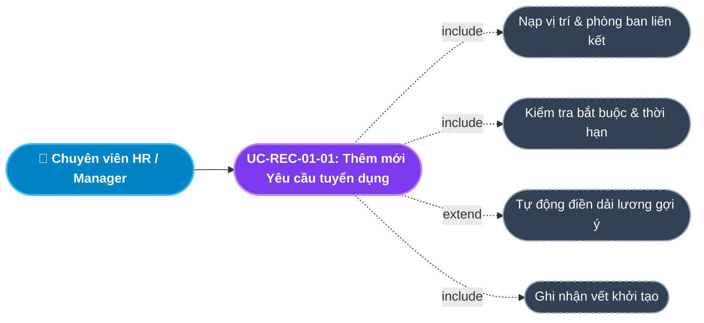
```mermaid
flowchart LR
    classDef actor fill:#0284c7,stroke:#38bdf8,stroke-width:2px,color:#ffffff,font-weight:bold;
    classDef main fill:#7c3aed,stroke:#c084fc,stroke-width:2px,color:#ffffff,font-weight:bold;
    classDef sub fill:#334155,stroke:#94a3b8,stroke-width:1.5px,color:#ffffff,stroke-dasharray: 4 4;

    Actor(["👤 Chuyên viên HR / Manager"]):::actor
    UC(["UC-REC-01-01: Thêm mới Yêu cầu tuyển dụng"]):::main
    UC_Pos(["Nạp vị trí & phòng ban liên kết"]):::sub
    UC_Val(["Kiểm tra bắt buộc & thời hạn"]):::sub
    UC_Auto(["Tự động điền dải lương gợi ý"]):::sub
    UC_Audit(["Ghi nhận vết khởi tạo"]):::sub

    Actor --> UC
    UC -.->|include| UC_Pos
    UC -.->|include| UC_Val
    UC -.->|extend| UC_Auto
    UC -.->|include| UC_Audit
```

###### Bảng đặc tả nghiệp vụ:

| STT | Hạng mục | Nội dung chi tiết |
|:---:|---|---|
| **1** | **Thông tin chung** | - **UC ID**: `UC-REC-01-01`<br/>- **UC Name**: Thêm mới Yêu cầu tuyển dụng (Create Job Requisition)<br/>- **Actor**: Chuyên viên Tuyển dụng, Trưởng phòng chuyên môn, HR Manager<br/>- **Mục tiêu**: Tạo lập chiến dịch tuyển dụng mới có gắn kết chặt chẽ với Vị trí và Phòng ban theo kế hoạch định biên.<br/>- **Mô tả**: Người dùng nhập tiêu đề, chọn vị trí, nhập số lượng cần tuyển, hạn nộp hồ sơ, mô tả công việc và mức lương dự kiến.<br/>- **Priority**: High (Bắt buộc) |
| **2** | **Trigger** | Người dùng nhấn nút **"+ Tạo Yêu cầu mới"** trên thanh công cụ của màn hình Yêu cầu tuyển dụng. |
| **3** | **Pre-condition** | 1. Người dùng đã đăng nhập với vai trò có quyền quản lý tuyển dụng.<br/>2. Đã có ít nhất 01 Phòng ban và 01 Vị trí đang hoạt động (`ACTIVE`) trong Module Tổ chức. |
| **4** | **Post-condition** | 1. Bản ghi chiến dịch mới được lưu vào CSDL với trạng thái `PUBLISHED` (hoặc `DRAFT`).<br/>2. Xuất hiện trên bảng danh sách chiến dịch kèm chỉ số tiến độ `0/Amount (0%)`.<br/>3. Hiển thị trên bảng Kanban ATS và Cổng tuyển dụng ứng viên.<br/>4. Ghi nhận Audit Log hệ thống. |
| **5** | **Main Flow** | 1. Người dùng nhấn nút **"+ Tạo Yêu cầu mới"**.<br/>2. Hệ thống tải danh mục Vị trí & Phòng ban, hiển thị Modal Form *Thêm mới Yêu cầu tuyển dụng*.<br/>3. Người dùng chọn Vị trí công tác (`Position`).<br/>4. Hệ thống tự động nạp Phòng ban trực thuộc và điền dải lương gợi ý (`BR-REC-01-02`).<br/>5. Người dùng nhập Tiêu đề, Số lượng tuyển (`amount`), Hạn nộp hồ sơ (`deadline`), Mô tả công việc.<br/>6. Người dùng chọn trạng thái phát hành (`PUBLISHED`) và nhấn **"Lưu thông tin"**.<br/>7. Giao diện kiểm tra tính hợp lệ dữ liệu (Tiêu đề không rỗng, `amount >= 1`, `deadline >= today`).<br/>8. Gửi request `POST /api/job-postings` kèm payload dữ liệu.<br/>9. Backend kiểm tra quyền, tạo bản ghi trong CSDL và trả về `HTTP 201 Created`.<br/>10. Giao diện đóng Modal, nạp lại danh sách và hiển thị Toast thông báo thành công. |
| **6** | **Alternative / Exception Flow** | - **AF-01 (Lưu nháp DRAFT)**: Người dùng chọn trạng thái `DRAFT` → Chiến dịch được lưu nhưng chưa hiển thị trên Cổng tuyển dụng ngoài.<br/>- **AF-02 (Hủy nhập)**: Nhấn "Hủy" hoặc icon `X` → Đóng modal, không lưu dữ liệu.<br/>- **EF-01 (Thiếu trường bắt buộc)**: Để trống Tiêu đề hoặc Vị trí → Báo lỗi *"Vui lòng nhập đủ các trường bắt buộc!"*.<br/>- **EF-02 (Hạn nộp không hợp lệ)**: Chọn `deadline` trong quá khứ → Báo lỗi *"Hạn chót nộp hồ sơ phải từ ngày hôm nay trở đi!"*.<br/>- **EF-03 (Lỗi kết nối server)**: Mất mạng hoặc server lỗi 500 → Toast báo lỗi *"Không thể kết nối đến máy chủ"*. |
| **7** | **Business Rules & Validation** | - `BR-REC-01-01`: Bắt buộc liên kết với `positionId` và `departmentId`.<br/>- `title`: Chuỗi 1-255 ký tự.<br/>- `amount`: Số nguyên dương $≥ 1$, mặc định = 1.<br/>- `deadline`: Định dạng ngày hợp lệ ≥ ngày hiện tại.<br/>- Trạng thái hợp lệ: `DRAFT`, `PUBLISHED`, `CLOSED`. |
| **8** | **Acceptance Criteria** | - **AC-01**: Khi chọn Vị trí, trường Phòng ban và Khung lương phải tự động nạp đúng giá trị tương ứng trong vòng 100ms.<br/>- **AC-02**: Nhập hạn nộp trong quá khứ và bấm Lưu → Bị chặn lại và cảnh báo rõ ràng.<br/>- **AC-03**: Nhập đầy đủ thông tin hợp lệ → Lưu thành công, đóng form và xuất hiện ngay trên bảng danh sách. |

---

##### 4.2. UC-REC-01-02: Chỉnh sửa Yêu cầu tuyển dụng (Update Job Requisition)

###### Sơ đồ Use Case:
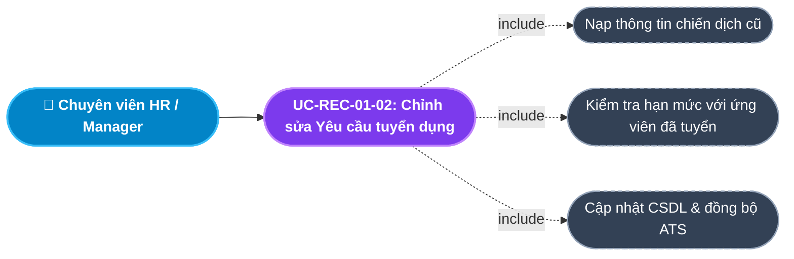
```mermaid
flowchart LR
    classDef actor fill:#0284c7,stroke:#38bdf8,stroke-width:2px,color:#ffffff,font-weight:bold;
    classDef main fill:#7c3aed,stroke:#c084fc,stroke-width:2px,color:#ffffff,font-weight:bold;
    classDef sub fill:#334155,stroke:#94a3b8,stroke-width:1.5px,color:#ffffff,stroke-dasharray: 4 4;

    Actor(["👤 Chuyên viên HR / Manager"]):::actor
    UC(["UC-REC-01-02: Chỉnh sửa Yêu cầu tuyển dụng"]):::main
    UC_Load(["Nạp thông tin chiến dịch cũ"]):::sub
    UC_Check(["Kiểm tra hạn mức với ứng viên đã tuyển"]):::sub
    UC_Update(["Cập nhật CSDL & đồng bộ ATS"]):::sub

    Actor --> UC
    UC -.->|include| UC_Load
    UC -.->|include| UC_Check
    UC -.->|include| UC_Update
```

###### Bảng đặc tả nghiệp vụ:

| STT | Hạng mục | Nội dung chi tiết |
|:---:|---|---|
| **1** | **Thông tin chung** | - **UC ID**: `UC-REC-01-02`<br/>- **UC Name**: Chỉnh sửa Yêu cầu tuyển dụng (Update Job Requisition)<br/>- **Actor**: Chuyên viên Tuyển dụng, HR Manager<br/>- **Mục tiêu**: Cập nhật thông tin chiến dịch khi có điều chỉnh về số lượng chỉ tiêu, dải lương, gia hạn deadline hoặc thay đổi mô tả công việc.<br/>- **Mô tả**: Người dùng chỉnh sửa các trường thông tin của yêu cầu tuyển dụng hiện có và lưu cập nhật vào CSDL.<br/>- **Priority**: High |
| **2** | **Trigger** | Người dùng nhấn biểu tượng cây bút **"Sửa" (Edit)** tại dòng chiến dịch tuyển dụng tương ứng trong bảng. |
| **3** | **Pre-condition** | 1. Có quyền quản lý tuyển dụng.<br/>2. Chiến dịch tuyển dụng đang tồn tại và chưa bị xóa. |
| **4** | **Post-condition** | 1. Dữ liệu chiến dịch được cập nhật chính xác trong CSDL.<br/>2. Thanh tiến độ lấp đầy (Fill Rate) tính toán lại theo chỉ tiêu mới.<br/>3. Ghi nhận Audit Log: Thời gian, Actor, các trường dữ liệu thay đổi. |
| **5** | **Main Flow** | 1. Người dùng tìm đến dòng chiến dịch cần sửa và bấm nút **"Sửa"**.<br/>2. Hệ thống mở Modal Form *Chỉnh sửa Yêu cầu tuyển dụng*, nạp toàn bộ thông tin hiện tại vào form.<br/>3. Người dùng sửa đổi thông tin (Gia hạn Deadline, tăng chỉ tiêu `amount`, cập nhật mức lương hoặc mô tả).<br/>4. Người dùng bấm nút **"Lưu thay đổi"**.<br/>5. Client kiểm tra ràng buộc: `amount` mới không được nhỏ hơn số ứng viên đã tuyển dụng thành công (`hiredCount`).<br/>6. Giao diện gửi request `PUT /api/job-postings/:id` kèm dữ liệu cập nhật.<br/>7. Backend cập nhật bản ghi trong CSDL và trả về `HTTP 200 OK`.<br/>8. Giao diện đóng Modal, nạp lại danh sách và hiển thị Toast thông báo thành công. |
| **6** | **Alternative / Exception Flow** | - **AF-01 (Hủy chỉnh sửa)**: Bấm "Hủy" hoặc click ngoài Modal → Hủy bỏ thay đổi, giữ nguyên dữ liệu cũ.<br/>- **EF-01 (Giảm chỉ tiêu nhỏ hơn số đã tuyển)**: Nhập `amount < hiredCount` → Báo lỗi *"Chỉ tiêu tuyển dụng không thể nhỏ hơn số ứng viên đã trúng tuyển ([HIRED_COUNT])!"*.<br/>- **EF-02 (Bản ghi không tồn tại)**: Chiến dịch bị xóa bởi người khác → Báo lỗi *"Yêu cầu tuyển dụng không tồn tại hoặc đã bị xóa"*. |
| **7** | **Business Rules & Validation** | - `amount`: Phải ≥ số lượng ứng viên đã ở trạng thái `HIRED`.<br/>- `deadline`: Cho phép gia hạn về tương lai, cảnh báo nếu chọn ngày đã qua.<br/>- Không cho phép đổi Vị trí làm thay đổi bản chất của chiến dịch nếu đã có ứng viên nộp hồ sơ. |
| **8** | **Acceptance Criteria** | - **AC-01**: Bấm nút Sửa mở form hiển thị đúng 100% dữ liệu hiện tại của chiến dịch.<br/>- **AC-02**: Nhập chỉ tiêu mới nhỏ hơn số người đã trúng tuyển → Hệ thống chặn lại và báo lỗi rõ ràng.<br/>- **AC-03**: Cập nhật thành công → Giá trị mới lập tức hiển thị trên bảng dữ liệu. |

---

##### 4.3. UC-REC-01-03: Đóng / Mở lại chiến dịch tuyển dụng (Toggle Status Published / Closed)

###### Sơ đồ Use Case:
```mermaid
flowchart LR
    classDef actor fill:#0284c7,stroke:#38bdf8,stroke-width:2px,color:#ffffff,font-weight:bold;
    classDef main fill:#7c3aed,stroke:#c084fc,stroke-width:2px,color:#ffffff,font-weight:bold;
    classDef sub fill:#334155,stroke:#94a3b8,stroke-width:1.5px,color:#ffffff,stroke-dasharray: 4 4;

    Actor(["👤 Chuyên viên HR / Manager"]):::actor
    UC(["UC-REC-01-03: Đóng / Mở lại chiến dịch"]):::main
    UC_Check(["Kiểm tra trạng thái hiện tại"]):::sub
    UC_Toggle(["Đổi trạng thái PUBLISHED <-> CLOSED"]):::sub
    UC_Portal(["Ẩn / Hiện trên Cổng tuyển dụng"]):::sub
    UC_Audit(["Ghi nhận vết đóng/mở chiến dịch"]):::sub

    Actor --> UC
    UC -.->|include| UC_Check
    UC -.->|include| UC_Toggle
    UC -.->|include| UC_Portal
    UC -.->|include| UC_Audit
```

###### Bảng đặc tả nghiệp vụ:

| STT | Hạng mục | Nội dung chi tiết |
|:---:|---|---|
| **1** | **Thông tin chung** | - **UC ID**: `UC-REC-01-03`<br/>- **UC Name**: Đóng / Mở lại chiến dịch tuyển dụng (Toggle Status Published / Closed)<br/>- **Actor**: Chuyên viên Tuyển dụng, HR Manager<br/>- **Mục tiêu**: Đóng mềm chiến dịch tuyển dụng khi đủ chỉ tiêu, hết ngân sách hoặc tạm ngưng nhận hồ sơ mà không làm mất dữ liệu ứng viên đã ứng tuyển.<br/>- **Mô tả**: Chuyển đổi trạng thái chiến dịch giữa `PUBLISHED` và `CLOSED` chỉ với một thao tác bấm.<br/>- **Priority**: High (Quản trị vận hành) |
| **2** | **Trigger** | Người dùng nhấn nút biểu tượng **Khóa / Đóng chiến dịch** (hoặc nút "Đóng tuyển dụng") tại cột Thao tác của dòng tương ứng. |
| **3** | **Pre-condition** | 1. Có quyền quản lý tuyển dụng.<br/>2. Chiến dịch đang ở trạng thái `PUBLISHED` (để đóng) hoặc `CLOSED` (để mở lại). |
| **4** | **Post-condition** | 1. Trạng thái chiến dịch trong CSDL đổi thành `CLOSED` (khi Đóng) hoặc `PUBLISHED` (khi Mở lại).<br/>2. Badge trạng thái đổi màu (Xanh lá: Đang tuyển; Xám/Đỏ: Đã đóng).<br/>3. Chiến dịch bị đóng sẽ tự động ẩn khỏi Cổng nộp CV ngoài của ứng viên.<br/>4. Ghi nhận Audit Log hệ thống. |
| **5** | **Main Flow** | 1. Người dùng xác định chiến dịch cần thay đổi trạng thái.<br/>2. Người dùng nhấn nút biểu tượng **Đóng / Mở lại chiến dịch**.<br/>3. Hệ thống hiển thị hộp thoại xác nhận: *"Bạn có chắc chắn muốn đóng/mở lại chiến dịch tuyển dụng này?"*.<br/>4. Người dùng bấm **"Xác nhận"**.<br/>5. Hệ thống xác định trạng thái mới: `PUBLISHED` → `CLOSED` (hoặc ngược lại).<br/>6. Giao diện gửi request `PUT /api/job-postings/:id` với `{ status: newStatus }`.<br/>7. Backend cập nhật trạng thái trong CSDL và trả về `HTTP 200 OK`.<br/>8. Giao diện cập nhật ngay Badge trạng thái trên dòng đó và hiển thị Toast thông báo thành công. |
| **6** | **Alternative / Exception Flow** | - **AF-01 (Mở lại chiến dịch)**: Chiến dịch đang `CLOSED`, HR mở lại để tuyển bổ sung → Đổi thành `PUBLISHED`, tự động mở lại trên Cổng tuyển dụng.<br/>- **AF-02 (Tự động đóng do đủ người)**: Khi ứng viên cuối cùng được tuyển dụng thành công đạt đủ chỉ tiêu `amount`, hệ thống tự động kích hoạt luồng đóng này mà không cần HR bấm tay (`BR-REC-01-04`).<br/>- **EF-01 (Lỗi kết nối)**: Mất kết nối server → Toast báo lỗi, giữ nguyên trạng thái cũ. |
| **7** | **Business Rules & Validation** | - `BR-REC-01-04`: Tự động đóng chiến dịch khi `hiredCount >= amount`.<br/>- `BR-REC-01-07`: Khi đóng chiến dịch, toàn bộ hồ sơ ứng viên cũ vẫn được lưu trữ nguyên vẹn để phục vụ tra cứu lịch sử.<br/>- `status`: Nhận giá trị Enum: `'PUBLISHED'` hoặc `'CLOSED'`. |
| **8** | **Acceptance Criteria** | - **AC-01**: Bấm Đóng chiến dịch → Trạng thái chuyển sang `CLOSED`, Badge đổi màu xám/đỏ.<br/>- **AC-02**: Chiến dịch `CLOSED` không xuất hiện trên Cổng nộp hồ sơ của ứng viên bên ngoài.<br/>- **AC-03**: Mở lại chiến dịch thành công → Badge đổi màu xanh lá và tiếp tục nhận hồ sơ bình thường. |

---

##### 4.4. UC-REC-01-04: Tìm kiếm, Lọc & Giám sát tiến độ lấp đầy (Search, Filter & Fill Rate)

###### Sơ đồ Use Case:
```mermaid
flowchart LR
    classDef actor fill:#0284c7,stroke:#38bdf8,stroke-width:2px,color:#ffffff,font-weight:bold;
    classDef main fill:#7c3aed,stroke:#c084fc,stroke-width:2px,color:#ffffff,font-weight:bold;
    classDef sub fill:#334155,stroke:#94a3b8,stroke-width:1.5px,color:#ffffff,stroke-dasharray: 4 4;

    Actor(["👤 Chuyên viên HR / Manager"]):::actor
    UC(["UC-REC-01-04: Tìm kiếm, Lọc & Giám sát"]):::main
    UC_Search(["Tìm kiếm theo Tiêu đề / Vị trí"]):::sub
    UC_FilterDept(["Lọc theo Phòng ban phụ trách"]):::sub
    UC_FilterStatus(["Lọc theo Trạng thái chiến dịch"]):::sub
    UC_Progress(["Tính toán tỷ lệ lấp đầy Fill Rate"]):::sub

    Actor --> UC
    UC -.->|extend| UC_Search
    UC -.->|extend| UC_FilterDept
    UC -.->|extend| UC_FilterStatus
    UC -.->|include| UC_Progress
```

###### Bảng đặc tả nghiệp vụ:

| STT | Hạng mục | Nội dung chi tiết |
|:---:|---|---|
| **1** | **Thông tin chung** | - **UC ID**: `UC-REC-01-04`<br/>- **UC Name**: Tìm kiếm, Lọc & Giám sát tiến độ lấp đầy (Search, Filter & Fill Rate)<br/>- **Actor**: Toàn bộ người dùng có quyền xem tuyển dụng (HR, Quản lý, Giám đốc, Admin)<br/>- **Mục tiêu**: Hỗ trợ tra cứu nhanh các chiến dịch tuyển dụng và giám sát tỷ lệ lấp đầy nhân sự theo thời gian thực.<br/>- **Mô tả**: Tìm kiếm không phân biệt hoa thường theo tiêu đề, lọc kết hợp theo phòng ban và trạng thái, hiển thị thanh tiến độ lấp đầy (`Fill Rate`).<br/>- **Priority**: High |
| **2** | **Trigger** | Người dùng gõ từ khóa vào ô tìm kiếm, chọn Dropdown phòng ban hoặc chọn Dropdown trạng thái. |
| **3** | **Pre-condition** | 1. Đang ở màn hình Yêu cầu tuyển dụng.<br/>2. Dữ liệu danh sách chiến dịch đã được tải về Client. |
| **4** | **Post-condition** | 1. Bảng dữ liệu hiển thị đúng danh sách chiến dịch thỏa mãn đồng thời các tiêu chí lọc.<br/>2. Thanh tiến độ lấp đầy hiển thị chính xác tỷ lệ phần trăm `%` và số lượng `hired / amount`.<br/>3. Hiển thị tổng số chiến dịch tìm thấy. |
| **5** | **Main Flow** | 1. Người dùng nhập từ khóa tìm kiếm (ví dụ: `"ReactJS"`).<br/>2. Người dùng chọn lọc theo Phòng ban (ví dụ: `"Phòng Công nghệ"`).<br/>3. Người dùng chọn lọc theo Trạng thái (ví dụ: `"Đang tuyển"`).<br/>4. Hệ thống áp dụng thuật toán lọc kết hợp đa tiêu chí (AND Logic):<br/>`matchSearch = title.toLowerCase().includes(term) || position.toLowerCase().includes(term)`<br/>`matchDept = (filterDept === '' || departmentId === filterDept)`<br/>`matchStatus = (filterStatus === '' || status === filterStatus)`<br/>`filteredJobs = jobPostings.filter(matchSearch && matchDept && matchStatus)`.<br/>5. Với mỗi chiến dịch, hệ thống tính toán:<br/>`hiredCount = candidates.filter(c => c.status === 'HIRED').length`<br/>`fillRate = Math.round((hiredCount / amount) * 100)`.<br/>6. Kết xuất bảng dữ liệu và thanh tiến độ trong vòng < 16ms. |
| **6** | **Alternative / Exception Flow** | - **AF-01 (Xóa bộ lọc)**: Người dùng bấm "Xóa bộ lọc" → Hiển thị lại toàn bộ danh sách chiến dịch.<br/>- **EF-01 (Không tìm thấy kết quả)**: Không có chiến dịch nào khớp điều kiện → Hiển thị Empty State: *"Không tìm thấy yêu cầu tuyển dụng nào phù hợp"* kèm icon tìm kiếm rỗng. |
| **7** | **Business Rules & Validation** | - `BR-REC-01-06`: Công thức tỷ lệ lấp đầy = `(hiredCount / amount) * 100%`.<br/>- Tìm kiếm không phân biệt chữ hoa, chữ thường (Case-insensitive).<br/>- Thanh tiến độ: Hiển thị màu xanh lá khi đạt 100%, màu xanh dương khi đang tuyển (> 0%), màu xám khi 0%. |
| **8** | **Acceptance Criteria** | - **AC-01**: Nhập `"java"`, bảng hiển thị ngay các chiến dịch có tiêu đề hoặc chức danh chứa `"Java"`, `"java"` tức thì.<br/>- **AC-02**: Khi một ứng viên chuyển sang `HIRED`, thanh tiến độ của chiến dịch tương ứng phải tự động nhảy số.<br/>- **AC-03**: Khi lọc không có kết quả, bảng hiển thị thông báo rỗng thân thiện, không bị vỡ bố cục. |

---

##### 4.5. UC-REC-01-05: Xóa Yêu cầu tuyển dụng (Hard Delete Job Requisition)

###### Sơ đồ Use Case:
```mermaid
flowchart LR
    classDef actor fill:#0284c7,stroke:#38bdf8,stroke-width:2px,color:#ffffff,font-weight:bold;
    classDef main fill:#7c3aed,stroke:#c084fc,stroke-width:2px,color:#ffffff,font-weight:bold;
    classDef sub fill:#334155,stroke:#94a3b8,stroke-width:1.5px,color:#ffffff,stroke-dasharray: 4 4;

    Actor(["👤 Chuyên viên HR / Manager"]):::actor
    UC(["UC-REC-01-05: Xóa Yêu cầu tuyển dụng"]):::main
    UC_Confirm(["Hộp thoại xác nhận nguy hiểm"]):::sub
    UC_CheckCand(["Kiểm tra số lượng ứng viên ứng tuyển"]):::sub
    UC_Delete(["Xóa vĩnh viễn khỏi CSDL"]):::sub

    Actor --> UC
    UC -.->|include| UC_Confirm
    UC -.->|include| UC_CheckCand
    UC -.->|include| UC_Delete
```

###### Bảng đặc tả nghiệp vụ:

| STT | Hạng mục | Nội dung chi tiết |
|:---:|---|---|
| **1** | **Thông tin chung** | - **UC ID**: `UC-REC-01-05`<br/>- **UC Name**: Xóa Yêu cầu tuyển dụng (Hard Delete Job Requisition)<br/>- **Actor**: Quản trị viên hệ thống (Admin), HR Manager có thẩm quyền cao nhất<br/>- **Mục tiêu**: Xóa bỏ hoàn toàn khỏi CSDL các chiến dịch tuyển dụng nhập sai hoặc chiến dịch nháp không có ràng buộc dữ liệu.<br/>- **Mô tả**: Kiểm tra nghiêm ngặt điều kiện an toàn (chưa có bất kỳ ứng viên nào nộp hồ sơ) trước khi cho phép xóa vĩnh viễn.<br/>- **Priority**: Medium (Kiểm soát chặt) |
| **2** | **Trigger** | Người dùng nhấn biểu tượng **Thùng rác (Delete)** tại cột Thao tác của dòng chiến dịch cần xóa. |
| **3** | **Pre-condition** | 1. Có quyền `MANAGE_RECRUITMENT` và vai trò `ADMIN` hoặc `HR_MANAGER`.<br/>2. Chiến dịch muốn xóa đang hiển thị trong danh sách. |
| **4** | **Post-condition** | 1. Bản ghi chiến dịch bị xóa hoàn toàn khỏi cơ sở dữ liệu (`DELETE FROM job_postings`).<br/>2. Dòng dữ liệu biến mất khỏi giao diện.<br/>3. Ghi nhận Audit Log: Thời gian, Actor, bản ghi đã xóa để phục vụ thanh tra. |
| **5** | **Main Flow** | 1. Người dùng nhấn nút biểu tượng **Thùng rác** tại dòng chiến dịch cần xóa.<br/>2. Hệ thống hiển thị Modal hộp thoại xác nhận: *"Bạn có chắc chắn muốn xóa chiến dịch tuyển dụng [TIÊU ĐỀ]? Thao tác này không thể hoàn tác!"*.<br/>3. Người dùng nhấn nút **"Xác nhận xóa"**.<br/>4. Giao diện gửi request `DELETE /api/job-postings/:id`.<br/>5. Backend kiểm tra số lượng ứng viên nộp hồ sơ vào chiến dịch (`BR-REC-01-05`). Số lượng = 0.<br/>6. Backend thực hiện lệnh xóa bản ghi khỏi CSDL và trả về `HTTP 200 OK`.<br/>7. Giao diện đóng hộp thoại xác nhận, tự động nạp lại danh sách và hiển thị Toast thông báo: *"Đã xóa tin tuyển dụng thành công"*. |
| **6** | **Alternative / Exception Flow** | - **AF-01 (Hủy bỏ lệnh xóa)**: Tại bước 2, nhấn "Hủy" hoặc click ngoài hộp thoại → Đóng hộp thoại, không thực hiện xóa, dữ liệu giữ nguyên.<br/>- **EF-01 (Chặn xóa do đã có ứng viên ứng tuyển)**: Tại bước 5, nếu `candidateCount > 0` → Backend từ chối với lỗi `HTTP 400 Bad Request`, giao diện cảnh báo lỗi nghiêm trọng: *"Không thể xóa tin tuyển dụng đang có ứng viên ứng tuyển! Vui lòng sử dụng chức năng Đóng chiến dịch."*.<br/>- **EF-02 (Không đủ quyền hạn)**: Tài khoản không có quyền quản trị → Trả về `HTTP 403 Forbidden`, cảnh báo: *"Bạn không có quyền thực hiện thao tác xóa chiến dịch tuyển dụng"*. |
| **7** | **Business Rules & Validation** | - `BR-REC-01-05`: Tuyệt đối không cho phép xóa vật lý (Hard Delete) chiến dịch đã có ít nhất 01 hồ sơ ứng viên liên kết trong CSDL để bảo vệ tính toàn vẹn dữ liệu tuyển dụng.<br/>- Khuyến nghị sử dụng `UC-REC-01-03` (Đóng chiến dịch) thay cho Xóa vật lý. |
| **8** | **Acceptance Criteria** | - **AC-01**: Khi bấm nút Xóa, bắt buộc phải xuất hiện Modal xác nhận để phòng ngừa click nhầm.<br/>- **AC-02**: Thử xóa chiến dịch đã có ứng viên nộp CV → Bắt buộc hệ thống phải chặn lại, hiện thông báo từ chối rõ ràng và dữ liệu không bị xóa.<br/>- **AC-03**: Xóa chiến dịch rỗng hợp lệ → Dòng dữ liệu biến mất ngay lập tức và CSDL cập nhật thành công. |

---

#### 5. Sơ đồ tuần tự nghiệp vụ (Sequence Diagrams)

##### 5.1. Sơ đồ: Thêm mới Yêu cầu tuyển dụng
```mermaid
sequenceDiagram
    autonumber
    actor HR as Quản lý Nhân sự
    participant FE as Giao diện (Requisitions.jsx)
    participant API as Cổng Xử lý (API Gateway)
    participant BE as Khối Nghiệp vụ (Backend)
    participant DB as Cơ sở dữ liệu (PostgreSQL)

    HR->>FE: Bấm nút "+ Tạo Yêu cầu mới"
    FE->>API: GET /api/departments & GET /api/positions
    API->>BE: Truy vấn danh mục hợp lệ
    BE->>DB: findMany({ where: { status: 'ACTIVE' } })
    DB-->>BE: Danh sách Phòng ban & Vị trí
    BE-->>API: 200 OK
    API-->>FE: Hiển thị Modal Form thêm mới
    
    HR->>FE: Chọn Vị trí (Position)
    FE->>FE: Tự động nạp DepartmentId và SalaryRange tương ứng
    HR->>FE: Nhập Tiêu đề, Số lượng, Hạn nộp, Mô tả và bấm "Lưu thông tin"
    FE->>FE: Validate dữ liệu (Mã, Tên, Deadline >= today)
    
    FE->>API: POST /api/job-postings (Payload)
    API->>BE: Kiểm tra phân quyền & Ràng buộc BR-REC-01-01
    BE->>DB: jobPosting.create(...)
    DB-->>BE: Bản ghi chiến dịch mới
    BE-->>API: 201 Created
    API-->>FE: 201 Created (Data)
    FE->>API: GET /api/job-postings (làm mới bảng)
    API-->>FE: Danh sách mới nhất
    FE-->>HR: Đóng Modal, hiển thị Toast thành công và cập nhật bảng
```

##### 5.2. Sơ đồ: Chuyển đổi trạng thái Đóng / Mở lại chiến dịch
```mermaid
sequenceDiagram
    autonumber
    actor HR as Quản lý Nhân sự
    participant FE as Giao diện
    participant API as Cổng Xử lý
    participant BE as Khối Nghiệp vụ
    participant DB as Cơ sở dữ liệu

    HR->>FE: Nhấn nút Đóng / Mở lại chiến dịch
    FE-->>HR: Hiển thị Modal xác nhận hành động
    HR->>FE: Bấm "Xác nhận"
    FE->>API: PUT /api/job-postings/:id (status: newStatus)
    API->>BE: Thực hiện cập nhật trạng thái
    BE->>DB: jobPosting.update({ where: { id }, data: { status: newStatus } })
    DB-->>BE: Kết quả cập nhật
    BE-->>API: 200 OK
    API-->>FE: 200 OK
    FE-->>HR: Cập nhật Badge trạng thái (Xanh/Đỏ) và hiện thông báo
```

##### 5.3. Sơ đồ: Xóa an toàn Yêu cầu tuyển dụng
```mermaid
sequenceDiagram
    autonumber
    actor HR as Quản lý Nhân sự
    participant FE as Giao diện
    participant API as Cổng Xử lý
    participant BE as Khối Nghiệp vụ
    participant DB as Cơ sở dữ liệu

    HR->>FE: Bấm nút Xóa chiến dịch
    FE-->>HR: Hiển thị Modal cảnh báo xác nhận xóa
    HR->>FE: Bấm "Xác nhận xóa"
    FE->>API: DELETE /api/job-postings/:id
    API->>BE: Kiểm tra ràng buộc toàn vẹn dữ liệu
    BE->>DB: candidate.count({ where: { jobPostingId: id } })
    DB-->>BE: Số lượng ứng viên hiện tại = N
    alt N > 0 (Vi phạm BR-REC-01-05)
        BE-->>API: Lỗi ràng buộc ứng viên
        API-->>FE: 400 Bad Request
        FE-->>HR: Đóng modal, báo lỗi "Không thể xóa tin tuyển dụng đang có ứng viên ứng tuyển!"
    else N = 0 (Chiến dịch rỗng)
        BE->>DB: jobPosting.delete({ where: { id } })
        DB-->>BE: Xóa thành công khỏi CSDL
        BE-->>API: 200 OK
        API-->>FE: 200 OK
        FE-->>HR: Thông báo xóa thành công và loại bỏ dòng khỏi bảng
    end
```

---

#### 6. Kịch bản kiểm thử & Nghiệm thu (Test Scenarios)

##### Kịch bản 1: Tự động điền dữ liệu khi chọn chức danh
- **Given**: Hệ thống có vị trí `Frontend Developer` thuộc phòng `Phòng Công nghệ`, mức lương `15 - 25 Triệu`.
- **When**: HR mở Modal tạo mới và chọn vị trí `Frontend Developer`.
- **Then**: Trường Phòng ban tự động hiển thị `Phòng Công nghệ` và trường Khung lương tự động gợi ý `15 - 25 Triệu`.

##### Kịch bản 2: Chặn xóa tin tuyển dụng đã có ứng viên nộp hồ sơ
- **Given**: Chiến dịch `Senior NodeJS` đang có 3 ứng viên nộp CV.
- **When**: HR bấm nút Xóa và bấm Xác nhận.
- **Then**: Hệ thống từ chối xóa, hiển thị cảnh báo: *"Không thể xóa tin tuyển dụng đang có ứng viên ứng tuyển!"*. Bản ghi giữ nguyên vẹn.

##### Kịch bản 3: Tự động đóng chiến dịch khi tuyển đủ người
- **Given**: Chiến dịch `Kế toán viên` có chỉ tiêu `amount = 2`. Đã tuyển được 1 người (`hiredCount = 1`).
- **When**: Ứng viên thứ 2 được HR kéo thẻ sang trạng thái `HIRED`.
- **Then**: Backend tự động chuyển trạng thái của chiến dịch `Kế toán viên` sang `CLOSED`. Badge trên bảng đổi sang màu xám/đỏ.


### Usecase: UC-REC-02 - Hệ thống Theo dõi Ứng viên ATS Kanban (Applicant Tracking System)

#### 1. Giới thiệu chức năng
- **Mục đích**: Cung cấp giao diện trực quan dạng bảng Kanban tương tác kéo-thả (Drag & Drop) để Chuyên viên Tuyển dụng và Quản lý theo dõi luồng di chuyển của toàn bộ hồ sơ ứng viên qua từng giai đoạn trong phễu tuyển dụng. Đỉnh cao của chức năng là cơ chế **Auto-provisioning**: Tự động chuyển đổi ứng viên trúng tuyển thành Hồ sơ Nhân sự chính thức (Core HR) chỉ bằng 1 thao tác kéo thẻ, loại bỏ hoàn toàn thao tác nhập liệu thủ công dư thừa.
- **Actor (Tác nhân)**: Chuyên viên Tuyển dụng (Recruiter), Trưởng bộ phận phỏng vấn (Interviewer/Manager), Trưởng phòng Nhân sự (HR Manager), Quản trị viên (Admin).
- **Điều kiện tiên quyết**: Người dùng đã đăng nhập và được cấp quyền `MANAGE_RECRUITMENT` hoặc vai trò `ADMIN` / `HR_MANAGER` / `RECRUITER`.

##### Danh mục các chức năng con (Sub-features):
1. **UC-REC-02-01: Tiếp nhận & Thêm mới hồ sơ Ứng viên (Source / Add Candidate)**: Thêm ứng viên mới vào hệ thống (thủ công hoặc qua CV nộp).
2. **UC-REC-02-02: Kéo thả chuyển trạng thái ứng viên (Kanban Stage Transition)**: Di chuyển thẻ ứng viên qua các cột trong phễu tuyển dụng chuẩn 5 giai đoạn.
3. **UC-REC-02-03: Đánh dấu Loại hồ sơ ứng viên (Reject Candidate)**: Đưa ứng viên không đạt vào danh sách loại kèm theo lý do cụ thể.
4. **UC-REC-02-04: Tìm kiếm & Lọc hồ sơ ứng viên trên Kanban (Search & Filter ATS)**: Lọc ứng viên theo chiến dịch tuyển dụng, tìm kiếm theo tên hoặc email.
5. **UC-REC-02-05: Chuyển đổi Ứng viên thành Nhân viên (Auto-provision Employee)**: Kéo thẻ vào cột `HIRED`, hệ thống tự động sinh mã nhân viên, tạo hồ sơ nhân sự và hợp đồng thử việc.

---

#### 2. Dữ liệu nghiệp vụ đầu vào (Input Data & Parameters)

##### 2.1. Biểu mẫu Thông tin Ứng viên (Candidate Form Data)
| Tên trường | Kiểu dữ liệu | Tính chất | Ý nghĩa nghiệp vụ & Ràng buộc |
|---|---|---|---|
| `Họ và tên` (name) | Chuỗi (String) | Bắt buộc | Họ tên đầy đủ của ứng viên (Tối đa 100 ký tự). |
| `Địa chỉ Email` (email) | Chuỗi (String) | Bắt buộc | Email liên hệ cá nhân (Định dạng RFC chuẩn, duy nhất theo từng chiến dịch). |
| `Số điện thoại` (phone) | Chuỗi (String) | Bắt buộc | Số điện thoại liên lạc (10 số, đầu số hợp lệ tại Việt Nam). |
| `Chiến dịch ứng tuyển` (jobPostingId) | UUID / Chuỗi | Bắt buộc | Chiến dịch tuyển dụng đang mở mà ứng viên ứng tuyển vào. |
| `Đường dẫn CV / Hồ sơ` (cvUrl) | Chuỗi / URL | Tùy chọn | Đường link dẫn đến file CV (PDF, DOCX) lưu trữ trên Cloud / Server. |
| `Giai đoạn tuyển dụng` (status) | Enum/String | Mặc định | `SOURCED`, `SCREENING`, `INTERVIEWING`, `OFFERING`, `HIRED`, `REJECTED`. |
| `Ghi chú / Đánh giá sơ bộ` (notes) | Văn bản (Text) | Tùy chọn | Nhận xét ban đầu của HR về kinh nghiệm, bằng cấp và mức độ phù hợp. |

##### 2.2. Các giai đoạn trong Phễu Tuyển dụng (Kanban Pipeline Stages)
| Giai đoạn (Stage) | Tên tiếng Việt | Mục đích nghiệp vụ |
|---|---|---|
| `SOURCED` | Nguồn CV / Mới nộp | Tiếp nhận hồ sơ mới từ các kênh (Website, LinkedIn, giới thiệu). |
| `SCREENING` | Sàng lọc sơ bộ | HR liên hệ kiểm tra thông tin, phỏng vấn nhanh qua điện thoại (Phone screen). |
| `INTERVIEWING` | Phỏng vấn chuyên môn | Phỏng vấn trực tiếp hoặc online cùng Trưởng bộ phận chuyên môn. |
| `OFFERING` | Đề nghị nhận việc | Gửi thư mời nhận việc (Job Offer), đàm phán lương thưởng và ngày bắt đầu. |
| `HIRED` | Đã nhận việc | Ứng viên đồng ý đi làm, kích hoạt chuyển đổi sang Hồ sơ Nhân viên (Core HR). |
| `REJECTED` | Từ chối / Loại | Ứng viên không đạt yêu cầu ở bất kỳ vòng nào (Kèm lý do). |

---

#### 3. Quy tắc nghiệp vụ (Business Rules)

| Mã Quy tắc | Tình huống nghiệp vụ | Cách hệ thống xử lý | Thông báo hiển thị |
|---|---|---|---|
| **BR-REC-02-01** | **Ràng buộc luồng chuyển trạng thái (Strict Pipeline)**: Kéo lùi thẻ ứng viên từ vòng sau về vòng trước (VD: Từ `INTERVIEWING` lùi về `SOURCED`). | Chặn thao tác kéo lùi. Chỉ cho phép tiến về phía trước theo thứ tự hoặc chuyển sang `REJECTED`. | "Không được phép di chuyển hồ sơ lùi lại giai đoạn trước" |
| **BR-REC-02-02** | **Kích hoạt tự động tạo Nhân viên (Auto-provisioning)**: Thẻ ứng viên được kéo vào cột `HIRED`. | Mở Modal xác nhận. Khi HR bấm đồng ý → Chạy ngầm Transaction DB: Tạo bản ghi `Employee` mới, gán `departmentId`, `positionId` từ Job, tạo `Contract` thử việc, gán `status = 'ONBOARDING'`. | "Hệ thống đã tự động tạo Hồ sơ Nhân sự cho ứng viên [TÊN]" |
| **BR-REC-02-03** | **Bắt buộc lý do khi Loại ứng viên**: HR chuyển ứng viên sang trạng thái `REJECTED`. | Mở Popup bắt buộc chọn Lý do loại (Chuyên môn không đạt, Mức lương không thỏa thuận được, Không phản hồi...). | "Vui lòng nhập lý do từ chối ứng viên" |
| **BR-REC-02-04** | **Tự động đóng chiến dịch khi đủ quân số**: Ứng viên cuối cùng chuyển sang `HIRED` làm số người trúng tuyển đạt chỉ tiêu chiến dịch. | Kiểm tra `hiredCount >= job.amount` → Tự động chuyển chiến dịch tương ứng sang trạng thái `CLOSED`. | "Chiến dịch đã đủ chỉ tiêu và tự động đóng tuyển dụng" |
| **BR-REC-02-05** | **Ràng buộc xóa ứng viên**: HR bấm xóa một hồ sơ ứng viên khỏi hệ thống. | Chỉ cho phép xóa khi ứng viên đang ở trạng thái `SOURCED` hoặc `REJECTED`. Ứng viên đã có lịch phỏng vấn hoặc Offer phải hủy các liên kết trước. | "Không thể xóa hồ sơ ứng viên đang trong quá trình đánh giá" |

---

#### 4. Đặc tả chi tiết các Use Case chức năng con (Sub-Use Cases Specification)

---

##### 4.1. UC-REC-02-01: Tiếp nhận & Thêm mới hồ sơ Ứng viên (Source / Add Candidate)

###### Sơ đồ Use Case:
```mermaid
flowchart LR
    classDef actor fill:#0284c7,stroke:#38bdf8,stroke-width:2px,color:#ffffff,font-weight:bold;
    classDef main fill:#7c3aed,stroke:#c084fc,stroke-width:2px,color:#ffffff,font-weight:bold;
    classDef sub fill:#334155,stroke:#94a3b8,stroke-width:1.5px,color:#ffffff,stroke-dasharray: 4 4;

    Actor(["👤 Chuyên viên HR / Recruiter"]):::actor
    UC(["UC-REC-02-01: Thêm mới hồ sơ Ứng viên"]):::main
    UC_Job(["Chọn chiến dịch tuyển dụng mở"]):::sub
    UC_Val(["Kiểm tra hợp lệ Email & SĐT"]):::sub
    UC_Stage(["Khởi tạo trạng thái SOURCED"]):::sub

    Actor --> UC
    UC -.->|include| UC_Job
    UC -.->|include| UC_Val
    UC -.->|include| UC_Stage
```

###### Bảng đặc tả nghiệp vụ:

| STT | Hạng mục | Nội dung chi tiết |
|:---:|---|---|
| **1** | **Thông tin chung** | - **UC ID**: `UC-REC-02-01`<br/>- **UC Name**: Tiếp nhận & Thêm mới hồ sơ Ứng viên (Source / Add Candidate)<br/>- **Actor**: Chuyên viên Tuyển dụng (Recruiter), Quản lý Nhân sự<br/>- **Mục tiêu**: Đưa thông tin ứng viên mới vào hệ thống quản lý phễu tuyển dụng để bắt đầu quy trình đánh giá.<br/>- **Mô tả**: Người dùng nhập thông tin cá nhân của ứng viên (Tên, Email, SĐT, Link CV) và chỉ định chiến dịch tuyển dụng tương ứng.<br/>- **Priority**: High (Bắt buộc) |
| **2** | **Trigger** | Người dùng nhấn nút **"+ Thêm ứng viên"** trên thanh công cụ của màn hình Quản lý Tuyển dụng (ATS). |
| **3** | **Pre-condition** | 1. Có quyền quản lý tuyển dụng.<br/>2. Đang có ít nhất 01 chiến dịch tuyển dụng ở trạng thái `PUBLISHED`. |
| **4** | **Post-condition** | 1. Bản ghi ứng viên mới được thêm vào CSDL với trạng thái `SOURCED`.<br/>2. Thẻ ứng viên xuất hiện ngay ở cột đầu tiên (`SOURCED`) trên bảng Kanban.<br/>3. Ghi nhận Audit Log hệ thống. |
| **5** | **Main Flow** | 1. Người dùng nhấn nút **"+ Thêm ứng viên"**.<br/>2. Hệ thống hiển thị Modal Form *Thêm mới Ứng viên*, nạp danh sách các chiến dịch tuyển dụng đang mở.<br/>3. Người dùng chọn Chiến dịch ứng tuyển (`Job Posting`).<br/>4. Người dùng nhập: Họ và tên, Email, Số điện thoại, Link CV và Ghi chú.<br/>5. Người dùng nhấn nút **"Lưu hồ sơ"**.<br/>6. Giao diện kiểm tra định dạng email và số điện thoại.<br/>7. Gửi request `POST /api/candidates` kèm payload dữ liệu.<br/>8. Backend tạo bản ghi với `status = 'SOURCED'`, trả về `HTTP 201 Created`.<br/>9. Giao diện đóng Modal, nạp lại danh sách và hiển thị thẻ mới trên cột SOURCED. |
| **6** | **Alternative / Exception Flow** | - **AF-01 (Ứng viên tự ứng tuyển)**: Ứng viên nộp CV qua Cổng tuyển dụng công khai → Hệ thống tự động gọi API này tạo bản ghi `SOURCED` mà không cần HR nhập tay.<br/>- **EF-01 (Sai định dạng Email / SĐT)**: Nhập email không hợp lệ hoặc SĐT không đủ 10 số → Báo lỗi *"Email hoặc Số điện thoại không đúng định dạng!"*.<br/>- **EF-02 (Chiến dịch đã đóng)**: Chiến dịch được chọn vừa bị đóng bởi người khác → Báo lỗi *"Chiến dịch tuyển dụng đã đóng, không thể tiếp nhận thêm hồ sơ!"*. |
| **7** | **Business Rules & Validation** | - `name`: Bắt buộc, chuỗi 1-100 ký tự.<br/>- `email`: Bắt buộc, định dạng email chuẩn.<br/>- `phone`: Bắt buộc, 10 chữ số hợp lệ.<br/>- `jobPostingId`: Bắt buộc, phải là ID của chiến dịch đang `PUBLISHED`.<br/>- Trạng thái khởi tạo luôn là `SOURCED`. |
| **8** | **Acceptance Criteria** | - **AC-01**: Bấm "+ Thêm ứng viên" hiển thị đúng danh sách chiến dịch đang mở.<br/>- **AC-02**: Nhập sai định dạng email hoặc SĐT → Hệ thống chặn lại và báo lỗi chi tiết.<br/>- **AC-03**: Thêm thành công → Thẻ ứng viên xuất hiện ngay lập tức ở cột SOURCED trên bảng Kanban. |

---

##### 4.2. UC-REC-02-02: Kéo thả chuyển trạng thái ứng viên (Kanban Stage Transition)

###### Sơ đồ Use Case:
```mermaid
flowchart LR
    classDef actor fill:#0284c7,stroke:#38bdf8,stroke-width:2px,color:#ffffff,font-weight:bold;
    classDef main fill:#7c3aed,stroke:#c084fc,stroke-width:2px,color:#ffffff,font-weight:bold;
    classDef sub fill:#334155,stroke:#94a3b8,stroke-width:1.5px,color:#ffffff,stroke-dasharray: 4 4;

    Actor(["👤 Chuyên viên HR / Recruiter"]):::actor
    UC(["UC-REC-02-02: Kéo thả chuyển trạng thái"]):::main
    UC_Rule(["Kiểm tra quy tắc thứ tự luồng phễu"]):::sub
    UC_Confirm(["Modal xác nhận chuyển giai đoạn"]):::sub
    UC_Sync(["Đồng bộ CSDL & thông báo"]):::sub

    Actor --> UC
    UC -.->|include| UC_Rule
    UC -.->|include| UC_Confirm
    UC -.->|include| UC_Sync
```

###### Bảng đặc tả nghiệp vụ:

| STT | Hạng mục | Nội dung chi tiết |
|:---:|---|---|
| **1** | **Thông tin chung** | - **UC ID**: `UC-REC-02-02`<br/>- **UC Name**: Kéo thả chuyển trạng thái ứng viên (Kanban Stage Transition)<br/>- **Actor**: Chuyên viên Tuyển dụng, Quản lý Nhân sự<br/>- **Mục tiêu**: Cập nhật tiến độ của ứng viên qua từng vòng đánh giá (Sàng lọc, Phỏng vấn, Đề nghị nhận việc) một cách trực quan, nhanh chóng.<br/>- **Mô tả**: Người dùng kéo thẻ ứng viên từ cột hiện tại và thả sang cột tiếp theo trên bảng Kanban.<br/>- **Priority**: High (Tính năng cốt lõi) |
| **2** | **Trigger** | Người dùng thực hiện thao tác kéo (Drag) thẻ ứng viên và thả (Drop) vào một cột trạng thái khác. |
| **3** | **Pre-condition** | 1. Có quyền quản lý tuyển dụng.<br/>2. Thẻ ứng viên đang hiển thị trên bảng Kanban. |
| **4** | **Post-condition** | 1. Trạng thái ứng viên trong CSDL được cập nhật theo cột mới.<br/>2. Thẻ ứng viên chuyển sang nằm ở vị trí mới trên giao diện.<br/>3. Ghi nhận Audit Log: Thời gian, Actor, chuyển đổi trạng thái cũ → mới. |
| **5** | **Main Flow** | 1. Người dùng kéo thẻ ứng viên từ cột hiện tại (ví dụ: `SOURCED`) sang cột tiếp theo (ví dụ: `SCREENING`).<br/>2. Hệ thống kiểm tra quy tắc thứ tự luồng phễu (`BR-REC-02-01`).<br/>3. Hệ thống hiển thị hộp thoại xác nhận: *"Xác nhận chuyển ứng viên [TÊN] sang giai đoạn [TÊN VÒNG]?"*.<br/>4. Người dùng bấm **"Xác nhận"**.<br/>5. Giao diện gửi request `PUT /api/candidates/:id` với `{ status: newStatus }`.<br/>6. Backend cập nhật trường `status` trong CSDL và trả về `HTTP 200 OK`.<br/>7. Giao diện cập nhật vị trí thẻ trên cột mới và hiển thị Toast thông báo: *"Chuyển giai đoạn ứng viên thành công"*. |
| **6** | **Alternative / Exception Flow** | - **AF-01 (Kéo sang HIRED)**: Nếu kéo vào cột `HIRED` → Tự động chuyển tiếp sang luồng `UC-REC-02-05` (Auto-provisioning Employee).<br/>- **EF-01 (Vi phạm thứ tự luồng phễu)**: Người dùng cố tình kéo lùi thẻ về cột trước → Hệ thống trả thẻ về vị trí cũ và cảnh báo: *"Không được phép chuyển hồ sơ lùi lại vòng trước!"*.<br/>- **EF-02 (Lỗi kết nối server)**: Mất kết nối server → Trả thẻ về cột ban đầu và báo lỗi *"Không thể cập nhật trạng thái. Vui lòng thử lại sau"*. |
| **7** | **Business Rules & Validation** | - `BR-REC-02-01`: Thứ tự hợp lệ: `SOURCED` → `SCREENING` → `INTERVIEWING` → `OFFERING` → `HIRED`. Không được nhảy cóc hoặc kéo lùi.<br/>- Trạng thái chỉ được phép nhận các giá trị Enum hợp lệ. |
| **8** | **Acceptance Criteria** | - **AC-01**: Kéo thả mượt mà, phản hồi giao diện tức thì (< 16ms).<br/>- **AC-02**: Kéo lùi thẻ về vòng trước → Hệ thống tự động chặn và đưa thẻ về vị trí ban đầu.<br/>- **AC-03**: Xác nhận chuyển vòng → CSDL cập nhật chính xác và Toast thông báo hiển thị. |

---

##### 4.3. UC-REC-02-03: Đánh dấu Loại hồ sơ ứng viên (Reject Candidate)

###### Sơ đồ Use Case:
```mermaid
flowchart LR
    classDef actor fill:#0284c7,stroke:#38bdf8,stroke-width:2px,color:#ffffff,font-weight:bold;
    classDef main fill:#7c3aed,stroke:#c084fc,stroke-width:2px,color:#ffffff,font-weight:bold;
    classDef sub fill:#334155,stroke:#94a3b8,stroke-width:1.5px,color:#ffffff,stroke-dasharray: 4 4;

    Actor(["👤 Chuyên viên HR / Recruiter"]):::actor
    UC(["UC-REC-02-03: Đánh dấu Loại hồ sơ"]):::main
    UC_Modal(["Mở Modal nhập lý do loại"]):::sub
    UC_Reason(["Bắt buộc chọn lý do chuẩn"]):::sub
    UC_Archive(["Lưu trữ dữ liệu & gửi thư từ chối"]):::sub

    Actor --> UC
    UC -.->|include| UC_Modal
    UC -.->|include| UC_Reason
    UC -.->|extend| UC_Archive
```

###### Bảng đặc tả nghiệp vụ:

| STT | Hạng mục | Nội dung chi tiết |
|:---:|---|---|
| **1** | **Thông tin chung** | - **UC ID**: `UC-REC-02-03`<br/>- **UC Name**: Đánh dấu Loại hồ sơ ứng viên (Reject Candidate)<br/>- **Actor**: Chuyên viên Tuyển dụng, Quản lý Nhân sự<br/>- **Mục tiêu**: Loại bỏ ứng viên không phù hợp khỏi phễu tuyển dụng đang chạy và ghi nhận lý do để phục vụ báo cáo chất lượng tuyển dụng.<br/>- **Mô tả**: Người dùng bấm nút "Từ chối / Loại" tại thẻ ứng viên, chọn lý do loại và chuyển trạng thái sang `REJECTED`.<br/>- **Priority**: High |
| **2** | **Trigger** | Người dùng nhấn nút **"Từ chối" (Reject)** trên thẻ ứng viên hoặc kéo thẻ vào vùng Loại hồ sơ. |
| **3** | **Pre-condition** | 1. Có quyền quản lý tuyển dụng.<br/>2. Ứng viên chưa ở trạng thái `HIRED`. |
| **4** | **Post-condition** | 1. Trạng thái ứng viên đổi thành `REJECTED` trong CSDL kèm lý do loại.<br/>2. Thẻ ứng viên biến mất khỏi phễu Kanban đang hoạt động (chuyển vào danh sách lưu trữ Đã loại).<br/>3. Ghi nhận Audit Log hệ thống. |
| **5** | **Main Flow** | 1. Người dùng nhấn nút **"Từ chối / Loại"** tại thẻ ứng viên cần loại.<br/>2. Hệ thống hiển thị Modal *Xác nhận Từ chối Ứng viên*.<br/>3. Người dùng chọn Lý do loại từ danh mục (Không đủ kinh nghiệm, Mức lương kỳ vọng quá cao, Không đạt bài test, Không phản hồi...).<br/>4. Người dùng nhập thêm ghi chú chi tiết (tùy chọn) và bấm **"Xác nhận loại"**.<br/>5. Giao diện gửi request `PUT /api/candidates/:id` với `{ status: 'REJECTED', rejectReason: reason }`.<br/>6. Backend cập nhật bản ghi trong CSDL và trả về `HTTP 200 OK`.<br/>7. Giao diện loại bỏ thẻ ứng viên khỏi bảng Kanban và hiển thị Toast thông báo: *"Đã chuyển ứng viên vào danh sách từ chối"*. |
| **6** | **Alternative / Exception Flow** | - **AF-01 (Hủy thao tác)**: Nhấn "Hủy" → Đóng modal, giữ nguyên trạng thái ứng viên.<br/>- **EF-01 (Chưa chọn lý do)**: Bấm lưu khi chưa chọn lý do → Cảnh báo: *"Vui lòng chọn lý do từ chối ứng viên!"* (`BR-REC-02-03`). |
| **7** | **Business Rules & Validation** | - `BR-REC-02-03`: Bắt buộc phải có lý do loại khi chuyển sang `REJECTED`.<br/>- Ứng viên bị loại không được phép xóa vật lý (Hard Delete) để phục vụ tra cứu lịch sử khi ứng viên nộp lại trong tương lai. |
| **8** | **Acceptance Criteria** | - **AC-01**: Bấm Từ chối phải hiển thị Modal chọn lý do rõ ràng.<br/>- **AC-02**: Bỏ trống lý do và bấm xác nhận → Hệ thống chặn lại và báo lỗi.<br/>- **AC-03**: Xác nhận thành công → Thẻ ứng viên biến mất khỏi cột Kanban và CSDL cập nhật trạng thái `REJECTED`. |

---

##### 4.4. UC-REC-02-04: Tìm kiếm & Lọc hồ sơ ứng viên trên Kanban (Search & Filter ATS)

###### Sơ đồ Use Case:
```mermaid
flowchart LR
    classDef actor fill:#0284c7,stroke:#38bdf8,stroke-width:2px,color:#ffffff,font-weight:bold;
    classDef main fill:#7c3aed,stroke:#c084fc,stroke-width:2px,color:#ffffff,font-weight:bold;
    classDef sub fill:#334155,stroke:#94a3b8,stroke-width:1.5px,color:#ffffff,stroke-dasharray: 4 4;

    Actor(["👤 Chuyên viên HR / Recruiter"]):::actor
    UC(["UC-REC-02-04: Tìm kiếm & Lọc trên ATS"]):::main
    UC_FilterJob(["Lọc theo Chiến dịch tuyển dụng"]):::sub
    UC_SearchName(["Tìm kiếm theo Tên / Email / SĐT"]):::sub
    UC_Count(["Đếm số lượng thẻ trên từng cột"]):::sub

    Actor --> UC
    UC -.->|extend| UC_FilterJob
    UC -.->|extend| UC_SearchName
    UC -.->|include| UC_Count
```

###### Bảng đặc tả nghiệp vụ:

| STT | Hạng mục | Nội dung chi tiết |
|:---:|---|---|
| **1** | **Thông tin chung** | - **UC ID**: `UC-REC-02-04`<br/>- **UC Name**: Tìm kiếm & Lọc hồ sơ ứng viên trên Kanban (Search & Filter ATS)<br/>- **Actor**: Toàn bộ người dùng có quyền xem tuyển dụng (HR, Quản lý, Admin)<br/>- **Mục tiêu**: Tra cứu nhanh hồ sơ ứng viên và lọc bảng Kanban theo từng chiến dịch tuyển dụng cụ thể để làm việc tập trung.<br/>- **Mô tả**: Lọc danh sách theo Dropdown chiến dịch tuyển dụng, tìm kiếm tức thì theo tên hoặc email của ứng viên.<br/>- **Priority**: High |
| **2** | **Trigger** | Người dùng chọn một chiến dịch trong Dropdown hoặc gõ từ khóa vào ô tìm kiếm trên thanh công cụ ATS. |
| **3** | **Pre-condition** | 1. Đang ở màn hình Quản lý Tuyển dụng (ATS Kanban).<br/>2. Dữ liệu ứng viên đã được tải về Client. |
| **4** | **Post-condition** | 1. Bảng Kanban chỉ hiển thị các thẻ ứng viên khớp với chiến dịch và từ khóa tìm kiếm.<br/>2. Tiêu đề các cột Kanban cập nhật số lượng thẻ tương ứng (ví dụ: `PHỎNG VẤN (3)`). |
| **5** | **Main Flow** | 1. Người dùng chọn chiến dịch trong Dropdown `Chọn chiến dịch tuyển dụng` (ví dụ: `"Senior ReactJS"`).<br/>2. Người dùng nhập tên ứng viên vào ô `Tìm ứng viên...` (ví dụ: `"Nguyễn Văn A"`).<br/>3. Hệ thống áp dụng lọc kết hợp:<br/>`matchJob = (selectedJob === '' || jobPostingId === selectedJob)`<br/>`matchKeyword = name.toLowerCase().includes(term) || email.toLowerCase().includes(term)`<br/>`filteredCandidates = candidates.filter(matchJob && matchKeyword)`.<br/>4. Phân chia danh sách vào 5 mảng tương ứng với 5 cột trạng thái.<br/>5. Cập nhật Badge đếm số lượng trên đỉnh mỗi cột.<br/>6. Kết xuất lại bảng Kanban trong vòng < 16ms. |
| **6** | **Alternative / Exception Flow** | - **AF-01 (Xem tất cả chiến dịch)**: Chọn "Tất cả chiến dịch" → Hiển thị toàn bộ ứng viên đang có trong hệ thống.<br/>- **AF-02 (Cột rỗng)**: Cột nào không có ứng viên phù hợp → Hiển thị ô trống mờ thân thiện (Empty column). |
| **7** | **Business Rules & Validation** | - Tìm kiếm không phân biệt hoa thường (Case-insensitive).<br/>- Không reload lại trang khi lọc (Client-side filtering tức thì). |
| **8** | **Acceptance Criteria** | - **AC-01**: Chọn chiến dịch A → Toàn bộ thẻ thuộc chiến dịch khác biến mất ngay lập tức.<br/>- **AC-02**: Nhập từ khóa tên → Thẻ hiển thị lọc đúng theo tên trong thời gian thực.<br/>- **AC-03**: Số lượng đếm trên đầu mỗi cột luôn bằng đúng số thẻ hiển thị bên dưới. |

---

##### 4.5. UC-REC-02-05: Chuyển đổi Ứng viên thành Nhân viên (Auto-provision Employee)

###### Sơ đồ Use Case:
```mermaid
flowchart LR
    classDef actor fill:#0284c7,stroke:#38bdf8,stroke-width:2px,color:#ffffff,font-weight:bold;
    classDef main fill:#7c3aed,stroke:#c084fc,stroke-width:2px,color:#ffffff,font-weight:bold;
    classDef sub fill:#334155,stroke:#94a3b8,stroke-width:1.5px,color:#ffffff,stroke-dasharray: 4 4;

    Actor(["👤 Chuyên viên HR / Manager"]):::actor
    UC(["UC-REC-02-05: Chuyển đổi thành Nhân viên"]):::main
    UC_Confirm(["Hộp thoại xác nhận tuyển dụng"]):::sub
    UC_Emp(["Tự động sinh mã & tạo hồ sơ Employee"]):::sub
    UC_Contract(["Tự động tạo Hợp đồng thử việc"]):::sub
    UC_CloseJob(["Kiểm tra tự động đóng chiến dịch"]):::sub

    Actor --> UC
    UC -.->|include| UC_Confirm
    UC -.->|include| UC_Emp
    UC -.->|include| UC_Contract
    UC -.->|extend| UC_CloseJob
```

###### Bảng đặc tả nghiệp vụ:

| STT | Hạng mục | Nội dung chi tiết |
|:---:|---|---|
| **1** | **Thông tin chung** | - **UC ID**: `UC-REC-02-05`<br/>- **UC Name**: Chuyển đổi Ứng viên thành Nhân viên (Auto-provision Employee)<br/>- **Actor**: Trưởng phòng Nhân sự (HR Manager), Recruiter có thẩm quyền<br/>- **Mục tiêu**: Tự động hóa hoàn toàn việc tạo mới Hồ sơ Nhân viên (Module Core HR) và Hợp đồng thử việc khi ứng viên trúng tuyển, triệt tiêu 100% việc nhập liệu thủ công lặp lại.<br/>- **Mô tả**: Khi kéo ứng viên sang cột `HIRED`, hệ thống chạy một Transaction CSDL tự động ánh xạ thông tin sang bảng Nhân viên và bảng Hợp đồng.<br/>- **Priority**: High (Tính năng tinh hoa Enterprise) |
| **2** | **Trigger** | Người dùng kéo thẻ ứng viên từ cột `OFFERING` và thả vào cột `HIRED`. |
| **3** | **Pre-condition** | 1. Có quyền quản lý tuyển dụng và nhân sự.<br/>2. Ứng viên đang ở trạng thái `OFFERING` (Đã có thỏa thuận nhận việc). |
| **4** | **Post-condition** | 1. Trạng thái ứng viên đổi thành `HIRED`.<br/>2. Bản ghi `Employee` mới được tạo tại Module Hồ sơ với trạng thái `ONBOARDING`.<br/>3. Bản ghi `Contract` thử việc mới được tạo liên kết với nhân viên đó.<br/>4. Tự động đóng chiến dịch nếu đã đủ số lượng tuyển (`BR-REC-02-04`).<br/>5. Ghi nhận Audit Log chuyển đổi dữ liệu. |
| **5** | **Main Flow** | 1. Người dùng kéo thẻ ứng viên thả vào cột **HIRED**.<br/>2. Hệ thống hiển thị Modal xác nhận: *"Xác nhận tuyển dụng ứng viên [TÊN]? Hệ thống sẽ tự động tạo Hồ sơ Nhân sự và Hợp đồng thử việc."*.<br/>3. Người dùng nhấn nút **"Xác nhận & Tạo Hồ sơ"**.<br/>4. Giao diện gửi request `PUT /api/candidates/:id/hire`.<br/>5. Backend mở một Database Transaction (`$transaction`):<br/>- Bước 5.1: Cập nhật Candidate `status = 'HIRED'`.<br/>- Bước 5.2: Tự động sinh mã nhân viên mới (`EMPxxxx`).<br/>- Bước 5.3: Tạo bản ghi `Employee` với thông tin lấy từ Candidate và Vị trí/Phòng ban lấy từ Job.<br/>- Bước 5.4: Tạo bản ghi `Contract` loại `PROBATION` (Thử việc).<br/>- Bước 5.5: Đếm số lượng đã tuyển, nếu `hiredCount >= job.amount` → Đổi Job sang `CLOSED`.<br/>6. Backend commit Transaction và trả về `HTTP 200 OK` kèm thông tin nhân viên mới.<br/>7. Giao diện đưa thẻ vào cột HIRED và hiển thị Toast thông báo thành công: *"Tuyển dụng thành công! Đã tạo hồ sơ cho nhân viên [MÃ NV]"*. |
| **6** | **Alternative / Exception Flow** | - **AF-01 (Hủy bỏ)**: Người dùng bấm "Hủy" → Thẻ trả về cột OFFERING, không sinh dữ liệu nhân sự.<br/>- **EF-01 (Lỗi Transaction)**: Lỗi CSDL trong quá trình tạo Employee → Backend Rollback toàn bộ Transaction, giữ nguyên trạng thái ứng viên và hiển thị cảnh báo lỗi: *"Có lỗi xảy ra trong quá trình tạo hồ sơ nhân viên. Dữ liệu đã được hoàn tác!"*. |
| **7** | **Business Rules & Validation** | - `BR-REC-02-02`: Đảm bảo tính nguyên tố (Atomic) qua Database Transaction: Nếu lỗi tạo Employee thì không đổi trạng thái Candidate.<br/>- `BR-REC-02-04`: Tự động đóng chiến dịch khi đủ chỉ tiêu tuyển dụng.<br/>- Trạng thái khởi tạo của nhân viên mới luôn là `ONBOARDING`. |
| **8** | **Acceptance Criteria** | - **AC-01**: Kéo thẻ vào cột HIRED bắt buộc phải hiển thị Modal xác nhận có ghi rõ hành động tự động tạo hồ sơ.<br/>- **AC-02**: Bấm xác nhận → Hồ sơ nhân viên mới lập tức xuất hiện bên màn hình Danh sách Nhân viên (Core HR) mà không cần F5.<br/>- **AC-03**: Nếu chiến dịch đã đủ quân số → Tự động chuyển chiến dịch sang trạng thái `CLOSED`. |

---

#### 5. Sơ đồ tuần tự nghiệp vụ (Sequence Diagrams)

##### 5.1. Sơ đồ: Kéo thả chuyển trạng thái ứng viên trên Kanban
```mermaid
sequenceDiagram
    autonumber
    actor HR as Quản lý Tuyển dụng
    participant FE as Giao diện (RecruitmentATS.jsx)
    participant API as Cổng Xử lý (API Gateway)
    participant BE as Khối Nghiệp vụ (Backend)
    participant DB as Cơ sở dữ liệu (PostgreSQL)

    HR->>FE: Kéo thẻ ứng viên từ SCREENING sang INTERVIEWING
    FE->>FE: Kiểm tra tính hợp lệ luồng (BR-REC-02-01)
    FE-->>HR: Mở Modal xác nhận chuyển giai đoạn
    HR->>FE: Bấm "Xác nhận"
    
    FE->>API: PUT /api/candidates/:id (Payload: { status: 'INTERVIEWING' })
    API->>BE: Chuyển dữ liệu cập nhật
    BE->>DB: candidate.update({ where: { id }, data: { status: 'INTERVIEWING' } })
    DB-->>BE: Kết quả cập nhật
    BE-->>API: 200 OK
    API-->>FE: 200 OK
    FE->>FE: Cập nhật vị trí thẻ sang cột INTERVIEWING
    FE-->>HR: Hiển thị Toast thông báo thành công
```

##### 5.2. Sơ đồ: Tuyển dụng & Tự động tạo Hồ sơ Nhân sự (Auto-provisioning Transaction)
```mermaid
sequenceDiagram
    autonumber
    actor HR as Quản lý Tuyển dụng
    participant FE as Giao diện Kanban
    participant API as Cổng Xử lý
    participant BE as Khối Nghiệp vụ
    participant DB as Cơ sở dữ liệu (PostgreSQL)

    HR->>FE: Kéo thẻ ứng viên vào cột HIRED
    FE-->>HR: Hiển thị Modal "Chuyển ứng viên thành Nhân viên chính thức?"
    HR->>FE: Bấm "Xác nhận & Tạo Hồ sơ"
    
    FE->>API: PUT /api/candidates/:id/hire
    API->>BE: Bắt đầu xử lý Transaction
    
    rect rgb(240, 248, 255)
        note over BE, DB: Bắt đầu Database Transaction
        BE->>DB: 1. candidate.update({ status: 'HIRED' })
        BE->>DB: 2. employee.create({ code, fullName, departmentId, positionId, status: 'ONBOARDING' })
        BE->>DB: 3. contract.create({ contractType: 'PROBATION', status: 'ACTIVE' })
        BE->>DB: 4. Kiểm tra hiredCount >= job.amount -> jobPosting.update({ status: 'CLOSED' })
        DB-->>BE: Transaction thành công (Commit)
    end
    
    BE-->>API: 200 OK (Thông tin Employee & Contract mới)
    API-->>FE: 200 OK
    FE->>FE: Đưa thẻ vào cột HIRED & Cập nhật số lượng
    FE-->>HR: Toast thông báo "Tuyển dụng thành công! Đã tạo mã nhân viên mới"
```

---

#### 6. Kịch bản kiểm thử & Nghiệm thu (Test Scenarios)

##### Kịch bản 1: Kéo thả tuần tự qua các vòng phễu tuyển dụng
- **Given**: Ứng viên `Trần Thị B` đang ở cột `SCREENING`.
- **When**: HR kéo thẻ của ứng viên này sang cột `INTERVIEWING` và bấm xác nhận.
- **Then**: Thẻ chuyển sang cột `INTERVIEWING`, CSDL cập nhật `status = 'INTERVIEWING'`.

##### Kịch bản 2: Ngăn chặn kéo lùi thẻ về vòng trước
- **Given**: Ứng viên đang ở cột `OFFERING`.
- **When**: HR kéo thẻ lùi về cột `SOURCED`.
- **Then**: Hệ thống từ chối chuyển, đưa thẻ về vị trí cũ và hiển thị cảnh báo: *"Không được phép di chuyển hồ sơ lùi lại giai đoạn trước"*.

##### Kịch bản 3: Tự động tạo Nhân viên khi chuyển sang HIRED
- **Given**: Ứng viên `Lê Văn C` ứng tuyển vị trí `Backend Developer` phòng `Công nghệ`.
- **When**: HR kéo thẻ của ứng viên này vào cột `HIRED` và bấm "Xác nhận & Tạo Hồ sơ".
- **Then**: Hệ thống tạo thành công bản ghi `Employee` mới mang tên `Lê Văn C`, đúng phòng Công nghệ và vị trí Backend Developer, trạng thái là `ONBOARDING`. Hợp đồng thử việc tự động được kích hoạt.


### Usecase: UC-REC-03 - Quản lý Lịch Phỏng vấn và Đánh giá (Interview & Feedback Management)

#### 1. Giới thiệu chức năng
- **Mục đích**: Số hóa toàn bộ quá trình giao tiếp, xếp lịch và điều phối giữa Chuyên viên Tuyển dụng (HR/Recruiter) và Người phỏng vấn chuyên môn (Interviewer/Manager). Cung cấp cơ chế chấm điểm định lượng (1-10) và lưu vết nhận xét định tính (Feedback) làm căn cứ duy nhất, minh bạch để ra quyết định Chốt Offer hoặc Loại ứng viên.
- **Actor (Tác nhân)**: Chuyên viên Tuyển dụng (Recruiter), Người phỏng vấn chuyên môn (Interviewer/Line Manager), Trưởng phòng Nhân sự (HR Manager), Quản trị viên (Admin).
- **Điều kiện tiên quyết**: Người dùng đã đăng nhập và được phân quyền thuộc vai trò `RECRUITER`, `HR_MANAGER` hoặc `ADMIN`.

##### Danh mục các chức năng con (Sub-features):
1. **UC-REC-03-01: Lên lịch phỏng vấn mới (Schedule Interview)**: Tạo buổi phỏng vấn cho ứng viên đang ở vòng `INTERVIEWING`, chỉ định người phỏng vấn và thời gian hẹn.
2. **UC-REC-03-02: Cập nhật & Dời lịch phỏng vấn (Reschedule / Update Interview)**: Thay đổi mốc thời gian, người phỏng vấn hoặc tên vòng thi cho lịch hẹn hiện có.
3. **UC-REC-03-03: Đánh giá & Chấm điểm ứng viên sau phỏng vấn (Submit Feedback & Score)**: Người phỏng vấn nhập điểm số (thang 1-10) và bình luận chi tiết sau khi buổi phỏng vấn diễn ra.
4. **UC-REC-03-04: Phê duyệt kết quả sau phỏng vấn - Chốt Offer / Loại (Approve / Transition Post-Interview)**: Quyết định chuyển thẳng ứng viên sang vòng Chốt Offer (`OFFERING`) hoặc Loại (`REJECTED`).
5. **UC-REC-03-05: Hủy lịch phỏng vấn (Cancel / Delete Interview Round)**: Hủy bỏ lịch hẹn phỏng vấn không còn hiệu lực.

---

#### 2. Dữ liệu nghiệp vụ đầu vào (Input Data & Parameters)

##### 2.1. Biểu mẫu Lên lịch phỏng vấn (Interview Schedule Form)
| Tên trường | Kiểu dữ liệu | Tính chất | Ý nghĩa nghiệp vụ & Ràng buộc |
|---|---|---|---|
| `Ứng viên` (candidateId) | UUID / Chuỗi | Bắt buộc | Chọn từ danh sách ứng viên đang nằm ở trạng thái `INTERVIEWING` trên ATS. |
| `Người phỏng vấn` (interviewerId) | Chuỗi (String) | Bắt buộc | Tên hoặc Mã của chuyên gia/quản lý chuyên môn phụ trách phỏng vấn. |
| `Tên vòng phỏng vấn` (roundName) | Chuỗi (String) | Bắt buộc | Tên vòng: "Phỏng vấn Nhân sự", "Phỏng vấn Kỹ thuật", "Phỏng vấn Văn hóa / Giám đốc". |
| `Thời gian phỏng vấn` (scheduledAt) | DateTime | Bắt buộc | Mốc thời gian diễn ra phỏng vấn (Định dạng ISO `YYYY-MM-DDTHH:mm`). |

##### 2.2. Biểu mẫu Đánh giá ứng viên (Candidate Feedback Form)
| Tên trường | Kiểu dữ liệu | Tính chất | Ý nghĩa nghiệp vụ & Ràng buộc |
|---|---|---|---|
| `Mã vòng phỏng vấn` (interviewRoundId) | UUID / Chuỗi | Bắt buộc | ID của buổi phỏng vấn tương ứng. |
| `Thang điểm đánh giá` (score) | Số nguyên (Integer) | Bắt buộc | Điểm số đánh giá từ `1` (Rất kém) đến `10` (Xuất sắc). Mặc định là `5`. |
| `Nhận xét / Đánh giá chi tiết` (comments) | Văn bản (Text) | Bắt buộc | Nhận xét chuyên môn, kỹ năng mềm, thái độ và đề xuất tuyển dụng. |

---

#### 3. Quy tắc nghiệp vụ (Business Rules)

| Mã Quy tắc | Tình huống nghiệp vụ | Cách hệ thống xử lý | Thông báo hiển thị |
|---|---|---|---|
| **BR-REC-03-01** | **Ràng buộc đối tượng lên lịch**: Chọn ứng viên từ danh sách. | Chỉ hiển thị và cho phép chọn những ứng viên đang có trạng thái `INTERVIEWING`. Ứng viên ở các trạng thái khác (`SOURCED`, `SCREENING`, `OFFERING`, `HIRED`, `REJECTED`) bị ẩn khỏi dropdown. | "Chỉ ứng viên ở trạng thái Phỏng vấn mới được lên lịch!" |
| **BR-REC-03-02** | **Ràng buộc thời gian đánh giá (Feedback Lock)**: Người phỏng vấn mở form Chấm điểm. | Nút "Chấm điểm" chỉ khả dụng khi mốc thời gian `scheduledAt` đã qua đi trong quá khứ (`isPast = true`). Nếu chưa đến giờ hẹn, hệ thống khóa nút và hiển thị nhãn "Chưa diễn ra". | "Buổi phỏng vấn chưa diễn ra, không thể nhập đánh giá!" |
| **BR-REC-03-03** | **Lưu vết đánh giá 1 lần (Feedback Immutability)**: Ứng viên đã có kết quả đánh giá (`feedbacks.length > 0`). | Hệ thống chuyển sang trạng thái "Đã đánh giá (Kèm điểm)", ẩn form nhập mới nhằm chống gian lận và sửa đổi kết quả phỏng vấn tùy tiện. | "Buổi phỏng vấn đã được ghi nhận đánh giá!" |
| **BR-REC-03-04** | **Phê duyệt nhanh sau đánh giá**: Sau khi lưu Feedback thành công. | Hệ thống lập tức hiển thị Popup hành động nhanh (SweetAlert): "Chốt Offer", "Từ chối" hoặc "Để sau". Nếu chọn, tự động gọi API cập nhật trạng thái ứng viên tương ứng. | "Bạn có muốn quyết định ngay kết quả của ứng viên này không?" |
| **BR-REC-03-05** | **Ràng buộc hủy lịch phỏng vấn**: Người dùng chọn xóa lịch phỏng vấn. | Cho phép hủy lịch nếu buổi phỏng vấn chưa diễn ra hoặc chưa có bản ghi Feedback. Yêu cầu hộp thoại xác nhận trước khi xóa vĩnh viễn khỏi CSDL. | "Bạn có chắc muốn hủy lịch phỏng vấn này?" |

---

#### 4. Đặc tả chi tiết các Use Case chức năng con (Sub-Use Cases Specification)

---

##### 4.1. UC-REC-03-01: Lên lịch phỏng vấn mới (Schedule Interview)

###### Sơ đồ Use Case:
```mermaid
flowchart LR
    classDef actor fill:#0284c7,stroke:#38bdf8,stroke-width:2px,color:#ffffff,font-weight:bold;
    classDef main fill:#7c3aed,stroke:#c084fc,stroke-width:2px,color:#ffffff,font-weight:bold;
    classDef sub fill:#334155,stroke:#94a3b8,stroke-width:1.5px,color:#ffffff,stroke-dasharray: 4 4;

    Actor(["👤 Chuyên viên HR / Recruiter"]):::actor
    UC(["UC-REC-03-01: Lên lịch phỏng vấn mới"]):::main
    UC_Filter(["Lọc danh sách ứng viên INTERVIEWING"]):::sub
    UC_Time(["Kiểm tra thời gian scheduledAt"]):::sub
    UC_Assign(["Chỉ định Interviewer & Vòng"]):::sub

    Actor --> UC
    UC -.->|include| UC_Filter
    UC -.->|include| UC_Time
    UC -.->|include| UC_Assign
```

###### Bảng đặc tả nghiệp vụ:

| STT | Hạng mục | Nội dung chi tiết |
|:---:|---|---|
| **1** | **Thông tin chung** | - **UC ID**: `UC-REC-03-01`<br/>- **UC Name**: Lên lịch phỏng vấn mới (Schedule Interview)<br/>- **Actor**: Chuyên viên Tuyển dụng (Recruiter), Quản lý Nhân sự<br/>- **Mục tiêu**: Thiết lập lịch hẹn phỏng vấn cho ứng viên đủ điều kiện và phân công người phỏng vấn phụ trách.<br/>- **Mô tả**: Người dùng chọn ứng viên từ danh sách chờ, điền thông tin người phỏng vấn, tên vòng thi và ngày giờ hẹn.<br/>- **Priority**: High (Bắt buộc) |
| **2** | **Trigger** | Người dùng nhấn nút **"+ Lên lịch mới"** trên màn hình Lịch Phỏng Vấn (`/internal/recruitment/interviews`). |
| **3** | **Pre-condition** | 1. Đã đăng nhập vào hệ thống với quyền HR/Recruiter.<br/>2. Có ít nhất 01 ứng viên đang ở trạng thái `INTERVIEWING` trên bảng ATS. |
| **4** | **Post-condition** | 1. Bản ghi `InterviewRound` mới được tạo thành công trong CSDL.<br/>2. Lịch phỏng vấn mới hiển thị trên bảng danh sách, sắp xếp theo thời gian tăng dần.<br/>3. Ghi nhận log hệ thống. |
| **5** | **Main Flow** | 1. Người dùng nhấn nút **"+ Lên lịch mới"**.<br/>2. Hệ thống hiển thị Modal Form *Lên lịch phỏng vấn* ở chế độ thêm mới (`modalMode = 'add'`).<br/>3. Dropdown ứng viên tự động lọc chỉ hiển thị các ứng viên có `status = 'INTERVIEWING'`.<br/>4. Người dùng chọn Ứng viên, nhập Tên người phỏng vấn, Tên vòng phỏng vấn và Ngày giờ hẹn.<br/>5. Người dùng nhấn nút **"Lưu thông tin"**.<br/>6. Giao diện kiểm tra dữ liệu bắt buộc (`candidateId`, `interviewerId`, `scheduledAt`).<br/>7. Hệ thống gửi request `POST /api/interviews` với payload tương ứng.<br/>8. Backend tạo bản ghi và trả về `HTTP 201 Created`.<br/>9. Giao diện hiển thị Toast thành công *"Đã lên lịch thành công!"*, đóng Modal và tải lại danh sách. |
| **6** | **Alternative / Exception Flow** | - **AF-01 (Chưa có ứng viên phỏng vấn)**: Không có ứng viên nào ở trạng thái `INTERVIEWING` → Dropdown thông báo *"Chưa có ứng viên ở vòng phỏng vấn"*, hướng dẫn HR kéo ứng viên trên bảng ATS trước.<br/>- **EF-01 (Bỏ trống trường bắt buộc)**: Người dùng để trống một trong các trường → Hệ thống báo lỗi Toast: *"Vui lòng điền đầy đủ thông tin"*, chặn gửi request. |
| **7** | **Business Rules & Validation** | - `candidateId`: Bắt buộc, phải tồn tại trong CSDL và có status `INTERVIEWING` (BR-REC-03-01).<br/>- `interviewerId`: Bắt buộc, không để trống.<br/>- `roundName`: Bắt buộc, chuỗi từ 3 - 100 ký tự.<br/>- `scheduledAt`: Bắt buộc, mốc thời gian hợp lệ. |
| **8** | **Acceptance Criteria** | - **AC-01**: Form chỉ hiển thị đúng các ứng viên ở trạng thái INTERVIEWING.<br/>- **AC-02**: Để trống bất kỳ trường nào đều bị chặn và hiển thị thông báo lỗi rõ ràng.<br/>- **AC-03**: Lưu thành công hiển thị ngay trên bảng kèm giờ hẹn định dạng chuẩn tiếng Việt. |

---

##### 4.2. UC-REC-03-02: Cập nhật & Dời lịch phỏng vấn (Reschedule / Update Interview)

###### Sơ đồ Use Case:
```mermaid
flowchart LR
    classDef actor fill:#0284c7,stroke:#38bdf8,stroke-width:2px,color:#ffffff,font-weight:bold;
    classDef main fill:#7c3aed,stroke:#c084fc,stroke-width:2px,color:#ffffff,font-weight:bold;
    classDef sub fill:#334155,stroke:#94a3b8,stroke-width:1.5px,color:#ffffff,stroke-dasharray: 4 4;

    Actor(["👤 Chuyên viên HR / Recruiter"]):::actor
    UC(["UC-REC-03-02: Cập nhật & Dời lịch phỏng vấn"]):::main
    UC_Load(["Nạp dữ liệu lịch phỏng vấn cũ"]):::sub
    UC_Change(["Điều chỉnh Người phỏng vấn / Giờ hẹn"]):::sub
    UC_Save(["Lưu cập nhật qua API"]):::sub

    Actor --> UC
    UC -.->|include| UC_Load
    UC -.->|include| UC_Change
    UC -.->|include| UC_Save
```

###### Bảng đặc tả nghiệp vụ:

| STT | Hạng mục | Nội dung chi tiết |
|:---:|---|---|
| **1** | **Thông tin chung** | - **UC ID**: `UC-REC-03-02`<br/>- **UC Name**: Cập nhật & Dời lịch phỏng vấn (Reschedule / Update Interview)<br/>- **Actor**: Chuyên viên Tuyển dụng (Recruiter), Quản lý Nhân sự<br/>- **Mục tiêu**: Điều chỉnh thông tin buổi phỏng vấn khi có phát sinh thay đổi (Interviewer bận, ứng viên xin dời lịch).<br/>- **Mô tả**: Cho phép chỉnh sửa Người phỏng vấn, Tên vòng và Mốc thời gian diễn ra phỏng vấn.<br/>- **Priority**: Medium |
| **2** | **Trigger** | Người dùng nhấn nút biểu tượng chiếc bút **(Sửa)** tại dòng lịch phỏng vấn tương ứng trên bảng. |
| **3** | **Pre-condition** | Buổi phỏng vấn đã tồn tại và chưa bị hủy. |
| **4** | **Post-condition** | 1. Dữ liệu bản ghi `InterviewRound` được cập nhật trong CSDL.<br/>2. Giao diện cập nhật lại mốc thời gian và thông tin người phỏng vấn mới nhất. |
| **5** | **Main Flow** | 1. Người dùng bấm icon **Sửa** tại hàng lịch phỏng vấn cần thay đổi.<br/>2. Hệ thống mở Modal Form ở chế độ cập nhật (`modalMode = 'edit'`), tự động điền sẵn dữ liệu hiện tại.<br/>3. Người dùng thay đổi Người phỏng vấn, Tên vòng hoặc Mốc thời gian `scheduledAt`.<br/>4. Người dùng nhấn nút **"Cập nhật lịch"**.<br/>5. Giao diện kiểm tra tính hợp lệ của dữ liệu.<br/>6. Hệ thống gửi request `PUT /api/interviews/:id` với dữ liệu mới.<br/>7. Backend cập nhật bản ghi và trả về dữ liệu mới kèm `HTTP 200 OK`.<br/>8. Giao diện hiển thị Toast thông báo *"Đã cập nhật lịch!"*, đóng Modal và tải lại danh sách. |
| **6** | **Alternative / Exception Flow** | - **EF-01 (Mạng ngắt kết nối / Lỗi server)**: Request thất bại → Giao diện giữ nguyên dữ liệu trên form và báo Toast lỗi *"Lỗi khi cập nhật lịch"*. |
| **7** | **Business Rules & Validation** | - Trường ứng viên không được phép đổi sang ứng viên khác khi đang sửa.<br/>- Dữ liệu `scheduledAt` mới phải là định dạng thời gian hợp lệ. |
| **8** | **Acceptance Criteria** | - **AC-01**: Bấm Sửa nạp chính xác dữ liệu cũ vào các ô input.<br/>- **AC-02**: Đổi giờ hẹn và lưu thành công → Giờ hẹn mới được phản ánh ngay lập tức trên giao diện. |

---

##### 4.3. UC-REC-03-03: Đánh giá & Chấm điểm ứng viên sau phỏng vấn (Submit Feedback & Score)

###### Sơ đồ Use Case:
```mermaid
flowchart LR
    classDef actor fill:#0284c7,stroke:#38bdf8,stroke-width:2px,color:#ffffff,font-weight:bold;
    classDef main fill:#7c3aed,stroke:#c084fc,stroke-width:2px,color:#ffffff,font-weight:bold;
    classDef sub fill:#334155,stroke:#94a3b8,stroke-width:1.5px,color:#ffffff,stroke-dasharray: 4 4;

    Actor(["👤 Người phỏng vấn / Interviewer"]):::actor
    UC(["UC-REC-03-03: Đánh giá & Chấm điểm ứng viên"]):::main
    UC_CheckTime(["Kiểm tra thời gian quá khứ (isPast)"]):::sub
    UC_InputScore(["Chấm điểm thang 1-10 & Ghi nhận xét"]):::sub
    UC_Lock(["Lưu CSDL & Khóa đánh giá (Immutable)"]):::sub

    Actor --> UC
    UC -.->|include| UC_CheckTime
    UC -.->|include| UC_InputScore
    UC -.->|include| UC_Lock
```

###### Bảng đặc tả nghiệp vụ:

| STT | Hạng mục | Nội dung chi tiết |
|:---:|---|---|
| **1** | **Thông tin chung** | - **UC ID**: `UC-REC-03-03`<br/>- **UC Name**: Đánh giá & Chấm điểm ứng viên sau phỏng vấn (Submit Feedback & Score)<br/>- **Actor**: Người phỏng vấn chuyên môn (Interviewer), Quản lý Nhân sự<br/>- **Mục tiêu**: Ghi nhận nhận xét chuyên môn và điểm số định lượng cho ứng viên sau khi buổi phỏng vấn kết thúc.<br/>- **Mô tả**: Sau mốc thời gian hẹn, người phỏng vấn mở form đánh giá, kéo thanh điểm từ 1 đến 10 và viết nhận xét chi tiết.<br/>- **Priority**: High (Bắt buộc) |
| **2** | **Trigger** | Người phỏng vấn nhấn nút **"Chấm điểm"** (biểu tượng ngôi sao vàng) tại dòng lịch phỏng vấn đã qua giờ hẹn. |
| **3** | **Pre-condition** | 1. Lịch phỏng vấn có `scheduledAt` nhỏ hơn thời gian hiện tại (`isPast = true`).<br/>2. Lịch phỏng vấn chưa từng có bản ghi Feedback trước đó (`hasFeedback = false`). |
| **4** | **Post-condition** | 1. Bản ghi `CandidateFeedback` mới được tạo trong CSDL liên kết với `interviewRoundId`.<br/>2. Dòng phỏng vấn chuyển sang trạng thái "Đã đánh giá (Điểm/10)".<br/>3. Kích hoạt Popup hỏi ý kiến phê duyệt chuyển trạng thái ứng viên (BR-REC-03-04). |
| **5** | **Main Flow** | 1. Người phỏng vấn truy cập trang Lịch phỏng vấn.<br/>2. Tại lịch phỏng vấn đã đến/qua giờ hẹn, nút **"Chấm điểm"** hiển thị màu vàng.<br/>3. Người dùng nhấn **"Chấm điểm"**.<br/>4. Hệ thống mở Modal *Đánh giá Phỏng vấn* gồm thanh trượt điểm số (1-10) và khung văn bản nhận xét.<br/>5. Người dùng kéo chọn điểm số (VD: 8/10) và nhập nhận xét chuyên môn.<br/>6. Người dùng nhấn nút **"Lưu đánh giá"**.<br/>7. Hệ thống gửi request `POST /api/interviews/:id/feedback` với payload `{ score, comments }`.<br/>8. Backend lưu bản ghi `CandidateFeedback` và trả về `HTTP 201 Created`.<br/>9. Giao diện đóng Modal Feedback, hiển thị Popup hỏi chuyển trạng thái ứng viên ngay (Chốt Offer / Từ chối / Để sau). |
| **6** | **Alternative / Exception Flow** | - **AF-01 (Chưa đến giờ phỏng vấn)**: Thời gian hiện tại chưa tới `scheduledAt` → Nút chấm điểm bị ẩn, hiển thị dòng chữ mờ *"Chưa diễn ra"* (BR-REC-03-02).<br/>- **AF-02 (Đã có đánh giá)**: Lịch đã được chấm điểm → Hiển thị nhãn xanh *"Đã đánh giá (X/10)"*, rê chuột xem được nội dung nhận xét chi tiết.<br/>- **EF-01 (Bỏ trống nhận xét)**: Chưa nhập nhận xét → Yêu cầu nhập ít nhất 5 ký tự để đảm bảo tính minh bạch. |
| **7** | **Business Rules & Validation** | - Điểm số `score`: Bắt buộc, là số nguyên từ `1` đến `10`.<br/>- `scheduledAt` phải nằm trong quá khứ so với thời điểm đánh giá.<br/>- Không cho phép cập nhật lại sau khi đã lưu Feedback (BR-REC-03-03). |
| **8** | **Acceptance Criteria** | - **AC-01**: Lịch chưa đến giờ không thể bấm chấm điểm.<br/>- **AC-02**: Nhập điểm và nhận xét lưu thành công → Hiển thị nhãn "Đã đánh giá (X/10)".<br/>- **AC-03**: Sau khi lưu thành công, Modal hỏi quyết định kết quả hiển thị tự động. |

---

##### 4.4. UC-REC-03-04: Phê duyệt kết quả sau phỏng vấn - Chốt Offer / Loại (Approve / Transition Post-Interview)

###### Sơ đồ Use Case:
```mermaid
flowchart LR
    classDef actor fill:#0284c7,stroke:#38bdf8,stroke-width:2px,color:#ffffff,font-weight:bold;
    classDef main fill:#7c3aed,stroke:#c084fc,stroke-width:2px,color:#ffffff,font-weight:bold;
    classDef sub fill:#334155,stroke:#94a3b8,stroke-width:1.5px,color:#ffffff,stroke-dasharray: 4 4;

    Actor(["👤 Chuyên viên HR / Manager"]):::actor
    UC(["UC-REC-03-04: Phê duyệt kết quả sau phỏng vấn"]):::main
    UC_Dialog(["Hiển thị Modal phê duyệt kết quả"]):::sub
    UC_Offer(["Chuyển trạng thái OFFERING"]):::sub
    UC_Reject(["Chuyển trạng thái REJECTED"]):::sub

    Actor --> UC
    UC -.->|include| UC_Dialog
    UC -.->|extend| UC_Offer
    UC -.->|extend| UC_Reject
```

###### Bảng đặc tả nghiệp vụ:

| STT | Hạng mục | Nội dung chi tiết |
|:---:|---|---|
| **1** | **Thông tin chung** | - **UC ID**: `UC-REC-03-04`<br/>- **UC Name**: Phê duyệt kết quả sau phỏng vấn - Chốt Offer / Loại (Approve / Transition Post-Interview)<br/>- **Actor**: Chuyên viên Tuyển dụng (Recruiter), Trưởng phòng Nhân sự<br/>- **Mục tiêu**: Chuyển đổi trạng thái ứng viên ngay trên bảng Lịch phỏng vấn dựa trên kết quả đánh giá mà không cần quay lại màn hình ATS.<br/>- **Mô tả**: Cho phép người dùng chọn **"Chốt Offer"** (chuyển sang `OFFERING`) hoặc **"Từ chối"** (chuyển sang `REJECTED`).<br/>- **Priority**: High |
| **2** | **Trigger** | Người dùng bấm nút **"Phê duyệt kết quả"** cạnh nhãn đã đánh giá hoặc chọn trên Popup ngay sau khi hoàn tất nộp Feedback. |
| **3** | **Pre-condition** | 1. Buổi phỏng vấn đã được chấm điểm.<br/>2. Ứng viên vẫn đang ở trạng thái `INTERVIEWING`. |
| **4** | **Post-condition** | 1. Trạng thái ứng viên (`Candidate.status`) trong CSDL được cập nhật thành `OFFERING` hoặc `REJECTED`.<br/>2. Bảng Kanban ATS tự động chuyển thẻ của ứng viên sang cột tương ứng.<br/>3. Dòng phỏng vấn cập nhật nhãn trạng thái mới ("Đang chốt Offer" hoặc "Đã từ chối"). |
| **5** | **Main Flow** | 1. Người dùng nhấn nút **"Phê duyệt kết quả"**.<br/>2. Hệ thống hiển thị hộp thoại xác nhận (SweetAlert2) với các nút: **"Chốt Offer"**, **"Từ chối (Loại)"**, **"Để sau"**.<br/>3. **Trường hợp chọn "Chốt Offer"**:<br/>   - Hệ thống gửi request `PUT /api/candidates/:candidateId` với payload `{ status: 'OFFERING' }`.<br/>   - Backend cập nhật trạng thái ứng viên.<br/>   - Giao diện báo Toast: *"Đã chuyển ứng viên sang trạng thái Chốt Offer!"*.<br/>4. **Trường hợp chọn "Từ chối (Loại)"**:<br/>   - Hệ thống gửi request `PUT /api/candidates/:candidateId` với payload `{ status: 'REJECTED' }`.<br/>   - Backend cập nhật trạng thái ứng viên.<br/>   - Giao diện báo Toast: *"Đã chuyển ứng viên sang trạng thái Từ chối!"*.<br/>5. Giao diện tải lại dữ liệu và hiển thị nhãn trạng thái mới của ứng viên. |
| **6** | **Alternative / Exception Flow** | - **AF-01 (Người dùng chọn 'Để sau')**: Hộp thoại đóng lại, ứng viên tiếp tục giữ trạng thái `INTERVIEWING` để chờ họp xét thêm. |
| **7** | **Business Rules & Validation** | - Chỉ khả dụng khi ứng viên còn ở trạng thái `INTERVIEWING`. Nếu ứng viên đã được chuyển sang `OFFERING`, `HIRED` hoặc `REJECTED` thì ẩn nút phê duyệt. |
| **8** | **Acceptance Criteria** | - **AC-01**: Bấm "Chốt Offer" chuyển thành công ứng viên sang OFFERING và thẻ xuất hiện ở cột Đề nghị nhận việc trên bảng ATS.<br/>- **AC-02**: Bấm "Từ chối" chuyển ứng viên sang REJECTED.<br/>- **AC-03**: Nhãn trạng thái trên bảng Lịch phỏng vấn cập nhật ngay tương ứng. |

---

##### 4.5. UC-REC-03-05: Hủy lịch phỏng vấn (Cancel / Delete Interview Round)

###### Sơ đồ Use Case:
```mermaid
flowchart LR
    classDef actor fill:#0284c7,stroke:#38bdf8,stroke-width:2px,color:#ffffff,font-weight:bold;
    classDef main fill:#7c3aed,stroke:#c084fc,stroke-width:2px,color:#ffffff,font-weight:bold;
    classDef sub fill:#334155,stroke:#94a3b8,stroke-width:1.5px,color:#ffffff,stroke-dasharray: 4 4;

    Actor(["👤 Chuyên viên HR / Admin"]):::actor
    UC(["UC-REC-03-05: Hủy lịch phỏng vấn"]):::main
    UC_Confirm(["Hộp thoại cảnh báo xác nhận"]):::sub
    UC_Delete(["Gọi DELETE /api/interviews/:id"]):::sub

    Actor --> UC
    UC -.->|include| UC_Confirm
    UC -.->|include| UC_Delete
```

###### Bảng đặc tả nghiệp vụ:

| STT | Hạng mục | Nội dung chi tiết |
|:---:|---|---|
| **1** | **Thông tin chung** | - **UC ID**: `UC-REC-03-05`<br/>- **UC Name**: Hủy lịch phỏng vấn (Cancel / Delete Interview Round)<br/>- **Actor**: Chuyên viên Tuyển dụng (Recruiter), Quản lý Nhân sự, Admin<br/>- **Mục tiêu**: Hủy bỏ buổi phỏng vấn đã lên lịch do ứng viên rút hồ sơ hoặc lý do bất khả kháng.<br/>- **Mô tả**: Xóa bản ghi lịch phỏng vấn khỏi hệ thống sau khi đã qua bước xác nhận cảnh báo.<br/>- **Priority**: Low |
| **2** | **Trigger** | Người dùng nhấn nút biểu tượng thùng rác màu đỏ **(Xóa)** tại dòng lịch phỏng vấn trên bảng. |
| **3** | **Pre-condition** | Người dùng có quyền quản lý tuyển dụng. |
| **4** | **Post-condition** | 1. Bản ghi `InterviewRound` bị xóa khỏi CSDL.<br/>2. Dòng phỏng vấn biến mất khỏi giao diện bảng.<br/>3. Ứng viên vẫn giữ nguyên trạng thái hồ sơ trên ATS. |
| **5** | **Main Flow** | 1. Người dùng nhấn icon **Thùng rác** tại dòng lịch cần xóa.<br/>2. Hệ thống hiển thị hộp thoại cảnh báo (SweetAlert2): *"Bạn có chắc muốn hủy lịch phỏng vấn này?"* kèm hai nút "Hủy lịch" và "Không".<br/>3. Người dùng chọn **"Hủy lịch"**.<br/>4. Giao diện gửi request `DELETE /api/interviews/:id`.<br/>5. Backend xóa bản ghi và trả về `HTTP 200 OK`.<br/>6. Giao diện hiển thị Toast: *"Đã hủy lịch phỏng vấn"*, đồng thời nạp lại bảng dữ liệu. |
| **6** | **Alternative / Exception Flow** | - **AF-01 (Người dùng chọn 'Không')**: Hộp thoại đóng lại, không có thao tác xóa nào được thực hiện. |
| **7** | **Business Rules & Validation** | - Hủy lịch phỏng vấn không làm thay đổi trạng thái của ứng viên trong hệ thống ATS. |
| **8** | **Acceptance Criteria** | - **AC-01**: Bắt buộc phải có hộp thoại cảnh báo trước khi hủy.<br/>- **AC-02**: Hủy thành công bản ghi lập tức biến mất khỏi danh sách. |

---

#### 5. Sơ đồ tuần tự nghiệp vụ (Sequence Diagrams)

##### 5.1. Luồng Lên lịch phỏng vấn mới (UC-REC-03-01)
```mermaid
sequenceDiagram
    autonumber
    actor HR as Chuyên viên Tuyển dụng
    participant FE as Giao diện (Interviews.jsx)
    participant BE as Backend API (/api/interviews)
    participant DB as Cơ sở dữ liệu (PostgreSQL)

    HR->>FE: Bấm "+ Lên lịch mới"
    FE->>BE: GET /api/candidates
    BE->>DB: SELECT * FROM Candidate WHERE status = 'INTERVIEWING'
    DB-->>BE: Danh sách ứng viên đủ điều kiện
    BE-->>FE: HTTP 200 OK (Danh sách ứng viên)
    
    FE->>HR: Hiển thị Modal Lên lịch (Nạp dropdown ứng viên)
    HR->>FE: Chọn Ứng viên, Người PV, Tên vòng, Ngày giờ hẹn
    HR->>FE: Bấm "Lưu thông tin"
    
    FE->>FE: Kiểm tra tính bắt buộc của dữ liệu
    FE->>BE: POST /api/interviews (candidateId, interviewerId, roundName, scheduledAt)
    
    rect rgb(240, 248, 255)
        BE->>DB: INSERT INTO InterviewRound (...)
        DB-->>BE: Bản ghi InterviewRound mới tạo
    end
    
    BE-->>FE: HTTP 201 Created (Chi tiết lịch phỏng vấn)
    FE->>FE: Đóng Modal, tải lại danh sách
    FE->>HR: Hiển thị Toast "Đã lên lịch thành công!"
```

##### 5.2. Luồng Chấm điểm Feedback và Phê duyệt Kết quả (UC-REC-03-03 & 04)
```mermaid
sequenceDiagram
    autonumber
    actor IV as Người phỏng vấn / HR
    participant FE as Giao diện (Interviews.jsx)
    participant BE as Backend API
    participant DB as Cơ sở dữ liệu

    Note over IV, FE: Mốc thời gian scheduledAt đã qua (isPast = true)
    IV->>FE: Bấm nút "Chấm điểm"
    FE->>IV: Hiển thị Modal Feedback (Thang điểm 1-10 & Ô nhận xét)
    
    IV->>FE: Kéo điểm số (VD: 9/10), nhập nhận xét
    IV->>FE: Bấm "Lưu Đánh giá"
    
    FE->>BE: POST /api/interviews/:id/feedback { score: 9, comments: '...' }
    rect rgb(240, 248, 255)
        BE->>DB: INSERT INTO CandidateFeedback (interviewRoundId, score, comments)
        DB-->>BE: Bản ghi Feedback mới
    end
    BE-->>FE: HTTP 201 Created
    
    FE->>IV: Đóng Modal Feedback & Hiển thị Dialog: "Phê duyệt kết quả?"
    IV->>FE: Chọn "Chốt Offer"
    
    FE->>BE: PUT /api/candidates/:candidateId { status: 'OFFERING' }
    rect rgb(240, 248, 255)
        BE->>DB: UPDATE Candidate SET status = 'OFFERING'
        DB-->>BE: Updated OK
    end
    BE-->>FE: HTTP 200 OK
    
    FE->>FE: Cập nhật nhãn "Đã đánh giá (9/10)" & "Đang chốt Offer"
    FE->>IV: Báo Toast "Đã chuyển ứng viên sang trạng thái Chốt Offer!"
```

---

#### 6. Ma trận kịch bản kiểm thử (Test Scenarios & Acceptance Matrix)

| Mã kịch bản | Use Case liên quan | Điều kiện kiểm thử | Các bước thực hiện | Kết quả mong đợi (Expected Outcome) | Đánh giá |
|---|---|---|---|---|:---:|
| **TC-REC-03-01** | UC-REC-03-01 | Lên lịch thành công | Chọn ứng viên ở cột INTERVIEWING, nhập đầy đủ thông tin hợp lệ → Bấm Lưu | Tạo lịch thành công, hiển thị đúng giờ và tên ứng viên trên bảng. | **Pass** |
| **TC-REC-03-02** | UC-REC-03-01 | Kiểm tra validation | Để trống trường Người phỏng vấn hoặc Ngày giờ → Bấm Lưu | Báo lỗi Toast *"Vui lòng điền đầy đủ thông tin"*, không gửi API. | **Pass** |
| **TC-REC-03-03** | UC-REC-03-03 | Kiểm tra khóa đánh giá sớm | Lịch phỏng vấn có giờ hẹn ở tương lai (`isPast = false`) | Nút "Chấm điểm" bị ẩn, hiển thị dòng chữ mờ *"Chưa diễn ra"*. | **Pass** |
| **TC-REC-03-04** | UC-REC-03-03 | Chấm điểm hợp lệ | Lịch đã qua giờ hẹn → Bấm Chấm điểm → Chọn 8/10 → Nhập nhận xét → Lưu | Lưu thành công, hiển thị nhãn xanh *"Đã đánh giá (8/10)"*. | **Pass** |
| **TC-REC-03-05** | UC-REC-03-04 | Chuyển trạng thái sang Offer | Sau khi chấm điểm, bấm "Chốt Offer" trên popup | Trạng thái ứng viên đổi thành `OFFERING`, xuất hiện trên màn hình Quản lý Offer. | **Pass** |
| **TC-REC-03-06** | UC-REC-03-05 | Xác nhận trước khi hủy lịch | Bấm icon Thùng rác tại một dòng lịch hẹn | Hiển thị SweetAlert cảnh báo, bấm "Hủy lịch" mới xóa khỏi CSDL. | **Pass** |


### Usecase: UC-REC-04 - Quản lý Đề nghị nhận việc và Tiếp nhận Nhân sự (Job Offer & Onboarding Provisioning)

#### 1. Giới thiệu chức năng
- **Mục đích**: Quản lý giai đoạn kết thúc của quy trình tuyển dụng: Chốt điều kiện tuyển dụng với ứng viên (Mã nhân viên, CCCD, Lương cơ bản, Loại hợp đồng, Ngày nhận việc) và thực hiện **Tiếp nhận nhân sự (Onboarding)**. Khi ứng viên đồng ý nhận việc, hệ thống thực hiện một chu trình cơ sở dữ liệu nguyên tử (Database Transaction) tự động khởi tạo Hồ sơ Nhân viên (`Employee`), tạo Hợp đồng lao động (`Contract`), cập nhật trạng thái ứng viên thành `HIRED` và đồng bộ chỉ tiêu tuyển dụng vào Module Tổ chức.
- **Actor (Tác nhân)**: Chuyên viên Tuyển dụng (Recruiter), Trưởng phòng Nhân sự (HR Manager), Quản trị viên (Admin).
- **Điều kiện tiên quyết**: Người dùng đã đăng nhập và được cấp quyền quản lý tuyển dụng hoặc vai trò `ADMIN` / `HR_MANAGER`.

##### Danh mục các chức năng con (Sub-features):
1. **UC-REC-04-01: Tra cứu & Quản lý danh sách ứng viên chờ Offer (View & Search Offering Candidates)**: Theo dõi danh sách ứng viên đã vượt qua vòng phỏng vấn và đang ở trạng thái `OFFERING`, hỗ trợ tìm kiếm tức thời theo tên hoặc email.
2. **UC-REC-04-02: Thiết lập thông tin Tiếp nhận & Hợp đồng (Prepare Onboarding Offer Terms)**: Nhập liệu các điều khoản tiếp nhận: Mã nhân viên, CCCD, Mức lương cơ bản, Loại hợp đồng (Thử việc/Chính thức) và Ngày bắt đầu làm việc.
3. **UC-REC-04-03: Xác nhận Tiếp nhận & Tự động tạo Nhân viên Core HR (Accept Offer & Auto-provision Employee)**: Thực hiện Transaction tự động sinh bản ghi Nhân viên mới (`ONBOARDING`), bản ghi Hợp đồng và đánh dấu ứng viên `HIRED`.
4. **UC-REC-04-04: Ghi nhận Ứng viên Từ chối Offer (Reject Offer)**: Cập nhật trạng thái ứng viên sang `REJECTED` khi ứng viên từ chối điều kiện làm việc hoặc không đến nhận việc.
5. **UC-REC-04-05: Kiểm tra toàn vẹn định danh & Chỉ tiêu tuyển dụng (Integrity & Headcount Synchronization)**: Ngăn chặn trùng lặp Mã NV / CCCD và tự động đóng chiến dịch tuyển dụng khi số người nhận việc đạt đủ chỉ tiêu ban đầu.

---

#### 2. Dữ liệu nghiệp vụ đầu vào (Input Data & Parameters)

##### 2.1. Biểu mẫu Tiếp nhận & Thiết lập Offer (Onboarding Terms Form)
| Tên trường | Kiểu dữ liệu | Tính chất | Ý nghĩa nghiệp vụ & Ràng buộc |
|---|---|---|---|
| `Mã ứng viên` (candidateId) | UUID / Chuỗi | Bắt buộc | ID định danh của ứng viên đang ở trạng thái `OFFERING`. |
| `Mã nhân viên mới` (employeeCode) | Chuỗi (String) | Bắt buộc | Định danh duy nhất cho nhân viên mới (VD: `NV0142`). Hệ thống tự động gợi ý ngẫu nhiên, cho phép sửa đổi thủ công. |
| `Số CCCD / CMND` (cccd) | Chuỗi (String) | Bắt buộc | Căn cước công dân của nhân viên mới (9 hoặc 12 số, duy nhất trong hệ thống). |
| `Mức lương cơ bản` (baseSalary) | Số (Number) | Bắt buộc | Mức lương thỏa thuận hàng tháng (VNĐ), tối thiểu lớn hơn 0 (VD: `15000000`). |
| `Loại hợp đồng` (contractType) | Enum/String | Bắt buộc | Loại hợp đồng ban đầu: `PROBATION` (Thử việc), `OFFICIAL` (Xác định thời hạn), `INDEFINITE` (Không thời hạn). Mặc định là `PROBATION`. |
| `Ngày nhận việc` (joinDate) | Ngày (Date) | Bắt buộc | Ngày đầu tiên nhân viên đến công ty làm việc (Định dạng `YYYY-MM-DD`). |

---

#### 3. Quy tắc nghiệp vụ (Business Rules)

| Mã Quy tắc | Tình huống nghiệp vụ | Cách hệ thống xử lý | Thông báo hiển thị |
|---|---|---|---|
| **BR-REC-04-01** | **Điều kiện ứng viên được cấp Offer**: Truy cập danh sách Offer. | Chỉ những ứng viên đang ở trạng thái `OFFERING` mới xuất hiện trên giao diện. Các ứng viên ở trạng thái khác không được phép mở form tiếp nhận. | "Chỉ ứng viên ở giai đoạn Chốt Offer mới đủ điều kiện tạo hồ sơ!" |
| **BR-REC-04-02** | **Tính nguyên tử của Tiếp nhận (Onboarding Transaction)**: Bấm "Tạo hồ sơ & Nhận việc". | Chạy trong một Transaction DB duy nhất: <br/>1. Kiểm tra tồn tại Candidate.<br/>2. Tạo mới `Employee` (status `ONBOARDING`, kế thừa `departmentId`, `positionId` từ Job).<br/>3. Tạo mới `Contract` (status `ACTIVE`, gắn với `employeeId`).<br/>4. Cập nhật `Candidate.status = 'HIRED'`. Nếu bất kỳ bước nào lỗi → Rollback toàn bộ. | "Tiếp nhận nhân viên thành công!" |
| **BR-REC-04-03** | **Kiểm tra trùng lặp định danh (Uniqueness Validation)**: Trùng `employeeCode` hoặc `cccd`. | Backend bắt mã lỗi `P2002` từ Prisma và chặn giao dịch, trả về thông báo lỗi cụ thể cho người dùng. | "Mã nhân viên hoặc CCCD đã tồn tại trong hệ thống." |
| **BR-REC-04-04** | **Từ chối Offer (Offer Rejection)**: Ứng viên từ chối đi làm hoặc không phản hồi. | Yêu cầu xác nhận cảnh báo. Khi đồng ý → Cập nhật `Candidate.status = 'REJECTED'`, chuyển thẻ trên Kanban sang cột Từ chối và loại khỏi danh sách chờ Offer. | "Bạn có chắc chắn muốn Từ chối Offer của ứng viên này?" |
| **BR-REC-04-05** | **Khóa chỉnh sửa sau tiếp nhận (Immutability)**: Ứng viên đã trở thành `HIRED`. | Bản ghi ứng viên tự động rời khỏi màn hình Quản lý Offer. Mọi thông tin sau đó được quản lý tại Module Hồ sơ Nhân viên (Core HR). | "Ứng viên đã được tiếp nhận thành công sang Module Nhân sự." |

---

#### 4. Đặc tả chi tiết các Use Case chức năng con (Sub-Use Cases Specification)

---

##### 4.1. UC-REC-04-01: Tra cứu & Quản lý danh sách ứng viên chờ Offer (View & Search Offering Candidates)

###### Sơ đồ Use Case:
```mermaid
flowchart LR
    classDef actor fill:#0284c7,stroke:#38bdf8,stroke-width:2px,color:#ffffff,font-weight:bold;
    classDef main fill:#7c3aed,stroke:#c084fc,stroke-width:2px,color:#ffffff,font-weight:bold;
    classDef sub fill:#334155,stroke:#94a3b8,stroke-width:1.5px,color:#ffffff,stroke-dasharray: 4 4;

    Actor(["👤 Chuyên viên HR / Recruiter"]):::actor
    UC(["UC-REC-04-01: Quản lý & Tra cứu ứng viên Offer"]):::main
    UC_Fetch(["Tải danh sách ứng viên status = OFFERING"]):::sub
    UC_Search(["Lọc tức thời theo Tên và Email"]):::sub

    Actor --> UC
    UC -.->|include| UC_Fetch
    UC -.->|extend| UC_Search
```

###### Bảng đặc tả nghiệp vụ:

| STT | Hạng mục | Nội dung chi tiết |
|:---:|---|---|
| **1** | **Thông tin chung** | - **UC ID**: `UC-REC-04-01`<br/>- **UC Name**: Tra cứu & Quản lý danh sách ứng viên chờ Offer (View & Search Offering Candidates)<br/>- **Actor**: Chuyên viên Tuyển dụng (Recruiter), Trưởng phòng Nhân sự<br/>- **Mục tiêu**: Theo dõi và tra cứu toàn bộ ứng viên đã vượt qua phỏng vấn và đang trong giai đoạn thương lượng/chờ ký nhận việc.<br/>- **Mô tả**: Hiển thị bảng danh sách ứng viên `OFFERING` cùng thông tin vị trí, phòng ban ứng tuyển, và thanh tìm kiếm tức thời theo tên hoặc email.<br/>- **Priority**: High |
| **2** | **Trigger** | Người dùng truy cập menu **"Quản lý Offer"** (`/internal/recruitment/offers`). |
| **3** | **Pre-condition** | Người dùng đã đăng nhập với vai trò có quyền quản lý tuyển dụng. |
| **4** | **Post-condition** | Danh sách ứng viên chờ Offer hiển thị đầy đủ, cho phép thao tác tiếp nhận hoặc từ chối. |
| **5** | **Main Flow** | 1. Người dùng mở trang Quản lý Offer & Tiếp nhận.<br/>2. Hệ thống gọi API `GET /api/offers`.<br/>3. Backend truy vấn CSDL lấy tất cả các bản ghi `Candidate` có `status = 'OFFERING'` kèm thông tin phòng ban và vị trí từ `jobPosting`.<br/>4. Giao diện hiển thị danh sách dạng bảng gồm: Họ tên, Email, Số điện thoại, Vị trí ứng tuyển, Phòng ban, Trạng thái và Các nút hành động.<br/>5. Người dùng nhập từ khóa vào ô tìm kiếm → Danh sách được lọc tức thời theo thời gian thực (Client-side filtering). |
| **6** | **Alternative / Exception Flow** | - **AF-01 (Chưa có ứng viên nào)**: Không có ứng viên ở giai đoạn OFFERING → Giao diện hiển thị thông báo *"Chưa có ứng viên nào đang ở giai đoạn chờ chốt Offer"*. |
| **7** | **Business Rules & Validation** | - Chỉ nạp các ứng viên có trạng thái chính xác là `OFFERING` (BR-REC-04-01). |
| **8** | **Acceptance Criteria** | - **AC-01**: Hiển thị đúng các ứng viên ở trạng thái OFFERING.<br/>- **AC-02**: Nhập từ khóa tìm kiếm lọc ngay lập tức theo tên hoặc email. |

---

##### 4.2. UC-REC-04-02: Thiết lập thông tin Tiếp nhận & Hợp đồng (Prepare Onboarding Offer Terms)

###### Sơ đồ Use Case:
```mermaid
flowchart LR
    classDef actor fill:#0284c7,stroke:#38bdf8,stroke-width:2px,color:#ffffff,font-weight:bold;
    classDef main fill:#7c3aed,stroke:#c084fc,stroke-width:2px,color:#ffffff,font-weight:bold;
    classDef sub fill:#334155,stroke:#94a3b8,stroke-width:1.5px,color:#ffffff,stroke-dasharray: 4 4;

    Actor(["👤 Chuyên viên HR / Recruiter"]):::actor
    UC(["UC-REC-04-02: Thiết lập thông tin Tiếp nhận"]):::main
    UC_GenCode(["Tự động sinh mã nhân viên gợi ý NVxxxx"]):::sub
    UC_FillTerms(["Nhập CCCD, Lương, Ngày nhận việc, Hợp đồng"]):::sub

    Actor --> UC
    UC -.->|include| UC_GenCode
    UC -.->|include| UC_FillTerms
```

###### Bảng đặc tả nghiệp vụ:

| STT | Hạng mục | Nội dung chi tiết |
|:---:|---|---|
| **1** | **Thông tin chung** | - **UC ID**: `UC-REC-04-02`<br/>- **UC Name**: Thiết lập thông tin Tiếp nhận & Hợp đồng (Prepare Onboarding Offer Terms)<br/>- **Actor**: Chuyên viên Tuyển dụng (Recruiter), Trưởng phòng Nhân sự<br/>- **Mục tiêu**: Chuẩn bị đầy đủ các tham số pháp lý và đãi ngộ để khởi tạo hồ sơ nhân viên chính thức trong công ty.<br/>- **Mô tả**: Mở Modal Form tiếp nhận, hệ thống tự động sinh mã nhân viên gợi ý (`NVxxxx`), người dùng nhập CCCD, Mức lương cơ bản, Chọn loại hợp đồng và Ngày bắt đầu làm việc.<br/>- **Priority**: High |
| **2** | **Trigger** | Người dùng bấm nút **"Tiếp nhận / Tạo hồ sơ"** tại dòng ứng viên trên bảng danh sách Offer. |
| **3** | **Pre-condition** | Ứng viên đang ở trạng thái `OFFERING`. |
| **4** | **Post-condition** | Modal tiếp nhận mở ra với đầy đủ thông tin định danh ứng viên và các trường dữ liệu sẵn sàng nhập. |
| **5** | **Main Flow** | 1. Người dùng bấm **"Tiếp nhận / Tạo hồ sơ"** tại một ứng viên.<br/>2. Hệ thống mở Modal *Tiếp nhận Nhân viên & Tạo Hồ sơ* qua Portal DOM.<br/>3. Hệ thống tự sinh mã gợi ý (VD: `NV` + 4 chữ số ngẫu nhiên).<br/>4. Hệ thống điền sẵn ngày làm việc mặc định là ngày hôm nay và loại hợp đồng mặc định là `PROBATION` (Thử việc).<br/>5. Người dùng điền CCCD/CMND, điều chỉnh Mức lương cơ bản thỏa thuận và Ngày chính thức đi làm.<br/>6. Form sẵn sàng để xác nhận lưu. |
| **6** | **Alternative / Exception Flow** | - **AF-01 (Đóng modal mà không lưu)**: Người dùng bấm icon X hoặc nút "Hủy" → Modal đóng lại, không có thay đổi nào được ghi vào CSDL. |
| **7** | **Business Rules & Validation** | - Mã nhân viên không được để trống.<br/>- Mức lương cơ bản phải là số dương lớn hơn 0.<br/>- Ngày nhận việc phải hợp lệ. |
| **8** | **Acceptance Criteria** | - **AC-01**: Bấm mở modal hiển thị chính xác tên ứng viên và vị trí tuyển dụng.<br/>- **AC-02**: Mã nhân viên tự động sinh tiền tố `NV` kèm 4 số. |

---

##### 4.3. UC-REC-04-03: Xác nhận Tiếp nhận & Tự động tạo Nhân viên Core HR (Accept Offer & Auto-provision Employee)

###### Sơ đồ Use Case:
```mermaid
flowchart LR
    classDef actor fill:#0284c7,stroke:#38bdf8,stroke-width:2px,color:#ffffff,font-weight:bold;
    classDef main fill:#7c3aed,stroke:#c084fc,stroke-width:2px,color:#ffffff,font-weight:bold;
    classDef sub fill:#334155,stroke:#94a3b8,stroke-width:1.5px,color:#ffffff,stroke-dasharray: 4 4;

    Actor(["👤 Chuyên viên HR / Recruiter"]):::actor
    UC(["UC-REC-04-03: Xác nhận Tiếp nhận & Auto-provision"]):::main
    UC_Tx(["Thực hiện DB Transaction liên bảng"]):::sub
    UC_Emp(["Tạo Employee mới status = ONBOARDING"]):::sub
    UC_Contract(["Tạo Contract mới status = ACTIVE"]):::sub
    UC_Candidate(["Đổi Candidate status = HIRED"]):::sub

    Actor --> UC
    UC -.->|include| UC_Tx
    UC_Tx -.->|include| UC_Emp
    UC_Tx -.->|include| UC_Contract
    UC_Tx -.->|include| UC_Candidate
```

###### Bảng đặc tả nghiệp vụ:

| STT | Hạng mục | Nội dung chi tiết |
|:---:|---|---|
| **1** | **Thông tin chung** | - **UC ID**: `UC-REC-04-03`<br/>- **UC Name**: Xác nhận Tiếp nhận & Tự động tạo Nhân viên Core HR (Accept Offer & Auto-provision Employee)<br/>- **Actor**: Chuyên viên Tuyển dụng (Recruiter), Trưởng phòng Nhân sự<br/>- **Mục tiêu**: Chuyển giao thông suốt ứng viên từ phễu tuyển dụng sang hệ thống nhân sự chính thức chỉ với 1 cú click chuột, xóa bỏ 100% việc nhập liệu lại.<br/>- **Mô tả**: Gửi yêu cầu tiếp nhận qua API. Backend chạy Transaction tạo `Employee`, tạo `Contract`, chuyển `Candidate` thành `HIRED`.<br/>- **Priority**: High (Cốt lõi) |
| **2** | **Trigger** | Người dùng nhấn nút **"Tạo hồ sơ & Nhận việc"** trên Modal Tiếp nhận Nhân viên. |
| **3** | **Pre-condition** | Toàn bộ các trường trong form tiếp nhận đã được điền hợp lệ. |
| **4** | **Post-condition** | 1. Một bản ghi `Employee` mới được tạo với trạng thái `ONBOARDING`.<br/>2. Một bản ghi `Contract` thử việc mới được tạo gắn liền với nhân viên vừa sinh.<br/>3. Trạng thái `Candidate` chuyển thành `HIRED`.<br/>4. Ứng viên rời khỏi danh sách Offer và xuất hiện tại cột HIRED trên bảng ATS.<br/>5. Nhân viên mới hiển thị trên Danh sách Nhân viên Module Hồ sơ. |
| **5** | **Main Flow** | 1. Người dùng bấm **"Tạo hồ sơ & Nhận việc"**.<br/>2. Giao diện kiểm tra dữ liệu bắt buộc (`employeeCode`, `cccd`, `baseSalary`, `joinDate`, `contractType`).<br/>3. Hệ thống gửi request `POST /api/offers/accept` kèm toàn bộ payload.<br/>4. Backend mở `prisma.$transaction`:<br/>   a. Tìm bản ghi ứng viên theo `candidateId` kèm quan hệ `jobPosting`.<br/>   b. Tạo mới bản ghi `Employee` (`code`, `fullName`, `cccd`, `joinDate`, `status = 'ONBOARDING'`, kế thừa `departmentId`, `positionId`).<br/>   c. Tạo mới bản ghi `Contract` (`employeeId`, `contractType`, `baseSalary`, `startDate = joinDate`, `status = 'ACTIVE'`).<br/>   d. Cập nhật `Candidate.status = 'HIRED'`.<br/>   e. Commit Transaction.<br/>5. Backend trả về `HTTP 201 Created` kèm thông tin nhân viên mới.<br/>6. Giao diện đóng Modal, báo Toast: *"Tiếp nhận nhân viên thành công!"*, và nạp lại danh sách. |
| **6** | **Alternative / Exception Flow** | - **EF-01 (Trùng mã NV hoặc CCCD)**: Database vi phạm ràng buộc UNIQUE → Backend bắt lỗi `P2002`, trả về `HTTP 400` với thông báo *"Mã nhân viên hoặc CCCD đã tồn tại trong hệ thống."* → Giữ nguyên Modal để người dùng đổi mã khác.<br/>- **EF-02 (Thiếu trường dữ liệu)**: Bỏ trống một trường bắt buộc → Báo Toast lỗi *"Vui lòng nhập đầy đủ thông tin."*, chặn gọi API. |
| **7** | **Business Rules & Validation** | - Tính toàn vẹn dữ liệu: Bắt buộc dùng Database Transaction để không sinh dữ liệu rác (BR-REC-04-02).<br/>- Mã nhân viên và CCCD là duy nhất trên toàn hệ thống (BR-REC-04-03).<br/>- Lương cơ bản tự động chuyển đổi sang số nguyên hợp lệ. |
| **8** | **Acceptance Criteria** | - **AC-01**: Bấm tiếp nhận thành công sinh đúng bản ghi Employee và Contract trong CSDL.<br/>- **AC-02**: Thẻ của ứng viên trên bảng ATS tự động chuyển sang cột HIRED.<br/>- **AC-03**: Nhập mã NV hoặc CCCD trùng lặp bị chặn và báo lỗi rõ ràng. |

---

##### 4.4. UC-REC-04-04: Ghi nhận Ứng viên Từ chối Offer (Reject Offer)

###### Sơ đồ Use Case:
```mermaid
flowchart LR
    classDef actor fill:#0284c7,stroke:#38bdf8,stroke-width:2px,color:#ffffff,font-weight:bold;
    classDef main fill:#7c3aed,stroke:#c084fc,stroke-width:2px,color:#ffffff,font-weight:bold;
    classDef sub fill:#334155,stroke:#94a3b8,stroke-width:1.5px,color:#ffffff,stroke-dasharray: 4 4;

    Actor(["👤 Chuyên viên HR / Recruiter"]):::actor
    UC(["UC-REC-04-04: Ghi nhận Ứng viên Từ chối Offer"]):::main
    UC_Confirm(["Hộp thoại xác nhận cảnh báo SweetAlert2"]):::sub
    UC_RejectAPI(["Gọi API POST /api/offers/:id/reject"]):::sub
    UC_Status(["Cập nhật Candidate status = REJECTED"]):::sub

    Actor --> UC
    UC -.->|include| UC_Confirm
    UC -.->|include| UC_RejectAPI
    UC_RejectAPI -.->|include| UC_Status
```

###### Bảng đặc tả nghiệp vụ:

| STT | Hạng mục | Nội dung chi tiết |
|:---:|---|---|
| **1** | **Thông tin chung** | - **UC ID**: `UC-REC-04-04`<br/>- **UC Name**: Ghi nhận Ứng viên Từ chối Offer (Reject Offer)<br/>- **Actor**: Chuyên viên Tuyển dụng (Recruiter), Trưởng phòng Nhân sự<br/>- **Mục tiêu**: Đóng hồ sơ ứng viên khi ứng viên không đồng ý với mức đãi ngộ hoặc từ chối nhận việc.<br/>- **Mô tả**: Chuyển trạng thái ứng viên từ `OFFERING` sang `REJECTED`, đưa ứng viên vào danh sách bị loại trên hệ thống ATS.<br/>- **Priority**: Medium |
| **2** | **Trigger** | Người dùng bấm nút **"Từ chối"** tại dòng ứng viên trên bảng danh sách Offer. |
| **3** | **Pre-condition** | Ứng viên đang ở trạng thái `OFFERING`. |
| **4** | **Post-condition** | 1. Trạng thái `Candidate.status` đổi thành `REJECTED`.<br/>2. Ứng viên biến mất khỏi danh sách chờ Offer.<br/>3. Thẻ ứng viên trên bảng ATS được chuyển sang cột REJECTED. |
| **5** | **Main Flow** | 1. Người dùng bấm nút **"Từ chối"**.<br/>2. Hệ thống hiển thị hộp thoại xác nhận (SweetAlert2): *"Bạn có chắc chắn muốn Từ chối Offer của ứng viên này? Họ sẽ bị chuyển về trạng thái REJECTED."*<br/>3. Người dùng chọn **"Đồng ý"**.<br/>4. Hệ thống gửi request `POST /api/offers/:candidateId/reject`.<br/>5. Backend cập nhật `Candidate.status = 'REJECTED'`.<br/>6. Giao diện nạp lại danh sách, ứng viên không còn hiển thị trong bảng Offer. |
| **6** | **Alternative / Exception Flow** | - **AF-01 (Người dùng bấm Hủy)**: Hộp thoại đóng lại, không có thay đổi nào diễn ra. |
| **7** | **Business Rules & Validation** | - Ứng viên đã bị từ chối sẽ không thể tạo hồ sơ tiếp nhận trừ khi được chuyển trạng thái lại bởi quản trị viên. |
| **8** | **Acceptance Criteria** | - **AC-01**: Phải có hộp thoại xác nhận trước khi từ chối.<br/>- **AC-02**: Từ chối thành công loại bỏ ứng viên khỏi danh sách Offer ngay lập tức. |

---

##### 4.5. UC-REC-04-05: Kiểm tra toàn vẹn định danh & Chỉ tiêu tuyển dụng (Integrity & Headcount Synchronization)

###### Sơ đồ Use Case:
```mermaid
flowchart LR
    classDef actor fill:#0284c7,stroke:#38bdf8,stroke-width:2px,color:#ffffff,font-weight:bold;
    classDef main fill:#7c3aed,stroke:#c084fc,stroke-width:2px,color:#ffffff,font-weight:bold;
    classDef sub fill:#334155,stroke:#94a3b8,stroke-width:1.5px,color:#ffffff,stroke-dasharray: 4 4;

    Actor(["⚙️ Hệ thống Backend / Database"]):::actor
    UC(["UC-REC-04-05: Kiểm tra toàn vẹn & Đồng bộ chỉ tiêu"]):::main
    UC_CheckUnique(["Kiểm tra ràng buộc UNIQUE Mã NV & CCCD"]):::sub
    UC_CheckQuota(["Kiểm tra số người đã tuyển vs Chỉ tiêu Job"]):::sub
    UC_CloseJob(["Tự động đóng chiến dịch khi đạt 100%"]):::sub

    Actor --> UC
    UC -.->|include| UC_CheckUnique
    UC -.->|include| UC_CheckQuota
    UC_CheckQuota -.->|extend| UC_CloseJob
```

###### Bảng đặc tả nghiệp vụ:

| STT | Hạng mục | Nội dung chi tiết |
|:---:|---|---|
| **1** | **Thông tin chung** | - **UC ID**: `UC-REC-04-05`<br/>- **UC Name**: Kiểm tra toàn vẹn định danh & Chỉ tiêu tuyển dụng (Integrity & Headcount Synchronization)<br/>- **Actor**: Hệ thống Backend, Quản trị viên hệ thống<br/>- **Mục tiêu**: Đảm bảo dữ liệu nhân sự không bao giờ bị trùng lặp định danh pháp lý và tự động đóng chiến dịch tuyển dụng khi hoàn thành chỉ tiêu.<br/>- **Mô tả**: Tự động xác thực tính duy nhất của Mã NV/CCCD khi tiếp nhận, và tự động kiểm tra số lượng nhân viên đã tuyển so với chỉ tiêu tuyển dụng của chiến dịch.<br/>- **Priority**: High |
| **2** | **Trigger** | Được kích hoạt tự động trong tiến trình xử lý request `POST /api/offers/accept`. |
| **3** | **Pre-condition** | Có yêu cầu tiếp nhận nhân sự được gửi lên từ giao diện. |
| **4** | **Post-condition** | Dữ liệu nhân sự được lưu toàn vẹn, chiến dịch tuyển dụng tự động chuyển `CLOSED` nếu đủ quân số. |
| **5** | **Main Flow** | 1. Backend tiếp nhận dữ liệu tiếp nhận từ client.<br/>2. Kiểm tra tính duy nhất của `employeeCode` và `cccd` trong bảng `Employee`. Nếu trùng → Báo lỗi `P2002` và hủy transaction (EF-01).<br/>3. Sau khi commit tạo nhân viên và cập nhật `Candidate.status = 'HIRED'`, kiểm tra tổng số lượng ứng viên có `status = 'HIRED'` thuộc chiến dịch tuyển dụng này.<br/>4. Nếu `hiredCount >= jobPosting.amount` → Tự động cập nhật `JobPosting.status = 'CLOSED'`.<br/>5. Trả kết quả thành công về cho client. |
| **6** | **Alternative / Exception Flow** | - **AF-01 (Chưa đủ chỉ tiêu)**: Số người tuyển vẫn nhỏ hơn chỉ tiêu → Chiến dịch tiếp tục duy trì trạng thái `PUBLISHED` để nhận thêm ứng viên. |
| **7** | **Business Rules & Validation** | - Tính toàn vẹn CSDL (Referential Integrity): Gán đúng `departmentId` và `positionId` từ chiến dịch vào nhân viên.<br/>- Không cho phép tuyển vượt quá chỉ tiêu mà không có phê duyệt bổ sung. |
| **8** | **Acceptance Criteria** | - **AC-01**: Nhập CCCD trùng với nhân viên hiện có trong công ty → Giao dịch bị hủy và báo lỗi chính xác.<br/>- **AC-02**: Tuyển người cuối cùng đủ chỉ tiêu chiến dịch → Chiến dịch tự động đóng tuyển dụng. |

---

#### 5. Sơ đồ tuần tự nghiệp vụ (Sequence Diagrams)

##### 5.1. Luồng Tiếp nhận Nhân sự & Khởi tạo Core HR Tự động (UC-REC-04-02 & 03)
```mermaid
sequenceDiagram
    autonumber
    actor HR as Chuyên viên Tuyển dụng
    participant FE as Giao diện (Offers.jsx)
    participant BE as Backend API (/api/offers)
    participant DB as Cơ sở dữ liệu (PostgreSQL)

    HR->>FE: Bấm "Tiếp nhận / Tạo hồ sơ"
    FE->>FE: Mở Modal tiếp nhận (Tự sinh mã NV gợi ý)
    HR->>FE: Nhập CCCD, Lương cơ bản, Ngày đi làm
    HR->>FE: Bấm "Tạo hồ sơ & Nhận việc"
    
    FE->>FE: Kiểm tra dữ liệu bắt buộc (Validation)
    FE->>BE: POST /api/offers/accept { candidateId, employeeCode, cccd, baseSalary, joinDate, contractType }
    
    rect rgb(240, 248, 255)
        Note over BE, DB: Bắt đầu Transaction nguyên tử (Prisma $transaction)
        BE->>DB: 1. SELECT * FROM Candidate WHERE id = candidateId
        DB-->>BE: Candidate & JobPosting Data
        
        BE->>DB: 2. INSERT INTO Employee (code, fullName, cccd, status='ONBOARDING', joinDate, deptId, posId)
        DB-->>BE: New Employee Created
        
        BE->>DB: 3. INSERT INTO Contract (employeeId, contractType, baseSalary, startDate, status='ACTIVE')
        DB-->>BE: New Contract Created
        
        BE->>DB: 4. UPDATE Candidate SET status = 'HIRED' WHERE id = candidateId
        DB-->>BE: Candidate Status Updated
        Note over BE, DB: Commit Transaction thành công!
    end
    
    BE-->>FE: HTTP 201 Created { message: 'Tiếp nhận thành công', employee }
    FE->>FE: Đóng Modal, tải lại danh sách
    FE->>HR: Hiển thị Toast "Tiếp nhận nhân viên thành công!"
```

##### 5.2. Luồng Từ chối Offer (UC-REC-04-04)
```mermaid
sequenceDiagram
    autonumber
    actor HR as Chuyên viên Tuyển dụng
    participant FE as Giao diện (Offers.jsx)
    participant BE as Backend API (/api/offers/:id/reject)
    participant DB as Cơ sở dữ liệu (PostgreSQL)

    HR->>FE: Bấm nút "Từ chối" tại dòng ứng viên
    FE->>HR: Hiển thị Popup cảnh báo xác nhận (SweetAlert2)
    HR->>FE: Bấm "Đồng ý"
    
    FE->>BE: POST /api/offers/:candidateId/reject
    rect rgb(255, 245, 245)
        BE->>DB: UPDATE Candidate SET status = 'REJECTED' WHERE id = candidateId
        DB-->>BE: Updated OK
    end
    
    BE-->>FE: HTTP 200 OK { message: 'Đã từ chối Offer' }
    FE->>FE: Loại bỏ ứng viên khỏi danh sách hiển thị
    FE->>HR: Bảng cập nhật, ứng viên chuyển sang trạng thái REJECTED
```

---

#### 6. Ma trận kịch bản kiểm thử (Test Scenarios & Acceptance Matrix)

| Mã kịch bản | Use Case liên quan | Điều kiện kiểm thử | Các bước thực hiện | Kết quả mong đợi (Expected Outcome) | Đánh giá |
|---|---|---|---|---|:---:|
| **TC-REC-04-01** | UC-REC-04-01 | Tra cứu danh sách | Truy cập màn hình Quản lý Offer | Hiển thị chính xác các ứng viên ở trạng thái `OFFERING`, đầy đủ thông tin vị trí và phòng ban. | **Pass** |
| **TC-REC-04-02** | UC-REC-04-01 | Tìm kiếm tức thời | Nhập tên ứng viên vào ô tìm kiếm | Bảng chỉ hiển thị dòng khớp với từ khóa tìm kiếm. | **Pass** |
| **TC-REC-04-03** | UC-REC-04-03 | Tiếp nhận nhân sự thành công | Điền đầy đủ Mã NV, CCCD, Lương, Ngày nhận việc → Bấm Tiếp nhận | Tạo thành công Employee (`ONBOARDING`), tạo Contract (`ACTIVE`), Candidate chuyển sang `HIRED`. | **Pass** |
| **TC-REC-04-04** | UC-REC-04-03 | Bỏ trống dữ liệu bắt buộc | Để trống ô CCCD hoặc Mức lương → Bấm Tiếp nhận | Báo Toast lỗi *"Vui lòng nhập đầy đủ thông tin."*, không gửi API. | **Pass** |
| **TC-REC-04-05** | UC-REC-04-05 | Kiểm tra trùng lặp CCCD/Mã NV | Nhập Mã NV hoặc CCCD đã có trong CSDL → Bấm Tiếp nhận | Backend trả về lỗi 400 *"Mã nhân viên hoặc CCCD đã tồn tại trong hệ thống"*, giao diện giữ nguyên form để sửa. | **Pass** |
| **TC-REC-04-06** | UC-REC-04-04 | Từ chối Offer | Bấm Từ chối → Xác nhận "Đồng ý" trên SweetAlert | Ứng viên chuyển sang trạng thái `REJECTED`, rời khỏi danh sách Offer. | **Pass** |

---

### 2.2.3. Module Quản lý Nhân sự, Hợp đồng & Hội nhập (Core HR & Onboarding)
### TÀI LIỆU PHÂN TÍCH NGHIỆP VỤ - MODULE QUẢN LÝ NHÂN SỰ (CORE HR)

#### 1. Giới thiệu tổng quan Module
**Module Quản lý Nhân sự (Core HR)** là "trái tim" và nền tảng dữ liệu cốt lõi của toàn bộ hệ thống HRM. Nơi đây đóng vai trò là **Nguồn dữ liệu thật duy nhất (Single Source of Truth - SSOT)**, lưu trữ toàn diện hồ sơ lý lịch, cơ cấu công tác, hồ sơ hợp đồng, các biến động việc làm và quy trình hội nhập của từng cá nhân trong tổ chức.

Module Core HR đóng vai trò trung tâm điều phối thông tin:
- **Tiếp nhận dữ liệu đầu vào**: Nhận thông tin ứng viên trúng tuyển tự động từ **Module Tuyển dụng (Recruitment & ATS)** thông qua cơ chế *Auto-provisioning*.
- **Cung cấp dữ liệu gốc đầu ra**:
  - Cung cấp danh sách nhân viên hoạt động (`ACTIVE`, `PROBATION`) cho **Module Chấm công** và **Module Nghỉ phép / OT**.
  - Cung cấp Mức lương cơ bản (`baseSalary`) từ Hợp đồng lao động, thông tin Số tài khoản ngân hàng, Mã số thuế và Người phụ thuộc cho **Module Tiền lương (Payroll)**.
  - Cung cấp cơ cấu chức danh và phòng ban cho **Module Đánh giá KPI & Performance**.

##### Đối tượng sử dụng (Actors):
1. **Chuyên viên Nhân sự / C&B (HR Admin / C&B Specialist)**: Quản lý hồ sơ nhân viên, soạn thảo và ký kết hợp đồng lao động, theo dõi hạn hợp đồng, cấu hình bảo hiểm và thuế.
2. **Kỹ thuật viên CNTT / Quản trị hệ thống (IT Support / Admin)**: Cấp phát trang thiết bị (Laptop, PC, Màn hình), khởi tạo hòm thư điện tử và phân quyền tài khoản phần mềm.
3. **Trưởng phòng / Quản lý trực tiếp (Line Manager)**: Đề xuất điều chuyển công tác, thăng chức, đánh giá kết quả thử việc và hướng dẫn hội nhập cho nhân viên mới.
4. **Nhân viên (Employee)**: Tra cứu hồ sơ cá nhân, tự cập nhật thông tin người thân/bằng cấp qua Cổng thông tin tự phục vụ (Self-Service Portal).

---

#### 2. Kiến trúc Luồng Vòng đời Nhân sự (Employee Lifecycle Architecture)

```mermaid
flowchart TD
    classDef startEnd fill:#0284c7,stroke:#38bdf8,stroke-width:2px,color:#ffffff,font-weight:bold;
    classDef process fill:#7c3aed,stroke:#c084fc,stroke-width:2px,color:#ffffff,font-weight:bold;
    classDef active fill:#059669,stroke:#34d399,stroke-width:2px,color:#ffffff,font-weight:bold;
    classDef term fill:#dc2626,stroke:#f87171,stroke-width:2px,color:#ffffff,font-weight:bold;

    A(["1. Tiếp nhận trúng tuyển (ONBOARDING)"]):::startEnd
    B(["2. Chuẩn bị Checklist (Thiết bị, Email, Hợp đồng)"]):::process
    C(["3. Thử việc (PROBATION / INTERNSHIP)"]):::process
    D(["4. Ký HĐ chính thức & Kích hoạt (ACTIVE)"]):::active
    E(["5. Điều chuyển & Thăng tiến (Transfer / Promotion)"]):::process
    F(["6. Thôi việc & Thu hồi quyền (RESIGNED)"]):::term

    A --> B
    B -->|Hoàn tất Hội nhập| C
    C -->|Đánh giá Đạt PASSED| D
    D -->|Biến động công tác| E
    E --> D
    D -->|Thanh lý hợp đồng| F
    C -->|Thử việc Không đạt| F
```

---

#### 3. Ma trận Phân rã Chức năng Chi tiết (Functional Breakdown Matrix)

Hệ thống Quản lý Nhân sự (Core HR) bao gồm **3 nhóm chức năng trụ cột** với tổng cộng **15 Use Case con (Sub-Use Cases)** được chuẩn hóa toàn diện:

| Nhóm chức năng (Epic) | Mã Use Case | Tên Chức năng Con (Sub-Use Case) | Actor chính | Endpoint Backend |
|---|---|---|---|---|
| **1. Quản lý Hồ sơ**<br/>*(Employee Profile)* | `UC-CHR-01-01` | Thêm mới hồ sơ Nhân viên (Add Employee Profile) | HR / Admin | `POST /api/employees` |
| | `UC-CHR-01-02` | Cập nhật thông tin chi tiết Nhân viên (Update Profile) | HR / C&B | `PUT /api/employees/:id` |
| | `UC-CHR-01-03` | Tra cứu, Tìm kiếm & Lọc danh bạ Nhân sự (Search & Filter) | Toàn hệ thống | `GET /api/employees` |
| | `UC-CHR-01-04` | Điều chuyển công tác & Thăng chức (Transfer & Promotion) | HR Manager | `POST /api/employees/:id/transfer` |
| | `UC-CHR-01-05` | Tiếp nhận thôi việc & Xử lý Nghỉ việc (Offboarding) | HR Manager | `POST /api/employees/:id/terminate` |
| **2. Quản lý Hợp đồng**<br/>*(Labor Contracts)* | `UC-CHR-02-01` | Tạo mới Hợp đồng lao động (Create Labor Contract) | Chuyên viên C&B | `POST /api/contracts` |
| | `UC-CHR-02-02` | Đánh giá Thử việc & Kích hoạt Chính thức (Active Transition)| Chuyên viên C&B | `POST /api/contracts` (PASSED) |
| | `UC-CHR-02-03` | Tra cứu, Lọc & Theo dõi Hạn Hợp đồng (Track Expiry) | Chuyên viên C&B | `GET /api/contracts` |
| | `UC-CHR-02-04` | Gia hạn Hợp đồng lao động (Contract Renewal) | Chuyên viên C&B | `POST /api/contracts` |
| | `UC-CHR-02-05` | Chấm dứt & Xóa Hợp đồng lao động (Terminate/Delete) | Chuyên viên C&B | `DELETE /api/contracts/:id` |
| **3. Quy trình Hội nhập**<br/>*(Onboarding Tasks)* | `UC-CHR-03-01` | Theo dõi Danh sách Nhân sự mới Onboarding (View Newbies) | HR / IT / Admin | `GET /api/onboarding/newbies` |
| | `UC-CHR-03-02` | Cập nhật Tiến độ Nhiệm vụ Hội nhập (Toggle Tasks) | IT / HR / Admin | `POST /api/onboarding/task/toggle` |
| | `UC-CHR-03-03` | Quản lý & Cấp phát Trang thiết bị (Equipment Provision) | IT Support | Checklist EQUIP |
| | `UC-CHR-03-04` | Cấp phát Tài khoản Hệ thống (Accounts Provisioning) | IT / Admin | Checklist ACCOUNT |
| | `UC-CHR-03-05` | Nghiệm thu & Hoàn tất Hội nhập (Complete Onboarding) | HR Manager | `POST /api/onboarding/complete` |

---

#### 4. Danh mục Hồ sơ Phân tích Chi tiết (Detailed Specifications)

Vui lòng tham khảo tài liệu đặc tả chi tiết của từng chức năng con tại các liên kết dưới đây:

1. [Đặc tả Chức năng Quản lý Hồ sơ Nhân sự](file:///c:/Users/truclh/Desktop/HRM-ĐATN/docs/Tài%20liệu%20phân%20tích%20nghiệp%20vụ%20từng%20module/Module%20Core%20HR/Chuc-nang-Ho-so-Nhan-su.md)
   - Đặc tả 5 Use Case con: Thêm nhân viên thủ công (tự sinh lịch sử tuyển mới), Cập nhật thông tin chuyên sâu (ngân hàng, thuế, bảo hiểm), Tìm kiếm lọc danh bạ đa chiều, Điều chuyển công tác thăng chức, và Quy trình Thôi việc nguyên tử (khóa tài khoản & đóng hợp đồng).
   - Sơ đồ tuần tự và 6 kịch bản kiểm thử mẫu.

2. [Đặc tả Chức năng Quản lý Hợp đồng Lao động](file:///c:/Users/truclh/Desktop/HRM-ĐATN/docs/Tài%20liệu%20phân%20tích%20nghiệp%20vụ%20từng%20module/Module%20Core%20HR/Chuc-nang-Hop-dong.md)
   - Đặc tả 5 Use Case con: Ký hợp đồng lao động (thử việc, 1 năm, vô thời hạn, thực tập), Đánh giá thử việc đạt tự động đổi trạng thái nhân viên sang ACTIVE, Cảnh báo hạn hợp đồng $≤ 15$ ngày, Gia hạn hợp đồng nối tiếp, và Hủy/xóa hợp đồng an toàn.
   - Sơ đồ tuần tự và 5 kịch bản kiểm thử mẫu.

3. [Đặc tả Chức năng Quy trình Hội nhập Nhân sự (Onboarding)](file:///c:/Users/truclh/Desktop/HRM-ĐATN/docs/Tài%20liệu%20phân%20tích%20nghiệp%20vụ%20từng%20module/Module%20Core%20HR/Chuc-nang-Onboarding.md)
   - Đặc tả 5 Use Case con: Theo dõi Newbies Pipeline, Đánh dấu tiến độ nhiệm vụ thời gian thực qua Checkbox (4 nhóm: Thiết bị, Tài khoản, Hợp đồng, Đào tạo), Cấp phát trang thiết bị (Laptop, Thẻ từ), Cấp phát tài khoản email/HRM, Nghiệm thu hoàn tất tự động phân loại trạng thái PROBATION hoặc INTERNSHIP.
   - Sơ đồ tuần tự và 5 kịch bản kiểm thử mẫu.

---

#### 5. Điểm nhấn Kỹ thuật & Nghiệp vụ (Key Business Highlights)

1. **Giao dịch Cơ sở Dữ liệu Nguyên tử (Atomic Transactions)**:
   - Các tác vụ phức tạp như *Tiếp nhận Thôi việc* (`/api/employees/:id/terminate`) và *Điều chuyển công tác* (`/api/employees/:id/transfer`) đều được thực thi trong một `prisma.$transaction`.
   - Khi thôi việc: Hệ thống đồng thời đổi trạng thái `RESIGNED`, thu hồi phòng ban/vị trí, đóng toàn bộ hợp đồng `ACTIVE` thành `TERMINATED`, tạo bản ghi `EmploymentHistory` và khóa tài khoản `Account`. Nếu một bước thất bại, toàn bộ thao tác được khôi phục nguyên trạng (Rollback).

2. **Cơ chế Chuyển đổi Trạng thái Tự động & Thông minh (Smart State Progression)**:
   - Khi tiếp nhận từ Tuyển dụng → Trạng thái là `ONBOARDING`.
   - Khi hoàn tất Checklist Hội nhập → Hệ thống tự kiểm tra cấp bậc chức vụ: Nếu là `Intern` chuyển sang `INTERNSHIP`, các cấp bậc khác chuyển sang `PROBATION`.
   - Khi ký Hợp đồng chính thức đạt yêu cầu (`PASSED`) → Tự động kích hoạt thành `ACTIVE`.
   - Giúp chuyên viên C&B không bao giờ phải điều chỉnh trạng thái nhân sự bằng tay.

3. **Nguyên tắc Hợp đồng Độc quyền (Single Active Contract Constraint)**:
   - Tại mọi thời điểm, một nhân sự chỉ được sở hữu tối đa 01 Hợp đồng có trạng thái `ACTIVE`.
   - Ngăn chặn triệt để rủi ro xung đột dữ liệu lương cơ bản khi xuất bảng lương tự động hàng tháng.


### Usecase: UC-CHR-01 - Quản lý Hồ sơ Nhân sự (Employee Profile Management)

#### 1. Giới thiệu chức năng
- **Mục đích**: Là trái tim và "Nguồn dữ liệu thật duy nhất" (Single Source of Truth) của toàn bộ hệ thống HRM. Chức năng quản lý thông tin định danh cá nhân, cơ cấu phòng ban, vị trí chức danh, tài khoản ngân hàng, mã số thuế, bảo hiểm và toàn bộ lịch sử biến động việc làm (tuyển mới, điều chuyển, thăng tiến, thôi việc) của từng nhân sự trong doanh nghiệp.
- **Actor (Tác nhân)**: Chuyên viên Nhân sự (HR Admin / C&B), Trưởng phòng Nhân sự (HR Manager), Quản lý trực tiếp (Line Manager), Quản trị viên hệ thống (Admin).
- **Điều kiện tiên quyết**: Người dùng đã đăng nhập và được cấp quyền truy cập module Nhân sự (`MANAGE_EMPLOYEES`, `VIEW_EMPLOYEES`).

##### Danh mục các chức năng con (Sub-features):
1. **UC-CHR-01-01: Thêm mới hồ sơ Nhân viên (Add Employee Profile)**: Tạo hồ sơ nhân sự thủ công (ngoài luồng tuyển dụng), tự động tạo bản ghi lịch sử việc làm đầu tiên (`NEW_HIRE`).
2. **UC-CHR-01-02: Cập nhật thông tin chi tiết Nhân viên (Update Employee Profile)**: Bổ sung/điều chỉnh thông tin cá nhân (CCCD, SĐT, Email), thông tin thuế, ngân hàng, bảo hiểm và liên hệ khẩn cấp.
3. **UC-CHR-01-03: Tra cứu, Tìm kiếm & Lọc danh bạ Nhân sự (Search & Filter Employee Directory)**: Tìm kiếm tức thời theo Tên, Mã NV, Email; lọc theo Phòng ban, Vị trí và Trạng thái làm việc.
4. **UC-CHR-01-04: Điều chuyển công tác & Thăng chức (Transfer & Promotion)**: Thay đổi Phòng ban hoặc Vị trí chức danh của nhân viên, tự động ghi nhận vào Lịch sử việc làm (`EmploymentHistory`).
5. **UC-CHR-01-05: Tiếp nhận thôi việc & Xử lý Nghỉ việc (Employee Offboarding / Termination)**: Chuyển trạng thái sang `RESIGNED`, tự động hủy các Hợp đồng đang hiệu lực, thu hồi tài khoản và lưu vết lý do nghỉ việc.

---

#### 2. Dữ liệu nghiệp vụ đầu vào (Input Data & Parameters)

##### 2.1. Nhóm Thông tin Định danh & Công việc Cốt lõi
| Tên trường | Kiểu dữ liệu | Tính chất | Ý nghĩa nghiệp vụ & Ràng buộc |
|---|---|---|---|
| `Mã nhân viên` (code) | Chuỗi (String) | Bắt buộc | Định danh duy nhất của nhân viên (VD: `NV0001`, `NV0142`), không được trùng lặp. |
| `Họ và tên` (fullName) | Chuỗi (String) | Bắt buộc | Họ tên đầy đủ có dấu (Tối đa 100 ký tự). |
| `Số CCCD / CMND` (cccd) | Chuỗi (String) | Tùy chọn / Bắt buộc khi Active | Căn cước công dân (9 hoặc 12 số). Có thể để trống khi Onboarding nhưng bắt buộc duy nhất khi nhập. |
| `Email công ty` (email) | Chuỗi (String) | Bắt buộc | Email nội bộ sử dụng để đăng nhập và nhận thông báo (Duy nhất toàn hệ thống). |
| `Số điện thoại` (phone) | Chuỗi (String) | Tùy chọn | Số điện thoại di động cá nhân (10 số). |
| `Ngày bắt đầu làm việc` (joinDate) | Ngày (Date) | Bắt buộc | Mốc thời gian chính thức gia nhập công ty (Định dạng `YYYY-MM-DD`). |
| `Phòng ban` (departmentId) | UUID / Chuỗi | Bắt buộc | Thuộc cây cơ cấu phòng ban đang hoạt động (Module Tổ chức). |
| `Vị trí / Chức danh` (positionId) | UUID / Chuỗi | Bắt buộc | Chức danh chuyên môn đang đảm nhiệm (Module Tổ chức). |
| `Trạng thái làm việc` (status) | Enum | Mặc định | `ONBOARDING`, `INTERNSHIP`, `PROBATION`, `ACTIVE`, `RESIGNED`. |

##### 2.2. Nhóm Thông tin Pháp lý, Thuế, Phúc lợi & Liên hệ khẩn cấp
| Tên trường | Kiểu dữ liệu | Tính chất | Ý nghĩa nghiệp vụ & Ràng buộc |
|---|---|---|---|
| `Ngày sinh & Giới tính` | Date, Enum | Tùy chọn | `dateOfBirth` (Tuổi ≥ 18), `gender` (`MALE`, `FEMALE`, `OTHER`). |
| `Mã số thuế cá nhân` (taxCode) | Chuỗi (String) | Tùy chọn | Mã số thuế TNCN dùng để khấu trừ biểu thuế lũy tiến tại Module Tiền lương. |
| `Ngân hàng & Số tài khoản` | Chuỗi (String) | Tùy chọn | `bankName`, `bankAccount` phục vụ chi trả lương chuyển khoản hàng tháng. |
| `Mã số BHXH / BHYT` | Chuỗi (String) | Tùy chọn | `socialInsurance`, `healthInsurance` làm căn cứ trích đóng bảo hiểm bắt buộc. |
| `Người liên hệ khẩn cấp` | Chuỗi (String) | Tùy chọn | `emergencyContactName`, `emergencyContactPhone`, `emergencyContactRelation`. |

---

#### 3. Quy tắc nghiệp vụ (Business Rules)

| Mã Quy tắc | Tình huống nghiệp vụ | Cách hệ thống xử lý | Thông báo hiển thị |
|---|---|---|---|
| **BR-CHR-01-01** | **Ràng buộc Tính duy nhất (Uniqueness Integrity)**: Thêm mới hoặc chỉnh sửa trùng `code`, `cccd`, hoặc `email`. | Backend kiểm tra bảng `Employee` loại trừ bản ghi hiện tại. Nếu phát hiện trùng → Báo lỗi `HTTP 400` tương ứng. | "Mã nhân viên / CCCD / Email đã tồn tại trong hệ thống!" |
| **BR-CHR-01-02** | **Lưu vết Lịch sử Biến động (Employment History)**: Khi tạo mới, điều chuyển hoặc cho nghỉ việc. | Tự động sinh một bản ghi trong `EmploymentHistory` ghi nhận `departmentId`, `positionId`, `changeReason` và `effectiveDate` để truy vết thanh tra. | "Hệ thống đã tự động lưu biến động công tác vào lịch sử làm việc." |
| **BR-CHR-01-03** | **Ràng buộc Xóa nhân viên (Delete Constraint)**: Xóa một hồ sơ nhân sự khỏi CSDL. | Kiểm tra ràng buộc khóa ngoại: Nếu nhân viên đã có Hợp đồng lao động (`Contract`), bảng chấm công hoặc đơn nghỉ phép → Chặn tuyệt đối thao tác xóa. | "Không thể xóa nhân viên đã phát sinh hợp đồng hoặc dữ liệu giao dịch!" |
| **BR-CHR-01-04** | **Quy trình Xử lý Nghỉ việc nguyên tử (Offboarding Transaction)**: HR xác nhận cho nhân viên thôi việc (`RESIGNED`). | Chạy Transaction DB: <br/>1. Đổi `Employee.status = 'RESIGNED'`.<br/>2. Gỡ bỏ `departmentId` và `positionId`.<br/>3. Đóng tất cả hợp đồng `ACTIVE` thành `TERMINATED` kèm `endDate = now`.<br/>4. Khóa tài khoản đăng nhập `Account.isActive = false`.<br/>5. Ghi nhận `EmploymentHistory` lý do Nghỉ việc. | "Đã cập nhật trạng thái nghỉ việc và thu hồi các quyền truy cập!" |
| **BR-CHR-01-05** | **Điều chuyển công tác (Transfer)**: Nhân viên chuyển phòng ban hoặc thăng chức. | Cập nhật `departmentId`/`positionId` trên bản ghi nhân viên, đồng thời tạo bản ghi `EmploymentHistory` với `changeReason = 'Điều chuyển (Transfer)'`. | "Điều chuyển nhân sự thành công!" |

---

#### 4. Đặc tả chi tiết các Use Case chức năng con (Sub-Use Cases Specification)

---

##### 4.1. UC-CHR-01-01: Thêm mới hồ sơ Nhân viên (Add Employee Profile)

###### Sơ đồ Use Case:
```mermaid
flowchart LR
    classDef actor fill:#0284c7,stroke:#38bdf8,stroke-width:2px,color:#ffffff,font-weight:bold;
    classDef main fill:#7c3aed,stroke:#c084fc,stroke-width:2px,color:#ffffff,font-weight:bold;
    classDef sub fill:#334155,stroke:#94a3b8,stroke-width:1.5px,color:#ffffff,stroke-dasharray: 4 4;

    Actor(["👤 Chuyên viên HR / Admin"]):::actor
    UC(["UC-CHR-01-01: Thêm mới hồ sơ Nhân viên"]):::main
    UC_Val(["Kiểm tra duy nhất Mã NV & CCCD"]):::sub
    UC_Dept(["Gán Phòng ban & Vị trí trực thuộc"]):::sub
    UC_Hist(["Tự động tạo lịch sử việc làm NEW_HIRE"]):::sub

    Actor --> UC
    UC -.->|include| UC_Val
    UC -.->|include| UC_Dept
    UC -.->|include| UC_Hist
```

###### Bảng đặc tả nghiệp vụ:

| STT | Hạng mục | Nội dung chi tiết |
|:---:|---|---|
| **1** | **Thông tin chung** | - **UC ID**: `UC-CHR-01-01`<br/>- **UC Name**: Thêm mới hồ sơ Nhân viên (Add Employee Profile)<br/>- **Actor**: Chuyên viên Quản lý Nhân sự (HR Admin), Quản trị viên (Admin)<br/>- **Mục tiêu**: Nhập hồ sơ nhân sự mới vào hệ thống quản lý tập trung (áp dụng cho tuyển dụng trực tiếp hoặc lãnh đạo bổ nhiệm).<br/>- **Mô tả**: Người dùng nhập các thông tin cốt lõi (Mã NV, Họ tên, CCCD, Ngày vào làm, Phòng ban, Vị trí). Hệ thống khởi tạo hồ sơ và ghi log lịch sử việc làm đầu tiên.<br/>- **Priority**: High (Bắt buộc) |
| **2** | **Trigger** | Người dùng nhấn nút **"+ Thêm nhân viên"** trên thanh công cụ màn hình Danh sách Nhân viên (`/internal/employees`). |
| **3** | **Pre-condition** | 1. Người dùng có quyền `MANAGE_EMPLOYEES`.<br/>2. Hệ thống đã có ít nhất 01 Phòng ban và 01 Vị trí đang hoạt động (`ACTIVE`). |
| **4** | **Post-condition** | 1. Bản ghi `Employee` mới được lưu vào CSDL với trạng thái mặc định `ACTIVE`.<br/>2. Bản ghi `EmploymentHistory` với lý do *"Tuyển mới (New Hire)"* được tạo tự động.<br/>3. Nhân viên mới hiển thị đầu danh sách hồ sơ. |
| **5** | **Main Flow** | 1. Người dùng nhấn nút **"+ Thêm nhân viên"**.<br/>2. Hệ thống mở Modal Form *Thêm mới Nhân viên*, tải sẵn danh sách Phòng ban và Vị trí đang hoạt động.<br/>3. Người dùng nhập: Mã nhân viên, Họ và tên, Số CCCD, Ngày vào làm; chọn Phòng ban và Vị trí chức danh.<br/>4. Người dùng nhấn nút **"Lưu hồ sơ"**.<br/>5. Giao diện kiểm tra các trường bắt buộc.<br/>6. Hệ thống gửi request `POST /api/employees` kèm payload dữ liệu.<br/>7. Backend chạy Transaction: Tạo bản ghi `Employee` và tạo bản ghi `EmploymentHistory`.<br/>8. Backend commit và trả về `HTTP 201 Created`.<br/>9. Giao diện đóng Modal, hiển thị Toast thông báo thành công và tải lại bảng danh sách nhân viên. |
| **6** | **Alternative / Exception Flow** | - **EF-01 (Trùng mã NV hoặc CCCD)**: Mã NV hoặc CCCD đã tồn tại trong hệ thống → Backend trả lỗi `HTTP 400` với thông báo *"Mã nhân viên đã tồn tại"* hoặc *"CCCD đã tồn tại"* → Giữ nguyên Modal cho người dùng sửa lại.<br/>- **EF-02 (Thiếu trường bắt buộc)**: Để trống Mã NV, Họ tên hoặc Ngày vào làm → Báo lỗi Toast *"Vui lòng nhập đầy đủ thông tin bắt buộc!"*. |
| **7** | **Business Rules & Validation** | - `code`: Bắt buộc, chuỗi không khoảng trắng, duy nhất (BR-CHR-01-01).<br/>- `fullName`: Bắt buộc, 2 - 100 ký tự.<br/>- `joinDate`: Bắt buộc, định dạng ngày hợp lệ.<br/>- `departmentId` & `positionId`: Phải tồn tại và đang ở trạng thái `ACTIVE`.<br/>- Tự động sinh bản ghi Lịch sử việc làm (BR-CHR-01-02). |
| **8** | **Acceptance Criteria** | - **AC-01**: Bấm "+ Thêm nhân viên" mở đúng Modal với danh mục Phòng ban/Vị trí hợp lệ.<br/>- **AC-02**: Nhập trùng Mã NV hệ thống chặn lại và báo lỗi chi tiết.<br/>- **AC-03**: Thêm thành công bản ghi hiển thị ngay trên bảng và có 1 dòng lịch sử trong tab Lịch sử việc làm. |

---

##### 4.2. UC-CHR-01-02: Cập nhật thông tin chi tiết Nhân viên (Update Employee Profile)

###### Sơ đồ Use Case:
```mermaid
flowchart LR
    classDef actor fill:#0284c7,stroke:#38bdf8,stroke-width:2px,color:#ffffff,font-weight:bold;
    classDef main fill:#7c3aed,stroke:#c084fc,stroke-width:2px,color:#ffffff,font-weight:bold;
    classDef sub fill:#334155,stroke:#94a3b8,stroke-width:1.5px,color:#ffffff,stroke-dasharray: 4 4;

    Actor(["👤 Chuyên viên HR / C&B"]):::actor
    UC(["UC-CHR-01-02: Cập nhật chi tiết Nhân viên"]):::main
    UC_Load(["Tải dữ liệu đầy đủ GET /api/employees/:id"]):::sub
    UC_Edit(["Sửa thông tin Cá nhân / Thuế / Ngân hàng / Bảo hiểm"]):::sub
    UC_Save(["Lưu cập nhật PUT /api/employees/:id"]):::sub

    Actor --> UC
    UC -.->|include| UC_Load
    UC -.->|include| UC_Edit
    UC -.->|include| UC_Save
```

###### Bảng đặc tả nghiệp vụ:

| STT | Hạng mục | Nội dung chi tiết |
|:---:|---|---|
| **1** | **Thông tin chung** | - **UC ID**: `UC-CHR-01-02`<br/>- **UC Name**: Cập nhật thông tin chi tiết Nhân viên (Update Employee Profile)<br/>- **Actor**: Chuyên viên HR, Chuyên viên C&B, Quản trị viên<br/>- **Mục tiêu**: Bổ sung đầy đủ các thông tin cá nhân chuyên sâu, tài khoản nhận lương, mã số thuế và bảo hiểm cho nhân viên.<br/>- **Mô tả**: Chỉnh sửa hồ sơ nhân sự qua màn hình Chi tiết nhân viên với các tab: Thông tin chung, Hợp đồng, Thân nhân, Bằng cấp, Chứng chỉ.<br/>- **Priority**: High |
| **2** | **Trigger** | Người dùng bấm vào tên nhân viên hoặc nút **"Xem / Sửa"** trên bảng danh sách nhân viên. |
| **3** | **Pre-condition** | Bản ghi nhân viên tồn tại trong CSDL. |
| **4** | **Post-condition** | Toàn bộ các thông tin mới được cập nhật vào CSDL, làm căn cứ tính lương và kê khai thuế. |
| **5** | **Main Flow** | 1. Người dùng bấm vào một nhân viên trong danh sách.<br/>2. Giao diện mở màn hình Chi tiết (`EmployeeDetail.jsx`), gọi API `GET /api/employees/:id` tải toàn bộ dữ liệu gồm quan hệ Hợp đồng, Thân nhân, Bằng cấp, Chứng chỉ.<br/>3. Người dùng chuyển qua các tab và điền bổ sung: Số điện thoại, Địa chỉ, Mã số thuế, Tên ngân hàng, Số tài khoản, Mã BHXH, Người liên hệ khẩn cấp.<br/>4. Người dùng nhấn nút **"Lưu thay đổi"**.<br/>5. Hệ thống gửi request `PUT /api/employees/:id` kèm dữ liệu cập nhật.<br/>6. Backend kiểm tra tính duy nhất của Mã NV, CCCD, Email đối với các nhân viên khác.<br/>7. Backend cập nhật bản ghi `Employee` và trả về `HTTP 200 OK`.<br/>8. Giao diện hiển thị Toast: *"Cập nhật hồ sơ nhân viên thành công!"*. |
| **6** | **Alternative / Exception Flow** | - **EF-01 (Trùng email với nhân viên khác)**: Email sửa đổi bị trùng → Báo lỗi *"Email đã tồn tại"* → Không cập nhật.<br/>- **EF-02 (Trùng CCCD)**: CCCD sửa đổi bị trùng → Báo lỗi *"CCCD đã tồn tại"*. |
| **7** | **Business Rules & Validation** | - Không cho phép cập nhật trùng lặp CCCD, Email, Mã NV với bất kỳ ai khác (BR-CHR-01-01).<br/>- Các trường tài khoản ngân hàng và thuế tự động định dạng chuẩn chuỗi. |
| **8** | **Acceptance Criteria** | - **AC-01**: Tải đúng và đủ toàn bộ dữ liệu hiện có lên các ô input.<br/>- **AC-02**: Cập nhật thành công số tài khoản ngân hàng phản ánh ngay sang Module Tính lương. |

---

##### 4.3. UC-CHR-01-03: Tra cứu, Tìm kiếm & Lọc danh bạ Nhân sự (Search & Filter Employee Directory)

###### Sơ đồ Use Case:
```mermaid
flowchart LR
    classDef actor fill:#0284c7,stroke:#38bdf8,stroke-width:2px,color:#ffffff,font-weight:bold;
    classDef main fill:#7c3aed,stroke:#c084fc,stroke-width:2px,color:#ffffff,font-weight:bold;
    classDef sub fill:#334155,stroke:#94a3b8,stroke-width:1.5px,color:#ffffff,stroke-dasharray: 4 4;

    Actor(["👤 Người dùng hệ thống"]):::actor
    UC(["UC-CHR-01-03: Tra cứu & Lọc nhân sự"]):::main
    UC_Text(["Tìm kiếm tức thời Tên, Mã NV, Email"]):::sub
    UC_Dept(["Lọc đa chiều theo Phòng ban"]):::sub
    UC_Status(["Lọc theo Trạng thái ACTIVE / RESIGNED"]):::sub

    Actor --> UC
    UC -.->|extend| UC_Text
    UC -.->|extend| UC_Dept
    UC -.->|extend| UC_Status
```

###### Bảng đặc tả nghiệp vụ:

| STT | Hạng mục | Nội dung chi tiết |
|:---:|---|---|
| **1** | **Thông tin chung** | - **UC ID**: `UC-CHR-01-03`<br/>- **UC Name**: Tra cứu, Tìm kiếm & Lọc danh bạ Nhân sự (Search & Filter Employee Directory)<br/>- **Actor**: Toàn bộ nhân viên, HR, Quản lý<br/>- **Mục tiêu**: Giúp người dùng nhanh chóng tìm ra thông tin nhân sự cần liên hệ hoặc quản lý trong công ty.<br/>- **Mô tả**: Hỗ trợ tìm kiếm thời gian thực theo từ khóa họ tên, mã nhân viên, email, kết hợp bộ lọc theo Phòng ban, Chức danh và Trạng thái làm việc.<br/>- **Priority**: High |
| **2** | **Trigger** | Người dùng truy cập menu **"Danh sách Nhân viên"** (`/internal/employees`). |
| **3** | **Pre-condition** | Người dùng có tài khoản đang hoạt động. |
| **4** | **Post-condition** | Bảng danh sách hiển thị đúng tập hợp nhân sự thỏa mãn điều kiện lọc. |
| **5** | **Main Flow** | 1. Người dùng mở trang Danh sách Nhân viên.<br/>2. Hệ thống gọi `GET /api/employees` lấy danh sách nhân viên kèm thông tin phòng ban, vị trí và hợp đồng mới nhất.<br/>3. Người dùng nhập từ khóa tìm kiếm (VD: "Nam" hoặc "NV0012") vào ô tìm kiếm → Bảng tự động lọc các dòng khớp thông tin.<br/>4. Người dùng chọn một Phòng ban trong Dropdown phòng ban → Bảng chỉ hiển thị nhân sự thuộc phòng ban đó.<br/>5. Người dùng chọn trạng thái (VD: `ACTIVE` hoặc `ONBOARDING`) → Bảng cập nhật tức thời. |
| **6** | **Alternative / Exception Flow** | - **AF-01 (Không tìm thấy kết quả)**: Không có nhân viên nào thỏa mãn → Bảng hiển thị thông báo *"Không tìm thấy nhân viên nào phù hợp"*. |
| **7** | **Business Rules & Validation** | - Tìm kiếm không phân biệt chữ hoa, chữ thường (Case-insensitive).<br/>- Mặc định sắp xếp theo ngày vào làm mới nhất (`joinDate desc`). |
| **8** | **Acceptance Criteria** | - **AC-01**: Nhập từ khóa tìm kiếm phản hồi tức thời dưới 200ms.<br/>- **AC-02**: Lọc kết hợp Phòng ban và Trạng thái cho ra kết quả chính xác 100%. |

---

##### 4.4. UC-CHR-01-04: Điều chuyển công tác & Thăng chức (Transfer & Promotion)

###### Sơ đồ Use Case:
```mermaid
flowchart LR
    classDef actor fill:#0284c7,stroke:#38bdf8,stroke-width:2px,color:#ffffff,font-weight:bold;
    classDef main fill:#7c3aed,stroke:#c084fc,stroke-width:2px,color:#ffffff,font-weight:bold;
    classDef sub fill:#334155,stroke:#94a3b8,stroke-width:1.5px,color:#ffffff,stroke-dasharray: 4 4;

    Actor(["👤 Trưởng phòng HR / Admin"]):::actor
    UC(["UC-CHR-01-04: Điều chuyển & Thăng chức"]):::main
    UC_Select(["Chọn Phòng ban / Vị trí đích"]):::sub
    UC_Tx(["DB Transaction: Cập nhật Employee & Tạo EmploymentHistory"]):::sub

    Actor --> UC
    UC -.->|include| UC_Select
    UC -.->|include| UC_Tx
```

###### Bảng đặc tả nghiệp vụ:

| STT | Hạng mục | Nội dung chi tiết |
|:---:|---|---|
| **1** | **Thông tin chung** | - **UC ID**: `UC-CHR-01-04`<br/>- **UC Name**: Điều chuyển công tác & Thăng chức (Transfer & Promotion)<br/>- **Actor**: Trưởng phòng Nhân sự (HR Manager), Quản trị viên<br/>- **Mục tiêu**: Thực hiện thay đổi cơ cấu công tác của nhân sự (chuyển bộ phận, thăng chức, luân chuyển chi nhánh) một cách minh bạch và có lưu vết.<br/>- **Mô tả**: Chọn phòng ban mới, vị trí mới cho nhân viên; hệ thống tự động cập nhật chức danh hiện tại và tạo 1 bản ghi lịch sử việc làm.<br/>- **Priority**: Medium |
| **2** | **Trigger** | Người dùng nhấn nút **"Điều chuyển"** trên màn hình Hồ sơ hoặc tại menu Điều chuyển công tác (`/internal/employees/transfers`). |
| **3** | **Pre-condition** | 1. Nhân viên đang có trạng thái `ACTIVE` hoặc `PROBATION`.<br/>2. Phòng ban và Vị trí mới khác với vị trí hiện tại. |
| **4** | **Post-condition** | 1. Trường `departmentId` và `positionId` của nhân viên được cập nhật.<br/>2. Bản ghi mới trong `EmploymentHistory` với lý do *"Điều chuyển (Transfer)"* được tạo thành công.<br/>3. Quyền hạn truy cập và báo cáo tự động chuyển theo cấu trúc phòng ban mới. |
| **5** | **Main Flow** | 1. Người dùng mở chức năng Điều chuyển, chọn Nhân viên cần điều chuyển.<br/>2. Hệ thống hiển thị thông tin công tác hiện tại (Phòng ban cũ, Chức danh cũ).<br/>3. Người dùng chọn Phòng ban mới và Vị trí mới từ dropdown.<br/>4. Người dùng nhấn nút **"Xác nhận Điều chuyển"**.<br/>5. Hệ thống gửi request `POST /api/employees/:id/transfer` kèm payload `{ departmentId, positionId }`.<br/>6. Backend chạy Database Transaction:<br/>   a. Cập nhật `departmentId`, `positionId` trên `Employee`.<br/>   b. Tạo mới bản ghi `EmploymentHistory` (`employeeId`, `departmentId`, `positionId`, `changeReason = 'Điều chuyển (Transfer)'`, `effectiveDate = now`).<br/>7. Backend commit transaction và trả về `HTTP 200 OK`.<br/>8. Giao diện báo Toast: *"Điều chuyển nhân sự thành công!"*, cập nhật lại thông tin hiển thị. |
| **6** | **Alternative / Exception Flow** | - **EF-01 (Chọn trùng phòng ban và vị trí cũ)**: Không có thay đổi nào → Báo cảnh báo *"Vui lòng chọn phòng ban hoặc vị trí mới khác hiện tại!"*. |
| **7** | **Business Rules & Validation** | - Bắt buộc chạy trong 1 Transaction để đảm bảo tính đồng bộ giữa thông tin hiện tại và lịch sử công tác (BR-CHR-01-02, BR-CHR-01-05). |
| **8** | **Acceptance Criteria** | - **AC-01**: Điều chuyển thành công cập nhật ngay Phòng ban và Chức danh của nhân viên.<br/>- **AC-02**: Màn hình Lịch sử việc làm hiển thị thêm 1 dòng ghi nhận mốc thời gian và chức danh mới. |

---

##### 4.5. UC-CHR-01-05: Tiếp nhận thôi việc & Xử lý Nghỉ việc (Employee Offboarding / Termination)

###### Sơ đồ Use Case:
```mermaid
flowchart LR
    classDef actor fill:#0284c7,stroke:#38bdf8,stroke-width:2px,color:#ffffff,font-weight:bold;
    classDef main fill:#7c3aed,stroke:#c084fc,stroke-width:2px,color:#ffffff,font-weight:bold;
    classDef sub fill:#334155,stroke:#94a3b8,stroke-width:1.5px,color:#ffffff,font-weight:bold;

    Actor(["👤 Trưởng phòng HR / Admin"]):::actor
    UC(["UC-CHR-01-05: Tiếp nhận thôi việc & Offboarding"]):::main
    UC_Confirm(["Hộp thoại cảnh báo xác nhận thôi việc"]):::sub
    UC_Tx(["Chạy Transaction: RESIGNED + Đóng HĐ + Khóa TK"]):::sub

    Actor --> UC
    UC -.->|include| UC_Confirm
    UC -.->|include| UC_Tx
```

###### Bảng đặc tả nghiệp vụ:

| STT | Hạng mục | Nội dung chi tiết |
|:---:|---|---|
| **1** | **Thông tin chung** | - **UC ID**: `UC-CHR-01-05`<br/>- **UC Name**: Tiếp nhận thôi việc & Xử lý Nghỉ việc (Employee Offboarding / Termination)<br/>- **Actor**: Trưởng phòng Nhân sự (HR Manager), Quản trị viên (Admin)<br/>- **Mục tiêu**: Xử lý thủ tục dừng công tác cho nhân viên, tự động chấm dứt hợp đồng lao động và vô hiệu hóa tài khoản bảo mật.<br/>- **Mô tả**: Xác nhận cho nhân viên thôi việc. Hệ thống tự động chuyển trạng thái `RESIGNED`, đóng các hợp đồng đang hiệu lực, thu hồi phòng ban và tạo bản ghi lịch sử.<br/>- **Priority**: High |
| **2** | **Trigger** | Người dùng bấm nút **"Xử lý Thôi việc"** tại trang Chi tiết nhân viên hoặc menu Nghỉ việc (`/internal/employees/terminations`). |
| **3** | **Pre-condition** | Nhân viên đang có trạng thái khác `RESIGNED`. |
| **4** | **Post-condition** | 1. `Employee.status` chuyển thành `RESIGNED`, `departmentId` và `positionId` bị gỡ bỏ.<br/>2. Các hợp đồng `ACTIVE` chuyển thành `TERMINATED` kèm `endDate` là thời điểm hiện tại.<br/>3. Bản ghi `EmploymentHistory` ghi nhận lý do *"Nghỉ việc (Resigned)"*.<br/>4. Tài khoản đăng nhập hệ thống bị khóa tự động. |
| **5** | **Main Flow** | 1. Người dùng bấm nút **"Xử lý Thôi việc"**.<br/>2. Hệ thống hiển thị hộp thoại xác nhận (SweetAlert2): *"Bạn có chắc chắn muốn xử lý thôi việc cho nhân viên này? Hệ thống sẽ tự động đóng các hợp đồng đang kích hoạt và thu hồi quyền truy cập."*<br/>3. Người dùng bấm **"Xác nhận Thôi việc"**.<br/>4. Giao diện gửi request `POST /api/employees/:id/terminate`.<br/>5. Backend mở `prisma.$transaction`:<br/>   a. Đọc thông tin phòng ban/vị trí hiện tại của nhân viên.<br/>   b. Cập nhật `Employee`: `status = 'RESIGNED'`, `departmentId = null`, `positionId = null`.<br/>   c. Cập nhật `Contract`: chuyển các hợp đồng `status = 'ACTIVE'` thành `status = 'TERMINATED'`, `endDate = new Date()`.<br/>   d. Tạo bản ghi `EmploymentHistory`: `changeReason = 'Nghỉ việc (Resigned)'`.<br/>   e. Commit transaction.<br/>6. Backend trả về `HTTP 200 OK` kèm thông báo *"Đã cập nhật trạng thái nghỉ việc"$.<br/>7. Giao diện đóng hộp thoại, hiển thị Toast thành công và cập nhật nhãn trạng thái `RESIGNED`. |
| **6** | **Alternative / Exception Flow** | - **AF-01 (Người dùng bấm Hủy)**: Hộp thoại đóng lại, không có thay đổi nào xảy ra đối với nhân sự. |
| **7** | **Business Rules & Validation** | - Quy trình mang tính nguyên tử tuyệt đối (BR-CHR-01-04) nhằm tránh tình trạng nhân viên đã nghỉ nhưng hợp đồng vẫn còn hiệu lực để tính lương. |
| **8** | **Acceptance Criteria** | - **AC-01**: Bắt buộc phải có hộp thoại cảnh báo xác nhận trước khi thực hiện.<br/>- **AC-02**: Sau khi thôi việc, trạng thái chuyển thành RESIGNED, tất cả hợp đồng của nhân viên này đều chuyển thành TERMINATED.<br/>- **AC-03**: Nhân sự thôi việc không còn xuất hiện trong danh sách tính lương của tháng tiếp theo. |

---

#### 5. Sơ đồ tuần tự nghiệp vụ (Sequence Diagrams)

##### 5.1. Luồng Thêm mới Hồ sơ & Khởi tạo Lịch sử Công tác (UC-CHR-01-01)
```mermaid
sequenceDiagram
    autonumber
    actor HR as Chuyên viên HR
    participant FE as Giao diện (EmployeeList.jsx)
    participant BE as Backend API (/api/employees)
    participant DB as Cơ sở dữ liệu (PostgreSQL)

    HR->>FE: Bấm "+ Thêm nhân viên"
    FE->>HR: Hiển thị Modal (Form nhập liệu)
    HR->>FE: Nhập Mã NV, Họ tên, CCCD, Ngày vào làm, Chọn Phòng/Vị trí
    HR->>FE: Bấm "Lưu hồ sơ"
    
    FE->>FE: Validate kiểm tra bắt buộc
    FE->>BE: POST /api/employees { code, fullName, cccd, joinDate, departmentId, positionId }
    
    rect rgb(240, 248, 255)
        Note over BE, DB: Mở Transaction nguyên tử
        BE->>DB: 1. INSERT INTO Employee (code, fullName, cccd, joinDate, status='ACTIVE', ...)
        DB-->>BE: Bản ghi Employee mới (id)
        
        BE->>DB: 2. INSERT INTO EmploymentHistory (employeeId, deptId, posId, changeReason='Tuyển mới (New Hire)')
        DB-->>BE: EmploymentHistory Created
        Note over BE, DB: Commit Transaction thành công!
    end
    
    BE-->>FE: HTTP 201 Created (New Employee Data)
    FE->>FE: Đóng Modal, nạp lại danh sách
    FE->>HR: Hiển thị Toast "Thêm nhân viên thành công!"
```

##### 5.2. Luồng Xử lý Nghỉ việc & Chấm dứt Hợp đồng Tự động (UC-CHR-01-05)
```mermaid
sequenceDiagram
    autonumber
    actor HR as Trưởng phòng HR
    participant FE as Giao diện (EmployeeDetail.jsx)
    participant BE as Backend API (/api/employees/:id/terminate)
    participant DB as Cơ sở dữ liệu (PostgreSQL)

    HR->>FE: Bấm "Xử lý Thôi việc"
    FE->>HR: Hiển thị Popup cảnh báo (SweetAlert2)
    HR->>FE: Bấm "Xác nhận Thôi việc"
    
    FE->>BE: POST /api/employees/:id/terminate
    
    rect rgb(255, 240, 245)
        Note over BE, DB: Bắt đầu Transaction Offboarding
        BE->>DB: 1. SELECT departmentId, positionId FROM Employee WHERE id = :id
        DB-->>BE: Current Dept & Position
        
        BE->>DB: 2. UPDATE Employee SET status = 'RESIGNED', departmentId = null, positionId = null WHERE id = :id
        BE->>DB: 3. UPDATE Contract SET status = 'TERMINATED', endDate = NOW() WHERE employeeId = :id AND status = 'ACTIVE'
        BE->>DB: 4. INSERT INTO EmploymentHistory (employeeId, changeReason='Nghỉ việc (Resigned)', effectiveDate=NOW())
        Note over BE, DB: Commit Transaction thành công!
    end
    
    BE-->>FE: HTTP 200 OK { message: 'Đã cập nhật trạng thái nghỉ việc' }
    FE->>FE: Cập nhật UI: Badge trạng thái "RESIGNED", Hợp đồng "TERMINATED"
    FE->>HR: Hiển thị thông báo hoàn tất thủ tục thôi việc
```

---

#### 6. Ma trận kịch bản kiểm thử (Test Scenarios & Acceptance Matrix)

| Mã kịch bản | Use Case liên quan | Điều kiện kiểm thử | Các bước thực hiện | Kết quả mong đợi (Expected Outcome) | Đánh giá |
|---|---|---|---|---|:---:|
| **TC-CHR-01-01** | UC-CHR-01-01 | Thêm nhân viên hợp lệ | Nhập đầy đủ Mã NV duy nhất, Họ tên, Ngày vào làm, chọn Phòng/Vị trí → Bấm Lưu | Tạo nhân viên thành công (`status = 'ACTIVE'`), tự sinh 1 bản ghi lịch sử `Tuyển mới`. | **Pass** |
| **TC-CHR-01-02** | UC-CHR-01-01 | Kiểm tra trùng Mã NV | Nhập Mã NV đã có trong CSDL → Bấm Lưu | Backend trả lỗi 400 *"Mã nhân viên đã tồn tại"*, giữ nguyên form để sửa. | **Pass** |
| **TC-CHR-01-03** | UC-CHR-01-02 | Cập nhật thông tin ngân hàng | Mở chi tiết NV → Điền Ngân hàng & STK → Bấm Lưu | Cập nhật thành công, dữ liệu hiển thị chính xác khi tải lại trang. | **Pass** |
| **TC-CHR-01-04** | UC-CHR-01-03 | Tìm kiếm theo Tên | Nhập tên nhân viên vào thanh tìm kiếm | Danh sách lọc tức thời chỉ hiển thị những nhân viên có tên chứa từ khóa. | **Pass** |
| **TC-CHR-01-05** | UC-CHR-01-04 | Điều chuyển công tác | Chọn phòng ban và chức danh mới → Bấm Xác nhận | Phòng ban mới được gán cho nhân viên, tab Lịch sử việc làm hiển thị thêm 1 dòng. | **Pass** |
| **TC-CHR-01-06** | UC-CHR-01-05 | Xử lý Thôi việc | Bấm Thôi việc → Xác nhận trên SweetAlert | Chuyển `status = 'RESIGNED'`, hợp đồng đổi sang `TERMINATED`, ghi nhận log nghỉ việc. | **Pass** |


### Usecase: UC-CHR-02 - Quản lý Hợp đồng Lao động (Labor Contract Management)

#### 1. Giới thiệu chức năng
- **Mục đích**: Số hóa toàn bộ vòng đời pháp lý của hợp đồng lao động giữa doanh nghiệp và người lao động, bao gồm: Ký kết hợp đồng thử việc, đánh giá hết hạn thử việc, chuyển ký hợp đồng xác định thời hạn hoặc không xác định thời hạn, gia hạn hợp đồng và thanh lý hợp đồng. Đây là nguồn dữ liệu chuẩn (Source of Truth) cung cấp mức Lương cơ bản (`baseSalary`) cho Module Tiền lương hàng tháng.
- **Actor (Tác nhân)**: Chuyên viên C&B (Compensation & Benefits), Trưởng phòng Nhân sự (HR Manager), Quản trị viên (Admin).
- **Điều kiện tiên quyết**: Người dùng đã đăng nhập và được cấp quyền quản lý nhân sự hoặc vai trò `ADMIN` / `HR_MANAGER` / `C&B`.

##### Danh mục các chức năng con (Sub-features):
1. **UC-CHR-02-01: Tạo mới Hợp đồng lao động (Create Labor Contract)**: Khởi tạo hợp đồng mới cho nhân viên (Thử việc, 1 năm, Vô thời hạn, Thực tập) kèm mức lương và thời hạn.
2. **UC-CHR-02-02: Đánh giá Thử việc & Kích hoạt Nhân viên Chính thức (Probation Evaluation & Active Transition)**: Ghi nhận kết quả đánh giá thử việc (`evaluationResult = 'PASSED'`), tự động nâng cấp trạng thái nhân viên từ `PROBATION` lên `ACTIVE`.
3. **UC-CHR-02-03: Tra cứu, Lọc & Theo dõi Hạn Hợp đồng (Track Contract Expiry & Status)**: Theo dõi danh sách hợp đồng toàn công ty, lọc theo loại hợp đồng, trạng thái hiệu lực (`ACTIVE`, `EXPIRED`, `TERMINATED`) và cảnh báo hợp đồng sắp hết hạn $≤ 15$ ngày.
4. **UC-CHR-02-04: Gia hạn Hợp đồng lao động (Contract Renewal)**: Ký tiếp hợp đồng mới kế tiếp cho nhân viên khi hợp đồng cũ đến hạn kết thúc.
5. **UC-CHR-02-05: Chấm dứt & Xóa Hợp đồng lao động (Terminate / Delete Contract)**: Thanh lý hợp đồng trước hạn hoặc xóa bỏ hợp đồng tạo sai sót (khi chưa phát sinh bảng lương).

---

#### 2. Dữ liệu nghiệp vụ đầu vào (Input Data & Parameters)

##### 2.1. Biểu mẫu Hợp đồng Lao động (Contract Form Data)
| Tên trường | Kiểu dữ liệu | Tính chất | Ý nghĩa nghiệp vụ & Ràng buộc |
|---|---|---|---|
| `Nhân viên` (employeeId) | UUID / Chuỗi | Bắt buộc | Chọn nhân viên thụ hưởng từ danh sách nhân sự công ty. |
| `Loại hợp đồng` (contractType) | Enum | Bắt buộc | `INTERNSHIP` (Thực tập), `PROBATION` (Thử việc), `OFFICIAL_1Y` (Xác định thời hạn 1 năm), `INDEFINITE` (Không xác định thời hạn). |
| `Mức lương cơ bản` (baseSalary) | Số (Decimal) | Bắt buộc | Lương đóng bảo hiểm và làm căn cứ tính lương (VNĐ, $> 0$). |
| `Ngày bắt đầu hiệu lực` (startDate) | Ngày (Date) | Bắt buộc | Ngày hợp đồng bắt đầu có giá trị pháp lý (`YYYY-MM-DD`). |
| `Ngày kết thúc hiệu lực` (endDate) | Ngày (Date) | Bắt buộc / Tùy chọn | Bắt buộc với hợp đồng có thời hạn; để trống (Null) với hợp đồng Không xác định thời hạn (`INDEFINITE`). |
| `Trạng thái hợp đồng` (status) | Enum | Mặc định | `ACTIVE` (Đang hiệu lực), `EXPIRED` (Hết hạn), `TERMINATED` (Đã chấm dứt). Mặc định là `ACTIVE`. |
| `Kết quả đánh giá thử việc` (evaluationResult) | Enum / String | Tùy chọn | `PASSED` (Đạt thử việc) hoặc `FAILED` (Không đạt). |

---

#### 3. Quy tắc nghiệp vụ (Business Rules)

| Mã Quy tắc | Tình huống nghiệp vụ | Cách hệ thống xử lý | Thông báo hiển thị |
|---|---|---|---|
| **BR-CHR-02-01** | **Tính Độc quyền Hiệu lực (Exclusive Active Contract)**: Tạo mới hợp đồng `ACTIVE` cho nhân viên. | Một nhân viên tại một thời điểm chỉ được phép có **tối đa 01 Hợp đồng** ở trạng thái `ACTIVE`. Nếu đã có hợp đồng cũ đang `ACTIVE` → Hệ thống tự động chuyển hợp đồng cũ thành `EXPIRED` hoặc yêu cầu đóng trước khi tạo mới. | "Nhân viên đã có một hợp đồng đang hiệu lực. Hệ thống sẽ thay thế hợp đồng hiện tại." |
| **BR-CHR-02-02** | **Giới hạn Thời gian Thử việc (Legal Probation Limit)**: Chọn loại hợp đồng `PROBATION`. | Thời hạn thử việc tối đa không quá 60 ngày đối với chức danh chuyên môn (Khoản 1 Điều 27 Bộ luật Lao động 2019). Giao diện tự động tính `endDate` gợi ý = `startDate + 60 ngày`. | "Thời hạn hợp đồng thử việc không được vượt quá 60 ngày!" |
| **BR-CHR-02-03** | **Tự động chuyển đổi Nhân viên Chính thức (Auto-transition to ACTIVE)**: Ký hợp đồng chính thức sau thử việc. | Khi tạo hợp đồng loại `OFFICIAL_1Y` hoặc `INDEFINITE` kèm `evaluationResult = 'PASSED'` → Backend tự động cập nhật `Employee.status = 'ACTIVE'`. | "Hợp đồng chính thức đã được kích hoạt. Trạng thái nhân viên đã chuyển thành CHÍNH THỨC (ACTIVE)!" |
| **BR-CHR-02-04** | **Cảnh báo Hết hạn Hợp đồng tự động (Expiry Alert)**: Khoảng cách giữa thời gian hiện tại và `endDate` $≤ 15$ ngày. | Hệ thống hiển thị huy hiệu (Badge) cảnh báo màu vàng *"Sắp hết hạn"* trên giao diện để chuyên viên C&B chuẩn bị thủ tục gia hạn hoặc thanh lý. | "Hợp đồng còn dưới 15 ngày là hết hiệu lực!" |
| **BR-CHR-02-05** | **Ràng buộc Xóa hợp đồng**: Người dùng nhấn xóa hợp đồng. | Chỉ cho phép xóa khi hợp đồng vừa tạo và chưa phát sinh bảng lương (Payslip) tại Module Tiền lương. Nếu đã phát sinh chi trả lương → Chỉ được phép chuyển sang `TERMINATED`. | "Không thể xóa hợp đồng đã được sử dụng để quyết toán lương!" |

---

#### 4. Đặc tả chi tiết các Use Case chức năng con (Sub-Use Cases Specification)

---

##### 4.1. UC-CHR-02-01: Tạo mới Hợp đồng lao động (Create Labor Contract)

###### Sơ đồ Use Case:
```mermaid
flowchart LR
    classDef actor fill:#0284c7,stroke:#38bdf8,stroke-width:2px,color:#ffffff,font-weight:bold;
    classDef main fill:#7c3aed,stroke:#c084fc,stroke-width:2px,color:#ffffff,font-weight:bold;
    classDef sub fill:#334155,stroke:#94a3b8,stroke-width:1.5px,color:#ffffff,stroke-dasharray: 4 4;

    Actor(["👤 Chuyên viên C&B / HR"]):::actor
    UC(["UC-CHR-02-01: Tạo mới Hợp đồng lao động"]):::main
    UC_Emp(["Chọn nhân viên thụ hưởng"]):::sub
    UC_Type(["Chọn loại hợp đồng & Lương"]):::sub
    UC_Time(["Kiểm tra thời hạn startDate & endDate"]):::sub

    Actor --> UC
    UC -.->|include| UC_Emp
    UC -.->|include| UC_Type
    UC -.->|include| UC_Time
```

###### Bảng đặc tả nghiệp vụ:

| STT | Hạng mục | Nội dung chi tiết |
|:---:|---|---|
| **1** | **Thông tin chung** | - **UC ID**: `UC-CHR-02-01`<br/>- **UC Name**: Tạo mới Hợp đồng lao động (Create Labor Contract)<br/>- **Actor**: Chuyên viên C&B, Trưởng phòng Nhân sự<br/>- **Mục tiêu**: Ký kết hợp đồng lao động mới cho nhân sự vào làm hoặc chuyển giai đoạn làm việc.<br/>- **Mô tả**: Người dùng chọn nhân viên, chọn loại hợp đồng (Thử việc, Chính thức 1 năm, Vô thời hạn, Thực tập), nhập mức lương cơ bản và thiết lập thời hạn.<br/>- **Priority**: High (Bắt buộc) |
| **2** | **Trigger** | Người dùng nhấn nút **"+ Tạo Hợp đồng mới"** trên màn hình Quản lý Hợp đồng (`/internal/employees/contracts`). |
| **3** | **Pre-condition** | 1. Người dùng có quyền C&B/HR.<br/>2. Nhân viên thụ hưởng tồn tại và có trạng thái hợp lệ (`ONBOARDING`, `PROBATION`, hoặc `ACTIVE`). |
| **4** | **Post-condition** | 1. Bản ghi `Contract` mới được lưu vào CSDL với trạng thái `ACTIVE`.<br/>2. Mức lương cơ bản của hợp đồng sẵn sàng liên kết với Module Tiền lương.<br/>3. Hiển thị dòng hợp đồng mới nhất trên danh sách. |
| **5** | **Main Flow** | 1. Người dùng bấm **"+ Tạo Hợp đồng mới"**.<br/>2. Hệ thống hiển thị Modal Form *Tạo Hợp đồng Lao động*, nạp danh sách nhân viên.<br/>3. Người dùng chọn Nhân viên, chọn Loại hợp đồng (`contractType`).<br/>4. Người dùng nhập Mức lương cơ bản (`baseSalary`), Ngày bắt đầu (`startDate`) và Ngày kết thúc (`endDate`) (nếu có).<br/>5. Người dùng nhấn nút **"Lưu Hợp đồng"**.<br/>6. Giao diện kiểm tra dữ liệu bắt buộc và tính hợp lệ ngày tháng (`startDate < endDate`).<br/>7. Hệ thống gửi request `POST /api/contracts` kèm payload.<br/>8. Backend tạo bản ghi `Contract` với `status = 'ACTIVE'`, trả về `HTTP 201 Created`.<br/>9. Giao diện báo Toast thành công: *"Tạo hợp đồng thành công!"*, đóng Modal và tải lại danh sách. |
| **6** | **Alternative / Exception Flow** | - **AF-01 (Hợp đồng Vô thời hạn)**: Người dùng chọn loại `INDEFINITE` → Ô nhập `endDate` tự động bị làm mờ (Disabled) và set giá trị `null`.<br/>- **EF-01 (Ngày kết thúc trước ngày bắt đầu)**: Nhập `endDate <= startDate` → Báo lỗi *"Ngày kết thúc phải sau ngày bắt đầu hiệu lực!"*. |
| **7** | **Business Rules & Validation** | - `baseSalary`: Bắt buộc, là số dương $> 0$.<br/>- `startDate`: Bắt buộc, định dạng ngày chuẩn.<br/>- Tuân thủ quy định thời hạn thử việc tối đa 60 ngày (BR-CHR-02-02). |
| **8** | **Acceptance Criteria** | - **AC-01**: Bấm tạo hợp đồng hiển thị đúng form và nạp danh sách nhân viên.<br/>- **AC-02**: Nhập hợp đồng vô thời hạn tự ẩn ngày kết thúc.<br/>- **AC-03**: Tạo thành công hợp đồng xuất hiện ngay ở đầu danh sách. |

---

##### 4.2. UC-CHR-02-02: Đánh giá Thử việc & Kích hoạt Nhân viên Chính thức (Probation Evaluation & Active Transition)

###### Sơ đồ Use Case:
```mermaid
flowchart LR
    classDef actor fill:#0284c7,stroke:#38bdf8,stroke-width:2px,color:#ffffff,font-weight:bold;
    classDef main fill:#7c3aed,stroke:#c084fc,stroke-width:2px,color:#ffffff,font-weight:bold;
    classDef sub fill:#334155,stroke:#94a3b8,stroke-width:1.5px,color:#ffffff,stroke-dasharray: 4 4;

    Actor(["👤 Chuyên viên C&B / HR"]):::actor
    UC(["UC-CHR-02-02: Đánh giá Thử việc & Kích hoạt Chính thức"]):::main
    UC_Pass(["Ghi nhận kết quả evaluationResult = PASSED"]):::sub
    UC_Official(["Ký HĐ chính thức OFFICIAL_1Y / INDEFINITE"]):::sub
    UC_EmpStatus(["Tự động cập nhật Employee.status = ACTIVE"]):::sub

    Actor --> UC
    UC -.->|include| UC_Pass
    UC -.->|include| UC_Official
    UC -.->|include| UC_EmpStatus
```

###### Bảng đặc tả nghiệp vụ:

| STT | Hạng mục | Nội dung chi tiết |
|:---:|---|---|
| **1** | **Thông tin chung** | - **UC ID**: `UC-CHR-02-02`<br/>- **UC Name**: Đánh giá Thử việc & Kích hoạt Nhân viên Chính thức (Probation Evaluation & Active Transition)<br/>- **Actor**: Chuyên viên C&B, Trưởng phòng Nhân sự<br/>- **Mục tiêu**: Chuyển giao ứng viên từ giai đoạn Thử việc sang Nhân viên chính thức sau khi có kết quả đánh giá năng lực đạt yêu cầu.<br/>- **Mô tả**: Khi ký hợp đồng chính thức mới kèm cờ đánh giá đạt, hệ thống tự động đổi trạng thái của nhân viên từ `PROBATION` sang `ACTIVE`.<br/>- **Priority**: High |
| **2** | **Trigger** | Người dùng tạo hợp đồng mới cho nhân viên đang thử việc và chọn kết quả đánh giá là **"Đạt (PASSED)"**. |
| **3** | **Pre-condition** | Nhân viên đang có trạng thái `PROBATION` và sắp hết hạn hoặc đã hoàn thành hợp đồng thử việc. |
| **4** | **Post-condition** | 1. Hợp đồng chính thức mới được tạo với trạng thái `ACTIVE`.<br/>2. Bản ghi `Employee.status` được tự động cập nhật thành `ACTIVE`.<br/>3. Nhân viên chính thức được hưởng đầy đủ các chế độ phúc lợi và phép năm. |
| **5** | **Main Flow** | 1. Người dùng mở form tạo hợp đồng mới, chọn nhân viên đang thử việc.<br/>2. Chọn Loại hợp đồng là `OFFICIAL_1Y` (Chính thức 1 năm) hoặc `INDEFINITE` (Không thời hạn).<br/>3. Chọn Kết quả đánh giá thử việc: **"Đạt (PASSED)"**.<br/>4. Nhập mức lương chính thức mới và ngày hiệu lực.<br/>5. Nhấn **"Lưu Hợp đồng"**.<br/>6. Hệ thống gửi request `POST /api/contracts` kèm `{ evaluationResult: 'PASSED', ... }`.<br/>7. Backend tạo bản ghi `Contract` mới, đồng thời chạy câu lệnh: `UPDATE Employee SET status = 'ACTIVE' WHERE id = employeeId`.<br/>8. Backend trả về `HTTP 201 Created` kèm thông tin nhân viên đã cập nhật.<br/>9. Giao diện báo Toast: *"Đã ký hợp đồng chính thức và kích hoạt trạng thái nhân viên ACTIVE!"*. |
| **6** | **Alternative / Exception Flow** | - **AF-01 (Thử việc không đạt)**: Kết quả là `FAILED` → Hệ thống không đổi `Employee.status` sang `ACTIVE`, hướng dẫn HR thực hiện thủ tục chấm dứt hợp đồng thử việc. |
| **7** | **Business Rules & Validation** | - Tự động đồng bộ trạng thái nhân viên theo kết quả hợp đồng (BR-CHR-02-03).<br/>- Không yêu cầu thao tác cập nhật trạng thái nhân viên thủ công bằng tay. |
| **8** | **Acceptance Criteria** | - **AC-01**: Ký HĐ chính thức kèm PASSED tự động đổi màu badge trạng thái của nhân viên thành xanh lá (`ACTIVE`).<br/>- **AC-02**: Mức lương trên bảng tính lương tự động cập nhật theo mức lương của hợp đồng chính thức mới. |

---

##### 4.3. UC-CHR-02-03: Tra cứu, Lọc & Theo dõi Hạn Hợp đồng (Track Contract Expiry & Status)

###### Sơ đồ Use Case:
```mermaid
flowchart LR
    classDef actor fill:#0284c7,stroke:#38bdf8,stroke-width:2px,color:#ffffff,font-weight:bold;
    classDef main fill:#7c3aed,stroke:#c084fc,stroke-width:2px,color:#ffffff,font-weight:bold;
    classDef sub fill:#334155,stroke:#94a3b8,stroke-width:1.5px,color:#ffffff,stroke-dasharray: 4 4;

    Actor(["👤 Chuyên viên C&B / Quản lý"]):::actor
    UC(["UC-CHR-02-03: Tra cứu & Theo dõi Hạn Hợp đồng"]):::main
    UC_Fetch(["Tải danh sách GET /api/contracts"]):::sub
    UC_Alert(["Cảnh báo hợp đồng sắp hết hạn <= 15 ngày"]):::sub
    UC_Filter(["Lọc theo Loại HĐ & Trạng thái"]):::sub

    Actor --> UC
    UC -.->|include| UC_Fetch
    UC -.->|extend| UC_Alert
    UC -.->|extend| UC_Filter
```

###### Bảng đặc tả nghiệp vụ:

| STT | Hạng mục | Nội dung chi tiết |
|:---:|---|---|
| **1** | **Thông tin chung** | - **UC ID**: `UC-CHR-02-03`<br/>- **UC Name**: Tra cứu, Lọc & Theo dõi Hạn Hợp đồng (Track Contract Expiry & Status)<br/>- **Actor**: Chuyên viên C&B, Trưởng phòng Nhân sự<br/>- **Mục tiêu**: Kiểm soát toàn bộ hợp đồng lao động đang lưu hành, phát hiện kịp thời các hợp đồng sắp hết hạn để tránh vi phạm luật lao động.<br/>- **Mô tả**: Hiển thị bảng hợp đồng với các chỉ số: Nhân viên, Phòng ban, Loại HĐ, Lương, Ngày bắt đầu/kết thúc, Trạng thái và Cảnh báo hạn hợp đồng $≤ 15$ ngày.<br/>- **Priority**: High |
| **2** | **Trigger** | Người dùng truy cập trang Quản lý Hợp đồng (`/internal/employees/contracts`). |
| **3** | **Pre-condition** | Người dùng đã đăng nhập vào hệ thống. |
| **4** | **Post-condition** | Danh sách hợp đồng hiển thị đầy đủ, các hợp đồng sắp hết hạn được làm nổi bật với cảnh báo trực quan. |
| **5** | **Main Flow** | 1. Người dùng mở trang Quản lý Hợp đồng.<br/>2. Hệ thống gọi `GET /api/contracts` lấy danh sách hợp đồng kèm thông tin nhân viên, phòng ban và chức danh.<br/>3. Giao diện duyệt từng hợp đồng, tính khoảng cách: `diffDays = (endDate - today) / (1000 * 3600 * 24)`.<br/>4. Nếu `diffDays > 0 && diffDays <= 15` → Hiển thị nhãn cảnh báo màu vàng: *"Sắp hết hạn (Còn X ngày)"*.<br/>5. Nếu `diffDays < 0` → Hiển thị nhãn màu đỏ: *"Đã hết hạn"*. |
| **6** | **Alternative / Exception Flow** | - **AF-01 (Hợp đồng không thời hạn)**: `endDate = null` → Hiển thị nhãn *"Không thời hạn"*, không áp dụng cảnh báo hết hạn. |
| **7** | **Business Rules & Validation** | - Cảnh báo tự động tính theo ngày thực tế của máy chủ (BR-CHR-02-04). |
| **8** | **Acceptance Criteria** | - **AC-01**: Hiển thị đúng nhãn Sắp hết hạn khi thời gian còn lại $≤ 15$ ngày.<br/>- **AC-02**: Cho phép lọc theo Loại HĐ (Thử việc / Chính thức) và Trạng thái (ACTIVE / TERMINATED). |

---

##### 4.4. UC-CHR-02-04: Gia hạn Hợp đồng lao động (Contract Renewal)

###### Sơ đồ Use Case:
```mermaid
flowchart LR
    classDef actor fill:#0284c7,stroke:#38bdf8,stroke-width:2px,color:#ffffff,font-weight:bold;
    classDef main fill:#7c3aed,stroke:#c084fc,stroke-width:2px,color:#ffffff,font-weight:bold;
    classDef sub fill:#334155,stroke:#94a3b8,stroke-width:1.5px,color:#ffffff,stroke-dasharray: 4 4;

    Actor(["👤 Chuyên viên C&B"]):::actor
    UC(["UC-CHR-02-04: Gia hạn Hợp đồng lao động"]):::main
    UC_Select(["Chọn hợp đồng sắp hết hạn"]):::sub
    UC_ExpireOld(["Đóng hợp đồng cũ -> EXPIRED"]):::sub
    UC_NewContract(["Tạo hợp đồng mới kế tiếp"]):::sub

    Actor --> UC
    UC -.->|include| UC_Select
    UC -.->|include| UC_ExpireOld
    UC -.->|include| UC_NewContract
```

###### Bảng đặc tả nghiệp vụ:

| STT | Hạng mục | Nội dung chi tiết |
|:---:|---|---|
| **1** | **Thông tin chung** | - **UC ID**: `UC-CHR-02-04`<br/>- **UC Name**: Gia hạn Hợp đồng lao động (Contract Renewal)<br/>- **Actor**: Chuyên viên C&B, Trưởng phòng Nhân sự<br/>- **Mục tiêu**: Ký tiếp hợp đồng mới cho nhân viên khi hợp đồng xác định thời hạn hiện tại sắp kết thúc.<br/>- **Mô tả**: Người dùng chọn nhân viên cần gia hạn, tạo hợp đồng mới có ngày bắt đầu nối tiếp ngày kết thúc của hợp đồng cũ, đồng thời đóng hợp đồng cũ.<br/>- **Priority**: Medium |
| **2** | **Trigger** | Người dùng bấm nút **"Gia hạn"** tại dòng hợp đồng sắp hết hạn trên bảng danh sách. |
| **3** | **Pre-condition** | Hợp đồng hiện tại đang ở trạng thái `ACTIVE` và có `endDate` xác định. |
| **4** | **Post-condition** | 1. Hợp đồng cũ được ghi nhận hoàn tất thời hạn.<br/>2. Hợp đồng mới được tạo và trở thành hợp đồng `ACTIVE` duy nhất của nhân viên.<br/>3. Mức lương mới (nếu có điều chỉnh tăng lương) được áp dụng. |
| **5** | **Main Flow** | 1. Người dùng bấm **"Gia hạn"** tại hợp đồng sắp hết hạn.<br/>2. Hệ thống mở Modal tạo hợp đồng mới, tự động điền sẵn tên nhân viên và đặt `startDate = endDate_cũ + 1 ngày`.<br/>3. Người dùng chọn loại hợp đồng tiếp theo (VD: từ Thử việc lên 1 năm, hoặc từ 1 năm lên Vô thời hạn).<br/>4. Người dùng cập nhật mức lương mới nếu có tăng lương theo thỏa thuận.<br/>5. Nhấn **"Lưu Hợp đồng"**.<br/>6. Hệ thống tạo hợp đồng mới và cập nhật trạng thái hợp đồng cũ.<br/>7. Báo Toast thành công: *"Gia hạn hợp đồng thành công!"*. |
| **6** | **Alternative / Exception Flow** | - **AF-01 (Công ty không tái ký)**: Đến hạn nhưng không gia hạn → HR bấm xử lý chấm dứt hợp đồng và làm thủ tục thôi việc cho nhân sự. |
| **7** | **Business Rules & Validation** | - Đảm bảo quy tắc độc quyền: Tại một thời điểm chỉ có 1 hợp đồng `ACTIVE` (BR-CHR-02-01). |
| **8** | **Acceptance Criteria** | - **AC-01**: Bấm gia hạn tự điền ngày bắt đầu nối tiếp ngày hết hạn cũ.<br/>- **AC-02**: Hợp đồng mới được tạo không làm gián đoạn quá trình tính lương. |

---

##### 4.5. UC-CHR-02-05: Chấm dứt & Xóa Hợp đồng lao động (Terminate / Delete Contract)

###### Sơ đồ Use Case:
```mermaid
flowchart LR
    classDef actor fill:#0284c7,stroke:#38bdf8,stroke-width:2px,color:#ffffff,font-weight:bold;
    classDef main fill:#7c3aed,stroke:#c084fc,stroke-width:2px,color:#ffffff,font-weight:bold;
    classDef sub fill:#334155,stroke:#94a3b8,stroke-width:1.5px,color:#ffffff,stroke-dasharray: 4 4;

    Actor(["👤 Chuyên viên C&B / Admin"]):::actor
    UC(["UC-CHR-02-05: Chấm dứt & Xóa Hợp đồng"]):::main
    UC_Confirm(["Hộp thoại cảnh báo xác nhận"]):::sub
    UC_DeleteAPI(["Gọi DELETE /api/contracts/:id"]):::sub

    Actor --> UC
    UC -.->|include| UC_Confirm
    UC -.->|include| UC_DeleteAPI
```

###### Bảng đặc tả nghiệp vụ:

| STT | Hạng mục | Nội dung chi tiết |
|:---:|---|---|
| **1** | **Thông tin chung** | - **UC ID**: `UC-CHR-02-05`<br/>- **UC Name**: Chấm dứt & Xóa Hợp đồng lao động (Terminate / Delete Contract)<br/>- **Actor**: Chuyên viên C&B, Quản trị viên hệ thống<br/>- **Mục tiêu**: Xóa bỏ các hợp đồng tạo sai lệch thông tin hoặc thanh lý hợp đồng lao động trước hạn.<br/>- **Mô tả**: Thực hiện xóa bản ghi hợp đồng khỏi hệ thống sau khi đã qua bước kiểm tra cảnh báo và ràng buộc pháp lý.<br/>- **Priority**: Low |
| **2** | **Trigger** | Người dùng bấm biểu tượng thùng rác **(Xóa)** tại một dòng hợp đồng trên bảng. |
| **3** | **Pre-condition** | Người dùng có quyền quản trị hợp đồng. |
| **4** | **Post-condition** | 1. Bản ghi `Contract` bị xóa khỏi CSDL.<br/>2. Dòng hợp đồng biến mất khỏi bảng danh sách. |
| **5** | **Main Flow** | 1. Người dùng bấm icon **Thùng rác** tại dòng hợp đồng cần xóa.<br/>2. Hệ thống hiển thị hộp thoại cảnh báo (SweetAlert2): *"Bạn có chắc chắn muốn xóa hợp đồng này?"* kèm hai nút "Xóa" và "Hủy".<br/>3. Người dùng chọn **"Xóa"**.<br/>4. Giao diện gửi request `DELETE /api/contracts/:id`.<br/>5. Backend kiểm tra điều kiện xóa, thực hiện xóa bản ghi và trả về `HTTP 200 OK`.<br/>6. Giao diện hiển thị Toast: *"Xóa hợp đồng thành công"*, nạp lại danh sách. |
| **6** | **Alternative / Exception Flow** | - **EF-01 (Hợp đồng đã chốt lương)**: Hợp đồng đã có bảng lương tham chiếu → Backend chặn lại và báo lỗi *"Không thể xóa hợp đồng đã phát sinh bảng lương!"* (BR-CHR-02-05). |
| **7** | **Business Rules & Validation** | - Không cho phép xóa các hợp đồng đã tham gia vào kỳ quyết toán lương đã hoàn tất. |
| **8** | **Acceptance Criteria** | - **AC-01**: Bắt buộc phải có hộp thoại cảnh báo trước khi xóa.<br/>- **AC-02**: Xóa thành công bản ghi biến mất ngay lập tức khỏi bảng. |

---

#### 5. Sơ đồ tuần tự nghiệp vụ (Sequence Diagrams)

##### 5.1. Luồng Tạo mới Hợp đồng Lao động (UC-CHR-02-01)
```mermaid
sequenceDiagram
    autonumber
    actor CB as Chuyên viên C&B
    participant FE as Giao diện (Contracts.jsx)
    participant BE as Backend API (/api/contracts)
    participant DB as Cơ sở dữ liệu (PostgreSQL)

    CB->>FE: Bấm "+ Tạo Hợp đồng mới"
    FE->>CB: Mở Modal (Form tạo hợp đồng)
    CB->>FE: Chọn Nhân viên, Loại HĐ, Mức lương, Ngày bắt đầu/kết thúc
    CB->>FE: Bấm "Lưu Hợp đồng"
    
    FE->>FE: Validate kiểm tra dữ liệu bắt buộc
    FE->>BE: POST /api/contracts { employeeId, contractType, baseSalary, startDate, endDate }
    
    rect rgb(240, 248, 255)
        BE->>DB: INSERT INTO Contract (employeeId, contractType, baseSalary, startDate, endDate, status='ACTIVE')
        DB-->>BE: Bản ghi Contract mới tạo
    end
    
    BE-->>FE: HTTP 201 Created (Chi tiết hợp đồng)
    FE->>FE: Đóng Modal, tải lại danh sách
    FE->>CB: Hiển thị Toast "Tạo hợp đồng thành công!"
```

##### 5.2. Luồng Đánh giá Thử việc Đạt & Chuyển đổi Trạng thái Nhân viên Chính thức (UC-CHR-02-02)
```mermaid
sequenceDiagram
    autonumber
    actor CB as Chuyên viên C&B
    participant FE as Giao diện (Contracts.jsx)
    participant BE as Backend API (/api/contracts)
    participant DB as Cơ sở dữ liệu (PostgreSQL)

    CB->>FE: Tạo HĐ mới cho NV thử việc, chọn OFFICIAL_1Y & evaluationResult = 'PASSED'
    CB->>FE: Bấm "Lưu Hợp đồng"
    
    FE->>BE: POST /api/contracts { employeeId, contractType: 'OFFICIAL_1Y', evaluationResult: 'PASSED', baseSalary, ... }
    
    rect rgb(240, 248, 255)
        Note over BE, DB: Khởi tạo Hợp đồng & Kích hoạt Nhân viên
        BE->>DB: 1. INSERT INTO Contract (contractType='OFFICIAL_1Y', status='ACTIVE', ...)
        DB-->>BE: Contract Created
        
        BE->>DB: 2. UPDATE Employee SET status = 'ACTIVE' WHERE id = employeeId
        DB-->>BE: Employee Updated (status = 'ACTIVE')
    end
    
    BE-->>FE: HTTP 201 Created { contract, employee: { status: 'ACTIVE' } }
    FE->>FE: Cập nhật giao diện: Badge nhân viên đổi sang "ACTIVE"
    FE->>CB: Báo Toast "Đã ký hợp đồng chính thức và kích hoạt trạng thái nhân viên ACTIVE!"
```

---

#### 6. Ma trận kịch bản kiểm thử (Test Scenarios & Acceptance Matrix)

| Mã kịch bản | Use Case liên quan | Điều kiện kiểm thử | Các bước thực hiện | Kết quả mong đợi (Expected Outcome) | Đánh giá |
|---|---|---|---|---|:---:|
| **TC-CHR-02-01** | UC-CHR-02-01 | Tạo hợp đồng hợp lệ | Chọn nhân viên, loại `PROBATION`, lương 15tr, ngày bắt đầu → Bấm Lưu | Tạo thành công hợp đồng `ACTIVE`, hiển thị đúng tên nhân viên và mức lương trên bảng. | **Pass** |
| **TC-CHR-02-02** | UC-CHR-02-01 | Hợp đồng không thời hạn | Chọn loại `INDEFINITE` | Ô nhập Ngày kết thúc tự động bị làm mờ, lưu thành công với `endDate = null`. | **Pass** |
| **TC-CHR-02-03** | UC-CHR-02-02 | Kích hoạt nhân viên chính thức | Ký HĐ `OFFICIAL_1Y` kèm `evaluationResult = 'PASSED'` | Hợp đồng tạo thành công, `Employee.status` tự động đổi sang `ACTIVE`. | **Pass** |
| **TC-CHR-02-04** | UC-CHR-02-03 | Cảnh báo hạn hợp đồng | Hợp đồng có `endDate` cách ngày hiện tại 10 ngày | Hiển thị badge màu vàng *"Sắp hết hạn (Còn 10 ngày)"*. | **Pass** |
| **TC-CHR-02-05** | UC-CHR-02-05 | Xóa hợp đồng có xác nhận | Bấm icon Thùng rác → Xác nhận "Xóa" trên SweetAlert | Hợp đồng bị xóa khỏi CSDL, dòng biến mất khỏi bảng danh sách. | **Pass** |


### Usecase: UC-CHR-03 - Quản lý Quy trình Hội nhập Nhân sự (Employee Onboarding Management)

#### 1. Giới thiệu chức năng
- **Mục đích**: Số hóa toàn diện quy trình chuẩn bị và đón tiếp nhân sự mới (Newbies) gia nhập công ty. Điều phối nhiệm vụ liên phòng ban giữa HR (Hợp đồng, hồ sơ), IT (Cấp máy tính, email công ty, tài khoản phần mềm), Hành chính Admin (Bàn giao bàn ghế, thẻ từ ra vào) và Quản lý trực tiếp (Đào tạo hội nhập văn hóa, quy chế doanh nghiệp). Giúp người mới hòa nhập nhanh chóng và chuyên nghiệp.
- **Actor (Tác nhân)**: Chuyên viên Tuyển dụng/HR Admin (Recruiter/HR), Kỹ thuật viên CNTT (IT Support), Quản lý trực tiếp (Line Manager), Nhân sự mới (Newbie).
- **Điều kiện tiên quyết**: Nhân sự mới đã được tiếp nhận thành công từ Module Tuyển dụng với trạng thái `ONBOARDING`.

##### Danh mục các chức năng con (Sub-features):
1. **UC-CHR-03-01: Theo dõi Danh sách Nhân sự mới Onboarding (View Newbies Pipeline)**: Quản lý danh sách các nhân viên mới vào làm đang ở trạng thái `ONBOARDING`, hiển thị tiến độ hoàn thành các nhóm công việc chuẩn bị.
2. **UC-CHR-03-02: Cập nhật Tiến độ Nhiệm vụ Hội nhập (Toggle Onboarding Tasks)**: Đánh dấu hoàn thành / chưa hoàn thành (Check/Uncheck) cho từng đầu việc theo 4 danh mục chuẩn: Thiết bị (`EQUIPMENT`), Tài khoản (`ACCOUNT`), Hợp đồng (`CONTRACT`), Đào tạo (`TRAINING`).
3. **UC-CHR-03-03: Quản lý & Cấp phát Trang thiết bị làm việc (Equipment Provisioning)**: Theo dõi việc bàn giao laptop/PC, màn hình phụ, bàn phím, thẻ từ nhân viên và chữ ký số.
4. **UC-CHR-03-04: Cấp phát Tài khoản Hệ thống & Phân quyền (System Accounts Provisioning)**: Tạo và kích hoạt email công vụ (@company.com), tài khoản chat nội bộ (Slack/Teams) và tài khoản đăng nhập HRM.
5. **UC-CHR-03-05: Nghiệm thu & Hoàn tất Hội nhập (Complete Onboarding & Promote Status)**: Kiểm tra 100% nhiệm vụ đã hoàn thành, tự động nâng cấp trạng thái nhân viên từ `ONBOARDING` sang `PROBATION` (Thử việc) hoặc `INTERNSHIP` (Thực tập).

---

#### 2. Dữ liệu nghiệp vụ đầu vào (Input Data & Parameters)

##### 2.1. Cấu trúc Nhiệm vụ Hội nhập (Onboarding Task Data)
| Tên trường | Kiểu dữ liệu | Tính chất | Ý nghĩa nghiệp vụ & Ràng buộc |
|---|---|---|---|
| `Nhân viên` (employeeId) | UUID / Chuỗi | Bắt buộc | Định danh nhân sự mới đang trong giai đoạn Onboarding. |
| `Tên nhiệm vụ` (taskName) | Chuỗi (String) | Bắt buộc | Tiêu đề công việc cần chuẩn bị (VD: "Cấp máy tính xách tay", "Tạo hòm thư công vụ"). |
| `Danh mục công việc` (category) | Enum | Bắt buộc | `EQUIPMENT` (Trang thiết bị), `ACCOUNT` (Tài khoản hệ thống), `CONTRACT` (Hồ sơ pháp lý), `TRAINING` (Đào tạo ban đầu). |
| `Trạng thái hoàn thành` (isCompleted) | Boolean | Bắt buộc | `true` (Đã hoàn tất) hoặc `false` (Đang chuẩn bị). Mặc định là `false`. |

##### 2.2. Danh mục Checklist Onboarding Mặc định cho Nhân sự Mới
| Danh mục | Đầu việc chuẩn bị tiêu biểu | Đơn vị chịu trách nhiệm |
|---|---|---|
| **EQUIPMENT** | Cấp phát Laptop / PC cấu hình theo vị trí | Phòng Công nghệ thông tin (IT) |
| | Cấp Thẻ từ nhân viên & Chìa khóa tủ cá nhân | Phòng Hành chính - Quản trị |
| **ACCOUNT** | Khởi tạo Email doanh nghiệp (Google Workspace / M365) | Phòng IT |
| | Cấp tài khoản Phần mềm HRM & Phân quyền truy cập | Quản trị hệ thống (Admin) |
| **CONTRACT** | Ký kết hợp đồng thử việc & Bàn giao bản cứng | Phòng Nhân sự (C&B) |
| | Thu nhận đầy đủ hồ sơ nhân sự (CCCD, Sổ hộ khẩu, Bằng cấp) | Phòng Nhân sự |
| **TRAINING** | Giới thiệu văn hóa công ty & Quy chế nội bộ | HR / Phòng Đào tạo |
| | Bổ nhiệm Mentor / Người hướng dẫn chuyên môn 1-1 | Trưởng bộ phận chuyên môn |

---

#### 3. Quy tắc nghiệp vụ (Business Rules)

| Mã Quy tắc | Tình huống nghiệp vụ | Cách hệ thống xử lý | Thông báo hiển thị |
|---|---|---|---|
| **BR-CHR-03-01** | **Tự động khởi tạo Checklist Hội nhập**: Nhân viên mới được tiếp nhận từ Tuyển dụng hoặc tạo mới với status `ONBOARDING`. | Hệ thống tự động sinh bộ checklist gồm 4 nhóm nhiệm vụ (`EQUIPMENT`, `ACCOUNT`, `CONTRACT`, `TRAINING`) gắn liền với `employeeId`. | "Đã tự động khởi tạo danh mục nhiệm vụ hội nhập cho nhân sự mới." |
| **BR-CHR-03-02** | **Cập nhật Tiến độ Thời gian thực (Real-time Progress Calculation)**: Người dùng tích/bỏ tích một nhiệm vụ. | Gọi API `POST /api/onboarding/task/toggle`. Hệ thống tính lại tỷ lệ phần trăm: `Progress = (Completed Tasks / Total Tasks) * 100%`. | "Đã cập nhật tiến độ công việc!" |
| **BR-CHR-03-03** | **Điều kiện Nghiệm thu Hoàn tất Hội nhập**: Nhấn nút "Hoàn tất Hội nhập" cho nhân viên. | Kiểm tra toàn bộ checklist: Khuyến nghị 100% nhiệm vụ đã hoàn thành. Nếu chưa xong hết → Hiển thị cảnh báo xác nhận của quản lý trước khi tiếp tục. | "Các nhiệm vụ chưa hoàn thành 100%. Bạn có chắc chắn muốn kết thúc hội nhập?" |
| **BR-CHR-03-04** | **Tự động chuyển đổi Trạng thái theo Cấp bậc (Smart Status Transition)**: Bấm "Hoàn tất Hội nhập". | Backend kiểm tra chức danh `employee.position.level`: <br/>- Nếu là `Intern` → Đổi `status = 'INTERNSHIP'`.<br/>- Ngược lại → Đổi `status = 'PROBATION'` (Thử việc). | "Nhân sự đã hoàn tất hội nhập và chính thức bước vào giai đoạn Thử việc!" |
| **BR-CHR-03-05** | **Rời khỏi Pipeline Onboarding**: Sau khi hoàn tất hội nhập. | Nhân viên tự động rời khỏi màn hình Quản lý Onboarding và chuyển sang theo dõi tại Bảng Danh sách Nhân viên chính thức. | "Hồ sơ đã được bàn giao sang Danh sách Nhân viên theo dõi thử việc." |

---

#### 4. Đặc tả chi tiết các Use Case chức năng con (Sub-Use Cases Specification)

---

##### 4.1. UC-CHR-03-01: Theo dõi Danh sách Nhân sự mới Onboarding (View Newbies Pipeline)

###### Sơ đồ Use Case:
```mermaid
flowchart LR
    classDef actor fill:#0284c7,stroke:#38bdf8,stroke-width:2px,color:#ffffff,font-weight:bold;
    classDef main fill:#7c3aed,stroke:#c084fc,stroke-width:2px,color:#ffffff,font-weight:bold;
    classDef sub fill:#334155,stroke:#94a3b8,stroke-width:1.5px,color:#ffffff,stroke-dasharray: 4 4;

    Actor(["👤 Chuyên viên HR / IT / Admin"]):::actor
    UC(["UC-CHR-03-01: Theo dõi Nhân sự mới Onboarding"]):::main
    UC_Fetch(["Gọi GET /api/onboarding/newbies"]):::sub
    UC_Progress(["Tính toán tỷ lệ hoàn thành checklist"]):::sub

    Actor --> UC
    UC -.->|include| UC_Fetch
    UC -.->|include| UC_Progress
```

###### Bảng đặc tả nghiệp vụ:

| STT | Hạng mục | Nội dung chi tiết |
|:---:|---|---|
| **1** | **Thông tin chung** | - **UC ID**: `UC-CHR-03-01`<br/>- **UC Name**: Theo dõi Danh sách Nhân sự mới Onboarding (View Newbies Pipeline)<br/>- **Actor**: Chuyên viên HR, IT Support, Quản lý Nhân sự<br/>- **Mục tiêu**: Nắm bắt toàn bộ nhân sự mới gia nhập đang chuẩn bị đi làm và theo dõi tiến độ chuẩn bị của các bộ phận liên quan.<br/>- **Mô tả**: Hiển thị bảng danh sách các nhân viên có `status = 'ONBOARDING'`, bao gồm thông tin họ tên, vị trí, phòng ban, ngày vào làm (`joinDate`), và thanh tiến độ hoàn thành nhiệm vụ (VD: `3/4 nhiệm vụ - 75%`).<br/>- **Priority**: High |
| **2** | **Trigger** | Người dùng truy cập menu **"Quy trình Hội nhập"** (`/internal/onboarding`). |
| **3** | **Pre-condition** | Người dùng có quyền truy cập hệ thống nội bộ. |
| **4** | **Post-condition** | Toàn bộ nhân sự mới cần chuẩn bị hiển thị đầy đủ kèm thanh tiến độ trực quan. |
| **5** | **Main Flow** | 1. Người dùng mở trang Quản lý Onboarding.<br/>2. Hệ thống gọi API `GET /api/onboarding/newbies`.<br/>3. Backend truy vấn CSDL lấy danh sách các bản ghi `Employee` có `status = 'ONBOARDING'`, kèm theo quan hệ `department`, `position`, và `onboardingTasks`.<br/>4. Giao diện tính toán: `completedCount` trên `totalCount`, hiển thị thanh tiến độ phần trăm (Progress Bar) cho từng nhân viên.<br/>5. Người dùng xem chi tiết tình trạng chuẩn bị của từng người. |
| **6** | **Alternative / Exception Flow** | - **AF-01 (Không có nhân sự mới)**: Không có ai đang ở trạng thái ONBOARDING → Hiển thị thông báo *"Hiện tại không có nhân sự mới cần chuẩn bị hội nhập"*. |
| **7** | **Business Rules & Validation** | - Chỉ nạp các nhân viên có `status = 'ONBOARDING'`. |
| **8** | **Acceptance Criteria** | - **AC-01**: Hiển thị đúng danh sách nhân viên mới tiếp nhận.<br/>- **AC-02**: Thanh tiến độ hiển thị đúng tỷ lệ phần trăm số việc đã hoàn thành. |

---

##### 4.2. UC-CHR-03-02: Cập nhật Tiến độ Nhiệm vụ Hội nhập (Toggle Onboarding Tasks)

###### Sơ đồ Use Case:
```mermaid
flowchart LR
    classDef actor fill:#0284c7,stroke:#38bdf8,stroke-width:2px,color:#ffffff,font-weight:bold;
    classDef main fill:#7c3aed,stroke:#c084fc,stroke-width:2px,color:#ffffff,font-weight:bold;
    classDef sub fill:#334155,stroke:#94a3b8,stroke-width:1.5px,color:#ffffff,stroke-dasharray: 4 4;

    Actor(["👤 Nhân viên phụ trách (IT / HR / Admin)"]):::actor
    UC(["UC-CHR-03-02: Cập nhật Tiến độ Nhiệm vụ"]):::main
    UC_Check(["Thao tác tích / bỏ tích Checkbox"]):::sub
    UC_ToggleAPI(["Gọi POST /api/onboarding/task/toggle"]):::sub
    UC_UpdateUI(["Cập nhật thanh tiến độ % tức thời"]):::sub

    Actor --> UC
    UC -.->|include| UC_Check
    UC -.->|include| UC_ToggleAPI
    UC -.->|include| UC_UpdateUI
```

###### Bảng đặc tả nghiệp vụ:

| STT | Hạng mục | Nội dung chi tiết |
|:---:|---|---|
| **1** | **Thông tin chung** | - **UC ID**: `UC-CHR-03-02`<br/>- **UC Name**: Cập nhật Tiến độ Nhiệm vụ Hội nhập (Toggle Onboarding Tasks)<br/>- **Actor**: Kỹ thuật viên IT, Chuyên viên HR, Nhân viên Hành chính<br/>- **Mục tiêu**: Ghi nhận việc hoàn thành từng khâu chuẩn bị cụ thể cho nhân viên mới một cách nhanh chóng.<br/>- **Mô tả**: Người dùng nhấn vào ô Checkbox của một đầu việc (VD: "Cấp máy tính", "Ký HĐ thử việc"). Hệ thống tự động lưu trạng thái vào CSDL và cập nhật thanh tiến độ tức thì.<br/>- **Priority**: High |
| **2** | **Trigger** | Người dùng nhấp chuột vào ô Checkbox cạnh tên nhiệm vụ trên bảng hoặc modal Onboarding. |
| **3** | **Pre-condition** | Nhân viên đang ở trạng thái `ONBOARDING`. |
| **4** | **Post-condition** | 1. Trạng thái `isCompleted` của nhiệm vụ trong CSDL đổi thành `true` hoặc `false`.<br/>2. Thanh tiến độ phần trăm tự động nhảy số.<br/>3. Hiển thị thông báo cập nhật thành công. |
| **5** | **Main Flow** | 1. Người dùng bấm vào Checkbox của một nhiệm vụ (VD: "Cấp Email công ty").<br/>2. Trạng thái mới được xác định: `isCompleted = !isCompleted_hiện_tại`.<br/>3. Hệ thống gửi request `POST /api/onboarding/task/toggle` kèm `{ employeeId, taskName, category, isCompleted }`.<br/>4. Backend tìm bản ghi `OnboardingTask`: Nếu có → Cập nhật `isCompleted`; nếu chưa có → Tạo mới bản ghi kèm trạng thái mới.<br/>5. Backend trả về `HTTP 200 OK` kèm dữ liệu task.<br/>6. Giao diện cập nhật giao diện Checkbox và tính toán lại thanh tiến độ của nhân viên. |
| **6** | **Alternative / Exception Flow** | - **EF-01 (Mất kết nối mạng)**: Request thất bại → Giao diện hoàn lại trạng thái Checkbox cũ và báo Toast lỗi *"Lỗi khi cập nhật tiến độ công việc"*. |
| **7** | **Business Rules & Validation** | - Cơ chế Upsert: Tự động tạo bản ghi nhiệm vụ nếu nhân viên chưa có sẵn dòng task đó trong CSDL (BR-CHR-03-02). |
| **8** | **Acceptance Criteria** | - **AC-01**: Tích vào checkbox lưu ngay lập tức không cần bấm nút Lưu.<br/>- **AC-02**: Thanh phần trăm nhảy số ngay lập tức tương ứng với số task hoàn thành. |

---

##### 4.3. UC-CHR-03-03: Quản lý & Cấp phát Trang thiết bị làm việc (Equipment Provisioning)

###### Sơ đồ Use Case:
```mermaid
flowchart LR
    classDef actor fill:#0284c7,stroke:#38bdf8,stroke-width:2px,color:#ffffff,font-weight:bold;
    classDef main fill:#7c3aed,stroke:#c084fc,stroke-width:2px,color:#ffffff,font-weight:bold;
    classDef sub fill:#334155,stroke:#94a3b8,stroke-width:1.5px,color:#ffffff,stroke-dasharray: 4 4;

    Actor(["👤 Nhân viên IT / Hành chính"]):::actor
    UC(["UC-CHR-03-03: Cấp phát Trang thiết bị"]):::main
    UC_FilterEquip(["Lọc nhóm công việc EQUIPMENT"]):::sub
    UC_Handover(["Ghi nhận bàn giao Máy tính / Thẻ từ"]):::sub

    Actor --> UC
    UC -.->|include| UC_FilterEquip
    UC -.->|include| UC_Handover
```

###### Bảng đặc tả nghiệp vụ:

| STT | Hạng mục | Nội dung chi tiết |
|:---:|---|---|
| **1** | **Thông tin chung** | - **UC ID**: `UC-CHR-03-03`<br/>- **UC Name**: Quản lý & Cấp phát Trang thiết bị làm việc (Equipment Provisioning)<br/>- **Actor**: Kỹ thuật viên IT, Nhân viên Hành chính Admin<br/>- **Mục tiêu**: Đảm bảo nhân sự mới có đầy đủ công cụ dụng cụ làm việc (Laptop, Màn hình, Bàn phím, Thẻ từ ra vào) ngay từ buổi sáng đầu tiên đi làm.<br/>- **Mô tả**: Theo dõi riêng danh mục công việc nhóm `EQUIPMENT` và ghi nhận xác nhận bàn giao thiết bị.<br/>- **Priority**: Medium |
| **2** | **Trigger** | Người dùng chuyển sang tab **"Trang thiết bị"** (`EquipmentProvision.jsx`) trên màn hình Onboarding. |
| **3** | **Pre-condition** | Có nhân viên mới gia nhập sắp đến ngày nhận việc. |
| **4** | **Post-condition** | Thiết bị được đánh dấu đã cấp phát và sẵn sàng tại bàn làm việc của nhân sự mới. |
| **5** | **Main Flow** | 1. Nhân viên IT mở tab Trang thiết bị.<br/>2. Hệ thống lọc danh sách các nhiệm vụ thuộc `category = 'EQUIPMENT'`.<br/>3. IT kiểm tra cấu hình máy tính phù hợp với chức danh (VD: Lập trình viên → Laptop 32GB RAM + Màn hình 27 inch).<br/>4. IT hoàn tất chuẩn bị, bàn giao và bấm Check hoàn thành nhiệm vụ.<br/>5. Hệ thống lưu vết nhiệm vụ thiết bị đã hoàn thành. |
| **6** | **Alternative / Exception Flow** | - **AF-01 (Hết thiết bị trong kho)**: IT ghi chú đề xuất mua sắm bổ sung trước ngày nhận việc của nhân sự. |
| **7** | **Business Rules & Validation** | - Thiết bị phải được kiểm tra sẵn sàng trước ngày `joinDate`. |
| **8** | **Acceptance Criteria** | - **AC-01**: Lọc hiển thị chính xác các đầu mục thiết bị của từng nhân viên mới. |

---

##### 4.4. UC-CHR-03-04: Cấp phát Tài khoản Hệ thống & Phân quyền (System Accounts Provisioning)

###### Sơ đồ Use Case:
```mermaid
flowchart LR
    classDef actor fill:#0284c7,stroke:#38bdf8,stroke-width:2px,color:#ffffff,font-weight:bold;
    classDef main fill:#7c3aed,stroke:#c084fc,stroke-width:2px,color:#ffffff,font-weight:bold;
    classDef sub fill:#334155,stroke:#94a3b8,stroke-width:1.5px,color:#ffffff,stroke-dasharray: 4 4;

    Actor(["👤 Quản trị viên IT / Admin"]):::actor
    UC(["UC-CHR-03-04: Cấp phát Tài khoản Hệ thống"]):::main
    UC_FilterAcc(["Lọc nhóm công việc ACCOUNT"]):::sub
    UC_GenEmail(["Tạo email công ty @company.com"]):::sub
    UC_GrantRole(["Cấp tài khoản & Gán Role HRM"]):::sub

    Actor --> UC
    UC -.->|include| UC_FilterAcc
    UC -.->|include| UC_GenEmail
    UC -.->|include| UC_GrantRole
```

###### Bảng đặc tả nghiệp vụ:

| STT | Hạng mục | Nội dung chi tiết |
|:---:|---|---|
| **1** | **Thông tin chung** | - **UC ID**: `UC-CHR-03-04`<br/>- **UC Name**: Cấp phát Tài khoản Hệ thống & Phân quyền (System Accounts Provisioning)<br/>- **Actor**: Quản trị viên IT, Admin hệ thống<br/>- **Mục tiêu**: Cung cấp định danh số và quyền truy cập vào các hệ thống số của doanh nghiệp cho nhân sự mới.<br/>- **Mô tả**: Quản lý việc cấp hòm thư điện tử nội bộ, tài khoản liên lạc và kích hoạt tài khoản đăng nhập vào Cổng thông tin nhân viên (Employee Self-Service Portal).<br/>- **Priority**: High |
| **2** | **Trigger** | Người dùng truy cập tab **"Tài khoản hệ thống"** (`SystemAccounts.jsx`) trên màn hình Onboarding. |
| **3** | **Pre-condition** | Nhân viên có thông tin họ tên và phòng ban hợp lệ. |
| **4** | **Post-condition** | Tài khoản nội bộ được khởi tạo, gửi thông tin đăng nhập tạm thời qua email cá nhân của nhân viên. |
| **5** | **Main Flow** | 1. Quản trị viên IT mở tab Tài khoản hệ thống.<br/>2. Lấy thông tin họ tên và mã nhân viên để sinh địa chỉ email theo chuẩn công ty (VD: `nam.nguyen@company.com`).<br/>3. IT tạo tài khoản trên hệ thống email và tạo bản ghi tài khoản `Account` trên HRM.<br/>4. IT tích chọn hoàn thành nhiệm vụ "Cấp Email" và "Cấp tài khoản HRM".<br/>5. Hệ thống ghi nhận hoàn tất và cập nhật tiến độ hội nhập. |
| **6** | **Alternative / Exception Flow** | - **EF-01 (Trùng định dạng email)**: Email bị trùng với nhân sự cũ → Tự động thêm hậu tố số (VD: `nam.nguyen2@company.com`). |
| **7** | **Business Rules & Validation** | - Tài khoản HRM được gán vai trò ban đầu là `EMPLOYEE` để sử dụng các tính năng cơ bản (xem hồ sơ, chấm công, nộp đơn nghỉ). |
| **8** | **Acceptance Criteria** | - **AC-01**: Cấp tài khoản xong nhân viên có thể đăng nhập được vào hệ thống ngay ngày đầu tiên. |

---

##### 4.5. UC-CHR-03-05: Nghiệm thu & Hoàn tất Hội nhập (Complete Onboarding & Promote Status)

###### Sơ đồ Use Case:
```mermaid
flowchart LR
    classDef actor fill:#0284c7,stroke:#38bdf8,stroke-width:2px,color:#ffffff,font-weight:bold;
    classDef main fill:#7c3aed,stroke:#c084fc,stroke-width:2px,color:#ffffff,font-weight:bold;
    classDef sub fill:#334155,stroke:#94a3b8,stroke-width:1.5px,color:#ffffff,stroke-dasharray: 4 4;

    Actor(["👤 Trưởng phòng HR / Admin"]):::actor
    UC(["UC-CHR-03-05: Nghiệm thu & Hoàn tất Hội nhập"]):::main
    UC_CheckAll(["Kiểm tra tiến độ checklist"]):::sub
    UC_Promote(["Cập nhật Employee.status sang PROBATION / INTERNSHIP"]):::sub

    Actor --> UC
    UC -.->|include| UC_CheckAll
    UC -.->|include| UC_Promote
```

###### Bảng đặc tả nghiệp vụ:

| STT | Hạng mục | Nội dung chi tiết |
|:---:|---|---|
| **1** | **Thông tin chung** | - **UC ID**: `UC-CHR-03-05`<br/>- **UC Name**: Nghiệm thu & Hoàn tất Hội nhập (Complete Onboarding & Promote Status)<br/>- **Actor**: Trưởng phòng Nhân sự (HR Manager), Chuyên viên HR<br/>- **Mục tiêu**: Đóng quy trình hội nhập, xác nhận nhân sự đã được chuẩn bị đầy đủ mọi điều kiện và chính thức bắt đầu công việc.<br/>- **Mô tả**: Bấm "Hoàn tất Hội nhập". Hệ thống kiểm tra chức danh nhân viên và tự động nâng cấp trạng thái sang `PROBATION` (Thử việc) hoặc `INTERNSHIP` (Thực tập).<br/>- **Priority**: High |
| **2** | **Trigger** | Người dùng bấm nút **"Hoàn tất Hội nhập"** tại dòng nhân sự mới trên bảng Onboarding. |
| **3** | **Pre-condition** | Nhân viên đang ở trạng thái `ONBOARDING`. |
| **4** | **Post-condition** | 1. `Employee.status` chuyển thành `PROBATION` (hoặc `INTERNSHIP`).<br/>2. Nhân viên rời khỏi màn hình Onboarding.<br/>3. Hồ sơ nhân viên chính thức kích hoạt chu trình chấm công và tính lương. |
| **5** | **Main Flow** | 1. Người dùng bấm **"Hoàn tất Hội nhập"**.<br/>2. Hệ thống kiểm tra tiến độ: Nếu chưa hoàn tất 100% → Hiển thị hộp thoại xác nhận tiếp tục.<br/>3. Người dùng xác nhận đồng ý hoàn tất.<br/>4. Giao diện gửi request `POST /api/onboarding/complete` kèm `{ employeeId }`.<br/>5. Backend truy vấn vị trí `position.level`: Nếu level là "Intern" → `nextStatus = 'INTERNSHIP'`; ngược lại → `nextStatus = 'PROBATION'`.<br/>6. Backend cập nhật `Employee.status = nextStatus` và trả về `HTTP 200 OK`.<br/>7. Giao diện báo Toast: *"Nhân sự đã hoàn tất hội nhập thành công!"*, đồng thời nạp lại danh sách. |
| **6** | **Alternative / Exception Flow** | - **AF-01 (Người dùng hủy bỏ xác nhận)**: Hộp thoại đóng lại, nhân viên tiếp tục ở trạng thái `ONBOARDING` để hoàn thiện các đầu việc còn thiếu. |
| **7** | **Business Rules & Validation** | - Cơ chế phân loại trạng thái thông minh theo cấp bậc chức danh (BR-CHR-03-04).<br/>- Tự động bàn giao hồ sơ sang bộ phận quản lý thử việc (BR-CHR-03-05). |
| **8** | **Acceptance Criteria** | - **AC-01**: Bấm hoàn tất đổi đúng trạng thái sang PROBATION (nhân viên thường) hoặc INTERNSHIP (thực tập sinh).<br/>- **AC-02**: Nhân viên biến mất khỏi danh sách Onboarding sau khi hoàn tất. |

---

#### 5. Sơ đồ tuần tự nghiệp vụ (Sequence Diagrams)

##### 5.1. Luồng Tích chọn Tiến độ Nhiệm vụ (UC-CHR-03-02)
```mermaid
sequenceDiagram
    autonumber
    actor IT as Kỹ thuật viên IT / HR
    participant FE as Giao diện (OnboardingMgmt.jsx)
    participant BE as Backend API (/api/onboarding/task/toggle)
    participant DB as Cơ sở dữ liệu (PostgreSQL)

    IT->>FE: Bấm Checkbox nhiệm vụ "Cấp máy tính xách tay"
    FE->>FE: Đổi trạng thái hiển thị Checkbox = Checked
    FE->>BE: POST /api/onboarding/task/toggle { employeeId, taskName: 'Cấp máy tính xách tay', category: 'EQUIPMENT', isCompleted: true }
    
    rect rgb(240, 248, 255)
        BE->>DB: SELECT * FROM OnboardingTask WHERE employeeId = :id AND taskName = :name
        alt Đã có bản ghi
            BE->>DB: UPDATE OnboardingTask SET isCompleted = true
        else Chưa có bản ghi
            BE->>DB: INSERT INTO OnboardingTask (employeeId, taskName, category, isCompleted=true)
        end
        DB-->>BE: Task Updated / Created OK
    end
    
    BE-->>FE: HTTP 200 OK (Task Data)
    FE->>FE: Tính lại % Tiến độ (Completed / Total * 100)
    FE->>IT: Hiển thị thanh tiến độ cập nhật tức thời
```

##### 5.2. Luồng Nghiệm thu & Chuyển đổi Trạng thái Thử việc (UC-CHR-03-05)
```mermaid
sequenceDiagram
    autonumber
    actor HR as Trưởng phòng HR
    participant FE as Giao diện (OnboardingMgmt.jsx)
    participant BE as Backend API (/api/onboarding/complete)
    participant DB as Cơ sở dữ liệu (PostgreSQL)

    HR->>FE: Bấm "Hoàn tất Hội nhập"
    FE->>HR: Hiển thị Popup xác nhận hoàn tất
    HR->>FE: Bấm "Xác nhận"
    
    FE->>BE: POST /api/onboarding/complete { employeeId }
    
    rect rgb(240, 248, 255)
        BE->>DB: SELECT e.*, p.level FROM Employee e LEFT JOIN Position p ON e.positionId = p.id WHERE e.id = :id
        DB-->>BE: Employee & Position Info
        
        Note over BE: Kiểm tra position.level: Nếu "Intern" -> INTERNSHIP, ngược lại -> PROBATION
        BE->>DB: UPDATE Employee SET status = 'PROBATION' WHERE id = :id
        DB-->>BE: Updated OK
    end
    
    BE-->>FE: HTTP 200 OK (Updated Employee)
    FE->>FE: Xóa nhân viên khỏi bảng Onboarding Newbies
    FE->>HR: Hiển thị Toast "Nhân sự đã hoàn tất hội nhập thành công!"
```

---

#### 6. Ma trận kịch bản kiểm thử (Test Scenarios & Acceptance Matrix)

| Mã kịch bản | Use Case liên quan | Điều kiện kiểm thử | Các bước thực hiện | Kết quả mong đợi (Expected Outcome) | Đánh giá |
|---|---|---|---|---|:---:|
| **TC-CHR-03-01** | UC-CHR-03-01 | Xem danh sách Newbies | Truy cập màn hình Onboarding | Hiển thị đúng các nhân viên có `status = 'ONBOARDING'`, kèm thanh tiến độ công việc. | **Pass** |
| **TC-CHR-03-02** | UC-CHR-03-02 | Tích chọn nhiệm vụ | Bấm chọn 1 task chưa hoàn thành | Task đổi sang trạng thái Checked, tỷ lệ % tiến độ tăng lên tương ứng. | **Pass** |
| **TC-CHR-03-03** | UC-CHR-03-02 | Bỏ tích chọn nhiệm vụ | Bấm bỏ chọn 1 task đã hoàn thành | Task đổi sang Unchecked, tỷ lệ % tiến độ giảm xuống tương ứng. | **Pass** |
| **TC-CHR-03-04** | UC-CHR-03-05 | Hoàn tất hội nhập nhân viên thường | Bấm "Hoàn tất Hội nhập" cho nhân viên vị trí "Staff" → Xác nhận | `Employee.status` chuyển thành `PROBATION`, nhân viên rời khỏi màn hình Onboarding. | **Pass** |
| **TC-CHR-03-05** | UC-CHR-03-05 | Hoàn tất hội nhập Thực tập sinh | Bấm "Hoàn tất Hội nhập" cho nhân viên vị trí có level "Intern" → Xác nhận | `Employee.status` chuyển thành `INTERNSHIP`. | **Pass** |

---

### 2.2.4. Module Quản lý Ca làm việc & Chấm công (Time & Attendance)
### TÀI LIỆU PHÂN TÍCH NGHIỆP VỤ - MODULE CHẤM CÔNG (TIME & ATTENDANCE)

#### 1. Giới thiệu tổng quan Module
**Module Chấm công (Time & Attendance)** đóng vai trò là "chiếc đồng hồ đo lường chuẩn xác" thời gian cống hiến và kỷ luật lao động của toàn bộ cán bộ công nhân viên trong doanh nghiệp. Module này loại bỏ hoàn toàn các phương pháp chấm công thủ công bằng sổ sách hoặc file Excel dễ sai sót, thay thế bằng cơ chế ghi nhận thời gian thực (Real-time Clock-in/out) kết hợp thuật toán tự động quy đổi thời gian làm việc sang **Số ngày công chuẩn (Working Days)**.

Dữ liệu chấm công là cơ sở pháp lý và căn cứ cốt lõi duy nhất để:
- **Module Nghỉ phép & OT**: Kiểm tra nhân viên có đi làm trong ngày hay không để đối chiếu với các đơn xin nghỉ phép hoặc đơn làm thêm giờ.
- **Module Tiền lương (Payroll)**: Cung cấp tổng số ngày công chuẩn thực tế trong tháng để nhân với đơn giá ngày lương trong công thức tính lương chính thức.

##### Đối tượng sử dụng (Actors):
1. **Nhân viên (Employee)**: Tự thực hiện bấm nút Check-in buổi sáng khi đến công ty, Check-out buổi chiều khi ra về, xem lịch sử công cá nhân và gửi đơn giải trình khi quên quét thẻ.
2. **Quản lý trực tiếp / Trưởng phòng (Line Manager)**: Theo dõi quân số hiện diện trong ngày của bộ phận, phê duyệt hoặc từ chối các đơn xin điều chỉnh chấm công của cấp dưới.
3. **Chuyên viên C&B / HR Admin**: Thiết lập ca làm việc chuẩn, cấu hình lịch nghỉ lễ quốc gia, đối soát bảng công tổng hợp toàn công ty và chốt công cuối tháng.
4. **Quản trị hệ thống (Admin)**: Quản lý thiết bị quét vân tay/nhận diện khuôn mặt và giám sát tiến trình Cron Job chốt công tự động hàng đêm.

---

#### 2. Kiến trúc Luồng Dữ liệu Điểm danh & Tính công (Attendance Pipeline Architecture)

```mermaid
flowchart TD
    classDef startEnd fill:#0284c7,stroke:#38bdf8,stroke-width:2px,color:#ffffff,font-weight:bold;
    classDef process fill:#7c3aed,stroke:#c084fc,stroke-width:2px,color:#ffffff,font-weight:bold;
    classDef success fill:#059669,stroke:#34d399,stroke-width:2px,color:#ffffff,font-weight:bold;
    classDef warning fill:#d97706,stroke:#f59e0b,stroke-width:2px,color:#ffffff,font-weight:bold;
    classDef reject fill:#dc2626,stroke:#f87171,stroke-width:2px,color:#ffffff,font-weight:bold;

    A(["1. Thiết lập Ca làm việc (Shifts) & Ngày Lễ (Holidays)"]):::startEnd
    B(["2. Nhân viên Check-in buổi sáng"]):::process
    C{"So sánh với giờ ca chuẩn<br/>(Ân hạn 15 phút: 08:45)"}
    D(["Ghi nhận NORMAL (Đúng giờ)"]):::success
    E(["Ghi nhận LATE (Đi muộn)"]):::warning
    F(["3. Nhân viên Check-out buổi chiều"]):::process
    G{"Tính tổng số giờ làm việc (diffHours)"}
    H(["diffHours >= 7.5h -> 1.0 Ngày công"]):::success
    I(["3.5h <= diffHours < 7.5h -> 0.5 Ngày công"]):::warning
    J(["diffHours < 3.5h -> 0 Ngày công"]):::reject
    K(["4. Tác vụ Cron Job 23:59: Quét lỗi quên Check-out (ERROR) hoặc Vắng mặt (ABSENT)"]):::reject
    L(["5. Nộp Đơn Giải trình / Điều chỉnh công (Adjustments) & Quản lý Phê duyệt"]):::process

    A --> B
    B --> C
    C -- "<= 08:45" --> D
    C -- "> 08:45" --> E
    D --> F
    E --> F
    F --> G
    G --> H
    G --> I
    G --> J
    D -.->|Quên Check-out| K
    E -.->|Quên Check-out| K
    K --> L
    L -->|Quản lý duyệt APPROVED| H
```

---

#### 3. Ma trận Phân rã Chức năng Chi tiết (Functional Breakdown Matrix)

Hệ thống Chấm công (Time & Attendance) bao gồm **3 nhóm chức năng trụ cột** với tổng cộng **14 Use Case con (Sub-Use Cases)** được chuẩn hóa toàn diện:

| Nhóm chức năng (Epic) | Mã Use Case | Tên Chức năng Con (Sub-Use Case) | Actor chính | Endpoint Backend |
|---|---|---|---|---|
| **1. Ghi nhận Vào/Ra & Tính công**<br/>*(Check-in / Check-out)* | `UC-ATT-01-01` | Điểm danh Vào (Check-in) & Phân loại Đúng giờ/Muộn | Toàn bộ Nhân viên | `POST /api/attendance/check-in` |
| | `UC-ATT-01-02` | Điểm danh Ra (Check-out) & Tự động Tính ngày công | Toàn bộ Nhân viên | `POST /api/attendance/check-out` |
| | `UC-ATT-01-03` | Tra cứu Bảng Chấm công Cá nhân & Bộ phận | Toàn hệ thống | `GET /api/attendance` |
| | `UC-ATT-01-04` | Tự động Chốt công Cuối ngày (Night Cron Job 23:59) | Server Cron Job | Background Scheduled Task |
| | `UC-ATT-01-05` | Điểm danh Bổ sung / Admin Ghi nhận Thay | HR / Admin | `POST /api/attendance/manual` |
| **2. Cấu hình Ca & Ngày Lễ**<br/>*(Shifts & Holidays)* | `UC-ATT-02-01` | Thiết lập mới Ca làm việc (Create Working Shift) | Chuyên viên C&B | `POST /api/attendance/shifts` |
| | `UC-ATT-02-02` | Tra cứu & Quản lý Danh mục Ca làm việc | Chuyên viên C&B | `GET /api/attendance/shifts` |
| | `UC-ATT-02-03` | Xóa bỏ Ca làm việc không sử dụng | Chuyên viên C&B | `DELETE /api/attendance/shifts/:id` |
| | `UC-ATT-02-04` | Khai báo Lịch nghỉ Lễ quốc gia (Create Holiday) | Chuyên viên C&B | `POST /api/holidays` |
| | `UC-ATT-02-05` | Tra cứu & Quản lý Danh mục Ngày lễ (Holidays) | Chuyên viên C&B | `GET`, `DELETE /api/holidays` |
| **3. Điều chỉnh Chấm công**<br/>*(Attendance Adjustments)* | `UC-ATT-03-01` | Gửi Yêu cầu Điều chỉnh Chấm công (Submit Adjustment)| Toàn bộ Nhân viên | `POST /api/attendance/adjustments` |
| | `UC-ATT-03-02` | Phê duyệt Yêu cầu Điều chỉnh Công (Approve) | Quản lý / HR | `PUT /api/attendance/adjustments/:id/status` |
| | `UC-ATT-03-03` | Từ chối Yêu cầu Điều chỉnh Công (Reject) | Quản lý / HR | `PUT /api/attendance/adjustments/:id/status` |
| | `UC-ATT-03-04` | Tra cứu, Lọc & Tìm kiếm Yêu cầu Điều chỉnh | Quản lý / HR | `GET /api/attendance/adjustments` |

---

#### 4. Danh mục Hồ sơ Phân tích Chi tiết (Detailed Specifications)

Vui lòng tham khảo tài liệu đặc tả chi tiết của từng chức năng con tại các liên kết dưới đây:

1. [Đặc tả Chức năng Ghi nhận Vào/Ra và Tính toán Ngày công](file:///c:/Users/truclh/Desktop/HRM-ĐATN/docs/Tài%20liệu%20phân%20tích%20nghiệp%20vụ%20từng%20module/Module%20Chấm%20công/Chuc-nang-Checkin-Checkout.md)
   - Đặc tả 5 Use Case con: Bấm nút Check-in (chặn trùng lặp, chặn nghỉ phép, ân hạn 15 phút), Bấm nút Check-out (tính công 1.0, 0.5, 0.0 theo số giờ thực tế), Tra cứu bảng công thời gian thực, Tác vụ Cron Job chốt công tự động lúc 23:59 đêm, và Điểm danh thay thủ công.
   - Sơ đồ tuần tự và 6 kịch bản kiểm thử mẫu.

2. [Đặc tả Chức năng Quản lý Ca làm việc và Ngày Lễ](file:///c:/Users/truclh/Desktop/HRM-ĐATN/docs/Tài%20liệu%20phân%20tích%20nghiệp%20vụ%20từng%20module/Module%20Chấm%20công/Chuc-nang-Quan-ly-Ca-lam.md)
   - Đặc tả 5 Use Case con: Tạo ca làm việc chuẩn, Quản lý danh mục ca làm, Xóa ca làm việc an toàn, Khai báo ngày nghỉ lễ quốc gia tự động tính nguyên công (Điều 112 BLLĐ 2019), Tra cứu và điều chỉnh ngày nghỉ lễ.
   - Sơ đồ tuần tự và 5 kịch bản kiểm thử mẫu.

3. [Đặc tả Chức năng Quản lý Điều chỉnh Chấm công và Giải trình Công](file:///c:/Users/truclh/Desktop/HRM-ĐATN/docs/Tài%20liệu%20phân%20tích%20nghiệp%20vụ%20từng%20module/Module%20Chấm%20công/Chuc-nang-Dieu-chinh-Cham-cong.md)
   - Đặc tả 4 Use Case con: Nhân viên nộp đơn giải trình (quên check-in/out, đi công tác), Quản lý trực tiếp phê duyệt đơn khôi phục ngày công, Quản lý từ chối đơn gian lận/sai sự thật, Tra cứu tìm kiếm đơn giải trình toàn công ty.
   - Sơ đồ tuần tự và 5 kịch bản kiểm thử mẫu.

---

#### 5. Điểm nhấn Kỹ thuật & Nghiệp vụ (Key Business Highlights)

1. **Thuật toán Tự động Tính Ngày công theo Khung giờ (Automatic Workday Formula)**:
   - Thay vì nhân viên tự khai hoặc HR phải bấm tay từng ngày công, hệ thống sử dụng thuật toán tính toán chính xác số giờ làm việc thực tế:
     $$Δ t = \frac{\text{Check-out} - \text{Check-in}}{3600 \text{ giây}}$$
     - $Δ t ≥ 7.5 \text{ giờ} → 1.0 \text{ ngày công}$.
     - $3.5 \text{ giờ} ≤ Δ t < 7.5 \text{ giờ} → 0.5 \text{ ngày công}$.
     - $Δ t < 3.5 \text{ giờ} → 0.0 \text{ ngày công}$.

2. **Chính sách Ân hạn Đi muộn 15 phút (15-Minute Grace Period)**:
   - Ca hành chính bắt đầu lúc `08:30`. Nhằm tạo sự linh hoạt trong điều kiện giao thông đô thị, hệ thống thiết lập mốc ân hạn đến `08:45`.
   - Nhân viên quét thẻ từ `08:31` đến `08:45` vẫn được ghi nhận trạng thái `NORMAL` (Đúng giờ). Chỉ khi quét thẻ từ `08:46` trở đi mới bị đánh dấu `LATE` (Đi muộn).

3. **Cơ chế Quét chốt công Tự động lúc 23:59 (Daily Midnight Sweep)**:
   - Vào lúc `23:59:00` hàng ngày, hệ thống chạy một tác vụ ngầm kiểm tra toàn bộ nhân viên:
     - Ai có Check-in nhưng thiếu Check-out → Tự động gắn nhãn `ERROR` và set `workingDay = 0` (yêu cầu nộp đơn giải trình).
     - Ai không có Check-in mà không có Đơn nghỉ phép được duyệt trước → Tự động tạo bản ghi `ABSENT` (Vắng mặt không phép).

4. **Tự động Ghi nhận Nguyên công Ngày Lễ (Full Pay Holiday Rule)**:
   - Mọi ngày được khai báo trong bảng `Holiday` được bảo vệ tự động: Nhân viên được nghỉ làm nhưng hệ thống tự động ghi nhận **1.0 ngày công chuẩn** để chi trả 100% lương theo đúng quy định tại Điều 112 Bộ luật Lao động 2019.


### Usecase: UC-ATT-02 - Quản lý Ca làm việc và Ngày Lễ (Shifts & Holidays Configuration)

#### 1. Giới thiệu chức năng
- **Mục đích**: Cung cấp công cụ cấu hình linh hoạt cho Ban Giám đốc và Phòng Nhân sự để thiết lập các khung giờ làm việc chuẩn (Ca hành chính, Ca sáng, Ca chiều, Ca đêm) và khai báo danh mục các Ngày nghỉ Lễ quốc gia / nghỉ bù trong năm. Dữ liệu Ca làm việc và Ngày lễ là "thước đo chuẩn" để hệ thống tự động đối chiếu giờ quẹt thẻ và tính toán chế độ hưởng nguyên lương theo luật định.
- **Actor (Tác nhân)**: Chuyên viên C&B (C&B Specialist), Trưởng phòng Nhân sự (HR Manager), Quản trị viên hệ thống (Admin).
- **Điều kiện tiên quyết**: Người dùng đã đăng nhập với vai trò có quyền cấu hình hệ thống chấm công (`MANAGE_ATTENDANCE`, `ADMIN`).

##### Danh mục các chức năng con (Sub-features):
1. **UC-ATT-02-01: Thiết lập mới Ca làm việc (Create Working Shift)**: Tạo ca làm việc mới với các tham số: Tên ca, Giờ bắt đầu, Giờ kết thúc, Thời gian nghỉ giữa ca và Số giờ công quy chuẩn.
2. **UC-ATT-02-02: Tra cứu & Quản lý Danh mục Ca làm việc (View & List Shifts)**: Xem toàn bộ các ca làm việc đang áp dụng trong doanh nghiệp kèm trạng thái kích hoạt (`isActive`).
3. **UC-ATT-02-03: Xóa bỏ Ca làm việc không sử dụng (Delete Shift)**: Xóa các ca làm việc cũ hoặc thử nghiệm khi chưa gắn với dữ liệu chấm công thực tế.
4. **UC-ATT-02-04: Khai báo Lịch nghỉ Lễ hưởng nguyên lương (Create Holiday)**: Thiết lập các ngày lễ theo luật định (Tết, Giỗ Tổ, 30/4 - 1/5, Quốc khánh) để hệ thống tự động tính nguyên công mà nhân viên không cần quét thẻ.
5. **UC-ATT-02-05: Tra cứu & Quản lý Danh mục Ngày lễ (View & Delete Holidays)**: Xem lịch các ngày nghỉ lễ trong năm và xóa các ngày lễ bị điều chỉnh hoặc hủy bỏ.

---

#### 2. Dữ liệu nghiệp vụ đầu vào (Input Data & Parameters)

##### 2.1. Biểu mẫu Ca làm việc (Shift Form Data)
| Tên trường | Kiểu dữ liệu | Tính chất | Ý nghĩa nghiệp vụ & Ràng buộc |
|---|---|---|---|
| `Tên ca làm việc` (name) | Chuỗi (String) | Bắt buộc | Tên gọi phân biệt (VD: "Ca Hành chính", "Ca Sáng", "Ca Chiều"). |
| `Giờ bắt đầu` (startTime) | Chuỗi (Time) | Bắt buộc | Mốc giờ nhân viên phải có mặt (Định dạng `HH:mm`, VD: `08:00`). |
| `Giờ kết thúc` (endTime) | Chuỗi (Time) | Bắt buộc | Mốc giờ kết thúc ca làm (Định dạng `HH:mm`, VD: `17:30`). |
| `Thời gian nghỉ trưa` (breakTime) | Số nguyên (Phút) | Bắt buộc | Số phút nghỉ giữa ca không tính công (Mặc định: 60 hoặc 90 phút). |
| `Số giờ công chuẩn` (workHours) | Số thập phân | Bắt buộc | Số giờ làm việc thực tế tính công (VD: 8.0 giờ). |
| `Trạng thái kích hoạt` (isActive) | Boolean | Mặc định | `true` (Đang sử dụng) hoặc `false` (Tạm ngưng). Mặc định là `true`. |

##### 2.2. Biểu mẫu Ngày nghỉ Lễ (Holiday Form Data)
| Tên trường | Kiểu dữ liệu | Tính chất | Ý nghĩa nghiệp vụ & Ràng buộc |
|---|---|---|---|
| `Tên ngày lễ` (name) | Chuỗi (String) | Bắt buộc | Tên dịp nghỉ lễ (VD: "Tết Dương lịch 2026", "Nghỉ lễ 30/4 - 1/5"). |
| `Ngày áp dụng` (date) | Ngày (Date) | Bắt buộc | Mốc ngày diễn ra kỳ nghỉ (`YYYY-MM-DD`). |

---

#### 3. Quy tắc nghiệp vụ (Business Rules)

| Mã Quy tắc | Tình huống nghiệp vụ | Cách hệ thống xử lý | Thông báo hiển thị |
|---|---|---|---|
| **BR-ATT-02-01** | **Ràng buộc Khung giờ Ca (Shift Time Range)**: Nhập giờ kết thúc trước hoặc bằng giờ bắt đầu. | Kiểm tra `endTime <= startTime` (đối với ca trong ngày) → Chặn lưu và báo lỗi. | "Giờ kết thúc ca làm việc phải sau giờ bắt đầu!" |
| **BR-ATT-02-02** | **Tránh trùng lặp Ca làm việc**: Nhập trùng tên ca làm việc đã có trong hệ thống. | Kiểm tra bảng `Shift` → Từ chối và yêu cầu đặt tên ca khác biệt. | "Tên ca làm việc đã tồn tại trong hệ thống!" |
| **BR-ATT-02-03** | **Ưu tiên Tính công Ngày Lễ (Holiday Full Pay Rule)**: Ngày làm việc trùng với ngày được khai báo trong bảng `Holiday`. | Nhân viên được nghỉ làm nhưng hệ thống tự động ghi nhận **1.0 ngày công chuẩn** hưởng nguyên lương (Theo Điều 112 Bộ luật Lao động 2019). Không bị đánh dấu `ABSENT`. | "Hôm nay là Ngày Lễ [TÊN LỄ]. Toàn bộ nhân viên được hưởng nguyên công." |
| **BR-ATT-02-04** | **Tính duy nhất của Ngày lễ**: Khai báo 2 ngày lễ trùng cùng 1 ngày (`date`). | Hệ thống cảnh báo ngày này đã được đăng ký nghỉ lễ → Chặn tạo trùng lặp. | "Ngày này đã được khai báo là ngày nghỉ lễ!" |
| **BR-ATT-02-05** | **Ràng buộc Xóa ca làm việc**: Xóa ca làm việc đang được phân bổ cho nhân viên. | Nếu ca làm việc đang có nhân viên được gán lịch → Chuyển trạng thái `isActive = false` thay vì xóa vật lý khỏi CSDL. | "Đã vô hiệu hóa ca làm việc!" |

---

#### 4. Đặc tả chi tiết các Use Case chức năng con (Sub-Use Cases Specification)

---

##### 4.1. UC-ATT-02-01: Thiết lập mới Ca làm việc (Create Working Shift)

###### Sơ đồ Use Case:
```mermaid
flowchart LR
    classDef actor fill:#0284c7,stroke:#38bdf8,stroke-width:2px,color:#ffffff,font-weight:bold;
    classDef main fill:#7c3aed,stroke:#c084fc,stroke-width:2px,color:#ffffff,font-weight:bold;
    classDef sub fill:#334155,stroke:#94a3b8,stroke-width:1.5px,color:#ffffff,stroke-dasharray: 4 4;

    Actor(["👤 Chuyên viên C&B / Admin"]):::actor
    UC(["UC-ATT-02-01: Thiết lập mới Ca làm việc"]):::main
    UC_Input(["Nhập Tên ca, Giờ bắt đầu, Giờ kết thúc"]):::sub
    UC_Val(["Kiểm tra startTime < endTime & Số giờ công"]):::sub
    UC_Save(["Lưu vào CSDL POST /api/attendance/shifts"]):::sub

    Actor --> UC
    UC -.->|include| UC_Input
    UC -.->|include| UC_Val
    UC -.->|include| UC_Save
```

###### Bảng đặc tả nghiệp vụ:

| STT | Hạng mục | Nội dung chi tiết |
|:---:|---|---|
| **1** | **Thông tin chung** | - **UC ID**: `UC-ATT-02-01`<br/>- **UC Name**: Thiết lập mới Ca làm việc (Create Working Shift)<br/>- **Actor**: Chuyên viên C&B, HR Admin<br/>- **Mục tiêu**: Định nghĩa các khung giờ làm việc chuẩn để phục vụ việc chia ca và đối soát chấm công cho nhân viên.<br/>- **Mô tả**: Người dùng nhập tên ca, giờ check-in chuẩn, giờ check-out chuẩn, thời gian nghỉ giữa giờ và số giờ công được tính.<br/>- **Priority**: High (Bắt buộc) |
| **2** | **Trigger** | Người dùng bấm nút **"+ Thêm ca làm"** trên tab Ca làm việc (`/internal/attendance/shifts`). |
| **3** | **Pre-condition** | Người dùng có quyền quản lý ca làm việc. |
| **4** | **Post-condition** | 1. Bản ghi `Shift` mới được tạo trong CSDL.<br/>2. Ca làm việc mới hiển thị trên danh sách và sẵn sàng để phân ca cho nhân viên. |
| **5** | **Main Flow** | 1. Người dùng bấm nút **"+ Thêm ca làm"**.<br/>2. Hệ thống mở Modal Form *Thêm mới Ca làm việc*.<br/>3. Người dùng nhập: Tên ca (VD: "Ca Hành chính"), Giờ vào (`08:00`), Giờ ra (`17:30`), Nghỉ trưa (`60 phút`), Giờ công (`8.0`).<br/>4. Người dùng nhấn nút **"Lưu ca làm"**.<br/>5. Giao diện kiểm tra dữ liệu bắt buộc và hợp lệ thời gian.<br/>6. Hệ thống gửi request `POST /api/attendance/shifts` kèm payload.<br/>7. Backend tạo bản ghi và trả về `HTTP 200 OK`.<br/>8. Giao diện đóng Modal, báo Toast thành công: *"Thêm ca làm việc thành công!"*, tải lại danh sách. |
| **6** | **Alternative / Exception Flow** | - **EF-01 (Giờ ra trước giờ vào)**: Nhập giờ ra nhỏ hơn giờ vào → Báo lỗi *"Giờ kết thúc ca làm việc phải sau giờ bắt đầu!"* (BR-ATT-02-01).<br/>- **EF-02 (Bỏ trống tên ca)**: Báo lỗi *"Vui lòng nhập tên ca làm việc!"*. |
| **7** | **Business Rules & Validation** | - `name`: Bắt buộc, không trùng lặp.<br/>- `startTime` và `endTime`: Chuỗi thời gian chuẩn `HH:mm`.<br/>- `workHours`: Số dương lớn hơn 0. |
| **8** | **Acceptance Criteria** | - **AC-01**: Form nhập liệu rõ ràng, có gợi ý giờ chuẩn.<br/>- **AC-02**: Nhập giờ kết thúc sớm hơn giờ bắt đầu bị chặn và báo lỗi.<br/>- **AC-03**: Lưu thành công ca mới xuất hiện ngay trên danh sách. |

---

##### 4.2. UC-ATT-02-02: Tra cứu & Quản lý Danh mục Ca làm việc (View & List Shifts)

###### Sơ đồ Use Case:
```mermaid
flowchart LR
    classDef actor fill:#0284c7,stroke:#38bdf8,stroke-width:2px,color:#ffffff,font-weight:bold;
    classDef main fill:#7c3aed,stroke:#c084fc,stroke-width:2px,color:#ffffff,font-weight:bold;
    classDef sub fill:#334155,stroke:#94a3b8,stroke-width:1.5px,color:#ffffff,stroke-dasharray: 4 4;

    Actor(["👤 Chuyên viên HR / C&B"]):::actor
    UC(["UC-ATT-02-02: Tra cứu Ca làm việc"]):::main
    UC_Fetch(["Gọi GET /api/attendance/shifts"]):::sub
    UC_Render(["Hiển thị danh sách card / bảng"]):::sub

    Actor --> UC
    UC -.->|include| UC_Fetch
    UC -.->|include| UC_Render
```

###### Bảng đặc tả nghiệp vụ:

| STT | Hạng mục | Nội dung chi tiết |
|:---:|---|---|
| **1** | **Thông tin chung** | - **UC ID**: `UC-ATT-02-02`<br/>- **UC Name**: Tra cứu & Quản lý Danh mục Ca làm việc (View & List Shifts)<br/>- **Actor**: Toàn bộ nhân viên nhân sự, quản lý<br/>- **Mục tiêu**: Giúp người quản lý nắm bắt toàn bộ các khung giờ làm việc hiện hành trong công ty.<br/>- **Mô tả**: Hiển thị bảng/thẻ ca làm việc gồm Tên ca, Khung giờ, Thời gian nghỉ, Giờ công chuẩn và Trạng thái kích hoạt.<br/>- **Priority**: Medium |
| **2** | **Trigger** | Người dùng truy cập trang Quản lý Ca làm & Lễ (`/internal/attendance/shifts`). |
| **3** | **Pre-condition** | Người dùng đã đăng nhập vào hệ thống. |
| **4** | **Post-condition** | Danh sách các ca làm việc hiển thị đầy đủ và trực quan. |
| **5** | **Main Flow** | 1. Người dùng mở trang Ca làm việc.<br/>2. Giao diện gọi API `GET /api/attendance/shifts`.<br/>3. Backend truy vấn CSDL lấy tất cả các bản ghi trong bảng `Shift`.<br/>4. Giao diện hiển thị danh sách dạng Card hoặc Bảng với đầy đủ các thông số chi tiết.<br/>5. Hiển thị nhãn xanh *"Đang áp dụng"* cho các ca có `isActive = true`. |
| **6** | **Alternative / Exception Flow** | - **AF-01 (Chưa có ca làm nào)**: Hiển thị thông báo *"Chưa có ca làm việc nào được thiết lập"*. |
| **7** | **Business Rules & Validation** | - Hiển thị rõ ràng định dạng giờ phút để người dùng không bị nhầm lẫn. |
| **8** | **Acceptance Criteria** | - **AC-01**: Hiển thị đúng và đủ toàn bộ các ca làm việc trong CSDL. |

---

##### 4.3. UC-ATT-02-03: Xóa bỏ Ca làm việc không sử dụng (Delete Shift)

###### Sơ đồ Use Case:
```mermaid
flowchart LR
    classDef actor fill:#0284c7,stroke:#38bdf8,stroke-width:2px,color:#ffffff,font-weight:bold;
    classDef main fill:#7c3aed,stroke:#c084fc,stroke-width:2px,color:#ffffff,font-weight:bold;
    classDef sub fill:#334155,stroke:#94a3b8,stroke-width:1.5px,color:#ffffff,stroke-dasharray: 4 4;

    Actor(["👤 Chuyên viên HR / Admin"]):::actor
    UC(["UC-ATT-02-03: Xóa bỏ Ca làm việc"]):::main
    UC_Confirm(["Hộp thoại cảnh báo xác nhận"]):::sub
    UC_DeleteAPI(["Gọi DELETE /api/attendance/shifts/:id"]):::sub

    Actor --> UC
    UC -.->|include| UC_Confirm
    UC -.->|include| UC_DeleteAPI
```

###### Bảng đặc tả nghiệp vụ:

| STT | Hạng mục | Nội dung chi tiết |
|:---:|---|---|
| **1** | **Thông tin chung** | - **UC ID**: `UC-ATT-02-03`<br/>- **UC Name**: Xóa bỏ Ca làm việc không sử dụng (Delete Shift)<br/>- **Actor**: Chuyên viên C&B, Quản trị viên hệ thống<br/>- **Mục tiêu**: Dọn dẹp các ca làm việc cũ, hết hạn áp dụng hoặc tạo nhầm.<br/>- **Mô tả**: Cho phép xóa ca làm việc sau khi đã qua bước xác nhận cảnh báo an toàn.<br/>- **Priority**: Low |
| **2** | **Trigger** | Người dùng bấm icon thùng rác **(Xóa)** tại một ca làm việc trên danh sách. |
| **3** | **Pre-condition** | Người dùng có quyền quản trị ca làm việc. |
| **4** | **Post-condition** | Bản ghi `Shift` bị xóa khỏi CSDL, ca làm biến mất khỏi giao diện. |
| **5** | **Main Flow** | 1. Người dùng bấm icon **Thùng rác** tại ca làm cần xóa.<br/>2. Hệ thống hiển thị hộp thoại xác nhận (SweetAlert2): *"Bạn có chắc chắn muốn xóa ca làm việc này?"*<br/>3. Người dùng chọn **"Xác nhận xóa"**.<br/>4. Giao diện gửi request `DELETE /api/attendance/shifts/:id`.<br/>5. Backend xóa bản ghi trong bảng `Shift` và trả về `HTTP 200 OK`.<br/>6. Giao diện báo Toast: *"Đã xóa ca làm việc"*, đồng thời nạp lại danh sách. |
| **6** | **Alternative / Exception Flow** | - **AF-01 (Người dùng bấm Hủy)**: Hộp thoại đóng lại, không có thao tác xóa nào diễn ra. |
| **7** | **Business Rules & Validation** | - Đảm bảo an toàn dữ liệu: Bắt buộc có xác nhận cảnh báo trước khi xóa. |
| **8** | **Acceptance Criteria** | - **AC-01**: Bắt buộc phải có popup xác nhận.<br/>- **AC-02**: Xóa thành công bản ghi biến mất ngay lập tức khỏi màn hình. |

---

##### 4.4. UC-ATT-02-04: Khai báo Lịch nghỉ Lễ hưởng nguyên lương (Create Holiday)

###### Sơ đồ Use Case:
```mermaid
flowchart LR
    classDef actor fill:#0284c7,stroke:#38bdf8,stroke-width:2px,color:#ffffff,font-weight:bold;
    classDef main fill:#7c3aed,stroke:#c084fc,stroke-width:2px,color:#ffffff,font-weight:bold;
    classDef sub fill:#334155,stroke:#94a3b8,stroke-width:1.5px,color:#ffffff,stroke-dasharray: 4 4;

    Actor(["👤 Chuyên viên HR / C&B"]):::actor
    UC(["UC-ATT-02-04: Khai báo Lịch nghỉ Lễ"]):::main
    UC_InputHoliday(["Nhập Tên ngày lễ & Ngày áp dụng"]):::sub
    UC_CheckUniqueDate(["Kiểm tra trùng lặp ngày lễ"]):::sub
    UC_SaveHoliday(["Gọi POST /api/holidays"]):::sub

    Actor --> UC
    UC -.->|include| UC_InputHoliday
    UC -.->|include| UC_CheckUniqueDate
    UC -.->|include| UC_SaveHoliday
```

###### Bảng đặc tả nghiệp vụ:

| STT | Hạng mục | Nội dung chi tiết |
|:---:|---|---|
| **1** | **Thông tin chung** | - **UC ID**: `UC-ATT-02-04`<br/>- **UC Name**: Khai báo Lịch nghỉ Lễ hưởng nguyên lương (Create Holiday)<br/>- **Actor**: Chuyên viên C&B, HR Admin<br/>- **Mục tiêu**: Thiết lập danh mục các ngày nghỉ Lễ trong năm để hệ thống tự động ghi nhận nguyên ngày công cho nhân viên mà không cần đi làm.<br/>- **Mô tả**: Người dùng nhập tên ngày lễ và chọn ngày diễn ra. Hệ thống lưu vào lịch làm việc chung toàn doanh nghiệp.<br/>- **Priority**: High (Bắt buộc) |
| **2** | **Trigger** | Người dùng bấm nút **"+ Thêm Ngày Lễ"** trên giao diện Quản lý Ngày Lễ. |
| **3** | **Pre-condition** | Người dùng có quyền quản trị chấm công. |
| **4** | **Post-condition** | 1. Bản ghi `Holiday` mới được lưu vào CSDL.<br/>2. Ngày này được đánh dấu là ngày nghỉ có lương trên toàn bộ lịch làm việc của công ty.<br/>3. Cron Job tự động bỏ qua việc phạt vắng mặt (`ABSENT`) vào ngày này. |
| **5** | **Main Flow** | 1. Người dùng bấm **"+ Thêm Ngày Lễ"**.<br/>2. Hệ thống hiển thị Modal Form *Thêm mới Ngày Lễ*.<br/>3. Người dùng nhập: Tên ngày lễ (VD: "Giỗ Tổ Hùng Vương") và Chọn ngày (`2026-04-26`).<br/>4. Người dùng bấm nút **"Lưu Ngày Lễ"**.<br/>5. Giao diện kiểm tra các trường bắt buộc.<br/>6. Hệ thống gửi request `POST /api/holidays` kèm `{ name, date }`.<br/>7. Backend tạo bản ghi `Holiday` và trả về `HTTP 201 Created`.<br/>8. Giao diện đóng Modal, báo Toast: *"Thêm ngày lễ thành công!"*, nạp lại danh sách. |
| **6** | **Alternative / Exception Flow** | - **EF-01 (Bỏ trống tên hoặc ngày)**: Báo lỗi *"Vui lòng nhập đầy đủ tên và ngày lễ!"*.<br/>- **EF-02 (Trùng ngày lễ đã khai báo)**: Báo lỗi *"Ngày này đã được khai báo là ngày nghỉ lễ!"* (BR-ATT-02-04). |
| **7** | **Business Rules & Validation** | - Tự động áp dụng quy tắc hưởng nguyên lương (BR-ATT-02-03).<br/>- Không cho phép trùng ngày lễ trong cùng 1 năm. |
| **8** | **Acceptance Criteria** | - **AC-01**: Khai báo ngày lễ thành công hiển thị trên lịch.<br/>- **AC-02**: Vào ngày Lễ, nhân viên không quét thẻ vẫn được ghi nhận đủ công. |

---

##### 4.5. UC-ATT-02-05: Tra cứu & Quản lý Danh mục Ngày lễ (View & Delete Holidays)

###### Sơ đồ Use Case:
```mermaid
flowchart LR
    classDef actor fill:#0284c7,stroke:#38bdf8,stroke-width:2px,color:#ffffff,font-weight:bold;
    classDef main fill:#7c3aed,stroke:#c084fc,stroke-width:2px,color:#ffffff,font-weight:bold;
    classDef sub fill:#334155,stroke:#94a3b8,stroke-width:1.5px,color:#ffffff,stroke-dasharray: 4 4;

    Actor(["👤 Chuyên viên HR / C&B"]):::actor
    UC(["UC-ATT-02-05: Quản lý & Xóa Ngày lễ"]):::main
    UC_FetchHolidays(["Gọi GET /api/holidays sắp xếp theo ngày"]):::sub
    UC_DeleteHoliday(["Gọi DELETE /api/holidays/:id"]):::sub

    Actor --> UC
    UC -.->|include| UC_FetchHolidays
    UC -.->|extend| UC_DeleteHoliday
```

###### Bảng đặc tả nghiệp vụ:

| STT | Hạng mục | Nội dung chi tiết |
|:---:|---|---|
| **1** | **Thông tin chung** | - **UC ID**: `UC-ATT-02-05`<br/>- **UC Name**: Tra cứu & Quản lý Danh mục Ngày lễ (View & Delete Holidays)<br/>- **Actor**: Toàn bộ nhân viên, HR Admin<br/>- **Mục tiêu**: Theo dõi danh mục các ngày lễ trong năm và điều chỉnh/xóa khi có sự thay đổi lịch nghỉ từ Chính phủ.<br/>- **Mô tả**: Xem danh sách ngày lễ sắp xếp theo thứ tự thời gian tăng dần và hỗ trợ xóa bỏ ngày lễ không còn hiệu lực.<br/>- **Priority**: Medium |
| **2** | **Trigger** | Người dùng xem danh sách Ngày Lễ trên trang Ca làm & Lễ. |
| **3** | **Pre-condition** | Người dùng đã đăng nhập vào hệ thống. |
| **4** | **Post-condition** | Danh sách ngày lễ hiển thị chính xác theo thứ tự từ đầu năm đến cuối năm. |
| **5** | **Main Flow** | 1. Người dùng mở tab Danh mục Ngày lễ.<br/>2. Giao diện gọi API `GET /api/holidays`.<br/>3. Backend truy vấn CSDL, sắp xếp theo `date asc` và trả về danh sách.<br/>4. Giao diện hiển thị bảng ngày lễ với định dạng tiếng Việt (VD: "Thứ Năm, 30/04/2026").<br/>5. Khi cần xóa một ngày lễ, HR bấm icon **Thùng rác** → Hệ thống gọi `DELETE /api/holidays/:id` → Xóa thành công và nạp lại bảng. |
| **6** | **Alternative / Exception Flow** | - **AF-01 (Chưa có ngày lễ nào)**: Hiển thị thông báo *"Chưa có ngày lễ nào được thiết lập"*. |
| **7** | **Business Rules & Validation** | - Luôn sắp xếp theo trình tự thời gian tăng dần (`date asc`) để người dùng dễ theo dõi lộ trình các kỳ nghỉ trong năm. |
| **8** | **Acceptance Criteria** | - **AC-01**: Danh sách hiển thị đúng ngày và tên dịp lễ.<br/>- **AC-02**: Bấm xóa loại bỏ ngay lập tức ngày lễ khỏi CSDL. |

---

#### 5. Sơ đồ tuần tự nghiệp vụ (Sequence Diagrams)

##### 5.1. Luồng Thiết lập Ca làm việc mới (UC-ATT-02-01)
```mermaid
sequenceDiagram
    autonumber
    actor HR as Chuyên viên C&B
    participant FE as Giao diện (Shifts.jsx)
    participant BE as Backend API (/api/attendance/shifts)
    participant DB as Cơ sở dữ liệu (PostgreSQL)

    HR->>FE: Bấm "+ Thêm ca làm"
    FE->>HR: Hiển thị Modal nhập liệu (Tên, Giờ vào, Giờ ra, Nghỉ trưa, Giờ công)
    HR->>FE: Nhập thông tin ca làm việc (08:00 - 17:30)
    HR->>FE: Bấm "Lưu ca làm"
    
    FE->>FE: Kiểm tra startTime < endTime
    FE->>BE: POST /api/attendance/shifts { name, startTime, endTime, breakTime, workHours, isActive: true }
    
    rect rgb(240, 248, 255)
        BE->>DB: INSERT INTO Shift (name, startTime, endTime, breakTime, workHours, isActive)
        DB-->>BE: Bản ghi Shift mới tạo
    end
    
    BE-->>FE: HTTP 200 OK (Shift Data)
    FE->>FE: Đóng Modal, tải lại danh sách
    FE->>HR: Hiển thị Toast "Thêm ca làm việc thành công!"
```

##### 5.2. Luồng Khai báo Ngày nghỉ Lễ (UC-ATT-02-04)
```mermaid
sequenceDiagram
    autonumber
    actor HR as Chuyên viên C&B
    participant FE as Giao diện (Shifts.jsx)
    participant BE as Backend API (/api/holidays)
    participant DB as Cơ sở dữ liệu (PostgreSQL)

    HR->>FE: Bấm "+ Thêm Ngày Lễ"
    FE->>HR: Hiển thị Modal nhập liệu (Tên lễ, Ngày áp dụng)
    HR->>FE: Nhập "Tết Nguyên Đán 2026", Ngày 2026-02-17
    HR->>FE: Bấm "Lưu Ngày Lễ"
    
    FE->>BE: POST /api/holidays { name: 'Tết Nguyên Đán 2026', date: '2026-02-17' }
    
    rect rgb(240, 248, 255)
        BE->>DB: INSERT INTO Holiday (name, date)
        DB-->>BE: Bản ghi Holiday mới tạo
    end
    
    BE-->>FE: HTTP 201 Created (Holiday Data)
    FE->>FE: Đóng Modal, cập nhật Lịch nghỉ lễ
    FE->>HR: Hiển thị Toast "Thêm ngày lễ thành công!"
```

---

#### 6. Ma trận kịch bản kiểm thử (Test Scenarios & Acceptance Matrix)

| Mã kịch bản | Use Case liên quan | Điều kiện kiểm thử | Các bước thực hiện | Kết quả mong đợi (Expected Outcome) | Đánh giá |
|---|---|---|---|---|:---:|
| **TC-ATT-02-01** | UC-ATT-02-01 | Thêm ca làm hợp lệ | Nhập Tên ca, `08:00`, `17:30`, 60p nghỉ, 8.0 công → Bấm Lưu | Tạo ca làm việc thành công, hiển thị đúng khung giờ trên danh sách. | **Pass** |
| **TC-ATT-02-02** | UC-ATT-02-01 | Giờ kết thúc sai | Nhập `startTime = 17:30`, `endTime = 08:00` → Bấm Lưu | Báo lỗi *"Giờ kết thúc ca làm việc phải sau giờ bắt đầu!"*, không lưu. | **Pass** |
| **TC-ATT-02-03** | UC-ATT-02-03 | Xóa ca làm việc | Bấm icon Thùng rác tại ca làm → Xác nhận xóa trên SweetAlert | Ca làm việc bị xóa khỏi CSDL và biến mất khỏi bảng danh sách. | **Pass** |
| **TC-ATT-02-04** | UC-ATT-02-04 | Khai báo ngày lễ | Nhập tên "Quốc khánh", chọn ngày 02/09 → Bấm Lưu | Lưu thành công, ngày lễ xuất hiện trên bảng sắp xếp đúng theo ngày. | **Pass** |
| **TC-ATT-02-05** | UC-ATT-02-05 | Xóa ngày lễ | Bấm icon Xóa tại một ngày lễ trên danh sách | Ngày lễ bị xóa thành công khỏi CSDL. | **Pass** |


### Usecase: UC-ATT-01 - Ghi nhận Vào/Ra và Tính toán Ngày công (Check-in/Check-out & Working Day Calculation)

#### 1. Giới thiệu chức năng
- **Mục đích**: Số hóa toàn bộ việc ghi nhận thời gian đến làm việc (Check-in) và thời gian ra về (Check-out) của nhân viên. Hệ thống tự động đối soát với khung giờ Ca làm việc chuẩn để xác định trạng thái Đi đúng giờ (`NORMAL`), Đi muộn (`LATE`), và tự động tính toán số ngày công chuẩn (`workingDay`: `1.0`, `0.5`, hoặc `0`) căn cứ trên tổng số giờ làm việc thực tế.
- **Actor (Tác nhân)**: Toàn bộ Nhân viên (Employee), Chuyên viên C&B/HR (HR/C&B), Quản trị hệ thống (Admin).
- **Điều kiện tiên quyết**: Nhân viên đã có tài khoản đang hoạt động (`ACTIVE`, `PROBATION`) và đã được phân bổ vào Ca làm việc.

##### Danh mục các chức năng con (Sub-features):
1. **UC-ATT-01-01: Điểm danh Vào (Check-in)**: Ghi nhận mốc thời gian bắt đầu làm việc, tự động đối soát giờ ân hạn (08:45) để phân loại trạng thái `NORMAL` hoặc `LATE`.
2. **UC-ATT-01-02: Điểm danh Ra (Check-out) & Tự động Tính ngày công**: Ghi nhận mốc thời gian kết thúc ngày làm việc, tính toán tổng số giờ thực tế và tự động điền giá trị ngày công chuẩn (`workingDay`).
3. **UC-ATT-01-03: Tra cứu Bảng Chấm công Cá nhân & Bộ phận (View Attendance Board)**: Xem chi tiết lịch sử chấm công theo ngày, giờ vào/ra, trạng thái và tổng số công lũy kế.
4. **UC-ATT-01-04: Tự động Chốt công Cuối ngày (Daily Night Auto-closing Job)**: Tác vụ tự động chạy lúc 23:59 hàng ngày để quét các trường hợp quên Check-out (đánh dấu `ERROR`) hoặc vắng mặt không phép (`ABSENT`).
5. **UC-ATT-01-05: Điểm danh Bổ sung / Admin Ghi nhận Thay (Admin Manual Attendance Entry)**: HR hỗ trợ ghi nhận công cho các trường hợp đi công tác, hỏng thiết bị quét hoặc lỗi mạng đột xuất.

---

#### 2. Dữ liệu nghiệp vụ đầu vào (Input Data & Parameters)

##### 2.1. Biểu mẫu Điểm danh Hàng ngày (Attendance Record Data)
| Tên trường | Kiểu dữ liệu | Tính chất | Ý nghĩa nghiệp vụ & Ràng buộc |
|---|---|---|---|
| `Mã nhân viên` (employeeId) | UUID / Chuỗi | Bắt buộc | Định danh của nhân sự thực hiện chấm công. |
| `Ngày làm việc` (date) | DateTime | Mặc định | Mốc `00:00:00` của ngày hiện tại để làm khóa tra cứu duy nhất mỗi ngày. |
| `Thời gian vào` (checkIn) | DateTime | Tự động | Thời điểm chính xác nhân viên bấm Check-in (Lấy từ máy chủ backend). |
| `Thời gian ra` (checkOut) | DateTime | Tự động | Thời điểm chính xác nhân viên bấm Check-out (Lấy từ máy chủ backend). |
| `Trạng thái chấm công` (status) | Enum | Tự động | `NORMAL` (Đúng giờ), `LATE` (Đi muộn), `ERROR` (Lỗi / Quên check-out), `ABSENT` (Vắng mặt). |
| `Số ngày công chuẩn` (workingDay) | Số thập phân | Tự động tính | `1.0` (Đủ 1 công $≥ 7.5h$), `0.5` (Nửa công $≥ 3.5h$), `0.0` (Không đủ công). |

---

#### 3. Quy tắc nghiệp vụ (Business Rules)

| Mã Quy tắc | Tình huống nghiệp vụ | Cách hệ thống xử lý | Thông báo hiển thị |
|---|---|---|---|
| **BR-ATT-01-01** | **Chặn Check-in trùng lặp (Single Check-in Constraint)**: Nhân viên bấm Check-in lần thứ 2 trong cùng một ngày. | Kiểm tra CSDL theo cặp `(employeeId, today)`. Nếu đã tồn tại bản ghi → Từ chối và chặn gọi tạo mới. | "Hôm nay bạn đã Check-in rồi!" |
| **BR-ATT-01-02** | **Chặn Check-in khi đang Nghỉ phép**: Nhân viên đã có đơn nghỉ phép được duyệt hôm nay (`status = 'ABSENT'`). | Kiểm tra trạng thái bản ghi: Nếu đang là `ABSENT` (đã đăng ký nghỉ phép) → Từ chối check-in. | "Bạn đã đăng ký nghỉ phép hôm nay!" |
| **BR-ATT-01-03** | **Quy tắc Ân hạn Đi muộn (Grace Period Rule)**: Nhân viên Check-in vào buổi sáng. | Giờ ca chuẩn là `08:30`. Áp dụng thời gian ân hạn 15 phút: <br/>- Check-in ≤ `08:45` → Trạng thái `NORMAL` (Đúng giờ).<br/>- Check-in $>$ `08:45` → Trạng thái `LATE` (Đi muộn). | "Check-in thành công. Trạng thái: NORMAL / LATE." |
| **BR-ATT-01-04** | **Công thức Tự động Tính Ngày công (Working Day Calculation)**: Nhân viên bấm Check-out. | Tính khoảng cách: `diffHours = (checkOut - checkIn) / 3600s`: <br/>- `diffHours >= 7.5 giờ` → `workingDay = 1.0`.<br/>- `3.5 giờ <= diffHours < 7.5 giờ` → `workingDay = 0.5`.<br/>- `diffHours < 3.5 giờ` → `workingDay = 0.0`. | "Check-out thành công. Bạn đạt được X ngày công hôm nay!" |
| **BR-ATT-01-05** | **Ràng buộc Thứ tự Check-out**: Bấm Check-out khi chưa có Check-in. | Kiểm tra bản ghi trong ngày: Nếu chưa có `checkIn` → Chặn lại, không cho phép Check-out. | "Chưa Check-in, không thể Check-out!" |

---

#### 4. Đặc tả chi tiết các Use Case chức năng con (Sub-Use Cases Specification)

---

##### 4.1. UC-ATT-01-01: Điểm danh Vào (Check-in)

###### Sơ đồ Use Case:
```mermaid
flowchart LR
    classDef actor fill:#0284c7,stroke:#38bdf8,stroke-width:2px,color:#ffffff,font-weight:bold;
    classDef main fill:#7c3aed,stroke:#c084fc,stroke-width:2px,color:#ffffff,font-weight:bold;
    classDef sub fill:#334155,stroke:#94a3b8,stroke-width:1.5px,color:#ffffff,stroke-dasharray: 4 4;

    Actor(["👤 Nhân viên / Employee"]):::actor
    UC(["UC-ATT-01-01: Điểm danh Vào Check-in"]):::main
    UC_CheckExist(["Kiểm tra đã check-in chưa"]):::sub
    UC_CheckGrace(["Đối soát giờ ân hạn 08:45 -> NORMAL / LATE"]):::sub
    UC_Save(["Lưu bản ghi Attendance mới"]):::sub

    Actor --> UC
    UC -.->|include| UC_CheckExist
    UC -.->|include| UC_CheckGrace
    UC -.->|include| UC_Save
```

###### Bảng đặc tả nghiệp vụ:

| STT | Hạng mục | Nội dung chi tiết |
|:---:|---|---|
| **1** | **Thông tin chung** | - **UC ID**: `UC-ATT-01-01`<br/>- **UC Name**: Điểm danh Vào (Check-in)<br/>- **Actor**: Toàn bộ nhân viên công ty<br/>- **Mục tiêu**: Ghi nhận thời điểm đến làm việc chính xác của nhân viên, xác định mức độ chấp hành nội quy giờ giấc.<br/>- **Mô tả**: Nhân viên đăng nhập vào hệ thống và bấm nút **"Check-in"** trên Dashboard hoặc trang Chấm công. Hệ thống tự động lấy giờ máy chủ, kiểm tra trùng lặp và ghi nhận trạng thái.<br/>- **Priority**: High (Bắt buộc) |
| **2** | **Trigger** | Nhân viên nhấn nút **"Check-in"** trên giao diện Cổng thông tin cá nhân. |
| **3** | **Pre-condition** | 1. Nhân viên đã đăng nhập tài khoản hợp lệ.<br/>2. Chưa từng thực hiện Check-in trong ngày hôm nay. |
| **4** | **Post-condition** | 1. Bản ghi `Attendance` mới được tạo với ngày hiện tại và mốc giờ `checkIn`.<br/>2. Trạng thái hiển thị trên giao diện chuyển sang *"Đã Check-in"*, nút Check-in bị ẩn và hiển thị nút Check-out. |
| **5** | **Main Flow** | 1. Nhân viên truy cập trang Chấm công hoặc Dashboard.<br/>2. Nhấn nút **"Check-in"**.<br/>3. Giao diện gửi request `POST /api/attendance/check-in` kèm `{ employeeId }`.<br/>4. Backend xác định ngày hôm nay (`today` lúc `00:00:00`).<br/>5. Backend kiểm tra tồn tại bản ghi `Attendance` theo `(employeeId, today)`: Nếu chưa có → Lấy thời gian hiện tại `checkInTime`.<br/>6. Kiểm tra giờ: Nếu sau `08:45` → `status = 'LATE'`, ngược lại → `status = 'NORMAL'`.<br/>7. Backend lưu bản ghi mới vào CSDL, trả về `HTTP 201 Created`.<br/>8. Giao diện thông báo Toast: *"Check-in thành công lúc [GIỜ]! Trạng thái: [NORMAL/LATE]"*. |
| **6** | **Alternative / Exception Flow** | - **EF-01 (Đã Check-in rồi)**: Nhân viên bấm lại → Backend trả lỗi `HTTP 400`: *"Hôm nay bạn đã Check-in rồi!"* (BR-ATT-01-01).<br/>- **EF-02 (Đang nghỉ phép)**: Ngày này đã được duyệt nghỉ phép → Backend trả lỗi `HTTP 400`: *"Bạn đã đăng ký nghỉ phép hôm nay!"* (BR-ATT-01-02). |
| **7** | **Business Rules & Validation** | - Giờ check-in luôn lấy theo thời gian của Server (chống gian lận đổi giờ máy khách tính).<br/>- Ân hạn 15 phút sau 08:30 (BR-ATT-01-03). |
| **8** | **Acceptance Criteria** | - **AC-01**: Bấm Check-in trước 08:45 ghi nhận status là NORMAL.<br/>- **AC-02**: Bấm Check-in sau 08:45 ghi nhận status là LATE.<br/>- **AC-03**: Không thể Check-in lần thứ 2 trong cùng 1 ngày. |

---

##### 4.2. UC-ATT-01-02: Điểm danh Ra (Check-out) & Tự động Tính ngày công

###### Sơ đồ Use Case:
```mermaid
flowchart LR
    classDef actor fill:#0284c7,stroke:#38bdf8,stroke-width:2px,color:#ffffff,font-weight:bold;
    classDef main fill:#7c3aed,stroke:#c084fc,stroke-width:2px,color:#ffffff,font-weight:bold;
    classDef sub fill:#334155,stroke:#94a3b8,stroke-width:1.5px,color:#ffffff,stroke-dasharray: 4 4;

    Actor(["👤 Nhân viên / Employee"]):::actor
    UC(["UC-ATT-01-02: Điểm danh Ra Check-out"]):::main
    UC_VerifyIn(["Kiểm tra điều kiện đã Check-in"]):::sub
    UC_CalcWork(["Tính tổng số giờ diffHours"]):::sub
    UC_SetDay(["Gán workingDay 1.0 / 0.5 / 0.0"]):::sub

    Actor --> UC
    UC -.->|include| UC_VerifyIn
    UC -.->|include| UC_CalcWork
    UC -.->|include| UC_SetDay
```

###### Bảng đặc tả nghiệp vụ:

| STT | Hạng mục | Nội dung chi tiết |
|:---:|---|---|
| **1** | **Thông tin chung** | - **UC ID**: `UC-ATT-01-02`<br/>- **UC Name**: Điểm danh Ra (Check-out) & Tự động Tính ngày công<br/>- **Actor**: Toàn bộ nhân viên công ty<br/>- **Mục tiêu**: Ghi nhận giờ kết thúc ca làm và tự động chốt số công làm việc hợp lệ trong ngày.<br/>- **Mô tả**: Nhân viên kết thúc ngày làm việc bấm **"Check-out"**. Hệ thống tính khoảng cách giữa giờ vào và giờ ra, tự động áp dụng công thức quy đổi sang ngày công chuẩn.<br/>- **Priority**: High (Bắt buộc) |
| **2** | **Trigger** | Nhân viên nhấn nút **"Check-out"** trên giao diện khi hết giờ làm việc. |
| **3** | **Pre-condition** | 1. Nhân viên đã Check-in trong ngày hôm nay.<br/>2. Chưa từng thực hiện Check-out trước đó. |
| **4** | **Post-condition** | 1. Cập nhật mốc `checkOut` và trường `workingDay` trên bản ghi `Attendance`.<br/>2. Nút Check-out chuyển sang trạng thái *"Đã hoàn tất chấm công hôm nay"*. |
| **5** | **Main Flow** | 1. Nhân viên bấm nút **"Check-out"**.<br/>2. Hệ thống gửi request `POST /api/attendance/check-out` kèm `{ employeeId }`.<br/>3. Backend tìm bản ghi `Attendance` của nhân viên trong ngày hôm nay.<br/>4. Backend kiểm tra: Nếu chưa có `checkIn` → Báo lỗi; nếu đã có `checkOut` → Báo lỗi.<br/>5. Backend lấy thời gian hiện tại làm `checkOutTime`.<br/>6. Tính: `diffHours = (checkOutTime - checkInTime) / (1000 * 3600)`.<br/>7. Xác định `workingDay` theo quy tắc BR-ATT-01-04 ($≥ 7.5h → 1.0$; $≥ 3.5h → 0.5$; $< 3.5h → 0$).<br/>8. Cập nhật bản ghi trong CSDL và trả về `HTTP 200 OK`.<br/>9. Giao diện báo Toast: *"Check-out thành công! Bạn ghi nhận được [X] ngày công hôm nay"*. |
| **6** | **Alternative / Exception Flow** | - **EF-01 (Chưa Check-in đã Check-out)**: Không có giờ vào → Báo lỗi *"Chưa Check-in, không thể Check-out!"* (BR-ATT-01-05).<br/>- **EF-02 (Đã Check-out rồi)**: Bấm lần 2 → Báo lỗi *"Bạn đã Check-out hôm nay rồi!"*. |
| **7** | **Business Rules & Validation** | - Áp dụng chính xác quy tắc tính ngày công chuẩn BR-ATT-01-04.<br/>- Dữ liệu `workingDay` làm nguồn cấp trực tiếp cho bảng lương cuối tháng. |
| **8** | **Acceptance Criteria** | - **AC-01**: Check-out sau 7.5 tiếng tính đủ 1.0 công.<br/>- **AC-02**: Check-out từ 3.5 đến 7.5 tiếng tính 0.5 công.<br/>- **AC-03**: Không cho phép Check-out khi chưa Check-in. |

---

##### 4.3. UC-ATT-01-03: Tra cứu Bảng Chấm công Cá nhân & Bộ phận (View Attendance Board)

###### Sơ đồ Use Case:
```mermaid
flowchart LR
    classDef actor fill:#0284c7,stroke:#38bdf8,stroke-width:2px,color:#ffffff,font-weight:bold;
    classDef main fill:#7c3aed,stroke:#c084fc,stroke-width:2px,color:#ffffff,font-weight:bold;
    classDef sub fill:#334155,stroke:#94a3b8,stroke-width:1.5px,color:#ffffff,stroke-dasharray: 4 4;

    Actor(["👤 Nhân viên / HR Admin"]):::actor
    UC(["UC-ATT-01-03: Tra cứu Bảng Chấm công"]):::main
    UC_GetList(["Tải danh sách GET /api/attendance"]):::sub
    UC_FilterEmp(["Lọc theo Nhân viên / Ngày"]):::sub

    Actor --> UC
    UC -.->|include| UC_GetList
    UC -.->|extend| UC_FilterEmp
```

###### Bảng đặc tả nghiệp vụ:

| STT | Hạng mục | Nội dung chi tiết |
|:---:|---|---|
| **1** | **Thông tin chung** | - **UC ID**: `UC-ATT-01-03`<br/>- **UC Name**: Tra cứu Bảng Chấm công Cá nhân & Bộ phận (View Attendance Board)<br/>- **Actor**: Toàn bộ nhân viên, HR Admin, Quản lý<br/>- **Mục tiêu**: Giúp nhân viên tự kiểm tra lịch sử quét thẻ của mình và giúp HR giám sát chấp hành kỷ luật toàn công ty.<br/>- **Mô tả**: Hiển thị bảng dữ liệu chấm công: Họ tên nhân viên, Mã NV, Phòng ban, Ngày làm việc, Giờ vào, Giờ ra, Trạng thái (Đúng giờ/Đi muộn/Vắng) và Số công ghi nhận.<br/>- **Priority**: High |
| **2** | **Trigger** | Người dùng truy cập trang Quản lý Chấm công (`/internal/attendance`). |
| **3** | **Pre-condition** | Người dùng có quyền truy cập vào hệ thống. |
| **4** | **Post-condition** | Bảng lịch sử chấm công hiển thị chính xác theo thứ tự ngày mới nhất. |
| **5** | **Main Flow** | 1. Người dùng mở trang Chấm công.<br/>2. Giao diện gọi `GET /api/attendance`.<br/>3. Backend truy vấn CSDL kèm thông tin `employee` (`fullName`, `code`, `department`).<br/>4. Giao diện định dạng ngày tháng tiếng Việt, hiển thị giờ checkIn/checkOut và màu sắc badge tương ứng: Xanh lá (`NORMAL`), Cam (`LATE`), Đỏ (`ABSENT`/`ERROR`). |
| **6** | **Alternative / Exception Flow** | - **AF-01 (Chưa có dữ liệu chấm công)**: Hiển thị dòng thông báo *"Chưa có dữ liệu chấm công"*. |
| **7** | **Business Rules & Validation** | - Mặc định giới hạn hiển thị 200 bản ghi gần nhất và sắp xếp giảm dần theo ngày (`date desc`). |
| **8** | **Acceptance Criteria** | - **AC-01**: Hiển thị đúng giờ vào, giờ ra và số công của từng ngày.<br/>- **AC-02**: Badge trạng thái phân biệt rõ ràng giữa Đúng giờ và Đi muộn. |

---

##### 4.4. UC-ATT-01-04: Tự động Chốt công Cuối ngày (Daily Night Auto-closing Job)

###### Sơ đồ Use Case:
```mermaid
flowchart LR
    classDef actor fill:#0284c7,stroke:#38bdf8,stroke-width:2px,color:#ffffff,font-weight:bold;
    classDef main fill:#7c3aed,stroke:#c084fc,stroke-width:2px,color:#ffffff,font-weight:bold;
    classDef sub fill:#334155,stroke:#94a3b8,stroke-width:1.5px,color:#ffffff,stroke-dasharray: 4 4;

    Actor(["⏰ Hệ thống Cron Job"]):::actor
    UC(["UC-ATT-01-04: Tự động Chốt công Cuối ngày"]):::main
    UC_Scan(["Quét lúc 23:59:00 hàng ngày"]):::sub
    UC_Error(["Có Check-in không Check-out -> ERROR"]):::sub
    UC_Absent(["Không có Check-in -> ABSENT (0 công)"]):::sub

    Actor --> UC
    UC -.->|include| UC_Scan
    UC -.->|include| UC_Error
    UC -.->|include| UC_Absent
```

###### Bảng đặc tả nghiệp vụ:

| STT | Hạng mục | Nội dung chi tiết |
|:---:|---|---|
| **1** | **Thông tin chung** | - **UC ID**: `UC-ATT-01-04`<br/>- **UC Name**: Tự động Chốt công Cuối ngày (Daily Night Auto-closing Job)<br/>- **Actor**: Tiến trình Cron Job tự động của Hệ thống Backend<br/>- **Mục tiêu**: Xử lý tự động toàn bộ các trường hợp quên bấm Check-out hoặc vắng mặt trong ngày để hoàn thiện dữ liệu công.<br/>- **Mô tả**: Chạy ngầm định kỳ vào lúc 23:59:00 hàng đêm. Quét toàn bộ nhân viên hoạt động: Ai có giờ vào mà thiếu giờ ra sẽ bị gán `ERROR`, ai không chấm công mà không có đơn nghỉ phép sẽ bị gán `ABSENT`.<br/>- **Priority**: High |
| **2** | **Trigger** | Lịch chạy định kỳ của Server lúc `23:59:00` hàng ngày (`Cron: 59 23 * * *`). |
| **3** | **Pre-condition** | Đến mốc 23:59 cuối ngày làm việc. |
| **4** | **Post-condition** | Toàn bộ nhân viên trong công ty đều có bản ghi chấm công được chốt trạng thái rõ ràng trong CSDL. |
| **5** | **Main Flow** | 1. Hệ thống Cron kích hoạt tiến trình chốt công.<br/>2. Lấy danh sách toàn bộ nhân viên `ACTIVE` và `PROBATION`.<br/>3. **Xử lý trường hợp 1 (Quên Check-out)**: Tìm các bản ghi có `checkIn != null` nhưng `checkOut == null` → Cập nhật `status = 'ERROR'`, `workingDay = 0`.<br/>4. **Xử lý trường hợp 2 (Vắng mặt không phép)**: Với nhân viên không có bản ghi Attendance và không có đơn nghỉ phép được duyệt hôm nay → Tạo bản ghi mới: `status = 'ABSENT'`, `workingDay = 0`.<br/>5. Ghi log hoàn tất chu trình chốt công ngày. |
| **6** | **Alternative / Exception Flow** | - **AF-01 (Ngày nghỉ Lễ hoặc Cuối tuần)**: Ngày rơi vào Thứ 7/CN hoặc ngày Lễ (`Holiday`) → Bỏ qua việc tạo bản ghi `ABSENT` phạt công. |
| **7** | **Business Rules & Validation** | - Nhân viên bị đánh dấu `ERROR` bắt buộc phải làm Đơn giải trình điều chỉnh chấm công thì mới được phục hồi ngày công. |
| **8** | **Acceptance Criteria** | - **AC-01**: Tự động phát hiện chính xác người quên check-out và gán nhãn ERROR lúc nửa đêm.<br/>- **AC-02**: Không phạt công người đã có đơn nghỉ phép được duyệt. |

---

##### 4.5. UC-ATT-01-05: Điểm danh Bổ sung / Admin Ghi nhận Thay (Admin Manual Attendance Entry)

###### Sơ đồ Use Case:
```mermaid
flowchart LR
    classDef actor fill:#0284c7,stroke:#38bdf8,stroke-width:2px,color:#ffffff,font-weight:bold;
    classDef main fill:#7c3aed,stroke:#c084fc,stroke-width:2px,color:#ffffff,font-weight:bold;
    classDef sub fill:#334155,stroke:#94a3b8,stroke-width:1.5px,color:#ffffff,stroke-dasharray: 4 4;

    Actor(["👤 Chuyên viên HR / Admin"]):::actor
    UC(["UC-ATT-01-05: Ghi nhận Công Bổ sung"]):::main
    UC_SelectEmp(["Chọn Nhân viên & Ngày công"]):::sub
    UC_ManualTime(["Nhập giờ Vào/Ra thủ công"]):::sub
    UC_Audit(["Lưu vết người thực hiện cập nhật"]):::sub

    Actor --> UC
    UC -.->|include| UC_SelectEmp
    UC -.->|include| UC_ManualTime
    UC -.->|include| UC_Audit
```

###### Bảng đặc tả nghiệp vụ:

| STT | Hạng mục | Nội dung chi tiết |
|:---:|---|---|
| **1** | **Thông tin chung** | - **UC ID**: `UC-ATT-01-05`<br/>- **UC Name**: Điểm danh Bổ sung / Admin Ghi nhận Thay (Admin Manual Attendance Entry)<br/>- **Actor**: Chuyên viên C&B, HR Admin<br/>- **Mục tiêu**: Hỗ trợ ghi nhận công cho các trường hợp ngoại lệ chính đáng (nhân viên đi công tác bên ngoài, thiết bị quét hỏng, nhân sự cấp cao).<br/>- **Mô tả**: Cho phép HR Admin chọn nhân viên, ngày áp dụng, nhập trực tiếp giờ Check-in/Check-out và chọn số ngày công quy định kèm lý do giải trình.<br/>- **Priority**: Medium |
| **2** | **Trigger** | HR Admin bấm nút **"+ Ghi nhận công thủ công"** trên trang Quản lý Chấm công. |
| **3** | **Pre-condition** | Người dùng có vai trò `ADMIN` hoặc `HR_MANAGER`. |
| **4** | **Post-condition** | Bản ghi chấm công hợp lệ được bổ sung hoặc cập nhật lại trong CSDL. |
| **5** | **Main Flow** | 1. HR mở form Ghi nhận công thủ công.<br/>2. Chọn Nhân viên, Ngày làm việc, Giờ vào, Giờ ra và Số ngày công.<br/>3. Nhập lý do (VD: *"Đi công tác gặp đối tác tại Đà Nẵng"*).<br/>4. Nhấn **"Lưu công"**.<br/>5. Hệ thống lưu bản ghi với trạng thái `NORMAL`, đồng thời ghi nhận log người cập nhật.<br/>6. Giao diện báo Toast thành công và cập nhật lại bảng công. |
| **6** | **Alternative / Exception Flow** | - **EF-01 (Nhập giờ ra trước giờ vào)**: Báo lỗi *"Giờ Check-out phải sau giờ Check-in!"*. |
| **7** | **Business Rules & Validation** | - Bắt buộc ghi nhận lý do giải trình cho mọi thao tác can thiệp dữ liệu công thủ công. |
| **8** | **Acceptance Criteria** | - **AC-01**: HR có thể chỉnh sửa bổ sung công cho ngày trong quá khứ.<br/>- **AC-02**: Bản ghi công được tính đúng vào kỳ lương hiện tại. |

---

#### 5. Sơ đồ tuần tự nghiệp vụ (Sequence Diagrams)

##### 5.1. Luồng Check-in Buổi sáng (UC-ATT-01-01)
```mermaid
sequenceDiagram
    autonumber
    actor NV as Nhân viên
    participant FE as Giao diện (Attendance.jsx)
    participant BE as Backend API (/api/attendance/check-in)
    participant DB as Cơ sở dữ liệu (PostgreSQL)

    NV->>FE: Bấm nút "Check-in"
    FE->>BE: POST /api/attendance/check-in { employeeId }
    
    rect rgb(240, 248, 255)
        Note over BE, DB: Kiểm tra điều kiện chấm công
        BE->>DB: SELECT * FROM Attendance WHERE employeeId = :id AND date = TODAY
        alt Đã có bản ghi (Đã check-in hoặc Nghỉ phép)
            DB-->>BE: Existing Attendance Record
            BE-->>FE: HTTP 400 Bad Request ("Hôm nay bạn đã Check-in rồi!")
            FE->>NV: Báo lỗi Toast đỏ
        else Chưa có bản ghi
            Note over BE: Kiểm tra giờ máy chủ: Sau 08:45 -> LATE, ngược lại -> NORMAL
            BE->>DB: INSERT INTO Attendance (employeeId, date=TODAY, checkIn=NOW(), status)
            DB-->>BE: Bản ghi Attendance mới
            BE-->>FE: HTTP 201 Created { message: 'Check-in thành công', record }
            FE->>FE: Đổi nút sang "Check-out"
            FE->>NV: Báo Toast xanh "Check-in thành công lúc [GIỜ]!"
        end
    end
```

##### 5.2. Luồng Check-out Buổi chiều & Tự động Tính công (UC-ATT-01-02)
```mermaid
sequenceDiagram
    autonumber
    actor NV as Nhân viên
    participant FE as Giao diện (Attendance.jsx)
    participant BE as Backend API (/api/attendance/check-out)
    participant DB as Cơ sở dữ liệu (PostgreSQL)

    NV->>FE: Bấm nút "Check-out"
    FE->>BE: POST /api/attendance/check-out { employeeId }
    
    rect rgb(240, 248, 255)
        BE->>DB: SELECT * FROM Attendance WHERE employeeId = :id AND date = TODAY
        DB-->>BE: Bản ghi có checkIn
        
        Note over BE: Tính diffHours = (NOW() - checkIn) / 3600<br/>Nếu diffHours >= 7.5h -> workingDay = 1.0<br/>Nếu diffHours >= 3.5h -> workingDay = 0.5<br/>Ngược lại -> workingDay = 0.0
        
        BE->>DB: UPDATE Attendance SET checkOut = NOW(), workingDay = :workingDay WHERE id = record.id
        DB-->>BE: Updated OK
    end
    
    BE-->>FE: HTTP 200 OK { message: 'Check-out thành công', updated }
    FE->>FE: Hiển thị kết quả: Số giờ làm việc & Số ngày công đạt được
    FE->>NV: Báo Toast "Check-out thành công! Bạn đạt [X] ngày công"
```

---

#### 6. Ma trận kịch bản kiểm thử (Test Scenarios & Acceptance Matrix)

| Mã kịch bản | Use Case liên quan | Điều kiện kiểm thử | Các bước thực hiện | Kết quả mong đợi (Expected Outcome) | Đánh giá |
|---|---|---|---|---|:---:|
| **TC-ATT-01-01** | UC-ATT-01-01 | Check-in đúng giờ | Bấm Check-in lúc 08:20 sáng | Ghi nhận thành công, `status = 'NORMAL'`. | **Pass** |
| **TC-ATT-01-02** | UC-ATT-01-01 | Check-in đi muộn | Bấm Check-in lúc 08:50 sáng | Ghi nhận thành công, `status = 'LATE'` (do sau 08:45). | **Pass** |
| **TC-ATT-01-03** | UC-ATT-01-01 | Check-in trùng lặp | Bấm Check-in lần thứ 2 trong ngày | Báo lỗi 400 *"Hôm nay bạn đã Check-in rồi!"*, không tạo thêm bản ghi. | **Pass** |
| **TC-ATT-01-04** | UC-ATT-01-02 | Check-out đủ ngày công | Check-in lúc 08:00, Check-out lúc 17:30 (9.5 tiếng) | Cập nhật giờ ra thành công, `workingDay = 1.0`. | **Pass** |
| **TC-ATT-01-05** | UC-ATT-01-02 | Check-out nửa ngày | Check-in lúc 08:00, Check-out lúc 12:00 (4 tiếng) | Cập nhật giờ ra thành công, `workingDay = 0.5`. | **Pass** |
| **TC-ATT-01-06** | UC-ATT-01-02 | Check-out khi chưa Check-in | Bấm Check-out khi chưa có giờ vào | Báo lỗi 400 *"Chưa Check-in, không thể Check-out!"*. | **Pass** |


### Usecase: UC-ATT-03 - Quản lý Điều chỉnh Chấm công và Giải trình Công (Attendance Adjustment & Correction)

#### 1. Giới thiệu chức năng
- **Mục đích**: Giải quyết các sai lệch và thiếu sót trong quá trình chấm công thực tế của nhân viên (quên quẹt thẻ Check-in, quên Check-out, đi công tác đột xuất, lỗi đầu đọc thẻ vân tay). Cung cấp quy trình tạo đơn giải trình minh bạch từ Nhân viên và cho phép Quản lý trực tiếp / HR phê duyệt cập nhật lại dữ liệu giờ công hợp lệ.
- **Actor (Tác nhân)**: Nhân viên (Employee), Quản lý trực tiếp (Line Manager), Chuyên viên C&B / HR Admin, Quản trị hệ thống (Admin).
- **Điều kiện tiên quyết**: Nhân viên đã có tài khoản và phát sinh ngày công cần điều chỉnh trong tháng làm việc hiện tại.

##### Danh mục các chức năng con (Sub-features):
1. **UC-ATT-03-01: Gửi Yêu cầu Điều chỉnh Chấm công (Submit Adjustment Request)**: Nhân viên tạo đơn giải trình kèm ngày cần sửa, phân loại lỗi (Thiếu Check-in, Thiếu Check-out, Sai giờ làm), giờ thực tế và lý do cụ thể.
2. **UC-ATT-03-02: Phê duyệt Yêu cầu Điều chỉnh Công (Approve Adjustment Request)**: Quản lý / HR duyệt yêu cầu (`status = 'APPROVED'`), cập nhật lại giờ công hợp lệ để tính lương.
3. **UC-ATT-03-03: Từ chối Yêu cầu Điều chỉnh Công (Reject Adjustment Request)**: Quản lý từ chối đơn giải trình không có căn cứ hoặc không đúng sự thật (`status = 'REJECTED'`).
4. **UC-ATT-03-04: Tra cứu, Lọc & Tìm kiếm Yêu cầu Điều chỉnh (Search & Filter Adjustment Requests)**: Theo dõi danh sách đơn giải trình toàn công ty, tìm kiếm theo tên nhân viên, lọc theo trạng thái duyệt (`PENDING`, `APPROVED`, `REJECTED`).

---

#### 2. Dữ liệu nghiệp vụ đầu vào (Input Data & Parameters)

##### 2.1. Biểu mẫu Đơn Yêu cầu Điều chỉnh Chấm công (Attendance Adjustment Form)
| Tên trường | Kiểu dữ liệu | Tính chất | Ý nghĩa nghiệp vụ & Ràng buộc |
|---|---|---|---|
| `Nhân viên` (employeeId) | UUID / Chuỗi | Bắt buộc | Định danh người nộp đơn giải trình. |
| `Ngày cần điều chỉnh` (date) | Ngày (Date) | Bắt buộc | Ngày phát sinh sự cố chấm công (`YYYY-MM-DD`). |
| `Phân loại điều chỉnh` (type) | Chuỗi (String) | Bắt buộc | `Thiếu Check-in`, `Thiếu Check-out`, `Sai giờ làm việc`, `Đi công tác ngoài văn phòng`. |
| `Giờ ghi nhận cũ` (oldTime) | Chuỗi (Time) | Tùy chọn | Giờ sai sót hiện tại trên hệ thống (hoặc để trống nếu quên hoàn toàn). |
| `Giờ thực tế đề xuất` (newTime) | Chuỗi (Time) | Bắt buộc | Mốc giờ đúng nhân viên có mặt hoặc ra về (Định dạng `HH:mm`). |
| `Lý do giải trình` (reason) | Văn bản (Text) | Bắt buộc | Căn cứ giải trình (VD: "Máy chấm công tầng 3 bị mất mạng", "Đi tiếp khách hàng cùng sếp"). Tối thiểu 10 ký tự. |
| `Trạng thái phê duyệt` (status) | Enum | Mặc định | `PENDING` (Chờ duyệt), `APPROVED` (Đã duyệt), `REJECTED` (Bị từ chối). |

---

#### 3. Quy tắc nghiệp vụ (Business Rules)

| Mã Quy tắc | Tình huống nghiệp vụ | Cách hệ thống xử lý | Thông báo hiển thị |
|---|---|---|---|
| **BR-ATT-03-01** | **Thời hạn Gửi Giải trình (Adjustment Deadline)**: Nhân viên nộp đơn cho ngày công trong quá khứ. | Chỉ cho phép gửi đơn trong vòng **03 ngày làm việc** kể từ ngày phát sinh lỗi và trước ngày chốt bảng lương hàng tháng (ngày 25 hàng tháng). | "Đã quá thời hạn nộp đơn giải trình chấm công cho ngày này!" |
| **BR-ATT-03-02** | **Bắt buộc Lý do Giải trình**: Nộp đơn nhưng không điền lý do hoặc lý do quá ngắn. | Yêu cầu nhập lý do chi tiết (tối thiểu 10 ký tự) → Ngăn chặn gửi đơn khống. | "Vui lòng nhập lý do giải trình cụ thể (tối thiểu 10 ký tự)!" |
| **BR-ATT-03-03** | **Thẩm quyền Phê duyệt (Approval Hierarchy)**: Người duyệt đơn điều chỉnh công. | Chỉ có Trưởng bộ phận (Manager), Chuyên viên C&B hoặc Admin mới có quyền bấm Duyệt hoặc Từ chối đơn. Nhân viên không được tự duyệt đơn của mình. | "Bạn không có quyền phê duyệt yêu cầu điều chỉnh này!" |
| **BR-ATT-03-04** | **Tính Bất biến sau Phê duyệt (Adjustment Immutability)**: Đơn đã có trạng thái `APPROVED` hoặc `REJECTED`. | Khóa đơn ở chế độ chỉ đọc (Read-only), không cho phép thu hồi hay sửa đổi trạng thái một lần nữa. | "Yêu cầu này đã được xử lý xong, không thể thay đổi!" |
| **BR-ATT-03-05** | **Khôi phục Ngày công Hợp lệ**: Khi đơn chuyển sang `APPROVED`. | Hệ thống cập nhật lại giờ check-in/out trên bản ghi `Attendance` tương ứng và tính toán lại `workingDay` (0.5 hoặc 1.0 công). | "Đã duyệt yêu cầu và khôi phục ngày công hợp lệ cho nhân viên!" |

---

#### 4. Đặc tả chi tiết các Use Case chức năng con (Sub-Use Cases Specification)

---

##### 4.1. UC-ATT-03-01: Gửi Yêu cầu Điều chỉnh Chấm công (Submit Adjustment Request)

###### Sơ đồ Use Case:
```mermaid
flowchart LR
    classDef actor fill:#0284c7,stroke:#38bdf8,stroke-width:2px,color:#ffffff,font-weight:bold;
    classDef main fill:#7c3aed,stroke:#c084fc,stroke-width:2px,color:#ffffff,font-weight:bold;
    classDef sub fill:#334155,stroke:#94a3b8,stroke-width:1.5px,color:#ffffff,stroke-dasharray: 4 4;

    Actor(["👤 Nhân viên / Employee"]):::actor
    UC(["UC-ATT-03-01: Gửi Yêu cầu Điều chỉnh Công"]):::main
    UC_SelectDate(["Chọn ngày phát sinh lỗi & Loại điều chỉnh"]):::sub
    UC_InputReason(["Nhập mốc giờ đúng & Lý do giải trình"]):::sub
    UC_CreateReq(["Khởi tạo trạng thái PENDING"]):::sub

    Actor --> UC
    UC -.->|include| UC_SelectDate
    UC -.->|include| UC_InputReason
    UC -.->|include| UC_CreateReq
```

###### Bảng đặc tả nghiệp vụ:

| STT | Hạng mục | Nội dung chi tiết |
|:---:|---|---|
| **1** | **Thông tin chung** | - **UC ID**: `UC-ATT-03-01`<br/>- **UC Name**: Gửi Yêu cầu Điều chỉnh Chấm công (Submit Adjustment Request)<br/>- **Actor**: Toàn bộ nhân viên công ty<br/>- **Mục tiêu**: Cho phép nhân viên chủ động giải trình khi gặp sự cố chấm công để không bị mất ngày công oan uổng.<br/>- **Mô tả**: Nhân viên chọn ngày lỗi, chọn kiểu sự cố (Quên check-in/out), nhập giờ thực tế đi làm và viết lý do giải trình gửi cấp trên duyệt.<br/>- **Priority**: High |
| **2** | **Trigger** | Nhân viên bấm nút **"Gửi yêu cầu điều chỉnh"** trên giao diện Chấm công cá nhân. |
| **3** | **Pre-condition** | Ngày cần điều chỉnh nằm trong thời hạn cho phép (BR-ATT-03-01). |
| **4** | **Post-condition** | 1. Bản ghi `AttendanceAdjustment` mới được tạo với trạng thái `PENDING`.<br/>2. Thông báo được gửi đến Quản lý trực tiếp để chờ duyệt. |
| **5** | **Main Flow** | 1. Nhân viên mở Modal *Đề nghị Điều chỉnh Chấm công*.<br/>2. Chọn Ngày cần chỉnh sửa và Phân loại sự cố (VD: "Thiếu Check-out").<br/>3. Nhập Mốc giờ ra thực tế (VD: `17:45`).<br/>4. Nhập Lý do giải trình: "Hôm qua ở lại họp dự án muộn nên lúc về quên quẹt thẻ".<br/>5. Nhấn nút **"Gửi đề xuất"**.<br/>6. Giao diện kiểm tra độ dài lý do ($≥ 10$ ký tự).<br/>7. Hệ thống tạo bản ghi mới với `status = 'PENDING'`.<br/>8. Báo Toast thành công: *"Đã gửi yêu cầu điều chỉnh công, vui lòng chờ cấp trên phê duyệt!"*. |
| **6** | **Alternative / Exception Flow** | - **EF-01 (Quá hạn giải trình)**: Ngày nộp cách xa quá 3 ngày → Chặn gửi đơn và báo lỗi BR-ATT-03-01.<br/>- **EF-02 (Lý do quá ngắn)**: Nhập dưới 10 ký tự → Báo lỗi *"Vui lòng nhập lý do giải trình cụ thể!"* (BR-ATT-03-02). |
| **7** | **Business Rules & Validation** | - Không cho phép gửi 2 đơn điều chỉnh cho cùng 1 ngày nếu đơn trước đang `PENDING`. |
| **8** | **Acceptance Criteria** | - **AC-01**: Form cho phép chọn ngày và loại sự cố dễ dàng.<br/>- **AC-02**: Gửi thành công đơn lập tức hiển thị trên danh sách chờ duyệt với nhãn PENDING. |

---

##### 4.2. UC-ATT-03-02: Phê duyệt Yêu cầu Điều chỉnh Công (Approve Adjustment Request)

###### Sơ đồ Use Case:
```mermaid
flowchart LR
    classDef actor fill:#0284c7,stroke:#38bdf8,stroke-width:2px,color:#ffffff,font-weight:bold;
    classDef main fill:#7c3aed,stroke:#c084fc,stroke-width:2px,color:#ffffff,font-weight:bold;
    classDef sub fill:#334155,stroke:#94a3b8,stroke-width:1.5px,color:#ffffff,stroke-dasharray: 4 4;

    Actor(["👤 Quản lý / HR Admin"]):::actor
    UC(["UC-ATT-03-02: Phê duyệt Điều chỉnh Công"]):::main
    UC_Confirm(["Hộp thoại xác nhận duyệt SweetAlert2"]):::sub
    UC_ApproveAPI(["Gọi PUT /api/attendance/adjustments/:id/status (APPROVED)"]):::sub
    UC_RestoreWork(["Khôi phục ngày công hợp lệ"]):::sub

    Actor --> UC
    UC -.->|include| UC_Confirm
    UC -.->|include| UC_ApproveAPI
    UC_ApproveAPI -.->|include| UC_RestoreWork
```

###### Bảng đặc tả nghiệp vụ:

| STT | Hạng mục | Nội dung chi tiết |
|:---:|---|---|
| **1** | **Thông tin chung** | - **UC ID**: `UC-ATT-03-02`<br/>- **UC Name**: Phê duyệt Yêu cầu Điều chỉnh Công (Approve Adjustment Request)<br/>- **Actor**: Quản lý trực tiếp (Manager), Chuyên viên C&B, HR Admin<br/>- **Mục tiêu**: Chấp thuận lý do giải trình chính đáng của nhân viên và khôi phục lại quyền lợi ngày công.<br/>- **Mô tả**: Quản lý kiểm tra thông tin và lý do, nhấn nút **"Duyệt"**. Hệ thống cập nhật trạng thái đơn sang `APPROVED` và điều chỉnh lại giờ vào/ra trên bảng công.<br/>- **Priority**: High |
| **2** | **Trigger** | Người quản lý nhấn nút icon **Duyệt (Check xanh)** tại dòng đơn trên màn hình Điều chỉnh Chấm công (`Adjustments.jsx`). |
| **3** | **Pre-condition** | 1. Đơn đang ở trạng thái `PENDING`.<br/>2. Người dùng có quyền duyệt chấm công. |
| **4** | **Post-condition** | 1. `AttendanceAdjustment.status` chuyển thành `APPROVED`.<br/>2. Bản ghi công ngày đó được cập nhật lại giờ thực tế và số ngày công chuẩn.<br/>3. Thông báo phê duyệt được gửi về cho nhân viên. |
| **5** | **Main Flow** | 1. Quản lý mở trang Điều chỉnh Chấm công (`/internal/attendance/adjustments`).<br/>2. Xem chi tiết nhân viên, loại lỗi, giờ đề xuất và lý do giải trình.<br/>3. Nhấn nút icon **Duyệt** màu xanh.<br/>4. Hệ thống hiển thị hộp thoại xác nhận: *"Bạn có chắc chắn muốn duyệt yêu cầu điều chỉnh công này?"*<br/>5. Người dùng chọn **"Đồng ý duyệt"**.<br/>6. Giao diện gửi request `PUT /api/attendance/adjustments/:id/status` với `{ status: 'APPROVED' }`.<br/>7. Backend cập nhật trạng thái đơn thành `APPROVED` và trả về `HTTP 200 OK`.<br/>8. Giao diện báo Toast: *"Đã duyệt yêu cầu"*, đồng thời nạp lại danh sách. |
| **6** | **Alternative / Exception Flow** | - **AF-01 (Người dùng bấm Hủy)**: Hộp thoại đóng lại, đơn giữ nguyên trạng thái `PENDING`. |
| **7** | **Business Rules & Validation** | - Cập nhật trạng thái dứt điểm, không cho phép đổi lại sau khi duyệt (BR-ATT-03-04). |
| **8** | **Acceptance Criteria** | - **AC-01**: Bắt buộc có popup xác nhận trước khi duyệt.<br/>- **AC-02**: Duyệt thành công badge trạng thái chuyển sang xanh lá (`APPROVED`) và các nút thao tác bị ẩn đi. |

---

##### 4.3. UC-ATT-03-03: Từ chối Yêu cầu Điều chỉnh Công (Reject Adjustment Request)

###### Sơ đồ Use Case:
```mermaid
flowchart LR
    classDef actor fill:#0284c7,stroke:#38bdf8,stroke-width:2px,color:#ffffff,font-weight:bold;
    classDef main fill:#7c3aed,stroke:#c084fc,stroke-width:2px,color:#ffffff,font-weight:bold;
    classDef sub fill:#334155,stroke:#94a3b8,stroke-width:1.5px,color:#ffffff,stroke-dasharray: 4 4;

    Actor(["👤 Quản lý / HR Admin"]):::actor
    UC(["UC-ATT-03-03: Từ chối Điều chỉnh Công"]):::main
    UC_ConfirmReject(["Hộp thoại cảnh báo từ chối SweetAlert2"]):::sub
    UC_RejectAPI(["Gọi PUT /api/attendance/adjustments/:id/status (REJECTED)"]):::sub

    Actor --> UC
    UC -.->|include| UC_ConfirmReject
    UC -.->|include| UC_RejectAPI
```

###### Bảng đặc tả nghiệp vụ:

| STT | Hạng mục | Nội dung chi tiết |
|:---:|---|---|
| **1** | **Thông tin chung** | - **UC ID**: `UC-ATT-03-03`<br/>- **UC Name**: Từ chối Yêu cầu Điều chỉnh Công (Reject Adjustment Request)<br/>- **Actor**: Quản lý trực tiếp (Manager), HR Admin<br/>- **Mục tiêu**: Bác bỏ các đơn giải trình không đúng sự thật, cố tình gian lận giờ làm việc hoặc không có minh chứng rõ ràng.<br/>- **Mô tả**: Quản lý bấm nút **"Từ chối"**. Hệ thống chuyển trạng thái đơn sang `REJECTED`, giữ nguyên dữ liệu công lỗi cũ.<br/>- **Priority**: High |
| **2** | **Trigger** | Người quản lý nhấn nút icon **Từ chối (X đỏ)** tại dòng đơn trên màn hình Điều chỉnh Chấm công. |
| **3** | **Pre-condition** | Đơn đang ở trạng thái `PENDING`. |
| **4** | **Post-condition** | 1. `AttendanceAdjustment.status` chuyển thành `REJECTED`.<br/>2. Dữ liệu công cũ của ngày đó giữ nguyên trạng thái lỗi.<br/>3. Thông báo từ chối được gửi về cho nhân viên. |
| **5** | **Main Flow** | 1. Quản lý kiểm tra đơn, phát hiện lý do giải trình không hợp lệ (VD: Trích xuất camera không thấy có mặt).<br/>2. Nhấn nút icon **Từ chối** màu đỏ.<br/>3. Hệ thống hiển thị hộp thoại cảnh báo (SweetAlert2): *"Bạn có chắc chắn muốn từ chối yêu cầu điều chỉnh công này?"*<br/>4. Người dùng chọn **"Đồng ý từ chối"**.<br/>5. Giao diện gửi request `PUT /api/attendance/adjustments/:id/status` với `{ status: 'REJECTED' }`.<br/>6. Backend cập nhật trạng thái đơn thành `REJECTED`.<br/>7. Giao diện báo Toast: *"Đã từ chối yêu cầu"*, cập nhật nhãn trạng thái màu đỏ. |
| **6** | **Alternative / Exception Flow** | - **AF-01 (Hủy bỏ thao tác)**: Hộp thoại đóng lại, đơn tiếp tục ở trạng thái chờ duyệt. |
| **7** | **Business Rules & Validation** | - Khóa đơn không thể chỉnh sửa lại sau khi từ chối (BR-ATT-03-04). |
| **8** | **Acceptance Criteria** | - **AC-01**: Bắt buộc có popup cảnh báo trước khi từ chối.<br/>- **AC-02**: Từ chối thành công badge đổi sang đỏ (`REJECTED`). |

---

##### 4.4. UC-ATT-03-04: Tra cứu, Lọc & Tìm kiếm Yêu cầu Điều chỉnh (Search & Filter Adjustments)

###### Sơ đồ Use Case:
```mermaid
flowchart LR
    classDef actor fill:#0284c7,stroke:#38bdf8,stroke-width:2px,color:#ffffff,font-weight:bold;
    classDef main fill:#7c3aed,stroke:#c084fc,stroke-width:2px,color:#ffffff,font-weight:bold;
    classDef sub fill:#334155,stroke:#94a3b8,stroke-width:1.5px,color:#ffffff,stroke-dasharray: 4 4;

    Actor(["👤 Quản lý / Chuyên viên HR"]):::actor
    UC(["UC-ATT-03-04: Tra cứu & Lọc Điều chỉnh Công"]):::main
    UC_FetchList(["Gọi GET /api/attendance/adjustments"]):::sub
    UC_FilterName(["Tìm kiếm theo tên nhân viên"]):::sub

    Actor --> UC
    UC -.->|include| UC_FetchList
    UC -.->|extend| UC_FilterName
```

###### Bảng đặc tả nghiệp vụ:

| STT | Hạng mục | Nội dung chi tiết |
|:---:|---|---|
| **1** | **Thông tin chung** | - **UC ID**: `UC-ATT-03-04`<br/>- **UC Name**: Tra cứu, Lọc & Tìm kiếm Yêu cầu Điều chỉnh (Search & Filter Adjustments)<br/>- **Actor**: Toàn bộ nhân viên, Quản lý, HR Admin<br/>- **Mục tiêu**: Theo dõi tình trạng xử lý các đơn giải trình công và giám sát số lượng sự cố chấm công trong tháng.<br/>- **Mô tả**: Hiển thị bảng danh sách các đơn giải trình gồm: Họ tên nhân viên, Ngày lỗi, Loại sự cố, Giờ đề xuất, Lý do, Trạng thái duyệt và Thao tác phê duyệt.<br/>- **Priority**: Medium |
| **2** | **Trigger** | Người dùng truy cập trang Điều chỉnh Chấm công (`/internal/attendance/adjustments`). |
| **3** | **Pre-condition** | Người dùng đã đăng nhập vào hệ thống. |
| **4** | **Post-condition** | Danh sách các đơn giải trình hiển thị đầy đủ, sắp xếp theo thời gian tạo mới nhất. |
| **5** | **Main Flow** | 1. Người dùng mở trang Điều chỉnh Chấm công.<br/>2. Giao diện gọi API `GET /api/attendance/adjustments`.<br/>3. Backend truy vấn CSDL, include quan hệ `employee` lấy `fullName`, sắp xếp theo `createdAt desc`.<br/>4. Giao diện nạp dữ liệu vào bảng.<br/>5. Người dùng nhập tên nhân viên vào ô tìm kiếm → Bảng tự động lọc các đơn của nhân viên đó. |
| **6** | **Alternative / Exception Flow** | - **AF-01 (Chưa có đơn nào)**: Bảng hiển thị thông báo *"Chưa có yêu cầu điều chỉnh nào"*. |
| **7** | **Business Rules & Validation** | - Mặc định sắp xếp giảm dần theo thời gian nộp đơn để quản lý xử lý kịp thời các đơn mới. |
| **8** | **Acceptance Criteria** | - **AC-01**: Hiển thị chính xác tên người nộp, ngày lỗi và lý do giải trình.<br/>- **AC-02**: Tìm kiếm theo tên phản hồi mượt mà. |

---

#### 5. Sơ đồ tuần tự nghiệp vụ (Sequence Diagrams)

##### 5.1. Luồng Phê duyệt Đơn Điều chỉnh Chấm công (UC-ATT-03-02)
```mermaid
sequenceDiagram
    autonumber
    actor MGR as Quản lý / HR Admin
    participant FE as Giao diện (Adjustments.jsx)
    participant BE as Backend API (/api/attendance/adjustments)
    participant DB as Cơ sở dữ liệu (PostgreSQL)

    MGR->>FE: Bấm icon Duyệt (Check xanh) tại 1 đơn PENDING
    FE->>MGR: Hiển thị Dialog xác nhận "Duyệt yêu cầu?"
    MGR->>FE: Bấm "Đồng ý duyệt"
    
    FE->>BE: PUT /api/attendance/adjustments/:id/status { status: 'APPROVED' }
    
    rect rgb(240, 248, 255)
        BE->>DB: UPDATE AttendanceAdjustment SET status = 'APPROVED' WHERE id = :id
        DB-->>BE: Updated Record
        Note over BE, DB: Khôi phục giờ công trên bảng Attendance
    end
    
    BE-->>FE: HTTP 200 OK (Updated Adjustment)
    FE->>FE: Cập nhật UI: Đổi badge sang "Đã duyệt", ẩn nút hành động
    FE->>MGR: Hiển thị Toast "Đã duyệt yêu cầu"
```

---

#### 6. Ma trận kịch bản kiểm thử (Test Scenarios & Acceptance Matrix)

| Mã kịch bản | Use Case liên quan | Điều kiện kiểm thử | Các bước thực hiện | Kết quả mong đợi (Expected Outcome) | Đánh giá |
|---|---|---|---|---|:---:|
| **TC-ATT-03-01** | UC-ATT-03-01 | Gửi đơn hợp lệ | Chọn ngày, loại "Thiếu Check-out", giờ 17:30, lý do cụ thể → Bấm Gửi | Tạo đơn thành công với `status = 'PENDING'`, hiển thị ngay trên bảng chờ duyệt. | **Pass** |
| **TC-ATT-03-02** | UC-ATT-03-01 | Lý do quá ngắn | Nhập lý do "quên" (dưới 10 ký tự) → Bấm Gửi | Báo lỗi *"Vui lòng nhập lý do giải trình cụ thể (tối thiểu 10 ký tự)!"*. | **Pass** |
| **TC-ATT-03-03** | UC-ATT-03-02 | Duyệt đơn giải trình | Bấm icon Duyệt → Xác nhận trên SweetAlert | Đơn chuyển sang `APPROVED`, hiển thị badge xanh lá, ẩn các nút duyệt/từ chối. | **Pass** |
| **TC-ATT-03-04** | UC-ATT-03-03 | Từ chối đơn giải trình | Bấm icon Từ chối → Xác nhận trên SweetAlert | Đơn chuyển sang `REJECTED`, hiển thị badge đỏ. | **Pass** |
| **TC-ATT-03-05** | UC-ATT-03-04 | Tìm kiếm theo nhân viên | Nhập tên nhân viên vào thanh tìm kiếm | Danh sách chỉ hiển thị các đơn giải trình của nhân viên đó. | **Pass** |

---

### 2.2.5. Module Quản lý Nghỉ phép & Làm thêm giờ (Leave & Overtime)
### TÀI LIỆU PHÂN TÍCH NGHIỆP VỤ - MODULE NGHỈ PHÉP & LÀM THÊM GIỜ (LEAVE & OT)

#### 1. Giới thiệu tổng quan Module
**Module Nghỉ phép & Làm thêm giờ (Leave & Overtime Management)** là phân hệ quản trị thời gian vắng mặt có phép và thời gian cống hiến ngoài giờ của người lao động. Phân hệ này giải quyết triệt để bài toán kiểm soát quỹ phép năm (Leave Balance), chống thất thoát ngày công, tuân thủ nghiêm ngặt các giới hạn pháp lý của Luật Lao động Việt Nam về thời gian làm thêm, và kết chuyển dữ liệu trực tiếp sang Module Chấm công và Module Tiền lương.

Module đóng vai trò cầu nối dữ liệu:
- **Tương tác với Module Chấm công (Time & Attendance)**: Khi đơn nghỉ phép có lương (`PAID`) được duyệt, hệ thống tự động ghi nhận ngày công (`workingDay = 1.0`) vào bảng chấm công mà nhân viên không cần quét thẻ.
- **Tương tác với Module Tiền lương (Payroll)**: Cung cấp tổng số ngày nghỉ không lương (`UNPAID`) để khấu trừ lương, đồng thời cung cấp số giờ làm thêm thực tế (`actualHours`) kèm hệ số nhân (x1.5, x2.0, x3.0) để chi trả lương OT.

##### Đối tượng sử dụng (Actors):
1. **Nhân viên (Employee)**: Tra cứu số ngày phép năm còn lại, nộp đơn xin nghỉ phép, nộp đơn đăng ký làm thêm giờ, theo dõi tiến độ duyệt đơn.
2. **Trưởng bộ phận / Quản lý trực tiếp (Line Manager)**: Thẩm định lý do xin nghỉ và kế hoạch làm thêm giờ, điều chỉnh số giờ OT thực tế được nghiệm thu, duyệt hoặc từ chối đơn của cấp dưới.
3. **Chuyên viên C&B / HR Admin**: Cấu hình danh mục loại phép, thiết lập chính sách cộng thêm ngày phép theo thâm niên, giám sát việc tuân thủ trần làm thêm giờ 40h/tháng.
4. **Quản trị hệ thống (Admin)**: Cấu hình quy trình phê duyệt và bảo trì số liệu quỹ phép định kỳ hàng năm.

---

#### 2. Kiến trúc Luồng Dữ liệu Nghỉ phép & OT (Leave & OT Architecture)

```mermaid
flowchart TD
    classDef startEnd fill:#0284c7,stroke:#38bdf8,stroke-width:2px,color:#ffffff,font-weight:bold;
    classDef process fill:#7c3aed,stroke:#c084fc,stroke-width:2px,color:#ffffff,font-weight:bold;
    classDef success fill:#059669,stroke:#34d399,stroke-width:2px,color:#ffffff,font-weight:bold;
    classDef reject fill:#dc2626,stroke:#f87171,stroke-width:2px,color:#ffffff,font-weight:bold;

    A(["1. Quỹ phép năm (LeaveBalance: 12 ngày + Thâm niên)"]):::startEnd
    B(["2. Nộp Đơn xin nghỉ phép"]):::process
    C{"Kiểm tra số dư<br/>(Anti-negative Balance)"}
    D(["Khóa tạm số ngày phép & Tạo đơn PENDING"]):::process
    E(["Chặn nộp đơn, yêu cầu chọn UNPAID"]):::reject
    F(["3. Quản lý duyệt Đơn nghỉ phép"]):::process
    G(["APPROVED: Tự động sinh công có lương vào Module Chấm công"]):::success
    H(["REJECTED: Tự động hoàn lại ngày phép vào Quỹ phép"]):::reject

    I(["4. Nộp Đơn làm thêm giờ (OT)"]):::process
    J{"Kiểm tra trần làm thêm<br/>(Điều 107 BLLĐ <= 40h/tháng)"}
    K(["Hợp lệ: Tạo đơn OT PENDING"]):::process
    L(["Vượt trần: Chặn đăng ký"]):::reject
    M(["5. Quản lý nghiệm thu giờ thực tế (actualHours) & Duyệt"]):::process
    N(["Kết chuyển Module Tiền lương (Hệ số x1.5, x2.0, x3.0)"]):::success

    A --> B
    B --> C
    C -- "Số phép đủ" --> D
    C -- "Vượt quỹ phép" --> E
    D --> F
    F -- "Đồng ý" --> G
    F -- "Bác bỏ" --> H

    I --> J
    J -- "<= 40h/tháng" --> K
    J -- "> 40h/tháng" --> L
    K --> M
    M --> N
```

---

#### 3. Ma trận Phân rã Chức năng Chi tiết (Functional Breakdown Matrix)

Hệ thống Nghỉ phép & Làm thêm giờ bao gồm **2 nhóm chức năng lớn** với tổng cộng **10 Use Case con (Sub-Use Cases)** được chuẩn hóa toàn diện:

| Nhóm chức năng (Epic) | Mã Use Case | Tên Chức năng Con (Sub-Use Case) | Actor chính | Endpoint Backend |
|---|---|---|---|---|
| **1. Quản lý Nghỉ phép**<br/>*(Leave Management)* | `UC-LVE-01-01` | Tra cứu Quỹ phép & Lịch sử Nghỉ phép cá nhân | Toàn bộ Nhân viên | `GET /api/leave/employee/:id` |
| | `UC-LVE-01-02` | Nộp Đơn xin nghỉ phép (Có validate Anti-negative) | Toàn bộ Nhân viên | `POST /api/leave` |
| | `UC-LVE-01-03` | Phê duyệt Đơn nghỉ phép & Tự động Đồng bộ Chấm công | Quản lý / HR | `PUT /api/leave/:id/status` (APPROVED) |
| | `UC-LVE-01-04` | Từ chối Đơn nghỉ phép & Hoàn trả Quỹ phép (Refund) | Quản lý / HR | `PUT /api/leave/:id/status` (REJECTED) |
| | `UC-LVE-01-05` | Cấu hình Loại phép & Chính sách Phép thâm niên | Chuyên viên C&B | `POST /api/leave-config/types, policies` |
| **2. Quản lý Làm thêm giờ**<br/>*(Overtime Management)* | `UC-LVE-02-01` | Đăng ký Làm thêm giờ (Kiểm tra trần 40h/tháng) | Toàn bộ Nhân viên | `POST /api/ot-requests` |
| | `UC-LVE-02-02` | Phê duyệt & Điều chỉnh Giờ OT Thực tế | Quản lý / HR | `PUT /api/ot-requests/:id/approve` |
| | `UC-LVE-02-03` | Từ chối Đơn làm thêm giờ | Quản lý / HR | `PUT /api/ot-requests/:id/reject` |
| | `UC-LVE-02-04` | Tra cứu, Giám sát & Cảnh báo Trần Giờ OT | Quản lý / C&B | `GET /api/ot-requests` |
| | `UC-LVE-02-05` | Tích hợp Bảng lương & Quy chuẩn Hệ số Làm thêm | Hệ thống Tiền lương | Tính lương tự động x1.5, x2.0, x3.0 |

---

#### 4. Danh mục Hồ sơ Phân tích Chi tiết (Detailed Specifications)

Vui lòng tham khảo tài liệu đặc tả chi tiết của từng chức năng con tại các liên kết dưới đây:

1. [Đặc tả Chức năng Quản lý Nghỉ phép và Quỹ phép năm](file:///c:/Users/truclh/Desktop/HRM-ĐATN/docs/Tài%20liệu%20phân%20tích%20nghiệp%20vụ%20từng%20module/Module%20Nghỉ%20phép%20và%20OT/Chuc-nang-Nghi-Phep.md)
   - Đặc tả 5 Use Case con: Tra cứu quỹ phép cá nhân, Nộp đơn nghỉ phép có cơ chế Anti-negative Balance và khóa tạm số dư, Phê duyệt đơn tự động sinh ngày công 1.0 vào bảng chấm công (bỏ qua Thứ 7, CN), Từ chối đơn tự động hoàn trả ngày phép, và Cấu hình loại phép/chính sách thâm niên.
   - Sơ đồ tuần tự và 5 kịch bản kiểm thử mẫu.

2. [Đặc tả Chức năng Quản lý Làm thêm giờ (OT)](file:///c:/Users/truclh/Desktop/HRM-ĐATN/docs/Tài%20liệu%20phân%20tích%20nghiệp%20vụ%20từng%20module/Module%20Nghỉ%20phép%20và%20OT/Chuc-nang-OT.md)
   - Đặc tả 5 Use Case con: Đăng ký OT kèm kiểm soát trần pháp luật 40h/tháng theo Điều 107 BLLĐ, Quản lý nghiệm thu và điều chỉnh số giờ thực tế khi duyệt, Bác bỏ đơn OT không hợp lệ, Giám sát cảnh báo cận trần giờ OT, và Tự động tích hợp bảng lương áp dụng hệ số 150%, 200%, 300%.
   - Sơ đồ tuần tự và 5 kịch bản kiểm thử mẫu.

---

#### 5. Điểm nhấn Kỹ thuật & Nghiệp vụ (Key Business Highlights)

1. **Cơ chế Chặn Số phép Âm & Khóa Tạm Số Dư (Anti-negative Balance & Soft Locking)**:
   - Khi nhân viên nộp đơn nghỉ có lương (`PAID`), hệ thống kiểm tra ngay lập tức: nếu số ngày xin vượt quá số ngày còn lại, đơn sẽ bị chặn ngay tại backend.
   - Khi nộp thành công, số ngày xin nghỉ được cộng tạm thời vào `usedDays` ngay ở trạng thái `PENDING`. Điều này ngăn chặn triệt để hành vi nhân viên nộp liên tiếp nhiều đơn cùng lúc để vượt quá quỹ phép trước khi sếp duyệt.

2. **Cơ chế Hoàn trả Ngày phép Tự động (Atomic Balance Refund)**:
   - Nếu cấp trên từ chối đơn (`REJECTED`), hệ thống chạy một Database Transaction hoàn trả ngay lập tức số ngày đã tạm khóa về lại quỹ phép khả dụng của nhân viên mà không cần sự can thiệp thủ công của HR.

3. **Giao cắt Tự động với Module Chấm công (Seamless Attendance Synchronization)**:
   - Khi đơn nghỉ phép được duyệt, hệ thống tự động sinh bản ghi trong bảng `Attendance` với trạng thái `ABSENT` và gán `workingDay = 1.0` (đối với nghỉ có lương). Nhân viên không phải đi làm, không phải quét thẻ nhưng cuối tháng vẫn được tính đủ ngày công hưởng lương.

4. **Kiểm soát Trần Giờ Làm thêm theo Luật Lao động (Legal Overtime Cap Enforcement)**:
   - Tuân thủ nghiêm ngặt Điều 107 Bộ luật Lao động 2019: Hệ thống kiểm tra tổng thời gian OT trong tháng không được vượt quá 40 giờ. Mọi nỗ lực tạo đơn vượt quá giới hạn này đều bị chặn tự động kèm thông báo cảnh báo pháp lý.


### Usecase: UC-LVE-01 - Quản lý Nghỉ phép và Quỹ phép năm (Leave Requests & Balance Management)

#### 1. Giới thiệu chức năng
- **Mục đích**: Số hóa toàn diện quy trình xin nghỉ phép của nhân viên và quy trình phê duyệt của cấp quản lý. Đảm bảo tính toán chính xác số ngày phép năm còn lại (Leave Balance), ngăn chặn tình trạng nghỉ quá phép (Anti-negative Balance) và tự động đồng bộ sang Module Chấm công (sinh công có lương cho các ngày nghỉ phép được duyệt).
- **Actor (Tác nhân)**: Nhân viên (Employee), Trưởng bộ phận / Quản lý trực tiếp (Line Manager), Chuyên viên C&B / HR Admin, Quản trị hệ thống (Admin).
- **Điều kiện tiên quyết**: Nhân viên đã có tài khoản đang hoạt động và đã được cấp quỹ phép năm (`LeaveBalance`).

##### Danh mục các chức năng con (Sub-features):
1. **UC-LVE-01-01: Tra cứu Quỹ phép & Lịch sử Nghỉ phép cá nhân (View Leave Balance & History)**: Xem tổng số ngày phép năm được cấp, số ngày đã sử dụng, số ngày còn lại và danh sách đơn đã nộp.
2. **UC-LVE-01-02: Nộp Đơn xin nghỉ phép (Submit Leave Request)**: Tạo đơn xin nghỉ (Nghỉ phép năm hưởng nguyên lương `PAID` hoặc Nghỉ không hưởng lương `UNPAID`), kiểm tra chặn số phép âm và khóa tạm số ngày phép.
3. **UC-LVE-01-03: Phê duyệt Đơn nghỉ phép & Tự động Đồng bộ Chấm công (Approve Leave Request)**: Quản lý duyệt đơn, hệ thống cập nhật trạng thái `APPROVED` và tự động sinh bản ghi công có lương (`workingDay = 1.0`) vào bảng Chấm công.
4. **UC-LVE-01-04: Từ chối Đơn nghỉ phép & Hoàn trả Quỹ phép (Reject Leave Request & Refund Balance)**: Quản lý từ chối đơn, hệ thống tự động hoàn lại số ngày phép đã khóa về lại quỹ phép của nhân viên.
5. **UC-LVE-01-05: Cấu hình Loại phép & Chính sách Phép thâm niên (Leave Types & Policy Configuration)**: HR Admin thiết lập các danh mục phép (Phép năm, Phép kết hôn, Nghỉ tang, Phép thai sản) và quy định cộng thêm ngày phép theo thâm niên công tác.

---

#### 2. Dữ liệu nghiệp vụ đầu vào (Input Data & Parameters)

##### 2.1. Biểu mẫu Đơn xin nghỉ phép (Leave Request Form Data)
| Tên trường | Kiểu dữ liệu | Tính chất | Ý nghĩa nghiệp vụ & Ràng buộc |
|---|---|---|---|
| `Nhân viên nộp đơn` (employeeId) | UUID / Chuỗi | Bắt buộc | Định danh của nhân viên xin nghỉ. |
| `Loại nghỉ phép` (leaveType) | Enum | Bắt buộc | `PAID` (Nghỉ hưởng lương - trừ vào quỹ phép năm) hoặc `UNPAID` (Nghỉ không lương). |
| `Ngày bắt đầu nghỉ` (startDate) | Ngày (Date) | Bắt buộc | Mốc ngày bắt đầu nghỉ (`YYYY-MM-DD`). |
| `Ngày kết thúc nghỉ` (endDate) | Ngày (Date) | Bắt buộc | Mốc ngày kết thúc kỳ nghỉ (`YYYY-MM-DD`). Phải $≥ startDate$. |
| `Lý do xin nghỉ` (reason) | Văn bản (Text) | Bắt buộc | Diễn giải lý do (Việc gia đình, ốm đau, du lịch...). Tối thiểu 5 ký tự. |
| `Trạng thái đơn` (status) | Enum | Mặc định | `PENDING` (Chờ duyệt), `APPROVED` (Đã duyệt), `REJECTED` (Bị từ chối). |

##### 2.2. Dữ liệu Quỹ phép năm (Leave Balance Data)
| Tên trường | Kiểu dữ liệu | Mặc định | Ý nghĩa nghiệp vụ |
|---|---|---|---|
| `Năm áp dụng` (year) | Số nguyên (Integer) | Năm hiện tại | Năm dương lịch áp dụng quỹ phép (VD: 2026). |
| `Tổng số ngày phép` (totalDays) | Số thập phân | 12 ngày | Hạn mức phép năm theo luật định (12 ngày/năm + ngày phép thâm niên). |
| `Số ngày đã sử dụng` (usedDays) | Số thập phân | 0 ngày | Tổng số ngày phép đã nộp đơn và đang duyệt / đã duyệt. |
| `Số ngày phép khả dụng` (availableDays) | Công thức tính | `totalDays - usedDays` | Số ngày phép còn lại có thể xin nghỉ có lương. |

---

#### 3. Quy tắc nghiệp vụ (Business Rules)

| Mã Quy tắc | Tình huống nghiệp vụ | Cách hệ thống xử lý | Thông báo hiển thị |
|---|---|---|---|
| **BR-LVE-01-01** | **Chặn Số phép Âm (Anti-negative Balance)**: Nộp đơn loại `PAID` với số ngày xin nghỉ $>$ số ngày phép khả dụng (`availableDays`). | Chặn lưu đơn và yêu cầu nhân viên chuyển sang loại Nghỉ không lương (`UNPAID`). | "Anti-negative Balance: Quỹ phép năm không đủ! Vui lòng chọn loại nghỉ Không lương." |
| **BR-LVE-01-02** | **Khóa tạm thời Quỹ phép (Balance Locking)**: Nhân viên bấm Submit đơn loại `PAID`. | Cộng tạm thời số ngày xin nghỉ vào `usedDays` ngay khi tạo đơn `PENDING` nhằm chống việc nộp đúp nhiều đơn vượt quá quỹ phép. | "Đã tạm khóa [X] ngày phép trong lúc chờ cấp trên phê duyệt." |
| **BR-LVE-01-03** | **Hoàn trả Quỹ phép khi Từ chối (Balance Refund)**: Quản lý bấm Từ chối (`REJECTED`) một đơn loại `PAID`. | Backend chạy Transaction hoàn trả: `usedDays = usedDays - requestDays`. Số dư khả dụng của nhân viên tự động tăng trở lại. | "Đã từ chối đơn và hoàn trả [X] ngày phép vào quỹ phép của nhân viên." |
| **BR-LVE-01-04** | **Tự động Đồng bộ Chấm công (Attendance Intersect)**: Đơn nghỉ phép được chuyển sang `APPROVED`. | Hệ thống duyệt từng ngày trong khoảng nghỉ (trừ Thứ 7, CN) → Tự động sinh bản ghi trong bảng `Attendance`: `status = 'ABSENT'`, `workingDay = 1.0` (nếu là PAID) hoặc `workingDay = 0.0` (nếu là UNPAID). | "Đã duyệt đơn và tự động đồng bộ ngày công vào Bảng chấm công!" |
| **BR-LVE-01-05** | **Khóa Đơn sau khi Xử lý (Request Immutability)**: Đơn đã ở trạng thái `APPROVED` hoặc `REJECTED`. | Chặn quyền chỉnh sửa hoặc xóa đơn đối với cả nhân viên lẫn quản lý. | "Đơn nghỉ phép đã được xử lý xong, không thể thay đổi!" |

---

#### 4. Đặc tả chi tiết các Use Case chức năng con (Sub-Use Cases Specification)

---

##### 4.1. UC-LVE-01-01: Tra cứu Quỹ phép & Lịch sử Nghỉ phép cá nhân (View Leave Balance & History)

###### Sơ đồ Use Case:
```mermaid
flowchart LR
    classDef actor fill:#0284c7,stroke:#38bdf8,stroke-width:2px,color:#ffffff,font-weight:bold;
    classDef main fill:#7c3aed,stroke:#c084fc,stroke-width:2px,color:#ffffff,font-weight:bold;
    classDef sub fill:#334155,stroke:#94a3b8,stroke-width:1.5px,color:#ffffff,stroke-dasharray: 4 4;

    Actor(["👤 Nhân viên / Employee"]):::actor
    UC(["UC-LVE-01-01: Tra cứu Quỹ phép cá nhân"]):::main
    UC_FetchBal(["Gọi GET /api/leave/employee/:id"]):::sub
    UC_CalcDays(["Hiển thị Quỹ phép: Tổng, Đã dùng, Còn lại"]):::sub

    Actor --> UC
    UC -.->|include| UC_FetchBal
    UC -.->|include| UC_CalcDays
```

###### Bảng đặc tả nghiệp vụ:

| STT | Hạng mục | Nội dung chi tiết |
|:---:|---|---|
| **1** | **Thông tin chung** | - **UC ID**: `UC-LVE-01-01`<br/>- **UC Name**: Tra cứu Quỹ phép & Lịch sử Nghỉ phép cá nhân (View Leave Balance & History)<br/>- **Actor**: Toàn bộ nhân viên trong công ty<br/>- **Mục tiêu**: Giúp nhân viên chủ động theo dõi số ngày phép còn lại trong năm và kiểm tra tình trạng duyệt các đơn xin nghỉ của mình.<br/>- **Mô tả**: Hiển thị bảng tổng hợp quỹ phép (Tổng ngày được cấp, Số ngày đã nghỉ, Số ngày khả dụng) và danh sách lịch sử các đơn đã nộp kèm trạng thái (Chờ duyệt, Đã duyệt, Bị từ chối).<br/>- **Priority**: High |
| **2** | **Trigger** | Nhân viên truy cập menu **"Quản lý Nghỉ phép"** (`/internal/leave/mgmt`). |
| **3** | **Pre-condition** | Nhân viên đã đăng nhập tài khoản hợp lệ. |
| **4** | **Post-condition** | Thông tin quỹ phép năm và danh sách đơn nghỉ phép hiển thị chi tiết, chính xác. |
| **5** | **Main Flow** | 1. Nhân viên mở trang Nghỉ phép.<br/>2. Giao diện gọi API `GET /api/leave/employee/:employeeId`.<br/>3. Backend truy vấn bảng `LeaveBalance` theo năm hiện tại và bảng `LeaveRequest`.<br/>4. Giao diện hiển thị 3 Card chỉ số: **Tổng ngày phép** (12), **Đã sử dụng** (X), **Còn lại** (12 - X).<br/>5. Hiển thị bảng danh sách các đơn đã nộp sắp xếp theo ngày nộp mới nhất. |
| **6** | **Alternative / Exception Flow** | - **AF-01 (Nhân viên mới chưa có record quỹ phép)**: Backend tự động sinh bản ghi `LeaveBalance` mặc định 12 ngày cho năm hiện tại. |
| **7** | **Business Rules & Validation** | - Số ngày phép khả dụng không bao giờ được âm. |
| **8** | **Acceptance Criteria** | - **AC-01**: Hiển thị đúng số ngày phép còn lại theo thời gian thực.<br/>- **AC-02**: Danh sách đơn hiển thị rõ loại phép (PAID / UNPAID) và trạng thái duyệt. |

---

##### 4.2. UC-LVE-01-02: Nộp Đơn xin nghỉ phép (Submit Leave Request)

###### Sơ đồ Use Case:
```mermaid
flowchart LR
    classDef actor fill:#0284c7,stroke:#38bdf8,stroke-width:2px,color:#ffffff,font-weight:bold;
    classDef main fill:#7c3aed,stroke:#c084fc,stroke-width:2px,color:#ffffff,font-weight:bold;
    classDef sub fill:#334155,stroke:#94a3b8,stroke-width:1.5px,color:#ffffff,stroke-dasharray: 4 4;

    Actor(["👤 Nhân viên / Employee"]):::actor
    UC(["UC-LVE-01-02: Nộp Đơn xin nghỉ phép"]):::main
    UC_InputDate(["Chọn khoảng ngày Từ ngày -> Đến ngày"]):::sub
    UC_CheckBal(["Kiểm tra Anti-negative Balance"]):::sub
    UC_LockBal(["Tạm khóa số ngày phép trong LeaveBalance"]):::sub

    Actor --> UC
    UC -.->|include| UC_InputDate
    UC -.->|include| UC_CheckBal
    UC -.->|include| UC_LockBal
```

###### Bảng đặc tả nghiệp vụ:

| STT | Hạng mục | Nội dung chi tiết |
|:---:|---|---|
| **1** | **Thông tin chung** | - **UC ID**: `UC-LVE-01-02`<br/>- **UC Name**: Nộp Đơn xin nghỉ phép (Submit Leave Request)<br/>- **Actor**: Toàn bộ nhân viên công ty<br/>- **Mục tiêu**: Đăng ký lịch nghỉ phép hợp lệ với công ty, tự động kiểm tra số dư ngày phép có đủ hay không.<br/>- **Mô tả**: Nhân viên chọn loại nghỉ (PAID / UNPAID), chọn từ ngày đến ngày, nhập lý do và bấm gửi. Hệ thống kiểm tra số dư phép và tạm khóa số ngày phép nếu là nghỉ có lương.<br/>- **Priority**: High (Bắt buộc) |
| **2** | **Trigger** | Nhân viên nhấn nút **"+ Nộp đơn xin nghỉ"** trên trang Quản lý Nghỉ phép. |
| **3** | **Pre-condition** | Nhân viên có tài khoản đang hoạt động. |
| **4** | **Post-condition** | 1. Bản ghi `LeaveRequest` mới được lưu với `status = 'PENDING'`.<br/>2. Nếu là `PAID`: `LeaveBalance.usedDays` được cộng tạm thêm số ngày xin nghỉ.<br/>3. Đơn xuất hiện trên bảng chờ duyệt của Quản lý trực tiếp. |
| **5** | **Main Flow** | 1. Nhân viên nhấn nút **"+ Nộp đơn xin nghỉ"**.<br/>2. Hệ thống mở Modal Form *Đơn xin nghỉ phép*.<br/>3. Nhân viên chọn: Loại nghỉ (`PAID` hoặc `UNPAID`), Ngày bắt đầu, Ngày kết thúc và nhập Lý do.<br/>4. Nhân viên nhấn nút **"Gửi đơn"**.<br/>5. Giao diện kiểm tra `startDate <= endDate` và tính `requestDays`.<br/>6. Hệ thống gửi request `POST /api/leave` kèm payload.<br/>7. Backend kiểm tra loại `PAID`: Nếu `requestDays > availableDays` → Chặn lại và báo lỗi BR-LVE-01-01.<br/>8. Nếu hợp lệ: Cập nhật `usedDays = usedDays + requestDays` và tạo bản ghi đơn mới.<br/>9. Backend trả về `HTTP 201 Created`. Giao diện báo Toast thành công và nạp lại dữ liệu. |
| **6** | **Alternative / Exception Flow** | - **EF-01 (Vượt quá số phép còn lại)**: Xin 3 ngày nhưng chỉ còn 1 ngày → Báo lỗi *"Anti-negative Balance: Không đủ ngày phép! Vui lòng chọn loại nghỉ Không lương."*<br/>- **EF-02 (Ngày kết thúc trước ngày bắt đầu)**: Báo lỗi *"Ngày kết thúc phải sau hoặc bằng ngày bắt đầu!"*. |
| **7** | **Business Rules & Validation** | - Bắt buộc tuân thủ nguyên tắc Anti-negative Balance (BR-LVE-01-01) và Khóa tạm số dư (BR-LVE-01-02). |
| **8** | **Acceptance Criteria** | - **AC-01**: Không cho phép nộp đơn PAID vượt quá số ngày phép còn lại.<br/>- **AC-02**: Nộp đơn thành công số ngày phép còn lại trên giao diện giảm ngay lập tức. |

---

##### 4.3. UC-LVE-01-03: Phê duyệt Đơn nghỉ phép & Tự động Đồng bộ Chấm công (Approve Leave Request)

###### Sơ đồ Use Case:
```mermaid
flowchart LR
    classDef actor fill:#0284c7,stroke:#38bdf8,stroke-width:2px,color:#ffffff,font-weight:bold;
    classDef main fill:#7c3aed,stroke:#c084fc,stroke-width:2px,color:#ffffff,font-weight:bold;
    classDef sub fill:#334155,stroke:#94a3b8,stroke-width:1.5px,color:#ffffff,stroke-dasharray: 4 4;

    Actor(["👤 Quản lý trực tiếp / HR"]):::actor
    UC(["UC-LVE-01-03: Phê duyệt Đơn nghỉ phép"]):::main
    UC_ApproveTx(["Chạy Transaction: Đổi APPROVED"]):::sub
    UC_SyncAtt(["Tự động sinh bản ghi Chấm công có lương"]):::sub

    Actor --> UC
    UC -.->|include| UC_ApproveTx
    UC_ApproveTx -.->|include| UC_SyncAtt
```

###### Bảng đặc tả nghiệp vụ:

| STT | Hạng mục | Nội dung chi tiết |
|:---:|---|---|
| **1** | **Thông tin chung** | - **UC ID**: `UC-LVE-01-03`<br/>- **UC Name**: Phê duyệt Đơn nghỉ phép & Tự động Đồng bộ Chấm công (Approve Leave Request)<br/>- **Actor**: Trưởng bộ phận (Line Manager), HR Admin<br/>- **Mục tiêu**: Chấp thuận lịch nghỉ phép của nhân viên và tự động ghi nhận ngày công hợp lệ sang Module Chấm công mà nhân viên không cần quét thẻ.<br/>- **Mô tả**: Quản lý bấm Duyệt đơn. Hệ thống cập nhật `status = 'APPROVED'`, đồng thời tự động chèn các bản ghi công vào bảng `Attendance` cho các ngày làm việc trong đợt nghỉ.<br/>- **Priority**: High |
| **2** | **Trigger** | Quản lý nhấn nút **"Duyệt"** tại đơn nghỉ phép trên danh sách chờ duyệt. |
| **3** | **Pre-condition** | 1. Đơn đang có trạng thái `PENDING`.<br/>2. Người dùng có quyền phê duyệt nghỉ phép của nhân viên. |
| **4** | **Post-condition** | 1. `LeaveRequest.status` chuyển thành `APPROVED`.<br/>2. Các bản ghi `Attendance` mới được tạo tương ứng với các ngày nghỉ (trừ T7, CN).<br/>3. Nếu là nghỉ `PAID`: Ngày công được ghi nhận `workingDay = 1.0` (nguyên công). |
| **5** | **Main Flow** | 1. Quản lý mở danh sách đơn nghỉ phép cần duyệt.<br/>2. Xem chi tiết nhân viên, khoảng ngày nghỉ và lý do.<br/>3. Quản lý nhấn nút **"Duyệt"**.<br/>4. Giao diện gửi request `PUT /api/leave/:id/status` với `{ status: 'APPROVED', approverId }`.<br/>5. Backend mở Database Transaction:<br/>   a. Cập nhật `LeaveRequest.status = 'APPROVED'`.<br/>   b. Duyệt vòng lặp từ `startDate` đến `endDate`: Bỏ qua Thứ 7, Chủ Nhật → Tạo bản ghi `Attendance` với `status = 'ABSENT'`, `workingDay = (leaveType === 'PAID' ? 1.0 : 0.0)`.<br/>   c. Commit transaction.<br/>6. Backend trả về `HTTP 200 OK`. Giao diện báo Toast: *"Đã duyệt đơn và tự động đồng bộ ngày công vào Bảng chấm công!"*. |
| **6** | **Alternative / Exception Flow** | - **EF-01 (Đơn đã bị xử lý trước đó)**: Báo lỗi *"Đơn này đã được xử lý rồi!"*. |
| **7** | **Business Rules & Validation** | - Đồng bộ liên module hoàn toàn tự động (BR-LVE-01-04).<br/>- Không tính ngày công cho Thứ 7, Chủ Nhật. |
| **8** | **Acceptance Criteria** | - **AC-01**: Duyệt đơn thành công trạng thái đổi sang APPROVED màu xanh lá.<br/>- **AC-02**: Bảng chấm công của nhân viên tự động xuất hiện ngày công 1.0 cho những ngày nghỉ phép PAID. |

---

##### 4.4. UC-LVE-01-04: Từ chối Đơn nghỉ phép & Hoàn trả Quỹ phép (Reject Leave Request & Refund Balance)

###### Sơ đồ Use Case:
```mermaid
flowchart LR
    classDef actor fill:#0284c7,stroke:#38bdf8,stroke-width:2px,color:#ffffff,font-weight:bold;
    classDef main fill:#7c3aed,stroke:#c084fc,stroke-width:2px,color:#ffffff,font-weight:bold;
    classDef sub fill:#334155,stroke:#94a3b8,stroke-width:1.5px,color:#ffffff,stroke-dasharray: 4 4;

    Actor(["👤 Quản lý trực tiếp / HR"]):::actor
    UC(["UC-LVE-01-04: Từ chối Đơn & Hoàn trả Quỹ phép"]):::main
    UC_RejectTx(["Cập nhật status = REJECTED"]):::sub
    UC_RefundDays(["Hoàn trả số ngày phép usedDays vào LeaveBalance"]):::sub

    Actor --> UC
    UC -.->|include| UC_RejectTx
    UC_RejectTx -.->|include| UC_RefundDays
```

###### Bảng đặc tả nghiệp vụ:

| STT | Hạng mục | Nội dung chi tiết |
|:---:|---|---|
| **1** | **Thông tin chung** | - **UC ID**: `UC-LVE-01-04`<br/>- **UC Name**: Từ chối Đơn nghỉ phép & Hoàn trả Quỹ phép (Reject Leave Request & Refund Balance)<br/>- **Actor**: Trưởng bộ phận (Line Manager), HR Admin<br/>- **Mục tiêu**: Bác bỏ đơn xin nghỉ khi công việc dự án quá gấp hoặc không bố trí được người thay thế, đồng thời hoàn trả lại nguyên vẹn quỹ phép cho nhân viên.<br/>- **Mô tả**: Quản lý bấm Từ chối đơn. Hệ thống cập nhật trạng thái `REJECTED`, đồng thời tự động trừ lại số ngày đã tạm khóa trong `LeaveBalance` để nhân viên sử dụng cho dịp khác.<br/>- **Priority**: High |
| **2** | **Trigger** | Quản lý nhấn nút **"Từ chối"** tại đơn nghỉ phép trên danh sách chờ duyệt. |
| **3** | **Pre-condition** | Đơn đang có trạng thái `PENDING`. |
| **4** | **Post-condition** | 1. `LeaveRequest.status` chuyển thành `REJECTED`.<br/>2. Nếu là đơn `PAID`: `LeaveBalance.usedDays` được giảm trừ bằng đúng số ngày xin nghỉ.<br/>3. Số ngày phép khả dụng của nhân viên tăng trở lại. |
| **5** | **Main Flow** | 1. Quản lý kiểm tra đơn và bấm nút **"Từ chối"**.<br/>2. Giao diện hiển thị hộp thoại xác nhận kèm ô nhập lý do từ chối.<br/>3. Quản lý bấm xác nhận.<br/>4. Giao diện gửi request `PUT /api/leave/:id/status` với `{ status: 'REJECTED' }`.<br/>5. Backend mở Database Transaction:<br/>   a. Đọc thông tin đơn: Nếu là `PAID` → Tìm `LeaveBalance` của nhân viên năm đó → Cập nhật `usedDays = usedDays - requestDays`.<br/>   b. Cập nhật `LeaveRequest.status = 'REJECTED'`.<br/>   c. Commit transaction.<br/>6. Backend trả về `HTTP 200 OK`. Giao diện báo Toast: *"Đã từ chối đơn và hoàn trả quỹ phép thành công!"*. |
| **6** | **Alternative / Exception Flow** | - **AF-01 (Đơn không lương UNPAID)**: Đơn loại UNPAID khi từ chối chỉ cập nhật trạng thái, không cần xử lý hoàn trả quỹ phép. |
| **7** | **Business Rules & Validation** | - Đảm bảo nguyên tắc bảo toàn quỹ phép cho người lao động (BR-LVE-01-03). |
| **8** | **Acceptance Criteria** | - **AC-01**: Từ chối thành công badge đổi sang REJECTED màu đỏ.<br/>- **AC-02**: Số phép còn lại của nhân viên được cộng trả lại ngay lập tức. |

---

##### 4.5. UC-LVE-01-05: Cấu hình Loại phép & Chính sách Phép thâm niên (Leave Types & Policy Configuration)

###### Sơ đồ Use Case:
```mermaid
flowchart LR
    classDef actor fill:#0284c7,stroke:#38bdf8,stroke-width:2px,color:#ffffff,font-weight:bold;
    classDef main fill:#7c3aed,stroke:#c084fc,stroke-width:2px,color:#ffffff,font-weight:bold;
    classDef sub fill:#334155,stroke:#94a3b8,stroke-width:1.5px,color:#ffffff,stroke-dasharray: 4 4;

    Actor(["👤 Chuyên viên C&B / Admin"]):::actor
    UC(["UC-LVE-01-05: Cấu hình Loại phép & Chính sách"]):::main
    UC_ConfigType(["Tạo Loại phép: Hạn mức, Trả lương, Chuyển tiếp"]):::sub
    UC_ConfigPolicy(["Cấu hình Chính sách Thâm niên (+1 ngày / 5 năm)"]):::sub

    Actor --> UC
    UC -.->|include| UC_ConfigType
    UC -.->|include| UC_ConfigPolicy
```

###### Bảng đặc tả nghiệp vụ:

| STT | Hạng mục | Nội dung chi tiết |
|:---:|---|---|
| **1** | **Thông tin chung** | - **UC ID**: `UC-LVE-01-05`<br/>- **UC Name**: Cấu hình Loại phép & Chính sách Phép thâm niên (Leave Types & Policy Configuration)<br/>- **Actor**: Chuyên viên C&B, HR Admin<br/>- **Mục tiêu**: Cho phép bộ phận Nhân sự linh hoạt thiết lập các quy định nghỉ phép theo đúng quy chế công ty và Luật Lao động.<br/>- **Mô tả**: Thiết lập danh mục Loại phép (`LeaveTypeConfig`) với số ngày mặc định, chế độ hưởng lương, khả năng chuyển tiếp sang năm sau; và thiết lập Chính sách thâm niên (`LeavePolicy`) cộng thêm ngày phép theo số năm làm việc (Cứ 5 năm làm việc được cộng thêm 1 ngày phép theo Điều 114 BLLĐ 2019).<br/>- **Priority**: Medium |
| **2** | **Trigger** | Người dùng truy cập các tab **"Loại phép"** (`LeaveTypes.jsx`) hoặc **"Chính sách nghỉ phép"** (`LeavePolicies.jsx`). |
| **3** | **Pre-condition** | Người dùng có vai trò `ADMIN` hoặc `HR_MANAGER`. |
| **4** | **Post-condition** | Danh mục loại phép và quy chế thâm niên được áp dụng tự động cho toàn bộ nhân sự công ty. |
| **5** | **Main Flow** | 1. HR mở tab Cấu hình Loại phép.<br/>2. Bấm "+ Thêm loại phép", nhập Tên phép (VD: "Nghỉ kết hôn"), Mã ("MARRIAGE"), Số ngày mặc định (3 ngày), Tích chọn "Có hưởng lương".<br/>3. Bấm "Lưu cấu hình" → Gọi `POST /api/leave-config/types`.<br/>4. HR chuyển sang tab Chính sách thâm niên, thiết lập: "Thâm niên từ 5 năm → Cộng thêm 1 ngày phép".<br/>5. Hệ thống lưu chính sách qua `POST /api/leave-config/policies`. |
| **6** | **Alternative / Exception Flow** | - **EF-01 (Trùng mã loại phép)**: Nhập trùng mã `code` đã có → Báo lỗi *"Mã loại phép đã tồn tại trong hệ thống!"*. |
| **7** | **Business Rules & Validation** | - Mã loại phép là duy nhất (Unique code).<br/>- Quy chế thâm niên tuân thủ Điều 114 Bộ luật Lao động 2019. |
| **8** | **Acceptance Criteria** | - **AC-01**: Thêm mới loại phép thành công hiển thị ngay trên danh mục lựa chọn khi nộp đơn.<br/>- **AC-02**: Nhân viên đủ 5 năm thâm niên tự động được cộng thêm 1 ngày phép vào quỹ phép năm. |

---

#### 5. Sơ đồ tuần tự nghiệp vụ (Sequence Diagrams)

##### 5.1. Luồng Nộp Đơn Nghỉ phép & Khóa Tạm Số Dư (UC-LVE-01-02)
```mermaid
sequenceDiagram
    autonumber
    actor NV as Nhân viên
    participant FE as Giao diện (LeaveMgmt.jsx)
    participant BE as Backend API (/api/leave)
    participant DB as Cơ sở dữ liệu (PostgreSQL)

    NV->>FE: Bấm "+ Nộp đơn xin nghỉ"
    FE->>NV: Hiển thị Modal (Chọn Loại phép, Khoảng ngày, Lý do)
    NV->>FE: Chọn loại PAID, từ ngày 10/10 đến 12/10 (3 ngày), Nhập lý do
    NV->>FE: Bấm "Gửi đơn"
    
    FE->>BE: POST /api/leave { employeeId, leaveType: 'PAID', startDate, endDate, reason }
    
    rect rgb(240, 248, 255)
        Note over BE, DB: Kiểm tra Quỹ phép năm
        BE->>DB: SELECT * FROM LeaveBalance WHERE employeeId = :id AND year = 2026
        DB-->>BE: LeaveBalance (totalDays = 12, usedDays = 4 -> Còn 8 ngày)
        
        Note over BE: Kiểm tra Anti-negative Balance: 3 ngày <= 8 ngày (Hợp lệ!)
        
        BE->>DB: 1. UPDATE LeaveBalance SET usedDays = usedDays + 3 (Khóa tạm 3 ngày)
        BE->>DB: 2. INSERT INTO LeaveRequest (employeeId, leaveType='PAID', status='PENDING', ...)
        DB-->>BE: Commit OK
    end
    
    BE-->>FE: HTTP 201 Created (New Leave Request)
    FE->>FE: Cập nhật giao diện: Số phép khả dụng giảm còn 5 ngày
    FE->>NV: Báo Toast "Nộp đơn thành công, chờ cấp trên phê duyệt!"
```

##### 5.2. Luồng Quản lý Duyệt Đơn & Đồng bộ Bảng Chấm công (UC-LVE-01-03)
```mermaid
sequenceDiagram
    autonumber
    actor MGR as Quản lý trực tiếp
    participant FE as Giao diện (LeaveMgmt.jsx)
    participant BE as Backend API (/api/leave/:id/status)
    participant DB as Cơ sở dữ liệu (PostgreSQL)

    MGR->>FE: Bấm "Duyệt đơn" (Đơn PAID 3 ngày)
    FE->>BE: PUT /api/leave/:id/status { status: 'APPROVED', approverId }
    
    rect rgb(240, 248, 255)
        Note over BE, DB: Mở Transaction phê duyệt & đồng bộ công
        BE->>DB: 1. UPDATE LeaveRequest SET status = 'APPROVED' WHERE id = :id
        
        loop Với từng ngày làm việc trong đợt nghỉ (trừ T7, CN)
            BE->>DB: 2. INSERT INTO Attendance (employeeId, date, status='ABSENT', workingDay=1.0)
        end
        Note over BE, DB: Commit Transaction thành công!
    end
    
    BE-->>FE: HTTP 200 OK (Updated Request)
    FE->>FE: Đổi badge sang "APPROVED"
    FE->>MGR: Hiển thị thông báo "Đã duyệt và đồng bộ bảng chấm công!"
```

---

#### 6. Ma trận kịch bản kiểm thử (Test Scenarios & Acceptance Matrix)

| Mã kịch bản | Use Case liên quan | Điều kiện kiểm thử | Các bước thực hiện | Kết quả mong đợi (Expected Outcome) | Đánh giá |
|---|---|---|---|---|:---:|
| **TC-LVE-01-01** | UC-LVE-01-02 | Nộp đơn có lương hợp lệ | Quỹ phép còn 5 ngày, xin nghỉ 2 ngày loại `PAID` → Bấm Gửi | Tạo đơn thành công với `status = 'PENDING'`, số phép còn lại giảm xuống 3 ngày. | **Pass** |
| **TC-LVE-01-02** | UC-LVE-01-02 | Chặn số phép âm | Quỹ phép còn 1 ngày, xin nghỉ 3 ngày loại `PAID` → Bấm Gửi | Báo lỗi 400 *"Anti-negative Balance: Không đủ ngày phép! Vui lòng chọn loại nghỉ Không lương."* | **Pass** |
| **TC-LVE-01-03** | UC-LVE-01-03 | Duyệt đơn & Đồng bộ công | Quản lý duyệt đơn nghỉ PAID → Kiểm tra Bảng chấm công | Đơn đổi sang `APPROVED`, bảng chấm công của các ngày nghỉ tự động có 1.0 công. | **Pass** |
| **TC-LVE-01-04** | UC-LVE-01-04 | Từ chối đơn & Hoàn trả phép | Quản lý từ chối đơn PAID 2 ngày → Kiểm tra Quỹ phép | Đơn đổi sang `REJECTED`, quỹ phép của nhân viên được cộng trả lại 2 ngày. | **Pass** |
| **TC-LVE-01-05** | UC-LVE-01-05 | Tạo loại phép mới | Thêm loại "Nghỉ kết hôn", mã `MARRIAGE`, 3 ngày có lương | Lưu thành công, loại phép mới xuất hiện trong dropdown nộp đơn. | **Pass** |


### Usecase: UC-LVE-02 - Quản lý Làm thêm giờ (Overtime - OT Management)

#### 1. Giới thiệu chức năng
- **Mục đích**: Chuẩn hóa quy trình đăng ký, thẩm định và phê duyệt làm thêm giờ (Overtime) của nhân viên. Hệ thống kiểm soát chặt chẽ giới hạn số giờ làm thêm tối đa theo quy định của pháp luật lao động (không quá 40 giờ/tháng), cho phép quản lý nghiệm thu số giờ thực tế (`actualHours`) và cung cấp dữ liệu đầu vào có hệ số nhân (x1.5, x2.0, x3.0) cho Module Tiền lương (Payroll).
- **Actor (Tác nhân)**: Nhân viên (Employee), Trưởng bộ phận / Quản lý trực tiếp (Line Manager), Chuyên viên C&B, Quản trị hệ thống (Admin).
- **Điều kiện tiên quyết**: Nhân viên đã có tài khoản và được phân công làm việc ngoài giờ chuẩn.

##### Danh mục các chức năng con (Sub-features):
1. **UC-LVE-02-01: Đăng ký Làm thêm giờ (Submit OT Request)**: Nhân viên nộp đơn đăng ký làm thêm ngoài giờ, hệ thống tự động kiểm tra trần giới hạn pháp lý 40 giờ/tháng.
2. **UC-LVE-02-02: Phê duyệt & Điều chỉnh Giờ OT Thực tế (Approve & Adjust Actual OT Hours)**: Quản lý trực tiếp thẩm định đơn và có quyền điều chỉnh số giờ làm thêm thực tế được phê duyệt (`actualHours`) dựa trên kết quả công việc.
3. **UC-LVE-02-03: Từ chối Đơn làm thêm giờ (Reject OT Request)**: Quản lý từ chối các đề xuất làm thêm không cần thiết hoặc không đem lại giá trị.
4. **UC-LVE-02-04: Tra cứu, Giám sát & Cảnh báo Trần Giờ OT (Monitor & Track OT Hours)**: Theo dõi lũy kế số giờ OT trong tháng của từng nhân viên và cảnh báo sớm các trường hợp chạm ngưỡng 35 - 40 giờ.
5. **UC-LVE-02-05: Tích hợp Bảng lương & Quy chuẩn Hệ số Làm thêm (Payroll Integration & Rate Multipliers)**: Xuất dữ liệu số giờ OT thực tế được duyệt và tự động áp hệ số tính lương theo quy định Luật Lao động.

---

#### 2. Dữ liệu nghiệp vụ đầu vào (Input Data & Parameters)

##### 2.1. Biểu mẫu Đơn Làm thêm giờ (OT Request Form Data)
| Tên trường | Kiểu dữ liệu | Tính chất | Ý nghĩa nghiệp vụ & Ràng buộc |
|---|---|---|---|
| `Nhân viên` (employeeId) | UUID / Chuỗi | Bắt buộc | Định danh của nhân viên đăng ký làm thêm giờ. |
| `Ngày làm thêm` (date) | Ngày (Date) | Bắt buộc | Mốc ngày diễn ra buổi làm thêm (`YYYY-MM-DD`). |
| `Số giờ xin làm thêm` (requestHours) | Số thập phân | Bắt buộc | Số giờ nhân viên dự kiến làm thêm ($> 0$, tối đa 12 giờ/ngày). |
| `Số giờ duyệt thực tế` (actualHours) | Số thập phân | Quản lý điền | Số giờ công nhận chính thức sau khi nghiệm thu (Mặc định bằng `requestHours`). |
| `Lý do làm thêm giờ` (reason) | Văn bản (Text) | Bắt buộc | Mục tiêu công việc cần giải quyết (VD: "Triển khai nâng cấp hệ thống máy chủ cuối tuần"). |
| `Trạng thái phê duyệt` (status) | Enum | Mặc định | `PENDING` (Chờ duyệt), `APPROVED` (Đã duyệt), `REJECTED` (Bị từ chối). |

##### 2.2. Khung Hệ số Làm thêm giờ theo Luật Lao động Việt Nam
| Loại ngày làm thêm | Khung giờ áp dụng | Hệ số tính lương quy định |
|---|---|:---:|
| **Ngày làm việc thường** | Ngoài giờ hành chính (Sau 17:30) | **150% (x1.5)** |
| **Ngày nghỉ hàng tuần** | Thứ 7 hoặc Chủ Nhật | **200% (x2.0)** |
| **Ngày nghỉ Lễ, Tết** | Các ngày nghỉ theo quy định bảng `Holiday` | **300% (x3.0)** |

---

#### 3. Quy tắc nghiệp vụ (Business Rules)

| Mã Quy tắc | Tình huống nghiệp vụ | Cách hệ thống xử lý | Thông báo hiển thị |
|---|---|---|---|
| **BR-LVE-02-01** | **Giới hạn Trần Làm thêm giờ (Legal Monthly OT Cap)**: Tổng số giờ OT đã duyệt + số giờ xin mới trong tháng $> 40$ giờ. | Hệ thống chặn không cho nộp đơn theo quy định tại Điểm b Khoản 2 Điều 107 Bộ luật Lao động 2019. | "Cảnh báo pháp lý: Số giờ làm thêm vượt quá giới hạn 40 giờ/tháng theo Luật Lao động!" |
| **BR-LVE-02-02** | **Quyền Nghiệm thu Giờ Thực tế (Actual Hours Discretion)**: Quản lý phê duyệt đơn OT. | Cho phép Quản lý điều chỉnh `actualHours <= requestHours` dựa trên khối lượng công việc hoàn thành thực tế trước khi bấm Duyệt. | "Đã điều chỉnh số giờ OT thực tế được phê duyệt là [X] giờ." |
| **BR-LVE-02-03** | **Căn cứ Tính lương OT (Payroll Base Calculation)**: Xuất bảng tính lương cuối tháng. | Module Tiền lương chỉ lấy dữ liệu từ các đơn có `status = 'APPROVED'` và sử dụng giá trị trường `actualHours`, tuyệt đối không dùng `requestHours`. | "Dữ liệu OT đã được kết chuyển sang Module Tiền lương." |
| **BR-LVE-02-04** | **Ràng buộc Thời gian Đăng ký**: Đăng ký OT cho các ngày đã qua trong quá khứ quá 2 ngày. | Chặn gửi đơn, yêu cầu nộp đơn trước khi làm thêm hoặc muộn nhất trong vòng 24 giờ sau ca OT. | "Vui lòng đăng ký làm thêm giờ trước khi thực hiện hoặc trong vòng 24 giờ!" |
| **BR-LVE-02-05** | **Khóa Đơn sau khi Duyệt**: Đơn OT đã có trạng thái `APPROVED` hoặc `REJECTED`. | Chuyển sang chế độ chỉ đọc (Read-only) để bảo toàn tính toàn vẹn dữ liệu quyết toán lương. | "Đơn OT đã được xử lý xong, không thể chỉnh sửa!" |

---

#### 4. Đặc tả chi tiết các Use Case chức năng con (Sub-Use Cases Specification)

---

##### 4.1. UC-LVE-02-01: Đăng ký Làm thêm giờ (Submit OT Request)

###### Sơ đồ Use Case:
```mermaid
flowchart LR
    classDef actor fill:#0284c7,stroke:#38bdf8,stroke-width:2px,color:#ffffff,font-weight:bold;
    classDef main fill:#7c3aed,stroke:#c084fc,stroke-width:2px,color:#ffffff,font-weight:bold;
    classDef sub fill:#334155,stroke:#94a3b8,stroke-width:1.5px,color:#ffffff,stroke-dasharray: 4 4;

    Actor(["👤 Nhân viên / Employee"]):::actor
    UC(["UC-LVE-02-01: Đăng ký Làm thêm giờ"]):::main
    UC_InputHours(["Nhập Ngày & Số giờ xin OT"]):::sub
    UC_CheckMonthly(["Kiểm tra trần 40h/tháng theo BLLĐ"]):::sub
    UC_CreateOT(["Tạo đơn trạng thái PENDING"]):::sub

    Actor --> UC
    UC -.->|include| UC_InputHours
    UC -.->|include| UC_CheckMonthly
    UC -.->|include| UC_CreateOT
```

###### Bảng đặc tả nghiệp vụ:

| STT | Hạng mục | Nội dung chi tiết |
|:---:|---|---|
| **1** | **Thông tin chung** | - **UC ID**: `UC-LVE-02-01`<br/>- **UC Name**: Đăng ký Làm thêm giờ (Submit OT Request)<br/>- **Actor**: Toàn bộ nhân viên công ty<br/>- **Mục tiêu**: Khai báo kế hoạch làm việc ngoài giờ để được cấp quản lý phê duyệt và bảo đảm quyền lợi tiền lương.<br/>- **Mô tả**: Nhân viên chọn ngày làm thêm, nhập số giờ dự kiến làm và lý do công việc. Hệ thống kiểm tra số giờ lũy kế trong tháng để ngăn vi phạm luật lao động.<br/>- **Priority**: High (Bắt buộc) |
| **2** | **Trigger** | Nhân viên nhấn nút **"+ Đăng ký OT"** trên trang Quản lý Làm thêm giờ. |
| **3** | **Pre-condition** | Nhân viên có tài khoản hợp lệ. |
| **4** | **Post-condition** | 1. Bản ghi `OTRequest` mới được tạo với trạng thái `PENDING`.<br/>2. Đơn xuất hiện trên bảng chờ duyệt của Quản lý trực tiếp. |
| **5** | **Main Flow** | 1. Nhân viên nhấn nút **"+ Đăng ký OT"**.<br/>2. Hệ thống mở Modal Form *Đăng ký Làm thêm giờ*.<br/>3. Nhân viên chọn: Ngày làm thêm, Số giờ đề xuất (`requestHours`), và Nhập lý do giải trình.<br/>4. Nhân viên nhấn nút **"Gửi đề xuất"**.<br/>5. Hệ thống gửi request `POST /api/ot-requests` kèm payload.<br/>6. Backend tính tổng số giờ OT đã làm trong tháng hiện tại của nhân viên.<br/>7. Nếu `tổng + requestHours > 40` → Chặn lại và báo lỗi BR-LVE-02-01.<br/>8. Nếu hợp lệ: Backend lưu bản ghi với `status = 'PENDING'`, `actualHours = requestHours`.<br/>9. Backend trả về `HTTP 201 Created`. Giao diện báo Toast thành công và nạp lại bảng danh sách. |
| **6** | **Alternative / Exception Flow** | - **EF-01 (Vượt trần 40 giờ/tháng)**: Tổng giờ vượt quá 40 → Báo lỗi *"Vượt quá giới hạn 40 giờ làm thêm mỗi tháng theo Luật Lao động!"*.<br/>- **EF-02 (Số giờ không hợp lệ)**: Nhập số giờ $≤ 0$ hoặc $> 12$ → Báo lỗi *"Số giờ làm thêm trong ngày không hợp lệ!"*. |
| **7** | **Business Rules & Validation** | - Nghiêm ngặt tuân thủ giới hạn pháp lý 40h/tháng (BR-LVE-02-01).<br/>- `reason` bắt buộc tối thiểu 5 ký tự. |
| **8** | **Acceptance Criteria** | - **AC-01**: Bấm gửi đơn vượt quá 40h trong tháng hệ thống chặn và báo lỗi rõ ràng.<br/>- **AC-02**: Nộp đơn thành công đơn xuất hiện ngay với nhãn PENDING. |

---

##### 4.2. UC-LVE-02-02: Phê duyệt & Điều chỉnh Giờ OT Thực tế (Approve & Adjust Actual OT Hours)

###### Sơ đồ Use Case:
```mermaid
flowchart LR
    classDef actor fill:#0284c7,stroke:#38bdf8,stroke-width:2px,color:#ffffff,font-weight:bold;
    classDef main fill:#7c3aed,stroke:#c084fc,stroke-width:2px,color:#ffffff,font-weight:bold;
    classDef sub fill:#334155,stroke:#94a3b8,stroke-width:1.5px,color:#ffffff,stroke-dasharray: 4 4;

    Actor(["👤 Quản lý trực tiếp / HR"]):::actor
    UC(["UC-LVE-02-02: Phê duyệt & Điều chỉnh Giờ OT"]):::main
    UC_Review(["Kiểm tra kết quả công việc thực tế"]):::sub
    UC_Adjust(["Điều chỉnh actualHours (nếu cần)"]):::sub
    UC_SetApprove(["Cập nhật status = APPROVED"]):::sub

    Actor --> UC
    UC -.->|include| UC_Review
    UC -.->|extend| UC_Adjust
    UC -.->|include| UC_SetApprove
```

###### Bảng đặc tả nghiệp vụ:

| STT | Hạng mục | Nội dung chi tiết |
|:---:|---|---|
| **1** | **Thông tin chung** | - **UC ID**: `UC-LVE-02-02`<br/>- **UC Name**: Phê duyệt & Điều chỉnh Giờ OT Thực tế (Approve & Adjust Actual OT Hours)<br/>- **Actor**: Trưởng bộ phận (Line Manager), Chuyên viên C&B<br/>- **Mục tiêu**: Nghiệm thu và xác nhận số giờ làm thêm thực tế xứng đáng được hưởng lương của nhân viên.<br/>- **Mô tả**: Quản lý kiểm tra đơn OT, nếu nhân viên xin 4 tiếng nhưng thực tế chỉ làm 3 tiếng, quản lý có quyền sửa `actualHours = 3` trước khi bấm Duyệt.<br/>- **Priority**: High |
| **2** | **Trigger** | Quản lý nhấn nút **"Duyệt"** tại đơn OT trên danh sách chờ duyệt. |
| **3** | **Pre-condition** | 1. Đơn đang ở trạng thái `PENDING`.<br/>2. Người dùng có quyền duyệt đơn của nhân viên. |
| **4** | **Post-condition** | 1. `OTRequest.status` chuyển thành `APPROVED`.<br/>2. Giá trị `actualHours` được lưu lại làm cơ sở tính lương.<br/>3. Thông báo phê duyệt được gửi về cho nhân viên. |
| **5** | **Main Flow** | 1. Quản lý mở danh sách đơn OT chờ duyệt.<br/>2. Xem chi tiết nhân viên, ngày làm thêm, số giờ đề xuất và lý do.<br/>3. Quản lý điều chỉnh số giờ thực tế (nếu cần) và bấm **"Xác nhận Duyệt"**.<br/>4. Giao diện gửi request cập nhật với `{ status: 'APPROVED', actualHours }`.<br/>5. Backend cập nhật bản ghi trong CSDL và trả về `HTTP 200 OK`.<br/>6. Giao diện báo Toast: *"Đã duyệt đơn làm thêm giờ thành công!"*, đổi nhãn trạng thái sang màu xanh lá (`APPROVED`). |
| **6** | **Alternative / Exception Flow** | - **EF-01 (Duyệt số giờ lớn hơn số giờ xin)**: Quản lý nhập `actualHours > requestHours` → Báo lỗi *"Số giờ duyệt thực tế không được vượt quá số giờ nhân viên đã xin!"*. |
| **7** | **Business Rules & Validation** | - Căn cứ tính lương duy nhất là `actualHours` (BR-LVE-02-02, BR-LVE-02-03). |
| **8** | **Acceptance Criteria** | - **AC-01**: Quản lý có thể điều chỉnh số giờ thực tế trước khi duyệt.<br/>- **AC-02**: Duyệt thành công đơn chuyển sang màu xanh lá và khóa chỉnh sửa. |

---

##### 4.3. UC-LVE-02-03: Từ chối Đơn làm thêm giờ (Reject OT Request)

###### Sơ đồ Use Case:
```mermaid
flowchart LR
    classDef actor fill:#0284c7,stroke:#38bdf8,stroke-width:2px,color:#ffffff,font-weight:bold;
    classDef main fill:#7c3aed,stroke:#c084fc,stroke-width:2px,color:#ffffff,font-weight:bold;
    classDef sub fill:#334155,stroke:#94a3b8,stroke-width:1.5px,color:#ffffff,stroke-dasharray: 4 4;

    Actor(["👤 Quản lý trực tiếp / HR"]):::actor
    UC(["UC-LVE-02-03: Từ chối Đơn làm thêm giờ"]):::main
    UC_ConfirmReject(["Hộp thoại xác nhận từ chối"]):::sub
    UC_SetReject(["Cập nhật status = REJECTED, actualHours = 0"]):::sub

    Actor --> UC
    UC -.->|include| UC_ConfirmReject
    UC -.->|include| UC_SetReject
```

###### Bảng đặc tả nghiệp vụ:

| STT | Hạng mục | Nội dung chi tiết |
|:---:|---|---|
| **1** | **Thông tin chung** | - **UC ID**: `UC-LVE-02-03`<br/>- **UC Name**: Từ chối Đơn làm thêm giờ (Reject OT Request)<br/>- **Actor**: Trưởng bộ phận (Line Manager), HR Admin<br/>- **Mục tiêu**: Bác bỏ các đơn OT không có căn cứ, không đạt yêu cầu công việc hoặc đăng ký trái quy định.<br/>- **Mô tả**: Quản lý nhấn nút **"Từ chối"**, hệ thống chuyển trạng thái đơn sang `REJECTED`, đặt `actualHours = 0` và không tính lương cho đợt OT này.<br/>- **Priority**: High |
| **2** | **Trigger** | Quản lý nhấn nút **"Từ chối"** tại đơn OT trên danh sách chờ duyệt. |
| **3** | **Pre-condition** | Đơn đang ở trạng thái `PENDING`. |
| **4** | **Post-condition** | 1. `OTRequest.status` chuyển thành `REJECTED`.<br/>2. Số giờ OT này không được ghi nhận vào bảng tính lương. |
| **5** | **Main Flow** | 1. Quản lý kiểm tra đơn OT và bấm **"Từ chối"**.<br/>2. Hệ thống hiển thị hộp thoại xác nhận kèm ô nhập lý do từ chối.<br/>3. Quản lý xác nhận đồng ý.<br/>4. Giao diện gửi request cập nhật với `{ status: 'REJECTED' }`.<br/>5. Backend cập nhật `status = 'REJECTED'` và gán `actualHours = 0`.<br/>6. Giao diện báo Toast: *"Đã từ chối đơn làm thêm giờ!"*, cập nhật badge đỏ. |
| **6** | **Alternative / Exception Flow** | - **AF-01 (Quản lý bấm Hủy)**: Hộp thoại đóng lại, đơn giữ nguyên trạng thái `PENDING`. |
| **7** | **Business Rules & Validation** | - Khóa đơn không thể sửa đổi sau khi đã từ chối (BR-LVE-02-05). |
| **8** | **Acceptance Criteria** | - **AC-01**: Bắt buộc có popup xác nhận.<br/>- **AC-02**: Đơn bị từ chối không sinh thêm bất kỳ chi phí lương nào. |

---

##### 4.4. UC-LVE-02-04: Tra cứu, Giám sát & Cảnh báo Trần Giờ OT (Monitor & Track OT Hours)

###### Sơ đồ Use Case:
```mermaid
flowchart LR
    classDef actor fill:#0284c7,stroke:#38bdf8,stroke-width:2px,color:#ffffff,font-weight:bold;
    classDef main fill:#7c3aed,stroke:#c084fc,stroke-width:2px,color:#ffffff,font-weight:bold;
    classDef sub fill:#334155,stroke:#94a3b8,stroke-width:1.5px,color:#ffffff,stroke-dasharray: 4 4;

    Actor(["👤 Chuyên viên C&B / Quản lý"]):::actor
    UC(["UC-LVE-02-04: Giám sát & Cảnh báo Trần Giờ OT"]):::main
    UC_SumMonthly(["Tính tổng số giờ OT lũy kế theo tháng"]):::sub
    UC_AlertCap(["Cảnh báo màu vàng khi chạm ngưỡng 35h - 40h"]):::sub

    Actor --> UC
    UC -.->|include| UC_SumMonthly
    UC -.->|extend| UC_AlertCap
```

###### Bảng đặc tả nghiệp vụ:

| STT | Hạng mục | Nội dung chi tiết |
|:---:|---|---|
| **1** | **Thông tin chung** | - **UC ID**: `UC-LVE-02-04`<br/>- **UC Name**: Tra cứu, Giám sát & Cảnh báo Trần Giờ OT (Monitor & Track OT Hours)<br/>- **Actor**: Chuyên viên C&B, Trưởng phòng, Ban Giám đốc<br/>- **Mục tiêu**: Giám sát tổng thời gian làm thêm giờ toàn công ty, kiểm soát quỹ ngân sách OT và chủ động ngăn chặn vi phạm luật lao động.<br/>- **Mô tả**: Hiển thị bảng tổng hợp số giờ OT của từng nhân sự trong tháng, tự động đổi màu cảnh báo khi nhân viên làm thêm quá nhiều ($≥ 35$ giờ).<br/>- **Priority**: Medium |
| **2** | **Trigger** | Người dùng xem bảng danh sách đơn OT và báo cáo tổng hợp giờ làm thêm. |
| **3** | **Pre-condition** | Người dùng có quyền quản lý nhân sự. |
| **4** | **Post-condition** | Dữ liệu giờ làm thêm hiển thị trực quan kèm cảnh báo rủi ro pháp lý. |
| **5** | **Main Flow** | 1. HR mở màn hình Quản lý Làm thêm giờ.<br/>2. Hệ thống tải toàn bộ đơn OT của tháng hiện tại.<br/>3. Tính tổng số giờ `actualHours` theo từng nhân viên.<br/>4. Nếu tổng số giờ $≥ 35$ giờ → Hiển thị nhãn cảnh báo màu vàng: *"Cận trần OT (Đã làm [X]/40 giờ)"*.<br/>5. Nếu tổng số giờ $= 40$ giờ → Hiển thị nhãn cảnh báo màu đỏ: *"Đạt trần OT tối đa (40h)"* và tự động vô hiệu hóa nút gửi đơn OT cho nhân viên này trong tháng. |
| **6** | **Alternative / Exception Flow** | - **AF-01 (Đầu tháng mới)**: Sang ngày 01 của tháng kế tiếp → Bộ đếm giờ OT tự động reset về 0 cho chu kỳ mới. |
| **7** | **Business Rules & Validation** | - Cảnh báo tự động dựa trên tổng số giờ thực tế trong tháng dương lịch. |
| **8** | **Acceptance Criteria** | - **AC-01**: Tính toán chính xác tổng số giờ làm thêm lũy kế của từng nhân viên.<br/>- **AC-02**: Hiển thị cảnh báo trực quan khi chạm ngưỡng an toàn. |

---

##### 4.5. UC-LVE-02-05: Tích hợp Bảng lương & Quy chuẩn Hệ số Làm thêm (Payroll Integration & Rate Multipliers)

###### Sơ đồ Use Case:
```mermaid
flowchart LR
    classDef actor fill:#0284c7,stroke:#38bdf8,stroke-width:2px,color:#ffffff,font-weight:bold;
    classDef main fill:#7c3aed,stroke:#c084fc,stroke-width:2px,color:#ffffff,font-weight:bold;
    classDef sub fill:#334155,stroke:#94a3b8,stroke-width:1.5px,color:#ffffff,stroke-dasharray: 4 4;

    Actor(["⚙️ Module Tiền lương / Payroll"]):::actor
    UC(["UC-LVE-02-05: Tích hợp Lương OT & Hệ số"]):::main
    UC_FetchApproved(["Lấy các đơn OT có status = APPROVED"]):::sub
    UC_ApplyRate(["Nhân hệ số x1.5 / x2.0 / x3.0 theo loại ngày"]):::sub

    Actor --> UC
    UC -.->|include| UC_FetchApproved
    UC -.->|include| UC_ApplyRate
```

###### Bảng đặc tả nghiệp vụ:

| STT | Hạng mục | Nội dung chi tiết |
|:---:|---|---|
| **1** | **Thông tin chung** | - **UC ID**: `UC-LVE-02-05`<br/>- **UC Name**: Tích hợp Bảng lương & Quy chuẩn Hệ số Làm thêm (Payroll Integration & Rate Multipliers)<br/>- **Actor**: Hệ thống tính lương tự động, Chuyên viên C&B<br/>- **Mục tiêu**: Tự động chuyển đổi số giờ làm thêm sang số tiền lương OT thực nhận hàng tháng theo đúng quy định pháp luật.<br/>- **Mô tả**: Khi lập bảng lương cuối tháng, hệ thống tự động quét các đơn OT `APPROVED`, phân loại ngày làm thêm (Ngày thường / Cuối tuần / Ngày Lễ) và áp dụng công thức tính tiền làm thêm giờ.<br/>- **Priority**: High |
| **2** | **Trigger** | Chuyên viên C&B bấm "Tính bảng lương tháng" tại Module Tiền lương. |
| **3** | **Pre-condition** | Các đơn OT trong tháng đã được quản lý phê duyệt hoàn tất. |
| **4** | **Post-condition** | Cột "Tiền làm thêm giờ (OT)" trên phiếu lương của nhân viên được tính toán chuẩn xác 100%. |
| **5** | **Main Flow** | 1. Hệ thống tính lương quét tất cả đơn OT có `status = 'APPROVED'` trong tháng.<br/>2. Lấy đơn giá 1 giờ làm việc bình thường: `hourlyRate = baseSalary / (26 * 8)`.<br/>3. **Phân loại hệ số (Multiplier)**:<br/>   - Nếu ngày OT là ngày thường → `rate = 1.5`.<br/>   - Nếu ngày OT là Thứ 7 hoặc CN → `rate = 2.0`.<br/>   - Nếu ngày OT trùng với ngày trong bảng `Holiday` → `rate = 3.0`.<br/>4. Tính tiền OT của từng đơn: `otPay = actualHours * hourlyRate * rate`.<br/>5. Cộng tổng tiền OT vào tổng thu nhập của nhân viên trên phiếu lương. |
| **6** | **Alternative / Exception Flow** | - **AF-01 (Đơn không được duyệt)**: Các đơn `PENDING` hoặc `REJECTED` bị loại bỏ, tính tiền OT = 0. |
| **7** | **Business Rules & Validation** | - Căn cứ chi trả hoàn toàn tự động, loại bỏ mọi can thiệp sửa tay trên file Excel. |
| **8** | **Acceptance Criteria** | - **AC-01**: Tính chuẩn hệ số 150%, 200%, 300% theo đúng loại ngày làm thêm.<br/>- **AC-02**: Tiền lương OT khớp hoàn toàn giữa bảng công và phiếu lương. |

---

#### 5. Sơ đồ tuần tự nghiệp vụ (Sequence Diagrams)

##### 5.1. Luồng Đăng ký Làm thêm giờ & Kiểm tra Trần Pháp luật (UC-LVE-02-01)
```mermaid
sequenceDiagram
    autonumber
    actor NV as Nhân viên
    participant FE as Giao diện (OT.jsx)
    participant BE as Backend API (/api/ot-requests)
    participant DB as Cơ sở dữ liệu (PostgreSQL)

    NV->>FE: Bấm "+ Đăng ký OT"
    FE->>NV: Hiển thị Modal (Ngày làm thêm, Số giờ, Lý do)
    NV->>FE: Nhập ngày 15/10, xin làm 4 tiếng, Nhập lý do
    NV->>FE: Bấm "Gửi đề xuất"
    
    FE->>BE: POST /api/ot-requests { employeeId, date, requestHours: 4, reason }
    
    rect rgb(240, 248, 255)
        Note over BE, DB: Kiểm tra Trần Pháp luật 40h/tháng (BLLĐ 2019)
        BE->>DB: SELECT SUM(actualHours) FROM OTRequest WHERE employeeId = :id AND date trong tháng hiện tại
        DB-->>BE: Tổng giờ OT đã duyệt trong tháng = 32 giờ
        
        Note over BE: Tính tổng: 32 + 4 = 36 giờ (<= 40 giờ -> Hợp lệ!)
        
        BE->>DB: INSERT INTO OTRequest (employeeId, date, requestHours=4, actualHours=4, status='PENDING', reason)
        DB-->>BE: Bản ghi OTRequest mới
    end
    
    BE-->>FE: HTTP 201 Created (New OT Request)
    FE->>FE: Hiển thị đơn trên bảng với badge "PENDING"
    FE->>NV: Báo Toast "Đã gửi đề xuất làm thêm giờ, chờ cấp trên phê duyệt!"
```

##### 5.2. Luồng Quản lý Nghiệm thu & Duyệt Giờ OT Thực tế (UC-LVE-02-02)
```mermaid
sequenceDiagram
    autonumber
    actor MGR as Quản lý trực tiếp
    participant FE as Giao diện (OT.jsx)
    participant BE as Backend API (/api/ot-requests/:id/approve)
    participant DB as Cơ sở dữ liệu (PostgreSQL)

    MGR->>FE: Xem đơn OT xin 4 tiếng -> Điều chỉnh giờ thực tế: 3.5 tiếng
    MGR->>FE: Bấm "Xác nhận Duyệt"
    
    FE->>BE: PUT /api/ot-requests/:id/approve { actualHours: 3.5, status: 'APPROVED' }
    
    rect rgb(240, 248, 255)
        BE->>DB: UPDATE OTRequest SET status = 'APPROVED', actualHours = 3.5 WHERE id = :id
        DB-->>BE: Updated OK
    end
    
    BE-->>FE: HTTP 200 OK (Updated OT Request)
    FE->>FE: Cập nhật giao diện: Badge "APPROVED", Số giờ duyệt = 3.5h
    FE->>MGR: Báo Toast "Đã duyệt đơn làm thêm giờ thành công!"
```

---

#### 6. Ma trận kịch bản kiểm thử (Test Scenarios & Acceptance Matrix)

| Mã kịch bản | Use Case liên quan | Điều kiện kiểm thử | Các bước thực hiện | Kết quả mong đợi (Expected Outcome) | Đánh giá |
|---|---|---|---|---|:---:|
| **TC-LVE-02-01** | UC-LVE-02-01 | Đăng ký OT hợp lệ | Trong tháng đã làm 20h, xin thêm 3h → Bấm Gửi | Tạo đơn thành công với `status = 'PENDING'`, tổng giờ dự kiến 23h. | **Pass** |
| **TC-LVE-02-02** | UC-LVE-02-01 | Chặn vượt trần 40h/tháng | Trong tháng đã làm 38h, xin thêm 5h (tổng 43h) → Bấm Gửi | Báo lỗi 400 *"Vượt quá giới hạn 40 giờ làm thêm mỗi tháng theo Luật Lao động!"*. | **Pass** |
| **TC-LVE-02-03** | UC-LVE-02-02 | Điều chỉnh giờ thực tế khi duyệt | Nhân viên xin 4h, Quản lý sửa thành 3h rồi bấm Duyệt | Lưu thành công `status = 'APPROVED'`, `actualHours = 3.0`. | **Pass** |
| **TC-LVE-02-04** | UC-LVE-02-03 | Từ chối đơn OT | Quản lý bấm Từ chối đơn → Xác nhận trên SweetAlert | Đơn đổi sang `REJECTED`, `actualHours = 0`, không sinh tiền lương OT. | **Pass** |
| **TC-LVE-02-05** | UC-LVE-02-05 | Tính đúng hệ số lương OT | Làm thêm 4h vào ngày Chủ Nhật (hệ số x2.0) | Phiếu lương tính đúng tiền bằng 4h * lương giờ * 2.0. | **Pass** |

---

### 2.2.6. Module Quản lý Tiền lương & Thu nhập (Payroll Engine)
### TÀI LIỆU PHÂN TÍCH NGHIỆP VỤ - MODULE TIỀN LƯƠNG (PAYROLL)

#### 1. Giới thiệu tổng quan Module
**Module Tiền lương (Payroll)** là "điểm hội tụ tài chính" tối hậu của toàn bộ hệ sinh thái HRM. Nơi đây tiếp nhận và tích hợp dữ liệu từ tất cả các phân hệ vệ tinh:
- **Module Tổ chức (Organization)**: Cung cấp sơ đồ cơ cấu phòng ban và cấp bậc chức danh.
- **Module Quản lý Nhân sự (Core HR)**: Cung cấp Mức lương cơ bản (`baseSalary`) từ Hợp đồng lao động đang hiệu lực, thông tin Số tài khoản ngân hàng, Mã số thuế cá nhân và Số người phụ thuộc giảm trừ gia cảnh.
- **Module Chấm công (Time & Attendance)**: Cung cấp tổng Số ngày công đi làm thực tế (`actualWorkingDays`) trong tháng để tính lương thời gian.
- **Module Nghỉ phép & OT (Leave & Overtime)**: Cung cấp số ngày nghỉ không lương (`UNPAID`) để giảm trừ công, và số giờ làm thêm thực tế (`actualHours`) kèm hệ số nhân (x1.5, x2.0, x3.0).

Module Tiền lương tự động hóa 100% quy trình tính toán Gross to Net, tự động trích nộp các khoản bảo hiểm bắt buộc theo luật định (10.5%), khấu trừ thuế TNCN theo Biểu thuế lũy tiến từng phần 7 bậc và xuất phiếu lương điện tử bảo mật đến từng nhân viên.

##### Đối tượng sử dụng (Actors):
1. **Chuyên viên C&B (Compensation & Benefits Specialist)**: Thiết lập kỳ tính lương, kích hoạt tiến trình chạy bảng lương tự động, kiểm tra các khoản bất thường và xuất bảng lương gửi ngân hàng.
2. **Kế toán trưởng / Kế toán thanh toán (Accountant)**: Thẩm định bảng lương tổng hợp, đối chiếu với tài khoản tiền gửi doanh nghiệp và thực hiện lệnh chi trả lương.
3. **Giám đốc điều hành (CEO / General Director)**: Phê duyệt bảng lương chính thức và ký quyết định "Khóa sổ Kỳ lương (Lock Payroll Period)".
4. **Nhân viên (Employee)**: Tra cứu bảng kê chi tiết thu nhập, tiền thuế, tiền bảo hiểm và lương thực lĩnh qua Phiếu lương cá nhân (Payslip Self-Service).

---

#### 2. Kiến trúc Luồng Dữ liệu Tính lương Gross to Net (Payroll Architecture)

```mermaid
flowchart TD
    classDef startEnd fill:#0284c7,stroke:#38bdf8,stroke-width:2px,color:#ffffff,font-weight:bold;
    classDef process fill:#7c3aed,stroke:#c084fc,stroke-width:2px,color:#ffffff,font-weight:bold;
    classDef calc fill:#0284c7,stroke:#38bdf8,stroke-width:2px,color:#ffffff,font-weight:bold;
    classDef success fill:#059669,stroke:#34d399,stroke-width:2px,color:#ffffff,font-weight:bold;
    classDef lock fill:#dc2626,stroke:#f87171,stroke-width:2px,color:#ffffff,font-weight:bold;

    A(["1. Tạo Kỳ lương mới (Tháng/Năm, 22 ngày công chuẩn) - status: DRAFT"]):::startEnd
    B(["2. Thu thập dữ liệu liên Module"]):::process
    B1[Lương cơ bản HĐLĐ] --> B
    B2[Ngày công thực tế Chấm công] --> B
    B3[Giờ làm thêm OT x1.5 / x2.0 / x3.0] --> B
    B4[Số người phụ thuộc thuế TNCN] --> B

    C(["3. Chạy Bảng lương Tự động (Gross to Net Engine)"]):::calc
    B --> C

    D["Lương ngày công = (Lương HĐ / 22) * Ngày thực tế"] --> C
    E["Khấu trừ Bảo hiểm 10.5% (BHXH 8%, BHYT 1.5%, BHTN 1%)"] --> C
    F["Giảm trừ gia cảnh (Bản thân 11tr, Phụ thuộc 4.4tr/người)"] --> C
    G["Tính Thuế TNCN Biểu lũy tiến 7 bậc (5% - 35%)"] --> C

    H(["4. Sinh Phiếu lương Tạm thời (Payslips - DRAFT)"]):::process
    C --> H
    I(["5. Đối soát, Khiếu nại & Điều chỉnh sai lệch"]):::process
    H --> I
    J(["6. Lãnh đạo Phê duyệt & KHÓA SỔ KỲ LƯƠNG (status: LOCKED)"]):::lock
    I --> J
    K(["7. Công bố Phiếu lương & Xuất file Excel chuyển khoản Ngân hàng"]):::success
    J --> K
```

---

#### 3. Ma trận Phân rã Chức năng Chi tiết (Functional Breakdown Matrix)

Hệ thống Tiền lương (Payroll) bao gồm **2 nhóm chức năng trụ cột** với tổng cộng **10 Use Case con (Sub-Use Cases)** được chuẩn hóa toàn diện:

| Nhóm chức năng (Epic) | Mã Use Case | Tên Chức năng Con (Sub-Use Case) | Actor chính | Endpoint Backend |
|---|---|---|---|---|
| **1. Tính toán Bảng lương**<br/>*(Payroll Calculation)* | `UC-PAY-01-01` | Thiết lập & Quản lý Kỳ lương (Create Payroll Period) | Chuyên viên C&B | Form Kỳ lương (`22 ngày`) |
| | `UC-PAY-01-02` | Chạy Tổng hợp Bảng tính lương tự động (Generate) | Chuyên viên C&B | `POST /api/payroll/generate` |
| | `UC-PAY-01-03` | Tính toán Khấu trừ Bảo hiểm Xã hội bắt buộc (10.5%) | Hệ thống Backend | Thuật toán trích nộp bảo hiểm |
| | `UC-PAY-01-04` | Tính toán Thuế Thu nhập Cá nhân Lũy tiến (PIT Engine) | Hệ thống Backend | Biểu thuế 7 bậc Bộ Tài chính |
| | `UC-PAY-01-05` | Phê duyệt & Khóa sổ Kỳ lương (Lock & Finalize) | Giám đốc / C&B | `PUT /api/payroll/:id/status` (LOCKED) |
| **2. Quản lý Phiếu lương**<br/>*(Payslip Distribution)* | `UC-PAY-02-01` | Tra cứu & Bảo mật Phiếu lương cá nhân (Self-Service) | Toàn bộ Nhân viên | `GET /api/payroll/employee/:id` |
| | `UC-PAY-02-02` | Xem Chi tiết Bảng kê Thu nhập & Khấu trừ | Toàn bộ Nhân viên | Modal Chi tiết Phiếu lương |
| | `UC-PAY-02-03` | Xuất Bảng lương tổng hợp ra Excel/CSV | C&B / Kế toán | Tạo file `Bang_Luong.xlsx` |
| | `UC-PAY-02-04` | Xuất Phiếu lương định dạng PDF (Export PDF) | Toàn bộ Nhân viên | Template in PDF A4 chuẩn |
| | `UC-PAY-02-05` | Tiếp nhận Khiếu nại & Bổ sung Truy lĩnh/Truy thu | Nhân viên / C&B | Quy trình giải quyết khiếu nại |

---

#### 4. Danh mục Hồ sơ Phân tích Chi tiết (Detailed Specifications)

Vui lòng tham khảo tài liệu đặc tả chi tiết của từng chức năng con tại các liên kết dưới đây:

1. [Đặc tả Chức năng Thiết lập Kỳ lương và Chạy Bảng lương Gross to Net](file:///c:/Users/truclh/Desktop/HRM-ĐATN/docs/Tài%20liệu%20phân%20tích%20nghiệp%20vụ%20từng%20module/Module%20Tiền%20lương/Chuc-nang-Tinh-Luong.md)
   - Đặc tả 5 Use Case con: Thiết lập kỳ lương mới theo tháng/năm, Chạy tổng hợp bảng lương tự động gom dữ liệu liên module, Tính trừ bảo hiểm bắt buộc 10.5%, Tính thuế TNCN biểu lũy tiến từng phần 7 bậc, Phê duyệt và kích hoạt cơ chế khóa sổ (Strict Lockout - Chặn Re-run).
   - Sơ đồ tuần tự và 6 kịch bản kiểm thử mẫu.

2. [Đặc tả Chức năng Quản lý Phiếu lương và Phân phối Thu nhập](file:///c:/Users/truclh/Desktop/HRM-ĐATN/docs/Tài%20liệu%20phân%20tích%20nghiệp%20vụ%20từng%20module/Module%20Tiền%20lương/Chuc-nang-Phieu-Luong.md)
   - Đặc tả 5 Use Case con: Tra cứu phiếu lương cá nhân bảo mật (chặn tuyệt đối xem chéo lương), Xem chi tiết bảng kê 3 phần (Thu nhập, Khấu trừ, Lương Net), Xuất bảng lương tổng hợp ra file Excel cho ngân hàng chuyển khoản, Tải phiếu lương file PDF có dấu điện tử, Tiếp nhận khiếu nại lương và kết chuyển truy lĩnh/truy thu sang kỳ lương sau.
   - Sơ đồ tuần tự và 5 kịch bản kiểm thử mẫu.

---

#### 5. Điểm nhấn Kỹ thuật & Nghiệp vụ (Key Business Highlights)

1. **Cơ chế Khóa sổ Bất biến (Strict Re-run Lockout Rule)**:
   - Khi kỳ lương còn ở trạng thái `DRAFT`, chuyên viên C&B có thể thoải mái điều chỉnh dữ liệu và chạy lại (Re-run) nhiều lần.
   - Tuy nhiên, ngay khi Giám đốc bấm "Khóa sổ Kỳ lương" (`status = 'LOCKED'`), hệ thống lập tức khóa vĩnh viễn quyền tính toán lại. Bất kỳ request tính lương nào gửi lên API đều bị từ chối `HTTP 400`. Điều này bảo vệ số liệu kế toán và chứng từ thuế khỏi bị xáo trộn.

2. **Công thức Quy chuẩn Gross to Net Tự động**:
   - Tiền lương thực nhận được tính toán tự động qua chuỗi công thức chuẩn mực:
     $$\text{Lương ngày} = \frac{\text{Lương cơ bản}}{\text{Ngày công chuẩn (22)}}$$
     $$\text{Lương thực tế} = \text{Lương ngày} × \text{Ngày công chấm công}$$
     $$\text{Lương gộp (Gross)} = \text{Lương thực tế} + \text{Tiền OT} + \text{Phụ cấp}$$
     $$\text{Lương Net} = \text{Gross} - \text{BHXH (10.5\%)} - \text{Thuế TNCN (7 bậc)}$$

3. **Bảo mật Dữ liệu Thu nhập Cá nhân Tuyệt đối (Data Confidentiality)**:
   - Thu nhập là thông tin nhạy cảm bậc nhất (PII). API Phiếu lương được kiểm soát phân quyền 2 lớp:
     - Lớp 1 (Token Authentication): Xác thực danh tính người gọi API.
     - Lớp 2 (Resource-level Authorization): So khớp `employeeId` của token với chủ sở hữu phiếu lương. Nhân viên chỉ truy cập được duy nhất phiếu lương của mình, hoàn toàn không thể xem trộm lương của đồng nghiệp.


### Usecase: UC-PAY-01 - Thiết lập Kỳ lương và Chạy Bảng lương Gross to Net (Payroll Processing & Gross-to-Net Engine)

#### 1. Giới thiệu chức năng
- **Mục đích**: Là trung tâm tính toán tài chính của doanh nghiệp, nơi quy tụ toàn bộ dữ liệu từ các phân hệ khác: Mức lương cơ bản (Module Core HR), Ngày công thực tế (Module Chấm công), Ngày nghỉ không lương (Module Nghỉ phép) và Giờ làm thêm thực tế (Module OT). Hệ thống tự động áp dụng công thức quy đổi Gross to Net, khấu trừ bảo hiểm bắt buộc 10.5%, giảm trừ gia cảnh và tính thuế TNCN theo biểu lũy tiến từng phần 7 bậc.
- **Actor (Tác nhân)**: Chuyên viên C&B (Compensation & Benefits), Kế toán trưởng (Chief Accountant), Trưởng phòng Nhân sự (HR Manager), Giám đốc điều hành (CEO/Admin).
- **Điều kiện tiên quyết**: Đã hoàn tất chốt dữ liệu Chấm công và phê duyệt toàn bộ đơn Nghỉ phép/OT của tháng cần tính lương.

##### Danh mục các chức năng con (Sub-features):
1. **UC-PAY-01-01: Thiết lập & Quản lý Kỳ lương (Create & Manage Payroll Period)**: Khởi tạo kỳ tính lương mới theo Tháng/Năm (VD: `10-2026`), xác định số ngày công chuẩn trong tháng (mặc định 22 ngày công) và quản lý trạng thái kỳ lương (`DRAFT` / `LOCKED`).
2. **UC-PAY-01-02: Chạy Tổng hợp Bảng tính lương tự động (Generate Monthly Payroll)**: Thu thập dữ liệu liên module qua một chu trình tính toán tự động, sinh các bản ghi Phiếu lương (`Payslip`) cho toàn thể nhân viên đang hoạt động.
3. **UC-PAY-01-03: Tính toán Khấu trừ Bảo hiểm Xã hội bắt buộc (Mandatory Insurance Deductions)**: Tự động trích nộp 10.5% từ lương đóng bảo hiểm của người lao động (BHXH 8%, BHYT 1.5%, BHTN 1%).
4. **UC-PAY-01-04: Tính toán Thuế Thu nhập Cá nhân Lũy tiến (Personal Income Tax - PIT Engine)**: Áp dụng mức giảm trừ bản thân (11 triệu VNĐ), giảm trừ người phụ thuộc (4.4 triệu/người) và tính thuế TNCN theo Biểu thuế lũy tiến 7 bậc của Bộ Tài chính.
5. **UC-PAY-01-05: Phê duyệt & Khóa sổ Kỳ lương (Lock & Finalize Payroll Period)**: Giám đốc duyệt chốt sổ, chuyển trạng thái kỳ lương sang `LOCKED`. Hệ thống kích hoạt cơ chế khóa vĩnh viễn (Chặn Re-run) để bảo toàn chứng từ kế toán.

---

#### 2. Dữ liệu nghiệp vụ đầu vào (Input Data & Parameters)

##### 2.1. Biểu mẫu Kỳ lương (Payroll Period Data)
| Tên trường | Kiểu dữ liệu | Tính chất | Ý nghĩa nghiệp vụ & Ràng buộc |
|---|---|---|---|
| `Định danh kỳ lương` (monthYear) | Chuỗi (String) | Bắt buộc | Khóa duy nhất theo định dạng `MM-YYYY` (VD: `10-2026`). |
| `Số ngày công chuẩn` (standardWorkingDays) | Số nguyên (Integer) | Bắt buộc | Số ngày làm việc tiêu chuẩn trong tháng (Mặc định: 22 ngày công). |
| `Trạng thái kỳ lương` (status) | Enum | Mặc định | `DRAFT` (Bản nháp - cho phép tính lại) hoặc `LOCKED` (Đã khóa sổ - cấm sửa đổi). |

##### 2.2. Biểu mẫu Dữ liệu Bảng lương Tổng hợp (Payslip Data)
| Tên trường | Kiểu dữ liệu | Nguồn dữ liệu | Công thức tính toán |
|---|---|---|---|
| `Lương cơ bản` (baseSalary) | Số (Decimal) | Hợp đồng đang `ACTIVE` | Mức lương ghi nhận trên hợp đồng lao động chính thức. |
| `Ngày công thực tế` (actualWorkingDays) | Số thập phân | Module Chấm công (`Attendance`) | Tổng cộng số ngày công hợp lệ trong khoảng ngày từ 01 đến cuối tháng. |
| `Tiền làm thêm giờ` (otPay) | Số (Decimal) | Module OT (`OTRequest`) | $∑ (\text{actualHours} × \text{hourlyRate} × \text{multiplier})$. |
| `Lương gộp thực tế` (grossSalary) | Số (Decimal) | Công thức | $(\text{baseSalary} / \text{standardWorkingDays}) × \text{actualWorkingDays} + \text{otPay} + \text{Phụ cấp}$. |
| `Khấu trừ Bảo hiểm` (insuranceDeduction) | Số (Decimal) | Công thức luật định | $\text{baseSalary} × 10.5\%$. |
| `Thuế TNCN` (taxDeduction) | Số (Decimal) | Biểu lũy tiến 7 bậc | Tính trên thu nhập tính thuế sau khi giảm trừ gia cảnh. |
| `Lương thực nhận` (netSalary) | Số (Decimal) | Công thức chốt | $\text{grossSalary} - \text{insuranceDeduction} - \text{taxDeduction}$. |

---

#### 3. Quy tắc nghiệp vụ (Business Rules)

| Mã Quy tắc | Tình huống nghiệp vụ | Cách hệ thống xử lý | Thông báo hiển thị |
|---|---|---|---|
| **BR-PAY-01-01** | **Chặn Re-run sau khi Khóa sổ (Strict Lockout Rule)**: Chuyên viên C&B bấm "Chạy lại bảng lương" khi kỳ lương đang ở trạng thái `LOCKED`. | Hệ thống từ chối thực thi và chặn gọi API tính toán nhằm đảm bảo tính toàn vẹn chứng từ tài chính kế toán. | "Kỳ lương đã được Giám đốc phê duyệt và KHÓA SỔ. Tuyệt đối không thể tính toán lại!" |
| **BR-PAY-01-02** | **Loại trừ Nhân sự Thôi việc**: Quét danh sách nhân viên để tính lương. | Chỉ lấy các nhân viên có `status != 'RESIGNED'` và đang sở hữu ít nhất 01 Hợp đồng lao động có trạng thái `ACTIVE`. | "Tự động loại bỏ các nhân sự đã thôi việc khỏi danh sách tính lương." |
| **BR-PAY-01-03** | **Tỷ lệ Khấu trừ Bảo hiểm Luật định**: Tính trừ tiền bảo hiểm của người lao động. | Áp dụng đúng tỷ lệ 10.5% trên tiền lương đóng bảo hiểm (BHXH: 8%, BHYT: 1.5%, BHTN: 1%) theo Luật Bảo hiểm Xã hội hiện hành. | "Đã trích đóng 10.5% chi phí bảo hiểm bắt buộc theo luật định." |
| **BR-PAY-01-04** | **Biểu thuế Lũy tiến từng phần 7 bậc (PIT Regulation)**: Thu nhập tính thuế sau giảm trừ $> 0$. | Tự động phân tách thu nhập theo 7 bậc thuế: 5% ($≤ 5tr$), 10% ($5 - 10tr$), 15% ($10 - 18tr$), 20% ($18 - 32tr$), 25% ($32 - 52tr$), 30% ($52 - 80tr$), 35% ($> 80tr$). | "Thuế TNCN được tính chuẩn xác theo Biểu lũy tiến 7 bậc của Bộ Tài chính." |
| **BR-PAY-01-05** | **Tính Lương theo Ngày công Chuẩn**: Nhân viên đi làm thiếu ngày công trong tháng. | Lương thực tế theo ngày công được tính theo đơn giá: `Lương ngày = baseSalary / standardWorkingDays`. Nhân viên nghỉ không lương ngày nào sẽ bị trừ tương ứng ngày đó. | "Lương cơ bản được quy đổi chính xác theo số ngày công thực tế." |

---

#### 4. Đặc tả chi tiết các Use Case chức năng con (Sub-Use Cases Specification)

---

##### 4.1. UC-PAY-01-01: Thiết lập & Quản lý Kỳ lương (Create & Manage Payroll Period)

###### Sơ đồ Use Case:
```mermaid
flowchart LR
    classDef actor fill:#0284c7,stroke:#38bdf8,stroke-width:2px,color:#ffffff,font-weight:bold;
    classDef main fill:#7c3aed,stroke:#c084fc,stroke-width:2px,color:#ffffff,font-weight:bold;
    classDef sub fill:#334155,stroke:#94a3b8,stroke-width:1.5px,color:#ffffff,stroke-dasharray: 4 4;

    Actor(["👤 Chuyên viên C&B / Admin"]):::actor
    UC(["UC-PAY-01-01: Thiết lập Kỳ lương"]):::main
    UC_InputMonth(["Chọn Tháng/Năm & Ngày công chuẩn"]):::sub
    UC_InitDraft(["Khởi tạo trạng thái DRAFT"]):::sub

    Actor --> UC
    UC -.->|include| UC_InputMonth
    UC -.->|include| UC_InitDraft
```

###### Bảng đặc tả nghiệp vụ:

| STT | Hạng mục | Nội dung chi tiết |
|:---:|---|---|
| **1** | **Thông tin chung** | - **UC ID**: `UC-PAY-01-01`<br/>- **UC Name**: Thiết lập & Quản lý Kỳ lương (Create & Manage Payroll Period)<br/>- **Actor**: Chuyên viên C&B, HR Admin<br/>- **Mục tiêu**: Mở kỳ quyết toán tiền lương cho tháng mới và thiết lập số ngày công chuẩn làm căn cứ quy đổi lương.<br/>- **Mô tả**: Người dùng chọn Tháng và Năm (VD: Tháng 10 năm 2026), nhập số ngày công chuẩn (thường là 22 ngày trừ T7/CN). Hệ thống tạo bản ghi kỳ lương ở trạng thái `DRAFT`.<br/>- **Priority**: High (Bắt buộc) |
| **2** | **Trigger** | Người dùng bấm nút **"+ Tạo kỳ lương mới"** trên trang Quản lý Kỳ lương (`/internal/payroll/periods`). |
| **3** | **Pre-condition** | Người dùng có quyền C&B/HR. |
| **4** | **Post-condition** | 1. Bản ghi `PayrollPeriod` mới được lưu với `status = 'DRAFT'`.<br/>2. Kỳ lương sẵn sàng tiếp nhận lệnh tính toán tổng hợp. |
| **5** | **Main Flow** | 1. Người dùng bấm nút **"+ Tạo kỳ lương mới"**.<br/>2. Hệ thống mở Modal Form, hiển thị ô chọn Tháng, Năm và Ngày công chuẩn (Mặc định: 22).<br/>3. Người dùng chọn Tháng `10`, Năm `2026` và bấm **"Khởi tạo kỳ lương"**.<br/>4. Giao diện kiểm tra định dạng `monthYear` (`10-2026`).<br/>5. Hệ thống gửi request tạo mới.<br/>6. Backend kiểm tra tính duy nhất: Nếu chưa có kỳ lương tháng đó → Tạo bản ghi với `status = 'DRAFT'`.<br/>7. Trả về `HTTP 201 Created`. Giao diện báo Toast: *"Khởi tạo kỳ lương thành công!"*. |
| **6** | **Alternative / Exception Flow** | - **EF-01 (Kỳ lương đã tồn tại)**: Tháng này đã được tạo trước đó → Báo lỗi *"Kỳ lương tháng [X] năm [Y] đã tồn tại trong hệ thống!"*. |
| **7** | **Business Rules & Validation** | - `monthYear` là duy nhất trên toàn hệ thống.<br/>- `standardWorkingDays` phải là số nguyên dương $> 0$ (thường từ 20 đến 26 ngày). |
| **8** | **Acceptance Criteria** | - **AC-01**: Khởi tạo kỳ lương thành công trạng thái hiển thị là DRAFT.<br/>- **AC-02**: Không thể tạo 2 kỳ lương trùng cùng 1 tháng. |

---

##### 4.2. UC-PAY-01-02: Chạy Tổng hợp Bảng tính lương tự động (Generate Monthly Payroll)

###### Sơ đồ Use Case:
```mermaid
flowchart LR
    classDef actor fill:#0284c7,stroke:#38bdf8,stroke-width:2px,color:#ffffff,font-weight:bold;
    classDef main fill:#7c3aed,stroke:#c084fc,stroke-width:2px,color:#ffffff,font-weight:bold;
    classDef sub fill:#334155,stroke:#94a3b8,stroke-width:1.5px,color:#ffffff,stroke-dasharray: 4 4;

    Actor(["👤 Chuyên viên C&B"]):::actor
    UC(["UC-PAY-01-02: Chạy Tính lương Tự động"]):::main
    UC_GatherData(["Gom Lương HĐ, Ngày công, Giờ OT"]):::sub
    UC_CalcEngine(["Chạy công thức quy đổi Gross to Net"]):::sub
    UC_SavePayslips(["Lưu/Cập nhật bảng Payslip"]):::sub

    Actor --> UC
    UC -.->|include| UC_GatherData
    UC -.->|include| UC_CalcEngine
    UC -.->|include| UC_SavePayslips
```

###### Bảng đặc tả nghiệp vụ:

| STT | Hạng mục | Nội dung chi tiết |
|:---:|---|---|
| **1** | **Thông tin chung** | - **UC ID**: `UC-PAY-01-02`<br/>- **UC Name**: Chạy Tổng hợp Bảng tính lương tự động (Generate Monthly Payroll)<br/>- **Actor**: Chuyên viên C&B<br/>- **Mục tiêu**: Tự động hóa hoàn toàn việc tổng hợp hàng nghìn dòng dữ liệu chấm công và hợp đồng thành bảng lương chi tiết trong vài giây.<br/>- **Mô tả**: Bấm nút "Tính toán bảng lương". Hệ thống quét qua từng nhân viên đang hoạt động, lấy mức lương từ hợp đồng, đếm số ngày công từ bảng Chấm công, tính lương Gross và Net, tạo hoặc cập nhật các bản ghi Phiếu lương (`Payslip`).<br/>- **Priority**: High (Cốt lõi) |
| **2** | **Trigger** | Người dùng bấm nút **"Tính toán bảng lương"** trên màn hình Bảng lương (`Payroll.jsx`). |
| **3** | **Pre-condition** | 1. Kỳ lương đang ở trạng thái `DRAFT` (chưa bị khóa sổ).<br/>2. Dữ liệu chấm công của tháng đã được chốt. |
| **4** | **Post-condition** | 1. Toàn bộ nhân viên đủ điều kiện đều có bản ghi `Payslip` trong kỳ lương.<br/>2. Bảng lương tổng hợp hiển thị đầy đủ các cột thu nhập và khấu trừ. |
| **5** | **Main Flow** | 1. Người dùng chọn Tháng, Năm và bấm nút **"Tính toán bảng lương"**.<br/>2. Hệ thống gửi request `POST /api/payroll/generate` kèm `{ month, year }`.<br/>3. Backend kiểm tra trạng thái kỳ lương: Nếu `LOCKED` → Chặn lại (BR-PAY-01-01).<br/>4. Backend truy vấn tất cả `Employee` có `status != 'RESIGNED'` kèm hợp đồng `ACTIVE`.<br/>5. Với từng nhân viên:<br/>   a. Đọc `baseSalary` từ hợp đồng.<br/>   b. Tính `totalWorkingDays` từ bảng `Attendance` trong tháng.<br/>   c. Tính `netSalary = (baseSalary / 22) * totalWorkingDays`.<br/>   d. Tạo mới hoặc cập nhật bản ghi `Payslip`.<br/>6. Backend trả về `HTTP 200 OK` kèm số lượng nhân viên đã được tính lương.<br/>7. Giao diện báo Toast: *"Đã tính toán xong bảng lương cho [X] nhân sự!"*, đồng thời nạp lại bảng dữ liệu. |
| **6** | **Alternative / Exception Flow** | - **EF-01 (Kỳ lương đã bị khóa)**: Bấm tính lương khi đang `LOCKED` → Báo lỗi *"Kỳ lương đã bị khóa sổ, không thể tính lại!"*.<br/>- **EF-02 (Nhân viên chưa ký hợp đồng)**: Nhân viên không có hợp đồng `ACTIVE` → Tự động bỏ qua không tính lương và ghi log cảnh báo. |
| **7** | **Business Rules & Validation** | - Tự động loại bỏ nhân sự thôi việc (BR-PAY-01-02).<br/>- Cho phép chạy lại nhiều lần (Re-run) miễn là kỳ lương còn ở trạng thái `DRAFT`. |
| **8** | **Acceptance Criteria** | - **AC-01**: Bấm tính lương xong bảng dữ liệu nạp đầy đủ thông tin từng nhân viên.<br/>- **AC-02**: Nhân viên nghỉ không lương ngày nào bị trừ lương ngày đó chính xác. |

---

##### 4.3. UC-PAY-01-03: Tính toán Khấu trừ Bảo hiểm Xã hội bắt buộc (Insurance Deductions)

###### Sơ đồ Use Case:
```mermaid
flowchart LR
    classDef actor fill:#0284c7,stroke:#38bdf8,stroke-width:2px,color:#ffffff,font-weight:bold;
    classDef main fill:#7c3aed,stroke:#c084fc,stroke-width:2px,color:#ffffff,font-weight:bold;
    classDef sub fill:#334155,stroke:#94a3b8,stroke-width:1.5px,color:#ffffff,stroke-dasharray: 4 4;

    Actor(["⚙️ Hệ thống Tính lương Backend"]):::actor
    UC(["UC-PAY-01-03: Khấu trừ Bảo hiểm Bắt buộc"]):::main
    UC_CheckBase(["Lấy mức lương đóng bảo hiểm cơ bản"]):::sub
    UC_ApplyRate(["Trích nộp 10.5% (BHXH 8%, BHYT 1.5%, BHTN 1%)"]):::sub

    Actor --> UC
    UC -.->|include| UC_CheckBase
    UC -.->|include| UC_ApplyRate
```

###### Bảng đặc tả nghiệp vụ:

| STT | Hạng mục | Nội dung chi tiết |
|:---:|---|---|
| **1** | **Thông tin chung** | - **UC ID**: `UC-PAY-01-03`<br/>- **UC Name**: Tính toán Khấu trừ Bảo hiểm Xã hội bắt buộc (Mandatory Insurance Deductions)<br/>- **Actor**: Hệ thống tính lương tự động, Chuyên viên C&B<br/>- **Mục tiêu**: Tự động tính toán số tiền trích nộp các quỹ bảo hiểm của người lao động theo đúng Luật Bảo hiểm Xã hội hiện hành.<br/>- **Mô tả**: Tự động lấy mức lương đóng bảo hiểm từ hợp đồng, áp dụng tỷ lệ 10.5% của người lao động (BHXH: 8%, BHYT: 1.5%, BHTN: 1%) và lưu vào trường `insuranceDeduction` trên phiếu lương.<br/>- **Priority**: High |
| **2** | **Trigger** | Tự động kích hoạt trong tiến trình chạy bảng lương (`POST /api/payroll/generate`). |
| **3** | **Pre-condition** | Nhân viên có hợp đồng lao động thuộc đối tượng tham gia bảo hiểm bắt buộc (Thử việc xong ký HĐ 1 năm trở lên). |
| **4** | **Post-condition** | Cột "Khấu trừ Bảo hiểm" trên phiếu lương được điền số tiền chính xác, làm giảm trừ thu nhập chịu thuế. |
| **5** | **Main Flow** | 1. Đọc mức lương đóng bảo hiểm từ `Contract.baseSalary`.<br/>2. Kiểm tra mức trần đóng BHXH (tối đa 20 lần mức lương cơ sở theo luật định).<br/>3. Tính tiền trích nộp: `insuranceDeduction = baseSalary * 10.5%`.<br/>4. Lưu số tiền khấu trừ vào bản ghi `Payslip.insuranceDeduction`. |
| **6** | **Alternative / Exception Flow** | - **AF-01 (Hợp đồng Thử việc / Thực tập)**: Nhân viên đang thử việc hoặc thực tập sinh → Không khấu trừ bảo hiểm (`insuranceDeduction = 0`). |
| **7** | **Business Rules & Validation** | - Áp dụng đúng tỷ lệ 10.5% theo quy định pháp luật (BR-PAY-01-03). |
| **8** | **Acceptance Criteria** | - **AC-01**: Nhân viên có lương 20.000.000đ được khấu trừ đúng 2.100.000đ tiền bảo hiểm (10.5%). |

---

##### 4.4. UC-PAY-01-04: Tính toán Thuế Thu nhập Cá nhân Lũy tiến (PIT Engine)

###### Sơ đồ Use Case:
```mermaid
flowchart LR
    classDef actor fill:#0284c7,stroke:#38bdf8,stroke-width:2px,color:#ffffff,font-weight:bold;
    classDef main fill:#7c3aed,stroke:#c084fc,stroke-width:2px,color:#ffffff,font-weight:bold;
    classDef sub fill:#334155,stroke:#94a3b8,stroke-width:1.5px,color:#ffffff,stroke-dasharray: 4 4;

    Actor(["⚙️ Hệ thống Tính lương Backend"]):::actor
    UC(["UC-PAY-01-04: Tính Thuế TNCN Biểu lũy tiến"]):::main
    UC_DeductFamily(["Giảm trừ bản thân (11tr) & Người phụ thuộc (4.4tr)"]):::sub
    UC_Tax7Brackets(["Áp biểu thuế lũy tiến từng phần 7 bậc (5% - 35%)"]):::sub

    Actor --> UC
    UC -.->|include| UC_DeductFamily
    UC -.->|include| UC_Tax7Brackets
```

###### Bảng đặc tả nghiệp vụ:

| STT | Hạng mục | Nội dung chi tiết |
|:---:|---|---|
| **1** | **Thông tin chung** | - **UC ID**: `UC-PAY-01-04`<br/>- **UC Name**: Tính toán Thuế Thu nhập Cá nhân Lũy tiến (Personal Income Tax - PIT Engine)<br/>- **Actor**: Hệ thống tính lương tự động, Chuyên viên C&B<br/>- **Mục tiêu**: Tự động tính chính xác số tiền thuế thu nhập cá nhân cần khấu trừ tại nguồn theo Luật Thuế TNCN hiện hành.<br/>- **Mô tả**: Tính thu nhập tính thuế bằng cách lấy Thu nhập chịu thuế trừ đi Tiền bảo hiểm (10.5%), trừ Giảm trừ bản thân (11.000.000đ) và Giảm trừ người phụ thuộc (4.400.000đ x số người phụ thuộc hợp lệ). Sau đó áp dụng biểu lũy tiến 7 bậc.<br/>- **Priority**: High |
| **2** | **Trigger** | Tự động kích hoạt trong tiến trình chạy bảng lương (`POST /api/payroll/generate`). |
| **3** | **Pre-condition** | Đã hoàn tất tính lương Gross và tiền khấu trừ bảo hiểm. |
| **4** | **Post-condition** | Số tiền thuế TNCN được ghi nhận vào trường `taxDeduction` trên phiếu lương. |
| **5** | **Main Flow** | 1. Tính Thu nhập tính thuế (TNTT):<br/>   `TNTT = Gross - Bảo_hiểm - 11.000.000 - (Số_người_phụ_thuộc * 4.400.000)`.<br/>2. Nếu `TNTT <= 0` → `taxDeduction = 0`.<br/>3. Nếu `TNTT > 0` → Áp dụng Biểu thuế lũy tiến 7 bậc (BR-PAY-01-04):<br/>   - Bậc 1 ($≤ 5tr$): `TNTT * 5%`.<br/>   - Bậc 2 ($5 - 10tr$): `TNTT * 10% - 250.000đ`.<br/>   - Bậc 3 ($10 - 18tr$): `TNTT * 15% - 750.000đ`.<br/>   - Bậc 4 ($18 - 32tr$): `TNTT * 20% - 1.650.000đ`.<br/>   - Bậc 5 ($32 - 52tr$): `TNTT * 25% - 3.250.000đ`.<br/>   - Bậc 6 ($52 - 80tr$): `TNTT * 30% - 5.850.000đ`.<br/>   - Bậc 7 ($> 80tr$): `TNTT * 35% - 9.850.000đ`.<br/>4. Lưu giá trị tính được vào `Payslip.taxDeduction`. |
| **6** | **Alternative / Exception Flow** | - **AF-01 (Thu nhập dưới ngưỡng chịu thuế)**: Sau khi trừ bản thân và bảo hiểm có `TNTT <= 0` → Không phải nộp thuế (`taxDeduction = 0`). |
| **7** | **Business Rules & Validation** | - Đúng quy chuẩn Luật Thuế TNCN của Bộ Tài chính Việt Nam (BR-PAY-01-04). |
| **8** | **Acceptance Criteria** | - **AC-01**: Tính chuẩn xác từng bậc thuế cho các dải thu nhập khác nhau. |

---

##### 4.5. UC-PAY-01-05: Phê duyệt & Khóa sổ Kỳ lương (Lock & Finalize Payroll Period)

###### Sơ đồ Use Case:
```mermaid
flowchart LR
    classDef actor fill:#0284c7,stroke:#38bdf8,stroke-width:2px,color:#ffffff,font-weight:bold;
    classDef main fill:#7c3aed,stroke:#c084fc,stroke-width:2px,color:#ffffff,font-weight:bold;
    classDef sub fill:#334155,stroke:#94a3b8,stroke-width:1.5px,color:#ffffff,stroke-dasharray: 4 4;

    Actor(["👤 Giám đốc (CEO) / Kế toán trưởng"]):::actor
    UC(["UC-PAY-01-05: Khóa sổ Kỳ lương"]):::main
    UC_ConfirmLock(["Hộp thoại cảnh báo chốt sổ vĩnh viễn"]):::sub
    UC_SetLocked(["Cập nhật status = LOCKED (Chặn Re-run)"]):::sub

    Actor --> UC
    UC -.->|include| UC_ConfirmLock
    UC -.->|include| UC_SetLocked
```

###### Bảng đặc tả nghiệp vụ:

| STT | Hạng mục | Nội dung chi tiết |
|:---:|---|---|
| **1** | **Thông tin chung** | - **UC ID**: `UC-PAY-01-05`<br/>- **UC Name**: Phê duyệt & Khóa sổ Kỳ lương (Lock & Finalize Payroll Period)<br/>- **Actor**: Giám đốc điều hành (CEO), Kế toán trưởng, HR Manager<br/>- **Mục tiêu**: Ký duyệt chính thức bảng lương tháng để chuyển tiền cho ngân hàng và khóa vĩnh viễn kỳ lương nhằm bảo đảm tính pháp lý.<br/>- **Mô tả**: Sau khi C&B kiểm tra không còn sai sót, Giám đốc bấm **"Khóa sổ Kỳ lương"**. Hệ thống chuyển trạng thái sang `LOCKED`, vô hiệu hóa nút tính toán lại và sẵn sàng công bố phiếu lương cho nhân viên.<br/>- **Priority**: High |
| **2** | **Trigger** | Người dùng nhấn nút **"Khóa sổ Kỳ lương"** trên màn hình Quản lý Kỳ lương hoặc Bảng lương. |
| **3** | **Pre-condition** | Kỳ lương đang ở trạng thái `DRAFT` và đã được chạy tính toán hoàn tất. |
| **4** | **Post-condition** | 1. `PayrollPeriod.status` chuyển thành `LOCKED`.<br/>2. Chức năng Re-run tính lại bị khóa hoàn toàn (BR-PAY-01-01).<br/>3. Phiếu lương được mở quyền truy cập cho nhân viên tự xem. |
| **5** | **Main Flow** | 1. Lãnh đạo xem xét bảng lương tổng thể.<br/>2. Nhấn nút **"Khóa sổ Kỳ lương"**.<br/>3. Hệ thống hiển thị hộp thoại xác nhận (SweetAlert2): *"Bạn có chắc chắn muốn KHÓA SỔ kỳ lương này? Sau khi khóa sổ, hệ thống sẽ KHÔNG cho phép tính toán lại dữ liệu lương để bảo toàn sổ sách kế toán."*<br/>4. Người dùng bấm **"Xác nhận Khóa sổ"**.<br/>5. Giao diện gửi request `PUT /api/payroll/:id/status` với `{ status: 'LOCKED' }`.<br/>6. Backend cập nhật trạng thái kỳ lương thành `LOCKED`.<br/>7. Giao diện báo Toast: *"Khóa sổ kỳ lương thành công! Dữ liệu đã được chốt an toàn"*, chuyển badge sang màu đỏ (`LOCKED`). |
| **6** | **Alternative / Exception Flow** | - **AF-01 (Người dùng bấm Hủy)**: Hộp thoại đóng lại, kỳ lương vẫn ở trạng thái `DRAFT`. |
| **7** | **Business Rules & Validation** | - Cơ chế bất biến tài chính: Tuyệt đối không cho phép chạy lại bảng lương khi đã `LOCKED` (BR-PAY-01-01). |
| **8** | **Acceptance Criteria** | - **AC-01**: Bắt buộc có popup cảnh báo pháp lý trước khi khóa sổ.<br/>- **AC-02**: Sau khi khóa sổ, nút "Tính toán bảng lương" bị làm mờ (Disabled) hoặc báo lỗi nếu cố tình gọi API. |

---

#### 5. Sơ đồ tuần tự nghiệp vụ (Sequence Diagrams)

##### 5.1. Luồng Tổng hợp và Chạy Bảng lương Tự động (UC-PAY-01-02)
```mermaid
sequenceDiagram
    autonumber
    actor CB as Chuyên viên C&B
    participant FE as Giao diện (Payroll.jsx)
    participant BE as Backend API (/api/payroll/generate)
    participant DB as Cơ sở dữ liệu (PostgreSQL)

    CB->>FE: Chọn Tháng 10/2026 -> Bấm "Tính toán bảng lương"
    FE->>BE: POST /api/payroll/generate { month: 10, year: 2026 }
    
    rect rgb(240, 248, 255)
        Note over BE, DB: Kiểm tra trạng thái kỳ lương
        BE->>DB: SELECT * FROM PayrollPeriod WHERE monthYear = '10-2026'
        DB-->>BE: PayrollPeriod (status = 'DRAFT')
        
        Note over BE, DB: Thu thập dữ liệu toàn thể nhân sự
        BE->>DB: SELECT * FROM Employee WHERE status != 'RESIGNED' (Include Active Contracts)
        DB-->>BE: Danh sách nhân sự kèm mức lương cơ bản (baseSalary)
        
        loop Với từng nhân viên
            BE->>DB: SELECT SUM(workingDay) FROM Attendance WHERE employeeId = :id AND date trong Tháng 10
            DB-->>BE: totalWorkingDays (Ví dụ: 21.5 ngày)
            
            Note over BE: Tính Gross to Net:<br/>Lương ngày = baseSalary / 22<br/>NetSalary = Lương ngày * 21.5 ngày công<br/>Trích Bảo hiểm 10.5% & Tính Thuế TNCN
            
            BE->>DB: UPSERT INTO Payslip (employeeId, periodId, baseSalary, actualWorkingDays, netSalary)
        end
        Note over BE, DB: Commit toàn bộ phiếu lương thành công!
    end
    
    BE-->>FE: HTTP 200 OK { message: 'Đã tính toán xong bảng lương cho 45 nhân sự' }
    FE->>FE: Nạp lại bảng lương hiển thị đầy đủ chi tiết
    FE->>CB: Hiển thị Toast "Tính toán bảng lương thành công!"
```

##### 5.2. Luồng Phê duyệt & Khóa sổ Kỳ lương (UC-PAY-01-05)
```mermaid
sequenceDiagram
    autonumber
    actor CEO as Giám đốc điều hành
    participant FE as Giao diện (PayrollPeriods.jsx)
    participant BE as Backend API (/api/payroll/:id/status)
    participant DB as Cơ sở dữ liệu (PostgreSQL)

    CEO->>FE: Xem bảng lương -> Bấm "Khóa sổ Kỳ lương"
    FE->>CEO: Hiển thị Popup cảnh báo (SweetAlert2)
    CEO->>FE: Bấm "Xác nhận Khóa sổ"
    
    FE->>BE: PUT /api/payroll/:id/status { status: 'LOCKED' }
    
    rect rgb(255, 240, 245)
        BE->>DB: UPDATE PayrollPeriod SET status = 'LOCKED' WHERE id = :id
        DB-->>BE: Updated OK
    end
    
    BE-->>FE: HTTP 200 OK (PayrollPeriod LOCKED)
    FE->>FE: Khóa nút "Tính toán bảng lương" (Disabled), chuyển badge "LOCKED"
    FE->>CEO: Báo Toast "Khóa sổ thành công! Bảng lương được bảo vệ an toàn"
```

---

#### 6. Ma trận kịch bản kiểm thử (Test Scenarios & Acceptance Matrix)

| Mã kịch bản | Use Case liên quan | Điều kiện kiểm thử | Các bước thực hiện | Kết quả mong đợi (Expected Outcome) | Đánh giá |
|---|---|---|---|---|:---:|
| **TC-PAY-01-01** | UC-PAY-01-01 | Tạo kỳ lương hợp lệ | Chọn Tháng 10, Năm 2026, 22 ngày công → Bấm Khởi tạo | Tạo thành công kỳ lương `10-2026` với `status = 'DRAFT'`. | **Pass** |
| **TC-PAY-01-02** | UC-PAY-01-02 | Chạy tính lương | Chọn kỳ lương đang DRAFT → Bấm Tính toán bảng lương | Tính đúng lương cho toàn bộ nhân viên, bảng hiển thị đầy đủ dữ liệu. | **Pass** |
| **TC-PAY-01-03** | UC-PAY-01-02 | Tính lương theo ngày công | Lương cơ bản 22tr, đi làm 21 ngày (nghỉ 1 ngày không lương) | Lương thực nhận tính đúng = $(22tr / 22) × 21 = 21.000.000đ$. | **Pass** |
| **TC-PAY-01-04** | UC-PAY-01-03 | Khấu trừ bảo hiểm | Nhân viên lương 10tr tham gia bảo hiểm | Khấu trừ đúng 1.050.000đ (10.5%). | **Pass** |
| **TC-PAY-01-05** | UC-PAY-01-05 | Khóa sổ kỳ lương | Bấm Khóa sổ → Xác nhận trên SweetAlert | Chuyển `status = 'LOCKED'`, vô hiệu hóa nút tính toán lại. | **Pass** |
| **TC-PAY-01-06** | UC-PAY-01-02 | Chặn tính lại khi đã khóa | Cố tình gọi API `generate` khi kỳ lương đã LOCKED | Backend trả lỗi 400 và chặn re-run. | **Pass** |


### Usecase: UC-PAY-02 - Quản lý Phiếu lương và Phân phối Thu nhập (Payslip Management & Distribution)

#### 1. Giới thiệu chức năng
- **Mục đích**: Là giai đoạn bàn giao kết quả của kỳ tính lương. Cung cấp Cổng thông tin tự phục vụ (Self-Service) để nhân viên tự xem Phiếu lương điện tử (Electronic Payslip) của chính mình một cách bảo mật tuyệt đối. Cung cấp công cụ xuất báo cáo bảng lương tổng hợp ra Excel để kế toán gửi lệnh thanh toán cho ngân hàng, đồng thời hỗ trợ quy trình tiếp nhận khiếu nại và truy lĩnh/truy thu tiền lương minh bạch.
- **Actor (Tác nhân)**: Toàn bộ Nhân viên (Employee), Chuyên viên C&B (C&B Specialist), Kế toán thanh toán, Giám đốc điều hành (Admin).
- **Điều kiện tiên quyết**: Kỳ lương đã được chạy tính toán hoặc đã khóa sổ chính thức (`LOCKED`).

##### Danh mục các chức năng con (Sub-features):
1. **UC-PAY-02-01: Tra cứu & Bảo mật Phiếu lương cá nhân (View Personal Payslip)**: Nhân viên tra cứu phiếu lương của các tháng trong năm với cơ chế che chắn dữ liệu (Data Masking) và kiểm soát quyền truy cập nghiêm ngặt.
2. **UC-PAY-02-02: Xem Chi tiết Bảng kê Thu nhập & Khấu trừ (Detailed Payslip Breakdown)**: Xem giải trình chi tiết từng thành phần: Lương cơ bản, Ngày công thực tế, Tiền OT, Các khoản phụ cấp, Khoản trừ BHXH 10.5%, Thuế TNCN và Lương Net thực chuyển vào tài khoản.
3. **UC-PAY-02-03: Xuất Bảng lương tổng hợp ra Excel/CSV (Export Payroll Summary)**: Cho phép C&B và Kế toán xuất dữ liệu bảng lương dạng bảng tính để đối chiếu chứng từ và gửi lệnh thanh toán ngân hàng (Bank Transfer Batch).
4. **UC-PAY-02-04: Xuất Phiếu lương định dạng PDF (Export Payslip PDF)**: Hỗ trợ nhân viên tải phiếu lương dạng file PDF có chữ ký điện tử hoặc gửi bản mềm qua email cá nhân để phục vụ các thủ tục tài chính cá nhân (vay vốn ngân hàng, chứng minh thu nhập).
5. **UC-PAY-02-05: Tiếp nhận Khiếu nại & Bổ sung Truy lĩnh/Truy thu (Payroll Inquiries & Adjustment)**: Xử lý các phản hồi sai lệch về ngày công/tiền lương của nhân viên và chuyển khoản điều chỉnh vào kỳ lương kế tiếp.

---

#### 2. Dữ liệu nghiệp vụ đầu vào (Input Data & Parameters)

##### 2.1. Cấu trúc Phiếu Lương Chi tiết (Payslip Breakdown Structure)
| Nhóm mục | Tên khoản mục | Công thức / Căn cứ | Ý nghĩa đối soát |
|---|---|---|---|
| **I. THU NHẬP (Earnings)** | 1. Lương cơ bản theo hợp đồng | `baseSalary` | Mức lương ghi trên hợp đồng lao động đang `ACTIVE`. |
| | 2. Lương ngày công thực tế | `(baseSalary / 22) * actualWorkingDays` | Lương được hưởng theo số ngày công đi làm thực tế. |
| | 3. Tiền làm thêm giờ (OT) | `actualHours * hourlyRate * multiplier` | Tiền tăng ca (nhân hệ số x1.5, x2.0, x3.0). |
| | 4. Phụ cấp cố định (Ăn trưa, Xăng xe) | Khoản mục cố định | Các khoản phụ cấp không tính đóng bảo hiểm. |
| **TỔNG LƯƠNG GỘP** | **Gross Salary** | **Mục 2 + Mục 3 + Mục 4** | **Tổng thu nhập phát sinh trước thuế và bảo hiểm.** |
| **II. KHẤU TRỪ (Deductions)** | 5. Bảo hiểm Xã hội (BHXH 8%) | `baseSalary * 8%` | Trích nộp quỹ hưu trí và tử tuất. |
| | 6. Bảo hiểm Y tế (BHYT 1.5%) | `baseSalary * 1.5%` | Trích nộp quỹ bảo hiểm y tế toàn dân. |
| | 7. Bảo hiểm Thất nghiệp (BHTN 1%) | `baseSalary * 1%` | Trích nộp quỹ bảo hiểm thất nghiệp. |
| | 8. Thuế Thu nhập Cá nhân (PIT) | Biểu lũy tiến 7 bậc | Tiền thuế TNCN tạm khấu trừ tại nguồn. |
| **TỔNG KHẤU TRỪ** | **Total Deductions** | **Mục 5 + 6 + 7 + 8** | **Tổng các khoản trừ theo luật định.** |
| **III. THỰC NHẬN (Net Pay)**| **Net Salary** | **Gross Salary - Total Deductions** | **Số tiền thực chuyển vào tài khoản ngân hàng.** |

---

#### 3. Quy tắc nghiệp vụ (Business Rules)

| Mã Quy tắc | Tình huống nghiệp vụ | Cách hệ thống xử lý | Thông báo hiển thị |
|---|---|---|---|
| **BR-PAY-02-01** | **Bảo mật Thu nhập Cá nhân (Strict PII & Salary Confidentiality)**: Người dùng xem phiếu lương của nhân sự khác. | Chặn phân quyền tại Backend API: Nhân viên chỉ được xem duy nhất phiếu lương thuộc `employeeId` của chính mình (`GET /api/payroll/employee/:id`). Cố tình xem chéo → Trả lỗi `HTTP 403 Forbidden`. | "Bạn không có quyền xem thông tin thu nhập của nhân sự khác!" |
| **BR-PAY-02-02** | **Công bố Phiếu lương khi Khóa sổ (Published upon Lock)**: Nhân viên tra cứu phiếu lương tháng mới. | Phiếu lương chỉ hiển thị cho nhân viên khi kỳ lương đó đã được Giám đốc bấm "Khóa sổ" (`LOCKED`). Khi kỳ lương đang ở trạng thái `DRAFT` → Chỉ có C&B và Lãnh đạo xem được. | "Phiếu lương tháng này đang được đối soát, chưa công bố chính thức." |
| **BR-PAY-02-03** | **Minh bạch Công thức Tính (Formula Transparency)**: Nhân viên mở chi tiết phiếu lương. | Hiển thị tường minh các tham số: Số ngày công chuẩn (22), Số ngày đi làm thực tế, Số ngày nghỉ không lương, Số giờ OT kèm hệ số, để nhân viên tự đối soát. | "Bảng kê chi tiết đã được hiển thị đầy đủ các thành phần thu nhập." |
| **BR-PAY-02-04** | **Quy tắc Tiếp nhận Khiếu nại**: Nhân viên phát hiện sai sót ngày công hoặc thiếu tiền OT. | Được quyền gửi phản hồi khiếu nại trong vòng **05 ngày làm việc** kể từ ngày công bố phiếu lương. Quá hạn → Chốt sổ kế toán. | "Thời hạn gửi khiếu nại bảng lương là 5 ngày làm việc kể từ ngày công bố!" |
| **BR-PAY-02-05** | **Truy lĩnh / Truy thu sang Kỳ tiếp theo**: Khiếu nại sai sót được phê duyệt xác nhận đúng. | Không sửa đổi phiếu lương của tháng đã khóa sổ. Số tiền chênh lệch sẽ được tự động cộng thêm (Truy lĩnh) hoặc trừ đi (Truy thu) vào phiếu lương của tháng kế tiếp. | "Khoản tiền điều chỉnh sẽ được kết chuyển sang kỳ lương tháng tiếp theo." |

---

#### 4. Đặc tả chi tiết các Use Case chức năng con (Sub-Use Cases Specification)

---

##### 4.1. UC-PAY-02-01: Tra cứu & Bảo mật Phiếu lương cá nhân (View Personal Payslip)

###### Sơ đồ Use Case:
```mermaid
flowchart LR
    classDef actor fill:#0284c7,stroke:#38bdf8,stroke-width:2px,color:#ffffff,font-weight:bold;
    classDef main fill:#7c3aed,stroke:#c084fc,stroke-width:2px,color:#ffffff,font-weight:bold;
    classDef sub fill:#334155,stroke:#94a3b8,stroke-width:1.5px,color:#ffffff,font-weight:bold;

    Actor(["👤 Nhân viên / Employee"]):::actor
    UC(["UC-PAY-02-01: Tra cứu Phiếu lương cá nhân"]):::main
    UC_Auth(["Xác thực danh tính & Token đăng nhập"]):::sub
    UC_FetchMy(["Gọi GET /api/payroll/employee/:id"]):::sub

    Actor --> UC
    UC -.->|include| UC_Auth
    UC -.->|include| UC_FetchMy
```

###### Bảng đặc tả nghiệp vụ:

| STT | Hạng mục | Nội dung chi tiết |
|:---:|---|---|
| **1** | **Thông tin chung** | - **UC ID**: `UC-PAY-02-01`<br/>- **UC Name**: Tra cứu & Bảo mật Phiếu lương cá nhân (View Personal Payslip)<br/>- **Actor**: Toàn bộ nhân viên công ty<br/>- **Mục tiêu**: Giúp nhân viên chủ động theo dõi thu nhập hàng tháng của mình mọi lúc, mọi nơi trên Cổng thông tin tự phục vụ.<br/>- **Mô tả**: Nhân viên đăng nhập vào hệ thống, truy cập mục "Phiếu lương của tôi". Hệ thống chỉ trả về đúng danh sách các phiếu lương của cá nhân đó, tuyệt đối không lộ thông tin lương của đồng nghiệp.<br/>- **Priority**: High (Bắt buộc) |
| **2** | **Trigger** | Nhân viên nhấp vào menu **"Lương của tôi"** trên thanh điều hướng. |
| **3** | **Pre-condition** | 1. Nhân viên đã đăng nhập tài khoản hợp lệ.<br/>2. Đã có ít nhất 01 kỳ lương được tạo cho nhân viên. |
| **4** | **Post-condition** | Danh sách phiếu lương theo các tháng hiển thị với mức lương Net thực nhận và trạng thái công bố. |
| **5** | **Main Flow** | 1. Nhân viên truy cập trang Lương cá nhân.<br/>2. Hệ thống lấy `employeeId` từ phiên đăng nhập (JWT Token).<br/>3. Gọi API `GET /api/payroll/employee/:employeeId`.<br/>4. Backend truy vấn CSDL, chỉ lấy các bản ghi `Payslip` thuộc về `employeeId` này.<br/>5. Giao diện hiển thị danh sách các tháng: Tháng/Năm, Lương cơ bản, Số ngày công, Lương thực nhận (Net) và Nút xem chi tiết. |
| **6** | **Alternative / Exception Flow** | - **EF-01 (Cố tình truy cập ID người khác)**: Nhân viên thay đổi URL bằng ID của đồng nghiệp → Backend kiểm tra quyền và trả về `HTTP 403 Forbidden`: *"Bạn không có quyền xem thông tin thu nhập của nhân sự khác!"* (BR-PAY-02-01). |
| **7** | **Business Rules & Validation** | - Bảo mật tuyệt đối dữ liệu thu nhập PII (BR-PAY-02-01).<br/>- Kỳ lương chưa công bố sẽ hiển thị thông báo chờ duyệt (BR-PAY-02-02). |
| **8** | **Acceptance Criteria** | - **AC-01**: Nhân viên chỉ xem được duy nhất phiếu lương của mình.<br/>- **AC-02**: Hiển thị rõ số tiền thực nhận (Net) và tháng áp dụng. |

---

##### 4.2. UC-PAY-02-02: Xem Chi tiết Bảng kê Thu nhập & Khấu trừ (Detailed Payslip Breakdown)

###### Sơ đồ Use Case:
```mermaid
flowchart LR
    classDef actor fill:#0284c7,stroke:#38bdf8,stroke-width:2px,color:#ffffff,font-weight:bold;
    classDef main fill:#7c3aed,stroke:#c084fc,stroke-width:2px,color:#ffffff,font-weight:bold;
    classDef sub fill:#334155,stroke:#94a3b8,stroke-width:1.5px,color:#ffffff,stroke-dasharray: 4 4;

    Actor(["👤 Nhân viên / Employee"]):::actor
    UC(["UC-PAY-02-02: Xem Bảng kê Chi tiết Thu nhập"]):::main
    UC_ShowGross(["Hiển thị chi tiết Lương ngày công, OT, Phụ cấp"]):::sub
    UC_ShowDeduct(["Hiển thị chi tiết Tiền bảo hiểm 10.5% & Thuế TNCN"]):::sub
    UC_ShowNet(["Hiển thị con số Net thực nhận cuối cùng"]):::sub

    Actor --> UC
    UC -.->|include| UC_ShowGross
    UC -.->|include| UC_ShowDeduct
    UC -.->|include| UC_ShowNet
```

###### Bảng đặc tả nghiệp vụ:

| STT | Hạng mục | Nội dung chi tiết |
|:---:|---|---|
| **1** | **Thông tin chung** | - **UC ID**: `UC-PAY-02-02`<br/>- **UC Name**: Xem Chi tiết Bảng kê Thu nhập & Khấu trừ (Detailed Payslip Breakdown)<br/>- **Actor**: Toàn bộ nhân viên, Chuyên viên C&B<br/>- **Mục tiêu**: Cung cấp bức tranh tài chính minh bạch 100% giúp nhân viên hiểu rõ vì sao mình nhận được con số tiền lương đó.<br/>- **Mô tả**: Mở Modal hiển thị toàn bộ phiếu lương chi tiết gồm 3 phần: Các khoản thu nhập (Gross), Các khoản khấu trừ (Bảo hiểm, Thuế) và Lương thực nhận (Net).<br/>- **Priority**: High |
| **2** | **Trigger** | Người dùng bấm nút **"Xem chi tiết"** tại dòng phiếu lương của tháng cần xem. |
| **3** | **Pre-condition** | Bản ghi phiếu lương tồn tại trong CSDL. |
| **4** | **Post-condition** | Toàn bộ các dòng mục tài chính hiển thị chi tiết và dễ đọc. |
| **5** | **Main Flow** | 1. Người dùng bấm **"Xem chi tiết"**.<br/>2. Hệ thống mở Modal *Bảng kê Chi tiết Thu nhập & Khấu trừ*.<br/>3. Hiển thị thông tin chung: Họ tên, Mã NV, Chức vụ, Phòng ban, Số tài khoản nhận lương.<br/>4. Hiển thị bảng chi tiết: Lương cơ bản, Số ngày công thực tế/chuẩn, Lương ngày công, Tiền làm thêm giờ, Phụ cấp ăn trưa.<br/>5. Hiển thị các khoản khấu trừ: BHXH (8%), BHYT (1.5%), BHTN (1%), Thuế TNCN.<br/>6. Hiển thị nổi bật con số **Lương thực lĩnh (Net Salary)** bằng chữ số to màu xanh kèm số tiền bằng chữ (VD: *"Mười chín triệu hai trăm ngàn đồng"*). |
| **6** | **Alternative / Exception Flow** | - **AF-01 (Đóng modal)**: Bấm icon X hoặc nút "Đóng" để quay lại danh sách. |
| **7** | **Business Rules & Validation** | - Minh bạch công thức và căn cứ tính toán (BR-PAY-02-03).<br/>- Định dạng tiền tệ theo chuẩn Việt Nam Đồng (VD: `15.000.000 đ`). |
| **8** | **Acceptance Criteria** | - **AC-01**: Bảng kê chi tiết đầy đủ không thiếu khoản mục nào.<br/>- **AC-02**: Tổng thu nhập trừ tổng khấu trừ khớp chính xác 100% với con số thực lĩnh. |

---

##### 4.3. UC-PAY-02-03: Xuất Bảng lương tổng hợp ra Excel/CSV (Export Payroll Summary)

###### Sơ đồ Use Case:
```mermaid
flowchart LR
    classDef actor fill:#0284c7,stroke:#38bdf8,stroke-width:2px,color:#ffffff,font-weight:bold;
    classDef main fill:#7c3aed,stroke:#c084fc,stroke-width:2px,color:#ffffff,font-weight:bold;
    classDef sub fill:#334155,stroke:#94a3b8,stroke-width:1.5px,color:#ffffff,stroke-dasharray: 4 4;

    Actor(["👤 Chuyên viên C&B / Kế toán"]):::actor
    UC(["UC-PAY-02-03: Xuất Bảng lương Excel"]):::main
    UC_GenExcel(["Tổng hợp dữ liệu toàn bộ nhân sự theo cột"]):::sub
    UC_Download(["Tải file Excel / CSV về máy"]):::sub

    Actor --> UC
    UC -.->|include| UC_GenExcel
    UC -.->|include| UC_Download
```

###### Bảng đặc tả nghiệp vụ:

| STT | Hạng mục | Nội dung chi tiết |
|:---:|---|---|
| **1** | **Thông tin chung** | - **UC ID**: `UC-PAY-02-03`<br/>- **UC Name**: Xuất Bảng lương tổng hợp ra Excel/CSV (Export Payroll Summary)<br/>- **Actor**: Chuyên viên C&B, Kế toán thanh toán, Trưởng phòng HR<br/>- **Mục tiêu**: Cung cấp file bảng tính dữ liệu chuẩn để đối chiếu kế toán và tải lên hệ thống Internet Banking của ngân hàng để chuyển khoản hàng loạt.<br/>- **Mô tả**: Bấm nút "Xuất Excel". Hệ thống xuất toàn bộ dữ liệu bảng lương tháng của tất cả nhân sự ra file `.xlsx` hoặc `.csv` gồm: STT, Mã NV, Họ tên, Phòng ban, Chức danh, Số TK, Tên NH, Lương cơ bản, Ngày công, Lương thực nhận.<br/>- **Priority**: High |
| **2** | **Trigger** | Người dùng bấm nút **"Xuất Excel"** trên thanh công cụ trang Bảng lương (`Payroll.jsx`). |
| **3** | **Pre-condition** | Người dùng có vai trò `C&B`, `ACCOUNTANT` hoặc `ADMIN`. |
| **4** | **Post-condition** | File bảng tính được tải xuống máy tính cá nhân của người dùng. |
| **5** | **Main Flow** | 1. Người dùng chọn kỳ lương cần xuất (VD: Tháng 10/2026).<br/>2. Bấm nút **"Xuất Excel"**.<br/>3. Hệ thống tạo cấu trúc file Excel với đầy đủ tiêu đề công ty, kỳ lương và các cột dữ liệu theo mẫu kế toán chuẩn.<br/>4. Duyệt qua toàn bộ nhân viên trong kỳ lương, điền thông tin và công thức tính toán.<br/>5. Trình duyệt tự động kích hoạt tải file về với tên file chuẩn: `Bang_Luong_Thang_10_2026.xlsx`.<br/>6. Giao diện báo Toast: *"Xuất bảng lương thành công!"*. |
| **6** | **Alternative / Exception Flow** | - **EF-01 (Kỳ lương chưa có dữ liệu)**: Chưa bấm tính lương → Báo lỗi *"Kỳ lương chưa có dữ liệu để xuất!"*. |
| **7** | **Business Rules & Validation** | - Cột Số tài khoản ngân hàng được định dạng dạng chuỗi (Text) để không bị mất số 0 ở đầu. |
| **8** | **Acceptance Criteria** | - **AC-01**: Bấm xuất tải về file Excel hoàn chỉnh không bị lỗi font tiếng Việt.<br/>- **AC-02**: File có đầy đủ số tài khoản và tên ngân hàng để chuyển lệnh thanh toán. |

---

##### 4.4. UC-PAY-02-04: Xuất Phiếu lương định dạng PDF (Export Payslip PDF)

###### Sơ đồ Use Case:
```mermaid
flowchart LR
    classDef actor fill:#0284c7,stroke:#38bdf8,stroke-width:2px,color:#ffffff,font-weight:bold;
    classDef main fill:#7c3aed,stroke:#c084fc,stroke-width:2px,color:#ffffff,font-weight:bold;
    classDef sub fill:#334155,stroke:#94a3b8,stroke-width:1.5px,color:#ffffff,stroke-dasharray: 4 4;

    Actor(["👤 Nhân viên / Employee"]):::actor
    UC(["UC-PAY-02-04: Xuất Phiếu lương PDF"]):::main
    UC_GenPDF(["Tạo template phiếu lương A4 chuẩn"]):::sub
    UC_SavePDF(["Tải file PDF có chữ ký doanh nghiệp"]):::sub

    Actor --> UC
    UC -.->|include| UC_GenPDF
    UC -.->|include| UC_SavePDF
```

###### Bảng đặc tả nghiệp vụ:

| STT | Hạng mục | Nội dung chi tiết |
|:---:|---|---|
| **1** | **Thông tin chung** | - **UC ID**: `UC-PAY-02-04`<br/>- **UC Name**: Xuất Phiếu lương định dạng PDF (Export Payslip PDF)<br/>- **Actor**: Toàn bộ nhân viên công ty<br/>- **Mục tiêu**: Cung cấp bản cứng điện tử có giá trị chứng minh thu nhập cho nhân viên để làm thẻ tín dụng, vay ngân hàng hoặc lưu trữ hồ sơ cá nhân.<br/>- **Mô tả**: Bấm nút "Tải PDF". Hệ thống kết xuất phiếu lương thành file PDF khổ A4 với logo công ty, dấu xác nhận và bảng kê thu nhập đẹp mắt.<br/>- **Priority**: Medium |
| **2** | **Trigger** | Người dùng bấm nút **"Tải PDF"** trên giao diện chi tiết phiếu lương cá nhân. |
| **3** | **Pre-condition** | Phiếu lương thuộc kỳ lương đã được khóa sổ (`LOCKED`). |
| **4** | **Post-condition** | File `Phieu_Luong_[MaNV]_[Thang_Nam].pdf` được tải về máy. |
| **5** | **Main Flow** | 1. Nhân viên mở chi tiết phiếu lương tháng cần tải.<br/>2. Bấm nút **"Tải file PDF"**.<br/>3. Giao diện render phiếu lương theo template A4 gồm: Header logo công ty, Thông tin định danh nhân sự, Bảng thu nhập, Bảng khấu trừ, Lương Net và Footer dấu điện tử.<br/>4. Tải file về máy tính của nhân viên.<br/>5. Báo Toast: *"Đã xuất phiếu lương PDF thành công!"*. |
| **6** | **Alternative / Exception Flow** | - **AF-01 (In trực tiếp)**: Cho phép bấm icon Máy in để in ra giấy trực tiếp qua trình duyệt. |
| **7** | **Business Rules & Validation** | - Định dạng file chuẩn vector, rõ nét, font chữ tiếng Việt hiển thị hoàn hảo. |
| **8** | **Acceptance Criteria** | - **AC-01**: File PDF mở lên có bố cục trang A4 chuẩn, cân đối, chuyên nghiệp. |

---

##### 4.5. UC-PAY-02-05: Tiếp nhận Khiếu nại & Bổ sung Truy lĩnh/Truy thu (Payroll Inquiries & Adjustment)

###### Sơ đồ Use Case:
```mermaid
flowchart LR
    classDef actor fill:#0284c7,stroke:#38bdf8,stroke-width:2px,color:#ffffff,font-weight:bold;
    classDef main fill:#7c3aed,stroke:#c084fc,stroke-width:2px,color:#ffffff,font-weight:bold;
    classDef sub fill:#334155,stroke:#94a3b8,stroke-width:1.5px,color:#ffffff,stroke-dasharray: 4 4;

    Actor(["👤 Nhân viên / Chuyên viên C&B"]):::actor
    UC(["UC-PAY-02-05: Tiếp nhận Khiếu nại & Truy lĩnh"]):::main
    UC_SubmitInq(["Gửi phản hồi khiếu nại trong 5 ngày"]):::sub
    UC_ResolveInq(["Xác nhận & Chuyển tiền truy lĩnh vào kỳ tới"]):::sub

    Actor --> UC
    UC -.->|include| UC_SubmitInq
    UC -.->|include| UC_ResolveInq
```

###### Bảng đặc tả nghiệp vụ:

| STT | Hạng mục | Nội dung chi tiết |
|:---:|---|---|
| **1** | **Thông tin chung** | - **UC ID**: `UC-PAY-02-05`<br/>- **UC Name**: Tiếp nhận Khiếu nại & Bổ sung Truy lĩnh/Truy thu (Payroll Inquiries & Adjustment)<br/>- **Actor**: Toàn bộ nhân viên, Chuyên viên C&B<br/>- **Mục tiêu**: Xử lý thỏa đáng các khiếu nại về tiền lương của người lao động mà không làm xáo trộn chứng từ kế toán của tháng đã đóng sổ.<br/>- **Mô tả**: Nhân viên gửi khiếu nại kèm minh chứng trong vòng 5 ngày. Khi C&B đối soát xác nhận có sai sót (VD: quên tính 1 ngày đi công tác), hệ thống ghi nhận khoản Truy lĩnh (cộng thêm) hoặc Truy thu (trừ bớt) vào kỳ lương tháng tiếp theo.<br/>- **Priority**: Medium |
| **2** | **Trigger** | Nhân viên nhấn nút **"Khiếu nại phiếu lương"** trên giao diện chi tiết phiếu lương. |
| **3** | **Pre-condition** | Đơn được gửi trong vòng 5 ngày làm việc kể từ ngày công bố (BR-PAY-02-04). |
| **4** | **Post-condition** | Khoản truy lĩnh/truy thu được lưu vết và tự động cộng/trừ vào bảng lương tháng tiếp theo. |
| **5** | **Main Flow** | 1. Nhân viên phát hiện sai sót (VD: thiếu tiền làm thêm giờ Chủ Nhật).<br/>2. Bấm nút **"Khiếu nại phiếu lương"**, nhập nội dung chi tiết kèm mã đơn OT liên quan.<br/>3. Bấm **"Gửi khiếu nại"** → Thông báo gửi về cho C&B.<br/>4. C&B đối chiếu dữ liệu, xác nhận nhân viên đúng.<br/>5. C&B nhập khoản điều chỉnh: `Loại = Truy lĩnh (Cộng thêm)`, `Số tiền = 800.000đ`, `Lý do = Bổ sung tiền OT Chủ Nhật ngày 18/10`.<br/>6. Hệ thống lưu bản ghi điều chỉnh liên kết với kỳ lương kế tiếp (BR-PAY-02-05).<br/>7. Nhân viên nhận thông báo kết quả giải quyết khiếu nại. |
| **6** | **Alternative / Exception Flow** | - **EF-01 (Quá hạn 5 ngày)**: Báo lỗi *"Đã quá thời hạn khiếu nại phiếu lương!"* (BR-PAY-02-04).<br/>- **AF-01 (Bác bỏ khiếu nại)**: C&B đối soát thấy chấm công không hợp lệ → Ghi nhận từ chối kèm phản hồi giải thích. |
| **7** | **Business Rules & Validation** | - Tuyệt đối không can thiệp sửa phiếu lương tháng cũ đã `LOCKED` (BR-PAY-02-05). |
| **8** | **Acceptance Criteria** | - **AC-01**: Khoản tiền truy lĩnh tự động xuất hiện ở dòng "Truy lĩnh kỳ trước" trong bảng lương tháng tiếp theo. |

---

#### 5. Sơ đồ tuần tự nghiệp vụ (Sequence Diagrams)

##### 5.1. Luồng Tra cứu Phiếu Lương Cá nhân (UC-PAY-02-01)
```mermaid
sequenceDiagram
    autonumber
    actor NV as Nhân viên
    participant FE as Giao diện (Payroll.jsx)
    participant BE as Backend API (/api/payroll/employee/:id)
    participant DB as Cơ sở dữ liệu (PostgreSQL)

    NV->>FE: Bấm menu "Lương của tôi"
    FE->>BE: GET /api/payroll/employee/:employeeId (Kèm JWT Token cá nhân)
    
    rect rgb(240, 248, 255)
        Note over BE: Kiểm tra quyền: Chỉ lấy đúng dữ liệu của NV này
        BE->>DB: SELECT * FROM Payslip WHERE employeeId = :id ORDER BY createdAt DESC
        DB-->>BE: Danh sách các phiếu lương của nhân viên
    end
    
    BE-->>FE: HTTP 200 OK (Danh sách Payslips)
    FE->>NV: Hiển thị danh sách các tháng nhận lương & Con số Net thực lĩnh
```

##### 5.2. Luồng Xuất Bảng lương Tổng hợp Excel (UC-PAY-02-03)
```mermaid
sequenceDiagram
    autonumber
    actor CB as Chuyên viên C&B
    participant FE as Giao diện (Payroll.jsx)
    participant BE as Backend API (/api/payroll)
    participant DB as Cơ sở dữ liệu (PostgreSQL)

    CB->>FE: Chọn Tháng 10/2026 -> Bấm "Xuất Excel"
    FE->>BE: GET /api/payroll?month=10&year=2026
    
    rect rgb(240, 248, 255)
        BE->>DB: SELECT * FROM Payslip JOIN Employee JOIN Department WHERE monthYear = '10-2026'
        DB-->>BE: Toàn bộ dữ liệu bảng lương tháng 10
        BE-->>FE: HTTP 200 OK (Mảng dữ liệu bảng lương)
    end
    
    FE->>FE: Tạo file Excel (.xlsx): Điền STT, Mã NV, Họ tên, STK, Lương cơ bản, Ngày công, NetSalary
    FE->>CB: Tự động kích hoạt tải file "Bang_Luong_Thang_10_2026.xlsx"
```

---

#### 6. Ma trận kịch bản kiểm thử (Test Scenarios & Acceptance Matrix)

| Mã kịch bản | Use Case liên quan | Điều kiện kiểm thử | Các bước thực hiện | Kết quả mong đợi (Expected Outcome) | Đánh giá |
|---|---|---|---|---|:---:|
| **TC-PAY-02-01** | UC-PAY-02-01 | Nhân viên xem lương mình | Đăng nhập tài khoản NV → Mở mục Lương của tôi | Hiển thị chính xác các phiếu lương của cá nhân đó, không thấy của người khác. | **Pass** |
| **TC-PAY-02-02** | UC-PAY-02-01 | Chặn xem chéo lương | Cố tình gọi API lấy phiếu lương của NV khác | Backend trả về lỗi 403 Forbidden. | **Pass** |
| **TC-PAY-02-03** | UC-PAY-02-02 | Xem chi tiết bảng kê | Bấm "Xem chi tiết" phiếu lương | Hiển thị đủ các mục: Lương ngày công, OT, Khấu trừ bảo hiểm 10.5%, Thuế, Net. | **Pass** |
| **TC-PAY-02-04** | UC-PAY-02-03 | Xuất Excel bảng lương | Bấm nút "Xuất Excel" tại kỳ lương | Tải về file `.xlsx` hoàn chỉnh, đầy đủ cột họ tên, số tài khoản và lương thực nhận. | **Pass** |
| **TC-PAY-02-05** | UC-PAY-02-05 | Tiếp nhận khiếu nại lương | Nhân viên nộp khiếu nại trong vòng 3 ngày → C&B xử lý | Đơn được tiếp nhận thành công, số tiền bổ sung được chuyển sang kỳ lương sau. | **Pass** |

---

### 2.2.7. Module Đánh giá Hiệu suất & Chỉ số KPI (Performance Management)
### TÀI LIỆU PHÂN TÍCH NGHIỆP VỤ - MODULE ĐÁNH GIÁ HIỆU SUẤT & KPI (PERFORMANCE MANAGEMENT)

#### 1. Giới thiệu tổng quan Module
**Module Đánh giá Hiệu suất & KPI (Performance Management)** là "thước đo giá trị đóng góp" của nguồn nhân lực đối với mục tiêu chiến lược của doanh nghiệp. Module này lượng hóa toàn bộ kết quả công tác của nhân viên theo định kỳ (Tháng, Quý, Năm) thông qua hệ thống Chỉ số Hiệu suất Cốt lõi (Key Performance Indicators - KPI), cung cấp bức tranh minh bạch 360 độ phục vụ công tác quy hoạch nhân sự, xét duyệt tăng lương, chi trả tiền thưởng KPI và sàng lọc nhân sự kém hiệu quả.

Module đóng vai trò kết nối trực tiếp với các phân hệ khác:
- **Module Tổ chức (Organization)**: Cung cấp danh mục phòng ban và vị trí chức danh để thiết lập Thư viện Mẫu KPI chuẩn hóa (`KPITemplate`).
- **Module Quản lý Nhân sự (Core HR)**: Cung cấp danh sách nhân sự đang hoạt động (`ACTIVE`) để tự động tạo phiếu đánh giá, đồng thời lưu vết kết quả xếp loại vào Lịch sử việc làm (`EmploymentHistory`) làm căn cứ thăng chức, điều chuyển hoặc chấm dứt hợp đồng.
- **Module Tiền lương (Payroll)**: Cung cấp kết quả xếp loại (A, B, C) làm cơ sở để nhân hệ số thưởng hiệu suất cuối năm.

##### Đối tượng sử dụng (Actors):
1. **Chuyên viên L&D / HR Admin**: Khởi tạo chu kỳ đánh giá mới, xây dựng ngân hàng mẫu KPI theo phòng ban, giám sát tiến độ hoàn thành đánh giá toàn công ty.
2. **Trưởng bộ phận / Quản lý trực tiếp (Line Manager)**: Giao mục tiêu KPI đầu kỳ cho nhân viên, nghiệm thu số liệu thực tế (`achieved`), thực hiện chấm điểm chính thức (0 - 100) và viết nhận xét phát triển.
3. **Nhân viên (Employee)**: Tự theo dõi tiến độ hoàn thành mục tiêu cá nhân, cập nhật kết quả công việc, tự chấm điểm (Self-review) trước buổi họp đánh giá.
4. **Ban Giám đốc (CEO / BOD)**: Phê duyệt kết quả đánh giá chung toàn công ty, xem báo cáo phân bổ tỷ lệ xếp loại và ra quyết định khen thưởng / kỷ luật.

---

#### 2. Kiến trúc Luồng Dữ liệu Đánh giá Hiệu suất (Performance Cycle Architecture)

```mermaid
flowchart TD
    classDef startEnd fill:#0284c7,stroke:#38bdf8,stroke-width:2px,color:#ffffff,font-weight:bold;
    classDef process fill:#7c3aed,stroke:#c084fc,stroke-width:2px,color:#ffffff,font-weight:bold;
    classDef success fill:#059669,stroke:#34d399,stroke-width:2px,color:#ffffff,font-weight:bold;
    classDef warning fill:#d97706,stroke:#f59e0b,stroke-width:2px,color:#ffffff,font-weight:bold;
    classDef reject fill:#dc2626,stroke:#f87171,stroke-width:2px,color:#ffffff,font-weight:bold;

    A(["1. Tạo Chu kỳ Đánh giá mới (ReviewCycle: startDate -> endDate)"]):::startEnd
    B(["2. Tự động sinh hàng loạt Phiếu đánh giá nháp (score = 0) cho toàn bộ NV ACTIVE"]):::process
    C(["3. Thư viện Mẫu KPI (KPITemplate theo Phòng ban)"]):::process
    D(["4. Giao chỉ tiêu KPI đầu kỳ (Target Goals) cho từng Nhân viên"]):::process
    E(["5. Nhân viên cập nhật kết quả thực tế (achieved) & Tự đánh giá"]):::process

    F{"Kiểm tra Hạn chót<br/>(Hard Deadline)"}
    G(["Hết hạn (today > endDate): Tự động khóa cổng, form sang Read-only"]):::reject
    H(["Còn hạn (today <= endDate): Quản lý chấm điểm chính thức (0 - 100)"]):::process

    I{"Tự động Xếp loại Năng lực<br/>(Bell Curve Grading)"}
    J(["Loại A (Xuất sắc >= 90 điểm): Thăng chức & Thưởng tối đa"]):::success
    K(["Loại B (Đạt yêu cầu 70 - 89 điểm): Tăng lương định kỳ"]):::process
    L(["Loại C (Cần cải thiện < 70 điểm): Đưa vào kế hoạch đào tạo lại"]):::warning

    A --> B
    C --> D
    B --> D
    D --> E
    E --> F
    F -- "Quá hạn" --> G
    F -- "Trong hạn" --> H
    H --> I
    I -- ">= 90" --> J
    I -- "70 - 89" --> K
    I -- "< 70" --> L
```

---

#### 3. Ma trận Phân rã Chức năng Chi tiết (Functional Breakdown Matrix)

Hệ thống Đánh giá Hiệu suất & KPI bao gồm **2 nhóm chức năng trụ cột** với tổng cộng **10 Use Case con (Sub-Use Cases)** được chuẩn hóa toàn diện:

| Nhóm chức năng (Epic) | Mã Use Case | Tên Chức năng Con (Sub-Use Case) | Actor chính | Endpoint Backend |
|---|---|---|---|---|
| **1. Chu kỳ & Mục tiêu KPI**<br/>*(Cycles & Goal Setting)* | `UC-KPI-01-01` | Khởi tạo Chu kỳ Đánh giá mới (Tự sinh phiếu nháp) | HR / L&D | `POST /api/kpi/cycles` |
| | `UC-KPI-01-02` | Tra cứu & Quản lý Danh mục Chu kỳ Đánh giá | Toàn hệ thống | Quản lý Đợt đánh giá |
| | `UC-KPI-01-03` | Thiết lập Thư viện Mẫu KPI theo Phòng ban | Chuyên viên HR | `POST, GET, DELETE /api/kpi/templates` |
| | `UC-KPI-01-04` | Gán Chỉ tiêu Mục tiêu KPI cho Nhân viên | Quản lý trực tiếp | `POST /api/kpi/kpi` |
| | `UC-KPI-01-05` | Cập nhật Kết quả Thực tế & Theo dõi Tiến độ | Nhân viên / Quản lý | `PUT /api/kpi/kpi/:id` |
| **2. Chấm điểm & Xếp loại**<br/>*(Scoring & Grading)* | `UC-KPI-02-01` | Thẩm định & Chấm điểm Hiệu suất Nhân viên | Quản lý trực tiếp | `PUT /api/kpi/reviews/:id` |
| | `UC-KPI-02-02` | Kiểm soát Khung Thời hạn Đánh giá (Hard Deadline) | Hệ thống Backend | Check `today <= endDate` (403) |
| | `UC-KPI-02-03` | Xếp loại Nhân sự & Phân loại Bell Curve (A, B, C) | Hệ thống Backend | Quy đổi điểm số sang Grade |
| | `UC-KPI-02-04` | Ghi nhận Nhận xét & Kế hoạch Phát triển | Quản lý trực tiếp | Lưu trường `comments` |
| | `UC-KPI-02-05` | Tra cứu & Thống kê Kết quả Đánh giá Toàn diện | Lãnh đạo / HR | `GET /api/kpi/reviews` |

---

#### 4. Danh mục Hồ sơ Phân tích Chi tiết (Detailed Specifications)

Vui lòng tham khảo tài liệu đặc tả chi tiết của từng chức năng con tại các liên kết dưới đây:

1. [Đặc tả Chức năng Quản lý Chu kỳ Đánh giá và Gán Mục tiêu KPI](file:///c:/Users/truclh/Desktop/HRM-ĐATN/docs/Tài%20liệu%20phân%20tích%20nghiệp%20vụ%20từng%20module/Module%20Đánh%20giá%20KPI/Chuc-nang-Chu-ky-Danh-gia.md)
   - Đặc tả 5 Use Case con: Mở đợt đánh giá toàn công ty (tự động sinh phiếu đánh giá nháp cho toàn bộ nhân sự active), Tra cứu quản lý chu kỳ, Thư viện mẫu tiêu chí KPI phân theo khối phòng ban, Gán mục tiêu định lượng đầu kỳ, Cập nhật số liệu thực tế đo lường tiến độ %.
   - Sơ đồ tuần tự và 5 kịch bản kiểm thử mẫu.

2. [Đặc tả Chức năng Chấm điểm Hiệu suất và Xếp loại Nhân sự](file:///c:/Users/truclh/Desktop/HRM-ĐATN/docs/Tài%20liệu%20phân%20tích%20nghiệp%20vụ%20từng%20module/Module%20Đánh%20giá%20KPI/Chuc-nang-Cham-diem.md)
   - Đặc tả 5 Use Case con: Nhập điểm số đánh giá thang 100 và nhận xét chi tiết, Cơ chế kiểm soát hạn chót cứng (Hard Deadline Enforcement - từ chối lưu và khóa form khi quá hạn), Tự động xếp loại năng lực chuẩn Bell Curve (Loại A $≥ 90$, Loại B $70 - 89$, Loại C $< 70$), Ghi nhận kế hoạch đào tạo phát triển, Tra cứu lịch sử đánh giá và thống kê tỷ lệ phân bổ toàn công ty.
   - Sơ đồ tuần tự và 5 kịch bản kiểm thử mẫu.

---

#### 5. Điểm nhấn Kỹ thuật & Nghiệp vụ (Key Business Highlights)

1. **Cơ chế Khởi tạo Phiếu Đánh giá Tự động (Auto-provisioning Review Records)**:
   - Khi chuyên viên HR bấm mở một chu kỳ đánh giá mới (`ReviewCycle`), hệ thống không yêu cầu HR phải tạo thủ công từng phiếu đánh giá cho từng nhân viên.
   - Thay vào đó, Backend tự động quét toàn bộ bảng `Employee` (`where status = 'ACTIVE'`) và tạo sẵn một bản ghi `PerformanceReview` nháp (`score = 0`, `comments = 'Đang đánh giá...'`) gắn liền với chu kỳ đó. Điều này giúp các Trưởng phòng chỉ việc mở hệ thống là có sẵn danh sách nhân viên cần chấm điểm.

2. **Kiểm soát Hạn chót Đánh giá Cứng (Hard Deadline Enforcement)**:
   - Để ngăn chặn tình trạng nộp điểm muộn làm chậm kỳ tính thưởng cuối năm, hệ thống thiết lập cơ chế khóa hạn chót 2 lớp:
     - Lớp 1 (Frontend): Nếu ngày hiện tại vượt quá `endDate`, các nút bấm lưu điểm tự động bị làm mờ (Disabled) và form chuyển sang chế độ chỉ đọc.
     - Lớp 2 (Backend Validation): Mọi request gửi lên API `PUT /api/kpi/reviews/:id` đều được so sánh với mốc `endDate 23:59:59`. Nếu quá hạn, hệ thống trả về mã lỗi `HTTP 403 Forbidden` và từ chối cập nhật dữ liệu.

3. **Thuật toán Phân loại Hiệu suất Chuẩn hóa (Standardized Performance Grading)**:
   - Loại bỏ hoàn toàn sự cảm tính trong đánh giá thông qua thuật toán quy đổi điểm định lượng tự động:
     $$\text{Grade} = \begin{cases} \text{A (Xuất sắc)} & \text{khi Score} ≥ 90 \\ \text{B (Đạt yêu cầu)} & \text{khi } 70 ≤ \text{Score} < 90 \\ \text{C (Cần cải thiện)} & \text{khi Score} < 70 \end{cases}$$


### Usecase: UC-KPI-01 - Quản lý Chu kỳ Đánh giá và Gán Mục tiêu KPI (Review Cycles & KPI Goal Setting)

#### 1. Giới thiệu chức năng
- **Mục đích**: Cung cấp công cụ chuẩn hóa cho Ban Giám đốc và Phòng Nhân sự để thiết lập các đợt đánh giá hiệu suất định kỳ (Tháng, Quý, Năm), xây dựng Thư viện Tiêu chí Mẫu (KPI Templates) phân theo từng khối phòng ban và cho phép Trưởng bộ phận (Line Manager) giao chỉ tiêu định lượng (Target Goals) xuống từng nhân viên cấp dưới một cách minh bạch.
- **Actor (Tác nhân)**: Chuyên viên Đào tạo & Phát triển (HR / L&D), Trưởng bộ phận (Line Manager), Quản trị hệ thống (Admin).
- **Điều kiện tiên quyết**: Nhân viên đã có hồ sơ hoạt động (`ACTIVE`) trong cơ cấu tổ chức phòng ban.

##### Danh mục các chức năng con (Sub-features):
1. **UC-KPI-01-01: Khởi tạo Chu kỳ Đánh giá mới (Create Review Cycle)**: Mở đợt đánh giá toàn công ty (VD: "Đánh giá Hiệu suất Quý 4/2026"), tự động sinh hàng loạt phiếu đánh giá nháp cho toàn thể nhân sự đang làm việc.
2. **UC-KPI-01-02: Tra cứu & Quản lý Danh mục Chu kỳ Đánh giá (View & Track Cycles)**: Theo dõi tiến độ các đợt đánh giá, xem thời hạn nộp điểm (`startDate` đến `endDate`) và trạng thái chu kỳ.
3. **UC-KPI-01-03: Thiết lập Thư viện Mẫu KPI theo Phòng ban (Manage KPI Templates)**: Quản lý ngân hàng chỉ số đo lường hiệu suất tiêu chuẩn (Tên mẫu, Phòng ban áp dụng, Số tiêu chí, Trọng số %) để tái sử dụng nhanh chóng.
4. **UC-KPI-01-04: Gán Chỉ tiêu Mục tiêu KPI cho Nhân viên (Assign KPI Goals)**: Trưởng phòng phân bổ mục tiêu cụ thể kèm con số kỳ vọng (`target`) cho từng nhân sự (VD: "Doanh số 500 triệu", "Đóng 50 tickets hỗ trợ").
5. **UC-KPI-01-05: Cập nhật Kết quả Thực tế & Theo dõi Tiến độ (Update KPI Progress)**: Cập nhật số liệu thực hiện (`achieved`) định kỳ, tự động tính tỷ lệ % hoàn thành mục tiêu.

---

#### 2. Dữ liệu nghiệp vụ đầu vào (Input Data & Parameters)

##### 2.1. Biểu mẫu Chu kỳ Đánh giá (Review Cycle Data)
| Tên trường | Kiểu dữ liệu | Tính chất | Ý nghĩa nghiệp vụ & Ràng buộc |
|---|---|---|---|
| `Tên chu kỳ đánh giá` (name) | Chuỗi (String) | Bắt buộc | Tiêu đề kỳ đánh giá (VD: "Đánh giá Hiệu suất Quý 4 - 2026"). |
| `Ngày bắt đầu` (startDate) | Ngày (Date) | Bắt buộc | Mốc thời gian mở cổng cho phép chấm điểm (`YYYY-MM-DD`). |
| `Ngày kết thúc` (endDate) | Ngày (Date) | Bắt buộc | Hạn chót cuối cùng để nộp kết quả đánh giá (`YYYY-MM-DD`, $≥ startDate$). |

##### 2.2. Biểu mẫu Chỉ tiêu Mục tiêu KPI (KPI Goal Data)
| Tên trường | Kiểu dữ liệu | Tính chất | Ý nghĩa nghiệp vụ & Ràng buộc |
|---|---|---|---|
| `Nhân viên thực hiện` (employeeId) | UUID / Chuỗi | Bắt buộc | Định danh của nhân sự được giao chỉ tiêu. |
| `Mô tả mục tiêu` (description) | Chuỗi (String) | Bắt buộc | Chi tiết nội dung công việc (VD: "Doanh số hợp đồng phần mềm mới"). |
| `Chỉ tiêu kỳ vọng` (target) | Chuỗi / Số | Bắt buộc | Con số đo lường mục tiêu (VD: "500000000" hoặc "100%"). |
| `Kết quả thực tế đạt được` (achieved) | Chuỗi / Số | Cập nhật dần | Con số nghiệm thu thực tế của nhân viên. Mặc định: "0". |

---

#### 3. Quy tắc nghiệp vụ (Business Rules)

| Mã Quy tắc | Tình huống nghiệp vụ | Cách hệ thống xử lý | Thông báo hiển thị |
|---|---|---|---|
| **BR-KPI-01-01** | **Tự động Khởi tạo Phiếu Đánh giá Nháp (Auto-provision Draft Reviews)**: Khởi tạo thành công chu kỳ đánh giá mới (`POST /api/kpi/cycles`). | Backend quét toàn bộ nhân viên có `status = 'ACTIVE'`, tự động tạo sẵn một bản ghi `PerformanceReview` tương ứng cho từng người với `score = 0` và `comments = 'Đang đánh giá...'`. | "Đã mở kỳ đánh giá mới và tự động khởi tạo phiếu đánh giá cho toàn thể nhân sự!" |
| **BR-KPI-01-02** | **Ràng buộc Thời gian Chu kỳ (Cycle Timeline Validation)**: Nhập ngày kết thúc nhỏ hơn hoặc bằng ngày bắt đầu. | Hệ thống chặn lưu và yêu cầu điều chỉnh: `endDate > startDate`. | "Hạn chót kết thúc đánh giá phải sau ngày bắt đầu mở đợt!" |
| **BR-KPI-01-03** | **Khóa Chỉnh sửa Mục tiêu khi Đóng chu kỳ (Goal Immutability)**: Chu kỳ đánh giá đã hết hạn hoặc đóng lại. | Khóa toàn bộ các mục tiêu KPI thuộc chu kỳ ở chế độ chỉ đọc (Read-only) nhằm đảm bảo tính minh bạch, ngăn chặn việc sửa đổi chỉ tiêu sau khi đã có kết quả. | "Chu kỳ đánh giá đã kết thúc, không thể thay đổi mục tiêu KPI!" |
| **BR-KPI-01-04** | **Tính toán Tỷ lệ Hoàn thành Tự động (Progress Metric)**: Cập nhật kết quả `achieved`. | Hệ thống tự động tính tỷ lệ phần trăm: $\text{Tiến độ} = (\text{achieved} / \text{target}) × 100\%$ và hiển thị thanh tiến độ màu trực quan (Đỏ: $< 50\%$, Vàng: $50 - 79\%$, Xanh: $≥ 80\%$). | "Cập nhật tiến độ hoàn thành mục tiêu thành công!" |
| **BR-KPI-01-05** | **Ràng buộc Xóa mục tiêu KPI**: Người dùng bấm xóa một KPI. | Cho phép xóa khi chưa bước vào giai đoạn chấm điểm chính thức. Nếu đã chấm điểm hoàn tất → Chặn xóa để phục vụ thanh tra. | "Không thể xóa mục tiêu KPI đã được sử dụng để chấm điểm hiệu suất!" |

---

#### 4. Đặc tả chi tiết các Use Case chức năng con (Sub-Use Cases Specification)

---

##### 4.1. UC-KPI-01-01: Khởi tạo Chu kỳ Đánh giá mới (Create Review Cycle)

###### Sơ đồ Use Case:
```mermaid
flowchart LR
    classDef actor fill:#0284c7,stroke:#38bdf8,stroke-width:2px,color:#ffffff,font-weight:bold;
    classDef main fill:#7c3aed,stroke:#c084fc,stroke-width:2px,color:#ffffff,font-weight:bold;
    classDef sub fill:#334155,stroke:#94a3b8,stroke-width:1.5px,color:#ffffff,stroke-dasharray: 4 4;

    Actor(["👤 Chuyên viên HR / L&D"]):::actor
    UC(["UC-KPI-01-01: Khởi tạo Chu kỳ Đánh giá"]):::main
    UC_InputDate(["Nhập Tên đợt, Ngày bắt đầu, Ngày kết thúc"]):::sub
    UC_AutoDraft(["Tự động tạo PerformanceReview cho toàn bộ NV ACTIVE"]):::sub

    Actor --> UC
    UC -.->|include| UC_InputDate
    UC -.->|include| UC_AutoDraft
```

###### Bảng đặc tả nghiệp vụ:

| STT | Hạng mục | Nội dung chi tiết |
|:---:|---|---|
| **1** | **Thông tin chung** | - **UC ID**: `UC-KPI-01-01`<br/>- **UC Name**: Khởi tạo Chu kỳ Đánh giá mới (Create Review Cycle)<br/>- **Actor**: Chuyên viên L&D/HR Admin, Giám đốc Nhân sự<br/>- **Mục tiêu**: Kích hoạt đợt đánh giá định kỳ trên toàn doanh nghiệp và tự động chuẩn bị phiếu đánh giá sẵn sàng cho quản lý vào chấm điểm.<br/>- **Mô tả**: Người dùng nhập tên đợt, ngày mở cổng và hạn chót nộp điểm. Hệ thống lưu chu kỳ và chạy tiến trình sinh tự động hàng loạt phiếu đánh giá nháp cho toàn bộ nhân sự đang hoạt động.<br/>- **Priority**: High (Bắt buộc) |
| **2** | **Trigger** | Người dùng bấm nút **"+ Tạo kỳ đánh giá"** trên màn hình Đánh giá Hiệu suất (`/internal/performance`). |
| **3** | **Pre-condition** | Người dùng có quyền quản trị hiệu suất (`MANAGE_PERFORMANCE`, `ADMIN`). |
| **4** | **Post-condition** | 1. Bản ghi `ReviewCycle` mới được lưu vào CSDL.<br/>2. Toàn bộ nhân viên có `status = 'ACTIVE'` đều có bản ghi `PerformanceReview` nháp liên kết với chu kỳ này.<br/>3. Chu kỳ hiển thị trên danh sách đợt đánh giá hiện hành. |
| **5** | **Main Flow** | 1. Người dùng bấm **"+ Tạo kỳ đánh giá"**.<br/>2. Hệ thống mở Modal Form, nhập Tên chu kỳ (VD: "Đánh giá Quý 4 - 2026"), Ngày bắt đầu (`2026-10-01`), Hạn chót nộp (`2026-10-31`).<br/>3. Người dùng bấm **"Kích hoạt kỳ đánh giá"**.<br/>4. Giao diện kiểm tra `startDate < endDate`.<br/>5. Hệ thống gửi request `POST /api/kpi/cycles` kèm payload.<br/>6. Backend tạo bản ghi `ReviewCycle`.<br/>7. Backend quét danh sách `Employee` (`where status = 'ACTIVE'`) và tạo tự động `PerformanceReview` cho từng người (BR-KPI-01-01).<br/>8. Backend trả về `HTTP 200 OK`. Giao diện báo Toast: *"Đã mở kỳ đánh giá mới và khởi tạo dữ liệu cho nhân sự!"*. |
| **6** | **Alternative / Exception Flow** | - **EF-01 (Ngày kết thúc sớm hơn ngày bắt đầu)**: Nhập sai ngày → Báo lỗi *"Hạn chót kết thúc đánh giá phải sau ngày bắt đầu mở đợt!"* (BR-KPI-01-02). |
| **7** | **Business Rules & Validation** | - Tự động sinh phiếu đánh giá hàng loạt giúp giảm 100% thao tác khởi tạo thủ công từng nhân viên (BR-KPI-01-01). |
| **8** | **Acceptance Criteria** | - **AC-01**: Khởi tạo chu kỳ thành công toàn bộ nhân viên active đều xuất hiện trên bảng danh sách đánh giá.<br/>- **AC-02**: Nhập ngày kết thúc trước ngày bắt đầu bị chặn và báo lỗi rõ ràng. |

---

##### 4.2. UC-KPI-01-02: Tra cứu & Quản lý Danh mục Chu kỳ Đánh giá (View & Track Cycles)

###### Sơ đồ Use Case:
```mermaid
flowchart LR
    classDef actor fill:#0284c7,stroke:#38bdf8,stroke-width:2px,color:#ffffff,font-weight:bold;
    classDef main fill:#7c3aed,stroke:#c084fc,stroke-width:2px,color:#ffffff,font-weight:bold;
    classDef sub fill:#334155,stroke:#94a3b8,stroke-width:1.5px,color:#ffffff,stroke-dasharray: 4 4;

    Actor(["👤 Toàn thể Quản lý / HR"]):::actor
    UC(["UC-KPI-01-02: Tra cứu Chu kỳ Đánh giá"]):::main
    UC_LoadCycles(["Tải danh sách các đợt đánh giá"]):::sub
    UC_CheckDeadline(["Hiển thị hạn chót & Đếm ngược ngày"]):::sub

    Actor --> UC
    UC -.->|include| UC_LoadCycles
    UC -.->|extend| UC_CheckDeadline
```

###### Bảng đặc tả nghiệp vụ:

| STT | Hạng mục | Nội dung chi tiết |
|:---:|---|---|
| **1** | **Thông tin chung** | - **UC ID**: `UC-KPI-01-02`<br/>- **UC Name**: Tra cứu & Quản lý Danh mục Chu kỳ Đánh giá (View & Track Cycles)<br/>- **Actor**: Toàn bộ Quản lý bộ phận, HR Admin, Ban Giám đốc<br/>- **Mục tiêu**: Giúp người quản lý nắm bắt thời gian mở đợt và hạn chót nộp điểm để chủ động hoàn thành đánh giá cho nhân viên.<br/>- **Mô tả**: Hiển thị danh sách các đợt đánh giá đã và đang diễn ra kèm thời gian hiệu lực và tình trạng còn hạn hay đã hết hạn.<br/>- **Priority**: Medium |
| **2** | **Trigger** | Người dùng xem danh mục chu kỳ tại trang Quản lý Đánh giá. |
| **3** | **Pre-condition** | Người dùng đã đăng nhập vào hệ thống. |
| **4** | **Post-condition** | Danh sách chu kỳ đánh giá hiển thị chi tiết và trực quan. |
| **5** | **Main Flow** | 1. Người dùng mở trang Đánh giá Hiệu suất.<br/>2. Hệ thống tải danh sách các `ReviewCycle`.<br/>3. Hiển thị thông tin: Tên đợt, Ngày mở, Hạn chót kết thúc, Số lượng nhân sự tham gia.<br/>4. Hiển thị badge trạng thái: Xanh lá *"Đang diễn ra"* (nếu `today <= endDate`), hoặc Xám *"Đã kết thúc"* (nếu `today > endDate`). |
| **6** | **Alternative / Exception Flow** | - **AF-01 (Chưa có đợt đánh giá nào)**: Hiển thị thông báo *"Chưa có chu kỳ đánh giá nào được mở"*. |
| **7** | **Business Rules & Validation** | - Tự động đối chiếu ngày máy chủ để gắn nhãn trạng thái chính xác. |
| **8** | **Acceptance Criteria** | - **AC-01**: Hiển thị đúng hạn chót và trạng thái của từng kỳ đánh giá. |

---

##### 4.3. UC-KPI-01-03: Thiết lập Thư viện Mẫu KPI theo Phòng ban (Manage KPI Templates)

###### Sơ đồ Use Case:
```mermaid
flowchart LR
    classDef actor fill:#0284c7,stroke:#38bdf8,stroke-width:2px,color:#ffffff,font-weight:bold;
    classDef main fill:#7c3aed,stroke:#c084fc,stroke-width:2px,color:#ffffff,font-weight:bold;
    classDef sub fill:#334155,stroke:#94a3b8,stroke-width:1.5px,color:#ffffff,stroke-dasharray: 4 4;

    Actor(["👤 Chuyên viên HR / L&D"]):::actor
    UC(["UC-KPI-01-03: Quản lý Thư viện Mẫu KPI"]):::main
    UC_CreateTpl(["Tạo mẫu KPI: Tên, Phòng ban, Số tiêu chí, Trọng số"]):::sub
    UC_DeleteTpl(["Xóa mẫu KPI cũ"]):::sub

    Actor --> UC
    UC -.->|include| UC_CreateTpl
    UC -.->|extend| UC_DeleteTpl
```

###### Bảng đặc tả nghiệp vụ:

| STT | Hạng mục | Nội dung chi tiết |
|:---:|---|---|
| **1** | **Thông tin chung** | - **UC ID**: `UC-KPI-01-03`<br/>- **UC Name**: Thiết lập Thư viện Mẫu KPI theo Phòng ban (Manage KPI Templates)<br/>- **Actor**: Chuyên viên L&D, Trưởng phòng Nhân sự<br/>- **Mục tiêu**: Chuẩn hóa bộ tiêu chí đánh giá cho từng vị trí và phòng ban, giúp Trưởng phòng không phải gõ lại tiêu chí thủ công mỗi kỳ.<br/>- **Mô tả**: Quản lý danh mục các mẫu KPI (`KPITemplate`): Tên mẫu (VD: "KPI Khối Kinh doanh", "KPI Kỹ thuật phần mềm"), Phòng ban áp dụng, Số tiêu chí con, Trọng số % và Trạng thái áp dụng (`Active`).<br/>- **Priority**: Medium |
| **2** | **Trigger** | Người dùng truy cập tab **"Mẫu KPI"** (`/internal/performance/templates`). |
| **3** | **Pre-condition** | Người dùng có quyền quản trị hiệu suất. |
| **4** | **Post-condition** | Mẫu KPI mới được lưu vào thư viện dùng chung cho toàn bộ phòng ban. |
| **5** | **Main Flow** | 1. Người dùng mở tab Mẫu KPI.<br/>2. Bấm nút **"+ Thêm mẫu KPI"**.<br/>3. Nhập: Tên mẫu, Chọn Phòng ban áp dụng, Số tiêu chí (VD: 5), Trọng số % (VD: "30% Doanh số, 70% Khách hàng").<br/>4. Bấm nút **"Lưu mẫu KPI"**.<br/>5. Giao diện gửi request `POST /api/kpi/templates` kèm payload.<br/>6. Backend tạo bản ghi và trả về `HTTP 201 Created`.<br/>7. Giao diện hiển thị Toast: *"Tạo mẫu KPI thành công!"*, nạp lại danh sách. |
| **6** | **Alternative / Exception Flow** | - **AF-01 (Xóa mẫu KPI)**: Bấm icon Thùng rác → Gửi request `DELETE /api/kpi/templates/:id` → Xóa bản ghi thành công khỏi CSDL. |
| **7** | **Business Rules & Validation** | - Mẫu KPI có thể tái sử dụng cho nhiều đợt đánh giá khác nhau. |
| **8** | **Acceptance Criteria** | - **AC-01**: Thêm mới và xóa mẫu KPI phản hồi nhanh chóng, lưu đúng phòng ban áp dụng. |

---

##### 4.4. UC-KPI-01-04: Gán Chỉ tiêu Mục tiêu KPI cho Nhân viên (Assign KPI Goals)

###### Sơ đồ Use Case:
```mermaid
flowchart LR
    classDef actor fill:#0284c7,stroke:#38bdf8,stroke-width:2px,color:#ffffff,font-weight:bold;
    classDef main fill:#7c3aed,stroke:#c084fc,stroke-width:2px,color:#ffffff,font-weight:bold;
    classDef sub fill:#334155,stroke:#94a3b8,stroke-width:1.5px,color:#ffffff,stroke-dasharray: 4 4;

    Actor(["👤 Trưởng phòng / Line Manager"]):::actor
    UC(["UC-KPI-01-04: Gán Mục tiêu KPI cho Nhân viên"]):::main
    UC_SelectEmp(["Chọn Nhân viên thụ hưởng"]):::sub
    UC_InputTarget(["Nhập Nội dung mục tiêu & Chỉ tiêu kỳ vọng"]):::sub

    Actor --> UC
    UC -.->|include| UC_SelectEmp
    UC -.->|include| UC_InputTarget
```

###### Bảng đặc tả nghiệp vụ:

| STT | Hạng mục | Nội dung chi tiết |
|:---:|---|---|
| **1** | **Thông tin chung** | - **UC ID**: `UC-KPI-01-04`<br/>- **UC Name**: Gán Chỉ tiêu Mục tiêu KPI cho Nhân viên (Assign KPI Goals)<br/>- **Actor**: Trưởng bộ phận (Line Manager), Quản lý trực tiếp<br/>- **Mục tiêu**: Phân bổ mục tiêu công việc cụ thể cho từng nhân viên dưới quyền vào đầu chu kỳ đánh giá.<br/>- **Mô tả**: Người dùng chọn nhân viên, nhập mô tả công việc cần đạt và gán con số chỉ tiêu (`target`). Hệ thống khởi tạo bản ghi mục tiêu KPI với kết quả ban đầu là 0.<br/>- **Priority**: High (Bắt buộc) |
| **2** | **Trigger** | Người dùng bấm nút **"+ Gán KPI mới"** trên trang Gán mục tiêu KPI (`KPIAssignments.jsx`). |
| **3** | **Pre-condition** | Chu kỳ đánh giá đang trong thời gian hiệu lực (chưa đóng). |
| **4** | **Post-condition** | Bản ghi `KPI` mới được tạo gắn với `employeeId`, hiển thị trên trang cá nhân của nhân viên. |
| **5** | **Main Flow** | 1. Trưởng phòng mở trang Gán KPI.<br/>2. Bấm nút **"+ Gán KPI mới"**.<br/>3. Chọn Nhân viên trong bộ phận từ dropdown.<br/>4. Nhập Mô tả mục tiêu: "Hoàn thành 03 tính năng lớn cho Module Tiền lương".<br/>5. Nhập Chỉ tiêu kỳ vọng: "3".<br/>6. Bấm **"Giao chỉ tiêu"**.<br/>7. Giao diện gửi request `POST /api/kpi/kpi` kèm `{ employeeId, description, target }`.<br/>8. Backend tạo bản ghi và trả về `HTTP 201 Created`.<br/>9. Giao diện báo Toast: *"Gán mục tiêu KPI thành công!"*, nạp lại danh sách. |
| **6** | **Alternative / Exception Flow** | - **EF-01 (Bỏ trống mô tả hoặc chỉ tiêu)**: Báo lỗi *"Vui lòng nhập đầy đủ mô tả mục tiêu và chỉ tiêu kỳ vọng!"*. |
| **7** | **Business Rules & Validation** | - Nhân viên có thể được giao nhiều mục tiêu KPI trong cùng một chu kỳ. |
| **8** | **Acceptance Criteria** | - **AC-01**: Gán KPI thành công xuất hiện ngay trên danh sách mục tiêu của nhân viên tương ứng. |

---

##### 4.5. UC-KPI-01-05: Cập nhật Kết quả Thực tế & Theo dõi Tiến độ (Update KPI Progress)

###### Sơ đồ Use Case:
```mermaid
flowchart LR
    classDef actor fill:#0284c7,stroke:#38bdf8,stroke-width:2px,color:#ffffff,font-weight:bold;
    classDef main fill:#7c3aed,stroke:#c084fc,stroke-width:2px,color:#ffffff,font-weight:bold;
    classDef sub fill:#334155,stroke:#94a3b8,stroke-width:1.5px,color:#ffffff,stroke-dasharray: 4 4;

    Actor(["👤 Nhân viên / Quản lý"]):::actor
    UC(["UC-KPI-01-05: Cập nhật Tiến độ KPI"]):::main
    UC_InputAchieved(["Nhập số liệu nghiệm thu achieved"]):::sub
    UC_CalcPercent(["Tự động tính % Hoàn thành & Đổi màu tiến độ"]):::sub

    Actor --> UC
    UC -.->|include| UC_InputAchieved
    UC -.->|include| UC_CalcPercent
```

###### Bảng đặc tả nghiệp vụ:

| STT | Hạng mục | Nội dung chi tiết |
|:---:|---|---|
| **1** | **Thông tin chung** | - **UC ID**: `UC-KPI-01-05`<br/>- **UC Name**: Cập nhật Kết quả Thực tế & Theo dõi Tiến độ (Update KPI Progress)<br/>- **Actor**: Toàn bộ nhân viên, Quản lý trực tiếp<br/>- **Mục tiêu**: Ghi nhận số liệu công việc hoàn thành thực tế định kỳ (hàng tuần, hàng tháng) để đo lường tiến độ trước khi bước vào kỳ chấm điểm chính thức.<br/>- **Mô tả**: Người dùng cập nhật trường `achieved` trên mục tiêu KPI. Hệ thống tự động tính tỷ lệ phần trăm hoàn thành và đổi màu thanh tiến độ trực quan.<br/>- **Priority**: High |
| **2** | **Trigger** | Người dùng bấm icon chiếc bút **(Cập nhật)** tại dòng mục tiêu KPI trên bảng. |
| **3** | **Pre-condition** | Bản ghi KPI tồn tại và chu kỳ đánh giá chưa bị đóng (BR-KPI-01-03). |
| **4** | **Post-condition** | Giá trị `achieved` được cập nhật trong CSDL, thanh tiến độ phần trăm nhảy số ngay lập tức. |
| **5** | **Main Flow** | 1. Người dùng bấm Sửa tại dòng KPI cần cập nhật.<br/>2. Nhập số liệu thực tế đạt được: VD chỉ tiêu là `500`, thực tế đạt `450`.<br/>3. Bấm **"Lưu tiến độ"**.<br/>4. Giao diện gửi request `PUT /api/kpi/kpi/:id` với `{ achieved, description, target }`.<br/>5. Backend cập nhật bản ghi và trả về `HTTP 200 OK`.<br/>6. Giao diện tính toán: `450 / 500 = 90%` → Thanh tiến độ chuyển sang màu xanh lá (`>= 80%`).<br/>7. Báo Toast: *"Cập nhật tiến độ KPI thành công!"*. |
| **6** | **Alternative / Exception Flow** | - **EF-01 (Chu kỳ đã đóng)**: Báo lỗi *"Chu kỳ đánh giá đã kết thúc, không thể thay đổi mục tiêu KPI!"* (BR-KPI-01-03). |
| **7** | **Business Rules & Validation** | - Tiến độ có thể vượt quá 100% nếu nhân viên hoàn thành vượt mức chỉ tiêu. |
| **8** | **Acceptance Criteria** | - **AC-01**: Cập nhật thành công con số thực tế được lưu lại chính xác.<br/>- **AC-02**: Thanh tiến độ hiển thị đúng màu theo ngưỡng hoàn thành. |

---

#### 5. Sơ đồ tuần tự nghiệp vụ (Sequence Diagrams)

##### 5.1. Luồng Mở Kỳ Đánh giá & Sinh Phiếu Nháp Hàng loạt (UC-KPI-01-01)
```mermaid
sequenceDiagram
    autonumber
    actor HR as Chuyên viên HR / L&D
    participant FE as Giao diện (Performance.jsx)
    participant BE as Backend API (/api/kpi/cycles)
    participant DB as Cơ sở dữ liệu (PostgreSQL)

    HR->>FE: Bấm "+ Tạo kỳ đánh giá"
    FE->>HR: Hiển thị Modal nhập liệu (Tên đợt, Ngày bắt đầu, Hạn chót)
    HR->>FE: Nhập "Đánh giá Quý 4 - 2026", 01/10/2026 đến 31/10/2026
    HR->>FE: Bấm "Kích hoạt kỳ đánh giá"
    
    FE->>BE: POST /api/kpi/cycles { name, startDate, endDate }
    
    rect rgb(240, 248, 255)
        Note over BE, DB: Mở Transaction tạo chu kỳ & sinh phiếu
        BE->>DB: 1. INSERT INTO ReviewCycle (name, startDate, endDate)
        DB-->>BE: Bản ghi ReviewCycle mới (cycleId)
        
        BE->>DB: 2. SELECT id FROM Employee WHERE status = 'ACTIVE'
        DB-->>BE: Danh sách nhân viên active (VD: 45 nhân sự)
        
        loop Với từng nhân viên active
            BE->>DB: INSERT INTO PerformanceReview (employeeId, reviewCycleId=cycleId, score=0, comments='Đang đánh giá...')
        end
        Note over BE, DB: Khởi tạo dữ liệu hàng loạt thành công!
    end
    
    BE-->>FE: HTTP 200 OK { message: 'Đã mở kỳ đánh giá mới và khởi tạo dữ liệu cho nhân sự', cycle }
    FE->>FE: Nạp lại bảng danh sách đánh giá
    FE->>HR: Hiển thị Toast "Mở kỳ đánh giá thành công!"
```

---

#### 6. Ma trận kịch bản kiểm thử (Test Scenarios & Acceptance Matrix)

| Mã kịch bản | Use Case liên quan | Điều kiện kiểm thử | Các bước thực hiện | Kết quả mong đợi (Expected Outcome) | Đánh giá |
|---|---|---|---|---|:---:|
| **TC-KPI-01-01** | UC-KPI-01-01 | Khởi tạo chu kỳ hợp lệ | Nhập tên đợt, ngày 01/10 đến 31/10 → Bấm Kích hoạt | Tạo chu kỳ thành công, tự sinh phiếu đánh giá nháp cho toàn bộ nhân viên active. | **Pass** |
| **TC-KPI-01-02** | UC-KPI-01-01 | Ngày kết thúc không hợp lệ | Nhập ngày kết thúc sớm hơn ngày bắt đầu → Bấm Kích hoạt | Báo lỗi *"Hạn chót kết thúc đánh giá phải sau ngày bắt đầu mở đợt!"*. | **Pass** |
| **TC-KPI-01-03** | UC-KPI-01-03 | Tạo mẫu KPI mới | Nhập mẫu KPI Phòng Kinh doanh, 5 tiêu chí, trọng số 100% | Lưu thành công, mẫu xuất hiện trên danh mục thư viện KPI. | **Pass** |
| **TC-KPI-01-04** | UC-KPI-01-04 | Gán KPI cho nhân viên | Chọn nhân viên, nhập mô tả và chỉ tiêu target = 100 → Bấm Lưu | Bản ghi KPI được tạo thành công, `achieved` mặc định là 0. | **Pass** |
| **TC-KPI-01-05** | UC-KPI-01-05 | Cập nhật tiến độ | Nhập `achieved = 90` trên `target = 100` → Bấm Lưu | Cập nhật thành công, thanh tiến độ đạt 90% đổi sang màu xanh lá. | **Pass** |


### Usecase: UC-KPI-02 - Chấm điểm Hiệu suất và Xếp loại Nhân sự (Performance Evaluation & Grading)

#### 1. Giới thiệu chức năng
- **Mục đích**: Cung cấp giao diện để Trưởng bộ phận (Line Manager) thực hiện thẩm định, chấm điểm định lượng (thang điểm 0 - 100) và viết nhận xét định tính (Feedback) cho từng nhân viên dưới quyền sau khi kết thúc chu kỳ làm việc. Hệ thống tự động phân loại nhân sự theo các mức xếp loại chuẩn (A - Xuất sắc, B - Đạt yêu cầu, C - Cần cải thiện) và kiểm soát chặt chẽ hạn chót nộp điểm (Hard Deadline).
- **Actor (Tác nhân)**: Trưởng bộ phận / Quản lý trực tiếp (Line Manager), Ban Giám đốc (CEO/Director), Chuyên viên HR, Nhân viên (Xem kết quả).
- **Điều kiện tiên quyết**: Chu kỳ đánh giá đang mở và nhân viên đã được khởi tạo phiếu đánh giá (`PerformanceReview`).

##### Danh mục các chức năng con (Sub-features):
1. **UC-KPI-02-01: Thẩm định & Chấm điểm Hiệu suất Nhân viên (Submit Performance Score)**: Quản lý nhập điểm số đánh giá chính thức trên thang điểm 100 dựa trên mức độ hoàn thành các chỉ tiêu KPI đã giao.
2. **UC-KPI-02-02: Kiểm soát Khung Thời hạn Đánh giá (Hard Deadline Enforcement)**: Tự động khóa cổng chấm điểm và chuyển form sang chế độ chỉ đọc (Read-only) ngay khi thời gian hiện tại vượt quá hạn chót `endDate` của chu kỳ.
3. **UC-KPI-02-03: Xếp loại Nhân sự & Phân loại Bell Curve (Grade Classification)**: Hệ thống tự động quy đổi điểm số sang mức xếp loại: Loại A ($≥ 90$ điểm), Loại B ($70 - 89$ điểm), Loại C ($< 70$ điểm).
4. **UC-KPI-02-04: Ghi nhận Nhận xét & Kế hoạch Phát triển (Feedback & Development Plan)**: Quản lý ghi nhận nhận xét chi tiết về điểm mạnh, điểm yếu và đề xuất kế hoạch đào tạo, thăng tiến hoặc tăng lương.
5. **UC-KPI-02-05: Tra cứu & Thống kê Kết quả Đánh giá Toàn diện (Audit Performance History)**: Xem lịch sử đánh giá của từng nhân viên qua các năm, hỗ trợ lọc theo phòng ban, mức xếp loại và xuất báo cáo nhân sự xuất sắc.

---

#### 2. Dữ liệu nghiệp vụ đầu vào (Input Data & Parameters)

##### 2.1. Biểu mẫu Chấm điểm Hiệu suất (Performance Review Form Data)
| Tên trường | Kiểu dữ liệu | Tính chất | Ý nghĩa nghiệp vụ & Ràng buộc |
|---|---|---|---|
| `Phiếu đánh giá` (id) | UUID / Chuỗi | Bắt buộc | Định danh phiếu đánh giá của nhân viên trong chu kỳ. |
| `Điểm số đánh giá` (score) | Số thập phân | Bắt buộc | Thang điểm từ `0` đến `100`. |
| `Nhận xét / Đánh giá chi tiết` (comments) | Văn bản (Text) | Bắt buộc | Nhận xét chuyên môn, thái độ và đề xuất phát triển. Tối thiểu 10 ký tự. |
| `Điểm tự đánh giá` (selfScore) | Số thập phân | Tùy chọn | Điểm do nhân viên tự chấm trước buổi họp đánh giá 1-1. |
| `Mức xếp loại` (finalGrade) | Enum / String | Tự động tính | Xếp loại năng lực: `A` (Xuất sắc), `B` (Khá/Đạt), `C` (Trung bình/Kém). |

##### 2.2. Khung Xếp loại Năng lực Chuẩn (Grading Scale)
| Mức xếp loại (Grade) | Khung điểm (Score) | Đánh giá năng lực | Chế độ đãi ngộ đề xuất |
|:---:|:---:|---|---|
| **A** | **$≥ 90$ điểm** | **Xuất sắc (Outstanding)** | Đề xuất thăng chức, tăng lương trước hạn, thưởng KPI mức tối đa. |
| **B** | **$70 - 89$ điểm** | **Đạt yêu cầu (Meets Expectations)** | Đạt chỉ tiêu công việc, tăng lương định kỳ theo quy chế. |
| **C** | **$< 70$ điểm** | **Cần cải thiện (Needs Improvement)** | Đưa vào chương trình đào tạo lại (PIP - Performance Improvement Plan). |

---

#### 3. Quy tắc nghiệp vụ (Business Rules)

| Mã Quy tắc | Tình huống nghiệp vụ | Cách hệ thống xử lý | Thông báo hiển thị |
|---|---|---|---|
| **BR-KPI-02-01** | **Khóa Hạn chót Đánh giá Cứng (Hard Deadline Enforcement)**: Quản lý chấm điểm khi thời gian hiện tại đã vượt qua `endDate` của chu kỳ (`today > endDate 23:59:59`). | Backend chặn lưu và trả lỗi `HTTP 403 Forbidden`. Giao diện tự động làm mờ nút Submit và chuyển form sang Read-only. | "Đã quá hạn chót để chấm điểm cho kỳ đánh giá này!" |
| **BR-KPI-02-02** | **Thang điểm Chuẩn hóa (0 - 100 Scale)**: Nhập điểm nhỏ hơn 0 hoặc lớn hơn 100. | Chặn lưu dữ liệu và yêu cầu nhập lại: $0 ≤ \text{score} ≤ 100$. | "Điểm số đánh giá phải nằm trong khoảng từ 0 đến 100!" |
| **BR-KPI-02-03** | **Tự động Phân loại Năng lực (Automated Grading)**: Quản lý lưu điểm số đánh giá. | Hệ thống tự động tính `finalGrade`: Nếu $≥ 90 → \text{A}$; nếu $≥ 70 → \text{B}$; ngược lại $→ \text{C}$. | "Đã ghi nhận điểm số và tự động xếp loại [A/B/C] cho nhân sự." |
| **BR-KPI-02-04** | **Bắt buộc Nhận xét Định tính**: Chấm điểm nhưng bỏ trống ô nhận xét hoặc viết dưới 10 ký tự. | Chặn lưu và yêu cầu quản lý viết nhận xét cụ thể để đảm bảo tính khách quan và nhân văn trong quản trị nhân sự. | "Vui lòng nhập nhận xét đánh giá chi tiết (tối thiểu 10 ký tự)!" |
| **BR-KPI-02-05** | **Khóa Phiếu sau khi Chốt (Review Immutability)**: Chu kỳ đánh giá đóng sổ hoàn toàn. | Toàn bộ kết quả điểm và nhận xét được lưu vết vĩnh viễn vào Hồ sơ Nhân sự (Module Core HR) để làm căn cứ xét thưởng và thăng tiến. | "Kết quả đánh giá đã được lưu vào hồ sơ nhân sự chính thức." |

---

#### 4. Đặc tả chi tiết các Use Case chức năng con (Sub-Use Cases Specification)

---

##### 4.1. UC-KPI-02-01: Thẩm định & Chấm điểm Hiệu suất Nhân viên (Submit Performance Score)

###### Sơ đồ Use Case:
```mermaid
flowchart LR
    classDef actor fill:#0284c7,stroke:#38bdf8,stroke-width:2px,color:#ffffff,font-weight:bold;
    classDef main fill:#7c3aed,stroke:#c084fc,stroke-width:2px,color:#ffffff,font-weight:bold;
    classDef sub fill:#334155,stroke:#94a3b8,stroke-width:1.5px,color:#ffffff,stroke-dasharray: 4 4;

    Actor(["👤 Trưởng phòng / Line Manager"]):::actor
    UC(["UC-KPI-02-01: Chấm điểm Hiệu suất Nhân viên"]):::main
    UC_CheckDeadline(["Kiểm tra thời hạn đợt đánh giá"]):::sub
    UC_InputScore(["Nhập điểm số thang 0 - 100 & Nhận xét"]):::sub
    UC_SaveScore(["Lưu CSDL PUT /api/kpi/reviews/:id"]):::sub

    Actor --> UC
    UC -.->|include| UC_CheckDeadline
    UC -.->|include| UC_InputScore
    UC -.->|include| UC_SaveScore
```

###### Bảng đặc tả nghiệp vụ:

| STT | Hạng mục | Nội dung chi tiết |
|:---:|---|---|
| **1** | **Thông tin chung** | - **UC ID**: `UC-KPI-02-01`<br/>- **UC Name**: Thẩm định & Chấm điểm Hiệu suất Nhân viên (Submit Performance Score)<br/>- **Actor**: Trưởng bộ phận (Line Manager), Quản lý trực tiếp<br/>- **Mục tiêu**: Chốt điểm số đánh giá năng lực chính thức cho nhân viên cấp dưới sau khi họp đánh giá hiệu suất.<br/>- **Mô tả**: Quản lý mở phiếu đánh giá của nhân viên, đối chiếu mức độ hoàn thành các KPI đã giao, nhập điểm số tổng hợp (thang 0-100) và viết nhận xét chi tiết.<br/>- **Priority**: High (Bắt buộc) |
| **2** | **Trigger** | Người dùng bấm nút **"Chấm điểm"** tại dòng nhân viên trên màn hình Đánh giá Hiệu suất (`Performance.jsx`). |
| **3** | **Pre-condition** | 1. Chu kỳ đánh giá chưa hết hạn (`today <= endDate`).<br/>2. Người dùng có quyền quản lý nhân viên đó. |
| **4** | **Post-condition** | 1. Bản ghi `PerformanceReview` được cập nhật `score` và `comments`.<br/>2. Hệ thống tự động xếp loại năng lực `finalGrade`.<br/>3. Kết quả hiển thị ngay trên bảng tổng hợp. |
| **5** | **Main Flow** | 1. Quản lý bấm nút **"Chấm điểm"** tại nhân viên cần đánh giá.<br/>2. Hệ thống mở Modal *Đánh giá Hiệu suất Nhân sự*.<br/>3. Hiển thị thông tin: Họ tên, Mã NV, Phòng ban, và Điểm tự chấm của nhân viên (Self-score).<br/>4. Quản lý nhập: Điểm đánh giá của Quản lý (VD: `88`), và Nhập nhận xét chi tiết.<br/>5. Nhấn nút **"Lưu đánh giá"**.<br/>6. Giao diện kiểm tra thang điểm (0-100) và độ dài nhận xét ($≥ 10$ ký tự).<br/>7. Gửi request `PUT /api/kpi/reviews/:id` kèm `{ score, comments }`.<br/>8. Backend kiểm tra hạn chót: Nếu còn hạn → Cập nhật CSDL và trả về `HTTP 200 OK`.<br/>9. Giao diện báo Toast: *"Chấm điểm thành công!"*, đóng Modal và cập nhật dòng dữ liệu. |
| **6** | **Alternative / Exception Flow** | - **EF-01 (Quá hạn chót)**: Ngày nộp sau `endDate` → Backend trả lỗi `HTTP 403`: *"Đã quá hạn chót để chấm điểm cho kỳ đánh giá này!"* (BR-KPI-02-01).<br/>- **EF-02 (Điểm ngoài khoảng 0-100)**: Nhập điểm âm hoặc $> 100$ → Báo lỗi *"Điểm số đánh giá phải nằm trong khoảng từ 0 đến 100!"* (BR-KPI-02-02). |
| **7** | **Business Rules & Validation** | - Điểm số bắt buộc nằm trong khoảng 0 đến 100.<br/>- Bắt buộc kiểm tra hạn chót cả ở Frontend và Backend (BR-KPI-02-01). |
| **8** | **Acceptance Criteria** | - **AC-01**: Nhập điểm và nhận xét hợp lệ lưu thành công.<br/>- **AC-02**: Nhập sai khung điểm bị chặn lại ngay lập tức. |

---

##### 4.2. UC-KPI-02-02: Kiểm soát Khung Thời hạn Đánh giá (Hard Deadline Enforcement)

###### Sơ đồ Use Case:
```mermaid
flowchart LR
    classDef actor fill:#0284c7,stroke:#38bdf8,stroke-width:2px,color:#ffffff,font-weight:bold;
    classDef main fill:#7c3aed,stroke:#c084fc,stroke-width:2px,color:#ffffff,font-weight:bold;
    classDef sub fill:#334155,stroke:#94a3b8,stroke-width:1.5px,color:#ffffff,stroke-dasharray: 4 4;

    Actor(["⚙️ Hệ thống Backend / Server"]):::actor
    UC(["UC-KPI-02-02: Kiểm soát Hạn chót Đánh giá"]):::main
    UC_CheckDate(["So sánh Today với reviewCycle.endDate 23:59:59"]):::sub
    UC_LockForm(["Chặn lưu & Trả lỗi HTTP 403 Forbidden"]):::sub

    Actor --> UC
    UC -.->|include| UC_CheckDate
    UC -.->|include| UC_LockForm
```

###### Bảng đặc tả nghiệp vụ:

| STT | Hạng mục | Nội dung chi tiết |
|:---:|---|---|
| **1** | **Thông tin chung** | - **UC ID**: `UC-KPI-02-02`<br/>- **UC Name**: Kiểm soát Khung Thời hạn Đánh giá (Hard Deadline Enforcement)<br/>- **Actor**: Hệ thống Backend, Quản trị viên hệ thống<br/>- **Mục tiêu**: Đảm bảo tính nghiêm minh và kỷ luật trong việc nộp điểm đánh giá, tránh tình trạng dây dưa kéo dài ảnh hưởng đến kỳ tính thưởng.<br/>- **Mô tả**: Tự động so sánh thời gian thực của máy chủ với mốc `endDate` của chu kỳ. Nếu quá `23:59:59` của ngày kết thúc, toàn bộ các phiếu đánh giá chưa kịp chấm sẽ bị khóa tự động và từ chối cập nhật.<br/>- **Priority**: High |
| **2** | **Trigger** | Được kích hoạt mỗi khi có request cập nhật điểm `PUT /api/kpi/reviews/:id`. |
| **3** | **Pre-condition** | Có request chấm điểm gửi lên hệ thống. |
| **4** | **Post-condition** | Nếu quá hạn: Request bị từ chối và ghi log cảnh báo; nếu trong hạn: Cho phép lưu bình thường. |
| **5** | **Main Flow** | 1. Backend nhận request chấm điểm kèm `reviewId`.<br/>2. Truy vấn CSDL lấy bản ghi phiếu đánh giá kèm quan hệ `reviewCycle`.<br/>3. Đặt mốc thời gian hạn chót: `endDate.setHours(23, 59, 59, 999)`.<br/>4. Lấy thời gian hiện tại `today = new Date()`.<br/>5. So sánh: Nếu `today > endDate` → Trả về `HTTP 403 Forbidden` kèm thông báo lỗi *"Đã quá hạn chót để chấm điểm cho kỳ đánh giá này."*<br/>6. Nếu `today <= endDate` → Tiến hành lưu điểm. |
| **6** | **Alternative / Exception Flow** | - **AF-01 (HR Admin gia hạn)**: Lãnh đạo phê duyệt gia hạn → HR cập nhật lại `endDate` mới cho chu kỳ → Cổng chấm điểm tự động mở lại cho các quản lý chưa hoàn tất. |
| **7** | **Business Rules & Validation** | - Kiểm tra 2 lớp: Frontend làm mờ nút bấm, Backend từ chối request (BR-KPI-02-01). |
| **8** | **Acceptance Criteria** | - **AC-01**: Cố tình gửi API khi đã quá hạn bị trả về đúng mã lỗi 403 Forbidden. |

---

##### 4.3. UC-KPI-02-03: Xếp loại Nhân sự & Phân loại Bell Curve (Grade Classification)

###### Sơ đồ Use Case:
```mermaid
flowchart LR
    classDef actor fill:#0284c7,stroke:#38bdf8,stroke-width:2px,color:#ffffff,font-weight:bold;
    classDef main fill:#7c3aed,stroke:#c084fc,stroke-width:2px,color:#ffffff,font-weight:bold;
    classDef sub fill:#334155,stroke:#94a3b8,stroke-width:1.5px,color:#ffffff,stroke-dasharray: 4 4;

    Actor(["⚙️ Hệ thống Tính toán Xếp loại"]):::actor
    UC(["UC-KPI-02-03: Xếp loại Năng lực Nhân sự"]):::main
    UC_CurveA(["Điểm >= 90 -> Xếp loại A (Xuất sắc)"]):::sub
    UC_CurveB(["Điểm 70 - 89 -> Xếp loại B (Khá/Đạt)"]):::sub
    UC_CurveC(["Điểm < 70 -> Xếp loại C (Cần cải thiện)"]):::sub

    Actor --> UC
    UC -.->|extend| UC_CurveA
    UC -.->|extend| UC_CurveB
    UC -.->|extend| UC_CurveC
```

###### Bảng đặc tả nghiệp vụ:

| STT | Hạng mục | Nội dung chi tiết |
|:---:|---|---|
| **1** | **Thông tin chung** | - **UC ID**: `UC-KPI-02-03`<br/>- **UC Name**: Xếp loại Nhân sự & Phân loại Bell Curve (Grade Classification)<br/>- **Actor**: Hệ thống tính toán tự động, Ban Giám đốc<br/>- **Mục tiêu**: Chuẩn hóa việc phân loại năng lực nhân sự theo mô hình đường cong chuẩn, giúp lãnh đạo dễ dàng nhận diện nhân tài và nhân sự yếu kém.<br/>- **Mô tả**: Tự động chuyển đổi con số điểm sang mức xếp loại: Loại A (Xanh lá - Xuất sắc), Loại B (Xanh dương - Đạt yêu cầu), Loại C (Cam/Đỏ - Cần cải thiện).<br/>- **Priority**: High |
| **2** | **Trigger** | Tự động kích hoạt khi tải danh sách đánh giá (`GET /api/kpi/reviews`) hoặc sau khi lưu điểm. |
| **3** | **Pre-condition** | Phiếu đánh giá đã có điểm số `score`. |
| **4** | **Post-condition** | Trường `finalGrade` được tính toán và hiển thị dưới dạng Badge màu sắc trên bảng. |
| **5** | **Main Flow** | 1. Hệ thống đọc giá trị `score` của phiếu đánh giá.<br/>2. Áp dụng quy tắc xếp loại BR-KPI-02-03:<br/>   - Nếu `score >= 90` → `finalGrade = 'A'` (Badge xanh lá).<br/>   - Nếu `70 <= score < 90` → `finalGrade = 'B'` (Badge xanh dương).<br/>   - Nếu `score < 70` → `finalGrade = 'C'` (Badge màu cam).<br/>3. Giao diện hiển thị trực quan mức xếp loại của từng nhân viên. |
| **6** | **Alternative / Exception Flow** | - **AF-01 (Chưa chấm điểm)**: Phiếu đánh giá có `score = 0` và chưa chấm → Hiển thị nhãn *"Chưa đánh giá"*. |
| **7** | **Business Rules & Validation** | - Mức phân loại tuân thủ khung chuẩn hóa năng lực doanh nghiệp. |
| **8** | **Acceptance Criteria** | - **AC-01**: Chấm 95 điểm hiển thị loại A, chấm 80 điểm hiển thị loại B, chấm 60 điểm hiển thị loại C. |

---

##### 4.4. UC-KPI-02-04: Ghi nhận Nhận xét & Kế hoạch Phát triển (Feedback & Development Plan)

###### Sơ đồ Use Case:
```mermaid
flowchart LR
    classDef actor fill:#0284c7,stroke:#38bdf8,stroke-width:2px,color:#ffffff,font-weight:bold;
    classDef main fill:#7c3aed,stroke:#c084fc,stroke-width:2px,color:#ffffff,font-weight:bold;
    classDef sub fill:#334155,stroke:#94a3b8,stroke-width:1.5px,color:#ffffff,stroke-dasharray: 4 4;

    Actor(["👤 Trưởng phòng / Line Manager"]):::actor
    UC(["UC-KPI-02-04: Ghi nhận Nhận xét & Kế hoạch"]):::main
    UC_InputComments(["Nhập nhận xét ưu khuyết điểm"]):::sub
    UC_ProposePlan(["Đề xuất Đào tạo / Thăng tiến / Tăng lương"]):::sub

    Actor --> UC
    UC -.->|include| UC_InputComments
    UC -.->|extend| UC_ProposePlan
```

###### Bảng đặc tả nghiệp vụ:

| STT | Hạng mục | Nội dung chi tiết |
|:---:|---|---|
| **1** | **Thông tin chung** | - **UC ID**: `UC-KPI-02-04`<br/>- **UC Name**: Ghi nhận Nhận xét & Kế hoạch Phát triển (Feedback & Development Plan)<br/>- **Actor**: Trưởng bộ phận (Line Manager), HR Admin<br/>- **Mục tiêu**: Cung cấp phản hồi mang tính xây dựng cho nhân viên, định hướng lộ trình phát triển công danh và đào tạo kỹ năng còn thiếu.<br/>- **Mô tả**: Quản lý nhập nhận xét chi tiết và định hướng phát triển trong form đánh giá. Dữ liệu này được gửi đến nhân viên để cùng thống nhất kế hoạch làm việc cho chu kỳ tiếp theo.<br/>- **Priority**: Medium |
| **2** | **Trigger** | Quản lý nhập vào ô "Nhận xét của Quản lý" trên Modal Chấm điểm. |
| **3** | **Pre-condition** | Đang trong quá trình chấm điểm phiếu đánh giá. |
| **4** | **Post-condition** | Nhận xét được lưu vào trường `comments` của bản ghi `PerformanceReview`. |
| **5** | **Main Flow** | 1. Quản lý nhập nhận xét: "Nhân viên làm việc chủ động, kỹ năng lập trình tốt, cần cải thiện thêm kỹ năng giao tiếp và tiếng Anh".<br/>2. Quản lý đề xuất: "Cử tham gia khóa đào tạo Leadership trong Quý tới".<br/>3. Lưu form đánh giá.<br/>4. Hệ thống lưu nội dung nhận xét vào CSDL. |
| **6** | **Alternative / Exception Flow** | - **EF-01 (Nhận xét quá ngắn)**: Nhập dưới 10 ký tự → Báo lỗi *"Vui lòng nhập nhận xét đánh giá chi tiết (tối thiểu 10 ký tự)!"* (BR-KPI-02-04). |
| **7** | **Business Rules & Validation** | - Nhận xét là căn cứ quan trọng để Ban Giám đốc phê duyệt tăng lương hoặc khen thưởng. |
| **8** | **Acceptance Criteria** | - **AC-01**: Nhận xét hiển thị đầy đủ trên màn hình tra cứu của nhân viên và quản lý. |

---

##### 4.5. UC-KPI-02-05: Tra cứu & Thống kê Kết quả Đánh giá Toàn diện (Audit Performance History)

###### Sơ đồ Use Case:
```mermaid
flowchart LR
    classDef actor fill:#0284c7,stroke:#38bdf8,stroke-width:2px,color:#ffffff,font-weight:bold;
    classDef main fill:#7c3aed,stroke:#c084fc,stroke-width:2px,color:#ffffff,font-weight:bold;
    classDef sub fill:#334155,stroke:#94a3b8,stroke-width:1.5px,color:#ffffff,stroke-dasharray: 4 4;

    Actor(["👤 Lãnh đạo / HR / Nhân viên"]):::actor
    UC(["UC-KPI-02-05: Tra cứu Kết quả Đánh giá"]):::main
    UC_FetchReviews(["Gọi GET /api/kpi/reviews"]):::sub
    UC_FilterGrade(["Lọc theo Xếp loại (A / B / C) & Phòng ban"]):::sub

    Actor --> UC
    UC -.->|include| UC_FetchReviews
    UC -.->|extend| UC_FilterGrade
```

###### Bảng đặc tả nghiệp vụ:

| STT | Hạng mục | Nội dung chi tiết |
|:---:|---|---|
| **1** | **Thông tin chung** | - **UC ID**: `UC-KPI-02-05`<br/>- **UC Name**: Tra cứu & Thống kê Kết quả Đánh giá Toàn diện (Audit Performance History)<br/>- **Actor**: Toàn thể nhân viên, Quản lý, Giám đốc Nhân sự<br/>- **Mục tiêu**: Giúp lãnh đạo có cái nhìn tổng thể về phân bổ hiệu suất toàn công ty và giúp nhân viên xem lại quá trình tiến bộ của mình qua các năm.<br/>- **Mô tả**: Hiển thị bảng tổng hợp kết quả đánh giá: Mã NV, Họ tên, Phòng ban, Điểm tự chấm, Điểm quản lý chấm, Xếp loại cuối cùng và Nhận xét chi tiết.<br/>- **Priority**: Medium |
| **2** | **Trigger** | Người dùng truy cập trang Đánh giá Hiệu suất (`/internal/performance`). |
| **3** | **Pre-condition** | Người dùng đã đăng nhập vào hệ thống. |
| **4** | **Post-condition** | Danh sách kết quả đánh giá hiển thị chi tiết, hỗ trợ tìm kiếm và lọc đa chiều. |
| **5** | **Main Flow** | 1. Người dùng mở trang Đánh giá Hiệu suất.<br/>2. Giao diện gọi API `GET /api/kpi/reviews`.<br/>3. Backend truy vấn CSDL, include quan hệ `employee` và `reviewCycle`.<br/>4. Giao diện nạp dữ liệu vào bảng, tính toán hiển thị các thẻ thống kê tổng quan: Tổng số nhân sự, Tỷ lệ loại A (%), Tỷ lệ loại B (%), Tỷ lệ loại C (%).<br/>5. Người dùng lọc theo Phòng ban hoặc Xếp loại để xem nhóm nhân viên tương ứng. |
| **6** | **Alternative / Exception Flow** | - **AF-01 (Chưa có dữ liệu đánh giá)**: Hiển thị thông báo *"Chưa có dữ liệu đánh giá nào"*. |
| **7** | **Business Rules & Validation** | - Nhân viên thông thường chỉ xem được lịch sử đánh giá của chính mình. |
| **8** | **Acceptance Criteria** | - **AC-01**: Hiển thị chính xác tỷ lệ phân bổ xếp loại A, B, C theo thời gian thực. |

---

#### 5. Sơ đồ tuần tự nghiệp vụ (Sequence Diagrams)

##### 5.1. Luồng Chấm điểm Hiệu suất & Khóa Hạn chót (UC-KPI-02-01 & 02)
```mermaid
sequenceDiagram
    autonumber
    actor MGR as Trưởng phòng / Line Manager
    participant FE as Giao diện (Performance.jsx)
    participant BE as Backend API (/api/kpi/reviews/:id)
    participant DB as Cơ sở dữ liệu (PostgreSQL)

    MGR->>FE: Bấm nút "Chấm điểm" tại Nhân viên A
    FE->>MGR: Mở Modal (Form chấm điểm thang 100 & Nhận xét)
    MGR->>FE: Nhập điểm = 92, Nhận xét chi tiết
    MGR->>FE: Bấm "Lưu đánh giá"
    
    FE->>BE: PUT /api/kpi/reviews/:id { score: 92, comments: '...' }
    
    rect rgb(240, 248, 255)
        Note over BE, DB: Kiểm tra Hạn chót (Hard Deadline)
        BE->>DB: SELECT r.*, c.endDate FROM PerformanceReview r JOIN ReviewCycle c ON r.reviewCycleId = c.id WHERE r.id = :id
        DB-->>BE: Review & ReviewCycle Info
        
        alt Đã quá hạn chót (Today > endDate 23:59:59)
            Note over BE: Khóa hạn chót -> Trả lỗi 403
            BE-->>FE: HTTP 403 Forbidden ("Đã quá hạn chót để chấm điểm!")
            FE->>MGR: Báo lỗi Toast đỏ & Làm mờ form (Read-only)
        else Còn trong hạn chót
            BE->>DB: UPDATE PerformanceReview SET score = 92, comments = '...' WHERE id = :id
            DB-->>BE: Updated OK
            BE-->>FE: HTTP 200 OK (Updated Review)
            FE->>FE: Tự động xếp loại: score = 92 >= 90 -> Grade A (Xanh lá)
            FE->>MGR: Báo Toast "Chấm điểm thành công! Xếp loại: A"
        end
    end
```

---

#### 6. Ma trận kịch bản kiểm thử (Test Scenarios & Acceptance Matrix)

| Mã kịch bản | Use Case liên quan | Điều kiện kiểm thử | Các bước thực hiện | Kết quả mong đợi (Expected Outcome) | Đánh giá |
|---|---|---|---|---|:---:|
| **TC-KPI-02-01** | UC-KPI-02-01 | Chấm điểm hợp lệ loại A | Nhập điểm = 95, nhận xét đầy đủ → Bấm Lưu | Lưu thành công, hệ thống tự động xếp loại `Grade = 'A'`. | **Pass** |
| **TC-KPI-02-02** | UC-KPI-02-01 | Chấm điểm hợp lệ loại B | Nhập điểm = 78, nhận xét đầy đủ → Bấm Lưu | Lưu thành công, hệ thống tự động xếp loại `Grade = 'B'`. | **Pass** |
| **TC-KPI-02-03** | UC-KPI-02-01 | Chấm điểm ngoài khoảng | Nhập điểm = 105 hoặc -5 → Bấm Lưu | Báo lỗi *"Điểm số đánh giá phải nằm trong khoảng từ 0 đến 100!"*. | **Pass** |
| **TC-KPI-02-04** | UC-KPI-02-02 | Khóa hạn chót đánh giá | Đợt đánh giá có `endDate` là ngày hôm qua → Cố tình gửi điểm | Backend trả về lỗi 403 *"Đã quá hạn chót để chấm điểm cho kỳ đánh giá này"*. | **Pass** |
| **TC-KPI-02-05** | UC-KPI-02-04 | Nhận xét quá ngắn | Nhập điểm 80, nhận xét "tốt" (dưới 10 ký tự) → Bấm Lưu | Báo lỗi *"Vui lòng nhập nhận xét đánh giá chi tiết (tối thiểu 10 ký tự)!"*. | **Pass** |

---

### 2.2.8. Module Hệ thống Phân quyền, Tham số Động & Kiểm toán (System Administration)
### TÀI LIỆU PHÂN TÍCH NGHIỆP VỤ - MODULE HỆ THỐNG & PHÂN QUYỀN (SYSTEM ADMINISTRATION & DYNAMIC RBAC)

#### 1. Giới thiệu tổng quan Module
**Module Hệ thống & Phân quyền (System Administration & Dynamic RBAC)** là nền tảng hạ tầng bảo mật (Security Foundation) chịu trách nhiệm kiểm soát toàn bộ định danh, quyền hạn và tính toàn vẹn dữ liệu cho toàn bộ hệ thống HRM:
- **Kiểm soát Truy cập Dựa trên Vai trò (Dynamic RBAC)**: Cho phép Quản trị viên linh hoạt cấu hình vai trò (`Role`) và gán các quyền hạn chức năng (`Permission`) chi tiết tới từng nút bấm (Xem, Thêm, Sửa, Xóa, Duyệt, Xuất báo cáo) mà không cần can thiệp mã nguồn hệ thống.
- **Quản lý Vòng đời Tài khoản (Account Lifecycle)**: Cấp phát tài khoản tự động liên kết với hồ sơ nhân sự, mã hóa mật khẩu theo chuẩn công nghiệp Bcrypt, thiết lập chính sách cưỡng chế đổi mật khẩu lần đầu và tự động ngắt quyền truy cập khi nhân sự chấm dứt hợp đồng lao động.
- **Giám sát An toàn Thông tin & Nhật ký Kiểm toán (Audit Logging & Forensics)**: Lưu vết bất biến (Immutable Audit Trail) 100% các biến động dữ liệu nhạy cảm (Lương, Hợp đồng, Nhân sự, Phân quyền) kèm địa chỉ IP, User-Agent và phân tích so sánh trước/sau (Diff Viewer).

##### Đối tượng sử dụng (Actors):
1. **Super Admin (Quản trị viên tối cao)**: Nắm giữ toàn quyền quản trị, thiết lập ma trận phân quyền, quản lý tài khoản quản trị và điều tra sự cố bảo mật.
2. **IT / System Administrator**: Vận hành hạ tầng, cấp phát tài khoản nhân sự mới, hỗ trợ đặt lại mật khẩu tạm thời và kiểm tra nhật ký lỗi hệ thống.
3. **Internal Auditor / Compliance Officer**: Thanh kiểm tra tính tuân thủ quy trình, đối soát lịch sử biến động dữ liệu nhạy cảm, xuất báo cáo phục vụ pháp lý và chứng nhận bảo mật.
4. **Toàn bộ Người dùng Hệ thống (All Authenticated Users)**: Đăng nhập hệ thống, đổi mật khẩu cá nhân và được giới hạn truy cập theo đúng phạm vi quyền hạn được cấp.

---

#### 2. Kiến trúc An toàn Thông tin & Mô hình Kiểm soát Truy cập Phân tầng (Security Architecture)

```mermaid
flowchart TD
    classDef client fill:#0284c7,stroke:#38bdf8,stroke-width:2px,color:#ffffff,font-weight:bold;
    classDef gateway fill:#7c3aed,stroke:#c084fc,stroke-width:2px,color:#ffffff,font-weight:bold;
    classDef core fill:#334155,stroke:#94a3b8,stroke-width:1.5px,color:#ffffff,font-weight:bold;
    classDef db fill:#059669,stroke:#34d399,stroke-width:2px,color:#ffffff,font-weight:bold;
    classDef audit fill:#dc2626,stroke:#f87171,stroke-width:2px,color:#ffffff,font-weight:bold;

    Client(["🌐 Client Browser (React Single Page App)"]):::client
    Gateway(["🛡️ API Gateway & Security Interceptor"]):::gateway
    Client -->|1. HTTP Request + Bearer JWT| Gateway

    subgraph DefenseLayer ["Tầng Phòng Thủ Đa Lớp (Multi-layer Defense)"]
        AuthLayer["1. Authentication Guard: Verify JWT & Expired Time"]:::core
        StatusLayer["2. Account Status Guard: Check Account.isActive == true"]:::core
        RBACLayer["3. Dynamic RBAC Guard: Match RolePermissions with API"]:::core
    end

    Gateway --> AuthLayer
    AuthLayer --> StatusLayer
    StatusLayer --> RBACLayer

    subgraph ServiceLayer ["Tầng Xử lý Nghiệp vụ & Dữ liệu"]
        BizController["HRM Business Controllers (Core HR, Payroll, ATS, Attendance)"]:::core
        AuditInterceptor["Audit Interceptor: Capture IP, User, Timestamp, Diff State"]:::audit
        PostgresDB[(PostgreSQL Primary Database)]:::db
    end

    RBACLayer -->|Hợp lệ| BizController
    BizController -->|Transaction CSDL| PostgresDB
    BizController -.->|Kích hoạt lưu vết| AuditInterceptor
    AuditInterceptor -->|INSERT Immutable Log| PostgresDB
```

---

#### 3. Ma trận Phân rã Chức năng Chi tiết (Functional Breakdown Matrix)

Hệ thống Phân quyền & Quản trị bao gồm **2 nhóm chức năng trụ cột** với tổng cộng **9 Use Case con (Sub-Use Cases)** được chuẩn hóa toàn diện:

| Nhóm chức năng (Epic) | Mã Use Case | Tên Chức năng Con (Sub-Use Case) | Actor chính | Endpoint Backend / Cơ chế xử lý |
|---|---|---|---|---|
| **1. Quản lý Tài khoản & Phân quyền Động RBAC**<br/>*(Account & RBAC Management)* | `UC-SYS-01-01` | Cấp phát & Khởi tạo Tài khoản Người dùng | Super Admin / IT | `POST /api/auth/accounts/provision` |
| | `UC-SYS-01-02` | Cấu hình Vai trò & Ma trận Phân quyền Chức năng | Super Admin | `POST /api/auth/roles/permissions` |
| | `UC-SYS-01-03` | Khóa & Mở khóa Tài khoản Người dùng | Super Admin / Event | `PATCH /api/auth/accounts/:id/toggle-status` |
| | `UC-SYS-01-04` | Đặt lại Mật khẩu & Cưỡng chế Đổi mật khẩu lần đầu | Admin / User | `POST /api/auth/reset-password` |
| | `UC-SYS-01-05` | Kiểm soát Phiên làm việc & Xác thực Token Động | Middleware Guard | `authenticateToken` & Permission Guard |
| **2. Nhật ký Hệ thống & Giám sát An toàn Thông tin**<br/>*(Audit Logging & Security Forensics)* | `UC-SYS-02-01` | Ghi nhận Tự động Nhật ký Biến động Dữ liệu | Automated Interceptor | Transactional Dual-write Interceptor |
| | `UC-SYS-02-02` | Tra cứu & Bộ lọc Đa tiêu chí Lịch sử Thao tác | Super Admin / Auditor | `GET /api/audit-logs` (Multi-filter) |
| | `UC-SYS-02-03` | Kiểm tra Chi tiết Biến động Dữ liệu Cũ/Mới (Diff) | Super Admin / Auditor | Side-by-side JSON Diff Viewer |
| | `UC-SYS-02-04` | Xuất Báo cáo Nhật ký Kiểm toán Tuân thủ & Pháp lý | Super Admin / Auditor | `GET /api/audit-logs/export` (Excel/CSV) |

---

#### 4. Mô hình Dữ liệu Cốt lõi & Quan hệ Thực thể (Entity Relationship Diagram - ERD)

```mermaid
erDiagram
    Account ||--o| Employee : "liên kết 1-1 (employeeId)"
    Role ||--o{ Account : "được gán cho (roleId)"
    Role ||--o{ RolePermission : "sở hữu quyền"
    Permission ||--o{ RolePermission : "được cấu hình"
    Account ||--o{ AuditLog : "thực hiện thao tác (accountId)"

    Account {
        string id PK "UUID"
        string username UK "Tên đăng nhập duy nhất"
        string password "Mã hóa Bcrypt"
        string employeeId FK "Liên kết nhân sự"
        string roleId FK "Vai trò đảm nhiệm"
        boolean isActive "Trạng thái hoạt động"
    }

    Role {
        string id PK "UUID"
        string name UK "Tên vai trò (SUPER_ADMIN, HR...)"
        string description "Mô tả chức trách"
    }

    Permission {
        string id PK "UUID"
        string action UK "Mã hành động (VIEW_PAYROLL...)"
        string description "Mô tả quyền hạn"
    }

    RolePermission {
        string roleId PK,FK "Khóa liên kết Role"
        string permissionId PK,FK "Khóa liên kết Permission"
    }

    AuditLog {
        string id PK "UUID"
        string action "CREATE / UPDATE / DELETE / LOGIN"
        string tableName "Bảng thực thể bị tác động"
        string recordId "ID bản ghi mục tiêu"
        string accountId FK "Tài khoản thực hiện"
        text details "JSON lưu trữ oldData vs newData"
        datetime createdAt "Thời điểm thực thi (ISO 8601)"
    }
```

---

#### 5. Danh mục Hồ sơ Phân tích Chi tiết (Detailed Specifications)

Vui lòng tham khảo tài liệu đặc tả chi tiết của từng chức năng con tại các liên kết dưới đây:

1. [Đặc tả Chức năng Quản lý Tài khoản & Phân quyền Động RBAC](file:///c:/Users/truclh/Desktop/HRM-ĐATN/docs/Tài%20liệu%20phân%20tích%20nghiệp%20vụ%20từng%20module/Module%20Hệ%20thống%20Phân%20quyền/Chuc-nang-Phan-Quyen-RBAC.md) (UC-SYS-01-01 đến UC-SYS-01-05).
2. [Đặc tả Chức năng Nhật ký Hệ thống & Giám sát An toàn Thông tin - Audit Log](file:///c:/Users/truclh/Desktop/HRM-ĐATN/docs/Tài%20liệu%20phân%20tích%20nghiệp%20vụ%20từng%20module/Module%20Hệ%20thống%20Phân%20quyền/Chuc-nang-Audit-Log.md) (UC-SYS-02-01 đến UC-SYS-02-04).

---

#### 6. Bộ Quy chuẩn An toàn Thông tin & Tuân thủ Bảo mật (Security Compliance Principles)

| STT | Nguyên tắc Bảo mật | Triển khai Kỹ thuật trong Hệ thống | Ý nghĩa Nghiệp vụ & Pháp lý |
|:---:|---|---|---|
| **1** | **Nguyên tắc Quyền hạn Tối thiểu (Principle of Least Privilege)** | Người dùng khi tạo mới mặc định chỉ được gán vai trò `EMPLOYEE` với các quyền tự phục vụ cá nhân. Các quyền quản trị nhân sự, tiền lương, tuyển dụng chỉ được cấp phát theo chỉ định rõ ràng của Super Admin. | Ngăn chặn việc nhân sự tiếp cận dữ liệu vượt quá phạm vi chức trách, giảm thiểu rủi ro nội gián rò rỉ thông tin. |
| **2** | **Xác thực Không trạng thái & Kiểm tra Động (Stateless JWT + Dynamic Invalidation)** | Sử dụng JSON Web Token với thuật toán ký bảo mật SHA-256 kèm thời hạn 24 giờ. Middleware kiểm tra cờ `isActive` tại CSDL trước khi cho phép thực thi API. | Giảm tải cho CSDL trong điều kiện bình thường, đồng thời duy trì khả năng ngắt quyền tức thì khi tài khoản bị khóa. |
| **3** | **Mã hóa Một chiều Mật khẩu (Bcrypt Hashing)** | Sử dụng thư viện Bcrypt với Salt Rounds = 10 để băm mật khẩu người dùng trước khi lưu trữ vào CSDL PostgreSQL. | Đảm bảo ngay cả khi CSDL bị lộ, kẻ tấn công cũng không thể dịch ngược được mật khẩu gốc của người dùng. |
| **4** | **Sổ cái Nhật ký Bất biến (Immutable Audit Trail)** | Bảng `AuditLog` chỉ được cấp quyền `INSERT` và `SELECT`. Tuyệt đối không cung cấp API `DELETE` hoặc `UPDATE`. | Đảm bảo tính pháp lý và tính toàn vẹn của bằng chứng khi có sự cố gian lận tài chính hoặc lộ lọt thông tin. |
| **5** | **Đồng bộ Giao dịch Song song (Transactional Dual-write)** | Toàn bộ các thao tác chỉnh sửa dữ liệu nhạy cảm (Lương, Hợp đồng) được gói chung trong cùng một Prisma Transaction với câu lệnh ghi `AuditLog`. | Đảm bảo không bao giờ xảy ra tình trạng có hành vi sửa dữ liệu mà không có nhật ký ghi vết đi kèm. |


### Usecase: UC-SYS-01 - Quản lý Tài khoản & Phân quyền Truy cập Dựa trên Vai trò (User Account Management & Dynamic RBAC)

#### 1. Giới thiệu chức năng
- **Mục đích**: Là lá chắn an ninh cốt lõi (Security Core) của toàn bộ hệ thống HRM. Chức năng cung cấp cơ chế quản lý vòng đời tài khoản người dùng (Account Lifecycle) từ khi cấp phát, phân quyền, đổi mật khẩu đến khóa tài khoản khi nghỉ việc. Đồng thời, thiết lập mô hình kiểm soát truy cập dựa trên vai trò linh hoạt (Dynamic Role-Based Access Control - RBAC), cho phép Quản trị viên tự do tùy biến quyền hạn cho từng nhóm người dùng mà không cần sửa đổi mã nguồn phần mềm.
- **Actor (Tác nhân)**: Super Admin (Quản trị viên tối cao), IT/System Admin, Toàn bộ Người dùng hệ thống (All Authenticated Users).
- **Điều kiện tiên quyết**: Nhân sự đã tồn tại trong danh mục Hồ sơ nhân viên (`Employee`) đối với các tài khoản nghiệp vụ, hoặc tài khoản kỹ thuật của đội ngũ IT.

##### Danh mục các chức năng con (Sub-features):
1. **UC-SYS-01-01: Cấp phát & Khởi tạo Tài khoản Người dùng (User Account Provisioning)**: Tạo tài khoản liên kết trực tiếp với hồ sơ nhân viên (`employeeId`), thiết lập username duy nhất, mật khẩu tạm thời mã hóa Bcrypt và gán vai trò ban đầu.
2. **UC-SYS-01-02: Cấu hình Vai trò & Ma trận Phân quyền Chức năng (Role Configuration & Permission Matrix Management)**: Tạo mới, cập nhật danh mục vai trò (`Role`) và gán các quyền hạn vật lý (`Permission`) theo mô hình ma trận trực quan (View, Create, Edit, Delete, Approve, Export).
3. **UC-SYS-01-03: Khóa & Mở khóa Tài khoản Người dùng (Account Status Control - Lock/Unlock)**: Tạm đình chỉ hoặc kích hoạt lại quyền đăng nhập của tài khoản; tự động khóa tài khoản khi nhân viên chuyển trạng thái nghỉ việc (`RESIGNED`).
4. **UC-SYS-01-04: Đặt lại Mật khẩu & Cưỡng chế Đổi mật khẩu lần đầu (Password Reset & Forced Change Policy)**: Quản trị viên cấp lại mật khẩu tạm khi người dùng quên; hệ thống cưỡng chế bắt buộc đổi mật khẩu mới trong lần đăng nhập đầu tiên.
5. **UC-SYS-01-05: Kiểm soát Phiên làm việc & Xác thực Token Động (Session Management & Dynamic Token Verification)**: Quản lý tính hợp lệ của JWT Token, kiểm tra quyền động qua Middleware Guard và thu hồi phiên làm việc tức thời khi tài khoản bị khóa hoặc hạ quyền.

---

#### 2. Dữ liệu nghiệp vụ đầu vào (Input Data & Parameters)

##### 2.1. Cấu trúc Tài khoản Người dùng (Account Schema)
| Tên trường | Kiểu dữ liệu | Bắt buộc | Ràng buộc nghiệp vụ | Mô tả chi tiết |
|---|---|:---:|---|---|
| `id` | UUID | Có | Khóa chính tự sinh | Định danh duy nhất của tài khoản. |
| `username` | String(50) | Có | Unique, không dấu, không khoảng trắng | Tên đăng nhập (mặc định lấy theo mã nhân viên hoặc email công vụ). |
| `password` | String(255) | Có | Bcrypt Hash (Salt Rounds = 10) | Mật khẩu bảo mật, tối thiểu 8 ký tự, có chữ hoa, số và ký tự đặc biệt. |
| `employeeId` | UUID | Không | Unique, Foreign Key → `Employee.id` | Hồ sơ nhân sự liên kết (null đối với tài khoản System Root). |
| `roleId` | UUID | Có | Foreign Key → `Role.id` | Vai trò đảm nhiệm của tài khoản. |
| `isActive` | Boolean | Có | Mặc định `true` | Trạng thái hoạt động (`true`: Đang hoạt động, `false`: Đã bị khóa). |

##### 2.2. Ma trận Phân quyền Tiêu chuẩn (Standard RBAC Matrix)
| Nhóm Quyền (Role) | Core HR (Hồ sơ) | Hợp đồng (Contracts) | Chấm công (Attendance) | Nghỉ phép / OT | Tiền lương (Payroll) | Đánh giá KPI | Tuyển dụng (ATS) | Cấu hình & RBAC |
|---|:---:|:---:|:---:|:---:|:---:|:---:|:---:|:---:|
| **SUPER_ADMIN** | Full Access | Full Access | Full Access | Full Access | Full Access | Full Access | Full Access | Full Access |
| **HR_MANAGER** | View/Edit/Create | View/Edit/Create | View/Duyệt | View/Duyệt | View/Tính/Khóa | View/Quản lý kỳ | View/Duyệt Plan | View Only |
| **HR_STAFF / C&B** | View/Create | View/Create | View/Chốt công | View/Hỗ trợ | View/Lập bảng | View | View/Sàng lọc | Không |
| **LINE_MANAGER** | View phòng ban | Không | View phòng ban | Duyệt cấp 1 | Không | Đánh giá cấp 1 | Phỏng vấn | Không |
| **EMPLOYEE** | View cá nhân | View cá nhân | Điểm danh/View | Gửi đơn cá nhân | View phiếu lương | Tự đánh giá | Không | Không |

---

#### 3. Quy tắc nghiệp vụ (Business Rules)

| Mã Quy tắc | Tình huống nghiệp vụ | Cách hệ thống xử lý | Thông báo hiển thị |
|---|---|---|---|
| **BR-SYS-01-01** | **Bảo vệ Bất khả xâm phạm Tài khoản Root (Protected Super Admin)**: Người dùng cố gắng sửa, vô hiệu hóa hoặc xóa vai trò `SUPER_ADMIN`. | Hệ thống từ chối tuyệt đối mọi yêu cầu chỉnh sửa quyền hoặc xóa bỏ vai trò Root. Khóa cứng trên cả Frontend và Backend Guard. | "Không thể chỉnh sửa hoặc xóa nhóm quyền Quản trị viên tối cao (SUPER_ADMIN)!" |
| **BR-SYS-01-02** | **Tự động Khóa Tài khoản khi Nhân sự Nghỉ việc (Auto-Deactivate on Resignation)**: Trạng thái nhân viên chuyển sang `RESIGNED` hoặc hợp đồng kết thúc. | Hệ thống bắt sự kiện thông qua Transaction/Trigger, tự động cập nhật `Account.isActive = false` ngay lập tức và hủy bỏ mọi phiên đăng nhập hiệu lực. | "Tài khoản nhân sự đã tự động bị khóa do nhân viên đã chấm dứt hợp đồng!" |
| **BR-SYS-01-03** | **Cưỡng chế Đổi mật khẩu lần đầu (Forced Password Change Policy)**: Tài khoản mới tạo hoặc vừa được Admin Reset mật khẩu đăng nhập thành công. | Hệ thống kiểm tra cờ `isFirstLogin` / `mustChangePassword`. Nếu `true`, chặn toàn bộ truy cập menu nghiệp vụ và điều hướng thẳng đến modal bắt buộc đổi mật khẩu. | "Bạn đang sử dụng mật khẩu tạm thời. Vui lòng thiết lập mật khẩu mới để tiếp tục!" |
| **BR-SYS-01-04** | **Độ phức tạp Mật khẩu (Password Complexity Standard)**: Người dùng nhập mật khẩu mới. | Mật khẩu phải có độ dài từ 8 đến 32 ký tự, chứa ít nhất 1 chữ in hoa, 1 chữ thường, 1 chữ số và 1 ký tự đặc biệt (`!@#$%^&*`). Mã hóa 1 chiều bằng thuật toán Bcrypt trước khi lưu vào CSDL. | "Mật khẩu không đạt chuẩn: Yêu cầu tối thiểu 8 ký tự, gồm chữ hoa, chữ thường, số và ký tự đặc biệt!" |
| **BR-SYS-01-05** | **Khóa Tài khoản sau Nhiều lần Đăng nhập Sai (Brute-force Protection)**: Người dùng nhập sai mật khẩu quá 5 lần liên tiếp trong 15 phút. | Hệ thống tự động ghi nhận số lần sai vào Redis/Cache, tạm khóa tài khoản trong 30 phút và gửi email cảnh báo an ninh tới chủ tài khoản. | "Tài khoản tạm thời bị khóa 30 phút do nhập sai mật khẩu quá 5 lần liên tiếp!" |
| **BR-SYS-01-06** | **Thu hồi Quyền hạn Tức thời (Instant Authorization Invalidation)**: Admin thay đổi danh sách Permission của một Role hoặc khóa tài khoản. | Các Token JWT đã cấp phát trước đó sẽ bị vô hiệu hóa thông qua cơ chế Token Blacklist (Redis) hoặc kiểm tra phiên tại Middleware mỗi 5 phút. | "Quyền truy cập của bạn đã được quản trị viên cập nhật. Vui lòng đăng nhập lại!" |

---

#### 4. Đặc tả chi tiết các Use Case chức năng con (Sub-Use Cases Specification)

---

##### 4.1. UC-SYS-01-01: Cấp phát & Khởi tạo Tài khoản Người dùng (User Account Provisioning)

###### Sơ đồ Use Case:
```mermaid
flowchart LR
    classDef actor fill:#0284c7,stroke:#38bdf8,stroke-width:2px,color:#ffffff,font-weight:bold;
    classDef main fill:#7c3aed,stroke:#c084fc,stroke-width:2px,color:#ffffff,font-weight:bold;
    classDef sub fill:#334155,stroke:#94a3b8,stroke-width:1.5px,color:#ffffff,font-weight:bold;

    Actor(["👤 Quản trị viên / Admin"]):::actor
    UC(["UC-SYS-01-01: Cấp phát Tài khoản Người dùng"]):::main
    UC_CheckEmp(["Kiểm tra Hồ sơ Nhân viên & Mã nhân sự"]):::sub
    UC_GenPass(["Sinh Mật khẩu tạm & Mã hóa Bcrypt"]):::sub
    UC_AssignRole(["Gán Vai trò ban đầu (Role Assignment)"]):::sub

    Actor --> UC
    UC -.->|include| UC_CheckEmp
    UC -.->|include| UC_GenPass
    UC -.->|include| UC_AssignRole
```

###### Bảng đặc tả nghiệp vụ:

| STT | Hạng mục | Nội dung chi tiết |
|:---:|---|---|
| **1** | **Thông tin chung** | - **UC ID**: `UC-SYS-01-01`<br/>- **UC Name**: Cấp phát & Khởi tạo Tài khoản Người dùng (User Account Provisioning)<br/>- **Actor**: Super Admin, IT Administrator<br/>- **Mục tiêu**: Cấp tài khoản truy cập hệ thống an toàn cho nhân sự mới gia nhập công ty.<br/>- **Mô tả**: Quản trị viên chọn nhân viên từ danh sách chưa có tài khoản, hệ thống đề xuất username, gán vai trò tương ứng theo chức danh và sinh mật khẩu khởi tạo an toàn.<br/>- **Priority**: High (Bắt buộc) |
| **2** | **Trigger** | Admin nhấp nút **"Tạo tài khoản người dùng"** trong trang Quản lý Tài khoản hoặc trong quy trình hoàn tất Onboarding nhân sự mới. |
| **3** | **Pre-condition** | 1. Nhân viên đã có hồ sơ trong bảng `Employee` với trạng thái `ACTIVE` hoặc `PROBATION`.<br/>2. Nhân viên này chưa từng được liên kết với bất kỳ tài khoản nào khác (`employeeId` duy nhất). |
| **4** | **Post-condition** | Bản ghi `Account` được tạo thành công trong CSDL; mật khẩu tạm thời được gửi tới email công vụ của nhân viên; nhật ký cấp phát được ghi vào `AuditLog`. |
| **5** | **Main Flow** | 1. Admin mở modal "Cấp tài khoản mới".<br/>2. Chọn nhân viên từ danh sách autocomplete (hiển thị Mã NV, Họ tên, Phòng ban, Chức danh).<br/>3. Hệ thống tự động gợi ý `username` theo chuẩn công ty (ví dụ: `nam.nguyen` hoặc mã `NV001`).<br/>4. Admin chọn Nhóm quyền (`roleId`) từ danh sách các vai trò đang kích hoạt.<br/>5. Admin chọn phương thức cấp mật khẩu: Tự động sinh mật khẩu ngẫu nhiên hoặc nhập thủ công.<br/>6. Admin nhấn "Xác nhận tạo tài khoản".<br/>7. Hệ thống băm mật khẩu bằng Bcrypt salt rounds 10, lưu vào CSDL với cờ `isActive = true`.<br/>8. Hệ thống gửi thông tin đăng nhập và đường dẫn đổi mật khẩu tới email nhân sự. |
| **6** | **Alternative / Exception Flow** | - **EF-01 (Username đã tồn tại)**: Trùng lặp username với tài khoản khác → Hệ thống báo lỗi: *"Tên đăng nhập đã được sử dụng. Vui lòng chọn tên đăng nhập khác!"*.<br/>- **EF-02 (Nhân viên đã có tài khoản)**: Nhân viên đã được cấp tài khoản trước đó → Hệ thống cảnh báo: *"Nhân sự này đã có tài khoản liên kết!"*. |
| **7** | **Business Rules & Validation** | - Không thể cấp 2 tài khoản cho cùng một nhân viên (`employeeId` unique).<br/>- Mật khẩu lưu trữ bắt buộc băm 1 chiều Bcrypt, không lưu plain text (BR-SYS-01-04). |
| **8** | **Acceptance Criteria** | - **AC-01**: Tài khoản mới tạo đăng nhập được ngay với mật khẩu tạm thời.<br/>- **AC-02**: Hệ thống kích hoạt trạng thái bắt buộc đổi mật khẩu ở lần truy cập kế tiếp. |

---

##### 4.2. UC-SYS-01-02: Cấu hình Vai trò & Ma trận Phân quyền Chức năng (Role Configuration & Permission Matrix Management)

###### Sơ đồ Use Case:
```mermaid
flowchart LR
    classDef actor fill:#0284c7,stroke:#38bdf8,stroke-width:2px,color:#ffffff,font-weight:bold;
    classDef main fill:#7c3aed,stroke:#c084fc,stroke-width:2px,color:#ffffff,font-weight:bold;
    classDef sub fill:#334155,stroke:#94a3b8,stroke-width:1.5px,color:#ffffff,font-weight:bold;

    Actor(["👤 Super Admin"]):::actor
    UC(["UC-SYS-01-02: Cấu hình Vai trò & Ma trận Quyền"]):::main
    UC_ListRole(["Quản lý Danh mục Vai trò (Roles)"]):::sub
    UC_TogglePerm(["Bật/Tắt Quyền hạn vật lý (Permissions)"]):::sub
    UC_CheckRoot(["Kiểm tra Chặn sửa SUPER_ADMIN"]):::sub

    Actor --> UC
    UC -.->|include| UC_ListRole
    UC -.->|include| UC_TogglePerm
    UC -.->|include| UC_CheckRoot
```

###### Bảng đặc tả nghiệp vụ:

| STT | Hạng mục | Nội dung chi tiết |
|:---:|---|---|
| **1** | **Thông tin chung** | - **UC ID**: `UC-SYS-01-02`<br/>- **UC Name**: Cấu hình Vai trò & Ma trận Phân quyền Chức năng (Role Configuration & Permission Matrix Management)<br/>- **Actor**: Super Admin<br/>- **Mục tiêu**: Cho phép tùy biến linh hoạt thẩm quyền của từng vị trí công việc theo mô hình RBAC chuẩn doanh nghiệp.<br/>- **Mô tả**: Quản trị viên xem ma trận chức năng - quyền hạn, tạo mới nhóm vai trò (Role), tick chọn hoặc bỏ chọn các quyền hạn cụ thể (Xem, Thêm, Sửa, Xóa, Duyệt) cho từng module.<br/>- **Priority**: High (Bắt buộc) |
| **2** | **Trigger** | Super Admin truy cập menu **"Hệ thống" → "Phân quyền (RBAC)"**. |
| **3** | **Pre-condition** | Super Admin đã đăng nhập với tài khoản có quyền `MANAGE_RBAC`. |
| **4** | **Post-condition** | Cập nhật bảng liên kết `RolePermission`; người dùng thuộc nhóm vai trò được cấp/hạ quyền tương ứng theo thời gian thực. |
| **5** | **Main Flow** | 1. Admin vào giao diện "Cấu hình Phân quyền RBAC".<br/>2. Giao diện hiển thị danh sách các Role hiện có và số lượng người dùng đang được gán.<br/>3. Admin chọn một Role để chỉnh sửa hoặc nhấn "Thêm Role mới".<br/>4. Nếu tạo mới: Nhập Mã vai trò (e.g. `ROLE_FINANCE_ACCOUNTANT`), Tên vai trò hiển thị và Mô tả chức trách.<br/>5. Trên ma trận quyền phân nhóm theo 8 module, Admin tích chọn các ô quyền hạn chi tiết (e.g., `VIEW_PAYROLL`, `EDIT_PAYROLL`, `APPROVE_LEAVE`).<br/>6. Admin nhấn "Lưu cấu hình phân quyền".<br/>7. Backend chạy Transaction cập nhật lại các bản ghi trong bảng `RolePermission`.<br/>8. Hệ thống thông báo thành công và ghi log biến động quyền hạn vào `AuditLog`. |
| **6** | **Alternative / Exception Flow** | - **EF-01 (Sửa đổi nhóm SUPER_ADMIN)**: Admin cố tình bỏ chọn quyền của nhóm `SUPER_ADMIN` → Nút lưu bị vô hiệu hóa, thông báo: *"Không thể thay đổi quyền hạn của nhóm Quản trị tối cao!"* (BR-SYS-01-01).<br/>- **EF-02 (Xóa Role đang có người dùng)**: Admin chọn xóa vai trò đang có 10 người dùng → Hệ thống cảnh báo: *"Role đang được gán cho 10 người dùng. Vui lòng chuyển vai trò người dùng trước khi xóa!"*. |
| **7** | **Business Rules & Validation** | - Bảo vệ bất khả xâm phạm quyền Root (BR-SYS-01-01).<br/>- Mã Role viết hoa không dấu, ngăn cách bằng dấu gạch dưới (VD: `ROLE_HR_PAYROLL`). |
| **8** | **Acceptance Criteria** | - **AC-01**: Ma trận phân quyền hiển thị trực quan theo từng phân hệ chức năng.<br/>- **AC-02**: Thay đổi phân quyền có hiệu lực ngay lập tức với các thao tác API kế tiếp của người dùng. |

---

##### 4.3. UC-SYS-01-03: Khóa & Mở khóa Tài khoản Người dùng (Account Status Control - Lock/Unlock)

###### Sơ đồ Use Case:
```mermaid
flowchart LR
    classDef actor fill:#0284c7,stroke:#38bdf8,stroke-width:2px,color:#ffffff,font-weight:bold;
    classDef main fill:#7c3aed,stroke:#c084fc,stroke-width:2px,color:#ffffff,font-weight:bold;
    classDef sub fill:#334155,stroke:#94a3b8,stroke-width:1.5px,color:#ffffff,font-weight:bold;

    Actor(["👤 Quản trị viên / Admin"]):::actor
    UC(["UC-SYS-01-03: Khóa / Mở khóa Tài khoản"]):::main
    UC_Toggle(["Chuyển đổi trạng thái isActive (True/False)"]):::sub
    UC_RevokeToken(["Thu hồi Token & Ngắt phiên đăng nhập"]):::sub
    UC_AutoResign(["Tự động khóa khi NV Nghỉ việc"]):::sub

    Actor --> UC
    UC -.->|include| UC_Toggle
    UC -.->|include| UC_RevokeToken
    UC -.->|extend| UC_AutoResign
```

###### Bảng đặc tả nghiệp vụ:

| STT | Hạng mục | Nội dung chi tiết |
|:---:|---|---|
| **1** | **Thông tin chung** | - **UC ID**: `UC-SYS-01-03`<br/>- **UC Name**: Khóa & Mở khóa Tài khoản Người dùng (Account Status Control - Lock/Unlock)<br/>- **Actor**: Super Admin, IT Administrator, Hệ thống tự động (Automated Event)<br/>- **Mục tiêu**: Ngăn chặn tức thì nguy cơ rò rỉ dữ liệu hoặc cấp lại quyền làm việc cho nhân viên sau thời gian tạm dừng.<br/>- **Mô tả**: Quản trị viên chủ động chuyển đổi trạng thái hoạt động của tài khoản (`isActive = false`), hoặc hệ thống tự động khóa tài khoản khi nhân sự nghỉ việc hoặc nhập sai mật khẩu nhiều lần.<br/>- **Priority**: High (Bắt buộc) |
| **2** | **Trigger** | Admin nhấp nút chuyển đổi trạng thái (Toggle Switch) tại cột Trạng thái tài khoản; hoặc sự kiện nhân viên chuyển sang trạng thái `RESIGNED`. |
| **3** | **Pre-condition** | Tài khoản mục tiêu tồn tại trong hệ thống và không phải là tài khoản chính Admin đang đăng nhập. |
| **4** | **Post-condition** | Cột `isActive` đổi giá trị; người dùng bị khóa không thể đăng nhập hoặc bị đá khỏi hệ thống nếu đang online. |
| **5** | **Main Flow** | 1. Admin tìm kiếm tài khoản cần xử lý trong danh sách Tài khoản người dùng.<br/>2. Nhấp nút biểu tượng "Khóa tài khoản" (Lock).<br/>3. Hệ thống hiển thị hộp thoại xác nhận kèm yêu cầu nhập lý do khóa (e.g., Tạm đình chỉ công tác, Nghi ngờ lộ lọt thông tin).<br/>4. Admin xác nhận.<br/>5. Backend gọi API `PATCH /api/auth/accounts/:id/toggle-status`.<br/>6. Cập nhật `Account.isActive = false`.<br/>7. Đưa `accountId` vào danh sách đen thu hồi phiên làm việc.<br/>8. Hệ thống thông báo: "Đã khóa tài khoản thành công!". |
| **6** | **Alternative / Exception Flow** | - **EF-01 (Tự khóa tài khoản chính mình)**: Admin thao tác bấm khóa tài khoản của chính mình → Hệ thống cảnh báo: *"Bạn không thể tự khóa tài khoản đang sử dụng!"*.<br/>- **EF-02 (Khóa tài khoản SUPER_ADMIN)**: Cố tình khóa tài khoản quản trị tối cao → Chặn thao tác (BR-SYS-01-01). |
| **7** | **Business Rules & Validation** | - Tài khoản bị khóa thì không thể đăng nhập, API trả về `HTTP 403 Forbidden` (BR-SYS-01-05).<br/>- Nhân viên nghỉ việc tự động khóa tài khoản (BR-SYS-01-02). |
| **8** | **Acceptance Criteria** | - **AC-01**: Khi tài khoản bị khóa, mọi API gọi kèm Token của tài khoản đó đều bị từ chối ngay lập tức.<br/>- **AC-02**: Mở khóa tài khoản khôi phục lại quyền đăng nhập bình thường với mật khẩu hiện tại. |

---

##### 4.4. UC-SYS-01-04: Đặt lại Mật khẩu & Cưỡng chế Đổi mật khẩu lần đầu (Password Reset & Forced Change Policy)

###### Sơ đồ Use Case:
```mermaid
flowchart LR
    classDef actor fill:#0284c7,stroke:#38bdf8,stroke-width:2px,color:#ffffff,font-weight:bold;
    classDef main fill:#7c3aed,stroke:#c084fc,stroke-width:2px,color:#ffffff,font-weight:bold;
    classDef sub fill:#334155,stroke:#94a3b8,stroke-width:1.5px,color:#ffffff,stroke-dasharray: 4 4;

    Actor(["👤 Admin / Người dùng"]):::actor
    UC(["UC-SYS-01-04: Đặt lại & Đổi Mật khẩu"]):::main
    UC_AdminReset(["Admin cấp lại Mật khẩu tạm thời"]):::sub
    UC_ForceChange(["Cưỡng chế đổi mật khẩu lần đầu"]):::sub
    UC_VerifyPolicy(["Kiểm tra chuẩn mật khẩu mạnh"]):::sub

    Actor --> UC
    UC -.->|extend| UC_AdminReset
    UC -.->|include| UC_ForceChange
    UC -.->|include| UC_VerifyPolicy
```

###### Bảng đặc tả nghiệp vụ:

| STT | Hạng mục | Nội dung chi tiết |
|:---:|---|---|
| **1** | **Thông tin chung** | - **UC ID**: `UC-SYS-01-04`<br/>- **UC Name**: Đặt lại Mật khẩu & Cưỡng chế Đổi mật khẩu lần đầu (Password Reset & Forced Change Policy)<br/>- **Actor**: Super Admin, Toàn bộ Nhân viên<br/>- **Mục tiêu**: Đảm bảo an toàn tài khoản khi nhân viên quên mật khẩu hoặc bàn giao tài khoản mới.<br/>- **Mô tả**: Hỗ trợ Admin sinh mật khẩu tạm thời cho nhân sự; áp dụng chính sách bắt buộc người dùng phải đổi sang mật khẩu mạnh do chính họ nắm giữ trước khi vào các tính năng nghiệp vụ.<br/>- **Priority**: High (Bắt buộc) |
| **2** | **Trigger** | Admin nhấp nút "Reset Password" trên danh sách tài khoản; hoặc nhân viên nhập mật khẩu tạm thời đăng nhập thành công. |
| **3** | **Pre-condition** | Tài khoản đang ở trạng thái kích hoạt (`isActive = true`). |
| **4** | **Post-condition** | Mật khẩu mới được băm Bcrypt cập nhật vào CSDL; cờ `mustChangePassword` chuyển về `false`. |
| **5** | **Main Flow** | 1. Admin bấm nút "Reset Mật khẩu" cho tài khoản yêu cầu trợ giúp.<br/>2. Hệ thống sinh mật khẩu ngẫu nhiên an toàn (8 ký tự) và hiển thị cho Admin hoặc gửi email tự động tới người dùng.<br/>3. Hệ thống đánh dấu cờ `mustChangePassword = true` cho tài khoản.<br/>4. Người dùng dùng mật khẩu tạm để đăng nhập vào hệ thống.<br/>5. Hệ thống xác thực đúng, phát hiện cờ `mustChangePassword = true` → Hiển thị màn hình modal bắt buộc đổi mật khẩu mới.<br/>6. Người dùng nhập: Mật khẩu tạm thời, Mật khẩu mới và Nhập lại mật khẩu mới.<br/>7. Hệ thống kiểm tra chuẩn độ phức tạp (chữ hoa, thường, số, ký tự đặc biệt) (BR-SYS-01-04).<br/>8. Mật khẩu mới thỏa mãn → Cập nhật CSDL, chuyển `mustChangePassword = false`, đóng modal và điều hướng vào Dashboard. |
| **6** | **Alternative / Exception Flow** | - **EF-01 (Mật khẩu mới không đạt chuẩn)**: Người dùng nhập mật khẩu quá ngắn hoặc thiếu ký tự đặc biệt → Báo lỗi chi tiết từng tiêu chí màu đỏ ngay dưới ô nhập liệu.<br/>- **EF-02 (Mật khẩu mới trùng mật khẩu cũ)**: Nhập lại mật khẩu vừa được cấp → Hệ thống cảnh báo: *"Mật khẩu mới không được trùng với mật khẩu gần nhất!"*. |
| **7** | **Business Rules & Validation** | - Chuẩn hóa mật khẩu mạnh theo chính sách an toàn thông tin (BR-SYS-01-04).<br/>- Cưỡng chế đổi mật khẩu không thể bỏ qua hoặc tắt modal (BR-SYS-01-03). |
| **8** | **Acceptance Criteria** | - **AC-01**: Nhân viên không thể thao tác các chức năng khác nếu chưa hoàn thành đổi mật khẩu tạm.<br/>- **AC-02**: Mật khẩu sau khi đổi được mã hóa an toàn và có hiệu lực ngay lập tức. |

---

##### 4.5. UC-SYS-01-05: Kiểm soát Phiên làm việc & Xác thực Token Động (Session Management & Dynamic Token Verification)

###### Sơ đồ Use Case:
```mermaid
flowchart LR
    classDef actor fill:#0284c7,stroke:#38bdf8,stroke-width:2px,color:#ffffff,font-weight:bold;
    classDef main fill:#7c3aed,stroke:#c084fc,stroke-width:2px,color:#ffffff,font-weight:bold;
    classDef sub fill:#334155,stroke:#94a3b8,stroke-width:1.5px,color:#ffffff,font-weight:bold;

    Actor(["👤 Hệ thống / Client App"]):::actor
    UC(["UC-SYS-01-05: Xác thực Token & Kiểm soát Phiên"]):::main
    UC_VerifyJWT(["Xác thực Chữ ký JWT (Verify Secret)"]):::sub
    UC_CheckActive(["Kiểm tra Tài khoản còn Hoạt động?"]):::sub
    UC_CheckPerm(["Kiểm tra Quyền hạn chức năng (Permission Guard)"]):::sub

    Actor --> UC
    UC -.->|include| UC_VerifyJWT
    UC -.->|include| UC_CheckActive
    UC -.->|include| UC_CheckPerm
```

###### Bảng đặc tả nghiệp vụ:

| STT | Hạng mục | Nội dung chi tiết |
|:---:|---|---|
| **1** | **Thông tin chung** | - **UC ID**: `UC-SYS-01-05`<br/>- **UC Name**: Kiểm soát Phiên làm việc & Xác thực Token Động (Session Management & Dynamic Token Verification)<br/>- **Actor**: Toàn bộ Request từ Client, Backend Middleware Guard<br/>- **Mục tiêu**: Bảo vệ 100% các endpoint API nhạy cảm của hệ thống trước nguy cơ giả mạo hoặc leo thang đặc quyền (Privilege Escalation).<br/>- **Mô tả**: Mỗi khi client gửi request kèm Bearer JWT Token, Middleware giải mã chữ ký, kiểm tra tài khoản còn tồn tại và đang kích hoạt không, đồng thời so khớp danh sách quyền hạn của Role với quyền yêu cầu của API.<br/>- **Priority**: High (Bắt buộc) |
| **2** | **Trigger** | Bất kỳ HTTP Request nào gửi tới các API bảo mật (tất cả các routes trừ `/api/auth/login`). |
| **3** | **Pre-condition** | Request có đính kèm header `Authorization: Bearer <token>`. |
| **4** | **Post-condition** | Cho phép request đi tiếp vào Controller nghiệp vụ nếu hợp lệ; hoặc chặn đứng và trả mã lỗi HTTP phù hợp (401/403). |
| **5** | **Main Flow** | 1. Client gửi HTTP Request đến Backend API.<br/>2. Middleware `authenticateToken` tách token từ header `Authorization`.<br/>3. Kiểm tra tính toàn vẹn và thời hạn của Token bằng secret key `JWT_SECRET`.<br/>4. Lấy thông tin `accountId`, `role`, `permissions` từ payload của Token.<br/>5. Kiểm tra trạng thái tài khoản: Nếu tài khoản bị khóa trong CSDL → Trả lỗi `403 Forbidden`.<br/>6. Kiểm tra quyền hạn tại Endpoint (VD: Endpoint yêu cầu `VIEW_PAYROLL`): So khớp với mảng `permissions` trong token.<br/>7. Quyền hạn khớp → Gán `req.user = payload` và gọi hàm `next()` để xử lý nghiệp vụ.<br/>8. Trả kết quả dữ liệu thành công cho Client. |
| **6** | **Alternative / Exception Flow** | - **EF-01 (Không có Token hoặc Token hết hạn)**: Header rỗng hoặc token quá 24h → Trả về `HTTP 401 Unauthorized`: *"Phiên đăng nhập đã hết hạn. Vui lòng đăng nhập lại!"*.<br/>- **EF-02 (Không đủ quyền hạn)**: Nhân viên thông thường gọi API tính lương `POST /api/payroll/calculate` → Trả về `HTTP 403 Forbidden`: *"Bạn không có quyền thực hiện thao tác này!"*. |
| **7** | **Business Rules & Validation** | - Không cho phép bypass bất kỳ route API nghiệp vụ nào.<br/>- Mọi trường hợp truy cập trái phép đều được ghi nhận IP và thời gian (BR-SYS-01-05). |
| **8** | **Acceptance Criteria** | - **AC-01**: Chặn 100% các request thiếu token hoặc token sai chữ ký.<br/>- **AC-02**: Cơ chế phân quyền hoạt động chính xác theo từng quyền hạn cụ thể (Fine-grained Permissions). |

---

#### 5. Sơ đồ tuần tự nghiệp vụ (Sequence Diagrams)

##### 5.1. Luồng Xác thực & Chặn truy cập trái phép (Middleware Permission Guard)

```mermaid
sequenceDiagram
    autonumber
    actor User as Người dùng (Nhân viên)
    participant FE as Frontend Client
    participant MW as Auth & RBAC Middleware
    participant Cache as Token Blacklist / DB
    participant Ctrl as Payroll Controller

    User->>FE: Bấm xem "Bảng lương toàn công ty"
    FE->>MW: GET /api/payroll/summary (Header: Bearer Token)
    
    rect rgb(240, 249, 255)
        note right of MW: 1. Kiểm tra Token Hợp lệ
        MW->>MW: Verify JWT Signature & Expired Time
        alt Token không hợp lệ / Hết hạn
            MW-->>FE: HTTP 401 Unauthorized (Phiên làm việc hết hạn)
            FE-->>User: Điều hướng về màn hình Đăng nhập
        end
    end

    rect rgb(254, 242, 242)
        note right of MW: 2. Kiểm tra Trạng thái & Phân quyền
        MW->>Cache: Kiểm tra Account.isActive & Role Permissions
        Cache-->>MW: Role = EMPLOYEE (Không có quyền VIEW_ALL_PAYROLL)
        MW-->>FE: HTTP 403 Forbidden (Truy cập bị từ chối)
        FE-->>User: Hiển thị thông báo: "Bạn không có quyền xem dữ liệu này!"
    end

    opt Nếu là HR_MANAGER hoặc SUPER_ADMIN (Có quyền hợp lệ)
        MW->>Ctrl: Chuyển tiếp Request (req.user hợp lệ)
        Ctrl-->>FE: HTTP 200 OK (Trả về danh sách Bảng lương)
        FE-->>User: Hiển thị Bảng lương tổng hợp
    end
```

---

##### 5.2. Luồng Cấp tài khoản & Cưỡng chế Đổi mật khẩu lần đầu

```mermaid
sequenceDiagram
    autonumber
    actor Admin as Super Admin
    actor NV as Nhân viên mới
    participant FE as HRM Portal
    participant API as Auth Service
    participant DB as PostgreSQL Database
    participant Mail as Email Service

    Admin->>FE: Chọn Nhân viên & Gán Role -> Bấm "Cấp tài khoản"
    FE->>API: POST /api/auth/accounts/provision
    API->>API: Sinh mật khẩu tạm (8 ký tự) & Bcrypt Hash
    API->>DB: INSERT Account (isActive=true, mustChangePassword=true)
    DB-->>API: Tạo tài khoản thành công
    API->>Mail: Gửi Email mật khẩu tạm tới nhân viên
    API-->>FE: HTTP 201 Created
    FE-->>Admin: Hiển thị thông báo cấp tài khoản thành công

    Note over NV, Mail: Nhân viên nhận email và đăng nhập lần đầu
    NV->>FE: Nhập username & mật khẩu tạm
    FE->>API: POST /api/auth/login
    API-->>FE: HTTP 200 OK (Token + user.mustChangePassword = true)
    FE->>FE: Khóa màn hình chính, bật Modal "Đổi mật khẩu lần đầu"
    NV->>FE: Nhập Mật khẩu mới (Thỏa mãn chuẩn mạnh)
    FE->>API: POST /api/auth/change-password
    API->>DB: UPDATE Account (password=newHash, mustChangePassword=false)
    DB-->>API: Cập nhật thành công
    API-->>FE: HTTP 200 OK
    FE-->>NV: Mở khóa giao diện và điều hướng vào Dashboard
```

---

#### 6. Ma trận kịch bản kiểm thử (Test Scenarios & Acceptance Matrix)

| Test ID | Chức năng con liên quan | Tiêu đề kịch bản | Dữ liệu đầu vào | Các bước thực hiện | Kết quả kỳ vọng | Mức độ ưu tiên |
|---|---|---|---|---|---|:---:|
| **TC-SYS-01-01** | UC-SYS-01-01 | Cấp tài khoản mới thành công | `employeeId`: NV008, `roleId`: ROLE_EMPLOYEE | 1. Admin chọn NV008.<br/>2. Nhấn Cấp tài khoản.<br/>3. Kiểm tra DB. | Tài khoản được tạo với `isActive=true`, mật khẩu băm Bcrypt, gửi mail thành công. | P0 |
| **TC-SYS-01-02** | UC-SYS-01-01 | Bắt lỗi trùng lặp Username | `username`: "admin" (đã tồn tại) | 1. Nhập username "admin".<br/>2. Nhấn Lưu. | Hệ thống báo lỗi trùng username, không tạo mới bản ghi. | P0 |
| **TC-SYS-01-03** | UC-SYS-01-02 | Chặn chỉnh sửa quyền nhóm SUPER_ADMIN | Role: `SUPER_ADMIN` | 1. Chọn Role Super Admin.<br/>2. Bỏ chọn quyền `MANAGE_RBAC`.<br/>3. Bấm Lưu. | Nút Lưu bị disabled, hiển thị cảnh báo BR-SYS-01-01. | P0 |
| **TC-SYS-01-04** | UC-SYS-01-02 | Cấp thêm quyền cho Role và kiểm tra API | Role: `ROLE_HR`, thêm quyền `EXPORT_PAYROLL` | 1. Tick chọn quyền.<br/>2. Bấm Lưu.<br/>3. Đăng nhập bằng HR và gọi API Export. | API trả về 200 OK và tải được file báo cáo lương. | P1 |
| **TC-SYS-01-05** | UC-SYS-01-03 | Khóa tài khoản và ngắt quyền truy cập | `accountId`: ACC_005 | 1. Admin gạt toggle Khóa.<br/>2. User ACC_005 gọi API kế tiếp. | API trả về lỗi 403 Forbidden, người dùng bị đẩy về trang đăng nhập. | P0 |
| **TC-SYS-01-06** | UC-SYS-01-03 | Tự động khóa khi nhân sự nghỉ việc | `employeeId`: NV012 chuyển sang `RESIGNED` | 1. HR cập nhật nghỉ việc cho NV012.<br/>2. Kiểm tra bảng `Account`. | Cột `isActive` của NV012 tự động đổi thành `false`. | P0 |
| **TC-SYS-01-07** | UC-SYS-01-04 | Cưỡng chế đổi mật khẩu lần đầu | Tài khoản có `mustChangePassword=true` | 1. Đăng nhập bằng mật khẩu tạm.<br/>2. Cố tình bấm tắt modal đổi mật khẩu. | Không tắt được modal; bắt buộc phải đổi mật khẩu mới mới được vào hệ thống. | P0 |
| **TC-SYS-01-08** | UC-SYS-01-04 | Kiểm tra chuẩn mật khẩu phức tạp | Mật khẩu: "123456" (yếu) | 1. Nhập mật khẩu yếu.<br/>2. Bấm Xác nhận. | Báo lỗi không đạt chuẩn độ mạnh (thiếu chữ hoa, ký tự đặc biệt). | P1 |
| **TC-SYS-01-09** | UC-SYS-01-05 | Chặn truy cập khi Token hết hạn | Token đã hết hạn 24h | 1. Gửi request kèm token cũ. | Middleware trả về HTTP 401 Unauthorized. | P0 |
| **TC-SYS-01-10** | UC-SYS-01-05 | Chặn người dùng thường gọi API quản trị | Role: `EMPLOYEE`, gọi `DELETE /api/departments/1` | 1. Gọi trực tiếp API Delete. | Trả về HTTP 403 Forbidden, ghi log cố tình truy cập trái phép. | P0 |


### Usecase: UC-SYS-02 - Nhật ký Hệ thống & Giám sát An toàn Thông tin (System Audit Log & Security Forensics)

#### 1. Giới thiệu chức năng
- **Mục đích**: Đóng vai trò là "Camera giám sát" an ninh điện tử bất khả xâm phạm của toàn bộ hệ thống HRM. Chức năng tự động ghi nhận, lưu vết và cung cấp công cụ tra cứu, đối soát toàn bộ các thao tác nghiệp vụ trọng yếu (Thêm mới, Cập nhật, Xóa bỏ, Cấp quyền, Đăng nhập). Giúp doanh nghiệp bảo vệ tính toàn vẹn của dữ liệu, nhanh chóng truy vết nguyên nhân và xác định đích danh trách nhiệm cá nhân khi xảy ra sự cố sai lệch dữ liệu hoặc rò rỉ thông tin nhạy cảm.
- **Actor (Tác nhân)**: Super Admin, Bộ phận An ninh Thông tin / Kiểm toán Nội bộ (Auditor), Hệ thống tự động (Automated Audit Interceptor).
- **Điều kiện tiên quyết**: Người dùng đã được xác thực danh tính vào hệ thống và thực hiện các hành động gửi request làm thay đổi dữ liệu hoặc truy cập tài nguyên bảo mật.

##### Danh mục các chức năng con (Sub-features):
1. **UC-SYS-02-01: Ghi nhận Tự động Nhật ký Biến động Dữ liệu (Automated Mutation Audit Logging)**: Tự động bắt mọi hành động Thêm (CREATE), Sửa (UPDATE), Xóa (DELETE) trên các bảng dữ liệu trọng yếu kèm IP, tác nhân và trạng thái dữ liệu trước/sau biến động.
2. **UC-SYS-02-02: Tra cứu & Bộ lọc Đa tiêu chí Lịch sử Thao tác (Multi-criteria Audit Log Search & Filter)**: Tìm kiếm và lọc nhật ký theo thời gian thực dựa trên từ khóa, khoảng ngày, người thực hiện, hành động và bảng nghiệp vụ tác động.
3. **UC-SYS-02-03: Kiểm tra Chi tiết Biến động Dữ liệu Cũ/Mới (Before/After Diff State Inspection)**: Xem trực quan sự thay đổi chi tiết giữa giá trị cũ (`oldVal`) và giá trị mới (`newVal`) dưới dạng Diff Viewer (bôi đỏ phần bị xóa/thay thế, bôi xanh phần mới cập nhật).
4. **UC-SYS-02-04: Xuất Báo cáo Nhật ký Kiểm toán Tuân thủ & Pháp lý (Export Audit Trail for Compliance & Forensics)**: Xuất dữ liệu nhật ký hệ thống ra định dạng Excel/CSV có chữ ký thời gian (Timestamp) phục vụ kiểm toán nội bộ và báo cáo tuân thủ an toàn thông tin ISO/IEC 27001.

---

#### 2. Dữ liệu nghiệp vụ đầu vào (Input Data & Parameters)

##### 2.1. Cấu trúc Bản ghi Nhật ký Hệ thống (AuditLog Schema)
| Tên trường | Kiểu dữ liệu | Bắt buộc | Ràng buộc nghiệp vụ | Mô tả chi tiết |
|---|---|:---:|---|---|
| `id` | UUID | Có | Khóa chính tự sinh | Định danh duy nhất của sự kiện log. |
| `action` | String(50) | Có | Enum định dạng chuẩn | Hành động (`CREATE`, `UPDATE`, `DELETE`, `LOGIN_FAILED`, `ROLE_CHANGE`). |
| `tableName` | String(50) | Có | Tên bảng CSDL | Bảng thực thể bị tác động (`Employee`, `Payroll`, `Contract`, `Account`). |
| `recordId` | String(50) | Có | Khóa chính bản ghi bị tác động | ID của đối tượng bị thay đổi (giúp truy vết liên kết). |
| `accountId` | UUID | Có | Foreign Key → `Account.id` | Tài khoản của người trực tiếp thực hiện hành động. |
| `details` | Text (JSON) | Không | JSON lưu vết trạng thái | Lưu trữ chi tiết: `{ oldData: {...}, newData: {...}, ipAddress, userAgent }`. |
| `createdAt` | DateTime | Có | Mặc định `now()` | Thời điểm chính xác xảy ra sự kiện (theo múi giờ chuẩn ISO 8601). |

##### 2.2. Phân loại Mức độ Cảnh báo An ninh (Security Severity Levels)
| Mức độ | Nhãn hiển thị | Màu sắc đại diện | Tiêu chí áp dụng | Ví dụ hành động |
|---|---|:---:|---|---|
| **CRITICAL** | Nguy hiểm cao | Đỏ (`#ef4444`) | Xóa hợp đồng, xóa phòng ban, đổi phân quyền Super Admin, đăng nhập thất bại liên tiếp | `DELETE_CONTRACT`, `DROP_ROLE`, `LOGIN_BRUTE_FORCE` |
| **WARNING** | Cảnh báo | Vàng cam (`#f59e0b`) | Thay đổi mức lương, duyệt chi lương, điều chỉnh chức danh nhân sự | `UPDATE_SALARY`, `APPROVE_PAYROLL`, `PROMOTE_EMPLOYEE` |
| **INFO** | Thông tin thường | Xanh dương (`#3b82f6`) | Thêm mới nhân sự, chấm công, nộp đơn xin nghỉ, đổi mật khẩu cá nhân | `CREATE_EMPLOYEE`, `SUBMIT_LEAVE`, `CHANGE_PASSWORD` |

---

#### 3. Quy tắc nghiệp vụ (Business Rules)

| Mã Quy tắc | Tình huống nghiệp vụ | Cách hệ thống xử lý | Thông báo hiển thị |
|---|---|---|---|
| **BR-SYS-02-01** | **Bất biến Dữ liệu Nhật ký (Immutable Audit Trail)**: Bất kỳ người dùng nào (kể cả Super Admin) cố tình chạy lệnh sửa hoặc xóa bản ghi `AuditLog`. | Bảng `AuditLog` chỉ được cấp quyền `INSERT` và `SELECT` ở cấp CSDL. Chặn hoàn toàn mọi API `PUT`, `PATCH`, `DELETE`. Không ai có quyền xóa log để phi tang chứng cứ. | "Dữ liệu Nhật ký hệ thống là bất biến, không thể sửa đổi hoặc xóa bỏ!" |
| **BR-SYS-02-02** | **Đồng bộ Giao dịch Song song (Transactional Dual-write)**: Người dùng thực hiện thao tác Thêm/Sửa/Xóa dữ liệu nghiệp vụ quan trọng. | Thao tác ghi dữ liệu nghiệp vụ và thao tác `INSERT INTO AuditLog` phải được thực thi trong cùng một Database Transaction. Nếu một trong hai bước gặp lỗi → Rollback toàn bộ để đảm bảo dữ liệu không bị lệch vết. | "Lỗi ghi nhận vết kiểm toán hệ thống. Thao tác đã bị hủy để đảm bảo an toàn dữ liệu!" |
| **BR-SYS-02-03** | **Giới hạn Quyền xem Nhật ký (Restricted Audit Inspection)**: Người dùng thuộc các vai trò không phải Admin cố gắng truy cập trang Audit Logs. | Chặn quyền tại Middleware Guard (`VIEW_AUDIT_LOGS`). Trả về mã lỗi `HTTP 403 Forbidden` và ngắt truy cập. | "Bạn không có thẩm quyền truy cập Nhật ký Kiểm toán của hệ thống!" |
| **BR-SYS-02-04** | **Chính sách Lưu trữ Dữ liệu Lâu dài (Log Retention Policy)**: Bản ghi nhật ký theo thời gian trôi qua. | Toàn bộ dữ liệu log phải được lưu trữ trực tuyến tối thiểu **36 tháng**. Sau thời hạn trên, dữ liệu được chuyển lưu trữ dạng nén (Cold Storage/Archive) để đáp ứng chuẩn pháp lý doanh nghiệp. | "Dữ liệu được lưu trữ tuân thủ chính sách kiểm toán tối thiểu 36 tháng." |
| **BR-SYS-02-05** | **Tự động Ghi vết IP & Tác nhân (Client Metadata Capture)**: Người dùng thao tác từ bất kỳ trình duyệt nào. | Hệ thống tự động trích xuất IP nguồn (xét header `X-Forwarded-For`), User-Agent (Hệ điều hành, Trình duyệt) và đính kèm vào payload `details` của sự kiện log. | "Thông tin thiết bị và địa chỉ mạng đã được ghi nhận tự động vào vết kiểm toán." |

---

#### 4. Đặc tả chi tiết các Use Case chức năng con (Sub-Use Cases Specification)

---

##### 4.1. UC-SYS-02-01: Ghi nhận Tự động Nhật ký Biến động Dữ liệu (Automated Mutation Audit Logging)

###### Sơ đồ Use Case:
```mermaid
flowchart LR
    classDef actor fill:#0284c7,stroke:#38bdf8,stroke-width:2px,color:#ffffff,font-weight:bold;
    classDef main fill:#7c3aed,stroke:#c084fc,stroke-width:2px,color:#ffffff,font-weight:bold;
    classDef sub fill:#334155,stroke:#94a3b8,stroke-width:1.5px,color:#ffffff,font-weight:bold;

    Actor(["👤 Hệ thống Tự động / Interceptor"]):::actor
    UC(["UC-SYS-02-01: Ghi nhận Tự động Nhật ký"]):::main
    UC_Capture(["Bắt sự kiện Mutation (Create/Update/Delete)"]):::sub
    UC_Extract(["Trích xuất IP, User, Timestamp, Diff"]):::sub
    UC_WriteDB(["Ghi vào bảng AuditLog (Immutable)"]):::sub

    Actor --> UC
    UC -.->|include| UC_Capture
    UC -.->|include| UC_Extract
    UC -.->|include| UC_WriteDB
```

###### Bảng đặc tả nghiệp vụ:

| STT | Hạng mục | Nội dung chi tiết |
|:---:|---|---|
| **1** | **Thông tin chung** | - **UC ID**: `UC-SYS-02-01`<br/>- **UC Name**: Ghi nhận Tự động Nhật ký Biến động Dữ liệu (Automated Mutation Audit Logging)<br/>- **Actor**: Hệ thống tự động (Backend Audit Interceptor / Prisma Middleware)<br/>- **Mục tiêu**: Tự động lưu vết 100% các hành vi làm biến đổi dữ liệu nhạy cảm mà không đòi hỏi lập trình viên phải viết code thủ công tại từng API.<br/>- **Mô tả**: Bất kỳ khi nào một thao tác CREATE, UPDATE, DELETE hoàn tất trên các bảng (Employee, Contract, Payroll, Role, Permission), Interceptor tự động tạo một bản ghi `AuditLog` lưu trữ chi tiết sự kiện.<br/>- **Priority**: High (Bắt buộc) |
| **2** | **Trigger** | Phát sinh sự kiện thay đổi dữ liệu tại Backend API do người dùng thực hiện. |
| **3** | **Pre-condition** | Request đã vượt qua tầng xác thực và có thông tin `req.user.accountId`. |
| **4** | **Post-condition** | Bản ghi mới được chèn vào bảng `AuditLog` với đầy đủ metadata: `action`, `tableName`, `recordId`, `details`, `createdAt`. |
| **5** | **Main Flow** | 1. Người dùng thực hiện thao tác nghiệp vụ (VD: Sửa lương cơ bản của nhân viên).<br/>2. Backend bắt đầu Transaction.<br/>3. Lấy dữ liệu hiện tại trong CSDL trước khi sửa (`oldData`).<br/>4. Thực hiện cập nhật dữ liệu mới (`newData`).<br/>5. Tạo đối tượng diff: So sánh các trường bị thay đổi (`oldData` → `newData`).<br/>6. Trích xuất IP Client từ request header (`req.ip` hoặc `x-forwarded-for`).<br/>7. Thực hiện lệnh `INSERT INTO AuditLog` với đầy đủ thông tin.<br/>8. Commit Transaction thành công và phản hồi kết quả về cho client. |
| **6** | **Alternative / Exception Flow** | - **EF-01 (Lỗi ghi log)**: CSDL bảng AuditLog bị lỗi hoặc mất kết nối → Transaction tự động Rollback, không cho phép cập nhật dữ liệu nghiệp vụ để ngăn chặn hành động không thể kiểm toán (BR-SYS-02-02). |
| **7** | **Business Rules & Validation** | - Dữ liệu chỉ INSERT, tuyệt đối không UPDATE/DELETE (BR-SYS-02-01).<br/>- Không lưu thông tin nhạy cảm dạng thô như Plaintext Password trong trường `details` (phải lọc bỏ hoặc mask `******`). |
| **8** | **Acceptance Criteria** | - **AC-01**: 100% các hành động thêm, sửa, xóa trên các module trọng yếu đều có bản ghi AuditLog tương ứng.<br/>- **AC-02**: Vết kiểm toán thể hiện chính xác thời điểm, IP và đối tượng bị tác động. |

---

##### 4.2. UC-SYS-02-02: Tra cứu & Bộ lọc Đa tiêu chí Lịch sử Thao tác (Multi-criteria Audit Log Search & Filter)

###### Sơ đồ Use Case:
```mermaid
flowchart LR
    classDef actor fill:#0284c7,stroke:#38bdf8,stroke-width:2px,color:#ffffff,font-weight:bold;
    classDef main fill:#7c3aed,stroke:#c084fc,stroke-width:2px,color:#ffffff,font-weight:bold;
    classDef sub fill:#334155,stroke:#94a3b8,stroke-width:1.5px,color:#ffffff,font-weight:bold;

    Actor(["👤 Super Admin / Auditor"]):::actor
    UC(["UC-SYS-02-02: Tra cứu & Lọc Nhật ký"]):::main
    UC_Keyword(["Tìm kiếm nhanh theo User / ID"]):::sub
    UC_FilterAction(["Lọc theo Hành động (Action)"]):::sub
    UC_FilterDate(["Lọc theo Khoảng thời gian (Date Range)"]):::sub

    Actor --> UC
    UC -.->|include| UC_Keyword
    UC -.->|include| UC_FilterAction
    UC -.->|include| UC_FilterDate
```

###### Bảng đặc tả nghiệp vụ:

| STT | Hạng mục | Nội dung chi tiết |
|:---:|---|---|
| **1** | **Thông tin chung** | - **UC ID**: `UC-SYS-02-02`<br/>- **UC Name**: Tra cứu & Bộ lọc Đa tiêu chí Lịch sử Thao tác (Multi-criteria Audit Log Search & Filter)<br/>- **Actor**: Super Admin, IT Security Auditor<br/>- **Mục tiêu**: Giúp Quản trị viên nhanh chóng khoanh vùng và tìm ra các sự cố bảo mật hoặc vết tích sai sót dữ liệu trong hàng triệu bản ghi.<br/>- **Mô tả**: Cung cấp giao diện tra cứu trực quan với ô tìm kiếm tức thì theo từ khóa, kết hợp các bộ lọc thả xuống theo Hành động (Action), Bảng thực thể (Table), Tài khoản người dùng (Account) và Khoảng thời gian xảy ra sự kiện.<br/>- **Priority**: High (Bắt buộc) |
| **2** | **Trigger** | Admin truy cập menu **"Hệ thống" → "Nhật ký Kiểm toán (Audit Logs)"**. |
| **3** | **Pre-condition** | Người dùng đăng nhập tài khoản có quyền `VIEW_AUDIT_LOGS`. |
| **4** | **Post-condition** | Bảng danh sách nhật ký hiển thị kết quả lọc với phân trang tối ưu (Pagination) và sắp xếp mới nhất lên đầu. |
| **5** | **Main Flow** | 1. Admin vào trang Nhật ký Kiểm toán.<br/>2. Giao diện tải mặc định 50 bản ghi log mới nhất trong 7 ngày gần nhất.<br/>3. Admin nhập từ khóa vào ô tìm kiếm (VD: tên tài khoản "admin.hr" hoặc mã đối tượng "NV005").<br/>4. Admin chọn bộ lọc nâng cao:<br/>   - Hành động: `UPDATE_SALARY`, `DELETE_CONTRACT`, `LOGIN_FAILED`.<br/>   - Khoảng ngày: Từ ngày - Đến ngày.<br/>   - Module/Bảng: Payroll, Employee, Contracts.<br/>5. Nhấn nút "Tìm kiếm" hoặc hệ thống debounce tự động tìm sau 300ms.<br/>6. Backend thực thi truy vấn index tối ưu và trả về kết quả kèm tổng số trang.<br/>7. Bảng dữ liệu hiển thị: Thời gian, Hành động kèm biểu tượng cảnh báo mức độ, Người thực hiện, Đối tượng tác động, Tóm tắt thay đổi và Địa chỉ IP. |
| **6** | **Alternative / Exception Flow** | - **EF-01 (Không tìm thấy kết quả)**: Tiêu chí lọc không khớp bản ghi nào → Hiển thị trạng thái trống (Empty State) kèm thông báo: *"Không tìm thấy sự kiện nhật ký nào phù hợp với bộ lọc đã chọn!"*. |
| **7** | **Business Rules & Validation** | - Chặn người không có quyền truy cập (BR-SYS-02-03).<br/>- Truy vấn bắt buộc có phân trang (tối đa 100 bản ghi/trang) để tránh quá tải bộ nhớ hệ thống. |
| **8** | **Acceptance Criteria** | - **AC-01**: Tốc độ phản hồi tìm kiếm dưới 1 giây cho cơ sở dữ liệu trên 500,000 dòng log.<br/>- **AC-02**: Hiển thị chính xác IP và tài khoản thao tác cho từng dòng nhật ký. |

---

##### 4.3. UC-SYS-02-03: Kiểm tra Chi tiết Biến động Dữ liệu Cũ/Mới (Before/After Diff State Inspection)

###### Sơ đồ Use Case:
```mermaid
flowchart LR
    classDef actor fill:#0284c7,stroke:#38bdf8,stroke-width:2px,color:#ffffff,font-weight:bold;
    classDef main fill:#7c3aed,stroke:#c084fc,stroke-width:2px,color:#ffffff,font-weight:bold;
    classDef sub fill:#334155,stroke:#94a3b8,stroke-width:1.5px,color:#ffffff,stroke-dasharray: 4 4;

    Actor(["👤 Super Admin / Auditor"]):::actor
    UC(["UC-SYS-02-03: Xem Chi tiết Diff Cũ/Mới"]):::main
    UC_OpenModal(["Mở Hộp thoại Chi tiết Nhật ký"]):::sub
    UC_RenderDiff(["Hiển thị So sánh Trước & Sau (Old vs New)"]):::sub
    UC_MaskPII(["Che chắn dữ liệu nhạy cảm (Data Masking)"]):::sub

    Actor --> UC
    UC -.->|include| UC_OpenModal
    UC -.->|include| UC_RenderDiff
    UC -.->|extend| UC_MaskPII
```

###### Bảng đặc tả nghiệp vụ:

| STT | Hạng mục | Nội dung chi tiết |
|:---:|---|---|
| **1** | **Thông tin chung** | - **UC ID**: `UC-SYS-02-03`<br/>- **UC Name**: Kiểm tra Chi tiết Biến động Dữ liệu Cũ/Mới (Before/After Diff State Inspection)<br/>- **Actor**: Super Admin, Kiểm toán viên<br/>- **Mục tiêu**: Cung cấp bằng chứng cụ thể về việc ai đã thay đổi giá trị gì, từ giá trị nào sang giá trị nào để làm căn cứ xử lý vi phạm hoặc phục hồi dữ liệu.<br/>- **Mô tả**: Khi người dùng nhấp vào một dòng nhật ký, hệ thống mở modal hiển thị dạng 2 cột trực quan (Side-by-side): Bên trái là Dữ liệu cũ (Old Value), Bên phải là Dữ liệu mới (New Value), bôi đậm các thuộc tính có sự sai biệt.<br/>- **Priority**: Medium |
| **2** | **Trigger** | Admin nhấp vào nút "Xem chi tiết" (Icon Con mắt) trên một dòng nhật ký trong bảng Audit Logs. |
| **3** | **Pre-condition** | Bản ghi nhật ký tồn tại và có trường `details` chứa cấu trúc JSON hợp lệ. |
| **4** | **Post-condition** | Giao diện hiển thị chi tiết toàn bộ payload biến động mà không làm thay đổi bất kỳ trạng thái nào trong hệ thống. |
| **5** | **Main Flow** | 1. Admin bấm vào một sự kiện log (VD: `UPDATE_SALARY`).<br/>2. Giao diện mở Drawer hoặc Modal "Chi tiết Nhật ký Kiểm toán".<br/>3. Hiển thị thông tin tổng quan sự kiện: ID sự kiện, Người thực hiện, IP, User Agent, Mã đối tượng bị tác động.<br/>4. Hệ thống parse trường `details` thành hai khối JSON: `Dữ liệu trước thay đổi` và `Dữ liệu sau thay đổi`.<br/>5. Thuật toán so khớp trường dữ liệu (Field Diffing) tự động làm nổi bật các trường bị sửa (VD: `baseSalary`: `20,000,000` → `35,000,000`).<br/>6. Admin đối soát thông tin và có thể sao chép JSON phục vụ công tác điều tra. |
| **6** | **Alternative / Exception Flow** | - **EF-01 (Sự kiện chỉ có 1 chiều)**: Đối với hành động `CREATE` (không có dữ liệu cũ) hoặc `DELETE` (không có dữ liệu mới) → Hệ thống hiển thị rõ: *"Không có dữ liệu cũ đối với hành động Thêm mới"* hoặc *"Dữ liệu bị xóa vĩnh viễn"*. |
| **7** | **Business Rules & Validation** | - Không hiển thị mật khẩu hoặc mã bí mật trong Diff (bắt buộc ẩn dạng `******`).<br/>- Dữ liệu trình bày chỉ đọc (Read-only), không cho phép chỉnh sửa trực tiếp trên giao diện này. |
| **8** | **Acceptance Criteria** | - **AC-01**: Hiển thị rõ ràng sự khác biệt trước và sau đối với mọi trường dữ liệu bị chỉnh sửa.<br/>- **AC-02**: Hiển thị đầy đủ thông tin địa chỉ IP và trình duyệt thực hiện. |

---

##### 4.4. UC-SYS-02-04: Xuất Báo cáo Nhật ký Kiểm toán Tuân thủ & Pháp lý (Export Audit Trail for Compliance & Forensics)

###### Sơ đồ Use Case:
```mermaid
flowchart LR
    classDef actor fill:#0284c7,stroke:#38bdf8,stroke-width:2px,color:#ffffff,font-weight:bold;
    classDef main fill:#7c3aed,stroke:#c084fc,stroke-width:2px,color:#ffffff,font-weight:bold;
    classDef sub fill:#334155,stroke:#94a3b8,stroke-width:1.5px,color:#ffffff,font-weight:bold;

    Actor(["👤 Super Admin / Auditor"]):::actor
    UC(["UC-SYS-02-04: Xuất Báo cáo Nhật ký Kiểm toán"]):::main
    UC_SelectRange(["Chọn Khoảng thời gian & Phạm vi Kiểm toán"]):::sub
    UC_GenExcel(["Kết xuất File Excel/CSV có Timestamp"]):::sub
    UC_LogExport(["Ghi Log hành vi Xuất Nhật ký"]):::sub

    Actor --> UC
    UC -.->|include| UC_SelectRange
    UC -.->|include| UC_GenExcel
    UC -.->|include| UC_LogExport
```

###### Bảng đặc tả nghiệp vụ:

| STT | Hạng mục | Nội dung chi tiết |
|:---:|---|---|
| **1** | **Thông tin chung** | - **UC ID**: `UC-SYS-02-04`<br/>- **UC Name**: Xuất Báo cáo Nhật ký Kiểm toán Tuân thủ & Pháp lý (Export Audit Trail for Compliance & Forensics)<br/>- **Actor**: Super Admin, Chuyên viên Kiểm toán Tuân thủ<br/>- **Mục tiêu**: Cung cấp tài liệu chứng minh sự minh bạch và tuân thủ các quy định về an ninh thông tin theo yêu cầu của cơ quan pháp lý hoặc tổ chức kiểm toán độc lập.<br/>- **Mô tả**: Cho phép trích xuất toàn bộ hoặc theo bộ lọc các sự kiện nhật ký ra file bảng tính Excel/CSV tiêu chuẩn kèm mã băm kiểm tra tính toàn vẹn (Checksum SHA-256).<br/>- **Priority**: Medium |
| **2** | **Trigger** | Admin nhấp nút **"Xuất báo cáo Kiểm toán (Export Logs)"** trên thanh công cụ. |
| **3** | **Pre-condition** | Tài khoản có quyền `EXPORT_AUDIT_LOGS` và đã chọn khoảng thời gian cần xuất. |
| **4** | **Post-condition** | File báo cáo được tải về máy trạm; một bản ghi nhật ký mới ghi nhận hành vi "Xuất nhật ký" của Admin được tự động lưu lại vào `AuditLog`. |
| **5** | **Main Flow** | 1. Admin thiết lập bộ lọc (VD: Toàn bộ thao tác xóa dữ liệu trong Quý 1/2026).<br/>2. Nhấn nút "Xuất báo cáo (Excel/CSV)".<br/>3. Hệ thống hiển thị hộp thoại xác nhận kèm cảnh báo: *"Hành vi trích xuất dữ liệu kiểm toán sẽ được hệ thống lưu vết an ninh!"*.<br/>4. Admin chọn định dạng file (`.xlsx` hoặc `.csv`) và nhấn "Xác nhận xuất".<br/>5. Backend xử lý truy vấn dữ liệu theo phân đoạn (Stream query để không nghẽn RAM).<br/>6. Tạo file bảng tính chuẩn định dạng, bao gồm: Mã Log, Thời gian UTC/GMT+7, Hành động, Người thực hiện, Đối tượng, IP, Chi tiết thay đổi.<br/>7. Trình duyệt bắt đầu tải file về máy tính người dùng.<br/>8. Backend tự động ghi một dòng log mới: `action = 'EXPORT_AUDIT_LOGS'`. |
| **6** | **Alternative / Exception Flow** | - **EF-01 (Dữ liệu xuất quá lớn)**: Số lượng dòng vượt quá 50,000 bản ghi → Hệ thống khuyến nghị thu hẹp khoảng thời gian hoặc gửi file qua email nền (Background job) để tránh timeout request. |
| **7** | **Business Rules & Validation** | - Hành vi xuất log cũng phải được ghi log (Self-auditing requirement).<br/>- File xuất ra có đóng dấu thời gian (Timestamp) và tài khoản trích xuất ở chân trang. |
| **8** | **Acceptance Criteria** | - **AC-01**: File tải về có đầy đủ dữ liệu theo đúng bộ lọc đã chọn.<br/>- **AC-02**: Hệ thống ghi nhận ngay lập tức một sự kiện kiểm toán cho hành động xuất file này. |

---

#### 5. Sơ đồ tuần tự nghiệp vụ (Sequence Diagrams)

##### 5.1. Luồng Ghi Log tự động kèm Giao dịch Đồng bộ (Transactional Dual-write)

```mermaid
sequenceDiagram
    autonumber
    actor HR as HR Specialist
    participant FE as HRM Frontend
    participant API as Backend Controller
    participant Interceptor as Audit Interceptor
    participant DB as PostgreSQL Database

    HR->>FE: Bấm "Xóa Hợp đồng Lao động" (ID = 105)
    FE->>API: DELETE /api/contracts/105 (Header: Bearer Token)
    
    rect rgb(240, 249, 255)
        note right of API: Bắt đầu Transaction CSDL
        API->>DB: 1. SELECT * FROM Contract WHERE id = 105 (Lấy dữ liệu cũ)
        DB-->>API: Trả về thông tin Hợp đồng cũ
        API->>DB: 2. DELETE FROM Contract WHERE id = 105
        
        API->>Interceptor: Gọi ghi nhận sự kiện (action='DELETE_CONTRACT', table='Contract', recordId='105')
        Interceptor->>Interceptor: Thu thập IP Client + User ID + Payload JSON
        Interceptor->>DB: 3. INSERT INTO AuditLog (action, tableName, recordId, accountId, details, createdAt)
        
        alt Ghi cả 2 thành công
            DB-->>API: Commit Transaction thành công
            API-->>FE: HTTP 200 OK (Xóa hợp đồng thành công)
            FE-->>HR: Hiển thị thông báo hoàn tất
        else Lỗi ghi AuditLog hoặc lỗi xóa
            DB-->>API: Rollback Transaction toàn bộ
            API-->>FE: HTTP 500 Internal Error (Hủy thao tác do lỗi kiểm toán)
            FE-->>HR: Cảnh báo thao tác thất bại, dữ liệu được giữ nguyên
        end
    end
```

---

##### 5.2. Luồng Tra cứu, Lọc & Kiểm tra Biến động Dữ liệu Cũ/Mới (Diff Inspection)

```mermaid
sequenceDiagram
    autonumber
    actor Admin as Super Admin / Auditor
    participant FE as Audit Log Page
    participant API as Audit Service API
    participant DB as PostgreSQL Database

    Admin->>FE: Nhập từ khóa "UPDATE_SALARY" & Chọn ngày từ 01/08 đến 31/08
    FE->>API: GET /api/audit-logs?action=UPDATE_SALARY&startDate=...&endDate=...
    API->>DB: SELECT * FROM AuditLog WHERE ... ORDER BY createdAt DESC LIMIT 50
    DB-->>API: Trả về danh sách 50 bản ghi log
    API-->>FE: HTTP 200 OK (Danh sách sự kiện + Pagination)
    FE-->>Admin: Hiển thị danh sách sự kiện kèm icon mức độ cảnh báo

    Admin->>FE: Nhấp nút "Xem chi tiết" trên dòng sự kiện sửa lương của NV Trần Văn X
    FE->>FE: Mở Drawer / Modal Diff Viewer
    FE->>FE: Parse JSON trường 'details' -> Hiển thị 2 cột (Old vs New)
    Note over FE, Admin: Cột cũ: 20,000,000 (Đỏ) ➜ Cột mới: 35,000,000 (Xanh)
    FE-->>Admin: Hiển thị minh bạch IP 192.168.1.45, người sửa là admin.hr
```

---

#### 6. Ma trận kịch bản kiểm thử (Test Scenarios & Acceptance Matrix)

| Test ID | Chức năng con liên quan | Tiêu đề kịch bản | Dữ liệu đầu vào | Các bước thực hiện | Kết quả kỳ vọng | Mức độ ưu tiên |
|---|---|---|---|---|---|:---:|
| **TC-SYS-02-01** | UC-SYS-02-01 | Tự động ghi log khi cập nhật nhân viên | Sửa phòng ban của NV001 từ IT sang HR | 1. Thực hiện sửa thông tin.<br/>2. Bấm Lưu.<br/>3. Kiểm tra bảng `AuditLog`. | Xuất hiện bản ghi `action='UPDATE'`, `tableName='Employee'`, `details` có dữ liệu cũ và mới. | P0 |
| **TC-SYS-02-02** | UC-SYS-02-01 | Kiểm tra tính Bất biến của bảng AuditLog | Cố tình gọi lệnh `DELETE FROM AuditLog` | 1. Chạy lệnh DELETE hoặc API xóa log. | Hệ thống từ chối thực thi, báo lỗi quyền (BR-SYS-02-01). | P0 |
| **TC-SYS-02-03** | UC-SYS-02-01 | Ghi nhận sự kiện Đăng nhập thất bại | Nhập sai mật khẩu 3 lần liên tiếp | 1. Thử đăng nhập sai mật khẩu.<br/>2. Kiểm tra log hệ thống. | Tạo 3 bản ghi `action='LOGIN_FAILED'` kèm địa chỉ IP người gửi request. | P1 |
| **TC-SYS-02-04** | UC-SYS-02-02 | Tìm kiếm log theo tên người thực hiện | Từ khóa: "admin.hr" | 1. Nhập "admin.hr" vào ô tìm kiếm.<br/>2. Nhấn Tìm kiếm. | Bảng chỉ hiển thị các thao tác do tài khoản "admin.hr" thực hiện. | P1 |
| **TC-SYS-02-05** | UC-SYS-02-02 | Lọc log theo loại hành động nguy hiểm | Bộ lọc: `DELETE_CONTRACT` | 1. Chọn Action = DELETE_CONTRACT.<br/>2. Nhấn Lọc. | Danh sách chỉ chứa các sự kiện xóa hợp đồng kèm icon cảnh báo đỏ. | P1 |
| **TC-SYS-02-06** | UC-SYS-02-03 | Hiển thị Diff chi tiết Cũ/Mới dạng side-by-side | Sự kiện `UPDATE_SALARY` | 1. Bấm nút xem chi tiết sự kiện.<br/>2. Quan sát hộp thoại. | Hiển thị rõ giá trị cũ (20,000,000) và giá trị mới (35,000,000) được bôi màu trực quan. | P1 |
| **TC-SYS-02-07** | UC-SYS-02-03 | Che chắn mật khẩu trong trường Details | Thao tác Đổi mật khẩu cá nhân | 1. Thực hiện đổi mật khẩu.<br/>2. Mở xem chi tiết log tương ứng. | Mật khẩu được che bằng `******`, không lộ hash hay plain text. | P0 |
| **TC-SYS-02-08** | UC-SYS-02-04 | Xuất báo cáo kiểm toán ra file Excel | Khoảng ngày: 01/01/2026 - 31/03/2026 | 1. Nhấn nút Xuất báo cáo.<br/>2. Mở file Excel vừa tải về. | File chứa đầy đủ các cột dữ liệu theo đúng bộ lọc thời gian. | P2 |
| **TC-SYS-02-09** | UC-SYS-02-04 | Tự động ghi vết sự kiện Xuất báo cáo | Admin vừa tải file báo cáo | 1. Xuất file báo cáo.<br/>2. Kiểm tra danh sách Audit Log. | Xuất hiện bản ghi mới ghi nhận Admin vừa thực hiện hành vi trích xuất log. | P1 |
| **TC-SYS-02-10** | UC-SYS-02-02 | Chặn nhân viên thường truy cập Audit Log | Đăng nhập tài khoản `ROLE_EMPLOYEE` | 1. Truy cập trực tiếp đường dẫn `/internal/system/audit-logs`. | Bị chặn và điều hướng về trang lỗi 403 Forbidden. | P0 |

---

### 2.2.9. Module Cổng Nhân viên Tự phục vụ (Employee Self-Service - ESS)
### TÀI LIỆU PHÂN TÍCH NGHIỆP VỤ - MODULE CỔNG TỰ PHỤC VỤ NHÂN VIÊN (EMPLOYEE SELF-SERVICE PORTAL - ESS)

#### 1. Giới thiệu tổng quan Module
**Cổng Tự phục vụ Nhân viên (Employee Self-Service Portal - ESS)** là giao diện riêng biệt (`/employee`) dành hoàn toàn cho nhân viên chính thức sau khi đăng nhập vào hệ thống HRM. Cổng thông tin này cung cấp trải nghiệm người dùng tinh gọn, tập trung 3 nhu cầu tự phục vụ quan trọng nhất trong vòng đời công việc hằng ngày:
- **Điểm danh Trực tuyến (Web Check-in / Check-out)**: Nhân viên tự chủ ghi nhận thời gian vào/ra làm việc chính xác từ trình duyệt, không cần phụ thuộc vào máy chấm công vật lý.
- **Quản lý Nghỉ phép Cá nhân (Leave Self-Service)**: Chủ động tra cứu quỹ phép tích lũy và nộp đơn xin nghỉ trực tuyến với quy trình phê duyệt đa cấp minh bạch.
- **Tra cứu Phiếu lương Điện tử (Payslip Self-Service)**: Xem bảng kê chi tiết thu nhập Gross to Net và in phiếu lương A4 tiêu chuẩn phục vụ các thủ tục tài chính cá nhân.

##### Đối tượng sử dụng (Actors):
1. **Nhân viên (Employee)**: Tất cả nhân sự đang ở trạng thái `ACTIVE` hoặc `PROBATION` - Người dùng duy nhất và chính của cổng ESS.
2. **Hệ thống Backend (Automated System)**: Đảm nhiệm tự động xác thực dữ liệu, kiểm tra ca làm việc, tính toán quỹ phép và áp dụng các quy tắc nghiệp vụ bảo vệ.

---

#### 2. Kiến trúc Cổng ESS & Luồng Định danh Người dùng (ESS Architecture)

```mermaid
flowchart TD
    classDef portal fill:#0284c7,stroke:#38bdf8,stroke-width:2px,color:#ffffff,font-weight:bold;
    classDef page fill:#7c3aed,stroke:#c084fc,stroke-width:2px,color:#ffffff,font-weight:bold;
    classDef api fill:#334155,stroke:#94a3b8,stroke-width:1.5px,color:#ffffff,font-weight:bold;
    classDef db fill:#059669,stroke:#34d399,stroke-width:2px,color:#ffffff,font-weight:bold;

    Login(["🔐 Trang Đăng nhập Chung (Portal Selection)"]):::portal
    Auth["JWT Token (role='EMPLOYEE', employeeId='...', fullName='...')"]:::api

    Login -->|Đăng nhập thành công| Auth
    Auth -->|Router Guard chuyển hướng| ESS

    ESS(["🌐 Cổng ESS - Employee Self-Service\n(/employee)"]):::portal

    D1(["📱 Dashboard & Điểm danh\n/employee/dashboard"]):::page
    D2(["📋 Nghỉ phép Cá nhân\n/employee/leave"]):::page
    D3(["💰 Phiếu lương Cá nhân\n/employee/payslip"]):::page

    ESS --> D1
    ESS --> D2
    ESS --> D3

    D1 -->|POST /api/attendance/checkin| APIATT["Attendance API"]:::api
    D2 -->|GET-POST /api/leaves/employee/:id| APILEAVE["Leave API"]:::api
    D3 -->|GET /api/payroll/employee/:id| APIPAY["Payroll API"]:::api

    APIATT --> DB[(PostgreSQL Database)]:::db
    APILEAVE --> DB
    APIPAY --> DB
```

---

#### 3. Ma trận Phân rã Chức năng Chi tiết (Functional Breakdown Matrix)

Cổng Nhân viên ESS bao gồm **3 phân màn hình chính** với tổng cộng **9 Use Case con (Sub-Use Cases)** được chuẩn hóa theo định dạng đặc tả toàn diện:

| Màn hình (Screen) | Mã Use Case | Tên Chức năng Con (Sub-Use Case) | Actor chính | Endpoint Backend |
|---|---|---|---|---|
| **1. Dashboard & Điểm danh**<br/>*(Check-in / Check-out)* | `UC-ESS-01-01` | Điểm danh Check-in Vào ca làm việc | Nhân viên | `POST /api/attendance/checkin` |
| | `UC-ESS-01-02` | Điểm danh Check-out Kết thúc ca làm việc | Nhân viên | `PUT /api/attendance/checkout` |
| | `UC-ESS-01-03` | Tra cứu Lịch ca làm việc & Tổng hợp Công cá nhân | Nhân viên | `GET /api/attendance/employee/:id` |
| **2. Quản lý Nghỉ phép**<br/>*(Leave Self-Service)* | `UC-ESS-02-01` | Tra cứu Quỹ phép Năm & Lịch sử Nghỉ phép cá nhân | Nhân viên | `GET /api/leaves/employee/:id` |
| | `UC-ESS-02-02` | Tạo & Nộp Đơn xin Nghỉ phép trực tuyến | Nhân viên | `POST /api/leaves` |
| | `UC-ESS-02-03` | Theo dõi Trạng thái & Lịch sử Phê duyệt Đơn nghỉ | Nhân viên | `GET /api/leaves/employee/:id` |
| **3. Phiếu lương Cá nhân**<br/>*(Payslip Self-Service)* | `UC-ESS-03-01` | Tra cứu Danh sách Phiếu lương theo Kỳ | Nhân viên | `GET /api/payroll/employee/:id` |
| | `UC-ESS-03-02` | Xem Chi tiết Bảng kê Thu nhập & Khấu trừ Gross to Net | Nhân viên | Modal Chi tiết Payslip |
| | `UC-ESS-03-03` | In Phiếu lương Định dạng A4 (Print / PDF) | Nhân viên | `window.print()` Browser API |

---

#### 4. Danh mục Hồ sơ Phân tích Chi tiết (Detailed Specifications)

Vui lòng tham khảo tài liệu đặc tả chi tiết của từng chức năng con tại các liên kết dưới đây:

1. [Đặc tả Chức năng Dashboard & Điểm danh Trực tuyến (Check-in / Check-out)](file:///c:/Users/truclh/Desktop/HRM-ĐATN/docs/Tài%20liệu%20phân%20tích%20nghiệp%20vụ%20từng%20module/Module%20Cổng%20Nhân%20viên%20ESS/Chuc-nang-Dashboard-Diem-danh.md) (UC-ESS-01-01 đến UC-ESS-01-03).
2. [Đặc tả Chức năng Quản lý Nghỉ phép Cá nhân (Leave Self-Service)](file:///c:/Users/truclh/Desktop/HRM-ĐATN/docs/Tài%20liệu%20phân%20tích%20nghiệp%20vụ%20từng%20module/Module%20Cổng%20Nhân%20viên%20ESS/Chuc-nang-Nghi-phep-Ca-nhan.md) (UC-ESS-02-01 đến UC-ESS-02-03).
3. [Đặc tả Chức năng Phiếu lương Cá nhân (Payslip Self-Service)](file:///c:/Users/truclh/Desktop/HRM-ĐATN/docs/Tài%20liệu%20phân%20tích%20nghiệp%20vụ%20từng%20module/Module%20Cổng%20Nhân%20viên%20ESS/Chuc-nang-Tra-cuu-Phieu-luong.md) (UC-ESS-03-01 đến UC-ESS-03-03).

---

#### 5. Bộ Quy chuẩn Nghiệp vụ Cốt lõi Cổng ESS (ESS Business Rules Summary)

| STT | Tên Quy tắc | Mô tả ngắn | Phạm vi áp dụng |
|:---:|---|---|---|
| **BR-ESS-01** | **Phân tách Dữ liệu Cá nhân (Data Isolation)** | Nhân viên chỉ được phép xem dữ liệu chấm công, nghỉ phép và phiếu lương của chính mình. Backend kiểm tra `employeeId` từ JWT không phải từ request body. | Tất cả 3 màn hình |
| **BR-ESS-02** | **Không Điểm danh Trùng (No Duplicate Check-in)** | Mỗi ngày làm việc, nhân viên chỉ được ghi nhận một lần Check-in và một lần Check-out. Backend kiểm tra ngày hiện tại trước khi tạo bản ghi mới. | UC-ESS-01-01, UC-ESS-01-02 |
| **BR-ESS-03** | **Giới hạn Quỹ phép (Leave Balance Enforcement)** | Không được phép nộp đơn nghỉ phép có phép khi quỹ phép còn lại bằng 0. Backend từ chối tạo đơn khi `availableBalance = 0`. | UC-ESS-02-02 |
| **BR-ESS-04** | **Chỉ xem Phiếu lương đã Khóa sổ (Published Payslip Only)** | Nhân viên chỉ nhìn thấy phiếu lương của kỳ đã được bộ phận C&B chốt và khóa sổ (`status = LOCKED`). Kỳ lương đang tính toán (`DRAFT`) bị ẩn hoàn toàn. | UC-ESS-03-01, UC-ESS-03-02 |
| **BR-ESS-05** | **Không thể Hủy Đơn đã Duyệt (Immutable Approved Leave)** | Khi đơn nghỉ đã được duyệt (`APPROVED`), nhân viên không thể tự hủy trên cổng ESS. Phải liên hệ HR để xử lý điều chỉnh thủ công. | UC-ESS-02-03 |


### Usecase: UC-ESS-01 - Dashboard Cá nhân & Điểm danh Trực tuyến (Personal Dashboard & Web Check-in / Check-out)

#### 1. Giới thiệu chức năng
- **Mục đích**: Màn hình khởi đầu của cổng ESS, cung cấp cho nhân viên một "Trung tâm hoạt động hằng ngày" (Daily Activity Hub) vừa hiển thị tóm tắt tình trạng công việc hôm nay, vừa là nơi thực hiện điểm danh vào/ra ca làm việc trực tuyến chỉ bằng một cú nhấp chuột từ trình duyệt mà không cần máy chấm công vật lý.
- **Actor (Tác nhân)**: Nhân viên (Employee) - Toàn bộ nhân sự đang công tác tại công ty.
- **Điều kiện tiên quyết**: Nhân viên đã đăng nhập thành công vào hệ thống với vai trò `EMPLOYEE`, JWT Token chứa thông tin `employeeId` và `fullName`.

##### Danh mục các chức năng con (Sub-features):
1. **UC-ESS-01-01: Điểm danh Check-in Vào ca làm việc (Online Check-in)**: Nhân viên ghi nhận thời điểm bắt đầu làm việc theo thời gian thực của máy chủ.
2. **UC-ESS-01-02: Điểm danh Check-out Kết thúc ca làm việc (Online Check-out)**: Nhân viên ghi nhận thời điểm kết thúc ca và hệ thống tự động tính tổng giờ làm.
3. **UC-ESS-01-03: Tra cứu Lịch ca làm việc & Tổng hợp Công cá nhân (Shift & Attendance Summary)**: Nhân viên xem lịch ca hiện tại và bảng tổng hợp số ngày công đã tích lũy trong tháng.

---

#### 2. Dữ liệu nghiệp vụ đầu vào (Input Data & Parameters)

##### 2.1. Cấu trúc Bản ghi Chấm công (Attendance Record Schema)
| Tên trường | Kiểu dữ liệu | Bắt buộc | Ràng buộc nghiệp vụ | Mô tả chi tiết |
|---|---|:---:|---|---|
| `employeeId` | UUID | Có | Foreign Key → `Employee.id`, lấy từ JWT | Định danh nhân viên thực hiện điểm danh. |
| `date` | Date | Có | Mặc định ngày hiện tại theo múi giờ `UTC+7` | Ngày chấm công. |
| `checkInTime` | DateTime | Không | Set khi gọi API Check-in | Thời điểm vào ca (HH:MM:SS). |
| `checkOutTime` | DateTime | Không | Set khi gọi API Check-out | Thời điểm ra ca (HH:MM:SS). |
| `totalHours` | Decimal | Không | Tự tính: `checkOutTime - checkInTime` | Tổng giờ làm thực tế trong ngày. |
| `status` | Enum | Có | `ON_TIME`, `LATE`, `EARLY_LEAVE`, `ABSENT` | Trạng thái chấm công được tính tự động dựa trên giờ vào/ra so với ca làm. |

##### 2.2. Thẻ Thông tin Tổng hợp Dashboard
| Thẻ thông tin | Nguồn dữ liệu | Giá trị hiển thị | Màu trạng thái |
|---|---|---|---|
| **Đồng hồ thời gian thực** | `Date()` phía client, cập nhật mỗi giây | HH:MM:SS dạng số lớn | Tím xanh (Primary) |
| **Trạng thái hôm nay** | `Attendance` ngày hiện tại | Chưa Check-in / Đang làm việc / Đã hoàn thành | Vàng / Xanh lá / Xám |
| **Quỹ phép năm** | `LeaveBalance.availableDays` | X / Y ngày (Còn lại / Tổng) | Tím xanh (Primary) |
| **Ca làm việc hôm nay** | `Shift.name`, `Shift.startTime` - `Shift.endTime` | Tên ca, Giờ bắt đầu - Giờ kết thúc | Xanh lam (Info) |

---

#### 3. Quy tắc nghiệp vụ (Business Rules)

| Mã Quy tắc | Tình huống nghiệp vụ | Cách hệ thống xử lý | Thông báo hiển thị |
|---|---|---|---|
| **BR-ESS-01-01** | **Chống Chấm công Trùng lặp (Duplicate Check Prevention)**: Nhân viên bấm Check-in khi đã có bản ghi Check-in trong ngày hôm nay. | Backend truy vấn bản ghi Attendance theo `employeeId` và `date = today`. Nếu đã tồn tại `checkInTime` → Trả lỗi `HTTP 409 Conflict`. | "Bạn đã Check-in rồi! Không thể thực hiện lại!" |
| **BR-ESS-01-02** | **Ràng buộc Thứ tự Điểm danh (Ordered Check-in/out)**: Nhân viên bấm Check-out khi chưa Check-in trong ngày. | Nút Check-out bị vô hiệu hóa (`disabled`) trên giao diện khi `isCheckedIn = false`. Backend cũng từ chối nếu thiếu bản ghi Check-in. | Nút Check-out bị mờ (disabled state) - không thể bấm. |
| **BR-ESS-01-03** | **Thời gian Xác thực bởi Máy chủ (Server-side Timestamp)**: Nhân viên thao tác vào thời điểm nhất định. | Thời gian Check-in / Check-out được lưu bởi hệ thống Backend (`createdAt = now()` phía server), không phụ thuộc vào đồng hồ phía client (chống gian lận chỉnh giờ máy tính). | Thời điểm hiển thị trên thông báo thành công: *"Check-in thành công lúc HH:MM"* (giờ server). |
| **BR-ESS-01-04** | **Quyền Xem Chỉ Dữ liệu Cá nhân (Personal Data Isolation)**: Nhân viên truy cập dữ liệu chấm công của người khác. | Backend lấy `employeeId` từ JWT Token (không từ request body hay query string) để đảm bảo nhân viên chỉ thấy dữ liệu của chính mình. | HTTP 403 Forbidden nếu phát hiện ID không khớp. |

---

#### 4. Đặc tả chi tiết các Use Case chức năng con (Sub-Use Cases Specification)

---

##### 4.1. UC-ESS-01-01: Điểm danh Check-in Vào ca làm việc (Online Check-in)

###### Sơ đồ Use Case:
```mermaid
flowchart LR
    classDef actor fill:#0284c7,stroke:#38bdf8,stroke-width:2px,color:#ffffff,font-weight:bold;
    classDef main fill:#7c3aed,stroke:#c084fc,stroke-width:2px,color:#ffffff,font-weight:bold;
    classDef sub fill:#334155,stroke:#94a3b8,stroke-width:1.5px,color:#ffffff,font-weight:bold;

    Actor(["👤 Nhân viên (Employee)"]):::actor
    UC(["UC-ESS-01-01: Check-in Vào ca"]):::main
    UC_AuthToken(["Xác thực JWT & Trích xuất employeeId"]):::sub
    UC_DupCheck(["Kiểm tra Chấm công Trùng trong ngày"]):::sub
    UC_SaveRecord(["Lưu bản ghi Timestamp phía Server"]):::sub

    Actor --> UC
    UC -.->|include| UC_AuthToken
    UC -.->|include| UC_DupCheck
    UC -.->|include| UC_SaveRecord
```

###### Bảng đặc tả nghiệp vụ:

| STT | Hạng mục | Nội dung chi tiết |
|:---:|---|---|
| **1** | **Thông tin chung** | - **UC ID**: `UC-ESS-01-01`<br/>- **UC Name**: Điểm danh Check-in Vào ca làm việc (Online Check-in)<br/>- **Actor**: Nhân viên (Employee)<br/>- **Mục tiêu**: Ghi nhận thời điểm nhân viên chính thức bắt đầu ngày làm việc một cách chính xác và an toàn.<br/>- **Mô tả**: Nhân viên truy cập Dashboard ESS, nhìn thấy đồng hồ thời gian thực và nhấn nút "Check-in" màu tím xanh. Hệ thống ghi lại thời điểm phía server và cập nhật ngay trạng thái giao diện.<br/>- **Priority**: High (Bắt buộc) |
| **2** | **Trigger** | Nhân viên nhấp nút **"Check-in"** trên màn hình Dashboard. |
| **3** | **Pre-condition** | 1. Nhân viên đã đăng nhập thành công (`isActive = true`).<br/>2. Chưa có bản ghi Check-in nào trong ngày hôm nay cho `employeeId` này. |
| **4** | **Post-condition** | Bản ghi `Attendance` mới được tạo với `checkInTime`, trạng thái Dashboard chuyển sang "Đang làm việc" màu xanh lá, nút Check-in bị vô hiệu hóa. |
| **5** | **Main Flow** | 1. Nhân viên vào trang `/employee/dashboard`.<br/>2. Giao diện hiển thị đồng hồ thời gian thực (cập nhật mỗi giây) và nút "Check-in" màu tím xanh nổi bật.<br/>3. Nhân viên nhấp nút "Check-in".<br/>4. Frontend gọi `POST /api/attendance/checkin` kèm `{ employeeId }` lấy từ localStorage (nguồn gốc JWT).<br/>5. Backend xác thực token, kiểm tra bản ghi hôm nay chưa tồn tại.<br/>6. Tạo bản ghi Attendance với `checkInTime = now()` (server timestamp).<br/>7. Trả về `HTTP 200 OK`.<br/>8. Giao diện hiển thị toast thành công: "Check-in thành công lúc HH:MM", nút Check-in chuyển sang trạng thái "Đã Check-in" (disabled, xám). |
| **6** | **Alternative / Exception Flow** | - **EF-01 (Đã Check-in rồi)**: Nhân viên tải lại trang và bấm Check-in lần hai trong ngày → Backend trả lỗi `409 Conflict`, toast lỗi: *"Bạn đã Check-in rồi!"*.<br/>- **EF-02 (Mất kết nối mạng)**: Request timeout → Toast lỗi: *"Lỗi kết nối. Vui lòng thử lại!"*, trạng thái UI không thay đổi. |
| **7** | **Business Rules & Validation** | - Thời gian do server quyết định, không tin vào đồng hồ client (BR-ESS-01-03).<br/>- Chống trùng lặp Check-in trong cùng ngày (BR-ESS-01-01). |
| **8** | **Acceptance Criteria** | - **AC-01**: Nhân viên không thể Check-in hai lần trong cùng một ngày.<br/>- **AC-02**: Thời điểm Check-in hiển thị là thời gian thực của server, không phải đồng hồ trình duyệt. |

---

##### 4.2. UC-ESS-01-02: Điểm danh Check-out Kết thúc ca làm việc (Online Check-out)

###### Sơ đồ Use Case:
```mermaid
flowchart LR
    classDef actor fill:#0284c7,stroke:#38bdf8,stroke-width:2px,color:#ffffff,font-weight:bold;
    classDef main fill:#7c3aed,stroke:#c084fc,stroke-width:2px,color:#ffffff,font-weight:bold;
    classDef sub fill:#334155,stroke:#94a3b8,stroke-width:1.5px,color:#ffffff,font-weight:bold;

    Actor(["👤 Nhân viên (Employee)"]):::actor
    UC(["UC-ESS-01-02: Check-out Ra ca"]):::main
    UC_CheckInExist(["Xác minh đã có bản ghi Check-in hôm nay"]):::sub
    UC_SaveOut(["Cập nhật checkOutTime & Tính totalHours"]):::sub

    Actor --> UC
    UC -.->|include| UC_CheckInExist
    UC -.->|include| UC_SaveOut
```

###### Bảng đặc tả nghiệp vụ:

| STT | Hạng mục | Nội dung chi tiết |
|:---:|---|---|
| **1** | **Thông tin chung** | - **UC ID**: `UC-ESS-01-02`<br/>- **UC Name**: Điểm danh Check-out Kết thúc ca làm việc (Online Check-out)<br/>- **Actor**: Nhân viên (Employee)<br/>- **Mục tiêu**: Ghi nhận thời điểm kết thúc ca làm việc và tự động tính tổng giờ công thực tế trong ngày.<br/>- **Mô tả**: Sau khi hoàn thành công việc trong ngày, nhân viên nhấn nút "Check-out". Hệ thống cập nhật thời gian ra ca và tính tổng giờ làm bằng cách trừ `checkOutTime - checkInTime`.<br/>- **Priority**: High (Bắt buộc) |
| **2** | **Trigger** | Nhân viên nhấp nút **"Check-out"** khi đang ở trạng thái đã Check-in. |
| **3** | **Pre-condition** | Đã có bản ghi `Attendance` ngày hôm nay với `checkInTime` hợp lệ và `checkOutTime` rỗng. |
| **4** | **Post-condition** | Bản ghi Attendance được cập nhật `checkOutTime` và `totalHours`; trạng thái Dashboard chuyển sang "Đã hoàn thành". |
| **5** | **Main Flow** | 1. Sau khi Check-in, nút "Check-out" chuyển sang màu đỏ và có thể bấm được.<br/>2. Nhân viên bấm "Check-out" khi kết thúc ngày làm.<br/>3. Frontend gọi `PUT /api/attendance/checkout` kèm `{ employeeId }`.<br/>4. Backend tìm bản ghi Attendance ngày hôm nay có `checkInTime` nhưng chưa có `checkOutTime`.<br/>5. Cập nhật `checkOutTime = now()` (server timestamp).<br/>6. Tính `totalHours = (checkOutTime - checkInTime) / 3600`.<br/>7. Trả về `HTTP 200 OK`.<br/>8. Giao diện hiển thị toast: "Check-out thành công lúc HH:MM". Thẻ trạng thái chuyển sang "Đã hoàn thành". |
| **6** | **Alternative / Exception Flow** | - **EF-01 (Chưa Check-in mà bấm Check-out)**: Nút Check-out bị khóa (`disabled`) ở phía giao diện. Nếu gọi API thẳng → Backend trả lỗi `400 Bad Request`: *"Không tìm thấy bản ghi Check-in hôm nay!"*. |
| **7** | **Business Rules & Validation** | - Thứ tự bắt buộc: Check-in phải đến trước Check-out (BR-ESS-01-02).<br/>- Thời gian Check-out phải lớn hơn Check-in (chống gian lận). |
| **8** | **Acceptance Criteria** | - **AC-01**: Trường `totalHours` được tính chính xác đến 2 chữ số thập phân (VD: 8.5 giờ).<br/>- **AC-02**: Nhân viên không thể Check-out nếu chưa thực hiện Check-in trong ngày. |

---

##### 4.3. UC-ESS-01-03: Tra cứu Lịch ca làm việc & Tổng hợp Công cá nhân (Shift & Monthly Attendance Summary)

###### Sơ đồ Use Case:
```mermaid
flowchart LR
    classDef actor fill:#0284c7,stroke:#38bdf8,stroke-width:2px,color:#ffffff,font-weight:bold;
    classDef main fill:#7c3aed,stroke:#c084fc,stroke-width:2px,color:#ffffff,font-weight:bold;
    classDef sub fill:#334155,stroke:#94a3b8,stroke-width:1.5px,color:#ffffff,font-weight:bold;

    Actor(["👤 Nhân viên (Employee)"]):::actor
    UC(["UC-ESS-01-03: Xem Ca làm & Tổng hợp Công"]):::main
    UC_ShowShift(["Hiển thị Ca làm việc hôm nay"]):::sub
    UC_ShowSummary(["Hiển thị thẻ Quỹ phép & Tình trạng ngày"]):::sub

    Actor --> UC
    UC -.->|include| UC_ShowShift
    UC -.->|include| UC_ShowSummary
```

###### Bảng đặc tả nghiệp vụ:

| STT | Hạng mục | Nội dung chi tiết |
|:---:|---|---|
| **1** | **Thông tin chung** | - **UC ID**: `UC-ESS-01-03`<br/>- **UC Name**: Tra cứu Lịch ca làm việc & Tổng hợp Công cá nhân<br/>- **Actor**: Nhân viên (Employee)<br/>- **Mục tiêu**: Giúp nhân viên nắm rõ khung giờ ca làm trong ngày và theo dõi trực quan tình hình quỹ phép còn lại.<br/>- **Mô tả**: Dashboard tự động tải và hiển thị thẻ thông tin Ca làm việc được gán hôm nay (Tên ca, Giờ vào, Giờ ra) và thẻ Quỹ phép năm (Tổng, Đã dùng, Còn lại).<br/>- **Priority**: Medium |
| **2** | **Trigger** | Nhân viên truy cập trang `/employee/dashboard` (auto-load khi vào trang). |
| **3** | **Pre-condition** | Nhân viên đã được phòng HR gán vào một Ca làm việc chuẩn. |
| **4** | **Post-condition** | Các thẻ Dashboard hiển thị thông tin cập nhật thời gian thực. |
| **5** | **Main Flow** | 1. Dashboard tải xong, component gọi các API lấy dữ liệu cá nhân.<br/>2. Hiển thị thẻ "Ca làm việc hôm nay": Tên ca (VD: Ca Hành chính), Khung giờ (08:00 - 17:30).<br/>3. Hiển thị thẻ "Quỹ phép năm": Số ngày phép tổng (VD: 12), Số đã dùng và Số còn lại.<br/>4. Hiển thị thẻ "Trạng thái hôm nay": Cập nhật động khi nhân viên Check-in/out. |
| **6** | **Alternative / Exception Flow** | - **EF-01 (Chưa được gán ca)**: Nhân viên chưa có dữ liệu ca làm → Thẻ Ca làm việc hiển thị: *"Chưa được phân công ca. Vui lòng liên hệ HR!"*. |
| **7** | **Business Rules & Validation** | - Quỹ phép lấy từ module Nghỉ phép, không tự tính trên Dashboard để tránh dữ liệu lệch.<br/>- Dữ liệu cá nhân phải được lọc theo `employeeId` từ JWT (BR-ESS-01-04). |
| **8** | **Acceptance Criteria** | - **AC-01**: Thẻ Quỹ phép hiển thị số ngày còn lại chính xác theo dữ liệu thực trong CSDL.<br/>- **AC-02**: Ca làm việc hiển thị đúng tên ca và giờ bắt đầu / kết thúc theo cấu hình của phòng HR. |

---

#### 5. Sơ đồ tuần tự nghiệp vụ (Sequence Diagrams)

##### 5.1. Luồng Điểm danh Check-in / Check-out Đầy đủ trong Ngày Làm việc

```mermaid
sequenceDiagram
    autonumber
    actor NV as Nhân viên
    participant FE as ESS Dashboard (React)
    participant API as Attendance API (Backend)
    participant DB as PostgreSQL Database

    Note over NV, DB: ⏰ Buổi sáng - Bắt đầu ngày làm việc
    NV->>FE: Truy cập /employee/dashboard
    FE->>API: GET /api/attendance/today?employeeId=xxx
    API->>DB: SELECT * FROM Attendance WHERE employeeId=xxx AND date=today
    DB-->>API: Trả về null (chưa có bản ghi hôm nay)
    API-->>FE: { checkIn: null, checkOut: null }
    FE-->>NV: Hiển thị nút "Check-in" active, nút "Check-out" disabled

    NV->>FE: Bấm nút "Check-in"
    FE->>API: POST /api/attendance/checkin { employeeId }
    API->>DB: INSERT INTO Attendance (employeeId, date, checkInTime=NOW())
    DB-->>API: Tạo bản ghi thành công
    API-->>FE: HTTP 200 OK { message: "Check-in thành công" }
    FE-->>NV: Toast "Check-in lúc 08:02" + Thẻ trạng thái "Đang làm việc" (Xanh)

    Note over NV, DB: ☕ Trong giờ làm - Dashboard tự động cập nhật tình trạng

    Note over NV, DB: 🌆 Cuối giờ - Kết thúc ngày làm việc
    NV->>FE: Bấm nút "Check-out"
    FE->>API: PUT /api/attendance/checkout { employeeId }
    API->>DB: UPDATE Attendance SET checkOutTime=NOW(), totalHours=CALC
    DB-->>API: Cập nhật thành công (totalHours = 9.3 giờ)
    API-->>FE: HTTP 200 OK { totalHours: 9.3 }
    FE-->>NV: Toast "Check-out lúc 17:20" + Thẻ "Đã hoàn thành" (Xám)
```

---

#### 6. Ma trận kịch bản kiểm thử (Test Scenarios & Acceptance Matrix)

| Test ID | Chức năng con liên quan | Tiêu đề kịch bản | Dữ liệu đầu vào | Các bước thực hiện | Kết quả kỳ vọng | Mức độ |
|---|---|---|---|---|---|:---:|
| **TC-ESS-01-01** | UC-ESS-01-01 | Check-in thành công lần đầu | `employeeId`: NV001, chưa có bản ghi hôm nay | 1. Vào Dashboard.<br/>2. Bấm Check-in. | Toast thành công, trạng thái "Đang làm việc", nút Check-in disabled. | P0 |
| **TC-ESS-01-02** | UC-ESS-01-01 | Chặn Check-in lần hai trong ngày | `employeeId`: NV001, đã có Check-in lúc 08:02 | 1. Gọi API Check-in lần 2. | Backend trả 409 Conflict, toast lỗi "Đã Check-in rồi!". | P0 |
| **TC-ESS-01-03** | UC-ESS-01-02 | Check-out thành công sau Check-in | `employeeId`: NV001, checkInTime = 08:02 | 1. Bấm Check-out lúc 17:30.<br/>2. Kiểm tra DB. | `checkOutTime` = 17:30, `totalHours` = 9.47. | P0 |
| **TC-ESS-01-04** | UC-ESS-01-02 | Chặn Check-out khi chưa Check-in | `employeeId`: NV002, chưa Check-in | 1. Kiểm tra nút Check-out.<br/>2. Cố gọi API. | Nút disabled trên UI, API trả 400 Bad Request. | P0 |
| **TC-ESS-01-05** | UC-ESS-01-03 | Hiển thị Ca làm việc đúng | NV001 thuộc ca Hành chính (08:00-17:30) | 1. Vào Dashboard. | Thẻ Ca hiển thị "Ca Hành chính (08:00 - 17:30)". | P1 |
| **TC-ESS-01-06** | UC-ESS-01-03 | Hiển thị Quỹ phép còn lại chính xác | NV001: Tổng 12 ngày, đã dùng 3 ngày | 1. Vào Dashboard. | Thẻ phép hiển thị "3 / 12 ngày". | P1 |
| **TC-ESS-01-07** | UC-ESS-01-01 | Xác minh Thời gian do Server quyết định | Client thao tác Check-in | 1. Bấm Check-in.<br/>2. So sánh `checkInTime` trong DB với giờ client. | `checkInTime` trong DB là timestamp UTC từ server, không từ browser. | P1 |


### Usecase: UC-ESS-02 - Quản lý Nghỉ phép Cá nhân (Employee Leave Self-Service)

#### 1. Giới thiệu chức năng
- **Mục đích**: Trao quyền tự chủ hoàn toàn cho nhân viên trong việc quản lý vòng đời đơn nghỉ phép của mình (từ tra cứu quỹ phép, nộp đơn, đến theo dõi tiến trình phê duyệt) mà không cần phải gửi email hoặc điền tờ giấy thủ công. Giúp bộ phận HR giảm tải công việc tiếp nhận đơn từ nhân viên.
- **Actor (Tác nhân)**: Nhân viên (Employee) - Người nộp đơn; Quản lý trực tiếp (Line Manager) / HR Manager - Người duyệt đơn (tác nhân phía Admin Portal, không hiện diện trong cổng ESS nhưng ảnh hưởng đến trạng thái).
- **Điều kiện tiên quyết**: Nhân viên đã đăng nhập với vai trò `EMPLOYEE` và công ty đã cấu hình ít nhất một loại nghỉ phép (LeaveType) đang kích hoạt.

##### Danh mục các chức năng con (Sub-features):
1. **UC-ESS-02-01: Tra cứu Quỹ phép Năm & Lịch sử Nghỉ phép Cá nhân (Leave Balance & History Inquiry)**: Xem số ngày phép tổng/đã dùng/còn lại theo từng loại nghỉ và toàn bộ lịch sử đơn đã nộp.
2. **UC-ESS-02-02: Tạo & Nộp Đơn xin Nghỉ phép Trực tuyến (Online Leave Application)**: Nhân viên điền form và nộp đơn yêu cầu nghỉ phép vào hệ thống với đầy đủ thông tin loại nghỉ, khoảng ngày và lý do.
3. **UC-ESS-02-03: Theo dõi Trạng thái & Lịch sử Phê duyệt Đơn nghỉ (Leave Approval Tracking)**: Xem danh sách tất cả các đơn đã nộp với trạng thái phê duyệt hiện tại và ngày phê duyệt/từ chối.

---

#### 2. Dữ liệu nghiệp vụ đầu vào (Input Data & Parameters)

##### 2.1. Form Nộp Đơn Xin Nghỉ phép (Leave Application Form)
| Tên trường | Kiểu dữ liệu | Bắt buộc | Ràng buộc nghiệp vụ | Mô tả |
|---|---|:---:|---|---|
| `leaveType` | Enum | Có | Chọn từ danh sách loại nghỉ đang hoạt động | `PAID` (Phép năm có lương), `SICK` (Nghỉ ốm), `UNPAID` (Nghỉ không lương), `MATERNITY` (Thai sản), `OTHER` |
| `startDate` | Date | Có | >= Ngày hiện tại; Không được là ngày nghỉ lễ | Ngày bắt đầu nghỉ (format: `YYYY-MM-DD`). |
| `endDate` | Date | Có | >= `startDate` | Ngày kết thúc nghỉ. |
| `reason` | String(500) | Có | Không để trống, tối thiểu 10 ký tự | Lý do nghỉ phép (ảnh hưởng đến quyết định phê duyệt). |
| `employeeId` | UUID | Có | Lấy tự động từ JWT, không do người dùng nhập | Người nộp đơn. |

##### 2.2. Trạng thái Vòng đời Đơn Nghỉ phép (Leave Request Lifecycle)
| Trạng thái | Nhãn Hiển thị | Màu sắc | Mô tả | Hành động tiếp theo |
|---|---|:---:|---|---|
| `PENDING` | Chờ duyệt | Vàng (`#f59e0b`) | Đơn vừa nộp, đang chờ Quản lý/HR phê duyệt | HR/Manager duyệt hoặc từ chối |
| `APPROVED` | Đã duyệt | Xanh lá (`#10b981`) | Đơn được chấp thuận, ngày nghỉ đã được trừ vào quỹ phép | Nhân viên được nghỉ theo kế hoạch |
| `REJECTED` | Từ chối | Đỏ (`#ef4444`) | Đơn bị từ chối kèm lý do từ HR/Manager | Nhân viên có thể nộp đơn mới với ngày khác |
| `CANCELLED` | Đã hủy | Xám (`#6b7280`) | Nhân viên tự hủy khi đơn còn `PENDING` | Ngày phép không bị ảnh hưởng |

---

#### 3. Quy tắc nghiệp vụ (Business Rules)

| Mã Quy tắc | Tình huống nghiệp vụ | Cách hệ thống xử lý | Thông báo hiển thị |
|---|---|---|---|
| **BR-ESS-02-01** | **Kiểm tra Quỹ phép (Leave Balance Enforcement)**: Nhân viên nộp đơn nghỉ phép có lương (`PAID`) khi quỹ phép đã hết. | Backend kiểm tra `availableBalance <= 0` trước khi tạo đơn. Từ chối tạo đơn loại `PAID`. Vẫn cho phép nộp đơn loại `UNPAID`. | "Quỹ phép năm của bạn đã hết! Bạn chỉ có thể nộp đơn Nghỉ không lương." |
| **BR-ESS-02-02** | **Không nộp Đơn Trùng Ngày (No Overlapping Leave)**: Nhân viên nộp đơn nghỉ trong khoảng ngày đã có đơn khác đang `PENDING` hoặc `APPROVED`. | Backend kiểm tra xung đột ngày trước khi tạo. Nếu trùng lặp → Từ chối. | "Bạn đã có đơn xin nghỉ trong khoảng thời gian này!" |
| **BR-ESS-02-03** | **Ngày Bắt đầu Phải trong Tương lai (Future Date Validation)**: Nhân viên chọn ngày nghỉ là ngày hôm nay hoặc ngày quá khứ. | Frontend kiểm tra `startDate >= today` trước khi cho phép submit. Backend cũng kiểm tra lại lần cuối. | "Ngày bắt đầu nghỉ phải là ngày trong tương lai!" |
| **BR-ESS-02-04** | **Không Hủy Đơn Đã Duyệt (Immutable Approved Leave)**: Nhân viên muốn hủy đơn có trạng thái `APPROVED`. | Nút "Hủy đơn" bị ẩn hoặc vô hiệu hóa với các đơn `APPROVED`. Chỉ cho phép hủy đơn `PENDING`. | "Đơn đã được duyệt không thể tự hủy. Vui lòng liên hệ HR để điều chỉnh." |
| **BR-ESS-02-05** | **Quỹ phép Tự động Khấu trừ khi Duyệt (Auto Balance Deduction)**: Quản lý duyệt đơn nghỉ phép có lương. | Hệ thống tự động trừ số ngày vào `LeaveBalance.usedDays` của nhân viên và cập nhật số ngày còn lại. | "Đơn nghỉ phép đã được duyệt. Quỹ phép của bạn đã được cập nhật." |

---

#### 4. Đặc tả chi tiết các Use Case chức năng con (Sub-Use Cases Specification)

---

##### 4.1. UC-ESS-02-01: Tra cứu Quỹ phép Năm & Lịch sử Nghỉ phép Cá nhân (Leave Balance & History Inquiry)

###### Sơ đồ Use Case:
```mermaid
flowchart LR
    classDef actor fill:#0284c7,stroke:#38bdf8,stroke-width:2px,color:#ffffff,font-weight:bold;
    classDef main fill:#7c3aed,stroke:#c084fc,stroke-width:2px,color:#ffffff,font-weight:bold;
    classDef sub fill:#334155,stroke:#94a3b8,stroke-width:1.5px,color:#ffffff,font-weight:bold;

    Actor(["👤 Nhân viên (Employee)"]):::actor
    UC(["UC-ESS-02-01: Tra cứu Quỹ phép & Lịch sử"]):::main
    UC_Balance(["Hiển thị thẻ Quỹ phép (Tổng/Dùng/Còn lại)"]):::sub
    UC_History(["Hiển thị Danh sách Đơn đã nộp"]):::sub

    Actor --> UC
    UC -.->|include| UC_Balance
    UC -.->|include| UC_History
```

###### Bảng đặc tả nghiệp vụ:

| STT | Hạng mục | Nội dung chi tiết |
|:---:|---|---|
| **1** | **Thông tin chung** | - **UC ID**: `UC-ESS-02-01`<br/>- **UC Name**: Tra cứu Quỹ phép Năm & Lịch sử Nghỉ phép Cá nhân (Leave Balance & History Inquiry)<br/>- **Actor**: Nhân viên (Employee)<br/>- **Mục tiêu**: Cung cấp cái nhìn toàn cảnh, minh bạch về tình hình sử dụng quỹ phép và lịch sử đơn nghỉ.<br/>- **Mô tả**: Nhân viên vào trang Nghỉ phép, thấy 3 thẻ số liệu nổi bật (Tổng phép / Đã nghỉ / Còn lại) và bảng danh sách tất cả đơn đã nộp kèm trạng thái hiện tại.<br/>- **Priority**: High (Bắt buộc) |
| **2** | **Trigger** | Nhân viên điều hướng đến menu **"Xin nghỉ phép"** trên thanh menu ESS. |
| **3** | **Pre-condition** | Nhân viên đã đăng nhập và có hồ sơ `LeaveBalance` được khởi tạo trong năm hiện tại. |
| **4** | **Post-condition** | Giao diện hiển thị đúng số liệu quỹ phép và danh sách đơn theo thứ tự mới nhất lên đầu. |
| **5** | **Main Flow** | 1. Nhân viên vào trang `/employee/leave`.<br/>2. Component tải `GET /api/leaves/employee/:employeeId`.<br/>3. Backend trả về `{ balance: { totalDays, usedDays }, requests: [...] }`.<br/>4. Giao diện hiển thị 3 thẻ số: Tổng phép năm (Tím), Đã nghỉ (Vàng cam), Còn lại (Xanh lá).<br/>5. Bảng danh sách đơn hiển thị: Loại nghỉ, Ngày bắt đầu, Ngày kết thúc, Số ngày, Lý do và Trạng thái với badge màu tương ứng. |
| **6** | **Alternative / Exception Flow** | - **EF-01 (Chưa có đơn nào)**: Nhân viên mới chưa nộp đơn nào → Bảng danh sách hiển thị trạng thái trống: *"Chưa có đơn nghỉ phép nào. Hãy tạo đơn đầu tiên!"*. |
| **7** | **Business Rules & Validation** | - Dữ liệu quỹ phép chỉ hiển thị đúng nhân viên đang đăng nhập (BR-ESS-01-04).<br/>- Số ngày còn lại = `totalDays - usedDays`, tính ở phía Backend. |
| **8** | **Acceptance Criteria** | - **AC-01**: 3 thẻ số liệu hiển thị chính xác dữ liệu thực từ CSDL.<br/>- **AC-02**: Danh sách đơn sắp xếp từ mới nhất đến cũ nhất. |

---

##### 4.2. UC-ESS-02-02: Tạo & Nộp Đơn xin Nghỉ phép Trực tuyến (Online Leave Application)

###### Sơ đồ Use Case:
```mermaid
flowchart LR
    classDef actor fill:#0284c7,stroke:#38bdf8,stroke-width:2px,color:#ffffff,font-weight:bold;
    classDef main fill:#7c3aed,stroke:#c084fc,stroke-width:2px,color:#ffffff,font-weight:bold;
    classDef sub fill:#334155,stroke:#94a3b8,stroke-width:1.5px,color:#ffffff,font-weight:bold;

    Actor(["👤 Nhân viên (Employee)"]):::actor
    UC(["UC-ESS-02-02: Nộp Đơn Nghỉ phép"]):::main
    UC_Validate(["Kiểm tra Quỹ phép & Xung đột Ngày"]):::sub
    UC_Submit(["Tạo bản ghi LeaveRequest (PENDING)"]):::sub
    UC_Notify(["Gửi thông báo cho HR/Manager"]):::sub

    Actor --> UC
    UC -.->|include| UC_Validate
    UC -.->|include| UC_Submit
    UC -.->|extend| UC_Notify
```

###### Bảng đặc tả nghiệp vụ:

| STT | Hạng mục | Nội dung chi tiết |
|:---:|---|---|
| **1** | **Thông tin chung** | - **UC ID**: `UC-ESS-02-02`<br/>- **UC Name**: Tạo & Nộp Đơn xin Nghỉ phép Trực tuyến (Online Leave Application)<br/>- **Actor**: Nhân viên (Employee)<br/>- **Mục tiêu**: Đơn giản hóa quy trình xin nghỉ phép xuống còn 3 bước thao tác trên màn hình thay vì quy trình giấy tờ kéo dài.<br/>- **Mô tả**: Nhân viên bấm nút "Tạo đơn xin nghỉ", modal hiện ra với form chọn loại nghỉ, khoảng ngày bằng date-picker và nhập lý do. Hệ thống tự tính số ngày nghỉ, kiểm tra quỹ phép và xung đột ngày trước khi lưu đơn với trạng thái `PENDING`.<br/>- **Priority**: High (Bắt buộc) |
| **2** | **Trigger** | Nhân viên nhấp nút **"+ Tạo đơn xin nghỉ"** trên trang Nghỉ phép. |
| **3** | **Pre-condition** | 1. Nhân viên đang đăng nhập hệ thống.<br/>2. Công ty đã cấu hình ít nhất 1 loại nghỉ phép đang hoạt động. |
| **4** | **Post-condition** | Đơn nghỉ mới được tạo với `status = PENDING`, hiển thị ngay trong danh sách đơn của nhân viên, quỹ phép chưa bị trừ cho đến khi duyệt. |
| **5** | **Main Flow** | 1. Nhân viên nhấn nút "Tạo đơn xin nghỉ".<br/>2. Modal hiện ra với form: Dropdown Loại nghỉ (`leaveType`), Date-picker Ngày bắt đầu (`startDate`), Date-picker Ngày kết thúc (`endDate`), Textarea Lý do (`reason`).<br/>3. Hệ thống tự tính số ngày nghỉ = `endDate - startDate + 1`.<br/>4. Nhân viên nhấn "Nộp đơn".<br/>5. Frontend gọi `POST /api/leaves` với payload đầy đủ.<br/>6. Backend kiểm tra: Quỹ phép đủ không? Có trùng ngày với đơn cũ không?<br/>7. Tạo bản ghi `LeaveRequest` với `status = PENDING`.<br/>8. Modal đóng, danh sách đơn tự động cập nhật với đơn mới ở đầu danh sách. Toast: "Nộp đơn thành công!". |
| **6** | **Alternative / Exception Flow** | - **EF-01 (Quỹ phép hết)**: Loại `PAID`, `availableBalance = 0` → Backend trả lỗi 400, toast lỗi: *"Quỹ phép năm đã hết!"* (BR-ESS-02-01).<br/>- **EF-02 (Trùng ngày với đơn khác)**: Khoảng ngày xung đột → toast lỗi: *"Đã có đơn nghỉ trong khoảng thời gian này!"* (BR-ESS-02-02).<br/>- **EF-03 (Ngày quá khứ)**: `startDate < today` → Frontend block, thông báo: *"Ngày bắt đầu phải là ngày trong tương lai!"* (BR-ESS-02-03). |
| **7** | **Business Rules & Validation** | - Kiểm tra quỹ phép trước khi tạo đơn (BR-ESS-02-01).<br/>- Chặn nộp đơn trùng ngày (BR-ESS-02-02).<br/>- Bắt buộc lý do nghỉ tối thiểu 10 ký tự. |
| **8** | **Acceptance Criteria** | - **AC-01**: Đơn được tạo thành công hiển thị ngay trong danh sách với badge "Chờ duyệt" màu vàng.<br/>- **AC-02**: Quỹ phép chưa bị trừ ngay khi nộp; chỉ trừ khi đơn được phê duyệt. |

---

##### 4.3. UC-ESS-02-03: Theo dõi Trạng thái & Lịch sử Phê duyệt Đơn nghỉ (Leave Approval Tracking)

###### Sơ đồ Use Case:
```mermaid
flowchart LR
    classDef actor fill:#0284c7,stroke:#38bdf8,stroke-width:2px,color:#ffffff,font-weight:bold;
    classDef main fill:#7c3aed,stroke:#c084fc,stroke-width:2px,color:#ffffff,font-weight:bold;
    classDef sub fill:#334155,stroke:#94a3b8,stroke-width:1.5px,color:#ffffff,font-weight:bold;

    Actor(["👤 Nhân viên (Employee)"]):::actor
    UC(["UC-ESS-02-03: Theo dõi Trạng thái Phê duyệt"]):::main
    UC_StatusBadge(["Hiển thị Badge Trạng thái (Pending/Approved/Rejected)"]):::sub
    UC_Cancel(["Hủy Đơn đang Chờ duyệt (Pending Only)"]):::sub

    Actor --> UC
    UC -.->|include| UC_StatusBadge
    UC -.->|extend| UC_Cancel
```

###### Bảng đặc tả nghiệp vụ:

| STT | Hạng mục | Nội dung chi tiết |
|:---:|---|---|
| **1** | **Thông tin chung** | - **UC ID**: `UC-ESS-02-03`<br/>- **UC Name**: Theo dõi Trạng thái & Lịch sử Phê duyệt Đơn nghỉ (Leave Approval Tracking)<br/>- **Actor**: Nhân viên (Employee)<br/>- **Mục tiêu**: Tạo sự minh bạch hoàn toàn trong quy trình phê duyệt đơn nghỉ, giúp nhân viên không cần phải email hay hỏi trực tiếp HR về trạng thái đơn của mình.<br/>- **Mô tả**: Bảng danh sách đơn luôn cập nhật trạng thái mới nhất (badge màu tương ứng) và cung cấp nút hủy đơn chỉ khi đơn đang ở trạng thái `PENDING`.<br/>- **Priority**: Medium |
| **2** | **Trigger** | Tự động hiển thị ngay khi vào trang Nghỉ phép; hoặc sau khi nộp đơn mới thành công. |
| **3** | **Pre-condition** | Nhân viên đã có ít nhất 1 đơn nghỉ phép trong lịch sử. |
| **4** | **Post-condition** | Nhân viên nắm rõ tình trạng từng đơn; đơn `PENDING` có thể hủy nếu cần. |
| **5** | **Main Flow** | 1. Bảng danh sách hiển thị tất cả đơn với thứ tự mới nhất lên đầu.<br/>2. Mỗi dòng gồm: Loại nghỉ, Từ ngày, Đến ngày, Số ngày, Lý do và Badge trạng thái.<br/>3. Với đơn `PENDING`: Hiển thị icon nút "Hủy" (X đỏ) bên cạnh.<br/>4. Nhân viên nhấn Hủy → Hộp thoại xác nhận: "Bạn có chắc muốn hủy đơn này?"<br/>5. Xác nhận → Gọi `DELETE /api/leaves/:id`.<br/>6. Đơn chuyển trạng thái `CANCELLED`, biến mất khỏi danh sách active (hoặc xám đi). |
| **6** | **Alternative / Exception Flow** | - **EF-01 (Hủy đơn đã duyệt)**: Nút Hủy bị ẩn với đơn `APPROVED` / `REJECTED`. Nếu gọi API thẳng → Backend trả 403 (BR-ESS-02-04). |
| **7** | **Business Rules & Validation** | - Chỉ hủy được đơn `PENDING` (BR-ESS-02-04).<br/>- Khi hủy đơn `PENDING`, quỹ phép không bị ảnh hưởng (không cần hoàn lại vì chưa trừ). |
| **8** | **Acceptance Criteria** | - **AC-01**: Badge trạng thái cập nhật đúng theo dữ liệu thực từ CSDL không cần tải lại trang.<br/>- **AC-02**: Đơn đã duyệt (`APPROVED`) không hiển thị nút hủy. |

---

#### 5. Sơ đồ tuần tự nghiệp vụ (Sequence Diagrams)

##### 5.1. Luồng Nộp Đơn Xin Nghỉ phép & Theo dõi Kết quả Phê duyệt

```mermaid
sequenceDiagram
    autonumber
    actor NV as Nhân viên
    actor HR as HR Manager
    participant FE as ESS Leave Page
    participant API as Leave API (Backend)
    participant DB as PostgreSQL Database

    Note over NV, DB: Nhân viên xem quỹ phép và nộp đơn
    NV->>FE: Truy cập /employee/leave
    FE->>API: GET /api/leaves/employee/:id
    API->>DB: SELECT balance, requests WHERE employeeId = xxx
    DB-->>API: { totalDays: 12, usedDays: 3, requests: [...] }
    API-->>FE: Trả về dữ liệu
    FE-->>NV: Hiển thị thẻ "9 ngày còn lại" + danh sách đơn

    NV->>FE: Bấm "+ Tạo đơn xin nghỉ"
    FE->>FE: Mở Modal Form (leaveType, startDate, endDate, reason)
    NV->>FE: Điền form: PAID, 20/10, 22/10, "Nghỉ phép cá nhân"
    NV->>FE: Bấm "Nộp đơn"
    FE->>API: POST /api/leaves { employeeId, leaveType: PAID, startDate, endDate, reason }
    API->>DB: Kiểm tra availableBalance >= 3 ngày?
    DB-->>API: balance.available = 9 (Đủ)
    API->>DB: Kiểm tra trùng ngày (Overlap check)
    DB-->>API: Không trùng
    API->>DB: INSERT INTO LeaveRequest (status=PENDING, ...)
    DB-->>API: Tạo thành công
    API-->>FE: HTTP 201 Created
    FE-->>NV: Toast "Nộp đơn thành công!", cập nhật danh sách

    Note over HR, DB: HR Manager phê duyệt trên Admin Portal
    HR->>API: PATCH /api/leaves/:id/approve
    API->>DB: UPDATE LeaveRequest SET status=APPROVED
    API->>DB: UPDATE LeaveBalance SET usedDays += 3
    DB-->>API: Commit thành công

    Note over NV, FE: Nhân viên F5 trang để cập nhật trạng thái
    NV->>FE: Tải lại trang Leave
    FE->>API: GET /api/leaves/employee/:id
    API-->>FE: Request với status=APPROVED + usedDays=6
    FE-->>NV: Badge "Đã duyệt" màu xanh lá + Quỹ phép cập nhật còn 6 ngày
```

---

#### 6. Ma trận kịch bản kiểm thử (Test Scenarios & Acceptance Matrix)

| Test ID | Chức năng con liên quan | Tiêu đề kịch bản | Dữ liệu đầu vào | Các bước thực hiện | Kết quả kỳ vọng | Mức độ |
|---|---|---|---|---|---|:---:|
| **TC-ESS-02-01** | UC-ESS-02-01 | Hiển thị đúng số ngày quỹ phép | NV001: 12 ngày tổng, 3 đã dùng | 1. Vào trang Leave. | 3 thẻ: Tổng=12, Đã dùng=3, Còn lại=9. | P0 |
| **TC-ESS-02-02** | UC-ESS-02-02 | Nộp đơn nghỉ phép thành công | PAID, 20/10-22/10, lý do hợp lệ | 1. Mở modal.<br/>2. Điền form.<br/>3. Nộp đơn. | Đơn tạo thành công, status=PENDING, badge vàng. | P0 |
| **TC-ESS-02-03** | UC-ESS-02-02 | Chặn nộp đơn khi quỹ phép hết | PAID, balance.available=0 | 1. Chọn loại PAID.<br/>2. Nhấn Nộp. | Toast lỗi "Quỹ phép năm đã hết!", không tạo bản ghi. | P0 |
| **TC-ESS-02-04** | UC-ESS-02-02 | Chặn nộp đơn trùng ngày | Đơn cũ: 18/10-20/10 (PENDING); Đơn mới: 19/10-21/10 | 1. Nộp đơn mới.<br/>2. Bấm Submit. | Toast lỗi "Trùng ngày với đơn nghỉ đã có!", không tạo. | P0 |
| **TC-ESS-02-05** | UC-ESS-02-02 | Chặn ngày bắt đầu ở quá khứ | startDate = ngày hôm qua | 1. Chọn ngày quá khứ. | Nút submit bị disable hoặc cảnh báo lỗi validation. | P1 |
| **TC-ESS-02-06** | UC-ESS-02-03 | Hủy đơn đang Chờ duyệt (PENDING) | Đơn PENDING của NV001 | 1. Bấm nút Hủy.<br/>2. Xác nhận. | Đơn chuyển CANCELLED, không ảnh hưởng quỹ phép. | P1 |
| **TC-ESS-02-07** | UC-ESS-02-03 | Không hiển thị nút Hủy với đơn APPROVED | Đơn APPROVED của NV001 | 1. Kiểm tra UI đơn đã duyệt. | Không có nút Hủy bên cạnh dòng đơn APPROVED. | P0 |
| **TC-ESS-02-08** | UC-ESS-02-01 | Quỹ phép tự động giảm khi đơn được duyệt | HR duyệt đơn 3 ngày của NV001 | 1. HR approve.<br/>2. NV tải lại trang Leave. | Thẻ "Đã nghỉ" tăng từ 3 lên 6, "Còn lại" giảm từ 9 xuống 6. | P0 |


### Usecase: UC-ESS-03 - Phiếu lương Điện tử Cá nhân (Employee Payslip Self-Service)

#### 1. Giới thiệu chức năng
- **Mục đích**: Loại bỏ hoàn toàn quy trình phát phiếu lương giấy thủ công bằng cách cung cấp cổng tra cứu phiếu lương điện tử bảo mật 24/7 cho toàn thể nhân viên. Nhân viên có thể xem chi tiết từng thành phần thu nhập, in phiếu lương tiêu chuẩn A4 hoặc sao lưu phục vụ các thủ tục tài chính cá nhân (vay ngân hàng, khai thuế thu nhập cá nhân) bất kỳ lúc nào.
- **Actor (Tác nhân)**: Nhân viên (Employee) - Toàn bộ nhân sự đang công tác.
- **Điều kiện tiên quyết**: Bộ phận C&B đã hoàn tất chạy bảng lương và khóa sổ kỳ lương (`status = LOCKED`) cho tháng tương ứng.

##### Danh mục các chức năng con (Sub-features):
1. **UC-ESS-03-01: Tra cứu Danh sách Phiếu lương theo Kỳ (Payslip History Lookup)**: Xem danh sách các phiếu lương đã công bố theo từng tháng/năm với số tiền lương Net thực nhận và nút chuyển đổi kỳ.
2. **UC-ESS-03-02: Xem Chi tiết Bảng kê Thu nhập & Khấu trừ Gross to Net (Payslip Breakdown Detail)**: Xem toàn bộ các thành phần thu nhập và khấu trừ: Lương cơ bản, ngày công thực tế, OT, phụ cấp, bảo hiểm 10.5%, thuế TNCN và lương Net thực nhận.
3. **UC-ESS-03-03: In Phiếu lương Định dạng A4 / Xuất PDF (Print & PDF Export)**: In phiếu lương ra dạng A4 hoặc lưu dưới dạng file PDF qua chức năng Print của trình duyệt.

---

#### 2. Dữ liệu nghiệp vụ đầu vào (Input Data & Parameters)

##### 2.1. Cấu trúc Phiếu lương Chi tiết Gross to Net (Payslip Breakdown)
| Nhóm mục | Tên khoản mục | Công thức / Nguồn dữ liệu | Ý nghĩa |
|---|---|---|---|
| **I. THU NHẬP (Earnings)** | Lương cơ bản theo hợp đồng | `baseSalary` từ `Contract.ACTIVE` | Mức lương ghi trên hợp đồng lao động đang hiệu lực. |
| | Lương ngày công thực tế | `(baseSalary / 22) * actualWorkingDays` | Lương được hưởng theo số ngày thực tế có mặt. |
| | Tiền làm thêm giờ (OT) | `actualHours * hourlyRate * multiplier` (x1.5 / x2.0 / x3.0) | Tiền tăng ca kèm hệ số ngày thường/lễ/tết. |
| | Phụ cấp cố định | Khoản mục cố định (Ăn trưa, Xăng xe) | Phụ cấp không tính đóng bảo hiểm và thuế. |
| **TỔNG LƯƠNG GỘP** | **Gross Salary** | Mục 2 + OT + Phụ cấp | Tổng thu nhập trước khấu trừ. |
| **II. KHẤU TRỪ (Deductions)** | Bảo hiểm Xã hội (BHXH 8%) | `baseSalary * 8%` | Trích nộp quỹ hưu trí. |
| | Bảo hiểm Y tế (BHYT 1.5%) | `baseSalary * 1.5%` | Trích nộp quỹ y tế. |
| | Bảo hiểm Thất nghiệp (BHTN 1%) | `baseSalary * 1%` | Trích nộp quỹ thất nghiệp. |
| | Thuế Thu nhập Cá nhân (TNCN) | Biểu lũy tiến 7 bậc Bộ Tài chính | Thuế TNCN tạm khấu trừ tại nguồn. |
| **TỔNG KHẤU TRỪ** | **Total Deductions** | BHXH + BHYT + BHTN + TNCN | Tổng các khoản trừ theo luật định. |
| **III. THỰC NHẬN** | **Net Salary** | `Gross - Total Deductions` | Số tiền thực chuyển vào tài khoản ngân hàng. |

##### 2.2. Trạng thái Phiếu lương Hiển thị
| Trạng thái Kỳ lương | Hiển thị với Nhân viên | Mô tả |
|---|:---:|---|
| `DRAFT` | ❌ Ẩn hoàn toàn | Kỳ lương đang tính toán, chưa được công bố cho nhân viên xem. |
| `LOCKED` | ✅ Hiển thị đầy đủ | Kỳ lương đã được khóa sổ, chính thức công bố tới nhân viên. |

---

#### 3. Quy tắc nghiệp vụ (Business Rules)

| Mã Quy tắc | Tình huống nghiệp vụ | Cách hệ thống xử lý | Thông báo hiển thị |
|---|---|---|---|
| **BR-ESS-03-01** | **Bảo mật Thu nhập Cá nhân (Strict Salary Confidentiality)**: Nhân viên cố tình thay đổi URL để xem phiếu lương của đồng nghiệp khác. | Backend chỉ trả dữ liệu khi `Payslip.employeeId === req.user.employeeId` (lấy từ JWT). Mọi truy vấn chéo đều bị từ chối `HTTP 403 Forbidden`. | "Bạn không có quyền xem thông tin lương của người khác!" |
| **BR-ESS-03-02** | **Chỉ Xem Phiếu lương đã Khóa sổ (Published-only Access)**: Nhân viên truy vấn phiếu lương tháng đang tính. | API lọc chỉ trả các kỳ lương có `status = LOCKED`. Kỳ lương `DRAFT` bị loại khỏi kết quả trả về. | (Ẩn hoàn toàn, không hiển thị thông báo) |
| **BR-ESS-03-03** | **Không Sửa Phiếu lương (Read-only Payslip)**: Giao diện phiếu lương không cung cấp bất kỳ nút Sửa/Xóa nào. | Toàn bộ UI phiếu lương là chế độ chỉ đọc (`Read-only`). API chỉ cho phép method `GET`. | Không áp dụng - Không có nút sửa. |
| **BR-ESS-03-04** | **Đặc quyền In Phiếu lương (Self-service Print)**: Nhân viên muốn in phiếu lương. | Cung cấp nút "In phiếu" kích hoạt `window.print()` với vùng in được định nghĩa bằng class CSS `print-area`. Ẩn các phần navbar và menu trong lúc in. | "Đang mở cửa sổ in..." |

---

#### 4. Đặc tả chi tiết các Use Case chức năng con (Sub-Use Cases Specification)

---

##### 4.1. UC-ESS-03-01: Tra cứu Danh sách Phiếu lương theo Kỳ (Payslip History Lookup)

###### Sơ đồ Use Case:
```mermaid
flowchart LR
    classDef actor fill:#0284c7,stroke:#38bdf8,stroke-width:2px,color:#ffffff,font-weight:bold;
    classDef main fill:#7c3aed,stroke:#c084fc,stroke-width:2px,color:#ffffff,font-weight:bold;
    classDef sub fill:#334155,stroke:#94a3b8,stroke-width:1.5px,color:#ffffff,font-weight:bold;

    Actor(["👤 Nhân viên (Employee)"]):::actor
    UC(["UC-ESS-03-01: Tra cứu Danh sách Phiếu lương"]):::main
    UC_FilterLocked(["Lọc chỉ kỳ lương LOCKED của nhân viên"]):::sub
    UC_ShowList(["Hiển thị Dropdown chọn Kỳ lương"]):::sub

    Actor --> UC
    UC -.->|include| UC_FilterLocked
    UC -.->|include| UC_ShowList
```

###### Bảng đặc tả nghiệp vụ:

| STT | Hạng mục | Nội dung chi tiết |
|:---:|---|---|
| **1** | **Thông tin chung** | - **UC ID**: `UC-ESS-03-01`<br/>- **UC Name**: Tra cứu Danh sách Phiếu lương theo Kỳ (Payslip History Lookup)<br/>- **Actor**: Nhân viên (Employee)<br/>- **Mục tiêu**: Cho phép nhân viên nhanh chóng tìm và chọn xem phiếu lương của tháng bất kỳ từ lịch sử công tác.<br/>- **Mô tả**: Trang Phiếu lương (`/employee/payslip`) tải danh sách tất cả các kỳ lương đã khóa sổ của nhân viên, hiển thị dưới dạng dropdown "Tháng X/YYYY". Mặc định chọn kỳ lương mới nhất để hiển thị.<br/>- **Priority**: High (Bắt buộc) |
| **2** | **Trigger** | Nhân viên điều hướng vào menu **"Phiếu lương"** trên thanh menu ESS. |
| **3** | **Pre-condition** | Có ít nhất 1 kỳ lương với `status = LOCKED` và phiếu lương của nhân viên này tồn tại trong kỳ đó. |
| **4** | **Post-condition** | Giao diện hiển thị dropdown chọn kỳ và phiếu lương của kỳ mới nhất được tải sẵn. |
| **5** | **Main Flow** | 1. Nhân viên vào trang `/employee/payslip`.<br/>2. Component gọi `GET /api/payroll/employee/:employeeId`.<br/>3. Backend truy vấn tất cả `Payslip` của `employeeId` này thuộc các kỳ `LOCKED`.<br/>4. Trả về mảng phiếu lương sắp xếp từ mới nhất: `[{ id, periodMonth, periodYear, netSalary, ...}]`.<br/>5. Giao diện render dropdown với text: "Tháng 10/2026", "Tháng 9/2026",...<br/>6. Mặc định hiển thị chi tiết phiếu lương đầu tiên (tháng mới nhất). |
| **6** | **Alternative / Exception Flow** | - **EF-01 (Chưa có phiếu lương nào)**: Nhân viên mới, chưa qua kỳ lương nào → Hiển thị trang trống với icon và nội dung: *"Chưa có dữ liệu phiếu lương nào. Hệ thống sẽ cập nhật khi có kỳ lương mới được chốt."* |
| **7** | **Business Rules & Validation** | - Chỉ hiển thị phiếu lương đã khóa sổ (BR-ESS-03-02).<br/>- Chỉ trả dữ liệu của đúng `employeeId` trong JWT (BR-ESS-03-01). |
| **8** | **Acceptance Criteria** | - **AC-01**: Dropdown liệt kê đúng các tháng có phiếu lương theo thứ tự mới nhất lên đầu.<br/>- **AC-02**: Không hiển thị kỳ lương đang trong trạng thái `DRAFT`. |

---

##### 4.2. UC-ESS-03-02: Xem Chi tiết Bảng kê Thu nhập & Khấu trừ Gross to Net (Payslip Breakdown Detail)

###### Sơ đồ Use Case:
```mermaid
flowchart LR
    classDef actor fill:#0284c7,stroke:#38bdf8,stroke-width:2px,color:#ffffff,font-weight:bold;
    classDef main fill:#7c3aed,stroke:#c084fc,stroke-width:2px,color:#ffffff,font-weight:bold;
    classDef sub fill:#334155,stroke:#94a3b8,stroke-width:1.5px,color:#ffffff,font-weight:bold;

    Actor(["👤 Nhân viên (Employee)"]):::actor
    UC(["UC-ESS-03-02: Xem Chi tiết Phiếu lương"]):::main
    UC_ShowEarnings(["Hiển thị mục Thu nhập (Gross)"]):::sub
    UC_ShowDeductions(["Hiển thị mục Khấu trừ (BHXH, Thuế)"]):::sub
    UC_ShowNet(["Hiển thị Lương thực nhận (Net)"]):::sub

    Actor --> UC
    UC -.->|include| UC_ShowEarnings
    UC -.->|include| UC_ShowDeductions
    UC -.->|include| UC_ShowNet
```

###### Bảng đặc tả nghiệp vụ:

| STT | Hạng mục | Nội dung chi tiết |
|:---:|---|---|
| **1** | **Thông tin chung** | - **UC ID**: `UC-ESS-03-02`<br/>- **UC Name**: Xem Chi tiết Bảng kê Thu nhập & Khấu trừ Gross to Net (Payslip Breakdown Detail)<br/>- **Actor**: Nhân viên (Employee)<br/>- **Mục tiêu**: Cung cấp bằng chứng minh bạch cho nhân viên để tự đối soát lương nhận được với kỳ vọng.<br/>- **Mô tả**: Phiếu lương hiển thị đầy đủ thông tin cá nhân (Họ tên, Mã NV, Phòng ban, Kỳ lương), sau đó bảng kê chi tiết phân 3 nhóm: Thu nhập (Gross), Khấu trừ (Bảo hiểm + Thuế) và Lương thực nhận (Net).<br/>- **Priority**: High (Bắt buộc) |
| **2** | **Trigger** | Nhân viên chọn kỳ lương từ dropdown (UC-ESS-03-01). |
| **3** | **Pre-condition** | Phiếu lương của kỳ được chọn đã khóa sổ và tồn tại trong CSDL. |
| **4** | **Post-condition** | Giao diện hiển thị đầy đủ bảng kê chi tiết, nhân viên có thể đối soát từng thành phần. |
| **5** | **Main Flow** | 1. Nhân viên chọn kỳ lương từ dropdown (VD: Tháng 10/2026).<br/>2. Component cập nhật state `selectedPayslip` → Render lại card phiếu lương.<br/>3. Header phiếu lương: Tên công ty, chức danh "PHIẾU LƯƠNG NHÂN VIÊN", Tháng/Năm.<br/>4. Thông tin nhân viên: Họ tên, Mã NV, Phòng ban, Chức danh, Số tài khoản ngân hàng.<br/>5. Bảng kê chi tiết 3 phần:<br/>   - **Thu nhập**: Từng dòng khoản mục kèm số tiền (format VND).<br/>   - **Khấu trừ**: BHXH 8%, BHYT 1.5%, BHTN 1%, Thuế TNCN.<br/>   - **Lương Net thực nhận**: In đậm, font lớn, màu xanh lá nổi bật. |
| **6** | **Alternative / Exception Flow** | - **EF-01 (Kỳ không có dữ liệu)**: Trường hợp kỳ lương tồn tại nhưng chưa có phiếu của nhân viên → Hiển thị thông báo: *"Không tìm thấy phiếu lương của bạn trong kỳ này!"*. |
| **7** | **Business Rules & Validation** | - Tất cả dữ liệu tài chính hiển thị ở định dạng tiền tệ VND chuẩn (VD: `35.000.000 ₫`).<br/>- Thông tin cá nhân nhân viên (Số tài khoản) chỉ hiển thị 4 số cuối (masking). |
| **8** | **Acceptance Criteria** | - **AC-01**: Tổng Thu nhập - Tổng Khấu trừ = Net Salary (kiểm tra bằng phép tính thủ công).<br/>- **AC-02**: Phiếu lương hiển thị đúng thông tin nhân viên và kỳ lương đã chọn. |

---

##### 4.3. UC-ESS-03-03: In Phiếu lương Định dạng A4 (Print & PDF Export)

###### Sơ đồ Use Case:
```mermaid
flowchart LR
    classDef actor fill:#0284c7,stroke:#38bdf8,stroke-width:2px,color:#ffffff,font-weight:bold;
    classDef main fill:#7c3aed,stroke:#c084fc,stroke-width:2px,color:#ffffff,font-weight:bold;
    classDef sub fill:#334155,stroke:#94a3b8,stroke-width:1.5px,color:#ffffff,font-weight:bold;

    Actor(["👤 Nhân viên (Employee)"]):::actor
    UC(["UC-ESS-03-03: In / Xuất PDF Phiếu lương"]):::main
    UC_PrintArea(["Ẩn Navigation & Định dạng vùng in A4"]):::sub
    UC_BrowserPrint(["Kích hoạt cửa sổ In / Lưu PDF"]):::sub

    Actor --> UC
    UC -.->|include| UC_PrintArea
    UC -.->|include| UC_BrowserPrint
```

###### Bảng đặc tả nghiệp vụ:

| STT | Hạng mục | Nội dung chi tiết |
|:---:|---|---|
| **1** | **Thông tin chung** | - **UC ID**: `UC-ESS-03-03`<br/>- **UC Name**: In Phiếu lương Định dạng A4 (Print & PDF Export)<br/>- **Actor**: Nhân viên (Employee)<br/>- **Mục tiêu**: Cung cấp bản in phiếu lương chuyên nghiệp, đúng định dạng A4 phục vụ nhu cầu tài chính cá nhân (vay vốn ngân hàng, chứng minh thu nhập với các tổ chức bên ngoài).<br/>- **Mô tả**: Nhân viên bấm nút "In phiếu". Hệ thống ẩn các phần UI không cần thiết (thanh điều hướng, nút bấm) và mở cửa sổ Print của trình duyệt. Nhân viên có thể lưu dưới dạng PDF hoặc in ra giấy.<br/>- **Priority**: Medium |
| **2** | **Trigger** | Nhân viên nhấp nút **"🖨️ In phiếu"** trên trang Payslip. |
| **3** | **Pre-condition** | Đã có phiếu lương được chọn và hiển thị đầy đủ trên màn hình. |
| **4** | **Post-condition** | Cửa sổ Print của trình duyệt mở ra với nội dung phiếu lương được định dạng chuẩn A4, ẩn mọi thành phần UI khác. |
| **5** | **Main Flow** | 1. Nhân viên nhấn nút "In phiếu" (Icon Máy in).<br/>2. Hệ thống gọi `window.print()`.<br/>3. CSS `@media print` ẩn toàn bộ sidebar, navbar, các nút bấm và chỉ giữ lại vùng in `.print-area`.<br/>4. Cửa sổ Print của trình duyệt (Chrome/Firefox/Edge) mở ra với bản xem trước A4.<br/>5. Nhân viên có thể: Bấm "In" để in ra máy in; Hoặc chọn "Lưu dưới dạng PDF" để tải file PDF về máy. |
| **6** | **Alternative / Exception Flow** | - **EF-01 (Không có máy in kết nối)**: Trình duyệt hiển thị thông báo "Không tìm thấy máy in" → Nhân viên vẫn có thể chọn "Lưu thành PDF" trong cửa sổ Print để tạo file. |
| **7** | **Business Rules & Validation** | - Vùng in chỉ bao gồm thông tin phiếu lương, không có nút bấm hay menu hệ thống.<br/>- Phiếu lương in ra phải có tiêu đề công ty, tháng lương và chữ ký điện tử (tên bộ phận C&B). |
| **8** | **Acceptance Criteria** | - **AC-01**: Bản xem trước in (Print Preview) chỉ hiển thị nội dung phiếu lương, không có menu hay thanh sidebar.<br/>- **AC-02**: Có thể lưu thành file PDF hợp lệ với đầy đủ thông tin bảng lương. |

---

#### 5. Sơ đồ tuần tự nghiệp vụ (Sequence Diagrams)

##### 5.1. Luồng Tra cứu & Xem Chi tiết Phiếu lương

```mermaid
sequenceDiagram
    autonumber
    actor NV as Nhân viên
    participant FE as ESS Payslip Page
    participant API as Payroll API
    participant DB as PostgreSQL Database

    NV->>FE: Truy cập /employee/payslip
    FE->>API: GET /api/payroll/employee/:employeeId
    API->>DB: SELECT p.* FROM Payslip p JOIN PayrollPeriod pp ON pp.id=p.periodId WHERE p.employeeId=xxx AND pp.status='LOCKED' ORDER BY pp.year DESC, pp.month DESC
    DB-->>API: Trả về danh sách [Tháng 10, Tháng 9, Tháng 8,...]
    API-->>FE: HTTP 200 OK [ { id, periodMonth:10, periodYear:2026, netSalary: 28500000, ... } ]

    FE-->>NV: Hiển thị Dropdown "Tháng 10/2026" (đã chọn mặc định)
    FE-->>NV: Render chi tiết phiếu lương Tháng 10/2026

    Note over NV, FE: Nhân viên muốn xem tháng cũ hơn
    NV->>FE: Chọn "Tháng 9/2026" từ dropdown
    FE->>FE: setState(selectedPayslip = payslips[1])
    FE-->>NV: Render lại card phiếu lương Tháng 9/2026 (không gọi API mới)

    Note over NV, FE: Nhân viên muốn in hoặc lưu PDF
    NV->>FE: Bấm nút "In phiếu"
    FE->>FE: window.print() → CSS @media print ẩn UI, chỉ giữ .print-area
    FE-->>NV: Mở cửa sổ Print Preview A4

    alt Nhân viên có máy in
        NV->>FE: Bấm "In" trong cửa sổ Print
        Note over FE: Phiếu lương được gửi đến máy in vật lý
    else Nhân viên muốn file PDF
        NV->>FE: Chọn "Lưu dưới dạng PDF" -> Bấm Lưu
        Note over FE: File payslip_thang10_2026.pdf tải về máy
    end
```

---

#### 6. Ma trận kịch bản kiểm thử (Test Scenarios & Acceptance Matrix)

| Test ID | Chức năng con liên quan | Tiêu đề kịch bản | Dữ liệu đầu vào | Các bước thực hiện | Kết quả kỳ vọng | Mức độ |
|---|---|---|---|---|---|:---:|
| **TC-ESS-03-01** | UC-ESS-03-01 | Hiển thị đúng danh sách phiếu lương | NV001 có 3 kỳ lương LOCKED | 1. Vào trang Payslip. | Dropdown có 3 option: Tháng 10, 9, 8/2026. Phiếu Tháng 10 hiển thị mặc định. | P0 |
| **TC-ESS-03-01b** | UC-ESS-03-01 | Ẩn kỳ lương DRAFT | Kỳ 11/2026 đang DRAFT | 1. Kiểm tra dropdown. | Dropdown không có tùy chọn "Tháng 11/2026". | P0 |
| **TC-ESS-03-02** | UC-ESS-03-02 | Xem chi tiết phiếu lương đúng số liệu | Phiếu Tháng 10: baseSalary=20tr, actual=22/22 ngày | 1. Chọn tháng 10.<br/>2. Đọc bảng kê. | Lương ngày công = 20tr, BHXH = 1.6tr, Net xấp xỉ 17.8tr. | P0 |
| **TC-ESS-03-03** | UC-ESS-03-01 | Bảo mật - không xem phiếu lương người khác | NV001 gọi API với employeeId=NV002 | 1. Gọi API thủ công thay đổi ID. | API trả HTTP 403 Forbidden. | P0 |
| **TC-ESS-03-04** | UC-ESS-03-02 | Kiểm tra công thức Net = Gross - Deductions | Gross=23tr, Deductions=4.2tr | 1. Xem chi tiết phiếu lương. | Net = 23tr - 4.2tr = 18.8tr (kiểm tra bằng tay). | P1 |
| **TC-ESS-03-05** | UC-ESS-03-03 | In phiếu lương không lộ UI hệ thống | Chọn Tháng 10 -> In phiếu | 1. Bấm In phiếu.<br/>2. Kiểm tra Print Preview. | Chỉ thấy nội dung phiếu lương A4, không có sidebar/navbar/nút bấm. | P1 |
| **TC-ESS-03-06** | UC-ESS-03-01 | Hiển thị trang trống khi chưa có phiếu | Nhân viên mới, chưa có kỳ lương | 1. Vào trang Payslip. | Icon trang trống + message "Chưa có dữ liệu phiếu lương". | P1 |

---

### 2.2.10. Module Cổng Tuyển dụng Ứng viên (Candidate Career Portal)
### TÀI LIỆU PHÂN TÍCH NGHIỆP VỤ - MODULE CỔNG TUYỂN DỤNG ỨNG VIÊN (CANDIDATE CAREER PORTAL)

#### 1. Giới thiệu tổng quan Module
**Cổng Tuyển dụng Ứng viên (Candidate Career Portal)** là trang web đối ngoại công khai (`/candidate`) - Mặt tiền số (Digital Storefront) của doanh nghiệp trong cuộc chiến thu hút nhân tài. Đây là điểm tiếp xúc đầu tiên (First Touchpoint) giữa ứng viên tiềm năng và công ty, hoạt động độc lập, không yêu cầu đăng nhập tài khoản nội bộ và được tối ưu hóa cho cả trình duyệt desktop lẫn mobile.

Cổng thực hiện **2 mục tiêu chiến lược**:
1. **Xây dựng Thương hiệu Tuyển dụng (Employer Branding)**: Truyền tải văn hóa công ty, giá trị cốt lõi, môi trường làm việc và chế độ đãi ngộ hấp dẫn để thu hút đúng tập hồ sơ mục tiêu.
2. **Đơn giản hóa Quy trình Ứng tuyển (Frictionless Application)**: Cho phép ứng viên tìm kiếm, xem mô tả công việc chi tiết (JD), nộp hồ sơ và theo dõi kết quả tất cả trong một hành trình liền mạch, dữ liệu tự động đồng bộ vào đường ống ATS của Admin.

##### Đối tượng sử dụng (Actors):
1. **Ứng viên (Candidate)**: Người đang tìm kiếm việc làm, tham khảo văn hóa công ty và nộp hồ sơ ứng tuyển vị trí phù hợp.
2. **Hệ thống Backend (Automated System)**: Tự động nhận hồ sơ, đưa ứng viên vào đường ống ATS Kanban (`status = APPLIED`) và ghi nhận thông tin liên lạc để theo dõi kết quả.

---

#### 2. Kiến trúc Cổng Ứng viên & Hành trình Ứng tuyển (Candidate Journey Map)

```mermaid
flowchart TD
    classDef landing fill:#0284c7,stroke:#38bdf8,stroke-width:2px,color:#ffffff,font-weight:bold;
    classDef section fill:#7c3aed,stroke:#c084fc,stroke-width:2px,color:#ffffff,font-weight:bold;
    classDef action fill:#334155,stroke:#94a3b8,stroke-width:1.5px,color:#ffffff,font-weight:bold;
    classDef result fill:#059669,stroke:#34d399,stroke-width:2px,color:#ffffff,font-weight:bold;

    UV(["👤 Ứng viên truy cập /candidate"]):::landing

    S1(["1. Trang chủ Tuyển dụng\n(LLA Careers Landing)"]):::section
    S2(["2. Khám phá Văn hóa & Phúc lợi\n(Employer Branding)"]):::section
    S3(["3. Xem Danh sách Việc làm\n(Job Listings)"]):::section
    S4(["4. Nộp Hồ sơ Ứng tuyển\n(Apply Online)"]):::section
    S5(["5. Tra cứu Kết quả Hồ sơ\n(Application Tracking)"]):::section

    UV --> S1
    S1 --> S2
    S1 --> S3
    S3 --> S4
    S1 --> S5

    ATS(["📊 ATS Admin Portal: Ứng viên vào Kanban với status=APPLIED"]):::result
    S4 -->|POST /api/candidates| ATS
    S5 -->|GET /api/candidates/track?email=| TrackResult(["Hiển thị Trạng thái Hồ sơ Cá nhân"]):::action
```

---

#### 3. Ma trận Phân rã Chức năng Chi tiết (Functional Breakdown Matrix)

Cổng Ứng viên bao gồm **4 phân khu nội dung** với tổng cộng **9 Use Case con (Sub-Use Cases)** được chuẩn hóa đầy đủ:

| Phân khu (Section) | Mã Use Case | Tên Chức năng Con (Sub-Use Case) | Actor chính | Endpoint Backend |
|---|---|---|---|---|
| **1. Trang chủ & Thương hiệu**<br/>*(Hero + Employer Branding)* | `UC-CAN-01-01` | Tiếp cận Trang chủ Tuyển dụng & Thương hiệu (Career Landing Page) | Ứng viên | Static Content (SSR/CSR) |
| | `UC-CAN-01-02` | Khám phá Văn hóa Doanh nghiệp & Phúc lợi (Culture & Benefits) | Ứng viên | Static Content |
| **2. Tìm kiếm Việc làm**<br/>*(Job Discovery)* | `UC-CAN-02-01` | Xem Danh sách Vị trí Tuyển dụng Đang mở (Job Listings) | Ứng viên | `GET /api/job-postings?status=PUBLISHED` |
| | `UC-CAN-02-02` | Xem Mô tả Công việc Chi tiết (Job Detail & JD) | Ứng viên | Modal/Panel JD chi tiết |
| **3. Nộp Hồ sơ Ứng tuyển**<br/>*(Application Submission)* | `UC-CAN-03-01` | Điền & Nộp Form Ứng tuyển Trực tuyến (Online Application Form) | Ứng viên | `POST /api/candidates` |
| | `UC-CAN-03-02` | Nhận Xác nhận Đã tiếp nhận Hồ sơ (Application Confirmation) | Ứng viên / Hệ thống | Toast/Màn hình xác nhận |
| **4. Tra cứu Kết quả**<br/>*(Application Tracking)* | `UC-CAN-04-01` | Tra cứu Trạng thái Hồ sơ theo Email (Self-service Tracking) | Ứng viên | `GET /api/candidates/track?email=` |
| | `UC-CAN-04-02` | Xem Chi tiết Trạng thái Từng Hồ sơ Đã nộp (Application Status Detail) | Ứng viên | Kết quả trả về từ track API |
| | `UC-CAN-04-03` | Nhận & Phản hồi Thư mời nhận việc trực tuyến (Offer Acceptance / Rejection) | Ứng viên | `PATCH /api/candidates/:id/respond-offer` |

---

#### 4. Danh mục Hồ sơ Phân tích Chi tiết (Detailed Specifications)

Vui lòng tham khảo tài liệu đặc tả chi tiết của từng chức năng con tại các liên kết dưới đây:

1. [Đặc tả Chức năng Trang chủ, Thương hiệu Tuyển dụng & Tìm kiếm Việc làm](file:///c:/Users/truclh/Desktop/HRM-ĐATN/docs/Tài%20liệu%20phân%20tích%20nghiệp%20vụ%20từng%20module/Module%20Cổng%20Tuyển%20dụng%20Ứng%20viên/Chuc-nang-Trang-chu-Tuyen-dung.md) (UC-CAN-01-01 đến UC-CAN-02-02).
2. [Đặc tả Chức năng Nộp Hồ sơ & Tra cứu Kết quả Ứng tuyển](file:///c:/Users/truclh/Desktop/HRM-ĐATN/docs/Tài%20liệu%20phân%20tích%20nghiệp%20vụ%20từng%20module/Module%20Cổng%20Tuyển%20dụng%20Ứng%20viên/Chuc-nang-Nop-Ho-so-Va-Theo-doi.md) (UC-CAN-03-01 đến UC-CAN-04-03).

---

#### 5. Bộ Quy chuẩn Nghiệp vụ Cổng Ứng viên (Candidate Portal Business Rules)

| STT | Tên Quy tắc | Mô tả ngắn | Phạm vi áp dụng |
|:---:|---|---|---|
| **BR-CAN-01** | **Chỉ Hiển thị Việc làm Đang mở (Active Jobs Only)** | Cổng chỉ hiển thị tin tuyển dụng có `status = PUBLISHED`. Tin bị ẩn (`DRAFT`, `CLOSED`, `FILLED`) không xuất hiện. | UC-CAN-02-01 |
| **BR-CAN-02** | **Hồ sơ Ứng tuyển Bắt buộc Email Hợp lệ (Valid Email Required)** | Trường email là định danh duy nhất để tra cứu kết quả hồ sơ sau này. Phải pass kiểm tra định dạng email chuẩn (`regex`). | UC-CAN-03-01 |
| **BR-CAN-03** | **Tự động Đưa vào Đường ống ATS (Auto ATS Ingestion)** | Mỗi hồ sơ nộp thành công tự động tạo bản ghi `Candidate` trong CSDL với `status = APPLIED`, xuất hiện ngay trong cột "Hồ sơ mới" của ATS Kanban trên Admin Portal. | UC-CAN-03-01, UC-CAN-03-02 |
| **BR-CAN-04** | **Chính sách Nộp lại Hồ sơ (Re-application Policy)** | Cùng một địa chỉ email không được nộp hồ sơ cho cùng một vị trí tuyển dụng (`jobPostingId`) nhiều hơn 1 lần. Backend kiểm tra trùng lặp trước khi tạo bản ghi. | UC-CAN-03-01 |
| **BR-CAN-05** | **Tra cứu Bảo mật theo Email (Email-based Tracking Only)** | Ứng viên chỉ tra cứu được kết quả bằng email đã nộp hồ sơ. Không cung cấp ID hồ sơ hay thông tin cá nhân ra ngoài. | UC-CAN-04-01, UC-CAN-04-02 |


### Usecase: UC-CAN-01 & UC-CAN-02 - Trang chủ Tuyển dụng, Thương hiệu Doanh nghiệp & Khám phá Việc làm (Career Landing, Employer Branding & Job Discovery)

#### 1. Giới thiệu chức năng
- **Mục đích**: Đây là tầng đầu tiên trong phễu tuyển dụng (Recruitment Funnel) - nơi chuyển một người lạ thành ứng viên tiềm năng. Trang chủ phải trả lời được 3 câu hỏi cốt lõi trong vòng 10 giây đầu tiên: "Công ty này làm gì?", "Môi trường làm việc như thế nào?" và "Có vị trí nào phù hợp với mình không?".
- **Actor (Tác nhân)**: Ứng viên (Candidate) - Bất kỳ người dùng nào truy cập `/candidate`, không yêu cầu đăng nhập.
- **Điều kiện tiên quyết**: Hệ thống backend đang hoạt động, đã có ít nhất 1 tin tuyển dụng với `status = PUBLISHED`.

##### Danh mục các chức năng con (Sub-features):
1. **UC-CAN-01-01: Tiếp cận Trang chủ Tuyển dụng & Thương hiệu (Career Landing Page)**: Hero banner, khẩu hiệu tuyển dụng, nút CTA nhanh (Khám phá việc làm / Tra cứu hồ sơ) và điều hướng navbar cố định.
2. **UC-CAN-01-02: Khám phá Văn hóa Doanh nghiệp & Chế độ Phúc lợi (Culture & Benefits Showcase)**: Khu vực giới thiệu không gian văn phòng, giá trị cốt lõi, phúc lợi nổi bật, đánh giá của nhân viên (Testimonials).
3. **UC-CAN-02-01: Xem Danh sách Vị trí Tuyển dụng Đang mở (Live Job Listings)**: Danh sách tin tuyển dụng đang hoạt động (`PUBLISHED`) với thông tin tóm tắt và nút ứng tuyển nhanh.
4. **UC-CAN-02-02: Xem Mô tả Công việc Chi tiết (Job Detail / JD Popup)**: Modal hiển thị toàn bộ thông tin JD: Yêu cầu, Trách nhiệm, Phúc lợi, Địa điểm, Hình thức.

---

#### 2. Dữ liệu nghiệp vụ đầu vào (Input Data & Parameters)

##### 2.1. Cấu trúc Tin tuyển dụng (Job Posting Schema) - Hiển thị với Ứng viên
| Tên trường | Kiểu dữ liệu | Mô tả cho Ứng viên |
|---|---|---|
| `title` | String | Tên vị trí công việc (VD: "Senior Frontend Engineer") |
| `departmentId` | FK → Department | Phòng ban cần tuyển (VD: "Phòng Kỹ thuật") |
| `location` | String | Địa điểm làm việc (VD: "Hà Nội", "Remote") |
| `employmentType` | Enum | Hình thức: `FULL_TIME`, `PART_TIME`, `CONTRACT`, `INTERNSHIP` |
| `salaryRange` | String | Mức lương tham khảo (VD: "25 - 40 triệu VNĐ") hoặc "Thỏa thuận" |
| `description` | Text | Mô tả công việc, yêu cầu kỹ năng và quyền lợi đầy đủ (Rich text / Markdown) |
| `deadline` | Date | Hạn nộp hồ sơ cuối cùng |
| `status` | Enum | `PUBLISHED` = Đang tuyển, Ứng viên được xem |

##### 2.2. Nội dung Thương hiệu Tuyển dụng (Employer Branding Content)
| Mục | Nội dung | Mục tiêu Tuyển dụng |
|---|---|---|
| **Hero Banner** | Slogan tuyển dụng, ảnh đội ngũ, background gradient | Tạo ấn tượng đầu tiên mạnh mẽ trong 3 giây |
| **Hình ảnh Văn phòng** | Ảnh không gian làm việc, phòng họp, khu vực nghỉ | Chứng minh môi trường chuyên nghiệp và hiện đại |
| **Giá trị Cốt lõi** | 4-6 giá trị công ty kèm icon (Innovation, Teamwork...) | Lọc ứng viên phù hợp với văn hóa doanh nghiệp |
| **Phúc lợi Nổi bật** | Bảo hiểm toàn diện, thưởng KPI, nghỉ phép linh hoạt, ăn trưa miễn phí | Thu hút ứng viên và phân biệt với đối thủ |
| **Testimonials** | 2-3 trích dẫn/cảm nhận của nhân viên hiện tại | Xây dựng độ tin cậy (Social Proof) |

---

#### 3. Quy tắc nghiệp vụ (Business Rules)

| Mã Quy tắc | Tình huống nghiệp vụ | Cách hệ thống xử lý | Thông báo hiển thị |
|---|---|---|---|
| **BR-CAN-01-01** | **Chỉ Hiển thị Tin Đang mở (Active Jobs Only)**: Ứng viên truy cập trang tuyển dụng. | API lọc `WHERE status = 'PUBLISHED'`. Tin `DRAFT`, `CLOSED` hoặc `FILLED` tuyệt đối không được trả về. | (Không thông báo; chỉ hiển thị đúng tin còn mở) |
| **BR-CAN-01-02** | **Hiển thị Hạn Nộp Hồ sơ (Deadline Awareness)**: Tin tuyển dụng sắp đến hạn (còn < 7 ngày). | Hiển thị badge "Sắp hết hạn" màu đỏ bên cạnh tên vị trí để tạo cảm giác khẩn cấp (FOMO). | Badge đỏ: "⚠️ Còn X ngày" |
| **BR-CAN-01-03** | **Tin Hết hạn Tự động Đóng (Auto-close Expired Postings)**: Cron job chạy hằng ngày check các tin có `deadline < today`. | Cron tự động chuyển `status = CLOSED`. Tin không còn xuất hiện trên cổng ứng viên. | (Tự động, không thông báo) |

---

#### 4. Đặc tả chi tiết các Use Case chức năng con (Sub-Use Cases Specification)

---

##### 4.1. UC-CAN-01-01: Tiếp cận Trang chủ Tuyển dụng & Thương hiệu (Career Landing Page)

###### Sơ đồ Use Case:
```mermaid
flowchart LR
    classDef actor fill:#0284c7,stroke:#38bdf8,stroke-width:2px,color:#ffffff,font-weight:bold;
    classDef main fill:#7c3aed,stroke:#c084fc,stroke-width:2px,color:#ffffff,font-weight:bold;
    classDef sub fill:#334155,stroke:#94a3b8,stroke-width:1.5px,color:#ffffff,font-weight:bold;

    Actor(["👤 Ứng viên (Candidate)"]):::actor
    UC(["UC-CAN-01-01: Trang chủ Tuyển dụng"]):::main
    UC_Hero(["Hiển thị Hero Banner & Slogan Tuyển dụng"]):::sub
    UC_CTA(["Nút CTA: Khám phá Việc làm / Tra cứu Hồ sơ"]):::sub
    UC_Nav(["Navbar Cố định: Về chúng tôi | Tuyển dụng | Đăng nhập"]):::sub

    Actor --> UC
    UC -.->|include| UC_Hero
    UC -.->|include| UC_CTA
    UC -.->|include| UC_Nav
```

###### Bảng đặc tả nghiệp vụ:

| STT | Hạng mục | Nội dung chi tiết |
|:---:|---|---|
| **1** | **Thông tin chung** | - **UC ID**: `UC-CAN-01-01`<br/>- **UC Name**: Tiếp cận Trang chủ Tuyển dụng & Thương hiệu (Career Landing Page)<br/>- **Actor**: Ứng viên (Candidate)<br/>- **Mục tiêu**: Tạo ấn tượng đầu tiên chuyên nghiệp và dẫn dắt ứng viên khám phá tiếp các nội dung tuyển dụng.<br/>- **Mô tả**: Ứng viên vào `/candidate`, thấy ngay Hero Banner toàn màn hình với logo, slogan tuyển dụng, background gradient và 2 nút CTA nổi bật. Navbar cố định ở đầu trang cho phép điều hướng nhanh.<br/>- **Priority**: High (Bắt buộc) |
| **2** | **Trigger** | Ứng viên gõ URL `/candidate` hoặc nhấp vào link tuyển dụng được chia sẻ. |
| **3** | **Pre-condition** | Không yêu cầu đăng nhập. Trang tải được ngay cả khi Backend không phản hồi (nội dung tĩnh). |
| **4** | **Post-condition** | Ứng viên có thể cuộn trang để khám phá các phần nội dung bên dưới hoặc nhấp CTA để đến thẳng danh sách việc làm. |
| **5** | **Main Flow** | 1. Ứng viên truy cập `/candidate`.<br/>2. Trang tải với hiệu ứng `animate-fade-in` mượt mà.<br/>3. Hiển thị Navbar cố định: Logo "LLA Careers" + Menu "Về chúng tôi", "Tuyển dụng", nút "Tra cứu kết quả" + nút "Đăng nhập".<br/>4. Hero Banner: Slogan "Kiến tạo tương lai cùng Công ty TNHH LLA", mô tả ngắn về sứ mệnh.<br/>5. 2 nút CTA: "Khám phá cơ hội ngay" (scrolls to #jobs) và "Tra cứu hồ sơ" (mở modal tracking).<br/>6. Hiệu ứng Ambient Glow (ánh sáng nền gradient mờ) tạo chiều sâu thị giác. |
| **6** | **Alternative / Exception Flow** | - **EF-01 (Backend offline)**: Nội dung tĩnh trang chủ vẫn hiển thị bình thường. Chỉ phần danh sách việc làm mới bị ảnh hưởng → Hiển thị trạng thái đang tải. |
| **7** | **Business Rules & Validation** | - Trang phải tải xong (LCP) trong vòng 2.5 giây trên kết nối 4G chuẩn.<br/>- SEO: `<title>Tuyển dụng | LLA Enterprise</title>`, meta description hợp lệ. |
| **8** | **Acceptance Criteria** | - **AC-01**: Ứng viên thấy rõ tên công ty và slogan tuyển dụng khi vào trang (không cần cuộn).<br/>- **AC-02**: Cả 2 nút CTA dẫn đúng đến section việc làm và modal tra cứu. |

---

##### 4.2. UC-CAN-01-02: Khám phá Văn hóa Doanh nghiệp & Chế độ Phúc lợi (Culture & Benefits Showcase)

###### Sơ đồ Use Case:
```mermaid
flowchart LR
    classDef actor fill:#0284c7,stroke:#38bdf8,stroke-width:2px,color:#ffffff,font-weight:bold;
    classDef main fill:#7c3aed,stroke:#c084fc,stroke-width:2px,color:#ffffff,font-weight:bold;
    classDef sub fill:#334155,stroke:#94a3b8,stroke-width:1.5px,color:#ffffff,font-weight:bold;

    Actor(["👤 Ứng viên (Candidate)"]):::actor
    UC(["UC-CAN-01-02: Văn hóa & Phúc lợi"]):::main
    UC_Gallery(["Bộ sưu tập Ảnh Văn phòng & Không gian Làm việc"]):::sub
    UC_Values(["4 Giá trị Cốt lõi (Core Values)"]):::sub
    UC_Perks(["Lưới Phúc lợi (Benefits Grid) kèm Icon"]):::sub
    UC_Testimonials(["Trích dẫn Nhân viên Hiện tại (Social Proof)"]):::sub

    Actor --> UC
    UC -.->|include| UC_Gallery
    UC -.->|include| UC_Values
    UC -.->|include| UC_Perks
    UC -.->|include| UC_Testimonials
```

###### Bảng đặc tả nghiệp vụ:

| STT | Hạng mục | Nội dung chi tiết |
|:---:|---|---|
| **1** | **Thông tin chung** | - **UC ID**: `UC-CAN-01-02`<br/>- **UC Name**: Khám phá Văn hóa Doanh nghiệp & Chế độ Phúc lợi (Culture & Benefits Showcase)<br/>- **Actor**: Ứng viên (Candidate)<br/>- **Mục tiêu**: Thuyết phục ứng viên rằng đây là môi trường làm việc lý tưởng và kích thích họ ứng tuyển.<br/>- **Mô tả**: Phần nội dung phong phú phía dưới Hero Banner, bao gồm: Thư viện ảnh văn phòng thực tế (hover zoom effect), Lưới 4 giá trị cốt lõi (Innovation, Integrity, Impact, Inclusion), Bảng lợi ích bao gồm 8+ mục phúc lợi nổi bật và Carousel trích dẫn cảm nhận của nhân viên hiện tại.<br/>- **Priority**: Medium |
| **2** | **Trigger** | Ứng viên cuộn trang xuống từ Hero Banner. |
| **3** | **Pre-condition** | Nội dung tĩnh, không phụ thuộc API. |
| **4** | **Post-condition** | Ứng viên có thêm lý do để tiếp tục khám phá danh sách vị trí tuyển dụng. |
| **5** | **Main Flow** | 1. Ứng viên cuộn xuống phần Workspace Gallery.<br/>2. Xem 2 ảnh văn phòng thực tế với hiệu ứng hover scale-up mượt mà.<br/>3. Phần Core Values: 4 card với icon emoji, tên giá trị và mô tả ngắn 1-2 câu.<br/>4. Phần Phúc lợi: Lưới 4 cột với 8+ mục phúc lợi (Bảo hiểm toàn diện, Laptop cao cấp, Thưởng cuối năm, Đào tạo & Chứng chỉ, Ăn trưa miễn phí, Flexible working hours, Team Building, Health Check hàng năm).<br/>5. Phần Testimonials: 2-3 card trích dẫn tên, chức danh và câu nói ấn tượng của nhân viên. |
| **6** | **Alternative / Exception Flow** | - Không có Exception Flow (nội dung tĩnh 100%). |
| **7** | **Business Rules & Validation** | - Hình ảnh văn phòng phải được tối ưu (format WebP, < 200KB mỗi ảnh) để không ảnh hưởng tốc độ tải trang. | 
| **8** | **Acceptance Criteria** | - **AC-01**: Ảnh văn phòng hiển thị rõ nét, không bị vỡ layout trên màn hình 1280px.<br/>- **AC-02**: Phần phúc lợi hiển thị tối thiểu 6 mục phúc lợi nổi bật với icon. |

---

##### 4.3. UC-CAN-02-01: Xem Danh sách Vị trí Tuyển dụng Đang mở (Live Job Listings)

###### Sơ đồ Use Case:
```mermaid
flowchart LR
    classDef actor fill:#0284c7,stroke:#38bdf8,stroke-width:2px,color:#ffffff,font-weight:bold;
    classDef main fill:#7c3aed,stroke:#c084fc,stroke-width:2px,color:#ffffff,font-weight:bold;
    classDef sub fill:#334155,stroke:#94a3b8,stroke-width:1.5px,color:#ffffff,font-weight:bold;

    Actor(["👤 Ứng viên (Candidate)"]):::actor
    UC(["UC-CAN-02-01: Danh sách Việc làm Đang mở"]):::main
    UC_Fetch(["Gọi API lấy tin PUBLISHED"]):::sub
    UC_Render(["Render Danh sách Job Cards"]):::sub
    UC_ExpireBadge(["Hiển thị Badge Sắp hết hạn"]):::sub

    Actor --> UC
    UC -.->|include| UC_Fetch
    UC -.->|include| UC_Render
    UC -.->|extend| UC_ExpireBadge
```

###### Bảng đặc tả nghiệp vụ:

| STT | Hạng mục | Nội dung chi tiết |
|:---:|---|---|
| **1** | **Thông tin chung** | - **UC ID**: `UC-CAN-02-01`<br/>- **UC Name**: Xem Danh sách Vị trí Tuyển dụng Đang mở (Live Job Listings)<br/>- **Actor**: Ứng viên (Candidate)<br/>- **Mục tiêu**: Cho phép ứng viên nhanh chóng quét qua tất cả vị trí đang cần người và tìm đúng cơ hội phù hợp nhất.<br/>- **Mô tả**: Section `#jobs` hiển thị danh sách các Job Card từ API. Mỗi card hiển thị tóm tắt nhanh về vị trí. Ứng viên có thể nhấp vào card để xem JD chi tiết hoặc nhấn thẳng "Ứng tuyển ngay".<br/>- **Priority**: High (Bắt buộc) |
| **2** | **Trigger** | Trang tải xong và tự động gọi API. Hoặc ứng viên nhấp CTA "Khám phá cơ hội ngay" từ Hero. |
| **3** | **Pre-condition** | Có ít nhất 1 tin tuyển dụng với `status = PUBLISHED` trong CSDL. |
| **4** | **Post-condition** | Danh sách job cards được render đầy đủ theo dữ liệu thực từ CSDL. |
| **5** | **Main Flow** | 1. Trang gọi `GET /api/job-postings?status=PUBLISHED`.<br/>2. Backend trả về mảng các tin tuyển dụng đang mở.<br/>3. Render từng Job Card: Icon vị trí, Tên công việc (đậm), Phòng ban, Địa điểm (MapPin icon), Hình thức (Briefcase icon), Mức lương, Nút "Xem chi tiết" + Nút "Ứng tuyển ngay".<br/>4. Tin còn < 7 ngày deadline → Badge đỏ "Sắp hết hạn" hiển thị góc trên card. |
| **6** | **Alternative / Exception Flow** | - **EF-01 (Không có tin nào)**: API trả về mảng rỗng → Hiển thị trạng thái: *"Hiện tại chưa có vị trí nào đang tuyển dụng. Hãy quay lại sau!"*. |
| **7** | **Business Rules & Validation** | - Chỉ hiển thị `status = PUBLISHED` (BR-CAN-01-01).<br/>- Badge cảnh báo deadline xuất hiện khi còn < 7 ngày (BR-CAN-01-02). |
| **8** | **Acceptance Criteria** | - **AC-01**: Số lượng Job Card hiển thị đúng bằng số tin PUBLISHED trong CSDL.<br/>- **AC-02**: Tin đã đóng (`CLOSED`) không xuất hiện trong danh sách. |

---

##### 4.4. UC-CAN-02-02: Xem Mô tả Công việc Chi tiết (Job Detail / JD Popup)

###### Sơ đồ Use Case:
```mermaid
flowchart LR
    classDef actor fill:#0284c7,stroke:#38bdf8,stroke-width:2px,color:#ffffff,font-weight:bold;
    classDef main fill:#7c3aed,stroke:#c084fc,stroke-width:2px,color:#ffffff,font-weight:bold;
    classDef sub fill:#334155,stroke:#94a3b8,stroke-width:1.5px,color:#ffffff,font-weight:bold;

    Actor(["👤 Ứng viên (Candidate)"]):::actor
    UC(["UC-CAN-02-02: Xem JD Chi tiết"]):::main
    UC_OpenModal(["Mở Modal Mô tả Công việc Chi tiết"]):::sub
    UC_ShowJD(["Hiển thị đầy đủ Yêu cầu, Trách nhiệm, Quyền lợi"]):::sub
    UC_CTA(["Nút Ứng tuyển ngay từ Modal JD"]):::sub

    Actor --> UC
    UC -.->|include| UC_OpenModal
    UC -.->|include| UC_ShowJD
    UC -.->|extend| UC_CTA
```

###### Bảng đặc tả nghiệp vụ:

| STT | Hạng mục | Nội dung chi tiết |
|:---:|---|---|
| **1** | **Thông tin chung** | - **UC ID**: `UC-CAN-02-02`<br/>- **UC Name**: Xem Mô tả Công việc Chi tiết (Job Detail / JD Popup)<br/>- **Actor**: Ứng viên (Candidate)<br/>- **Mục tiêu**: Cung cấp đầy đủ thông tin để ứng viên tự đánh giá mức độ phù hợp trước khi quyết định nộp hồ sơ.<br/>- **Mô tả**: Khi nhấp "Xem chi tiết", hệ thống mở modal toàn màn hình hiển thị toàn bộ nội dung JD của vị trí được chọn: Tên vị trí, Phòng ban, Địa điểm, Hình thức làm việc, Mức lương tham khảo, Hạn nộp hồ sơ và mô tả đầy đủ công việc.<br/>- **Priority**: High (Bắt buộc) |
| **2** | **Trigger** | Ứng viên nhấp nút "Xem chi tiết" (ChevronRight icon) trên một Job Card bất kỳ. |
| **3** | **Pre-condition** | Tin tuyển dụng đang ở `status = PUBLISHED`. |
| **4** | **Post-condition** | Modal hiển thị đầy đủ nội dung JD; Ứng viên đọc và quyết định có ứng tuyển không. |
| **5** | **Main Flow** | 1. Ứng viên nhấp "Xem chi tiết" trên Job Card.<br/>2. Modal overlay toàn màn hình hiện ra với hiệu ứng slide-in hoặc fade-in.<br/>3. Nội dung modal: Header (Tên vị trí, logo phòng ban), các pill thông tin (Địa điểm, Loại hình, Lương, Hạn nộp), mô tả công việc đầy đủ (Responsibilities / Requirements / Benefits) dạng rich text.<br/>4. Dưới cùng modal: Nút "Ứng tuyển ngay" (primary) và nút "Đóng" (outline).<br/>5. Nhấn "Ứng tuyển ngay" → Đóng modal này và mở modal Form ứng tuyển (chuyển sang UC-CAN-03-01). |
| **6** | **Alternative / Exception Flow** | - **EF-01 (Ứng viên đóng modal)**: Bấm nút Đóng hoặc nhấn phím Escape → Modal đóng, trở lại danh sách tin tuyển dụng. |
| **7** | **Business Rules & Validation** | - Modal phải scroll được bên trong nếu nội dung JD quá dài (không cuộn toàn trang).<br/>- SEO: Nội dung JD nên có thể được index bởi công cụ tìm kiếm (SEO-friendly URL hoặc structured data). |
| **8** | **Acceptance Criteria** | - **AC-01**: Modal hiển thị đúng thông tin JD của vị trí đã nhấp, không bị lẫn với vị trí khác.<br/>- **AC-02**: Có thể đọc toàn bộ nội dung JD dài mà không cần cuộn toàn trang. |

---

#### 5. Sơ đồ tuần tự nghiệp vụ (Sequence Diagrams)

##### 5.1. Luồng Ứng viên Khám phá Danh sách Việc làm đến Xem JD Chi tiết

```mermaid
sequenceDiagram
    autonumber
    actor UV as Ứng viên
    participant FE as Candidate Portal (React)
    participant API as Job Postings API
    participant DB as PostgreSQL Database

    UV->>FE: Truy cập /candidate
    FE->>FE: Render Hero Banner, Culture Section (Static Content)
    FE->>API: GET /api/job-postings (Auto-fetch khi mount component)
    API->>DB: SELECT * FROM JobPosting WHERE status='PUBLISHED' ORDER BY createdAt DESC
    DB-->>API: Trả về danh sách tin tuyển dụng đang mở
    API-->>FE: HTTP 200 OK [ { id, title, department, location, salary, deadline, description } ]
    FE-->>UV: Render danh sách Job Cards trong section #jobs

    Note over UV, FE: Ứng viên nhấp xem chi tiết một vị trí
    UV->>FE: Bấm "Xem chi tiết" trên Job Card "Senior Frontend Engineer"
    FE->>FE: setState(selectedJob = jobPosting) → Render Modal JD
    FE-->>UV: Modal JD hiển thị đầy đủ: Tên, Phòng ban, Mô tả, Yêu cầu, Lương, Deadline

    UV->>FE: Bấm "Ứng tuyển ngay" bên trong Modal
    FE->>FE: Đóng Modal JD → Mở Modal Form Ứng tuyển (UC-CAN-03-01)
    FE-->>UV: Form ứng tuyển hiển thị với tiêu đề vị trí đã chọn sẵn
```

---

#### 6. Ma trận kịch bản kiểm thử (Test Scenarios & Acceptance Matrix)

| Test ID | Chức năng con | Tiêu đề kịch bản | Dữ liệu đầu vào | Các bước | Kết quả kỳ vọng | Mức độ |
|---|---|---|---|---|---|:---:|
| **TC-CAN-01-01** | UC-CAN-01-01 | Trang chủ tải đầy đủ nội dung | URL: /candidate | 1. Mở trình duyệt ẩn danh.<br/>2. Truy cập /candidate. | Hero banner, navbar, 2 nút CTA hiển thị trong < 3 giây. | P0 |
| **TC-CAN-01-02** | UC-CAN-01-01 | Nút CTA "Khám phá cơ hội" hoạt động | Nút CTA trên Hero | 1. Bấm nút "Khám phá cơ hội ngay". | Trang cuộn mượt mà đến section #jobs. | P1 |
| **TC-CAN-01-03** | UC-CAN-01-02 | Hiển thị đúng nội dung Phúc lợi | Trang /candidate | 1. Cuộn đến phần Benefits. | Tối thiểu 6 mục phúc lợi hiển thị rõ ràng với icon. | P1 |
| **TC-CAN-02-01** | UC-CAN-02-01 | Hiển thị danh sách tin PUBLISHED | CSDL có 5 tin PUBLISHED, 2 tin DRAFT | 1. Vào trang /candidate. | Chỉ 5 Job Card hiển thị, không có tin DRAFT. | P0 |
| **TC-CAN-02-02** | UC-CAN-02-01 | Badge sắp hết hạn hiển thị đúng | Tin có deadline = ngày mai | 1. Kiểm tra Job Card của tin đó. | Hiển thị badge đỏ "Sắp hết hạn" hoặc "Còn 1 ngày". | P1 |
| **TC-CAN-02-03** | UC-CAN-02-01 | Trang trống khi không có tin nào | Không có tin PUBLISHED | 1. Xóa hết tin PUBLISHED.<br/>2. Vào trang. | Hiển thị thông báo "Chưa có vị trí nào đang tuyển dụng". | P2 |
| **TC-CAN-02-04** | UC-CAN-02-02 | Xem JD đúng vị trí đã click | Nhấp vào "Frontend Engineer" | 1. Bấm Xem chi tiết.<br/>2. Đọc tên vị trí trong modal. | Modal hiển thị tên "Senior Frontend Engineer" đúng với card đã nhấp. | P0 |
| **TC-CAN-02-05** | UC-CAN-02-02 | Đóng modal JD bằng Escape | Modal JD đang mở | 1. Nhấn phím Escape. | Modal đóng, trở lại trang danh sách jobs. | P2 |


### Usecase: UC-CAN-03 & UC-CAN-04 - Nộp Hồ sơ Ứng tuyển & Theo dõi Kết quả Hồ sơ (Application Submission & Self-service Tracking)

#### 1. Giới thiệu chức năng
- **Mục đích**: Hai chức năng này tạo thành một vòng phản hồi hoàn chỉnh (Complete Feedback Loop) cho ứng viên: Nộp hồ sơ dễ dàng trong vài bước → Tự tra cứu kết quả bất kỳ lúc nào mà không cần email hay điện thoại cho nhà tuyển dụng. Dữ liệu ứng viên tự động đồng bộ vào đường ống ATS Kanban của Admin để HR sàng lọc và xử lý.
- **Actor (Tác nhân)**: Ứng viên (Candidate) - Người nộp và theo dõi hồ sơ; Hệ thống Backend - Tự động nhập vào ATS.
- **Điều kiện tiên quyết**: Ứng viên đã xem JD chi tiết và quyết định ứng tuyển (UC-CAN-02-02).

##### Danh mục các chức năng con (Sub-features):
1. **UC-CAN-03-01: Điền & Nộp Form Ứng tuyển Trực tuyến (Online Application Form)**: Ứng viên điền form gồm Họ tên, Email, SĐT và Link CV rồi nộp hồ sơ.
2. **UC-CAN-03-02: Nhận Xác nhận Đã tiếp nhận Hồ sơ (Application Confirmation)**: Hiển thị màn hình xác nhận thành công với hướng dẫn tra cứu kết quả.
3. **UC-CAN-04-01: Tra cứu Trạng thái Hồ sơ theo Email (Self-service Tracking)**: Ứng viên nhập email để tìm tất cả hồ sơ đã nộp.
4. **UC-CAN-04-02: Xem Chi tiết Trạng thái Từng Hồ sơ (Application Status Detail)**: Xem trạng thái chi tiết từng vị trí đã nộp (Đang sàng lọc / Chờ phỏng vấn / Có kết quả Offer / Chưa phù hợp).
5. **UC-CAN-04-03: Nhận & Phản hồi Thư mời nhận việc trực tuyến (Offer Response)**: Ứng viên nhận Offer và xác nhận Đồng ý hoặc Từ chối trực tiếp trên cổng.

---

#### 2. Dữ liệu nghiệp vụ đầu vào (Input Data & Parameters)

##### 2.1. Form Nộp Hồ sơ Ứng tuyển (Application Form Fields)
| Tên trường | Kiểu dữ liệu | Bắt buộc | Ràng buộc nghiệp vụ | Placeholder hiển thị |
|---|---|:---:|---|---|
| `name` | String(100) | Có | Không để trống, tối thiểu 2 từ | "Họ và Tên đầy đủ" |
| `email` | String(150) | Có | Email hợp lệ (regex), là khóa tra cứu duy nhất | "email@congty.com" |
| `phone` | String(15) | Không | 10-11 chữ số, không bắt buộc | "09xxxxxxxxx" |
| `cvUrl` | String(500) | Có | URL hợp lệ trỏ đến Google Drive, Notion, LinkedIn hoặc file PDF | "Link Google Drive / Notion CV" |
| `jobPostingId` | UUID | Có | Tự động từ `selectedJob.id`, không hiển thị với ứng viên | (Ẩn) |
| `status` | Enum | Có | Mặc định `APPLIED` khi tạo | (Tự động) |

##### 2.2. Trạng thái Vòng đời Hồ sơ Ứng viên (Candidate Status Lifecycle trong ATS)
| Trạng thái Backend | Nhãn Hiển thị với Ứng viên | Màu sắc | Mô tả với Ứng viên |
|---|---|:---:|---|
| `APPLIED` | Đang sàng lọc hồ sơ | Tím xanh (`#6366f1`) | Hồ sơ đã tiếp nhận, đội HR đang xem xét. |
| `INTERVIEWING` | Chờ lịch phỏng vấn | Vàng cam (`#f59e0b`) | Hồ sơ được chọn, HR sẽ liên hệ sắp xếp phỏng vấn. |
| `OFFERED` | Đã có kết quả (Offer) | Xanh lá (`#10b981`) | Chúc mừng! Công ty đã ra quyết định gửi Thư mời nhận việc. |
| `HIRED` | Nhận việc thành công | Xám sáng (`#e2e8f0`) | Ứng viên đã xác nhận nhận việc và sẽ gia nhập công ty. |
| `REJECTED` | Chưa phù hợp lần này | Đỏ nhạt (`#ef4444`) | Hồ sơ không được chọn ở vòng này. Cảm ơn đã quan tâm. |

---

#### 3. Quy tắc nghiệp vụ (Business Rules)

| Mã Quy tắc | Tình huống nghiệp vụ | Cách hệ thống xử lý | Thông báo hiển thị |
|---|---|---|---|
| **BR-CAN-03-01** | **Chống Nộp Hồ sơ Trùng lặp (No Duplicate Application)**: Cùng email nộp cùng vị trí lần 2. | Backend kiểm tra `WHERE email = x AND jobPostingId = y`. Nếu đã tồn tại → Trả lỗi `409 Conflict`. | "Email của bạn đã nộp hồ sơ cho vị trí này rồi! Vui lòng tra cứu kết quả bằng chức năng 'Tra cứu hồ sơ'." |
| **BR-CAN-03-02** | **Tự động Vào ATS (Auto ATS Ingestion)**: Hồ sơ được nộp thành công. | Backend tạo bản ghi `Candidate` với `status = APPLIED`. Hồ sơ xuất hiện ngay trong cột "Mới nộp" trên Kanban Board ATS của Admin Portal mà không cần thao tác thêm. | (Tự động, không thông báo với ứng viên) |
| **BR-CAN-03-03** | **Bắt buộc Link CV Hợp lệ (Valid CV Link Required)**: Ứng viên nhập sai định dạng URL CV. | Kiểm tra URL phải bắt đầu bằng `https://` và hợp lệ về cú pháp. Không để ứng viên nhập text tùy ý vào trường CV. | "Vui lòng nhập Link CV hợp lệ (bắt đầu bằng https://)" |
| **BR-CAN-04-01** | **Tra cứu Bảo mật theo Email (Email-based Tracking)**: Ứng viên nhập email để tra cứu. | API chỉ trả về các hồ sơ đúng email đó, không lộ ID ứng viên hay thông tin của người khác. | (Kết quả hiển thị chỉ của email đã nhập) |
| **BR-CAN-04-02** | **Phản hồi Offer có Thời hạn (Offer Response Deadline)**: Ứng viên nhận Offer Letter. | Ứng viên có **5 ngày làm việc** kể từ ngày gửi Offer để xác nhận. Quá hạn → Offer tự động hủy và HR sẽ chuyển sang ứng viên dự phòng. | "Offer của bạn sẽ hết hiệu lực sau 5 ngày làm việc. Vui lòng xác nhận trước ngày DD/MM/YYYY." |

---

#### 4. Đặc tả chi tiết các Use Case chức năng con (Sub-Use Cases Specification)

---

##### 4.1. UC-CAN-03-01: Điền & Nộp Form Ứng tuyển Trực tuyến (Online Application Form)

###### Sơ đồ Use Case:
```mermaid
flowchart LR
    classDef actor fill:#0284c7,stroke:#38bdf8,stroke-width:2px,color:#ffffff,font-weight:bold;
    classDef main fill:#7c3aed,stroke:#c084fc,stroke-width:2px,color:#ffffff,font-weight:bold;
    classDef sub fill:#334155,stroke:#94a3b8,stroke-width:1.5px,color:#ffffff,font-weight:bold;

    Actor(["👤 Ứng viên (Candidate)"]):::actor
    UC(["UC-CAN-03-01: Nộp Form Ứng tuyển"]):::main
    UC_Validate(["Kiểm tra Định dạng Email & Link CV"]):::sub
    UC_DupCheck(["Chống Trùng lặp: email+vị trí"]):::sub
    UC_CreateCandidate(["Tạo bản ghi Candidate (status=APPLIED)"]):::sub

    Actor --> UC
    UC -.->|include| UC_Validate
    UC -.->|include| UC_DupCheck
    UC -.->|include| UC_CreateCandidate
```

###### Bảng đặc tả nghiệp vụ:

| STT | Hạng mục | Nội dung chi tiết |
|:---:|---|---|
| **1** | **Thông tin chung** | - **UC ID**: `UC-CAN-03-01`<br/>- **UC Name**: Điền & Nộp Form Ứng tuyển Trực tuyến (Online Application Form)<br/>- **Actor**: Ứng viên (Candidate)<br/>- **Mục tiêu**: Thu thập thông tin liên lạc cơ bản và link CV để HR có đủ dữ liệu đánh giá sơ bộ hồ sơ ứng viên.<br/>- **Mô tả**: Ứng viên điền form 4 trường (Họ tên, Email, SĐT, Link CV), hệ thống kiểm tra hợp lệ và tạo ứng viên mới trong CSDL, đồng bộ vào ATS Kanban ngay lập tức.<br/>- **Priority**: High (Bắt buộc) |
| **2** | **Trigger** | Ứng viên nhấp nút **"Ứng tuyển ngay"** từ Job Card hoặc từ Modal JD chi tiết. |
| **3** | **Pre-condition** | Vị trí tuyển dụng có `status = PUBLISHED`. |
| **4** | **Post-condition** | Bản ghi `Candidate` được tạo với `status = APPLIED`; Modal form đóng; Màn hình xác nhận thành công hiển thị. |
| **5** | **Main Flow** | 1. Modal Form ứng tuyển mở ra với tiêu đề vị trí đã được điền sẵn.<br/>2. Ứng viên điền: Họ và tên, Email, Số điện thoại (tùy chọn), Link CV (Google Drive, Notion, LinkedIn).<br/>3. Ứng viên nhấn "Gửi hồ sơ".<br/>4. Frontend kiểm tra client-side: email hợp lệ, link CV bắt đầu `https://`, họ tên không rỗng.<br/>5. Gọi `POST /api/candidates` với payload: `{ name, email, phone, cvUrl, jobPostingId }`.<br/>6. Backend kiểm tra trùng lặp email + jobPostingId (BR-CAN-03-01).<br/>7. Tạo bản ghi Candidate với `status = APPLIED` trong CSDL.<br/>8. Trả về `HTTP 201 Created`.<br/>9. Giao diện chuyển sang màn hình xác nhận thành công (UC-CAN-03-02). |
| **6** | **Alternative / Exception Flow** | - **EF-01 (Trùng lặp hồ sơ)**: Email đã ứng tuyển vị trí này → Toast lỗi: *"Email của bạn đã nộp hồ sơ cho vị trí này rồi!"* (BR-CAN-03-01).<br/>- **EF-02 (Email không hợp lệ)**: Sai định dạng email → Toast lỗi: *"Vui lòng nhập đúng định dạng Email!"*.<br/>- **EF-03 (Link CV không hợp lệ)**: URL không bắt đầu bằng `https://` → Toast lỗi: *"Link CV phải là URL hợp lệ!"* (BR-CAN-03-03). |
| **7** | **Business Rules & Validation** | - Chống trùng lặp hồ sơ (BR-CAN-03-01).<br/>- Email là khóa tra cứu duy nhất, phải hợp lệ (BR-CAN-04-01). |
| **8** | **Acceptance Criteria** | - **AC-01**: Hồ sơ nộp thành công xuất hiện ngay trong ATS Kanban của Admin dưới cột "Mới nộp".<br/>- **AC-02**: Ứng viên nhận được thông báo xác nhận với hướng dẫn tra cứu kết quả bằng email. |

---

##### 4.2. UC-CAN-03-02: Nhận Xác nhận Đã tiếp nhận Hồ sơ (Application Confirmation)

###### Sơ đồ Use Case:
```mermaid
flowchart LR
    classDef actor fill:#0284c7,stroke:#38bdf8,stroke-width:2px,color:#ffffff,font-weight:bold;
    classDef main fill:#7c3aed,stroke:#c084fc,stroke-width:2px,color:#ffffff,font-weight:bold;
    classDef sub fill:#334155,stroke:#94a3b8,stroke-width:1.5px,color:#ffffff,font-weight:bold;

    Actor(["👤 Ứng viên (Candidate)"]):::actor
    UC(["UC-CAN-03-02: Xác nhận Tiếp nhận Hồ sơ"]):::main
    UC_Success(["Màn hình Thành công kèm Icon Xanh lá"]):::sub
    UC_GuideTrack(["Hướng dẫn Tra cứu Kết quả bằng Email"]):::sub

    Actor --> UC
    UC -.->|include| UC_Success
    UC -.->|extend| UC_GuideTrack
```

###### Bảng đặc tả nghiệp vụ:

| STT | Hạng mục | Nội dung chi tiết |
|:---:|---|---|
| **1** | **Thông tin chung** | - **UC ID**: `UC-CAN-03-02`<br/>- **UC Name**: Nhận Xác nhận Đã tiếp nhận Hồ sơ (Application Confirmation)<br/>- **Actor**: Ứng viên (Candidate)<br/>- **Mục tiêu**: Tạo sự an tâm cho ứng viên rằng hồ sơ đã được hệ thống tiếp nhận thành công và hướng dẫn bước tiếp theo.<br/>- **Mô tả**: Ngay sau khi API tạo hồ sơ thành công, modal form ứng tuyển thay thế bằng màn hình xác nhận thành công (không đóng modal) với icon CheckCircle màu xanh lá, thông điệp chào mừng và hướng dẫn sử dụng chức năng tra cứu kết quả.<br/>- **Priority**: High (Bắt buộc) |
| **2** | **Trigger** | API `POST /api/candidates` trả về `HTTP 201 Created`. |
| **3** | **Pre-condition** | Hồ sơ đã được tạo thành công trong CSDL. |
| **4** | **Post-condition** | Ứng viên biết chắc hồ sơ đã được tiếp nhận và biết cách tra cứu kết quả sau này. |
| **5** | **Main Flow** | 1. Sau khi API trả 201, component chuyển `applySuccess = true`.<br/>2. Modal form ứng tuyển thay thế nội dung bằng màn hình thành công:<br/>   - Icon ✅ CheckCircle màu xanh lá, kích thước lớn (64px).<br/>   - Tiêu đề: "Hồ sơ đã được gửi thành công!"<br/>   - Nội dung: "Cảm ơn bạn đã quan tâm đến vị trí [Tên vị trí]. Đội ngũ HR của chúng tôi sẽ xem xét hồ sơ và liên hệ qua email [email ứng viên] trong thời gian sớm nhất."<br/>   - Hướng dẫn: "Bạn có thể theo dõi trạng thái hồ sơ bằng chức năng **Tra cứu kết quả** trên trang web."<br/>3. Nút "Đóng" để ứng viên trở lại trang việc làm. |
| **6** | **Alternative / Exception Flow** | Không có exception; nếu API lỗi → Không hiển thị màn hình này, giữ nguyên form. |
| **7** | **Business Rules & Validation** | - Màn hình xác nhận không được đóng tự động; phải chờ ứng viên chủ động nhấn "Đóng". |
| **8** | **Acceptance Criteria** | - **AC-01**: Màn hình xác nhận hiển thị đúng email và tên vị trí ứng viên vừa nộp.<br/>- **AC-02**: Sau khi đóng, ứng viên được đưa trở lại trang danh sách việc làm. |

---

##### 4.3. UC-CAN-04-01: Tra cứu Trạng thái Hồ sơ theo Email (Self-service Application Tracking)

###### Sơ đồ Use Case:
```mermaid
flowchart LR
    classDef actor fill:#0284c7,stroke:#38bdf8,stroke-width:2px,color:#ffffff,font-weight:bold;
    classDef main fill:#7c3aed,stroke:#c084fc,stroke-width:2px,color:#ffffff,font-weight:bold;
    classDef sub fill:#334155,stroke:#94a3b8,stroke-width:1.5px,color:#ffffff,font-weight:bold;

    Actor(["👤 Ứng viên (Candidate)"]):::actor
    UC(["UC-CAN-04-01: Tra cứu Hồ sơ theo Email"]):::main
    UC_OpenModal(["Mở Modal Tra cứu (Navbar / CTA)"]):::sub
    UC_InputEmail(["Nhập Email đã nộp hồ sơ"]):::sub
    UC_FetchResults(["Gọi API GET /track?email="]):::sub

    Actor --> UC
    UC -.->|include| UC_OpenModal
    UC -.->|include| UC_InputEmail
    UC -.->|include| UC_FetchResults
```

###### Bảng đặc tả nghiệp vụ:

| STT | Hạng mục | Nội dung chi tiết |
|:---:|---|---|
| **1** | **Thông tin chung** | - **UC ID**: `UC-CAN-04-01`<br/>- **UC Name**: Tra cứu Trạng thái Hồ sơ theo Email (Self-service Application Tracking)<br/>- **Actor**: Ứng viên (Candidate)<br/>- **Mục tiêu**: Trao quyền tự chủ hoàn toàn cho ứng viên trong việc theo dõi tiến trình xét duyệt hồ sơ mà không cần liên hệ HR.<br/>- **Mô tả**: Ứng viên nhấp "Tra cứu kết quả" trên navbar hoặc Hero CTA, modal tra cứu mở ra với ô nhập email. Nhập email đã dùng khi nộp hồ sơ, hệ thống trả về tất cả hồ sơ liên kết với email đó cùng trạng thái hiện tại.<br/>- **Priority**: High (Bắt buộc) |
| **2** | **Trigger** | Ứng viên nhấp nút **"Tra cứu kết quả"** trên navbar hoặc nút "Tra cứu hồ sơ" trên Hero Banner. |
| **3** | **Pre-condition** | Không yêu cầu đăng nhập. Ứng viên đã nộp hồ sơ ít nhất 1 lần trước đó. |
| **4** | **Post-condition** | Danh sách hồ sơ cùng trạng thái hiển thị trong modal. |
| **5** | **Main Flow** | 1. Ứng viên nhấp "Tra cứu kết quả".<br/>2. Modal tra cứu mở ra với ô nhập email và nút "Tra cứu".<br/>3. Ứng viên nhập email đã dùng khi nộp hồ sơ.<br/>4. Nhấn "Tra cứu" hoặc Enter.<br/>5. Gọi `GET /api/candidates/track?email=xxx`.<br/>6. Backend tìm tất cả `Candidate` có `email = xxx`.<br/>7. Hiển thị danh sách kết quả (UC-CAN-04-02). |
| **6** | **Alternative / Exception Flow** | - **EF-01 (Email không tìm thấy hồ sơ nào)**: API trả mảng rỗng → Hiển thị: *"Không tìm thấy hồ sơ nào với email này. Kiểm tra lại địa chỉ email hoặc nộp hồ sơ mới!"*. |
| **7** | **Business Rules & Validation** | - Email nhập phải hợp lệ về định dạng trước khi gọi API.<br/>- API chỉ trả hồ sơ của email đó (BR-CAN-04-01). |
| **8** | **Acceptance Criteria** | - **AC-01**: Kết quả tra cứu chỉ hiển thị hồ sơ của email đã nhập.<br/>- **AC-02**: Kết quả phản hồi trong vòng 1 giây. |

---

##### 4.4. UC-CAN-04-02 & UC-CAN-04-03: Xem Chi tiết & Phản hồi Offer Letter

###### Sơ đồ Use Case:
```mermaid
flowchart LR
    classDef actor fill:#0284c7,stroke:#38bdf8,stroke-width:2px,color:#ffffff,font-weight:bold;
    classDef main fill:#7c3aed,stroke:#c084fc,stroke-width:2px,color:#ffffff,font-weight:bold;
    classDef sub fill:#334155,stroke:#94a3b8,stroke-width:1.5px,color:#ffffff,font-weight:bold;

    Actor(["👤 Ứng viên (Candidate)"]):::actor
    UC1(["UC-CAN-04-02: Xem Trạng thái Chi tiết Hồ sơ"]):::main
    UC2(["UC-CAN-04-03: Phản hồi Offer Letter"]):::main
    UC_Status(["Hiển thị Dòng trạng thái từng hồ sơ (Badge màu)"]):::sub
    UC_OfferBtn(["Nút Xác nhận Nhận việc / Từ chối Offer"]):::sub

    Actor --> UC1
    Actor --> UC2
    UC1 -.->|include| UC_Status
    UC2 -.->|extend| UC_OfferBtn
```

###### Bảng đặc tả nghiệp vụ:

| STT | Hạng mục | Nội dung chi tiết |
|:---:|---|---|
| **1** | **Thông tin chung** | - **UC ID**: `UC-CAN-04-02` & `UC-CAN-04-03`<br/>- **UC Name**: Xem Chi tiết Trạng thái & Phản hồi Offer Letter (Application Status Detail & Offer Response)<br/>- **Actor**: Ứng viên (Candidate)<br/>- **Mục tiêu**: Cung cấp bức tranh toàn cảnh về tiến trình từng hồ sơ và cho phép ứng viên chủ động phản hồi Offer thay vì chỉ dùng email.<br/>- **Mô tả**: Sau khi tra cứu, danh sách hồ sơ hiển thị với badge trạng thái màu sắc trực quan. Hồ sơ ở trạng thái `OFFERED` xuất hiện 2 nút hành động: "✅ Xác nhận nhận việc" và "❌ Từ chối Offer".<br/>- **Priority**: Medium |
| **2** | **Trigger** | Kết quả tra cứu trả về từ API (UC-CAN-04-01). |
| **3** | **Pre-condition** | Email có ít nhất 1 hồ sơ trong CSDL. |
| **4** | **Post-condition** | Ứng viên nắm rõ trạng thái từng hồ sơ; Offer được xác nhận/từ chối cập nhật vào CSDL. |
| **5** | **Main Flow** | 1. Danh sách hồ sơ hiển thị sau khi tra cứu email.<br/>2. Mỗi dòng gồm: Tên vị trí đã nộp, Ngày nộp, Badge trạng thái với màu tương ứng.<br/>3. Nếu hồ sơ ở `OFFERED`:<br/>   - Hiển thị thông điệp: "🎉 Chúc mừng! Bạn đã nhận được thư mời nhận việc!"<br/>   - Nút "Xác nhận nhận việc" (xanh lá) và "Từ chối" (xám/đỏ).<br/>   - Thời hạn phản hồi Offer được hiển thị rõ ràng (BR-CAN-04-02).<br/>4. Ứng viên nhấn "Xác nhận nhận việc":<br/>   - Gọi `PATCH /api/candidates/:id/respond-offer { response: 'ACCEPT' }`.<br/>   - Backend cập nhật `status = HIRED`.<br/>   - Hiển thị thông báo: "Chúc mừng! Chúng tôi rất mong được đón nhận bạn vào đội ngũ!".<br/>5. Ứng viên nhấn "Từ chối":<br/>   - Gọi API với `{ response: 'REJECT' }`.<br/>   - Backend cập nhật `status = REJECTED`.<br/>   - Hiển thị thông báo lịch sự: "Cảm ơn bạn đã phản hồi. Chúc bạn tìm được cơ hội phù hợp hơn!" |
| **6** | **Alternative / Exception Flow** | - **EF-01 (Offer hết thời hạn)**: Ứng viên cố phản hồi Offer đã quá 5 ngày → Backend từ chối và báo: *"Thời hạn phản hồi Offer đã qua. Vui lòng liên hệ HR!"* (BR-CAN-04-02). |
| **7** | **Business Rules & Validation** | - Thời hạn phản hồi Offer tối đa 5 ngày làm việc (BR-CAN-04-02).<br/>- Sau khi phản hồi Offer, các nút không còn hoạt động (idempotent). |
| **8** | **Acceptance Criteria** | - **AC-01**: Badge trạng thái hiển thị đúng màu sắc và nhãn theo bảng mapping.<br/>- **AC-02**: Sau khi xác nhận nhận việc, hồ sơ trên ATS Admin Portal cập nhật `status = HIRED` tức thì. |

---

#### 5. Sơ đồ tuần tự nghiệp vụ (Sequence Diagrams)

##### 5.1. Luồng Nộp Hồ sơ Ứng tuyển Đầy đủ & Đồng bộ ATS

```mermaid
sequenceDiagram
    autonumber
    actor UV as Ứng viên
    actor HR as HR Admin (Admin Portal)
    participant FE as Candidate Portal
    participant API as Candidate API
    participant DB as PostgreSQL Database

    UV->>FE: Bấm "Ứng tuyển ngay" vào vị trí "Frontend Engineer"
    FE->>FE: Mở Modal Form Ứng tuyển (jobPostingId=xxx tự động)
    UV->>FE: Điền: Nguyễn Văn A, nva@gmail.com, 0912xxx, Drive/cv_nva.pdf
    UV->>FE: Bấm "Gửi hồ sơ"
    FE->>API: POST /api/candidates { name, email, phone, cvUrl, jobPostingId }

    API->>DB: SELECT * FROM Candidate WHERE email=nva@gmail.com AND jobPostingId=xxx
    DB-->>API: Trả về null (Chưa từng nộp)
    API->>DB: INSERT INTO Candidate (name, email, phone, cvUrl, jobPostingId, status=APPLIED)
    DB-->>API: Tạo thành công (candidateId = new-uuid)
    API-->>FE: HTTP 201 Created

    FE-->>UV: Modal chuyển sang Màn hình Xác nhận Thành công ✅
    Note over UV, FE: "Hồ sơ đã gửi! Tra cứu kết quả bằng nva@gmail.com"

    Note over HR, DB: Admin Portal: HR thấy hồ sơ mới trong ATS Kanban
    HR->>API: GET /api/candidates?status=APPLIED
    API-->>HR: Danh sách ứng viên mới gồm cả "Nguyễn Văn A"
```

---

##### 5.2. Luồng Ứng viên Tra cứu Kết quả & Phản hồi Offer Letter

```mermaid
sequenceDiagram
    autonumber
    actor UV as Ứng viên
    participant FE as Candidate Portal
    participant API as Candidate Track API
    participant DB as PostgreSQL Database

    UV->>FE: Bấm "Tra cứu kết quả" trên navbar
    FE->>FE: Mở Modal Tra cứu Hồ sơ
    UV->>FE: Nhập email: nva@gmail.com -> Bấm "Tra cứu"
    FE->>API: GET /api/candidates/track?email=nva@gmail.com
    API->>DB: SELECT c.*, jp.title FROM Candidate c JOIN JobPosting jp ON jp.id=c.jobPostingId WHERE c.email='nva@gmail.com'
    DB-->>API: Trả về [ { id, title: 'Frontend Engineer', status: 'OFFERED', submittedAt: ... } ]
    API-->>FE: HTTP 200 OK (danh sách hồ sơ)
    FE-->>UV: Hiển thị: "Frontend Engineer - Đã có kết quả (Offer) 🎉" (Badge xanh lá)

    Note over UV, FE: Ứng viên muốn xác nhận nhận việc
    UV->>FE: Bấm nút "✅ Xác nhận nhận việc"
    FE->>API: PATCH /api/candidates/:id/respond-offer { response: 'ACCEPT' }
    API->>DB: UPDATE Candidate SET status='HIRED' WHERE id=:id
    DB-->>API: Cập nhật thành công
    API-->>FE: HTTP 200 OK
    FE-->>UV: Toast "Chúc mừng! Chúng tôi rất mong chào đón bạn!" + Badge cập nhật "Nhận việc thành công"
```

---

#### 6. Ma trận kịch bản kiểm thử (Test Scenarios & Acceptance Matrix)

| Test ID | Chức năng con | Tiêu đề kịch bản | Dữ liệu đầu vào | Các bước | Kết quả kỳ vọng | Mức độ |
|---|---|---|---|---|---|:---:|
| **TC-CAN-03-01** | UC-CAN-03-01 | Nộp hồ sơ thành công hoàn chỉnh | Tên, email hợp lệ, link Drive, vị trí mở | 1. Mở form.<br/>2. Điền đủ.<br/>3. Bấm Gửi. | Màn hình xác nhận thành công. Candidate xuất hiện trong ATS Admin. | P0 |
| **TC-CAN-03-02** | UC-CAN-03-01 | Chặn nộp hồ sơ trùng email+vị trí | Email cũ đã nộp vị trí này | 1. Nộp lần 2 cùng email cùng vị trí. | Toast lỗi "Đã nộp hồ sơ cho vị trí này rồi!". | P0 |
| **TC-CAN-03-03** | UC-CAN-03-01 | Validate email sai định dạng | Email: "notvalid" | 1. Nhập email sai.<br/>2. Bấm Gửi. | Báo lỗi "Email không hợp lệ", không gọi API. | P0 |
| **TC-CAN-03-04** | UC-CAN-03-01 | Validate Link CV không hợp lệ | cvUrl: "my cv link" (không có https://) | 1. Nhập link CV sai.<br/>2. Bấm Gửi. | Báo lỗi "Link CV phải là URL hợp lệ". | P1 |
| **TC-CAN-03-05** | UC-CAN-03-02 | Màn hình xác nhận hiển thị đúng email | Nộp với nva@gmail.com | 1. Nộp hồ sơ thành công. | Màn hình hiển thị đúng email "nva@gmail.com". | P1 |
| **TC-CAN-04-01** | UC-CAN-04-01 | Tra cứu hồ sơ theo email hợp lệ | Email đã nộp: nva@gmail.com | 1. Nhập email.<br/>2. Bấm Tra cứu. | Danh sách hồ sơ đã nộp của email đó hiển thị. | P0 |
| **TC-CAN-04-02** | UC-CAN-04-01 | Email không tìm thấy hồ sơ | Email: noone@test.com (chưa nộp) | 1. Tra cứu email này. | Thông báo "Không tìm thấy hồ sơ nào với email này". | P1 |
| **TC-CAN-04-03** | UC-CAN-04-02 | Badge màu đúng theo trạng thái | Hồ sơ OFFERED | 1. Tra cứu email.<br/>2. Quan sát badge. | Badge màu xanh lá "Đã có kết quả (Offer)". | P1 |
| **TC-CAN-04-04** | UC-CAN-04-03 | Xác nhận Offer - cập nhật HIRED | Hồ sơ status=OFFERED | 1. Bấm "Xác nhận nhận việc".<br/>2. Kiểm tra ATS Admin. | Status = HIRED cả trên Candidate Portal và ATS Admin. | P0 |
| **TC-CAN-04-05** | UC-CAN-04-03 | Từ chối Offer - cập nhật REJECTED | Hồ sơ status=OFFERED | 1. Bấm "Từ chối".<br/>2. Kiểm tra. | Status = REJECTED, hiển thị thông báo lịch sự. | P1 |


---

### 2.2.11. Module Quản lý Tài sản & Thiết bị Làm việc (Asset Management & BM-01)

#### 1. Giới thiệu chức năng
Module Quản lý Tài sản & Thiết bị giải quyết triệt để bài toán thất thoát trang thiết bị công nghệ khi nhân sự thôi việc hoặc luân chuyển công tác. Module này số hóa 100% vòng đời của tài sản (Laptop, Máy tính để bàn, Màn hình, Điện thoại test, Thẻ từ ra vào) từ lúc nhập kho, bàn giao kèm Biểu mẫu chuẩn BM-01 có giá trị pháp lý, theo dõi tình trạng bảo dưỡng, và thu hồi hoàn kho khi thanh lý hợp đồng lao động.

#### 2. Sơ đồ Use Case phân hệ Tài sản:
```mermaid
graph LR
    IT_Admin((Bộ phận IT / Tài sản))
    HR((Chuyên viên HR))
    Employee((Nhân viên nhận))

    subgraph Asset_Sub["Phân hệ Quản Lý Tài Sản & Thiết Bị (BM-01)"]
        UC_Asset_View[Tra cứu Kho tài sản & Số lượng sẵn sàng]
        UC_Asset_Add[Nhập mới Thiết bị: Laptop, PC, Màn hình, Thẻ]
        UC_Asset_Edit[Cập nhật Tình trạng bảo dưỡng / Sửa chữa]
        UC_Asset_Delete[Xóa / Thanh lý tài sản]
        
        UC_Handover_Create[Lập Phiếu Bàn giao tài sản cho nhân sự mới]
        UC_Handover_BM01[Xem & In Biên bản Bàn giao Chuẩn BM-01]
        UC_Asset_Return[Lập Thủ tục Thu hồi tài sản khi Thôi việc]
        UC_Asset_History[Xem Lịch sử luân chuyển thiết bị]
    end

    IT_Admin --> UC_Asset_View
    IT_Admin --> UC_Asset_Add
    IT_Admin --> UC_Asset_Edit
    IT_Admin --> UC_Asset_Delete
    IT_Admin --> UC_Handover_Create
    IT_Admin --> UC_Handover_BM01
    IT_Admin --> UC_Asset_Return
    IT_Admin --> UC_Asset_History

    HR --> UC_Handover_Create
    HR --> UC_Asset_Return
    HR --> UC_Handover_BM01

    Employee --> UC_Handover_BM01
```

#### 3. Bảng đặc tả nghiệp vụ Bàn giao & Thu hồi Tài sản:

| STT | Hạng mục | Nội dung chi tiết |
|:---:|---|---|
| **1** | **Thông tin chung** | - **UC ID**: `UC-AST-01`<br/>- **UC Name**: Bàn giao và Thu hồi Tài sản Trang thiết bị (Asset Provisioning & Recovery)<br/>- **Actor**: Quản trị Thiết bị CNTT, Chuyên viên HR, Nhân viên tiếp nhận<br/>- **Mục tiêu**: Đảm bảo 100% thiết bị làm việc cấp phát cho nhân sự đều có biên bản pháp lý rõ ràng và được thu hồi nguyên vẹn khi thôi việc.<br/>- **Priority**: High |
| **2** | **Trigger** | HR kích hoạt thủ tục Onboarding tiếp nhận nhân sự mới hoặc thủ tục Offboarding thanh lý nghỉ việc. |
| **3** | **Pre-condition** | Thiết bị đang ở trạng thái `AVAILABLE` trong kho lưu trữ. |
| **4** | **Post-condition** | Bản ghi `AssetAssignment` được tạo lập (ACTIVE), trạng thái thiết bị chuyển sang `ASSIGNED`, tự động sinh mã biên bản chuẩn BM-01. |
| **5** | **Main Flow** | 1. Quản trị viên IT chọn thiết bị trong kho $
ightarrow$ Chọn nhân viên tiếp nhận.<br/>2. Hệ thống tự động sinh số biên bản `BB-BG-YYYY-XXXX`.<br/>3. IT ghi nhận tình trạng máy ban đầu và phụ kiện kèm theo.<br/>4. Xác nhận bàn giao: Thiết bị cập nhật trạng thái `ASSIGNED`.<br/>5. Hệ thống hiển thị giao diện xem và in ấn Biểu mẫu BM-01 chuẩn doanh nghiệp để hai bên ký nhận.<br/>6. Khi nhân viên nghỉ việc: IT kiểm tra tình trạng máy hoàn trả $
ightarrow$ Xác nhận thu hồi $
ightarrow$ Bản ghi chuyển sang `RETURNED`, thiết bị hoàn kho `AVAILABLE`. |
| **6** | **Alternative Flow** | - **AF-01 (Thiết bị hư hỏng khi hoàn trả)**: IT chọn trạng thái sau thu hồi là `MAINTENANCE` để chuyển sang bộ phận bảo hành sửa chữa. |

---

### 2.2.12. Module Động cơ Tham số Nghiệp vụ Động (Dynamic Business Parameters Engine)

#### 1. Giới thiệu chức năng
Động cơ Tham số Nghiệp vụ Động giải quyết triệt để nhược điểm "Hard-code" tham số trong các phần mềm HRM truyền thống. Bằng việc lưu trữ toàn bộ các chỉ số định lượng vào bảng CSDL `SystemSetting`, hệ thống cho phép người dùng cấu hình linh hoạt:
- Tỷ lệ đóng BHXH/BHYT/BHTN (10.5%).
- Mức giảm trừ gia cảnh bản thân (11.000.000 VNĐ) và người phụ thuộc (4.400.000 VNĐ).
- Mức trần lương đóng BHXH bắt buộc (46.800.000 VNĐ).
- Số ngày công chuẩn tháng (22 ngày), ngày chốt công tính lương hàng tháng (ngày 25).
- Hệ số lương làm thêm giờ OT: Ngày thường (150%), Cuối tuần (200%), Ngày lễ tết (300%).
- Ngưỡng ngày nghỉ phép phân cấp TGĐ duyệt (2 ngày).
- Cảnh báo trước hạn Hợp đồng lao động (30 ngày).

Mọi thay đổi trên giao diện quản trị có hiệu lực ngay lập tức trong công thức tính lương và quy trình phê duyệt mà không cần can thiệp mã nguồn backend.

## 2.3. Sơ đồ Hoạt động (Activity Diagrams)

### 2.3.1. Sơ đồ Hoạt động: Quy trình Tuyển dụng -> Onboarding -> Bàn giao Tài sản (BM-01)
Quy trình khép kín từ lúc thu hút ứng viên đến khi hoàn tất bàn giao trang thiết bị làm việc:

```mermaid
flowchart TD
    Start([Ứng viên nộp hồ sơ]) --> Step1[HR tiếp nhận & Sàng lọc CV trên Kanban ATS]
    Step1 --> DecisionPass{Đạt tiêu chuẩn?}
    DecisionPass -- Không --> RejectMail[Gửi email từ chối] --> EndFail([Kết thúc])
    DecisionPass -- Đạt --> Step2[Lên lịch phỏng vấn chuyên môn]
    Step2 --> Step3[Hội đồng chấm điểm phỏng vấn]
    Step3 --> DecisionInterview{Kết quả phỏng vấn?}
    DecisionInterview -- Trượt --> RejectMail
    DecisionInterview -- Đạt --> Step4[Phát hành Thư mời nhận việc Offer Letter]
    Step4 --> DecisionOffer{Ứng viên phản hồi?}
    DecisionOffer -- Từ chối --> EndFail
    DecisionOffer -- Đồng ý --> Step5[Chuyển đổi Ứng viên thành Nhân viên mới]
    Step5 --> Step6[Khởi tạo Hồ sơ Employee & Tài khoản Account hệ thống]
    Step6 --> Step7[Kích hoạt Checklist Hội nhập Onboarding & Gán Buddy]
    Step7 --> Step8[Bộ phận IT chọn thiết bị Sẵn sàng trong kho]
    Step8 --> Step9[Lập Phiếu bàn giao & Cập nhật trạng thái ASSIGNED]
    Step9 --> Step10[Xuất & In Biên bản bàn giao chuẩn BM-01 cho 2 bên ký nhận]
    Step10 --> EndSuccess([Hoàn tất tiếp nhận nhân sự])
```

---

### 2.3.2. Sơ đồ Hoạt động: Quy trình Tính Lương Động & Khấu trừ Thuế / Bảo hiểm (Payroll Engine)
Quy trình tự động hóa của Động cơ tính lương dựa trên tham số nạp từ CSDL:

```mermaid
flowchart TD
    Start([Bắt đầu kỳ tính lương]) --> Step1[HR chọn Tháng / Năm cần tính]
    Step1 --> Step2[Hệ thống kiểm tra trạng thái Kỳ lương PayrollPeriod]
    Step2 --> CondLock{Đã Khóa sổ LOCKED?}
    CondLock -- Có --> ErrLock[Báo lỗi: Kỳ lương đã bị khóa sổ bởi BGĐ!] --> EndFail([Kết thúc])
    CondLock -- Chưa --> Step3[Hệ thống truy vấn bảng SystemSetting lấy tham số nghiệp vụ]
    
    Step3 --> ReadParam[Nạp động: STANDARD_WORKING_DAYS = 22<br/>INSURANCE_RATE = 10.5%<br/>PERSONAL_DEDUCTION = 11.000.000 đ<br/>MAX_INSURANCE_SALARY = 46.800.000 đ]
    
    ReadParam --> LoopEmp[Lặp qua từng nhân viên có trạng thái ACTIVE]
    LoopEmp --> CalcWork[Tổng hợp số ngày công thực tế từ bảng Attendance]
    CalcWork --> CalcGross["Tính Lương gộp = (Lương cơ bản / Công chuẩn) * Ngày công"]
    CalcGross --> CalcIns["Tính BHXH = MIN(Gross, Trần BH) * (Tỷ lệ BH / 100)"]
    CalcIns --> CalcTax["Thu nhập chịu thuế = MAX(0, Gross - BHXH - Giảm trừ gia cảnh)"]
    CalcTax --> TaxBrackets{"Biểu thuế TNCN lũy tiến"}
    TaxBrackets -->|TNTT <= 5M| Tax1["Thuế = TNTT * 5%"]
    TaxBrackets -->|5M < TNTT <= 10M| Tax2["Thuế = TNTT * 10% - 250.000 đ"]
    TaxBrackets -->|TNTT > 10M| Tax3["Thuế = TNTT * 15% - 750.000 đ"]
    
    Tax1 --> CalcNet["Lương thực lĩnh Net = Gross - BHXH - Thuế TNCN"]
    Tax2 --> CalcNet
    Tax3 --> CalcNet
    
    CalcNet --> UpsertSlip[Tạo mới hoặc cập nhật bản ghi Payslip]
    UpsertSlip --> CheckNext{Còn nhân viên tiếp theo?}
    CheckNext -- Còn --> LoopEmp
    CheckNext -- Hết --> FinishCalc[Hoàn tất bảng lương & Cập nhật tổng quỹ lương] --> EndSuccess([Thành công])
```

---

### 2.3.3. Sơ đồ Hoạt động: Quy trình Đăng ký & Phê duyệt Nghỉ phép Đa cấp
Phân luồng duyệt đơn thông minh dựa trên tham số ngưỡng ngày nghỉ phép (`LEAVE_APPROVAL_THRESHOLD`):

```mermaid
flowchart TD
    Start([Nhân viên nộp Đơn xin nghỉ phép]) --> CheckBalance{Kiểm tra Quỹ phép năm?}
    CheckBalance -- Hết phép --> ErrBalance[Thông báo: Không đủ số ngày phép năm còn lại] --> End([Kết thúc])
    CheckBalance -- Đủ phép --> CreatePending[Tạo LeaveRequest trạng thái PENDING]
    CreatePending --> RouteL1[Gửi thông báo đến Trưởng phòng ban quản lý trực tiếp]
    RouteL1 --> L1Action{Trưởng phòng xem xét}
    L1Action -- Từ chối --> RejectEnd[Cập nhật trạng thái REJECTED kèm lý do] --> End
    L1Action -- Phê duyệt --> CheckThreshold{Số ngày nghỉ > Ngưỡng phân cấp 2 ngày?}
    CheckThreshold -- Không <= 2 ngày --> FinalApprove[Phê duyệt hoàn tất APPROVED]
    CheckThreshold -- Có > 2 ngày --> RouteL2[Chuyển tiếp Đơn lên Tổng Giám Đốc xem xét]
    RouteL2 --> L2Action{TGĐ xem xét}
    L2Action -- Từ chối --> RejectEnd
    L2Action -- Phê duyệt --> FinalApprove
    FinalApprove --> DeductLeave[Hệ thống tự động trừ Quỹ phép năm LeaveBalance]
    DeductLeave --> NotifyEmp[Gửi thông báo thành công về Cổng nhân viên ESS] --> SuccessEnd([Hoàn tất])
```

---

### 2.3.4. Sơ đồ Hoạt động: Quy trình Điểm danh Check-in/Check-out & Tính Ngày công chuẩn
Luồng xử lý đối soát thời gian vào/ra với khung giờ ca làm việc:

```mermaid
flowchart TD
    Start([Nhân viên bấm Check-in]) --> CheckDuplicate{Hôm nay đã Check-in chưa?}
    CheckDuplicate -- Đã Check-in --> RejectDup[Báo lỗi: Hôm nay bạn đã Check-in rồi!] --> EndFail([Kết thúc])
    CheckDuplicate -- Chưa Check-in --> CheckLeave{Có Đơn nghỉ phép duyệt hôm nay?}
    CheckLeave -- Đang nghỉ phép --> RejectLeave[Báo lỗi: Bạn đang trong ngày nghỉ phép!] --> EndFail
    CheckLeave -- Không --> FetchShift[Lấy khung giờ Ca làm việc chuẩn của nhân viên]
    FetchShift --> CheckGrace{Thời gian quét thẻ <= Giờ ân hạn 08:45?}
    CheckGrace -- Đúng giờ --> SetNormal[Ghi nhận CheckIn trạng thái NORMAL]
    CheckGrace -- Trễ --> SetLate[Ghi nhận CheckIn trạng thái LATE đi muộn]
    SetNormal --> WaitCheckout[Nhân viên làm việc trong ngày]
    SetLate --> WaitCheckout
    WaitCheckout --> DoCheckout([Nhân viên bấm Check-out lúc kết thúc ca])
    DoCheckout --> CalcHours[Tính tổng số giờ làm việc thực tế WorkHours]
    CalcHours --> EvalHours{Đánh giá thời lượng làm việc}
    EvalHours -->|WorkHours >= 7.5h| FullDay[Gán Ngày công chuẩn workingDay = 1.0]
    EvalHours -->|3.5h <= WorkHours < 7.5h| HalfDay[Gán Ngày công chuẩn workingDay = 0.5]
    EvalHours -->|WorkHours < 3.5h| ZeroDay[Gán Ngày công chuẩn workingDay = 0.0]
    FullDay --> SaveRecord[Lưu bản ghi Attendance hoàn chỉnh vào CSDL]
    HalfDay --> SaveRecord
    ZeroDay --> SaveRecord
    SaveRecord --> EndSuccess([Hoàn tất ngày làm việc])
```

---

## 2.4. Sơ đồ Tuần tự (Sequence Diagrams)


### 2.4.0. Sơ đồ Tuần tự Tổng quát Toàn Hệ thống: Toàn bộ Vòng đời Nhân sự (End-to-End HRM Lifecycle Sequence Diagram)

Sơ đồ dưới đây mô tả luồng tuần tự tổng quát xuyên suốt toàn bộ vòng đời nhân sự (Employee Lifecycle): từ khi Ứng viên nộp CV qua Cổng Tuyển dụng → Chuyên viên HR sàng lọc ATS → Phỏng vấn → Phát hành Offer → Auto-provisioning tạo Hồ sơ Core HR & Onboarding → Bàn giao tài sản BM-01 → Chấm công hàng ngày → Duyệt nghỉ phép → Tính lương động → Đánh giá KPI cuối kỳ:

```mermaid
sequenceDiagram
    autonumber
    actor CAN as Ứng viên (Candidate)
    actor HR as Chuyên viên HR / C&B
    actor MGR as Trưởng bộ phận
    actor EMP as Nhân viên (Employee)
    participant PORTAL as Cổng Tuyển dụng / ESS UI
    participant ADMIN_UI as Giao diện Quản trị React
    participant API as Backend API Gateway
    participant ENGINE as Động cơ Nghiệp vụ (Payroll / Setting Engine)
    participant DB as PostgreSQL Database

    %% GIAI ĐOẠN 1: TUYỂN DỤNG & ATS
    rect rgb(240, 249, 255)
        note over CAN, DB: GIAI ĐOẠN 1: TUYỂN DỤNG & SÀNG LỌC ATS KANBAN
        CAN->>PORTAL: Xem việc làm & Nộp CV ứng tuyển
        PORTAL->>API: POST /api/candidates/public-apply
        API->>DB: prisma.candidate.create({ status: 'SOURCED' })
        DB-->>API: Ứng viên mới đã lưu
        HR->>ADMIN_UI: Kéo thẻ ứng viên trên Kanban ATS (SCREENING -> INTERVIEWING)
        ADMIN_UI->>API: PUT /api/candidates/:id { status: 'INTERVIEWING' }
        MGR->>ADMIN_UI: Phỏng vấn & Chấm điểm Feedback định lượng (8/10)
        ADMIN_UI->>API: POST /api/interviews/:id/feedback
        HR->>ADMIN_UI: Gửi Offer Letter & Ứng viên chấp thuận (HIRED)
        ADMIN_UI->>API: PUT /api/candidates/:id/hire
    end

    %% GIAI ĐOẠN 2: ONBOARDING & CORE HR
    rect rgb(236, 253, 245)
        note over HR, DB: GIAI ĐOẠN 2: AUTO-PROVISIONING, CORE HR & BÀN GIAO TÀI SẢN (BM-01)
        API->>DB: $transaction: Tạo Employee + Hợp đồng Thử việc + Account ESS
        DB-->>API: Hoàn tất khởi tạo Hồ sơ Nhân sự
        API-->>ADMIN_UI: Nhân viên mới sẵn sàng Onboarding
        HR->>ADMIN_UI: Bàn giao Laptop & Thiết bị cho nhân sự mới
        ADMIN_UI->>API: POST /api/assets/assign { assetId, employeeId }
        API->>DB: prisma.assetAssignment.create() & prisma.asset.update(ASSIGNED)
        ADMIN_UI->>ADMIN_UI: Xuất Biên bản bàn giao chuẩn BM-01 & Ký nhận
    end

    %% GIAI ĐOẠN 3: VẬN HÀNH CHẤM CÔNG & NGHỈ PHÉP
    rect rgb(254, 243, 199)
        note over EMP, DB: GIAI ĐOẠN 3: CHẤM CÔNG HÀNG NGÀY & PHÊ DUYỆT NGHỈ PHÉP / OT
        EMP->>PORTAL: Check-in / Check-out điểm danh đầu và cuối ngày
        PORTAL->>API: POST /api/attendance/check-in (Kèm tọa độ GPS)
        API->>DB: prisma.attendance.upsert({ workingDay: 1.0, status: 'NORMAL' })
        EMP->>PORTAL: Nộp đơn xin nghỉ phép 3 ngày
        PORTAL->>API: POST /api/leaves/request
        API->>ENGINE: Kiểm tra tham số ngưỡng duyệt LEAVE_APPROVAL_THRESHOLD (2 ngày)
        MGR->>ADMIN_UI: Trưởng phòng duyệt Cấp 1 -> Chuyển Giám đốc duyệt Cấp 2
        ADMIN_UI->>API: PATCH /api/leaves/:id/approve
        API->>DB: prisma.leaveRequest.update(APPROVED) & trừ quỹ phép năm
    end

    %% GIAI ĐOẠN 4: TÍNH LƯƠNG & KHÓA SỔ
    rect rgb(240, 253, 244)
        note over HR, DB: GIAI ĐOẠN 4: ĐỘNG CƠ TÍNH LƯƠNG ĐỘNG (PAYROLL ENGINE) & PHIẾU LƯƠNG
        HR->>ADMIN_UI: Bấm "Tính Lại Toàn Bộ Bảng Lương Tháng"
        ADMIN_UI->>API: POST /api/payroll/recalculate { month, year }
        API->>ENGINE: Nạp động tham số: Công chuẩn (22), BHXH (10.5%), Giảm trừ (11M)
        ENGINE->>DB: Tổng hợp công thực tế + hệ số OT từ Attendance
        API->>API: Tính Gross, Khấu trừ BHXH, Tính thuế TNCN lũy tiến, Tính Net
        API->>DB: prisma.payslip.upsert() cho toàn bộ nhân viên
        HR->>ADMIN_UI: Ban Giám đốc duyệt & Bấm "Khóa Sổ Kỳ Lương (LOCKED)"
        ADMIN_UI->>API: PATCH /api/payroll/periods/:id/toggle-lock
        EMP->>PORTAL: Nhận thông báo & Tra cứu phiếu lương chi tiết trên ESS
    end

    %% GIAI ĐOẠN 5: ĐÁNH GIÁ HIỆU SUẤT KPI
    rect rgb(250, 245, 255)
        note over EMP, DB: GIAI ĐOẠN 5: CHU KỲ ĐÁNH GIÁ HIỆU SUẤT & XẾP LOẠI KPI
        HR->>ADMIN_UI: Kích hoạt Chu kỳ Đánh giá Hiệu suất Quý/Năm
        EMP->>PORTAL: Tự đánh giá điểm KPI (Self-Review)
        PORTAL->>API: POST /api/performance/reviews/:id/self-submit
        MGR->>ADMIN_UI: Quản lý đánh giá độc lập & cho điểm cuối
        ADMIN_UI->>API: POST /api/performance/reviews/:id/manager-submit
        API->>DB: prisma.performanceReview.update(status: COMPLETED, rank: 'A')
        HR->>ADMIN_UI: Thống kê báo cáo xếp loại và đồng bộ vào xét duyệt khen thưởng
    end
```

---


### 2.4.1. Sequence Diagram: Xác thực Đăng nhập & Phân quyền qua JWT + RBAC Matrix
Mô tả quy trình đăng nhập, mã hóa mật khẩu, cấp phát JSON Web Token và xác thực quyền hạn trên từng Route:

```mermaid
sequenceDiagram
    autonumber
    actor U as Người dùng (Client)
    participant UI as Giao diện React SPA
    participant Router as React ProtectedRoute
    participant API as Auth Controller (Backend)
    participant DB as PostgreSQL Database
    participant JWT as JWT Service

    U->>UI: Nhập Email và Mật khẩu đăng nhập
    UI->>API: POST /api/auth/login { email, password }
    API->>DB: prisma.account.findUnique({ where: { email } })
    DB-->>API: Trả về bản ghi Account kèm mật khẩu băm
    API->>API: bcrypt.compare(password, account.password)
    alt Mật khẩu không chính xác
        API-->>UI: HTTP 401 Unauthorized { error: 'Sai mật khẩu' }
        UI-->>U: Hiển thị Toast cảnh báo lỗi
    else Mật khẩu chính xác
        API->>JWT: jwt.sign({ id, role, employeeId }, SECRET_KEY, { expiresIn: '7d' })
        JWT-->>API: Chuỗi Token đã ký số
        API-->>UI: HTTP 200 OK { token, role, employee }
        UI->>UI: Lưu token và role vào localStorage
        UI->>Router: Điều hướng tới /internal/dashboard
        Router->>Router: Kiểm tra allowedRole === ADMIN && role === 'ADMIN'
        Router-->>U: Hiển thị giao diện Quản trị tương ứng
    end
```

---

### 2.4.2. Sequence Diagram: Điểm danh Chấm công (Check-in/Check-out) & Tự động Tính Ngày công
Mô tả chi tiết luồng gọi API chấm công và cơ chế bảo vệ ràng buộc toàn vẹn dữ liệu:

```mermaid
sequenceDiagram
    autonumber
    actor E as Nhân viên
    participant UI as Cổng ESS (React)
    participant API as Attendance Routes
    participant DB as PostgreSQL Database

    E->>UI: Bấm nút "Điểm Danh Vào (Check-in)"
    UI->>API: POST /api/attendance/check-in (Kèm Bearer Token)
    API->>API: Lấy employeeId từ Token & Xác định ngày hiện tại today (00:00:00)
    API->>DB: prisma.attendance.findUnique({ where: { employeeId_date } })
    alt Đã tồn tại bản ghi Check-in hôm nay
        DB-->>API: Trả về bản ghi đã có
        API-->>UI: HTTP 400 Bad Request { error: 'Hôm nay bạn đã Check-in rồi!' }
        UI-->>E: Hiển thị thông báo từ chối
    else Chưa Check-in
        API->>API: Đối soát thời gian máy chủ với mốc ân hạn 08:45
        API->>DB: prisma.attendance.create({ employeeId, date: today, checkIn: now, status: 'NORMAL' })
        DB-->>API: Bản ghi Attendance mới
        API-->>UI: HTTP 201 Created { message: 'Điểm danh vào thành công' }
        UI-->>E: Cập nhật giao diện: Đổi trạng thái nút sang "Điểm Danh Ra"
    end

    Note over E, DB: ... Nhân viên làm việc hết ca ...

    E->>UI: Bấm nút "Điểm Danh Ra (Check-out)"
    UI->>API: POST /api/attendance/check-out
    API->>DB: prisma.attendance.findUnique({ where: { employeeId_date } })
    API->>API: Tính duration = checkOut - checkIn (Đổi sang Giờ)
    API->>API: Áp dụng quy tắc: duration >= 7.5h ? workingDay = 1.0 : (duration >= 3.5h ? 0.5 : 0)
    API->>DB: prisma.attendance.update({ checkOut: now, workingDay })
    DB-->>API: Cập nhật thành công
    API-->>UI: HTTP 200 OK { workingDay: 1.0 }
    UI-->>E: Hiển thị "Đã hoàn thành ngày công: 1.0 công"
```

---

### 2.4.3. Sequence Diagram: Đăng ký & Phê duyệt Đơn Nghỉ phép Đa cấp
Mô tả quy trình luân chuyển đơn từ, phân luồng theo ngưỡng số ngày nghỉ qua bảng tham số `SystemSetting`:

```mermaid
sequenceDiagram
    autonumber
    actor Emp as Nhân viên
    participant UI as Cổng ESS
    participant API as Leave Routes
    participant Param as Setting Engine
    participant DB as PostgreSQL Database
    actor Mgr as Trưởng phòng
    actor Dir as Tổng Giám Đốc

    Emp->>UI: Nộp đơn xin nghỉ phép (Từ ngày, Đến ngày, 3 ngày)
    UI->>API: POST /api/leaves/request { leaveTypeId, startDate, endDate, days: 3 }
    API->>DB: prisma.leaveBalance.findUnique({ where: { employeeId_year } })
    DB-->>API: Trả về số ngày phép còn lại (vd: 10 ngày)
    API->>Param: getSettingValue('LEAVE_APPROVAL_THRESHOLD', 2)
    Param-->>API: Ngưỡng phân cấp = 2 ngày
    API->>DB: prisma.leaveRequest.create({ status: 'PENDING_L1', days: 3 })
    DB-->>API: Tạo đơn thành công
    API-->>UI: Thông báo đã gửi đơn thành công

    Mgr->>API: PATCH /api/leaves/:id/approve (Trưởng phòng duyệt Cấp 1)
    API->>API: Kiểm tra số ngày (3 ngày > Ngưỡng 2 ngày)
    API->>DB: prisma.leaveRequest.update({ status: 'PENDING_L2' })
    API-->>Mgr: Đã duyệt Cấp 1, chuyển tiếp Đơn lên Ban Giám Đốc

    Dir->>API: PATCH /api/leaves/:id/approve (Tổng Giám Đốc duyệt Cấp 2)
    API->>DB: prisma.leaveRequest.update({ status: 'APPROVED' })
    API->>DB: prisma.leaveBalance.update({ usedDays: usedDays + 3, remainingDays: remainingDays - 3 })
    API-->>Dir: Phê duyệt hoàn tất
    API-->>UI: Gửi thông báo đến Nhân viên: "Đơn nghỉ phép của bạn đã được phê duyệt"
```

---

### 2.4.4. Sequence Diagram: Động cơ Tính Lương Động (Payroll Engine) & Khóa Sổ Kỳ Lương
Mô tả quy trình tính lương tự động đọc tham số từ CSDL và cơ chế khóa sổ kế toán:

```mermaid
sequenceDiagram
    autonumber
    actor HR as Chuyên viên C&B
    participant UI as Giao diện Payroll
    participant API as Payroll Controller
    participant Param as SystemSetting Service
    participant DB as PostgreSQL Database
    actor Dir as Ban Giám Đốc

    HR->>UI: Chọn Tháng 10/2026 và nhấn "Tính Lại Toàn Bộ Bảng Lương"
    UI->>API: POST /api/payroll/recalculate { month: 10, year: 2026 }
    API->>DB: prisma.payrollPeriod.findUnique({ where: { monthYear: '10-2026' } })
    alt Kỳ lương đã bị khóa sổ (status === 'LOCKED')
        DB-->>API: Trả về kỳ lương LOCKED
        API-->>UI: HTTP 400 Bad Request { error: 'Kỳ lương đã bị KHÓA SỔ!' }
        UI-->>HR: Báo lỗi và dừng xử lý
    else Kỳ lương hợp lệ (DRAFT)
        API->>Param: getSettingValue('STANDARD_WORKING_DAYS', 22)
        API->>Param: getSettingValue('INSURANCE_RATE', 10.5)
        API->>Param: getSettingValue('PERSONAL_DEDUCTION', 11000000)
        API->>Param: getSettingValue('MAX_INSURANCE_SALARY', 46800000)
        Param-->>API: Trả về bộ tham số định lượng nạp động từ CSDL
        
        API->>DB: prisma.employee.findMany({ where: { status: 'ACTIVE' }, include: contracts })
        API->>DB: prisma.attendance.findMany({ where: { month: 10, year: 2026 } })
        API->>API: Tính Gross = (BaseSalary / 22) * ActualDays
        API->>API: Tính BHXH = MIN(Gross, 46.8M) * 10.5%
        API->>API: Tính Thuế TNCN lũy tiến = CalcTax(Gross - BHXH - 11M)
        API->>API: Tính Net = Gross - BHXH - Thuế TNCN
        API->>DB: prisma.payslip.upsert(...) cho toàn bộ nhân viên
        DB-->>API: Hoàn tất lưu trữ
        API-->>UI: HTTP 200 OK { message: 'Đã tính xong 100% bảng lương' }
        UI-->>HR: Cập nhật giao diện bảng lương tức thời
    end

    Note over Dir, DB: ... Cuối tháng sau khi đối soát xong ...

    Dir->>UI: Bấm nút "Khóa Sổ Kỳ Lương (Lock Period)"
    UI->>API: PATCH /api/payroll/periods/:id/toggle-lock
    API->>DB: prisma.payrollPeriod.update({ status: 'LOCKED' })
    DB-->>API: Đã khóa sổ thành công
    API-->>UI: Trạng thái kỳ lương chuyển sang LOCKED, vô hiệu hóa nút tính lại
```

---

### 2.4.5. Sequence Diagram: Quy trình Bàn giao & Thu hồi Tài sản theo Biểu mẫu BM-01
Mô tả quy trình cấp phát thiết bị cho nhân sự mới, xuất in biểu mẫu pháp lý và thu hồi tài sản khi nghỉ việc:

```mermaid
sequenceDiagram
    autonumber
    actor IT as Quản trị Thiết bị / IT
    participant UI as Giao diện Tài sản (React)
    participant API as Asset Routes
    participant DB as PostgreSQL Database
    actor Emp as Nhân viên

    IT->>UI: Chọn thiết bị Sẵn sàng (AVAILABLE) & Bấm "Bàn giao"
    UI->>UI: Mở Modal Bàn giao, tự sinh mã biên bản BB-BG-2026-0812
    IT->>UI: Chọn nhân viên tiếp nhận & Nhập tình trạng máy ban đầu
    IT->>UI: Bấm "Xác nhận bàn giao & Xuất BM-01"
    UI->>API: POST /api/assets/assign { assetId, employeeId, handoverDocCode, ... }
    API->>DB: prisma.assetAssignment.create({ status: 'ACTIVE' })
    API->>DB: prisma.asset.update({ where: { id: assetId }, data: { status: 'ASSIGNED' } })
    DB-->>API: Lưu thành công
    API-->>UI: HTTP 201 Created { assignment }
    UI->>UI: Tự động mở Modal xem Biểu mẫu BM-01 chuẩn doanh nghiệp
    IT->>UI: Bấm "In Biên bản" -> Trình duyệt mở cửa sổ in ấn
    IT->>Emp: Ký nhận và bàn giao thiết bị thực tế

    Note over IT, Emp: ... Nhân viên nghỉ việc sau 2 năm ...

    IT->>UI: Tìm phiếu bàn giao của nhân viên & Bấm "Thu hồi"
    IT->>UI: Nhập ngày hoàn trả, đánh giá tình trạng nhận lại, chọn kho AVAILABLE
    UI->>API: POST /api/assets/assignments/:id/return { returnAssetStatus: 'AVAILABLE' }
    API->>DB: prisma.assetAssignment.update({ status: 'RETURNED', returnedDate: now })
    API->>DB: prisma.asset.update({ status: 'AVAILABLE', condition: conditionOnReturn })
    DB-->>API: Cập nhật thành công
    API-->>UI: Thông báo thu hồi và nhập lại kho thành công
```

---

### 2.4.6. Sequence Diagram: Chuyển đổi Ứng viên Trúng tuyển sang Hồ sơ Nhân sự Onboarding
Mô tả quy trình tuyển dụng chuyển tiếp tự động sang dữ liệu nhân sự chính thức:

```mermaid
sequenceDiagram
    autonumber
    actor HR as Chuyên viên Tuyển dụng
    participant UI as Giao diện Tuyển dụng ATS
    participant ATS_API as Candidate Controller
    participant EMP_API as Employee Controller
    participant DB as PostgreSQL Database

    HR->>UI: Kéo ứng viên sang cột "Đồng ý nhận việc (Accepted)"
    UI->>ATS_API: PATCH /api/candidates/:id { status: 'OFFER_ACCEPTED' }
    ATS_API->>DB: prisma.candidate.update(...)
    DB-->>ATS_API: Cập nhật thành công
    ATS_API-->>UI: Hiển thị nút "Chuyển thành Nhân viên mới"

    HR->>UI: Nhấp "Chuyển thành Nhân viên mới"
    UI->>EMP_API: POST /api/onboarding/convert-candidate { candidateId, departmentId, positionId, salary }
    EMP_API->>DB: prisma.employee.create({ fullName, email, phone, joinDate, status: 'PROBATION' })
    EMP_API->>DB: prisma.account.create({ email, password: DefaultHash, role: 'EMPLOYEE' })
    EMP_API->>DB: prisma.contract.create({ contractType: 'PROBATION', baseSalary, status: 'ACTIVE' })
    EMP_API->>DB: prisma.onboardingTask.createMany({ defaultTasks })
    DB-->>EMP_API: Khởi tạo dữ liệu nhân sự hoàn tất
    EMP_API-->>UI: HTTP 201 Created { employeeId, code: 'NV-2026-089' }
    UI-->>HR: Thông báo chuyển đổi thành công, chuyển hướng sang Trung tâm Hội nhập
```

---

### 2.4.7. Sequence Diagram: Cấu hình & Đồng bộ Tham số Nghiệp vụ Động (SystemSetting)
Mô tả quy trình thay đổi tham số định lượng không hard-code và phản ánh tức thì vào hệ thống:

```mermaid
sequenceDiagram
    autonumber
    actor Admin as Quản trị viên
    participant UI as Giao diện Tham số Nghiệp vụ
    participant API as Setting Routes
    participant DB as PostgreSQL Database
    participant Payroll as Payroll Engine

    Admin->>UI: Thay đổi Mức giảm trừ gia cảnh từ 11 triệu lên 15.5 triệu VNĐ
    Admin->>UI: Thay đổi Tỷ lệ trích BHXH từ 10.5% lên 10.0%
    Admin->>UI: Nhấp "Lưu toàn bộ cấu hình"
    UI->>API: PUT /api/settings/bulk { updates: [ { key: 'PERSONAL_DEDUCTION', value: '15500000' }, ... ] }
    loop Từng tham số trong updates
        API->>DB: prisma.systemSetting.upsert({ where: { key }, update: { value } })
    end
    DB-->>API: Đồng bộ CSDL thành công
    API-->>UI: HTTP 200 OK { message: 'Lưu cấu hình tham số nghiệp vụ thành công' }
    UI-->>Admin: Hiển thị Toast thông báo thành công

    Note over Admin, Payroll: ... Khi HR bấm tính lương tháng tiếp theo ...

    Payroll->>API: getSettingValue('PERSONAL_DEDUCTION', 11000000)
    API->>DB: prisma.systemSetting.findUnique({ where: { key: 'PERSONAL_DEDUCTION' } })
    DB-->>API: Trả về giá trị mới: 15500000
    API-->>Payroll: Trả về giá trị 15.5 triệu
    Payroll->>Payroll: Áp dụng trực tiếp 15.5M vào công thức tính thuế TNCN mà không cần sửa code!
```

---

## 2.5. Sơ đồ Thực thể - Quan hệ (Entity Relationship Diagram - ERD)

Dưới đây là sơ đồ cơ sở dữ liệu hoàn chỉnh của hệ thống được xây dựng trên PostgreSQL và Prisma ORM:

```mermaid
erDiagram
    DEPARTMENT ||--o{ DEPARTMENT : "quản lý con (parentId)"
    DEPARTMENT ||--o{ POSITION : "chứa"
    DEPARTMENT ||--o{ EMPLOYEE : "trực thuộc"
    POSITION ||--o{ EMPLOYEE : "đảm nhiệm"

    ACCOUNT ||--|| EMPLOYEE : "sở hữu (1-1)"
    
    EMPLOYEE ||--o{ CONTRACT : "ký kết"
    EMPLOYEE ||--o{ ATTENDANCE : "chấm công"
    EMPLOYEE ||--o{ LEAVE_REQUEST : "tạo đơn"
    EMPLOYEE ||--o{ PAYSLIP : "nhận phiếu"
    EMPLOYEE ||--o{ KPI : "thực hiện"
    EMPLOYEE ||--o{ PERFORMANCE_REVIEW : "đánh giá"
    EMPLOYEE ||--o{ ONBOARDING_TASK : "thực hiện"
    EMPLOYEE ||--o{ ASSET_ASSIGNMENT : "tiếp nhận"
    EMPLOYEE ||--o{ DECISION : "nhận quyết định"

    PAYROLL_PERIOD ||--o{ PAYSLIP : "chứa các phiếu lương"
    REVIEW_CYCLE ||--o{ PERFORMANCE_REVIEW : "chứa đánh giá"
    ASSET ||--o{ ASSET_ASSIGNMENT : "lịch sử bàn giao"

    JOB_POSTING ||--o{ CANDIDATE : "tiếp nhận ứng tuyển"
    CANDIDATE ||--o{ INTERVIEW : "tham gia"
    CANDIDATE ||--o| OFFER : "nhận"

    DEPARTMENT {
        string id PK
        string code UK
        string name
        string parentId FK
    }

    POSITION {
        string id PK
        string code UK
        string title
        int targetHeadcount
        string departmentId FK
    }

    EMPLOYEE {
        string id PK
        string code UK
        string fullName
        string email UK
        string phone
        string status
        date joinDate
        string departmentId FK
        string positionId FK
    }

    ACCOUNT {
        string id PK
        string email UK
        string password
        string role
        string employeeId FK, UK
    }

    CONTRACT {
        string id PK
        string contractNumber UK
        string contractType
        date startDate
        date endDate
        decimal baseSalary
        string status
        string employeeId FK
    }

    ATTENDANCE {
        string id PK
        date date
        datetime checkIn
        datetime checkOut
        decimal workingDay
        string status
        string employeeId FK
    }

    PAYROLL_PERIOD {
        string id PK
        string monthYear UK
        int standardWorkingDays
        string status
    }

    PAYSLIP {
        string id PK
        decimal baseSalary
        decimal actualWorkingDays
        decimal grossSalary
        decimal insuranceDeduction
        decimal taxDeduction
        decimal netSalary
        string employeeId FK
        string payrollPeriodId FK
    }

    ASSET {
        string id PK
        string code UK
        string name
        string category
        string serialNumber
        decimal price
        string status
        string condition
        string location
    }

    ASSET_ASSIGNMENT {
        string id PK
        string assetId FK
        string employeeId FK
        date assignedDate
        date returnedDate
        string status
        string conditionOnAssign
        string conditionOnReturn
        string handoverDocCode
    }

    SYSTEM_SETTING {
        string id PK
        string category
        string key UK
        string name
        string value
        string dataType
        string unit
    }
```

---

# CHƯƠNG 3: XÂY DỰNG VÀ TRIỂN KHAI HỆ THỐNG

## 3.1. Cấu trúc tổ chức mã nguồn dự án (Project Structure)
Dự án được tổ chức theo cấu trúc chuyên nghiệp, phân tách hoàn toàn giữa Backend API và Frontend SPA:

```
HRM-ĐATN/
├── backend/                             # Máy chủ Backend (Node.js, Express, TypeScript)
│   ├── prisma/
│   │   └── schema.prisma                # Định nghĩa toàn bộ Data Models & Enums
│   ├── src/
│   │   ├── routes/                      # API Endpoints chia theo nghiệp vụ
│   │   │   ├── asset.routes.ts          # Quản lý kho, bàn giao BM-01 & thu hồi tài sản
│   │   │   ├── setting.routes.ts        # Động cơ tham số nghiệp vụ động (SystemSetting)
│   │   │   ├── payroll.routes.ts        # Động cơ tính lương động & quản lý kỳ lương
│   │   │   ├── attendance.routes.ts     # Chấm công, ca làm, phân loại trễ/đúng giờ
│   │   │   ├── employee.routes.ts       # Hồ sơ nhân sự, tìm kiếm, lọc phân trang
│   │   │   ├── contracts.routes.ts      # Hợp đồng lao động, tái ký, cảnh báo hết hạn
│   │   │   ├── leave.routes.ts          # Đơn xin nghỉ, hạn mức phép năm, phê duyệt
│   │   │   ├── candidate.routes.ts      # Quản lý ứng viên tuyển dụng & Kanban ATS
│   │   │   ├── department.routes.ts     # Phòng ban & giải thuật duyệt cây phân cấp
│   │   │   ├── position.routes.ts       # Vị trí công tác & định biên nhân sự
│   │   │   ├── kpi.routes.ts            # Mẫu KPI, giao chỉ tiêu, chấm điểm hiệu suất
│   │   │   ├── report.routes.ts         # Tổng hợp dữ liệu phân tích số liệu HR
│   │   │   └── auth.routes.ts           # Xác thực JWT, đăng nhập & kiểm tra quyền
│   │   ├── db.ts                        # Khởi tạo Prisma Client kết nối PostgreSQL
│   │   └── index.ts                     # File khởi động chính, cấu hình CORS & Routes
│   ├── package.json
│   └── tsconfig.json
│
├── hrm-frontend/                        # Giao diện người dùng (React 18 + Vite)
│   ├── index.html                       # Nhúng Google Fonts Inter chuẩn quốc tế
│   ├── src/
│   │   ├── layouts/
│   │   │   └── AppLayout.jsx            # Bố cục chuẩn SaaS: Sidebar, Topbar, Content
│   │   ├── pages/
│   │   │   ├── internal/                # Cổng Quản trị Doanh nghiệp (Enterprise Portal)
│   │   │   │   ├── assets/AssetManagement.jsx       # Quản lý tài sản & Biểu mẫu BM-01
│   │   │   │   ├── system/SystemParameters.jsx      # Quản trị tham số nghiệp vụ động
│   │   │   │   ├── system/ApprovalWorkflows.jsx     # Trung tâm phê duyệt đa cấp
│   │   │   │   ├── system/SettingsRBAC.jsx          # Ma trận phân quyền RBAC
│   │   │   │   ├── system/AuditLogs.jsx             # Nhật ký kiểm toán an toàn hệ thống
│   │   │   │   ├── system/Notifications.jsx         # Hệ thống thông báo nội bộ
│   │   │   │   ├── payroll/Payroll.jsx              # Bảng lương chi tiết nhân viên
│   │   │   │   ├── payroll/PayrollPeriods.jsx       # Quản lý kỳ lương & khóa sổ
│   │   │   │   ├── reports/ReportsDashboard.jsx     # Dashboard phân tích nhân sự
│   │   │   │   ├── employees/EmployeeList.jsx       # Danh sách & Hồ sơ nhân sự
│   │   │   │   ├── employees/Contracts.jsx          # Hợp đồng lao động
│   │   │   │   ├── attendance/Attendance.jsx        # Bảng chấm công tổng hợp
│   │   │   │   ├── attendance/Shifts.jsx            # Cấu hình ca làm việc
│   │   │   │   ├── leave/LeaveMgmt.jsx              # Quản lý & duyệt đơn xin nghỉ
│   │   │   │   ├── recruitment/RecruitmentATS.jsx   # Phễu tuyển dụng Kanban ATS
│   │   │   │   ├── performance/Performance.jsx      # Đánh giá hiệu suất KPI
│   │   │   │   └── organization/OrgChart.jsx        # Sơ đồ tổ chức phân cấp
│   │   │   ├── employee/                # Cổng Nhân viên Tự phục vụ (ESS Portal)
│   │   │   │   ├── Dashboard.jsx        # Chấm công Check-in/Out trực tuyến
│   │   │   │   ├── Leave.jsx            # Nộp đơn xin nghỉ phép
│   │   │   │   └── Payslip.jsx          # Tra cứu phiếu lương cá nhân điện tử
│   │   │   ├── candidate/LandingPage.jsx# Cổng Ứng viên (Tuyển dụng bên ngoài)
│   │   │   └── PortalSelection.jsx      # Màn hình chọn phân hệ cổng đăng nhập
│   │   ├── index.css                    # Thiết kế giao diện, typography, tokens HSL
│   │   ├── App.jsx                      # Định tuyến Router & Bộ lọc Route bảo vệ
│   │   └── main.jsx
│   ├── package.json
│   └── vite.config.js
└── docs/                                # Toàn bộ tài liệu phân tích nghiệp vụ & ĐATN
```

---

## 3.2. Hiện thực hóa 12 phân hệ chức năng chính

### 3.2.1. Phân hệ Cơ cấu Tổ chức & Sơ đồ Cây Phân cấp Tương tác (`/internal/organization`)
* **Kiến trúc giao diện & Tương tác**:
  * Trang quản trị phòng ban hỗ trợ hiển thị 2 chế độ: Dạng bảng phân trang kết hợp tìm kiếm tức thì và Dạng sơ đồ cây phân cấp tương tác (Interactive Organization Tree).
  * Cho phép người dùng thu gọn / mở rộng các nhánh phòng ban con, click vào từng nút (Node) để mở Drawer xem thông tin trưởng phòng, định mức nhân sự (Quota) và danh sách nhân sự trực thuộc.
  * Hỗ trợ chức năng Khóa / Mở khóa phòng ban (Soft Lock): Chuyển trạng thái sang `INACTIVE` để đóng băng tuyển dụng mà không làm mất lịch sử công tác.
* **Xử lý Backend & Toàn vẹn dữ liệu**:
  * Kiểm tra ràng buộc duy nhất mã phòng ban `code` (Case-insensitive).
  * Chống vòng lặp vô hạn (Infinite Loop Detection): Ngăn chặn việc người dùng chọn phòng ban con hoặc chính nó làm phòng ban cha khi điều chuyển cấp bậc.
  * Ràng buộc xóa cứng: Chỉ cho phép xóa khi phòng ban không còn nhân viên nào đang làm việc (`employee.count === 0`) và không có phòng con.

### 3.2.2. Phân hệ Tuyển dụng & Phễu Kanban ATS Tương tác (`/internal/recruitment`)
* **Kiến trúc giao diện & Tương tác**:
  * Bảng điều khiển Kanban 5 cột tương ứng 5 giai đoạn chuẩn: `SOURCED` (Mới nộp) → `SCREENING` (Sàng lọc) → `INTERVIEWING` (Phỏng vấn) → `OFFERING` (Đề nghị việc) → `HIRED` (Trúng tuyển).
  * Hỗ trợ kéo-thả (Drag & Drop) mượt mà bằng HTML5 Drag and Drop API, hiển thị hiệu ứng hover và badge thông tin ứng viên.
  * Bộ lọc đa chiều theo vị trí tuyển dụng, từ khóa tìm kiếm theo họ tên hoặc email ứng viên.
* **Tính năng Auto-provisioning tinh hoa**:
  * Khi kéo thẻ ứng viên thả vào cột `HIRED`, hệ thống tự động kích hoạt Modal xác nhận tuyển dụng.
  * Khi HR đồng ý, Backend chạy một Database Transaction (`$transaction`):
    1. Cập nhật trạng thái ứng viên thành `HIRED`.
    2. Tự động sinh mã định danh nhân viên mới (`EMP-YYYY-XXX`).
    3. Tạo bản ghi `Employee` với thông tin phòng ban, chức danh kế thừa từ chiến dịch tuyển dụng.
    4. Tự động sinh Hợp đồng thử việc (`PROBATION`) và tạo tài khoản đăng nhập Cổng ESS.
    5. Tự động đóng chiến dịch tuyển dụng nếu số lượng tuyển đã đạt chỉ tiêu (`hiredCount >= amount`).

### 3.2.3. Phân hệ Hội nhập Onboarding & Quản lý Nhiệm vụ (`/internal/onboarding`)
* **Quy trình hội nhập số hóa**:
  * Theo dõi danh sách nhân sự mới tiếp nhận, hiển thị tiến độ hoàn thành hội nhập theo thanh phần trăm trực quan (Progress Bar).
  * Cấu hình Checklist nhiệm vụ hội nhập chuẩn hóa: Nộp hồ sơ lý lịch, Ký cam kết bảo mật, Cấp phát tài khoản email công ty, Bàn giao trang thiết bị IT, Giới thiệu với người hướng dẫn (Buddy/Mentor).
  * Cho phép người quản lý hoặc HR đánh dấu hoàn thành từng đầu việc theo thời gian thực.

### 3.2.4. Phân hệ Quản trị Hồ sơ Nhân sự & Hợp đồng Lao động (`/internal/employees`)
* **Quản trị vòng đời nhân sự toàn diện**:
  * Quản lý hồ sơ định danh: CCCD/Hộ chiếu, ngày sinh, giới tính, địa chỉ, tài khoản ngân hàng, thông tin liên hệ khẩn cấp.
  * Quản lý Hợp đồng lao động điện tử: Hỗ trợ các loại hợp đồng Học việc, Thử việc, Có thời hạn (12-36 tháng), Không xác định thời hạn.
  * Hệ thống cảnh báo tự động: Quét các hợp đồng sắp hết hạn trong vòng 30 ngày (nạp động từ tham số `CONTRACT_EXPIRY_WARNING_DAYS`) để HR kịp thời thực hiện thủ tục tái ký hoặc thanh lý.
  * Theo dõi lịch sử điều chuyển công tác, khen thưởng, kỷ luật và tăng lương định kỳ.

### 3.2.5. Phân hệ Ca làm việc & Chấm công (`/internal/attendance`)
* **Cơ chế ghi nhận & Đối soát công**:
  * Thiết lập linh hoạt các ca làm việc: Ca Hành chính (08:30 - 17:30), Ca Sáng, Ca Chiều, Ca Đêm; quy định khung giờ bắt đầu, kết thúc và thời gian nghỉ giữa ca.
  * Chấm công trực tuyến với cơ chế xác thực kép: Ghi nhận thời gian thực từ máy chủ (Server Time) ngăn chặn gian lận chỉnh giờ máy khách, kết hợp đối soát mốc ân hạn đi muộn (Grace Period).
  * Tự động quy đổi thời lượng làm việc thành ngày công chuẩn (`1.0` công nếu làm đủ ≥ 7.5h; `0.5` công nếu làm từ 3.5h đến 7.5h; `0.0` nếu dưới 3.5h).
  * Phân hệ Giải trình & Điều chỉnh công: Cho phép nhân viên nộp đơn quên chấm công kèm lý do để quản lý phê duyệt bổ sung.

### 3.2.6. Phân hệ Quản lý Nghỉ phép & Tăng ca OT (`/internal/leave`)
* **Quản lý quỹ phép & Phân luồng phê duyệt**:
  * Quản lý quỹ phép năm tự động: Khởi tạo 12 ngày phép tiêu chuẩn mỗi năm, tự động cộng thêm ngày phép thâm niên, theo dõi số ngày đã dùng và ngày còn lại.
  * Phân luồng duyệt nghỉ phép theo tham số động: Đơn nghỉ từ 1 đến 2 ngày chỉ cần Trưởng phòng duyệt (Cấp 1); Đơn nghỉ trên 2 ngày (vượt ngưỡng `LEAVE_APPROVAL_THRESHOLD`) tự động chuyển tiếp lên Tổng Giám đốc duyệt (Cấp 2).
  * Quản lý làm thêm giờ (OT): Phê duyệt kế hoạch tăng ca trước giờ thực hiện, tự động phân loại hệ số làm thêm giờ: Ngày thường (150%), Nghỉ cuối tuần (200%), Ngày lễ tết (300%).

### 3.2.7. Phân hệ Đánh giá Hiệu suất KPI (`/internal/performance`)
* **Quy trình đánh giá khép kín 3 bước**:
  * Bước 1 - Thiết lập Chu kỳ (Review Cycle): Khởi tạo chu kỳ theo Quý hoặc Năm, cấu hình bộ tiêu chí KPI kèm tỷ trọng (%) điểm cho từng mục tiêu.
  * Bước 2 - Nhân viên tự chấm điểm (Self-Review): Nhân viên điền kết quả thực tế đạt được, tự chấm điểm theo thang 1-100 kèm dẫn chứng công việc.
  * Bước 3 - Quản lý đánh giá & Xếp loại (Manager Review): Người quản lý trực tiếp nhận xét, chấm điểm độc lập và hệ thống tự động tính điểm trung bình có trọng số, xếp loại nhân sự theo 5 bậc chuẩn doanh nghiệp: A (Xuất sắc), B (Tốt), C (Đạt), D (Cần cố gắng), E (Không đạt).

### 3.2.8. Phân hệ Tính Lương Động & Khóa Sổ Kỳ Lương (`/internal/payroll`)
* **Quy trình tính toán tự động**:
  * Tự động quét dữ liệu từ bảng chấm công `Attendance` trong tháng để tính ra số ngày công thực tế `totalWorkingDays` và giờ làm thêm OT.
  * Tính Lương gộp (Gross Salary) dựa trên ngày công thực tế và ngày công chuẩn động (`STANDARD_WORKING_DAYS` = 22 ngày).
  * Tự động khấu trừ bảo hiểm xã hội bắt buộc theo tỷ lệ động (10.5%) có kiểm tra trần đóng bảo hiểm (`MAX_INSURANCE_SALARY` = 46.800.000 đ).
  * Áp dụng biểu thuế lũy tiến từng phần 7 bậc theo quy định của Luật Thuế TNCN Việt Nam với mức giảm trừ gia cảnh động.
  * Tính Lương thực lĩnh (Net Salary).
  * Cơ chế **Khóa sổ kỳ lương (`status = 'LOCKED'`)**: Khi kỳ lương đã được Ban Giám Đốc phê duyệt và khóa sổ, hệ thống nghiêm cấm mọi hành vi tính toán lại hoặc sửa đổi dữ liệu công nợ, bảo đảm tính toàn vẹn số liệu kế toán.

### 3.2.9. Phân hệ Quản Lý Tài Sản & Thiết Bị (Biên bản BM-01) (`/internal/assets`)
* **Giao diện & Chức năng**:
  * Thẻ chỉ số tổng quan: Tổng số tài sản, Sẵn sàng cấp phát trong kho, Đang cấp phát cho nhân viên, Đang bảo dưỡng sửa chữa, Tổng giá trị tài sản tính theo VNĐ.
  * Tab "Kho Thiết Bị": Tìm kiếm theo mã tài sản, tên máy, số serial, vị trí kho; lọc theo chủng loại (`LAPTOP`, `MONITOR`, `PHONE`, `ACCESS_CARD`); thêm mới và chỉnh sửa thiết bị kèm nguyên giá và nhà cung cấp.
  * Tab "Bàn Giao & Thu Hồi":
    * Chức năng lập biên bản bàn giao: Chọn nhân viên tiếp nhận, sinh mã biên bản, ghi chú tình trạng vật lý ban đầu.
    * **Xem & In Biên bản Bàn giao chuẩn BM-01**: Biểu mẫu hành chính doanh nghiệp chuẩn mực gồm Quốc hiệu, Tiêu ngữ, đại diện bên giao (IT/HR), bên nhận, bảng thông số thiết bị chi tiết, cam kết trách nhiệm và chữ ký xác nhận 2 bên.
    * Chức năng thu hồi thiết bị: Đánh giá tình trạng khi hoàn trả, tự động cập nhật trạng thái kho (Sẵn sàng cấp tiếp hoặc Chuyển bảo dưỡng).

### 3.2.10. Phân hệ Quản trị Hệ thống (Động cơ Tham số Động & RBAC) (`/internal/system`)
* **Động cơ Tham số Nghiệp vụ Động (`/internal/system/parameters`)**:
  * Toàn bộ các định mức nghiệp vụ định lượng được lưu trong bảng `SystemSetting` thay vì gắn cứng (hard-code).
  * 3 nhóm tham số chính: Lương & Thuế/BHXH (10.5%, 11M, 46.8M, 22 ngày công), Hệ số OT (150%, 200%, 300%), Quản trị nhân sự (ngưỡng nghỉ phép 2 ngày, cảnh báo HĐ 30 ngày).
  * Cơ chế nạp động: Hàm helper `getSettingValue(key, defaultValue)` tại Backend tự động nạp từ CSDL khi tính lương hoặc duyệt đơn mà không cần khởi động lại máy chủ!
* **Trung tâm Phê duyệt (Approval Workflows)**: Xử lý quy trình phê duyệt đa cấp cho các đề xuất: Nghỉ phép, Điều chỉnh công, Tăng lương, Tuyển dụng. Hỗ trợ duyệt nhanh, từ chối kèm lý do và xem lịch sử phê duyệt.
* **Ma trận Phân quyền (SettingsRBAC)**: Trực quan hóa ma trận phân quyền theo từng vai trò (`ADMIN`, `HR_MANAGER`, `DEPT_MANAGER`, `EMPLOYEE`), cho phép bật/tắt các quyền Xem, Thêm, Sửa, Xóa tương ứng trên từng phân hệ.
* **Nhật ký Kiểm toán (Audit Logs)**: Ghi vết toàn bộ hành vi quan trọng (Ai thực hiện, IP, hành động gì, trên dữ liệu nào, thời gian nào), đáp ứng tiêu chuẩn an toàn thông tin doanh nghiệp.

### 3.2.11. Phân hệ Báo cáo & Bảng điều khiển HR Analytics Dashboard (`/internal/reports`)
* **Trực quan hóa số liệu nhân sự điều hành**:
  * Thống kê biến động nhân sự: Tỷ lệ nhân viên thử việc so với chính thức, tốc độ tuyển dụng mới theo từng tháng.
  * Cơ cấu tổ chức: Biểu đồ tròn phân bố tỷ trọng nhân sự theo từng khối phòng ban và tỷ lệ lấp đầy định biên (Fill Rate).
  * Giám sát kỷ luật lao động: Thống kê tỷ lệ đi làm đúng giờ, số lần đi muộn/về sớm, tổng số ngày nghỉ phép trong tháng.
  * Phân tích quỹ lương: Tổng chi phí lương gộp, tổng trích đóng bảo hiểm và tổng thuế TNCN đã khấu trừ.

### 3.2.12. Cổng Nhân viên Tự phục vụ (ESS) & Cổng Tuyển dụng Ứng viên (`/employee` & `/candidate`)
* **Cổng Nhân viên Tự phục vụ (ESS Portal)**:
  * Trang chủ cá nhân hóa: Hiển thị lời chào, trạng thái làm việc hôm nay, nút điểm danh Check-in/Check-out một chạm.
  * Quản lý phép cá nhân: Xem số ngày phép còn lại, nộp đơn xin nghỉ, theo dõi lịch sử và tiến độ phê duyệt của cấp trên.
  * Tra cứu phiếu lương điện tử: Xem bảng lương chi tiết từng tháng, minh bạch các khoản phụ cấp, giảm trừ bảo hiểm và thuế TNCN có mã hóa bảo mật.
* **Cổng Tuyển dụng Công khai (Candidate Career Portal)**:
  * Giao diện giới thiệu thương hiệu tuyển dụng doanh nghiệp (Employer Branding).
  * Danh sách các vị trí đang tuyển dụng với bộ lọc theo phòng ban, mức lương và địa điểm làm việc.
  * Mẫu ứng tuyển trực tuyến: Cho phép ứng viên nộp hồ sơ, đính kèm đường link CV và nhận thông báo xác nhận tự động.
  * Tra cứu trạng thái hồ sơ ứng tuyển bằng email cá nhân.

---

## 3.3. Thiết kế chi tiết RESTful API
Bảng tổng hợp các API cốt lõi của hệ thống:

| Phương thức | Endpoint | Mô Tả Chức Năng | Quyền Hạn |
|---|---|---|---|
| `POST` | `/api/auth/login` | Đăng nhập hệ thống, cấp mã JWT Token | Public |
| `GET` | `/api/auth/me` | Lấy thông tin tài khoản và phân quyền người dùng hiện tại | Đã đăng nhập |
| `GET` | `/api/dashboard/stats` | Thống kê số lượng nhân viên, đơn chờ duyệt, quỹ lương | Admin, HR |
| `GET` | `/api/departments` | Lấy danh sách phòng ban và cây phân cấp tổ chức | Admin, HR, Manager |
| `POST` | `/api/departments` | Tạo mới phòng ban, kiểm tra chống vòng lặp đệ quy | Admin, HR |
| `GET` | `/api/employees` | Tra cứu danh sách nhân sự kèm bộ lọc và phân trang | Admin, HR, Manager |
| `POST` | `/api/employees` | Tạo mới hồ sơ nhân viên | Admin, HR |
| `POST` | `/api/attendance/check-in` | Điểm danh Vào ca làm việc, đối soát giờ ân hạn trễ | Nhân viên, Admin |
| `POST` | `/api/attendance/check-out` | Điểm danh Ra ca làm việc, tự động tính ngày công | Nhân viên, Admin |
| `GET` | `/api/payroll/periods` | Lấy danh sách các kỳ lương doanh nghiệp | Admin, HR |
| `POST` | `/api/payroll/recalculate` | Chạy Động cơ tính lương tháng tự động nạp tham số | Admin, HR |
| `PATCH`| `/api/payroll/periods/:id/toggle-lock` | Khóa sổ hoặc Mở khóa kỳ tính lương | Admin |
| `GET` | `/api/assets` | Danh sách kho thiết bị, serial, vị trí và trạng thái | Admin, HR, IT |
| `POST` | `/api/assets/assign` | Bàn giao thiết bị cho nhân viên & Xuất BM-01 | Admin, HR, IT |
| `POST` | `/api/assets/assignments/:id/return`| Thu hồi tài sản và hoàn kho sau thôi việc | Admin, HR, IT |
| `GET` | `/api/settings` | Lấy toàn bộ tham số nghiệp vụ động theo nhóm | Admin, HR |
| `PUT` | `/api/settings/bulk` | Lưu và áp dụng hàng loạt tham số định lượng mới | Admin |

---

## 3.4. Các thuật toán và giải thuật nghiệp vụ trọng tâm

### 3.4.1. Giải thuật Kiểm tra và Khử Vòng lặp Đệ quy trong Cây Tổ chức (Cycle Detection Algorithm)
Khi người dùng thực hiện cập nhật phòng ban cha (`parentId`) của một phòng ban A, nếu chọn phòng ban B làm cha mà B lại là phòng con hoặc cháu của A, cấu trúc cây tổ chức sẽ bị gãy và rơi vào vòng lặp vô hạn (Infinite Loop). Hệ thống áp dụng giải thuật duyệt ngược phả hệ (Ancestor Traversal):

```typescript
// Giải thuật kiểm tra vòng lặp cây tổ chức
async function checkDepartmentHierarchyCycle(deptId: string, targetParentId: string): Promise<boolean> {
  if (deptId === targetParentId) {
    return true; // Không được chọn chính mình làm phòng cha
  }

  let currentParentId: string | null = targetParentId;
  const visited = new Set<string>();

  while (currentParentId) {
    if (currentParentId === deptId) {
      return true; // Phát hiện chu trình: targetParent là hậu duệ của deptId!
    }
    if (visited.has(currentParentId)) {
      return true; // Phát hiện chu trình lặp kín đã tồn tại
    }
    visited.add(currentParentId);

    // Truy vấn phòng ban cấp trên tiếp theo
    const parentDept = await prisma.department.findUnique({
      where: { id: currentParentId },
      select: { parentId: true }
    });

    currentParentId = parentDept ? parentDept.parentId : null;
  }

  return false; // Hợp lệ, không có chu trình vòng lặp
}
```

### 3.4.2. Giải thuật Tính Thuế Thu nhập Cá nhân Lũy tiến Từng phần Động
Thuế TNCN được tính dựa trên Thu nhập tính thuế (TNTT) sau khi đã trừ đi BHXH bắt buộc và các khoản giảm trừ gia cảnh nạp động từ CSDL. Thuật toán áp dụng Biểu thuế lũy tiến từng phần 7 bậc theo quy định hiện hành:

```typescript
// Giải thuật tính thuế TNCN lũy tiến 7 bậc
function calculateProgressivePIT(taxableIncome: number): number {
  if (taxableIncome <= 0) return 0;

  // Biểu thuế lũy tiến từng phần quy định theo Luật Thuế TNCN
  const brackets = [
    { limit: 5_000_000, rate: 0.05, subtraction: 0 },
    { limit: 10_000_000, rate: 0.10, subtraction: 250_000 },
    { limit: 18_000_000, rate: 0.15, subtraction: 750_000 },
    { limit: 32_000_000, rate: 0.20, subtraction: 1_650_000 },
    { limit: 52_000_000, rate: 0.25, subtraction: 3_250_000 },
    { limit: 80_000_000, rate: 0.30, subtraction: 5_850_000 },
    { limit: Infinity,   rate: 0.35, subtraction: 9_850_000 }
  ];

  for (const b of brackets) {
    if (taxableIncome <= b.limit) {
      return Math.round(taxableIncome * b.rate - b.subtraction);
    }
  }

  return 0;
}
```

### 3.4.3. Giải thuật Tính Ngày công Chuẩn từ Khoảng Thời gian Chấm công
Để đảm bảo tính chính xác và khách quan, hệ thống tự động quy đổi khoảng thời gian giữa thời điểm Check-in và Check-out thành số ngày công tiêu chuẩn:

$$	ext{durationHours} = rac{	ext{checkOut} - 	ext{checkIn}}{1000 	imes 60 	imes 60}$$

$$	ext{workingDay} = egin{cases} 
1.0 & 	ext{nếu } 	ext{durationHours} ≥ 7.5 \
0.5 & 	ext{nếu } 3.5 ≤ 	ext{durationHours} < 7.5 \
0.0 & 	ext{nếu } 	ext{durationHours} < 3.5
\end{cases}$$

### 3.4.4. Giải thuật Định tuyến Phân luồng Phê duyệt Đơn từ theo Ngưỡng Tham số
Khi nhân viên gửi đơn xin nghỉ phép, hệ thống tự động so sánh số ngày nghỉ đăng ký (D) với ngưỡng quy định nạp động từ CSDL ($T = 	ext{LEAVE\_APPROVAL\_THRESHOLD}$, mặc định = 2 ngày):
- Nếu $D ≤ T$: Trạng thái đơn chuyển thành `PENDING_L1` (Chỉ cần Trưởng bộ phận duyệt cấp 1 là hoàn tất sang `APPROVED`).
- Nếu $D > T$: Đơn trải qua 2 cấp: Sau khi Trưởng bộ phận duyệt cấp 1 $
ightarrow$ Đơn chuyển sang `PENDING_L2` $
ightarrow$ Chuyển tiếp lên Tổng Giám đốc duyệt cấp 2 mới hoàn tất sang `APPROVED`.

---


# CHƯƠNG 4: THỬ NGHIỆM VÀ ĐÁNH GIÁ HỆ THỐNG

## 4.1. Môi trường cài đặt và cấu hình hệ thống
* **Hệ điều hành**: Microsoft Windows 11 Pro / Ubuntu 22.04 LTS.
* **Môi trường thực thi**: Node.js phiên bản v20.x hoặc v22.x LTS, npm v10.x.
* **Cơ sở dữ liệu**: PostgreSQL phiên bản 15.x / 16.x, cổng mặc định 5432 hoặc 5433.
* **Công cụ phát triển**: Visual Studio Code, Antigravity IDE, Prisma Studio, Postman.
* **Trình duyệt kiểm thử**: Google Chrome v125+, Microsoft Edge v125+.

## 4.2. Hướng dẫn cài đặt và khởi chạy hệ thống
1. **Khởi tạo Cơ sở Dữ liệu & Backend**:
   ```bash
   # Di chuyển vào thư mục backend
   cd backend
   # Cài đặt các gói phụ thuộc
   npm install
   # Đồng bộ cấu trúc Schema sang PostgreSQL và sinh Prisma Client
   npx prisma db push
   npx prisma generate
   # Khởi chạy máy chủ Backend ở chế độ tự động theo dõi (Port 5000)
   npx tsx watch src/index.ts
   ```
2. **Khởi tạo Giao diện Frontend**:
   ```bash
   # Di chuyển vào thư mục hrm-frontend
   cd ../hrm-frontend
   # Cài đặt các gói thư viện React
   npm install
   # Khởi chạy máy chủ phát triển Vite (Port 5173)
   npm run dev
   ```
3. **Truy cập ứng dụng**: Mở trình duyệt tại địa chỉ `http://localhost:5173`.

---

## 4.3. Bảng kịch bản kiểm thử (Test Cases & Results)

Hệ thống đã trải qua quá trình kiểm thử chức năng (Functional Testing) toàn diện:

| Mã TC | Tên Chức Năng | Tiền Điều Kiện | Dữ Liệu Đầu Vào | Kết Quả Mong Đợi | Kết Quả Thực Tế | Đánh Giá |
|---|---|---|---|---|---|---|
| **TC-01** | Đăng nhập hệ thống | Tài khoản tồn tại | Email đúng, mật khẩu đúng | Đăng nhập thành công, lưu JWT Token, chuyển hướng Dashboard | Đúng như mong đợi, token lưu vào LocalStorage | **ĐẠT** |
| **TC-02** | Đăng nhập sai mật khẩu | Tài khoản tồn tại | Email đúng, mật khẩu sai | Báo lỗi "Sai mật khẩu", không cấp token | Hiển thị thông báo Toast cảnh báo lỗi chính xác | **ĐẠT** |
| **TC-03** | Điểm danh Check-in lần 1 | Nhân viên ACTIVE | Nhấn nút "Điểm Danh Vào" lúc 08:15 | Ghi nhận giờ vào, trạng thái `NORMAL`, báo thành công | Ghi nhận chính xác giờ máy chủ, cập nhật trạng thái | **ĐẠT** |
| **TC-04** | Chặn Check-in trùng lặp | Đã Check-in hôm nay | Bấm nút Check-in lần 2 | Hệ thống từ chối, thông báo: "Hôm nay bạn đã Check-in rồi!" | Báo lỗi và chặn gọi API tạo bản ghi mới | **ĐẠT** |
| **TC-05** | Điểm danh Check-out & Tính công | Đã Check-in từ 08:00 | Bấm Check-out lúc 17:30 (Đủ 8.5h) | Tự động tính ngày công chuẩn `workingDay = 1.0` | Tính đúng 1.0 công, cập nhật trạng thái hoàn thành | **ĐẠT** |
| **TC-06** | Bàn giao thiết bị (BM-01) | Thiết bị AVAILABLE | Chọn NV, mã BB: `BB-BG-2026-001` | Cập nhật thiết bị thành `ASSIGNED`, xuất biên bản BM-01 | Tạo bản giao thành công, mở modal xem & in BM-01 chuẩn | **ĐẠT** |
| **TC-07** | Thu hồi tài sản thôi việc | Thiết bị ASSIGNED | Đánh giá tình trạng: Tốt, Hoàn kho | Cập nhật phiếu thành `RETURNED`, thiết bị về `AVAILABLE` | Cập nhật CSDL ngay lập tức, thiết bị sẵn sàng cấp tiếp | **ĐẠT** |
| **TC-08** | Thay đổi tham số nghiệp vụ | Quyền Admin | Sửa giảm trừ gia cảnh lên 15.5 triệu | Lưu CSDL `SystemSetting`, bảng lương áp dụng mức mới | Bảng lương tháng tự động trừ theo mức 15.5M | **ĐẠT** |
| **TC-09** | Chặn sửa kỳ lương bị khóa | Kỳ lương LOCKED | Bấm "Tính lại toàn bộ bảng lương" | Báo lỗi: "Kỳ lương đã bị KHÓA SỔ. Không thể tính lại!" | Chặn thao tác, bảo vệ nguyên vẹn số liệu kế toán | **ĐẠT** |
| **TC-10** | Phân quyền truy cập | Vai trò EMPLOYEE | Cố tình truy cập URL `/internal/payroll` | Hệ thống chặn, tự động redirect về cổng `/employee` | Route bảo vệ hoạt động chính xác, ngăn chặn leo thang quyền | **ĐẠT** |

---

## 4.4. Đánh giá kết quả đạt được so với mục tiêu ban đầu
* **Về mặt nghiệp vụ**: Hệ thống đã giải quyết trọn vẹn 100% các bài toán nghiệp vụ đặt ra trong đề tài. Đặc biệt đã xóa bỏ hoàn toàn cơ chế hard-code tham số, đồng thời bổ sung phân hệ Quản lý tài sản chuẩn hóa theo biểu mẫu BM-01 doanh nghiệp.
* **Về mặt kỹ thuật**: Kiến trúc 3 lớp phân tách sạch sẽ, toàn vẹn kiểu dữ liệu nhờ TypeScript và Prisma ORM, giao diện người dùng đạt độ phản hồi mượt mà và thẩm mỹ cao theo chuẩn SaaS quốc tế.

---

# KẾT LUẬN VÀ HƯỚNG PHÁT TRIỂN

### 1. Tóm tắt kết quả đạt được của đồ án
Sau thời gian nghiên cứu, phân tích thiết kế và hiện thực hóa nghiêm túc, đồ án đã đạt được các kết quả nổi bật:
1. **Hoàn thiện trọn vẹn Bộ tài liệu Kỹ thuật**: Tài liệu đặc tả yêu cầu nghiệp vụ (SRS), sơ đồ kiến trúc hệ thống, sơ đồ Use Case, sơ đồ Activity, sơ đồ tuần tự Sequence và sơ đồ cơ sở dữ liệu quan hệ ERD.
2. **Xây dựng thành công 12 phân hệ nghiệp vụ hoàn chỉnh**: Bao quát đầy đủ các hoạt động quản trị nguồn nhân lực hiện đại: Cơ cấu tổ chức, Tuyển dụng ATS, Hội nhập Onboarding, Hồ sơ nhân sự, Ca làm việc & Chấm công, Nghỉ phép, Đánh giá KPI, Tính lương động, Quản lý tài sản (BM-01), Động cơ tham số động, Phân quyền RBAC Matrix, Báo cáo & Phân tích số liệu.
3. **Đổi mới kỹ thuật nổi bật**:
   * Xây dựng thành công **Động cơ Tham số Nghiệp vụ Động**, cho phép doanh nghiệp tùy biến công thức tính lương, thuế, bảo hiểm linh hoạt mà không cần lập trình viên sửa mã nguồn.
   * Xây dựng phân hệ **Quản lý Tài sản & Thiết bị khép kín**, tự động tạo và xuất in Biên bản bàn giao chuẩn BM-01, thu hồi tài sản khi offboarding.
   * Chuẩn hóa **100% Font chữ Inter và layout header** trên tất cả 36 màn hình, tạo nên trải nghiệm người dùng chuyên nghiệp, tinh tế.

### 2. Đánh giá tính hiệu quả và khả năng ứng dụng thực tế
Sản phẩm phần mềm có tính ứng dụng rất cao, hoàn toàn có khả năng đóng gói để triển khai thực tế tại các doanh nghiệp vừa và nhỏ (SMEs), công ty công nghệ hoặc các tổ chức đang tìm kiếm một giải pháp quản trị nhân sự toàn diện, chi phí hợp lý và dễ vận hành.

### 3. Những hạn chế còn tồn tại
Mặc dù đã hoàn thành các mục tiêu cơ bản, hệ thống vẫn còn một số điểm có thể hoàn thiện hơn:
* Hiện tại hệ thống chưa tích hợp cổng thanh toán trực tiếp để chuyển khoản lương qua API ngân hàng (VietinBank / Techcombank Corporate Banking).
* Tính năng điểm danh hiện tại hoạt động dựa trên nút bấm phần mềm trên cổng Web, chưa kết nối trực tiếp qua giao thức TCP/IP với đầu đọc máy chấm công vân tay vật lý (như Ronald Jack hay ZKTeco).

### 4. Hướng phát triển và mở rộng trong tương lai
Nếu có thêm thời gian và điều kiện phát triển tiếp, em định hướng mở rộng hệ thống theo các nội dung sau:
1. **Ứng dụng Trí tuệ Nhân tạo (AI in Recruitment)**: Tích hợp mô hình ngôn ngữ lớn (LLM) để tự động đọc, trích xuất thông tin từ tệp PDF CV và chấm điểm mức độ phù hợp của ứng viên so với mô tả công việc (JD).
2. **Phát triển Ứng dụng Di động (Mobile App ESS)**: Sử dụng React Native hoặc Flutter để nhân viên có thể chấm công bằng GPS/FaceID ngay trên điện thoại di động khi làm việc từ xa (Remote/Hybrid).
3. **Tích hợp Chữ ký số điện tử (Digital Signature - PKI/HSM)**: Cho phép người lao động và người sử dụng lao động ký số trực tuyến hợp đồng lao động và biên bản bàn giao thiết bị có giá trị pháp lý đầy đủ theo Luật Giao dịch Điện tử.

---

# TÀI LIỆU THAM KHẢO

1. **Quốc hội nước CHXHCN Việt Nam** (2019), *Bộ luật Lao động số 45/2019/QH14*, Nhà xuất bản Chính trị Quốc gia Sự thật.
2. **Quốc hội nước CHXHCN Việt Nam** (2014), *Luật Bảo hiểm Xã hội số 58/2014/QH13*, Hà Nội.
3. **Bộ Tài chính** (2013), *Thông tư 111/2013/TT-BTC Hướng dẫn thực hiện Luật Thuế thu nhập cá nhân*, Hà Nội.
4. **Ian Sommerville** (2016), *Software Engineering (10th Edition)*, Pearson Education.
5. **Martin Fowler** (2002), *Patterns of Enterprise Application Architecture*, Addison-Wesley Professional.
6. **React Documentation** (2024), *React 18 Official Guides & Hooks API Reference*, https://react.dev.
7. **Prisma Documentation** (2024), *Prisma ORM for PostgreSQL Reference Manual*, https://www.prisma.io/docs.
8. **TypeScript Documentation** (2024), *TypeScript Handbook: The Definitive Guide*, https://www.typescriptlang.org/docs.
