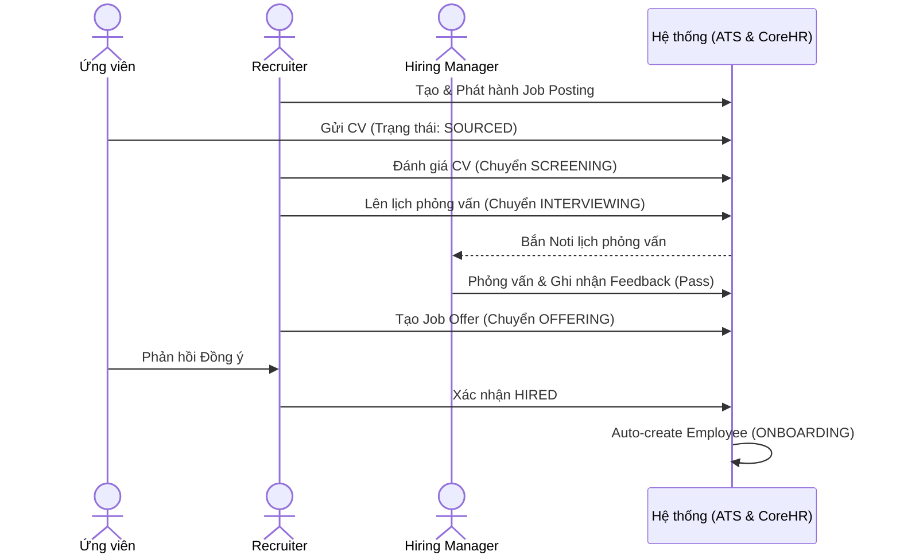

# PHÂN TÍCH NGHIỆP VỤ: MODULE TUYỂN DỤNG & ATS

## 1. Tổng quan module
- **Mục tiêu nghiệp vụ:** Chuẩn hóa và tự động hóa toàn bộ quy trình thu hút nhân tài, từ khâu phát sinh nhu cầu (Requisition) cho đến khi ứng viên nhận việc (Hired). Giảm thiểu thao tác nhập liệu thủ công và đứt gãy dữ liệu.
- **Giá trị mang lại:** Rút ngắn time-to-hire (thời gian tuyển dụng), kiểm soát chi phí tuyển dụng (ngân sách lương định biên), tăng trải nghiệm ứng viên, đảm bảo nguồn dữ liệu đầu vào sạch cho Core HR.
- **Phạm vi (In-scope):** Quản lý Yêu cầu tuyển dụng (Job Posting/Requisition), Quản lý phễu ứng viên (Kanban ATS), Quản lý Lịch phỏng vấn & Đánh giá, Quản lý Lời mời làm việc (Job Offer).
- **Phạm vi (Out-of-scope):** Tính lương thử việc (thuộc Payroll), Đánh giá sau thử việc (thuộc Performance), Đăng tin tự động lên các Job Portal ngoài (TopCV, VietnamWorks - trừ khi có tích hợp API).
- **Các bên liên quan (Stakeholders):**
  - *Hiring Manager (Trưởng phòng/bộ phận):* Đề xuất nhu cầu tuyển, tham gia phỏng vấn, đánh giá năng lực.
  - *Recruiter (Chuyên viên tuyển dụng):* Đăng tin, tìm nguồn CV, lọc hồ sơ, lên lịch phỏng vấn, gửi Offer.
  - *HR Manager (Trưởng phòng Nhân sự):* Phê duyệt Job Requisition, duyệt Offer.
  - *Candidate (Ứng viên):* Đối tượng trực tiếp tham gia quy trình.

---

## 2. Phân rã chức năng
| Mã | Tên chức năng | Mô tả | Actor | Độ ưu tiên |
| :--- | :--- | :--- | :--- | :---: |
| REC-01 | Quản lý Yêu cầu tuyển dụng | Tạo, Sửa, Đóng các đợt tuyển dụng (Job Posting) gắn với định biên. | Recruiter, HR Manager | Must have |
| REC-02 | Bảng Kanban ATS | Kéo thả ứng viên qua các trạng thái (Sourced -> Hired). | Recruiter | Must have |
| REC-03 | Lịch phỏng vấn | Đặt lịch hẹn, phân công người phỏng vấn. | Recruiter | Must have |
| REC-04 | Chấm điểm Phỏng vấn | Form nhập điểm và feedback sau khi phỏng vấn. | Hiring Manager | Must have |
| REC-05 | Quản lý Job Offer | Tạo thư mời nhận việc (Lương cơ bản, Ngày đi làm, tỷ lệ thử việc). | Recruiter | Must have |
| REC-06 | Auto-provisioning | Chuyển đổi dữ liệu Ứng viên thành Nhân viên (Core HR) khi nhận việc. | System | Should have |

---

## 3. Quy trình nghiệp vụ (BPMN text/Mermaid)
**Luồng chính (Happy Path):**
1. Hiring Manager tạo Yêu cầu tuyển dụng (Draft).
2. HR Manager duyệt (Published).
3. Ứng viên nộp CV -> Trạng thái `SOURCED`.
4. Recruiter lọc CV (Call screen) -> Chuyển sang `SCREENING`.
5. Recruiter lên lịch phỏng vấn -> Chuyển sang `INTERVIEWING`.
6. Hiring Manager phỏng vấn, chấm điểm Đạt.
7. Recruiter tạo Job Offer, chốt lương -> Chuyển sang `OFFERING`.
8. Ứng viên đồng ý Offer -> Chuyển sang `HIRED`.
9. Hệ thống tự động tạo mã `Employee` (Trạng thái: ONBOARDING).

---

## 4. Quy tắc nghiệp vụ (Business Rules)
| Mã | Điều kiện | Hành động | Loại | Căn cứ |
| :--- | :--- | :--- | :--- | :--- |
| BR-REC-01 | Tạo Job Posting | Bắt buộc phải tham chiếu đến 1 `DepartmentId` và 1 `PositionId`. Tự động fetch Ngân sách lương của Position. | Ràng buộc HT | Đảm bảo tính toàn vẹn định biên |
| BR-REC-02 | Chuyển trạng thái Ứng viên | Chỉ được chuyển theo luồng tiến (Sourced->Screening->...). Cấm nhảy cóc (Trừ trạng thái Rejected có thể xảy ra bất cứ lúc nào). | Ràng buộc HT | Tránh sai lệch phễu tuyển dụng |
| BR-REC-03 | Lên lịch phỏng vấn | Chỉ danh sách ứng viên ở trạng thái `INTERVIEWING` mới hiện trong Dropdown Lên lịch. | Ràng buộc HT | Tránh book lịch nhầm |
| BR-REC-04 | Đánh giá phỏng vấn | Nút "Chấm điểm" chỉ hiện sau khi thời gian (scheduledAt) đã qua. | Ràng buộc HT | Đảm bảo logic thời gian thực |
| BR-REC-05 | Lương Offer | `baseSalary` trong Offer không được thấp hơn Mức lương tối thiểu vùng (Luật LĐ). | Pháp luật | Khoản 1, Điều 90 BLLĐ 2019 |
| BR-REC-06 | Lương thử việc | Bắt buộc >= 85% của Mức lương chính thức (Offer baseSalary). | Pháp luật | Điều 26 BLLĐ 2019 |

---

## 5. Vòng đời trạng thái (State Machine)
**Thực thể: Ứng viên (Candidate)**
- `SOURCED`: Khởi tạo mặc định khi nhận CV.
- `SCREENING`: Kích hoạt khi Recruiter bắt đầu review hồ sơ.
- `INTERVIEWING`: Khi đã có ít nhất 1 InterviewRound được tạo.
- `OFFERING`: Khi đã có 1 JobOffer được tạo (Trạng thái Offer: PENDING).
- `HIRED`: Khi Offer được ACCEPTED.
- `REJECTED`: Có thể trigger từ bất kỳ khâu nào bởi Recruiter/Hiring Manager.

---

## 6. Mô hình dữ liệu mức nghiệp vụ
| Thực thể | Thuộc tính chính | Kiểu dữ liệu | Quan hệ | Ghi chú |
| :--- | :--- | :--- | :--- | :--- |
| **JobPosting** | id, title, departmentId, positionId, amount, salaryRange, status, deadline | PK, String, FK, FK, Int, String, Enum, DateTime | 1-n Candidate | status: DRAFT, PUBLISHED, CLOSED |
| **Candidate** | id, name, email, phone, cvUrl, jobPostingId, status | PK, String, String, String, String, FK, Enum | n-1 JobPosting 1-n Interview 1-1 Offer | status (như State Machine trên) |
| **InterviewRound** | id, candidateId, interviewerId, roundName, scheduledAt | PK, FK, FK(Employee), String, DateTime | n-1 Candidate 1-n Feedback | |
| **Feedback** | id, interviewRoundId, score, comments | PK, FK, Int, Text | n-1 Interview | |
| **JobOffer** | id, candidateId, baseSalary, probationRate, startDate, status | PK, FK, Decimal, Int, DateTime, Enum | 1-1 Candidate | Lưu lịch sử version (Nếu gửi lại Offer 2) |

---

## 7. User Stories & Acceptance Criteria
**US-01:** Là **Recruiter**, tôi muốn **kéo thẻ ứng viên từ cột OFFERING sang HIRED**, để **hệ thống tự động tạo Hồ sơ Nhân sự cho họ**.
- *AC1 (Happy path):* Kéo thẻ sang HIRED. Hiển thị Popup xác nhận. Bấm OK. Hệ thống thông báo thành công và có 1 bản ghi Employee mới (ONBOARDING) được tạo ra.
- *AC2 (Lỗi thiếu thông tin):* Nếu Job Offer chưa được tạo mà cố tình kéo sang HIRED -> Chặn lại và báo lỗi "Ứng viên chưa có Offer".

**US-02:** Là **Hiring Manager**, tôi muốn **truy cập màn hình Đánh giá Phỏng vấn**, để **chấm điểm ứng viên tôi vừa phỏng vấn**.
- *AC1:* Ứng viên đã đến giờ phỏng vấn -> Nút "Chấm điểm" (Feedback) được kích hoạt.
- *AC2:* Chỉ nhập được điểm từ 1-10. Nhập nhận xét (Comments) là bắt buộc.
- *AC3 (Bảo mật):* Hiring Manager không được sửa điểm sau khi đã bấm Lưu (Lock record).

---

## 8. Phân quyền & bảo mật
| Chức năng | HR Manager | Recruiter | Hiring Manager | System |
| :--- | :--- | :--- | :--- | :--- |
| Job Posting | Tạo/Sửa/Xóa/Duyệt | Tạo/Sửa (Draft) | Xem | - |
| ATS Board | Xem toàn bộ | Toàn quyền thao tác | Chỉ xem ứng viên phòng mình | Tự động chuyển Hired|
| Lịch phỏng vấn | Xem | Tạo/Sửa lịch | Chấm điểm (Chỉ lịch của mình) | - |
| Job Offer | Phê duyệt (Nếu vượt lương) | Tạo/Sửa/Gửi | Không xem được (Bảo mật lương) | Lock khi Accepted |

- *Dữ liệu nhạy cảm:* `baseSalary` trong JobOffer phải được mã hóa hoặc ẩn với các Role không liên quan.
- *Audit Log:* Bắt buộc ghi log khi Xóa JobPosting, Xóa Ứng viên, Sửa Offer.

---

## 9. Tích hợp & phụ thuộc
- **Input:** Kế thừa `DepartmentId` và `PositionId` từ Module Tổ chức.
- **Output:** Đẩy dữ liệu (Họ tên, SĐT, Email, DepartmentId, PositionId, baseSalary, probationRate) sang **Module Core HR** ngay khi Candidate = HIRED (Trigger API tự động).
- **Phụ thuộc:** Nếu đổi cấu trúc bảng `Employee` (VD: Bắt buộc CCCD), API chuyển đổi sẽ bị Crash.

---

## 10. Yêu cầu phi chức năng
- **Bảo mật:** File CV đính kèm (URL) cần lưu trữ trên Cloud Storage (AWS S3, Firebase) với cơ chế pre-signed URL giới hạn thời gian để tránh rò rỉ dữ liệu cá nhân.
- **Hiệu năng:** Bảng Kanban ATS phải xử lý mượt (Drag-and-Drop) kể cả khi có 500+ thẻ ứng viên bằng cơ chế Pagination hoặc Virtualization.
- **Thông báo:** Có cơ chế bắn Email thông báo lịch phỏng vấn tự động cho Ứng viên và Interviewer (Gửi qua SMTP Server/SendGrid).

---

## 11. Edge cases & rủi ro
1. *Ứng viên apply 2 vị trí khác nhau cùng lúc:* Hệ thống tạo ra 2 Candidate ID khác nhau hay gom làm 1 Profile? (Đề xuất: Lưu thành 2 bản ghi Candidate độc lập trỏ về 1 Profile gốc).
2. *HR kéo thả nhầm thẻ ứng viên:* Chuyển sang HIRED rồi mới biết nhầm. Cần tính năng "Undo" hoặc Rollback data bên Core HR.
3. *Đã chốt Offer, đến ngày đi làm ứng viên "bùng" (Ghosting):* Phải có chức năng "Revoke Offer" hoặc chuyển Employee (ONBOARDING) sang trạng thái "CANCELLED".
4. *Hiring Manager đổi ca phỏng vấn đột xuất:* Cần nút Reschedule để gửi lại email tự động.
5. *Xóa Position khi Job Posting đang chạy:* Core HR không cho phép xóa Position nếu nó đang dính với 1 Job Posting = PUBLISHED.
6. *Lương Offer cao hơn khung lương (Salary Range) của Position:* Hệ thống cần giương cờ đỏ (Red Flag) bắt buộc phải qua bước "HR Manager Approve".
7. *Tải file CV chứa virus:* Cần chặn file `.exe`, `.js`, chỉ cho phép `.pdf`, `.doc`.
8. *Hệ thống Core HR sập khi đang Auto-provisioning:* Cần cơ chế Retry Queue hoặc cảnh báo để HR tạo thủ công bù lại.
9. *Ứng viên từ chối phỏng vấn:* Cần có nhánh (Branch) riêng cho trạng thái REJECTED (Do ứng viên rút lui vs Do công ty loại) để làm Report chính xác.
10. *Hết hạn tuyển dụng (Deadline):* Job Posting tự động chuyển từ PUBLISHED sang CLOSED lúc 23:59 ngày deadline.

---

## 12. Câu hỏi cần làm rõ (Open Questions)
1. **Q1:** Đối với tính năng Auto-provisioning, bảng `Employee` hiện đang bắt buộc (Require) trường `cccd` (Mã định danh). Khi ứng viên nhận việc, ta chưa có số CCCD này. *Giải pháp đề xuất: Đổi trường `cccd` trong DB thành `Optional (Nullable)`, cho phép nhập sau trong ngày Onboarding đầu tiên.* 
2. **Q2:** Offer Letter sẽ được ký tay (Hard copy) hay tích hợp e-Signature (Chữ ký điện tử) vào hệ thống? *Giải pháp tạm thời: Xử lý ký tay hoặc ký file PDF ngoài, nhân sự chỉ bấm nút "Accepted" trên hệ thống.*
3. **Q3:** Công ty có sử dụng Headhunter không? Cần phân quyền riêng cho Vendor (Headhunter) tự log vào hệ thống up CV không? *Giả định: Out-of-scope trong giai đoạn 1.*

=> **Đề xuất tiếp theo:** Trước khi code Module Tuyển dụng, chúng ta cần phải chốt **Module 3: Core HR** (Đặc biệt là cấu trúc bảng Employee) để xử lý dứt điểm rủi ro số 1 (Câu hỏi Q1) và lỗi gãy data khi Auto-provisioning.
