# TÀI LIỆU ĐẶC TẢ & SƠ ĐỒ USE CASE HỆ THỐNG HRM
## PHÂN RÃ CHI TIẾT TỪNG ĐẦU MỤC CHỨC NĂNG THEO MODULE

---

### 1. MÔ HÌNH 3 TÁC NHÂN (ACTORS)

| STT | Tác nhân (Actor) | Cổng truy cập | Thư mục Code Frontend | Vai trò chính trên hệ thống |
| :-: | :--- | :--- | :--- | :--- |
| **1** | **Ứng viên (Candidate)** | Cổng Tuyển dụng (`/`, `/candidate/*`) | `src/pages/candidate/` | Xem tin tuyển dụng, nộp CV ứng tuyển, theo dõi tiến trình phỏng vấn, xác nhận thư mời nhận việc (Offer) và khai báo hồ sơ Pre-Onboarding. |
| **2** | **Nhân viên (Employee)** | Cổng Nhân viên (`/employee/*`) | `src/pages/employee/` | Tra cứu dữ liệu chấm công cá nhân (đồng bộ từ máy chấm công), gửi đơn giải trình công, xem & cập nhật hồ sơ cá nhân, gửi đơn xin nghỉ phép, tự đánh giá KPI và xem phiếu lương điện tử. |
| **3** | **Quản trị viên (Admin)** | Cổng Quản trị (`/internal/*`) | `src/pages/internal/` | Vận hành toàn bộ 11 module quản trị nội bộ: Tổ chức, Tuyển dụng, Hội nhập, Nhân sự, Chấm công, Nghỉ phép, KPI, Lương thưởng, Tài sản, Thôi việc, Báo cáo & Hệ thống. |

---

### 2. SƠ ĐỒ USE CASE TỔNG QUÁT TOÀN HỆ THỐNG (MASTER USE CASE DIAGRAM)

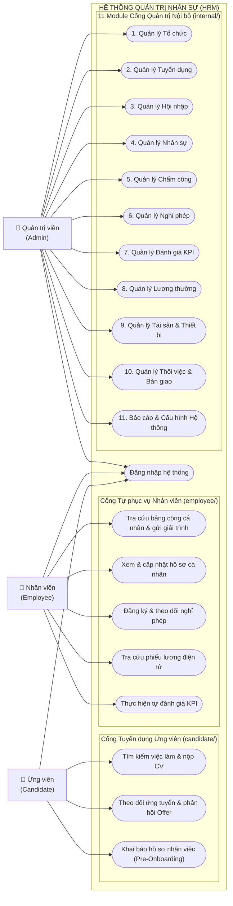
```mermaid
flowchart LR
    CAND["👤 Ứng viên\n(Candidate)"]
    EMP["👤 Nhân viên\n(Employee)"]
    ADMIN["👔 Quản trị viên\n(Admin)"]

    subgraph HRM_SYSTEM ["HỆ THỐNG QUẢN TRỊ NHÂN SỰ (HRM)"]
        
        subgraph PORTAL_CAND ["Cổng Tuyển dụng Ứng viên (candidate/)"]
            UC_C1(["Tìm kiếm việc làm & nộp CV"])
            UC_C2(["Theo dõi ứng tuyển & phản hồi Offer"])
            UC_C3(["Khai báo hồ sơ nhận việc (Pre-Onboarding)"])
        end

        subgraph PORTAL_EMP ["Cổng Tự phục vụ Nhân viên (employee/)"]
            UC_E1(["Tra cứu bảng công cá nhân & gửi giải trình"])
            UC_E2(["Xem & cập nhật hồ sơ cá nhân"])
            UC_E3(["Đăng ký & theo dõi nghỉ phép"])
            UC_E4(["Tra cứu phiếu lương điện tử"])
            UC_E5(["Thực hiện tự đánh giá KPI"])
        end

        subgraph PORTAL_ADMIN ["11 Module Cổng Quản trị Nội bộ (internal/)"]
            UC_M1(["1. Quản lý Tổ chức"])
            UC_M2(["2. Quản lý Tuyển dụng"])
            UC_M3(["3. Quản lý Hội nhập"])
            UC_M4(["4. Quản lý Nhân sự"])
            UC_M5(["5. Quản lý Chấm công"])
            UC_M6(["6. Quản lý Nghỉ phép"])
            UC_M7(["7. Quản lý Đánh giá KPI"])
            UC_M8(["8. Quản lý Lương thưởng"])
            UC_M9(["9. Quản lý Tài sản & Thiết bị"])
            UC_M10(["10. Quản lý Thôi việc & Bàn giao"])
            UC_M11(["11. Báo cáo & Cấu hình Hệ thống"])
        end

        UC_LOGIN(["Đăng nhập hệ thống"])
    end

    CAND --> UC_LOGIN
    CAND --> UC_C1
    CAND --> UC_C2
    CAND --> UC_C3

    EMP --> UC_LOGIN
    EMP --> UC_E1
    EMP --> UC_E2
    EMP --> UC_E3
    EMP --> UC_E4
    EMP --> UC_E5

    ADMIN --> UC_LOGIN
    ADMIN --> UC_M1
    ADMIN --> UC_M2
    ADMIN --> UC_M3
    ADMIN --> UC_M4
    ADMIN --> UC_M5
    ADMIN --> UC_M6
    ADMIN --> UC_M7
    ADMIN --> UC_M8
    ADMIN --> UC_M9
    ADMIN --> UC_M10
    ADMIN --> UC_M11
```

---

### 3. SƠ ĐỒ USE CASE PHÂN RÃ RIÊNG TỪNG ĐẦU MỤC CHỨC NĂNG

Mỗi đầu mục con dưới đây được tách thành **1 sơ đồ Use Case riêng biệt** để dễ dàng đặt ngay trước **Bảng đặc tả Use Case** và **Biểu đồ Sequence** tương ứng trong báo cáo thuyết minh:

---

## 3.1 MODULE 1: TỔ CHỨC (`organization/`)

### 3.1.1 Use Case: Quản lý Phòng ban (`Departments.jsx`)

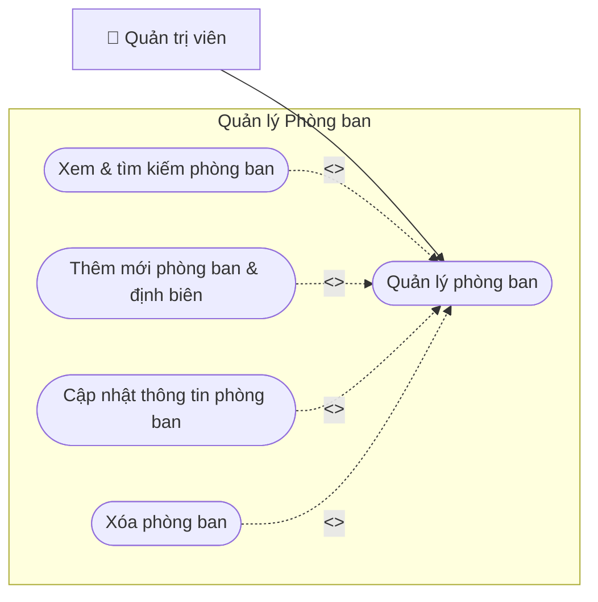
```mermaid
flowchart LR
    ADMIN["👔 Quản trị viên"]

    subgraph UC_DEPT_BOX ["Quản lý Phòng ban"]
        UC_DEPT(["Quản lý phòng ban"])
        UC_DEPT_1(["Xem & tìm kiếm phòng ban"])
        UC_DEPT_2(["Thêm mới phòng ban & định biên"])
        UC_DEPT_3(["Cập nhật thông tin phòng ban"])
        UC_DEPT_4(["Xóa phòng ban"])
    end

    ADMIN --> UC_DEPT
    UC_DEPT_1 -.->|<<include>>| UC_DEPT
    UC_DEPT_2 -.->|<<extend>>| UC_DEPT
    UC_DEPT_3 -.->|<<extend>>| UC_DEPT
    UC_DEPT_4 -.->|<<extend>>| UC_DEPT
```

### 3.1.2 Use Case: Quản lý Vị trí Chức danh (`Positions.jsx`)

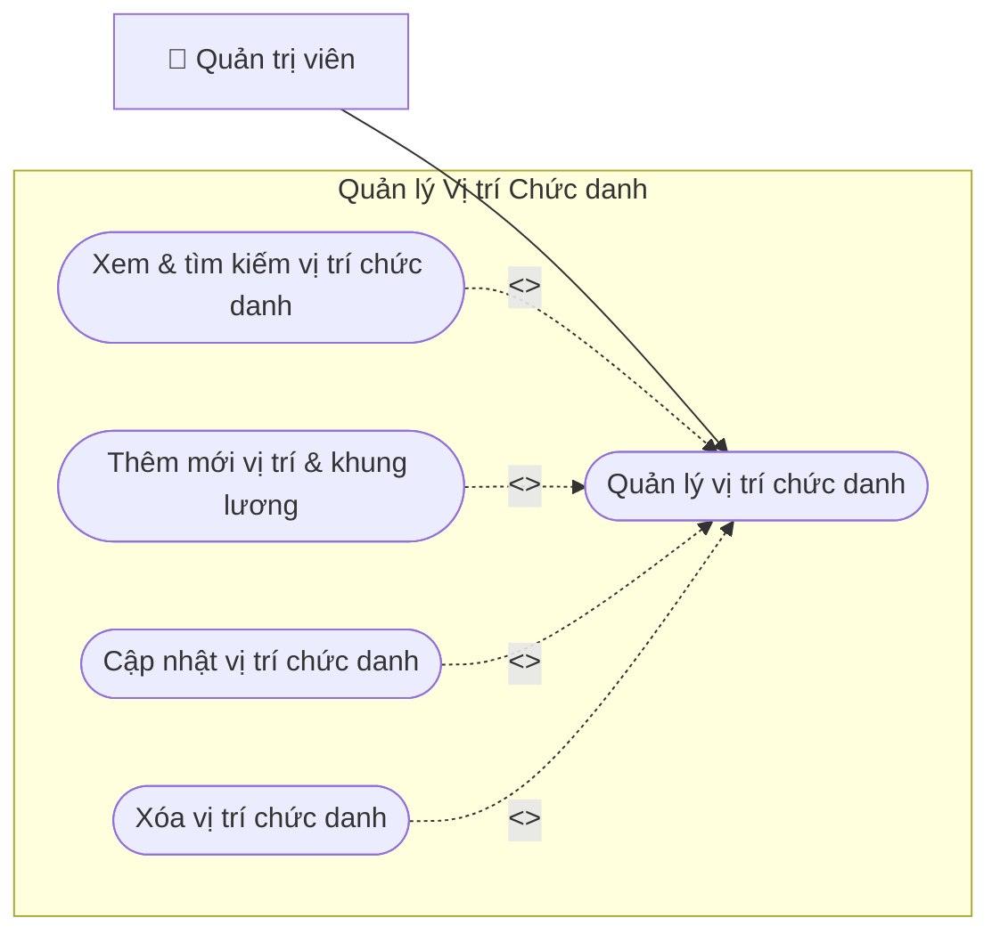
```mermaid
flowchart LR
    ADMIN["👔 Quản trị viên"]

    subgraph UC_POS_BOX ["Quản lý Vị trí Chức danh"]
        UC_POS(["Quản lý vị trí chức danh"])
        UC_POS_1(["Xem & tìm kiếm vị trí chức danh"])
        UC_POS_2(["Thêm mới vị trí & khung lương"])
        UC_POS_3(["Cập nhật vị trí chức danh"])
        UC_POS_4(["Xóa vị trí chức danh"])
    end

    ADMIN --> UC_POS
    UC_POS_1 -.->|<<include>>| UC_POS
    UC_POS_2 -.->|<<extend>>| UC_POS
    UC_POS_3 -.->|<<extend>>| UC_POS
    UC_POS_4 -.->|<<extend>>| UC_POS
```

### 3.1.3 Use Case: Xem Sơ đồ Tổ chức (`OrgChart.jsx`)

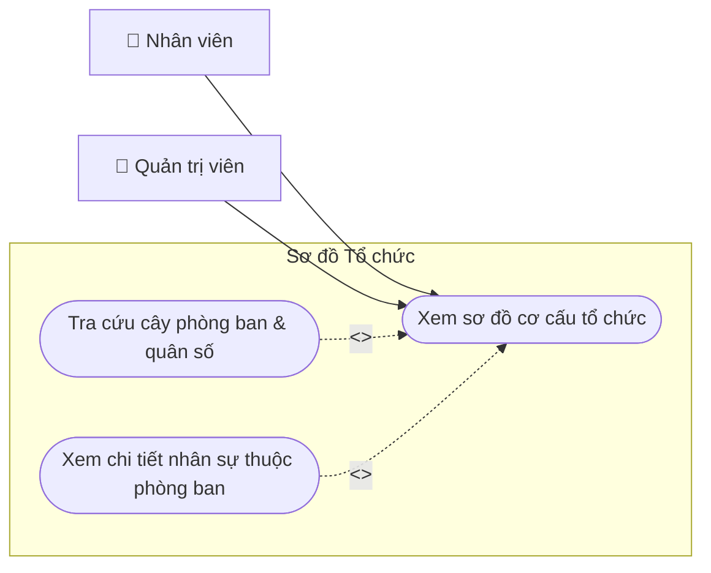
```mermaid
flowchart LR
    EMP["👤 Nhân viên"]
    ADMIN["👔 Quản trị viên"]

    subgraph UC_CHART_BOX ["Sơ đồ Tổ chức"]
        UC_CHART(["Xem sơ đồ cơ cấu tổ chức"])
        UC_CHART_1(["Tra cứu cây phòng ban & quân số"])
        UC_CHART_2(["Xem chi tiết nhân sự thuộc phòng ban"])
    end

    EMP --> UC_CHART
    ADMIN --> UC_CHART
    UC_CHART_1 -.->|<<include>>| UC_CHART
    UC_CHART_2 -.->|<<extend>>| UC_CHART
```

---

## 3.2 MODULE 2: TUYỂN DỤNG (`recruitment/` & `candidate/`)

### 3.2.1 Use Case: Ứng tuyển & Tra cứu Kết quả trên Cổng Ứng viên (`LandingPage.jsx`)

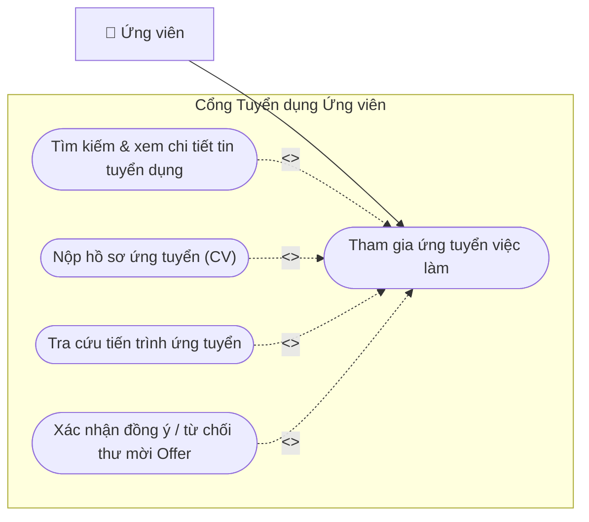
```mermaid
flowchart LR
    CAND["👤 Ứng viên"]

    subgraph UC_CAND_BOX ["Cổng Tuyển dụng Ứng viên"]
        UC_C_MAIN(["Tham gia ứng tuyển việc làm"])
        UC_C_1(["Tìm kiếm & xem chi tiết tin tuyển dụng"])
        UC_C_2(["Nộp hồ sơ ứng tuyển (CV)"])
        UC_C_3(["Tra cứu tiến trình ứng tuyển"])
        UC_C_4(["Xác nhận đồng ý / từ chối thư mời Offer"])
    end

    CAND --> UC_C_MAIN
    UC_C_1 -.->|<<include>>| UC_C_MAIN
    UC_C_2 -.->|<<extend>>| UC_C_MAIN
    UC_C_3 -.->|<<extend>>| UC_C_MAIN
    UC_C_4 -.->|<<extend>>| UC_C_MAIN
```

### 3.2.2 Use Case: Quản lý Yêu cầu & Tin Tuyển dụng (`Requisitions.jsx`)

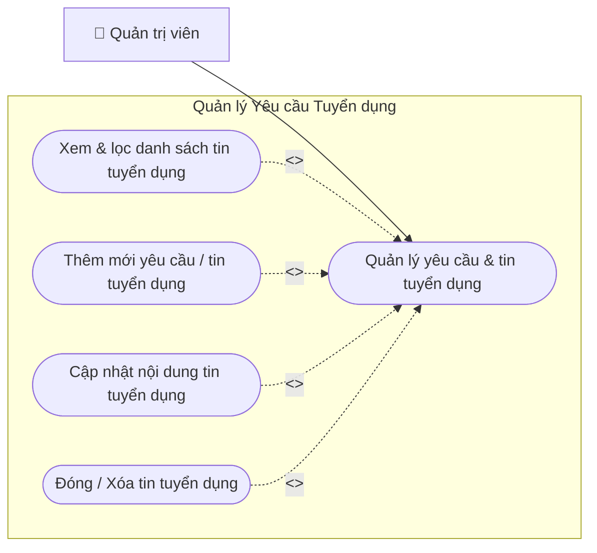
```mermaid
flowchart LR
    ADMIN["👔 Quản trị viên"]

    subgraph UC_REQ_BOX ["Quản lý Yêu cầu Tuyển dụng"]
        UC_REQ(["Quản lý yêu cầu & tin tuyển dụng"])
        UC_REQ_1(["Xem & lọc danh sách tin tuyển dụng"])
        UC_REQ_2(["Thêm mới yêu cầu / tin tuyển dụng"])
        UC_REQ_3(["Cập nhật nội dung tin tuyển dụng"])
        UC_REQ_4(["Đóng / Xóa tin tuyển dụng"])
    end

    ADMIN --> UC_REQ
    UC_REQ_1 -.->|<<include>>| UC_REQ
    UC_REQ_2 -.->|<<extend>>| UC_REQ
    UC_REQ_3 -.->|<<extend>>| UC_REQ
    UC_REQ_4 -.->|<<extend>>| UC_REQ
```

### 3.2.3 Use Case: Quản lý Hồ sơ Ứng viên ATS (`RecruitmentATS.jsx`)

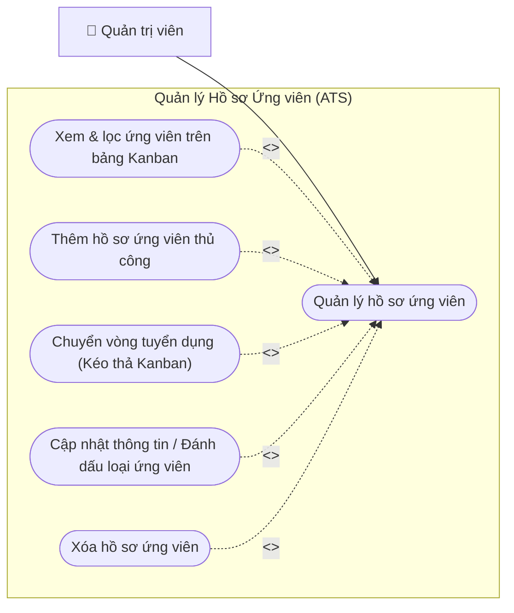
```mermaid
flowchart LR
    ADMIN["👔 Quản trị viên"]

    subgraph UC_ATS_BOX ["Quản lý Hồ sơ Ứng viên (ATS)"]
        UC_ATS(["Quản lý hồ sơ ứng viên"])
        UC_ATS_1(["Xem & lọc ứng viên trên bảng Kanban"])
        UC_ATS_2(["Thêm hồ sơ ứng viên thủ công"])
        UC_ATS_3(["Chuyển vòng tuyển dụng (Kéo thả Kanban)"])
        UC_ATS_4(["Cập nhật thông tin / Đánh dấu loại ứng viên"])
        UC_ATS_5(["Xóa hồ sơ ứng viên"])
    end

    ADMIN --> UC_ATS
    UC_ATS_1 -.->|<<include>>| UC_ATS
    UC_ATS_2 -.->|<<extend>>| UC_ATS
    UC_ATS_3 -.->|<<extend>>| UC_ATS
    UC_ATS_4 -.->|<<extend>>| UC_ATS
    UC_ATS_5 -.->|<<extend>>| UC_ATS
```

### 3.2.4 Use Case: Quản lý Lịch & Chấm điểm Phỏng vấn (`Interviews.jsx`)

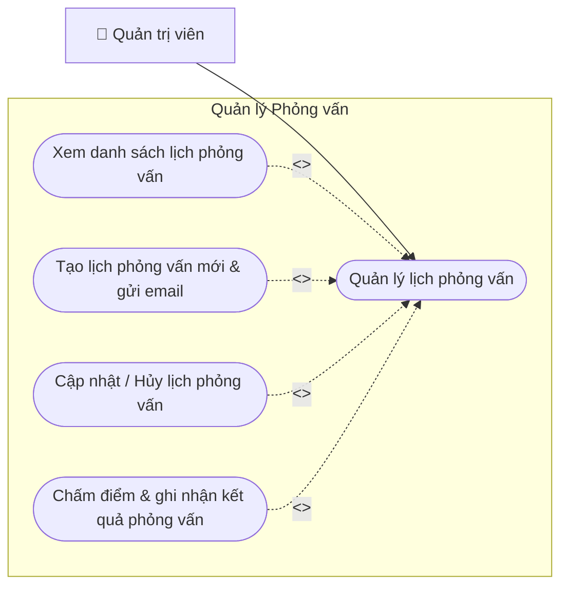
```mermaid
flowchart LR
    ADMIN["👔 Quản trị viên"]

    subgraph UC_INT_BOX ["Quản lý Phỏng vấn"]
        UC_INT(["Quản lý lịch phỏng vấn"])
        UC_INT_1(["Xem danh sách lịch phỏng vấn"])
        UC_INT_2(["Tạo lịch phỏng vấn mới & gửi email"])
        UC_INT_3(["Cập nhật / Hủy lịch phỏng vấn"])
        UC_INT_4(["Chấm điểm & ghi nhận kết quả phỏng vấn"])
    end

    ADMIN --> UC_INT
    UC_INT_1 -.->|<<include>>| UC_INT
    UC_INT_2 -.->|<<extend>>| UC_INT
    UC_INT_3 -.->|<<extend>>| UC_INT
    UC_INT_4 -.->|<<extend>>| UC_INT
```

### 3.2.5 Use Case: Quản lý Thư mời Nhận việc - Offer (`Offers.jsx`)

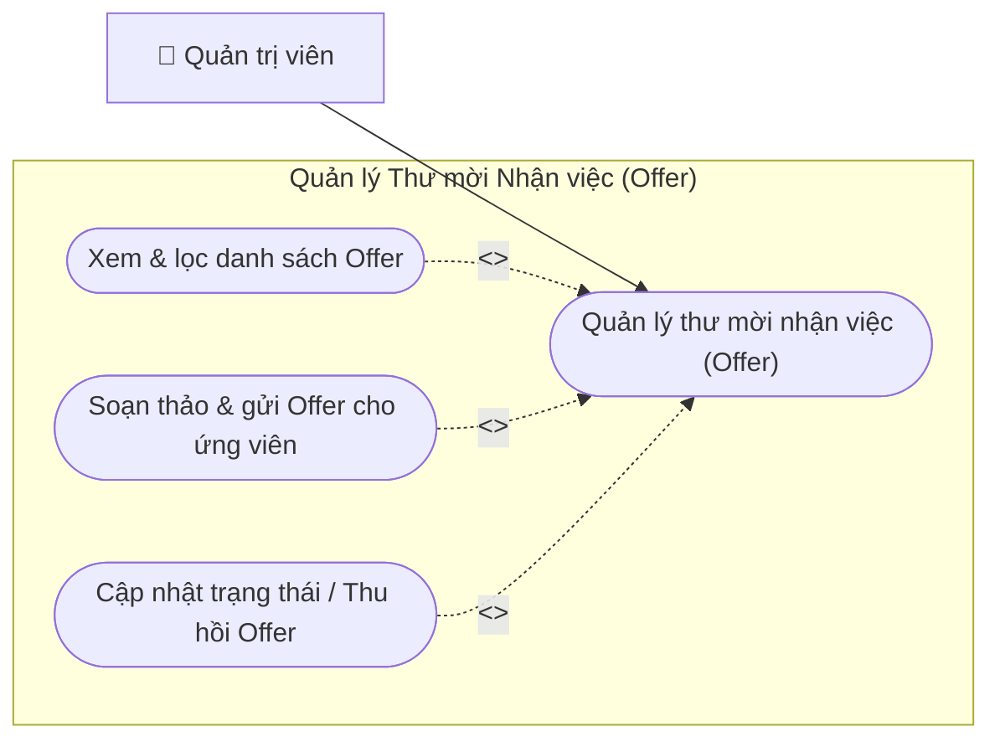
```mermaid
flowchart LR
    ADMIN["👔 Quản trị viên"]

    subgraph UC_OFFER_BOX ["Quản lý Thư mời Nhận việc (Offer)"]
        UC_OFR(["Quản lý thư mời nhận việc (Offer)"])
        UC_OFR_1(["Xem & lọc danh sách Offer"])
        UC_OFR_2(["Soạn thảo & gửi Offer cho ứng viên"])
        UC_OFR_3(["Cập nhật trạng thái / Thu hồi Offer"])
    end

    ADMIN --> UC_OFR
    UC_OFR_1 -.->|<<include>>| UC_OFR
    UC_OFR_2 -.->|<<extend>>| UC_OFR
    UC_OFR_3 -.->|<<extend>>| UC_OFR
```

---

## 3.3 MODULE 3: HỘI NHẬP - ONBOARDING (`onboarding/`)

### 3.3.1 Use Case: Tiếp nhận Ứng viên Trúng tuyển (`PreOnboardingHub.jsx`)

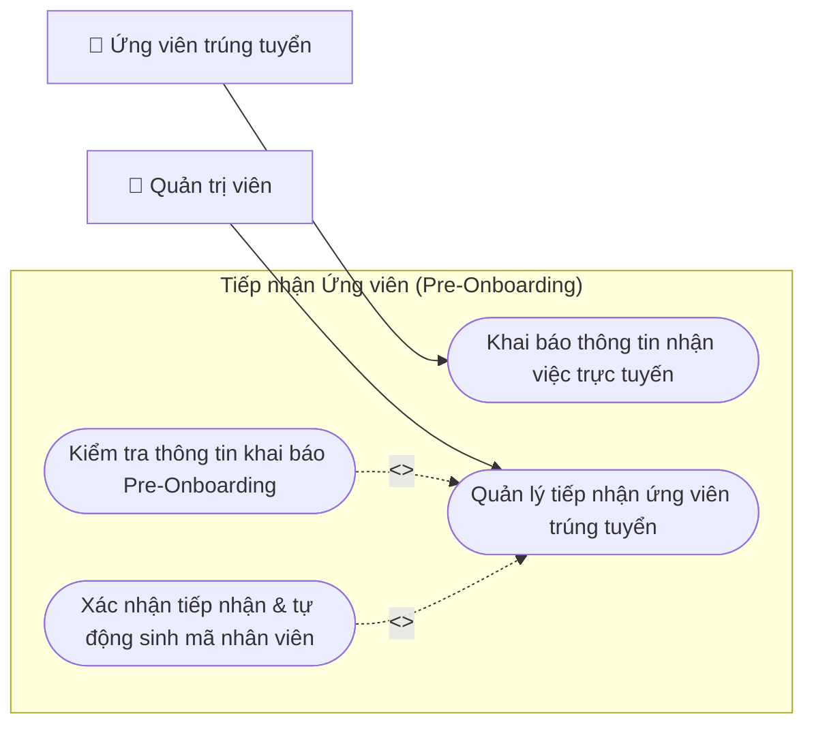
```mermaid
flowchart LR
    CAND["👤 Ứng viên trúng tuyển"]
    ADMIN["👔 Quản trị viên"]

    subgraph UC_PREONB_BOX ["Tiếp nhận Ứng viên (Pre-Onboarding)"]
        UC_PRE1(["Khai báo thông tin nhận việc trực tuyến"])
        UC_PRE2(["Quản lý tiếp nhận ứng viên trúng tuyển"])
        UC_PRE2_1(["Kiểm tra thông tin khai báo Pre-Onboarding"])
        UC_PRE2_2(["Xác nhận tiếp nhận & tự động sinh mã nhân viên"])
    end

    CAND --> UC_PRE1
    ADMIN --> UC_PRE2
    UC_PRE2_1 -.->|<<include>>| UC_PRE2
    UC_PRE2_2 -.->|<<extend>>| UC_PRE2
```

### 3.3.2 Use Case: Quản lý Tiến độ Checklist Hội nhập (`OnboardingMgmt.jsx`)

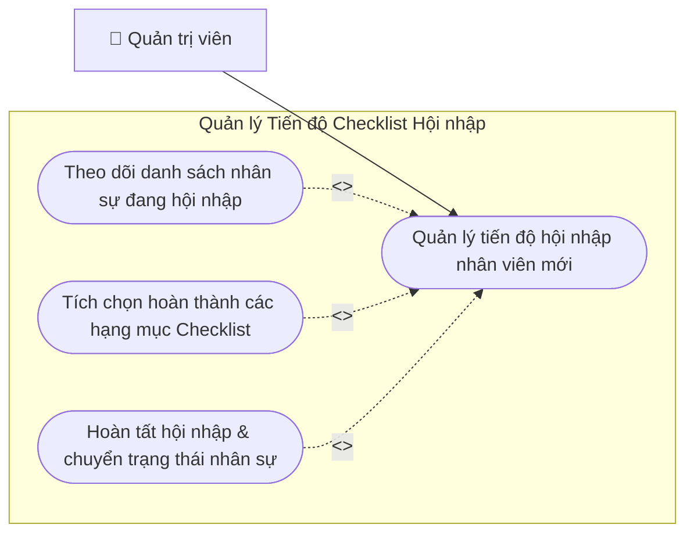
```mermaid
flowchart LR
    ADMIN["👔 Quản trị viên"]

    subgraph UC_ONBCHK_BOX ["Quản lý Tiến độ Checklist Hội nhập"]
        UC_ONBC(["Quản lý tiến độ hội nhập nhân viên mới"])
        UC_ONBC_1(["Theo dõi danh sách nhân sự đang hội nhập"])
        UC_ONBC_2(["Tích chọn hoàn thành các hạng mục Checklist"])
        UC_ONBC_3(["Hoàn tất hội nhập & chuyển trạng thái nhân sự"])
    end

    ADMIN --> UC_ONBC
    UC_ONBC_1 -.->|<<include>>| UC_ONBC
    UC_ONBC_2 -.->|<<extend>>| UC_ONBC
    UC_ONBC_3 -.->|<<extend>>| UC_ONBC
```

---

## 3.4 MODULE 4: NHÂN SỰ - CORE HR (`employees/` & `employee/Profile.jsx`)

### 3.4.1 Use Case: Quản lý Hồ sơ Nhân sự 360° (`EmployeeList.jsx`, `EmployeeDetail.jsx`)

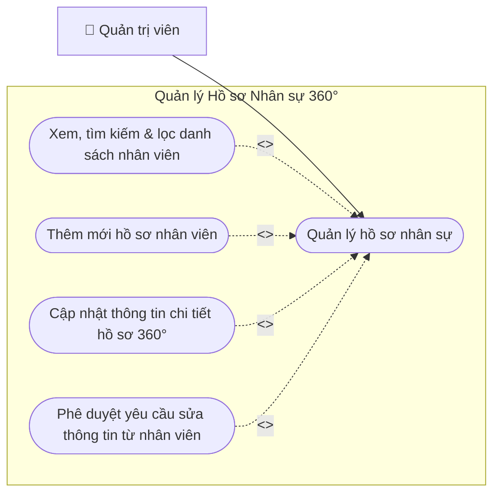
```mermaid
flowchart LR
    ADMIN["👔 Quản trị viên"]

    subgraph UC_EMP_BOX ["Quản lý Hồ sơ Nhân sự 360°"]
        UC_EMP(["Quản lý hồ sơ nhân sự"])
        UC_EMP_1(["Xem, tìm kiếm & lọc danh sách nhân viên"])
        UC_EMP_2(["Thêm mới hồ sơ nhân viên"])
        UC_EMP_3(["Cập nhật thông tin chi tiết hồ sơ 360°"])
        UC_EMP_4(["Phê duyệt yêu cầu sửa thông tin từ nhân viên"])
    end

    ADMIN --> UC_EMP
    UC_EMP_1 -.->|<<include>>| UC_EMP
    UC_EMP_2 -.->|<<extend>>| UC_EMP
    UC_EMP_3 -.->|<<extend>>| UC_EMP
    UC_EMP_4 -.->|<<extend>>| UC_EMP
```

### 3.4.2 Use Case: Xem & Cập nhật Hồ sơ Cá nhân trên Cổng Nhân viên (`employee/Profile.jsx`)

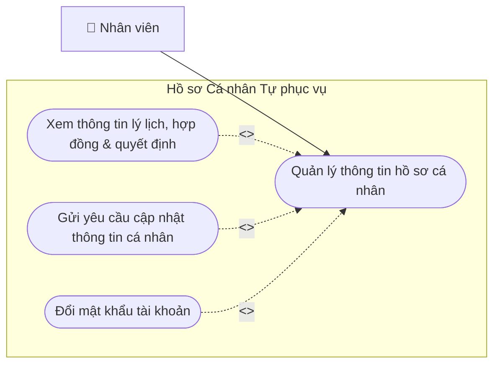
```mermaid
flowchart LR
    EMP["👤 Nhân viên"]

    subgraph UC_ESS_PROF_BOX ["Hồ sơ Cá nhân Tự phục vụ"]
        UC_EPROF(["Quản lý thông tin hồ sơ cá nhân"])
        UC_EPROF_1(["Xem thông tin lý lịch, hợp đồng & quyết định"])
        UC_EPROF_2(["Gửi yêu cầu cập nhật thông tin cá nhân"])
        UC_EPROF_3(["Đổi mật khẩu tài khoản"])
    end

    EMP --> UC_EPROF
    UC_EPROF_1 -.->|<<include>>| UC_EPROF
    UC_EPROF_2 -.->|<<extend>>| UC_EPROF
    UC_EPROF_3 -.->|<<extend>>| UC_EPROF
```

### 3.4.3 Use Case: Quản lý Hợp đồng Lao động (`Contracts.jsx`, `ContractDetail.jsx`)

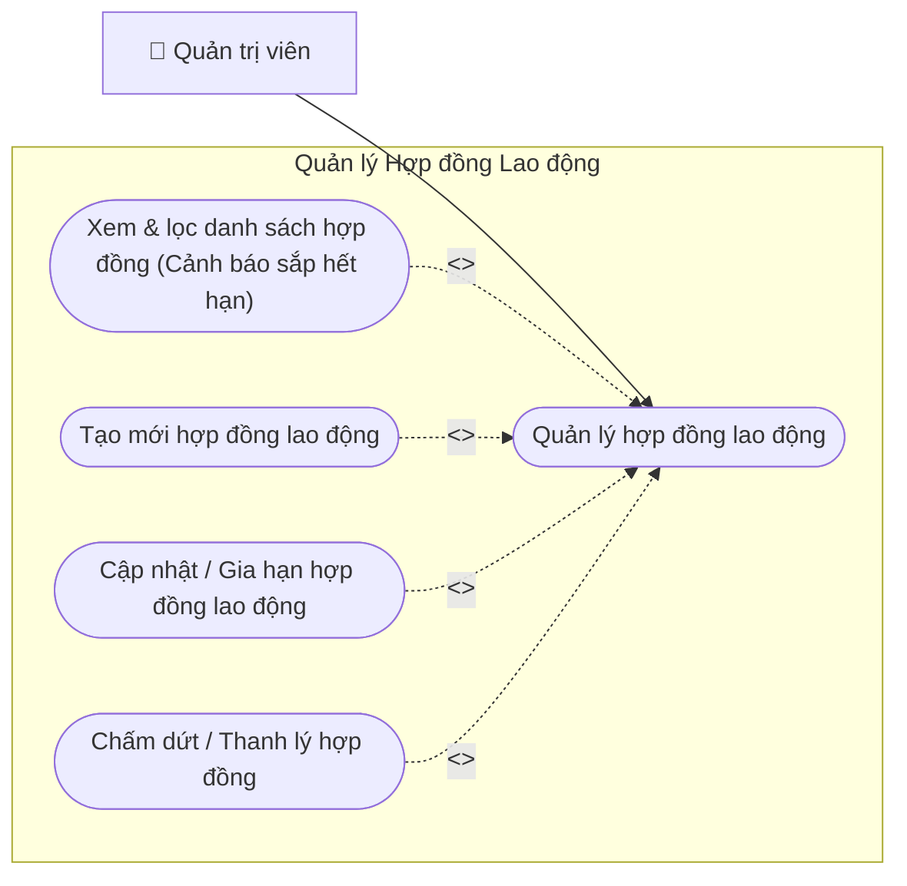
```mermaid
flowchart LR
    ADMIN["👔 Quản trị viên"]

    subgraph UC_CON_BOX ["Quản lý Hợp đồng Lao động"]
        UC_CON(["Quản lý hợp đồng lao động"])
        UC_CON_1(["Xem & lọc danh sách hợp đồng (Cảnh báo sắp hết hạn)"])
        UC_CON_2(["Tạo mới hợp đồng lao động"])
        UC_CON_3(["Cập nhật / Gia hạn hợp đồng lao động"])
        UC_CON_4(["Chấm dứt / Thanh lý hợp đồng"])
    end

    ADMIN --> UC_CON
    UC_CON_1 -.->|<<include>>| UC_CON
    UC_CON_2 -.->|<<extend>>| UC_CON
    UC_CON_3 -.->|<<extend>>| UC_CON
    UC_CON_4 -.->|<<extend>>| UC_CON
```

### 3.4.4 Use Case: Quản lý Quyết định Nhân sự (`Decisions.jsx`, `DecisionCreate.jsx`)

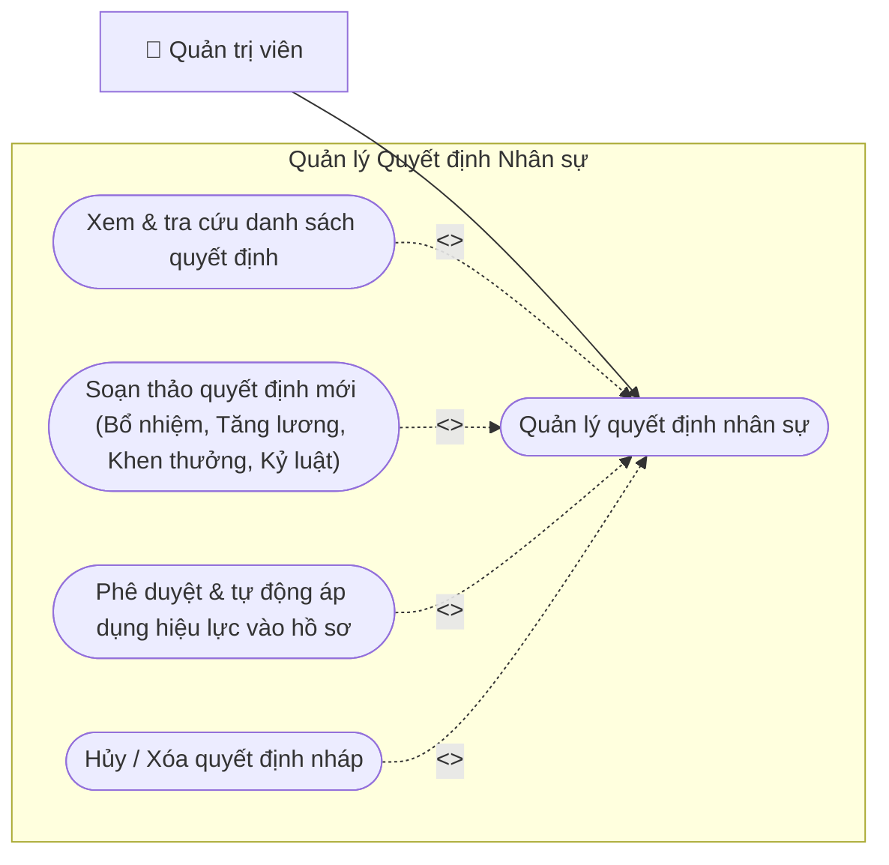
```mermaid
flowchart LR
    ADMIN["👔 Quản trị viên"]

    subgraph UC_DEC_BOX ["Quản lý Quyết định Nhân sự"]
        UC_DEC(["Quản lý quyết định nhân sự"])
        UC_DEC_1(["Xem & tra cứu danh sách quyết định"])
        UC_DEC_2(["Soạn thảo quyết định mới (Bổ nhiệm, Tăng lương, Khen thưởng, Kỷ luật)"])
        UC_DEC_3(["Phê duyệt & tự động áp dụng hiệu lực vào hồ sơ"])
        UC_DEC_4(["Hủy / Xóa quyết định nháp"])
    end

    ADMIN --> UC_DEC
    UC_DEC_1 -.->|<<include>>| UC_DEC
    UC_DEC_2 -.->|<<extend>>| UC_DEC
    UC_DEC_3 -.->|<<extend>>| UC_DEC
    UC_DEC_4 -.->|<<extend>>| UC_DEC
```

### 3.4.5 Use Case: Quản lý Điều chuyển Nhân sự (`Transfers.jsx`, `TransferDetail.jsx`)

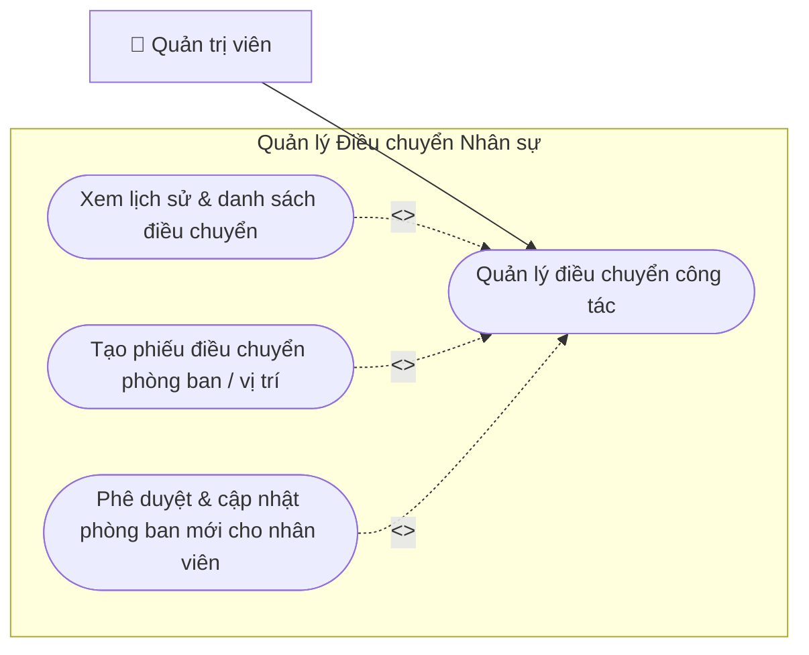
```mermaid
flowchart LR
    ADMIN["👔 Quản trị viên"]

    subgraph UC_TRF_BOX ["Quản lý Điều chuyển Nhân sự"]
        UC_TRF(["Quản lý điều chuyển công tác"])
        UC_TRF_1(["Xem lịch sử & danh sách điều chuyển"])
        UC_TRF_2(["Tạo phiếu điều chuyển phòng ban / vị trí"])
        UC_TRF_3(["Phê duyệt & cập nhật phòng ban mới cho nhân viên"])
    end

    ADMIN --> UC_TRF
    UC_TRF_1 -.->|<<include>>| UC_TRF
    UC_TRF_2 -.->|<<extend>>| UC_TRF
    UC_TRF_3 -.->|<<extend>>| UC_TRF
```

---

## 3.5 MODULE 5: CHẤM CÔNG (`attendance/` & `employee/Dashboard.jsx`)

### 3.5.1 Use Case: Tra cứu Bảng công & Giải trình trên Cổng Nhân viên (`employee/Dashboard.jsx`)

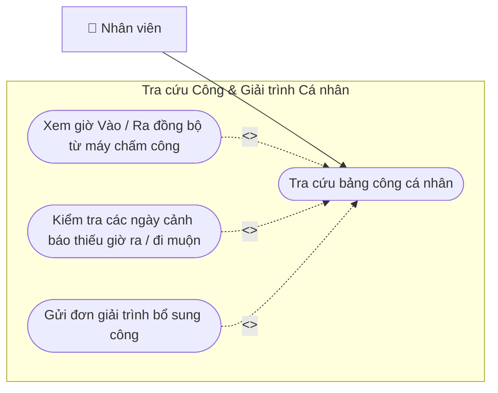
```mermaid
flowchart LR
    EMP["👤 Nhân viên"]

    subgraph UC_EMP_ATT_BOX ["Tra cứu Công & Giải trình Cá nhân"]
        UC_EATT(["Tra cứu bảng công cá nhân"])
        UC_EATT_1(["Xem giờ Vào / Ra đồng bộ từ máy chấm công"])
        UC_EATT_2(["Kiểm tra các ngày cảnh báo thiếu giờ ra / đi muộn"])
        UC_EATT_3(["Gửi đơn giải trình bổ sung công"])
    end

    EMP --> UC_EATT
    UC_EATT_1 -.->|<<include>>| UC_EATT
    UC_EATT_2 -.->|<<extend>>| UC_EATT
    UC_EATT_3 -.->|<<extend>>| UC_EATT
```

### 3.5.2 Use Case: Quản lý Ca làm việc (`Shifts.jsx`)

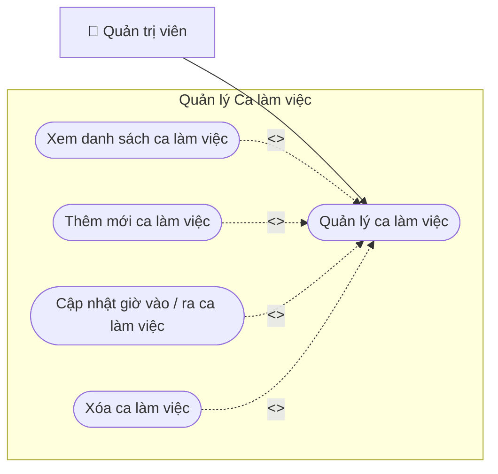
```mermaid
flowchart LR
    ADMIN["👔 Quản trị viên"]

    subgraph UC_SHIFT_BOX ["Quản lý Ca làm việc"]
        UC_SHF(["Quản lý ca làm việc"])
        UC_SHF_1(["Xem danh sách ca làm việc"])
        UC_SHF_2(["Thêm mới ca làm việc"])
        UC_SHF_3(["Cập nhật giờ vào / ra ca làm việc"])
        UC_SHF_4(["Xóa ca làm việc"])
    end

    ADMIN --> UC_SHF
    UC_SHF_1 -.->|<<include>>| UC_SHF
    UC_SHF_2 -.->|<<extend>>| UC_SHF
    UC_SHF_3 -.->|<<extend>>| UC_SHF
    UC_SHF_4 -.->|<<extend>>| UC_SHF
```

### 3.5.3 Use Case: Quản lý & Đồng bộ Bảng công Ma trận (`Attendance.jsx`)

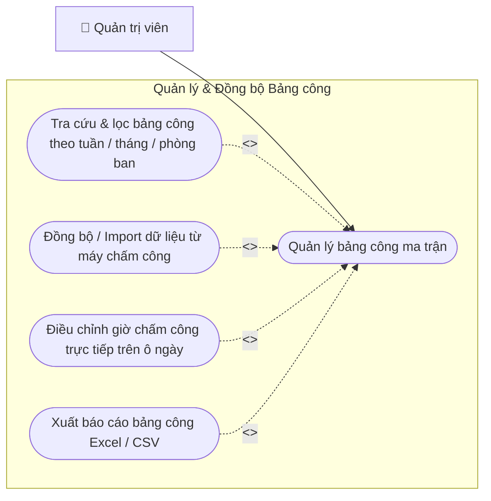
```mermaid
flowchart LR
    ADMIN["👔 Quản trị viên"]

    subgraph UC_ATTMGMT_BOX ["Quản lý & Đồng bộ Bảng công"]
        UC_ATTM(["Quản lý bảng công ma trận"])
        UC_ATTM_1(["Đồng bộ / Import dữ liệu từ máy chấm công"])
        UC_ATTM_2(["Tra cứu & lọc bảng công theo tuần / tháng / phòng ban"])
        UC_ATTM_3(["Điều chỉnh giờ chấm công trực tiếp trên ô ngày"])
        UC_ATTM_4(["Xuất báo cáo bảng công Excel / CSV"])
    end

    ADMIN --> UC_ATTM
    UC_ATTM_2 -.->|<<include>>| UC_ATTM
    UC_ATTM_1 -.->|<<extend>>| UC_ATTM
    UC_ATTM_3 -.->|<<extend>>| UC_ATTM
    UC_ATTM_4 -.->|<<extend>>| UC_ATTM
```

### 3.5.4 Use Case: Quản lý Điều chỉnh & Giải trình Công (`Adjustments.jsx`)

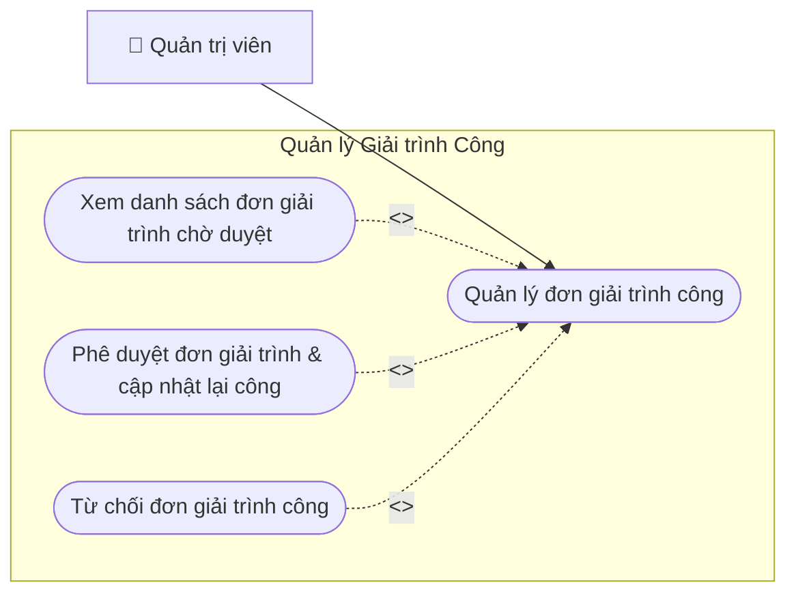
```mermaid
flowchart LR
    ADMIN["👔 Quản trị viên"]

    subgraph UC_ADJ_BOX ["Quản lý Giải trình Công"]
        UC_ADJ(["Quản lý đơn giải trình công"])
        UC_ADJ_1(["Xem danh sách đơn giải trình chờ duyệt"])
        UC_ADJ_2(["Phê duyệt đơn giải trình & cập nhật lại công"])
        UC_ADJ_3(["Từ chối đơn giải trình công"])
    end

    ADMIN --> UC_ADJ
    UC_ADJ_1 -.->|<<include>>| UC_ADJ
    UC_ADJ_2 -.->|<<extend>>| UC_ADJ
    UC_ADJ_3 -.->|<<extend>>| UC_ADJ
```

---

## 3.6 MODULE 6: NGHỈ PHÉP (`leave/` & `employee/Leave.jsx`)

### 3.6.1 Use Case: Đăng ký Nghỉ phép & OT trên Cổng Nhân viên (`employee/Leave.jsx`)

```mermaid
flowchart LR
    EMP["👤 Nhân viên"]

    subgraph UC_EMP_LV_BOX ["Nghỉ phép Cá nhân"]
        UC_ELV(["Đăng ký nghỉ phép & làm thêm giờ"])
        UC_ELV_1(["Xem quỹ phép năm & lịch sử đơn từ"])
        UC_ELV_2(["Tạo & gửi đơn xin nghỉ phép"])
        UC_ELV_3(["Tạo & gửi phiếu đăng ký làm thêm giờ (OT)"])
        UC_ELV_4(["Hủy đơn khi đang chờ duyệt"])
    end

    EMP --> UC_ELV
    UC_ELV_1 -.->|<<include>>| UC_ELV
    UC_ELV_2 -.->|<<extend>>| UC_ELV
    UC_ELV_3 -.->|<<extend>>| UC_ELV
    UC_ELV_4 -.->|<<extend>>| UC_ELV
```

### 3.6.2 Use Case: Phê duyệt Đơn xin Nghỉ phép & OT (`LeaveMgmt.jsx`)

```mermaid
flowchart LR
    ADMIN["👔 Quản trị viên"]

    subgraph UC_LVMGMT_BOX ["Quản lý Đơn xin Nghỉ phép & OT"]
        UC_LVM(["Quản lý đơn nghỉ phép & OT"])
        UC_LVM_1(["Xem & lọc danh sách đơn nghỉ phép / OT"])
        UC_LVM_2(["Phê duyệt đơn & tự động trừ quỹ phép"])
        UC_LVM_3(["Từ chối đơn nghỉ phép / OT"])
    end

    ADMIN --> UC_LVM
    UC_LVM_1 -.->|<<include>>| UC_LVM
    UC_LVM_2 -.->|<<extend>>| UC_LVM
    UC_LVM_3 -.->|<<extend>>| UC_LVM
```

### 3.6.3 Use Case: Quản lý Loại nghỉ & Chính sách Phép (`LeaveTypes.jsx`, `LeavePolicies.jsx`)

```mermaid
flowchart LR
    ADMIN["👔 Quản trị viên"]

    subgraph UC_LVPOL_BOX ["Quản lý Loại nghỉ & Chính sách Phép"]
        UC_LVP(["Quản lý loại nghỉ & chính sách phép"])
        UC_LVP_1(["Thêm mới loại nghỉ phép"])
        UC_LVP_2(["Cập nhật / Xóa loại nghỉ phép"])
        UC_LVP_3(["Cấu hình hạn mức ngày phép năm theo thâm niên"])
    end

    ADMIN --> UC_LVP
    UC_LVP_1 -.->|<<extend>>| UC_LVP
    UC_LVP_2 -.->|<<extend>>| UC_LVP
    UC_LVP_3 -.->|<<extend>>| UC_LVP
```

### 3.6.4 Use Case: Quản lý Lịch Nghỉ lễ (`Holidays.jsx`)

```mermaid
flowchart LR
    ADMIN["👔 Quản trị viên"]

    subgraph UC_HOL_BOX ["Quản lý Lịch Nghỉ lễ"]
        UC_HOL(["Quản lý lịch nghỉ lễ"])
        UC_HOL_1(["Xem danh sách ngày nghỉ lễ trong năm"])
        UC_HOL_2(["Thêm mới ngày nghỉ lễ"])
        UC_HOL_3(["Cập nhật / Xóa ngày nghỉ lễ"])
    end

    ADMIN --> UC_HOL
    UC_HOL_1 -.->|<<include>>| UC_HOL
    UC_HOL_2 -.->|<<extend>>| UC_HOL
    UC_HOL_3 -.->|<<extend>>| UC_HOL
```

---

## 3.7 MODULE 7: ĐÁNH GIÁ KPI (`performance/` & `employee/KPI.jsx`)

### 3.7.1 Use Case: Quản lý Mẫu KPI (`KPITemplates.jsx`)

```mermaid
flowchart LR
    ADMIN["👔 Quản trị viên"]

    subgraph UC_KPITPL_BOX ["Quản lý Mẫu KPI"]
        UC_KTPL(["Quản lý thư viện mẫu KPI"])
        UC_KTPL_1(["Xem danh sách tiêu chí mẫu KPI"])
        UC_KTPL_2(["Thêm mới mẫu chỉ tiêu KPI & trọng số"])
        UC_KTPL_3(["Cập nhật / Xóa mẫu KPI"])
    end

    ADMIN --> UC_KTPL
    UC_KTPL_1 -.->|<<include>>| UC_KTPL
    UC_KTPL_2 -.->|<<extend>>| UC_KTPL
    UC_KTPL_3 -.->|<<extend>>| UC_KTPL
```

### 3.7.2 Use Case: Quản lý Giao KPI (`KPIAssignments.jsx`)

```mermaid
flowchart LR
    ADMIN["👔 Quản trị viên"]

    subgraph UC_KPIASG_BOX ["Quản lý Giao KPI"]
        UC_KASG(["Quản lý giao chỉ tiêu KPI"])
        UC_KASG_1(["Xem danh sách phân bổ KPI theo kỳ"])
        UC_KASG_2(["Giao bộ chỉ tiêu KPI cho nhân viên"])
        UC_KASG_3(["Cập nhật / Xóa phiếu giao KPI"])
    end

    ADMIN --> UC_KASG
    UC_KASG_1 -.->|<<include>>| UC_KASG
    UC_KASG_2 -.->|<<extend>>| UC_KASG
    UC_KASG_3 -.->|<<extend>>| UC_KASG
```

### 3.7.3 Use Case: Tự đánh giá & Chấm điểm KPI (`employee/KPI.jsx` & `Performance.jsx`)

```mermaid
flowchart LR
    EMP["👤 Nhân viên"]
    ADMIN["👔 Quản trị viên"]

    subgraph UC_KPIREV_BOX ["Đánh giá & Chấm điểm KPI"]
        UC_KSELF(["Tự chấm điểm kết quả KPI cá nhân"])
        UC_KREV(["Quản lý thẩm định & chấm điểm KPI"])
        UC_KREV_1(["Xem kết quả tự đánh giá của nhân viên"])
        UC_KREV_2(["Chấm điểm thẩm định & chốt xếp loại A/B/C"])
    end

    EMP --> UC_KSELF
    ADMIN --> UC_KREV
    UC_KREV_1 -.->|<<include>>| UC_KREV
    UC_KREV_2 -.->|<<extend>>| UC_KREV
```

---

## 3.8 MODULE 8: LƯƠNG THƯỞNG (`payroll/` & `employee/Payslip.jsx`)

### 3.8.1 Use Case: Quản lý Kỳ lương (`PayrollPeriods.jsx`)

```mermaid
flowchart LR
    ADMIN["👔 Quản trị viên"]

    subgraph UC_PAYPER_BOX ["Quản lý Kỳ lương"]
        UC_PPER(["Quản lý kỳ lương"])
        UC_PPER_1(["Xem danh sách các kỳ lương"])
        UC_PPER_2(["Thêm mới kỳ lương tháng"])
        UC_PPER_3(["Xóa kỳ lương nháp"])
    end

    ADMIN --> UC_PPER
    UC_PPER_1 -.->|<<include>>| UC_PPER
    UC_PPER_2 -.->|<<extend>>| UC_PPER
    UC_PPER_3 -.->|<<extend>>| UC_PPER
```

### 3.8.2 Use Case: Tính lương & Quản lý Bảng lương (`Payroll.jsx` & `employee/Payslip.jsx`)

```mermaid
flowchart LR
    EMP["👤 Nhân viên"]
    ADMIN["👔 Quản trị viên"]

    subgraph UC_PAYSLIP_BOX ["Tính lương & Quản lý Bảng lương"]
        UC_EPAY(["Tra cứu & tải phiếu lương điện tử cá nhân"])
        UC_PMGMT(["Quản lý bảng lương"])
        UC_PMGMT_1(["Chạy động cơ tính lương tự động toàn công ty"])
        UC_PMGMT_2(["Điều chỉnh khoản cộng / trừ trên phiếu lương"])
        UC_PMGMT_3(["Phê duyệt & khóa sổ kỳ lương"])
        UC_PMGMT_4(["Xuất bảng lương ra file"])
    end

    EMP --> UC_EPAY
    ADMIN --> UC_PMGMT
    UC_PMGMT_1 -.->|<<extend>>| UC_PMGMT
    UC_PMGMT_2 -.->|<<extend>>| UC_PMGMT
    UC_PMGMT_3 -.->|<<extend>>| UC_PMGMT
    UC_PMGMT_4 -.->|<<extend>>| UC_PMGMT
```

---

## 3.9 MODULE 9: TÀI SẢN & THIẾT BỊ (`assets/`)

### 3.9.1 Use Case: Quản lý Kho Thiết bị (`AssetInventory.jsx`)

```mermaid
flowchart LR
    ADMIN["👔 Quản trị viên"]

    subgraph UC_ASTINV_BOX ["Quản lý Kho Thiết bị"]
        UC_AINV(["Quản lý kho thiết bị"])
        UC_AINV_1(["Xem, tìm kiếm & lọc thiết bị trong kho"])
        UC_AINV_2(["Thêm mới thiết bị vào kho"])
        UC_AINV_3(["Cập nhật thông tin / tình trạng thiết bị"])
        UC_AINV_4(["Xóa / Thanh lý thiết bị"])
    end

    ADMIN --> UC_AINV
    UC_AINV_1 -.->|<<include>>| UC_AINV
    UC_AINV_2 -.->|<<extend>>| UC_AINV
    UC_AINV_3 -.->|<<extend>>| UC_AINV
    UC_AINV_4 -.->|<<extend>>| UC_AINV
```

### 3.9.2 Use Case: Quản lý Bàn giao & Thu hồi Thiết bị (`AssetAssignments.jsx`)

```mermaid
flowchart LR
    ADMIN["👔 Quản trị viên"]

    subgraph UC_ASTASG_BOX ["Bàn giao & Thu hồi Thiết bị"]
        UC_AASG(["Quản lý bàn giao & thu hồi thiết bị"])
        UC_AASG_1(["Tạo phiếu cấp phát / bàn giao thiết bị cho nhân viên"])
        UC_AASG_2(["Thu hồi thiết bị & kiểm tra tình trạng trả"])
        UC_AASG_3(["Ghi nhận chi phí bồi thường thiết bị hỏng"])
        UC_AASG_4(["In biên bản bàn giao / thu hồi"])
    end

    ADMIN --> UC_AASG
    UC_AASG_1 -.->|<<extend>>| UC_AASG
    UC_AASG_2 -.->|<<extend>>| UC_AASG
    UC_AASG_3 -.->|<<extend>>| UC_AASG
    UC_AASG_4 -.->|<<extend>>| UC_AASG
```

---

## 3.10 MODULE 10: THÔI VIỆC & BÀN GIAO (`offboarding/`)

### 3.10.1 Use Case: Khởi tạo Thôi việc (`OffboardingInitiate.jsx`)

```mermaid
flowchart LR
    ADMIN["👔 Quản trị viên"]

    subgraph UC_OFFINIT_BOX ["Khởi tạo Thôi việc"]
        UC_OINIT(["Khởi tạo hồ sơ thôi việc"])
        UC_OINIT_1(["Chọn nhân sự & nhập lý do, ngày nghỉ dự kiến"])
        UC_OINIT_2(["Tự động khởi tạo danh mục Checklist bàn giao 4 khối"])
    end

    ADMIN --> UC_OINIT
    UC_OINIT_1 -.->|<<include>>| UC_OINIT
    UC_OINIT_2 -.->|<<include>>| UC_OINIT
```

### 3.10.2 Use Case: Quản lý Tiến độ Bàn giao & Quyết toán Thôi việc (`OffboardingChecklist.jsx`)

```mermaid
flowchart LR
    ADMIN["👔 Quản trị viên"]

    subgraph UC_OFFCHK_BOX ["Tiến độ Bàn giao & Quyết toán Thôi việc"]
        UC_OCHK(["Quản lý tiến độ bàn giao thôi việc"])
        UC_OCHK_1(["Tích chọn hoàn thành các đầu việc bàn giao 4 khối"])
        UC_OCHK_2(["Kiểm tra điều kiện đã thu hồi 100% thiết bị"])
        UC_OCHK_3(["Quyết toán phép tồn & hoàn tất thôi việc (Khóa tài khoản)"])
    end

    ADMIN --> UC_OCHK
    UC_OCHK_1 -.->|<<extend>>| UC_OCHK
    UC_OCHK_2 -.->|<<include>>| UC_OCHK_3
    UC_OCHK_3 -.->|<<extend>>| UC_OCHK
```

### 3.10.3 Use Case: Tra cứu Sổ Lịch sử Thôi việc (`OffboardingHistory.jsx`)

```mermaid
flowchart LR
    ADMIN["👔 Quản trị viên"]

    subgraph UC_OFFHIS_BOX ["Sổ Lịch sử Thôi việc"]
        UC_OHIS(["Tra cứu lịch sử nhân sự thôi việc"])
        UC_OHIS_1(["Tìm kiếm & lọc hồ sơ nhân viên đã nghỉ việc"])
        UC_OHIS_2(["Xem chi tiết quyết định & biên bản bàn giao lưu trữ"])
    end

    ADMIN --> UC_OHIS
    UC_OHIS_1 -.->|<<include>>| UC_OHIS
    UC_OHIS_2 -.->|<<extend>>| UC_OHIS
```

---

## 3.11 MODULE 11: BÁO CÁO & HỆ THỐNG (`reports/` & `system/`)

### 3.11.1 Use Case: Xem Tổng quan & Báo cáo Thống kê (`Dashboard.jsx`, `ReportsDashboard.jsx`)

```mermaid
flowchart LR
    ADMIN["👔 Quản trị viên"]

    subgraph UC_RPT_BOX ["Báo cáo & Thống kê Nhân sự"]
        UC_RPT(["Xem báo cáo thống kê nhân sự"])
        UC_RPT_1(["Xem bàn làm việc tổng quan (Dashboard)"])
        UC_RPT_2(["Xem biểu đồ biến động nhân sự, định biên & quỹ lương"])
    end

    ADMIN --> UC_RPT
    UC_RPT_1 -.->|<<include>>| UC_RPT
    UC_RPT_2 -.->|<<extend>>| UC_RPT
```

### 3.11.2 Use Case: Cấu hình Tham số Nghiệp vụ (`SystemParameters.jsx`)

```mermaid
flowchart LR
    ADMIN["👔 Quản trị viên"]

    subgraph UC_PARAM_BOX ["Cấu hình Tham số Nghiệp vụ"]
        UC_PRM(["Quản lý tham số nghiệp vụ hệ thống"])
        UC_PRM_1(["Xem danh sách tham số (BHXH, Thuế TNCN, Công chuẩn)"])
        UC_PRM_2(["Cập nhật giá trị tham số nghiệp vụ"])
        UC_PRM_3(["Khôi phục giá trị mặc định theo quy định"])
    end

    ADMIN --> UC_PRM
    UC_PRM_1 -.->|<<include>>| UC_PRM
    UC_PRM_2 -.->|<<extend>>| UC_PRM
    UC_PRM_3 -.->|<<extend>>| UC_PRM
```

### 3.11.3 Use Case: Quản lý Nhật ký Hệ thống (`AuditLogs.jsx`)

```mermaid
flowchart LR
    ADMIN["👔 Quản trị viên"]

    subgraph UC_AUDIT_BOX ["Nhật ký Hệ thống (Audit Logs)"]
        UC_AUD(["Quản lý nhật ký hệ thống"])
        UC_AUD_1(["Tra cứu & lọc lịch sử thao tác theo hành động"])
        UC_AUD_2(["Xem chi tiết thay đổi dữ liệu"])
        UC_AUD_3(["Xuất dữ liệu nhật ký ra file CSV"])
    end

    ADMIN --> UC_AUD
    UC_AUD_1 -.->|<<include>>| UC_AUD
    UC_AUD_2 -.->|<<extend>>| UC_AUD
    UC_AUD_3 -.->|<<extend>>| UC_AUD
```
