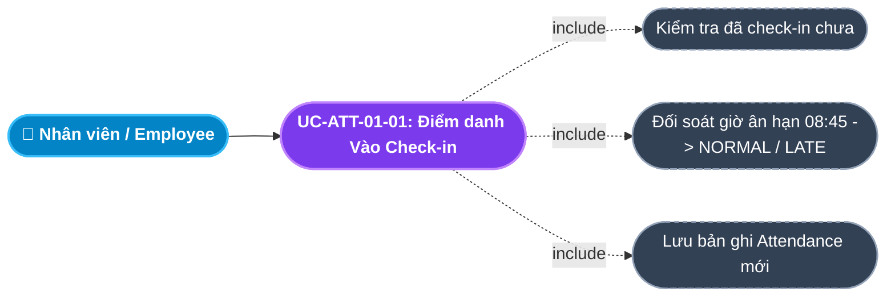
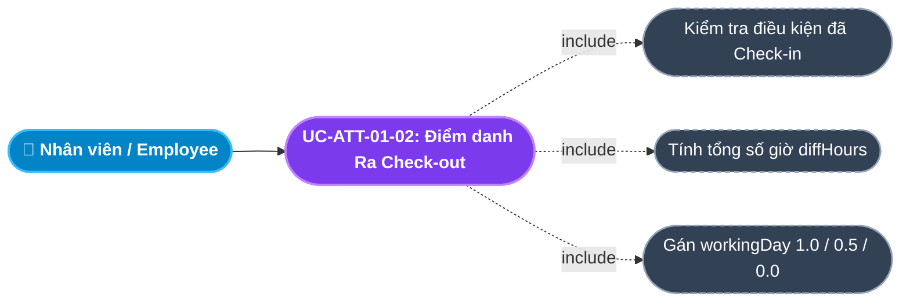
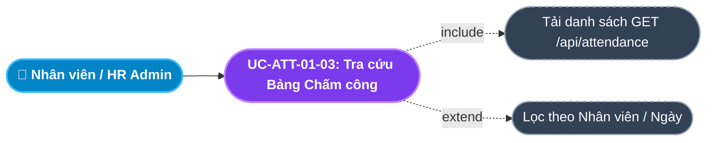
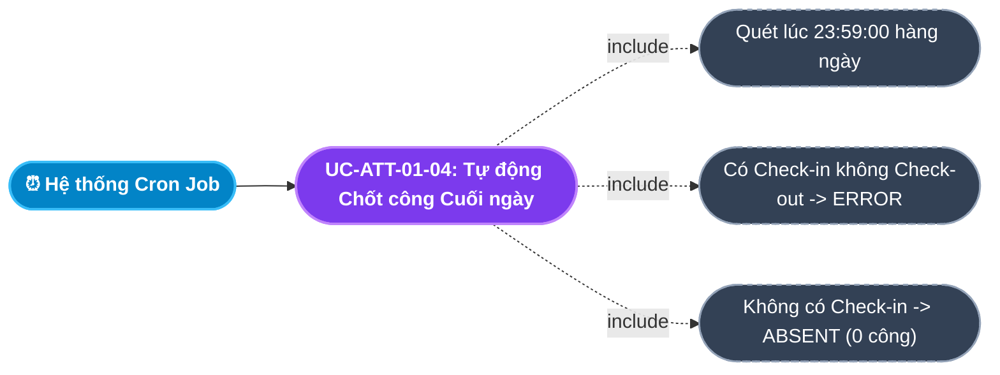
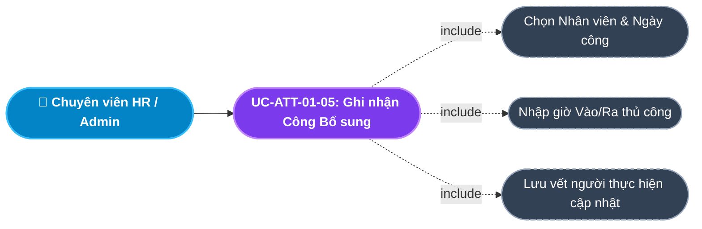
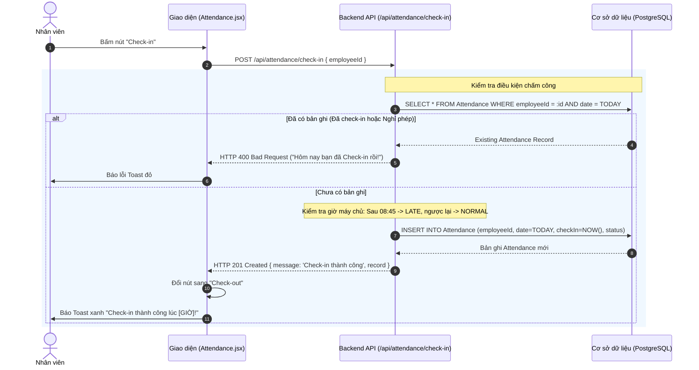
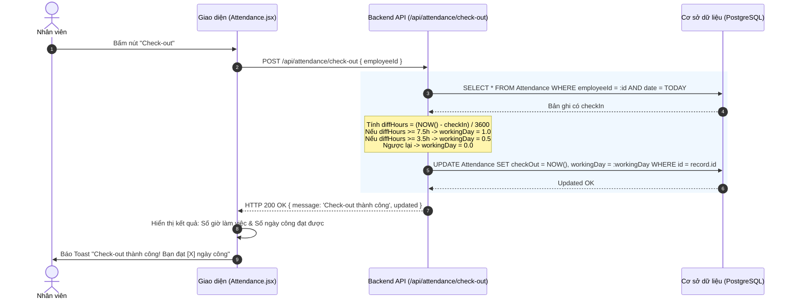

# Usecase: UC-ATT-01 - Ghi nhận Vào/Ra và Tính toán Ngày công (Check-in/Check-out & Working Day Calculation)

## 1. Giới thiệu chức năng
- **Mục đích**: Số hóa toàn bộ việc ghi nhận thời gian đến làm việc (Check-in) và thời gian ra về (Check-out) của nhân viên. Hệ thống tự động đối soát với khung giờ Ca làm việc chuẩn để xác định trạng thái Đi đúng giờ (`NORMAL`), Đi muộn (`LATE`), và tự động tính toán số ngày công chuẩn (`workingDay`: `1.0`, `0.5`, hoặc `0`) căn cứ trên tổng số giờ làm việc thực tế.
- **Actor (Tác nhân)**: Toàn bộ Nhân viên (Employee), Chuyên viên C&B/HR (HR/C&B), Quản trị hệ thống (Admin).
- **Điều kiện tiên quyết**: Nhân viên đã có tài khoản đang hoạt động (`ACTIVE`, `PROBATION`) và đã được phân bổ vào Ca làm việc.

### Danh mục các chức năng con (Sub-features):
1. **UC-ATT-01-01: Điểm danh Vào (Check-in)**: Ghi nhận mốc thời gian bắt đầu làm việc, tự động đối soát giờ ân hạn (08:45) để phân loại trạng thái `NORMAL` hoặc `LATE`.
2. **UC-ATT-01-02: Điểm danh Ra (Check-out) & Tự động Tính ngày công**: Ghi nhận mốc thời gian kết thúc ngày làm việc, tính toán tổng số giờ thực tế và tự động điền giá trị ngày công chuẩn (`workingDay`).
3. **UC-ATT-01-03: Tra cứu Bảng Chấm công Cá nhân & Bộ phận (View Attendance Board)**: Xem chi tiết lịch sử chấm công theo ngày, giờ vào/ra, trạng thái và tổng số công lũy kế.
4. **UC-ATT-01-04: Tự động Chốt công Cuối ngày (Daily Night Auto-closing Job)**: Tác vụ tự động chạy lúc 23:59 hàng ngày để quét các trường hợp quên Check-out (đánh dấu `ERROR`) hoặc vắng mặt không phép (`ABSENT`).
5. **UC-ATT-01-05: Điểm danh Bổ sung / Admin Ghi nhận Thay (Admin Manual Attendance Entry)**: HR hỗ trợ ghi nhận công cho các trường hợp đi công tác, hỏng thiết bị quét hoặc lỗi mạng đột xuất.

---

## 2. Dữ liệu nghiệp vụ đầu vào (Input Data & Parameters)

### 2.1. Biểu mẫu Điểm danh Hàng ngày (Attendance Record Data)
| Tên trường | Kiểu dữ liệu | Tính chất | Ý nghĩa nghiệp vụ & Ràng buộc |
|---|---|---|---|
| `Mã nhân viên` (employeeId) | UUID / Chuỗi | Bắt buộc | Định danh của nhân sự thực hiện chấm công. |
| `Ngày làm việc` (date) | DateTime | Mặc định | Mốc `00:00:00` của ngày hiện tại để làm khóa tra cứu duy nhất mỗi ngày. |
| `Thời gian vào` (checkIn) | DateTime | Tự động | Thời điểm chính xác nhân viên bấm Check-in (Lấy từ máy chủ backend). |
| `Thời gian ra` (checkOut) | DateTime | Tự động | Thời điểm chính xác nhân viên bấm Check-out (Lấy từ máy chủ backend). |
| `Trạng thái chấm công` (status) | Enum | Tự động | `NORMAL` (Đúng giờ), `LATE` (Đi muộn), `ERROR` (Lỗi / Quên check-out), `ABSENT` (Vắng mặt). |
| `Số ngày công chuẩn` (workingDay) | Số thập phân | Tự động tính | `1.0` (Đủ 1 công $\ge 7.5h$), `0.5` (Nửa công $\ge 3.5h$), `0.0` (Không đủ công). |

---

## 3. Quy tắc nghiệp vụ (Business Rules)

| Mã Quy tắc | Tình huống nghiệp vụ | Cách hệ thống xử lý | Thông báo hiển thị |
|---|---|---|---|
| **BR-ATT-01-01** | **Chặn Check-in trùng lặp (Single Check-in Constraint)**: Nhân viên bấm Check-in lần thứ 2 trong cùng một ngày. | Kiểm tra CSDL theo cặp `(employeeId, today)`. Nếu đã tồn tại bản ghi $\rightarrow$ Từ chối và chặn gọi tạo mới. | "Hôm nay bạn đã Check-in rồi!" |
| **BR-ATT-01-02** | **Chặn Check-in khi đang Nghỉ phép**: Nhân viên đã có đơn nghỉ phép được duyệt hôm nay (`status = 'ABSENT'`). | Kiểm tra trạng thái bản ghi: Nếu đang là `ABSENT` (đã đăng ký nghỉ phép) $\rightarrow$ Từ chối check-in. | "Bạn đã đăng ký nghỉ phép hôm nay!" |
| **BR-ATT-01-03** | **Quy tắc Ân hạn Đi muộn (Grace Period Rule)**: Nhân viên Check-in vào buổi sáng. | Giờ ca chuẩn là `08:30`. Áp dụng thời gian ân hạn 15 phút:  - Check-in $\le$ `08:45` $\rightarrow$ Trạng thái `NORMAL` (Đúng giờ). - Check-in $>$ `08:45` $\rightarrow$ Trạng thái `LATE` (Đi muộn). | "Check-in thành công. Trạng thái: NORMAL / LATE." |
| **BR-ATT-01-04** | **Công thức Tự động Tính Ngày công (Working Day Calculation)**: Nhân viên bấm Check-out. | Tính khoảng cách: `diffHours = (checkOut - checkIn) / 3600s`:  - `diffHours >= 7.5 giờ` $\rightarrow$ `workingDay = 1.0`. - `3.5 giờ <= diffHours < 7.5 giờ` $\rightarrow$ `workingDay = 0.5`. - `diffHours < 3.5 giờ` $\rightarrow$ `workingDay = 0.0`. | "Check-out thành công. Bạn đạt được X ngày công hôm nay!" |
| **BR-ATT-01-05** | **Ràng buộc Thứ tự Check-out**: Bấm Check-out khi chưa có Check-in. | Kiểm tra bản ghi trong ngày: Nếu chưa có `checkIn` $\rightarrow$ Chặn lại, không cho phép Check-out. | "Chưa Check-in, không thể Check-out!" |

---

## 4. Đặc tả chi tiết các Use Case chức năng con (Sub-Use Cases Specification)

---

### 4.1. UC-ATT-01-01: Điểm danh Vào (Check-in)

#### Sơ đồ Use Case:

#### Bảng đặc tả nghiệp vụ:

| STT | Hạng mục | Nội dung chi tiết |
|:---:|---|---|
| **1** | **Thông tin chung** | - **UC ID**: `UC-ATT-01-01` - **UC Name**: Điểm danh Vào (Check-in) - **Actor**: Toàn bộ nhân viên công ty - **Mục tiêu**: Ghi nhận thời điểm đến làm việc chính xác của nhân viên, xác định mức độ chấp hành nội quy giờ giấc. - **Mô tả**: Nhân viên đăng nhập vào hệ thống và bấm nút **"Check-in"** trên Dashboard hoặc trang Chấm công. Hệ thống tự động lấy giờ máy chủ, kiểm tra trùng lặp và ghi nhận trạng thái. - **Priority**: High (Bắt buộc) |
| **2** | **Trigger** | Nhân viên nhấn nút **"Check-in"** trên giao diện Cổng thông tin cá nhân. |
| **3** | **Pre-condition** | 1. Nhân viên đã đăng nhập tài khoản hợp lệ. 2. Chưa từng thực hiện Check-in trong ngày hôm nay. |
| **4** | **Post-condition** | 1. Bản ghi `Attendance` mới được tạo với ngày hiện tại và mốc giờ `checkIn`. 2. Trạng thái hiển thị trên giao diện chuyển sang *"Đã Check-in"*, nút Check-in bị ẩn và hiển thị nút Check-out. |
| **5** | **Main Flow** | 1. Nhân viên truy cập trang Chấm công hoặc Dashboard. 2. Nhấn nút **"Check-in"**. 3. Giao diện gửi request `POST /api/attendance/check-in` kèm `{ employeeId }`. 4. Backend xác định ngày hôm nay (`today` lúc `00:00:00`). 5. Backend kiểm tra tồn tại bản ghi `Attendance` theo `(employeeId, today)`: Nếu chưa có $\rightarrow$ Lấy thời gian hiện tại `checkInTime`. 6. Kiểm tra giờ: Nếu sau `08:45` $\rightarrow$ `status = 'LATE'`, ngược lại $\rightarrow$ `status = 'NORMAL'`. 7. Backend lưu bản ghi mới vào CSDL, trả về `HTTP 201 Created`. 8. Giao diện thông báo Toast: *"Check-in thành công lúc [GIỜ]! Trạng thái: [NORMAL/LATE]"*. |
| **6** | **Alternative / Exception Flow** | - **EF-01 (Đã Check-in rồi)**: Nhân viên bấm lại $\rightarrow$ Backend trả lỗi `HTTP 400`: *"Hôm nay bạn đã Check-in rồi!"* (BR-ATT-01-01). - **EF-02 (Đang nghỉ phép)**: Ngày này đã được duyệt nghỉ phép $\rightarrow$ Backend trả lỗi `HTTP 400`: *"Bạn đã đăng ký nghỉ phép hôm nay!"* (BR-ATT-01-02). |
| **7** | **Business Rules & Validation** | - Giờ check-in luôn lấy theo thời gian của Server (chống gian lận đổi giờ máy khách tính). - Ân hạn 15 phút sau 08:30 (BR-ATT-01-03). |
| **8** | **Acceptance Criteria** | - **AC-01**: Bấm Check-in trước 08:45 ghi nhận status là NORMAL. - **AC-02**: Bấm Check-in sau 08:45 ghi nhận status là LATE. - **AC-03**: Không thể Check-in lần thứ 2 trong cùng 1 ngày. |

---

### 4.2. UC-ATT-01-02: Điểm danh Ra (Check-out) & Tự động Tính ngày công

#### Sơ đồ Use Case:

#### Bảng đặc tả nghiệp vụ:

| STT | Hạng mục | Nội dung chi tiết |
|:---:|---|---|
| **1** | **Thông tin chung** | - **UC ID**: `UC-ATT-01-02` - **UC Name**: Điểm danh Ra (Check-out) & Tự động Tính ngày công - **Actor**: Toàn bộ nhân viên công ty - **Mục tiêu**: Ghi nhận giờ kết thúc ca làm và tự động chốt số công làm việc hợp lệ trong ngày. - **Mô tả**: Nhân viên kết thúc ngày làm việc bấm **"Check-out"**. Hệ thống tính khoảng cách giữa giờ vào và giờ ra, tự động áp dụng công thức quy đổi sang ngày công chuẩn. - **Priority**: High (Bắt buộc) |
| **2** | **Trigger** | Nhân viên nhấn nút **"Check-out"** trên giao diện khi hết giờ làm việc. |
| **3** | **Pre-condition** | 1. Nhân viên đã Check-in trong ngày hôm nay. 2. Chưa từng thực hiện Check-out trước đó. |
| **4** | **Post-condition** | 1. Cập nhật mốc `checkOut` và trường `workingDay` trên bản ghi `Attendance`. 2. Nút Check-out chuyển sang trạng thái *"Đã hoàn tất chấm công hôm nay"*. |
| **5** | **Main Flow** | 1. Nhân viên bấm nút **"Check-out"**. 2. Hệ thống gửi request `POST /api/attendance/check-out` kèm `{ employeeId }`. 3. Backend tìm bản ghi `Attendance` của nhân viên trong ngày hôm nay. 4. Backend kiểm tra: Nếu chưa có `checkIn` $\rightarrow$ Báo lỗi; nếu đã có `checkOut` $\rightarrow$ Báo lỗi. 5. Backend lấy thời gian hiện tại làm `checkOutTime`. 6. Tính: `diffHours = (checkOutTime - checkInTime) / (1000 * 3600)`. 7. Xác định `workingDay` theo quy tắc BR-ATT-01-04 ($\ge 7.5h \rightarrow 1.0$; $\ge 3.5h \rightarrow 0.5$; $< 3.5h \rightarrow 0$). 8. Cập nhật bản ghi trong CSDL và trả về `HTTP 200 OK`. 9. Giao diện báo Toast: *"Check-out thành công! Bạn ghi nhận được [X] ngày công hôm nay"*. |
| **6** | **Alternative / Exception Flow** | - **EF-01 (Chưa Check-in đã Check-out)**: Không có giờ vào $\rightarrow$ Báo lỗi *"Chưa Check-in, không thể Check-out!"* (BR-ATT-01-05). - **EF-02 (Đã Check-out rồi)**: Bấm lần 2 $\rightarrow$ Báo lỗi *"Bạn đã Check-out hôm nay rồi!"*. |
| **7** | **Business Rules & Validation** | - Áp dụng chính xác quy tắc tính ngày công chuẩn BR-ATT-01-04. - Dữ liệu `workingDay` làm nguồn cấp trực tiếp cho bảng lương cuối tháng. |
| **8** | **Acceptance Criteria** | - **AC-01**: Check-out sau 7.5 tiếng tính đủ 1.0 công. - **AC-02**: Check-out từ 3.5 đến 7.5 tiếng tính 0.5 công. - **AC-03**: Không cho phép Check-out khi chưa Check-in. |

---

### 4.3. UC-ATT-01-03: Tra cứu Bảng Chấm công Cá nhân & Bộ phận (View Attendance Board)

#### Sơ đồ Use Case:

#### Bảng đặc tả nghiệp vụ:

| STT | Hạng mục | Nội dung chi tiết |
|:---:|---|---|
| **1** | **Thông tin chung** | - **UC ID**: `UC-ATT-01-03` - **UC Name**: Tra cứu Bảng Chấm công Cá nhân & Bộ phận (View Attendance Board) - **Actor**: Toàn bộ nhân viên, HR Admin, Quản lý - **Mục tiêu**: Giúp nhân viên tự kiểm tra lịch sử quét thẻ của mình và giúp HR giám sát chấp hành kỷ luật toàn công ty. - **Mô tả**: Hiển thị bảng dữ liệu chấm công: Họ tên nhân viên, Mã NV, Phòng ban, Ngày làm việc, Giờ vào, Giờ ra, Trạng thái (Đúng giờ/Đi muộn/Vắng) và Số công ghi nhận. - **Priority**: High |
| **2** | **Trigger** | Người dùng truy cập trang Quản lý Chấm công (`/internal/attendance`). |
| **3** | **Pre-condition** | Người dùng có quyền truy cập vào hệ thống. |
| **4** | **Post-condition** | Bảng lịch sử chấm công hiển thị chính xác theo thứ tự ngày mới nhất. |
| **5** | **Main Flow** | 1. Người dùng mở trang Chấm công. 2. Giao diện gọi `GET /api/attendance`. 3. Backend truy vấn CSDL kèm thông tin `employee` (`fullName`, `code`, `department`). 4. Giao diện định dạng ngày tháng tiếng Việt, hiển thị giờ checkIn/checkOut và màu sắc badge tương ứng: Xanh lá (`NORMAL`), Cam (`LATE`), Đỏ (`ABSENT`/`ERROR`). |
| **6** | **Alternative / Exception Flow** | - **AF-01 (Chưa có dữ liệu chấm công)**: Hiển thị dòng thông báo *"Chưa có dữ liệu chấm công"*. |
| **7** | **Business Rules & Validation** | - Mặc định giới hạn hiển thị 200 bản ghi gần nhất và sắp xếp giảm dần theo ngày (`date desc`). |
| **8** | **Acceptance Criteria** | - **AC-01**: Hiển thị đúng giờ vào, giờ ra và số công của từng ngày. - **AC-02**: Badge trạng thái phân biệt rõ ràng giữa Đúng giờ và Đi muộn. |

---

### 4.4. UC-ATT-01-04: Tự động Chốt công Cuối ngày (Daily Night Auto-closing Job)

#### Sơ đồ Use Case:

#### Bảng đặc tả nghiệp vụ:

| STT | Hạng mục | Nội dung chi tiết |
|:---:|---|---|
| **1** | **Thông tin chung** | - **UC ID**: `UC-ATT-01-04` - **UC Name**: Tự động Chốt công Cuối ngày (Daily Night Auto-closing Job) - **Actor**: Tiến trình Cron Job tự động của Hệ thống Backend - **Mục tiêu**: Xử lý tự động toàn bộ các trường hợp quên bấm Check-out hoặc vắng mặt trong ngày để hoàn thiện dữ liệu công. - **Mô tả**: Chạy ngầm định kỳ vào lúc 23:59:00 hàng đêm. Quét toàn bộ nhân viên hoạt động: Ai có giờ vào mà thiếu giờ ra sẽ bị gán `ERROR`, ai không chấm công mà không có đơn nghỉ phép sẽ bị gán `ABSENT`. - **Priority**: High |
| **2** | **Trigger** | Lịch chạy định kỳ của Server lúc `23:59:00` hàng ngày (`Cron: 59 23 * * *`). |
| **3** | **Pre-condition** | Đến mốc 23:59 cuối ngày làm việc. |
| **4** | **Post-condition** | Toàn bộ nhân viên trong công ty đều có bản ghi chấm công được chốt trạng thái rõ ràng trong CSDL. |
| **5** | **Main Flow** | 1. Hệ thống Cron kích hoạt tiến trình chốt công. 2. Lấy danh sách toàn bộ nhân viên `ACTIVE` và `PROBATION`. 3. **Xử lý trường hợp 1 (Quên Check-out)**: Tìm các bản ghi có `checkIn != null` nhưng `checkOut == null` $\rightarrow$ Cập nhật `status = 'ERROR'`, `workingDay = 0`. 4. **Xử lý trường hợp 2 (Vắng mặt không phép)**: Với nhân viên không có bản ghi Attendance và không có đơn nghỉ phép được duyệt hôm nay $\rightarrow$ Tạo bản ghi mới: `status = 'ABSENT'`, `workingDay = 0`. 5. Ghi log hoàn tất chu trình chốt công ngày. |
| **6** | **Alternative / Exception Flow** | - **AF-01 (Ngày nghỉ Lễ hoặc Cuối tuần)**: Ngày rơi vào Thứ 7/CN hoặc ngày Lễ (`Holiday`) $\rightarrow$ Bỏ qua việc tạo bản ghi `ABSENT` phạt công. |
| **7** | **Business Rules & Validation** | - Nhân viên bị đánh dấu `ERROR` bắt buộc phải làm Đơn giải trình điều chỉnh chấm công thì mới được phục hồi ngày công. |
| **8** | **Acceptance Criteria** | - **AC-01**: Tự động phát hiện chính xác người quên check-out và gán nhãn ERROR lúc nửa đêm. - **AC-02**: Không phạt công người đã có đơn nghỉ phép được duyệt. |

---

### 4.5. UC-ATT-01-05: Điểm danh Bổ sung / Admin Ghi nhận Thay (Admin Manual Attendance Entry)

#### Sơ đồ Use Case:

#### Bảng đặc tả nghiệp vụ:

| STT | Hạng mục | Nội dung chi tiết |
|:---:|---|---|
| **1** | **Thông tin chung** | - **UC ID**: `UC-ATT-01-05` - **UC Name**: Điểm danh Bổ sung / Admin Ghi nhận Thay (Admin Manual Attendance Entry) - **Actor**: Chuyên viên C&B, HR Admin - **Mục tiêu**: Hỗ trợ ghi nhận công cho các trường hợp ngoại lệ chính đáng (nhân viên đi công tác bên ngoài, thiết bị quét hỏng, nhân sự cấp cao). - **Mô tả**: Cho phép HR Admin chọn nhân viên, ngày áp dụng, nhập trực tiếp giờ Check-in/Check-out và chọn số ngày công quy định kèm lý do giải trình. - **Priority**: Medium |
| **2** | **Trigger** | HR Admin bấm nút **"+ Ghi nhận công thủ công"** trên trang Quản lý Chấm công. |
| **3** | **Pre-condition** | Người dùng có vai trò `ADMIN` hoặc `HR_MANAGER`. |
| **4** | **Post-condition** | Bản ghi chấm công hợp lệ được bổ sung hoặc cập nhật lại trong CSDL. |
| **5** | **Main Flow** | 1. HR mở form Ghi nhận công thủ công. 2. Chọn Nhân viên, Ngày làm việc, Giờ vào, Giờ ra và Số ngày công. 3. Nhập lý do (VD: *"Đi công tác gặp đối tác tại Đà Nẵng"*). 4. Nhấn **"Lưu công"**. 5. Hệ thống lưu bản ghi với trạng thái `NORMAL`, đồng thời ghi nhận log người cập nhật. 6. Giao diện báo Toast thành công và cập nhật lại bảng công. |
| **6** | **Alternative / Exception Flow** | - **EF-01 (Nhập giờ ra trước giờ vào)**: Báo lỗi *"Giờ Check-out phải sau giờ Check-in!"*. |
| **7** | **Business Rules & Validation** | - Bắt buộc ghi nhận lý do giải trình cho mọi thao tác can thiệp dữ liệu công thủ công. |
| **8** | **Acceptance Criteria** | - **AC-01**: HR có thể chỉnh sửa bổ sung công cho ngày trong quá khứ. - **AC-02**: Bản ghi công được tính đúng vào kỳ lương hiện tại. |

---

## 5. Sơ đồ tuần tự nghiệp vụ (Sequence Diagrams)

### 5.1. Luồng Check-in Buổi sáng (UC-ATT-01-01)

### 5.2. Luồng Check-out Buổi chiều & Tự động Tính công (UC-ATT-01-02)

---

## 6. Ma trận kịch bản kiểm thử (Test Scenarios & Acceptance Matrix)

| Mã kịch bản | Use Case liên quan | Điều kiện kiểm thử | Các bước thực hiện | Kết quả mong đợi (Expected Outcome) | Đánh giá |
|---|---|---|---|---|:---:|
| **TC-ATT-01-01** | UC-ATT-01-01 | Check-in đúng giờ | Bấm Check-in lúc 08:20 sáng | Ghi nhận thành công, `status = 'NORMAL'`. | **Pass** |
| **TC-ATT-01-02** | UC-ATT-01-01 | Check-in đi muộn | Bấm Check-in lúc 08:50 sáng | Ghi nhận thành công, `status = 'LATE'` (do sau 08:45). | **Pass** |
| **TC-ATT-01-03** | UC-ATT-01-01 | Check-in trùng lặp | Bấm Check-in lần thứ 2 trong ngày | Báo lỗi 400 *"Hôm nay bạn đã Check-in rồi!"*, không tạo thêm bản ghi. | **Pass** |
| **TC-ATT-01-04** | UC-ATT-01-02 | Check-out đủ ngày công | Check-in lúc 08:00, Check-out lúc 17:30 (9.5 tiếng) | Cập nhật giờ ra thành công, `workingDay = 1.0`. | **Pass** |
| **TC-ATT-01-05** | UC-ATT-01-02 | Check-out nửa ngày | Check-in lúc 08:00, Check-out lúc 12:00 (4 tiếng) | Cập nhật giờ ra thành công, `workingDay = 0.5`. | **Pass** |
| **TC-ATT-01-06** | UC-ATT-01-02 | Check-out khi chưa Check-in | Bấm Check-out khi chưa có giờ vào | Báo lỗi 400 *"Chưa Check-in, không thể Check-out!"*. | **Pass** |
