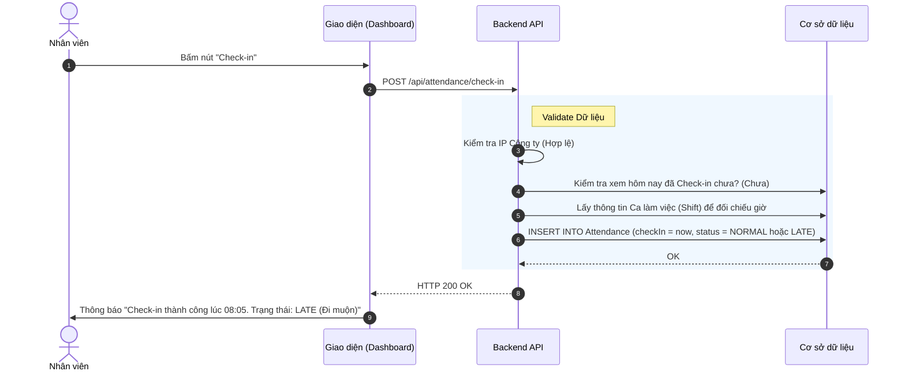
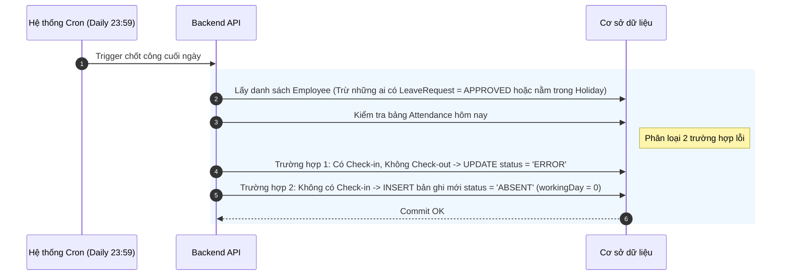

# Đặc tả chức năng: Ghi nhận và Chốt công (Check-in/Check-out)

## 1. Giới thiệu chức năng
Giao diện để nhân viên tự bấm nút (Hoặc nhận dữ liệu từ Máy chấm công vân tay) ghi nhận giờ đến công ty và ra về. 

## 2. Các quy tắc nghiệp vụ cốt lõi
- **Chống gian lận (Anti-fraud):** Nút Check-in trên Web sẽ kiểm tra địa chỉ IP. Nếu IP nằm ngoài dải IP của Công ty -> Từ chối ghi nhận.
- **Tính ngày công (Working Days):** Nếu tổng số giờ làm việc (Sau khi trừ giờ nghỉ trưa) >= 8 tiếng -> 1 Ngày công. Nếu làm 4 tiếng -> 0.5 Ngày công.
- **Quên Check-out:** Lúc 23:59 hàng ngày, hệ thống sẽ chốt công. Ai có Check-in mà không có Check-out sẽ bị đánh trạng thái `ERROR` (Cần làm đơn giải trình).

## 3. Sơ đồ luồng chi tiết (Sequence Diagrams)

### 3.1. Luồng Bấm nút Check-in (Web)

### 3.2. Luồng Job chạy ngầm chốt công vắng mặt (23:59)

