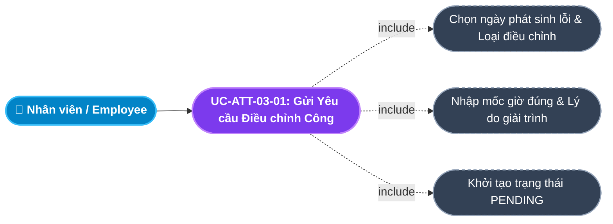
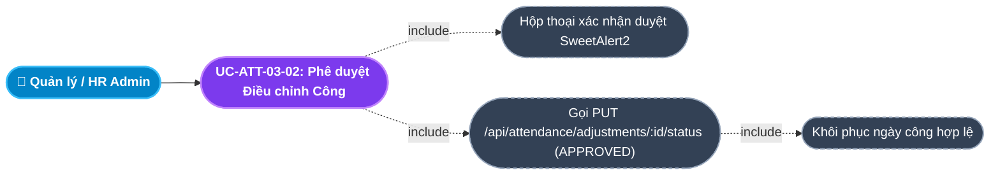
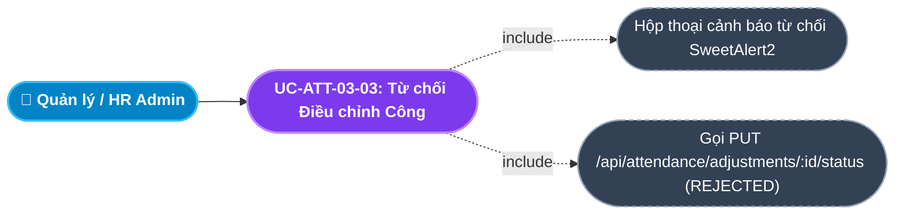
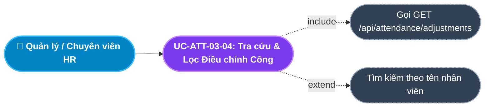
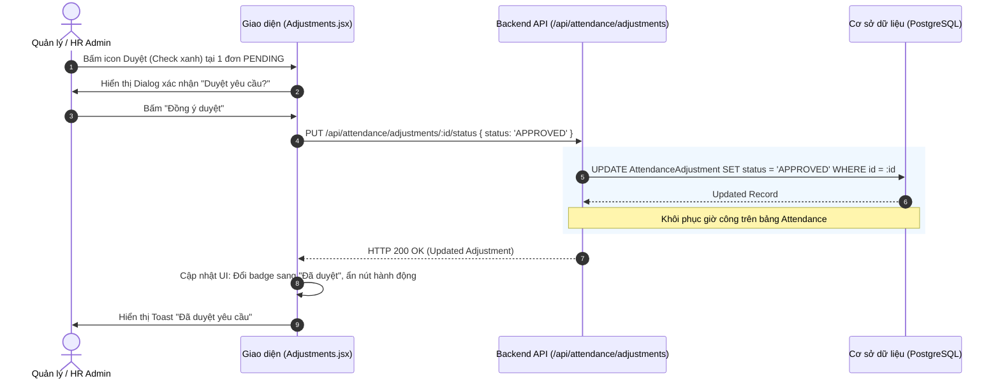

# Usecase: UC-ATT-03 - Quản lý Điều chỉnh Chấm công và Giải trình Công (Attendance Adjustment & Correction)

## 1. Giới thiệu chức năng
- **Mục đích**: Giải quyết các sai lệch và thiếu sót trong quá trình chấm công thực tế của nhân viên (quên quẹt thẻ Check-in, quên Check-out, đi công tác đột xuất, lỗi đầu đọc thẻ vân tay). Cung cấp quy trình tạo đơn giải trình minh bạch từ Nhân viên và cho phép Quản lý trực tiếp / HR phê duyệt cập nhật lại dữ liệu giờ công hợp lệ.
- **Actor (Tác nhân)**: Nhân viên (Employee), Quản lý trực tiếp (Line Manager), Chuyên viên C&B / HR Admin, Quản trị hệ thống (Admin).
- **Điều kiện tiên quyết**: Nhân viên đã có tài khoản và phát sinh ngày công cần điều chỉnh trong tháng làm việc hiện tại.

### Danh mục các chức năng con (Sub-features):
1. **UC-ATT-03-01: Gửi Yêu cầu Điều chỉnh Chấm công (Submit Adjustment Request)**: Nhân viên tạo đơn giải trình kèm ngày cần sửa, phân loại lỗi (Thiếu Check-in, Thiếu Check-out, Sai giờ làm), giờ thực tế và lý do cụ thể.
2. **UC-ATT-03-02: Phê duyệt Yêu cầu Điều chỉnh Công (Approve Adjustment Request)**: Quản lý / HR duyệt yêu cầu (`status = 'APPROVED'`), cập nhật lại giờ công hợp lệ để tính lương.
3. **UC-ATT-03-03: Từ chối Yêu cầu Điều chỉnh Công (Reject Adjustment Request)**: Quản lý từ chối đơn giải trình không có căn cứ hoặc không đúng sự thật (`status = 'REJECTED'`).
4. **UC-ATT-03-04: Tra cứu, Lọc & Tìm kiếm Yêu cầu Điều chỉnh (Search & Filter Adjustment Requests)**: Theo dõi danh sách đơn giải trình toàn công ty, tìm kiếm theo tên nhân viên, lọc theo trạng thái duyệt (`PENDING`, `APPROVED`, `REJECTED`).

---

## 2. Dữ liệu nghiệp vụ đầu vào (Input Data & Parameters)

### 2.1. Biểu mẫu Đơn Yêu cầu Điều chỉnh Chấm công (Attendance Adjustment Form)
| Tên trường | Kiểu dữ liệu | Tính chất | Ý nghĩa nghiệp vụ & Ràng buộc |
|---|---|---|---|
| `Nhân viên` (employeeId) | UUID / Chuỗi | Bắt buộc | Định danh người nộp đơn giải trình. |
| `Ngày cần điều chỉnh` (date) | Ngày (Date) | Bắt buộc | Ngày phát sinh sự cố chấm công (`YYYY-MM-DD`). |
| `Phân loại điều chỉnh` (type) | Chuỗi (String) | Bắt buộc | `Thiếu Check-in`, `Thiếu Check-out`, `Sai giờ làm việc`, `Đi công tác ngoài văn phòng`. |
| `Giờ ghi nhận cũ` (oldTime) | Chuỗi (Time) | Tùy chọn | Giờ sai sót hiện tại trên hệ thống (hoặc để trống nếu quên hoàn toàn). |
| `Giờ thực tế đề xuất` (newTime) | Chuỗi (Time) | Bắt buộc | Mốc giờ đúng nhân viên có mặt hoặc ra về (Định dạng `HH:mm`). |
| `Lý do giải trình` (reason) | Văn bản (Text) | Bắt buộc | Căn cứ giải trình (VD: "Máy chấm công tầng 3 bị mất mạng", "Đi tiếp khách hàng cùng sếp"). Tối thiểu 10 ký tự. |
| `Trạng thái phê duyệt` (status) | Enum | Mặc định | `PENDING` (Chờ duyệt), `APPROVED` (Đã duyệt), `REJECTED` (Bị từ chối). |

---

## 3. Quy tắc nghiệp vụ (Business Rules)

| Mã Quy tắc | Tình huống nghiệp vụ | Cách hệ thống xử lý | Thông báo hiển thị |
|---|---|---|---|
| **BR-ATT-03-01** | **Thời hạn Gửi Giải trình (Adjustment Deadline)**: Nhân viên nộp đơn cho ngày công trong quá khứ. | Chỉ cho phép gửi đơn trong vòng **03 ngày làm việc** kể từ ngày phát sinh lỗi và trước ngày chốt bảng lương hàng tháng (ngày 25 hàng tháng). | "Đã quá thời hạn nộp đơn giải trình chấm công cho ngày này!" |
| **BR-ATT-03-02** | **Bắt buộc Lý do Giải trình**: Nộp đơn nhưng không điền lý do hoặc lý do quá ngắn. | Yêu cầu nhập lý do chi tiết (tối thiểu 10 ký tự) $\rightarrow$ Ngăn chặn gửi đơn khống. | "Vui lòng nhập lý do giải trình cụ thể (tối thiểu 10 ký tự)!" |
| **BR-ATT-03-03** | **Thẩm quyền Phê duyệt (Approval Hierarchy)**: Người duyệt đơn điều chỉnh công. | Chỉ có Trưởng bộ phận (Manager), Chuyên viên C&B hoặc Admin mới có quyền bấm Duyệt hoặc Từ chối đơn. Nhân viên không được tự duyệt đơn của mình. | "Bạn không có quyền phê duyệt yêu cầu điều chỉnh này!" |
| **BR-ATT-03-04** | **Tính Bất biến sau Phê duyệt (Adjustment Immutability)**: Đơn đã có trạng thái `APPROVED` hoặc `REJECTED`. | Khóa đơn ở chế độ chỉ đọc (Read-only), không cho phép thu hồi hay sửa đổi trạng thái một lần nữa. | "Yêu cầu này đã được xử lý xong, không thể thay đổi!" |
| **BR-ATT-03-05** | **Khôi phục Ngày công Hợp lệ**: Khi đơn chuyển sang `APPROVED`. | Hệ thống cập nhật lại giờ check-in/out trên bản ghi `Attendance` tương ứng và tính toán lại `workingDay` (0.5 hoặc 1.0 công). | "Đã duyệt yêu cầu và khôi phục ngày công hợp lệ cho nhân viên!" |

---

## 4. Đặc tả chi tiết các Use Case chức năng con (Sub-Use Cases Specification)

---

### 4.1. UC-ATT-03-01: Gửi Yêu cầu Điều chỉnh Chấm công (Submit Adjustment Request)

#### Sơ đồ Use Case:

#### Bảng đặc tả nghiệp vụ:

| STT | Hạng mục | Nội dung chi tiết |
|:---:|---|---|
| **1** | **Thông tin chung** | - **UC ID**: `UC-ATT-03-01` - **UC Name**: Gửi Yêu cầu Điều chỉnh Chấm công (Submit Adjustment Request) - **Actor**: Toàn bộ nhân viên công ty - **Mục tiêu**: Cho phép nhân viên chủ động giải trình khi gặp sự cố chấm công để không bị mất ngày công oan uổng. - **Mô tả**: Nhân viên chọn ngày lỗi, chọn kiểu sự cố (Quên check-in/out), nhập giờ thực tế đi làm và viết lý do giải trình gửi cấp trên duyệt. - **Priority**: High |
| **2** | **Trigger** | Nhân viên bấm nút **"Gửi yêu cầu điều chỉnh"** trên giao diện Chấm công cá nhân. |
| **3** | **Pre-condition** | Ngày cần điều chỉnh nằm trong thời hạn cho phép (BR-ATT-03-01). |
| **4** | **Post-condition** | 1. Bản ghi `AttendanceAdjustment` mới được tạo với trạng thái `PENDING`. 2. Thông báo được gửi đến Quản lý trực tiếp để chờ duyệt. |
| **5** | **Main Flow** | 1. Nhân viên mở Modal *Đề nghị Điều chỉnh Chấm công*. 2. Chọn Ngày cần chỉnh sửa và Phân loại sự cố (VD: "Thiếu Check-out"). 3. Nhập Mốc giờ ra thực tế (VD: `17:45`). 4. Nhập Lý do giải trình: "Hôm qua ở lại họp dự án muộn nên lúc về quên quẹt thẻ". 5. Nhấn nút **"Gửi đề xuất"**. 6. Giao diện kiểm tra độ dài lý do ($\ge 10$ ký tự). 7. Hệ thống tạo bản ghi mới với `status = 'PENDING'`. 8. Báo Toast thành công: *"Đã gửi yêu cầu điều chỉnh công, vui lòng chờ cấp trên phê duyệt!"*. |
| **6** | **Alternative / Exception Flow** | - **EF-01 (Quá hạn giải trình)**: Ngày nộp cách xa quá 3 ngày $\rightarrow$ Chặn gửi đơn và báo lỗi BR-ATT-03-01. - **EF-02 (Lý do quá ngắn)**: Nhập dưới 10 ký tự $\rightarrow$ Báo lỗi *"Vui lòng nhập lý do giải trình cụ thể!"* (BR-ATT-03-02). |
| **7** | **Business Rules & Validation** | - Không cho phép gửi 2 đơn điều chỉnh cho cùng 1 ngày nếu đơn trước đang `PENDING`. |
| **8** | **Acceptance Criteria** | - **AC-01**: Form cho phép chọn ngày và loại sự cố dễ dàng. - **AC-02**: Gửi thành công đơn lập tức hiển thị trên danh sách chờ duyệt với nhãn PENDING. |

---

### 4.2. UC-ATT-03-02: Phê duyệt Yêu cầu Điều chỉnh Công (Approve Adjustment Request)

#### Sơ đồ Use Case:

#### Bảng đặc tả nghiệp vụ:

| STT | Hạng mục | Nội dung chi tiết |
|:---:|---|---|
| **1** | **Thông tin chung** | - **UC ID**: `UC-ATT-03-02` - **UC Name**: Phê duyệt Yêu cầu Điều chỉnh Công (Approve Adjustment Request) - **Actor**: Quản lý trực tiếp (Manager), Chuyên viên C&B, HR Admin - **Mục tiêu**: Chấp thuận lý do giải trình chính đáng của nhân viên và khôi phục lại quyền lợi ngày công. - **Mô tả**: Quản lý kiểm tra thông tin và lý do, nhấn nút **"Duyệt"**. Hệ thống cập nhật trạng thái đơn sang `APPROVED` và điều chỉnh lại giờ vào/ra trên bảng công. - **Priority**: High |
| **2** | **Trigger** | Người quản lý nhấn nút icon **Duyệt (Check xanh)** tại dòng đơn trên màn hình Điều chỉnh Chấm công (`Adjustments.jsx`). |
| **3** | **Pre-condition** | 1. Đơn đang ở trạng thái `PENDING`. 2. Người dùng có quyền duyệt chấm công. |
| **4** | **Post-condition** | 1. `AttendanceAdjustment.status` chuyển thành `APPROVED`. 2. Bản ghi công ngày đó được cập nhật lại giờ thực tế và số ngày công chuẩn. 3. Thông báo phê duyệt được gửi về cho nhân viên. |
| **5** | **Main Flow** | 1. Quản lý mở trang Điều chỉnh Chấm công (`/internal/attendance/adjustments`). 2. Xem chi tiết nhân viên, loại lỗi, giờ đề xuất và lý do giải trình. 3. Nhấn nút icon **Duyệt** màu xanh. 4. Hệ thống hiển thị hộp thoại xác nhận: *"Bạn có chắc chắn muốn duyệt yêu cầu điều chỉnh công này?"* 5. Người dùng chọn **"Đồng ý duyệt"**. 6. Giao diện gửi request `PUT /api/attendance/adjustments/:id/status` với `{ status: 'APPROVED' }`. 7. Backend cập nhật trạng thái đơn thành `APPROVED` và trả về `HTTP 200 OK`. 8. Giao diện báo Toast: *"Đã duyệt yêu cầu"*, đồng thời nạp lại danh sách. |
| **6** | **Alternative / Exception Flow** | - **AF-01 (Người dùng bấm Hủy)**: Hộp thoại đóng lại, đơn giữ nguyên trạng thái `PENDING`. |
| **7** | **Business Rules & Validation** | - Cập nhật trạng thái dứt điểm, không cho phép đổi lại sau khi duyệt (BR-ATT-03-04). |
| **8** | **Acceptance Criteria** | - **AC-01**: Bắt buộc có popup xác nhận trước khi duyệt. - **AC-02**: Duyệt thành công badge trạng thái chuyển sang xanh lá (`APPROVED`) và các nút thao tác bị ẩn đi. |

---

### 4.3. UC-ATT-03-03: Từ chối Yêu cầu Điều chỉnh Công (Reject Adjustment Request)

#### Sơ đồ Use Case:

#### Bảng đặc tả nghiệp vụ:

| STT | Hạng mục | Nội dung chi tiết |
|:---:|---|---|
| **1** | **Thông tin chung** | - **UC ID**: `UC-ATT-03-03` - **UC Name**: Từ chối Yêu cầu Điều chỉnh Công (Reject Adjustment Request) - **Actor**: Quản lý trực tiếp (Manager), HR Admin - **Mục tiêu**: Bác bỏ các đơn giải trình không đúng sự thật, cố tình gian lận giờ làm việc hoặc không có minh chứng rõ ràng. - **Mô tả**: Quản lý bấm nút **"Từ chối"**. Hệ thống chuyển trạng thái đơn sang `REJECTED`, giữ nguyên dữ liệu công lỗi cũ. - **Priority**: High |
| **2** | **Trigger** | Người quản lý nhấn nút icon **Từ chối (X đỏ)** tại dòng đơn trên màn hình Điều chỉnh Chấm công. |
| **3** | **Pre-condition** | Đơn đang ở trạng thái `PENDING`. |
| **4** | **Post-condition** | 1. `AttendanceAdjustment.status` chuyển thành `REJECTED`. 2. Dữ liệu công cũ của ngày đó giữ nguyên trạng thái lỗi. 3. Thông báo từ chối được gửi về cho nhân viên. |
| **5** | **Main Flow** | 1. Quản lý kiểm tra đơn, phát hiện lý do giải trình không hợp lệ (VD: Trích xuất camera không thấy có mặt). 2. Nhấn nút icon **Từ chối** màu đỏ. 3. Hệ thống hiển thị hộp thoại cảnh báo (SweetAlert2): *"Bạn có chắc chắn muốn từ chối yêu cầu điều chỉnh công này?"* 4. Người dùng chọn **"Đồng ý từ chối"**. 5. Giao diện gửi request `PUT /api/attendance/adjustments/:id/status` với `{ status: 'REJECTED' }`. 6. Backend cập nhật trạng thái đơn thành `REJECTED`. 7. Giao diện báo Toast: *"Đã từ chối yêu cầu"*, cập nhật nhãn trạng thái màu đỏ. |
| **6** | **Alternative / Exception Flow** | - **AF-01 (Hủy bỏ thao tác)**: Hộp thoại đóng lại, đơn tiếp tục ở trạng thái chờ duyệt. |
| **7** | **Business Rules & Validation** | - Khóa đơn không thể chỉnh sửa lại sau khi từ chối (BR-ATT-03-04). |
| **8** | **Acceptance Criteria** | - **AC-01**: Bắt buộc có popup cảnh báo trước khi từ chối. - **AC-02**: Từ chối thành công badge đổi sang đỏ (`REJECTED`). |

---

### 4.4. UC-ATT-03-04: Tra cứu, Lọc & Tìm kiếm Yêu cầu Điều chỉnh (Search & Filter Adjustments)

#### Sơ đồ Use Case:

#### Bảng đặc tả nghiệp vụ:

| STT | Hạng mục | Nội dung chi tiết |
|:---:|---|---|
| **1** | **Thông tin chung** | - **UC ID**: `UC-ATT-03-04` - **UC Name**: Tra cứu, Lọc & Tìm kiếm Yêu cầu Điều chỉnh (Search & Filter Adjustments) - **Actor**: Toàn bộ nhân viên, Quản lý, HR Admin - **Mục tiêu**: Theo dõi tình trạng xử lý các đơn giải trình công và giám sát số lượng sự cố chấm công trong tháng. - **Mô tả**: Hiển thị bảng danh sách các đơn giải trình gồm: Họ tên nhân viên, Ngày lỗi, Loại sự cố, Giờ đề xuất, Lý do, Trạng thái duyệt và Thao tác phê duyệt. - **Priority**: Medium |
| **2** | **Trigger** | Người dùng truy cập trang Điều chỉnh Chấm công (`/internal/attendance/adjustments`). |
| **3** | **Pre-condition** | Người dùng đã đăng nhập vào hệ thống. |
| **4** | **Post-condition** | Danh sách các đơn giải trình hiển thị đầy đủ, sắp xếp theo thời gian tạo mới nhất. |
| **5** | **Main Flow** | 1. Người dùng mở trang Điều chỉnh Chấm công. 2. Giao diện gọi API `GET /api/attendance/adjustments`. 3. Backend truy vấn CSDL, include quan hệ `employee` lấy `fullName`, sắp xếp theo `createdAt desc`. 4. Giao diện nạp dữ liệu vào bảng. 5. Người dùng nhập tên nhân viên vào ô tìm kiếm $\rightarrow$ Bảng tự động lọc các đơn của nhân viên đó. |
| **6** | **Alternative / Exception Flow** | - **AF-01 (Chưa có đơn nào)**: Bảng hiển thị thông báo *"Chưa có yêu cầu điều chỉnh nào"*. |
| **7** | **Business Rules & Validation** | - Mặc định sắp xếp giảm dần theo thời gian nộp đơn để quản lý xử lý kịp thời các đơn mới. |
| **8** | **Acceptance Criteria** | - **AC-01**: Hiển thị chính xác tên người nộp, ngày lỗi và lý do giải trình. - **AC-02**: Tìm kiếm theo tên phản hồi mượt mà. |

---

## 5. Sơ đồ tuần tự nghiệp vụ (Sequence Diagrams)

### 5.1. Luồng Phê duyệt Đơn Điều chỉnh Chấm công (UC-ATT-03-02)

---

## 6. Ma trận kịch bản kiểm thử (Test Scenarios & Acceptance Matrix)

| Mã kịch bản | Use Case liên quan | Điều kiện kiểm thử | Các bước thực hiện | Kết quả mong đợi (Expected Outcome) | Đánh giá |
|---|---|---|---|---|:---:|
| **TC-ATT-03-01** | UC-ATT-03-01 | Gửi đơn hợp lệ | Chọn ngày, loại "Thiếu Check-out", giờ 17:30, lý do cụ thể $\rightarrow$ Bấm Gửi | Tạo đơn thành công với `status = 'PENDING'`, hiển thị ngay trên bảng chờ duyệt. | **Pass** |
| **TC-ATT-03-02** | UC-ATT-03-01 | Lý do quá ngắn | Nhập lý do "quên" (dưới 10 ký tự) $\rightarrow$ Bấm Gửi | Báo lỗi *"Vui lòng nhập lý do giải trình cụ thể (tối thiểu 10 ký tự)!"*. | **Pass** |
| **TC-ATT-03-03** | UC-ATT-03-02 | Duyệt đơn giải trình | Bấm icon Duyệt $\rightarrow$ Xác nhận trên SweetAlert | Đơn chuyển sang `APPROVED`, hiển thị badge xanh lá, ẩn các nút duyệt/từ chối. | **Pass** |
| **TC-ATT-03-04** | UC-ATT-03-03 | Từ chối đơn giải trình | Bấm icon Từ chối $\rightarrow$ Xác nhận trên SweetAlert | Đơn chuyển sang `REJECTED`, hiển thị badge đỏ. | **Pass** |
| **TC-ATT-03-05** | UC-ATT-03-04 | Tìm kiếm theo nhân viên | Nhập tên nhân viên vào thanh tìm kiếm | Danh sách chỉ hiển thị các đơn giải trình của nhân viên đó. | **Pass** |
