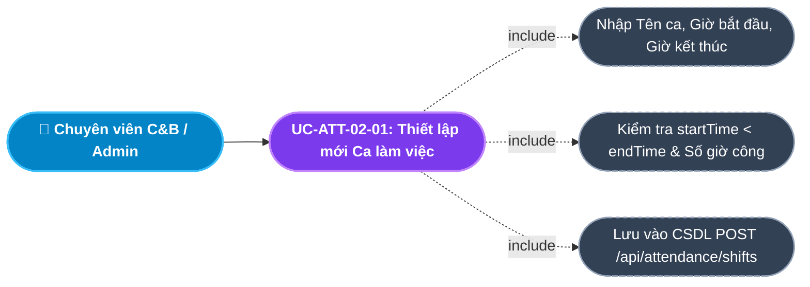
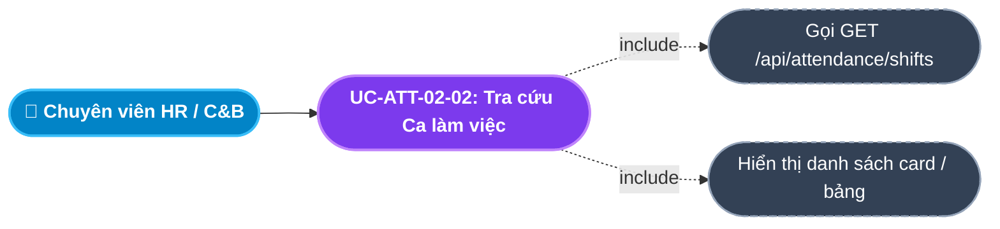
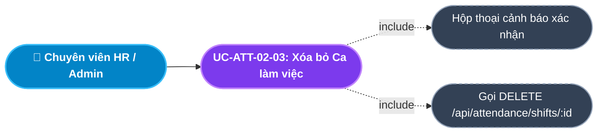
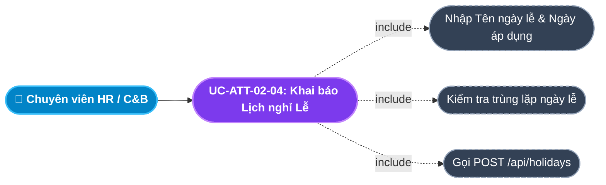
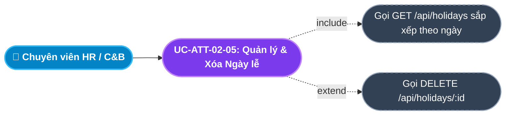
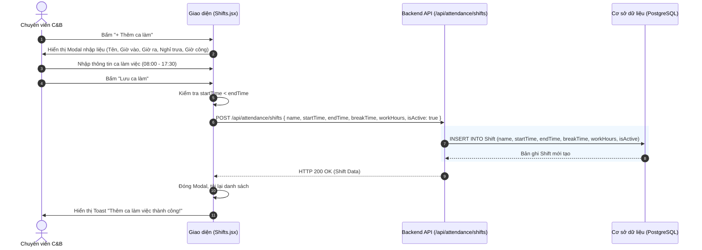
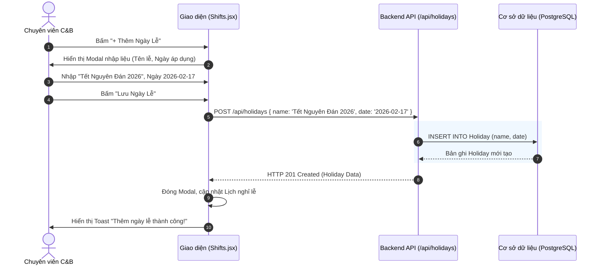

# Usecase: UC-ATT-02 - Quản lý Ca làm việc và Ngày Lễ (Shifts & Holidays Configuration)

## 1. Giới thiệu chức năng
- **Mục đích**: Cung cấp công cụ cấu hình linh hoạt cho Ban Giám đốc và Phòng Nhân sự để thiết lập các khung giờ làm việc chuẩn (Ca hành chính, Ca sáng, Ca chiều, Ca đêm) và khai báo danh mục các Ngày nghỉ Lễ quốc gia / nghỉ bù trong năm. Dữ liệu Ca làm việc và Ngày lễ là "thước đo chuẩn" để hệ thống tự động đối chiếu giờ quẹt thẻ và tính toán chế độ hưởng nguyên lương theo luật định.
- **Actor (Tác nhân)**: Chuyên viên C&B (C&B Specialist), Trưởng phòng Nhân sự (HR Manager), Quản trị viên hệ thống (Admin).
- **Điều kiện tiên quyết**: Người dùng đã đăng nhập với vai trò có quyền cấu hình hệ thống chấm công (`MANAGE_ATTENDANCE`, `ADMIN`).

### Danh mục các chức năng con (Sub-features):
1. **UC-ATT-02-01: Thiết lập mới Ca làm việc (Create Working Shift)**: Tạo ca làm việc mới với các tham số: Tên ca, Giờ bắt đầu, Giờ kết thúc, Thời gian nghỉ giữa ca và Số giờ công quy chuẩn.
2. **UC-ATT-02-02: Tra cứu & Quản lý Danh mục Ca làm việc (View & List Shifts)**: Xem toàn bộ các ca làm việc đang áp dụng trong doanh nghiệp kèm trạng thái kích hoạt (`isActive`).
3. **UC-ATT-02-03: Xóa bỏ Ca làm việc không sử dụng (Delete Shift)**: Xóa các ca làm việc cũ hoặc thử nghiệm khi chưa gắn với dữ liệu chấm công thực tế.
4. **UC-ATT-02-04: Khai báo Lịch nghỉ Lễ hưởng nguyên lương (Create Holiday)**: Thiết lập các ngày lễ theo luật định (Tết, Giỗ Tổ, 30/4 - 1/5, Quốc khánh) để hệ thống tự động tính nguyên công mà nhân viên không cần quét thẻ.
5. **UC-ATT-02-05: Tra cứu & Quản lý Danh mục Ngày lễ (View & Delete Holidays)**: Xem lịch các ngày nghỉ lễ trong năm và xóa các ngày lễ bị điều chỉnh hoặc hủy bỏ.

---

## 2. Dữ liệu nghiệp vụ đầu vào (Input Data & Parameters)

### 2.1. Biểu mẫu Ca làm việc (Shift Form Data)
| Tên trường | Kiểu dữ liệu | Tính chất | Ý nghĩa nghiệp vụ & Ràng buộc |
|---|---|---|---|
| `Tên ca làm việc` (name) | Chuỗi (String) | Bắt buộc | Tên gọi phân biệt (VD: "Ca Hành chính", "Ca Sáng", "Ca Chiều"). |
| `Giờ bắt đầu` (startTime) | Chuỗi (Time) | Bắt buộc | Mốc giờ nhân viên phải có mặt (Định dạng `HH:mm`, VD: `08:00`). |
| `Giờ kết thúc` (endTime) | Chuỗi (Time) | Bắt buộc | Mốc giờ kết thúc ca làm (Định dạng `HH:mm`, VD: `17:30`). |
| `Thời gian nghỉ trưa` (breakTime) | Số nguyên (Phút) | Bắt buộc | Số phút nghỉ giữa ca không tính công (Mặc định: 60 hoặc 90 phút). |
| `Số giờ công chuẩn` (workHours) | Số thập phân | Bắt buộc | Số giờ làm việc thực tế tính công (VD: 8.0 giờ). |
| `Trạng thái kích hoạt` (isActive) | Boolean | Mặc định | `true` (Đang sử dụng) hoặc `false` (Tạm ngưng). Mặc định là `true`. |

### 2.2. Biểu mẫu Ngày nghỉ Lễ (Holiday Form Data)
| Tên trường | Kiểu dữ liệu | Tính chất | Ý nghĩa nghiệp vụ & Ràng buộc |
|---|---|---|---|
| `Tên ngày lễ` (name) | Chuỗi (String) | Bắt buộc | Tên dịp nghỉ lễ (VD: "Tết Dương lịch 2026", "Nghỉ lễ 30/4 - 1/5"). |
| `Ngày áp dụng` (date) | Ngày (Date) | Bắt buộc | Mốc ngày diễn ra kỳ nghỉ (`YYYY-MM-DD`). |

---

## 3. Quy tắc nghiệp vụ (Business Rules)

| Mã Quy tắc | Tình huống nghiệp vụ | Cách hệ thống xử lý | Thông báo hiển thị |
|---|---|---|---|
| **BR-ATT-02-01** | **Ràng buộc Khung giờ Ca (Shift Time Range)**: Nhập giờ kết thúc trước hoặc bằng giờ bắt đầu. | Kiểm tra `endTime <= startTime` (đối với ca trong ngày) $\rightarrow$ Chặn lưu và báo lỗi. | "Giờ kết thúc ca làm việc phải sau giờ bắt đầu!" |
| **BR-ATT-02-02** | **Tránh trùng lặp Ca làm việc**: Nhập trùng tên ca làm việc đã có trong hệ thống. | Kiểm tra bảng `Shift` $\rightarrow$ Từ chối và yêu cầu đặt tên ca khác biệt. | "Tên ca làm việc đã tồn tại trong hệ thống!" |
| **BR-ATT-02-03** | **Ưu tiên Tính công Ngày Lễ (Holiday Full Pay Rule)**: Ngày làm việc trùng với ngày được khai báo trong bảng `Holiday`. | Nhân viên được nghỉ làm nhưng hệ thống tự động ghi nhận **1.0 ngày công chuẩn** hưởng nguyên lương (Theo Điều 112 Bộ luật Lao động 2019). Không bị đánh dấu `ABSENT`. | "Hôm nay là Ngày Lễ [TÊN LỄ]. Toàn bộ nhân viên được hưởng nguyên công." |
| **BR-ATT-02-04** | **Tính duy nhất của Ngày lễ**: Khai báo 2 ngày lễ trùng cùng 1 ngày (`date`). | Hệ thống cảnh báo ngày này đã được đăng ký nghỉ lễ $\rightarrow$ Chặn tạo trùng lặp. | "Ngày này đã được khai báo là ngày nghỉ lễ!" |
| **BR-ATT-02-05** | **Ràng buộc Xóa ca làm việc**: Xóa ca làm việc đang được phân bổ cho nhân viên. | Nếu ca làm việc đang có nhân viên được gán lịch $\rightarrow$ Chuyển trạng thái `isActive = false` thay vì xóa vật lý khỏi CSDL. | "Đã vô hiệu hóa ca làm việc!" |

---

## 4. Đặc tả chi tiết các Use Case chức năng con (Sub-Use Cases Specification)

---

### 4.1. UC-ATT-02-01: Thiết lập mới Ca làm việc (Create Working Shift)

#### Sơ đồ Use Case:

#### Bảng đặc tả nghiệp vụ:

| STT | Hạng mục | Nội dung chi tiết |
|:---:|---|---|
| **1** | **Thông tin chung** | - **UC ID**: `UC-ATT-02-01` - **UC Name**: Thiết lập mới Ca làm việc (Create Working Shift) - **Actor**: Chuyên viên C&B, HR Admin - **Mục tiêu**: Định nghĩa các khung giờ làm việc chuẩn để phục vụ việc chia ca và đối soát chấm công cho nhân viên. - **Mô tả**: Người dùng nhập tên ca, giờ check-in chuẩn, giờ check-out chuẩn, thời gian nghỉ giữa giờ và số giờ công được tính. - **Priority**: High (Bắt buộc) |
| **2** | **Trigger** | Người dùng bấm nút **"+ Thêm ca làm"** trên tab Ca làm việc (`/internal/attendance/shifts`). |
| **3** | **Pre-condition** | Người dùng có quyền quản lý ca làm việc. |
| **4** | **Post-condition** | 1. Bản ghi `Shift` mới được tạo trong CSDL. 2. Ca làm việc mới hiển thị trên danh sách và sẵn sàng để phân ca cho nhân viên. |
| **5** | **Main Flow** | 1. Người dùng bấm nút **"+ Thêm ca làm"**. 2. Hệ thống mở Modal Form *Thêm mới Ca làm việc*. 3. Người dùng nhập: Tên ca (VD: "Ca Hành chính"), Giờ vào (`08:00`), Giờ ra (`17:30`), Nghỉ trưa (`60 phút`), Giờ công (`8.0`). 4. Người dùng nhấn nút **"Lưu ca làm"**. 5. Giao diện kiểm tra dữ liệu bắt buộc và hợp lệ thời gian. 6. Hệ thống gửi request `POST /api/attendance/shifts` kèm payload. 7. Backend tạo bản ghi và trả về `HTTP 200 OK`. 8. Giao diện đóng Modal, báo Toast thành công: *"Thêm ca làm việc thành công!"*, tải lại danh sách. |
| **6** | **Alternative / Exception Flow** | - **EF-01 (Giờ ra trước giờ vào)**: Nhập giờ ra nhỏ hơn giờ vào $\rightarrow$ Báo lỗi *"Giờ kết thúc ca làm việc phải sau giờ bắt đầu!"* (BR-ATT-02-01). - **EF-02 (Bỏ trống tên ca)**: Báo lỗi *"Vui lòng nhập tên ca làm việc!"*. |
| **7** | **Business Rules & Validation** | - `name`: Bắt buộc, không trùng lặp. - `startTime` và `endTime`: Chuỗi thời gian chuẩn `HH:mm`. - `workHours`: Số dương lớn hơn 0. |
| **8** | **Acceptance Criteria** | - **AC-01**: Form nhập liệu rõ ràng, có gợi ý giờ chuẩn. - **AC-02**: Nhập giờ kết thúc sớm hơn giờ bắt đầu bị chặn và báo lỗi. - **AC-03**: Lưu thành công ca mới xuất hiện ngay trên danh sách. |

---

### 4.2. UC-ATT-02-02: Tra cứu & Quản lý Danh mục Ca làm việc (View & List Shifts)

#### Sơ đồ Use Case:

#### Bảng đặc tả nghiệp vụ:

| STT | Hạng mục | Nội dung chi tiết |
|:---:|---|---|
| **1** | **Thông tin chung** | - **UC ID**: `UC-ATT-02-02` - **UC Name**: Tra cứu & Quản lý Danh mục Ca làm việc (View & List Shifts) - **Actor**: Toàn bộ nhân viên nhân sự, quản lý - **Mục tiêu**: Giúp người quản lý nắm bắt toàn bộ các khung giờ làm việc hiện hành trong công ty. - **Mô tả**: Hiển thị bảng/thẻ ca làm việc gồm Tên ca, Khung giờ, Thời gian nghỉ, Giờ công chuẩn và Trạng thái kích hoạt. - **Priority**: Medium |
| **2** | **Trigger** | Người dùng truy cập trang Quản lý Ca làm & Lễ (`/internal/attendance/shifts`). |
| **3** | **Pre-condition** | Người dùng đã đăng nhập vào hệ thống. |
| **4** | **Post-condition** | Danh sách các ca làm việc hiển thị đầy đủ và trực quan. |
| **5** | **Main Flow** | 1. Người dùng mở trang Ca làm việc. 2. Giao diện gọi API `GET /api/attendance/shifts`. 3. Backend truy vấn CSDL lấy tất cả các bản ghi trong bảng `Shift`. 4. Giao diện hiển thị danh sách dạng Card hoặc Bảng với đầy đủ các thông số chi tiết. 5. Hiển thị nhãn xanh *"Đang áp dụng"* cho các ca có `isActive = true`. |
| **6** | **Alternative / Exception Flow** | - **AF-01 (Chưa có ca làm nào)**: Hiển thị thông báo *"Chưa có ca làm việc nào được thiết lập"*. |
| **7** | **Business Rules & Validation** | - Hiển thị rõ ràng định dạng giờ phút để người dùng không bị nhầm lẫn. |
| **8** | **Acceptance Criteria** | - **AC-01**: Hiển thị đúng và đủ toàn bộ các ca làm việc trong CSDL. |

---

### 4.3. UC-ATT-02-03: Xóa bỏ Ca làm việc không sử dụng (Delete Shift)

#### Sơ đồ Use Case:

#### Bảng đặc tả nghiệp vụ:

| STT | Hạng mục | Nội dung chi tiết |
|:---:|---|---|
| **1** | **Thông tin chung** | - **UC ID**: `UC-ATT-02-03` - **UC Name**: Xóa bỏ Ca làm việc không sử dụng (Delete Shift) - **Actor**: Chuyên viên C&B, Quản trị viên hệ thống - **Mục tiêu**: Dọn dẹp các ca làm việc cũ, hết hạn áp dụng hoặc tạo nhầm. - **Mô tả**: Cho phép xóa ca làm việc sau khi đã qua bước xác nhận cảnh báo an toàn. - **Priority**: Low |
| **2** | **Trigger** | Người dùng bấm icon thùng rác **(Xóa)** tại một ca làm việc trên danh sách. |
| **3** | **Pre-condition** | Người dùng có quyền quản trị ca làm việc. |
| **4** | **Post-condition** | Bản ghi `Shift` bị xóa khỏi CSDL, ca làm biến mất khỏi giao diện. |
| **5** | **Main Flow** | 1. Người dùng bấm icon **Thùng rác** tại ca làm cần xóa. 2. Hệ thống hiển thị hộp thoại xác nhận (SweetAlert2): *"Bạn có chắc chắn muốn xóa ca làm việc này?"* 3. Người dùng chọn **"Xác nhận xóa"**. 4. Giao diện gửi request `DELETE /api/attendance/shifts/:id`. 5. Backend xóa bản ghi trong bảng `Shift` và trả về `HTTP 200 OK`. 6. Giao diện báo Toast: *"Đã xóa ca làm việc"*, đồng thời nạp lại danh sách. |
| **6** | **Alternative / Exception Flow** | - **AF-01 (Người dùng bấm Hủy)**: Hộp thoại đóng lại, không có thao tác xóa nào diễn ra. |
| **7** | **Business Rules & Validation** | - Đảm bảo an toàn dữ liệu: Bắt buộc có xác nhận cảnh báo trước khi xóa. |
| **8** | **Acceptance Criteria** | - **AC-01**: Bắt buộc phải có popup xác nhận. - **AC-02**: Xóa thành công bản ghi biến mất ngay lập tức khỏi màn hình. |

---

### 4.4. UC-ATT-02-04: Khai báo Lịch nghỉ Lễ hưởng nguyên lương (Create Holiday)

#### Sơ đồ Use Case:

#### Bảng đặc tả nghiệp vụ:

| STT | Hạng mục | Nội dung chi tiết |
|:---:|---|---|
| **1** | **Thông tin chung** | - **UC ID**: `UC-ATT-02-04` - **UC Name**: Khai báo Lịch nghỉ Lễ hưởng nguyên lương (Create Holiday) - **Actor**: Chuyên viên C&B, HR Admin - **Mục tiêu**: Thiết lập danh mục các ngày nghỉ Lễ trong năm để hệ thống tự động ghi nhận nguyên ngày công cho nhân viên mà không cần đi làm. - **Mô tả**: Người dùng nhập tên ngày lễ và chọn ngày diễn ra. Hệ thống lưu vào lịch làm việc chung toàn doanh nghiệp. - **Priority**: High (Bắt buộc) |
| **2** | **Trigger** | Người dùng bấm nút **"+ Thêm Ngày Lễ"** trên giao diện Quản lý Ngày Lễ. |
| **3** | **Pre-condition** | Người dùng có quyền quản trị chấm công. |
| **4** | **Post-condition** | 1. Bản ghi `Holiday` mới được lưu vào CSDL. 2. Ngày này được đánh dấu là ngày nghỉ có lương trên toàn bộ lịch làm việc của công ty. 3. Cron Job tự động bỏ qua việc phạt vắng mặt (`ABSENT`) vào ngày này. |
| **5** | **Main Flow** | 1. Người dùng bấm **"+ Thêm Ngày Lễ"**. 2. Hệ thống hiển thị Modal Form *Thêm mới Ngày Lễ*. 3. Người dùng nhập: Tên ngày lễ (VD: "Giỗ Tổ Hùng Vương") và Chọn ngày (`2026-04-26`). 4. Người dùng bấm nút **"Lưu Ngày Lễ"**. 5. Giao diện kiểm tra các trường bắt buộc. 6. Hệ thống gửi request `POST /api/holidays` kèm `{ name, date }`. 7. Backend tạo bản ghi `Holiday` và trả về `HTTP 201 Created`. 8. Giao diện đóng Modal, báo Toast: *"Thêm ngày lễ thành công!"*, nạp lại danh sách. |
| **6** | **Alternative / Exception Flow** | - **EF-01 (Bỏ trống tên hoặc ngày)**: Báo lỗi *"Vui lòng nhập đầy đủ tên và ngày lễ!"*. - **EF-02 (Trùng ngày lễ đã khai báo)**: Báo lỗi *"Ngày này đã được khai báo là ngày nghỉ lễ!"* (BR-ATT-02-04). |
| **7** | **Business Rules & Validation** | - Tự động áp dụng quy tắc hưởng nguyên lương (BR-ATT-02-03). - Không cho phép trùng ngày lễ trong cùng 1 năm. |
| **8** | **Acceptance Criteria** | - **AC-01**: Khai báo ngày lễ thành công hiển thị trên lịch. - **AC-02**: Vào ngày Lễ, nhân viên không quét thẻ vẫn được ghi nhận đủ công. |

---

### 4.5. UC-ATT-02-05: Tra cứu & Quản lý Danh mục Ngày lễ (View & Delete Holidays)

#### Sơ đồ Use Case:

#### Bảng đặc tả nghiệp vụ:

| STT | Hạng mục | Nội dung chi tiết |
|:---:|---|---|
| **1** | **Thông tin chung** | - **UC ID**: `UC-ATT-02-05` - **UC Name**: Tra cứu & Quản lý Danh mục Ngày lễ (View & Delete Holidays) - **Actor**: Toàn bộ nhân viên, HR Admin - **Mục tiêu**: Theo dõi danh mục các ngày lễ trong năm và điều chỉnh/xóa khi có sự thay đổi lịch nghỉ từ Chính phủ. - **Mô tả**: Xem danh sách ngày lễ sắp xếp theo thứ tự thời gian tăng dần và hỗ trợ xóa bỏ ngày lễ không còn hiệu lực. - **Priority**: Medium |
| **2** | **Trigger** | Người dùng xem danh sách Ngày Lễ trên trang Ca làm & Lễ. |
| **3** | **Pre-condition** | Người dùng đã đăng nhập vào hệ thống. |
| **4** | **Post-condition** | Danh sách ngày lễ hiển thị chính xác theo thứ tự từ đầu năm đến cuối năm. |
| **5** | **Main Flow** | 1. Người dùng mở tab Danh mục Ngày lễ. 2. Giao diện gọi API `GET /api/holidays`. 3. Backend truy vấn CSDL, sắp xếp theo `date asc` và trả về danh sách. 4. Giao diện hiển thị bảng ngày lễ với định dạng tiếng Việt (VD: "Thứ Năm, 30/04/2026"). 5. Khi cần xóa một ngày lễ, HR bấm icon **Thùng rác** $\rightarrow$ Hệ thống gọi `DELETE /api/holidays/:id` $\rightarrow$ Xóa thành công và nạp lại bảng. |
| **6** | **Alternative / Exception Flow** | - **AF-01 (Chưa có ngày lễ nào)**: Hiển thị thông báo *"Chưa có ngày lễ nào được thiết lập"*. |
| **7** | **Business Rules & Validation** | - Luôn sắp xếp theo trình tự thời gian tăng dần (`date asc`) để người dùng dễ theo dõi lộ trình các kỳ nghỉ trong năm. |
| **8** | **Acceptance Criteria** | - **AC-01**: Danh sách hiển thị đúng ngày và tên dịp lễ. - **AC-02**: Bấm xóa loại bỏ ngay lập tức ngày lễ khỏi CSDL. |

---

## 5. Sơ đồ tuần tự nghiệp vụ (Sequence Diagrams)

### 5.1. Luồng Thiết lập Ca làm việc mới (UC-ATT-02-01)

### 5.2. Luồng Khai báo Ngày nghỉ Lễ (UC-ATT-02-04)

---

## 6. Ma trận kịch bản kiểm thử (Test Scenarios & Acceptance Matrix)

| Mã kịch bản | Use Case liên quan | Điều kiện kiểm thử | Các bước thực hiện | Kết quả mong đợi (Expected Outcome) | Đánh giá |
|---|---|---|---|---|:---:|
| **TC-ATT-02-01** | UC-ATT-02-01 | Thêm ca làm hợp lệ | Nhập Tên ca, `08:00`, `17:30`, 60p nghỉ, 8.0 công $\rightarrow$ Bấm Lưu | Tạo ca làm việc thành công, hiển thị đúng khung giờ trên danh sách. | **Pass** |
| **TC-ATT-02-02** | UC-ATT-02-01 | Giờ kết thúc sai | Nhập `startTime = 17:30`, `endTime = 08:00` $\rightarrow$ Bấm Lưu | Báo lỗi *"Giờ kết thúc ca làm việc phải sau giờ bắt đầu!"*, không lưu. | **Pass** |
| **TC-ATT-02-03** | UC-ATT-02-03 | Xóa ca làm việc | Bấm icon Thùng rác tại ca làm $\rightarrow$ Xác nhận xóa trên SweetAlert | Ca làm việc bị xóa khỏi CSDL và biến mất khỏi bảng danh sách. | **Pass** |
| **TC-ATT-02-04** | UC-ATT-02-04 | Khai báo ngày lễ | Nhập tên "Quốc khánh", chọn ngày 02/09 $\rightarrow$ Bấm Lưu | Lưu thành công, ngày lễ xuất hiện trên bảng sắp xếp đúng theo ngày. | **Pass** |
| **TC-ATT-02-05** | UC-ATT-02-05 | Xóa ngày lễ | Bấm icon Xóa tại một ngày lễ trên danh sách | Ngày lễ bị xóa thành công khỏi CSDL. | **Pass** |
