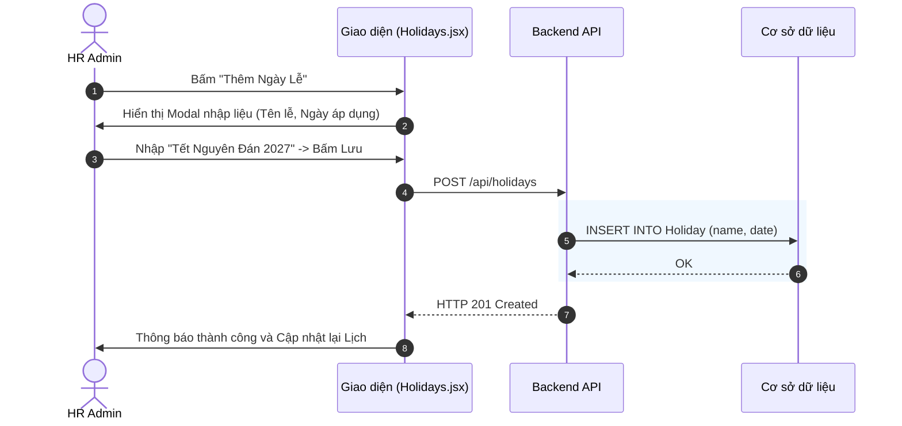

# Đặc tả chức năng: Quản lý Ca làm việc và Ngày Lễ (Shifts & Holidays)

## 1. Giới thiệu chức năng
Cho phép HR Admin thiết lập khung thời gian làm việc chuẩn cho công ty và khai báo các ngày nghỉ Lễ trong năm. Dữ liệu này dùng làm "Thước đo" để so sánh với giờ Check-in thực tế của nhân viên.

## 2. Các quy tắc nghiệp vụ cốt lõi
- **Tránh trùng lặp Ca:** Không được tạo 2 ca làm việc có trùng tên hoặc trùng khung giờ 100%.
- **Ưu tiên Ngày Lễ:** Nếu một ngày được khai báo là Ngày Lễ (Holiday), nhân viên không cần Check-in nhưng hệ thống vẫn tự động ghi nhận 1 Ngày công chuẩn. (Theo Điều 112 BLLĐ 2019).

## 3. Sơ đồ luồng chi tiết (Sequence Diagrams)

### 3.1. Luồng Thêm Ngày Lễ (Holiday)

