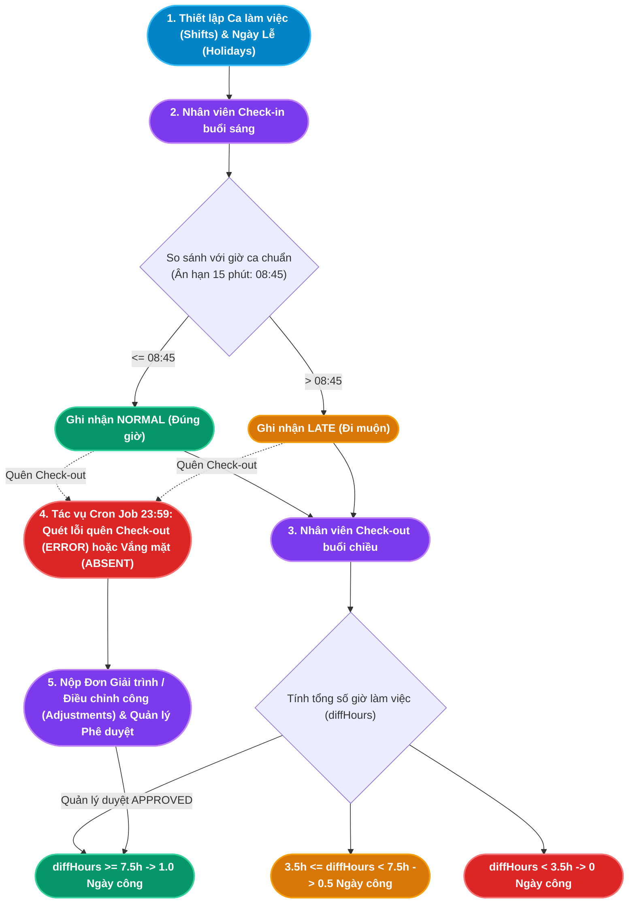

# TÀI LIỆU PHÂN TÍCH NGHIỆP VỤ - MODULE CHẤM CÔNG (TIME & ATTENDANCE)

## 1. Giới thiệu tổng quan Module
**Module Chấm công (Time & Attendance)** đóng vai trò là "chiếc đồng hồ đo lường chuẩn xác" thời gian cống hiến và kỷ luật lao động của toàn bộ cán bộ công nhân viên trong doanh nghiệp. Module này loại bỏ hoàn toàn các phương pháp chấm công thủ công bằng sổ sách hoặc file Excel dễ sai sót, thay thế bằng cơ chế ghi nhận thời gian thực (Real-time Clock-in/out) kết hợp thuật toán tự động quy đổi thời gian làm việc sang **Số ngày công chuẩn (Working Days)**.

Dữ liệu chấm công là cơ sở pháp lý và căn cứ cốt lõi duy nhất để:
- **Module Nghỉ phép & OT**: Kiểm tra nhân viên có đi làm trong ngày hay không để đối chiếu với các đơn xin nghỉ phép hoặc đơn làm thêm giờ.
- **Module Tiền lương (Payroll)**: Cung cấp tổng số ngày công chuẩn thực tế trong tháng để nhân với đơn giá ngày lương trong công thức tính lương chính thức.

### Đối tượng sử dụng (Actors):
1. **Nhân viên (Employee)**: Tự thực hiện bấm nút Check-in buổi sáng khi đến công ty, Check-out buổi chiều khi ra về, xem lịch sử công cá nhân và gửi đơn giải trình khi quên quét thẻ.
2. **Quản lý trực tiếp / Trưởng phòng (Line Manager)**: Theo dõi quân số hiện diện trong ngày của bộ phận, phê duyệt hoặc từ chối các đơn xin điều chỉnh chấm công của cấp dưới.
3. **Chuyên viên C&B / HR Admin**: Thiết lập ca làm việc chuẩn, cấu hình lịch nghỉ lễ quốc gia, đối soát bảng công tổng hợp toàn công ty và chốt công cuối tháng.
4. **Quản trị hệ thống (Admin)**: Quản lý thiết bị quét vân tay/nhận diện khuôn mặt và giám sát tiến trình Cron Job chốt công tự động hàng đêm.

---

## 2. Kiến trúc Luồng Dữ liệu Điểm danh & Tính công (Attendance Pipeline Architecture)

---

## 3. Ma trận Phân rã Chức năng Chi tiết (Functional Breakdown Matrix)

Hệ thống Chấm công (Time & Attendance) bao gồm **3 nhóm chức năng trụ cột** với tổng cộng **14 Use Case con (Sub-Use Cases)** được chuẩn hóa toàn diện:

| Nhóm chức năng (Epic) | Mã Use Case | Tên Chức năng Con (Sub-Use Case) | Actor chính | Endpoint Backend |
|---|---|---|---|---|
| **1. Ghi nhận Vào/Ra & Tính công** *(Check-in / Check-out)* | `UC-ATT-01-01` | Điểm danh Vào (Check-in) & Phân loại Đúng giờ/Muộn | Toàn bộ Nhân viên | `POST /api/attendance/check-in` |
| | `UC-ATT-01-02` | Điểm danh Ra (Check-out) & Tự động Tính ngày công | Toàn bộ Nhân viên | `POST /api/attendance/check-out` |
| | `UC-ATT-01-03` | Tra cứu Bảng Chấm công Cá nhân & Bộ phận | Toàn hệ thống | `GET /api/attendance` |
| | `UC-ATT-01-04` | Tự động Chốt công Cuối ngày (Night Cron Job 23:59) | Server Cron Job | Background Scheduled Task |
| | `UC-ATT-01-05` | Điểm danh Bổ sung / Admin Ghi nhận Thay | HR / Admin | `POST /api/attendance/manual` |
| **2. Cấu hình Ca & Ngày Lễ** *(Shifts & Holidays)* | `UC-ATT-02-01` | Thiết lập mới Ca làm việc (Create Working Shift) | Chuyên viên C&B | `POST /api/attendance/shifts` |
| | `UC-ATT-02-02` | Tra cứu & Quản lý Danh mục Ca làm việc | Chuyên viên C&B | `GET /api/attendance/shifts` |
| | `UC-ATT-02-03` | Xóa bỏ Ca làm việc không sử dụng | Chuyên viên C&B | `DELETE /api/attendance/shifts/:id` |
| | `UC-ATT-02-04` | Khai báo Lịch nghỉ Lễ quốc gia (Create Holiday) | Chuyên viên C&B | `POST /api/holidays` |
| | `UC-ATT-02-05` | Tra cứu & Quản lý Danh mục Ngày lễ (Holidays) | Chuyên viên C&B | `GET`, `DELETE /api/holidays` |
| **3. Điều chỉnh Chấm công** *(Attendance Adjustments)* | `UC-ATT-03-01` | Gửi Yêu cầu Điều chỉnh Chấm công (Submit Adjustment)| Toàn bộ Nhân viên | `POST /api/attendance/adjustments` |
| | `UC-ATT-03-02` | Phê duyệt Yêu cầu Điều chỉnh Công (Approve) | Quản lý / HR | `PUT /api/attendance/adjustments/:id/status` |
| | `UC-ATT-03-03` | Từ chối Yêu cầu Điều chỉnh Công (Reject) | Quản lý / HR | `PUT /api/attendance/adjustments/:id/status` |
| | `UC-ATT-03-04` | Tra cứu, Lọc & Tìm kiếm Yêu cầu Điều chỉnh | Quản lý / HR | `GET /api/attendance/adjustments` |

---

## 4. Danh mục Hồ sơ Phân tích Chi tiết (Detailed Specifications)

Vui lòng tham khảo tài liệu đặc tả chi tiết của từng chức năng con tại các liên kết dưới đây:

1. [Đặc tả Chức năng Ghi nhận Vào/Ra và Tính toán Ngày công](file:///c:/Users/truclh/Desktop/HRM-ĐATN/docs/Tài%20liệu%20phân%20tích%20nghiệp%20vụ%20từng%20module/Module%20Chấm%20công/Chuc-nang-Checkin-Checkout.md)
   - Đặc tả 5 Use Case con: Bấm nút Check-in (chặn trùng lặp, chặn nghỉ phép, ân hạn 15 phút), Bấm nút Check-out (tính công 1.0, 0.5, 0.0 theo số giờ thực tế), Tra cứu bảng công thời gian thực, Tác vụ Cron Job chốt công tự động lúc 23:59 đêm, và Điểm danh thay thủ công.
   - Sơ đồ tuần tự và 6 kịch bản kiểm thử mẫu.

2. [Đặc tả Chức năng Quản lý Ca làm việc và Ngày Lễ](file:///c:/Users/truclh/Desktop/HRM-ĐATN/docs/Tài%20liệu%20phân%20tích%20nghiệp%20vụ%20từng%20module/Module%20Chấm%20công/Chuc-nang-Quan-ly-Ca-lam.md)
   - Đặc tả 5 Use Case con: Tạo ca làm việc chuẩn, Quản lý danh mục ca làm, Xóa ca làm việc an toàn, Khai báo ngày nghỉ lễ quốc gia tự động tính nguyên công (Điều 112 BLLĐ 2019), Tra cứu và điều chỉnh ngày nghỉ lễ.
   - Sơ đồ tuần tự và 5 kịch bản kiểm thử mẫu.

3. [Đặc tả Chức năng Quản lý Điều chỉnh Chấm công và Giải trình Công](file:///c:/Users/truclh/Desktop/HRM-ĐATN/docs/Tài%20liệu%20phân%20tích%20nghiệp%20vụ%20từng%20module/Module%20Chấm%20công/Chuc-nang-Dieu-chinh-Cham-cong.md)
   - Đặc tả 4 Use Case con: Nhân viên nộp đơn giải trình (quên check-in/out, đi công tác), Quản lý trực tiếp phê duyệt đơn khôi phục ngày công, Quản lý từ chối đơn gian lận/sai sự thật, Tra cứu tìm kiếm đơn giải trình toàn công ty.
   - Sơ đồ tuần tự và 5 kịch bản kiểm thử mẫu.

---

## 5. Điểm nhấn Kỹ thuật & Nghiệp vụ (Key Business Highlights)

1. **Thuật toán Tự động Tính Ngày công theo Khung giờ (Automatic Workday Formula)**:
   - Thay vì nhân viên tự khai hoặc HR phải bấm tay từng ngày công, hệ thống sử dụng thuật toán tính toán chính xác số giờ làm việc thực tế:
     $$\Delta t = \frac{\text{Check-out} - \text{Check-in}}{3600 \text{ giây}}$$
     - $\Delta t \ge 7.5 \text{ giờ} \rightarrow 1.0 \text{ ngày công}$.
     - $3.5 \text{ giờ} \le \Delta t < 7.5 \text{ giờ} \rightarrow 0.5 \text{ ngày công}$.
     - $\Delta t < 3.5 \text{ giờ} \rightarrow 0.0 \text{ ngày công}$.

2. **Chính sách Ân hạn Đi muộn 15 phút (15-Minute Grace Period)**:
   - Ca hành chính bắt đầu lúc `08:30`. Nhằm tạo sự linh hoạt trong điều kiện giao thông đô thị, hệ thống thiết lập mốc ân hạn đến `08:45`.
   - Nhân viên quét thẻ từ `08:31` đến `08:45` vẫn được ghi nhận trạng thái `NORMAL` (Đúng giờ). Chỉ khi quét thẻ từ `08:46` trở đi mới bị đánh dấu `LATE` (Đi muộn).

3. **Cơ chế Quét chốt công Tự động lúc 23:59 (Daily Midnight Sweep)**:
   - Vào lúc `23:59:00` hàng ngày, hệ thống chạy một tác vụ ngầm kiểm tra toàn bộ nhân viên:
     - Ai có Check-in nhưng thiếu Check-out $\rightarrow$ Tự động gắn nhãn `ERROR` và set `workingDay = 0` (yêu cầu nộp đơn giải trình).
     - Ai không có Check-in mà không có Đơn nghỉ phép được duyệt trước $\rightarrow$ Tự động tạo bản ghi `ABSENT` (Vắng mặt không phép).

4. **Tự động Ghi nhận Nguyên công Ngày Lễ (Full Pay Holiday Rule)**:
   - Mọi ngày được khai báo trong bảng `Holiday` được bảo vệ tự động: Nhân viên được nghỉ làm nhưng hệ thống tự động ghi nhận **1.0 ngày công chuẩn** để chi trả 100% lương theo đúng quy định tại Điều 112 Bộ luật Lao động 2019.
