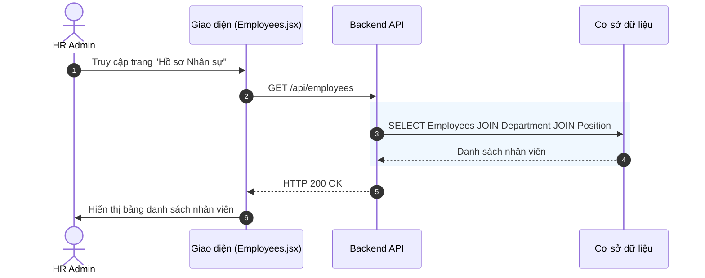
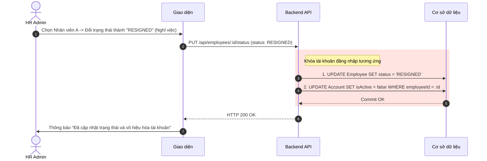

# Đặc tả chức năng: Quản lý Hồ sơ Nhân sự (Employee Profile)

## 1. Giới thiệu chức năng
Nơi quản lý toàn bộ thông tin cá nhân, thông tin công việc, và trạng thái làm việc của nhân viên trong công ty. Dữ liệu từ đây sẽ được các module khác (như Chấm công, Tính lương) sử dụng làm dữ liệu gốc.

## 2. Các quy tắc nghiệp vụ cốt lõi
- **Toàn vẹn CCCD:** Căn cước công dân (`cccd`) phải là duy nhất. Tuy nhiên, cho phép bỏ trống (Nullable) trong giai đoạn ứng viên mới nhận việc (Trạng thái ONBOARDING). Bắt buộc phải cập nhật CCCD khi ký hợp đồng chính thức.
- **Mã nhân viên (Code):** Được hệ thống sinh tự động hoặc HR nhập thủ công nhưng tuyệt đối không được trùng lặp.
- **Bảo mật PII:** Các dữ liệu cá nhân nhạy cảm (CCCD, SĐT) chỉ có HR Admin và chính nhân viên đó được quyền xem/sửa.

## 3. Sơ đồ luồng chi tiết (Sequence Diagrams)

### 3.1. Luồng Xem danh sách nhân sự

### 3.2. Luồng Chỉnh sửa trạng thái làm việc (Cập nhật nghỉ việc)
Quản lý việc nhân viên thôi việc và tự động cắt quyền truy cập hệ thống.

