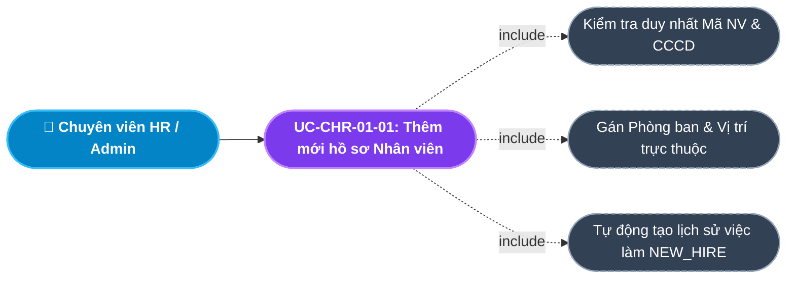
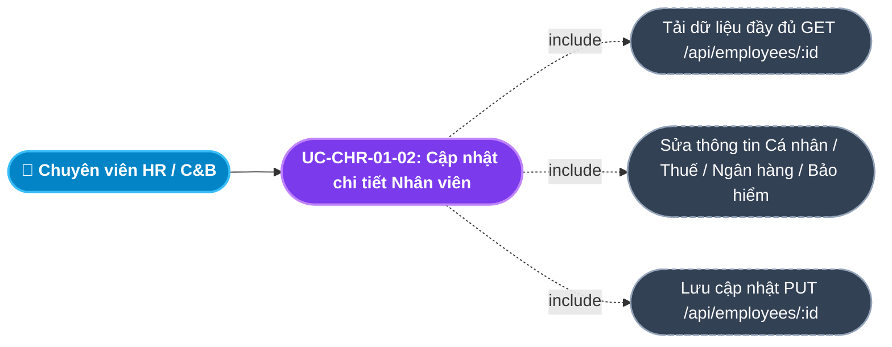
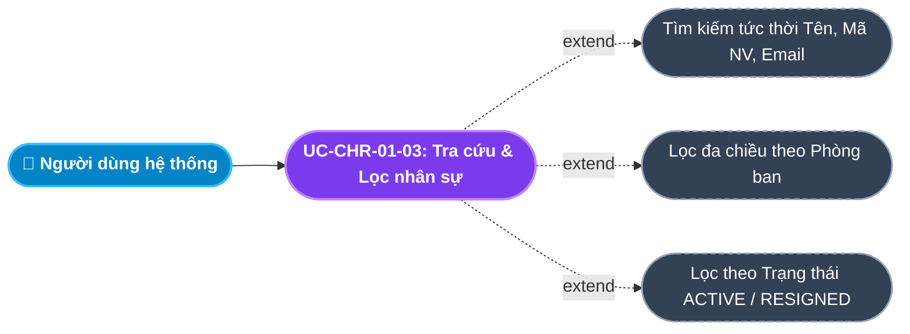
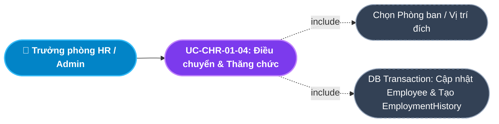
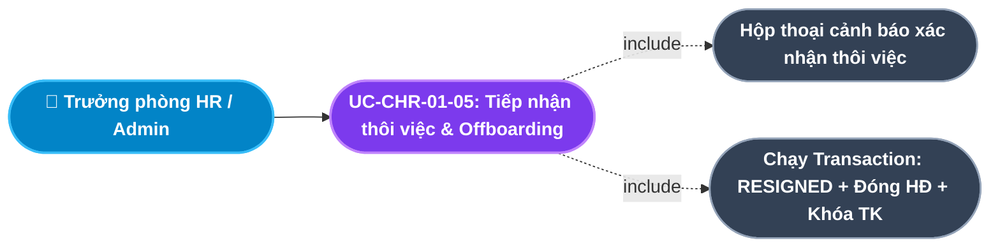
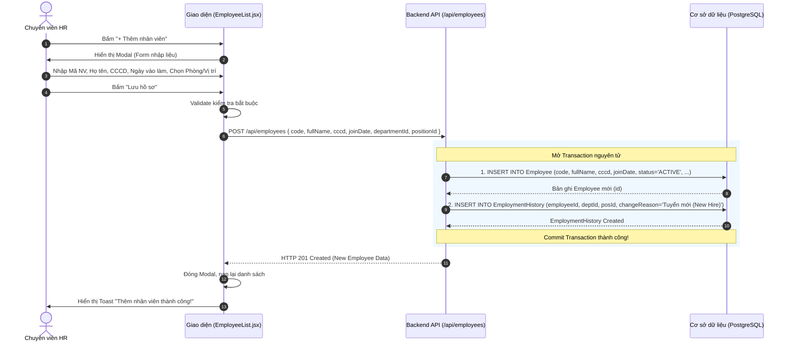
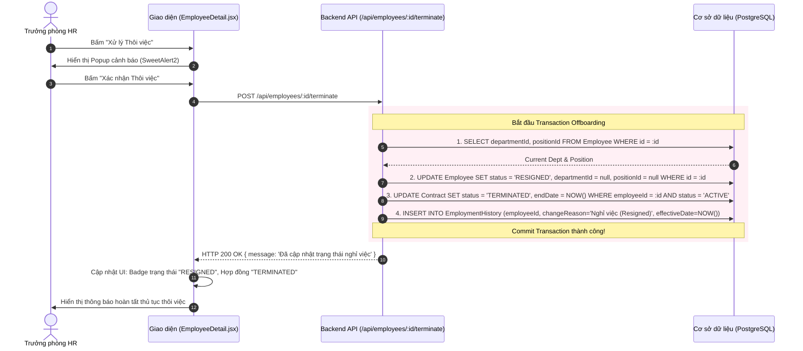

# Usecase: UC-CHR-01 - Quản lý Hồ sơ Nhân sự (Employee Profile Management)

## 1. Giới thiệu chức năng
- **Mục đích**: Là trái tim và "Nguồn dữ liệu thật duy nhất" (Single Source of Truth) của toàn bộ hệ thống HRM. Chức năng quản lý thông tin định danh cá nhân, cơ cấu phòng ban, vị trí chức danh, tài khoản ngân hàng, mã số thuế, bảo hiểm và toàn bộ lịch sử biến động việc làm (tuyển mới, điều chuyển, thăng tiến, thôi việc) của từng nhân sự trong doanh nghiệp.
- **Actor (Tác nhân)**: Chuyên viên Nhân sự (HR Admin / C&B), Trưởng phòng Nhân sự (HR Manager), Quản lý trực tiếp (Line Manager), Quản trị viên hệ thống (Admin).
- **Điều kiện tiên quyết**: Người dùng đã đăng nhập và được cấp quyền truy cập module Nhân sự (`MANAGE_EMPLOYEES`, `VIEW_EMPLOYEES`).

### Danh mục các chức năng con (Sub-features):
1. **UC-CHR-01-01: Thêm mới hồ sơ Nhân viên (Add Employee Profile)**: Tạo hồ sơ nhân sự thủ công (ngoài luồng tuyển dụng), tự động tạo bản ghi lịch sử việc làm đầu tiên (`NEW_HIRE`).
2. **UC-CHR-01-02: Cập nhật thông tin chi tiết Nhân viên (Update Employee Profile)**: Bổ sung/điều chỉnh thông tin cá nhân (CCCD, SĐT, Email), thông tin thuế, ngân hàng, bảo hiểm và liên hệ khẩn cấp.
3. **UC-CHR-01-03: Tra cứu, Tìm kiếm & Lọc danh bạ Nhân sự (Search & Filter Employee Directory)**: Tìm kiếm tức thời theo Tên, Mã NV, Email; lọc theo Phòng ban, Vị trí và Trạng thái làm việc.
4. **UC-CHR-01-04: Điều chuyển công tác & Thăng chức (Transfer & Promotion)**: Thay đổi Phòng ban hoặc Vị trí chức danh của nhân viên, tự động ghi nhận vào Lịch sử việc làm (`EmploymentHistory`).
5. **UC-CHR-01-05: Tiếp nhận thôi việc & Xử lý Nghỉ việc (Employee Offboarding / Termination)**: Chuyển trạng thái sang `RESIGNED`, tự động hủy các Hợp đồng đang hiệu lực, thu hồi tài khoản và lưu vết lý do nghỉ việc.

---

## 2. Dữ liệu nghiệp vụ đầu vào (Input Data & Parameters)

### 2.1. Nhóm Thông tin Định danh & Công việc Cốt lõi
| Tên trường | Kiểu dữ liệu | Tính chất | Ý nghĩa nghiệp vụ & Ràng buộc |
|---|---|---|---|
| `Mã nhân viên` (code) | Chuỗi (String) | Bắt buộc | Định danh duy nhất của nhân viên (VD: `NV0001`, `NV0142`), không được trùng lặp. |
| `Họ và tên` (fullName) | Chuỗi (String) | Bắt buộc | Họ tên đầy đủ có dấu (Tối đa 100 ký tự). |
| `Số CCCD / CMND` (cccd) | Chuỗi (String) | Tùy chọn / Bắt buộc khi Active | Căn cước công dân (9 hoặc 12 số). Có thể để trống khi Onboarding nhưng bắt buộc duy nhất khi nhập. |
| `Email công ty` (email) | Chuỗi (String) | Bắt buộc | Email nội bộ sử dụng để đăng nhập và nhận thông báo (Duy nhất toàn hệ thống). |
| `Số điện thoại` (phone) | Chuỗi (String) | Tùy chọn | Số điện thoại di động cá nhân (10 số). |
| `Ngày bắt đầu làm việc` (joinDate) | Ngày (Date) | Bắt buộc | Mốc thời gian chính thức gia nhập công ty (Định dạng `YYYY-MM-DD`). |
| `Phòng ban` (departmentId) | UUID / Chuỗi | Bắt buộc | Thuộc cây cơ cấu phòng ban đang hoạt động (Module Tổ chức). |
| `Vị trí / Chức danh` (positionId) | UUID / Chuỗi | Bắt buộc | Chức danh chuyên môn đang đảm nhiệm (Module Tổ chức). |
| `Trạng thái làm việc` (status) | Enum | Mặc định | `ONBOARDING`, `INTERNSHIP`, `PROBATION`, `ACTIVE`, `RESIGNED`. |

### 2.2. Nhóm Thông tin Pháp lý, Thuế, Phúc lợi & Liên hệ khẩn cấp
| Tên trường | Kiểu dữ liệu | Tính chất | Ý nghĩa nghiệp vụ & Ràng buộc |
|---|---|---|---|
| `Ngày sinh & Giới tính` | Date, Enum | Tùy chọn | `dateOfBirth` (Tuổi $\ge$ 18), `gender` (`MALE`, `FEMALE`, `OTHER`). |
| `Mã số thuế cá nhân` (taxCode) | Chuỗi (String) | Tùy chọn | Mã số thuế TNCN dùng để khấu trừ biểu thuế lũy tiến tại Module Tiền lương. |
| `Ngân hàng & Số tài khoản` | Chuỗi (String) | Tùy chọn | `bankName`, `bankAccount` phục vụ chi trả lương chuyển khoản hàng tháng. |
| `Mã số BHXH / BHYT` | Chuỗi (String) | Tùy chọn | `socialInsurance`, `healthInsurance` làm căn cứ trích đóng bảo hiểm bắt buộc. |
| `Người liên hệ khẩn cấp` | Chuỗi (String) | Tùy chọn | `emergencyContactName`, `emergencyContactPhone`, `emergencyContactRelation`. |

---

## 3. Quy tắc nghiệp vụ (Business Rules)

| Mã Quy tắc | Tình huống nghiệp vụ | Cách hệ thống xử lý | Thông báo hiển thị |
|---|---|---|---|
| **BR-CHR-01-01** | **Ràng buộc Tính duy nhất (Uniqueness Integrity)**: Thêm mới hoặc chỉnh sửa trùng `code`, `cccd`, hoặc `email`. | Backend kiểm tra bảng `Employee` loại trừ bản ghi hiện tại. Nếu phát hiện trùng $\rightarrow$ Báo lỗi `HTTP 400` tương ứng. | "Mã nhân viên / CCCD / Email đã tồn tại trong hệ thống!" |
| **BR-CHR-01-02** | **Lưu vết Lịch sử Biến động (Employment History)**: Khi tạo mới, điều chuyển hoặc cho nghỉ việc. | Tự động sinh một bản ghi trong `EmploymentHistory` ghi nhận `departmentId`, `positionId`, `changeReason` và `effectiveDate` để truy vết thanh tra. | "Hệ thống đã tự động lưu biến động công tác vào lịch sử làm việc." |
| **BR-CHR-01-03** | **Ràng buộc Xóa nhân viên (Delete Constraint)**: Xóa một hồ sơ nhân sự khỏi CSDL. | Kiểm tra ràng buộc khóa ngoại: Nếu nhân viên đã có Hợp đồng lao động (`Contract`), bảng chấm công hoặc đơn nghỉ phép $\rightarrow$ Chặn tuyệt đối thao tác xóa. | "Không thể xóa nhân viên đã phát sinh hợp đồng hoặc dữ liệu giao dịch!" |
| **BR-CHR-01-04** | **Quy trình Xử lý Nghỉ việc nguyên tử (Offboarding Transaction)**: HR xác nhận cho nhân viên thôi việc (`RESIGNED`). | Chạy Transaction DB:  1. Đổi `Employee.status = 'RESIGNED'`. 2. Gỡ bỏ `departmentId` và `positionId`. 3. Đóng tất cả hợp đồng `ACTIVE` thành `TERMINATED` kèm `endDate = now`. 4. Khóa tài khoản đăng nhập `Account.isActive = false`. 5. Ghi nhận `EmploymentHistory` lý do Nghỉ việc. | "Đã cập nhật trạng thái nghỉ việc và thu hồi các quyền truy cập!" |
| **BR-CHR-01-05** | **Điều chuyển công tác (Transfer)**: Nhân viên chuyển phòng ban hoặc thăng chức. | Cập nhật `departmentId`/`positionId` trên bản ghi nhân viên, đồng thời tạo bản ghi `EmploymentHistory` với `changeReason = 'Điều chuyển (Transfer)'`. | "Điều chuyển nhân sự thành công!" |

---

## 4. Đặc tả chi tiết các Use Case chức năng con (Sub-Use Cases Specification)

---

### 4.1. UC-CHR-01-01: Thêm mới hồ sơ Nhân viên (Add Employee Profile)

#### Sơ đồ Use Case:

#### Bảng đặc tả nghiệp vụ:

| STT | Hạng mục | Nội dung chi tiết |
|:---:|---|---|
| **1** | **Thông tin chung** | - **UC ID**: `UC-CHR-01-01` - **UC Name**: Thêm mới hồ sơ Nhân viên (Add Employee Profile) - **Actor**: Chuyên viên Quản lý Nhân sự (HR Admin), Quản trị viên (Admin) - **Mục tiêu**: Nhập hồ sơ nhân sự mới vào hệ thống quản lý tập trung (áp dụng cho tuyển dụng trực tiếp hoặc lãnh đạo bổ nhiệm). - **Mô tả**: Người dùng nhập các thông tin cốt lõi (Mã NV, Họ tên, CCCD, Ngày vào làm, Phòng ban, Vị trí). Hệ thống khởi tạo hồ sơ và ghi log lịch sử việc làm đầu tiên. - **Priority**: High (Bắt buộc) |
| **2** | **Trigger** | Người dùng nhấn nút **"+ Thêm nhân viên"** trên thanh công cụ màn hình Danh sách Nhân viên (`/internal/employees`). |
| **3** | **Pre-condition** | 1. Người dùng có quyền `MANAGE_EMPLOYEES`. 2. Hệ thống đã có ít nhất 01 Phòng ban và 01 Vị trí đang hoạt động (`ACTIVE`). |
| **4** | **Post-condition** | 1. Bản ghi `Employee` mới được lưu vào CSDL với trạng thái mặc định `ACTIVE`. 2. Bản ghi `EmploymentHistory` với lý do *"Tuyển mới (New Hire)"* được tạo tự động. 3. Nhân viên mới hiển thị đầu danh sách hồ sơ. |
| **5** | **Main Flow** | 1. Người dùng nhấn nút **"+ Thêm nhân viên"**. 2. Hệ thống mở Modal Form *Thêm mới Nhân viên*, tải sẵn danh sách Phòng ban và Vị trí đang hoạt động. 3. Người dùng nhập: Mã nhân viên, Họ và tên, Số CCCD, Ngày vào làm; chọn Phòng ban và Vị trí chức danh. 4. Người dùng nhấn nút **"Lưu hồ sơ"**. 5. Giao diện kiểm tra các trường bắt buộc. 6. Hệ thống gửi request `POST /api/employees` kèm payload dữ liệu. 7. Backend chạy Transaction: Tạo bản ghi `Employee` và tạo bản ghi `EmploymentHistory`. 8. Backend commit và trả về `HTTP 201 Created`. 9. Giao diện đóng Modal, hiển thị Toast thông báo thành công và tải lại bảng danh sách nhân viên. |
| **6** | **Alternative / Exception Flow** | - **EF-01 (Trùng mã NV hoặc CCCD)**: Mã NV hoặc CCCD đã tồn tại trong hệ thống $\rightarrow$ Backend trả lỗi `HTTP 400` với thông báo *"Mã nhân viên đã tồn tại"* hoặc *"CCCD đã tồn tại"* $\rightarrow$ Giữ nguyên Modal cho người dùng sửa lại. - **EF-02 (Thiếu trường bắt buộc)**: Để trống Mã NV, Họ tên hoặc Ngày vào làm $\rightarrow$ Báo lỗi Toast *"Vui lòng nhập đầy đủ thông tin bắt buộc!"*. |
| **7** | **Business Rules & Validation** | - `code`: Bắt buộc, chuỗi không khoảng trắng, duy nhất (BR-CHR-01-01). - `fullName`: Bắt buộc, 2 - 100 ký tự. - `joinDate`: Bắt buộc, định dạng ngày hợp lệ. - `departmentId` & `positionId`: Phải tồn tại và đang ở trạng thái `ACTIVE`. - Tự động sinh bản ghi Lịch sử việc làm (BR-CHR-01-02). |
| **8** | **Acceptance Criteria** | - **AC-01**: Bấm "+ Thêm nhân viên" mở đúng Modal với danh mục Phòng ban/Vị trí hợp lệ. - **AC-02**: Nhập trùng Mã NV hệ thống chặn lại và báo lỗi chi tiết. - **AC-03**: Thêm thành công bản ghi hiển thị ngay trên bảng và có 1 dòng lịch sử trong tab Lịch sử việc làm. |

---

### 4.2. UC-CHR-01-02: Cập nhật thông tin chi tiết Nhân viên (Update Employee Profile)

#### Sơ đồ Use Case:

#### Bảng đặc tả nghiệp vụ:

| STT | Hạng mục | Nội dung chi tiết |
|:---:|---|---|
| **1** | **Thông tin chung** | - **UC ID**: `UC-CHR-01-02` - **UC Name**: Cập nhật thông tin chi tiết Nhân viên (Update Employee Profile) - **Actor**: Chuyên viên HR, Chuyên viên C&B, Quản trị viên - **Mục tiêu**: Bổ sung đầy đủ các thông tin cá nhân chuyên sâu, tài khoản nhận lương, mã số thuế và bảo hiểm cho nhân viên. - **Mô tả**: Chỉnh sửa hồ sơ nhân sự qua màn hình Chi tiết nhân viên với các tab: Thông tin chung, Hợp đồng, Thân nhân, Bằng cấp, Chứng chỉ. - **Priority**: High |
| **2** | **Trigger** | Người dùng bấm vào tên nhân viên hoặc nút **"Xem / Sửa"** trên bảng danh sách nhân viên. |
| **3** | **Pre-condition** | Bản ghi nhân viên tồn tại trong CSDL. |
| **4** | **Post-condition** | Toàn bộ các thông tin mới được cập nhật vào CSDL, làm căn cứ tính lương và kê khai thuế. |
| **5** | **Main Flow** | 1. Người dùng bấm vào một nhân viên trong danh sách. 2. Giao diện mở màn hình Chi tiết (`EmployeeDetail.jsx`), gọi API `GET /api/employees/:id` tải toàn bộ dữ liệu gồm quan hệ Hợp đồng, Thân nhân, Bằng cấp, Chứng chỉ. 3. Người dùng chuyển qua các tab và điền bổ sung: Số điện thoại, Địa chỉ, Mã số thuế, Tên ngân hàng, Số tài khoản, Mã BHXH, Người liên hệ khẩn cấp. 4. Người dùng nhấn nút **"Lưu thay đổi"**. 5. Hệ thống gửi request `PUT /api/employees/:id` kèm dữ liệu cập nhật. 6. Backend kiểm tra tính duy nhất của Mã NV, CCCD, Email đối với các nhân viên khác. 7. Backend cập nhật bản ghi `Employee` và trả về `HTTP 200 OK`. 8. Giao diện hiển thị Toast: *"Cập nhật hồ sơ nhân viên thành công!"*. |
| **6** | **Alternative / Exception Flow** | - **EF-01 (Trùng email với nhân viên khác)**: Email sửa đổi bị trùng $\rightarrow$ Báo lỗi *"Email đã tồn tại"* $\rightarrow$ Không cập nhật. - **EF-02 (Trùng CCCD)**: CCCD sửa đổi bị trùng $\rightarrow$ Báo lỗi *"CCCD đã tồn tại"*. |
| **7** | **Business Rules & Validation** | - Không cho phép cập nhật trùng lặp CCCD, Email, Mã NV với bất kỳ ai khác (BR-CHR-01-01). - Các trường tài khoản ngân hàng và thuế tự động định dạng chuẩn chuỗi. |
| **8** | **Acceptance Criteria** | - **AC-01**: Tải đúng và đủ toàn bộ dữ liệu hiện có lên các ô input. - **AC-02**: Cập nhật thành công số tài khoản ngân hàng phản ánh ngay sang Module Tính lương. |

---

### 4.3. UC-CHR-01-03: Tra cứu, Tìm kiếm & Lọc danh bạ Nhân sự (Search & Filter Employee Directory)

#### Sơ đồ Use Case:

#### Bảng đặc tả nghiệp vụ:

| STT | Hạng mục | Nội dung chi tiết |
|:---:|---|---|
| **1** | **Thông tin chung** | - **UC ID**: `UC-CHR-01-03` - **UC Name**: Tra cứu, Tìm kiếm & Lọc danh bạ Nhân sự (Search & Filter Employee Directory) - **Actor**: Toàn bộ nhân viên, HR, Quản lý - **Mục tiêu**: Giúp người dùng nhanh chóng tìm ra thông tin nhân sự cần liên hệ hoặc quản lý trong công ty. - **Mô tả**: Hỗ trợ tìm kiếm thời gian thực theo từ khóa họ tên, mã nhân viên, email, kết hợp bộ lọc theo Phòng ban, Chức danh và Trạng thái làm việc. - **Priority**: High |
| **2** | **Trigger** | Người dùng truy cập menu **"Danh sách Nhân viên"** (`/internal/employees`). |
| **3** | **Pre-condition** | Người dùng có tài khoản đang hoạt động. |
| **4** | **Post-condition** | Bảng danh sách hiển thị đúng tập hợp nhân sự thỏa mãn điều kiện lọc. |
| **5** | **Main Flow** | 1. Người dùng mở trang Danh sách Nhân viên. 2. Hệ thống gọi `GET /api/employees` lấy danh sách nhân viên kèm thông tin phòng ban, vị trí và hợp đồng mới nhất. 3. Người dùng nhập từ khóa tìm kiếm (VD: "Nam" hoặc "NV0012") vào ô tìm kiếm $\rightarrow$ Bảng tự động lọc các dòng khớp thông tin. 4. Người dùng chọn một Phòng ban trong Dropdown phòng ban $\rightarrow$ Bảng chỉ hiển thị nhân sự thuộc phòng ban đó. 5. Người dùng chọn trạng thái (VD: `ACTIVE` hoặc `ONBOARDING`) $\rightarrow$ Bảng cập nhật tức thời. |
| **6** | **Alternative / Exception Flow** | - **AF-01 (Không tìm thấy kết quả)**: Không có nhân viên nào thỏa mãn $\rightarrow$ Bảng hiển thị thông báo *"Không tìm thấy nhân viên nào phù hợp"*. |
| **7** | **Business Rules & Validation** | - Tìm kiếm không phân biệt chữ hoa, chữ thường (Case-insensitive). - Mặc định sắp xếp theo ngày vào làm mới nhất (`joinDate desc`). |
| **8** | **Acceptance Criteria** | - **AC-01**: Nhập từ khóa tìm kiếm phản hồi tức thời dưới 200ms. - **AC-02**: Lọc kết hợp Phòng ban và Trạng thái cho ra kết quả chính xác 100%. |

---

### 4.4. UC-CHR-01-04: Điều chuyển công tác & Thăng chức (Transfer & Promotion)

#### Sơ đồ Use Case:

#### Bảng đặc tả nghiệp vụ:

| STT | Hạng mục | Nội dung chi tiết |
|:---:|---|---|
| **1** | **Thông tin chung** | - **UC ID**: `UC-CHR-01-04` - **UC Name**: Điều chuyển công tác & Thăng chức (Transfer & Promotion) - **Actor**: Trưởng phòng Nhân sự (HR Manager), Quản trị viên - **Mục tiêu**: Thực hiện thay đổi cơ cấu công tác của nhân sự (chuyển bộ phận, thăng chức, luân chuyển chi nhánh) một cách minh bạch và có lưu vết. - **Mô tả**: Chọn phòng ban mới, vị trí mới cho nhân viên; hệ thống tự động cập nhật chức danh hiện tại và tạo 1 bản ghi lịch sử việc làm. - **Priority**: Medium |
| **2** | **Trigger** | Người dùng nhấn nút **"Điều chuyển"** trên màn hình Hồ sơ hoặc tại menu Điều chuyển công tác (`/internal/employees/transfers`). |
| **3** | **Pre-condition** | 1. Nhân viên đang có trạng thái `ACTIVE` hoặc `PROBATION`. 2. Phòng ban và Vị trí mới khác với vị trí hiện tại. |
| **4** | **Post-condition** | 1. Trường `departmentId` và `positionId` của nhân viên được cập nhật. 2. Bản ghi mới trong `EmploymentHistory` với lý do *"Điều chuyển (Transfer)"* được tạo thành công. 3. Quyền hạn truy cập và báo cáo tự động chuyển theo cấu trúc phòng ban mới. |
| **5** | **Main Flow** | 1. Người dùng mở chức năng Điều chuyển, chọn Nhân viên cần điều chuyển. 2. Hệ thống hiển thị thông tin công tác hiện tại (Phòng ban cũ, Chức danh cũ). 3. Người dùng chọn Phòng ban mới và Vị trí mới từ dropdown. 4. Người dùng nhấn nút **"Xác nhận Điều chuyển"**. 5. Hệ thống gửi request `POST /api/employees/:id/transfer` kèm payload `{ departmentId, positionId }`. 6. Backend chạy Database Transaction:    a. Cập nhật `departmentId`, `positionId` trên `Employee`.    b. Tạo mới bản ghi `EmploymentHistory` (`employeeId`, `departmentId`, `positionId`, `changeReason = 'Điều chuyển (Transfer)'`, `effectiveDate = now`). 7. Backend commit transaction và trả về `HTTP 200 OK`. 8. Giao diện báo Toast: *"Điều chuyển nhân sự thành công!"*, cập nhật lại thông tin hiển thị. |
| **6** | **Alternative / Exception Flow** | - **EF-01 (Chọn trùng phòng ban và vị trí cũ)**: Không có thay đổi nào $\rightarrow$ Báo cảnh báo *"Vui lòng chọn phòng ban hoặc vị trí mới khác hiện tại!"*. |
| **7** | **Business Rules & Validation** | - Bắt buộc chạy trong 1 Transaction để đảm bảo tính đồng bộ giữa thông tin hiện tại và lịch sử công tác (BR-CHR-01-02, BR-CHR-01-05). |
| **8** | **Acceptance Criteria** | - **AC-01**: Điều chuyển thành công cập nhật ngay Phòng ban và Chức danh của nhân viên. - **AC-02**: Màn hình Lịch sử việc làm hiển thị thêm 1 dòng ghi nhận mốc thời gian và chức danh mới. |

---

### 4.5. UC-CHR-01-05: Tiếp nhận thôi việc & Xử lý Nghỉ việc (Employee Offboarding / Termination)

#### Sơ đồ Use Case:

#### Bảng đặc tả nghiệp vụ:

| STT | Hạng mục | Nội dung chi tiết |
|:---:|---|---|
| **1** | **Thông tin chung** | - **UC ID**: `UC-CHR-01-05` - **UC Name**: Tiếp nhận thôi việc & Xử lý Nghỉ việc (Employee Offboarding / Termination) - **Actor**: Trưởng phòng Nhân sự (HR Manager), Quản trị viên (Admin) - **Mục tiêu**: Xử lý thủ tục dừng công tác cho nhân viên, tự động chấm dứt hợp đồng lao động và vô hiệu hóa tài khoản bảo mật. - **Mô tả**: Xác nhận cho nhân viên thôi việc. Hệ thống tự động chuyển trạng thái `RESIGNED`, đóng các hợp đồng đang hiệu lực, thu hồi phòng ban và tạo bản ghi lịch sử. - **Priority**: High |
| **2** | **Trigger** | Người dùng bấm nút **"Xử lý Thôi việc"** tại trang Chi tiết nhân viên hoặc menu Nghỉ việc (`/internal/employees/terminations`). |
| **3** | **Pre-condition** | Nhân viên đang có trạng thái khác `RESIGNED`. |
| **4** | **Post-condition** | 1. `Employee.status` chuyển thành `RESIGNED`, `departmentId` và `positionId` bị gỡ bỏ. 2. Các hợp đồng `ACTIVE` chuyển thành `TERMINATED` kèm `endDate` là thời điểm hiện tại. 3. Bản ghi `EmploymentHistory` ghi nhận lý do *"Nghỉ việc (Resigned)"*. 4. Tài khoản đăng nhập hệ thống bị khóa tự động. |
| **5** | **Main Flow** | 1. Người dùng bấm nút **"Xử lý Thôi việc"**. 2. Hệ thống hiển thị hộp thoại xác nhận (SweetAlert2): *"Bạn có chắc chắn muốn xử lý thôi việc cho nhân viên này? Hệ thống sẽ tự động đóng các hợp đồng đang kích hoạt và thu hồi quyền truy cập."* 3. Người dùng bấm **"Xác nhận Thôi việc"**. 4. Giao diện gửi request `POST /api/employees/:id/terminate`. 5. Backend mở `prisma.$transaction`:    a. Đọc thông tin phòng ban/vị trí hiện tại của nhân viên.    b. Cập nhật `Employee`: `status = 'RESIGNED'`, `departmentId = null`, `positionId = null`.    c. Cập nhật `Contract`: chuyển các hợp đồng `status = 'ACTIVE'` thành `status = 'TERMINATED'`, `endDate = new Date()`.    d. Tạo bản ghi `EmploymentHistory`: `changeReason = 'Nghỉ việc (Resigned)'`.    e. Commit transaction. 6. Backend trả về `HTTP 200 OK` kèm thông báo *"Đã cập nhật trạng thái nghỉ việc"$. 7. Giao diện đóng hộp thoại, hiển thị Toast thành công và cập nhật nhãn trạng thái `RESIGNED`. |
| **6** | **Alternative / Exception Flow** | - **AF-01 (Người dùng bấm Hủy)**: Hộp thoại đóng lại, không có thay đổi nào xảy ra đối với nhân sự. |
| **7** | **Business Rules & Validation** | - Quy trình mang tính nguyên tử tuyệt đối (BR-CHR-01-04) nhằm tránh tình trạng nhân viên đã nghỉ nhưng hợp đồng vẫn còn hiệu lực để tính lương. |
| **8** | **Acceptance Criteria** | - **AC-01**: Bắt buộc phải có hộp thoại cảnh báo xác nhận trước khi thực hiện. - **AC-02**: Sau khi thôi việc, trạng thái chuyển thành RESIGNED, tất cả hợp đồng của nhân viên này đều chuyển thành TERMINATED. - **AC-03**: Nhân sự thôi việc không còn xuất hiện trong danh sách tính lương của tháng tiếp theo. |

---

## 5. Sơ đồ tuần tự nghiệp vụ (Sequence Diagrams)

### 5.1. Luồng Thêm mới Hồ sơ & Khởi tạo Lịch sử Công tác (UC-CHR-01-01)

### 5.2. Luồng Xử lý Nghỉ việc & Chấm dứt Hợp đồng Tự động (UC-CHR-01-05)

---

## 6. Ma trận kịch bản kiểm thử (Test Scenarios & Acceptance Matrix)

| Mã kịch bản | Use Case liên quan | Điều kiện kiểm thử | Các bước thực hiện | Kết quả mong đợi (Expected Outcome) | Đánh giá |
|---|---|---|---|---|:---:|
| **TC-CHR-01-01** | UC-CHR-01-01 | Thêm nhân viên hợp lệ | Nhập đầy đủ Mã NV duy nhất, Họ tên, Ngày vào làm, chọn Phòng/Vị trí $\rightarrow$ Bấm Lưu | Tạo nhân viên thành công (`status = 'ACTIVE'`), tự sinh 1 bản ghi lịch sử `Tuyển mới`. | **Pass** |
| **TC-CHR-01-02** | UC-CHR-01-01 | Kiểm tra trùng Mã NV | Nhập Mã NV đã có trong CSDL $\rightarrow$ Bấm Lưu | Backend trả lỗi 400 *"Mã nhân viên đã tồn tại"*, giữ nguyên form để sửa. | **Pass** |
| **TC-CHR-01-03** | UC-CHR-01-02 | Cập nhật thông tin ngân hàng | Mở chi tiết NV $\rightarrow$ Điền Ngân hàng & STK $\rightarrow$ Bấm Lưu | Cập nhật thành công, dữ liệu hiển thị chính xác khi tải lại trang. | **Pass** |
| **TC-CHR-01-04** | UC-CHR-01-03 | Tìm kiếm theo Tên | Nhập tên nhân viên vào thanh tìm kiếm | Danh sách lọc tức thời chỉ hiển thị những nhân viên có tên chứa từ khóa. | **Pass** |
| **TC-CHR-01-05** | UC-CHR-01-04 | Điều chuyển công tác | Chọn phòng ban và chức danh mới $\rightarrow$ Bấm Xác nhận | Phòng ban mới được gán cho nhân viên, tab Lịch sử việc làm hiển thị thêm 1 dòng. | **Pass** |
| **TC-CHR-01-06** | UC-CHR-01-05 | Xử lý Thôi việc | Bấm Thôi việc $\rightarrow$ Xác nhận trên SweetAlert | Chuyển `status = 'RESIGNED'`, hợp đồng đổi sang `TERMINATED`, ghi nhận log nghỉ việc. | **Pass** |
