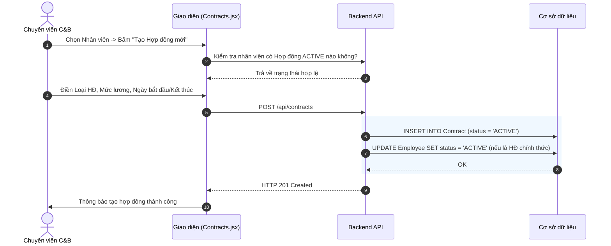
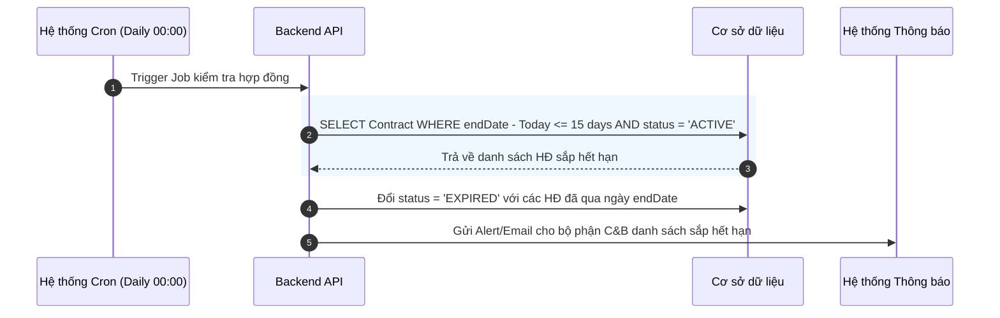

# Đặc tả chức năng: Quản lý Hợp đồng Lao động (Contracts)

## 1. Giới thiệu chức năng
Số hóa quy trình ký kết và quản lý thời hạn hợp đồng lao động. Theo dõi mức lương cơ bản để làm căn cứ tính lương (Payroll).

## 2. Các quy tắc nghiệp vụ cốt lõi
- **Giới hạn thử việc:** Thời hạn hợp đồng thử việc tối đa là 60 ngày. (Pháp luật: Khoản 1 Điều 27 BLLĐ 2019).
- **Trạng thái Độc quyền (Exclusive Status):** Tại một thời điểm, một nhân viên chỉ có thể có TỐI ĐA 1 Hợp đồng ở trạng thái `ACTIVE` (Đang hiệu lực).
- **Cảnh báo tự động:** Hệ thống quét mỗi ngày, nếu hợp đồng còn <= 15 ngày là hết hạn, sẽ bắn thông báo cảnh báo cho HR (C&B).

## 3. Sơ đồ luồng chi tiết (Sequence Diagrams)

### 3.1. Luồng Tạo mới Hợp đồng

### 3.2. Luồng Cron Job Cảnh báo Hợp đồng hết hạn
Luồng chạy ngầm của Server không cần người dùng thao tác.

