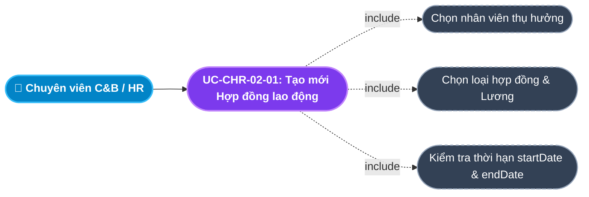
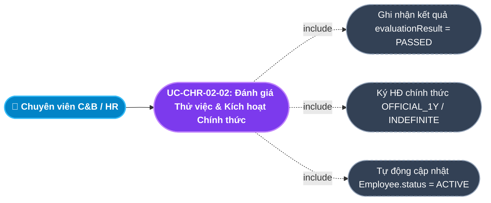
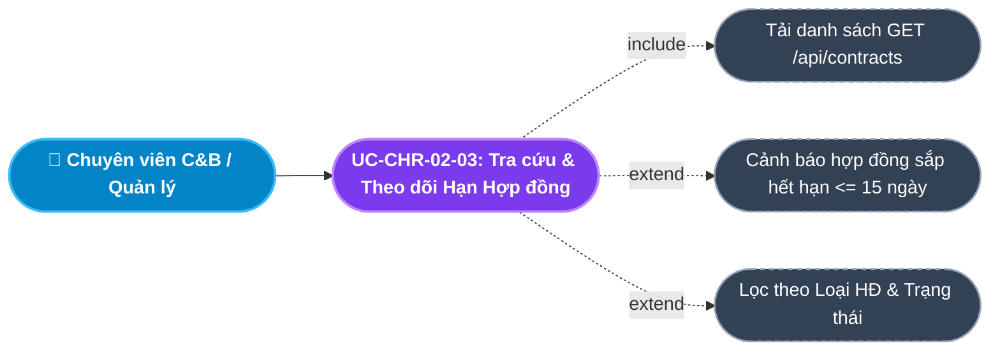
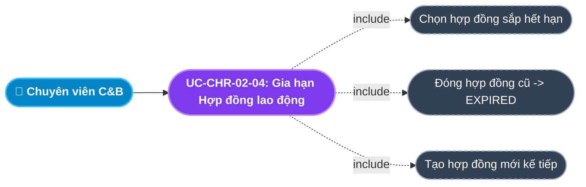
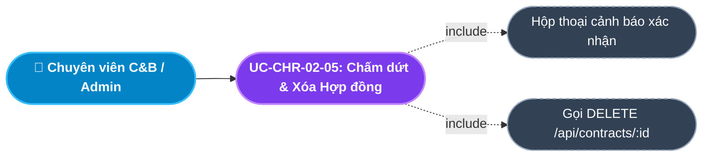
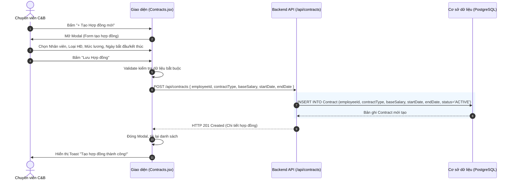
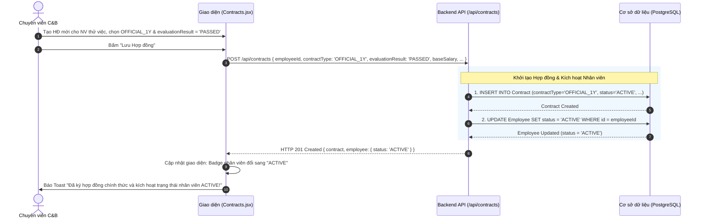

# Usecase: UC-CHR-02 - Quản lý Hợp đồng Lao động (Labor Contract Management)

## 1. Giới thiệu chức năng
- **Mục đích**: Số hóa toàn bộ vòng đời pháp lý của hợp đồng lao động giữa doanh nghiệp và người lao động, bao gồm: Ký kết hợp đồng thử việc, đánh giá hết hạn thử việc, chuyển ký hợp đồng xác định thời hạn hoặc không xác định thời hạn, gia hạn hợp đồng và thanh lý hợp đồng. Đây là nguồn dữ liệu chuẩn (Source of Truth) cung cấp mức Lương cơ bản (`baseSalary`) cho Module Tiền lương hàng tháng.
- **Actor (Tác nhân)**: Chuyên viên C&B (Compensation & Benefits), Trưởng phòng Nhân sự (HR Manager), Quản trị viên (Admin).
- **Điều kiện tiên quyết**: Người dùng đã đăng nhập và được cấp quyền quản lý nhân sự hoặc vai trò `ADMIN` / `HR_MANAGER` / `C&B`.

### Danh mục các chức năng con (Sub-features):
1. **UC-CHR-02-01: Tạo mới Hợp đồng lao động (Create Labor Contract)**: Khởi tạo hợp đồng mới cho nhân viên (Thử việc, 1 năm, Vô thời hạn, Thực tập) kèm mức lương và thời hạn.
2. **UC-CHR-02-02: Đánh giá Thử việc & Kích hoạt Nhân viên Chính thức (Probation Evaluation & Active Transition)**: Ghi nhận kết quả đánh giá thử việc (`evaluationResult = 'PASSED'`), tự động nâng cấp trạng thái nhân viên từ `PROBATION` lên `ACTIVE`.
3. **UC-CHR-02-03: Tra cứu, Lọc & Theo dõi Hạn Hợp đồng (Track Contract Expiry & Status)**: Theo dõi danh sách hợp đồng toàn công ty, lọc theo loại hợp đồng, trạng thái hiệu lực (`ACTIVE`, `EXPIRED`, `TERMINATED`) và cảnh báo hợp đồng sắp hết hạn $\le 15$ ngày.
4. **UC-CHR-02-04: Gia hạn Hợp đồng lao động (Contract Renewal)**: Ký tiếp hợp đồng mới kế tiếp cho nhân viên khi hợp đồng cũ đến hạn kết thúc.
5. **UC-CHR-02-05: Chấm dứt & Xóa Hợp đồng lao động (Terminate / Delete Contract)**: Thanh lý hợp đồng trước hạn hoặc xóa bỏ hợp đồng tạo sai sót (khi chưa phát sinh bảng lương).

---

## 2. Dữ liệu nghiệp vụ đầu vào (Input Data & Parameters)

### 2.1. Biểu mẫu Hợp đồng Lao động (Contract Form Data)
| Tên trường | Kiểu dữ liệu | Tính chất | Ý nghĩa nghiệp vụ & Ràng buộc |
|---|---|---|---|
| `Nhân viên` (employeeId) | UUID / Chuỗi | Bắt buộc | Chọn nhân viên thụ hưởng từ danh sách nhân sự công ty. |
| `Loại hợp đồng` (contractType) | Enum | Bắt buộc | `INTERNSHIP` (Thực tập), `PROBATION` (Thử việc), `OFFICIAL_1Y` (Xác định thời hạn 1 năm), `INDEFINITE` (Không xác định thời hạn). |
| `Mức lương cơ bản` (baseSalary) | Số (Decimal) | Bắt buộc | Lương đóng bảo hiểm và làm căn cứ tính lương (VNĐ, $> 0$). |
| `Ngày bắt đầu hiệu lực` (startDate) | Ngày (Date) | Bắt buộc | Ngày hợp đồng bắt đầu có giá trị pháp lý (`YYYY-MM-DD`). |
| `Ngày kết thúc hiệu lực` (endDate) | Ngày (Date) | Bắt buộc / Tùy chọn | Bắt buộc với hợp đồng có thời hạn; để trống (Null) với hợp đồng Không xác định thời hạn (`INDEFINITE`). |
| `Trạng thái hợp đồng` (status) | Enum | Mặc định | `ACTIVE` (Đang hiệu lực), `EXPIRED` (Hết hạn), `TERMINATED` (Đã chấm dứt). Mặc định là `ACTIVE`. |
| `Kết quả đánh giá thử việc` (evaluationResult) | Enum / String | Tùy chọn | `PASSED` (Đạt thử việc) hoặc `FAILED` (Không đạt). |

---

## 3. Quy tắc nghiệp vụ (Business Rules)

| Mã Quy tắc | Tình huống nghiệp vụ | Cách hệ thống xử lý | Thông báo hiển thị |
|---|---|---|---|
| **BR-CHR-02-01** | **Tính Độc quyền Hiệu lực (Exclusive Active Contract)**: Tạo mới hợp đồng `ACTIVE` cho nhân viên. | Một nhân viên tại một thời điểm chỉ được phép có **tối đa 01 Hợp đồng** ở trạng thái `ACTIVE`. Nếu đã có hợp đồng cũ đang `ACTIVE` $\rightarrow$ Hệ thống tự động chuyển hợp đồng cũ thành `EXPIRED` hoặc yêu cầu đóng trước khi tạo mới. | "Nhân viên đã có một hợp đồng đang hiệu lực. Hệ thống sẽ thay thế hợp đồng hiện tại." |
| **BR-CHR-02-02** | **Giới hạn Thời gian Thử việc (Legal Probation Limit)**: Chọn loại hợp đồng `PROBATION`. | Thời hạn thử việc tối đa không quá 60 ngày đối với chức danh chuyên môn (Khoản 1 Điều 27 Bộ luật Lao động 2019). Giao diện tự động tính `endDate` gợi ý = `startDate + 60 ngày`. | "Thời hạn hợp đồng thử việc không được vượt quá 60 ngày!" |
| **BR-CHR-02-03** | **Tự động chuyển đổi Nhân viên Chính thức (Auto-transition to ACTIVE)**: Ký hợp đồng chính thức sau thử việc. | Khi tạo hợp đồng loại `OFFICIAL_1Y` hoặc `INDEFINITE` kèm `evaluationResult = 'PASSED'` $\rightarrow$ Backend tự động cập nhật `Employee.status = 'ACTIVE'`. | "Hợp đồng chính thức đã được kích hoạt. Trạng thái nhân viên đã chuyển thành CHÍNH THỨC (ACTIVE)!" |
| **BR-CHR-02-04** | **Cảnh báo Hết hạn Hợp đồng tự động (Expiry Alert)**: Khoảng cách giữa thời gian hiện tại và `endDate` $\le 15$ ngày. | Hệ thống hiển thị huy hiệu (Badge) cảnh báo màu vàng *"Sắp hết hạn"* trên giao diện để chuyên viên C&B chuẩn bị thủ tục gia hạn hoặc thanh lý. | "Hợp đồng còn dưới 15 ngày là hết hiệu lực!" |
| **BR-CHR-02-05** | **Ràng buộc Xóa hợp đồng**: Người dùng nhấn xóa hợp đồng. | Chỉ cho phép xóa khi hợp đồng vừa tạo và chưa phát sinh bảng lương (Payslip) tại Module Tiền lương. Nếu đã phát sinh chi trả lương $\rightarrow$ Chỉ được phép chuyển sang `TERMINATED`. | "Không thể xóa hợp đồng đã được sử dụng để quyết toán lương!" |

---

## 4. Đặc tả chi tiết các Use Case chức năng con (Sub-Use Cases Specification)

---

### 4.1. UC-CHR-02-01: Tạo mới Hợp đồng lao động (Create Labor Contract)

#### Sơ đồ Use Case:

#### Bảng đặc tả nghiệp vụ:

| STT | Hạng mục | Nội dung chi tiết |
|:---:|---|---|
| **1** | **Thông tin chung** | - **UC ID**: `UC-CHR-02-01` - **UC Name**: Tạo mới Hợp đồng lao động (Create Labor Contract) - **Actor**: Chuyên viên C&B, Trưởng phòng Nhân sự - **Mục tiêu**: Ký kết hợp đồng lao động mới cho nhân sự vào làm hoặc chuyển giai đoạn làm việc. - **Mô tả**: Người dùng chọn nhân viên, chọn loại hợp đồng (Thử việc, Chính thức 1 năm, Vô thời hạn, Thực tập), nhập mức lương cơ bản và thiết lập thời hạn. - **Priority**: High (Bắt buộc) |
| **2** | **Trigger** | Người dùng nhấn nút **"+ Tạo Hợp đồng mới"** trên màn hình Quản lý Hợp đồng (`/internal/employees/contracts`). |
| **3** | **Pre-condition** | 1. Người dùng có quyền C&B/HR. 2. Nhân viên thụ hưởng tồn tại và có trạng thái hợp lệ (`ONBOARDING`, `PROBATION`, hoặc `ACTIVE`). |
| **4** | **Post-condition** | 1. Bản ghi `Contract` mới được lưu vào CSDL với trạng thái `ACTIVE`. 2. Mức lương cơ bản của hợp đồng sẵn sàng liên kết với Module Tiền lương. 3. Hiển thị dòng hợp đồng mới nhất trên danh sách. |
| **5** | **Main Flow** | 1. Người dùng bấm **"+ Tạo Hợp đồng mới"**. 2. Hệ thống hiển thị Modal Form *Tạo Hợp đồng Lao động*, nạp danh sách nhân viên. 3. Người dùng chọn Nhân viên, chọn Loại hợp đồng (`contractType`). 4. Người dùng nhập Mức lương cơ bản (`baseSalary`), Ngày bắt đầu (`startDate`) và Ngày kết thúc (`endDate`) (nếu có). 5. Người dùng nhấn nút **"Lưu Hợp đồng"**. 6. Giao diện kiểm tra dữ liệu bắt buộc và tính hợp lệ ngày tháng (`startDate < endDate`). 7. Hệ thống gửi request `POST /api/contracts` kèm payload. 8. Backend tạo bản ghi `Contract` với `status = 'ACTIVE'`, trả về `HTTP 201 Created`. 9. Giao diện báo Toast thành công: *"Tạo hợp đồng thành công!"*, đóng Modal và tải lại danh sách. |
| **6** | **Alternative / Exception Flow** | - **AF-01 (Hợp đồng Vô thời hạn)**: Người dùng chọn loại `INDEFINITE` $\rightarrow$ Ô nhập `endDate` tự động bị làm mờ (Disabled) và set giá trị `null`. - **EF-01 (Ngày kết thúc trước ngày bắt đầu)**: Nhập `endDate <= startDate` $\rightarrow$ Báo lỗi *"Ngày kết thúc phải sau ngày bắt đầu hiệu lực!"*. |
| **7** | **Business Rules & Validation** | - `baseSalary`: Bắt buộc, là số dương $> 0$. - `startDate`: Bắt buộc, định dạng ngày chuẩn. - Tuân thủ quy định thời hạn thử việc tối đa 60 ngày (BR-CHR-02-02). |
| **8** | **Acceptance Criteria** | - **AC-01**: Bấm tạo hợp đồng hiển thị đúng form và nạp danh sách nhân viên. - **AC-02**: Nhập hợp đồng vô thời hạn tự ẩn ngày kết thúc. - **AC-03**: Tạo thành công hợp đồng xuất hiện ngay ở đầu danh sách. |

---

### 4.2. UC-CHR-02-02: Đánh giá Thử việc & Kích hoạt Nhân viên Chính thức (Probation Evaluation & Active Transition)

#### Sơ đồ Use Case:

#### Bảng đặc tả nghiệp vụ:

| STT | Hạng mục | Nội dung chi tiết |
|:---:|---|---|
| **1** | **Thông tin chung** | - **UC ID**: `UC-CHR-02-02` - **UC Name**: Đánh giá Thử việc & Kích hoạt Nhân viên Chính thức (Probation Evaluation & Active Transition) - **Actor**: Chuyên viên C&B, Trưởng phòng Nhân sự - **Mục tiêu**: Chuyển giao ứng viên từ giai đoạn Thử việc sang Nhân viên chính thức sau khi có kết quả đánh giá năng lực đạt yêu cầu. - **Mô tả**: Khi ký hợp đồng chính thức mới kèm cờ đánh giá đạt, hệ thống tự động đổi trạng thái của nhân viên từ `PROBATION` sang `ACTIVE`. - **Priority**: High |
| **2** | **Trigger** | Người dùng tạo hợp đồng mới cho nhân viên đang thử việc và chọn kết quả đánh giá là **"Đạt (PASSED)"**. |
| **3** | **Pre-condition** | Nhân viên đang có trạng thái `PROBATION` và sắp hết hạn hoặc đã hoàn thành hợp đồng thử việc. |
| **4** | **Post-condition** | 1. Hợp đồng chính thức mới được tạo với trạng thái `ACTIVE`. 2. Bản ghi `Employee.status` được tự động cập nhật thành `ACTIVE`. 3. Nhân viên chính thức được hưởng đầy đủ các chế độ phúc lợi và phép năm. |
| **5** | **Main Flow** | 1. Người dùng mở form tạo hợp đồng mới, chọn nhân viên đang thử việc. 2. Chọn Loại hợp đồng là `OFFICIAL_1Y` (Chính thức 1 năm) hoặc `INDEFINITE` (Không thời hạn). 3. Chọn Kết quả đánh giá thử việc: **"Đạt (PASSED)"**. 4. Nhập mức lương chính thức mới và ngày hiệu lực. 5. Nhấn **"Lưu Hợp đồng"**. 6. Hệ thống gửi request `POST /api/contracts` kèm `{ evaluationResult: 'PASSED', ... }`. 7. Backend tạo bản ghi `Contract` mới, đồng thời chạy câu lệnh: `UPDATE Employee SET status = 'ACTIVE' WHERE id = employeeId`. 8. Backend trả về `HTTP 201 Created` kèm thông tin nhân viên đã cập nhật. 9. Giao diện báo Toast: *"Đã ký hợp đồng chính thức và kích hoạt trạng thái nhân viên ACTIVE!"*. |
| **6** | **Alternative / Exception Flow** | - **AF-01 (Thử việc không đạt)**: Kết quả là `FAILED` $\rightarrow$ Hệ thống không đổi `Employee.status` sang `ACTIVE`, hướng dẫn HR thực hiện thủ tục chấm dứt hợp đồng thử việc. |
| **7** | **Business Rules & Validation** | - Tự động đồng bộ trạng thái nhân viên theo kết quả hợp đồng (BR-CHR-02-03). - Không yêu cầu thao tác cập nhật trạng thái nhân viên thủ công bằng tay. |
| **8** | **Acceptance Criteria** | - **AC-01**: Ký HĐ chính thức kèm PASSED tự động đổi màu badge trạng thái của nhân viên thành xanh lá (`ACTIVE`). - **AC-02**: Mức lương trên bảng tính lương tự động cập nhật theo mức lương của hợp đồng chính thức mới. |

---

### 4.3. UC-CHR-02-03: Tra cứu, Lọc & Theo dõi Hạn Hợp đồng (Track Contract Expiry & Status)

#### Sơ đồ Use Case:

#### Bảng đặc tả nghiệp vụ:

| STT | Hạng mục | Nội dung chi tiết |
|:---:|---|---|
| **1** | **Thông tin chung** | - **UC ID**: `UC-CHR-02-03` - **UC Name**: Tra cứu, Lọc & Theo dõi Hạn Hợp đồng (Track Contract Expiry & Status) - **Actor**: Chuyên viên C&B, Trưởng phòng Nhân sự - **Mục tiêu**: Kiểm soát toàn bộ hợp đồng lao động đang lưu hành, phát hiện kịp thời các hợp đồng sắp hết hạn để tránh vi phạm luật lao động. - **Mô tả**: Hiển thị bảng hợp đồng với các chỉ số: Nhân viên, Phòng ban, Loại HĐ, Lương, Ngày bắt đầu/kết thúc, Trạng thái và Cảnh báo hạn hợp đồng $\le 15$ ngày. - **Priority**: High |
| **2** | **Trigger** | Người dùng truy cập trang Quản lý Hợp đồng (`/internal/employees/contracts`). |
| **3** | **Pre-condition** | Người dùng đã đăng nhập vào hệ thống. |
| **4** | **Post-condition** | Danh sách hợp đồng hiển thị đầy đủ, các hợp đồng sắp hết hạn được làm nổi bật với cảnh báo trực quan. |
| **5** | **Main Flow** | 1. Người dùng mở trang Quản lý Hợp đồng. 2. Hệ thống gọi `GET /api/contracts` lấy danh sách hợp đồng kèm thông tin nhân viên, phòng ban và chức danh. 3. Giao diện duyệt từng hợp đồng, tính khoảng cách: `diffDays = (endDate - today) / (1000 * 3600 * 24)`. 4. Nếu `diffDays > 0 && diffDays <= 15` $\rightarrow$ Hiển thị nhãn cảnh báo màu vàng: *"Sắp hết hạn (Còn X ngày)"*. 5. Nếu `diffDays < 0` $\rightarrow$ Hiển thị nhãn màu đỏ: *"Đã hết hạn"*. |
| **6** | **Alternative / Exception Flow** | - **AF-01 (Hợp đồng không thời hạn)**: `endDate = null` $\rightarrow$ Hiển thị nhãn *"Không thời hạn"*, không áp dụng cảnh báo hết hạn. |
| **7** | **Business Rules & Validation** | - Cảnh báo tự động tính theo ngày thực tế của máy chủ (BR-CHR-02-04). |
| **8** | **Acceptance Criteria** | - **AC-01**: Hiển thị đúng nhãn Sắp hết hạn khi thời gian còn lại $\le 15$ ngày. - **AC-02**: Cho phép lọc theo Loại HĐ (Thử việc / Chính thức) và Trạng thái (ACTIVE / TERMINATED). |

---

### 4.4. UC-CHR-02-04: Gia hạn Hợp đồng lao động (Contract Renewal)

#### Sơ đồ Use Case:

#### Bảng đặc tả nghiệp vụ:

| STT | Hạng mục | Nội dung chi tiết |
|:---:|---|---|
| **1** | **Thông tin chung** | - **UC ID**: `UC-CHR-02-04` - **UC Name**: Gia hạn Hợp đồng lao động (Contract Renewal) - **Actor**: Chuyên viên C&B, Trưởng phòng Nhân sự - **Mục tiêu**: Ký tiếp hợp đồng mới cho nhân viên khi hợp đồng xác định thời hạn hiện tại sắp kết thúc. - **Mô tả**: Người dùng chọn nhân viên cần gia hạn, tạo hợp đồng mới có ngày bắt đầu nối tiếp ngày kết thúc của hợp đồng cũ, đồng thời đóng hợp đồng cũ. - **Priority**: Medium |
| **2** | **Trigger** | Người dùng bấm nút **"Gia hạn"** tại dòng hợp đồng sắp hết hạn trên bảng danh sách. |
| **3** | **Pre-condition** | Hợp đồng hiện tại đang ở trạng thái `ACTIVE` và có `endDate` xác định. |
| **4** | **Post-condition** | 1. Hợp đồng cũ được ghi nhận hoàn tất thời hạn. 2. Hợp đồng mới được tạo và trở thành hợp đồng `ACTIVE` duy nhất của nhân viên. 3. Mức lương mới (nếu có điều chỉnh tăng lương) được áp dụng. |
| **5** | **Main Flow** | 1. Người dùng bấm **"Gia hạn"** tại hợp đồng sắp hết hạn. 2. Hệ thống mở Modal tạo hợp đồng mới, tự động điền sẵn tên nhân viên và đặt `startDate = endDate_cũ + 1 ngày`. 3. Người dùng chọn loại hợp đồng tiếp theo (VD: từ Thử việc lên 1 năm, hoặc từ 1 năm lên Vô thời hạn). 4. Người dùng cập nhật mức lương mới nếu có tăng lương theo thỏa thuận. 5. Nhấn **"Lưu Hợp đồng"**. 6. Hệ thống tạo hợp đồng mới và cập nhật trạng thái hợp đồng cũ. 7. Báo Toast thành công: *"Gia hạn hợp đồng thành công!"*. |
| **6** | **Alternative / Exception Flow** | - **AF-01 (Công ty không tái ký)**: Đến hạn nhưng không gia hạn $\rightarrow$ HR bấm xử lý chấm dứt hợp đồng và làm thủ tục thôi việc cho nhân sự. |
| **7** | **Business Rules & Validation** | - Đảm bảo quy tắc độc quyền: Tại một thời điểm chỉ có 1 hợp đồng `ACTIVE` (BR-CHR-02-01). |
| **8** | **Acceptance Criteria** | - **AC-01**: Bấm gia hạn tự điền ngày bắt đầu nối tiếp ngày hết hạn cũ. - **AC-02**: Hợp đồng mới được tạo không làm gián đoạn quá trình tính lương. |

---

### 4.5. UC-CHR-02-05: Chấm dứt & Xóa Hợp đồng lao động (Terminate / Delete Contract)

#### Sơ đồ Use Case:

#### Bảng đặc tả nghiệp vụ:

| STT | Hạng mục | Nội dung chi tiết |
|:---:|---|---|
| **1** | **Thông tin chung** | - **UC ID**: `UC-CHR-02-05` - **UC Name**: Chấm dứt & Xóa Hợp đồng lao động (Terminate / Delete Contract) - **Actor**: Chuyên viên C&B, Quản trị viên hệ thống - **Mục tiêu**: Xóa bỏ các hợp đồng tạo sai lệch thông tin hoặc thanh lý hợp đồng lao động trước hạn. - **Mô tả**: Thực hiện xóa bản ghi hợp đồng khỏi hệ thống sau khi đã qua bước kiểm tra cảnh báo và ràng buộc pháp lý. - **Priority**: Low |
| **2** | **Trigger** | Người dùng bấm biểu tượng thùng rác **(Xóa)** tại một dòng hợp đồng trên bảng. |
| **3** | **Pre-condition** | Người dùng có quyền quản trị hợp đồng. |
| **4** | **Post-condition** | 1. Bản ghi `Contract` bị xóa khỏi CSDL. 2. Dòng hợp đồng biến mất khỏi bảng danh sách. |
| **5** | **Main Flow** | 1. Người dùng bấm icon **Thùng rác** tại dòng hợp đồng cần xóa. 2. Hệ thống hiển thị hộp thoại cảnh báo (SweetAlert2): *"Bạn có chắc chắn muốn xóa hợp đồng này?"* kèm hai nút "Xóa" và "Hủy". 3. Người dùng chọn **"Xóa"**. 4. Giao diện gửi request `DELETE /api/contracts/:id`. 5. Backend kiểm tra điều kiện xóa, thực hiện xóa bản ghi và trả về `HTTP 200 OK`. 6. Giao diện hiển thị Toast: *"Xóa hợp đồng thành công"*, nạp lại danh sách. |
| **6** | **Alternative / Exception Flow** | - **EF-01 (Hợp đồng đã chốt lương)**: Hợp đồng đã có bảng lương tham chiếu $\rightarrow$ Backend chặn lại và báo lỗi *"Không thể xóa hợp đồng đã phát sinh bảng lương!"* (BR-CHR-02-05). |
| **7** | **Business Rules & Validation** | - Không cho phép xóa các hợp đồng đã tham gia vào kỳ quyết toán lương đã hoàn tất. |
| **8** | **Acceptance Criteria** | - **AC-01**: Bắt buộc phải có hộp thoại cảnh báo trước khi xóa. - **AC-02**: Xóa thành công bản ghi biến mất ngay lập tức khỏi bảng. |

---

## 5. Sơ đồ tuần tự nghiệp vụ (Sequence Diagrams)

### 5.1. Luồng Tạo mới Hợp đồng Lao động (UC-CHR-02-01)

### 5.2. Luồng Đánh giá Thử việc Đạt & Chuyển đổi Trạng thái Nhân viên Chính thức (UC-CHR-02-02)

---

## 6. Ma trận kịch bản kiểm thử (Test Scenarios & Acceptance Matrix)

| Mã kịch bản | Use Case liên quan | Điều kiện kiểm thử | Các bước thực hiện | Kết quả mong đợi (Expected Outcome) | Đánh giá |
|---|---|---|---|---|:---:|
| **TC-CHR-02-01** | UC-CHR-02-01 | Tạo hợp đồng hợp lệ | Chọn nhân viên, loại `PROBATION`, lương 15tr, ngày bắt đầu $\rightarrow$ Bấm Lưu | Tạo thành công hợp đồng `ACTIVE`, hiển thị đúng tên nhân viên và mức lương trên bảng. | **Pass** |
| **TC-CHR-02-02** | UC-CHR-02-01 | Hợp đồng không thời hạn | Chọn loại `INDEFINITE` | Ô nhập Ngày kết thúc tự động bị làm mờ, lưu thành công với `endDate = null`. | **Pass** |
| **TC-CHR-02-03** | UC-CHR-02-02 | Kích hoạt nhân viên chính thức | Ký HĐ `OFFICIAL_1Y` kèm `evaluationResult = 'PASSED'` | Hợp đồng tạo thành công, `Employee.status` tự động đổi sang `ACTIVE`. | **Pass** |
| **TC-CHR-02-04** | UC-CHR-02-03 | Cảnh báo hạn hợp đồng | Hợp đồng có `endDate` cách ngày hiện tại 10 ngày | Hiển thị badge màu vàng *"Sắp hết hạn (Còn 10 ngày)"*. | **Pass** |
| **TC-CHR-02-05** | UC-CHR-02-05 | Xóa hợp đồng có xác nhận | Bấm icon Thùng rác $\rightarrow$ Xác nhận "Xóa" trên SweetAlert | Hợp đồng bị xóa khỏi CSDL, dòng biến mất khỏi bảng danh sách. | **Pass** |
