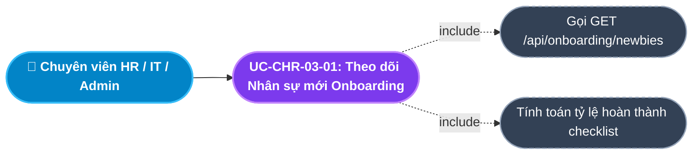
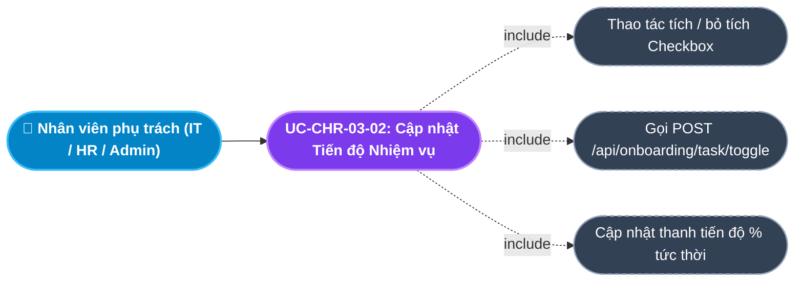
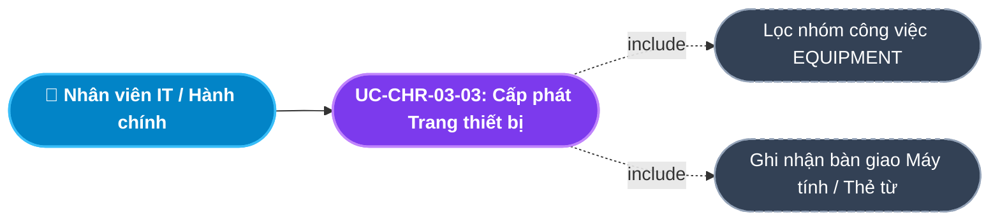
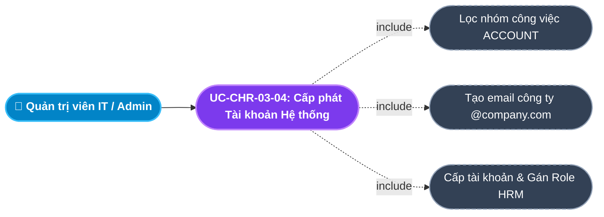
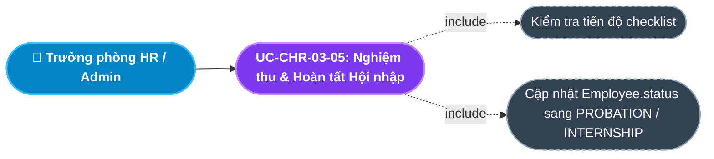
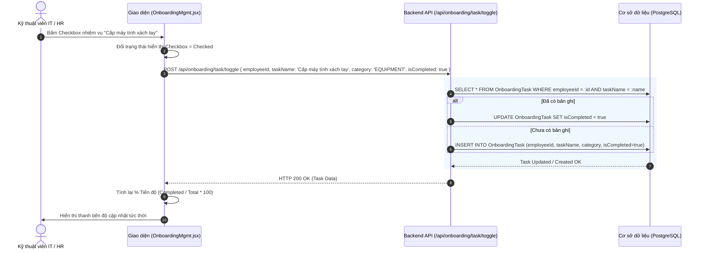
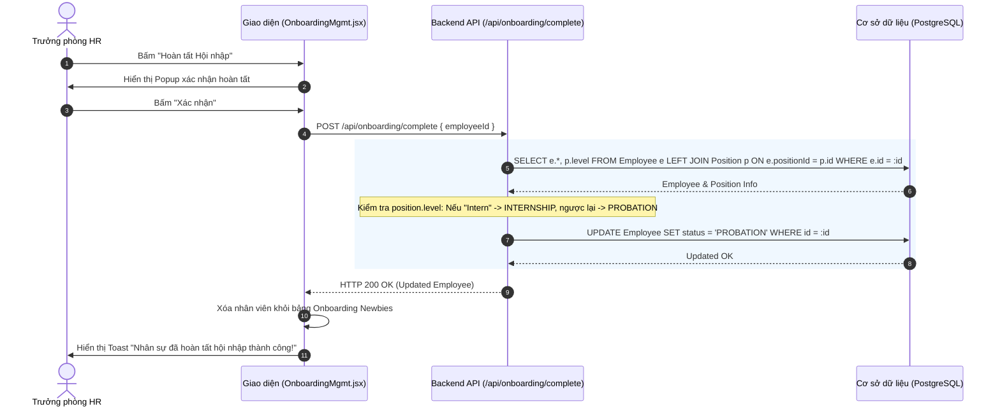

# Usecase: UC-CHR-03 - Quản lý Quy trình Hội nhập Nhân sự (Employee Onboarding Management)

## 1. Giới thiệu chức năng
- **Mục đích**: Số hóa toàn diện quy trình chuẩn bị và đón tiếp nhân sự mới (Newbies) gia nhập công ty. Điều phối nhiệm vụ liên phòng ban giữa HR (Hợp đồng, hồ sơ), IT (Cấp máy tính, email công ty, tài khoản phần mềm), Hành chính Admin (Bàn giao bàn ghế, thẻ từ ra vào) và Quản lý trực tiếp (Đào tạo hội nhập văn hóa, quy chế doanh nghiệp). Giúp người mới hòa nhập nhanh chóng và chuyên nghiệp.
- **Actor (Tác nhân)**: Chuyên viên Tuyển dụng/HR Admin (Recruiter/HR), Kỹ thuật viên CNTT (IT Support), Quản lý trực tiếp (Line Manager), Nhân sự mới (Newbie).
- **Điều kiện tiên quyết**: Nhân sự mới đã được tiếp nhận thành công từ Module Tuyển dụng với trạng thái `ONBOARDING`.

### Danh mục các chức năng con (Sub-features):
1. **UC-CHR-03-01: Theo dõi Danh sách Nhân sự mới Onboarding (View Newbies Pipeline)**: Quản lý danh sách các nhân viên mới vào làm đang ở trạng thái `ONBOARDING`, hiển thị tiến độ hoàn thành các nhóm công việc chuẩn bị.
2. **UC-CHR-03-02: Cập nhật Tiến độ Nhiệm vụ Hội nhập (Toggle Onboarding Tasks)**: Đánh dấu hoàn thành / chưa hoàn thành (Check/Uncheck) cho từng đầu việc theo 4 danh mục chuẩn: Thiết bị (`EQUIPMENT`), Tài khoản (`ACCOUNT`), Hợp đồng (`CONTRACT`), Đào tạo (`TRAINING`).
3. **UC-CHR-03-03: Quản lý & Cấp phát Trang thiết bị làm việc (Equipment Provisioning)**: Theo dõi việc bàn giao laptop/PC, màn hình phụ, bàn phím, thẻ từ nhân viên và chữ ký số.
4. **UC-CHR-03-04: Cấp phát Tài khoản Hệ thống & Phân quyền (System Accounts Provisioning)**: Tạo và kích hoạt email công vụ (@company.com), tài khoản chat nội bộ (Slack/Teams) và tài khoản đăng nhập HRM.
5. **UC-CHR-03-05: Nghiệm thu & Hoàn tất Hội nhập (Complete Onboarding & Promote Status)**: Kiểm tra 100% nhiệm vụ đã hoàn thành, tự động nâng cấp trạng thái nhân viên từ `ONBOARDING` sang `PROBATION` (Thử việc) hoặc `INTERNSHIP` (Thực tập).

---

## 2. Dữ liệu nghiệp vụ đầu vào (Input Data & Parameters)

### 2.1. Cấu trúc Nhiệm vụ Hội nhập (Onboarding Task Data)
| Tên trường | Kiểu dữ liệu | Tính chất | Ý nghĩa nghiệp vụ & Ràng buộc |
|---|---|---|---|
| `Nhân viên` (employeeId) | UUID / Chuỗi | Bắt buộc | Định danh nhân sự mới đang trong giai đoạn Onboarding. |
| `Tên nhiệm vụ` (taskName) | Chuỗi (String) | Bắt buộc | Tiêu đề công việc cần chuẩn bị (VD: "Cấp máy tính xách tay", "Tạo hòm thư công vụ"). |
| `Danh mục công việc` (category) | Enum | Bắt buộc | `EQUIPMENT` (Trang thiết bị), `ACCOUNT` (Tài khoản hệ thống), `CONTRACT` (Hồ sơ pháp lý), `TRAINING` (Đào tạo ban đầu). |
| `Trạng thái hoàn thành` (isCompleted) | Boolean | Bắt buộc | `true` (Đã hoàn tất) hoặc `false` (Đang chuẩn bị). Mặc định là `false`. |

### 2.2. Danh mục Checklist Onboarding Mặc định cho Nhân sự Mới
| Danh mục | Đầu việc chuẩn bị tiêu biểu | Đơn vị chịu trách nhiệm |
|---|---|---|
| **EQUIPMENT** | Cấp phát Laptop / PC cấu hình theo vị trí | Phòng Công nghệ thông tin (IT) |
| | Cấp Thẻ từ nhân viên & Chìa khóa tủ cá nhân | Phòng Hành chính - Quản trị |
| **ACCOUNT** | Khởi tạo Email doanh nghiệp (Google Workspace / M365) | Phòng IT |
| | Cấp tài khoản Phần mềm HRM & Phân quyền truy cập | Quản trị hệ thống (Admin) |
| **CONTRACT** | Ký kết hợp đồng thử việc & Bàn giao bản cứng | Phòng Nhân sự (C&B) |
| | Thu nhận đầy đủ hồ sơ nhân sự (CCCD, Sổ hộ khẩu, Bằng cấp) | Phòng Nhân sự |
| **TRAINING** | Giới thiệu văn hóa công ty & Quy chế nội bộ | HR / Phòng Đào tạo |
| | Bổ nhiệm Mentor / Người hướng dẫn chuyên môn 1-1 | Trưởng bộ phận chuyên môn |

---

## 3. Quy tắc nghiệp vụ (Business Rules)

| Mã Quy tắc | Tình huống nghiệp vụ | Cách hệ thống xử lý | Thông báo hiển thị |
|---|---|---|---|
| **BR-CHR-03-01** | **Tự động khởi tạo Checklist Hội nhập**: Nhân viên mới được tiếp nhận từ Tuyển dụng hoặc tạo mới với status `ONBOARDING`. | Hệ thống tự động sinh bộ checklist gồm 4 nhóm nhiệm vụ (`EQUIPMENT`, `ACCOUNT`, `CONTRACT`, `TRAINING`) gắn liền với `employeeId`. | "Đã tự động khởi tạo danh mục nhiệm vụ hội nhập cho nhân sự mới." |
| **BR-CHR-03-02** | **Cập nhật Tiến độ Thời gian thực (Real-time Progress Calculation)**: Người dùng tích/bỏ tích một nhiệm vụ. | Gọi API `POST /api/onboarding/task/toggle`. Hệ thống tính lại tỷ lệ phần trăm: `Progress = (Completed Tasks / Total Tasks) * 100%`. | "Đã cập nhật tiến độ công việc!" |
| **BR-CHR-03-03** | **Điều kiện Nghiệm thu Hoàn tất Hội nhập**: Nhấn nút "Hoàn tất Hội nhập" cho nhân viên. | Kiểm tra toàn bộ checklist: Khuyến nghị 100% nhiệm vụ đã hoàn thành. Nếu chưa xong hết $\rightarrow$ Hiển thị cảnh báo xác nhận của quản lý trước khi tiếp tục. | "Các nhiệm vụ chưa hoàn thành 100%. Bạn có chắc chắn muốn kết thúc hội nhập?" |
| **BR-CHR-03-04** | **Tự động chuyển đổi Trạng thái theo Cấp bậc (Smart Status Transition)**: Bấm "Hoàn tất Hội nhập". | Backend kiểm tra chức danh `employee.position.level`:  - Nếu là `Intern` $\rightarrow$ Đổi `status = 'INTERNSHIP'`. - Ngược lại $\rightarrow$ Đổi `status = 'PROBATION'` (Thử việc). | "Nhân sự đã hoàn tất hội nhập và chính thức bước vào giai đoạn Thử việc!" |
| **BR-CHR-03-05** | **Rời khỏi Pipeline Onboarding**: Sau khi hoàn tất hội nhập. | Nhân viên tự động rời khỏi màn hình Quản lý Onboarding và chuyển sang theo dõi tại Bảng Danh sách Nhân viên chính thức. | "Hồ sơ đã được bàn giao sang Danh sách Nhân viên theo dõi thử việc." |

---

## 4. Đặc tả chi tiết các Use Case chức năng con (Sub-Use Cases Specification)

---

### 4.1. UC-CHR-03-01: Theo dõi Danh sách Nhân sự mới Onboarding (View Newbies Pipeline)

#### Sơ đồ Use Case:

#### Bảng đặc tả nghiệp vụ:

| STT | Hạng mục | Nội dung chi tiết |
|:---:|---|---|
| **1** | **Thông tin chung** | - **UC ID**: `UC-CHR-03-01` - **UC Name**: Theo dõi Danh sách Nhân sự mới Onboarding (View Newbies Pipeline) - **Actor**: Chuyên viên HR, IT Support, Quản lý Nhân sự - **Mục tiêu**: Nắm bắt toàn bộ nhân sự mới gia nhập đang chuẩn bị đi làm và theo dõi tiến độ chuẩn bị của các bộ phận liên quan. - **Mô tả**: Hiển thị bảng danh sách các nhân viên có `status = 'ONBOARDING'`, bao gồm thông tin họ tên, vị trí, phòng ban, ngày vào làm (`joinDate`), và thanh tiến độ hoàn thành nhiệm vụ (VD: `3/4 nhiệm vụ - 75%`). - **Priority**: High |
| **2** | **Trigger** | Người dùng truy cập menu **"Quy trình Hội nhập"** (`/internal/onboarding`). |
| **3** | **Pre-condition** | Người dùng có quyền truy cập hệ thống nội bộ. |
| **4** | **Post-condition** | Toàn bộ nhân sự mới cần chuẩn bị hiển thị đầy đủ kèm thanh tiến độ trực quan. |
| **5** | **Main Flow** | 1. Người dùng mở trang Quản lý Onboarding. 2. Hệ thống gọi API `GET /api/onboarding/newbies`. 3. Backend truy vấn CSDL lấy danh sách các bản ghi `Employee` có `status = 'ONBOARDING'`, kèm theo quan hệ `department`, `position`, và `onboardingTasks`. 4. Giao diện tính toán: `completedCount` trên `totalCount`, hiển thị thanh tiến độ phần trăm (Progress Bar) cho từng nhân viên. 5. Người dùng xem chi tiết tình trạng chuẩn bị của từng người. |
| **6** | **Alternative / Exception Flow** | - **AF-01 (Không có nhân sự mới)**: Không có ai đang ở trạng thái ONBOARDING $\rightarrow$ Hiển thị thông báo *"Hiện tại không có nhân sự mới cần chuẩn bị hội nhập"*. |
| **7** | **Business Rules & Validation** | - Chỉ nạp các nhân viên có `status = 'ONBOARDING'`. |
| **8** | **Acceptance Criteria** | - **AC-01**: Hiển thị đúng danh sách nhân viên mới tiếp nhận. - **AC-02**: Thanh tiến độ hiển thị đúng tỷ lệ phần trăm số việc đã hoàn thành. |

---

### 4.2. UC-CHR-03-02: Cập nhật Tiến độ Nhiệm vụ Hội nhập (Toggle Onboarding Tasks)

#### Sơ đồ Use Case:

#### Bảng đặc tả nghiệp vụ:

| STT | Hạng mục | Nội dung chi tiết |
|:---:|---|---|
| **1** | **Thông tin chung** | - **UC ID**: `UC-CHR-03-02` - **UC Name**: Cập nhật Tiến độ Nhiệm vụ Hội nhập (Toggle Onboarding Tasks) - **Actor**: Kỹ thuật viên IT, Chuyên viên HR, Nhân viên Hành chính - **Mục tiêu**: Ghi nhận việc hoàn thành từng khâu chuẩn bị cụ thể cho nhân viên mới một cách nhanh chóng. - **Mô tả**: Người dùng nhấn vào ô Checkbox của một đầu việc (VD: "Cấp máy tính", "Ký HĐ thử việc"). Hệ thống tự động lưu trạng thái vào CSDL và cập nhật thanh tiến độ tức thì. - **Priority**: High |
| **2** | **Trigger** | Người dùng nhấp chuột vào ô Checkbox cạnh tên nhiệm vụ trên bảng hoặc modal Onboarding. |
| **3** | **Pre-condition** | Nhân viên đang ở trạng thái `ONBOARDING`. |
| **4** | **Post-condition** | 1. Trạng thái `isCompleted` của nhiệm vụ trong CSDL đổi thành `true` hoặc `false`. 2. Thanh tiến độ phần trăm tự động nhảy số. 3. Hiển thị thông báo cập nhật thành công. |
| **5** | **Main Flow** | 1. Người dùng bấm vào Checkbox của một nhiệm vụ (VD: "Cấp Email công ty"). 2. Trạng thái mới được xác định: `isCompleted = !isCompleted_hiện_tại`. 3. Hệ thống gửi request `POST /api/onboarding/task/toggle` kèm `{ employeeId, taskName, category, isCompleted }`. 4. Backend tìm bản ghi `OnboardingTask`: Nếu có $\rightarrow$ Cập nhật `isCompleted`; nếu chưa có $\rightarrow$ Tạo mới bản ghi kèm trạng thái mới. 5. Backend trả về `HTTP 200 OK` kèm dữ liệu task. 6. Giao diện cập nhật giao diện Checkbox và tính toán lại thanh tiến độ của nhân viên. |
| **6** | **Alternative / Exception Flow** | - **EF-01 (Mất kết nối mạng)**: Request thất bại $\rightarrow$ Giao diện hoàn lại trạng thái Checkbox cũ và báo Toast lỗi *"Lỗi khi cập nhật tiến độ công việc"*. |
| **7** | **Business Rules & Validation** | - Cơ chế Upsert: Tự động tạo bản ghi nhiệm vụ nếu nhân viên chưa có sẵn dòng task đó trong CSDL (BR-CHR-03-02). |
| **8** | **Acceptance Criteria** | - **AC-01**: Tích vào checkbox lưu ngay lập tức không cần bấm nút Lưu. - **AC-02**: Thanh phần trăm nhảy số ngay lập tức tương ứng với số task hoàn thành. |

---

### 4.3. UC-CHR-03-03: Quản lý & Cấp phát Trang thiết bị làm việc (Equipment Provisioning)

#### Sơ đồ Use Case:

#### Bảng đặc tả nghiệp vụ:

| STT | Hạng mục | Nội dung chi tiết |
|:---:|---|---|
| **1** | **Thông tin chung** | - **UC ID**: `UC-CHR-03-03` - **UC Name**: Quản lý & Cấp phát Trang thiết bị làm việc (Equipment Provisioning) - **Actor**: Kỹ thuật viên IT, Nhân viên Hành chính Admin - **Mục tiêu**: Đảm bảo nhân sự mới có đầy đủ công cụ dụng cụ làm việc (Laptop, Màn hình, Bàn phím, Thẻ từ ra vào) ngay từ buổi sáng đầu tiên đi làm. - **Mô tả**: Theo dõi riêng danh mục công việc nhóm `EQUIPMENT` và ghi nhận xác nhận bàn giao thiết bị. - **Priority**: Medium |
| **2** | **Trigger** | Người dùng chuyển sang tab **"Trang thiết bị"** (`EquipmentProvision.jsx`) trên màn hình Onboarding. |
| **3** | **Pre-condition** | Có nhân viên mới gia nhập sắp đến ngày nhận việc. |
| **4** | **Post-condition** | Thiết bị được đánh dấu đã cấp phát và sẵn sàng tại bàn làm việc của nhân sự mới. |
| **5** | **Main Flow** | 1. Nhân viên IT mở tab Trang thiết bị. 2. Hệ thống lọc danh sách các nhiệm vụ thuộc `category = 'EQUIPMENT'`. 3. IT kiểm tra cấu hình máy tính phù hợp với chức danh (VD: Lập trình viên $\rightarrow$ Laptop 32GB RAM + Màn hình 27 inch). 4. IT hoàn tất chuẩn bị, bàn giao và bấm Check hoàn thành nhiệm vụ. 5. Hệ thống lưu vết nhiệm vụ thiết bị đã hoàn thành. |
| **6** | **Alternative / Exception Flow** | - **AF-01 (Hết thiết bị trong kho)**: IT ghi chú đề xuất mua sắm bổ sung trước ngày nhận việc của nhân sự. |
| **7** | **Business Rules & Validation** | - Thiết bị phải được kiểm tra sẵn sàng trước ngày `joinDate`. |
| **8** | **Acceptance Criteria** | - **AC-01**: Lọc hiển thị chính xác các đầu mục thiết bị của từng nhân viên mới. |

---

### 4.4. UC-CHR-03-04: Cấp phát Tài khoản Hệ thống & Phân quyền (System Accounts Provisioning)

#### Sơ đồ Use Case:

#### Bảng đặc tả nghiệp vụ:

| STT | Hạng mục | Nội dung chi tiết |
|:---:|---|---|
| **1** | **Thông tin chung** | - **UC ID**: `UC-CHR-03-04` - **UC Name**: Cấp phát Tài khoản Hệ thống & Phân quyền (System Accounts Provisioning) - **Actor**: Quản trị viên IT, Admin hệ thống - **Mục tiêu**: Cung cấp định danh số và quyền truy cập vào các hệ thống số của doanh nghiệp cho nhân sự mới. - **Mô tả**: Quản lý việc cấp hòm thư điện tử nội bộ, tài khoản liên lạc và kích hoạt tài khoản đăng nhập vào Cổng thông tin nhân viên (Employee Self-Service Portal). - **Priority**: High |
| **2** | **Trigger** | Người dùng truy cập tab **"Tài khoản hệ thống"** (`SystemAccounts.jsx`) trên màn hình Onboarding. |
| **3** | **Pre-condition** | Nhân viên có thông tin họ tên và phòng ban hợp lệ. |
| **4** | **Post-condition** | Tài khoản nội bộ được khởi tạo, gửi thông tin đăng nhập tạm thời qua email cá nhân của nhân viên. |
| **5** | **Main Flow** | 1. Quản trị viên IT mở tab Tài khoản hệ thống. 2. Lấy thông tin họ tên và mã nhân viên để sinh địa chỉ email theo chuẩn công ty (VD: `nam.nguyen@company.com`). 3. IT tạo tài khoản trên hệ thống email và tạo bản ghi tài khoản `Account` trên HRM. 4. IT tích chọn hoàn thành nhiệm vụ "Cấp Email" và "Cấp tài khoản HRM". 5. Hệ thống ghi nhận hoàn tất và cập nhật tiến độ hội nhập. |
| **6** | **Alternative / Exception Flow** | - **EF-01 (Trùng định dạng email)**: Email bị trùng với nhân sự cũ $\rightarrow$ Tự động thêm hậu tố số (VD: `nam.nguyen2@company.com`). |
| **7** | **Business Rules & Validation** | - Tài khoản HRM được gán vai trò ban đầu là `EMPLOYEE` để sử dụng các tính năng cơ bản (xem hồ sơ, chấm công, nộp đơn nghỉ). |
| **8** | **Acceptance Criteria** | - **AC-01**: Cấp tài khoản xong nhân viên có thể đăng nhập được vào hệ thống ngay ngày đầu tiên. |

---

### 4.5. UC-CHR-03-05: Nghiệm thu & Hoàn tất Hội nhập (Complete Onboarding & Promote Status)

#### Sơ đồ Use Case:

#### Bảng đặc tả nghiệp vụ:

| STT | Hạng mục | Nội dung chi tiết |
|:---:|---|---|
| **1** | **Thông tin chung** | - **UC ID**: `UC-CHR-03-05` - **UC Name**: Nghiệm thu & Hoàn tất Hội nhập (Complete Onboarding & Promote Status) - **Actor**: Trưởng phòng Nhân sự (HR Manager), Chuyên viên HR - **Mục tiêu**: Đóng quy trình hội nhập, xác nhận nhân sự đã được chuẩn bị đầy đủ mọi điều kiện và chính thức bắt đầu công việc. - **Mô tả**: Bấm "Hoàn tất Hội nhập". Hệ thống kiểm tra chức danh nhân viên và tự động nâng cấp trạng thái sang `PROBATION` (Thử việc) hoặc `INTERNSHIP` (Thực tập). - **Priority**: High |
| **2** | **Trigger** | Người dùng bấm nút **"Hoàn tất Hội nhập"** tại dòng nhân sự mới trên bảng Onboarding. |
| **3** | **Pre-condition** | Nhân viên đang ở trạng thái `ONBOARDING`. |
| **4** | **Post-condition** | 1. `Employee.status` chuyển thành `PROBATION` (hoặc `INTERNSHIP`). 2. Nhân viên rời khỏi màn hình Onboarding. 3. Hồ sơ nhân viên chính thức kích hoạt chu trình chấm công và tính lương. |
| **5** | **Main Flow** | 1. Người dùng bấm **"Hoàn tất Hội nhập"**. 2. Hệ thống kiểm tra tiến độ: Nếu chưa hoàn tất 100% $\rightarrow$ Hiển thị hộp thoại xác nhận tiếp tục. 3. Người dùng xác nhận đồng ý hoàn tất. 4. Giao diện gửi request `POST /api/onboarding/complete` kèm `{ employeeId }`. 5. Backend truy vấn vị trí `position.level`: Nếu level là "Intern" $\rightarrow$ `nextStatus = 'INTERNSHIP'`; ngược lại $\rightarrow$ `nextStatus = 'PROBATION'`. 6. Backend cập nhật `Employee.status = nextStatus` và trả về `HTTP 200 OK`. 7. Giao diện báo Toast: *"Nhân sự đã hoàn tất hội nhập thành công!"*, đồng thời nạp lại danh sách. |
| **6** | **Alternative / Exception Flow** | - **AF-01 (Người dùng hủy bỏ xác nhận)**: Hộp thoại đóng lại, nhân viên tiếp tục ở trạng thái `ONBOARDING` để hoàn thiện các đầu việc còn thiếu. |
| **7** | **Business Rules & Validation** | - Cơ chế phân loại trạng thái thông minh theo cấp bậc chức danh (BR-CHR-03-04). - Tự động bàn giao hồ sơ sang bộ phận quản lý thử việc (BR-CHR-03-05). |
| **8** | **Acceptance Criteria** | - **AC-01**: Bấm hoàn tất đổi đúng trạng thái sang PROBATION (nhân viên thường) hoặc INTERNSHIP (thực tập sinh). - **AC-02**: Nhân viên biến mất khỏi danh sách Onboarding sau khi hoàn tất. |

---

## 5. Sơ đồ tuần tự nghiệp vụ (Sequence Diagrams)

### 5.1. Luồng Tích chọn Tiến độ Nhiệm vụ (UC-CHR-03-02)

### 5.2. Luồng Nghiệm thu & Chuyển đổi Trạng thái Thử việc (UC-CHR-03-05)

---

## 6. Ma trận kịch bản kiểm thử (Test Scenarios & Acceptance Matrix)

| Mã kịch bản | Use Case liên quan | Điều kiện kiểm thử | Các bước thực hiện | Kết quả mong đợi (Expected Outcome) | Đánh giá |
|---|---|---|---|---|:---:|
| **TC-CHR-03-01** | UC-CHR-03-01 | Xem danh sách Newbies | Truy cập màn hình Onboarding | Hiển thị đúng các nhân viên có `status = 'ONBOARDING'`, kèm thanh tiến độ công việc. | **Pass** |
| **TC-CHR-03-02** | UC-CHR-03-02 | Tích chọn nhiệm vụ | Bấm chọn 1 task chưa hoàn thành | Task đổi sang trạng thái Checked, tỷ lệ % tiến độ tăng lên tương ứng. | **Pass** |
| **TC-CHR-03-03** | UC-CHR-03-02 | Bỏ tích chọn nhiệm vụ | Bấm bỏ chọn 1 task đã hoàn thành | Task đổi sang Unchecked, tỷ lệ % tiến độ giảm xuống tương ứng. | **Pass** |
| **TC-CHR-03-04** | UC-CHR-03-05 | Hoàn tất hội nhập nhân viên thường | Bấm "Hoàn tất Hội nhập" cho nhân viên vị trí "Staff" $\rightarrow$ Xác nhận | `Employee.status` chuyển thành `PROBATION`, nhân viên rời khỏi màn hình Onboarding. | **Pass** |
| **TC-CHR-03-05** | UC-CHR-03-05 | Hoàn tất hội nhập Thực tập sinh | Bấm "Hoàn tất Hội nhập" cho nhân viên vị trí có level "Intern" $\rightarrow$ Xác nhận | `Employee.status` chuyển thành `INTERNSHIP`. | **Pass** |
