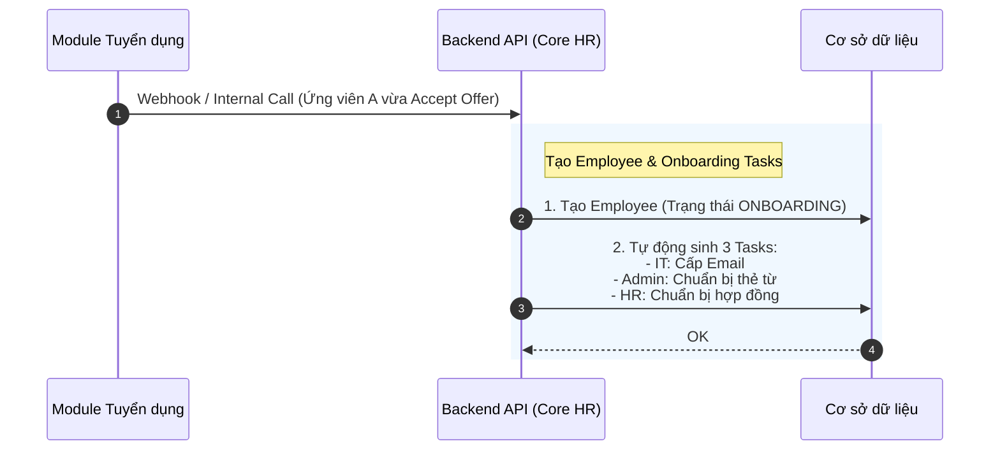
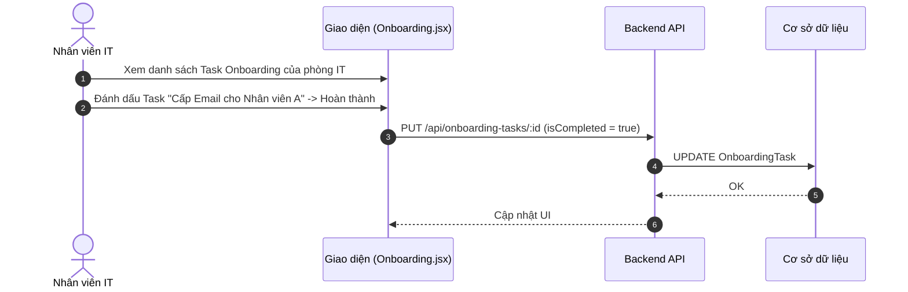

# Đặc tả chức năng: Quy trình Hội nhập (Onboarding Tasks)

## 1. Giới thiệu chức năng
Quy trình giúp phối hợp giữa các phòng ban (IT, Admin, HR) để chuẩn bị các điều kiện cần thiết (Máy tính, Email, Đồng phục) trước khi nhân viên mới bắt đầu ngày làm việc đầu tiên.

## 2. Các quy tắc nghiệp vụ cốt lõi
- **Auto-Generate:** Các nhiệm vụ (Tasks) được tự động sinh ra dựa trên Role/Position của nhân viên mới thay vì HR phải nhập tay từng cái.
- **Track Progress:** Đảm bảo tất cả các Task phải chuyển sang trạng thái `isCompleted = true` trước ngày Join Date của nhân viên.

## 3. Sơ đồ luồng chi tiết (Sequence Diagrams)

### 3.1. Luồng Tự động sinh Task Onboarding
Được trigger sau khi Ứng viên nhận việc (Auto-provisioning từ Module Tuyển dụng).

### 3.2. Luồng IT/Admin cập nhật trạng thái Task

