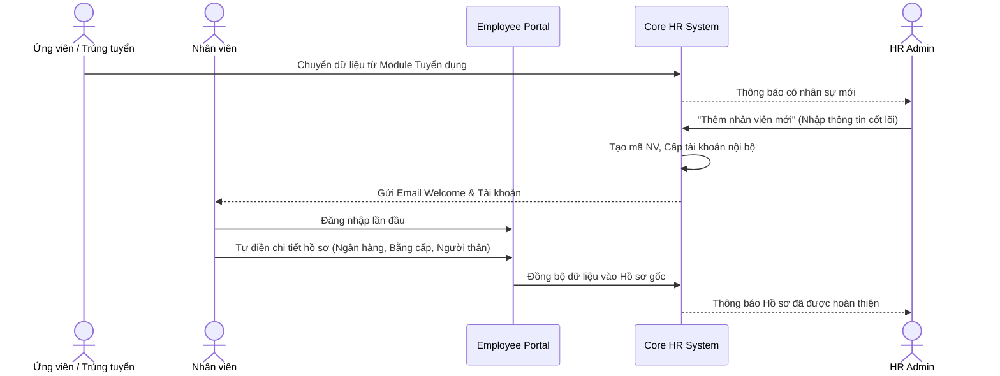
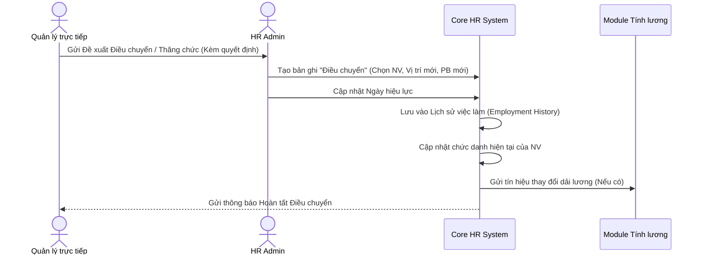

# TÀI LIỆU PHÂN TÍCH NGHIỆP VỤ - MODULE QUẢN LÝ NHÂN SỰ (CORE HR)

## 1. Tổng quan module
- **Mục tiêu nghiệp vụ:** Trái tim của hệ thống HRM. Nơi lưu trữ Single Source of Truth (Nguồn dữ liệu thật duy nhất) về toàn bộ hồ sơ nhân viên, hợp đồng và quá trình hội nhập.
- **Giá trị mang lại:** Xóa bỏ hồ sơ giấy, tự động hóa nhắc nhở, quản lý minh bạch lộ trình công danh và quy trình nghỉ việc chuyên nghiệp.
- **Phạm vi (In-scope):** Quản lý Hồ sơ, Hợp đồng lao động, Lịch sử việc làm, Điều chuyển công tác, Quy trình Nghỉ việc.
- **Các bên liên quan (Stakeholders):** C&B (Chuyên viên Lương thưởng), HR Admin, Nhân viên (Employee), Quản lý trực tiếp (Line Manager).

---

## 2. Cấu trúc dữ liệu chính
Module này bao gồm các thực thể (Entities) cốt lõi:
1. **Employee (Nhân viên):** Hồ sơ thông tin cá nhân, phòng ban trực thuộc, vị trí công tác, lịch sử việc làm.
2. **Contract (Hợp đồng):** Lưu trữ các loại hợp đồng (Thử việc, Chính thức, Thời vụ), mức lương cơ bản và thời hạn.
3. **OnboardingTask (Nhiệm vụ hội nhập):** Các công việc cần chuẩn bị cho người mới.
4. **Transfer (Điều chuyển):** Ghi nhận lịch sử thay đổi vị trí, phòng ban, hoặc thăng tiến của nhân viên.
5. **Termination (Nghỉ việc):** Lưu trữ lý do nghỉ việc, ngày làm việc cuối cùng và quy trình bàn giao tài sản.

---

## 3. Luồng Nghiệp vụ Chi tiết (Business Flows)

### 3.1. Luồng Quy trình Tiếp nhận & Cập nhật Hồ sơ (HR-01 & HR-02)

Quy trình này áp dụng khi có một nhân sự mới chuẩn bị gia nhập công ty hoặc khi nhân viên tự cập nhật thông tin.



### 3.2. Luồng Quy trình Ký kết Hợp đồng Lao động (HR-03)

Quản lý vòng đời hợp đồng, từ thử việc đến chính thức, và tự động nhắc nhở khi sắp hết hạn.

```mermaid
flowchart TD
    A[Bắt đầu làm việc] --> B[Ký Hợp đồng Thử việc 2 tháng]
    B --> C{Đánh giá Thử việc}
    C -- "Không đạt" --> D[Thanh lý HĐ Thử việc / Nghỉ việc]
    C -- "Đạt" --> E[Ký Hợp đồng Xác định thời hạn (1 năm)]
    E --> F[Hệ thống đếm ngược thời gian]
    F -- "Trước 30 ngày hết hạn" --> G[Gửi Cảnh báo cho HR & Quản lý]
    G --> H{Gia hạn?}
    H -- "Có" --> I[Ký Hợp đồng Mới (3 năm / Vô thời hạn)]
    H -- "Không" --> J[Làm thủ tục Nghỉ việc]
```

### 3.3. Luồng Quy trình Điều chuyển Công tác / Thăng tiến (HR-04)

Ghi nhận sự thay đổi về chức vụ hoặc phòng ban, có ảnh hưởng trực tiếp đến quyền truy cập và bảng lương.



### 3.4. Luồng Quy trình Báo giảm & Nghỉ việc (Offboarding) (HR-05)

Đảm bảo nhân sự rời đi một cách chuyên nghiệp, thu hồi đủ tài sản và chốt lương hợp lý.

```mermaid
flowchart TD
    A[Nhân viên nộp Đơn xin nghỉ] --> B{Quản lý duyệt?}
    B -- "Từ chối" --> C[Tiếp tục làm việc]
    B -- "Đồng ý" --> D[Chuyển đến HR Admin]
    D --> E[HR "Khởi tạo Nghỉ việc" trên hệ thống]
    E --> F[Tạo Check-list Bàn giao]
    F --> G[Bàn giao Tài sản & Tài liệu]
    F --> H[IT Khóa tài khoản Email/Hệ thống]
    G & H --> I{Hoàn tất Checklist?}
    I -- "Chưa" --> J[Nhắc nhở tự động]
    I -- "Rồi" --> K[Thanh lý Hợp đồng & Chốt lương tháng cuối]
    K --> L((Chuyển trạng thái: ĐÃ NGHỈ VIỆC))
```
