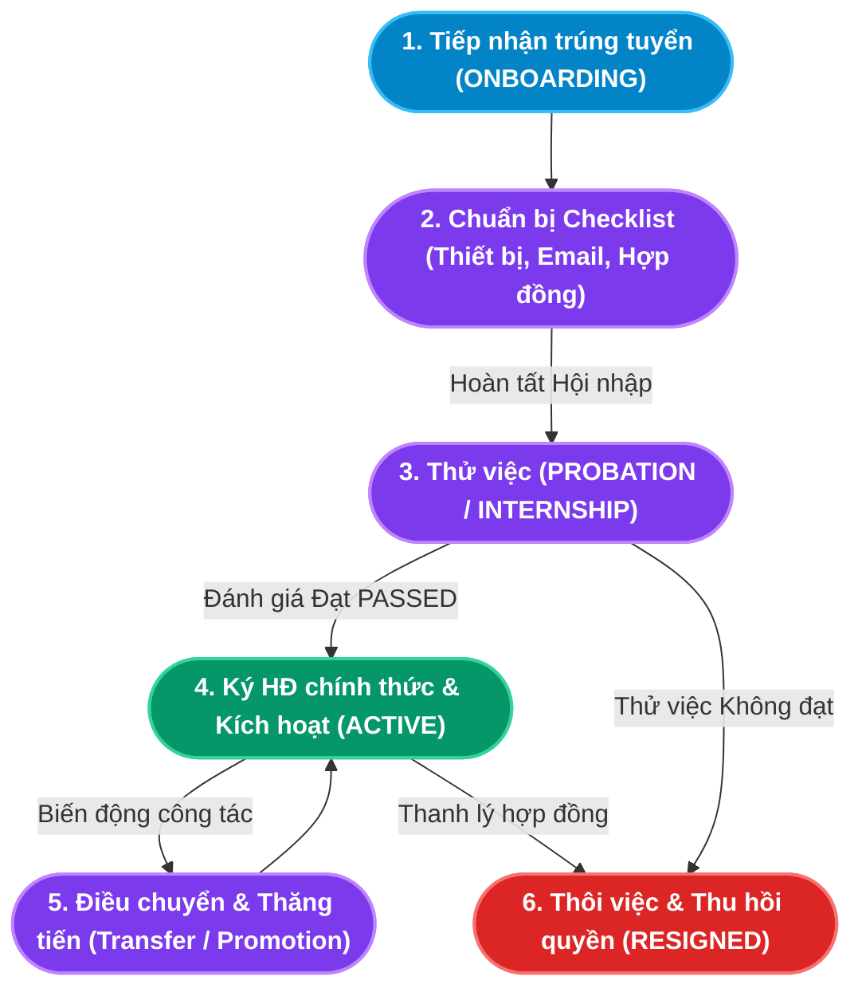

# TÀI LIỆU PHÂN TÍCH NGHIỆP VỤ - MODULE QUẢN LÝ NHÂN SỰ (CORE HR)

## 1. Giới thiệu tổng quan Module
**Module Quản lý Nhân sự (Core HR)** là "trái tim" và nền tảng dữ liệu cốt lõi của toàn bộ hệ thống HRM. Nơi đây đóng vai trò là **Nguồn dữ liệu thật duy nhất (Single Source of Truth - SSOT)**, lưu trữ toàn diện hồ sơ lý lịch, cơ cấu công tác, hồ sơ hợp đồng, các biến động việc làm và quy trình hội nhập của từng cá nhân trong tổ chức.

Module Core HR đóng vai trò trung tâm điều phối thông tin:
- **Tiếp nhận dữ liệu đầu vào**: Nhận thông tin ứng viên trúng tuyển tự động từ **Module Tuyển dụng (Recruitment & ATS)** thông qua cơ chế *Auto-provisioning*.
- **Cung cấp dữ liệu gốc đầu ra**:
  - Cung cấp danh sách nhân viên hoạt động (`ACTIVE`, `PROBATION`) cho **Module Chấm công** và **Module Nghỉ phép / OT**.
  - Cung cấp Mức lương cơ bản (`baseSalary`) từ Hợp đồng lao động, thông tin Số tài khoản ngân hàng, Mã số thuế và Người phụ thuộc cho **Module Tiền lương (Payroll)**.
  - Cung cấp cơ cấu chức danh và phòng ban cho **Module Đánh giá KPI & Performance**.

### Đối tượng sử dụng (Actors):
1. **Chuyên viên Nhân sự / C&B (HR Admin / C&B Specialist)**: Quản lý hồ sơ nhân viên, soạn thảo và ký kết hợp đồng lao động, theo dõi hạn hợp đồng, cấu hình bảo hiểm và thuế.
2. **Kỹ thuật viên CNTT / Quản trị hệ thống (IT Support / Admin)**: Cấp phát trang thiết bị (Laptop, PC, Màn hình), khởi tạo hòm thư điện tử và phân quyền tài khoản phần mềm.
3. **Trưởng phòng / Quản lý trực tiếp (Line Manager)**: Đề xuất điều chuyển công tác, thăng chức, đánh giá kết quả thử việc và hướng dẫn hội nhập cho nhân viên mới.
4. **Nhân viên (Employee)**: Tra cứu hồ sơ cá nhân, tự cập nhật thông tin người thân/bằng cấp qua Cổng thông tin tự phục vụ (Self-Service Portal).

---

## 2. Kiến trúc Luồng Vòng đời Nhân sự (Employee Lifecycle Architecture)

---

## 3. Ma trận Phân rã Chức năng Chi tiết (Functional Breakdown Matrix)

Hệ thống Quản lý Nhân sự (Core HR) bao gồm **3 nhóm chức năng trụ cột** với tổng cộng **15 Use Case con (Sub-Use Cases)** được chuẩn hóa toàn diện:

| Nhóm chức năng (Epic) | Mã Use Case | Tên Chức năng Con (Sub-Use Case) | Actor chính | Endpoint Backend |
|---|---|---|---|---|
| **1. Quản lý Hồ sơ** *(Employee Profile)* | `UC-CHR-01-01` | Thêm mới hồ sơ Nhân viên (Add Employee Profile) | HR / Admin | `POST /api/employees` |
| | `UC-CHR-01-02` | Cập nhật thông tin chi tiết Nhân viên (Update Profile) | HR / C&B | `PUT /api/employees/:id` |
| | `UC-CHR-01-03` | Tra cứu, Tìm kiếm & Lọc danh bạ Nhân sự (Search & Filter) | Toàn hệ thống | `GET /api/employees` |
| | `UC-CHR-01-04` | Điều chuyển công tác & Thăng chức (Transfer & Promotion) | HR Manager | `POST /api/employees/:id/transfer` |
| | `UC-CHR-01-05` | Tiếp nhận thôi việc & Xử lý Nghỉ việc (Offboarding) | HR Manager | `POST /api/employees/:id/terminate` |
| **2. Quản lý Hợp đồng** *(Labor Contracts)* | `UC-CHR-02-01` | Tạo mới Hợp đồng lao động (Create Labor Contract) | Chuyên viên C&B | `POST /api/contracts` |
| | `UC-CHR-02-02` | Đánh giá Thử việc & Kích hoạt Chính thức (Active Transition)| Chuyên viên C&B | `POST /api/contracts` (PASSED) |
| | `UC-CHR-02-03` | Tra cứu, Lọc & Theo dõi Hạn Hợp đồng (Track Expiry) | Chuyên viên C&B | `GET /api/contracts` |
| | `UC-CHR-02-04` | Gia hạn Hợp đồng lao động (Contract Renewal) | Chuyên viên C&B | `POST /api/contracts` |
| | `UC-CHR-02-05` | Chấm dứt & Xóa Hợp đồng lao động (Terminate/Delete) | Chuyên viên C&B | `DELETE /api/contracts/:id` |
| **3. Quy trình Hội nhập** *(Onboarding Tasks)* | `UC-CHR-03-01` | Theo dõi Danh sách Nhân sự mới Onboarding (View Newbies) | HR / IT / Admin | `GET /api/onboarding/newbies` |
| | `UC-CHR-03-02` | Cập nhật Tiến độ Nhiệm vụ Hội nhập (Toggle Tasks) | IT / HR / Admin | `POST /api/onboarding/task/toggle` |
| | `UC-CHR-03-03` | Quản lý & Cấp phát Trang thiết bị (Equipment Provision) | IT Support | Checklist EQUIP |
| | `UC-CHR-03-04` | Cấp phát Tài khoản Hệ thống (Accounts Provisioning) | IT / Admin | Checklist ACCOUNT |
| | `UC-CHR-03-05` | Nghiệm thu & Hoàn tất Hội nhập (Complete Onboarding) | HR Manager | `POST /api/onboarding/complete` |

---

## 4. Danh mục Hồ sơ Phân tích Chi tiết (Detailed Specifications)

Vui lòng tham khảo tài liệu đặc tả chi tiết của từng chức năng con tại các liên kết dưới đây:

1. [Đặc tả Chức năng Quản lý Hồ sơ Nhân sự](file:///c:/Users/truclh/Desktop/HRM-ĐATN/docs/Tài%20liệu%20phân%20tích%20nghiệp%20vụ%20từng%20module/Module%20Core%20HR/Chuc-nang-Ho-so-Nhan-su.md)
   - Đặc tả 5 Use Case con: Thêm nhân viên thủ công (tự sinh lịch sử tuyển mới), Cập nhật thông tin chuyên sâu (ngân hàng, thuế, bảo hiểm), Tìm kiếm lọc danh bạ đa chiều, Điều chuyển công tác thăng chức, và Quy trình Thôi việc nguyên tử (khóa tài khoản & đóng hợp đồng).
   - Sơ đồ tuần tự và 6 kịch bản kiểm thử mẫu.

2. [Đặc tả Chức năng Quản lý Hợp đồng Lao động](file:///c:/Users/truclh/Desktop/HRM-ĐATN/docs/Tài%20liệu%20phân%20tích%20nghiệp%20vụ%20từng%20module/Module%20Core%20HR/Chuc-nang-Hop-dong.md)
   - Đặc tả 5 Use Case con: Ký hợp đồng lao động (thử việc, 1 năm, vô thời hạn, thực tập), Đánh giá thử việc đạt tự động đổi trạng thái nhân viên sang ACTIVE, Cảnh báo hạn hợp đồng $\le 15$ ngày, Gia hạn hợp đồng nối tiếp, và Hủy/xóa hợp đồng an toàn.
   - Sơ đồ tuần tự và 5 kịch bản kiểm thử mẫu.

3. [Đặc tả Chức năng Quy trình Hội nhập Nhân sự (Onboarding)](file:///c:/Users/truclh/Desktop/HRM-ĐATN/docs/Tài%20liệu%20phân%20tích%20nghiệp%20vụ%20từng%20module/Module%20Core%20HR/Chuc-nang-Onboarding.md)
   - Đặc tả 5 Use Case con: Theo dõi Newbies Pipeline, Đánh dấu tiến độ nhiệm vụ thời gian thực qua Checkbox (4 nhóm: Thiết bị, Tài khoản, Hợp đồng, Đào tạo), Cấp phát trang thiết bị (Laptop, Thẻ từ), Cấp phát tài khoản email/HRM, Nghiệm thu hoàn tất tự động phân loại trạng thái PROBATION hoặc INTERNSHIP.
   - Sơ đồ tuần tự và 5 kịch bản kiểm thử mẫu.

---

## 5. Điểm nhấn Kỹ thuật & Nghiệp vụ (Key Business Highlights)

1. **Giao dịch Cơ sở Dữ liệu Nguyên tử (Atomic Transactions)**:
   - Các tác vụ phức tạp như *Tiếp nhận Thôi việc* (`/api/employees/:id/terminate`) và *Điều chuyển công tác* (`/api/employees/:id/transfer`) đều được thực thi trong một `prisma.$transaction`.
   - Khi thôi việc: Hệ thống đồng thời đổi trạng thái `RESIGNED`, thu hồi phòng ban/vị trí, đóng toàn bộ hợp đồng `ACTIVE` thành `TERMINATED`, tạo bản ghi `EmploymentHistory` và khóa tài khoản `Account`. Nếu một bước thất bại, toàn bộ thao tác được khôi phục nguyên trạng (Rollback).

2. **Cơ chế Chuyển đổi Trạng thái Tự động & Thông minh (Smart State Progression)**:
   - Khi tiếp nhận từ Tuyển dụng $\rightarrow$ Trạng thái là `ONBOARDING`.
   - Khi hoàn tất Checklist Hội nhập $\rightarrow$ Hệ thống tự kiểm tra cấp bậc chức vụ: Nếu là `Intern` chuyển sang `INTERNSHIP`, các cấp bậc khác chuyển sang `PROBATION`.
   - Khi ký Hợp đồng chính thức đạt yêu cầu (`PASSED`) $\rightarrow$ Tự động kích hoạt thành `ACTIVE`.
   - Giúp chuyên viên C&B không bao giờ phải điều chỉnh trạng thái nhân sự bằng tay.

3. **Nguyên tắc Hợp đồng Độc quyền (Single Active Contract Constraint)**:
   - Tại mọi thời điểm, một nhân sự chỉ được sở hữu tối đa 01 Hợp đồng có trạng thái `ACTIVE`.
   - Ngăn chặn triệt để rủi ro xung đột dữ liệu lương cơ bản khi xuất bảng lương tự động hàng tháng.
