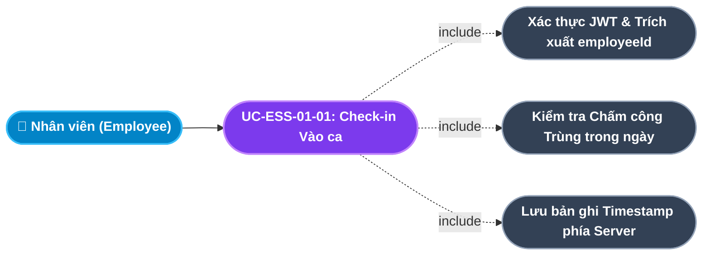
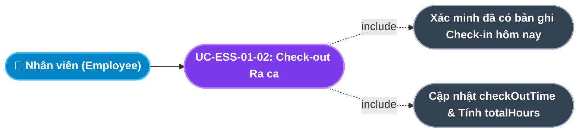
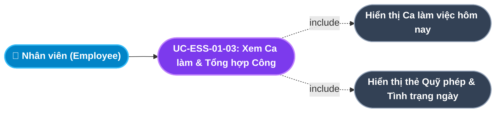
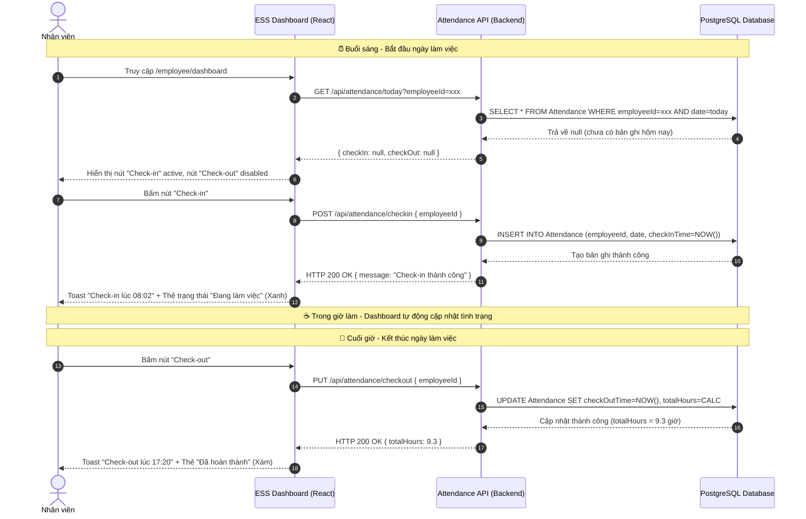

# Usecase: UC-ESS-01 - Dashboard Cá nhân & Điểm danh Trực tuyến (Personal Dashboard & Web Check-in / Check-out)

## 1. Giới thiệu chức năng
- **Mục đích**: Màn hình khởi đầu của cổng ESS, cung cấp cho nhân viên một "Trung tâm hoạt động hằng ngày" (Daily Activity Hub) vừa hiển thị tóm tắt tình trạng công việc hôm nay, vừa là nơi thực hiện điểm danh vào/ra ca làm việc trực tuyến chỉ bằng một cú nhấp chuột từ trình duyệt mà không cần máy chấm công vật lý.
- **Actor (Tác nhân)**: Nhân viên (Employee) - Toàn bộ nhân sự đang công tác tại công ty.
- **Điều kiện tiên quyết**: Nhân viên đã đăng nhập thành công vào hệ thống với vai trò `EMPLOYEE`, JWT Token chứa thông tin `employeeId` và `fullName`.

### Danh mục các chức năng con (Sub-features):
1. **UC-ESS-01-01: Điểm danh Check-in Vào ca làm việc (Online Check-in)**: Nhân viên ghi nhận thời điểm bắt đầu làm việc theo thời gian thực của máy chủ.
2. **UC-ESS-01-02: Điểm danh Check-out Kết thúc ca làm việc (Online Check-out)**: Nhân viên ghi nhận thời điểm kết thúc ca và hệ thống tự động tính tổng giờ làm.
3. **UC-ESS-01-03: Tra cứu Lịch ca làm việc & Tổng hợp Công cá nhân (Shift & Attendance Summary)**: Nhân viên xem lịch ca hiện tại và bảng tổng hợp số ngày công đã tích lũy trong tháng.

---

## 2. Dữ liệu nghiệp vụ đầu vào (Input Data & Parameters)

### 2.1. Cấu trúc Bản ghi Chấm công (Attendance Record Schema)
| Tên trường | Kiểu dữ liệu | Bắt buộc | Ràng buộc nghiệp vụ | Mô tả chi tiết |
|---|---|:---:|---|---|
| `employeeId` | UUID | Có | Foreign Key $\rightarrow$ `Employee.id`, lấy từ JWT | Định danh nhân viên thực hiện điểm danh. |
| `date` | Date | Có | Mặc định ngày hiện tại theo múi giờ `UTC+7` | Ngày chấm công. |
| `checkInTime` | DateTime | Không | Set khi gọi API Check-in | Thời điểm vào ca (HH:MM:SS). |
| `checkOutTime` | DateTime | Không | Set khi gọi API Check-out | Thời điểm ra ca (HH:MM:SS). |
| `totalHours` | Decimal | Không | Tự tính: `checkOutTime - checkInTime` | Tổng giờ làm thực tế trong ngày. |
| `status` | Enum | Có | `ON_TIME`, `LATE`, `EARLY_LEAVE`, `ABSENT` | Trạng thái chấm công được tính tự động dựa trên giờ vào/ra so với ca làm. |

### 2.2. Thẻ Thông tin Tổng hợp Dashboard
| Thẻ thông tin | Nguồn dữ liệu | Giá trị hiển thị | Màu trạng thái |
|---|---|---|---|
| **Đồng hồ thời gian thực** | `Date()` phía client, cập nhật mỗi giây | HH:MM:SS dạng số lớn | Tím xanh (Primary) |
| **Trạng thái hôm nay** | `Attendance` ngày hiện tại | Chưa Check-in / Đang làm việc / Đã hoàn thành | Vàng / Xanh lá / Xám |
| **Quỹ phép năm** | `LeaveBalance.availableDays` | X / Y ngày (Còn lại / Tổng) | Tím xanh (Primary) |
| **Ca làm việc hôm nay** | `Shift.name`, `Shift.startTime` - `Shift.endTime` | Tên ca, Giờ bắt đầu - Giờ kết thúc | Xanh lam (Info) |

---

## 3. Quy tắc nghiệp vụ (Business Rules)

| Mã Quy tắc | Tình huống nghiệp vụ | Cách hệ thống xử lý | Thông báo hiển thị |
|---|---|---|---|
| **BR-ESS-01-01** | **Chống Chấm công Trùng lặp (Duplicate Check Prevention)**: Nhân viên bấm Check-in khi đã có bản ghi Check-in trong ngày hôm nay. | Backend truy vấn bản ghi Attendance theo `employeeId` và `date = today`. Nếu đã tồn tại `checkInTime` $\rightarrow$ Trả lỗi `HTTP 409 Conflict`. | "Bạn đã Check-in rồi! Không thể thực hiện lại!" |
| **BR-ESS-01-02** | **Ràng buộc Thứ tự Điểm danh (Ordered Check-in/out)**: Nhân viên bấm Check-out khi chưa Check-in trong ngày. | Nút Check-out bị vô hiệu hóa (`disabled`) trên giao diện khi `isCheckedIn = false`. Backend cũng từ chối nếu thiếu bản ghi Check-in. | Nút Check-out bị mờ (disabled state) - không thể bấm. |
| **BR-ESS-01-03** | **Thời gian Xác thực bởi Máy chủ (Server-side Timestamp)**: Nhân viên thao tác vào thời điểm nhất định. | Thời gian Check-in / Check-out được lưu bởi hệ thống Backend (`createdAt = now()` phía server), không phụ thuộc vào đồng hồ phía client (chống gian lận chỉnh giờ máy tính). | Thời điểm hiển thị trên thông báo thành công: *"Check-in thành công lúc HH:MM"* (giờ server). |
| **BR-ESS-01-04** | **Quyền Xem Chỉ Dữ liệu Cá nhân (Personal Data Isolation)**: Nhân viên truy cập dữ liệu chấm công của người khác. | Backend lấy `employeeId` từ JWT Token (không từ request body hay query string) để đảm bảo nhân viên chỉ thấy dữ liệu của chính mình. | HTTP 403 Forbidden nếu phát hiện ID không khớp. |

---

## 4. Đặc tả chi tiết các Use Case chức năng con (Sub-Use Cases Specification)

---

### 4.1. UC-ESS-01-01: Điểm danh Check-in Vào ca làm việc (Online Check-in)

#### Sơ đồ Use Case:

#### Bảng đặc tả nghiệp vụ:

| STT | Hạng mục | Nội dung chi tiết |
|:---:|---|---|
| **1** | **Thông tin chung** | - **UC ID**: `UC-ESS-01-01` - **UC Name**: Điểm danh Check-in Vào ca làm việc (Online Check-in) - **Actor**: Nhân viên (Employee) - **Mục tiêu**: Ghi nhận thời điểm nhân viên chính thức bắt đầu ngày làm việc một cách chính xác và an toàn. - **Mô tả**: Nhân viên truy cập Dashboard ESS, nhìn thấy đồng hồ thời gian thực và nhấn nút "Check-in" màu tím xanh. Hệ thống ghi lại thời điểm phía server và cập nhật ngay trạng thái giao diện. - **Priority**: High (Bắt buộc) |
| **2** | **Trigger** | Nhân viên nhấp nút **"Check-in"** trên màn hình Dashboard. |
| **3** | **Pre-condition** | 1. Nhân viên đã đăng nhập thành công (`isActive = true`). 2. Chưa có bản ghi Check-in nào trong ngày hôm nay cho `employeeId` này. |
| **4** | **Post-condition** | Bản ghi `Attendance` mới được tạo với `checkInTime`, trạng thái Dashboard chuyển sang "Đang làm việc" màu xanh lá, nút Check-in bị vô hiệu hóa. |
| **5** | **Main Flow** | 1. Nhân viên vào trang `/employee/dashboard`. 2. Giao diện hiển thị đồng hồ thời gian thực (cập nhật mỗi giây) và nút "Check-in" màu tím xanh nổi bật. 3. Nhân viên nhấp nút "Check-in". 4. Frontend gọi `POST /api/attendance/checkin` kèm `{ employeeId }` lấy từ localStorage (nguồn gốc JWT). 5. Backend xác thực token, kiểm tra bản ghi hôm nay chưa tồn tại. 6. Tạo bản ghi Attendance với `checkInTime = now()` (server timestamp). 7. Trả về `HTTP 200 OK`. 8. Giao diện hiển thị toast thành công: "Check-in thành công lúc HH:MM", nút Check-in chuyển sang trạng thái "Đã Check-in" (disabled, xám). |
| **6** | **Alternative / Exception Flow** | - **EF-01 (Đã Check-in rồi)**: Nhân viên tải lại trang và bấm Check-in lần hai trong ngày $\rightarrow$ Backend trả lỗi `409 Conflict`, toast lỗi: *"Bạn đã Check-in rồi!"*. - **EF-02 (Mất kết nối mạng)**: Request timeout $\rightarrow$ Toast lỗi: *"Lỗi kết nối. Vui lòng thử lại!"*, trạng thái UI không thay đổi. |
| **7** | **Business Rules & Validation** | - Thời gian do server quyết định, không tin vào đồng hồ client (BR-ESS-01-03). - Chống trùng lặp Check-in trong cùng ngày (BR-ESS-01-01). |
| **8** | **Acceptance Criteria** | - **AC-01**: Nhân viên không thể Check-in hai lần trong cùng một ngày. - **AC-02**: Thời điểm Check-in hiển thị là thời gian thực của server, không phải đồng hồ trình duyệt. |

---

### 4.2. UC-ESS-01-02: Điểm danh Check-out Kết thúc ca làm việc (Online Check-out)

#### Sơ đồ Use Case:

#### Bảng đặc tả nghiệp vụ:

| STT | Hạng mục | Nội dung chi tiết |
|:---:|---|---|
| **1** | **Thông tin chung** | - **UC ID**: `UC-ESS-01-02` - **UC Name**: Điểm danh Check-out Kết thúc ca làm việc (Online Check-out) - **Actor**: Nhân viên (Employee) - **Mục tiêu**: Ghi nhận thời điểm kết thúc ca làm việc và tự động tính tổng giờ công thực tế trong ngày. - **Mô tả**: Sau khi hoàn thành công việc trong ngày, nhân viên nhấn nút "Check-out". Hệ thống cập nhật thời gian ra ca và tính tổng giờ làm bằng cách trừ `checkOutTime - checkInTime`. - **Priority**: High (Bắt buộc) |
| **2** | **Trigger** | Nhân viên nhấp nút **"Check-out"** khi đang ở trạng thái đã Check-in. |
| **3** | **Pre-condition** | Đã có bản ghi `Attendance` ngày hôm nay với `checkInTime` hợp lệ và `checkOutTime` rỗng. |
| **4** | **Post-condition** | Bản ghi Attendance được cập nhật `checkOutTime` và `totalHours`; trạng thái Dashboard chuyển sang "Đã hoàn thành". |
| **5** | **Main Flow** | 1. Sau khi Check-in, nút "Check-out" chuyển sang màu đỏ và có thể bấm được. 2. Nhân viên bấm "Check-out" khi kết thúc ngày làm. 3. Frontend gọi `PUT /api/attendance/checkout` kèm `{ employeeId }`. 4. Backend tìm bản ghi Attendance ngày hôm nay có `checkInTime` nhưng chưa có `checkOutTime`. 5. Cập nhật `checkOutTime = now()` (server timestamp). 6. Tính `totalHours = (checkOutTime - checkInTime) / 3600`. 7. Trả về `HTTP 200 OK`. 8. Giao diện hiển thị toast: "Check-out thành công lúc HH:MM". Thẻ trạng thái chuyển sang "Đã hoàn thành". |
| **6** | **Alternative / Exception Flow** | - **EF-01 (Chưa Check-in mà bấm Check-out)**: Nút Check-out bị khóa (`disabled`) ở phía giao diện. Nếu gọi API thẳng $\rightarrow$ Backend trả lỗi `400 Bad Request`: *"Không tìm thấy bản ghi Check-in hôm nay!"*. |
| **7** | **Business Rules & Validation** | - Thứ tự bắt buộc: Check-in phải đến trước Check-out (BR-ESS-01-02). - Thời gian Check-out phải lớn hơn Check-in (chống gian lận). |
| **8** | **Acceptance Criteria** | - **AC-01**: Trường `totalHours` được tính chính xác đến 2 chữ số thập phân (VD: 8.5 giờ). - **AC-02**: Nhân viên không thể Check-out nếu chưa thực hiện Check-in trong ngày. |

---

### 4.3. UC-ESS-01-03: Tra cứu Lịch ca làm việc & Tổng hợp Công cá nhân (Shift & Monthly Attendance Summary)

#### Sơ đồ Use Case:

#### Bảng đặc tả nghiệp vụ:

| STT | Hạng mục | Nội dung chi tiết |
|:---:|---|---|
| **1** | **Thông tin chung** | - **UC ID**: `UC-ESS-01-03` - **UC Name**: Tra cứu Lịch ca làm việc & Tổng hợp Công cá nhân - **Actor**: Nhân viên (Employee) - **Mục tiêu**: Giúp nhân viên nắm rõ khung giờ ca làm trong ngày và theo dõi trực quan tình hình quỹ phép còn lại. - **Mô tả**: Dashboard tự động tải và hiển thị thẻ thông tin Ca làm việc được gán hôm nay (Tên ca, Giờ vào, Giờ ra) và thẻ Quỹ phép năm (Tổng, Đã dùng, Còn lại). - **Priority**: Medium |
| **2** | **Trigger** | Nhân viên truy cập trang `/employee/dashboard` (auto-load khi vào trang). |
| **3** | **Pre-condition** | Nhân viên đã được phòng HR gán vào một Ca làm việc chuẩn. |
| **4** | **Post-condition** | Các thẻ Dashboard hiển thị thông tin cập nhật thời gian thực. |
| **5** | **Main Flow** | 1. Dashboard tải xong, component gọi các API lấy dữ liệu cá nhân. 2. Hiển thị thẻ "Ca làm việc hôm nay": Tên ca (VD: Ca Hành chính), Khung giờ (08:00 - 17:30). 3. Hiển thị thẻ "Quỹ phép năm": Số ngày phép tổng (VD: 12), Số đã dùng và Số còn lại. 4. Hiển thị thẻ "Trạng thái hôm nay": Cập nhật động khi nhân viên Check-in/out. |
| **6** | **Alternative / Exception Flow** | - **EF-01 (Chưa được gán ca)**: Nhân viên chưa có dữ liệu ca làm $\rightarrow$ Thẻ Ca làm việc hiển thị: *"Chưa được phân công ca. Vui lòng liên hệ HR!"*. |
| **7** | **Business Rules & Validation** | - Quỹ phép lấy từ module Nghỉ phép, không tự tính trên Dashboard để tránh dữ liệu lệch. - Dữ liệu cá nhân phải được lọc theo `employeeId` từ JWT (BR-ESS-01-04). |
| **8** | **Acceptance Criteria** | - **AC-01**: Thẻ Quỹ phép hiển thị số ngày còn lại chính xác theo dữ liệu thực trong CSDL. - **AC-02**: Ca làm việc hiển thị đúng tên ca và giờ bắt đầu / kết thúc theo cấu hình của phòng HR. |

---

## 5. Sơ đồ tuần tự nghiệp vụ (Sequence Diagrams)

### 5.1. Luồng Điểm danh Check-in / Check-out Đầy đủ trong Ngày Làm việc

---

## 6. Ma trận kịch bản kiểm thử (Test Scenarios & Acceptance Matrix)

| Test ID | Chức năng con liên quan | Tiêu đề kịch bản | Dữ liệu đầu vào | Các bước thực hiện | Kết quả kỳ vọng | Mức độ |
|---|---|---|---|---|---|:---:|
| **TC-ESS-01-01** | UC-ESS-01-01 | Check-in thành công lần đầu | `employeeId`: NV001, chưa có bản ghi hôm nay | 1. Vào Dashboard. 2. Bấm Check-in. | Toast thành công, trạng thái "Đang làm việc", nút Check-in disabled. | P0 |
| **TC-ESS-01-02** | UC-ESS-01-01 | Chặn Check-in lần hai trong ngày | `employeeId`: NV001, đã có Check-in lúc 08:02 | 1. Gọi API Check-in lần 2. | Backend trả 409 Conflict, toast lỗi "Đã Check-in rồi!". | P0 |
| **TC-ESS-01-03** | UC-ESS-01-02 | Check-out thành công sau Check-in | `employeeId`: NV001, checkInTime = 08:02 | 1. Bấm Check-out lúc 17:30. 2. Kiểm tra DB. | `checkOutTime` = 17:30, `totalHours` = 9.47. | P0 |
| **TC-ESS-01-04** | UC-ESS-01-02 | Chặn Check-out khi chưa Check-in | `employeeId`: NV002, chưa Check-in | 1. Kiểm tra nút Check-out. 2. Cố gọi API. | Nút disabled trên UI, API trả 400 Bad Request. | P0 |
| **TC-ESS-01-05** | UC-ESS-01-03 | Hiển thị Ca làm việc đúng | NV001 thuộc ca Hành chính (08:00-17:30) | 1. Vào Dashboard. | Thẻ Ca hiển thị "Ca Hành chính (08:00 - 17:30)". | P1 |
| **TC-ESS-01-06** | UC-ESS-01-03 | Hiển thị Quỹ phép còn lại chính xác | NV001: Tổng 12 ngày, đã dùng 3 ngày | 1. Vào Dashboard. | Thẻ phép hiển thị "3 / 12 ngày". | P1 |
| **TC-ESS-01-07** | UC-ESS-01-01 | Xác minh Thời gian do Server quyết định | Client thao tác Check-in | 1. Bấm Check-in. 2. So sánh `checkInTime` trong DB với giờ client. | `checkInTime` trong DB là timestamp UTC từ server, không từ browser. | P1 |
