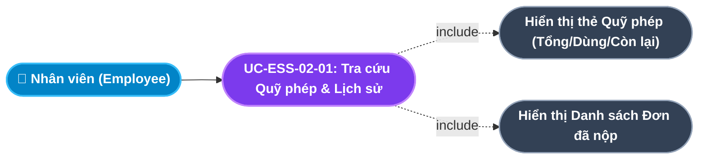
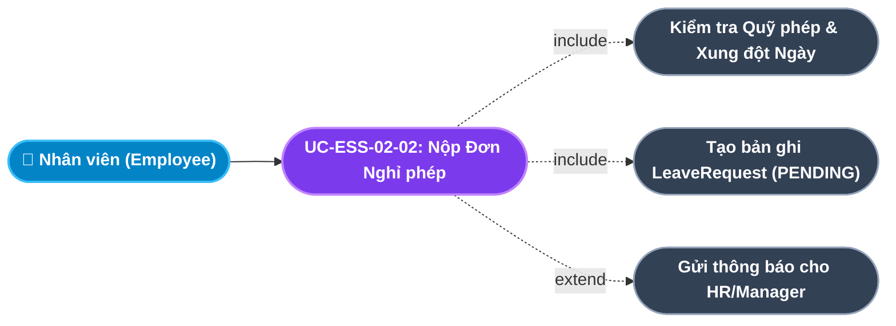
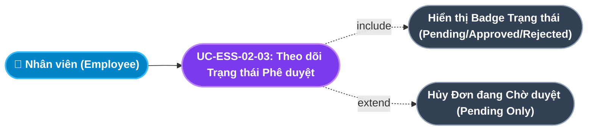
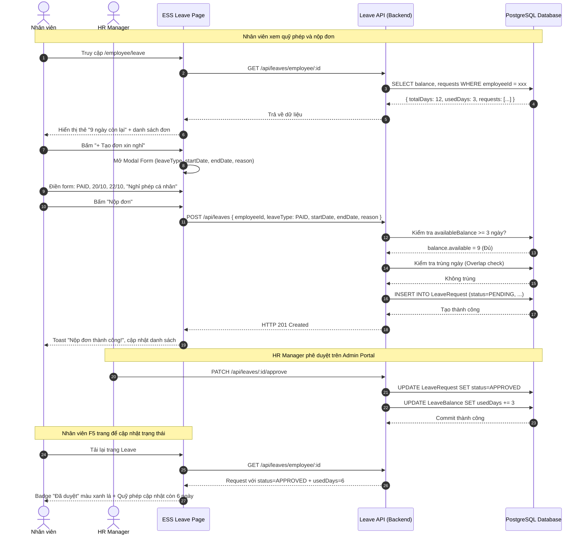

# Usecase: UC-ESS-02 - Quản lý Nghỉ phép Cá nhân (Employee Leave Self-Service)

## 1. Giới thiệu chức năng
- **Mục đích**: Trao quyền tự chủ hoàn toàn cho nhân viên trong việc quản lý vòng đời đơn nghỉ phép của mình (từ tra cứu quỹ phép, nộp đơn, đến theo dõi tiến trình phê duyệt) mà không cần phải gửi email hoặc điền tờ giấy thủ công. Giúp bộ phận HR giảm tải công việc tiếp nhận đơn từ nhân viên.
- **Actor (Tác nhân)**: Nhân viên (Employee) - Người nộp đơn; Quản lý trực tiếp (Line Manager) / HR Manager - Người duyệt đơn (tác nhân phía Admin Portal, không hiện diện trong cổng ESS nhưng ảnh hưởng đến trạng thái).
- **Điều kiện tiên quyết**: Nhân viên đã đăng nhập với vai trò `EMPLOYEE` và công ty đã cấu hình ít nhất một loại nghỉ phép (LeaveType) đang kích hoạt.

### Danh mục các chức năng con (Sub-features):
1. **UC-ESS-02-01: Tra cứu Quỹ phép Năm & Lịch sử Nghỉ phép Cá nhân (Leave Balance & History Inquiry)**: Xem số ngày phép tổng/đã dùng/còn lại theo từng loại nghỉ và toàn bộ lịch sử đơn đã nộp.
2. **UC-ESS-02-02: Tạo & Nộp Đơn xin Nghỉ phép Trực tuyến (Online Leave Application)**: Nhân viên điền form và nộp đơn yêu cầu nghỉ phép vào hệ thống với đầy đủ thông tin loại nghỉ, khoảng ngày và lý do.
3. **UC-ESS-02-03: Theo dõi Trạng thái & Lịch sử Phê duyệt Đơn nghỉ (Leave Approval Tracking)**: Xem danh sách tất cả các đơn đã nộp với trạng thái phê duyệt hiện tại và ngày phê duyệt/từ chối.

---

## 2. Dữ liệu nghiệp vụ đầu vào (Input Data & Parameters)

### 2.1. Form Nộp Đơn Xin Nghỉ phép (Leave Application Form)
| Tên trường | Kiểu dữ liệu | Bắt buộc | Ràng buộc nghiệp vụ | Mô tả |
|---|---|:---:|---|---|
| `leaveType` | Enum | Có | Chọn từ danh sách loại nghỉ đang hoạt động | `PAID` (Phép năm có lương), `SICK` (Nghỉ ốm), `UNPAID` (Nghỉ không lương), `MATERNITY` (Thai sản), `OTHER` |
| `startDate` | Date | Có | >= Ngày hiện tại; Không được là ngày nghỉ lễ | Ngày bắt đầu nghỉ (format: `YYYY-MM-DD`). |
| `endDate` | Date | Có | >= `startDate` | Ngày kết thúc nghỉ. |
| `reason` | String(500) | Có | Không để trống, tối thiểu 10 ký tự | Lý do nghỉ phép (ảnh hưởng đến quyết định phê duyệt). |
| `employeeId` | UUID | Có | Lấy tự động từ JWT, không do người dùng nhập | Người nộp đơn. |

### 2.2. Trạng thái Vòng đời Đơn Nghỉ phép (Leave Request Lifecycle)
| Trạng thái | Nhãn Hiển thị | Màu sắc | Mô tả | Hành động tiếp theo |
|---|---|:---:|---|---|
| `PENDING` | Chờ duyệt | Vàng (`#f59e0b`) | Đơn vừa nộp, đang chờ Quản lý/HR phê duyệt | HR/Manager duyệt hoặc từ chối |
| `APPROVED` | Đã duyệt | Xanh lá (`#10b981`) | Đơn được chấp thuận, ngày nghỉ đã được trừ vào quỹ phép | Nhân viên được nghỉ theo kế hoạch |
| `REJECTED` | Từ chối | Đỏ (`#ef4444`) | Đơn bị từ chối kèm lý do từ HR/Manager | Nhân viên có thể nộp đơn mới với ngày khác |
| `CANCELLED` | Đã hủy | Xám (`#6b7280`) | Nhân viên tự hủy khi đơn còn `PENDING` | Ngày phép không bị ảnh hưởng |

---

## 3. Quy tắc nghiệp vụ (Business Rules)

| Mã Quy tắc | Tình huống nghiệp vụ | Cách hệ thống xử lý | Thông báo hiển thị |
|---|---|---|---|
| **BR-ESS-02-01** | **Kiểm tra Quỹ phép (Leave Balance Enforcement)**: Nhân viên nộp đơn nghỉ phép có lương (`PAID`) khi quỹ phép đã hết. | Backend kiểm tra `availableBalance <= 0` trước khi tạo đơn. Từ chối tạo đơn loại `PAID`. Vẫn cho phép nộp đơn loại `UNPAID`. | "Quỹ phép năm của bạn đã hết! Bạn chỉ có thể nộp đơn Nghỉ không lương." |
| **BR-ESS-02-02** | **Không nộp Đơn Trùng Ngày (No Overlapping Leave)**: Nhân viên nộp đơn nghỉ trong khoảng ngày đã có đơn khác đang `PENDING` hoặc `APPROVED`. | Backend kiểm tra xung đột ngày trước khi tạo. Nếu trùng lặp $\rightarrow$ Từ chối. | "Bạn đã có đơn xin nghỉ trong khoảng thời gian này!" |
| **BR-ESS-02-03** | **Ngày Bắt đầu Phải trong Tương lai (Future Date Validation)**: Nhân viên chọn ngày nghỉ là ngày hôm nay hoặc ngày quá khứ. | Frontend kiểm tra `startDate >= today` trước khi cho phép submit. Backend cũng kiểm tra lại lần cuối. | "Ngày bắt đầu nghỉ phải là ngày trong tương lai!" |
| **BR-ESS-02-04** | **Không Hủy Đơn Đã Duyệt (Immutable Approved Leave)**: Nhân viên muốn hủy đơn có trạng thái `APPROVED`. | Nút "Hủy đơn" bị ẩn hoặc vô hiệu hóa với các đơn `APPROVED`. Chỉ cho phép hủy đơn `PENDING`. | "Đơn đã được duyệt không thể tự hủy. Vui lòng liên hệ HR để điều chỉnh." |
| **BR-ESS-02-05** | **Quỹ phép Tự động Khấu trừ khi Duyệt (Auto Balance Deduction)**: Quản lý duyệt đơn nghỉ phép có lương. | Hệ thống tự động trừ số ngày vào `LeaveBalance.usedDays` của nhân viên và cập nhật số ngày còn lại. | "Đơn nghỉ phép đã được duyệt. Quỹ phép của bạn đã được cập nhật." |

---

## 4. Đặc tả chi tiết các Use Case chức năng con (Sub-Use Cases Specification)

---

### 4.1. UC-ESS-02-01: Tra cứu Quỹ phép Năm & Lịch sử Nghỉ phép Cá nhân (Leave Balance & History Inquiry)

#### Sơ đồ Use Case:

#### Bảng đặc tả nghiệp vụ:

| STT | Hạng mục | Nội dung chi tiết |
|:---:|---|---|
| **1** | **Thông tin chung** | - **UC ID**: `UC-ESS-02-01` - **UC Name**: Tra cứu Quỹ phép Năm & Lịch sử Nghỉ phép Cá nhân (Leave Balance & History Inquiry) - **Actor**: Nhân viên (Employee) - **Mục tiêu**: Cung cấp cái nhìn toàn cảnh, minh bạch về tình hình sử dụng quỹ phép và lịch sử đơn nghỉ. - **Mô tả**: Nhân viên vào trang Nghỉ phép, thấy 3 thẻ số liệu nổi bật (Tổng phép / Đã nghỉ / Còn lại) và bảng danh sách tất cả đơn đã nộp kèm trạng thái hiện tại. - **Priority**: High (Bắt buộc) |
| **2** | **Trigger** | Nhân viên điều hướng đến menu **"Xin nghỉ phép"** trên thanh menu ESS. |
| **3** | **Pre-condition** | Nhân viên đã đăng nhập và có hồ sơ `LeaveBalance` được khởi tạo trong năm hiện tại. |
| **4** | **Post-condition** | Giao diện hiển thị đúng số liệu quỹ phép và danh sách đơn theo thứ tự mới nhất lên đầu. |
| **5** | **Main Flow** | 1. Nhân viên vào trang `/employee/leave`. 2. Component tải `GET /api/leaves/employee/:employeeId`. 3. Backend trả về `{ balance: { totalDays, usedDays }, requests: [...] }`. 4. Giao diện hiển thị 3 thẻ số: Tổng phép năm (Tím), Đã nghỉ (Vàng cam), Còn lại (Xanh lá). 5. Bảng danh sách đơn hiển thị: Loại nghỉ, Ngày bắt đầu, Ngày kết thúc, Số ngày, Lý do và Trạng thái với badge màu tương ứng. |
| **6** | **Alternative / Exception Flow** | - **EF-01 (Chưa có đơn nào)**: Nhân viên mới chưa nộp đơn nào $\rightarrow$ Bảng danh sách hiển thị trạng thái trống: *"Chưa có đơn nghỉ phép nào. Hãy tạo đơn đầu tiên!"*. |
| **7** | **Business Rules & Validation** | - Dữ liệu quỹ phép chỉ hiển thị đúng nhân viên đang đăng nhập (BR-ESS-01-04). - Số ngày còn lại = `totalDays - usedDays`, tính ở phía Backend. |
| **8** | **Acceptance Criteria** | - **AC-01**: 3 thẻ số liệu hiển thị chính xác dữ liệu thực từ CSDL. - **AC-02**: Danh sách đơn sắp xếp từ mới nhất đến cũ nhất. |

---

### 4.2. UC-ESS-02-02: Tạo & Nộp Đơn xin Nghỉ phép Trực tuyến (Online Leave Application)

#### Sơ đồ Use Case:

#### Bảng đặc tả nghiệp vụ:

| STT | Hạng mục | Nội dung chi tiết |
|:---:|---|---|
| **1** | **Thông tin chung** | - **UC ID**: `UC-ESS-02-02` - **UC Name**: Tạo & Nộp Đơn xin Nghỉ phép Trực tuyến (Online Leave Application) - **Actor**: Nhân viên (Employee) - **Mục tiêu**: Đơn giản hóa quy trình xin nghỉ phép xuống còn 3 bước thao tác trên màn hình thay vì quy trình giấy tờ kéo dài. - **Mô tả**: Nhân viên bấm nút "Tạo đơn xin nghỉ", modal hiện ra với form chọn loại nghỉ, khoảng ngày bằng date-picker và nhập lý do. Hệ thống tự tính số ngày nghỉ, kiểm tra quỹ phép và xung đột ngày trước khi lưu đơn với trạng thái `PENDING`. - **Priority**: High (Bắt buộc) |
| **2** | **Trigger** | Nhân viên nhấp nút **"+ Tạo đơn xin nghỉ"** trên trang Nghỉ phép. |
| **3** | **Pre-condition** | 1. Nhân viên đang đăng nhập hệ thống. 2. Công ty đã cấu hình ít nhất 1 loại nghỉ phép đang hoạt động. |
| **4** | **Post-condition** | Đơn nghỉ mới được tạo với `status = PENDING`, hiển thị ngay trong danh sách đơn của nhân viên, quỹ phép chưa bị trừ cho đến khi duyệt. |
| **5** | **Main Flow** | 1. Nhân viên nhấn nút "Tạo đơn xin nghỉ". 2. Modal hiện ra với form: Dropdown Loại nghỉ (`leaveType`), Date-picker Ngày bắt đầu (`startDate`), Date-picker Ngày kết thúc (`endDate`), Textarea Lý do (`reason`). 3. Hệ thống tự tính số ngày nghỉ = `endDate - startDate + 1`. 4. Nhân viên nhấn "Nộp đơn". 5. Frontend gọi `POST /api/leaves` với payload đầy đủ. 6. Backend kiểm tra: Quỹ phép đủ không? Có trùng ngày với đơn cũ không? 7. Tạo bản ghi `LeaveRequest` với `status = PENDING`. 8. Modal đóng, danh sách đơn tự động cập nhật với đơn mới ở đầu danh sách. Toast: "Nộp đơn thành công!". |
| **6** | **Alternative / Exception Flow** | - **EF-01 (Quỹ phép hết)**: Loại `PAID`, `availableBalance = 0` $\rightarrow$ Backend trả lỗi 400, toast lỗi: *"Quỹ phép năm đã hết!"* (BR-ESS-02-01). - **EF-02 (Trùng ngày với đơn khác)**: Khoảng ngày xung đột $\rightarrow$ toast lỗi: *"Đã có đơn nghỉ trong khoảng thời gian này!"* (BR-ESS-02-02). - **EF-03 (Ngày quá khứ)**: `startDate < today` $\rightarrow$ Frontend block, thông báo: *"Ngày bắt đầu phải là ngày trong tương lai!"* (BR-ESS-02-03). |
| **7** | **Business Rules & Validation** | - Kiểm tra quỹ phép trước khi tạo đơn (BR-ESS-02-01). - Chặn nộp đơn trùng ngày (BR-ESS-02-02). - Bắt buộc lý do nghỉ tối thiểu 10 ký tự. |
| **8** | **Acceptance Criteria** | - **AC-01**: Đơn được tạo thành công hiển thị ngay trong danh sách với badge "Chờ duyệt" màu vàng. - **AC-02**: Quỹ phép chưa bị trừ ngay khi nộp; chỉ trừ khi đơn được phê duyệt. |

---

### 4.3. UC-ESS-02-03: Theo dõi Trạng thái & Lịch sử Phê duyệt Đơn nghỉ (Leave Approval Tracking)

#### Sơ đồ Use Case:

#### Bảng đặc tả nghiệp vụ:

| STT | Hạng mục | Nội dung chi tiết |
|:---:|---|---|
| **1** | **Thông tin chung** | - **UC ID**: `UC-ESS-02-03` - **UC Name**: Theo dõi Trạng thái & Lịch sử Phê duyệt Đơn nghỉ (Leave Approval Tracking) - **Actor**: Nhân viên (Employee) - **Mục tiêu**: Tạo sự minh bạch hoàn toàn trong quy trình phê duyệt đơn nghỉ, giúp nhân viên không cần phải email hay hỏi trực tiếp HR về trạng thái đơn của mình. - **Mô tả**: Bảng danh sách đơn luôn cập nhật trạng thái mới nhất (badge màu tương ứng) và cung cấp nút hủy đơn chỉ khi đơn đang ở trạng thái `PENDING`. - **Priority**: Medium |
| **2** | **Trigger** | Tự động hiển thị ngay khi vào trang Nghỉ phép; hoặc sau khi nộp đơn mới thành công. |
| **3** | **Pre-condition** | Nhân viên đã có ít nhất 1 đơn nghỉ phép trong lịch sử. |
| **4** | **Post-condition** | Nhân viên nắm rõ tình trạng từng đơn; đơn `PENDING` có thể hủy nếu cần. |
| **5** | **Main Flow** | 1. Bảng danh sách hiển thị tất cả đơn với thứ tự mới nhất lên đầu. 2. Mỗi dòng gồm: Loại nghỉ, Từ ngày, Đến ngày, Số ngày, Lý do và Badge trạng thái. 3. Với đơn `PENDING`: Hiển thị icon nút "Hủy" (X đỏ) bên cạnh. 4. Nhân viên nhấn Hủy $\rightarrow$ Hộp thoại xác nhận: "Bạn có chắc muốn hủy đơn này?" 5. Xác nhận $\rightarrow$ Gọi `DELETE /api/leaves/:id`. 6. Đơn chuyển trạng thái `CANCELLED`, biến mất khỏi danh sách active (hoặc xám đi). |
| **6** | **Alternative / Exception Flow** | - **EF-01 (Hủy đơn đã duyệt)**: Nút Hủy bị ẩn với đơn `APPROVED` / `REJECTED`. Nếu gọi API thẳng $\rightarrow$ Backend trả 403 (BR-ESS-02-04). |
| **7** | **Business Rules & Validation** | - Chỉ hủy được đơn `PENDING` (BR-ESS-02-04). - Khi hủy đơn `PENDING`, quỹ phép không bị ảnh hưởng (không cần hoàn lại vì chưa trừ). |
| **8** | **Acceptance Criteria** | - **AC-01**: Badge trạng thái cập nhật đúng theo dữ liệu thực từ CSDL không cần tải lại trang. - **AC-02**: Đơn đã duyệt (`APPROVED`) không hiển thị nút hủy. |

---

## 5. Sơ đồ tuần tự nghiệp vụ (Sequence Diagrams)

### 5.1. Luồng Nộp Đơn Xin Nghỉ phép & Theo dõi Kết quả Phê duyệt

---

## 6. Ma trận kịch bản kiểm thử (Test Scenarios & Acceptance Matrix)

| Test ID | Chức năng con liên quan | Tiêu đề kịch bản | Dữ liệu đầu vào | Các bước thực hiện | Kết quả kỳ vọng | Mức độ |
|---|---|---|---|---|---|:---:|
| **TC-ESS-02-01** | UC-ESS-02-01 | Hiển thị đúng số ngày quỹ phép | NV001: 12 ngày tổng, 3 đã dùng | 1. Vào trang Leave. | 3 thẻ: Tổng=12, Đã dùng=3, Còn lại=9. | P0 |
| **TC-ESS-02-02** | UC-ESS-02-02 | Nộp đơn nghỉ phép thành công | PAID, 20/10-22/10, lý do hợp lệ | 1. Mở modal. 2. Điền form. 3. Nộp đơn. | Đơn tạo thành công, status=PENDING, badge vàng. | P0 |
| **TC-ESS-02-03** | UC-ESS-02-02 | Chặn nộp đơn khi quỹ phép hết | PAID, balance.available=0 | 1. Chọn loại PAID. 2. Nhấn Nộp. | Toast lỗi "Quỹ phép năm đã hết!", không tạo bản ghi. | P0 |
| **TC-ESS-02-04** | UC-ESS-02-02 | Chặn nộp đơn trùng ngày | Đơn cũ: 18/10-20/10 (PENDING); Đơn mới: 19/10-21/10 | 1. Nộp đơn mới. 2. Bấm Submit. | Toast lỗi "Trùng ngày với đơn nghỉ đã có!", không tạo. | P0 |
| **TC-ESS-02-05** | UC-ESS-02-02 | Chặn ngày bắt đầu ở quá khứ | startDate = ngày hôm qua | 1. Chọn ngày quá khứ. | Nút submit bị disable hoặc cảnh báo lỗi validation. | P1 |
| **TC-ESS-02-06** | UC-ESS-02-03 | Hủy đơn đang Chờ duyệt (PENDING) | Đơn PENDING của NV001 | 1. Bấm nút Hủy. 2. Xác nhận. | Đơn chuyển CANCELLED, không ảnh hưởng quỹ phép. | P1 |
| **TC-ESS-02-07** | UC-ESS-02-03 | Không hiển thị nút Hủy với đơn APPROVED | Đơn APPROVED của NV001 | 1. Kiểm tra UI đơn đã duyệt. | Không có nút Hủy bên cạnh dòng đơn APPROVED. | P0 |
| **TC-ESS-02-08** | UC-ESS-02-01 | Quỹ phép tự động giảm khi đơn được duyệt | HR duyệt đơn 3 ngày của NV001 | 1. HR approve. 2. NV tải lại trang Leave. | Thẻ "Đã nghỉ" tăng từ 3 lên 6, "Còn lại" giảm từ 9 xuống 6. | P0 |
