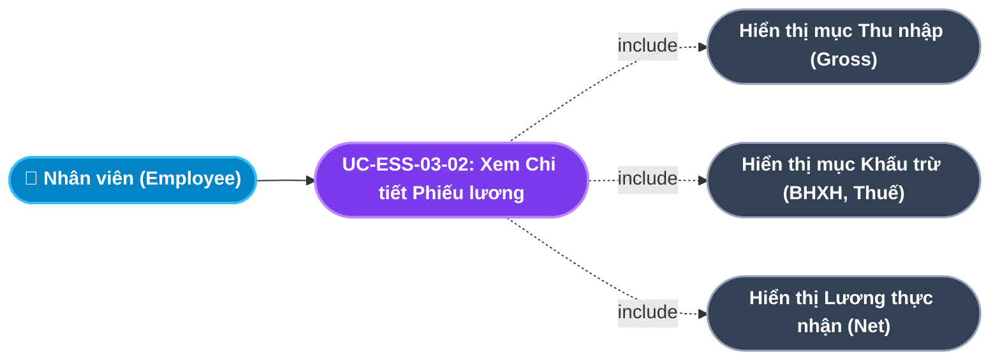
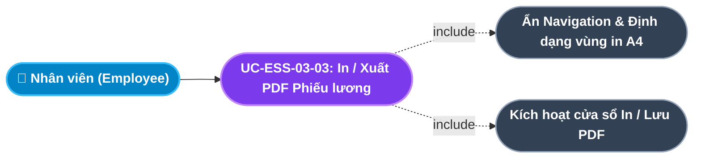
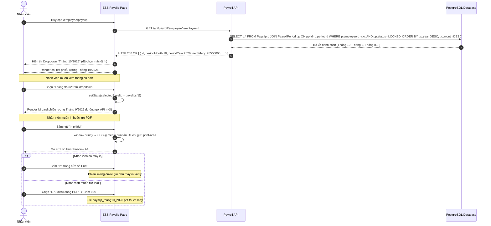

# Usecase: UC-ESS-03 - Phiếu lương Điện tử Cá nhân (Employee Payslip Self-Service)

## 1. Giới thiệu chức năng
- **Mục đích**: Loại bỏ hoàn toàn quy trình phát phiếu lương giấy thủ công bằng cách cung cấp cổng tra cứu phiếu lương điện tử bảo mật 24/7 cho toàn thể nhân viên. Nhân viên có thể xem chi tiết từng thành phần thu nhập, in phiếu lương tiêu chuẩn A4 hoặc sao lưu phục vụ các thủ tục tài chính cá nhân (vay ngân hàng, khai thuế thu nhập cá nhân) bất kỳ lúc nào.
- **Actor (Tác nhân)**: Nhân viên (Employee) - Toàn bộ nhân sự đang công tác.
- **Điều kiện tiên quyết**: Bộ phận C&B đã hoàn tất chạy bảng lương và khóa sổ kỳ lương (`status = LOCKED`) cho tháng tương ứng.

### Danh mục các chức năng con (Sub-features):
1. **UC-ESS-03-01: Tra cứu Danh sách Phiếu lương theo Kỳ (Payslip History Lookup)**: Xem danh sách các phiếu lương đã công bố theo từng tháng/năm với số tiền lương Net thực nhận và nút chuyển đổi kỳ.
2. **UC-ESS-03-02: Xem Chi tiết Bảng kê Thu nhập & Khấu trừ Gross to Net (Payslip Breakdown Detail)**: Xem toàn bộ các thành phần thu nhập và khấu trừ: Lương cơ bản, ngày công thực tế, OT, phụ cấp, bảo hiểm 10.5%, thuế TNCN và lương Net thực nhận.
3. **UC-ESS-03-03: In Phiếu lương Định dạng A4 / Xuất PDF (Print & PDF Export)**: In phiếu lương ra dạng A4 hoặc lưu dưới dạng file PDF qua chức năng Print của trình duyệt.

---

## 2. Dữ liệu nghiệp vụ đầu vào (Input Data & Parameters)

### 2.1. Cấu trúc Phiếu lương Chi tiết Gross to Net (Payslip Breakdown)
| Nhóm mục | Tên khoản mục | Công thức / Nguồn dữ liệu | Ý nghĩa |
|---|---|---|---|
| **I. THU NHẬP (Earnings)** | Lương cơ bản theo hợp đồng | `baseSalary` từ `Contract.ACTIVE` | Mức lương ghi trên hợp đồng lao động đang hiệu lực. |
| | Lương ngày công thực tế | `(baseSalary / 22) * actualWorkingDays` | Lương được hưởng theo số ngày thực tế có mặt. |
| | Tiền làm thêm giờ (OT) | `actualHours * hourlyRate * multiplier` (x1.5 / x2.0 / x3.0) | Tiền tăng ca kèm hệ số ngày thường/lễ/tết. |
| | Phụ cấp cố định | Khoản mục cố định (Ăn trưa, Xăng xe) | Phụ cấp không tính đóng bảo hiểm và thuế. |
| **TỔNG LƯƠNG GỘP** | **Gross Salary** | Mục 2 + OT + Phụ cấp | Tổng thu nhập trước khấu trừ. |
| **II. KHẤU TRỪ (Deductions)** | Bảo hiểm Xã hội (BHXH 8%) | `baseSalary * 8%` | Trích nộp quỹ hưu trí. |
| | Bảo hiểm Y tế (BHYT 1.5%) | `baseSalary * 1.5%` | Trích nộp quỹ y tế. |
| | Bảo hiểm Thất nghiệp (BHTN 1%) | `baseSalary * 1%` | Trích nộp quỹ thất nghiệp. |
| | Thuế Thu nhập Cá nhân (TNCN) | Biểu lũy tiến 7 bậc Bộ Tài chính | Thuế TNCN tạm khấu trừ tại nguồn. |
| **TỔNG KHẤU TRỪ** | **Total Deductions** | BHXH + BHYT + BHTN + TNCN | Tổng các khoản trừ theo luật định. |
| **III. THỰC NHẬN** | **Net Salary** | `Gross - Total Deductions` | Số tiền thực chuyển vào tài khoản ngân hàng. |

### 2.2. Trạng thái Phiếu lương Hiển thị
| Trạng thái Kỳ lương | Hiển thị với Nhân viên | Mô tả |
|---|:---:|---|
| `DRAFT` | ❌ Ẩn hoàn toàn | Kỳ lương đang tính toán, chưa được công bố cho nhân viên xem. |
| `LOCKED` | ✅ Hiển thị đầy đủ | Kỳ lương đã được khóa sổ, chính thức công bố tới nhân viên. |

---

## 3. Quy tắc nghiệp vụ (Business Rules)

| Mã Quy tắc | Tình huống nghiệp vụ | Cách hệ thống xử lý | Thông báo hiển thị |
|---|---|---|---|
| **BR-ESS-03-01** | **Bảo mật Thu nhập Cá nhân (Strict Salary Confidentiality)**: Nhân viên cố tình thay đổi URL để xem phiếu lương của đồng nghiệp khác. | Backend chỉ trả dữ liệu khi `Payslip.employeeId === req.user.employeeId` (lấy từ JWT). Mọi truy vấn chéo đều bị từ chối `HTTP 403 Forbidden`. | "Bạn không có quyền xem thông tin lương của người khác!" |
| **BR-ESS-03-02** | **Chỉ Xem Phiếu lương đã Khóa sổ (Published-only Access)**: Nhân viên truy vấn phiếu lương tháng đang tính. | API lọc chỉ trả các kỳ lương có `status = LOCKED`. Kỳ lương `DRAFT` bị loại khỏi kết quả trả về. | (Ẩn hoàn toàn, không hiển thị thông báo) |
| **BR-ESS-03-03** | **Không Sửa Phiếu lương (Read-only Payslip)**: Giao diện phiếu lương không cung cấp bất kỳ nút Sửa/Xóa nào. | Toàn bộ UI phiếu lương là chế độ chỉ đọc (`Read-only`). API chỉ cho phép method `GET`. | Không áp dụng - Không có nút sửa. |
| **BR-ESS-03-04** | **Đặc quyền In Phiếu lương (Self-service Print)**: Nhân viên muốn in phiếu lương. | Cung cấp nút "In phiếu" kích hoạt `window.print()` với vùng in được định nghĩa bằng class CSS `print-area`. Ẩn các phần navbar và menu trong lúc in. | "Đang mở cửa sổ in..." |

---

## 4. Đặc tả chi tiết các Use Case chức năng con (Sub-Use Cases Specification)

---

### 4.1. UC-ESS-03-01: Tra cứu Danh sách Phiếu lương theo Kỳ (Payslip History Lookup)

#### Sơ đồ Use Case:

#### Bảng đặc tả nghiệp vụ:

| STT | Hạng mục | Nội dung chi tiết |
|:---:|---|---|
| **1** | **Thông tin chung** | - **UC ID**: `UC-ESS-03-01` - **UC Name**: Tra cứu Danh sách Phiếu lương theo Kỳ (Payslip History Lookup) - **Actor**: Nhân viên (Employee) - **Mục tiêu**: Cho phép nhân viên nhanh chóng tìm và chọn xem phiếu lương của tháng bất kỳ từ lịch sử công tác. - **Mô tả**: Trang Phiếu lương (`/employee/payslip`) tải danh sách tất cả các kỳ lương đã khóa sổ của nhân viên, hiển thị dưới dạng dropdown "Tháng X/YYYY". Mặc định chọn kỳ lương mới nhất để hiển thị. - **Priority**: High (Bắt buộc) |
| **2** | **Trigger** | Nhân viên điều hướng vào menu **"Phiếu lương"** trên thanh menu ESS. |
| **3** | **Pre-condition** | Có ít nhất 1 kỳ lương với `status = LOCKED` và phiếu lương của nhân viên này tồn tại trong kỳ đó. |
| **4** | **Post-condition** | Giao diện hiển thị dropdown chọn kỳ và phiếu lương của kỳ mới nhất được tải sẵn. |
| **5** | **Main Flow** | 1. Nhân viên vào trang `/employee/payslip`. 2. Component gọi `GET /api/payroll/employee/:employeeId`. 3. Backend truy vấn tất cả `Payslip` của `employeeId` này thuộc các kỳ `LOCKED`. 4. Trả về mảng phiếu lương sắp xếp từ mới nhất: `[{ id, periodMonth, periodYear, netSalary, ...}]`. 5. Giao diện render dropdown với text: "Tháng 10/2026", "Tháng 9/2026",... 6. Mặc định hiển thị chi tiết phiếu lương đầu tiên (tháng mới nhất). |
| **6** | **Alternative / Exception Flow** | - **EF-01 (Chưa có phiếu lương nào)**: Nhân viên mới, chưa qua kỳ lương nào $\rightarrow$ Hiển thị trang trống với icon và nội dung: *"Chưa có dữ liệu phiếu lương nào. Hệ thống sẽ cập nhật khi có kỳ lương mới được chốt."* |
| **7** | **Business Rules & Validation** | - Chỉ hiển thị phiếu lương đã khóa sổ (BR-ESS-03-02). - Chỉ trả dữ liệu của đúng `employeeId` trong JWT (BR-ESS-03-01). |
| **8** | **Acceptance Criteria** | - **AC-01**: Dropdown liệt kê đúng các tháng có phiếu lương theo thứ tự mới nhất lên đầu. - **AC-02**: Không hiển thị kỳ lương đang trong trạng thái `DRAFT`. |

---

### 4.2. UC-ESS-03-02: Xem Chi tiết Bảng kê Thu nhập & Khấu trừ Gross to Net (Payslip Breakdown Detail)

#### Sơ đồ Use Case:

#### Bảng đặc tả nghiệp vụ:

| STT | Hạng mục | Nội dung chi tiết |
|:---:|---|---|
| **1** | **Thông tin chung** | - **UC ID**: `UC-ESS-03-02` - **UC Name**: Xem Chi tiết Bảng kê Thu nhập & Khấu trừ Gross to Net (Payslip Breakdown Detail) - **Actor**: Nhân viên (Employee) - **Mục tiêu**: Cung cấp bằng chứng minh bạch cho nhân viên để tự đối soát lương nhận được với kỳ vọng. - **Mô tả**: Phiếu lương hiển thị đầy đủ thông tin cá nhân (Họ tên, Mã NV, Phòng ban, Kỳ lương), sau đó bảng kê chi tiết phân 3 nhóm: Thu nhập (Gross), Khấu trừ (Bảo hiểm + Thuế) và Lương thực nhận (Net). - **Priority**: High (Bắt buộc) |
| **2** | **Trigger** | Nhân viên chọn kỳ lương từ dropdown (UC-ESS-03-01). |
| **3** | **Pre-condition** | Phiếu lương của kỳ được chọn đã khóa sổ và tồn tại trong CSDL. |
| **4** | **Post-condition** | Giao diện hiển thị đầy đủ bảng kê chi tiết, nhân viên có thể đối soát từng thành phần. |
| **5** | **Main Flow** | 1. Nhân viên chọn kỳ lương từ dropdown (VD: Tháng 10/2026). 2. Component cập nhật state `selectedPayslip` $\rightarrow$ Render lại card phiếu lương. 3. Header phiếu lương: Tên công ty, chức danh "PHIẾU LƯƠNG NHÂN VIÊN", Tháng/Năm. 4. Thông tin nhân viên: Họ tên, Mã NV, Phòng ban, Chức danh, Số tài khoản ngân hàng. 5. Bảng kê chi tiết 3 phần:    - **Thu nhập**: Từng dòng khoản mục kèm số tiền (format VND).    - **Khấu trừ**: BHXH 8%, BHYT 1.5%, BHTN 1%, Thuế TNCN.    - **Lương Net thực nhận**: In đậm, font lớn, màu xanh lá nổi bật. |
| **6** | **Alternative / Exception Flow** | - **EF-01 (Kỳ không có dữ liệu)**: Trường hợp kỳ lương tồn tại nhưng chưa có phiếu của nhân viên $\rightarrow$ Hiển thị thông báo: *"Không tìm thấy phiếu lương của bạn trong kỳ này!"*. |
| **7** | **Business Rules & Validation** | - Tất cả dữ liệu tài chính hiển thị ở định dạng tiền tệ VND chuẩn (VD: `35.000.000 ₫`). - Thông tin cá nhân nhân viên (Số tài khoản) chỉ hiển thị 4 số cuối (masking). |
| **8** | **Acceptance Criteria** | - **AC-01**: Tổng Thu nhập - Tổng Khấu trừ = Net Salary (kiểm tra bằng phép tính thủ công). - **AC-02**: Phiếu lương hiển thị đúng thông tin nhân viên và kỳ lương đã chọn. |

---

### 4.3. UC-ESS-03-03: In Phiếu lương Định dạng A4 (Print & PDF Export)

#### Sơ đồ Use Case:

#### Bảng đặc tả nghiệp vụ:

| STT | Hạng mục | Nội dung chi tiết |
|:---:|---|---|
| **1** | **Thông tin chung** | - **UC ID**: `UC-ESS-03-03` - **UC Name**: In Phiếu lương Định dạng A4 (Print & PDF Export) - **Actor**: Nhân viên (Employee) - **Mục tiêu**: Cung cấp bản in phiếu lương chuyên nghiệp, đúng định dạng A4 phục vụ nhu cầu tài chính cá nhân (vay vốn ngân hàng, chứng minh thu nhập với các tổ chức bên ngoài). - **Mô tả**: Nhân viên bấm nút "In phiếu". Hệ thống ẩn các phần UI không cần thiết (thanh điều hướng, nút bấm) và mở cửa sổ Print của trình duyệt. Nhân viên có thể lưu dưới dạng PDF hoặc in ra giấy. - **Priority**: Medium |
| **2** | **Trigger** | Nhân viên nhấp nút **"🖨️ In phiếu"** trên trang Payslip. |
| **3** | **Pre-condition** | Đã có phiếu lương được chọn và hiển thị đầy đủ trên màn hình. |
| **4** | **Post-condition** | Cửa sổ Print của trình duyệt mở ra với nội dung phiếu lương được định dạng chuẩn A4, ẩn mọi thành phần UI khác. |
| **5** | **Main Flow** | 1. Nhân viên nhấn nút "In phiếu" (Icon Máy in). 2. Hệ thống gọi `window.print()`. 3. CSS `@media print` ẩn toàn bộ sidebar, navbar, các nút bấm và chỉ giữ lại vùng in `.print-area`. 4. Cửa sổ Print của trình duyệt (Chrome/Firefox/Edge) mở ra với bản xem trước A4. 5. Nhân viên có thể: Bấm "In" để in ra máy in; Hoặc chọn "Lưu dưới dạng PDF" để tải file PDF về máy. |
| **6** | **Alternative / Exception Flow** | - **EF-01 (Không có máy in kết nối)**: Trình duyệt hiển thị thông báo "Không tìm thấy máy in" $\rightarrow$ Nhân viên vẫn có thể chọn "Lưu thành PDF" trong cửa sổ Print để tạo file. |
| **7** | **Business Rules & Validation** | - Vùng in chỉ bao gồm thông tin phiếu lương, không có nút bấm hay menu hệ thống. - Phiếu lương in ra phải có tiêu đề công ty, tháng lương và chữ ký điện tử (tên bộ phận C&B). |
| **8** | **Acceptance Criteria** | - **AC-01**: Bản xem trước in (Print Preview) chỉ hiển thị nội dung phiếu lương, không có menu hay thanh sidebar. - **AC-02**: Có thể lưu thành file PDF hợp lệ với đầy đủ thông tin bảng lương. |

---

## 5. Sơ đồ tuần tự nghiệp vụ (Sequence Diagrams)

### 5.1. Luồng Tra cứu & Xem Chi tiết Phiếu lương

---

## 6. Ma trận kịch bản kiểm thử (Test Scenarios & Acceptance Matrix)

| Test ID | Chức năng con liên quan | Tiêu đề kịch bản | Dữ liệu đầu vào | Các bước thực hiện | Kết quả kỳ vọng | Mức độ |
|---|---|---|---|---|---|:---:|
| **TC-ESS-03-01** | UC-ESS-03-01 | Hiển thị đúng danh sách phiếu lương | NV001 có 3 kỳ lương LOCKED | 1. Vào trang Payslip. | Dropdown có 3 option: Tháng 10, 9, 8/2026. Phiếu Tháng 10 hiển thị mặc định. | P0 |
| **TC-ESS-03-01b** | UC-ESS-03-01 | Ẩn kỳ lương DRAFT | Kỳ 11/2026 đang DRAFT | 1. Kiểm tra dropdown. | Dropdown không có tùy chọn "Tháng 11/2026". | P0 |
| **TC-ESS-03-02** | UC-ESS-03-02 | Xem chi tiết phiếu lương đúng số liệu | Phiếu Tháng 10: baseSalary=20tr, actual=22/22 ngày | 1. Chọn tháng 10. 2. Đọc bảng kê. | Lương ngày công = 20tr, BHXH = 1.6tr, Net xấp xỉ 17.8tr. | P0 |
| **TC-ESS-03-03** | UC-ESS-03-01 | Bảo mật - không xem phiếu lương người khác | NV001 gọi API với employeeId=NV002 | 1. Gọi API thủ công thay đổi ID. | API trả HTTP 403 Forbidden. | P0 |
| **TC-ESS-03-04** | UC-ESS-03-02 | Kiểm tra công thức Net = Gross - Deductions | Gross=23tr, Deductions=4.2tr | 1. Xem chi tiết phiếu lương. | Net = 23tr - 4.2tr = 18.8tr (kiểm tra bằng tay). | P1 |
| **TC-ESS-03-05** | UC-ESS-03-03 | In phiếu lương không lộ UI hệ thống | Chọn Tháng 10 -> In phiếu | 1. Bấm In phiếu. 2. Kiểm tra Print Preview. | Chỉ thấy nội dung phiếu lương A4, không có sidebar/navbar/nút bấm. | P1 |
| **TC-ESS-03-06** | UC-ESS-03-01 | Hiển thị trang trống khi chưa có phiếu | Nhân viên mới, chưa có kỳ lương | 1. Vào trang Payslip. | Icon trang trống + message "Chưa có dữ liệu phiếu lương". | P1 |
