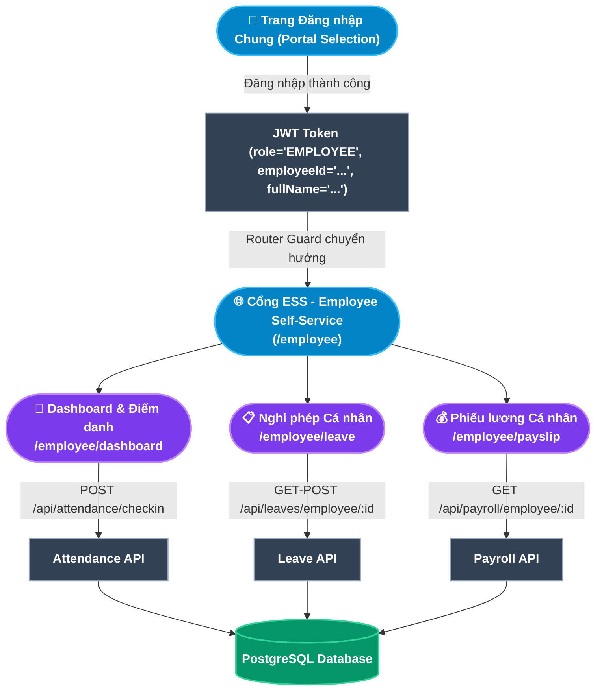

# TÀI LIỆU PHÂN TÍCH NGHIỆP VỤ - MODULE CỔNG TỰ PHỤC VỤ NHÂN VIÊN (EMPLOYEE SELF-SERVICE PORTAL - ESS)

## 1. Giới thiệu tổng quan Module
**Cổng Tự phục vụ Nhân viên (Employee Self-Service Portal - ESS)** là giao diện riêng biệt (`/employee`) dành hoàn toàn cho nhân viên chính thức sau khi đăng nhập vào hệ thống HRM. Cổng thông tin này cung cấp trải nghiệm người dùng tinh gọn, tập trung 3 nhu cầu tự phục vụ quan trọng nhất trong vòng đời công việc hằng ngày:
- **Điểm danh Trực tuyến (Web Check-in / Check-out)**: Nhân viên tự chủ ghi nhận thời gian vào/ra làm việc chính xác từ trình duyệt, không cần phụ thuộc vào máy chấm công vật lý.
- **Quản lý Nghỉ phép Cá nhân (Leave Self-Service)**: Chủ động tra cứu quỹ phép tích lũy và nộp đơn xin nghỉ trực tuyến với quy trình phê duyệt đa cấp minh bạch.
- **Tra cứu Phiếu lương Điện tử (Payslip Self-Service)**: Xem bảng kê chi tiết thu nhập Gross to Net và in phiếu lương A4 tiêu chuẩn phục vụ các thủ tục tài chính cá nhân.

### Đối tượng sử dụng (Actors):
1. **Nhân viên (Employee)**: Tất cả nhân sự đang ở trạng thái `ACTIVE` hoặc `PROBATION` - Người dùng duy nhất và chính của cổng ESS.
2. **Hệ thống Backend (Automated System)**: Đảm nhiệm tự động xác thực dữ liệu, kiểm tra ca làm việc, tính toán quỹ phép và áp dụng các quy tắc nghiệp vụ bảo vệ.

---

## 2. Kiến trúc Cổng ESS & Luồng Định danh Người dùng (ESS Architecture)

---

## 3. Ma trận Phân rã Chức năng Chi tiết (Functional Breakdown Matrix)

Cổng Nhân viên ESS bao gồm **3 phân màn hình chính** với tổng cộng **9 Use Case con (Sub-Use Cases)** được chuẩn hóa theo định dạng đặc tả toàn diện:

| Màn hình (Screen) | Mã Use Case | Tên Chức năng Con (Sub-Use Case) | Actor chính | Endpoint Backend |
|---|---|---|---|---|
| **1. Dashboard & Điểm danh** *(Check-in / Check-out)* | `UC-ESS-01-01` | Điểm danh Check-in Vào ca làm việc | Nhân viên | `POST /api/attendance/checkin` |
| | `UC-ESS-01-02` | Điểm danh Check-out Kết thúc ca làm việc | Nhân viên | `PUT /api/attendance/checkout` |
| | `UC-ESS-01-03` | Tra cứu Lịch ca làm việc & Tổng hợp Công cá nhân | Nhân viên | `GET /api/attendance/employee/:id` |
| **2. Quản lý Nghỉ phép** *(Leave Self-Service)* | `UC-ESS-02-01` | Tra cứu Quỹ phép Năm & Lịch sử Nghỉ phép cá nhân | Nhân viên | `GET /api/leaves/employee/:id` |
| | `UC-ESS-02-02` | Tạo & Nộp Đơn xin Nghỉ phép trực tuyến | Nhân viên | `POST /api/leaves` |
| | `UC-ESS-02-03` | Theo dõi Trạng thái & Lịch sử Phê duyệt Đơn nghỉ | Nhân viên | `GET /api/leaves/employee/:id` |
| **3. Phiếu lương Cá nhân** *(Payslip Self-Service)* | `UC-ESS-03-01` | Tra cứu Danh sách Phiếu lương theo Kỳ | Nhân viên | `GET /api/payroll/employee/:id` |
| | `UC-ESS-03-02` | Xem Chi tiết Bảng kê Thu nhập & Khấu trừ Gross to Net | Nhân viên | Modal Chi tiết Payslip |
| | `UC-ESS-03-03` | In Phiếu lương Định dạng A4 (Print / PDF) | Nhân viên | `window.print()` Browser API |

---

## 4. Danh mục Hồ sơ Phân tích Chi tiết (Detailed Specifications)

Vui lòng tham khảo tài liệu đặc tả chi tiết của từng chức năng con tại các liên kết dưới đây:

1. [Đặc tả Chức năng Dashboard & Điểm danh Trực tuyến (Check-in / Check-out)](file:///c:/Users/truclh/Desktop/HRM-ĐATN/docs/Tài%20liệu%20phân%20tích%20nghiệp%20vụ%20từng%20module/Module%20Cổng%20Nhân%20viên%20ESS/Chuc-nang-Dashboard-Diem-danh.md) (UC-ESS-01-01 đến UC-ESS-01-03).
2. [Đặc tả Chức năng Quản lý Nghỉ phép Cá nhân (Leave Self-Service)](file:///c:/Users/truclh/Desktop/HRM-ĐATN/docs/Tài%20liệu%20phân%20tích%20nghiệp%20vụ%20từng%20module/Module%20Cổng%20Nhân%20viên%20ESS/Chuc-nang-Nghi-phep-Ca-nhan.md) (UC-ESS-02-01 đến UC-ESS-02-03).
3. [Đặc tả Chức năng Phiếu lương Cá nhân (Payslip Self-Service)](file:///c:/Users/truclh/Desktop/HRM-ĐATN/docs/Tài%20liệu%20phân%20tích%20nghiệp%20vụ%20từng%20module/Module%20Cổng%20Nhân%20viên%20ESS/Chuc-nang-Tra-cuu-Phieu-luong.md) (UC-ESS-03-01 đến UC-ESS-03-03).

---

## 5. Bộ Quy chuẩn Nghiệp vụ Cốt lõi Cổng ESS (ESS Business Rules Summary)

| STT | Tên Quy tắc | Mô tả ngắn | Phạm vi áp dụng |
|:---:|---|---|---|
| **BR-ESS-01** | **Phân tách Dữ liệu Cá nhân (Data Isolation)** | Nhân viên chỉ được phép xem dữ liệu chấm công, nghỉ phép và phiếu lương của chính mình. Backend kiểm tra `employeeId` từ JWT không phải từ request body. | Tất cả 3 màn hình |
| **BR-ESS-02** | **Không Điểm danh Trùng (No Duplicate Check-in)** | Mỗi ngày làm việc, nhân viên chỉ được ghi nhận một lần Check-in và một lần Check-out. Backend kiểm tra ngày hiện tại trước khi tạo bản ghi mới. | UC-ESS-01-01, UC-ESS-01-02 |
| **BR-ESS-03** | **Giới hạn Quỹ phép (Leave Balance Enforcement)** | Không được phép nộp đơn nghỉ phép có phép khi quỹ phép còn lại bằng 0. Backend từ chối tạo đơn khi `availableBalance = 0`. | UC-ESS-02-02 |
| **BR-ESS-04** | **Chỉ xem Phiếu lương đã Khóa sổ (Published Payslip Only)** | Nhân viên chỉ nhìn thấy phiếu lương của kỳ đã được bộ phận C&B chốt và khóa sổ (`status = LOCKED`). Kỳ lương đang tính toán (`DRAFT`) bị ẩn hoàn toàn. | UC-ESS-03-01, UC-ESS-03-02 |
| **BR-ESS-05** | **Không thể Hủy Đơn đã Duyệt (Immutable Approved Leave)** | Khi đơn nghỉ đã được duyệt (`APPROVED`), nhân viên không thể tự hủy trên cổng ESS. Phải liên hệ HR để xử lý điều chỉnh thủ công. | UC-ESS-02-03 |
