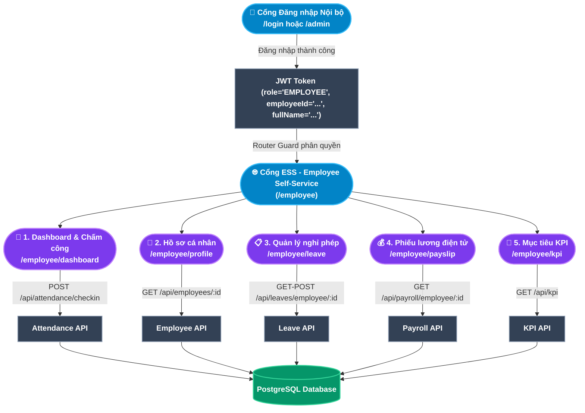

# TÀI LIỆU PHÂN TÍCH NGHIỆP VỤ - MODULE CỔNG TỰ PHỤC VỤ NHÂN VIÊN (EMPLOYEE SELF-SERVICE PORTAL - ESS)

## 1. Giới thiệu tổng quan Module
**Cổng Tự phục vụ Nhân viên (Employee Self-Service Portal - ESS)** là giao diện riêng biệt (`/employee`) dành hoàn toàn cho nhân viên chính thức sau khi đăng nhập vào hệ thống HRM. Cổng thông tin này cung cấp trải nghiệm người dùng hiện đại, đồng bộ thương hiệu **LLA HRM Enterprise Platform**, tập trung **5 phân hệ tự phục vụ cốt lõi** trong vòng đời công việc hằng ngày:
1. **Điểm danh & Chấm công Trực tuyến (Web Kiosk Check-in / Check-out)**: Nhân viên tự chủ ghi nhận thời gian vào/ra làm việc chính xác từ trình duyệt với đồng hồ realtime, cảnh báo ân hạn đi muộn và theo dõi lịch sử chấm công 5 ngày gần nhất.
2. **Hồ sơ Cá nhân Toàn diện (My Profile & Contract)**: Chủ động tra cứu lý lịch, chức danh chuyên môn, hợp đồng lao động hiệu lực và tài khoản chi trả lương/mã số thuế/sổ BHXH.
3. **Quản lý Nghỉ phép Cá nhân (Leave Self-Service)**: Thẻ đo lường quỹ phép trực quan với thanh tiến độ %, bộ lọc trạng thái đơn và tạo đơn xin nghỉ tự động tính số ngày.
4. **Tra cứu Phiếu lương Điện tử (Payslip Self-Service)**: Xem bảng kê chi tiết thu nhập Gross to Net, các khoản trích đóng bảo hiểm/thuế và in phiếu lương A4 tiêu chuẩn.
5. **Mục tiêu & Đánh giá Hiệu suất KPI (My Performance & KPI)**: Theo dõi tiến độ các chỉ tiêu KPI theo quý, phân bổ trọng số %, tự chấm điểm đánh giá và xếp loại hoàn thành công việc.

### Đối tượng sử dụng (Actors):
1. **Nhân viên (Employee)**: Tất cả nhân sự đang ở trạng thái `ACTIVE` hoặc `PROBATION` - Người dùng duy nhất và chính của cổng ESS.
2. **Hệ thống Backend (Automated System)**: Đảm nhiệm tự động xác thực dữ liệu, kiểm tra ca làm việc, tính toán quỹ phép và áp dụng các quy tắc nghiệp vụ bảo vệ.

---

## 2. Kiến trúc Cổng ESS & Luồng Định danh Người dùng (ESS Architecture)

---

## 3. Ma trận Phân rã Chức năng Chi tiết (Functional Breakdown Matrix)

Cổng Nhân viên ESS bao gồm **5 phân màn hình chính** với tổng cộng **13 Use Case con (Sub-Use Cases)** được chuẩn hóa theo định dạng đặc tả toàn diện:

| Màn hình (Screen) | Mã Use Case | Tên Chức năng Con (Sub-Use Case) | Actor chính | Endpoint Backend |
|---|---|---|---|---|
| **1. Dashboard & Điểm danh** *(Check-in / Check-out Kiosk)* | `UC-ESS-01-01` | Điểm danh Check-in Vào ca làm việc | Nhân viên | `POST /api/attendance/checkin` |
| | `UC-ESS-01-02` | Điểm danh Check-out Kết thúc ca làm việc | Nhân viên | `PUT /api/attendance/checkout` |
| | `UC-ESS-01-03` | Tra cứu Lịch ca làm việc, Lịch sử 5 ngày & Ân hạn | Nhân viên | `GET /api/attendance/employee/:id` |
| **2. Hồ sơ Cá nhân** *(Employee Profile)* | `UC-ESS-02-01` | Tra cứu Thông tin Lý lịch & Liên hệ cá nhân | Nhân viên | `GET /api/employees/:id` |
| | `UC-ESS-02-02` | Xem Chức danh, Phòng ban & Quản lý trực tiếp | Nhân viên | `GET /api/employees/:id` |
| | `UC-ESS-02-03` | Tra cứu Hợp đồng Lao động & Thông tin Thuế/BHXH | Nhân viên | `GET /api/contracts` & `/employees/:id` |
| **3. Quản lý Nghỉ phép** *(Leave Self-Service)* | `UC-ESS-03-01` | Tra cứu Quỹ phép Năm & Thanh tiến độ đã dùng | Nhân viên | `GET /api/leaves/employee/:id` |
| | `UC-ESS-03-02` | Tạo & Nộp Đơn xin Nghỉ phép (Tự động tính ngày) | Nhân viên | `POST /api/leaves` |
| | `UC-ESS-03-03` | Lọc & Theo dõi Trạng thái Phê duyệt Đơn nghỉ | Nhân viên | `GET /api/leaves/employee/:id` |
| **4. Phiếu lương Cá nhân** *(Payslip Self-Service)* | `UC-ESS-04-01` | Tra cứu Danh sách Phiếu lương theo Kỳ thanh toán | Nhân viên | `GET /api/payroll/employee/:id` |
| | `UC-ESS-04-02` | Xem Chi tiết Bảng kê Thu nhập & Khấu trừ Gross to Net | Nhân viên | Bảng kê chi tiết Payslip |
| | `UC-ESS-04-03` | In Phiếu lương Định dạng Chuẩn Doanh nghiệp | Nhân viên | `window.print()` Browser API |
| **5. Mục tiêu KPI** *(My KPI & Performance)* | `UC-ESS-05-01` | Theo dõi Mục tiêu Công việc Quý & Phân bổ Trọng số | Nhân viên | `GET /api/kpi` |
| | `UC-ESS-05-02` | Cập nhật Tiến độ & Điểm Tự đánh giá Hiệu suất | Nhân viên | `PUT /api/kpi/self-assessment` |

---

## 4. Danh mục Hồ sơ Phân tích Chi tiết (Detailed Specifications)

1. [Đặc tả Chức năng Dashboard & Điểm danh Trực tuyến (Check-in / Check-out)](file:///c:/Users/truclh/Desktop/HRM-ĐATN/docs/Tài%20liệu%20phân%20tích%20nghiệp%20vụ%20từng%20module/Module%20Cổng%20Nhân%20viên%20ESS/Chuc-nang-Dashboard-Diem-danh.md) (UC-ESS-01-01 đến UC-ESS-01-03).
2. [Đặc tả Chức năng Hồ sơ Cá nhân & Hợp đồng Lao động](file:///c:/Users/truclh/Desktop/HRM-ĐATN/docs/Tài%20liệu%20phân%20tích%20nghiệp%20vụ%20từng%20module/Module%20Cổng%20Nhân%20viên%20ESS/Chuc-nang-Ho-so-Ca-nhan.md) (UC-ESS-02-01 đến UC-ESS-02-03).
3. [Đặc tả Chức năng Quản lý Nghỉ phép Cá nhân (Leave Self-Service)](file:///c:/Users/truclh/Desktop/HRM-ĐATN/docs/Tài%20liệu%20phân%20tích%20nghiệp%20vụ%20từng%20module/Module%20Cổng%20Nhân%20viên%20ESS/Chuc-nang-Nghi-phep-Ca-nhan.md) (UC-ESS-03-01 đến UC-ESS-03-03).
4. [Đặc tả Chức năng Phiếu lương Cá nhân (Payslip Self-Service)](file:///c:/Users/truclh/Desktop/HRM-ĐATN/docs/Tài%20liệu%20phân%20tích%20nghiệp%20vụ%20từng%20module/Module%20Cổng%20Nhân%20viên%20ESS/Chuc-nang-Tra-cuu-Phieu-luong.md) (UC-ESS-04-01 đến UC-ESS-04-03).
5. [Đặc tả Chức năng Mục tiêu & Đánh giá Hiệu suất KPI (My Performance & KPI)](file:///c:/Users/truclh/Desktop/HRM-ĐATN/docs/Tài%20liệu%20phân%20tích%20nghiệp%20vụ%20từng%20module/Module%20Cổng%20Nhân%20viên%20ESS/Chuc-nang-Muc-tieu-KPI.md) (UC-ESS-05-01 đến UC-ESS-05-02).

---

## 5. Bộ Quy chuẩn Nghiệp vụ Cốt lõi Cổng ESS (ESS Business Rules Summary)

| STT | Tên Quy tắc | Mô tả ngắn | Phạm vi áp dụng |
|:---:|---|---|---|
| **BR-ESS-01** | **Phân tách Dữ liệu Cá nhân (Data Isolation)** | Nhân viên chỉ được phép xem dữ liệu chấm công, nghỉ phép và phiếu lương của chính mình. Backend kiểm tra `employeeId` từ JWT không phải từ request body. | Tất cả 5 màn hình |
| **BR-ESS-02** | **Không Điểm danh Trùng (No Duplicate Check-in)** | Mỗi ngày làm việc, nhân viên chỉ được ghi nhận một lần Check-in và một lần Check-out. Backend kiểm tra ngày hiện tại trước khi tạo bản ghi mới. | UC-ESS-01-01, UC-ESS-01-02 |
| **BR-ESS-03** | **Giới hạn Quỹ phép (Leave Balance Enforcement)** | Không được phép nộp đơn nghỉ phép có phép khi quỹ phép còn lại bằng 0. Backend từ chối tạo đơn khi `availableBalance = 0`. | UC-ESS-03-02 |
| **BR-ESS-04** | **Chỉ xem Phiếu lương đã Khóa sổ (Published Payslip Only)** | Nhân viên chỉ nhìn thấy phiếu lương của kỳ đã được bộ phận C&B chốt và khóa sổ (`status = LOCKED`). Kỳ lương đang tính toán (`DRAFT`) bị ẩn hoàn toàn. | UC-ESS-04-01, UC-ESS-04-02 |
| **BR-ESS-05** | **Không thể Hủy Đơn đã Duyệt (Immutable Approved Leave)** | Khi đơn nghỉ đã được duyệt (`APPROVED`), nhân viên không thể tự hủy trên cổng ESS. Phải liên hệ HR để xử lý điều chỉnh thủ công. | UC-ESS-03-03 |
| **BR-ESS-06** | **Bảo vệ Phân quyền Tuyệt đối (Strict Multi-level RBAC)** | Tài khoản nhân viên bị chặn hoàn toàn khi cố truy cập Cổng Quản trị (`/internal/*`), Router Guard tự động đưa về `/login` với thông báo phân quyền rõ ràng thay vì âm thầm nhảy trang. | Toàn bộ Router |
| **BR-ESS-07** | **Tính toàn vẹn Session Nhân viên (Complete Session Payload)** | Phản hồi đăng nhập của tài khoản nội bộ bắt buộc trả về `employeeId` tương ứng để frontend lưu phiên và khởi tạo chính xác các API tự phục vụ cá nhân. | Đăng nhập Auth |
