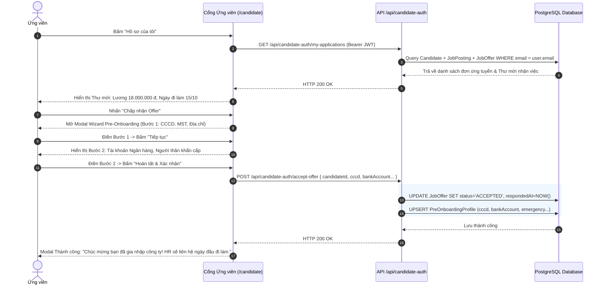

# Usecase: UC-CAN-03 & UC-CAN-04 - Nộp Hồ sơ, Tài khoản Ứng viên & Theo dõi Tiến trình Tuyển dụng 2 chiều (Candidate Portal & Collaborative Application Lifecycle)

## 1. Giới thiệu chức năng
- **Mục đích**: Cung cấp một cổng tự phục vụ toàn diện (Candidate Self-service Experience) cho ứng viên:
  1. Cho phép ứng viên nộp hồ sơ nhanh chóng hoặc đăng ký/đăng nhập tài khoản cá nhân (`CandidateUser`).
  2. Tự động liên kết các đơn tuyển dụng theo email cá nhân, theo dõi tiến trình xét duyệt hồ sơ theo thời gian thực (Đang sàng lọc, Chờ phỏng vấn, Đã có Offer, Nhận việc thành công, Chưa phù hợp).
  3. Tiếp nhận Thư mời nhận việc trực tuyến (**Job Offer**) với đầy đủ điều khoản đãi ngộ (Lương cơ bản, Tỷ lệ thử việc, Ngày nhận việc, Phúc lợi).
  4. Trực tiếp phản hồi Offer 2 chiều: Từ chối kèm lý do hoặc Chấp nhận Offer.
  5. Khi chấp nhận Offer, hệ thống kích hoạt **Biểu mẫu Khai báo Hồ sơ Tiền Tiếp nhận (Pre-Onboarding Profile Wizard)** 2 bước để ứng viên tự cung cấp thông tin CCCD, nơi cấp, MST cá nhân, tài khoản ngân hàng và liên hệ khẩn cấp nhằm chuẩn bị cho ngày đầu tiên gia nhập công ty.
- **Actor (Tác nhân)**: Ứng viên (Candidate), Hệ thống Backend, Bộ phận Tuyển dụng (HR).
- **Điều kiện tiên quyết**: Ứng viên truy cập Cổng Tuyển dụng công khai (`/candidate`).

### Danh mục các chức năng con (Sub-features):
1. **UC-CAN-03-01: Điền & Nộp Form Ứng tuyển Trực tuyến (Online Application Form)**: Ứng viên nộp hồ sơ với Họ tên, Email, SĐT và Link CV.
2. **UC-CAN-03-02: Nhận Xác nhận Tiếp nhận Hồ sơ (Application Confirmation)**: Màn hình xác nhận thành công và hướng dẫn theo dõi tiến trình.
3. **UC-CAN-03-03: Đăng ký & Đăng nhập Tài khoản Ứng viên (Candidate Authentication)**: Quản lý tài khoản cá nhân bằng Email/Mật khẩu với cơ chế mã hóa mật khẩu bcrypt và cấp mã JWT riêng biệt (`CandidateUser`).
4. **UC-CAN-04-01: Bảng Điều khiển Theo dõi Đơn Ứng tuyển (Self-service Application Dashboard)**: Xem toàn bộ các vị trí đã ứng tuyển, ngày nộp, trạng thái xử lý hiện tại và lịch sử xét duyệt.
5. **UC-CAN-04-02: Xem Thư mời Nhận việc Trực tuyến (Online Job Offer Letter)**: Xem chi tiết các điều khoản việc làm, mức lương, ngày đi làm do HR phát hành.
6. **UC-CAN-04-03: Phản hồi Offer & Khai báo Hồ sơ Tiền Tiếp nhận (Offer Response & Pre-Onboarding Wizard)**: Chấp nhận Offer và hoàn tất biểu mẫu khai báo thông tin pháp lý, ngân hàng, gia đình trực tuyến.

---

## 2. Dữ liệu nghiệp vụ đầu vào (Input Data & Parameters)

### 2.1. Đăng ký & Đăng nhập Tài khoản Ứng viên (CandidateUser)
| Tên trường | Kiểu dữ liệu | Bắt buộc | Ràng buộc nghiệp vụ |
|---|---|:---:|---|
| `email` | String(150) | Có | Định danh đăng nhập duy nhất, định dạng email chuẩn. |
| `password` | String(100) | Có | Mật khẩu tối thiểu 6 ký tự, mã hóa một chiều bằng bcrypt salt 10. |
| `name` | String(100) | Có | Họ và tên đầy đủ của ứng viên. |
| `phone` | String(15) | Không | Số điện thoại liên hệ cá nhân. |

### 2.2. Biểu mẫu Khai báo Hồ sơ Tiền Tiếp nhận (Pre-Onboarding Wizard)
| Bước | Nhóm dữ liệu | Tên trường | Kiểu dữ liệu | Bắt buộc | Ý nghĩa nghiệp vụ |
|---|---|---|---|:---:|---|
| **Bước 1** | **Thông tin Định danh & Pháp lý** | `cccd` | String(12) | Có | Số Căn cước công dân gắn chip (12 số). |
| | | `cccdDate` | Date | Có | Ngày cấp CCCD ghi trên thẻ. |
| | | `cccdPlace` | String(150) | Có | Nơi cấp (VD: Cục Cảnh sát QLHC về TTXH). |
| | | `taxCode` | String(20) | Không | Mã số thuế thu nhập cá nhân (nếu đã có). |
| | | `dob` | Date | Có | Ngày tháng năm sinh. |
| | | `gender` | Enum | Có | Giới tính: `MALE`, `FEMALE`, `OTHER`. |
| | | `address` | String(255) | Có | Địa chỉ thường trú hoặc nơi ở hiện tại. |
| **Bước 2** | **Tài chính & Liên hệ Khẩn cấp** | `bankAccount` | String(30) | Có | Số tài khoản ngân hàng chính chủ để nhận lương. |
| | | `bankName` | String(100) | Có | Tên ngân hàng (Vietcombank, MB, Techcombank...). |
| | | `bankBranch` | String(150) | Không | Chi nhánh mở tài khoản. |
| | | `emergencyName` | String(100) | Có | Họ tên người liên hệ khẩn cấp (bố mẹ/vợ chồng). |
| | | `emergencyRel` | String(50) | Có | Mối quan hệ thân nhân. |
| | | `emergencyPhone`| String(15) | Có | Số điện thoại người liên hệ khẩn cấp. |

### 2.3. Trạng thái Vòng đời Hồ sơ Ứng viên trên Cổng Ứng viên
| Trạng thái ATS | Nhãn hiển thị | Màu sắc | Ý nghĩa với ứng viên | Hành động tương tác |
|---|---|:---:|---|---|
| `APPLIED` | Đang sàng lọc hồ sơ | Tím lam | Hồ sơ đã được ghi nhận, HR đang xem xét sơ bộ. | Theo dõi trạng thái |
| `SCREENING` | Hồ sơ phù hợp | Xanh dương | Vượt qua sàng lọc ban đầu, chuẩn bị phỏng vấn. | Chờ thông báo lịch hẹn |
| `INTERVIEWING` | Vòng phỏng vấn | Vàng cam | Đang trong giai đoạn phỏng vấn chuyên môn. | Xem thời gian phỏng vấn |
| `OFFERING` | Đã nhận Thư mời nhận việc | Xanh ngọc | HR đã phát hành Offer Letter chính thức. | **Xem chi tiết & Phản hồi Offer** |
| `HIRED` | Nhận việc thành công | Xanh lá | Đã hoàn tất tiếp nhận, chào đón thành viên mới! | Chuẩn bị ngày đi làm |
| `REJECTED` | Chưa phù hợp đợt này | Xám/Đỏ | Hồ sơ chưa đáp ứng tiêu chí trong chiến dịch này. | Ứng tuyển vị trí khác |

---

## 3. Quy tắc nghiệp vụ (Business Rules)

| Mã Quy tắc | Tình huống nghiệp vụ | Cách hệ thống xử lý | Thông báo hiển thị |
|---|---|---|---|
| **BR-CAN-03-01** | **Chống nộp trùng lặp**: Cùng email nộp cùng vị trí lần 2. | Backend kiểm tra `email + jobPostingId`. Nếu đã tồn tại $\rightarrow$ Trả lỗi `409 Conflict`. | "Email của bạn đã nộp hồ sơ cho vị trí này rồi! Vui lòng theo dõi trong mục 'Hồ sơ của tôi'." |
| **BR-CAN-03-02** | **Đồng bộ tự động vào ATS**: Nộp hồ sơ thành công. | Tạo bản ghi `Candidate` với trạng thái `APPLIED`. Thẻ ứng viên lập tức xuất hiện trong cột "Mới nộp" trên bảng Kanban ATS của HR. | "Hồ sơ của bạn đã được gửi thành công!" |
| **BR-CAN-03-03** | **Bảo mật Tài khoản Ứng viên**: Đăng ký tài khoản `CandidateUser`. | Email không được trùng lặp; mật khẩu mã hóa an toàn bcrypt; cấp JWT Token có thời hạn 7 ngày. | "Đăng ký tài khoản ứng viên thành công!" |
| **BR-CAN-04-01** | **Tự động liên kết đơn ứng tuyển**: Ứng viên đăng nhập. | Hệ thống truy vấn toàn bộ hồ sơ `Candidate` có `email` khớp với email của `CandidateUser`, hiển thị danh sách đầy đủ kèm thông tin vị trí và trạng thái Offer. | (Hiển thị danh sách hồ sơ cá nhân) |
| **BR-CAN-04-02** | **Khai báo Hồ sơ Pre-Onboarding Bắt buộc khi Chấp nhận Offer**: Ứng viên bấm "Đồng ý Offer". | Hệ thống không chuyển ngay thành `HIRED` (vì chưa đến ngày nhận việc); mà yêu cầu ứng viên hoàn tất Wizard Pre-Onboarding để lưu vào bảng `PreOnboardingProfile`, đổi trạng thái Offer thành `ACCEPTED`. | "Vui lòng hoàn tất biểu mẫu thông tin tiếp nhận để xác nhận nhận việc!" |
| **BR-CAN-04-03** | **Ghi nhận Lý do Từ chối Offer**: Ứng viên bấm "Từ chối". | Bắt buộc nhập lý do từ chối (ngắn gọn), cập nhật `JobOffer.status = 'REJECTED'`, `JobOffer.declineReason = [Lý do]`, chuyển trạng thái ứng viên thành `REJECTED`. | "Đã ghi nhận từ chối Thư mời nhận việc." |

---

## 4. Đặc tả chi tiết các Use Case chức năng con

### 4.1. UC-CAN-03-03: Đăng ký & Đăng nhập Tài khoản Ứng viên (Candidate Authentication)

#### Bảng đặc tả nghiệp vụ:
| STT | Hạng mục | Nội dung chi tiết |
|:---:|---|---|
| **1** | **Thông tin chung** | - **UC ID**: `UC-CAN-03-03` - **UC Name**: Đăng ký & Đăng nhập Tài khoản Ứng viên (Candidate Authentication) - **Actor**: Ứng viên (Candidate) - **Mục tiêu**: Cung cấp tài khoản độc lập giúp ứng viên quản lý nhiều lần ứng tuyển và bảo mật thông tin Offer. - **Priority**: High |
| **2** | **Trigger** | Ứng viên nhấn nút **"Đăng nhập Ứng viên"** trên thanh Header Cổng Tuyển dụng. |
| **3** | **Pre-condition** | Ứng viên đang ở Cổng Tuyển dụng (`/`). |
| **4** | **Post-condition** | Đăng nhập thành công, lưu thông tin phiên và JWT Token trong localStorage; Header chuyển sang hiển thị tên ứng viên và nút "Đơn của tôi & Offer". |
| **5** | **Main Flow** | 1. Ứng viên được chuyển hướng đến Trang Xác thực Chuyên biệt (`/candidate/login` hoặc `/candidate/register`). 2. Giao diện Split-Screen hiện đại: Cột trái là Form thao tác kèm nút Điền mẫu demo; Cột phải là Banner giới thiệu 4 đặc quyền ứng viên. 3. Nhập Email, Mật khẩu (kèm Họ tên, SĐT nếu đăng ký mới). Hỗ trợ nút xem/ẩn mật khẩu. 4. Gửi yêu cầu qua API `POST /api/candidate-auth/register` hoặc `POST /api/candidate-auth/login`. 5. Backend kiểm tra tài khoản, đối soát mật khẩu bằng `bcrypt.compare`. 6. Trả về mã JWT Token và đối tượng thông tin người dùng. 7. Giao diện lưu trạng thái đăng nhập và tự động đưa ứng viên về trang chủ mở danh sách đơn ứng tuyển (`/?view=apps`). |

---

### 4.2. UC-CAN-04-01 & UC-CAN-04-02: Theo dõi Đơn Tuyển dụng & Xem Thư mời Nhận việc

#### Bảng đặc tả nghiệp vụ:
| STT | Hạng mục | Nội dung chi tiết |
|:---:|---|---|
| **1** | **Thông tin chung** | - **UC ID**: `UC-CAN-04-01` & `UC-CAN-04-02` - **UC Name**: Theo dõi Đơn Tuyển dụng & Xem Thư mời Nhận việc (Candidate Applications & Offer Letter) - **Actor**: Ứng viên (Candidate) - **Mục tiêu**: Tự động hóa trải nghiệm theo dõi kết quả minh bạch, tức thời. - **Priority**: High |
| **2** | **Trigger** | Ứng viên nhấn **"Hồ sơ của tôi"** trên thanh Header. |
| **3** | **Pre-condition** | Ứng viên đã đăng nhập tài khoản. |
| **4** | **Post-condition** | Danh sách tất cả các vị trí đã nộp hiển thị rõ ràng, bao gồm chi tiết Offer nếu có. |
| **5** | **Main Flow** | 1. Hệ thống gọi `GET /api/candidate-auth/my-applications`. 2. Backend truy vấn các hồ sơ ứng tuyển liên kết với email của tài khoản kèm quan hệ `jobPosting` và `offers`. 3. Hiển thị danh sách thẻ đơn ứng tuyển gồm: Tên vị trí, Phòng ban, Ngày nộp, Badge trạng thái màu sắc. 4. Với vị trí có Thư mời nhận việc (`OFFERING`), hệ thống hiển thị khối thông tin Thư mời nổi bật (Lương thỏa thuận, Ngày dự kiến nhận việc, Hạn phản hồi) cùng 2 nút: "Chấp nhận Offer" và "Từ chối". |

---

### 4.3. UC-CAN-04-03: Phản hồi Offer & Khai báo Hồ sơ Tiền Tiếp nhận (Pre-Onboarding Wizard)

#### Bảng đặc tả nghiệp vụ:
| STT | Hạng mục | Nội dung chi tiết |
|:---:|---|---|
| **1** | **Thông tin chung** | - **UC ID**: `UC-CAN-04-03` - **UC Name**: Phản hồi Offer & Khai báo Hồ sơ Tiền Tiếp nhận (Pre-Onboarding Profile Wizard) - **Actor**: Ứng viên (Candidate) - **Mục tiêu**: Thu thập đầy đủ hồ sơ pháp lý, ngân hàng, gia đình trực tuyến từ chính ứng viên trước ngày đi làm. - **Priority**: Critical (Cốt lõi) |
| **2** | **Trigger** | Ứng viên bấm nút **"Chấp nhận Offer"** tại đơn ứng tuyển. |
| **3** | **Pre-condition** | Vị trí đang ở trạng thái Offer hợp lệ và chưa quá hạn `expiresAt`. |
| **4** | **Post-condition** | Bản ghi `PreOnboardingProfile` được lưu vào CSDL, Offer chuyển sang `ACCEPTED`, HR nhận được thông báo hồ sơ sẵn sàng. |
| **5** | **Main Flow** | 1. Hệ thống mở Modal Wizard Khai báo Hồ sơ (2 bước). 2. **Bước 1 (Nhân thân & Pháp lý)**: Ứng viên điền CCCD (12 số), Ngày cấp, Nơi cấp, Mã số thuế, Ngày sinh, Giới tính, Nơi ở hiện tại $\rightarrow$ Bấm "Tiếp theo". 3. **Bước 2 (Tài chính & Liên hệ khẩn cấp)**: Ứng viên điền Số tài khoản ngân hàng, Tên ngân hàng, Họ tên người thân khẩn cấp, Mối quan hệ, Số điện thoại người thân $\rightarrow$ Bấm "Hoàn tất & Xác nhận nhận việc". 4. Frontend gọi `POST /api/candidate-auth/accept-offer` kèm toàn bộ dữ liệu. 5. Backend lưu thông tin vào bảng `PreOnboardingProfile` và cập nhật `JobOffer.status = 'ACCEPTED'`. 6. Giao diện hiển thị thông báo chúc mừng thành công, cập nhật giao diện sang trạng thái "Đã nộp hồ sơ Onboarding - Sẵn sàng nhận việc". |
| **6** | **Alternative Flow** | - **Từ chối Offer**: Ứng viên bấm "Từ chối" $\rightarrow$ Hiển thị popup nhập lý do $\rightarrow$ Gọi `POST /api/candidate-auth/reject-offer` $\rightarrow$ Trạng thái chuyển `REJECTED`. |

---

### 4.4. UC-CAN-04-04: Tiếp nhận Lời mời Phỏng vấn & Xác nhận Tham gia trong 24 Giờ (Interview Confirmation & 24h SLA)

#### Bảng đặc tả nghiệp vụ:
| STT | Hạng mục | Nội dung chi tiết |
|:---:|---|---|
| **1** | **Thông tin chung** | - **UC ID**: `UC-CAN-04-04` - **UC Name**: Tiếp nhận Lời mời Phỏng vấn & Xác nhận Tham gia trong 24 Giờ (Interview Confirmation & 24h SLA) - **Actor**: Ứng viên (Candidate), Hệ thống Tự động (Automated SLA) - **Mục tiêu**: Đảm bảo tính cam kết 2 chiều giữa nhà tuyển dụng và ứng viên; tự động giải phóng thời gian của người phỏng vấn nếu ứng viên bỏ lỡ lời mời. - **Priority**: Critical (Cốt lõi) |
| **2** | **Trigger** | HR lên lịch phỏng vấn trên Cổng Quản trị hoặc Ứng viên mở danh sách đơn ứng tuyển (`/my-applications`). |
| **3** | **Pre-condition** | Ứng viên đang ở vòng `INTERVIEWING` và có bản ghi `InterviewRound` được tạo. |
| **4** | **Post-condition** | Lịch hẹn chuyển sang `CONFIRMED` (nếu ứng viên đồng ý), `DECLINED` (nếu từ chối), hoặc `CANCELLED` (nếu sau 24h không phản hồi). |
| **5** | **Main Flow (Xác nhận)** | 1. Ứng viên mở danh sách đơn ứng tuyển tại Cổng Tuyển dụng. 2. Thẻ Lịch phỏng vấn hiển thị nổi bật với: Tên vòng phỏng vấn, Thời gian hẹn, Hình thức/Link họp trực tuyến (Google Meet/Zoom), Người phỏng vấn. 3. Hệ thống hiển thị thanh đếm ngược thời gian phản hồi: "Còn lại X giờ Y phút (Hạn chót 24h)". 4. Ứng viên bấm **"✓ Xác nhận tham gia phỏng vấn"**. 5. Hệ thống gọi `POST /api/candidate-auth/interviews/:id/confirm`. 6. Backend cập nhật `InterviewRound.status = 'CONFIRMED'` và lưu thời điểm `respondedAt`. 7. Thẻ giao diện đổi sang badge xanh lá "✓ Bạn đã xác nhận tham gia", gửi thông báo tức thì đến HR. |
| **6** | **Alternative Flow 1 (Từ chối / Xin đổi lịch)** | 1. Ứng viên bấm **"✗ Báo bận / Xin đổi lịch"**. 2. Nhập lý do (ví dụ: "Trùng lịch học / Xin dời sang buổi chiều"). 3. Gọi `POST /api/candidate-auth/interviews/:id/decline`. 4. Trạng thái chuyển sang `DECLINED`, HR nhận được phản hồi để kịp thời sắp xếp lại. |
| **7** | **Alternative Flow 2 (Tự động hủy sau 24h)** | 1. HR phát hành lịch hẹn nhưng ứng viên không phản hồi. 2. Khi `now > expiresAt` (sau đúng 24 giờ kể từ khi tạo), API và hệ thống nền tự động chuyển trạng thái sang `CANCELLED`. 3. Giao diện hiển thị nhãn: "⚠️ Đã hủy lịch do quá hạn 24 giờ không phản hồi". Nút xác nhận bị vô hiệu hóa hoàn toàn. |

---

## 5. Sơ đồ tuần tự nghiệp vụ (Sequence Diagrams)

### 5.1. Luồng Ứng viên Đăng nhập, Xem Offer & Hoàn tất Pre-Onboarding

---

## 6. Ma trận kịch bản kiểm thử (Test Scenarios & Acceptance Matrix)

| Mã kiểm thử | Chức năng | Tiêu đề kịch bản | Dữ liệu đầu vào | Kết quả mong đợi | Đánh giá |
|---|---|---|---|---|:---:|
| **TC-CAN-AUTH-01** | UC-CAN-03-03 | Đăng ký tài khoản ứng viên | Email hợp lệ, mật khẩu ≥ 6 ký tự | Tạo `CandidateUser`, cấp JWT token, đăng nhập thành công. | **Pass** |
| **TC-CAN-AUTH-02** | UC-CAN-03-03 | Đăng nhập tài khoản ứng viên | Email & mật khẩu chính xác | Đăng nhập thành công, nạp thông tin cá nhân lên Header. | **Pass** |
| **TC-CAN-TRACK-01** | UC-CAN-04-01 | Tự động đồng bộ hồ sơ đã nộp | Đăng nhập tài khoản đã có hồ sơ | Danh sách hiển thị đầy đủ các đơn tuyển dụng của email đó. | **Pass** |
| **TC-CAN-OFFER-01** | UC-CAN-04-02 | Xem thư mời nhận việc | Đơn tuyển dụng có trạng thái OFFERING | Hiển thị chi tiết lương, ngày đi làm, ghi chú của HR. | **Pass** |
| **TC-CAN-PREON-01** | UC-CAN-04-03 | Khai báo Pre-Onboarding 2 bước | Nhập đủ CCCD 12 số, Vietcombank, SĐT khẩn cấp | Lưu `PreOnboardingProfile`, Offer chuyển `ACCEPTED`. | **Pass** |
| **TC-CAN-REJ-01** | UC-CAN-04-03 | Từ chối Offer kèm lý do | Nhập lý do từ chối | Offer cập nhật `REJECTED`, ghi nhận lý do vào hệ thống. | **Pass** |
