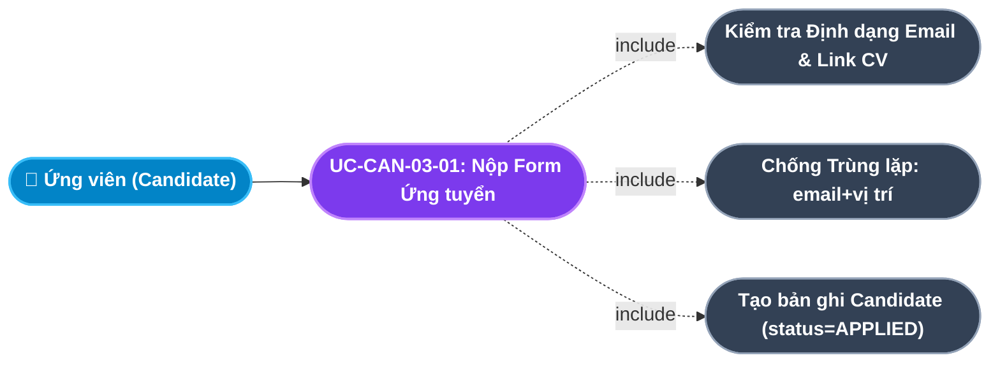
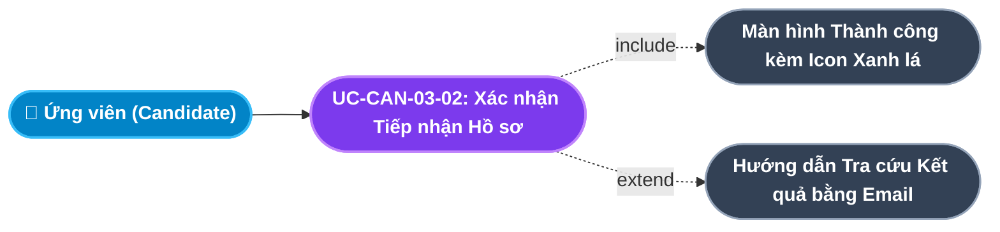
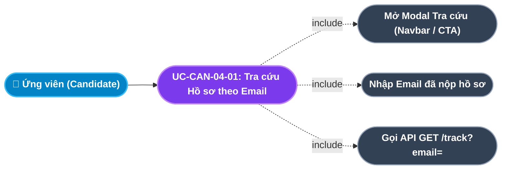
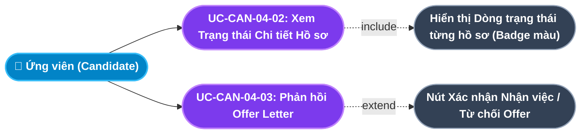
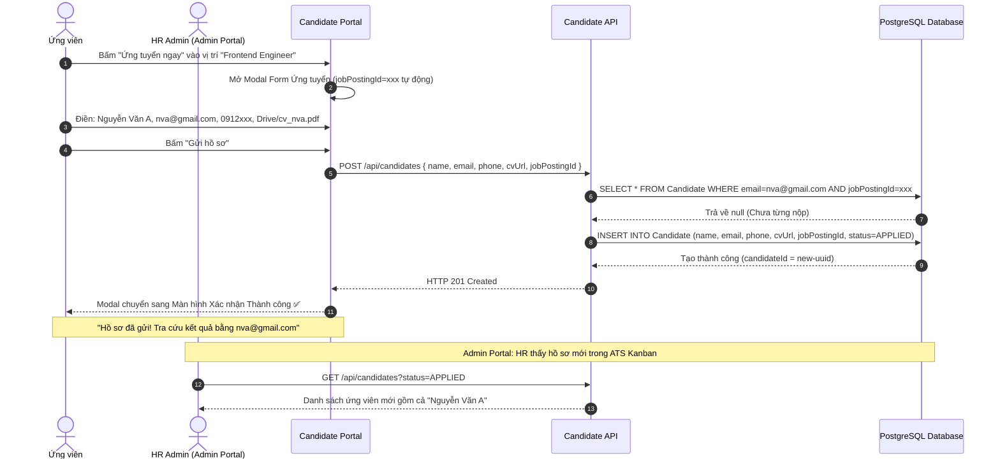
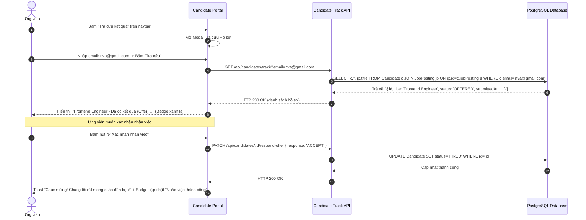

# Usecase: UC-CAN-03 & UC-CAN-04 - Nộp Hồ sơ Ứng tuyển & Theo dõi Kết quả Hồ sơ (Application Submission & Self-service Tracking)

## 1. Giới thiệu chức năng
- **Mục đích**: Hai chức năng này tạo thành một vòng phản hồi hoàn chỉnh (Complete Feedback Loop) cho ứng viên: Nộp hồ sơ dễ dàng trong vài bước $\rightarrow$ Tự tra cứu kết quả bất kỳ lúc nào mà không cần email hay điện thoại cho nhà tuyển dụng. Dữ liệu ứng viên tự động đồng bộ vào đường ống ATS Kanban của Admin để HR sàng lọc và xử lý.
- **Actor (Tác nhân)**: Ứng viên (Candidate) - Người nộp và theo dõi hồ sơ; Hệ thống Backend - Tự động nhập vào ATS.
- **Điều kiện tiên quyết**: Ứng viên đã xem JD chi tiết và quyết định ứng tuyển (UC-CAN-02-02).

### Danh mục các chức năng con (Sub-features):
1. **UC-CAN-03-01: Điền & Nộp Form Ứng tuyển Trực tuyến (Online Application Form)**: Ứng viên điền form gồm Họ tên, Email, SĐT và Link CV rồi nộp hồ sơ.
2. **UC-CAN-03-02: Nhận Xác nhận Đã tiếp nhận Hồ sơ (Application Confirmation)**: Hiển thị màn hình xác nhận thành công với hướng dẫn tra cứu kết quả.
3. **UC-CAN-04-01: Tra cứu Trạng thái Hồ sơ theo Email (Self-service Tracking)**: Ứng viên nhập email để tìm tất cả hồ sơ đã nộp.
4. **UC-CAN-04-02: Xem Chi tiết Trạng thái Từng Hồ sơ (Application Status Detail)**: Xem trạng thái chi tiết từng vị trí đã nộp (Đang sàng lọc / Chờ phỏng vấn / Có kết quả Offer / Chưa phù hợp).
5. **UC-CAN-04-03: Nhận & Phản hồi Thư mời nhận việc trực tuyến (Offer Response)**: Ứng viên nhận Offer và xác nhận Đồng ý hoặc Từ chối trực tiếp trên cổng.

---

## 2. Dữ liệu nghiệp vụ đầu vào (Input Data & Parameters)

### 2.1. Form Nộp Hồ sơ Ứng tuyển (Application Form Fields)
| Tên trường | Kiểu dữ liệu | Bắt buộc | Ràng buộc nghiệp vụ | Placeholder hiển thị |
|---|---|:---:|---|---|
| `name` | String(100) | Có | Không để trống, tối thiểu 2 từ | "Họ và Tên đầy đủ" |
| `email` | String(150) | Có | Email hợp lệ (regex), là khóa tra cứu duy nhất | "email@congty.com" |
| `phone` | String(15) | Không | 10-11 chữ số, không bắt buộc | "09xxxxxxxxx" |
| `cvUrl` | String(500) | Có | URL hợp lệ trỏ đến Google Drive, Notion, LinkedIn hoặc file PDF | "Link Google Drive / Notion CV" |
| `jobPostingId` | UUID | Có | Tự động từ `selectedJob.id`, không hiển thị với ứng viên | (Ẩn) |
| `status` | Enum | Có | Mặc định `APPLIED` khi tạo | (Tự động) |

### 2.2. Trạng thái Vòng đời Hồ sơ Ứng viên (Candidate Status Lifecycle trong ATS)
| Trạng thái Backend | Nhãn Hiển thị với Ứng viên | Màu sắc | Mô tả với Ứng viên |
|---|---|:---:|---|
| `APPLIED` | Đang sàng lọc hồ sơ | Tím xanh (`#6366f1`) | Hồ sơ đã tiếp nhận, đội HR đang xem xét. |
| `INTERVIEWING` | Chờ lịch phỏng vấn | Vàng cam (`#f59e0b`) | Hồ sơ được chọn, HR sẽ liên hệ sắp xếp phỏng vấn. |
| `OFFERED` | Đã có kết quả (Offer) | Xanh lá (`#10b981`) | Chúc mừng! Công ty đã ra quyết định gửi Thư mời nhận việc. |
| `HIRED` | Nhận việc thành công | Xám sáng (`#e2e8f0`) | Ứng viên đã xác nhận nhận việc và sẽ gia nhập công ty. |
| `REJECTED` | Chưa phù hợp lần này | Đỏ nhạt (`#ef4444`) | Hồ sơ không được chọn ở vòng này. Cảm ơn đã quan tâm. |

---

## 3. Quy tắc nghiệp vụ (Business Rules)

| Mã Quy tắc | Tình huống nghiệp vụ | Cách hệ thống xử lý | Thông báo hiển thị |
|---|---|---|---|
| **BR-CAN-03-01** | **Chống Nộp Hồ sơ Trùng lặp (No Duplicate Application)**: Cùng email nộp cùng vị trí lần 2. | Backend kiểm tra `WHERE email = x AND jobPostingId = y`. Nếu đã tồn tại $\rightarrow$ Trả lỗi `409 Conflict`. | "Email của bạn đã nộp hồ sơ cho vị trí này rồi! Vui lòng tra cứu kết quả bằng chức năng 'Tra cứu hồ sơ'." |
| **BR-CAN-03-02** | **Tự động Vào ATS (Auto ATS Ingestion)**: Hồ sơ được nộp thành công. | Backend tạo bản ghi `Candidate` với `status = APPLIED`. Hồ sơ xuất hiện ngay trong cột "Mới nộp" trên Kanban Board ATS của Admin Portal mà không cần thao tác thêm. | (Tự động, không thông báo với ứng viên) |
| **BR-CAN-03-03** | **Bắt buộc Link CV Hợp lệ (Valid CV Link Required)**: Ứng viên nhập sai định dạng URL CV. | Kiểm tra URL phải bắt đầu bằng `https://` và hợp lệ về cú pháp. Không để ứng viên nhập text tùy ý vào trường CV. | "Vui lòng nhập Link CV hợp lệ (bắt đầu bằng https://)" |
| **BR-CAN-04-01** | **Tra cứu Bảo mật theo Email (Email-based Tracking)**: Ứng viên nhập email để tra cứu. | API chỉ trả về các hồ sơ đúng email đó, không lộ ID ứng viên hay thông tin của người khác. | (Kết quả hiển thị chỉ của email đã nhập) |
| **BR-CAN-04-02** | **Phản hồi Offer có Thời hạn (Offer Response Deadline)**: Ứng viên nhận Offer Letter. | Ứng viên có **5 ngày làm việc** kể từ ngày gửi Offer để xác nhận. Quá hạn $\rightarrow$ Offer tự động hủy và HR sẽ chuyển sang ứng viên dự phòng. | "Offer của bạn sẽ hết hiệu lực sau 5 ngày làm việc. Vui lòng xác nhận trước ngày DD/MM/YYYY." |

---

## 4. Đặc tả chi tiết các Use Case chức năng con (Sub-Use Cases Specification)

---

### 4.1. UC-CAN-03-01: Điền & Nộp Form Ứng tuyển Trực tuyến (Online Application Form)

#### Sơ đồ Use Case:

#### Bảng đặc tả nghiệp vụ:

| STT | Hạng mục | Nội dung chi tiết |
|:---:|---|---|
| **1** | **Thông tin chung** | - **UC ID**: `UC-CAN-03-01` - **UC Name**: Điền & Nộp Form Ứng tuyển Trực tuyến (Online Application Form) - **Actor**: Ứng viên (Candidate) - **Mục tiêu**: Thu thập thông tin liên lạc cơ bản và link CV để HR có đủ dữ liệu đánh giá sơ bộ hồ sơ ứng viên. - **Mô tả**: Ứng viên điền form 4 trường (Họ tên, Email, SĐT, Link CV), hệ thống kiểm tra hợp lệ và tạo ứng viên mới trong CSDL, đồng bộ vào ATS Kanban ngay lập tức. - **Priority**: High (Bắt buộc) |
| **2** | **Trigger** | Ứng viên nhấp nút **"Ứng tuyển ngay"** từ Job Card hoặc từ Modal JD chi tiết. |
| **3** | **Pre-condition** | Vị trí tuyển dụng có `status = PUBLISHED`. |
| **4** | **Post-condition** | Bản ghi `Candidate` được tạo với `status = APPLIED`; Modal form đóng; Màn hình xác nhận thành công hiển thị. |
| **5** | **Main Flow** | 1. Modal Form ứng tuyển mở ra với tiêu đề vị trí đã được điền sẵn. 2. Ứng viên điền: Họ và tên, Email, Số điện thoại (tùy chọn), Link CV (Google Drive, Notion, LinkedIn). 3. Ứng viên nhấn "Gửi hồ sơ". 4. Frontend kiểm tra client-side: email hợp lệ, link CV bắt đầu `https://`, họ tên không rỗng. 5. Gọi `POST /api/candidates` với payload: `{ name, email, phone, cvUrl, jobPostingId }`. 6. Backend kiểm tra trùng lặp email + jobPostingId (BR-CAN-03-01). 7. Tạo bản ghi Candidate với `status = APPLIED` trong CSDL. 8. Trả về `HTTP 201 Created`. 9. Giao diện chuyển sang màn hình xác nhận thành công (UC-CAN-03-02). |
| **6** | **Alternative / Exception Flow** | - **EF-01 (Trùng lặp hồ sơ)**: Email đã ứng tuyển vị trí này $\rightarrow$ Toast lỗi: *"Email của bạn đã nộp hồ sơ cho vị trí này rồi!"* (BR-CAN-03-01). - **EF-02 (Email không hợp lệ)**: Sai định dạng email $\rightarrow$ Toast lỗi: *"Vui lòng nhập đúng định dạng Email!"*. - **EF-03 (Link CV không hợp lệ)**: URL không bắt đầu bằng `https://` $\rightarrow$ Toast lỗi: *"Link CV phải là URL hợp lệ!"* (BR-CAN-03-03). |
| **7** | **Business Rules & Validation** | - Chống trùng lặp hồ sơ (BR-CAN-03-01). - Email là khóa tra cứu duy nhất, phải hợp lệ (BR-CAN-04-01). |
| **8** | **Acceptance Criteria** | - **AC-01**: Hồ sơ nộp thành công xuất hiện ngay trong ATS Kanban của Admin dưới cột "Mới nộp". - **AC-02**: Ứng viên nhận được thông báo xác nhận với hướng dẫn tra cứu kết quả bằng email. |

---

### 4.2. UC-CAN-03-02: Nhận Xác nhận Đã tiếp nhận Hồ sơ (Application Confirmation)

#### Sơ đồ Use Case:

#### Bảng đặc tả nghiệp vụ:

| STT | Hạng mục | Nội dung chi tiết |
|:---:|---|---|
| **1** | **Thông tin chung** | - **UC ID**: `UC-CAN-03-02` - **UC Name**: Nhận Xác nhận Đã tiếp nhận Hồ sơ (Application Confirmation) - **Actor**: Ứng viên (Candidate) - **Mục tiêu**: Tạo sự an tâm cho ứng viên rằng hồ sơ đã được hệ thống tiếp nhận thành công và hướng dẫn bước tiếp theo. - **Mô tả**: Ngay sau khi API tạo hồ sơ thành công, modal form ứng tuyển thay thế bằng màn hình xác nhận thành công (không đóng modal) với icon CheckCircle màu xanh lá, thông điệp chào mừng và hướng dẫn sử dụng chức năng tra cứu kết quả. - **Priority**: High (Bắt buộc) |
| **2** | **Trigger** | API `POST /api/candidates` trả về `HTTP 201 Created`. |
| **3** | **Pre-condition** | Hồ sơ đã được tạo thành công trong CSDL. |
| **4** | **Post-condition** | Ứng viên biết chắc hồ sơ đã được tiếp nhận và biết cách tra cứu kết quả sau này. |
| **5** | **Main Flow** | 1. Sau khi API trả 201, component chuyển `applySuccess = true`. 2. Modal form ứng tuyển thay thế nội dung bằng màn hình thành công:    - Icon ✅ CheckCircle màu xanh lá, kích thước lớn (64px).    - Tiêu đề: "Hồ sơ đã được gửi thành công!"    - Nội dung: "Cảm ơn bạn đã quan tâm đến vị trí [Tên vị trí]. Đội ngũ HR của chúng tôi sẽ xem xét hồ sơ và liên hệ qua email [email ứng viên] trong thời gian sớm nhất."    - Hướng dẫn: "Bạn có thể theo dõi trạng thái hồ sơ bằng chức năng **Tra cứu kết quả** trên trang web." 3. Nút "Đóng" để ứng viên trở lại trang việc làm. |
| **6** | **Alternative / Exception Flow** | Không có exception; nếu API lỗi $\rightarrow$ Không hiển thị màn hình này, giữ nguyên form. |
| **7** | **Business Rules & Validation** | - Màn hình xác nhận không được đóng tự động; phải chờ ứng viên chủ động nhấn "Đóng". |
| **8** | **Acceptance Criteria** | - **AC-01**: Màn hình xác nhận hiển thị đúng email và tên vị trí ứng viên vừa nộp. - **AC-02**: Sau khi đóng, ứng viên được đưa trở lại trang danh sách việc làm. |

---

### 4.3. UC-CAN-04-01: Tra cứu Trạng thái Hồ sơ theo Email (Self-service Application Tracking)

#### Sơ đồ Use Case:

#### Bảng đặc tả nghiệp vụ:

| STT | Hạng mục | Nội dung chi tiết |
|:---:|---|---|
| **1** | **Thông tin chung** | - **UC ID**: `UC-CAN-04-01` - **UC Name**: Tra cứu Trạng thái Hồ sơ theo Email (Self-service Application Tracking) - **Actor**: Ứng viên (Candidate) - **Mục tiêu**: Trao quyền tự chủ hoàn toàn cho ứng viên trong việc theo dõi tiến trình xét duyệt hồ sơ mà không cần liên hệ HR. - **Mô tả**: Ứng viên nhấp "Tra cứu kết quả" trên navbar hoặc Hero CTA, modal tra cứu mở ra với ô nhập email. Nhập email đã dùng khi nộp hồ sơ, hệ thống trả về tất cả hồ sơ liên kết với email đó cùng trạng thái hiện tại. - **Priority**: High (Bắt buộc) |
| **2** | **Trigger** | Ứng viên nhấp nút **"Tra cứu kết quả"** trên navbar hoặc nút "Tra cứu hồ sơ" trên Hero Banner. |
| **3** | **Pre-condition** | Không yêu cầu đăng nhập. Ứng viên đã nộp hồ sơ ít nhất 1 lần trước đó. |
| **4** | **Post-condition** | Danh sách hồ sơ cùng trạng thái hiển thị trong modal. |
| **5** | **Main Flow** | 1. Ứng viên nhấp "Tra cứu kết quả". 2. Modal tra cứu mở ra với ô nhập email và nút "Tra cứu". 3. Ứng viên nhập email đã dùng khi nộp hồ sơ. 4. Nhấn "Tra cứu" hoặc Enter. 5. Gọi `GET /api/candidates/track?email=xxx`. 6. Backend tìm tất cả `Candidate` có `email = xxx`. 7. Hiển thị danh sách kết quả (UC-CAN-04-02). |
| **6** | **Alternative / Exception Flow** | - **EF-01 (Email không tìm thấy hồ sơ nào)**: API trả mảng rỗng $\rightarrow$ Hiển thị: *"Không tìm thấy hồ sơ nào với email này. Kiểm tra lại địa chỉ email hoặc nộp hồ sơ mới!"*. |
| **7** | **Business Rules & Validation** | - Email nhập phải hợp lệ về định dạng trước khi gọi API. - API chỉ trả hồ sơ của email đó (BR-CAN-04-01). |
| **8** | **Acceptance Criteria** | - **AC-01**: Kết quả tra cứu chỉ hiển thị hồ sơ của email đã nhập. - **AC-02**: Kết quả phản hồi trong vòng 1 giây. |

---

### 4.4. UC-CAN-04-02 & UC-CAN-04-03: Xem Chi tiết & Phản hồi Offer Letter

#### Sơ đồ Use Case:

#### Bảng đặc tả nghiệp vụ:

| STT | Hạng mục | Nội dung chi tiết |
|:---:|---|---|
| **1** | **Thông tin chung** | - **UC ID**: `UC-CAN-04-02` & `UC-CAN-04-03` - **UC Name**: Xem Chi tiết Trạng thái & Phản hồi Offer Letter (Application Status Detail & Offer Response) - **Actor**: Ứng viên (Candidate) - **Mục tiêu**: Cung cấp bức tranh toàn cảnh về tiến trình từng hồ sơ và cho phép ứng viên chủ động phản hồi Offer thay vì chỉ dùng email. - **Mô tả**: Sau khi tra cứu, danh sách hồ sơ hiển thị với badge trạng thái màu sắc trực quan. Hồ sơ ở trạng thái `OFFERED` xuất hiện 2 nút hành động: "✅ Xác nhận nhận việc" và "❌ Từ chối Offer". - **Priority**: Medium |
| **2** | **Trigger** | Kết quả tra cứu trả về từ API (UC-CAN-04-01). |
| **3** | **Pre-condition** | Email có ít nhất 1 hồ sơ trong CSDL. |
| **4** | **Post-condition** | Ứng viên nắm rõ trạng thái từng hồ sơ; Offer được xác nhận/từ chối cập nhật vào CSDL. |
| **5** | **Main Flow** | 1. Danh sách hồ sơ hiển thị sau khi tra cứu email. 2. Mỗi dòng gồm: Tên vị trí đã nộp, Ngày nộp, Badge trạng thái với màu tương ứng. 3. Nếu hồ sơ ở `OFFERED`:    - Hiển thị thông điệp: "🎉 Chúc mừng! Bạn đã nhận được thư mời nhận việc!"    - Nút "Xác nhận nhận việc" (xanh lá) và "Từ chối" (xám/đỏ).    - Thời hạn phản hồi Offer được hiển thị rõ ràng (BR-CAN-04-02). 4. Ứng viên nhấn "Xác nhận nhận việc":    - Gọi `PATCH /api/candidates/:id/respond-offer { response: 'ACCEPT' }`.    - Backend cập nhật `status = HIRED`.    - Hiển thị thông báo: "Chúc mừng! Chúng tôi rất mong được đón nhận bạn vào đội ngũ!". 5. Ứng viên nhấn "Từ chối":    - Gọi API với `{ response: 'REJECT' }`.    - Backend cập nhật `status = REJECTED`.    - Hiển thị thông báo lịch sự: "Cảm ơn bạn đã phản hồi. Chúc bạn tìm được cơ hội phù hợp hơn!" |
| **6** | **Alternative / Exception Flow** | - **EF-01 (Offer hết thời hạn)**: Ứng viên cố phản hồi Offer đã quá 5 ngày $\rightarrow$ Backend từ chối và báo: *"Thời hạn phản hồi Offer đã qua. Vui lòng liên hệ HR!"* (BR-CAN-04-02). |
| **7** | **Business Rules & Validation** | - Thời hạn phản hồi Offer tối đa 5 ngày làm việc (BR-CAN-04-02). - Sau khi phản hồi Offer, các nút không còn hoạt động (idempotent). |
| **8** | **Acceptance Criteria** | - **AC-01**: Badge trạng thái hiển thị đúng màu sắc và nhãn theo bảng mapping. - **AC-02**: Sau khi xác nhận nhận việc, hồ sơ trên ATS Admin Portal cập nhật `status = HIRED` tức thì. |

---

## 5. Sơ đồ tuần tự nghiệp vụ (Sequence Diagrams)

### 5.1. Luồng Nộp Hồ sơ Ứng tuyển Đầy đủ & Đồng bộ ATS

---

### 5.2. Luồng Ứng viên Tra cứu Kết quả & Phản hồi Offer Letter

---

## 6. Ma trận kịch bản kiểm thử (Test Scenarios & Acceptance Matrix)

| Test ID | Chức năng con | Tiêu đề kịch bản | Dữ liệu đầu vào | Các bước | Kết quả kỳ vọng | Mức độ |
|---|---|---|---|---|---|:---:|
| **TC-CAN-03-01** | UC-CAN-03-01 | Nộp hồ sơ thành công hoàn chỉnh | Tên, email hợp lệ, link Drive, vị trí mở | 1. Mở form. 2. Điền đủ. 3. Bấm Gửi. | Màn hình xác nhận thành công. Candidate xuất hiện trong ATS Admin. | P0 |
| **TC-CAN-03-02** | UC-CAN-03-01 | Chặn nộp hồ sơ trùng email+vị trí | Email cũ đã nộp vị trí này | 1. Nộp lần 2 cùng email cùng vị trí. | Toast lỗi "Đã nộp hồ sơ cho vị trí này rồi!". | P0 |
| **TC-CAN-03-03** | UC-CAN-03-01 | Validate email sai định dạng | Email: "notvalid" | 1. Nhập email sai. 2. Bấm Gửi. | Báo lỗi "Email không hợp lệ", không gọi API. | P0 |
| **TC-CAN-03-04** | UC-CAN-03-01 | Validate Link CV không hợp lệ | cvUrl: "my cv link" (không có https://) | 1. Nhập link CV sai. 2. Bấm Gửi. | Báo lỗi "Link CV phải là URL hợp lệ". | P1 |
| **TC-CAN-03-05** | UC-CAN-03-02 | Màn hình xác nhận hiển thị đúng email | Nộp với nva@gmail.com | 1. Nộp hồ sơ thành công. | Màn hình hiển thị đúng email "nva@gmail.com". | P1 |
| **TC-CAN-04-01** | UC-CAN-04-01 | Tra cứu hồ sơ theo email hợp lệ | Email đã nộp: nva@gmail.com | 1. Nhập email. 2. Bấm Tra cứu. | Danh sách hồ sơ đã nộp của email đó hiển thị. | P0 |
| **TC-CAN-04-02** | UC-CAN-04-01 | Email không tìm thấy hồ sơ | Email: noone@test.com (chưa nộp) | 1. Tra cứu email này. | Thông báo "Không tìm thấy hồ sơ nào với email này". | P1 |
| **TC-CAN-04-03** | UC-CAN-04-02 | Badge màu đúng theo trạng thái | Hồ sơ OFFERED | 1. Tra cứu email. 2. Quan sát badge. | Badge màu xanh lá "Đã có kết quả (Offer)". | P1 |
| **TC-CAN-04-04** | UC-CAN-04-03 | Xác nhận Offer - cập nhật HIRED | Hồ sơ status=OFFERED | 1. Bấm "Xác nhận nhận việc". 2. Kiểm tra ATS Admin. | Status = HIRED cả trên Candidate Portal và ATS Admin. | P0 |
| **TC-CAN-04-05** | UC-CAN-04-03 | Từ chối Offer - cập nhật REJECTED | Hồ sơ status=OFFERED | 1. Bấm "Từ chối". 2. Kiểm tra. | Status = REJECTED, hiển thị thông báo lịch sự. | P1 |
