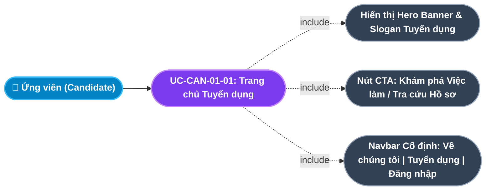
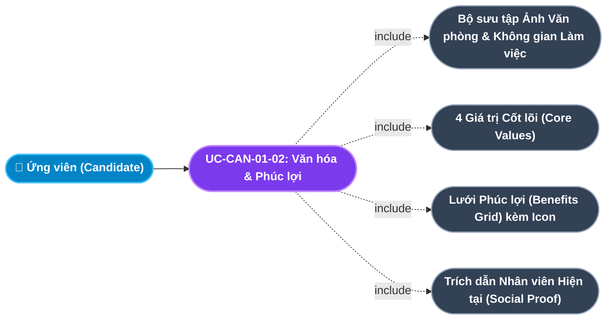
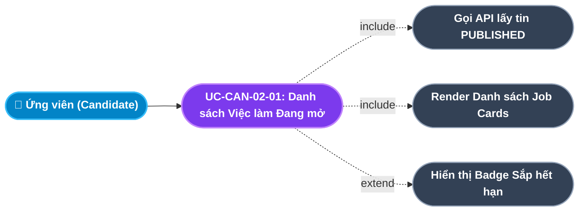
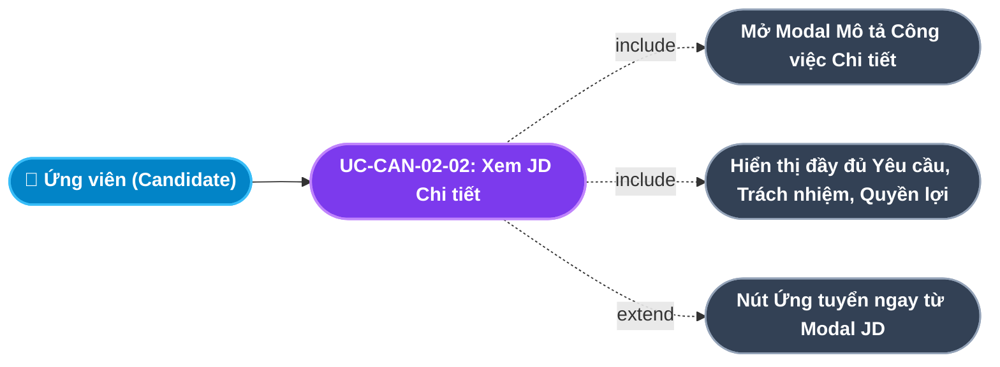
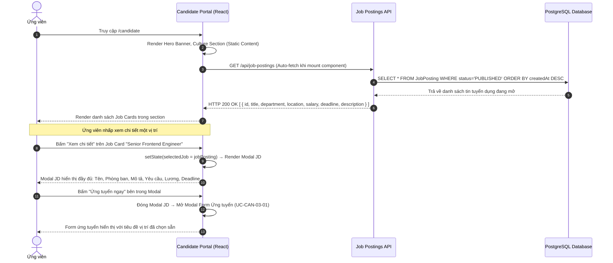

# Usecase: UC-CAN-01 & UC-CAN-02 - Trang chủ Tuyển dụng, Thương hiệu Doanh nghiệp & Khám phá Việc làm (Career Landing, Employer Branding & Job Discovery)

## 1. Giới thiệu chức năng
- **Mục đích**: Đây là tầng đầu tiên trong phễu tuyển dụng (Recruitment Funnel) - nơi chuyển một người lạ thành ứng viên tiềm năng. Trang chủ phải trả lời được 3 câu hỏi cốt lõi trong vòng 10 giây đầu tiên: "Công ty này làm gì?", "Môi trường làm việc như thế nào?" và "Có vị trí nào phù hợp với mình không?".
- **Actor (Tác nhân)**: Ứng viên (Candidate) - Bất kỳ người dùng nào truy cập `/candidate`, không yêu cầu đăng nhập.
- **Điều kiện tiên quyết**: Hệ thống backend đang hoạt động, đã có ít nhất 1 tin tuyển dụng với `status = PUBLISHED`.

### Danh mục các chức năng con (Sub-features):
1. **UC-CAN-01-01: Tiếp cận Trang chủ Tuyển dụng & Thương hiệu (Career Landing Page)**: Hero banner, khẩu hiệu tuyển dụng, nút CTA nhanh (Khám phá việc làm / Tra cứu hồ sơ) và điều hướng navbar cố định.
2. **UC-CAN-01-02: Khám phá Văn hóa Doanh nghiệp & Chế độ Phúc lợi (Culture & Benefits Showcase)**: Khu vực giới thiệu không gian văn phòng, giá trị cốt lõi, phúc lợi nổi bật, đánh giá của nhân viên (Testimonials).
3. **UC-CAN-02-01: Xem Danh sách Vị trí Tuyển dụng Đang mở (Live Job Listings)**: Danh sách tin tuyển dụng đang hoạt động (`PUBLISHED`) với thông tin tóm tắt và nút ứng tuyển nhanh.
4. **UC-CAN-02-02: Xem Mô tả Công việc Chi tiết (Job Detail / JD Popup)**: Modal hiển thị toàn bộ thông tin JD: Yêu cầu, Trách nhiệm, Phúc lợi, Địa điểm, Hình thức.

---

## 2. Dữ liệu nghiệp vụ đầu vào (Input Data & Parameters)

### 2.1. Cấu trúc Tin tuyển dụng (Job Posting Schema) - Hiển thị với Ứng viên
| Tên trường | Kiểu dữ liệu | Mô tả cho Ứng viên |
|---|---|---|
| `title` | String | Tên vị trí công việc (VD: "Senior Frontend Engineer") |
| `departmentId` | FK $\rightarrow$ Department | Phòng ban cần tuyển (VD: "Phòng Kỹ thuật") |
| `location` | String | Địa điểm làm việc (VD: "Hà Nội", "Remote") |
| `employmentType` | Enum | Hình thức: `FULL_TIME`, `PART_TIME`, `CONTRACT`, `INTERNSHIP` |
| `salaryRange` | String | Mức lương tham khảo (VD: "25 - 40 triệu VNĐ") hoặc "Thỏa thuận" |
| `description` | Text | Mô tả công việc, yêu cầu kỹ năng và quyền lợi đầy đủ (Rich text / Markdown) |
| `deadline` | Date | Hạn nộp hồ sơ cuối cùng |
| `status` | Enum | `PUBLISHED` = Đang tuyển, Ứng viên được xem |

### 2.2. Nội dung Thương hiệu Tuyển dụng (Employer Branding Content)
| Mục | Nội dung | Mục tiêu Tuyển dụng |
|---|---|---|
| **Hero Banner** | Slogan tuyển dụng, ảnh đội ngũ, background gradient | Tạo ấn tượng đầu tiên mạnh mẽ trong 3 giây |
| **Hình ảnh Văn phòng** | Ảnh không gian làm việc, phòng họp, khu vực nghỉ | Chứng minh môi trường chuyên nghiệp và hiện đại |
| **Giá trị Cốt lõi** | 4-6 giá trị công ty kèm icon (Innovation, Teamwork...) | Lọc ứng viên phù hợp với văn hóa doanh nghiệp |
| **Phúc lợi Nổi bật** | Bảo hiểm toàn diện, thưởng KPI, nghỉ phép linh hoạt, ăn trưa miễn phí | Thu hút ứng viên và phân biệt với đối thủ |
| **Testimonials** | 2-3 trích dẫn/cảm nhận của nhân viên hiện tại | Xây dựng độ tin cậy (Social Proof) |

---

## 3. Quy tắc nghiệp vụ (Business Rules)

| Mã Quy tắc | Tình huống nghiệp vụ | Cách hệ thống xử lý | Thông báo hiển thị |
|---|---|---|---|
| **BR-CAN-01-01** | **Chỉ Hiển thị Tin Đang mở (Active Jobs Only)**: Ứng viên truy cập trang tuyển dụng. | API lọc `WHERE status = 'PUBLISHED'`. Tin `DRAFT`, `CLOSED` hoặc `FILLED` tuyệt đối không được trả về. | (Không thông báo; chỉ hiển thị đúng tin còn mở) |
| **BR-CAN-01-02** | **Hiển thị Hạn Nộp Hồ sơ (Deadline Awareness)**: Tin tuyển dụng sắp đến hạn (còn < 7 ngày). | Hiển thị badge "Sắp hết hạn" màu đỏ bên cạnh tên vị trí để tạo cảm giác khẩn cấp (FOMO). | Badge đỏ: "⚠️ Còn X ngày" |
| **BR-CAN-01-03** | **Tin Hết hạn Tự động Đóng (Auto-close Expired Postings)**: Cron job chạy hằng ngày check các tin có `deadline < today`. | Cron tự động chuyển `status = CLOSED`. Tin không còn xuất hiện trên cổng ứng viên. | (Tự động, không thông báo) |

---

## 4. Đặc tả chi tiết các Use Case chức năng con (Sub-Use Cases Specification)

---

### 4.1. UC-CAN-01-01: Tiếp cận Trang chủ Tuyển dụng & Thương hiệu (Career Landing Page)

#### Sơ đồ Use Case:

#### Bảng đặc tả nghiệp vụ:

| STT | Hạng mục | Nội dung chi tiết |
|:---:|---|---|
| **1** | **Thông tin chung** | - **UC ID**: `UC-CAN-01-01` - **UC Name**: Tiếp cận Trang chủ Tuyển dụng & Thương hiệu (Career Landing Page) - **Actor**: Ứng viên (Candidate) - **Mục tiêu**: Tạo ấn tượng đầu tiên chuyên nghiệp và dẫn dắt ứng viên khám phá tiếp các nội dung tuyển dụng. - **Mô tả**: Ứng viên vào `/candidate`, thấy ngay Hero Banner toàn màn hình với logo, slogan tuyển dụng, background gradient và 2 nút CTA nổi bật. Navbar cố định ở đầu trang cho phép điều hướng nhanh. - **Priority**: High (Bắt buộc) |
| **2** | **Trigger** | Ứng viên gõ URL `/candidate` hoặc nhấp vào link tuyển dụng được chia sẻ. |
| **3** | **Pre-condition** | Không yêu cầu đăng nhập. Trang tải được ngay cả khi Backend không phản hồi (nội dung tĩnh). |
| **4** | **Post-condition** | Ứng viên có thể cuộn trang để khám phá các phần nội dung bên dưới hoặc nhấp CTA để đến thẳng danh sách việc làm. |
| **5** | **Main Flow** | 1. Ứng viên truy cập `/candidate`. 2. Trang tải với hiệu ứng `animate-fade-in` mượt mà. 3. Hiển thị Navbar cố định: Logo "LLA Careers" + Menu "Về chúng tôi", "Tuyển dụng", nút "Tra cứu kết quả" + nút "Đăng nhập". 4. Hero Banner: Slogan "Kiến tạo tương lai cùng Công ty TNHH LLA", mô tả ngắn về sứ mệnh. 5. 2 nút CTA: "Khám phá cơ hội ngay" (scrolls to #jobs) và "Tra cứu hồ sơ" (mở modal tracking). 6. Hiệu ứng Ambient Glow (ánh sáng nền gradient mờ) tạo chiều sâu thị giác. |
| **6** | **Alternative / Exception Flow** | - **EF-01 (Backend offline)**: Nội dung tĩnh trang chủ vẫn hiển thị bình thường. Chỉ phần danh sách việc làm mới bị ảnh hưởng $\rightarrow$ Hiển thị trạng thái đang tải. |
| **7** | **Business Rules & Validation** | - Trang phải tải xong (LCP) trong vòng 2.5 giây trên kết nối 4G chuẩn. - SEO: `<title>Tuyển dụng | LLA Enterprise</title>`, meta description hợp lệ. |
| **8** | **Acceptance Criteria** | - **AC-01**: Ứng viên thấy rõ tên công ty và slogan tuyển dụng khi vào trang (không cần cuộn). - **AC-02**: Cả 2 nút CTA dẫn đúng đến section việc làm và modal tra cứu. |

---

### 4.2. UC-CAN-01-02: Khám phá Văn hóa Doanh nghiệp & Chế độ Phúc lợi (Culture & Benefits Showcase)

#### Sơ đồ Use Case:

#### Bảng đặc tả nghiệp vụ:

| STT | Hạng mục | Nội dung chi tiết |
|:---:|---|---|
| **1** | **Thông tin chung** | - **UC ID**: `UC-CAN-01-02` - **UC Name**: Khám phá Văn hóa Doanh nghiệp & Chế độ Phúc lợi (Culture & Benefits Showcase) - **Actor**: Ứng viên (Candidate) - **Mục tiêu**: Thuyết phục ứng viên rằng đây là môi trường làm việc lý tưởng và kích thích họ ứng tuyển. - **Mô tả**: Phần nội dung phong phú phía dưới Hero Banner, bao gồm: Thư viện ảnh văn phòng thực tế (hover zoom effect), Lưới 4 giá trị cốt lõi (Innovation, Integrity, Impact, Inclusion), Bảng lợi ích bao gồm 8+ mục phúc lợi nổi bật và Carousel trích dẫn cảm nhận của nhân viên hiện tại. - **Priority**: Medium |
| **2** | **Trigger** | Ứng viên cuộn trang xuống từ Hero Banner. |
| **3** | **Pre-condition** | Nội dung tĩnh, không phụ thuộc API. |
| **4** | **Post-condition** | Ứng viên có thêm lý do để tiếp tục khám phá danh sách vị trí tuyển dụng. |
| **5** | **Main Flow** | 1. Ứng viên cuộn xuống phần Workspace Gallery. 2. Xem 2 ảnh văn phòng thực tế với hiệu ứng hover scale-up mượt mà. 3. Phần Core Values: 4 card với icon emoji, tên giá trị và mô tả ngắn 1-2 câu. 4. Phần Phúc lợi: Lưới 4 cột với 8+ mục phúc lợi (Bảo hiểm toàn diện, Laptop cao cấp, Thưởng cuối năm, Đào tạo & Chứng chỉ, Ăn trưa miễn phí, Flexible working hours, Team Building, Health Check hàng năm). 5. Phần Testimonials: 2-3 card trích dẫn tên, chức danh và câu nói ấn tượng của nhân viên. |
| **6** | **Alternative / Exception Flow** | - Không có Exception Flow (nội dung tĩnh 100%). |
| **7** | **Business Rules & Validation** | - Hình ảnh văn phòng phải được tối ưu (format WebP, < 200KB mỗi ảnh) để không ảnh hưởng tốc độ tải trang. | 
| **8** | **Acceptance Criteria** | - **AC-01**: Ảnh văn phòng hiển thị rõ nét, không bị vỡ layout trên màn hình 1280px. - **AC-02**: Phần phúc lợi hiển thị tối thiểu 6 mục phúc lợi nổi bật với icon. |

---

### 4.3. UC-CAN-02-01: Xem Danh sách Vị trí Tuyển dụng Đang mở (Live Job Listings)

#### Sơ đồ Use Case:

#### Bảng đặc tả nghiệp vụ:

| STT | Hạng mục | Nội dung chi tiết |
|:---:|---|---|
| **1** | **Thông tin chung** | - **UC ID**: `UC-CAN-02-01` - **UC Name**: Xem Danh sách Vị trí Tuyển dụng Đang mở (Live Job Listings) - **Actor**: Ứng viên (Candidate) - **Mục tiêu**: Cho phép ứng viên nhanh chóng quét qua tất cả vị trí đang cần người và tìm đúng cơ hội phù hợp nhất. - **Mô tả**: Section `#jobs` hiển thị danh sách các Job Card từ API. Mỗi card hiển thị tóm tắt nhanh về vị trí. Ứng viên có thể nhấp vào card để xem JD chi tiết hoặc nhấn thẳng "Ứng tuyển ngay". - **Priority**: High (Bắt buộc) |
| **2** | **Trigger** | Trang tải xong và tự động gọi API. Hoặc ứng viên nhấp CTA "Khám phá cơ hội ngay" từ Hero. |
| **3** | **Pre-condition** | Có ít nhất 1 tin tuyển dụng với `status = PUBLISHED` trong CSDL. |
| **4** | **Post-condition** | Danh sách job cards được render đầy đủ theo dữ liệu thực từ CSDL. |
| **5** | **Main Flow** | 1. Trang gọi `GET /api/job-postings?status=PUBLISHED`. 2. Backend trả về mảng các tin tuyển dụng đang mở. 3. Render từng Job Card: Icon vị trí, Tên công việc (đậm), Phòng ban, Địa điểm (MapPin icon), Hình thức (Briefcase icon), Mức lương, Nút "Xem chi tiết" + Nút "Ứng tuyển ngay". 4. Tin còn < 7 ngày deadline $\rightarrow$ Badge đỏ "Sắp hết hạn" hiển thị góc trên card. |
| **6** | **Alternative / Exception Flow** | - **EF-01 (Không có tin nào)**: API trả về mảng rỗng $\rightarrow$ Hiển thị trạng thái: *"Hiện tại chưa có vị trí nào đang tuyển dụng. Hãy quay lại sau!"*. |
| **7** | **Business Rules & Validation** | - Chỉ hiển thị `status = PUBLISHED` (BR-CAN-01-01). - Badge cảnh báo deadline xuất hiện khi còn < 7 ngày (BR-CAN-01-02). |
| **8** | **Acceptance Criteria** | - **AC-01**: Số lượng Job Card hiển thị đúng bằng số tin PUBLISHED trong CSDL. - **AC-02**: Tin đã đóng (`CLOSED`) không xuất hiện trong danh sách. |

---

### 4.4. UC-CAN-02-02: Xem Mô tả Công việc Chi tiết (Job Detail / JD Popup)

#### Sơ đồ Use Case:

#### Bảng đặc tả nghiệp vụ:

| STT | Hạng mục | Nội dung chi tiết |
|:---:|---|---|
| **1** | **Thông tin chung** | - **UC ID**: `UC-CAN-02-02` - **UC Name**: Xem Mô tả Công việc Chi tiết (Job Detail / JD Popup) - **Actor**: Ứng viên (Candidate) - **Mục tiêu**: Cung cấp đầy đủ thông tin để ứng viên tự đánh giá mức độ phù hợp trước khi quyết định nộp hồ sơ. - **Mô tả**: Khi nhấp "Xem chi tiết", hệ thống mở modal toàn màn hình hiển thị toàn bộ nội dung JD của vị trí được chọn: Tên vị trí, Phòng ban, Địa điểm, Hình thức làm việc, Mức lương tham khảo, Hạn nộp hồ sơ và mô tả đầy đủ công việc. - **Priority**: High (Bắt buộc) |
| **2** | **Trigger** | Ứng viên nhấp nút "Xem chi tiết" (ChevronRight icon) trên một Job Card bất kỳ. |
| **3** | **Pre-condition** | Tin tuyển dụng đang ở `status = PUBLISHED`. |
| **4** | **Post-condition** | Modal hiển thị đầy đủ nội dung JD; Ứng viên đọc và quyết định có ứng tuyển không. |
| **5** | **Main Flow** | 1. Ứng viên nhấp "Xem chi tiết" trên Job Card. 2. Modal overlay toàn màn hình hiện ra với hiệu ứng slide-in hoặc fade-in. 3. Nội dung modal: Header (Tên vị trí, logo phòng ban), các pill thông tin (Địa điểm, Loại hình, Lương, Hạn nộp), mô tả công việc đầy đủ (Responsibilities / Requirements / Benefits) dạng rich text. 4. Dưới cùng modal: Nút "Ứng tuyển ngay" (primary) và nút "Đóng" (outline). 5. Nhấn "Ứng tuyển ngay" $\rightarrow$ Đóng modal này và mở modal Form ứng tuyển (chuyển sang UC-CAN-03-01). |
| **6** | **Alternative / Exception Flow** | - **EF-01 (Ứng viên đóng modal)**: Bấm nút Đóng hoặc nhấn phím Escape $\rightarrow$ Modal đóng, trở lại danh sách tin tuyển dụng. |
| **7** | **Business Rules & Validation** | - Modal phải scroll được bên trong nếu nội dung JD quá dài (không cuộn toàn trang). - SEO: Nội dung JD nên có thể được index bởi công cụ tìm kiếm (SEO-friendly URL hoặc structured data). |
| **8** | **Acceptance Criteria** | - **AC-01**: Modal hiển thị đúng thông tin JD của vị trí đã nhấp, không bị lẫn với vị trí khác. - **AC-02**: Có thể đọc toàn bộ nội dung JD dài mà không cần cuộn toàn trang. |

---

## 5. Sơ đồ tuần tự nghiệp vụ (Sequence Diagrams)

### 5.1. Luồng Ứng viên Khám phá Danh sách Việc làm đến Xem JD Chi tiết

---

## 6. Ma trận kịch bản kiểm thử (Test Scenarios & Acceptance Matrix)

| Test ID | Chức năng con | Tiêu đề kịch bản | Dữ liệu đầu vào | Các bước | Kết quả kỳ vọng | Mức độ |
|---|---|---|---|---|---|:---:|
| **TC-CAN-01-01** | UC-CAN-01-01 | Trang chủ tải đầy đủ nội dung | URL: /candidate | 1. Mở trình duyệt ẩn danh. 2. Truy cập /candidate. | Hero banner, navbar, 2 nút CTA hiển thị trong < 3 giây. | P0 |
| **TC-CAN-01-02** | UC-CAN-01-01 | Nút CTA "Khám phá cơ hội" hoạt động | Nút CTA trên Hero | 1. Bấm nút "Khám phá cơ hội ngay". | Trang cuộn mượt mà đến section #jobs. | P1 |
| **TC-CAN-01-03** | UC-CAN-01-02 | Hiển thị đúng nội dung Phúc lợi | Trang /candidate | 1. Cuộn đến phần Benefits. | Tối thiểu 6 mục phúc lợi hiển thị rõ ràng với icon. | P1 |
| **TC-CAN-02-01** | UC-CAN-02-01 | Hiển thị danh sách tin PUBLISHED | CSDL có 5 tin PUBLISHED, 2 tin DRAFT | 1. Vào trang /candidate. | Chỉ 5 Job Card hiển thị, không có tin DRAFT. | P0 |
| **TC-CAN-02-02** | UC-CAN-02-01 | Badge sắp hết hạn hiển thị đúng | Tin có deadline = ngày mai | 1. Kiểm tra Job Card của tin đó. | Hiển thị badge đỏ "Sắp hết hạn" hoặc "Còn 1 ngày". | P1 |
| **TC-CAN-02-03** | UC-CAN-02-01 | Trang trống khi không có tin nào | Không có tin PUBLISHED | 1. Xóa hết tin PUBLISHED. 2. Vào trang. | Hiển thị thông báo "Chưa có vị trí nào đang tuyển dụng". | P2 |
| **TC-CAN-02-04** | UC-CAN-02-02 | Xem JD đúng vị trí đã click | Nhấp vào "Frontend Engineer" | 1. Bấm Xem chi tiết. 2. Đọc tên vị trí trong modal. | Modal hiển thị tên "Senior Frontend Engineer" đúng với card đã nhấp. | P0 |
| **TC-CAN-02-05** | UC-CAN-02-02 | Đóng modal JD bằng Escape | Modal JD đang mở | 1. Nhấn phím Escape. | Modal đóng, trở lại trang danh sách jobs. | P2 |
