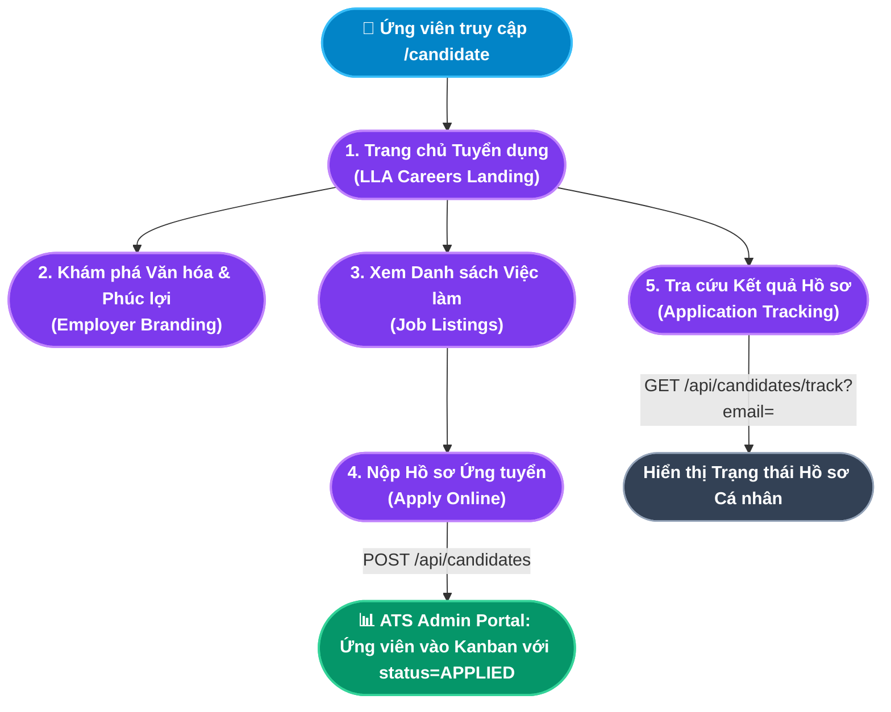

# TÀI LIỆU PHÂN TÍCH NGHIỆP VỤ - MODULE CỔNG TUYỂN DỤNG ỨNG VIÊN (CANDIDATE CAREER PORTAL)

## 1. Giới thiệu tổng quan Module
**Cổng Tuyển dụng Ứng viên (Candidate Career Portal)** là trang web đối ngoại công khai (`/candidate`) - Mặt tiền số (Digital Storefront) của doanh nghiệp trong cuộc chiến thu hút nhân tài. Đây là điểm tiếp xúc đầu tiên (First Touchpoint) giữa ứng viên tiềm năng và công ty, hoạt động độc lập, không yêu cầu đăng nhập tài khoản nội bộ và được tối ưu hóa cho cả trình duyệt desktop lẫn mobile.

Cổng thực hiện **2 mục tiêu chiến lược**:
1. **Xây dựng Thương hiệu Tuyển dụng (Employer Branding)**: Truyền tải văn hóa công ty, giá trị cốt lõi, môi trường làm việc và chế độ đãi ngộ hấp dẫn để thu hút đúng tập hồ sơ mục tiêu.
2. **Đơn giản hóa Quy trình Ứng tuyển (Frictionless Application)**: Cho phép ứng viên tìm kiếm, xem mô tả công việc chi tiết (JD), nộp hồ sơ và theo dõi kết quả tất cả trong một hành trình liền mạch, dữ liệu tự động đồng bộ vào đường ống ATS của Admin.

### Đối tượng sử dụng (Actors):
1. **Ứng viên (Candidate)**: Người đang tìm kiếm việc làm, tham khảo văn hóa công ty và nộp hồ sơ ứng tuyển vị trí phù hợp.
2. **Hệ thống Backend (Automated System)**: Tự động nhận hồ sơ, đưa ứng viên vào đường ống ATS Kanban (`status = APPLIED`) và ghi nhận thông tin liên lạc để theo dõi kết quả.

---

## 2. Kiến trúc Cổng Ứng viên & Hành trình Ứng tuyển (Candidate Journey Map)

---

## 3. Ma trận Phân rã Chức năng Chi tiết (Functional Breakdown Matrix)

Cổng Ứng viên bao gồm **4 phân khu nội dung** với tổng cộng **9 Use Case con (Sub-Use Cases)** được chuẩn hóa đầy đủ:

| Phân khu (Section) | Mã Use Case | Tên Chức năng Con (Sub-Use Case) | Actor chính | Endpoint Backend |
|---|---|---|---|---|
| **1. Trang chủ & Thương hiệu** *(Hero + Employer Branding)* | `UC-CAN-01-01` | Tiếp cận Trang chủ Tuyển dụng & Thương hiệu (Career Landing Page) | Ứng viên | Static Content (SSR/CSR) |
| | `UC-CAN-01-02` | Khám phá Văn hóa Doanh nghiệp & Phúc lợi (Culture & Benefits) | Ứng viên | Static Content |
| **2. Tìm kiếm Việc làm** *(Job Discovery)* | `UC-CAN-02-01` | Xem Danh sách Vị trí Tuyển dụng Đang mở (Job Listings) | Ứng viên | `GET /api/job-postings?status=PUBLISHED` |
| | `UC-CAN-02-02` | Xem Mô tả Công việc Chi tiết (Job Detail & JD) | Ứng viên | Modal/Panel JD chi tiết |
| **3. Nộp Hồ sơ Ứng tuyển** *(Application Submission)* | `UC-CAN-03-01` | Điền & Nộp Form Ứng tuyển Trực tuyến (Online Application Form) | Ứng viên | `POST /api/candidates` |
| | `UC-CAN-03-02` | Nhận Xác nhận Đã tiếp nhận Hồ sơ (Application Confirmation) | Ứng viên / Hệ thống | Toast/Màn hình xác nhận |
| **4. Tra cứu Kết quả** *(Application Tracking)* | `UC-CAN-04-01` | Tra cứu Trạng thái Hồ sơ theo Email (Self-service Tracking) | Ứng viên | `GET /api/candidates/track?email=` |
| | `UC-CAN-04-02` | Xem Chi tiết Trạng thái Từng Hồ sơ Đã nộp (Application Status Detail) | Ứng viên | Kết quả trả về từ track API |
| | `UC-CAN-04-03` | Nhận & Phản hồi Thư mời nhận việc trực tuyến (Offer Acceptance / Rejection) | Ứng viên | `PATCH /api/candidates/:id/respond-offer` |

---

## 4. Danh mục Hồ sơ Phân tích Chi tiết (Detailed Specifications)

Vui lòng tham khảo tài liệu đặc tả chi tiết của từng chức năng con tại các liên kết dưới đây:

1. [Đặc tả Chức năng Trang chủ, Thương hiệu Tuyển dụng & Tìm kiếm Việc làm](file:///c:/Users/truclh/Desktop/HRM-ĐATN/docs/Tài%20liệu%20phân%20tích%20nghiệp%20vụ%20từng%20module/Module%20Cổng%20Tuyển%20dụng%20Ứng%20viên/Chuc-nang-Trang-chu-Tuyen-dung.md) (UC-CAN-01-01 đến UC-CAN-02-02).
2. [Đặc tả Chức năng Nộp Hồ sơ & Tra cứu Kết quả Ứng tuyển](file:///c:/Users/truclh/Desktop/HRM-ĐATN/docs/Tài%20liệu%20phân%20tích%20nghiệp%20vụ%20từng%20module/Module%20Cổng%20Tuyển%20dụng%20Ứng%20viên/Chuc-nang-Nop-Ho-so-Va-Theo-doi.md) (UC-CAN-03-01 đến UC-CAN-04-03).

---

## 5. Bộ Quy chuẩn Nghiệp vụ Cổng Ứng viên (Candidate Portal Business Rules)

| STT | Tên Quy tắc | Mô tả ngắn | Phạm vi áp dụng |
|:---:|---|---|---|
| **BR-CAN-01** | **Chỉ Hiển thị Việc làm Đang mở (Active Jobs Only)** | Cổng chỉ hiển thị tin tuyển dụng có `status = PUBLISHED`. Tin bị ẩn (`DRAFT`, `CLOSED`, `FILLED`) không xuất hiện. | UC-CAN-02-01 |
| **BR-CAN-02** | **Hồ sơ Ứng tuyển Bắt buộc Email Hợp lệ (Valid Email Required)** | Trường email là định danh duy nhất để tra cứu kết quả hồ sơ sau này. Phải pass kiểm tra định dạng email chuẩn (`regex`). | UC-CAN-03-01 |
| **BR-CAN-03** | **Tự động Đưa vào Đường ống ATS (Auto ATS Ingestion)** | Mỗi hồ sơ nộp thành công tự động tạo bản ghi `Candidate` trong CSDL với `status = APPLIED`, xuất hiện ngay trong cột "Hồ sơ mới" của ATS Kanban trên Admin Portal. | UC-CAN-03-01, UC-CAN-03-02 |
| **BR-CAN-04** | **Chính sách Nộp lại Hồ sơ (Re-application Policy)** | Cùng một địa chỉ email không được nộp hồ sơ cho cùng một vị trí tuyển dụng (`jobPostingId`) nhiều hơn 1 lần. Backend kiểm tra trùng lặp trước khi tạo bản ghi. | UC-CAN-03-01 |
| **BR-CAN-05** | **Tra cứu Bảo mật theo Email (Email-based Tracking Only)** | Ứng viên chỉ tra cứu được kết quả bằng email đã nộp hồ sơ. Không cung cấp ID hồ sơ hay thông tin cá nhân ra ngoài. | UC-CAN-04-01, UC-CAN-04-02 |
