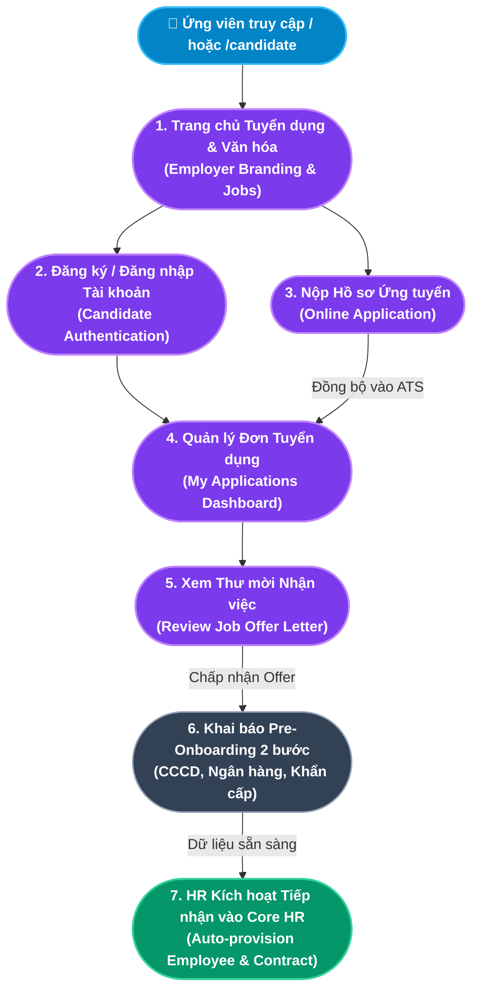

# TÀI LIỆU PHÂN TÍCH NGHIỆP VỤ - MODULE CỔNG TUYỂN DỤNG ỨNG VIÊN (CANDIDATE CAREER PORTAL)

## 1. Giới thiệu tổng quan Module
**Cổng Tuyển dụng Ứng viên (Candidate Career Portal)** là trang web đối ngoại công khai tại đường dẫn gốc (`/` hoặc `/candidate`) - Mặt tiền số (Digital Storefront) của doanh nghiệp trong cuộc chiến thu hút nhân tài. Đây là điểm tiếp xúc đầu tiên (First Touchpoint) giữa ứng viên tiềm năng và công ty, hoạt động độc lập với hệ thống nội bộ nhưng liên kết thông suốt về mặt dữ liệu qua hệ thống API RESTful.

Cổng thực hiện **3 mục tiêu chiến lược**:
1. **Xây dựng Thương hiệu Tuyển dụng (Employer Branding)**: Truyền tải văn hóa công ty, giá trị cốt lõi, môi trường làm việc và chế độ đãi ngộ hấp dẫn để thu hút nhân tài.
2. **Đơn giản hóa Quy trình Ứng tuyển & Quản lý Đơn (Frictionless Application & Account Management)**: Cho phép ứng viên đăng ký/đăng nhập tài khoản cá nhân (`CandidateUser`) tại `/candidate/login`, tìm kiếm và xem mô tả công việc (JD), nộp hồ sơ nhanh chóng và theo dõi trạng thái tất cả các đơn ứng tuyển theo thời gian thực.
3. **Tương tác Tuyển dụng 2 chiều & Tự phục vụ Tiền Tiếp nhận (Collaborative Onboarding & Pre-Onboarding Self-service)**: Ứng viên nhận và phản hồi Thư mời nhận việc (**Job Offer**) trực tuyến (Đồng ý/Từ chối). Khi đồng ý, ứng viên chủ động hoàn tất **Hồ sơ Tiền Tiếp nhận (Pre-Onboarding Profile)** gồm CCCD, MST, thông tin ngân hàng và người liên hệ khẩn cấp trực tiếp trên cổng.

### Đối tượng sử dụng (Actors):
1. **Ứng viên (Candidate)**: Tìm kiếm việc làm, nộp hồ sơ, đăng nhập theo dõi kết quả, phản hồi Offer và khai báo hồ sơ tiền tiếp nhận.
2. **Hệ thống Backend (Automated System)**: Tự động tiếp nhận hồ sơ vào Kanban ATS (`status = APPLIED`), quản lý xác thực ứng viên và đồng bộ dữ liệu vào Core HR.
3. **Bộ phận Tuyển dụng (Recruiter / HR)**: Đăng tin tuyển dụng, phát hành Thư mời nhận việc trực tuyến và tiếp nhận ứng viên thành nhân viên chính thức khi ứng viên có mặt tại công ty.

---

## 2. Kiến trúc Cổng Ứng viên & Hành trình Ứng tuyển 2 chiều (Candidate Journey Map)

---

## 3. Ma trận Phân rã Chức năng Chi tiết (Functional Breakdown Matrix)

Cổng Ứng viên bao gồm **4 phân khu nội dung** với tổng cộng **10 Use Case con (Sub-Use Cases)** được chuẩn hóa đầy đủ:

| Phân khu (Section) | Mã Use Case | Tên Chức năng Con (Sub-Use Case) | Actor chính | Endpoint Backend |
|---|---|---|---|---|
| **1. Trang chủ & Thương hiệu** *(Hero + Employer Branding)* | `UC-CAN-01-01` | Tiếp cận Trang chủ Tuyển dụng & Thương hiệu (Career Landing Page) | Ứng viên | Static Content (SSR/CSR) |
| | `UC-CAN-01-02` | Khám phá Văn hóa Doanh nghiệp & Phúc lợi (Culture & Benefits) | Ứng viên | Static Content |
| **2. Tìm kiếm Việc làm** *(Job Discovery)* | `UC-CAN-02-01` | Xem Danh sách Vị trí Tuyển dụng Đang mở (Job Listings) | Ứng viên | `GET /api/job-postings?status=PUBLISHED` |
| | `UC-CAN-02-02` | Xem Mô tả Công việc Chi tiết (Job Detail & JD) | Ứng viên | Modal/Panel JD chi tiết |
| **3. Nộp Hồ sơ & Xác thực** *(Application & Auth)* | `UC-CAN-03-01` | Điền & Nộp Form Ứng tuyển Trực tuyến (Online Application Form) | Ứng viên | `POST /api/candidates` |
| | `UC-CAN-03-02` | Nhận Xác nhận Đã tiếp nhận Hồ sơ (Application Confirmation) | Ứng viên / Hệ thống | Modal xác nhận thành công |
| | `UC-CAN-03-03` | Đăng ký & Đăng nhập Tài khoản Ứng viên (Candidate Authentication) | Ứng viên | `POST /api/candidate-auth/register` `POST /api/candidate-auth/login` |
| **4. Theo dõi & Pre-Onboarding** *(Tracking & Pre-Onboarding)* | `UC-CAN-04-01` | Quản lý Danh sách Đơn ứng tuyển Cá nhân (My Applications) | Ứng viên | `GET /api/candidate-auth/my-applications` |
| | `UC-CAN-04-02` | Xem Chi tiết Thư mời nhận việc trực tuyến (Online Job Offer) | Ứng viên | Trực tiếp trong đơn ứng tuyển |
| | `UC-CAN-04-03` | Phản hồi Offer & Khai báo Hồ sơ Pre-Onboarding Wizard | Ứng viên | `POST /api/candidate-auth/accept-offer` `POST /api/candidate-auth/reject-offer` |
| | `UC-CAN-04-04` | Tra cứu Tiến độ Hồ sơ Bảo mật 2 Lớp (Secure Tracking) | Ứng viên | `GET /api/candidates/track?email=...&code=...` |

---

## 4. Danh mục Hồ sơ Phân tích Chi tiết (Detailed Specifications)

1. [Đặc tả Chức năng Trang chủ, Thương hiệu Tuyển dụng & Tìm kiếm Việc làm](file:///c:/Users/truclh/Desktop/HRM-ĐATN/docs/Tài%20liệu%20phân%20tích%20nghiệp%20vụ%20từng%20module/Module%20Cổng%20Tuyển%20dụng%20Ứng%20viên/Chuc-nang-Trang-chu-Tuyen-dung.md) (UC-CAN-01-01 đến UC-CAN-02-02).
2. [Đặc tả Chức năng Nộp Hồ sơ, Tài khoản Ứng viên, Theo dõi & Pre-Onboarding](file:///c:/Users/truclh/Desktop/HRM-ĐATN/docs/Tài%20liệu%20phân%20tích%20nghiệp%20vụ%20từng%20module/Module%20Cổng%20Tuyển%20dụng%20Ứng%20viên/Chuc-nang-Nop-Ho-so-Va-Theo-doi.md) (UC-CAN-03-01 đến UC-CAN-04-04).

---

## 5. Bộ Quy chuẩn Nghiệp vụ Cổng Ứng viên (Candidate Portal Business Rules)

| STT | Tên Quy tắc | Mô tả ngắn | Phạm vi áp dụng |
|:---:|---|---|---|
| **BR-CAN-01** | **Chỉ Hiển thị Việc làm Đang mở (Active Jobs Only)** | Cổng chỉ hiển thị tin tuyển dụng có `status = PUBLISHED`. Tin bị ẩn (`DRAFT`, `CLOSED`, `FILLED`) không xuất hiện. | UC-CAN-02-01 |
| **BR-CAN-02** | **Xác thực & Mã hóa Mật khẩu Ứng viên (Secure Candidate Auth)** | Tài khoản ứng viên sử dụng mã hóa mật khẩu bcrypt, cấp JWT Token độc lập với tài khoản nội bộ công ty. Giao diện xác thực riêng biệt tại `/candidate/login` và `/candidate/register`. | UC-CAN-03-03 |
| **BR-CAN-03** | **Tự động Đưa vào Đường ống ATS (Auto ATS Ingestion)** | Mỗi hồ sơ nộp thành công tự động tạo bản ghi `Candidate` trong CSDL với `status = APPLIED`, xuất hiện ngay trong cột "Hồ sơ mới" của ATS Kanban trên Admin Portal. | UC-CAN-03-01, UC-CAN-03-02 |
| **BR-CAN-04** | **Chính sách Nộp lại Hồ sơ (Re-application Policy)** | Cùng một địa chỉ email không được nộp hồ sơ cho cùng một vị trí tuyển dụng (`jobPostingId`) nhiều hơn 1 lần. Backend kiểm tra trùng lặp trước khi tạo bản ghi. | UC-CAN-03-01 |
| **BR-CAN-05** | **Tự phục vụ Tiền Tiếp nhận (Pre-Onboarding Self-service)** | Khi chấp nhận Offer, ứng viên bắt buộc hoàn thành biểu mẫu khai báo CCCD, MST, ngân hàng và người thân khẩn cấp để HR sẵn sàng tiếp nhận vào ngày đầu tiên. | UC-CAN-04-03 |
| **BR-CAN-06** | **Tính toàn vẹn Dữ liệu Tiếp nhận Core HR (Atomic Onboarding)** | HR chỉ thực hiện tiếp nhận chính thức vào ngày ứng viên đến công ty; dữ liệu từ `PreOnboardingProfile` tự động chuyển giao vào `Employee` và `Contract` qua Transaction nguyên tử. | UC-REC-04-04 |
| **BR-CAN-07** | **Cách ly Cổng Tuyển dụng công khai với Cổng Quản trị nội bộ (Public-Internal Boundary)** | Cổng Tuyển dụng công khai (`/`) tuyệt đối không hiển thị nút hay liên kết đăng nhập Quản trị viên trên thanh điều hướng chính, ngăn chặn hành vi tấn công dò quét (brute-force) của đối tượng bên ngoài. Cổng Quản trị chỉ truy cập qua URL riêng biệt (`/login` hoặc `/admin`). | Toàn bộ Module |
| **BR-CAN-08** | **Tra cứu Hồ sơ Bảo mật 2 Lớp (Anti-scraping Application Tracking)** | Tra cứu tiến độ tuyển dụng nhanh yêu cầu kết hợp giữa địa chỉ Email và Mã hồ sơ bảo mật (Candidate Tracking Code) do hệ thống cấp lúc nộp đơn, ngăn chặn hành vi đoán email để xem trái phép trạng thái hồ sơ của người khác. | UC-CAN-04-04 |
