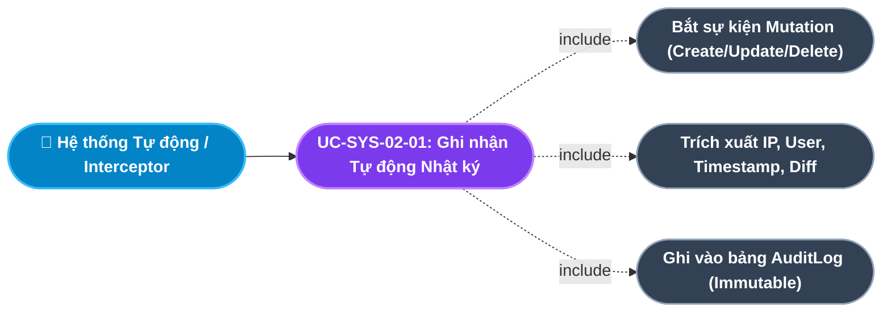
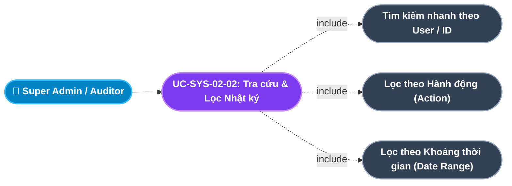
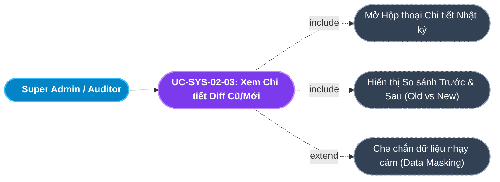
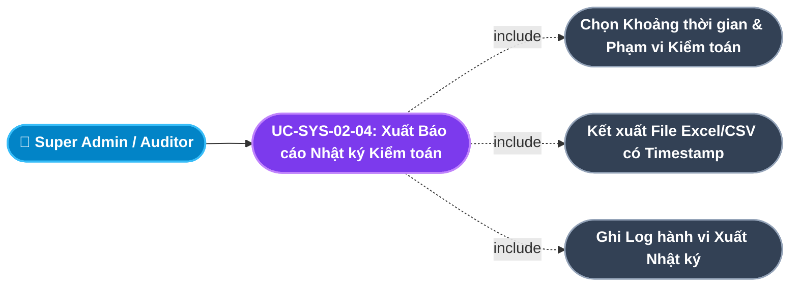
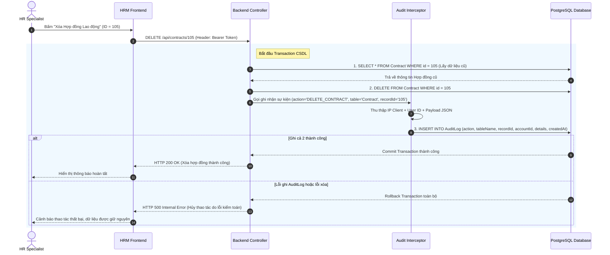
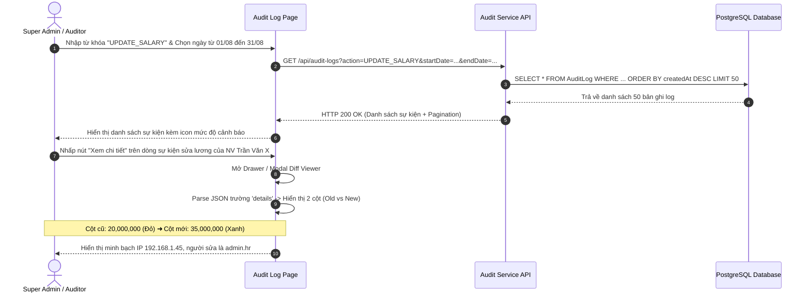

# Usecase: UC-SYS-02 - Nhật ký Hệ thống & Giám sát An toàn Thông tin (System Audit Log & Security Forensics)

## 1. Giới thiệu chức năng
- **Mục đích**: Đóng vai trò là "Camera giám sát" an ninh điện tử bất khả xâm phạm của toàn bộ hệ thống HRM. Chức năng tự động ghi nhận, lưu vết và cung cấp công cụ tra cứu, đối soát toàn bộ các thao tác nghiệp vụ trọng yếu (Thêm mới, Cập nhật, Xóa bỏ, Cấp quyền, Đăng nhập). Giúp doanh nghiệp bảo vệ tính toàn vẹn của dữ liệu, nhanh chóng truy vết nguyên nhân và xác định đích danh trách nhiệm cá nhân khi xảy ra sự cố sai lệch dữ liệu hoặc rò rỉ thông tin nhạy cảm.
- **Actor (Tác nhân)**: Super Admin, Bộ phận An ninh Thông tin / Kiểm toán Nội bộ (Auditor), Hệ thống tự động (Automated Audit Interceptor).
- **Điều kiện tiên quyết**: Người dùng đã được xác thực danh tính vào hệ thống và thực hiện các hành động gửi request làm thay đổi dữ liệu hoặc truy cập tài nguyên bảo mật.

### Danh mục các chức năng con (Sub-features):
1. **UC-SYS-02-01: Ghi nhận Tự động Nhật ký Biến động Dữ liệu (Automated Mutation Audit Logging)**: Tự động bắt mọi hành động Thêm (CREATE), Sửa (UPDATE), Xóa (DELETE) trên các bảng dữ liệu trọng yếu kèm IP, tác nhân và trạng thái dữ liệu trước/sau biến động.
2. **UC-SYS-02-02: Tra cứu & Bộ lọc Đa tiêu chí Lịch sử Thao tác (Multi-criteria Audit Log Search & Filter)**: Tìm kiếm và lọc nhật ký theo thời gian thực dựa trên từ khóa, khoảng ngày, người thực hiện, hành động và bảng nghiệp vụ tác động.
3. **UC-SYS-02-03: Kiểm tra Chi tiết Biến động Dữ liệu Cũ/Mới (Before/After Diff State Inspection)**: Xem trực quan sự thay đổi chi tiết giữa giá trị cũ (`oldVal`) và giá trị mới (`newVal`) dưới dạng Diff Viewer (bôi đỏ phần bị xóa/thay thế, bôi xanh phần mới cập nhật).
4. **UC-SYS-02-04: Xuất Báo cáo Nhật ký Kiểm toán Tuân thủ & Pháp lý (Export Audit Trail for Compliance & Forensics)**: Xuất dữ liệu nhật ký hệ thống ra định dạng Excel/CSV có chữ ký thời gian (Timestamp) phục vụ kiểm toán nội bộ và báo cáo tuân thủ an toàn thông tin ISO/IEC 27001.

---

## 2. Dữ liệu nghiệp vụ đầu vào (Input Data & Parameters)

### 2.1. Cấu trúc Bản ghi Nhật ký Hệ thống (AuditLog Schema)
| Tên trường | Kiểu dữ liệu | Bắt buộc | Ràng buộc nghiệp vụ | Mô tả chi tiết |
|---|---|:---:|---|---|
| `id` | UUID | Có | Khóa chính tự sinh | Định danh duy nhất của sự kiện log. |
| `action` | String(50) | Có | Enum định dạng chuẩn | Hành động (`CREATE`, `UPDATE`, `DELETE`, `LOGIN_FAILED`, `ROLE_CHANGE`). |
| `tableName` | String(50) | Có | Tên bảng CSDL | Bảng thực thể bị tác động (`Employee`, `Payroll`, `Contract`, `Account`). |
| `recordId` | String(50) | Có | Khóa chính bản ghi bị tác động | ID của đối tượng bị thay đổi (giúp truy vết liên kết). |
| `accountId` | UUID | Có | Foreign Key $\rightarrow$ `Account.id` | Tài khoản của người trực tiếp thực hiện hành động. |
| `details` | Text (JSON) | Không | JSON lưu vết trạng thái | Lưu trữ chi tiết: `{ oldData: {...}, newData: {...}, ipAddress, userAgent }`. |
| `createdAt` | DateTime | Có | Mặc định `now()` | Thời điểm chính xác xảy ra sự kiện (theo múi giờ chuẩn ISO 8601). |

### 2.2. Phân loại Mức độ Cảnh báo An ninh (Security Severity Levels)
| Mức độ | Nhãn hiển thị | Màu sắc đại diện | Tiêu chí áp dụng | Ví dụ hành động |
|---|---|:---:|---|---|
| **CRITICAL** | Nguy hiểm cao | Đỏ (`#ef4444`) | Xóa hợp đồng, xóa phòng ban, đổi phân quyền Super Admin, đăng nhập thất bại liên tiếp | `DELETE_CONTRACT`, `DROP_ROLE`, `LOGIN_BRUTE_FORCE` |
| **WARNING** | Cảnh báo | Vàng cam (`#f59e0b`) | Thay đổi mức lương, duyệt chi lương, điều chỉnh chức danh nhân sự | `UPDATE_SALARY`, `APPROVE_PAYROLL`, `PROMOTE_EMPLOYEE` |
| **INFO** | Thông tin thường | Xanh dương (`#3b82f6`) | Thêm mới nhân sự, chấm công, nộp đơn xin nghỉ, đổi mật khẩu cá nhân | `CREATE_EMPLOYEE`, `SUBMIT_LEAVE`, `CHANGE_PASSWORD` |

---

## 3. Quy tắc nghiệp vụ (Business Rules)

| Mã Quy tắc | Tình huống nghiệp vụ | Cách hệ thống xử lý | Thông báo hiển thị |
|---|---|---|---|
| **BR-SYS-02-01** | **Bất biến Dữ liệu Nhật ký (Immutable Audit Trail)**: Bất kỳ người dùng nào (kể cả Super Admin) cố tình chạy lệnh sửa hoặc xóa bản ghi `AuditLog`. | Bảng `AuditLog` chỉ được cấp quyền `INSERT` và `SELECT` ở cấp CSDL. Chặn hoàn toàn mọi API `PUT`, `PATCH`, `DELETE`. Không ai có quyền xóa log để phi tang chứng cứ. | "Dữ liệu Nhật ký hệ thống là bất biến, không thể sửa đổi hoặc xóa bỏ!" |
| **BR-SYS-02-02** | **Đồng bộ Giao dịch Song song (Transactional Dual-write)**: Người dùng thực hiện thao tác Thêm/Sửa/Xóa dữ liệu nghiệp vụ quan trọng. | Thao tác ghi dữ liệu nghiệp vụ và thao tác `INSERT INTO AuditLog` phải được thực thi trong cùng một Database Transaction. Nếu một trong hai bước gặp lỗi $\rightarrow$ Rollback toàn bộ để đảm bảo dữ liệu không bị lệch vết. | "Lỗi ghi nhận vết kiểm toán hệ thống. Thao tác đã bị hủy để đảm bảo an toàn dữ liệu!" |
| **BR-SYS-02-03** | **Giới hạn Quyền xem Nhật ký (Restricted Audit Inspection)**: Người dùng thuộc các vai trò không phải Admin cố gắng truy cập trang Audit Logs. | Chặn quyền tại Middleware Guard (`VIEW_AUDIT_LOGS`). Trả về mã lỗi `HTTP 403 Forbidden` và ngắt truy cập. | "Bạn không có thẩm quyền truy cập Nhật ký Kiểm toán của hệ thống!" |
| **BR-SYS-02-04** | **Chính sách Lưu trữ Dữ liệu Lâu dài (Log Retention Policy)**: Bản ghi nhật ký theo thời gian trôi qua. | Toàn bộ dữ liệu log phải được lưu trữ trực tuyến tối thiểu **36 tháng**. Sau thời hạn trên, dữ liệu được chuyển lưu trữ dạng nén (Cold Storage/Archive) để đáp ứng chuẩn pháp lý doanh nghiệp. | "Dữ liệu được lưu trữ tuân thủ chính sách kiểm toán tối thiểu 36 tháng." |
| **BR-SYS-02-05** | **Tự động Ghi vết IP & Tác nhân (Client Metadata Capture)**: Người dùng thao tác từ bất kỳ trình duyệt nào. | Hệ thống tự động trích xuất IP nguồn (xét header `X-Forwarded-For`), User-Agent (Hệ điều hành, Trình duyệt) và đính kèm vào payload `details` của sự kiện log. | "Thông tin thiết bị và địa chỉ mạng đã được ghi nhận tự động vào vết kiểm toán." |

---

## 4. Đặc tả chi tiết các Use Case chức năng con (Sub-Use Cases Specification)

---

### 4.1. UC-SYS-02-01: Ghi nhận Tự động Nhật ký Biến động Dữ liệu (Automated Mutation Audit Logging)

#### Sơ đồ Use Case:

#### Bảng đặc tả nghiệp vụ:

| STT | Hạng mục | Nội dung chi tiết |
|:---:|---|---|
| **1** | **Thông tin chung** | - **UC ID**: `UC-SYS-02-01` - **UC Name**: Ghi nhận Tự động Nhật ký Biến động Dữ liệu (Automated Mutation Audit Logging) - **Actor**: Hệ thống tự động (Backend Audit Interceptor / Prisma Middleware) - **Mục tiêu**: Tự động lưu vết 100% các hành vi làm biến đổi dữ liệu nhạy cảm mà không đòi hỏi lập trình viên phải viết code thủ công tại từng API. - **Mô tả**: Bất kỳ khi nào một thao tác CREATE, UPDATE, DELETE hoàn tất trên các bảng (Employee, Contract, Payroll, Role, Permission), Interceptor tự động tạo một bản ghi `AuditLog` lưu trữ chi tiết sự kiện. - **Priority**: High (Bắt buộc) |
| **2** | **Trigger** | Phát sinh sự kiện thay đổi dữ liệu tại Backend API do người dùng thực hiện. |
| **3** | **Pre-condition** | Request đã vượt qua tầng xác thực và có thông tin `req.user.accountId`. |
| **4** | **Post-condition** | Bản ghi mới được chèn vào bảng `AuditLog` với đầy đủ metadata: `action`, `tableName`, `recordId`, `details`, `createdAt`. |
| **5** | **Main Flow** | 1. Người dùng thực hiện thao tác nghiệp vụ (VD: Sửa lương cơ bản của nhân viên). 2. Backend bắt đầu Transaction. 3. Lấy dữ liệu hiện tại trong CSDL trước khi sửa (`oldData`). 4. Thực hiện cập nhật dữ liệu mới (`newData`). 5. Tạo đối tượng diff: So sánh các trường bị thay đổi (`oldData` $\rightarrow$ `newData`). 6. Trích xuất IP Client từ request header (`req.ip` hoặc `x-forwarded-for`). 7. Thực hiện lệnh `INSERT INTO AuditLog` với đầy đủ thông tin. 8. Commit Transaction thành công và phản hồi kết quả về cho client. |
| **6** | **Alternative / Exception Flow** | - **EF-01 (Lỗi ghi log)**: CSDL bảng AuditLog bị lỗi hoặc mất kết nối $\rightarrow$ Transaction tự động Rollback, không cho phép cập nhật dữ liệu nghiệp vụ để ngăn chặn hành động không thể kiểm toán (BR-SYS-02-02). |
| **7** | **Business Rules & Validation** | - Dữ liệu chỉ INSERT, tuyệt đối không UPDATE/DELETE (BR-SYS-02-01). - Không lưu thông tin nhạy cảm dạng thô như Plaintext Password trong trường `details` (phải lọc bỏ hoặc mask `******`). |
| **8** | **Acceptance Criteria** | - **AC-01**: 100% các hành động thêm, sửa, xóa trên các module trọng yếu đều có bản ghi AuditLog tương ứng. - **AC-02**: Vết kiểm toán thể hiện chính xác thời điểm, IP và đối tượng bị tác động. |

---

### 4.2. UC-SYS-02-02: Tra cứu & Bộ lọc Đa tiêu chí Lịch sử Thao tác (Multi-criteria Audit Log Search & Filter)

#### Sơ đồ Use Case:

#### Bảng đặc tả nghiệp vụ:

| STT | Hạng mục | Nội dung chi tiết |
|:---:|---|---|
| **1** | **Thông tin chung** | - **UC ID**: `UC-SYS-02-02` - **UC Name**: Tra cứu & Bộ lọc Đa tiêu chí Lịch sử Thao tác (Multi-criteria Audit Log Search & Filter) - **Actor**: Super Admin, IT Security Auditor - **Mục tiêu**: Giúp Quản trị viên nhanh chóng khoanh vùng và tìm ra các sự cố bảo mật hoặc vết tích sai sót dữ liệu trong hàng triệu bản ghi. - **Mô tả**: Cung cấp giao diện tra cứu trực quan với ô tìm kiếm tức thì theo từ khóa, kết hợp các bộ lọc thả xuống theo Hành động (Action), Bảng thực thể (Table), Tài khoản người dùng (Account) và Khoảng thời gian xảy ra sự kiện. - **Priority**: High (Bắt buộc) |
| **2** | **Trigger** | Admin truy cập menu **"Hệ thống" $\rightarrow$ "Nhật ký Kiểm toán (Audit Logs)"**. |
| **3** | **Pre-condition** | Người dùng đăng nhập tài khoản có quyền `VIEW_AUDIT_LOGS`. |
| **4** | **Post-condition** | Bảng danh sách nhật ký hiển thị kết quả lọc với phân trang tối ưu (Pagination) và sắp xếp mới nhất lên đầu. |
| **5** | **Main Flow** | 1. Admin vào trang Nhật ký Kiểm toán. 2. Giao diện tải mặc định 50 bản ghi log mới nhất trong 7 ngày gần nhất. 3. Admin nhập từ khóa vào ô tìm kiếm (VD: tên tài khoản "admin.hr" hoặc mã đối tượng "NV005"). 4. Admin chọn bộ lọc nâng cao:    - Hành động: `UPDATE_SALARY`, `DELETE_CONTRACT`, `LOGIN_FAILED`.    - Khoảng ngày: Từ ngày - Đến ngày.    - Module/Bảng: Payroll, Employee, Contracts. 5. Nhấn nút "Tìm kiếm" hoặc hệ thống debounce tự động tìm sau 300ms. 6. Backend thực thi truy vấn index tối ưu và trả về kết quả kèm tổng số trang. 7. Bảng dữ liệu hiển thị: Thời gian, Hành động kèm biểu tượng cảnh báo mức độ, Người thực hiện, Đối tượng tác động, Tóm tắt thay đổi và Địa chỉ IP. |
| **6** | **Alternative / Exception Flow** | - **EF-01 (Không tìm thấy kết quả)**: Tiêu chí lọc không khớp bản ghi nào $\rightarrow$ Hiển thị trạng thái trống (Empty State) kèm thông báo: *"Không tìm thấy sự kiện nhật ký nào phù hợp với bộ lọc đã chọn!"*. |
| **7** | **Business Rules & Validation** | - Chặn người không có quyền truy cập (BR-SYS-02-03). - Truy vấn bắt buộc có phân trang (tối đa 100 bản ghi/trang) để tránh quá tải bộ nhớ hệ thống. |
| **8** | **Acceptance Criteria** | - **AC-01**: Tốc độ phản hồi tìm kiếm dưới 1 giây cho cơ sở dữ liệu trên 500,000 dòng log. - **AC-02**: Hiển thị chính xác IP và tài khoản thao tác cho từng dòng nhật ký. |

---

### 4.3. UC-SYS-02-03: Kiểm tra Chi tiết Biến động Dữ liệu Cũ/Mới (Before/After Diff State Inspection)

#### Sơ đồ Use Case:

#### Bảng đặc tả nghiệp vụ:

| STT | Hạng mục | Nội dung chi tiết |
|:---:|---|---|
| **1** | **Thông tin chung** | - **UC ID**: `UC-SYS-02-03` - **UC Name**: Kiểm tra Chi tiết Biến động Dữ liệu Cũ/Mới (Before/After Diff State Inspection) - **Actor**: Super Admin, Kiểm toán viên - **Mục tiêu**: Cung cấp bằng chứng cụ thể về việc ai đã thay đổi giá trị gì, từ giá trị nào sang giá trị nào để làm căn cứ xử lý vi phạm hoặc phục hồi dữ liệu. - **Mô tả**: Khi người dùng nhấp vào một dòng nhật ký, hệ thống mở modal hiển thị dạng 2 cột trực quan (Side-by-side): Bên trái là Dữ liệu cũ (Old Value), Bên phải là Dữ liệu mới (New Value), bôi đậm các thuộc tính có sự sai biệt. - **Priority**: Medium |
| **2** | **Trigger** | Admin nhấp vào nút "Xem chi tiết" (Icon Con mắt) trên một dòng nhật ký trong bảng Audit Logs. |
| **3** | **Pre-condition** | Bản ghi nhật ký tồn tại và có trường `details` chứa cấu trúc JSON hợp lệ. |
| **4** | **Post-condition** | Giao diện hiển thị chi tiết toàn bộ payload biến động mà không làm thay đổi bất kỳ trạng thái nào trong hệ thống. |
| **5** | **Main Flow** | 1. Admin bấm vào một sự kiện log (VD: `UPDATE_SALARY`). 2. Giao diện mở Drawer hoặc Modal "Chi tiết Nhật ký Kiểm toán". 3. Hiển thị thông tin tổng quan sự kiện: ID sự kiện, Người thực hiện, IP, User Agent, Mã đối tượng bị tác động. 4. Hệ thống parse trường `details` thành hai khối JSON: `Dữ liệu trước thay đổi` và `Dữ liệu sau thay đổi`. 5. Thuật toán so khớp trường dữ liệu (Field Diffing) tự động làm nổi bật các trường bị sửa (VD: `baseSalary`: `20,000,000` $\rightarrow$ `35,000,000`). 6. Admin đối soát thông tin và có thể sao chép JSON phục vụ công tác điều tra. |
| **6** | **Alternative / Exception Flow** | - **EF-01 (Sự kiện chỉ có 1 chiều)**: Đối với hành động `CREATE` (không có dữ liệu cũ) hoặc `DELETE` (không có dữ liệu mới) $\rightarrow$ Hệ thống hiển thị rõ: *"Không có dữ liệu cũ đối với hành động Thêm mới"* hoặc *"Dữ liệu bị xóa vĩnh viễn"*. |
| **7** | **Business Rules & Validation** | - Không hiển thị mật khẩu hoặc mã bí mật trong Diff (bắt buộc ẩn dạng `******`). - Dữ liệu trình bày chỉ đọc (Read-only), không cho phép chỉnh sửa trực tiếp trên giao diện này. |
| **8** | **Acceptance Criteria** | - **AC-01**: Hiển thị rõ ràng sự khác biệt trước và sau đối với mọi trường dữ liệu bị chỉnh sửa. - **AC-02**: Hiển thị đầy đủ thông tin địa chỉ IP và trình duyệt thực hiện. |

---

### 4.4. UC-SYS-02-04: Xuất Báo cáo Nhật ký Kiểm toán Tuân thủ & Pháp lý (Export Audit Trail for Compliance & Forensics)

#### Sơ đồ Use Case:

#### Bảng đặc tả nghiệp vụ:

| STT | Hạng mục | Nội dung chi tiết |
|:---:|---|---|
| **1** | **Thông tin chung** | - **UC ID**: `UC-SYS-02-04` - **UC Name**: Xuất Báo cáo Nhật ký Kiểm toán Tuân thủ & Pháp lý (Export Audit Trail for Compliance & Forensics) - **Actor**: Super Admin, Chuyên viên Kiểm toán Tuân thủ - **Mục tiêu**: Cung cấp tài liệu chứng minh sự minh bạch và tuân thủ các quy định về an ninh thông tin theo yêu cầu của cơ quan pháp lý hoặc tổ chức kiểm toán độc lập. - **Mô tả**: Cho phép trích xuất toàn bộ hoặc theo bộ lọc các sự kiện nhật ký ra file bảng tính Excel/CSV tiêu chuẩn kèm mã băm kiểm tra tính toàn vẹn (Checksum SHA-256). - **Priority**: Medium |
| **2** | **Trigger** | Admin nhấp nút **"Xuất báo cáo Kiểm toán (Export Logs)"** trên thanh công cụ. |
| **3** | **Pre-condition** | Tài khoản có quyền `EXPORT_AUDIT_LOGS` và đã chọn khoảng thời gian cần xuất. |
| **4** | **Post-condition** | File báo cáo được tải về máy trạm; một bản ghi nhật ký mới ghi nhận hành vi "Xuất nhật ký" của Admin được tự động lưu lại vào `AuditLog`. |
| **5** | **Main Flow** | 1. Admin thiết lập bộ lọc (VD: Toàn bộ thao tác xóa dữ liệu trong Quý 1/2026). 2. Nhấn nút "Xuất báo cáo (Excel/CSV)". 3. Hệ thống hiển thị hộp thoại xác nhận kèm cảnh báo: *"Hành vi trích xuất dữ liệu kiểm toán sẽ được hệ thống lưu vết an ninh!"*. 4. Admin chọn định dạng file (`.xlsx` hoặc `.csv`) và nhấn "Xác nhận xuất". 5. Backend xử lý truy vấn dữ liệu theo phân đoạn (Stream query để không nghẽn RAM). 6. Tạo file bảng tính chuẩn định dạng, bao gồm: Mã Log, Thời gian UTC/GMT+7, Hành động, Người thực hiện, Đối tượng, IP, Chi tiết thay đổi. 7. Trình duyệt bắt đầu tải file về máy tính người dùng. 8. Backend tự động ghi một dòng log mới: `action = 'EXPORT_AUDIT_LOGS'`. |
| **6** | **Alternative / Exception Flow** | - **EF-01 (Dữ liệu xuất quá lớn)**: Số lượng dòng vượt quá 50,000 bản ghi $\rightarrow$ Hệ thống khuyến nghị thu hẹp khoảng thời gian hoặc gửi file qua email nền (Background job) để tránh timeout request. |
| **7** | **Business Rules & Validation** | - Hành vi xuất log cũng phải được ghi log (Self-auditing requirement). - File xuất ra có đóng dấu thời gian (Timestamp) và tài khoản trích xuất ở chân trang. |
| **8** | **Acceptance Criteria** | - **AC-01**: File tải về có đầy đủ dữ liệu theo đúng bộ lọc đã chọn. - **AC-02**: Hệ thống ghi nhận ngay lập tức một sự kiện kiểm toán cho hành động xuất file này. |

---

## 5. Sơ đồ tuần tự nghiệp vụ (Sequence Diagrams)

### 5.1. Luồng Ghi Log tự động kèm Giao dịch Đồng bộ (Transactional Dual-write)

---

### 5.2. Luồng Tra cứu, Lọc & Kiểm tra Biến động Dữ liệu Cũ/Mới (Diff Inspection)

---

## 6. Ma trận kịch bản kiểm thử (Test Scenarios & Acceptance Matrix)

| Test ID | Chức năng con liên quan | Tiêu đề kịch bản | Dữ liệu đầu vào | Các bước thực hiện | Kết quả kỳ vọng | Mức độ ưu tiên |
|---|---|---|---|---|---|:---:|
| **TC-SYS-02-01** | UC-SYS-02-01 | Tự động ghi log khi cập nhật nhân viên | Sửa phòng ban của NV001 từ IT sang HR | 1. Thực hiện sửa thông tin. 2. Bấm Lưu. 3. Kiểm tra bảng `AuditLog`. | Xuất hiện bản ghi `action='UPDATE'`, `tableName='Employee'`, `details` có dữ liệu cũ và mới. | P0 |
| **TC-SYS-02-02** | UC-SYS-02-01 | Kiểm tra tính Bất biến của bảng AuditLog | Cố tình gọi lệnh `DELETE FROM AuditLog` | 1. Chạy lệnh DELETE hoặc API xóa log. | Hệ thống từ chối thực thi, báo lỗi quyền (BR-SYS-02-01). | P0 |
| **TC-SYS-02-03** | UC-SYS-02-01 | Ghi nhận sự kiện Đăng nhập thất bại | Nhập sai mật khẩu 3 lần liên tiếp | 1. Thử đăng nhập sai mật khẩu. 2. Kiểm tra log hệ thống. | Tạo 3 bản ghi `action='LOGIN_FAILED'` kèm địa chỉ IP người gửi request. | P1 |
| **TC-SYS-02-04** | UC-SYS-02-02 | Tìm kiếm log theo tên người thực hiện | Từ khóa: "admin.hr" | 1. Nhập "admin.hr" vào ô tìm kiếm. 2. Nhấn Tìm kiếm. | Bảng chỉ hiển thị các thao tác do tài khoản "admin.hr" thực hiện. | P1 |
| **TC-SYS-02-05** | UC-SYS-02-02 | Lọc log theo loại hành động nguy hiểm | Bộ lọc: `DELETE_CONTRACT` | 1. Chọn Action = DELETE_CONTRACT. 2. Nhấn Lọc. | Danh sách chỉ chứa các sự kiện xóa hợp đồng kèm icon cảnh báo đỏ. | P1 |
| **TC-SYS-02-06** | UC-SYS-02-03 | Hiển thị Diff chi tiết Cũ/Mới dạng side-by-side | Sự kiện `UPDATE_SALARY` | 1. Bấm nút xem chi tiết sự kiện. 2. Quan sát hộp thoại. | Hiển thị rõ giá trị cũ (20,000,000) và giá trị mới (35,000,000) được bôi màu trực quan. | P1 |
| **TC-SYS-02-07** | UC-SYS-02-03 | Che chắn mật khẩu trong trường Details | Thao tác Đổi mật khẩu cá nhân | 1. Thực hiện đổi mật khẩu. 2. Mở xem chi tiết log tương ứng. | Mật khẩu được che bằng `******`, không lộ hash hay plain text. | P0 |
| **TC-SYS-02-08** | UC-SYS-02-04 | Xuất báo cáo kiểm toán ra file Excel | Khoảng ngày: 01/01/2026 - 31/03/2026 | 1. Nhấn nút Xuất báo cáo. 2. Mở file Excel vừa tải về. | File chứa đầy đủ các cột dữ liệu theo đúng bộ lọc thời gian. | P2 |
| **TC-SYS-02-09** | UC-SYS-02-04 | Tự động ghi vết sự kiện Xuất báo cáo | Admin vừa tải file báo cáo | 1. Xuất file báo cáo. 2. Kiểm tra danh sách Audit Log. | Xuất hiện bản ghi mới ghi nhận Admin vừa thực hiện hành vi trích xuất log. | P1 |
| **TC-SYS-02-10** | UC-SYS-02-02 | Chặn nhân viên thường truy cập Audit Log | Đăng nhập tài khoản `ROLE_EMPLOYEE` | 1. Truy cập trực tiếp đường dẫn `/internal/system/audit-logs`. | Bị chặn và điều hướng về trang lỗi 403 Forbidden. | P0 |
