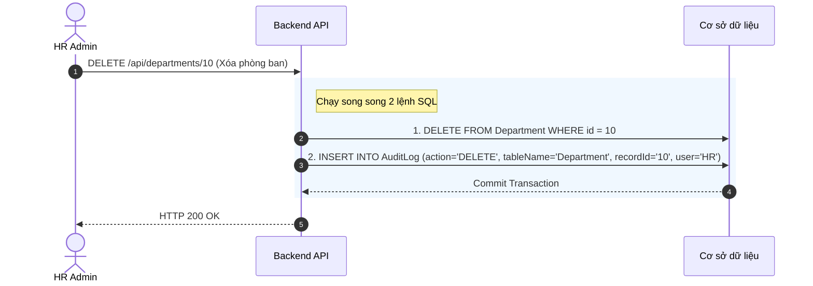

# Đặc tả chức năng: Nhật ký Hệ thống (Audit Log)

## 1. Giới thiệu chức năng
"Camera giám sát" của hệ thống phần mềm. Ghi nhận lại toàn bộ các thao tác Thêm (Create), Sửa (Update), Xóa (Delete) của người dùng.

## 2. Các quy tắc nghiệp vụ cốt lõi
- **Dữ liệu Bất biến (Immutable Data):** Bảng `AuditLog` chỉ được phép nhận lệnh INSERT. Tuyệt đối không cung cấp API DELETE hoặc UPDATE trên bảng này. Kể cả Admin cũng không thể xóa log nhằm phi tang chứng cứ.

## 3. Sơ đồ luồng chi tiết (Sequence Diagrams)

### 3.1. Luồng Ghi Log tự động
Xảy ra ngầm sau một hành động thay đổi dữ liệu quan trọng.

