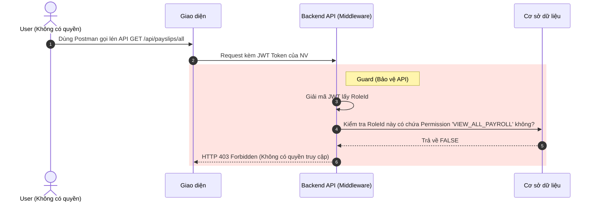

# Đặc tả chức năng: Phân quyền động RBAC

## 1. Giới thiệu chức năng
Cơ chế bảo mật nền tảng cho toàn bộ hệ thống. Cho phép Admin tự do tạo thêm các Nhóm Quyền (Role) mới và tick chọn các chức năng được phép sử dụng thay vì code cứng (Hard-code).

## 2. Các quy tắc nghiệp vụ cốt lõi
- **Bảo vệ tài khoản Root:** Không ai được phép XÓA hoặc SỬA quyền của nhóm `SUPER_ADMIN`.
- **Tự động ngắt quyền:** Khi nhân sự nghỉ việc (Employee status = RESIGNED), hệ thống phải ngầm UPDATE Account `isActive = false` ngay lập tức để cắt đứt mọi truy cập cũ.

## 3. Sơ đồ luồng chi tiết (Sequence Diagrams)

### 3.1. Luồng Xác thực & Chặn truy cập trái phép (Middleware)
Đây là luồng kỹ thuật xảy ra ngầm mỗi khi user thao tác.

