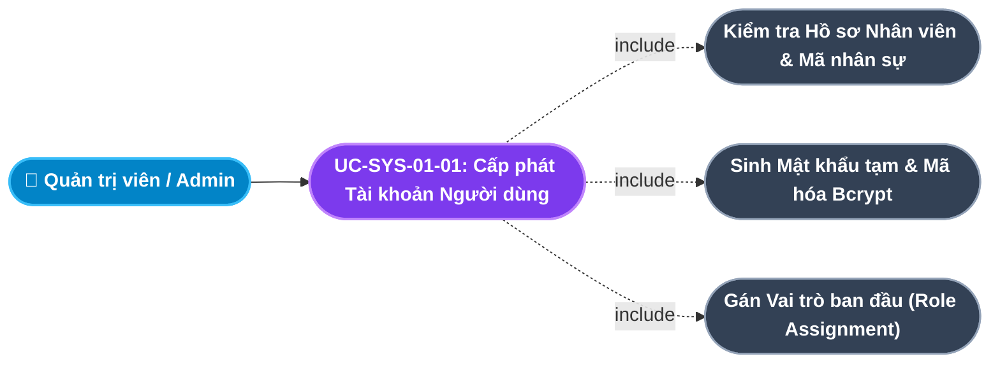
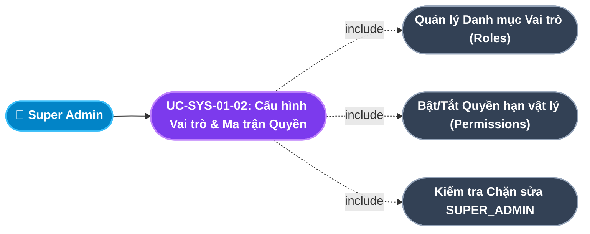
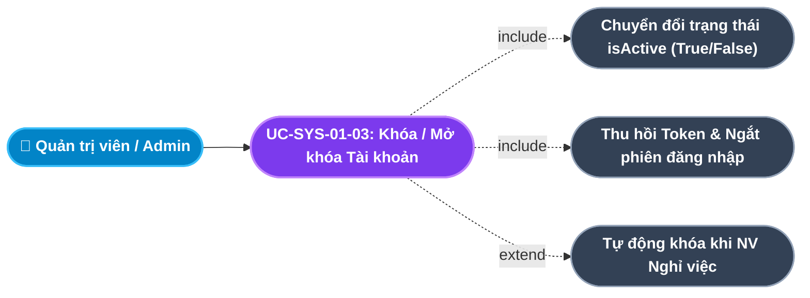
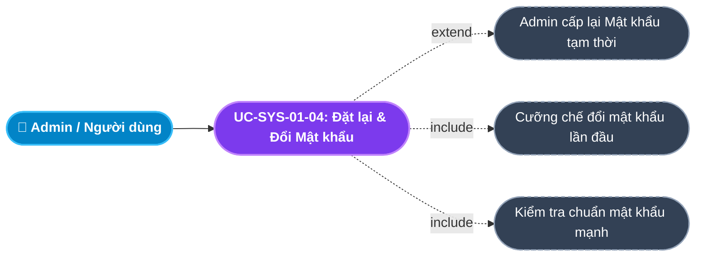
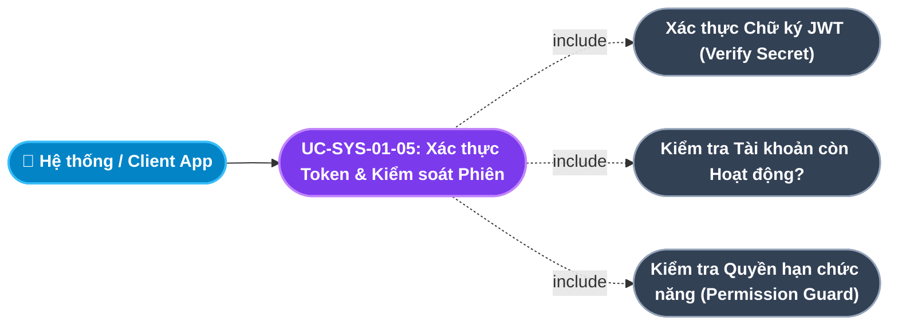
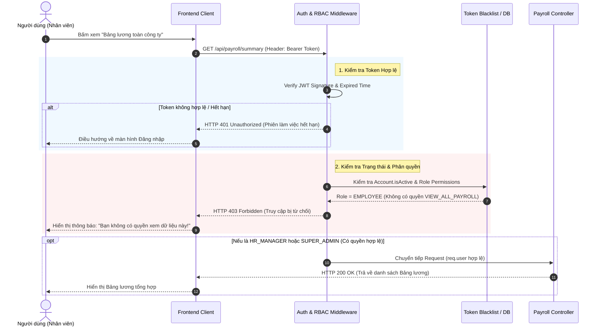
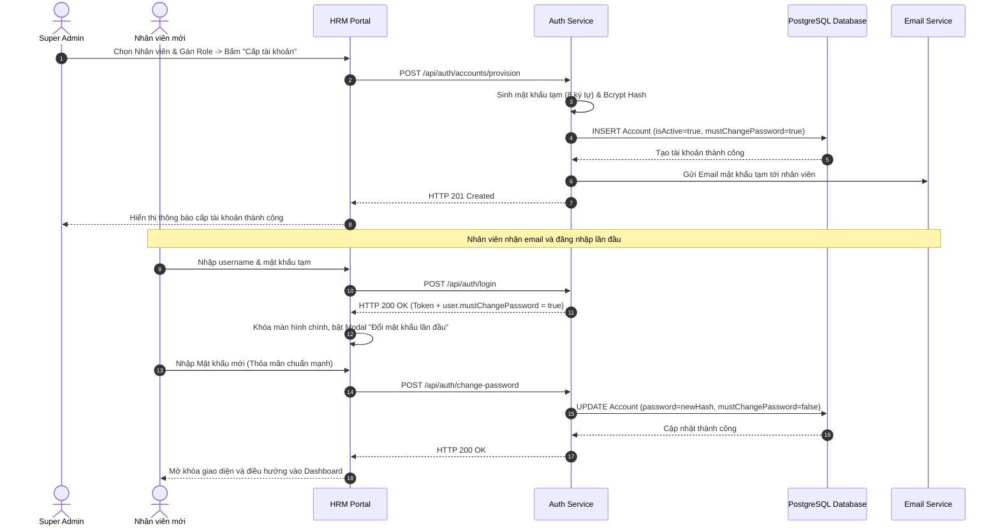

# Usecase: UC-SYS-01 - Quản lý Tài khoản & Phân quyền Truy cập Dựa trên Vai trò (User Account Management & Dynamic RBAC)

## 1. Giới thiệu chức năng
- **Mục đích**: Là lá chắn an ninh cốt lõi (Security Core) của toàn bộ hệ thống HRM. Chức năng cung cấp cơ chế quản lý vòng đời tài khoản người dùng (Account Lifecycle) từ khi cấp phát, phân quyền, đổi mật khẩu đến khóa tài khoản khi nghỉ việc. Đồng thời, thiết lập mô hình kiểm soát truy cập dựa trên vai trò linh hoạt (Dynamic Role-Based Access Control - RBAC), cho phép Quản trị viên tự do tùy biến quyền hạn cho từng nhóm người dùng mà không cần sửa đổi mã nguồn phần mềm.
- **Actor (Tác nhân)**: Super Admin (Quản trị viên tối cao), IT/System Admin, Toàn bộ Người dùng hệ thống (All Authenticated Users).
- **Điều kiện tiên quyết**: Nhân sự đã tồn tại trong danh mục Hồ sơ nhân viên (`Employee`) đối với các tài khoản nghiệp vụ, hoặc tài khoản kỹ thuật của đội ngũ IT.

### Danh mục các chức năng con (Sub-features):
1. **UC-SYS-01-01: Cấp phát & Khởi tạo Tài khoản Người dùng (User Account Provisioning)**: Tạo tài khoản liên kết trực tiếp với hồ sơ nhân viên (`employeeId`), thiết lập username duy nhất, mật khẩu tạm thời mã hóa Bcrypt và gán vai trò ban đầu.
2. **UC-SYS-01-02: Cấu hình Vai trò & Ma trận Phân quyền Chức năng (Role Configuration & Permission Matrix Management)**: Tạo mới, cập nhật danh mục vai trò (`Role`) và gán các quyền hạn vật lý (`Permission`) theo mô hình ma trận trực quan (View, Create, Edit, Delete, Approve, Export).
3. **UC-SYS-01-03: Khóa & Mở khóa Tài khoản Người dùng (Account Status Control - Lock/Unlock)**: Tạm đình chỉ hoặc kích hoạt lại quyền đăng nhập của tài khoản; tự động khóa tài khoản khi nhân viên chuyển trạng thái nghỉ việc (`RESIGNED`).
4. **UC-SYS-01-04: Đặt lại Mật khẩu & Cưỡng chế Đổi mật khẩu lần đầu (Password Reset & Forced Change Policy)**: Quản trị viên cấp lại mật khẩu tạm khi người dùng quên; hệ thống cưỡng chế bắt buộc đổi mật khẩu mới trong lần đăng nhập đầu tiên.
5. **UC-SYS-01-05: Kiểm soát Phiên làm việc & Xác thực Token Động (Session Management & Dynamic Token Verification)**: Quản lý tính hợp lệ của JWT Token, kiểm tra quyền động qua Middleware Guard và thu hồi phiên làm việc tức thời khi tài khoản bị khóa hoặc hạ quyền.

---

## 2. Dữ liệu nghiệp vụ đầu vào (Input Data & Parameters)

### 2.1. Cấu trúc Tài khoản Người dùng (Account Schema)
| Tên trường | Kiểu dữ liệu | Bắt buộc | Ràng buộc nghiệp vụ | Mô tả chi tiết |
|---|---|:---:|---|---|
| `id` | UUID | Có | Khóa chính tự sinh | Định danh duy nhất của tài khoản. |
| `username` | String(50) | Có | Unique, không dấu, không khoảng trắng | Tên đăng nhập (mặc định lấy theo mã nhân viên hoặc email công vụ). |
| `password` | String(255) | Có | Bcrypt Hash (Salt Rounds = 10) | Mật khẩu bảo mật, tối thiểu 8 ký tự, có chữ hoa, số và ký tự đặc biệt. |
| `employeeId` | UUID | Không | Unique, Foreign Key $\rightarrow$ `Employee.id` | Hồ sơ nhân sự liên kết (null đối với tài khoản System Root). |
| `roleId` | UUID | Có | Foreign Key $\rightarrow$ `Role.id` | Vai trò đảm nhiệm của tài khoản. |
| `isActive` | Boolean | Có | Mặc định `true` | Trạng thái hoạt động (`true`: Đang hoạt động, `false`: Đã bị khóa). |

### 2.2. Ma trận Phân quyền Tiêu chuẩn (Standard RBAC Matrix)
| Nhóm Quyền (Role) | Core HR (Hồ sơ) | Hợp đồng (Contracts) | Chấm công (Attendance) | Nghỉ phép / OT | Tiền lương (Payroll) | Đánh giá KPI | Tuyển dụng (ATS) | Cấu hình & RBAC |
|---|:---:|:---:|:---:|:---:|:---:|:---:|:---:|:---:|
| **SUPER_ADMIN** | Full Access | Full Access | Full Access | Full Access | Full Access | Full Access | Full Access | Full Access |
| **HR_MANAGER** | View/Edit/Create | View/Edit/Create | View/Duyệt | View/Duyệt | View/Tính/Khóa | View/Quản lý kỳ | View/Duyệt Plan | View Only |
| **HR_STAFF / C&B** | View/Create | View/Create | View/Chốt công | View/Hỗ trợ | View/Lập bảng | View | View/Sàng lọc | Không |
| **LINE_MANAGER** | View phòng ban | Không | View phòng ban | Duyệt cấp 1 | Không | Đánh giá cấp 1 | Phỏng vấn | Không |
| **EMPLOYEE** | View cá nhân | View cá nhân | Điểm danh/View | Gửi đơn cá nhân | View phiếu lương | Tự đánh giá | Không | Không |

---

## 3. Quy tắc nghiệp vụ (Business Rules)

| Mã Quy tắc | Tình huống nghiệp vụ | Cách hệ thống xử lý | Thông báo hiển thị |
|---|---|---|---|
| **BR-SYS-01-01** | **Bảo vệ Bất khả xâm phạm Tài khoản Root (Protected Super Admin)**: Người dùng cố gắng sửa, vô hiệu hóa hoặc xóa vai trò `SUPER_ADMIN`. | Hệ thống từ chối tuyệt đối mọi yêu cầu chỉnh sửa quyền hoặc xóa bỏ vai trò Root. Khóa cứng trên cả Frontend và Backend Guard. | "Không thể chỉnh sửa hoặc xóa nhóm quyền Quản trị viên tối cao (SUPER_ADMIN)!" |
| **BR-SYS-01-02** | **Tự động Khóa Tài khoản khi Nhân sự Nghỉ việc (Auto-Deactivate on Resignation)**: Trạng thái nhân viên chuyển sang `RESIGNED` hoặc hợp đồng kết thúc. | Hệ thống bắt sự kiện thông qua Transaction/Trigger, tự động cập nhật `Account.isActive = false` ngay lập tức và hủy bỏ mọi phiên đăng nhập hiệu lực. | "Tài khoản nhân sự đã tự động bị khóa do nhân viên đã chấm dứt hợp đồng!" |
| **BR-SYS-01-03** | **Cưỡng chế Đổi mật khẩu lần đầu (Forced Password Change Policy)**: Tài khoản mới tạo hoặc vừa được Admin Reset mật khẩu đăng nhập thành công. | Hệ thống kiểm tra cờ `isFirstLogin` / `mustChangePassword`. Nếu `true`, chặn toàn bộ truy cập menu nghiệp vụ và điều hướng thẳng đến modal bắt buộc đổi mật khẩu. | "Bạn đang sử dụng mật khẩu tạm thời. Vui lòng thiết lập mật khẩu mới để tiếp tục!" |
| **BR-SYS-01-04** | **Độ phức tạp Mật khẩu (Password Complexity Standard)**: Người dùng nhập mật khẩu mới. | Mật khẩu phải có độ dài từ 8 đến 32 ký tự, chứa ít nhất 1 chữ in hoa, 1 chữ thường, 1 chữ số và 1 ký tự đặc biệt (`!@#$%^&*`). Mã hóa 1 chiều bằng thuật toán Bcrypt trước khi lưu vào CSDL. | "Mật khẩu không đạt chuẩn: Yêu cầu tối thiểu 8 ký tự, gồm chữ hoa, chữ thường, số và ký tự đặc biệt!" |
| **BR-SYS-01-05** | **Khóa Tài khoản sau Nhiều lần Đăng nhập Sai (Brute-force Protection)**: Người dùng nhập sai mật khẩu quá 5 lần liên tiếp trong 15 phút. | Hệ thống tự động ghi nhận số lần sai vào Redis/Cache, tạm khóa tài khoản trong 30 phút và gửi email cảnh báo an ninh tới chủ tài khoản. | "Tài khoản tạm thời bị khóa 30 phút do nhập sai mật khẩu quá 5 lần liên tiếp!" |
| **BR-SYS-01-06** | **Thu hồi Quyền hạn Tức thời (Instant Authorization Invalidation)**: Admin thay đổi danh sách Permission của một Role hoặc khóa tài khoản. | Các Token JWT đã cấp phát trước đó sẽ bị vô hiệu hóa thông qua cơ chế Token Blacklist (Redis) hoặc kiểm tra phiên tại Middleware mỗi 5 phút. | "Quyền truy cập của bạn đã được quản trị viên cập nhật. Vui lòng đăng nhập lại!" |
| **BR-SYS-01-07** | **Phân luồng Cổng Đăng nhập Tự động theo Vai trò (Dynamic Portal Redirection)**: Người dùng đăng nhập thành công tại cổng `/login` hoặc `/admin`. | Hệ thống kiểm tra vai trò người dùng trong JWT Payload: Nếu `role = 'EMPLOYEE'`, tự động điều hướng đến Cổng Nhân viên (`/employee/dashboard`). Nếu `role = 'ADMIN'`, điều hướng đến Cổng Quản trị (`/internal/dashboard`). | "Chào mừng trở lại, [Họ và tên]!" |
| **BR-SYS-01-08** | **Ngăn chặn Leo thang Đặc quyền & Bảo vệ Router (Privilege Escalation Barrier)**: Tài khoản có vai trò `EMPLOYEE` cố tình gõ URL Cổng Quản trị (`/internal/*`). | Frontend ProtectedRoute Guard và Backend API Middleware kiểm tra quyền hạn, chặn tuyệt đối việc xem giao diện Quản trị và chuyển hướng về trang `/login` có thông báo quyền hạn rõ ràng. | "Tài khoản của bạn không có quyền truy cập Cổng Quản trị. Vui lòng đăng nhập bằng tài khoản Quản trị viên." |

---

## 4. Đặc tả chi tiết các Use Case chức năng con (Sub-Use Cases Specification)

---

### 4.1. UC-SYS-01-01: Cấp phát & Khởi tạo Tài khoản Người dùng (User Account Provisioning)

#### Sơ đồ Use Case:

#### Bảng đặc tả nghiệp vụ:

| STT | Hạng mục | Nội dung chi tiết |
|:---:|---|---|
| **1** | **Thông tin chung** | - **UC ID**: `UC-SYS-01-01` - **UC Name**: Cấp phát & Khởi tạo Tài khoản Người dùng (User Account Provisioning) - **Actor**: Super Admin, IT Administrator - **Mục tiêu**: Cấp tài khoản truy cập hệ thống an toàn cho nhân sự mới gia nhập công ty. - **Mô tả**: Quản trị viên chọn nhân viên từ danh sách chưa có tài khoản, hệ thống đề xuất username, gán vai trò tương ứng theo chức danh và sinh mật khẩu khởi tạo an toàn. - **Priority**: High (Bắt buộc) |
| **2** | **Trigger** | Admin nhấp nút **"Tạo tài khoản người dùng"** trong trang Quản lý Tài khoản hoặc trong quy trình hoàn tất Onboarding nhân sự mới. |
| **3** | **Pre-condition** | 1. Nhân viên đã có hồ sơ trong bảng `Employee` với trạng thái `ACTIVE` hoặc `PROBATION`. 2. Nhân viên này chưa từng được liên kết với bất kỳ tài khoản nào khác (`employeeId` duy nhất). |
| **4** | **Post-condition** | Bản ghi `Account` được tạo thành công trong CSDL; mật khẩu tạm thời được gửi tới email công vụ của nhân viên; nhật ký cấp phát được ghi vào `AuditLog`. |
| **5** | **Main Flow** | 1. Admin mở modal "Cấp tài khoản mới". 2. Chọn nhân viên từ danh sách autocomplete (hiển thị Mã NV, Họ tên, Phòng ban, Chức danh). 3. Hệ thống tự động gợi ý `username` theo chuẩn công ty (ví dụ: `nam.nguyen` hoặc mã `NV001`). 4. Admin chọn Nhóm quyền (`roleId`) từ danh sách các vai trò đang kích hoạt. 5. Admin chọn phương thức cấp mật khẩu: Tự động sinh mật khẩu ngẫu nhiên hoặc nhập thủ công. 6. Admin nhấn "Xác nhận tạo tài khoản". 7. Hệ thống băm mật khẩu bằng Bcrypt salt rounds 10, lưu vào CSDL với cờ `isActive = true`. 8. Hệ thống gửi thông tin đăng nhập và đường dẫn đổi mật khẩu tới email nhân sự. |
| **6** | **Alternative / Exception Flow** | - **EF-01 (Username đã tồn tại)**: Trùng lặp username với tài khoản khác $\rightarrow$ Hệ thống báo lỗi: *"Tên đăng nhập đã được sử dụng. Vui lòng chọn tên đăng nhập khác!"*. - **EF-02 (Nhân viên đã có tài khoản)**: Nhân viên đã được cấp tài khoản trước đó $\rightarrow$ Hệ thống cảnh báo: *"Nhân sự này đã có tài khoản liên kết!"*. |
| **7** | **Business Rules & Validation** | - Không thể cấp 2 tài khoản cho cùng một nhân viên (`employeeId` unique). - Mật khẩu lưu trữ bắt buộc băm 1 chiều Bcrypt, không lưu plain text (BR-SYS-01-04). |
| **8** | **Acceptance Criteria** | - **AC-01**: Tài khoản mới tạo đăng nhập được ngay với mật khẩu tạm thời. - **AC-02**: Hệ thống kích hoạt trạng thái bắt buộc đổi mật khẩu ở lần truy cập kế tiếp. |

---

### 4.2. UC-SYS-01-02: Cấu hình Vai trò & Ma trận Phân quyền Chức năng (Role Configuration & Permission Matrix Management)

#### Sơ đồ Use Case:

#### Bảng đặc tả nghiệp vụ:

| STT | Hạng mục | Nội dung chi tiết |
|:---:|---|---|
| **1** | **Thông tin chung** | - **UC ID**: `UC-SYS-01-02` - **UC Name**: Cấu hình Vai trò & Ma trận Phân quyền Chức năng (Role Configuration & Permission Matrix Management) - **Actor**: Super Admin - **Mục tiêu**: Cho phép tùy biến linh hoạt thẩm quyền của từng vị trí công việc theo mô hình RBAC chuẩn doanh nghiệp. - **Mô tả**: Quản trị viên xem ma trận chức năng - quyền hạn, tạo mới nhóm vai trò (Role), tick chọn hoặc bỏ chọn các quyền hạn cụ thể (Xem, Thêm, Sửa, Xóa, Duyệt) cho từng module. - **Priority**: High (Bắt buộc) |
| **2** | **Trigger** | Super Admin truy cập menu **"Hệ thống" $\rightarrow$ "Phân quyền (RBAC)"**. |
| **3** | **Pre-condition** | Super Admin đã đăng nhập với tài khoản có quyền `MANAGE_RBAC`. |
| **4** | **Post-condition** | Cập nhật bảng liên kết `RolePermission`; người dùng thuộc nhóm vai trò được cấp/hạ quyền tương ứng theo thời gian thực. |
| **5** | **Main Flow** | 1. Admin vào giao diện "Cấu hình Phân quyền RBAC". 2. Giao diện hiển thị danh sách các Role hiện có và số lượng người dùng đang được gán. 3. Admin chọn một Role để chỉnh sửa hoặc nhấn "Thêm Role mới". 4. Nếu tạo mới: Nhập Mã vai trò (e.g. `ROLE_FINANCE_ACCOUNTANT`), Tên vai trò hiển thị và Mô tả chức trách. 5. Trên ma trận quyền phân nhóm theo 8 module, Admin tích chọn các ô quyền hạn chi tiết (e.g., `VIEW_PAYROLL`, `EDIT_PAYROLL`, `APPROVE_LEAVE`). 6. Admin nhấn "Lưu cấu hình phân quyền". 7. Backend chạy Transaction cập nhật lại các bản ghi trong bảng `RolePermission`. 8. Hệ thống thông báo thành công và ghi log biến động quyền hạn vào `AuditLog`. |
| **6** | **Alternative / Exception Flow** | - **EF-01 (Sửa đổi nhóm SUPER_ADMIN)**: Admin cố tình bỏ chọn quyền của nhóm `SUPER_ADMIN` $\rightarrow$ Nút lưu bị vô hiệu hóa, thông báo: *"Không thể thay đổi quyền hạn của nhóm Quản trị tối cao!"* (BR-SYS-01-01). - **EF-02 (Xóa Role đang có người dùng)**: Admin chọn xóa vai trò đang có 10 người dùng $\rightarrow$ Hệ thống cảnh báo: *"Role đang được gán cho 10 người dùng. Vui lòng chuyển vai trò người dùng trước khi xóa!"*. |
| **7** | **Business Rules & Validation** | - Bảo vệ bất khả xâm phạm quyền Root (BR-SYS-01-01). - Mã Role viết hoa không dấu, ngăn cách bằng dấu gạch dưới (VD: `ROLE_HR_PAYROLL`). |
| **8** | **Acceptance Criteria** | - **AC-01**: Ma trận phân quyền hiển thị trực quan theo từng phân hệ chức năng. - **AC-02**: Thay đổi phân quyền có hiệu lực ngay lập tức với các thao tác API kế tiếp của người dùng. |

---

### 4.3. UC-SYS-01-03: Khóa & Mở khóa Tài khoản Người dùng (Account Status Control - Lock/Unlock)

#### Sơ đồ Use Case:

#### Bảng đặc tả nghiệp vụ:

| STT | Hạng mục | Nội dung chi tiết |
|:---:|---|---|
| **1** | **Thông tin chung** | - **UC ID**: `UC-SYS-01-03` - **UC Name**: Khóa & Mở khóa Tài khoản Người dùng (Account Status Control - Lock/Unlock) - **Actor**: Super Admin, IT Administrator, Hệ thống tự động (Automated Event) - **Mục tiêu**: Ngăn chặn tức thì nguy cơ rò rỉ dữ liệu hoặc cấp lại quyền làm việc cho nhân viên sau thời gian tạm dừng. - **Mô tả**: Quản trị viên chủ động chuyển đổi trạng thái hoạt động của tài khoản (`isActive = false`), hoặc hệ thống tự động khóa tài khoản khi nhân sự nghỉ việc hoặc nhập sai mật khẩu nhiều lần. - **Priority**: High (Bắt buộc) |
| **2** | **Trigger** | Admin nhấp nút chuyển đổi trạng thái (Toggle Switch) tại cột Trạng thái tài khoản; hoặc sự kiện nhân viên chuyển sang trạng thái `RESIGNED`. |
| **3** | **Pre-condition** | Tài khoản mục tiêu tồn tại trong hệ thống và không phải là tài khoản chính Admin đang đăng nhập. |
| **4** | **Post-condition** | Cột `isActive` đổi giá trị; người dùng bị khóa không thể đăng nhập hoặc bị đá khỏi hệ thống nếu đang online. |
| **5** | **Main Flow** | 1. Admin tìm kiếm tài khoản cần xử lý trong danh sách Tài khoản người dùng. 2. Nhấp nút biểu tượng "Khóa tài khoản" (Lock). 3. Hệ thống hiển thị hộp thoại xác nhận kèm yêu cầu nhập lý do khóa (e.g., Tạm đình chỉ công tác, Nghi ngờ lộ lọt thông tin). 4. Admin xác nhận. 5. Backend gọi API `PATCH /api/auth/accounts/:id/toggle-status`. 6. Cập nhật `Account.isActive = false`. 7. Đưa `accountId` vào danh sách đen thu hồi phiên làm việc. 8. Hệ thống thông báo: "Đã khóa tài khoản thành công!". |
| **6** | **Alternative / Exception Flow** | - **EF-01 (Tự khóa tài khoản chính mình)**: Admin thao tác bấm khóa tài khoản của chính mình $\rightarrow$ Hệ thống cảnh báo: *"Bạn không thể tự khóa tài khoản đang sử dụng!"*. - **EF-02 (Khóa tài khoản SUPER_ADMIN)**: Cố tình khóa tài khoản quản trị tối cao $\rightarrow$ Chặn thao tác (BR-SYS-01-01). |
| **7** | **Business Rules & Validation** | - Tài khoản bị khóa thì không thể đăng nhập, API trả về `HTTP 403 Forbidden` (BR-SYS-01-05). - Nhân viên nghỉ việc tự động khóa tài khoản (BR-SYS-01-02). |
| **8** | **Acceptance Criteria** | - **AC-01**: Khi tài khoản bị khóa, mọi API gọi kèm Token của tài khoản đó đều bị từ chối ngay lập tức. - **AC-02**: Mở khóa tài khoản khôi phục lại quyền đăng nhập bình thường với mật khẩu hiện tại. |

---

### 4.4. UC-SYS-01-04: Đặt lại Mật khẩu & Cưỡng chế Đổi mật khẩu lần đầu (Password Reset & Forced Change Policy)

#### Sơ đồ Use Case:

#### Bảng đặc tả nghiệp vụ:

| STT | Hạng mục | Nội dung chi tiết |
|:---:|---|---|
| **1** | **Thông tin chung** | - **UC ID**: `UC-SYS-01-04` - **UC Name**: Đặt lại Mật khẩu & Cưỡng chế Đổi mật khẩu lần đầu (Password Reset & Forced Change Policy) - **Actor**: Super Admin, Toàn bộ Nhân viên - **Mục tiêu**: Đảm bảo an toàn tài khoản khi nhân viên quên mật khẩu hoặc bàn giao tài khoản mới. - **Mô tả**: Hỗ trợ Admin sinh mật khẩu tạm thời cho nhân sự; áp dụng chính sách bắt buộc người dùng phải đổi sang mật khẩu mạnh do chính họ nắm giữ trước khi vào các tính năng nghiệp vụ. - **Priority**: High (Bắt buộc) |
| **2** | **Trigger** | Admin nhấp nút "Reset Password" trên danh sách tài khoản; hoặc nhân viên nhập mật khẩu tạm thời đăng nhập thành công. |
| **3** | **Pre-condition** | Tài khoản đang ở trạng thái kích hoạt (`isActive = true`). |
| **4** | **Post-condition** | Mật khẩu mới được băm Bcrypt cập nhật vào CSDL; cờ `mustChangePassword` chuyển về `false`. |
| **5** | **Main Flow** | 1. Admin bấm nút "Reset Mật khẩu" cho tài khoản yêu cầu trợ giúp. 2. Hệ thống sinh mật khẩu ngẫu nhiên an toàn (8 ký tự) và hiển thị cho Admin hoặc gửi email tự động tới người dùng. 3. Hệ thống đánh dấu cờ `mustChangePassword = true` cho tài khoản. 4. Người dùng dùng mật khẩu tạm để đăng nhập vào hệ thống. 5. Hệ thống xác thực đúng, phát hiện cờ `mustChangePassword = true` $\rightarrow$ Hiển thị màn hình modal bắt buộc đổi mật khẩu mới. 6. Người dùng nhập: Mật khẩu tạm thời, Mật khẩu mới và Nhập lại mật khẩu mới. 7. Hệ thống kiểm tra chuẩn độ phức tạp (chữ hoa, thường, số, ký tự đặc biệt) (BR-SYS-01-04). 8. Mật khẩu mới thỏa mãn $\rightarrow$ Cập nhật CSDL, chuyển `mustChangePassword = false`, đóng modal và điều hướng vào Dashboard. |
| **6** | **Alternative / Exception Flow** | - **EF-01 (Mật khẩu mới không đạt chuẩn)**: Người dùng nhập mật khẩu quá ngắn hoặc thiếu ký tự đặc biệt $\rightarrow$ Báo lỗi chi tiết từng tiêu chí màu đỏ ngay dưới ô nhập liệu. - **EF-02 (Mật khẩu mới trùng mật khẩu cũ)**: Nhập lại mật khẩu vừa được cấp $\rightarrow$ Hệ thống cảnh báo: *"Mật khẩu mới không được trùng với mật khẩu gần nhất!"*. |
| **7** | **Business Rules & Validation** | - Chuẩn hóa mật khẩu mạnh theo chính sách an toàn thông tin (BR-SYS-01-04). - Cưỡng chế đổi mật khẩu không thể bỏ qua hoặc tắt modal (BR-SYS-01-03). |
| **8** | **Acceptance Criteria** | - **AC-01**: Nhân viên không thể thao tác các chức năng khác nếu chưa hoàn thành đổi mật khẩu tạm. - **AC-02**: Mật khẩu sau khi đổi được mã hóa an toàn và có hiệu lực ngay lập tức. |

---

### 4.5. UC-SYS-01-05: Kiểm soát Phiên làm việc & Xác thực Token Động (Session Management & Dynamic Token Verification)

#### Sơ đồ Use Case:

#### Bảng đặc tả nghiệp vụ:

| STT | Hạng mục | Nội dung chi tiết |
|:---:|---|---|
| **1** | **Thông tin chung** | - **UC ID**: `UC-SYS-01-05` - **UC Name**: Kiểm soát Phiên làm việc & Xác thực Token Động (Session Management & Dynamic Token Verification) - **Actor**: Toàn bộ Request từ Client, Backend Middleware Guard - **Mục tiêu**: Bảo vệ 100% các endpoint API nhạy cảm của hệ thống trước nguy cơ giả mạo hoặc leo thang đặc quyền (Privilege Escalation). - **Mô tả**: Mỗi khi client gửi request kèm Bearer JWT Token, Middleware giải mã chữ ký, kiểm tra tài khoản còn tồn tại và đang kích hoạt không, đồng thời so khớp danh sách quyền hạn của Role với quyền yêu cầu của API. - **Priority**: High (Bắt buộc) |
| **2** | **Trigger** | Bất kỳ HTTP Request nào gửi tới các API bảo mật (tất cả các routes trừ `/api/auth/login`). |
| **3** | **Pre-condition** | Request có đính kèm header `Authorization: Bearer <token>`. |
| **4** | **Post-condition** | Cho phép request đi tiếp vào Controller nghiệp vụ nếu hợp lệ; hoặc chặn đứng và trả mã lỗi HTTP phù hợp (401/403). |
| **5** | **Main Flow** | 1. Client gửi HTTP Request đến Backend API. 2. Middleware `authenticateToken` tách token từ header `Authorization`. 3. Kiểm tra tính toàn vẹn và thời hạn của Token bằng secret key `JWT_SECRET`. 4. Lấy thông tin `accountId`, `role`, `permissions` từ payload của Token. 5. Kiểm tra trạng thái tài khoản: Nếu tài khoản bị khóa trong CSDL $\rightarrow$ Trả lỗi `403 Forbidden`. 6. Kiểm tra quyền hạn tại Endpoint (VD: Endpoint yêu cầu `VIEW_PAYROLL`): So khớp với mảng `permissions` trong token. 7. Quyền hạn khớp $\rightarrow$ Gán `req.user = payload` và gọi hàm `next()` để xử lý nghiệp vụ. 8. Trả kết quả dữ liệu thành công cho Client. |
| **6** | **Alternative / Exception Flow** | - **EF-01 (Không có Token hoặc Token hết hạn)**: Header rỗng hoặc token quá 24h $\rightarrow$ Trả về `HTTP 401 Unauthorized`: *"Phiên đăng nhập đã hết hạn. Vui lòng đăng nhập lại!"*. - **EF-02 (Không đủ quyền hạn)**: Nhân viên thông thường gọi API tính lương `POST /api/payroll/calculate` $\rightarrow$ Trả về `HTTP 403 Forbidden`: *"Bạn không có quyền thực hiện thao tác này!"*. |
| **7** | **Business Rules & Validation** | - Không cho phép bypass bất kỳ route API nghiệp vụ nào. - Mọi trường hợp truy cập trái phép đều được ghi nhận IP và thời gian (BR-SYS-01-05). |
| **8** | **Acceptance Criteria** | - **AC-01**: Chặn 100% các request thiếu token hoặc token sai chữ ký. - **AC-02**: Cơ chế phân quyền hoạt động chính xác theo từng quyền hạn cụ thể (Fine-grained Permissions). |

---

## 5. Sơ đồ tuần tự nghiệp vụ (Sequence Diagrams)

### 5.1. Luồng Xác thực & Chặn truy cập trái phép (Middleware Permission Guard)

---

### 5.2. Luồng Cấp tài khoản & Cưỡng chế Đổi mật khẩu lần đầu

---

## 6. Ma trận kịch bản kiểm thử (Test Scenarios & Acceptance Matrix)

| Test ID | Chức năng con liên quan | Tiêu đề kịch bản | Dữ liệu đầu vào | Các bước thực hiện | Kết quả kỳ vọng | Mức độ ưu tiên |
|---|---|---|---|---|---|:---:|
| **TC-SYS-01-01** | UC-SYS-01-01 | Cấp tài khoản mới thành công | `employeeId`: NV008, `roleId`: ROLE_EMPLOYEE | 1. Admin chọn NV008. 2. Nhấn Cấp tài khoản. 3. Kiểm tra DB. | Tài khoản được tạo với `isActive=true`, mật khẩu băm Bcrypt, gửi mail thành công. | P0 |
| **TC-SYS-01-02** | UC-SYS-01-01 | Bắt lỗi trùng lặp Username | `username`: "admin" (đã tồn tại) | 1. Nhập username "admin". 2. Nhấn Lưu. | Hệ thống báo lỗi trùng username, không tạo mới bản ghi. | P0 |
| **TC-SYS-01-03** | UC-SYS-01-02 | Chặn chỉnh sửa quyền nhóm SUPER_ADMIN | Role: `SUPER_ADMIN` | 1. Chọn Role Super Admin. 2. Bỏ chọn quyền `MANAGE_RBAC`. 3. Bấm Lưu. | Nút Lưu bị disabled, hiển thị cảnh báo BR-SYS-01-01. | P0 |
| **TC-SYS-01-04** | UC-SYS-01-02 | Cấp thêm quyền cho Role và kiểm tra API | Role: `ROLE_HR`, thêm quyền `EXPORT_PAYROLL` | 1. Tick chọn quyền. 2. Bấm Lưu. 3. Đăng nhập bằng HR và gọi API Export. | API trả về 200 OK và tải được file báo cáo lương. | P1 |
| **TC-SYS-01-05** | UC-SYS-01-03 | Khóa tài khoản và ngắt quyền truy cập | `accountId`: ACC_005 | 1. Admin gạt toggle Khóa. 2. User ACC_005 gọi API kế tiếp. | API trả về lỗi 403 Forbidden, người dùng bị đẩy về trang đăng nhập. | P0 |
| **TC-SYS-01-06** | UC-SYS-01-03 | Tự động khóa khi nhân sự nghỉ việc | `employeeId`: NV012 chuyển sang `RESIGNED` | 1. HR cập nhật nghỉ việc cho NV012. 2. Kiểm tra bảng `Account`. | Cột `isActive` của NV012 tự động đổi thành `false`. | P0 |
| **TC-SYS-01-07** | UC-SYS-01-04 | Cưỡng chế đổi mật khẩu lần đầu | Tài khoản có `mustChangePassword=true` | 1. Đăng nhập bằng mật khẩu tạm. 2. Cố tình bấm tắt modal đổi mật khẩu. | Không tắt được modal; bắt buộc phải đổi mật khẩu mới mới được vào hệ thống. | P0 |
| **TC-SYS-01-08** | UC-SYS-01-04 | Kiểm tra chuẩn mật khẩu phức tạp | Mật khẩu: "123456" (yếu) | 1. Nhập mật khẩu yếu. 2. Bấm Xác nhận. | Báo lỗi không đạt chuẩn độ mạnh (thiếu chữ hoa, ký tự đặc biệt). | P1 |
| **TC-SYS-01-09** | UC-SYS-01-05 | Chặn truy cập khi Token hết hạn | Token đã hết hạn 24h | 1. Gửi request kèm token cũ. | Middleware trả về HTTP 401 Unauthorized. | P0 |
| **TC-SYS-01-10** | UC-SYS-01-05 | Chặn người dùng thường gọi API quản trị | Role: `EMPLOYEE`, gọi `DELETE /api/departments/1` | 1. Gọi trực tiếp API Delete. | Trả về HTTP 403 Forbidden, ghi log cố tình truy cập trái phép. | P0 |
