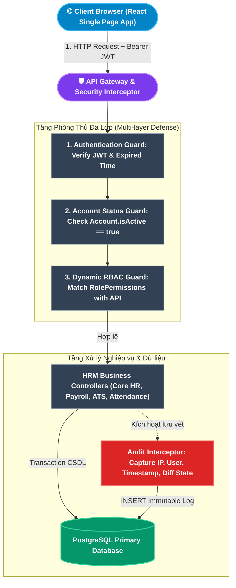
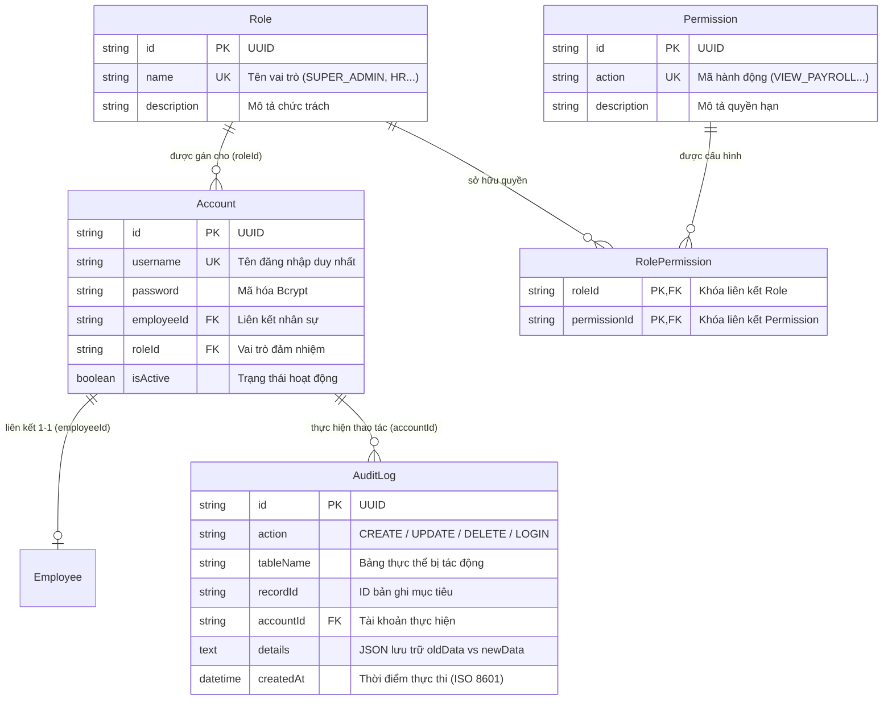

# TÀI LIỆU PHÂN TÍCH NGHIỆP VỤ - MODULE HỆ THỐNG & PHÂN QUYỀN (SYSTEM ADMINISTRATION & DYNAMIC RBAC)

## 1. Giới thiệu tổng quan Module
**Module Hệ thống & Phân quyền (System Administration & Dynamic RBAC)** là nền tảng hạ tầng bảo mật (Security Foundation) chịu trách nhiệm kiểm soát toàn bộ định danh, quyền hạn và tính toàn vẹn dữ liệu cho toàn bộ hệ thống HRM:
- **Kiểm soát Truy cập Dựa trên Vai trò (Dynamic RBAC)**: Cho phép Quản trị viên linh hoạt cấu hình vai trò (`Role`) và gán các quyền hạn chức năng (`Permission`) chi tiết tới từng nút bấm (Xem, Thêm, Sửa, Xóa, Duyệt, Xuất báo cáo) mà không cần can thiệp mã nguồn hệ thống.
- **Quản lý Vòng đời Tài khoản (Account Lifecycle)**: Cấp phát tài khoản tự động liên kết với hồ sơ nhân sự, mã hóa mật khẩu theo chuẩn công nghiệp Bcrypt, thiết lập chính sách cưỡng chế đổi mật khẩu lần đầu và tự động ngắt quyền truy cập khi nhân sự chấm dứt hợp đồng lao động.
- **Giám sát An toàn Thông tin & Nhật ký Kiểm toán (Audit Logging & Forensics)**: Lưu vết bất biến (Immutable Audit Trail) 100% các biến động dữ liệu nhạy cảm (Lương, Hợp đồng, Nhân sự, Phân quyền) kèm địa chỉ IP, User-Agent và phân tích so sánh trước/sau (Diff Viewer).

### Đối tượng sử dụng (Actors):
1. **Super Admin (Quản trị viên tối cao)**: Nắm giữ toàn quyền quản trị, thiết lập ma trận phân quyền, quản lý tài khoản quản trị và điều tra sự cố bảo mật.
2. **IT / System Administrator**: Vận hành hạ tầng, cấp phát tài khoản nhân sự mới, hỗ trợ đặt lại mật khẩu tạm thời và kiểm tra nhật ký lỗi hệ thống.
3. **Internal Auditor / Compliance Officer**: Thanh kiểm tra tính tuân thủ quy trình, đối soát lịch sử biến động dữ liệu nhạy cảm, xuất báo cáo phục vụ pháp lý và chứng nhận bảo mật.
4. **Toàn bộ Người dùng Hệ thống (All Authenticated Users)**: Đăng nhập hệ thống, đổi mật khẩu cá nhân và được giới hạn truy cập theo đúng phạm vi quyền hạn được cấp.

---

## 2. Kiến trúc An toàn Thông tin & Mô hình Kiểm soát Truy cập Phân tầng (Security Architecture)

---

## 3. Ma trận Phân rã Chức năng Chi tiết (Functional Breakdown Matrix)

Hệ thống Phân quyền & Quản trị bao gồm **2 nhóm chức năng trụ cột** với tổng cộng **9 Use Case con (Sub-Use Cases)** được chuẩn hóa toàn diện:

| Nhóm chức năng (Epic) | Mã Use Case | Tên Chức năng Con (Sub-Use Case) | Actor chính | Endpoint Backend / Cơ chế xử lý |
|---|---|---|---|---|
| **1. Quản lý Tài khoản & Phân quyền Động RBAC** *(Account & RBAC Management)* | `UC-SYS-01-01` | Cấp phát & Khởi tạo Tài khoản Người dùng | Super Admin / IT | `POST /api/auth/accounts/provision` |
| | `UC-SYS-01-02` | Cấu hình Vai trò & Ma trận Phân quyền Chức năng | Super Admin | `POST /api/auth/roles/permissions` |
| | `UC-SYS-01-03` | Khóa & Mở khóa Tài khoản Người dùng | Super Admin / Event | `PATCH /api/auth/accounts/:id/toggle-status` |
| | `UC-SYS-01-04` | Đặt lại Mật khẩu & Cưỡng chế Đổi mật khẩu lần đầu | Admin / User | `POST /api/auth/reset-password` |
| | `UC-SYS-01-05` | Kiểm soát Phiên làm việc & Xác thực Token Động | Middleware Guard | `authenticateToken` & Permission Guard |
| **2. Nhật ký Hệ thống & Giám sát An toàn Thông tin** *(Audit Logging & Security Forensics)* | `UC-SYS-02-01` | Ghi nhận Tự động Nhật ký Biến động Dữ liệu | Automated Interceptor | Transactional Dual-write Interceptor |
| | `UC-SYS-02-02` | Tra cứu & Bộ lọc Đa tiêu chí Lịch sử Thao tác | Super Admin / Auditor | `GET /api/audit-logs` (Multi-filter) |
| | `UC-SYS-02-03` | Kiểm tra Chi tiết Biến động Dữ liệu Cũ/Mới (Diff) | Super Admin / Auditor | Side-by-side JSON Diff Viewer |
| | `UC-SYS-02-04` | Xuất Báo cáo Nhật ký Kiểm toán Tuân thủ & Pháp lý | Super Admin / Auditor | `GET /api/audit-logs/export` (Excel/CSV) |

---

## 4. Mô hình Dữ liệu Cốt lõi & Quan hệ Thực thể (Entity Relationship Diagram - ERD)

---

## 5. Danh mục Hồ sơ Phân tích Chi tiết (Detailed Specifications)

Vui lòng tham khảo tài liệu đặc tả chi tiết của từng chức năng con tại các liên kết dưới đây:

1. [Đặc tả Chức năng Quản lý Tài khoản & Phân quyền Động RBAC](file:///c:/Users/truclh/Desktop/HRM-ĐATN/docs/Tài%20liệu%20phân%20tích%20nghiệp%20vụ%20từng%20module/Module%20Hệ%20thống%20Phân%20quyền/Chuc-nang-Phan-Quyen-RBAC.md) (UC-SYS-01-01 đến UC-SYS-01-05).
2. [Đặc tả Chức năng Nhật ký Hệ thống & Giám sát An toàn Thông tin - Audit Log](file:///c:/Users/truclh/Desktop/HRM-ĐATN/docs/Tài%20liệu%20phân%20tích%20nghiệp%20vụ%20từng%20module/Module%20Hệ%20thống%20Phân%20quyền/Chuc-nang-Audit-Log.md) (UC-SYS-02-01 đến UC-SYS-02-04).

---

## 6. Bộ Quy chuẩn An toàn Thông tin & Tuân thủ Bảo mật (Security Compliance Principles)

| STT | Nguyên tắc Bảo mật | Triển khai Kỹ thuật trong Hệ thống | Ý nghĩa Nghiệp vụ & Pháp lý |
|:---:|---|---|---|
| **1** | **Nguyên tắc Quyền hạn Tối thiểu (Principle of Least Privilege)** | Người dùng khi tạo mới mặc định chỉ được gán vai trò `EMPLOYEE` với các quyền tự phục vụ cá nhân. Các quyền quản trị nhân sự, tiền lương, tuyển dụng chỉ được cấp phát theo chỉ định rõ ràng của Super Admin. | Ngăn chặn việc nhân sự tiếp cận dữ liệu vượt quá phạm vi chức trách, giảm thiểu rủi ro nội gián rò rỉ thông tin. |
| **2** | **Xác thực Không trạng thái & Kiểm tra Động (Stateless JWT + Dynamic Invalidation)** | Sử dụng JSON Web Token với thuật toán ký bảo mật SHA-256 kèm thời hạn 24 giờ. Middleware kiểm tra cờ `isActive` tại CSDL trước khi cho phép thực thi API. | Giảm tải cho CSDL trong điều kiện bình thường, đồng thời duy trì khả năng ngắt quyền tức thì khi tài khoản bị khóa. |
| **3** | **Mã hóa Một chiều Mật khẩu (Bcrypt Hashing)** | Sử dụng thư viện Bcrypt với Salt Rounds = 10 để băm mật khẩu người dùng trước khi lưu trữ vào CSDL PostgreSQL. | Đảm bảo ngay cả khi CSDL bị lộ, kẻ tấn công cũng không thể dịch ngược được mật khẩu gốc của người dùng. |
| **4** | **Sổ cái Nhật ký Bất biến (Immutable Audit Trail)** | Bảng `AuditLog` chỉ được cấp quyền `INSERT` và `SELECT`. Tuyệt đối không cung cấp API `DELETE` hoặc `UPDATE`. | Đảm bảo tính pháp lý và tính toàn vẹn của bằng chứng khi có sự cố gian lận tài chính hoặc lộ lọt thông tin. |
| **5** | **Đồng bộ Giao dịch Song song (Transactional Dual-write)** | Toàn bộ các thao tác chỉnh sửa dữ liệu nhạy cảm (Lương, Hợp đồng) được gói chung trong cùng một Prisma Transaction với câu lệnh ghi `AuditLog`. | Đảm bảo không bao giờ xảy ra tình trạng có hành vi sửa dữ liệu mà không có nhật ký ghi vết đi kèm. |
