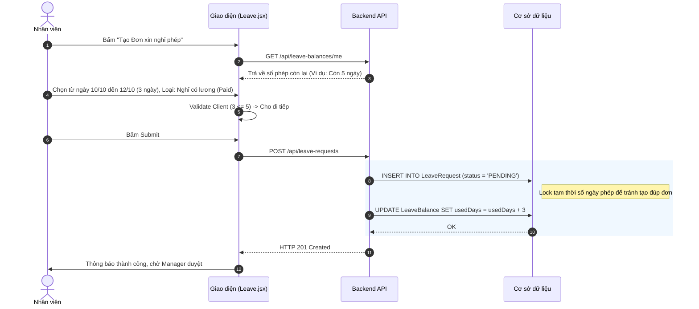
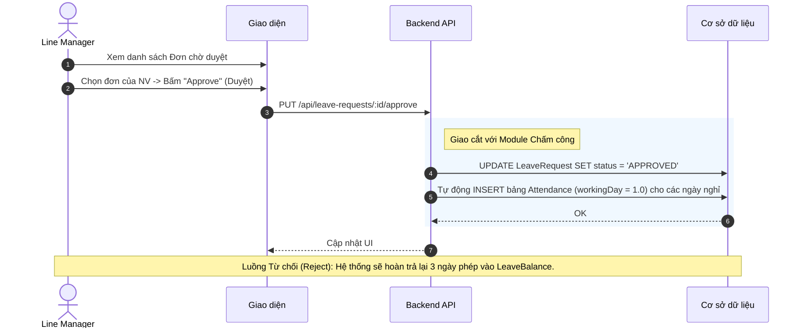

# Đặc tả chức năng: Quản lý Nghỉ phép (Leave Requests)

## 1. Giới thiệu chức năng
Cung cấp giao diện để nhân viên theo dõi quỹ phép năm của mình và nộp đơn xin nghỉ. Trưởng phòng (Line Manager) sẽ tiến hành phê duyệt.

## 2. Các quy tắc nghiệp vụ cốt lõi
- **Chặn số phép âm (Anti-negative Balance):** Nếu tổng số ngày xin nghỉ (Loại Paid Leave) lớn hơn số ngày phép còn lại -> Hệ thống chặn không cho Submit đơn. Bắt buộc nhân viên chuyển sang loại Unpaid Leave (Nghỉ không lương).
- **Giao cắt Module Chấm công:** Khi Đơn xin nghỉ (Paid) được duyệt, hệ thống tự động sinh 1 bản ghi `ON_LEAVE` vào bảng Chấm công (Attendance), giúp nhân viên ngày đó không cần bấm Check-in mà vẫn có 1 Ngày công chuẩn.

## 3. Sơ đồ luồng chi tiết (Sequence Diagrams)

### 3.1. Luồng Xin nghỉ phép & Trừ quỹ phép tạm thời

### 3.2. Luồng Manager phê duyệt đơn

