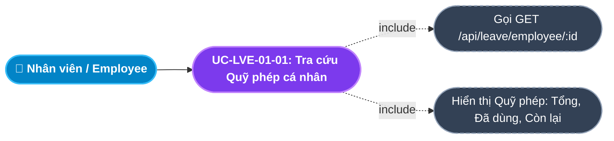
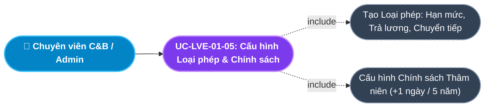
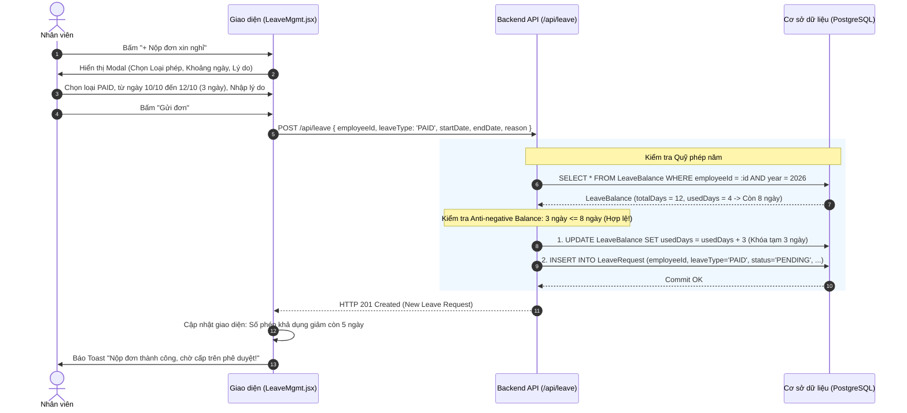
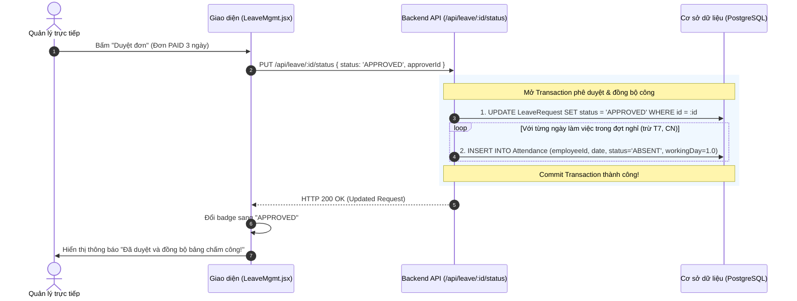

```mermaid
flowchart LR
    classDef actor fill:#0284c7,stroke:#38bdf8,stroke-width:2px,color:#ffffff,font-weight:bold;
    classDef main fill:#7c3aed,stroke:#c084fc,stroke-width:2px,color:#ffffff,font-weight:bold;
    classDef sub fill:#334155,stroke:#94a3b8,stroke-width:1.5px,color:#ffffff,stroke-dasharray: 4 4;

    Actor(["👤 Nhân viên / Employee"]):::actor
    UC(["UC-LVE-01-02: Nộp Đơn xin nghỉ phép"]):::main
    UC_InputDate(["Chọn khoảng ngày Từ ngày -> Đến ngày"]):::sub
    UC_CheckBal(["Kiểm tra Anti-negative Balance"]):::sub
    UC_LockBal(["Tạm khóa số ngày phép trong LeaveBalance"]):::sub

    Actor --> UC
    UC -.->|include| UC_InputDate
    UC -.->|include| UC_CheckBal
    UC -.->|include| UC_LockBal
```

# Usecase: UC-LVE-01 - Quản lý Nghỉ phép và Quỹ phép năm (Leave Requests & Balance Management)

## 1. Giới thiệu chức năng
- **Mục đích**: Số hóa toàn diện quy trình xin nghỉ phép của nhân viên và quy trình phê duyệt của cấp quản lý. Đảm bảo tính toán chính xác số ngày phép năm còn lại (Leave Balance), ngăn chặn tình trạng nghỉ quá phép (Anti-negative Balance) và tự động đồng bộ sang Module Chấm công (sinh công có lương cho các ngày nghỉ phép được duyệt).
- **Actor (Tác nhân)**: Nhân viên (Employee), Trưởng bộ phận / Quản lý trực tiếp (Line Manager), Chuyên viên C&B / HR Admin, Quản trị hệ thống (Admin).
- **Điều kiện tiên quyết**: Nhân viên đã có tài khoản đang hoạt động và đã được cấp quỹ phép năm (`LeaveBalance`).

### Danh mục các chức năng con (Sub-features):
1. **UC-LVE-01-01: Tra cứu Quỹ phép & Lịch sử Nghỉ phép cá nhân (View Leave Balance & History)**: Xem tổng số ngày phép năm được cấp, số ngày đã sử dụng, số ngày còn lại và danh sách đơn đã nộp.
2. **UC-LVE-01-02: Nộp Đơn xin nghỉ phép (Submit Leave Request)**: Tạo đơn xin nghỉ (Nghỉ phép năm hưởng nguyên lương `PAID` hoặc Nghỉ không hưởng lương `UNPAID`), kiểm tra chặn số phép âm và khóa tạm số ngày phép.
3. **UC-LVE-01-03: Phê duyệt Đơn nghỉ phép & Tự động Đồng bộ Chấm công (Approve Leave Request)**: Quản lý duyệt đơn, hệ thống cập nhật trạng thái `APPROVED` và tự động sinh bản ghi công có lương (`workingDay = 1.0`) vào bảng Chấm công.
4. **UC-LVE-01-04: Từ chối Đơn nghỉ phép & Hoàn trả Quỹ phép (Reject Leave Request & Refund Balance)**: Quản lý từ chối đơn, hệ thống tự động hoàn lại số ngày phép đã khóa về lại quỹ phép của nhân viên.
5. **UC-LVE-01-05: Cấu hình Loại phép & Chính sách Phép thâm niên (Leave Types & Policy Configuration)**: HR Admin thiết lập các danh mục phép (Phép năm, Phép kết hôn, Nghỉ tang, Phép thai sản) và quy định cộng thêm ngày phép theo thâm niên công tác.

---

## 2. Dữ liệu nghiệp vụ đầu vào (Input Data & Parameters)

### 2.1. Biểu mẫu Đơn xin nghỉ phép (Leave Request Form Data)
| Tên trường | Kiểu dữ liệu | Tính chất | Ý nghĩa nghiệp vụ & Ràng buộc |
|---|---|---|---|
| `Nhân viên nộp đơn` (employeeId) | UUID / Chuỗi | Bắt buộc | Định danh của nhân viên xin nghỉ. |
| `Loại nghỉ phép` (leaveType) | Enum | Bắt buộc | `PAID` (Nghỉ hưởng lương - trừ vào quỹ phép năm) hoặc `UNPAID` (Nghỉ không lương). |
| `Ngày bắt đầu nghỉ` (startDate) | Ngày (Date) | Bắt buộc | Mốc ngày bắt đầu nghỉ (`YYYY-MM-DD`). |
| `Ngày kết thúc nghỉ` (endDate) | Ngày (Date) | Bắt buộc | Mốc ngày kết thúc kỳ nghỉ (`YYYY-MM-DD`). Phải $\ge startDate$. |
| `Lý do xin nghỉ` (reason) | Văn bản (Text) | Bắt buộc | Diễn giải lý do (Việc gia đình, ốm đau, du lịch...). Tối thiểu 5 ký tự. |
| `Trạng thái đơn` (status) | Enum | Mặc định | `PENDING` (Chờ duyệt), `APPROVED` (Đã duyệt), `REJECTED` (Bị từ chối). |

### 2.2. Dữ liệu Quỹ phép năm (Leave Balance Data)
| Tên trường | Kiểu dữ liệu | Mặc định | Ý nghĩa nghiệp vụ |
|---|---|---|---|
| `Năm áp dụng` (year) | Số nguyên (Integer) | Năm hiện tại | Năm dương lịch áp dụng quỹ phép (VD: 2026). |
| `Tổng số ngày phép` (totalDays) | Số thập phân | 12 ngày | Hạn mức phép năm theo luật định (12 ngày/năm + ngày phép thâm niên). |
| `Số ngày đã sử dụng` (usedDays) | Số thập phân | 0 ngày | Tổng số ngày phép đã nộp đơn và đang duyệt / đã duyệt. |
| `Số ngày phép khả dụng` (availableDays) | Công thức tính | `totalDays - usedDays` | Số ngày phép còn lại có thể xin nghỉ có lương. |

---

## 3. Quy tắc nghiệp vụ (Business Rules)

| Mã Quy tắc | Tình huống nghiệp vụ | Cách hệ thống xử lý | Thông báo hiển thị |
|---|---|---|---|
| **BR-LVE-01-01** | **Chặn Số phép Âm (Anti-negative Balance)**: Nộp đơn loại `PAID` với số ngày xin nghỉ $>$ số ngày phép khả dụng (`availableDays`). | Chặn lưu đơn và yêu cầu nhân viên chuyển sang loại Nghỉ không lương (`UNPAID`). | "Anti-negative Balance: Quỹ phép năm không đủ! Vui lòng chọn loại nghỉ Không lương." |
| **BR-LVE-01-02** | **Khóa tạm thời Quỹ phép (Balance Locking)**: Nhân viên bấm Submit đơn loại `PAID`. | Cộng tạm thời số ngày xin nghỉ vào `usedDays` ngay khi tạo đơn `PENDING` nhằm chống việc nộp đúp nhiều đơn vượt quá quỹ phép. | "Đã tạm khóa [X] ngày phép trong lúc chờ cấp trên phê duyệt." |
| **BR-LVE-01-03** | **Hoàn trả Quỹ phép khi Từ chối (Balance Refund)**: Quản lý bấm Từ chối (`REJECTED`) một đơn loại `PAID`. | Backend chạy Transaction hoàn trả: `usedDays = usedDays - requestDays`. Số dư khả dụng của nhân viên tự động tăng trở lại. | "Đã từ chối đơn và hoàn trả [X] ngày phép vào quỹ phép của nhân viên." |
| **BR-LVE-01-04** | **Tự động Đồng bộ Chấm công (Attendance Intersect)**: Đơn nghỉ phép được chuyển sang `APPROVED`. | Hệ thống duyệt từng ngày trong khoảng nghỉ (trừ Thứ 7, CN) $\rightarrow$ Tự động sinh bản ghi trong bảng `Attendance`: `status = 'ABSENT'`, `workingDay = 1.0` (nếu là PAID) hoặc `workingDay = 0.0` (nếu là UNPAID). | "Đã duyệt đơn và tự động đồng bộ ngày công vào Bảng chấm công!" |
| **BR-LVE-01-05** | **Khóa Đơn sau khi Xử lý (Request Immutability)**: Đơn đã ở trạng thái `APPROVED` hoặc `REJECTED`. | Chặn quyền chỉnh sửa hoặc xóa đơn đối với cả nhân viên lẫn quản lý. | "Đơn nghỉ phép đã được xử lý xong, không thể thay đổi!" |

---

## 4. Đặc tả chi tiết các Use Case chức năng con (Sub-Use Cases Specification)

---

### 4.1. UC-LVE-01-01: Tra cứu Quỹ phép & Lịch sử Nghỉ phép cá nhân (View Leave Balance & History)

#### Sơ đồ Use Case:

#### Bảng đặc tả nghiệp vụ:

| STT | Hạng mục | Nội dung chi tiết |
|:---:|---|---|
| **1** | **Thông tin chung** | - **UC ID**: `UC-LVE-01-01` - **UC Name**: Tra cứu Quỹ phép & Lịch sử Nghỉ phép cá nhân (View Leave Balance & History) - **Actor**: Toàn bộ nhân viên trong công ty - **Mục tiêu**: Giúp nhân viên chủ động theo dõi số ngày phép còn lại trong năm và kiểm tra tình trạng duyệt các đơn xin nghỉ của mình. - **Mô tả**: Hiển thị bảng tổng hợp quỹ phép (Tổng ngày được cấp, Số ngày đã nghỉ, Số ngày khả dụng) và danh sách lịch sử các đơn đã nộp kèm trạng thái (Chờ duyệt, Đã duyệt, Bị từ chối). - **Priority**: High |
| **2** | **Trigger** | Nhân viên truy cập menu **"Quản lý Nghỉ phép"** (`/internal/leave/mgmt`). |
| **3** | **Pre-condition** | Nhân viên đã đăng nhập tài khoản hợp lệ. |
| **4** | **Post-condition** | Thông tin quỹ phép năm và danh sách đơn nghỉ phép hiển thị chi tiết, chính xác. |
| **5** | **Main Flow** | 1. Nhân viên mở trang Nghỉ phép. 2. Giao diện gọi API `GET /api/leave/employee/:employeeId`. 3. Backend truy vấn bảng `LeaveBalance` theo năm hiện tại và bảng `LeaveRequest`. 4. Giao diện hiển thị 3 Card chỉ số: **Tổng ngày phép** (12), **Đã sử dụng** (X), **Còn lại** (12 - X). 5. Hiển thị bảng danh sách các đơn đã nộp sắp xếp theo ngày nộp mới nhất. |
| **6** | **Alternative / Exception Flow** | - **AF-01 (Nhân viên mới chưa có record quỹ phép)**: Backend tự động sinh bản ghi `LeaveBalance` mặc định 12 ngày cho năm hiện tại. |
| **7** | **Business Rules & Validation** | - Số ngày phép khả dụng không bao giờ được âm. |
| **8** | **Acceptance Criteria** | - **AC-01**: Hiển thị đúng số ngày phép còn lại theo thời gian thực. - **AC-02**: Danh sách đơn hiển thị rõ loại phép (PAID / UNPAID) và trạng thái duyệt. |

---

### 4.2. UC-LVE-01-02: Nộp Đơn xin nghỉ phép (Submit Leave Request)

#### Sơ đồ Use Case:

#### Bảng đặc tả nghiệp vụ:

| STT | Hạng mục | Nội dung chi tiết |
|:---:|---|---|
| **1** | **Thông tin chung** | - **UC ID**: `UC-LVE-01-02` - **UC Name**: Nộp Đơn xin nghỉ phép (Submit Leave Request) - **Actor**: Toàn bộ nhân viên công ty - **Mục tiêu**: Đăng ký lịch nghỉ phép hợp lệ với công ty, tự động kiểm tra số dư ngày phép có đủ hay không. - **Mô tả**: Nhân viên chọn loại nghỉ (PAID / UNPAID), chọn từ ngày đến ngày, nhập lý do và bấm gửi. Hệ thống kiểm tra số dư phép và tạm khóa số ngày phép nếu là nghỉ có lương. - **Priority**: High (Bắt buộc) |
| **2** | **Trigger** | Nhân viên nhấn nút **"+ Nộp đơn xin nghỉ"** trên trang Quản lý Nghỉ phép. |
| **3** | **Pre-condition** | Nhân viên có tài khoản đang hoạt động. |
| **4** | **Post-condition** | 1. Bản ghi `LeaveRequest` mới được lưu với `status = 'PENDING'`. 2. Nếu là `PAID`: `LeaveBalance.usedDays` được cộng tạm thêm số ngày xin nghỉ. 3. Đơn xuất hiện trên bảng chờ duyệt của Quản lý trực tiếp. |
| **5** | **Main Flow** | 1. Nhân viên nhấn nút **"+ Nộp đơn xin nghỉ"**. 2. Hệ thống mở Modal Form *Đơn xin nghỉ phép*. 3. Nhân viên chọn: Loại nghỉ (`PAID` hoặc `UNPAID`), Ngày bắt đầu, Ngày kết thúc và nhập Lý do. 4. Nhân viên nhấn nút **"Gửi đơn"**. 5. Giao diện kiểm tra `startDate <= endDate` và tính `requestDays`. 6. Hệ thống gửi request `POST /api/leave` kèm payload. 7. Backend kiểm tra loại `PAID`: Nếu `requestDays > availableDays` $\rightarrow$ Chặn lại và báo lỗi BR-LVE-01-01. 8. Nếu hợp lệ: Cập nhật `usedDays = usedDays + requestDays` và tạo bản ghi đơn mới. 9. Backend trả về `HTTP 201 Created`. Giao diện báo Toast thành công và nạp lại dữ liệu. |
| **6** | **Alternative / Exception Flow** | - **EF-01 (Vượt quá số phép còn lại)**: Xin 3 ngày nhưng chỉ còn 1 ngày $\rightarrow$ Báo lỗi *"Anti-negative Balance: Không đủ ngày phép! Vui lòng chọn loại nghỉ Không lương."* - **EF-02 (Ngày kết thúc trước ngày bắt đầu)**: Báo lỗi *"Ngày kết thúc phải sau hoặc bằng ngày bắt đầu!"*. |
| **7** | **Business Rules & Validation** | - Bắt buộc tuân thủ nguyên tắc Anti-negative Balance (BR-LVE-01-01) và Khóa tạm số dư (BR-LVE-01-02). |
| **8** | **Acceptance Criteria** | - **AC-01**: Không cho phép nộp đơn PAID vượt quá số ngày phép còn lại. - **AC-02**: Nộp đơn thành công số ngày phép còn lại trên giao diện giảm ngay lập tức. |

---

### 4.3. UC-LVE-01-03: Phê duyệt Đơn nghỉ phép & Tự động Đồng bộ Chấm công (Approve Leave Request)

#### Sơ đồ Use Case:

#### Bảng đặc tả nghiệp vụ:

| STT | Hạng mục | Nội dung chi tiết |
|:---:|---|---|
| **1** | **Thông tin chung** | - **UC ID**: `UC-LVE-01-03` - **UC Name**: Phê duyệt Đơn nghỉ phép & Tự động Đồng bộ Chấm công (Approve Leave Request) - **Actor**: Trưởng bộ phận (Line Manager), HR Admin - **Mục tiêu**: Chấp thuận lịch nghỉ phép của nhân viên và tự động ghi nhận ngày công hợp lệ sang Module Chấm công mà nhân viên không cần quét thẻ. - **Mô tả**: Quản lý bấm Duyệt đơn. Hệ thống cập nhật `status = 'APPROVED'`, đồng thời tự động chèn các bản ghi công vào bảng `Attendance` cho các ngày làm việc trong đợt nghỉ. - **Priority**: High |
| **2** | **Trigger** | Quản lý nhấn nút **"Duyệt"** tại đơn nghỉ phép trên danh sách chờ duyệt. |
| **3** | **Pre-condition** | 1. Đơn đang có trạng thái `PENDING`. 2. Người dùng có quyền phê duyệt nghỉ phép của nhân viên. |
| **4** | **Post-condition** | 1. `LeaveRequest.status` chuyển thành `APPROVED`. 2. Các bản ghi `Attendance` mới được tạo tương ứng với các ngày nghỉ (trừ T7, CN). 3. Nếu là nghỉ `PAID`: Ngày công được ghi nhận `workingDay = 1.0` (nguyên công). |
| **5** | **Main Flow** | 1. Quản lý mở danh sách đơn nghỉ phép cần duyệt. 2. Xem chi tiết nhân viên, khoảng ngày nghỉ và lý do. 3. Quản lý nhấn nút **"Duyệt"**. 4. Giao diện gửi request `PUT /api/leave/:id/status` với `{ status: 'APPROVED', approverId }`. 5. Backend mở Database Transaction:    a. Cập nhật `LeaveRequest.status = 'APPROVED'`.    b. Duyệt vòng lặp từ `startDate` đến `endDate`: Bỏ qua Thứ 7, Chủ Nhật $\rightarrow$ Tạo bản ghi `Attendance` với `status = 'ABSENT'`, `workingDay = (leaveType === 'PAID' ? 1.0 : 0.0)`.    c. Commit transaction. 6. Backend trả về `HTTP 200 OK`. Giao diện báo Toast: *"Đã duyệt đơn và tự động đồng bộ ngày công vào Bảng chấm công!"*. |
| **6** | **Alternative / Exception Flow** | - **EF-01 (Đơn đã bị xử lý trước đó)**: Báo lỗi *"Đơn này đã được xử lý rồi!"*. |
| **7** | **Business Rules & Validation** | - Đồng bộ liên module hoàn toàn tự động (BR-LVE-01-04). - Không tính ngày công cho Thứ 7, Chủ Nhật. |
| **8** | **Acceptance Criteria** | - **AC-01**: Duyệt đơn thành công trạng thái đổi sang APPROVED màu xanh lá. - **AC-02**: Bảng chấm công của nhân viên tự động xuất hiện ngày công 1.0 cho những ngày nghỉ phép PAID. |

---

### 4.4. UC-LVE-01-04: Từ chối Đơn nghỉ phép & Hoàn trả Quỹ phép (Reject Leave Request & Refund Balance)

#### Sơ đồ Use Case:

#### Bảng đặc tả nghiệp vụ:

| STT | Hạng mục | Nội dung chi tiết |
|:---:|---|---|
| **1** | **Thông tin chung** | - **UC ID**: `UC-LVE-01-04` - **UC Name**: Từ chối Đơn nghỉ phép & Hoàn trả Quỹ phép (Reject Leave Request & Refund Balance) - **Actor**: Trưởng bộ phận (Line Manager), HR Admin - **Mục tiêu**: Bác bỏ đơn xin nghỉ khi công việc dự án quá gấp hoặc không bố trí được người thay thế, đồng thời hoàn trả lại nguyên vẹn quỹ phép cho nhân viên. - **Mô tả**: Quản lý bấm Từ chối đơn. Hệ thống cập nhật trạng thái `REJECTED`, đồng thời tự động trừ lại số ngày đã tạm khóa trong `LeaveBalance` để nhân viên sử dụng cho dịp khác. - **Priority**: High |
| **2** | **Trigger** | Quản lý nhấn nút **"Từ chối"** tại đơn nghỉ phép trên danh sách chờ duyệt. |
| **3** | **Pre-condition** | Đơn đang có trạng thái `PENDING`. |
| **4** | **Post-condition** | 1. `LeaveRequest.status` chuyển thành `REJECTED`. 2. Nếu là đơn `PAID`: `LeaveBalance.usedDays` được giảm trừ bằng đúng số ngày xin nghỉ. 3. Số ngày phép khả dụng của nhân viên tăng trở lại. |
| **5** | **Main Flow** | 1. Quản lý kiểm tra đơn và bấm nút **"Từ chối"**. 2. Giao diện hiển thị hộp thoại xác nhận kèm ô nhập lý do từ chối. 3. Quản lý bấm xác nhận. 4. Giao diện gửi request `PUT /api/leave/:id/status` với `{ status: 'REJECTED' }`. 5. Backend mở Database Transaction:    a. Đọc thông tin đơn: Nếu là `PAID` $\rightarrow$ Tìm `LeaveBalance` của nhân viên năm đó $\rightarrow$ Cập nhật `usedDays = usedDays - requestDays`.    b. Cập nhật `LeaveRequest.status = 'REJECTED'`.    c. Commit transaction. 6. Backend trả về `HTTP 200 OK`. Giao diện báo Toast: *"Đã từ chối đơn và hoàn trả quỹ phép thành công!"*. |
| **6** | **Alternative / Exception Flow** | - **AF-01 (Đơn không lương UNPAID)**: Đơn loại UNPAID khi từ chối chỉ cập nhật trạng thái, không cần xử lý hoàn trả quỹ phép. |
| **7** | **Business Rules & Validation** | - Đảm bảo nguyên tắc bảo toàn quỹ phép cho người lao động (BR-LVE-01-03). |
| **8** | **Acceptance Criteria** | - **AC-01**: Từ chối thành công badge đổi sang REJECTED màu đỏ. - **AC-02**: Số phép còn lại của nhân viên được cộng trả lại ngay lập tức. |

---

### 4.5. UC-LVE-01-05: Cấu hình Loại phép & Chính sách Phép thâm niên (Leave Types & Policy Configuration)

#### Sơ đồ Use Case:

#### Bảng đặc tả nghiệp vụ:

| STT | Hạng mục | Nội dung chi tiết |
|:---:|---|---|
| **1** | **Thông tin chung** | - **UC ID**: `UC-LVE-01-05` - **UC Name**: Cấu hình Loại phép & Chính sách Phép thâm niên (Leave Types & Policy Configuration) - **Actor**: Chuyên viên C&B, HR Admin - **Mục tiêu**: Cho phép bộ phận Nhân sự linh hoạt thiết lập các quy định nghỉ phép theo đúng quy chế công ty và Luật Lao động. - **Mô tả**: Thiết lập danh mục Loại phép (`LeaveTypeConfig`) với số ngày mặc định, chế độ hưởng lương, khả năng chuyển tiếp sang năm sau; và thiết lập Chính sách thâm niên (`LeavePolicy`) cộng thêm ngày phép theo số năm làm việc (Cứ 5 năm làm việc được cộng thêm 1 ngày phép theo Điều 114 BLLĐ 2019). - **Priority**: Medium |
| **2** | **Trigger** | Người dùng truy cập các tab **"Loại phép"** (`LeaveTypes.jsx`) hoặc **"Chính sách nghỉ phép"** (`LeavePolicies.jsx`). |
| **3** | **Pre-condition** | Người dùng có vai trò `ADMIN` hoặc `HR_MANAGER`. |
| **4** | **Post-condition** | Danh mục loại phép và quy chế thâm niên được áp dụng tự động cho toàn bộ nhân sự công ty. |
| **5** | **Main Flow** | 1. HR mở tab Cấu hình Loại phép. 2. Bấm "+ Thêm loại phép", nhập Tên phép (VD: "Nghỉ kết hôn"), Mã ("MARRIAGE"), Số ngày mặc định (3 ngày), Tích chọn "Có hưởng lương". 3. Bấm "Lưu cấu hình" $\rightarrow$ Gọi `POST /api/leave-config/types`. 4. HR chuyển sang tab Chính sách thâm niên, thiết lập: "Thâm niên từ 5 năm $\rightarrow$ Cộng thêm 1 ngày phép". 5. Hệ thống lưu chính sách qua `POST /api/leave-config/policies`. |
| **6** | **Alternative / Exception Flow** | - **EF-01 (Trùng mã loại phép)**: Nhập trùng mã `code` đã có $\rightarrow$ Báo lỗi *"Mã loại phép đã tồn tại trong hệ thống!"*. |
| **7** | **Business Rules & Validation** | - Mã loại phép là duy nhất (Unique code). - Quy chế thâm niên tuân thủ Điều 114 Bộ luật Lao động 2019. |
| **8** | **Acceptance Criteria** | - **AC-01**: Thêm mới loại phép thành công hiển thị ngay trên danh mục lựa chọn khi nộp đơn. - **AC-02**: Nhân viên đủ 5 năm thâm niên tự động được cộng thêm 1 ngày phép vào quỹ phép năm. |

---

## 5. Sơ đồ tuần tự nghiệp vụ (Sequence Diagrams)

### 5.1. Luồng Nộp Đơn Nghỉ phép & Khóa Tạm Số Dư (UC-LVE-01-02)

### 5.2. Luồng Quản lý Duyệt Đơn & Đồng bộ Bảng Chấm công (UC-LVE-01-03)

---

## 6. Ma trận kịch bản kiểm thử (Test Scenarios & Acceptance Matrix)

| Mã kịch bản | Use Case liên quan | Điều kiện kiểm thử | Các bước thực hiện | Kết quả mong đợi (Expected Outcome) | Đánh giá |
|---|---|---|---|---|:---:|
| **TC-LVE-01-01** | UC-LVE-01-02 | Nộp đơn có lương hợp lệ | Quỹ phép còn 5 ngày, xin nghỉ 2 ngày loại `PAID` $\rightarrow$ Bấm Gửi | Tạo đơn thành công với `status = 'PENDING'`, số phép còn lại giảm xuống 3 ngày. | **Pass** |
| **TC-LVE-01-02** | UC-LVE-01-02 | Chặn số phép âm | Quỹ phép còn 1 ngày, xin nghỉ 3 ngày loại `PAID` $\rightarrow$ Bấm Gửi | Báo lỗi 400 *"Anti-negative Balance: Không đủ ngày phép! Vui lòng chọn loại nghỉ Không lương."* | **Pass** |
| **TC-LVE-01-03** | UC-LVE-01-03 | Duyệt đơn & Đồng bộ công | Quản lý duyệt đơn nghỉ PAID $\rightarrow$ Kiểm tra Bảng chấm công | Đơn đổi sang `APPROVED`, bảng chấm công của các ngày nghỉ tự động có 1.0 công. | **Pass** |
| **TC-LVE-01-04** | UC-LVE-01-04 | Từ chối đơn & Hoàn trả phép | Quản lý từ chối đơn PAID 2 ngày $\rightarrow$ Kiểm tra Quỹ phép | Đơn đổi sang `REJECTED`, quỹ phép của nhân viên được cộng trả lại 2 ngày. | **Pass** |
| **TC-LVE-01-05** | UC-LVE-01-05 | Tạo loại phép mới | Thêm loại "Nghỉ kết hôn", mã `MARRIAGE`, 3 ngày có lương | Lưu thành công, loại phép mới xuất hiện trong dropdown nộp đơn. | **Pass** |
