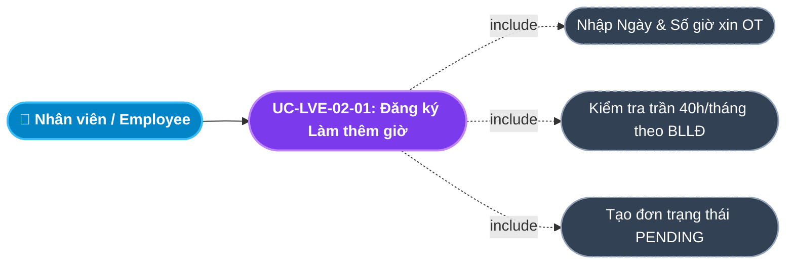
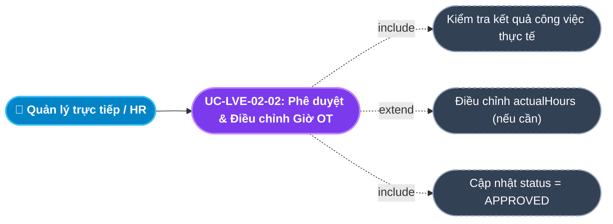
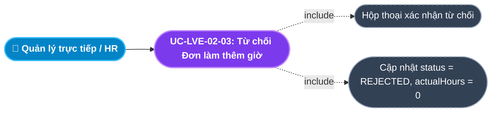
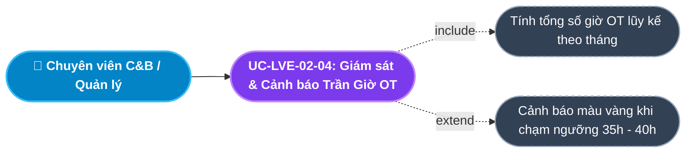
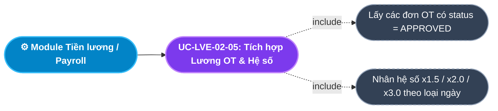
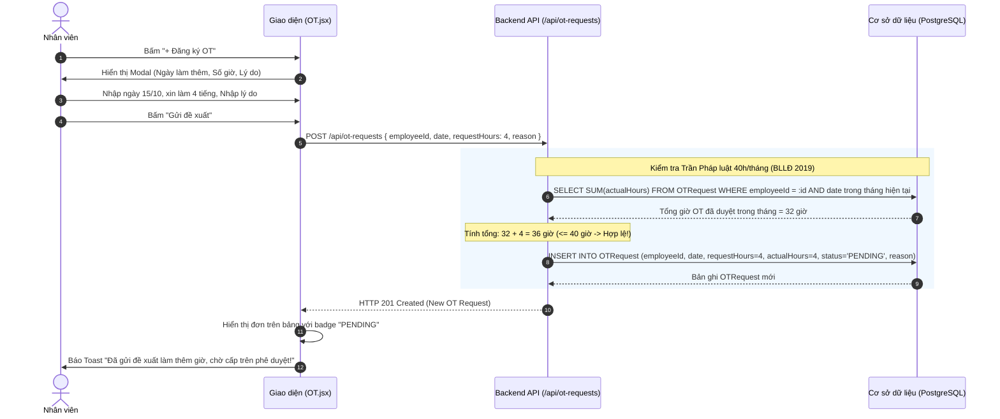
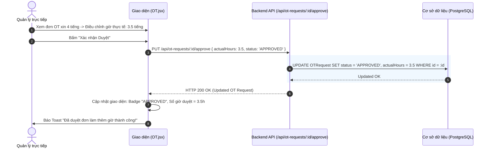

# Usecase: UC-LVE-02 - Quản lý Làm thêm giờ (Overtime - OT Management)

## 1. Giới thiệu chức năng
- **Mục đích**: Chuẩn hóa quy trình đăng ký, thẩm định và phê duyệt làm thêm giờ (Overtime) của nhân viên. Hệ thống kiểm soát chặt chẽ giới hạn số giờ làm thêm tối đa theo quy định của pháp luật lao động (không quá 40 giờ/tháng), cho phép quản lý nghiệm thu số giờ thực tế (`actualHours`) và cung cấp dữ liệu đầu vào có hệ số nhân (x1.5, x2.0, x3.0) cho Module Tiền lương (Payroll).
- **Actor (Tác nhân)**: Nhân viên (Employee), Trưởng bộ phận / Quản lý trực tiếp (Line Manager), Chuyên viên C&B, Quản trị hệ thống (Admin).
- **Điều kiện tiên quyết**: Nhân viên đã có tài khoản và được phân công làm việc ngoài giờ chuẩn.

### Danh mục các chức năng con (Sub-features):
1. **UC-LVE-02-01: Đăng ký Làm thêm giờ (Submit OT Request)**: Nhân viên nộp đơn đăng ký làm thêm ngoài giờ, hệ thống tự động kiểm tra trần giới hạn pháp lý 40 giờ/tháng.
2. **UC-LVE-02-02: Phê duyệt & Điều chỉnh Giờ OT Thực tế (Approve & Adjust Actual OT Hours)**: Quản lý trực tiếp thẩm định đơn và có quyền điều chỉnh số giờ làm thêm thực tế được phê duyệt (`actualHours`) dựa trên kết quả công việc.
3. **UC-LVE-02-03: Từ chối Đơn làm thêm giờ (Reject OT Request)**: Quản lý từ chối các đề xuất làm thêm không cần thiết hoặc không đem lại giá trị.
4. **UC-LVE-02-04: Tra cứu, Giám sát & Cảnh báo Trần Giờ OT (Monitor & Track OT Hours)**: Theo dõi lũy kế số giờ OT trong tháng của từng nhân viên và cảnh báo sớm các trường hợp chạm ngưỡng 35 - 40 giờ.
5. **UC-LVE-02-05: Tích hợp Bảng lương & Quy chuẩn Hệ số Làm thêm (Payroll Integration & Rate Multipliers)**: Xuất dữ liệu số giờ OT thực tế được duyệt và tự động áp hệ số tính lương theo quy định Luật Lao động.

---

## 2. Dữ liệu nghiệp vụ đầu vào (Input Data & Parameters)

### 2.1. Biểu mẫu Đơn Làm thêm giờ (OT Request Form Data)
| Tên trường | Kiểu dữ liệu | Tính chất | Ý nghĩa nghiệp vụ & Ràng buộc |
|---|---|---|---|
| `Nhân viên` (employeeId) | UUID / Chuỗi | Bắt buộc | Định danh của nhân viên đăng ký làm thêm giờ. |
| `Ngày làm thêm` (date) | Ngày (Date) | Bắt buộc | Mốc ngày diễn ra buổi làm thêm (`YYYY-MM-DD`). |
| `Số giờ xin làm thêm` (requestHours) | Số thập phân | Bắt buộc | Số giờ nhân viên dự kiến làm thêm ($> 0$, tối đa 12 giờ/ngày). |
| `Số giờ duyệt thực tế` (actualHours) | Số thập phân | Quản lý điền | Số giờ công nhận chính thức sau khi nghiệm thu (Mặc định bằng `requestHours`). |
| `Lý do làm thêm giờ` (reason) | Văn bản (Text) | Bắt buộc | Mục tiêu công việc cần giải quyết (VD: "Triển khai nâng cấp hệ thống máy chủ cuối tuần"). |
| `Trạng thái phê duyệt` (status) | Enum | Mặc định | `PENDING` (Chờ duyệt), `APPROVED` (Đã duyệt), `REJECTED` (Bị từ chối). |

### 2.2. Khung Hệ số Làm thêm giờ theo Luật Lao động Việt Nam
| Loại ngày làm thêm | Khung giờ áp dụng | Hệ số tính lương quy định |
|---|---|:---:|
| **Ngày làm việc thường** | Ngoài giờ hành chính (Sau 17:30) | **150% (x1.5)** |
| **Ngày nghỉ hàng tuần** | Thứ 7 hoặc Chủ Nhật | **200% (x2.0)** |
| **Ngày nghỉ Lễ, Tết** | Các ngày nghỉ theo quy định bảng `Holiday` | **300% (x3.0)** |

---

## 3. Quy tắc nghiệp vụ (Business Rules)

| Mã Quy tắc | Tình huống nghiệp vụ | Cách hệ thống xử lý | Thông báo hiển thị |
|---|---|---|---|
| **BR-LVE-02-01** | **Giới hạn Trần Làm thêm giờ (Legal Monthly OT Cap)**: Tổng số giờ OT đã duyệt + số giờ xin mới trong tháng $> 40$ giờ. | Hệ thống chặn không cho nộp đơn theo quy định tại Điểm b Khoản 2 Điều 107 Bộ luật Lao động 2019. | "Cảnh báo pháp lý: Số giờ làm thêm vượt quá giới hạn 40 giờ/tháng theo Luật Lao động!" |
| **BR-LVE-02-02** | **Quyền Nghiệm thu Giờ Thực tế (Actual Hours Discretion)**: Quản lý phê duyệt đơn OT. | Cho phép Quản lý điều chỉnh `actualHours <= requestHours` dựa trên khối lượng công việc hoàn thành thực tế trước khi bấm Duyệt. | "Đã điều chỉnh số giờ OT thực tế được phê duyệt là [X] giờ." |
| **BR-LVE-02-03** | **Căn cứ Tính lương OT (Payroll Base Calculation)**: Xuất bảng tính lương cuối tháng. | Module Tiền lương chỉ lấy dữ liệu từ các đơn có `status = 'APPROVED'` và sử dụng giá trị trường `actualHours`, tuyệt đối không dùng `requestHours`. | "Dữ liệu OT đã được kết chuyển sang Module Tiền lương." |
| **BR-LVE-02-04** | **Ràng buộc Thời gian Đăng ký**: Đăng ký OT cho các ngày đã qua trong quá khứ quá 2 ngày. | Chặn gửi đơn, yêu cầu nộp đơn trước khi làm thêm hoặc muộn nhất trong vòng 24 giờ sau ca OT. | "Vui lòng đăng ký làm thêm giờ trước khi thực hiện hoặc trong vòng 24 giờ!" |
| **BR-LVE-02-05** | **Khóa Đơn sau khi Duyệt**: Đơn OT đã có trạng thái `APPROVED` hoặc `REJECTED`. | Chuyển sang chế độ chỉ đọc (Read-only) để bảo toàn tính toàn vẹn dữ liệu quyết toán lương. | "Đơn OT đã được xử lý xong, không thể chỉnh sửa!" |

---

## 4. Đặc tả chi tiết các Use Case chức năng con (Sub-Use Cases Specification)

---

### 4.1. UC-LVE-02-01: Đăng ký Làm thêm giờ (Submit OT Request)

#### Sơ đồ Use Case:

#### Bảng đặc tả nghiệp vụ:

| STT | Hạng mục | Nội dung chi tiết |
|:---:|---|---|
| **1** | **Thông tin chung** | - **UC ID**: `UC-LVE-02-01` - **UC Name**: Đăng ký Làm thêm giờ (Submit OT Request) - **Actor**: Toàn bộ nhân viên công ty - **Mục tiêu**: Khai báo kế hoạch làm việc ngoài giờ để được cấp quản lý phê duyệt và bảo đảm quyền lợi tiền lương. - **Mô tả**: Nhân viên chọn ngày làm thêm, nhập số giờ dự kiến làm và lý do công việc. Hệ thống kiểm tra số giờ lũy kế trong tháng để ngăn vi phạm luật lao động. - **Priority**: High (Bắt buộc) |
| **2** | **Trigger** | Nhân viên nhấn nút **"+ Đăng ký OT"** trên trang Quản lý Làm thêm giờ. |
| **3** | **Pre-condition** | Nhân viên có tài khoản hợp lệ. |
| **4** | **Post-condition** | 1. Bản ghi `OTRequest` mới được tạo với trạng thái `PENDING`. 2. Đơn xuất hiện trên bảng chờ duyệt của Quản lý trực tiếp. |
| **5** | **Main Flow** | 1. Nhân viên nhấn nút **"+ Đăng ký OT"**. 2. Hệ thống mở Modal Form *Đăng ký Làm thêm giờ*. 3. Nhân viên chọn: Ngày làm thêm, Số giờ đề xuất (`requestHours`), và Nhập lý do giải trình. 4. Nhân viên nhấn nút **"Gửi đề xuất"**. 5. Hệ thống gửi request `POST /api/ot-requests` kèm payload. 6. Backend tính tổng số giờ OT đã làm trong tháng hiện tại của nhân viên. 7. Nếu `tổng + requestHours > 40` $\rightarrow$ Chặn lại và báo lỗi BR-LVE-02-01. 8. Nếu hợp lệ: Backend lưu bản ghi với `status = 'PENDING'`, `actualHours = requestHours`. 9. Backend trả về `HTTP 201 Created`. Giao diện báo Toast thành công và nạp lại bảng danh sách. |
| **6** | **Alternative / Exception Flow** | - **EF-01 (Vượt trần 40 giờ/tháng)**: Tổng giờ vượt quá 40 $\rightarrow$ Báo lỗi *"Vượt quá giới hạn 40 giờ làm thêm mỗi tháng theo Luật Lao động!"*. - **EF-02 (Số giờ không hợp lệ)**: Nhập số giờ $\le 0$ hoặc $> 12$ $\rightarrow$ Báo lỗi *"Số giờ làm thêm trong ngày không hợp lệ!"*. |
| **7** | **Business Rules & Validation** | - Nghiêm ngặt tuân thủ giới hạn pháp lý 40h/tháng (BR-LVE-02-01). - `reason` bắt buộc tối thiểu 5 ký tự. |
| **8** | **Acceptance Criteria** | - **AC-01**: Bấm gửi đơn vượt quá 40h trong tháng hệ thống chặn và báo lỗi rõ ràng. - **AC-02**: Nộp đơn thành công đơn xuất hiện ngay với nhãn PENDING. |

---

### 4.2. UC-LVE-02-02: Phê duyệt & Điều chỉnh Giờ OT Thực tế (Approve & Adjust Actual OT Hours)

#### Sơ đồ Use Case:

#### Bảng đặc tả nghiệp vụ:

| STT | Hạng mục | Nội dung chi tiết |
|:---:|---|---|
| **1** | **Thông tin chung** | - **UC ID**: `UC-LVE-02-02` - **UC Name**: Phê duyệt & Điều chỉnh Giờ OT Thực tế (Approve & Adjust Actual OT Hours) - **Actor**: Trưởng bộ phận (Line Manager), Chuyên viên C&B - **Mục tiêu**: Nghiệm thu và xác nhận số giờ làm thêm thực tế xứng đáng được hưởng lương của nhân viên. - **Mô tả**: Quản lý kiểm tra đơn OT, nếu nhân viên xin 4 tiếng nhưng thực tế chỉ làm 3 tiếng, quản lý có quyền sửa `actualHours = 3` trước khi bấm Duyệt. - **Priority**: High |
| **2** | **Trigger** | Quản lý nhấn nút **"Duyệt"** tại đơn OT trên danh sách chờ duyệt. |
| **3** | **Pre-condition** | 1. Đơn đang ở trạng thái `PENDING`. 2. Người dùng có quyền duyệt đơn của nhân viên. |
| **4** | **Post-condition** | 1. `OTRequest.status` chuyển thành `APPROVED`. 2. Giá trị `actualHours` được lưu lại làm cơ sở tính lương. 3. Thông báo phê duyệt được gửi về cho nhân viên. |
| **5** | **Main Flow** | 1. Quản lý mở danh sách đơn OT chờ duyệt. 2. Xem chi tiết nhân viên, ngày làm thêm, số giờ đề xuất và lý do. 3. Quản lý điều chỉnh số giờ thực tế (nếu cần) và bấm **"Xác nhận Duyệt"**. 4. Giao diện gửi request cập nhật với `{ status: 'APPROVED', actualHours }`. 5. Backend cập nhật bản ghi trong CSDL và trả về `HTTP 200 OK`. 6. Giao diện báo Toast: *"Đã duyệt đơn làm thêm giờ thành công!"*, đổi nhãn trạng thái sang màu xanh lá (`APPROVED`). |
| **6** | **Alternative / Exception Flow** | - **EF-01 (Duyệt số giờ lớn hơn số giờ xin)**: Quản lý nhập `actualHours > requestHours` $\rightarrow$ Báo lỗi *"Số giờ duyệt thực tế không được vượt quá số giờ nhân viên đã xin!"*. |
| **7** | **Business Rules & Validation** | - Căn cứ tính lương duy nhất là `actualHours` (BR-LVE-02-02, BR-LVE-02-03). |
| **8** | **Acceptance Criteria** | - **AC-01**: Quản lý có thể điều chỉnh số giờ thực tế trước khi duyệt. - **AC-02**: Duyệt thành công đơn chuyển sang màu xanh lá và khóa chỉnh sửa. |

---

### 4.3. UC-LVE-02-03: Từ chối Đơn làm thêm giờ (Reject OT Request)

#### Sơ đồ Use Case:

#### Bảng đặc tả nghiệp vụ:

| STT | Hạng mục | Nội dung chi tiết |
|:---:|---|---|
| **1** | **Thông tin chung** | - **UC ID**: `UC-LVE-02-03` - **UC Name**: Từ chối Đơn làm thêm giờ (Reject OT Request) - **Actor**: Trưởng bộ phận (Line Manager), HR Admin - **Mục tiêu**: Bác bỏ các đơn OT không có căn cứ, không đạt yêu cầu công việc hoặc đăng ký trái quy định. - **Mô tả**: Quản lý nhấn nút **"Từ chối"**, hệ thống chuyển trạng thái đơn sang `REJECTED`, đặt `actualHours = 0` và không tính lương cho đợt OT này. - **Priority**: High |
| **2** | **Trigger** | Quản lý nhấn nút **"Từ chối"** tại đơn OT trên danh sách chờ duyệt. |
| **3** | **Pre-condition** | Đơn đang ở trạng thái `PENDING`. |
| **4** | **Post-condition** | 1. `OTRequest.status` chuyển thành `REJECTED`. 2. Số giờ OT này không được ghi nhận vào bảng tính lương. |
| **5** | **Main Flow** | 1. Quản lý kiểm tra đơn OT và bấm **"Từ chối"**. 2. Hệ thống hiển thị hộp thoại xác nhận kèm ô nhập lý do từ chối. 3. Quản lý xác nhận đồng ý. 4. Giao diện gửi request cập nhật với `{ status: 'REJECTED' }`. 5. Backend cập nhật `status = 'REJECTED'` và gán `actualHours = 0`. 6. Giao diện báo Toast: *"Đã từ chối đơn làm thêm giờ!"*, cập nhật badge đỏ. |
| **6** | **Alternative / Exception Flow** | - **AF-01 (Quản lý bấm Hủy)**: Hộp thoại đóng lại, đơn giữ nguyên trạng thái `PENDING`. |
| **7** | **Business Rules & Validation** | - Khóa đơn không thể sửa đổi sau khi đã từ chối (BR-LVE-02-05). |
| **8** | **Acceptance Criteria** | - **AC-01**: Bắt buộc có popup xác nhận. - **AC-02**: Đơn bị từ chối không sinh thêm bất kỳ chi phí lương nào. |

---

### 4.4. UC-LVE-02-04: Tra cứu, Giám sát & Cảnh báo Trần Giờ OT (Monitor & Track OT Hours)

#### Sơ đồ Use Case:

#### Bảng đặc tả nghiệp vụ:

| STT | Hạng mục | Nội dung chi tiết |
|:---:|---|---|
| **1** | **Thông tin chung** | - **UC ID**: `UC-LVE-02-04` - **UC Name**: Tra cứu, Giám sát & Cảnh báo Trần Giờ OT (Monitor & Track OT Hours) - **Actor**: Chuyên viên C&B, Trưởng phòng, Ban Giám đốc - **Mục tiêu**: Giám sát tổng thời gian làm thêm giờ toàn công ty, kiểm soát quỹ ngân sách OT và chủ động ngăn chặn vi phạm luật lao động. - **Mô tả**: Hiển thị bảng tổng hợp số giờ OT của từng nhân sự trong tháng, tự động đổi màu cảnh báo khi nhân viên làm thêm quá nhiều ($\ge 35$ giờ). - **Priority**: Medium |
| **2** | **Trigger** | Người dùng xem bảng danh sách đơn OT và báo cáo tổng hợp giờ làm thêm. |
| **3** | **Pre-condition** | Người dùng có quyền quản lý nhân sự. |
| **4** | **Post-condition** | Dữ liệu giờ làm thêm hiển thị trực quan kèm cảnh báo rủi ro pháp lý. |
| **5** | **Main Flow** | 1. HR mở màn hình Quản lý Làm thêm giờ. 2. Hệ thống tải toàn bộ đơn OT của tháng hiện tại. 3. Tính tổng số giờ `actualHours` theo từng nhân viên. 4. Nếu tổng số giờ $\ge 35$ giờ $\rightarrow$ Hiển thị nhãn cảnh báo màu vàng: *"Cận trần OT (Đã làm [X]/40 giờ)"*. 5. Nếu tổng số giờ $= 40$ giờ $\rightarrow$ Hiển thị nhãn cảnh báo màu đỏ: *"Đạt trần OT tối đa (40h)"* và tự động vô hiệu hóa nút gửi đơn OT cho nhân viên này trong tháng. |
| **6** | **Alternative / Exception Flow** | - **AF-01 (Đầu tháng mới)**: Sang ngày 01 của tháng kế tiếp $\rightarrow$ Bộ đếm giờ OT tự động reset về 0 cho chu kỳ mới. |
| **7** | **Business Rules & Validation** | - Cảnh báo tự động dựa trên tổng số giờ thực tế trong tháng dương lịch. |
| **8** | **Acceptance Criteria** | - **AC-01**: Tính toán chính xác tổng số giờ làm thêm lũy kế của từng nhân viên. - **AC-02**: Hiển thị cảnh báo trực quan khi chạm ngưỡng an toàn. |

---

### 4.5. UC-LVE-02-05: Tích hợp Bảng lương & Quy chuẩn Hệ số Làm thêm (Payroll Integration & Rate Multipliers)

#### Sơ đồ Use Case:

#### Bảng đặc tả nghiệp vụ:

| STT | Hạng mục | Nội dung chi tiết |
|:---:|---|---|
| **1** | **Thông tin chung** | - **UC ID**: `UC-LVE-02-05` - **UC Name**: Tích hợp Bảng lương & Quy chuẩn Hệ số Làm thêm (Payroll Integration & Rate Multipliers) - **Actor**: Hệ thống tính lương tự động, Chuyên viên C&B - **Mục tiêu**: Tự động chuyển đổi số giờ làm thêm sang số tiền lương OT thực nhận hàng tháng theo đúng quy định pháp luật. - **Mô tả**: Khi lập bảng lương cuối tháng, hệ thống tự động quét các đơn OT `APPROVED`, phân loại ngày làm thêm (Ngày thường / Cuối tuần / Ngày Lễ) và áp dụng công thức tính tiền làm thêm giờ. - **Priority**: High |
| **2** | **Trigger** | Chuyên viên C&B bấm "Tính bảng lương tháng" tại Module Tiền lương. |
| **3** | **Pre-condition** | Các đơn OT trong tháng đã được quản lý phê duyệt hoàn tất. |
| **4** | **Post-condition** | Cột "Tiền làm thêm giờ (OT)" trên phiếu lương của nhân viên được tính toán chuẩn xác 100%. |
| **5** | **Main Flow** | 1. Hệ thống tính lương quét tất cả đơn OT có `status = 'APPROVED'` trong tháng. 2. Lấy đơn giá 1 giờ làm việc bình thường: `hourlyRate = baseSalary / (26 * 8)`. 3. **Phân loại hệ số (Multiplier)**:    - Nếu ngày OT là ngày thường $\rightarrow$ `rate = 1.5`.    - Nếu ngày OT là Thứ 7 hoặc CN $\rightarrow$ `rate = 2.0`.    - Nếu ngày OT trùng với ngày trong bảng `Holiday` $\rightarrow$ `rate = 3.0`. 4. Tính tiền OT của từng đơn: `otPay = actualHours * hourlyRate * rate`. 5. Cộng tổng tiền OT vào tổng thu nhập của nhân viên trên phiếu lương. |
| **6** | **Alternative / Exception Flow** | - **AF-01 (Đơn không được duyệt)**: Các đơn `PENDING` hoặc `REJECTED` bị loại bỏ, tính tiền OT = 0. |
| **7** | **Business Rules & Validation** | - Căn cứ chi trả hoàn toàn tự động, loại bỏ mọi can thiệp sửa tay trên file Excel. |
| **8** | **Acceptance Criteria** | - **AC-01**: Tính chuẩn hệ số 150%, 200%, 300% theo đúng loại ngày làm thêm. - **AC-02**: Tiền lương OT khớp hoàn toàn giữa bảng công và phiếu lương. |

---

## 5. Sơ đồ tuần tự nghiệp vụ (Sequence Diagrams)

### 5.1. Luồng Đăng ký Làm thêm giờ & Kiểm tra Trần Pháp luật (UC-LVE-02-01)

### 5.2. Luồng Quản lý Nghiệm thu & Duyệt Giờ OT Thực tế (UC-LVE-02-02)

---

## 6. Ma trận kịch bản kiểm thử (Test Scenarios & Acceptance Matrix)

| Mã kịch bản | Use Case liên quan | Điều kiện kiểm thử | Các bước thực hiện | Kết quả mong đợi (Expected Outcome) | Đánh giá |
|---|---|---|---|---|:---:|
| **TC-LVE-02-01** | UC-LVE-02-01 | Đăng ký OT hợp lệ | Trong tháng đã làm 20h, xin thêm 3h $\rightarrow$ Bấm Gửi | Tạo đơn thành công với `status = 'PENDING'`, tổng giờ dự kiến 23h. | **Pass** |
| **TC-LVE-02-02** | UC-LVE-02-01 | Chặn vượt trần 40h/tháng | Trong tháng đã làm 38h, xin thêm 5h (tổng 43h) $\rightarrow$ Bấm Gửi | Báo lỗi 400 *"Vượt quá giới hạn 40 giờ làm thêm mỗi tháng theo Luật Lao động!"*. | **Pass** |
| **TC-LVE-02-03** | UC-LVE-02-02 | Điều chỉnh giờ thực tế khi duyệt | Nhân viên xin 4h, Quản lý sửa thành 3h rồi bấm Duyệt | Lưu thành công `status = 'APPROVED'`, `actualHours = 3.0`. | **Pass** |
| **TC-LVE-02-04** | UC-LVE-02-03 | Từ chối đơn OT | Quản lý bấm Từ chối đơn $\rightarrow$ Xác nhận trên SweetAlert | Đơn đổi sang `REJECTED`, `actualHours = 0`, không sinh tiền lương OT. | **Pass** |
| **TC-LVE-02-05** | UC-LVE-02-05 | Tính đúng hệ số lương OT | Làm thêm 4h vào ngày Chủ Nhật (hệ số x2.0) | Phiếu lương tính đúng tiền bằng 4h * lương giờ * 2.0. | **Pass** |
