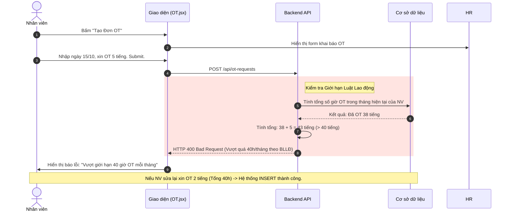

# Đặc tả chức năng: Quản lý Làm thêm giờ (OT Requests)

## 1. Giới thiệu chức năng
Cho phép nhân viên đăng ký giờ làm thêm ngoài ca hành chính để hệ thống tính toán chi trả lương OT (nhân hệ số x1.5 hoặc x2.0).

## 2. Các quy tắc nghiệp vụ cốt lõi
- **Giới hạn số giờ làm thêm (Theo Luật LĐ 2019):** Hệ thống chặn nghiêm ngặt việc xin làm thêm vượt quá **40 giờ/tháng**. Nếu vi phạm, công ty có thể bị phạt nặng.
- **Giờ xin (Request) vs Giờ thực tế (Actual):** Nhân viên khai báo giờ xin OT (Ví dụ 4 tiếng), nhưng Trưởng phòng/HR có quyền điều chỉnh lại giờ thực tế được duyệt (Ví dụ chỉ duyệt 3 tiếng). Module Tiền lương sẽ lấy giờ thực tế.

## 3. Sơ đồ luồng chi tiết (Sequence Diagrams)

### 3.1. Luồng Xin làm thêm giờ (Kèm Validate Luật LĐ)

