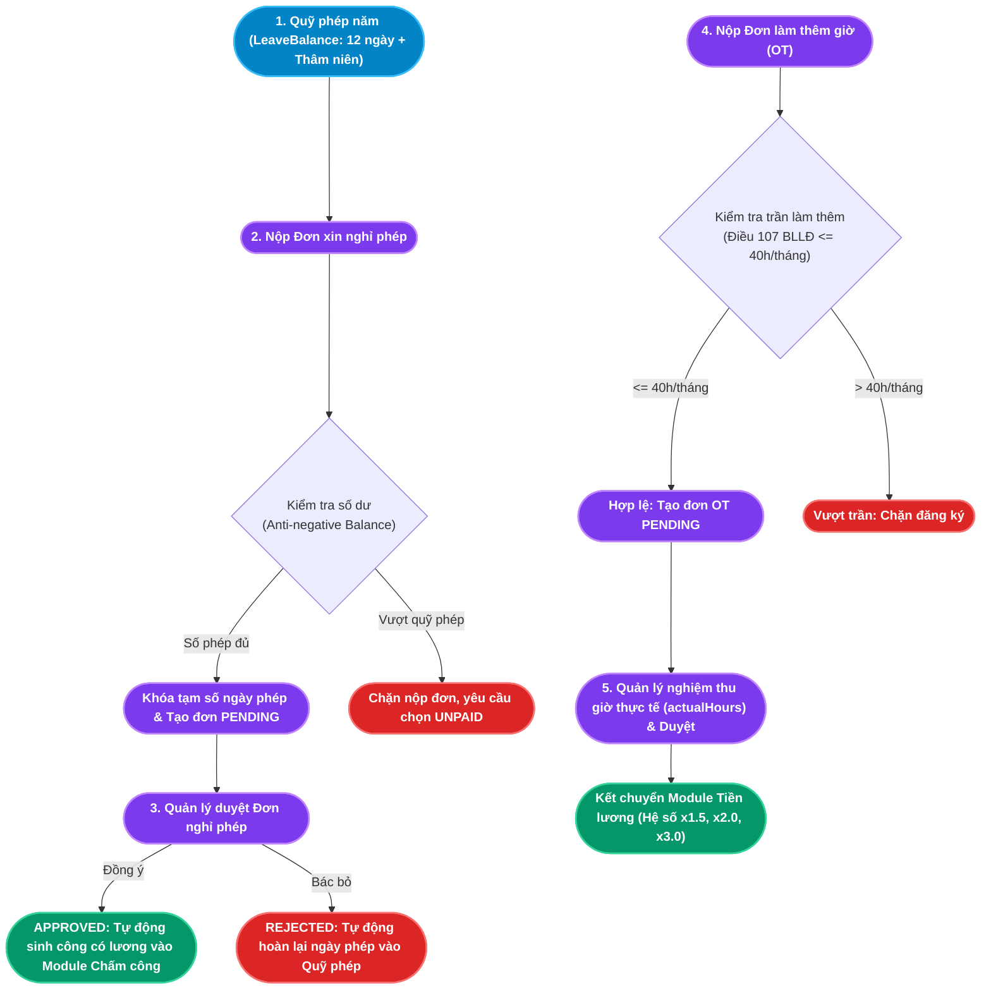

# TÀI LIỆU PHÂN TÍCH NGHIỆP VỤ - MODULE NGHỈ PHÉP & LÀM THÊM GIỜ (LEAVE & OT)

## 1. Giới thiệu tổng quan Module
**Module Nghỉ phép & Làm thêm giờ (Leave & Overtime Management)** là phân hệ quản trị thời gian vắng mặt có phép và thời gian cống hiến ngoài giờ của người lao động. Phân hệ này giải quyết triệt để bài toán kiểm soát quỹ phép năm (Leave Balance), chống thất thoát ngày công, tuân thủ nghiêm ngặt các giới hạn pháp lý của Luật Lao động Việt Nam về thời gian làm thêm, và kết chuyển dữ liệu trực tiếp sang Module Chấm công và Module Tiền lương.

Module đóng vai trò cầu nối dữ liệu:
- **Tương tác với Module Chấm công (Time & Attendance)**: Khi đơn nghỉ phép có lương (`PAID`) được duyệt, hệ thống tự động ghi nhận ngày công (`workingDay = 1.0`) vào bảng chấm công mà nhân viên không cần quét thẻ.
- **Tương tác với Module Tiền lương (Payroll)**: Cung cấp tổng số ngày nghỉ không lương (`UNPAID`) để khấu trừ lương, đồng thời cung cấp số giờ làm thêm thực tế (`actualHours`) kèm hệ số nhân (x1.5, x2.0, x3.0) để chi trả lương OT.

### Đối tượng sử dụng (Actors):
1. **Nhân viên (Employee)**: Tra cứu số ngày phép năm còn lại, nộp đơn xin nghỉ phép, nộp đơn đăng ký làm thêm giờ, theo dõi tiến độ duyệt đơn.
2. **Trưởng bộ phận / Quản lý trực tiếp (Line Manager)**: Thẩm định lý do xin nghỉ và kế hoạch làm thêm giờ, điều chỉnh số giờ OT thực tế được nghiệm thu, duyệt hoặc từ chối đơn của cấp dưới.
3. **Chuyên viên C&B / HR Admin**: Cấu hình danh mục loại phép, thiết lập chính sách cộng thêm ngày phép theo thâm niên, giám sát việc tuân thủ trần làm thêm giờ 40h/tháng.
4. **Quản trị hệ thống (Admin)**: Cấu hình quy trình phê duyệt và bảo trì số liệu quỹ phép định kỳ hàng năm.

---

## 2. Kiến trúc Luồng Dữ liệu Nghỉ phép & OT (Leave & OT Architecture)

---

## 3. Ma trận Phân rã Chức năng Chi tiết (Functional Breakdown Matrix)

Hệ thống Nghỉ phép & Làm thêm giờ bao gồm **2 nhóm chức năng lớn** với tổng cộng **10 Use Case con (Sub-Use Cases)** được chuẩn hóa toàn diện:

| Nhóm chức năng (Epic) | Mã Use Case | Tên Chức năng Con (Sub-Use Case) | Actor chính | Endpoint Backend |
|---|---|---|---|---|
| **1. Quản lý Nghỉ phép** *(Leave Management)* | `UC-LVE-01-01` | Tra cứu Quỹ phép & Lịch sử Nghỉ phép cá nhân | Toàn bộ Nhân viên | `GET /api/leave/employee/:id` |
| | `UC-LVE-01-02` | Nộp Đơn xin nghỉ phép (Có validate Anti-negative) | Toàn bộ Nhân viên | `POST /api/leave` |
| | `UC-LVE-01-03` | Phê duyệt Đơn nghỉ phép & Tự động Đồng bộ Chấm công | Quản lý / HR | `PUT /api/leave/:id/status` (APPROVED) |
| | `UC-LVE-01-04` | Từ chối Đơn nghỉ phép & Hoàn trả Quỹ phép (Refund) | Quản lý / HR | `PUT /api/leave/:id/status` (REJECTED) |
| | `UC-LVE-01-05` | Cấu hình Loại phép & Chính sách Phép thâm niên | Chuyên viên C&B | `POST /api/leave-config/types, policies` |
| **2. Quản lý Làm thêm giờ** *(Overtime Management)* | `UC-LVE-02-01` | Đăng ký Làm thêm giờ (Kiểm tra trần 40h/tháng) | Toàn bộ Nhân viên | `POST /api/ot-requests` |
| | `UC-LVE-02-02` | Phê duyệt & Điều chỉnh Giờ OT Thực tế | Quản lý / HR | `PUT /api/ot-requests/:id/approve` |
| | `UC-LVE-02-03` | Từ chối Đơn làm thêm giờ | Quản lý / HR | `PUT /api/ot-requests/:id/reject` |
| | `UC-LVE-02-04` | Tra cứu, Giám sát & Cảnh báo Trần Giờ OT | Quản lý / C&B | `GET /api/ot-requests` |
| | `UC-LVE-02-05` | Tích hợp Bảng lương & Quy chuẩn Hệ số Làm thêm | Hệ thống Tiền lương | Tính lương tự động x1.5, x2.0, x3.0 |

---

## 4. Danh mục Hồ sơ Phân tích Chi tiết (Detailed Specifications)

Vui lòng tham khảo tài liệu đặc tả chi tiết của từng chức năng con tại các liên kết dưới đây:

1. [Đặc tả Chức năng Quản lý Nghỉ phép và Quỹ phép năm](file:///c:/Users/truclh/Desktop/HRM-ĐATN/docs/Tài%20liệu%20phân%20tích%20nghiệp%20vụ%20từng%20module/Module%20Nghỉ%20phép%20và%20OT/Chuc-nang-Nghi-Phep.md)
   - Đặc tả 5 Use Case con: Tra cứu quỹ phép cá nhân, Nộp đơn nghỉ phép có cơ chế Anti-negative Balance và khóa tạm số dư, Phê duyệt đơn tự động sinh ngày công 1.0 vào bảng chấm công (bỏ qua Thứ 7, CN), Từ chối đơn tự động hoàn trả ngày phép, và Cấu hình loại phép/chính sách thâm niên.
   - Sơ đồ tuần tự và 5 kịch bản kiểm thử mẫu.

2. [Đặc tả Chức năng Quản lý Làm thêm giờ (OT)](file:///c:/Users/truclh/Desktop/HRM-ĐATN/docs/Tài%20liệu%20phân%20tích%20nghiệp%20vụ%20từng%20module/Module%20Nghỉ%20phép%20và%20OT/Chuc-nang-OT.md)
   - Đặc tả 5 Use Case con: Đăng ký OT kèm kiểm soát trần pháp luật 40h/tháng theo Điều 107 BLLĐ, Quản lý nghiệm thu và điều chỉnh số giờ thực tế khi duyệt, Bác bỏ đơn OT không hợp lệ, Giám sát cảnh báo cận trần giờ OT, và Tự động tích hợp bảng lương áp dụng hệ số 150%, 200%, 300%.
   - Sơ đồ tuần tự và 5 kịch bản kiểm thử mẫu.

---

## 5. Điểm nhấn Kỹ thuật & Nghiệp vụ (Key Business Highlights)

1. **Cơ chế Chặn Số phép Âm & Khóa Tạm Số Dư (Anti-negative Balance & Soft Locking)**:
   - Khi nhân viên nộp đơn nghỉ có lương (`PAID`), hệ thống kiểm tra ngay lập tức: nếu số ngày xin vượt quá số ngày còn lại, đơn sẽ bị chặn ngay tại backend.
   - Khi nộp thành công, số ngày xin nghỉ được cộng tạm thời vào `usedDays` ngay ở trạng thái `PENDING`. Điều này ngăn chặn triệt để hành vi nhân viên nộp liên tiếp nhiều đơn cùng lúc để vượt quá quỹ phép trước khi sếp duyệt.

2. **Cơ chế Hoàn trả Ngày phép Tự động (Atomic Balance Refund)**:
   - Nếu cấp trên từ chối đơn (`REJECTED`), hệ thống chạy một Database Transaction hoàn trả ngay lập tức số ngày đã tạm khóa về lại quỹ phép khả dụng của nhân viên mà không cần sự can thiệp thủ công của HR.

3. **Giao cắt Tự động với Module Chấm công (Seamless Attendance Synchronization)**:
   - Khi đơn nghỉ phép được duyệt, hệ thống tự động sinh bản ghi trong bảng `Attendance` với trạng thái `ABSENT` và gán `workingDay = 1.0` (đối với nghỉ có lương). Nhân viên không phải đi làm, không phải quét thẻ nhưng cuối tháng vẫn được tính đủ ngày công hưởng lương.

4. **Kiểm soát Trần Giờ Làm thêm theo Luật Lao động (Legal Overtime Cap Enforcement)**:
   - Tuân thủ nghiêm ngặt Điều 107 Bộ luật Lao động 2019: Hệ thống kiểm tra tổng thời gian OT trong tháng không được vượt quá 40 giờ. Mọi nỗ lực tạo đơn vượt quá giới hạn này đều bị chặn tự động kèm thông báo cảnh báo pháp lý.
