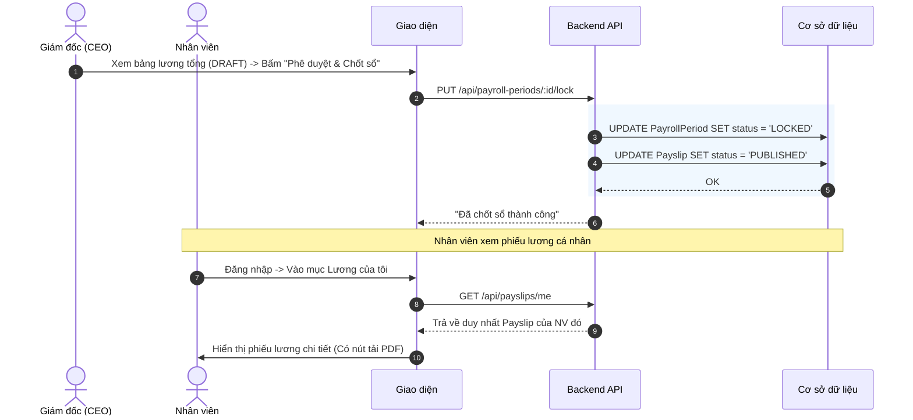

# Đặc tả chức năng: Quản lý Phiếu Lương (Payslip)

## 1. Giới thiệu chức năng
Giai đoạn cuối cùng của kỳ lương. Sau khi chốt sổ, phiếu lương chi tiết sẽ được "bắn" về màn hình tài khoản cá nhân của từng nhân viên.

## 2. Các quy tắc nghiệp vụ cốt lõi
- **Bảo mật tuyệt đối (Data Masking):** Dữ liệu bảng lương là tối mật. Các API liên quan đến Payslip chỉ được phép truy cập bởi: 1) Chính nhân viên sở hữu phiếu đó. 2) C&B hoặc Giám đốc. Mọi nhân sự khác gọi API sẽ bị chặn 403 Forbidden.

## 3. Sơ đồ luồng chi tiết (Sequence Diagrams)

### 3.1. Luồng Chốt Lương (Lock) & Gửi Phiếu

