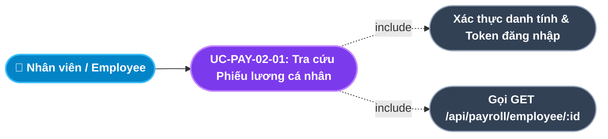
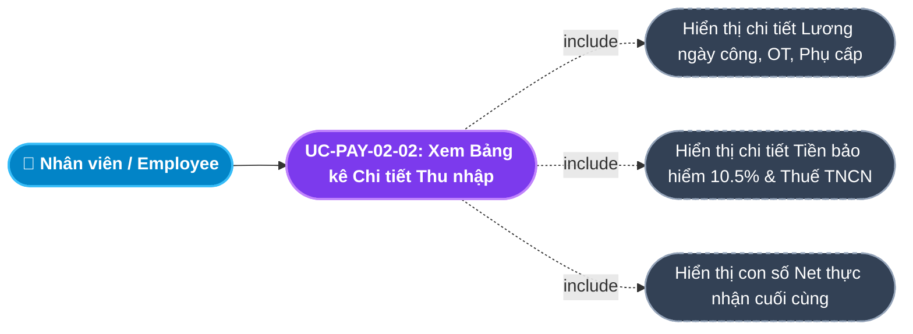
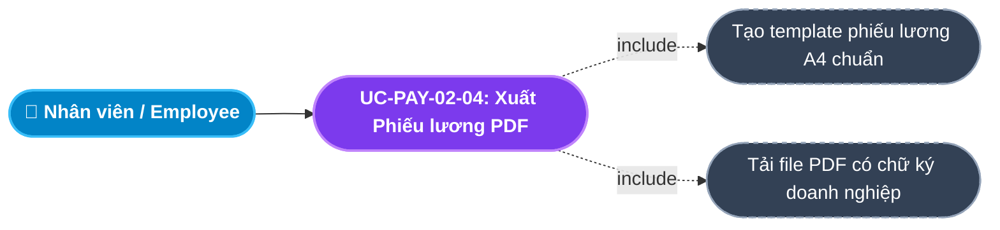
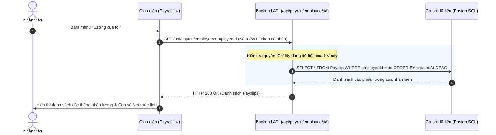
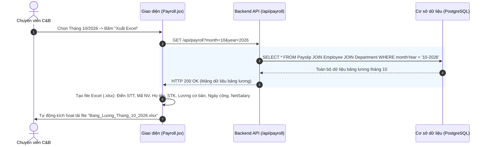

# Usecase: UC-PAY-02 - Quản lý Phiếu lương và Phân phối Thu nhập (Payslip Management & Distribution)

## 1. Giới thiệu chức năng
- **Mục đích**: Là giai đoạn bàn giao kết quả của kỳ tính lương. Cung cấp Cổng thông tin tự phục vụ (Self-Service) để nhân viên tự xem Phiếu lương điện tử (Electronic Payslip) của chính mình một cách bảo mật tuyệt đối. Cung cấp công cụ xuất báo cáo bảng lương tổng hợp ra Excel để kế toán gửi lệnh thanh toán cho ngân hàng, đồng thời hỗ trợ quy trình tiếp nhận khiếu nại và truy lĩnh/truy thu tiền lương minh bạch.
- **Actor (Tác nhân)**: Toàn bộ Nhân viên (Employee), Chuyên viên C&B (C&B Specialist), Kế toán thanh toán, Giám đốc điều hành (Admin).
- **Điều kiện tiên quyết**: Kỳ lương đã được chạy tính toán hoặc đã khóa sổ chính thức (`LOCKED`).

### Danh mục các chức năng con (Sub-features):
1. **UC-PAY-02-01: Tra cứu & Bảo mật Phiếu lương cá nhân (View Personal Payslip)**: Nhân viên tra cứu phiếu lương của các tháng trong năm với cơ chế che chắn dữ liệu (Data Masking) và kiểm soát quyền truy cập nghiêm ngặt.
2. **UC-PAY-02-02: Xem Chi tiết Bảng kê Thu nhập & Khấu trừ (Detailed Payslip Breakdown)**: Xem giải trình chi tiết từng thành phần: Lương cơ bản, Ngày công thực tế, Tiền OT, Các khoản phụ cấp, Khoản trừ BHXH 10.5%, Thuế TNCN và Lương Net thực chuyển vào tài khoản.
3. **UC-PAY-02-03: Xuất Bảng lương tổng hợp ra Excel/CSV (Export Payroll Summary)**: Cho phép C&B và Kế toán xuất dữ liệu bảng lương dạng bảng tính để đối chiếu chứng từ và gửi lệnh thanh toán ngân hàng (Bank Transfer Batch).
4. **UC-PAY-02-04: Xuất Phiếu lương định dạng PDF (Export Payslip PDF)**: Hỗ trợ nhân viên tải phiếu lương dạng file PDF có chữ ký điện tử hoặc gửi bản mềm qua email cá nhân để phục vụ các thủ tục tài chính cá nhân (vay vốn ngân hàng, chứng minh thu nhập).
5. **UC-PAY-02-05: Tiếp nhận Khiếu nại & Bổ sung Truy lĩnh/Truy thu (Payroll Inquiries & Adjustment)**: Xử lý các phản hồi sai lệch về ngày công/tiền lương của nhân viên và chuyển khoản điều chỉnh vào kỳ lương kế tiếp.

---

## 2. Dữ liệu nghiệp vụ đầu vào (Input Data & Parameters)

### 2.1. Cấu trúc Phiếu Lương Chi tiết (Payslip Breakdown Structure)
| Nhóm mục | Tên khoản mục | Công thức / Căn cứ | Ý nghĩa đối soát |
|---|---|---|---|
| **I. THU NHẬP (Earnings)** | 1. Lương cơ bản theo hợp đồng | `baseSalary` | Mức lương ghi trên hợp đồng lao động đang `ACTIVE`. |
| | 2. Lương ngày công thực tế | `(baseSalary / 22) * actualWorkingDays` | Lương được hưởng theo số ngày công đi làm thực tế. |
| | 3. Tiền làm thêm giờ (OT) | `actualHours * hourlyRate * multiplier` | Tiền tăng ca (nhân hệ số x1.5, x2.0, x3.0). |
| | 4. Phụ cấp cố định (Ăn trưa, Xăng xe) | Khoản mục cố định | Các khoản phụ cấp không tính đóng bảo hiểm. |
| **TỔNG LƯƠNG GỘP** | **Gross Salary** | **Mục 2 + Mục 3 + Mục 4** | **Tổng thu nhập phát sinh trước thuế và bảo hiểm.** |
| **II. KHẤU TRỪ (Deductions)** | 5. Bảo hiểm Xã hội (BHXH 8%) | `baseSalary * 8%` | Trích nộp quỹ hưu trí và tử tuất. |
| | 6. Bảo hiểm Y tế (BHYT 1.5%) | `baseSalary * 1.5%` | Trích nộp quỹ bảo hiểm y tế toàn dân. |
| | 7. Bảo hiểm Thất nghiệp (BHTN 1%) | `baseSalary * 1%` | Trích nộp quỹ bảo hiểm thất nghiệp. |
| | 8. Thuế Thu nhập Cá nhân (PIT) | Biểu lũy tiến 7 bậc | Tiền thuế TNCN tạm khấu trừ tại nguồn. |
| **TỔNG KHẤU TRỪ** | **Total Deductions** | **Mục 5 + 6 + 7 + 8** | **Tổng các khoản trừ theo luật định.** |
| **III. THỰC NHẬN (Net Pay)**| **Net Salary** | **Gross Salary - Total Deductions** | **Số tiền thực chuyển vào tài khoản ngân hàng.** |

---

## 3. Quy tắc nghiệp vụ (Business Rules)

| Mã Quy tắc | Tình huống nghiệp vụ | Cách hệ thống xử lý | Thông báo hiển thị |
|---|---|---|---|
| **BR-PAY-02-01** | **Bảo mật Thu nhập Cá nhân (Strict PII & Salary Confidentiality)**: Người dùng xem phiếu lương của nhân sự khác. | Chặn phân quyền tại Backend API: Nhân viên chỉ được xem duy nhất phiếu lương thuộc `employeeId` của chính mình (`GET /api/payroll/employee/:id`). Cố tình xem chéo $\rightarrow$ Trả lỗi `HTTP 403 Forbidden`. | "Bạn không có quyền xem thông tin thu nhập của nhân sự khác!" |
| **BR-PAY-02-02** | **Công bố Phiếu lương khi Khóa sổ (Published upon Lock)**: Nhân viên tra cứu phiếu lương tháng mới. | Phiếu lương chỉ hiển thị cho nhân viên khi kỳ lương đó đã được Giám đốc bấm "Khóa sổ" (`LOCKED`). Khi kỳ lương đang ở trạng thái `DRAFT` $\rightarrow$ Chỉ có C&B và Lãnh đạo xem được. | "Phiếu lương tháng này đang được đối soát, chưa công bố chính thức." |
| **BR-PAY-02-03** | **Minh bạch Công thức Tính (Formula Transparency)**: Nhân viên mở chi tiết phiếu lương. | Hiển thị tường minh các tham số: Số ngày công chuẩn (22), Số ngày đi làm thực tế, Số ngày nghỉ không lương, Số giờ OT kèm hệ số, để nhân viên tự đối soát. | "Bảng kê chi tiết đã được hiển thị đầy đủ các thành phần thu nhập." |
| **BR-PAY-02-04** | **Quy tắc Tiếp nhận Khiếu nại**: Nhân viên phát hiện sai sót ngày công hoặc thiếu tiền OT. | Được quyền gửi phản hồi khiếu nại trong vòng **05 ngày làm việc** kể từ ngày công bố phiếu lương. Quá hạn $\rightarrow$ Chốt sổ kế toán. | "Thời hạn gửi khiếu nại bảng lương là 5 ngày làm việc kể từ ngày công bố!" |
| **BR-PAY-02-05** | **Truy lĩnh / Truy thu sang Kỳ tiếp theo**: Khiếu nại sai sót được phê duyệt xác nhận đúng. | Không sửa đổi phiếu lương của tháng đã khóa sổ. Số tiền chênh lệch sẽ được tự động cộng thêm (Truy lĩnh) hoặc trừ đi (Truy thu) vào phiếu lương của tháng kế tiếp. | "Khoản tiền điều chỉnh sẽ được kết chuyển sang kỳ lương tháng tiếp theo." |

---

## 4. Đặc tả chi tiết các Use Case chức năng con (Sub-Use Cases Specification)

---

### 4.1. UC-PAY-02-01: Tra cứu & Bảo mật Phiếu lương cá nhân (View Personal Payslip)

#### Sơ đồ Use Case:

#### Bảng đặc tả nghiệp vụ:

| STT | Hạng mục | Nội dung chi tiết |
|:---:|---|---|
| **1** | **Thông tin chung** | - **UC ID**: `UC-PAY-02-01` - **UC Name**: Tra cứu & Bảo mật Phiếu lương cá nhân (View Personal Payslip) - **Actor**: Toàn bộ nhân viên công ty - **Mục tiêu**: Giúp nhân viên chủ động theo dõi thu nhập hàng tháng của mình mọi lúc, mọi nơi trên Cổng thông tin tự phục vụ. - **Mô tả**: Nhân viên đăng nhập vào hệ thống, truy cập mục "Phiếu lương của tôi". Hệ thống chỉ trả về đúng danh sách các phiếu lương của cá nhân đó, tuyệt đối không lộ thông tin lương của đồng nghiệp. - **Priority**: High (Bắt buộc) |
| **2** | **Trigger** | Nhân viên nhấp vào menu **"Lương của tôi"** trên thanh điều hướng. |
| **3** | **Pre-condition** | 1. Nhân viên đã đăng nhập tài khoản hợp lệ. 2. Đã có ít nhất 01 kỳ lương được tạo cho nhân viên. |
| **4** | **Post-condition** | Danh sách phiếu lương theo các tháng hiển thị với mức lương Net thực nhận và trạng thái công bố. |
| **5** | **Main Flow** | 1. Nhân viên truy cập trang Lương cá nhân. 2. Hệ thống lấy `employeeId` từ phiên đăng nhập (JWT Token). 3. Gọi API `GET /api/payroll/employee/:employeeId`. 4. Backend truy vấn CSDL, chỉ lấy các bản ghi `Payslip` thuộc về `employeeId` này. 5. Giao diện hiển thị danh sách các tháng: Tháng/Năm, Lương cơ bản, Số ngày công, Lương thực nhận (Net) và Nút xem chi tiết. |
| **6** | **Alternative / Exception Flow** | - **EF-01 (Cố tình truy cập ID người khác)**: Nhân viên thay đổi URL bằng ID của đồng nghiệp $\rightarrow$ Backend kiểm tra quyền và trả về `HTTP 403 Forbidden`: *"Bạn không có quyền xem thông tin thu nhập của nhân sự khác!"* (BR-PAY-02-01). |
| **7** | **Business Rules & Validation** | - Bảo mật tuyệt đối dữ liệu thu nhập PII (BR-PAY-02-01). - Kỳ lương chưa công bố sẽ hiển thị thông báo chờ duyệt (BR-PAY-02-02). |
| **8** | **Acceptance Criteria** | - **AC-01**: Nhân viên chỉ xem được duy nhất phiếu lương của mình. - **AC-02**: Hiển thị rõ số tiền thực nhận (Net) và tháng áp dụng. |

---

### 4.2. UC-PAY-02-02: Xem Chi tiết Bảng kê Thu nhập & Khấu trừ (Detailed Payslip Breakdown)

#### Sơ đồ Use Case:

#### Bảng đặc tả nghiệp vụ:

| STT | Hạng mục | Nội dung chi tiết |
|:---:|---|---|
| **1** | **Thông tin chung** | - **UC ID**: `UC-PAY-02-02` - **UC Name**: Xem Chi tiết Bảng kê Thu nhập & Khấu trừ (Detailed Payslip Breakdown) - **Actor**: Toàn bộ nhân viên, Chuyên viên C&B - **Mục tiêu**: Cung cấp bức tranh tài chính minh bạch 100% giúp nhân viên hiểu rõ vì sao mình nhận được con số tiền lương đó. - **Mô tả**: Mở Modal hiển thị toàn bộ phiếu lương chi tiết gồm 3 phần: Các khoản thu nhập (Gross), Các khoản khấu trừ (Bảo hiểm, Thuế) và Lương thực nhận (Net). - **Priority**: High |
| **2** | **Trigger** | Người dùng bấm nút **"Xem chi tiết"** tại dòng phiếu lương của tháng cần xem. |
| **3** | **Pre-condition** | Bản ghi phiếu lương tồn tại trong CSDL. |
| **4** | **Post-condition** | Toàn bộ các dòng mục tài chính hiển thị chi tiết và dễ đọc. |
| **5** | **Main Flow** | 1. Người dùng bấm **"Xem chi tiết"**. 2. Hệ thống mở Modal *Bảng kê Chi tiết Thu nhập & Khấu trừ*. 3. Hiển thị thông tin chung: Họ tên, Mã NV, Chức vụ, Phòng ban, Số tài khoản nhận lương. 4. Hiển thị bảng chi tiết: Lương cơ bản, Số ngày công thực tế/chuẩn, Lương ngày công, Tiền làm thêm giờ, Phụ cấp ăn trưa. 5. Hiển thị các khoản khấu trừ: BHXH (8%), BHYT (1.5%), BHTN (1%), Thuế TNCN. 6. Hiển thị nổi bật con số **Lương thực lĩnh (Net Salary)** bằng chữ số to màu xanh kèm số tiền bằng chữ (VD: *"Mười chín triệu hai trăm ngàn đồng"*). |
| **6** | **Alternative / Exception Flow** | - **AF-01 (Đóng modal)**: Bấm icon X hoặc nút "Đóng" để quay lại danh sách. |
| **7** | **Business Rules & Validation** | - Minh bạch công thức và căn cứ tính toán (BR-PAY-02-03). - Định dạng tiền tệ theo chuẩn Việt Nam Đồng (VD: `15.000.000 đ`). |
| **8** | **Acceptance Criteria** | - **AC-01**: Bảng kê chi tiết đầy đủ không thiếu khoản mục nào. - **AC-02**: Tổng thu nhập trừ tổng khấu trừ khớp chính xác 100% với con số thực lĩnh. |

---

### 4.3. UC-PAY-02-03: Xuất Bảng lương tổng hợp ra Excel/CSV (Export Payroll Summary)

#### Sơ đồ Use Case:

#### Bảng đặc tả nghiệp vụ:

| STT | Hạng mục | Nội dung chi tiết |
|:---:|---|---|
| **1** | **Thông tin chung** | - **UC ID**: `UC-PAY-02-03` - **UC Name**: Xuất Bảng lương tổng hợp ra Excel/CSV (Export Payroll Summary) - **Actor**: Chuyên viên C&B, Kế toán thanh toán, Trưởng phòng HR - **Mục tiêu**: Cung cấp file bảng tính dữ liệu chuẩn để đối chiếu kế toán và tải lên hệ thống Internet Banking của ngân hàng để chuyển khoản hàng loạt. - **Mô tả**: Bấm nút "Xuất Excel". Hệ thống xuất toàn bộ dữ liệu bảng lương tháng của tất cả nhân sự ra file `.xlsx` hoặc `.csv` gồm: STT, Mã NV, Họ tên, Phòng ban, Chức danh, Số TK, Tên NH, Lương cơ bản, Ngày công, Lương thực nhận. - **Priority**: High |
| **2** | **Trigger** | Người dùng bấm nút **"Xuất Excel"** trên thanh công cụ trang Bảng lương (`Payroll.jsx`). |
| **3** | **Pre-condition** | Người dùng có vai trò `C&B`, `ACCOUNTANT` hoặc `ADMIN`. |
| **4** | **Post-condition** | File bảng tính được tải xuống máy tính cá nhân của người dùng. |
| **5** | **Main Flow** | 1. Người dùng chọn kỳ lương cần xuất (VD: Tháng 10/2026). 2. Bấm nút **"Xuất Excel"**. 3. Hệ thống tạo cấu trúc file Excel với đầy đủ tiêu đề công ty, kỳ lương và các cột dữ liệu theo mẫu kế toán chuẩn. 4. Duyệt qua toàn bộ nhân viên trong kỳ lương, điền thông tin và công thức tính toán. 5. Trình duyệt tự động kích hoạt tải file về với tên file chuẩn: `Bang_Luong_Thang_10_2026.xlsx`. 6. Giao diện báo Toast: *"Xuất bảng lương thành công!"*. |
| **6** | **Alternative / Exception Flow** | - **EF-01 (Kỳ lương chưa có dữ liệu)**: Chưa bấm tính lương $\rightarrow$ Báo lỗi *"Kỳ lương chưa có dữ liệu để xuất!"*. |
| **7** | **Business Rules & Validation** | - Cột Số tài khoản ngân hàng được định dạng dạng chuỗi (Text) để không bị mất số 0 ở đầu. |
| **8** | **Acceptance Criteria** | - **AC-01**: Bấm xuất tải về file Excel hoàn chỉnh không bị lỗi font tiếng Việt. - **AC-02**: File có đầy đủ số tài khoản và tên ngân hàng để chuyển lệnh thanh toán. |

---

### 4.4. UC-PAY-02-04: Xuất Phiếu lương định dạng PDF (Export Payslip PDF)

#### Sơ đồ Use Case:

#### Bảng đặc tả nghiệp vụ:

| STT | Hạng mục | Nội dung chi tiết |
|:---:|---|---|
| **1** | **Thông tin chung** | - **UC ID**: `UC-PAY-02-04` - **UC Name**: Xuất Phiếu lương định dạng PDF (Export Payslip PDF) - **Actor**: Toàn bộ nhân viên công ty - **Mục tiêu**: Cung cấp bản cứng điện tử có giá trị chứng minh thu nhập cho nhân viên để làm thẻ tín dụng, vay ngân hàng hoặc lưu trữ hồ sơ cá nhân. - **Mô tả**: Bấm nút "Tải PDF". Hệ thống kết xuất phiếu lương thành file PDF khổ A4 với logo công ty, dấu xác nhận và bảng kê thu nhập đẹp mắt. - **Priority**: Medium |
| **2** | **Trigger** | Người dùng bấm nút **"Tải PDF"** trên giao diện chi tiết phiếu lương cá nhân. |
| **3** | **Pre-condition** | Phiếu lương thuộc kỳ lương đã được khóa sổ (`LOCKED`). |
| **4** | **Post-condition** | File `Phieu_Luong_[MaNV]_[Thang_Nam].pdf` được tải về máy. |
| **5** | **Main Flow** | 1. Nhân viên mở chi tiết phiếu lương tháng cần tải. 2. Bấm nút **"Tải file PDF"**. 3. Giao diện render phiếu lương theo template A4 gồm: Header logo công ty, Thông tin định danh nhân sự, Bảng thu nhập, Bảng khấu trừ, Lương Net và Footer dấu điện tử. 4. Tải file về máy tính của nhân viên. 5. Báo Toast: *"Đã xuất phiếu lương PDF thành công!"*. |
| **6** | **Alternative / Exception Flow** | - **AF-01 (In trực tiếp)**: Cho phép bấm icon Máy in để in ra giấy trực tiếp qua trình duyệt. |
| **7** | **Business Rules & Validation** | - Định dạng file chuẩn vector, rõ nét, font chữ tiếng Việt hiển thị hoàn hảo. |
| **8** | **Acceptance Criteria** | - **AC-01**: File PDF mở lên có bố cục trang A4 chuẩn, cân đối, chuyên nghiệp. |

---

### 4.5. UC-PAY-02-05: Tiếp nhận Khiếu nại & Bổ sung Truy lĩnh/Truy thu (Payroll Inquiries & Adjustment)

#### Sơ đồ Use Case:

#### Bảng đặc tả nghiệp vụ:

| STT | Hạng mục | Nội dung chi tiết |
|:---:|---|---|
| **1** | **Thông tin chung** | - **UC ID**: `UC-PAY-02-05` - **UC Name**: Tiếp nhận Khiếu nại & Bổ sung Truy lĩnh/Truy thu (Payroll Inquiries & Adjustment) - **Actor**: Toàn bộ nhân viên, Chuyên viên C&B - **Mục tiêu**: Xử lý thỏa đáng các khiếu nại về tiền lương của người lao động mà không làm xáo trộn chứng từ kế toán của tháng đã đóng sổ. - **Mô tả**: Nhân viên gửi khiếu nại kèm minh chứng trong vòng 5 ngày. Khi C&B đối soát xác nhận có sai sót (VD: quên tính 1 ngày đi công tác), hệ thống ghi nhận khoản Truy lĩnh (cộng thêm) hoặc Truy thu (trừ bớt) vào kỳ lương tháng tiếp theo. - **Priority**: Medium |
| **2** | **Trigger** | Nhân viên nhấn nút **"Khiếu nại phiếu lương"** trên giao diện chi tiết phiếu lương. |
| **3** | **Pre-condition** | Đơn được gửi trong vòng 5 ngày làm việc kể từ ngày công bố (BR-PAY-02-04). |
| **4** | **Post-condition** | Khoản truy lĩnh/truy thu được lưu vết và tự động cộng/trừ vào bảng lương tháng tiếp theo. |
| **5** | **Main Flow** | 1. Nhân viên phát hiện sai sót (VD: thiếu tiền làm thêm giờ Chủ Nhật). 2. Bấm nút **"Khiếu nại phiếu lương"**, nhập nội dung chi tiết kèm mã đơn OT liên quan. 3. Bấm **"Gửi khiếu nại"** $\rightarrow$ Thông báo gửi về cho C&B. 4. C&B đối chiếu dữ liệu, xác nhận nhân viên đúng. 5. C&B nhập khoản điều chỉnh: `Loại = Truy lĩnh (Cộng thêm)`, `Số tiền = 800.000đ`, `Lý do = Bổ sung tiền OT Chủ Nhật ngày 18/10`. 6. Hệ thống lưu bản ghi điều chỉnh liên kết với kỳ lương kế tiếp (BR-PAY-02-05). 7. Nhân viên nhận thông báo kết quả giải quyết khiếu nại. |
| **6** | **Alternative / Exception Flow** | - **EF-01 (Quá hạn 5 ngày)**: Báo lỗi *"Đã quá thời hạn khiếu nại phiếu lương!"* (BR-PAY-02-04). - **AF-01 (Bác bỏ khiếu nại)**: C&B đối soát thấy chấm công không hợp lệ $\rightarrow$ Ghi nhận từ chối kèm phản hồi giải thích. |
| **7** | **Business Rules & Validation** | - Tuyệt đối không can thiệp sửa phiếu lương tháng cũ đã `LOCKED` (BR-PAY-02-05). |
| **8** | **Acceptance Criteria** | - **AC-01**: Khoản tiền truy lĩnh tự động xuất hiện ở dòng "Truy lĩnh kỳ trước" trong bảng lương tháng tiếp theo. |

---

## 5. Sơ đồ tuần tự nghiệp vụ (Sequence Diagrams)

### 5.1. Luồng Tra cứu Phiếu Lương Cá nhân (UC-PAY-02-01)

### 5.2. Luồng Xuất Bảng lương Tổng hợp Excel (UC-PAY-02-03)

---

## 6. Ma trận kịch bản kiểm thử (Test Scenarios & Acceptance Matrix)

| Mã kịch bản | Use Case liên quan | Điều kiện kiểm thử | Các bước thực hiện | Kết quả mong đợi (Expected Outcome) | Đánh giá |
|---|---|---|---|---|:---:|
| **TC-PAY-02-01** | UC-PAY-02-01 | Nhân viên xem lương mình | Đăng nhập tài khoản NV $\rightarrow$ Mở mục Lương của tôi | Hiển thị chính xác các phiếu lương của cá nhân đó, không thấy của người khác. | **Pass** |
| **TC-PAY-02-02** | UC-PAY-02-01 | Chặn xem chéo lương | Cố tình gọi API lấy phiếu lương của NV khác | Backend trả về lỗi 403 Forbidden. | **Pass** |
| **TC-PAY-02-03** | UC-PAY-02-02 | Xem chi tiết bảng kê | Bấm "Xem chi tiết" phiếu lương | Hiển thị đủ các mục: Lương ngày công, OT, Khấu trừ bảo hiểm 10.5%, Thuế, Net. | **Pass** |
| **TC-PAY-02-04** | UC-PAY-02-03 | Xuất Excel bảng lương | Bấm nút "Xuất Excel" tại kỳ lương | Tải về file `.xlsx` hoàn chỉnh, đầy đủ cột họ tên, số tài khoản và lương thực nhận. | **Pass** |
| **TC-PAY-02-05** | UC-PAY-02-05 | Tiếp nhận khiếu nại lương | Nhân viên nộp khiếu nại trong vòng 3 ngày $\rightarrow$ C&B xử lý | Đơn được tiếp nhận thành công, số tiền bổ sung được chuyển sang kỳ lương sau. | **Pass** |
