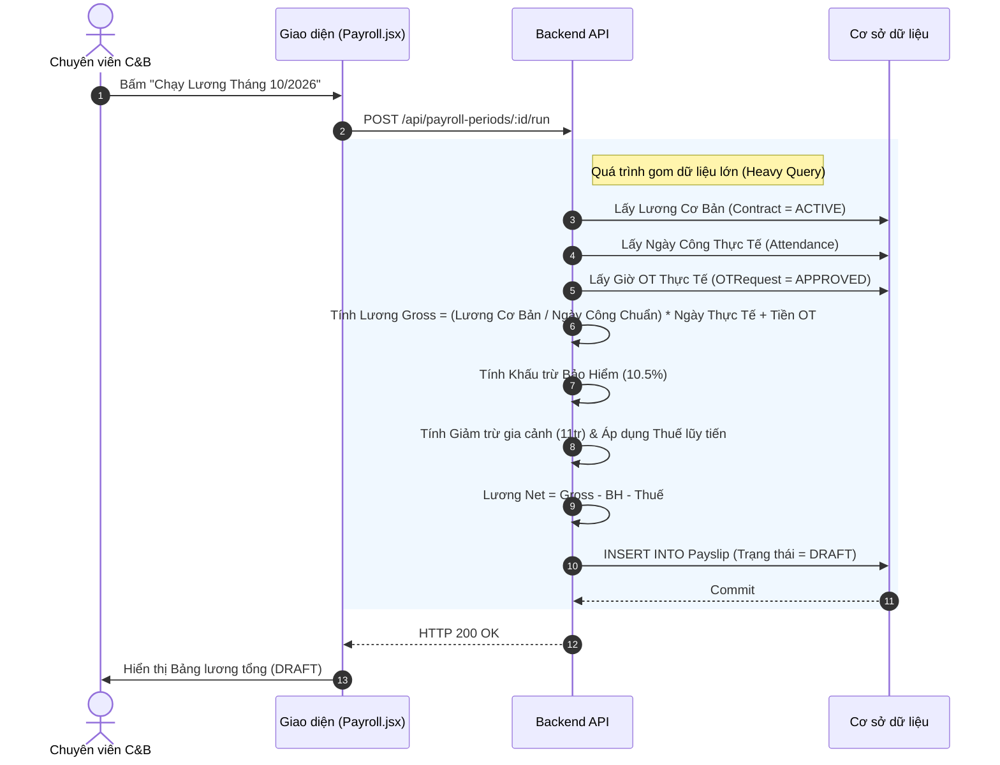

# Đặc tả chức năng: Chạy Lương Gross to Net

## 1. Giới thiệu chức năng
Chức năng dành cho C&B để tổng hợp dữ liệu từ tất cả các Module khác (Lương cơ bản từ Core HR, Ngày công từ Chấm công, Giờ từ OT) và đưa vào công thức tính toán tài chính.

## 2. Các quy tắc nghiệp vụ cốt lõi
- **Chặn Re-run (Không chạy lại):** Khi Giám đốc đã duyệt bảng lương và chuyển sang trạng thái `LOCKED`, C&B tuyệt đối không được phép chạy lại (Re-run) bảng lương tháng đó để tránh thay đổi chứng từ kế toán.
- **Tỷ lệ Khấu trừ Luật định:** Tự động trừ 10.5% lương đóng BHXH của NLĐ.
- **Tính Thuế TNCN:** Dựa trên Biểu thuế lũy tiến từng phần (7 bậc).

## 3. Sơ đồ luồng chi tiết (Sequence Diagrams)

### 3.1. Luồng Tổng hợp & Chạy bảng lương

