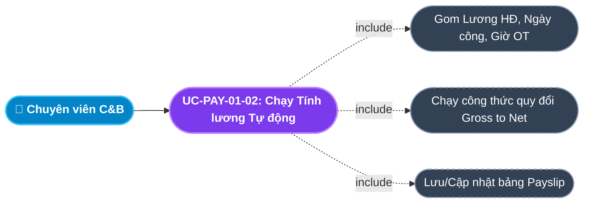
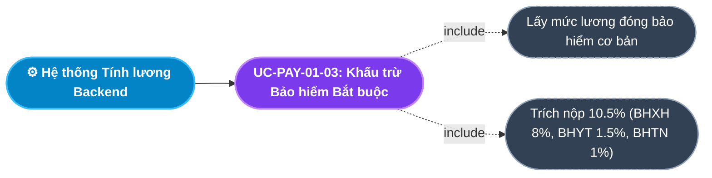
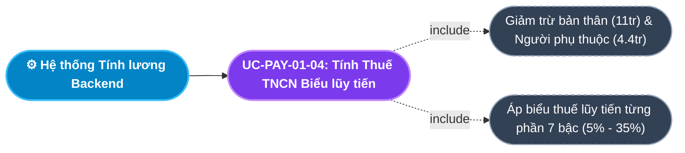
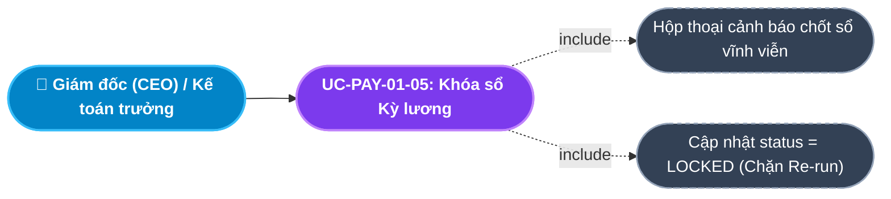
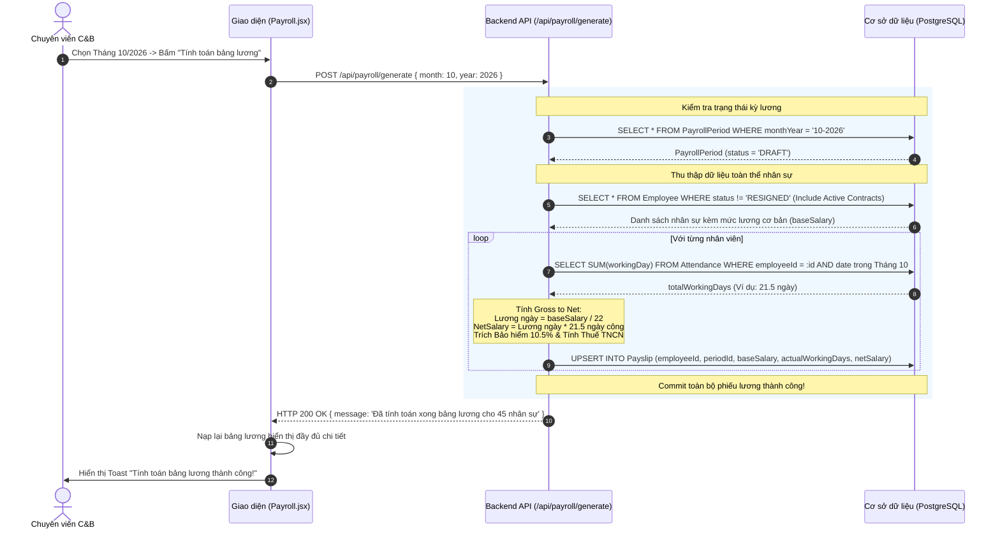
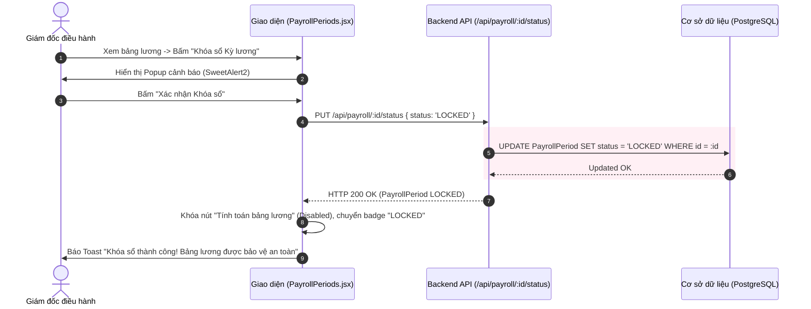

# Usecase: UC-PAY-01 - Thiết lập Kỳ lương và Chạy Bảng lương Gross to Net (Payroll Processing & Gross-to-Net Engine)

## 1. Giới thiệu chức năng
- **Mục đích**: Là trung tâm tính toán tài chính của doanh nghiệp, nơi quy tụ toàn bộ dữ liệu từ các phân hệ khác: Mức lương cơ bản (Module Core HR), Ngày công thực tế (Module Chấm công), Ngày nghỉ không lương (Module Nghỉ phép) và Giờ làm thêm thực tế (Module OT). Hệ thống tự động áp dụng công thức quy đổi Gross to Net, khấu trừ bảo hiểm bắt buộc 10.5%, giảm trừ gia cảnh và tính thuế TNCN theo biểu lũy tiến từng phần 7 bậc.
- **Actor (Tác nhân)**: Chuyên viên C&B (Compensation & Benefits), Kế toán trưởng (Chief Accountant), Trưởng phòng Nhân sự (HR Manager), Giám đốc điều hành (CEO/Admin).
- **Điều kiện tiên quyết**: Đã hoàn tất chốt dữ liệu Chấm công và phê duyệt toàn bộ đơn Nghỉ phép/OT của tháng cần tính lương.

### Danh mục các chức năng con (Sub-features):
1. **UC-PAY-01-01: Thiết lập & Quản lý Kỳ lương (Create & Manage Payroll Period)**: Khởi tạo kỳ tính lương mới theo Tháng/Năm (VD: `10-2026`), xác định số ngày công chuẩn trong tháng (mặc định 22 ngày công) và quản lý trạng thái kỳ lương (`DRAFT` / `LOCKED`).
2. **UC-PAY-01-02: Chạy Tổng hợp Bảng tính lương tự động (Generate Monthly Payroll)**: Thu thập dữ liệu liên module qua một chu trình tính toán tự động, sinh các bản ghi Phiếu lương (`Payslip`) cho toàn thể nhân viên đang hoạt động.
3. **UC-PAY-01-03: Tính toán Khấu trừ Bảo hiểm Xã hội bắt buộc (Mandatory Insurance Deductions)**: Tự động trích nộp 10.5% từ lương đóng bảo hiểm của người lao động (BHXH 8%, BHYT 1.5%, BHTN 1%).
4. **UC-PAY-01-04: Tính toán Thuế Thu nhập Cá nhân Lũy tiến (Personal Income Tax - PIT Engine)**: Áp dụng mức giảm trừ bản thân (11 triệu VNĐ), giảm trừ người phụ thuộc (4.4 triệu/người) và tính thuế TNCN theo Biểu thuế lũy tiến 7 bậc của Bộ Tài chính.
5. **UC-PAY-01-05: Phê duyệt & Khóa sổ Kỳ lương (Lock & Finalize Payroll Period)**: Giám đốc duyệt chốt sổ, chuyển trạng thái kỳ lương sang `LOCKED`. Hệ thống kích hoạt cơ chế khóa vĩnh viễn (Chặn Re-run) để bảo toàn chứng từ kế toán.

---

## 2. Dữ liệu nghiệp vụ đầu vào (Input Data & Parameters)

### 2.1. Biểu mẫu Kỳ lương (Payroll Period Data)
| Tên trường | Kiểu dữ liệu | Tính chất | Ý nghĩa nghiệp vụ & Ràng buộc |
|---|---|---|---|
| `Định danh kỳ lương` (monthYear) | Chuỗi (String) | Bắt buộc | Khóa duy nhất theo định dạng `MM-YYYY` (VD: `10-2026`). |
| `Số ngày công chuẩn` (standardWorkingDays) | Số nguyên (Integer) | Bắt buộc | Số ngày làm việc tiêu chuẩn trong tháng (Mặc định: 22 ngày công). |
| `Trạng thái kỳ lương` (status) | Enum | Mặc định | `DRAFT` (Bản nháp - cho phép tính lại) hoặc `LOCKED` (Đã khóa sổ - cấm sửa đổi). |

### 2.2. Biểu mẫu Dữ liệu Bảng lương Tổng hợp (Payslip Data)
| Tên trường | Kiểu dữ liệu | Nguồn dữ liệu | Công thức tính toán |
|---|---|---|---|
| `Lương cơ bản` (baseSalary) | Số (Decimal) | Hợp đồng đang `ACTIVE` | Mức lương ghi nhận trên hợp đồng lao động chính thức. |
| `Ngày công thực tế` (actualWorkingDays) | Số thập phân | Module Chấm công (`Attendance`) | Tổng cộng số ngày công hợp lệ trong khoảng ngày từ 01 đến cuối tháng. |
| `Tiền làm thêm giờ` (otPay) | Số (Decimal) | Module OT (`OTRequest`) | $\sum (\text{actualHours} \times \text{hourlyRate} \times \text{multiplier})$. |
| `Lương gộp thực tế` (grossSalary) | Số (Decimal) | Công thức | $(\text{baseSalary} / \text{standardWorkingDays}) \times \text{actualWorkingDays} + \text{otPay} + \text{Phụ cấp}$. |
| `Khấu trừ Bảo hiểm` (insuranceDeduction) | Số (Decimal) | Công thức luật định | $\text{baseSalary} \times 10.5\%$. |
| `Thuế TNCN` (taxDeduction) | Số (Decimal) | Biểu lũy tiến 7 bậc | Tính trên thu nhập tính thuế sau khi giảm trừ gia cảnh. |
| `Lương thực nhận` (netSalary) | Số (Decimal) | Công thức chốt | $\text{grossSalary} - \text{insuranceDeduction} - \text{taxDeduction}$. |

---

## 3. Quy tắc nghiệp vụ (Business Rules)

| Mã Quy tắc | Tình huống nghiệp vụ | Cách hệ thống xử lý | Thông báo hiển thị |
|---|---|---|---|
| **BR-PAY-01-01** | **Chặn Re-run sau khi Khóa sổ (Strict Lockout Rule)**: Chuyên viên C&B bấm "Chạy lại bảng lương" khi kỳ lương đang ở trạng thái `LOCKED`. | Hệ thống từ chối thực thi và chặn gọi API tính toán nhằm đảm bảo tính toàn vẹn chứng từ tài chính kế toán. | "Kỳ lương đã được Giám đốc phê duyệt và KHÓA SỔ. Tuyệt đối không thể tính toán lại!" |
| **BR-PAY-01-02** | **Loại trừ Nhân sự Thôi việc**: Quét danh sách nhân viên để tính lương. | Chỉ lấy các nhân viên có `status != 'RESIGNED'` và đang sở hữu ít nhất 01 Hợp đồng lao động có trạng thái `ACTIVE`. | "Tự động loại bỏ các nhân sự đã thôi việc khỏi danh sách tính lương." |
| **BR-PAY-01-03** | **Tỷ lệ Khấu trừ Bảo hiểm Luật định**: Tính trừ tiền bảo hiểm của người lao động. | Áp dụng đúng tỷ lệ 10.5% trên tiền lương đóng bảo hiểm (BHXH: 8%, BHYT: 1.5%, BHTN: 1%) theo Luật Bảo hiểm Xã hội hiện hành. | "Đã trích đóng 10.5% chi phí bảo hiểm bắt buộc theo luật định." |
| **BR-PAY-01-04** | **Biểu thuế Lũy tiến từng phần 7 bậc (PIT Regulation)**: Thu nhập tính thuế sau giảm trừ $> 0$. | Tự động phân tách thu nhập theo 7 bậc thuế: 5% ($\le 5tr$), 10% ($5 - 10tr$), 15% ($10 - 18tr$), 20% ($18 - 32tr$), 25% ($32 - 52tr$), 30% ($52 - 80tr$), 35% ($> 80tr$). | "Thuế TNCN được tính chuẩn xác theo Biểu lũy tiến 7 bậc của Bộ Tài chính." |
| **BR-PAY-01-05** | **Tính Lương theo Ngày công Chuẩn**: Nhân viên đi làm thiếu ngày công trong tháng. | Lương thực tế theo ngày công được tính theo đơn giá: `Lương ngày = baseSalary / standardWorkingDays`. Nhân viên nghỉ không lương ngày nào sẽ bị trừ tương ứng ngày đó. | "Lương cơ bản được quy đổi chính xác theo số ngày công thực tế." |

---

## 4. Đặc tả chi tiết các Use Case chức năng con (Sub-Use Cases Specification)

---

### 4.1. UC-PAY-01-01: Thiết lập & Quản lý Kỳ lương (Create & Manage Payroll Period)

#### Sơ đồ Use Case:

#### Bảng đặc tả nghiệp vụ:

| STT | Hạng mục | Nội dung chi tiết |
|:---:|---|---|
| **1** | **Thông tin chung** | - **UC ID**: `UC-PAY-01-01` - **UC Name**: Thiết lập & Quản lý Kỳ lương (Create & Manage Payroll Period) - **Actor**: Chuyên viên C&B, HR Admin - **Mục tiêu**: Mở kỳ quyết toán tiền lương cho tháng mới và thiết lập số ngày công chuẩn làm căn cứ quy đổi lương. - **Mô tả**: Người dùng chọn Tháng và Năm (VD: Tháng 10 năm 2026), nhập số ngày công chuẩn (thường là 22 ngày trừ T7/CN). Hệ thống tạo bản ghi kỳ lương ở trạng thái `DRAFT`. - **Priority**: High (Bắt buộc) |
| **2** | **Trigger** | Người dùng bấm nút **"+ Tạo kỳ lương mới"** trên trang Quản lý Kỳ lương (`/internal/payroll/periods`). |
| **3** | **Pre-condition** | Người dùng có quyền C&B/HR. |
| **4** | **Post-condition** | 1. Bản ghi `PayrollPeriod` mới được lưu với `status = 'DRAFT'`. 2. Kỳ lương sẵn sàng tiếp nhận lệnh tính toán tổng hợp. |
| **5** | **Main Flow** | 1. Người dùng bấm nút **"+ Tạo kỳ lương mới"**. 2. Hệ thống mở Modal Form, hiển thị ô chọn Tháng, Năm và Ngày công chuẩn (Mặc định: 22). 3. Người dùng chọn Tháng `10`, Năm `2026` và bấm **"Khởi tạo kỳ lương"**. 4. Giao diện kiểm tra định dạng `monthYear` (`10-2026`). 5. Hệ thống gửi request tạo mới. 6. Backend kiểm tra tính duy nhất: Nếu chưa có kỳ lương tháng đó $\rightarrow$ Tạo bản ghi với `status = 'DRAFT'`. 7. Trả về `HTTP 201 Created`. Giao diện báo Toast: *"Khởi tạo kỳ lương thành công!"*. |
| **6** | **Alternative / Exception Flow** | - **EF-01 (Kỳ lương đã tồn tại)**: Tháng này đã được tạo trước đó $\rightarrow$ Báo lỗi *"Kỳ lương tháng [X] năm [Y] đã tồn tại trong hệ thống!"*. |
| **7** | **Business Rules & Validation** | - `monthYear` là duy nhất trên toàn hệ thống. - `standardWorkingDays` phải là số nguyên dương $> 0$ (thường từ 20 đến 26 ngày). |
| **8** | **Acceptance Criteria** | - **AC-01**: Khởi tạo kỳ lương thành công trạng thái hiển thị là DRAFT. - **AC-02**: Không thể tạo 2 kỳ lương trùng cùng 1 tháng. |

---

### 4.2. UC-PAY-01-02: Chạy Tổng hợp Bảng tính lương tự động (Generate Monthly Payroll)

#### Sơ đồ Use Case:

#### Bảng đặc tả nghiệp vụ:

| STT | Hạng mục | Nội dung chi tiết |
|:---:|---|---|
| **1** | **Thông tin chung** | - **UC ID**: `UC-PAY-01-02` - **UC Name**: Chạy Tổng hợp Bảng tính lương tự động (Generate Monthly Payroll) - **Actor**: Chuyên viên C&B - **Mục tiêu**: Tự động hóa hoàn toàn việc tổng hợp hàng nghìn dòng dữ liệu chấm công và hợp đồng thành bảng lương chi tiết trong vài giây. - **Mô tả**: Bấm nút "Tính toán bảng lương". Hệ thống quét qua từng nhân viên đang hoạt động, lấy mức lương từ hợp đồng, đếm số ngày công từ bảng Chấm công, tính lương Gross và Net, tạo hoặc cập nhật các bản ghi Phiếu lương (`Payslip`). - **Priority**: High (Cốt lõi) |
| **2** | **Trigger** | Người dùng bấm nút **"Tính toán bảng lương"** trên màn hình Bảng lương (`Payroll.jsx`). |
| **3** | **Pre-condition** | 1. Kỳ lương đang ở trạng thái `DRAFT` (chưa bị khóa sổ). 2. Dữ liệu chấm công của tháng đã được chốt. |
| **4** | **Post-condition** | 1. Toàn bộ nhân viên đủ điều kiện đều có bản ghi `Payslip` trong kỳ lương. 2. Bảng lương tổng hợp hiển thị đầy đủ các cột thu nhập và khấu trừ. |
| **5** | **Main Flow** | 1. Người dùng chọn Tháng, Năm và bấm nút **"Tính toán bảng lương"**. 2. Hệ thống gửi request `POST /api/payroll/generate` kèm `{ month, year }`. 3. Backend kiểm tra trạng thái kỳ lương: Nếu `LOCKED` $\rightarrow$ Chặn lại (BR-PAY-01-01). 4. Backend truy vấn tất cả `Employee` có `status != 'RESIGNED'` kèm hợp đồng `ACTIVE`. 5. Với từng nhân viên:    a. Đọc `baseSalary` từ hợp đồng.    b. Tính `totalWorkingDays` từ bảng `Attendance` trong tháng.    c. Tính `netSalary = (baseSalary / 22) * totalWorkingDays`.    d. Tạo mới hoặc cập nhật bản ghi `Payslip`. 6. Backend trả về `HTTP 200 OK` kèm số lượng nhân viên đã được tính lương. 7. Giao diện báo Toast: *"Đã tính toán xong bảng lương cho [X] nhân sự!"*, đồng thời nạp lại bảng dữ liệu. |
| **6** | **Alternative / Exception Flow** | - **EF-01 (Kỳ lương đã bị khóa)**: Bấm tính lương khi đang `LOCKED` $\rightarrow$ Báo lỗi *"Kỳ lương đã bị khóa sổ, không thể tính lại!"*. - **EF-02 (Nhân viên chưa ký hợp đồng)**: Nhân viên không có hợp đồng `ACTIVE` $\rightarrow$ Tự động bỏ qua không tính lương và ghi log cảnh báo. |
| **7** | **Business Rules & Validation** | - Tự động loại bỏ nhân sự thôi việc (BR-PAY-01-02). - Cho phép chạy lại nhiều lần (Re-run) miễn là kỳ lương còn ở trạng thái `DRAFT`. |
| **8** | **Acceptance Criteria** | - **AC-01**: Bấm tính lương xong bảng dữ liệu nạp đầy đủ thông tin từng nhân viên. - **AC-02**: Nhân viên nghỉ không lương ngày nào bị trừ lương ngày đó chính xác. |

---

### 4.3. UC-PAY-01-03: Tính toán Khấu trừ Bảo hiểm Xã hội bắt buộc (Insurance Deductions)

#### Sơ đồ Use Case:

#### Bảng đặc tả nghiệp vụ:

| STT | Hạng mục | Nội dung chi tiết |
|:---:|---|---|
| **1** | **Thông tin chung** | - **UC ID**: `UC-PAY-01-03` - **UC Name**: Tính toán Khấu trừ Bảo hiểm Xã hội bắt buộc (Mandatory Insurance Deductions) - **Actor**: Hệ thống tính lương tự động, Chuyên viên C&B - **Mục tiêu**: Tự động tính toán số tiền trích nộp các quỹ bảo hiểm của người lao động theo đúng Luật Bảo hiểm Xã hội hiện hành. - **Mô tả**: Tự động lấy mức lương đóng bảo hiểm từ hợp đồng, áp dụng tỷ lệ 10.5% của người lao động (BHXH: 8%, BHYT: 1.5%, BHTN: 1%) và lưu vào trường `insuranceDeduction` trên phiếu lương. - **Priority**: High |
| **2** | **Trigger** | Tự động kích hoạt trong tiến trình chạy bảng lương (`POST /api/payroll/generate`). |
| **3** | **Pre-condition** | Nhân viên có hợp đồng lao động thuộc đối tượng tham gia bảo hiểm bắt buộc (Thử việc xong ký HĐ 1 năm trở lên). |
| **4** | **Post-condition** | Cột "Khấu trừ Bảo hiểm" trên phiếu lương được điền số tiền chính xác, làm giảm trừ thu nhập chịu thuế. |
| **5** | **Main Flow** | 1. Đọc mức lương đóng bảo hiểm từ `Contract.baseSalary`. 2. Kiểm tra mức trần đóng BHXH (tối đa 20 lần mức lương cơ sở theo luật định). 3. Tính tiền trích nộp: `insuranceDeduction = baseSalary * 10.5%`. 4. Lưu số tiền khấu trừ vào bản ghi `Payslip.insuranceDeduction`. |
| **6** | **Alternative / Exception Flow** | - **AF-01 (Hợp đồng Thử việc / Thực tập)**: Nhân viên đang thử việc hoặc thực tập sinh $\rightarrow$ Không khấu trừ bảo hiểm (`insuranceDeduction = 0`). |
| **7** | **Business Rules & Validation** | - Áp dụng đúng tỷ lệ 10.5% theo quy định pháp luật (BR-PAY-01-03). |
| **8** | **Acceptance Criteria** | - **AC-01**: Nhân viên có lương 20.000.000đ được khấu trừ đúng 2.100.000đ tiền bảo hiểm (10.5%). |

---

### 4.4. UC-PAY-01-04: Tính toán Thuế Thu nhập Cá nhân Lũy tiến (PIT Engine)

#### Sơ đồ Use Case:

#### Bảng đặc tả nghiệp vụ:

| STT | Hạng mục | Nội dung chi tiết |
|:---:|---|---|
| **1** | **Thông tin chung** | - **UC ID**: `UC-PAY-01-04` - **UC Name**: Tính toán Thuế Thu nhập Cá nhân Lũy tiến (Personal Income Tax - PIT Engine) - **Actor**: Hệ thống tính lương tự động, Chuyên viên C&B - **Mục tiêu**: Tự động tính chính xác số tiền thuế thu nhập cá nhân cần khấu trừ tại nguồn theo Luật Thuế TNCN hiện hành. - **Mô tả**: Tính thu nhập tính thuế bằng cách lấy Thu nhập chịu thuế trừ đi Tiền bảo hiểm (10.5%), trừ Giảm trừ bản thân (11.000.000đ) và Giảm trừ người phụ thuộc (4.400.000đ x số người phụ thuộc hợp lệ). Sau đó áp dụng biểu lũy tiến 7 bậc. - **Priority**: High |
| **2** | **Trigger** | Tự động kích hoạt trong tiến trình chạy bảng lương (`POST /api/payroll/generate`). |
| **3** | **Pre-condition** | Đã hoàn tất tính lương Gross và tiền khấu trừ bảo hiểm. |
| **4** | **Post-condition** | Số tiền thuế TNCN được ghi nhận vào trường `taxDeduction` trên phiếu lương. |
| **5** | **Main Flow** | 1. Tính Thu nhập tính thuế (TNTT):    `TNTT = Gross - Bảo_hiểm - 11.000.000 - (Số_người_phụ_thuộc * 4.400.000)`. 2. Nếu `TNTT <= 0` $\rightarrow$ `taxDeduction = 0`. 3. Nếu `TNTT > 0` $\rightarrow$ Áp dụng Biểu thuế lũy tiến 7 bậc (BR-PAY-01-04):    - Bậc 1 ($\le 5tr$): `TNTT * 5%`.    - Bậc 2 ($5 - 10tr$): `TNTT * 10% - 250.000đ`.    - Bậc 3 ($10 - 18tr$): `TNTT * 15% - 750.000đ`.    - Bậc 4 ($18 - 32tr$): `TNTT * 20% - 1.650.000đ`.    - Bậc 5 ($32 - 52tr$): `TNTT * 25% - 3.250.000đ`.    - Bậc 6 ($52 - 80tr$): `TNTT * 30% - 5.850.000đ`.    - Bậc 7 ($> 80tr$): `TNTT * 35% - 9.850.000đ`. 4. Lưu giá trị tính được vào `Payslip.taxDeduction`. |
| **6** | **Alternative / Exception Flow** | - **AF-01 (Thu nhập dưới ngưỡng chịu thuế)**: Sau khi trừ bản thân và bảo hiểm có `TNTT <= 0` $\rightarrow$ Không phải nộp thuế (`taxDeduction = 0`). |
| **7** | **Business Rules & Validation** | - Đúng quy chuẩn Luật Thuế TNCN của Bộ Tài chính Việt Nam (BR-PAY-01-04). |
| **8** | **Acceptance Criteria** | - **AC-01**: Tính chuẩn xác từng bậc thuế cho các dải thu nhập khác nhau. |

---

### 4.5. UC-PAY-01-05: Phê duyệt & Khóa sổ Kỳ lương (Lock & Finalize Payroll Period)

#### Sơ đồ Use Case:

#### Bảng đặc tả nghiệp vụ:

| STT | Hạng mục | Nội dung chi tiết |
|:---:|---|---|
| **1** | **Thông tin chung** | - **UC ID**: `UC-PAY-01-05` - **UC Name**: Phê duyệt & Khóa sổ Kỳ lương (Lock & Finalize Payroll Period) - **Actor**: Giám đốc điều hành (CEO), Kế toán trưởng, HR Manager - **Mục tiêu**: Ký duyệt chính thức bảng lương tháng để chuyển tiền cho ngân hàng và khóa vĩnh viễn kỳ lương nhằm bảo đảm tính pháp lý. - **Mô tả**: Sau khi C&B kiểm tra không còn sai sót, Giám đốc bấm **"Khóa sổ Kỳ lương"**. Hệ thống chuyển trạng thái sang `LOCKED`, vô hiệu hóa nút tính toán lại và sẵn sàng công bố phiếu lương cho nhân viên. - **Priority**: High |
| **2** | **Trigger** | Người dùng nhấn nút **"Khóa sổ Kỳ lương"** trên màn hình Quản lý Kỳ lương hoặc Bảng lương. |
| **3** | **Pre-condition** | Kỳ lương đang ở trạng thái `DRAFT` và đã được chạy tính toán hoàn tất. |
| **4** | **Post-condition** | 1. `PayrollPeriod.status` chuyển thành `LOCKED`. 2. Chức năng Re-run tính lại bị khóa hoàn toàn (BR-PAY-01-01). 3. Phiếu lương được mở quyền truy cập cho nhân viên tự xem. |
| **5** | **Main Flow** | 1. Lãnh đạo xem xét bảng lương tổng thể. 2. Nhấn nút **"Khóa sổ Kỳ lương"**. 3. Hệ thống hiển thị hộp thoại xác nhận (SweetAlert2): *"Bạn có chắc chắn muốn KHÓA SỔ kỳ lương này? Sau khi khóa sổ, hệ thống sẽ KHÔNG cho phép tính toán lại dữ liệu lương để bảo toàn sổ sách kế toán."* 4. Người dùng bấm **"Xác nhận Khóa sổ"**. 5. Giao diện gửi request `PUT /api/payroll/:id/status` với `{ status: 'LOCKED' }`. 6. Backend cập nhật trạng thái kỳ lương thành `LOCKED`. 7. Giao diện báo Toast: *"Khóa sổ kỳ lương thành công! Dữ liệu đã được chốt an toàn"*, chuyển badge sang màu đỏ (`LOCKED`). |
| **6** | **Alternative / Exception Flow** | - **AF-01 (Người dùng bấm Hủy)**: Hộp thoại đóng lại, kỳ lương vẫn ở trạng thái `DRAFT`. |
| **7** | **Business Rules & Validation** | - Cơ chế bất biến tài chính: Tuyệt đối không cho phép chạy lại bảng lương khi đã `LOCKED` (BR-PAY-01-01). |
| **8** | **Acceptance Criteria** | - **AC-01**: Bắt buộc có popup cảnh báo pháp lý trước khi khóa sổ. - **AC-02**: Sau khi khóa sổ, nút "Tính toán bảng lương" bị làm mờ (Disabled) hoặc báo lỗi nếu cố tình gọi API. |

---

## 5. Sơ đồ tuần tự nghiệp vụ (Sequence Diagrams)

### 5.1. Luồng Tổng hợp và Chạy Bảng lương Tự động (UC-PAY-01-02)

### 5.2. Luồng Phê duyệt & Khóa sổ Kỳ lương (UC-PAY-01-05)

---

## 6. Ma trận kịch bản kiểm thử (Test Scenarios & Acceptance Matrix)

| Mã kịch bản | Use Case liên quan | Điều kiện kiểm thử | Các bước thực hiện | Kết quả mong đợi (Expected Outcome) | Đánh giá |
|---|---|---|---|---|:---:|
| **TC-PAY-01-01** | UC-PAY-01-01 | Tạo kỳ lương hợp lệ | Chọn Tháng 10, Năm 2026, 22 ngày công $\rightarrow$ Bấm Khởi tạo | Tạo thành công kỳ lương `10-2026` với `status = 'DRAFT'`. | **Pass** |
| **TC-PAY-01-02** | UC-PAY-01-02 | Chạy tính lương | Chọn kỳ lương đang DRAFT $\rightarrow$ Bấm Tính toán bảng lương | Tính đúng lương cho toàn bộ nhân viên, bảng hiển thị đầy đủ dữ liệu. | **Pass** |
| **TC-PAY-01-03** | UC-PAY-01-02 | Tính lương theo ngày công | Lương cơ bản 22tr, đi làm 21 ngày (nghỉ 1 ngày không lương) | Lương thực nhận tính đúng = $(22tr / 22) \times 21 = 21.000.000đ$. | **Pass** |
| **TC-PAY-01-04** | UC-PAY-01-03 | Khấu trừ bảo hiểm | Nhân viên lương 10tr tham gia bảo hiểm | Khấu trừ đúng 1.050.000đ (10.5%). | **Pass** |
| **TC-PAY-01-05** | UC-PAY-01-05 | Khóa sổ kỳ lương | Bấm Khóa sổ $\rightarrow$ Xác nhận trên SweetAlert | Chuyển `status = 'LOCKED'`, vô hiệu hóa nút tính toán lại. | **Pass** |
| **TC-PAY-01-06** | UC-PAY-01-02 | Chặn tính lại khi đã khóa | Cố tình gọi API `generate` khi kỳ lương đã LOCKED | Backend trả lỗi 400 và chặn re-run. | **Pass** |
