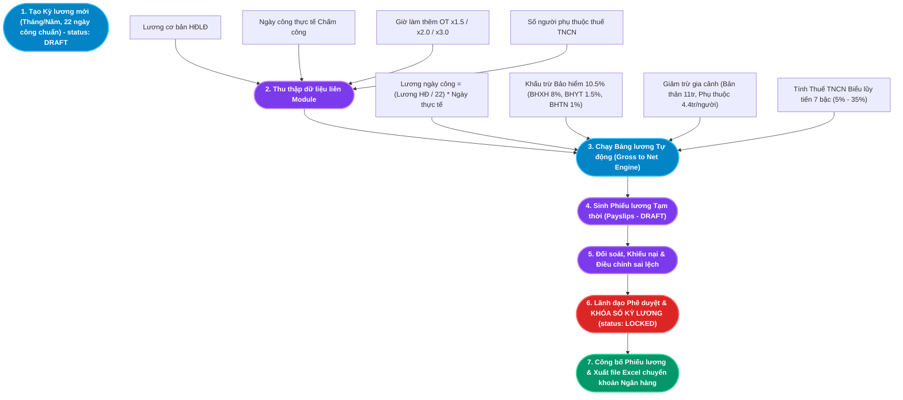

# TÀI LIỆU PHÂN TÍCH NGHIỆP VỤ - MODULE TIỀN LƯƠNG (PAYROLL)

## 1. Giới thiệu tổng quan Module
**Module Tiền lương (Payroll)** là "điểm hội tụ tài chính" tối hậu của toàn bộ hệ sinh thái HRM. Nơi đây tiếp nhận và tích hợp dữ liệu từ tất cả các phân hệ vệ tinh:
- **Module Tổ chức (Organization)**: Cung cấp sơ đồ cơ cấu phòng ban và cấp bậc chức danh.
- **Module Quản lý Nhân sự (Core HR)**: Cung cấp Mức lương cơ bản (`baseSalary`) từ Hợp đồng lao động đang hiệu lực, thông tin Số tài khoản ngân hàng, Mã số thuế cá nhân và Số người phụ thuộc giảm trừ gia cảnh.
- **Module Chấm công (Time & Attendance)**: Cung cấp tổng Số ngày công đi làm thực tế (`actualWorkingDays`) trong tháng để tính lương thời gian.
- **Module Nghỉ phép & OT (Leave & Overtime)**: Cung cấp số ngày nghỉ không lương (`UNPAID`) để giảm trừ công, và số giờ làm thêm thực tế (`actualHours`) kèm hệ số nhân (x1.5, x2.0, x3.0).

Module Tiền lương tự động hóa 100% quy trình tính toán Gross to Net, tự động trích nộp các khoản bảo hiểm bắt buộc theo luật định (10.5%), khấu trừ thuế TNCN theo Biểu thuế lũy tiến từng phần 7 bậc và xuất phiếu lương điện tử bảo mật đến từng nhân viên.

### Đối tượng sử dụng (Actors):
1. **Chuyên viên C&B (Compensation & Benefits Specialist)**: Thiết lập kỳ tính lương, kích hoạt tiến trình chạy bảng lương tự động, kiểm tra các khoản bất thường và xuất bảng lương gửi ngân hàng.
2. **Kế toán trưởng / Kế toán thanh toán (Accountant)**: Thẩm định bảng lương tổng hợp, đối chiếu với tài khoản tiền gửi doanh nghiệp và thực hiện lệnh chi trả lương.
3. **Giám đốc điều hành (CEO / General Director)**: Phê duyệt bảng lương chính thức và ký quyết định "Khóa sổ Kỳ lương (Lock Payroll Period)".
4. **Nhân viên (Employee)**: Tra cứu bảng kê chi tiết thu nhập, tiền thuế, tiền bảo hiểm và lương thực lĩnh qua Phiếu lương cá nhân (Payslip Self-Service).

---

## 2. Kiến trúc Luồng Dữ liệu Tính lương Gross to Net (Payroll Architecture)

---

## 3. Ma trận Phân rã Chức năng Chi tiết (Functional Breakdown Matrix)

Hệ thống Tiền lương (Payroll) bao gồm **2 nhóm chức năng trụ cột** với tổng cộng **10 Use Case con (Sub-Use Cases)** được chuẩn hóa toàn diện:

| Nhóm chức năng (Epic) | Mã Use Case | Tên Chức năng Con (Sub-Use Case) | Actor chính | Endpoint Backend |
|---|---|---|---|---|
| **1. Tính toán Bảng lương** *(Payroll Calculation)* | `UC-PAY-01-01` | Thiết lập & Quản lý Kỳ lương (Create Payroll Period) | Chuyên viên C&B | Form Kỳ lương (`22 ngày`) |
| | `UC-PAY-01-02` | Chạy Tổng hợp Bảng tính lương tự động (Generate) | Chuyên viên C&B | `POST /api/payroll/generate` |
| | `UC-PAY-01-03` | Tính toán Khấu trừ Bảo hiểm Xã hội bắt buộc (10.5%) | Hệ thống Backend | Thuật toán trích nộp bảo hiểm |
| | `UC-PAY-01-04` | Tính toán Thuế Thu nhập Cá nhân Lũy tiến (PIT Engine) | Hệ thống Backend | Biểu thuế 7 bậc Bộ Tài chính |
| | `UC-PAY-01-05` | Phê duyệt & Khóa sổ Kỳ lương (Lock & Finalize) | Giám đốc / C&B | `PUT /api/payroll/:id/status` (LOCKED) |
| **2. Quản lý Phiếu lương** *(Payslip Distribution)* | `UC-PAY-02-01` | Tra cứu & Bảo mật Phiếu lương cá nhân (Self-Service) | Toàn bộ Nhân viên | `GET /api/payroll/employee/:id` |
| | `UC-PAY-02-02` | Xem Chi tiết Bảng kê Thu nhập & Khấu trừ | Toàn bộ Nhân viên | Modal Chi tiết Phiếu lương |
| | `UC-PAY-02-03` | Xuất Bảng lương tổng hợp ra Excel/CSV | C&B / Kế toán | Tạo file `Bang_Luong.xlsx` |
| | `UC-PAY-02-04` | Xuất Phiếu lương định dạng PDF (Export PDF) | Toàn bộ Nhân viên | Template in PDF A4 chuẩn |
| | `UC-PAY-02-05` | Tiếp nhận Khiếu nại & Bổ sung Truy lĩnh/Truy thu | Nhân viên / C&B | Quy trình giải quyết khiếu nại |

---

## 4. Danh mục Hồ sơ Phân tích Chi tiết (Detailed Specifications)

Vui lòng tham khảo tài liệu đặc tả chi tiết của từng chức năng con tại các liên kết dưới đây:

1. [Đặc tả Chức năng Thiết lập Kỳ lương và Chạy Bảng lương Gross to Net](file:///c:/Users/truclh/Desktop/HRM-ĐATN/docs/Tài%20liệu%20phân%20tích%20nghiệp%20vụ%20từng%20module/Module%20Tiền%20lương/Chuc-nang-Tinh-Luong.md)
   - Đặc tả 5 Use Case con: Thiết lập kỳ lương mới theo tháng/năm, Chạy tổng hợp bảng lương tự động gom dữ liệu liên module, Tính trừ bảo hiểm bắt buộc 10.5%, Tính thuế TNCN biểu lũy tiến từng phần 7 bậc, Phê duyệt và kích hoạt cơ chế khóa sổ (Strict Lockout - Chặn Re-run).
   - Sơ đồ tuần tự và 6 kịch bản kiểm thử mẫu.

2. [Đặc tả Chức năng Quản lý Phiếu lương và Phân phối Thu nhập](file:///c:/Users/truclh/Desktop/HRM-ĐATN/docs/Tài%20liệu%20phân%20tích%20nghiệp%20vụ%20từng%20module/Module%20Tiền%20lương/Chuc-nang-Phieu-Luong.md)
   - Đặc tả 5 Use Case con: Tra cứu phiếu lương cá nhân bảo mật (chặn tuyệt đối xem chéo lương), Xem chi tiết bảng kê 3 phần (Thu nhập, Khấu trừ, Lương Net), Xuất bảng lương tổng hợp ra file Excel cho ngân hàng chuyển khoản, Tải phiếu lương file PDF có dấu điện tử, Tiếp nhận khiếu nại lương và kết chuyển truy lĩnh/truy thu sang kỳ lương sau.
   - Sơ đồ tuần tự và 5 kịch bản kiểm thử mẫu.

---

## 5. Điểm nhấn Kỹ thuật & Nghiệp vụ (Key Business Highlights)

1. **Cơ chế Khóa sổ Bất biến (Strict Re-run Lockout Rule)**:
   - Khi kỳ lương còn ở trạng thái `DRAFT`, chuyên viên C&B có thể thoải mái điều chỉnh dữ liệu và chạy lại (Re-run) nhiều lần.
   - Tuy nhiên, ngay khi Giám đốc bấm "Khóa sổ Kỳ lương" (`status = 'LOCKED'`), hệ thống lập tức khóa vĩnh viễn quyền tính toán lại. Bất kỳ request tính lương nào gửi lên API đều bị từ chối `HTTP 400`. Điều này bảo vệ số liệu kế toán và chứng từ thuế khỏi bị xáo trộn.

2. **Công thức Quy chuẩn Gross to Net Tự động**:
   - Tiền lương thực nhận được tính toán tự động qua chuỗi công thức chuẩn mực:
     $$\text{Lương ngày} = \frac{\text{Lương cơ bản}}{\text{Ngày công chuẩn (22)}}$$
     $$\text{Lương thực tế} = \text{Lương ngày} \times \text{Ngày công chấm công}$$
     $$\text{Lương gộp (Gross)} = \text{Lương thực tế} + \text{Tiền OT} + \text{Phụ cấp}$$
     $$\text{Lương Net} = \text{Gross} - \text{BHXH (10.5\%)} - \text{Thuế TNCN (7 bậc)}$$

3. **Bảo mật Dữ liệu Thu nhập Cá nhân Tuyệt đối (Data Confidentiality)**:
   - Thu nhập là thông tin nhạy cảm bậc nhất (PII). API Phiếu lương được kiểm soát phân quyền 2 lớp:
     - Lớp 1 (Token Authentication): Xác thực danh tính người gọi API.
     - Lớp 2 (Resource-level Authorization): So khớp `employeeId` của token với chủ sở hữu phiếu lương. Nhân viên chỉ truy cập được duy nhất phiếu lương của mình, hoàn toàn không thể xem trộm lương của đồng nghiệp.
