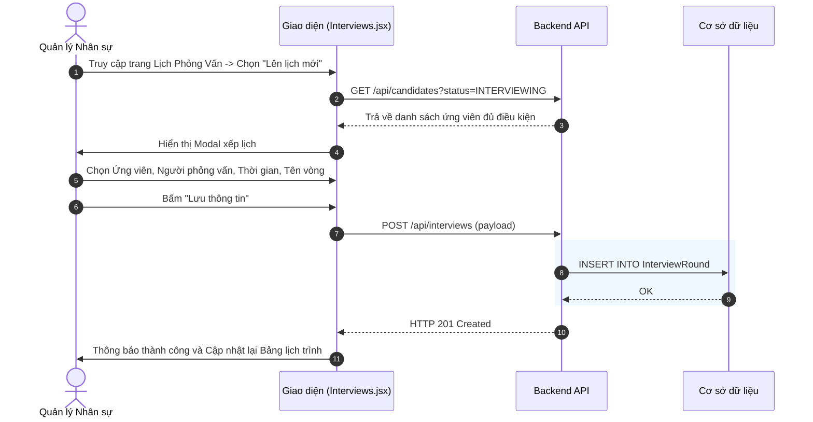
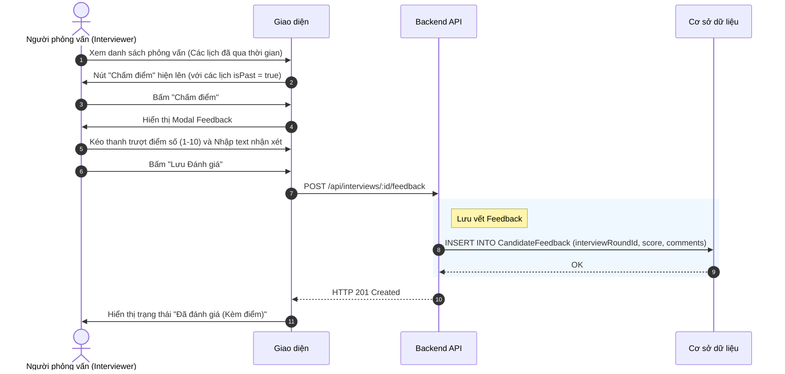

# Đặc tả chức năng: Quản lý Lịch Phỏng vấn và Đánh giá

## 1. Giới thiệu chức năng
Số hóa toàn bộ quá trình giao tiếp giữa Chuyên viên tuyển dụng (Người điều phối) và Người phỏng vấn chuyên môn (Interviewer). Lưu vết lịch sử nhận xét và điểm số của từng ứng viên làm căn cứ ra quyết định nhận việc.

## 2. Các quy tắc nghiệp vụ cốt lõi
- **Ràng buộc đối tượng:** Khung danh sách chọn ứng viên để Lên lịch phỏng vấn chỉ hiển thị những người đang nằm ở trạng thái `INTERVIEWING` trên bảng Kanban.
- **Workflow Đánh giá (Feedback):** Chức năng "Chấm điểm" chỉ được phép hiển thị sau khi thời gian `scheduledAt` (Mốc diễn ra phỏng vấn) đã qua đi trong quá khứ. Nếu chưa tới giờ, chỉ hiển thị trạng thái "Chưa diễn ra".
- **Lưu vết 1 lần:** Sau khi Người phỏng vấn nộp Đánh giá (Feedback), hệ thống sẽ lưu lại và không cho phép chỉnh sửa để đảm bảo tính minh bạch.

## 3. Sơ đồ luồng chi tiết (Sequence Diagrams)

### 3.1. Luồng Lên lịch phỏng vấn
Tạo lịch hẹn và chỉ định người phỏng vấn.

### 3.2. Luồng Đánh giá ứng viên sau phỏng vấn (Feedback)
Cho phép người phỏng vấn nhập điểm số và bình luận chi tiết.

