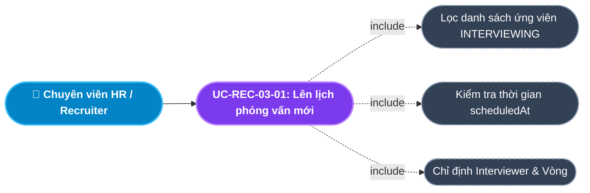
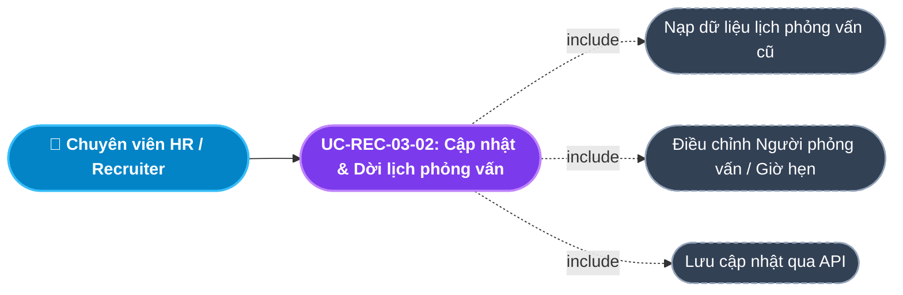
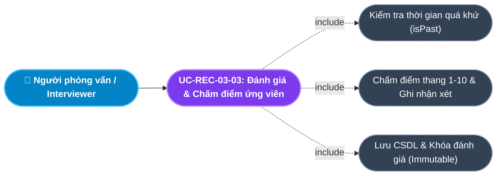
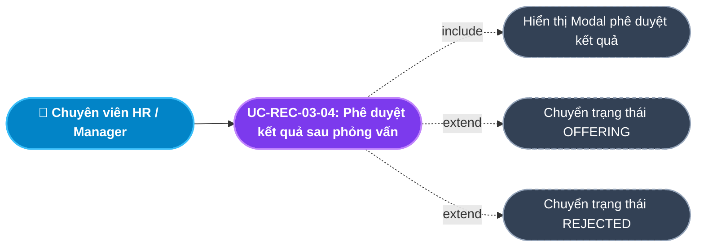
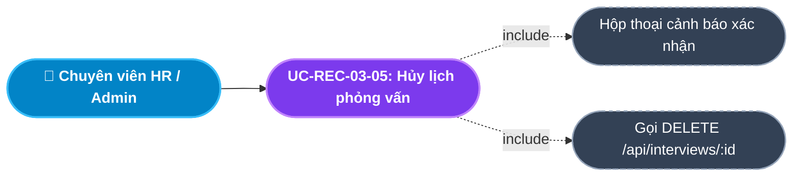
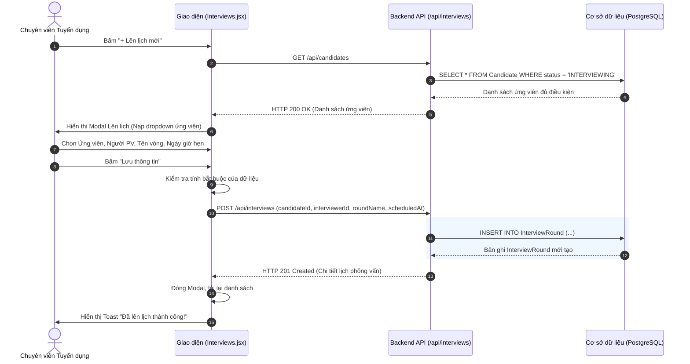
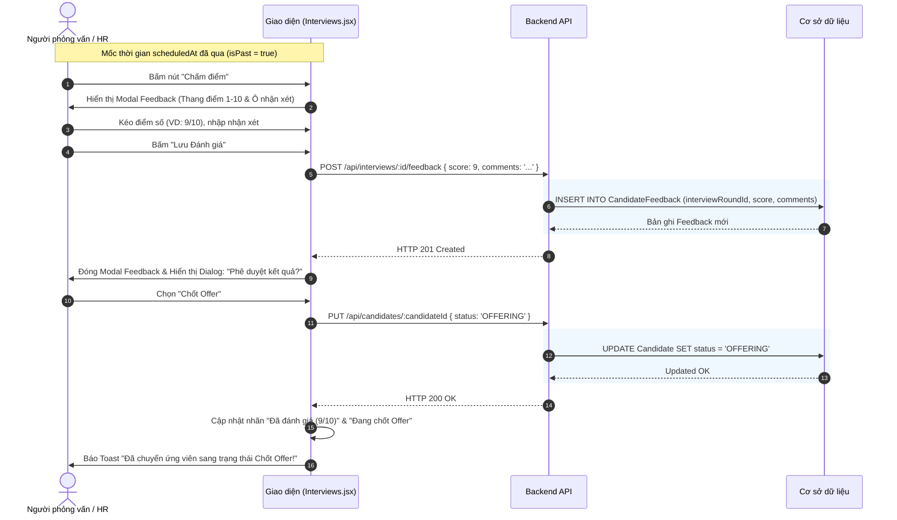

# Usecase: UC-REC-03 - Quản lý Lịch Phỏng vấn và Đánh giá (Interview & Feedback Management)

## 1. Giới thiệu chức năng
- **Mục đích**: Số hóa toàn bộ quá trình giao tiếp, xếp lịch và điều phối giữa Chuyên viên Tuyển dụng (HR/Recruiter) và Người phỏng vấn chuyên môn (Interviewer/Manager). Cung cấp cơ chế chấm điểm định lượng (1-10) và lưu vết nhận xét định tính (Feedback) làm căn cứ duy nhất, minh bạch để ra quyết định Chốt Offer hoặc Loại ứng viên.
- **Actor (Tác nhân)**: Chuyên viên Tuyển dụng (Recruiter), Người phỏng vấn chuyên môn (Interviewer/Line Manager), Trưởng phòng Nhân sự (HR Manager), Quản trị viên (Admin).
- **Điều kiện tiên quyết**: Người dùng đã đăng nhập và được phân quyền thuộc vai trò `RECRUITER`, `HR_MANAGER` hoặc `ADMIN`.

### Danh mục các chức năng con (Sub-features):
1. **UC-REC-03-01: Lên lịch phỏng vấn mới (Schedule Interview)**: Tạo buổi phỏng vấn cho ứng viên đang ở vòng `INTERVIEWING`, chỉ định người phỏng vấn và thời gian hẹn.
2. **UC-REC-03-02: Cập nhật & Dời lịch phỏng vấn (Reschedule / Update Interview)**: Thay đổi mốc thời gian, người phỏng vấn hoặc tên vòng thi cho lịch hẹn hiện có.
3. **UC-REC-03-03: Đánh giá & Chấm điểm ứng viên sau phỏng vấn (Submit Feedback & Score)**: Người phỏng vấn nhập điểm số (thang 1-10) và bình luận chi tiết sau khi buổi phỏng vấn diễn ra.
4. **UC-REC-03-04: Phê duyệt kết quả sau phỏng vấn - Chốt Offer / Loại (Approve / Transition Post-Interview)**: Quyết định chuyển thẳng ứng viên sang vòng Chốt Offer (`OFFERING`) hoặc Loại (`REJECTED`).
5. **UC-REC-03-05: Hủy lịch phỏng vấn (Cancel / Delete Interview Round)**: Hủy bỏ lịch hẹn phỏng vấn không còn hiệu lực.

---

## 2. Dữ liệu nghiệp vụ đầu vào (Input Data & Parameters)

### 2.1. Biểu mẫu Lên lịch phỏng vấn (Interview Schedule Form)
| Tên trường | Kiểu dữ liệu | Tính chất | Ý nghĩa nghiệp vụ & Ràng buộc |
|---|---|---|---|
| `Ứng viên` (candidateId) | UUID / Chuỗi | Bắt buộc | Chọn từ danh sách ứng viên đang nằm ở trạng thái `INTERVIEWING` trên ATS. |
| `Người phỏng vấn` (interviewerId) | Chuỗi (String) | Bắt buộc | Tên hoặc Mã của chuyên gia/quản lý chuyên môn phụ trách phỏng vấn. |
| `Tên vòng phỏng vấn` (roundName) | Chuỗi (String) | Bắt buộc | Tên vòng: "Phỏng vấn Nhân sự", "Phỏng vấn Kỹ thuật", "Phỏng vấn Văn hóa / Giám đốc". |
| `Thời gian phỏng vấn` (scheduledAt) | DateTime | Bắt buộc | Mốc thời gian diễn ra phỏng vấn (Định dạng ISO `YYYY-MM-DDTHH:mm`). |

### 2.2. Biểu mẫu Đánh giá ứng viên (Candidate Feedback Form)
| Tên trường | Kiểu dữ liệu | Tính chất | Ý nghĩa nghiệp vụ & Ràng buộc |
|---|---|---|---|
| `Mã vòng phỏng vấn` (interviewRoundId) | UUID / Chuỗi | Bắt buộc | ID của buổi phỏng vấn tương ứng. |
| `Thang điểm đánh giá` (score) | Số nguyên (Integer) | Bắt buộc | Điểm số đánh giá từ `1` (Rất kém) đến `10` (Xuất sắc). Mặc định là `5`. |
| `Nhận xét / Đánh giá chi tiết` (comments) | Văn bản (Text) | Bắt buộc | Nhận xét chuyên môn, kỹ năng mềm, thái độ và đề xuất tuyển dụng. |

---

## 3. Quy tắc nghiệp vụ (Business Rules)

| Mã Quy tắc | Tình huống nghiệp vụ | Cách hệ thống xử lý | Thông báo hiển thị |
|---|---|---|---|
| **BR-REC-03-01** | **Ràng buộc đối tượng lên lịch**: Chọn ứng viên từ danh sách. | Chỉ hiển thị và cho phép chọn những ứng viên đang có trạng thái `INTERVIEWING`. Ứng viên ở các trạng thái khác (`SOURCED`, `SCREENING`, `OFFERING`, `HIRED`, `REJECTED`) bị ẩn khỏi dropdown. | "Chỉ ứng viên ở trạng thái Phỏng vấn mới được lên lịch!" |
| **BR-REC-03-02** | **Ràng buộc thời gian đánh giá (Feedback Lock)**: Người phỏng vấn mở form Chấm điểm. | Nút "Chấm điểm" chỉ khả dụng khi mốc thời gian `scheduledAt` đã qua đi trong quá khứ (`isPast = true`). Nếu chưa đến giờ hẹn, hệ thống khóa nút và hiển thị nhãn "Chưa diễn ra". | "Buổi phỏng vấn chưa diễn ra, không thể nhập đánh giá!" |
| **BR-REC-03-03** | **Lưu vết đánh giá 1 lần (Feedback Immutability)**: Ứng viên đã có kết quả đánh giá (`feedbacks.length > 0`). | Hệ thống chuyển sang trạng thái "Đã đánh giá (Kèm điểm)", ẩn form nhập mới nhằm chống gian lận và sửa đổi kết quả phỏng vấn tùy tiện. | "Buổi phỏng vấn đã được ghi nhận đánh giá!" |
| **BR-REC-03-04** | **Phê duyệt nhanh sau đánh giá**: Sau khi lưu Feedback thành công. | Hệ thống lập tức hiển thị Popup hành động nhanh (SweetAlert): "Chốt Offer", "Từ chối" hoặc "Để sau". Nếu chọn, tự động gọi API cập nhật trạng thái ứng viên tương ứng. | "Bạn có muốn quyết định ngay kết quả của ứng viên này không?" |
| **BR-REC-03-05** | **Ràng buộc hủy lịch phỏng vấn**: Người dùng chọn xóa lịch phỏng vấn. | Cho phép hủy lịch nếu buổi phỏng vấn chưa diễn ra hoặc chưa có bản ghi Feedback. Yêu cầu hộp thoại xác nhận trước khi xóa vĩnh viễn khỏi CSDL. | "Bạn có chắc muốn hủy lịch phỏng vấn này?" |

---

## 4. Đặc tả chi tiết các Use Case chức năng con (Sub-Use Cases Specification)

---

### 4.1. UC-REC-03-01: Lên lịch phỏng vấn mới (Schedule Interview)

#### Sơ đồ Use Case:

#### Bảng đặc tả nghiệp vụ:

| STT | Hạng mục | Nội dung chi tiết |
|:---:|---|---|
| **1** | **Thông tin chung** | - **UC ID**: `UC-REC-03-01` - **UC Name**: Lên lịch phỏng vấn mới (Schedule Interview) - **Actor**: Chuyên viên Tuyển dụng (Recruiter), Quản lý Nhân sự - **Mục tiêu**: Thiết lập lịch hẹn phỏng vấn cho ứng viên đủ điều kiện và phân công người phỏng vấn phụ trách. - **Mô tả**: Người dùng chọn ứng viên từ danh sách chờ, điền thông tin người phỏng vấn, tên vòng thi và ngày giờ hẹn. - **Priority**: High (Bắt buộc) |
| **2** | **Trigger** | Người dùng nhấn nút **"+ Lên lịch mới"** trên màn hình Lịch Phỏng Vấn (`/internal/recruitment/interviews`). |
| **3** | **Pre-condition** | 1. Đã đăng nhập vào hệ thống với quyền HR/Recruiter. 2. Có ít nhất 01 ứng viên đang ở trạng thái `INTERVIEWING` trên bảng ATS. |
| **4** | **Post-condition** | 1. Bản ghi `InterviewRound` mới được tạo thành công trong CSDL. 2. Lịch phỏng vấn mới hiển thị trên bảng danh sách, sắp xếp theo thời gian tăng dần. 3. Ghi nhận log hệ thống. |
| **5** | **Main Flow** | 1. Người dùng nhấn nút **"+ Lên lịch mới"**. 2. Hệ thống hiển thị Modal Form *Lên lịch phỏng vấn* ở chế độ thêm mới (`modalMode = 'add'`). 3. Dropdown ứng viên tự động lọc chỉ hiển thị các ứng viên có `status = 'INTERVIEWING'`. 4. Người dùng chọn Ứng viên, nhập Tên người phỏng vấn, Tên vòng phỏng vấn và Ngày giờ hẹn. 5. Người dùng nhấn nút **"Lưu thông tin"**. 6. Giao diện kiểm tra dữ liệu bắt buộc (`candidateId`, `interviewerId`, `scheduledAt`). 7. Hệ thống gửi request `POST /api/interviews` với payload tương ứng. 8. Backend tạo bản ghi và trả về `HTTP 201 Created`. 9. Giao diện hiển thị Toast thành công *"Đã lên lịch thành công!"*, đóng Modal và tải lại danh sách. |
| **6** | **Alternative / Exception Flow** | - **AF-01 (Chưa có ứng viên phỏng vấn)**: Không có ứng viên nào ở trạng thái `INTERVIEWING` $\rightarrow$ Dropdown thông báo *"Chưa có ứng viên ở vòng phỏng vấn"*, hướng dẫn HR kéo ứng viên trên bảng ATS trước. - **EF-01 (Bỏ trống trường bắt buộc)**: Người dùng để trống một trong các trường $\rightarrow$ Hệ thống báo lỗi Toast: *"Vui lòng điền đầy đủ thông tin"*, chặn gửi request. |
| **7** | **Business Rules & Validation** | - `candidateId`: Bắt buộc, phải tồn tại trong CSDL và có status `INTERVIEWING` (BR-REC-03-01). - `interviewerId`: Bắt buộc, không để trống. - `roundName`: Bắt buộc, chuỗi từ 3 - 100 ký tự. - `scheduledAt`: Bắt buộc, mốc thời gian hợp lệ. |
| **8** | **Acceptance Criteria** | - **AC-01**: Form chỉ hiển thị đúng các ứng viên ở trạng thái INTERVIEWING. - **AC-02**: Để trống bất kỳ trường nào đều bị chặn và hiển thị thông báo lỗi rõ ràng. - **AC-03**: Lưu thành công hiển thị ngay trên bảng kèm giờ hẹn định dạng chuẩn tiếng Việt. |

---

### 4.2. UC-REC-03-02: Cập nhật & Dời lịch phỏng vấn (Reschedule / Update Interview)

#### Sơ đồ Use Case:

#### Bảng đặc tả nghiệp vụ:

| STT | Hạng mục | Nội dung chi tiết |
|:---:|---|---|
| **1** | **Thông tin chung** | - **UC ID**: `UC-REC-03-02` - **UC Name**: Cập nhật & Dời lịch phỏng vấn (Reschedule / Update Interview) - **Actor**: Chuyên viên Tuyển dụng (Recruiter), Quản lý Nhân sự - **Mục tiêu**: Điều chỉnh thông tin buổi phỏng vấn khi có phát sinh thay đổi (Interviewer bận, ứng viên xin dời lịch). - **Mô tả**: Cho phép chỉnh sửa Người phỏng vấn, Tên vòng và Mốc thời gian diễn ra phỏng vấn. - **Priority**: Medium |
| **2** | **Trigger** | Người dùng nhấn nút biểu tượng chiếc bút **(Sửa)** tại dòng lịch phỏng vấn tương ứng trên bảng. |
| **3** | **Pre-condition** | Buổi phỏng vấn đã tồn tại và chưa bị hủy. |
| **4** | **Post-condition** | 1. Dữ liệu bản ghi `InterviewRound` được cập nhật trong CSDL. 2. Giao diện cập nhật lại mốc thời gian và thông tin người phỏng vấn mới nhất. |
| **5** | **Main Flow** | 1. Người dùng bấm icon **Sửa** tại hàng lịch phỏng vấn cần thay đổi. 2. Hệ thống mở Modal Form ở chế độ cập nhật (`modalMode = 'edit'`), tự động điền sẵn dữ liệu hiện tại. 3. Người dùng thay đổi Người phỏng vấn, Tên vòng hoặc Mốc thời gian `scheduledAt`. 4. Người dùng nhấn nút **"Cập nhật lịch"**. 5. Giao diện kiểm tra tính hợp lệ của dữ liệu. 6. Hệ thống gửi request `PUT /api/interviews/:id` với dữ liệu mới. 7. Backend cập nhật bản ghi và trả về dữ liệu mới kèm `HTTP 200 OK`. 8. Giao diện hiển thị Toast thông báo *"Đã cập nhật lịch!"*, đóng Modal và tải lại danh sách. |
| **6** | **Alternative / Exception Flow** | - **EF-01 (Mạng ngắt kết nối / Lỗi server)**: Request thất bại $\rightarrow$ Giao diện giữ nguyên dữ liệu trên form và báo Toast lỗi *"Lỗi khi cập nhật lịch"*. |
| **7** | **Business Rules & Validation** | - Trường ứng viên không được phép đổi sang ứng viên khác khi đang sửa. - Dữ liệu `scheduledAt` mới phải là định dạng thời gian hợp lệ. |
| **8** | **Acceptance Criteria** | - **AC-01**: Bấm Sửa nạp chính xác dữ liệu cũ vào các ô input. - **AC-02**: Đổi giờ hẹn và lưu thành công $\rightarrow$ Giờ hẹn mới được phản ánh ngay lập tức trên giao diện. |

---

### 4.3. UC-REC-03-03: Đánh giá & Chấm điểm ứng viên sau phỏng vấn (Submit Feedback & Score)

#### Sơ đồ Use Case:

#### Bảng đặc tả nghiệp vụ:

| STT | Hạng mục | Nội dung chi tiết |
|:---:|---|---|
| **1** | **Thông tin chung** | - **UC ID**: `UC-REC-03-03` - **UC Name**: Đánh giá & Chấm điểm ứng viên sau phỏng vấn (Submit Feedback & Score) - **Actor**: Người phỏng vấn chuyên môn (Interviewer), Quản lý Nhân sự - **Mục tiêu**: Ghi nhận nhận xét chuyên môn và điểm số định lượng cho ứng viên sau khi buổi phỏng vấn kết thúc. - **Mô tả**: Sau mốc thời gian hẹn, người phỏng vấn mở form đánh giá, kéo thanh điểm từ 1 đến 10 và viết nhận xét chi tiết. - **Priority**: High (Bắt buộc) |
| **2** | **Trigger** | Người phỏng vấn nhấn nút **"Chấm điểm"** (biểu tượng ngôi sao vàng) tại dòng lịch phỏng vấn đã qua giờ hẹn. |
| **3** | **Pre-condition** | 1. Lịch phỏng vấn có `scheduledAt` nhỏ hơn thời gian hiện tại (`isPast = true`). 2. Lịch phỏng vấn chưa từng có bản ghi Feedback trước đó (`hasFeedback = false`). |
| **4** | **Post-condition** | 1. Bản ghi `CandidateFeedback` mới được tạo trong CSDL liên kết với `interviewRoundId`. 2. Dòng phỏng vấn chuyển sang trạng thái "Đã đánh giá (Điểm/10)". 3. Kích hoạt Popup hỏi ý kiến phê duyệt chuyển trạng thái ứng viên (BR-REC-03-04). |
| **5** | **Main Flow** | 1. Người phỏng vấn truy cập trang Lịch phỏng vấn. 2. Tại lịch phỏng vấn đã đến/qua giờ hẹn, nút **"Chấm điểm"** hiển thị màu vàng. 3. Người dùng nhấn **"Chấm điểm"**. 4. Hệ thống mở Modal *Đánh giá Phỏng vấn* gồm thanh trượt điểm số (1-10) và khung văn bản nhận xét. 5. Người dùng kéo chọn điểm số (VD: 8/10) và nhập nhận xét chuyên môn. 6. Người dùng nhấn nút **"Lưu đánh giá"**. 7. Hệ thống gửi request `POST /api/interviews/:id/feedback` với payload `{ score, comments }`. 8. Backend lưu bản ghi `CandidateFeedback` và trả về `HTTP 201 Created`. 9. Giao diện đóng Modal Feedback, hiển thị Popup hỏi chuyển trạng thái ứng viên ngay (Chốt Offer / Từ chối / Để sau). |
| **6** | **Alternative / Exception Flow** | - **AF-01 (Chưa đến giờ phỏng vấn)**: Thời gian hiện tại chưa tới `scheduledAt` $\rightarrow$ Nút chấm điểm bị ẩn, hiển thị dòng chữ mờ *"Chưa diễn ra"* (BR-REC-03-02). - **AF-02 (Đã có đánh giá)**: Lịch đã được chấm điểm $\rightarrow$ Hiển thị nhãn xanh *"Đã đánh giá (X/10)"*, rê chuột xem được nội dung nhận xét chi tiết. - **EF-01 (Bỏ trống nhận xét)**: Chưa nhập nhận xét $\rightarrow$ Yêu cầu nhập ít nhất 5 ký tự để đảm bảo tính minh bạch. |
| **7** | **Business Rules & Validation** | - Điểm số `score`: Bắt buộc, là số nguyên từ `1` đến `10`. - `scheduledAt` phải nằm trong quá khứ so với thời điểm đánh giá. - Không cho phép cập nhật lại sau khi đã lưu Feedback (BR-REC-03-03). |
| **8** | **Acceptance Criteria** | - **AC-01**: Lịch chưa đến giờ không thể bấm chấm điểm. - **AC-02**: Nhập điểm và nhận xét lưu thành công $\rightarrow$ Hiển thị nhãn "Đã đánh giá (X/10)". - **AC-03**: Sau khi lưu thành công, Modal hỏi quyết định kết quả hiển thị tự động. |

---

### 4.4. UC-REC-03-04: Phê duyệt kết quả sau phỏng vấn - Chốt Offer / Loại (Approve / Transition Post-Interview)

#### Sơ đồ Use Case:

#### Bảng đặc tả nghiệp vụ:

| STT | Hạng mục | Nội dung chi tiết |
|:---:|---|---|
| **1** | **Thông tin chung** | - **UC ID**: `UC-REC-03-04` - **UC Name**: Phê duyệt kết quả sau phỏng vấn - Chốt Offer / Loại (Approve / Transition Post-Interview) - **Actor**: Chuyên viên Tuyển dụng (Recruiter), Trưởng phòng Nhân sự - **Mục tiêu**: Chuyển đổi trạng thái ứng viên ngay trên bảng Lịch phỏng vấn dựa trên kết quả đánh giá mà không cần quay lại màn hình ATS. - **Mô tả**: Cho phép người dùng chọn **"Chốt Offer"** (chuyển sang `OFFERING`) hoặc **"Từ chối"** (chuyển sang `REJECTED`). - **Priority**: High |
| **2** | **Trigger** | Người dùng bấm nút **"Phê duyệt kết quả"** cạnh nhãn đã đánh giá hoặc chọn trên Popup ngay sau khi hoàn tất nộp Feedback. |
| **3** | **Pre-condition** | 1. Buổi phỏng vấn đã được chấm điểm. 2. Ứng viên vẫn đang ở trạng thái `INTERVIEWING`. |
| **4** | **Post-condition** | 1. Trạng thái ứng viên (`Candidate.status`) trong CSDL được cập nhật thành `OFFERING` hoặc `REJECTED`. 2. Bảng Kanban ATS tự động chuyển thẻ của ứng viên sang cột tương ứng. 3. Dòng phỏng vấn cập nhật nhãn trạng thái mới ("Đang chốt Offer" hoặc "Đã từ chối"). |
| **5** | **Main Flow** | 1. Người dùng nhấn nút **"Phê duyệt kết quả"**. 2. Hệ thống hiển thị hộp thoại xác nhận (SweetAlert2) với các nút: **"Chốt Offer"**, **"Từ chối (Loại)"**, **"Để sau"**. 3. **Trường hợp chọn "Chốt Offer"**:    - Hệ thống gửi request `PUT /api/candidates/:candidateId` với payload `{ status: 'OFFERING' }`.    - Backend cập nhật trạng thái ứng viên.    - Giao diện báo Toast: *"Đã chuyển ứng viên sang trạng thái Chốt Offer!"*. 4. **Trường hợp chọn "Từ chối (Loại)"**:    - Hệ thống gửi request `PUT /api/candidates/:candidateId` với payload `{ status: 'REJECTED' }`.    - Backend cập nhật trạng thái ứng viên.    - Giao diện báo Toast: *"Đã chuyển ứng viên sang trạng thái Từ chối!"*. 5. Giao diện tải lại dữ liệu và hiển thị nhãn trạng thái mới của ứng viên. |
| **6** | **Alternative / Exception Flow** | - **AF-01 (Người dùng chọn 'Để sau')**: Hộp thoại đóng lại, ứng viên tiếp tục giữ trạng thái `INTERVIEWING` để chờ họp xét thêm. |
| **7** | **Business Rules & Validation** | - Chỉ khả dụng khi ứng viên còn ở trạng thái `INTERVIEWING`. Nếu ứng viên đã được chuyển sang `OFFERING`, `HIRED` hoặc `REJECTED` thì ẩn nút phê duyệt. |
| **8** | **Acceptance Criteria** | - **AC-01**: Bấm "Chốt Offer" chuyển thành công ứng viên sang OFFERING và thẻ xuất hiện ở cột Đề nghị nhận việc trên bảng ATS. - **AC-02**: Bấm "Từ chối" chuyển ứng viên sang REJECTED. - **AC-03**: Nhãn trạng thái trên bảng Lịch phỏng vấn cập nhật ngay tương ứng. |

---

### 4.5. UC-REC-03-05: Hủy lịch phỏng vấn (Cancel / Delete Interview Round)

#### Sơ đồ Use Case:

#### Bảng đặc tả nghiệp vụ:

| STT | Hạng mục | Nội dung chi tiết |
|:---:|---|---|
| **1** | **Thông tin chung** | - **UC ID**: `UC-REC-03-05` - **UC Name**: Hủy lịch phỏng vấn (Cancel / Delete Interview Round) - **Actor**: Chuyên viên Tuyển dụng (Recruiter), Quản lý Nhân sự, Admin - **Mục tiêu**: Hủy bỏ buổi phỏng vấn đã lên lịch do ứng viên rút hồ sơ hoặc lý do bất khả kháng. - **Mô tả**: Xóa bản ghi lịch phỏng vấn khỏi hệ thống sau khi đã qua bước xác nhận cảnh báo. - **Priority**: Low |
| **2** | **Trigger** | Người dùng nhấn nút biểu tượng thùng rác màu đỏ **(Xóa)** tại dòng lịch phỏng vấn trên bảng. |
| **3** | **Pre-condition** | Người dùng có quyền quản lý tuyển dụng. |
| **4** | **Post-condition** | 1. Bản ghi `InterviewRound` bị xóa khỏi CSDL. 2. Dòng phỏng vấn biến mất khỏi giao diện bảng. 3. Ứng viên vẫn giữ nguyên trạng thái hồ sơ trên ATS. |
| **5** | **Main Flow** | 1. Người dùng nhấn icon **Thùng rác** tại dòng lịch cần xóa. 2. Hệ thống hiển thị hộp thoại cảnh báo (SweetAlert2): *"Bạn có chắc muốn hủy lịch phỏng vấn này?"* kèm hai nút "Hủy lịch" và "Không". 3. Người dùng chọn **"Hủy lịch"**. 4. Giao diện gửi request `DELETE /api/interviews/:id`. 5. Backend xóa bản ghi và trả về `HTTP 200 OK`. 6. Giao diện hiển thị Toast: *"Đã hủy lịch phỏng vấn"*, đồng thời nạp lại bảng dữ liệu. |
| **6** | **Alternative / Exception Flow** | - **AF-01 (Người dùng chọn 'Không')**: Hộp thoại đóng lại, không có thao tác xóa nào được thực hiện. |
| **7** | **Business Rules & Validation** | - Hủy lịch phỏng vấn không làm thay đổi trạng thái của ứng viên trong hệ thống ATS. |
| **8** | **Acceptance Criteria** | - **AC-01**: Bắt buộc phải có hộp thoại cảnh báo trước khi hủy. - **AC-02**: Hủy thành công bản ghi lập tức biến mất khỏi danh sách. |

---

## 5. Sơ đồ tuần tự nghiệp vụ (Sequence Diagrams)

### 5.1. Luồng Lên lịch phỏng vấn mới (UC-REC-03-01)

### 5.2. Luồng Chấm điểm Feedback và Phê duyệt Kết quả (UC-REC-03-03 & 04)

---

## 6. Ma trận kịch bản kiểm thử (Test Scenarios & Acceptance Matrix)

| Mã kịch bản | Use Case liên quan | Điều kiện kiểm thử | Các bước thực hiện | Kết quả mong đợi (Expected Outcome) | Đánh giá |
|---|---|---|---|---|:---:|
| **TC-REC-03-01** | UC-REC-03-01 | Lên lịch thành công | Chọn ứng viên ở cột INTERVIEWING, nhập đầy đủ thông tin hợp lệ $\rightarrow$ Bấm Lưu | Tạo lịch thành công, hiển thị đúng giờ và tên ứng viên trên bảng. | **Pass** |
| **TC-REC-03-02** | UC-REC-03-01 | Kiểm tra validation | Để trống trường Người phỏng vấn hoặc Ngày giờ $\rightarrow$ Bấm Lưu | Báo lỗi Toast *"Vui lòng điền đầy đủ thông tin"*, không gửi API. | **Pass** |
| **TC-REC-03-03** | UC-REC-03-03 | Kiểm tra khóa đánh giá sớm | Lịch phỏng vấn có giờ hẹn ở tương lai (`isPast = false`) | Nút "Chấm điểm" bị ẩn, hiển thị dòng chữ mờ *"Chưa diễn ra"*. | **Pass** |
| **TC-REC-03-04** | UC-REC-03-03 | Chấm điểm hợp lệ | Lịch đã qua giờ hẹn $\rightarrow$ Bấm Chấm điểm $\rightarrow$ Chọn 8/10 $\rightarrow$ Nhập nhận xét $\rightarrow$ Lưu | Lưu thành công, hiển thị nhãn xanh *"Đã đánh giá (8/10)"*. | **Pass** |
| **TC-REC-03-05** | UC-REC-03-04 | Chuyển trạng thái sang Offer | Sau khi chấm điểm, bấm "Chốt Offer" trên popup | Trạng thái ứng viên đổi thành `OFFERING`, xuất hiện trên màn hình Quản lý Offer. | **Pass** |
| **TC-REC-03-06** | UC-REC-03-05 | Xác nhận trước khi hủy lịch | Bấm icon Thùng rác tại một dòng lịch hẹn | Hiển thị SweetAlert cảnh báo, bấm "Hủy lịch" mới xóa khỏi CSDL. | **Pass** |
